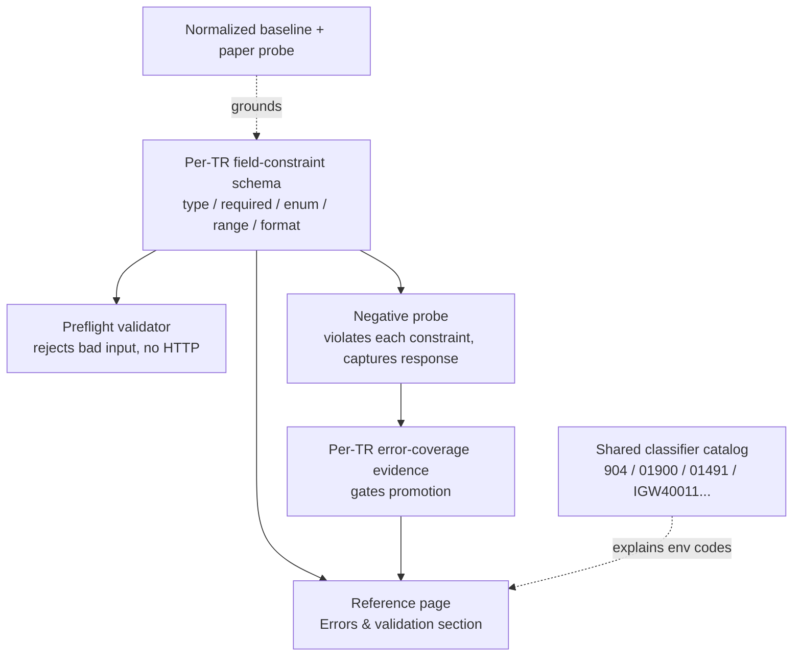
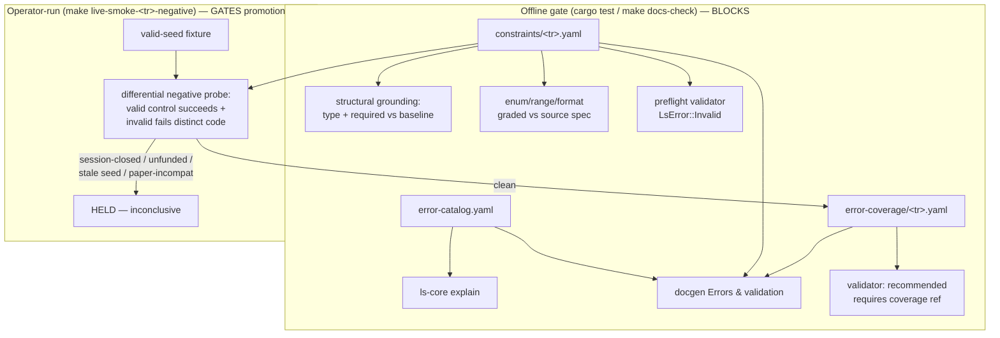

# Recommended Error-Resilience Gate - Plan

## Goal Capsule

- **Objective:** Redefine the Implemented → Recommended transition so a TR earns Recommended only after proving it fails gracefully — invalid input is caught with a clear reason before the network call, and every reachable gateway error is explained.
- **Product authority:** Repo maintainer (`sunkeunchoi`). Product decisions in this contract are confirmed.
- **Open blockers:** None blocking planning. The extensible input-class taxonomy (R7) is affirmed. Schema representation, evidence-file location, and probe/baseline reconciliation are deferred to planning (see Outstanding Questions).

---

## Product Contract

### Summary

Recommended stops meaning "the happy path works" and starts meaning "this call fails gracefully." A declarative per-TR field-constraint schema in metadata becomes the single source that generates a preflight validator, generates a negative probe, and projects a user-facing "Errors & validation" section onto the Reference page. Environment and entitlement errors are explained once in a shared catalog rather than reproduced per TR. On ship, the 10 currently-Recommended TRs demote to Implemented until re-certified through the new gate.

### Problem Frame

Today the Implemented → Recommended gate certifies only the sunny day. Promotion requires one *green* Paper Live Smoke (`00000`/`00136`/`00707`), a Focused Evidence file, and a `recommendation:` block — all of which prove the TR works when fed *good* input. Nothing proves what happens on *bad* input.

The cost lands on SDK users. When a request is malformed they get a raw, confusing gateway failure with no indication that their input was the problem or why. The repo's own flip history is a catalog of discovering these one incident at a time — `IGW40011` (a numeric field quoted as a string), `01900` (paper-incompatible), `01491` (account not order-capable), `IGW40013/40014/50008`. Error classification exists but is scattered and partial (`is_paper_incompatible`, `is_paper_order_incapable`, `rsp_cd_is_success` in `crates/ls-core`), and no metadata anywhere records which errors a TR has been probed against or how it handles them. "Recommended" therefore over-promises: it is not a signal that a call is safe to build on.

### Key Decisions

- **The badge means graceful failure, not just success.** Recommended additionally requires the error-resilience gate. This is a new blocking gate layered on top of the existing happy-path smoke + evidence + recommendation block, not a replacement for them.
- **Preflight where knowable, explain where not.** Input-shaped errors the caller can fix by changing a field are caught locally before any network call; errors only the gateway can judge (session, entitlement, funding) are surfaced as typed, explained errors. Whichever catches it first wins.
- **A declarative constraint schema is the single source.** Rather than hand-authoring a negative smoke and validator per TR, each TR declares its request-field constraints once; the preflight validator, the negative probe, and the Reference documentation are all derived from that one declaration. This keeps "exhaustive across the surface" mechanical instead of a hand-authoring treadmill, and preserves the repo's "everything is a String + serde helper" model (constraints are a metadata sidecar, not new types).
- **Fully per-TR evidence, shared handling code.** Each TR carries its own error-coverage evidence — an airtight per-TR map — even though the handling code (the shared classifier catalog) is written once. The accepted cost is re-proving systemic codes on every TR.
- **One honest badge over a mixed one.** The 10 TRs promoted under the old gate demote to Implemented until re-certified, rather than being grandfathered, so Recommended carries a single consistent meaning.

### Requirements

**Gate semantics**

- R1. Promotion to `recommended` requires passing the error-resilience gate in addition to the existing green Paper Live Smoke, Focused Evidence file, and `recommendation:` block. The gate is a new blocking condition, not a replacement.
- R2. The gate is evaluated per TR. Its blocking scope is exactly the input-class taxonomy in R7 (an extensible set) — nothing outside that set blocks promotion.

**Declarative constraint schema**

- R3. Each TR carries a declarative field-constraint schema in metadata describing, per request field, the constraints that apply: type, required-ness, allowed enum set, value range, and format. This schema is the single source from which preflight validation, the negative probe, and the Reference section are derived.
- R4. Declared constraints must be grounded, not guessed, through three obligations graded by class. Type and required-ness are grounded against the normalized baseline and checked offline — this obligation blocks in the CI gate. Enum, range, and format are graded offline against the source spec (the normalized baseline carries no such data), not "confirmed against paper," because the gateway is not a per-field validator — value-class violations often return an identical code or an empty success rather than a per-class rejection. Behavioral confirmation runs only through the differential live probe in R10, which gates the operator-run promotion step, never the offline gate.
- R5. When a field has no constraint of a given input class, the schema marks that class N/A for that field explicitly, so exhaustiveness is auditable rather than inferred from silence.

**Preflight validation**

- R6. The SDK validates a request against its schema before any network call. On invalid input it returns a typed validation error that names the offending field and the reason, and makes no HTTP request. Preflight blocks only constraints whose accepted bound is positively confirmed (R10); when the bound is unconfirmed, the field defaults to permissive — the request proceeds and any rejection surfaces as an explained gateway error (R8) rather than a false local reject. The asymmetry is deliberate: a false-reject silently breaks a caller's valid request with no detector, so blocking is the earned state, not the default.
- R7. The blocking input classes are an extensible starting set: wrong type, missing required field, invalid enum value, out-of-range value, malformed symbol/date, and cross-field/combination invalidity (fields individually valid but jointly rejected — e.g. start > end date, off-tick price/qty). The set is not closed; adding or removing a class is a change to this contract governed by the R2 process, not a per-TR choice.

**Explained gateway errors**

- R8. Every distinct gateway error code a TR's request can provoke maps to a typed, explained error carrying a human-readable reason, extending the shared classifier catalog rather than surfacing a raw code.
- R9. Environment and entitlement codes (session-closed `904`, paper-incompatible `01900`, account-not-order-capable `01491`, unfunded) are mapped once in the shared catalog with explanations and are not reproduced per TR.

**Negative probe and evidence**

- R10. A per-TR negative probe, derived from the schema by mechanically violating each declared constraint, captures the gateway's actual response for each invalid input class. The probe is differential: a valid control request must succeed and the invalid variant must fail with a distinct code in the same session, so the injected violation — not an environment condition — is what the response reflects. Each probeable TR declares a maintained valid-seed fixture (known-good symbol/date/account) subject to the freshness evaluator; a stale seed, session-closed, unfunded, or paper-incompatible outcome is HELD (inconclusive), distinct from a divergence. The probe gates the operator-run promotion step, not the offline gate, and its results are recorded as the per-TR error-coverage evidence.

**Documentation projection**

- R11. docgen projects a per-TR "Errors & validation" section onto the SDK Reference page from the same schema and evidence: the preflight rules, the reachable gateway codes, and each code's explanation. Evidence and user docs share one source.

**Migration**

- R12. On ship, the 10 currently-Recommended TRs (`token`, `t1101`, `t1102`, `t8412`, `S3_`, `CSPAQ12200`, `CSPAT00601`, `CSPAT00701`, `CSPAT00801`, `t0425`) demote to Implemented. Each re-promotes only after passing the new gate. The docgen Recommended list, the `banner_trs` list, and associated counts are updated to reflect the demotion.

### Source-of-truth fan-out

### Acceptance Examples

- AE1. **Covers R6, R7.** **Given** a TR whose schema declares `qty` as a positive number, **when** the caller submits `qty = -5`, **then** the SDK returns a typed validation error naming `qty` and the reason ("must be greater than 0") and makes no network request.
- AE2. **Covers R4, R10.** **Given** a TR whose schema declares an enum field accepts `{0,1,2}`, **when** the differential probe's valid control succeeds but paper accepts the injected `3` (or rejects a value the schema allowed), **then** the declared bound diverges from observed behavior and the operator-run promotion is HELD until reconciled. **When** the valid control itself fails (session-closed/unfunded/stale seed), **then** the probe is inconclusive and promotion is HELD, not failed.
- AE3. **Covers R5.** **Given** a TR with a free-text field that has no type/enum/range/format constraint, **when** the schema is authored, **then** each inapplicable input class is marked N/A for that field so the exhaustiveness audit passes without a silent gap.
- AE4. **Covers R8, R9.** **Given** a request that provokes `01900` on paper, **when** the SDK surfaces the result, **then** it is a typed, explained error drawn from the shared catalog — not a per-TR-reproduced code and not a raw `01900`.
- AE5. **Covers R1, R12.** **Given** `t1102` is Recommended under the old gate, **when** this change ships before `t1102` is re-certified, **then** `t1102` is Implemented (not Recommended) and its Reference page shows no recommendation until it passes the new gate.

### Scope Boundaries

**Deferred for later**

- Per-TR reproduction of environment/entitlement errors (`904`/`01900`/`01491`/funding). These are unsummonable on demand and unpreflightable; they are explained once in the shared catalog (R9), not probed per TR.

**Outside this product's identity**

- Rewriting the "everything is a String + serde helper" data model into validating newtypes (parse-don't-validate). Considered and rejected — it fights a deliberate repo convention and makes per-TR evidence indirect. Constraints stay a metadata sidecar over the existing String model.
- A shared-error-contract-only gate with no per-TR evidence. Rejected in favor of fully per-TR exhaustiveness.

### Dependencies / Assumptions

- The normalized baseline (`crates/ls-trackers/baselines/api-drift/normalized/trs/<tr>.json`) is the wire-shape source of truth that constraints are grounded against.
- `make raw-probe` (credential-safe; prints only http/rsp_cd/body_len) is the probing primitive the negative probe builds on.
- The shared classifier catalog extends the existing `crates/ls-core` functions (`is_paper_incompatible`, `is_paper_order_incapable`, `rsp_cd_is_success`) rather than replacing them.
- Flipping recommendation state moves docgen test literals (the `for rec in [...]` list and `banner_trs`) plus their counts; the demotion in R12 is assumed to be a coordinated docgen change, not silent.

### Outstanding Questions

**Resolve before planning**

- None. The product shape is confirmed; the taxonomy (R7) is affirmed as an extensible set governed by the R2 change process.

**Resolved in this plan** (see Key Technical Decisions)

- Constraint schema and error-coverage evidence live in new per-TR sibling files under `metadata/` (KTD1); the shared explanation catalog is a single committed data file consumed by both `ls-core` and docgen (KTD2).

**Deferred to implementation**

- Whether per-TR error-coverage evidence stales like Focused Evidence under the freshness evaluator, or carries its own cadence — decided when U6 wires the validator (the freshness evaluator is advisory, not gating, so this does not block).
- The exact source for offline enum/range/format grading (the OpenAPI raw capture vs a hand-authored spec sidecar), since the normalized baseline carries no such data — resolved in U2 against the actual capture contents.

### Sources / Research

- `.agents/skills/promote-tr/SKILL.md` — current promotion recipe (green smoke + evidence + recommendation block); no error-probing step exists.
- `crates/ls-core/src/inner.rs` — `is_paper_incompatible` (`01900`), `is_paper_order_incapable` (`01491`), `rsp_cd_is_success` (empty/`00000`/`00136`/`00707`).
- `crates/ls-metadata/src/schema.rs` — `TrMetadata` / `Recommendation` structs; no field for validation rules, error-code coverage, or negative-test evidence.
- `crates/ls-docgen/src/lib.rs` — the 10-entry Recommended `for rec in [...]` list and the `banner_trs` list that move on any recommendation flip.
- `docs/design/ls-gateway-response-semantics.md` — success-vs-business-error `rsp_cd` semantics.
- `docs/solutions/integration-issues/ls-gateway-igw40011-numeric-request-fields.md` — worked example of a systemic (type, not value) gateway error.
- `Makefile` (`raw-probe` target) — credential-safe probe primitive.
- `metadata/PROVISIONALITY-LEDGER.md` — precedent for a per-TR sidecar tracking what must be re-verified before a promotion.

---

## Planning Contract

**Product Contract preservation:** Product Contract unchanged by planning. (R4/R6/R7/R10/R2/AE2 were revised earlier during `ce-doc-review`, before enrichment; planning added no further product-scope changes.)

**Depth:** Deep — cross-cutting lifecycle change introducing a new metadata artifact class, a shared runtime catalog, a preflight validation layer, an operator-run probe, docgen projection, a new promotion-gate condition, and a migration of the existing Recommended set.

### Key Technical Decisions

- **KTD1 — Two new per-TR sibling artifacts under `metadata/`, not fields on the TR YAML.** The field-constraint schema lives in `metadata/constraints/<tr>.yaml` and the error-coverage evidence in `metadata/error-coverage/<tr>.yaml`, each referenced from `metadata/trs/<tr>.yaml` by path — mirroring the existing `metadata/evidence/<tr>.yaml` + `recommendation.evidence_ref` pattern (`crates/ls-metadata/src/schema.rs` `Recommendation`, validator `check_recommendation` at `validator.rs:292`). Rationale: keeps the TR YAML small, reuses the proven ref-and-cross-check plumbing, and lets docgen project from a dedicated artifact. **Threading:** docgen never reads arbitrary metadata files — `render_all(report)` sees only `ValidationReport { index, trs, evidence }`. So the validator must parse both new artifacts into new `ValidationReport` fields (mirroring the existing `evidence: BTreeMap` field), and `render_reference_docs` takes them as additional args; docgen projects from the report, not by re-reading files. (The catalog in KTD2 is the one exception — a direct embed/read, not per-TR.)
- **KTD2 — The error-explanation catalog is a single committed data file.** `metadata/error-catalog.yaml` maps each gateway `rsp_cd` / `IGW*` code to a human explanation; `ls-core` embeds it for runtime `explain`, and docgen reads the same file for the Reference projection. Rationale: one source, two audiences (the Product Contract's "Both" decision) with no build-time export step. **Embedding note:** `metadata/` is at the repo root, outside `crates/ls-core`, so a bare `include_str!` would need a non-publish-safe `../../../` escape — instead use a `build.rs` that copies `metadata/error-catalog.yaml` into `OUT_DIR` and `include_str!` from there (or vendor a copy under `crates/ls-core/`). `ls-core` ships to consumers with no filesystem access, so embedding — not runtime `fs::read` — is the right mechanism here even though it is off-pattern from the other metadata artifacts.
- **KTD3 — Preflight is a new typed `LsError::Invalid { field, reason }` variant, checked before dispatch.** Extends the existing `LsError` enum (`crates/ls-core/src/error.rs:78`) rather than reusing `ApiError`. The validator is a function over the constraint schema; requests keep the "everything is a String + serde helper" model (`string_as_number` / `string_or_number`, `crates/ls-core/src/lib.rs:133`) — constraints are a sidecar, never new field types. Default is permissive when a bound is unconfirmed (R6). **Seam:** `post` / `post_paginated` / `post_order` all funnel through `post_with_retry` → `dispatch_once` (`inner.rs`), a single seam for every `owner_class` — no per-facade wiring. At that seam the request is a typed generic (`Req: Serialize`), not a field map, so preflight runs `serde_json::to_value(req)` first (the `to_value` pattern already exists in `dispatch_once`) and looks up the schema by `policy.tr_code`.
- **KTD4 — The negative probe is an `#[ignore]`-gated differential smoke, never in the offline gate.** It mirrors `raw_http_probe` (`crates/ls-sdk/tests/live_smoke.rs:498`) and the `order_smoke.rs` guards (resolved-paper assertion, `scrub_secrets`, credential-free `record`). The offline gate ships only a deterministic twin that exercises invalid-variant *generation* from a schema (mirroring the `negative_control` deterministic twin in `realtime_tests.rs`). This is the "offline gate can't reach paper" fix from R4 made concrete.
- **KTD5 — Grounding splits by class (R4).** Type + required-ness cross-check against the normalized baseline (`crates/ls-trackers/baselines/api-drift/normalized/trs/<tr>.json`, whose field objects carry `type`/`length`/`required`); enum/range/format are graded offline from the source spec (the baseline has no such data); behavioral confirmation is the differential live probe only. The validator blocks on the offline structural obligation; the probe gates the operator-run promotion step.
- **KTD6 — Count-tax and exemplar-trap discipline.** Demoting the 10 (U7) moves the docgen recommended `for rec in [...]` list → empty, grows `banner_trs` by 10, and bumps the `EVIDENCE-FRESHNESS.md` count → 0; `reference.len()` (283) is unchanged (the 10 stay implemented and still render pages). Before flipping, grep `crates/ls-trackers` and `crates/ls-docgen` for any of the 10 codes used as a support-aware **exemplar** and repoint to a durably-recommended-independent TR (per `docs/solutions/conventions/implement-tr-registration-sites.md`). Do **not** `cargo fmt` the `ls-trackers` crate.

### High-Level Technical Design — gate venues (offline vs operator)

### Sequencing

Phase A (U1) → Phase B (U2, U3) → Phase C (U4) → Phase D (U5) → Phase E (U6) land the mechanism offline-first, each gate-green. Phase F (U7 demotion, then U8 re-certification) runs last: U7's flip is offline-completable; U8 is operator-gated per TR and expected to span multiple live windows.

---

## Implementation Units

### U1. Shared error-explanation catalog

- **Goal:** A single committed catalog mapping every known gateway code to a human explanation, consumed at runtime and by docs — the "explain where not knowable" half of the gate (R8, R9).
- **Requirements:** R8, R9.
- **Dependencies:** none.
- **Files:** `metadata/error-catalog.yaml` (new); `crates/ls-core/src/inner.rs`, `crates/ls-core/src/error.rs` (add `explain()` surfacing on `ApiError`); `crates/ls-core/src/lib.rs` (embed + parse).
- **Approach:** Author the catalog from the codes the repo already knows: `01900` (paper-incompatible), `01491` (account not order-capable), `IGW40011` (numeric field quoted as string), `IGW40013`/`IGW40014`/`IGW50008` (hard failures), `904` (session-closed), plus the success codes `00000`/`00136`/`00707` for completeness. `ls-core` embeds via `include_str!` and parses once; `LsError::ApiError` gains an `explain()` that looks up the code. Environment/entitlement codes are mapped here once (R9), never reproduced per TR.
- **Patterns to follow:** the existing classifier predicates in `crates/ls-core/src/inner.rs:30-84`; the embed-and-parse shape of the serde helpers in `crates/ls-core/src/lib.rs`.
- **Test scenarios:** catalog parses and covers every code named above (offline). `explain()` returns the mapped text for `01900`/`IGW40011`; returns a stable fallback for an unknown code. `ApiError` surfaces the explanation without leaking `rsp_msg` or account data. **Covers R8, R9.**
- **Verification:** `cargo test -p ls-core` green; catalog round-trips; no code path prints raw `rsp_msg`.

### U2. Per-TR field-constraint schema artifact + metadata plumbing

- **Goal:** A declarative per-TR constraint schema as a new metadata artifact, grounded offline by class (R3, R4, R5, KTD1, KTD5).
- **Requirements:** R3, R4, R5.
- **Dependencies:** U1.
- **Files:** `metadata/constraints/<tr>.yaml` (new artifact + at least one authored exemplar); `crates/ls-metadata/src/schema.rs` (new `ConstraintSchema` struct + optional `constraints_ref` on `TrMetadata`); `crates/ls-metadata/src/validator.rs` (load + cross-check); `metadata/trs/<tr>.yaml` (exemplar ref).
- **Approach:** Per request field: `type`, `required`, optional `enum`, `range`, `format`, and explicit per-class `n_a` markers (R5). Validator cross-checks `type`/`required` against the normalized baseline field objects (`crates/ls-trackers/baselines/api-drift/normalized/trs/<tr>.json`); a mismatch is a located validation error (mirror `EvidenceDateMismatch` at `validator.rs:338`). Enum/range/format are graded offline from the source spec (KTD5) — resolve the exact source (raw capture vs sidecar) against the actual capture contents here.
- **Patterns to follow:** `Recommendation` + `evidence_ref` plumbing (`schema.rs:139`, `validator.rs:292-359`); the `EvidenceRecord` optional-field pattern with `#[serde(default, skip_serializing_if = "Option::is_none")]`.
- **Test scenarios:** schema parses; `type`/`required` divergence from baseline is a located error (offline). A field with no enum/range/format constraint requires explicit `n_a` or the exhaustiveness audit fails. A malformed schema (unknown key) is rejected. **Covers R3, R4, R5, AE3.**
- **Verification:** `cargo test -p ls-metadata` and `cargo test -p ls-core` green with the exemplar TR present.

### U3. Preflight validator generated from the schema

- **Goal:** Reject invalid input before any network call with a typed, field-named error, permissive when the bound is unconfirmed (R6, R7, KTD3).
- **Requirements:** R6, R7.
- **Dependencies:** U2.
- **Files:** `crates/ls-core/src/error.rs` (`LsError::Invalid { field, reason }`); a new preflight module in `crates/ls-core` (validate a request map against a `ConstraintSchema`); wire the check into the dispatch entry so it runs before serialization.
- **Approach:** Validate each of the R7 classes — wrong type, missing required, invalid enum, out-of-range, malformed symbol/date, cross-field/combination invalidity. Block only constraints whose accepted bound is positively confirmed; otherwise permissive-and-explain (R6). No HTTP request is issued on a block. Cross-field rules (e.g. start > end) are expressed in the schema and checked here.
- **Patterns to follow:** `LsError` variants at `crates/ls-core/src/error.rs:78`; the pre-dispatch seam in `inner.rs` `dispatch_once` (`inner.rs:300`).
- **Test scenarios:** `qty = -5` against a positive-int constraint → `Invalid{field:"qty",...}` and no HTTP call. Missing required field → `Invalid`. Invalid enum value → `Invalid`. Cross-field: start-date after end-date → `Invalid`. Unconfirmed enum upper bound → request proceeds (permissive), no false reject. **Covers R6, R7, AE1.**
- **Verification:** `cargo test -p ls-core` green; a mocked dispatch confirms no network call fires on a preflight block (use the `ls-sdk-test-support` wiremock helpers to assert zero requests).

### U4. Differential negative-probe smoke + wiring

- **Goal:** An operator-run probe that confirms declared constraints against paper differentially, HELD when inconclusive (R10, KTD4).
- **Requirements:** R10, R4.
- **Dependencies:** U2, U3.
- **Files:** `crates/ls-sdk/tests/` (new `#[ignore]` smoke + a deterministic offline twin for variant generation); `Makefile` (`live-smoke-<tr>-negative` target + `.PHONY`); `.agents/skills/promote-tr/references/smoke-map.md` (row).
- **Approach:** Generate invalid variants by mechanically violating each declared constraint; run a valid control (from the TR's maintained valid-seed fixture) and each invalid variant in the same session. Record differential outcomes credential-free (`scrub_secrets`). A valid-control failure (session-closed / unfunded / stale seed / paper-incompatible) is HELD, not divergence. Emit per-class results into the error-coverage artifact shape.
- **Patterns to follow:** `raw_http_probe` (`crates/ls-sdk/tests/live_smoke.rs:498`); `order_smoke.rs` guards + `scrub_secrets` + `record` (`order_smoke.rs:452,507`); the KTD4 negative-control deterministic twin in `realtime_tests.rs`.
- **Execution note:** operator-run, in-window; never part of `cargo test`. The offline twin is the only part in the gate.
- **Test scenarios (offline twin):** invalid-variant generation covers every declared class for a sample schema; a valid-control-fails simulation classifies HELD, not divergence; the differential comparator flags "invalid accepted / valid rejected" as divergence. **Covers R10, AE2.**
- **Verification:** offline twin green in `cargo test`; `make live-smoke-<tr>-negative` runs for the exemplar TR and prints a credential-free differential line (operator).

### U5. Docgen projection — "Errors & validation" + error-coverage artifact

- **Goal:** Render a per-TR user-facing "Errors & validation" Reference section from the schema, coverage, and catalog — one source, both audiences (R11, KTD1, KTD2).
- **Requirements:** R11.
- **Dependencies:** U1, U2, U4.
- **Files:** `metadata/error-coverage/<tr>.yaml` (new artifact + exemplar); `crates/ls-docgen/src/lib.rs` (`render_reference_page` section + read `error-catalog.yaml`); regenerated `docs/reference/<tr>.md`.
- **Approach:** For each implemented TR with a constraint schema, render the preflight rules and the reachable gateway codes with their catalog explanations. Deterministic output (no clock). Keep the section additive so `reference.len()` (283) is unchanged unless a page set changes.
- **Patterns to follow:** `render_reference_page` / `render_recommendation` (`crates/ls-docgen/src/lib.rs:409-491`); the determinism guarantee and `check_docs` drift check (`lib.rs:583`).
- **Test scenarios:** a TR with a schema renders the section with its rules + explained codes; rendering is byte-deterministic across runs; `make docs-check` passes after `make docs`. **Covers R11.**
- **Verification:** `cargo test -p ls-docgen` green; `make docs && make docs-check` clean.

### U6. Wire the error-resilience gate into promotion + validator

- **Goal:** Make error-coverage a blocking precondition of `recommended: true` and add the gate step to the promote-tr recipe (R1, R2).
- **Requirements:** R1, R2.
- **Dependencies:** U2, U4, U5.
- **Files:** `crates/ls-metadata/src/validator.rs` (`check_recommendation`: recommended TR must carry an `error_coverage_ref`); `.agents/skills/promote-tr/SKILL.md` (new step between evidence-write and flip); `.agents/skills/promote-tr/references/smoke-map.md` and `templates.md` (coverage template); tr-promoter agent note.
- **Approach:** Extend the existing recommended↔evidence cross-check so a recommendation also requires a present, well-formed error-coverage artifact. Confirm R2 (input-class blocking) and R10 (evidence-completeness) are independently satisfiable — encode them as two distinct validator conditions with separate error variants so neither implies the other.
- **Patterns to follow:** `check_recommendation` presence/absence rules (`validator.rs:292-359`); the promote-tr step structure (`SKILL.md:72-143`).
- **Test scenarios:** a `recommended: true` TR with no error-coverage ref → located validation error. A recommended TR with coverage but an empty input-class set still satisfies R2 independently (the two conditions don't collapse). An implemented (non-recommended) TR without coverage validates clean. **Covers R1, R2.**
- **Verification:** `cargo test -p ls-metadata` and `cargo test -p ls-core` green; promote-tr recipe reads coherently end-to-end.

### U7. Demote the 10 Recommended TRs to Implemented (offline)

- **Goal:** Flip the 10 current Recommended TRs to Implemented so the badge carries the new meaning, with all count/docgen sites consistent (R12, KTD6).
- **Requirements:** R12.
- **Dependencies:** U6.
- **Files:** `metadata/trs/<10>.yaml` (`support.recommended: false`, remove/retain `recommendation` per validator rules); `crates/ls-docgen/src/lib.rs` (empty the recommended `for rec in [...]` list; add the 10 to `banner_trs`); `metadata/EVIDENCE-FRESHNESS.md` (count → 0); regenerated `docs/reference/*`.
- **Approach:** The 10 are `token, t1101, t1102, t8412, S3_, CSPAQ12200, CSPAT00601, CSPAT00701, CSPAT00801, t0425`. The flip is offline-completable. Before editing docgen, grep `crates/ls-trackers` + `crates/ls-docgen` for each code used as a support-aware exemplar and repoint (KTD6). `reference.len()` stays 283. Delete the recommended `for rec in [...]` test loop rather than emptying it to `[]` (a bare empty array won't type-infer).
- **Patterns to follow:** the promote-tr banner-test edit in reverse (`SKILL.md:104-114`); `docs/solutions/conventions/implement-tr-registration-sites.md` exemplar-trap guidance.
- **Test scenarios:** after the flip, all 10 render the "Implemented, not yet recommended" banner; the recommended-no-banner list is empty and its assertion passes; `reference.len()` unchanged at 283; freshness count reads 0. No support-aware exemplar test regresses. **Covers R12.**
- **Verification:** `make docs && cargo test && cargo test -p ls-core && make docs-check` all green with zero Recommended TRs.

### U8. Re-certify and re-promote the 10 through the new gate (operator-gated)

- **Goal:** Bring each of the 10 back to Recommended by passing the new error-resilience gate (R1, R12).
- **Requirements:** R1, R12.
- **Dependencies:** U7.
- **Files:** per TR — `metadata/constraints/<tr>.yaml`, `metadata/error-coverage/<tr>.yaml`, `metadata/evidence/<tr>.yaml` (refresh), `metadata/trs/<tr>.yaml` (re-flip), docgen recommended list + freshness count.
- **Approach:** Per TR, author the constraint schema (U2 shape), run `make live-smoke-<tr>-negative` in the correct in-window session with a valid seed, capture the differential error-coverage evidence, then re-promote via the (now gate-extended) promote-tr recipe. Order TRs (`CSPAT00601/00701/00801`, `t0425`) need an open KRX window + order-capable account; a HELD outcome defers that TR, it does not fail the unit.
- **Execution note:** operator-run and staged across live windows; not offline-completable. Each TR re-promotes independently — partial completion is expected and acceptable.
- **Test scenarios:** per re-promotion, the offline gate (`cargo test`, `make docs-check`) is green after the flip; the differential probe line is credential-free; a TR whose valid control fails is recorded HELD and left Implemented. **Covers R1, R12.**
- **Verification:** for each re-promoted TR, full gate green and the Reference page shows the recommendation + the "Errors & validation" section; HELD TRs stay Implemented with a recorded reason.

---

## Verification Contract

| Gate | Command | Applies to | Done signal |
|---|---|---|---|
| Workspace tests | `cargo test` | U1–U8 | green |
| Metadata + policy cross-check | `cargo test -p ls-core` | U1, U2, U3, U6, U7 | green (validator + crosscheck) |
| Docs regenerate | `make docs` | U5, U7, U8 | writes `docs/reference/*` clean |
| Docs match committed | `make docs-check` | U5, U7, U8 | no drift |
| Lane guard | `make lane-check` | U4 | offline guard green |
| Negative probe (operator) | `make live-smoke-<tr>-negative` | U4, U8 | credential-free differential line; HELD when inconclusive |

Do not `cargo fmt` the `ls-trackers` crate (intentionally unformatted on `main`). The offline gate never certifies a live property — Recommended flips (U8) require the operator probe, not just green CI.

## Definition of Done

- U1–U7 complete and the full offline gate (`cargo test`, `cargo test -p ls-core`, `make docs`, `make docs-check`, `make lane-check`) is green.
- The error-catalog, constraint-schema, and error-coverage artifacts exist with at least one authored exemplar TR each, and docgen projects the "Errors & validation" section for it.
- Preflight rejects invalid input with a typed `LsError::Invalid` and issues no HTTP request; the shared catalog explains every known gateway code.
- The 10 previously-Recommended TRs are Implemented (Recommended count 0) with all count/banner/freshness sites consistent and no support-aware exemplar regressions.
- The differential negative probe runs for the exemplar TR (operator) and records a credential-free differential line, with HELD correctly distinguished from divergence.
- U8 re-certification is understood as operator-gated and staged: the plan is Done when the mechanism ships and the demotion lands; re-promotion of the 10 proceeds independently across live windows and is not a blocker for merging U1–U7.
