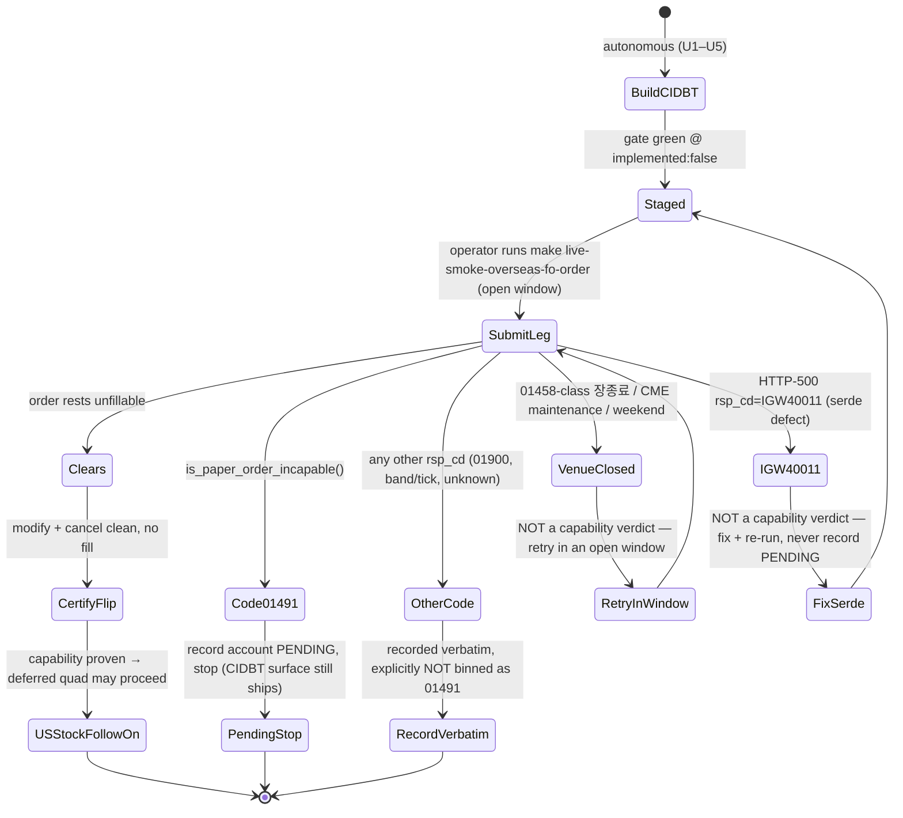

# Overseas Order Certify-Flip Wave (Futures-First) - Plan

> **Product Contract preservation:** unchanged. The Product Contract below is
> carried verbatim from the requirements-only artifact (ce-brainstorm +
> ce-doc-review round 1). Planning added only the Planning Contract,
> Implementation Units, Verification Contract, and Definition of Done.

## Goal Capsule

- **Objective.** Build one **certifiable overseas-futures order chain** (the
  `CIDBT` triad) offline, prove paper-order capability at an operator-run live
  gate, and — **contingent on that capability clearing** — extend to and certify
  the overseas US-stock order quad (`COSAT`/`COSMT`). The guaranteed autonomous
  deliverable is the CIDBT surface, staged for flip; the US-stock quad is a
  conditional follow-on, not part of the guaranteed build.
- **Product authority.** The wave owner (operator with overseas paper
  credentials). Live order legs are always operator-run, never autonomous.
- **Open blockers.**
  - Both overseas paper accounts' **order-capability is unproven** (the overseas
    analog of the domestic `01491` "account not order-capable" saga), and the
    domestic account was in fact read-only until order-enabled creds arrived — so
    a `01491` outcome is a live possibility, not a formality. Proven only at the
    live capability gate.
  - The overseas venue windows are **night-KST** for the operator, so certify
    legs stall on operator availability. This makes **cheap early capability
    proof** the wave's highest-leverage question, not build speed.

---

## Product Contract

### Problem & context

Overseas *reads* are exhausted as a flip source: the `o31xx` overseas-futures and
`AS*`/`GSC`/`GSH`/`t3518`/`t3521` overseas-stock reads are already Implemented,
and the `g3101/02/03/04/06` + `g3190` sextet is `paper_incompatible` — proven
empty **inside their live US session windows** (PROVISIONALITY-LEDGER §14). So an
open overseas market does **not** unlock more read flips; that was already tested.
(The `o3107`/`o3127` watchlist reads are the one unproven residue — see Outstanding
Questions.)

The only remaining overseas *order* surface is 7 Tracked-only TRs with baselines
and no callable Rust yet (the `crates/ls-sdk/src/orders/` module holds only the
domestic F/O chain). This wave is therefore **build-then-certify**, mirroring how
the domestic F/O chain was built offline (PR #75) and certified in-window
(PR #79), not a certify-only flip.

The two chains:

| Chain | TRs | Account lane | Window |
|---|---|---|---|
| Overseas-futures (`CIDBT`) — **guaranteed build** | `CIDBT00100` submit / `CIDBT00900` modify / `CIDBT01000` cancel | `.env.overseas_option` | near-24h |
| Overseas US-stock (`COSAT`/`COSMT`) — **conditional** | `COSAT00301` submit / `COSAT00311` modify / `COSAT00400` reserved reg+cancel / `COSMT00300` sell-redemption | `.env.overseas` | US-equity session (~22:30–05:00 KST) |

The `CIDBT` triad is structurally the domestic F/O `CFOAT00100/00200/00300`
chain; the US-stock quad is more varied (reserved orders + sell-side) and does
**not** cleanly mirror the domestic teardown (see Requirements §5).

### Users & value

- **User.** The SDK maintainer/operator running overseas TR flip waves.
- **Value.** The realized value is TRs advanced Tracked → Implemented, which is
  **contingent on capability clearing**. The offline CIDBT build is not
  independently valuable inventory — it is the *unavoidable precondition* for a
  clean capability probe: a probe that clears actually places a resting order and
  needs the harness's rest-unfillable teardown, so the surface must exist before
  the probe can run safely. If capability never clears, the CIDBT surface remains
  callable but uncertified code carrying a maintenance cost with no consumer; the
  wave accepts that cost only because it is the price of asking the capability
  question at all.

### Goals

- Build the **`CIDBT` order chain** as callable Rust (structs, facade, serde,
  reconcile/teardown), gate-green at `implemented:false` — the guaranteed
  autonomous deliverable.
- Ship the CIDBT fail-closed chained smoke harness + `make` lane + smoke-map row,
  so the operator can certify and the capability probe reuses the teardown.
- Pre-stage CIDBT flip artifacts so certification is metadata + docgen only.
- **Conditionally** (on CIDBT capability clearing + a resolved US-stock probe
  path) build + certify the `COSAT`/`COSMT` quad.
- Document paper-order capability for each account either way (clears / `01491`
  PENDING), and never confound a `01491` capability verdict with an `IGW40011`
  request-shape defect (Requirements §4).

### Non-goals / out of scope

- **Overseas reads** — `g31xx`/`g3190` (`paper_incompatible`) and the already-
  Implemented `o31xx`; do not re-prospect.
- **`Recommended` promotion** — a separate later pass.
- **The US-stock quad as a guaranteed deliverable** — it is conditional on CIDBT
  capability; if CIDBT returns `01491`, the quad is not built this wave.
- **`o3107`/`o3127` overseas watchlist reads** — carried only as an *optional*
  near-zero-cost operator rider; not a build target (but see Outstanding
  Questions — their non-flippability is asserted, not proven).

### Requirements & behavior

1. **Resolve the capability-probe path before locking the build order.** In
   planning, resolve whether `COSAT00400` reserved-order registration (or an
   equivalent) gives a **session-independent, teardown-clean** capability probe
   off-window. The binding constraint is capability proof, not build speed:
   - If a cheap off-window probe exists for an account, prefer **probe-first** —
     prove capability, then build only for accounts that clear.
   - Otherwise, fall back to build-first for CIDBT only (below).
2. **CIDBT sequencing (fallback / default).** Author the `CIDBT` triad + its
   fail-closed smoke harness offline; gate green at `implemented:false`. The
   **capability gate = the harness's own submit leg** — the operator runs it in an
   open window; a bare `raw-probe` is not used because it would leave a dangling
   resting order. On clear: certify + flip `CIDBT`. On `01491`: record the
   account PENDING and stop; the CIDBT surface still ships offline as callable
   code.
3. **US-stock quad is conditional.** Build + certify `COSAT`/`COSMT` **only after**
   CIDBT capability clears *and* the §1 probe question is resolved. `CIDBT` may
   flip while the quad is deferred; the two chains carry independent accounts,
   windows, and capability facts.
4. **A capability verdict must never be confounded with a serde defect.** Resolve
   the `CIDBT` serialization (fractional-price → `string_as_decimal`, not
   `string_as_number` → `IGW40011`; parent order-no placement) against the
   normalized baseline **before authoring**, not deferred to coding. The submit
   harness must classify `IGW40011` (request-shape) **distinctly** from `01491`
   (capability), so a serde bug at the night-window submit leg is never recorded
   as a capability PENDING and never poisons the ledger fact the wave produces.
5. **Fail-closed order safety.** Every live smoke rests unfillable and tears down;
   the kill-switch halt engages **after** the close/cancel order, never before an
   order-placing teardown (per the domestic F/O review catch). The US-stock quad's
   `COSMT00300` (sell-redemption) and `COSAT00400` (reserved) shapes do not fit a
   single rest-unfillable pattern — their per-TR fail-closed teardown must be
   designed and confirmed before the quad's harness is built (§3).
6. **Real-money interlock + credential hygiene (spec-level).** Every overseas live
   order leg is gated on the `LS_TRADING_ENV=paper` fail-closed interlock
   (refuse to fire otherwise), so neither new order lane can execute against a
   non-paper account. All committed artifacts — ledger entries, smoke-map rows,
   harness/evidence output — are **credential-free** (no account numbers or raw
   response bodies); the overseas harnesses install the dispatch-log suppressor
   and secret-scrub, and the capability-probe outcome is recorded as a classified
   code only.
7. **Gate stays green throughout.** Registered policies with `implemented:false`
   keep the crosscheck green without flipping; the tree is never committed red.

### Success criteria

- **Autonomous (guaranteed).** The `CIDBT` chain builds gate-green at
  `implemented:false`; its harness, `make` lane, smoke-map row, and pre-staged
  flip artifacts are present; the serde is baseline-confirmed and the harness
  disambiguates `IGW40011` from `01491`; the full gate (`make docs`, `cargo test`,
  `cargo test -p ls-core`, `make docs-check`, `make lane-check`) passes. This is
  a *certifiable* surface — flip-count is an operator-phase outcome, not an
  autonomous one.
- **Operator (capability-gated).** For each account that clears capability, the
  chain's live smoke runs clean in-window and the certified TRs flip Tracked →
  Implemented with docgen counts updated. The US-stock quad is attempted only if
  CIDBT capability cleared.
- **Either way.** Paper-order capability for each overseas account is documented
  in the ledger, distinctly from any request-shape defect.

### Dependencies & assumptions

- **Baselines are the wire-shape source of truth** (`crates/ls-trackers/
  baselines/api-drift/normalized/trs/<tr>.json`), not guesswork.
- Order-capable overseas paper accounts under `.env.overseas_option` and
  `.env.overseas` are **assumed but unproven** — this is the wave's central risk
  (Open blockers), proven only at the live gate, and a `01491` outcome is
  explicitly in scope.
- New REST `{TR}_POLICY` consts register in **both** crosscheck lists; flips
  require the docgen `reference.len` / `banner_trs` hand-edit (caught by
  `cargo test`, not `make docs`).

### Outstanding questions

- **(Sequencing input, Req §1)** Does `COSAT00400` reserved-order registration
  (예약주문 등록/취소) queue for the next session and thus offer an off-window,
  teardown-clean capability probe — enough to run probe-first and avoid building
  the quad speculatively? Confirm its teardown is fail-closed before offering it
  as a probe. **Planning resolution:** deferred to the US-stock follow-on wave —
  see Planning Contract KTD8. It does not gate the CIDBT spine (CIDBT's near-24h
  window makes the submit-leg gate cheap enough that no separate probe is needed).
- **(FYI — prioritization)** Futures-first is currently justified by build speed
  (CIDBT mirrors the domestic F/O chain), but the bottleneck is operator night-
  window certifiability. **Planning resolution:** CIDBT's **near-24h window** is
  the stronger reason and points the same way — recorded in KTD3.
- **(FYI — reads residue)** `o3107`/`o3127` are demoted to an optional rider on an
  *asserted* "account-empty PENDING," not a proven `paper_incompatible` like the
  g31xx sextet (§14). If they are in fact flippable with a populated overseas
  account, they are a cheaper flip source than the order chains — confirm status
  before dismissing. **Planning resolution:** out of scope for this wave; logged
  as a follow-up probe (not built here).
- **(FYI — probe hygiene)** Confirm the capability-probe records only a classified
  code, with any gateway response body scrubbed of account identifiers before it
  reaches the committed ledger (Req §6). **Planning resolution:** enforced in
  U3/U4 (dispatch-log suppressor + `scrub_secrets`; verdict recorded as a code).

---

## Planning Contract

### Approach summary

Mirror the shipped domestic F/O order chain (`crates/ls-sdk/src/orders/
futureoption.rs`) for the `CIDBT` overseas-futures triad, one seam at a time:
wire structs + serde (U1) → policy + facade + crosscheck (U2) → fail-closed smoke
harness + security guards + Makefile lane (U3) → capability-verdict classifier
(U4) → smoke-map + pre-staged flip recipe (U5). All five units land gate-green
at `implemented:false`; the metadata flip and docgen bump happen only at the
operator's post-certification pass. The US-stock quad is **deferred** (Scope
Boundaries), gated on CIDBT capability clearing plus a resolved reserved-order
probe.

Research confirmed the domestic F/O chain is a clean template and the two
serde-critical facts (Req §4) are resolved from the baselines:

- **CIDBT price fields** `OvrsDrvtOrdPrc`, `CndiOrdPrc` are `Number` (fractional
  overseas prices) → `ls_core::string_as_decimal`. `OrdQty` is integer `Number` →
  `ls_core::string_as_number`. No `IGW40011` risk if authored per baseline.
- **CIDBT parent order-no** on modify/cancel is `OvrsFutsOrgOrdNo` — a
  **caller-supplied `String` request field** (plain serde, no serializer),
  *not* an `OutBlock1`-echoed field as in domestic F/O. This simplifies the
  reconcile story: the parent flows in from the submit response's
  `OutBlock2.OvrsFutsOrdNo` accessor, no read-back needed.

### Key Technical Decisions

- **KTD1 — Serde per baseline field type.** `OvrsDrvtOrdPrc`/`CndiOrdPrc` →
  `string_as_decimal` (JSON number, fractional); `OrdQty` → `string_as_number`
  (JSON int). Non-numeric request fields (`IsuCodeVal`, `BnsTpCode`,
  `FutsOrdTpCode`, `AbrdFutsOrdPtnCode`, `CrcyCode`, `PrdtCode`, `DueYymm`,
  `ExchCode`, `OrdDt`, `OvrsFutsOrgOrdNo`) → plain `#[serde(rename)]`. All
  response fields → `ls_core::string_or_number` (tolerant). This is the direct
  resolution of Req §4's serde assumption.
- **KTD2 — Parent order-no is caller-supplied, not read-back.** `CIDBT00900`/
  `CIDBT01000` take `OvrsFutsOrgOrdNo` as a `String` request field. The submit
  response `CIDBT00100OutBlock2.OvrsFutsOrdNo` is surfaced by an `order_no()`
  accessor and fed into modify/cancel — no `parent_order_no()` OutBlock echo, no
  reconcile read. Simpler than the domestic F/O `OutBlock1.OrgOrdNo` pattern.
- **KTD3 — New facade `sdk.overseas_fo_orders()` on the order path.** A new
  `OverseasFoOrders` handle (holding `Arc<Inner>`) routes `submit`/`modify`/
  `cancel` through `self.inner.post_order(&…_POLICY, req)` — the no-retry / dedup
  / kill-switch path, never `post`/`post_paginated`. Endpoint path
  `/overseas-futureoption/order`. Futures-first is anchored on CIDBT's **near-24h
  window** (most reliably operator-certifiable), not merely build reuse.
- **KTD4 — Policies register in the crosscheck array only; no docgen edit yet.**
  `CIDBT00100/00900/01000_POLICY` (`is_order: true`, `has_pagination: false`) go
  in `crates/ls-core/tests/policy_index_crosscheck.rs` (array + use-import) —
  **never** `slice_rest_policies_are_non_order_rest` (which asserts `is_order:
  false`). Metadata stays `implemented:false`, so `reference.len`/`banner_trs`
  are untouched until the operator flip; the crosscheck needs only metadata
  presence, keeping the gate green (Req §7).
- **KTD5 — Capability-verdict classifier (Req §4), N-way not three-way.** The
  submit leg must mirror the domestic F/O precedent's **exhaustive** rejection
  handling (`crates/ls-sdk/tests/order/fo.rs` R8: any non-`01491` code is recorded
  **verbatim** and explicitly **not** assumed order-incapable), not a lossy
  three-way split. Buckets:
  - **Clears** — order rests → certify.
  - **`01491`** (`ls_core::is_paper_order_incapable()` / `PAPER_ORDER_INCAPABLE_CODE`)
    → account order-incapable → record PENDING, stop.
  - **`01900`** (`ls_core::is_paper_incompatible()`) → paper-incompatible feed →
    record, not a capability verdict.
  - **Venue-closed (`01458`-class 장종료 / CME maintenance-break / weekend)** →
    "retry in-window", explicitly **not** a capability PENDING. The overseas
    "near-24h" window still has a daily maintenance gap + weekend closure, so an
    off-hours submit can hit this.
  - **`IGW40011`** (request-shape / serde defect) → fail loudly, **never** a
    capability verdict. **Wiring caveat (resolve in U4):** `IGW40011` surfaces
    from the gateway as an **HTTP-500 carrying `rsp_cd=IGW40011`** (per
    `docs/solutions/integration-issues/ls-gateway-igw40011-numeric-request-fields.md`),
    *not* as `LsError::Invalid` (which is client-side preflight, raised pre-wire).
    U4 must trace the exact surfaced `LsError` variant (`Http` vs `ApiError`) and
    match on the `rsp_cd`, not the transport code.
  - **Any other code** → recorded **verbatim**, explicitly **not** binned as
    `01491`. This catch-all is the guard against poisoning the capability ledger
    fact with a benign band/tick/venue rejection.
  The point of Req §4: no non-capability outcome (serde defect, venue-closed,
  unknown band rejection) may ever collapse into the `01491` capability record.
- **KTD6 — Security guards mirror `order_smoke.rs`.** `paper_guard()` enforces
  `LS_TRADING_ENV=paper` as the first gate; `install_dispatch_log_suppressor()`
  runs first (fail-closed if a foreign global subscriber exists); `scrub_secrets()`
  masks account numbers/tokens in any emitted evidence; `AcntNo`/`Pwd` response
  fields carry `skip_serializing` + hand-written redacting `Debug`. Smoke-map
  rows and the ledger record only classified codes — credential-free.
- **KTD7 — Fail-closed teardown, kill-switch after close.** Cancel is the primary
  teardown; on teardown uncertainty, engage `set_orders_enabled(false)` **after**
  the cancel attempt (never before an order-placing teardown), then assert flatness
  (per U3's fill-detection basis — a transient-position read if one exists, else
  clean-cancel-confirmation) and panic with `loud_failure(...)`. Mirror
  `fo_order_chained_smoke` / `fo_flatten_fail_closed`.
- **KTD8 — US-stock quad deferred.** `COSAT00301/00311/00400` + `COSMT00300` are
  not authored this wave. The reserved-order `COSAT00400` off-window probe
  question (Req §1) is carried into that follow-on: if reserved-order
  registration queues off-window with a clean teardown, the US-stock wave runs
  probe-first; otherwise build-first like CIDBT. The `COSMT00300` sell-redemption
  and `COSAT00400` reserved teardowns need per-TR fail-closed design (Req §5)
  before the quad's harness is built.

### High-Level Technical Design

The wave's control flow is a capability gate with three exits — the design's
load-bearing shape (why the build precedes proof, and why a serde defect must not
be read as a capability verdict):

### Patterns to follow

- **SDK order surface:** `crates/ls-sdk/src/orders/futureoption.rs` — per-TR
  `…InBlock1`/`…Request`/`…OutBlock1`/`…OutBlock2`/`…Response` structs, `::new`/
  `::limit` constructors, `order_no()` accessor, redacting `Debug` on account
  fields.
- **Facade:** `crates/ls-sdk/src/lib.rs` `fo_orders()` + `crates/ls-sdk/src/
  orders/mod.rs` module wiring (`pub mod` + `pub use` re-export block).
- **Policies:** `crates/ls-core/src/endpoint_policy/order.rs` (`CFOAT001xx_POLICY`)
  + `crates/ls-core/tests/policy_index_crosscheck.rs` (array + import).
- **Smoke harness:** `crates/ls-sdk/tests/order/fo.rs` `fo_order_chained_smoke`
  and `fo_flatten_fail_closed`; guards in `crates/ls-sdk/tests/order_smoke.rs`
  (`paper_guard`, `autonomous_order_smoke_sdk`, `install_dispatch_log_suppressor`,
  `scrub_secrets`, `loud_failure`).
- **Makefile lane:** `Makefile` `live-smoke-fo-order` recipe (lines ~152–160) +
  `LS_SMOKE_LANE` mapping (line ~67) + `.PHONY` (line 22).
- **Capability classifier:** `ls_core::is_paper_order_incapable()` /
  `PAPER_ORDER_INCAPABLE_CODE` (the `01491` classifier from PR #55) and the
  existing `LsError::Invalid`/request-shape path for `IGW40011`.
- **Offline SDK tests:** `crates/ls-sdk-test-support/` wiremock helpers.

---

## Implementation Units

### U1. CIDBT wire structs + serde

- **Goal.** Callable request/response structs for `CIDBT00100/00900/01000` with
  baseline-correct serde, resolving Req §4's serde assumption in code.
- **Requirements.** Advances Goals "build the CIDBT order chain"; implements
  KTD1, KTD2.
- **Dependencies.** none.
- **Files.**
  - `crates/ls-sdk/src/orders/overseas_futureoption.rs` (new)
  - `crates/ls-sdk/src/orders/mod.rs` (add `pub mod` + `pub use` re-export block)
  - test: `crates/ls-sdk/src/orders/overseas_futureoption.rs` `#[cfg(test)]`
    decode module (mirror `futureoption.rs` inline tests)
- **Approach.** Per-TR `CIDBT00100InBlock1`/`Request`/`OutBlock1`/`OutBlock2`/
  `Response`. Submit fields per baseline: `OrdDt`, `IsuCodeVal`, `FutsOrdTpCode`,
  `BnsTpCode`, `AbrdFutsOrdPtnCode`, `CrcyCode`, `OvrsDrvtOrdPrc`
  (`string_as_decimal`), `CndiOrdPrc` (`string_as_decimal`), `OrdQty`
  (`string_as_number`), `PrdtCode`, `DueYymm`, `ExchCode`. Modify (`CIDBT00900`)
  adds `OvrsFutsOrgOrdNo` (`String`, plain) and uses `FutsOrdPtnCode`/`CrcyCodeVal`/
  `OvrsDrvtPrdtCode` per its baseline. Cancel (`CIDBT01000`) fields: `OrdDt`,
  `IsuCodeVal`, `OvrsFutsOrgOrdNo`, `FutsOrdTpCode`, `PrdtTpCode`, `ExchCode`.
  Response: `OutBlock1` (request echo, single object; `AcntNo`/`Pwd` redacted),
  `OutBlock2` (single object; `OvrsFutsOrdNo` = new order-no, `InnerMsgCnts` ack
  on modify/cancel). `order_no()` accessor returns `&outblock2.ovrs_futs_ord_no`.
- **Patterns to follow.** `futureoption.rs` struct + serde conventions;
  redacting `Debug` on `AcntNo`/`Pwd`.
- **Test scenarios.**
  - Serialize a submit request; assert `OvrsDrvtOrdPrc`/`CndiOrdPrc` emit as JSON
    **numbers** (not strings) and `OrdQty` as a JSON int — the `IGW40011`
    guardrail.
  - Serialize an **integer-valued price** (e.g. `100`); assert the emitted JSON
    number is a form the gateway accepts (the `Number` baseline tag alone does not
    prove fractional ticks — guard against a gratuitous trailing `.0` if any
    overseas contract trades integer ticks).
  - Deserialize a submit `Response` (synthesize the fixture from the baseline
    `response_blocks` field list — the normalized baseline has **no**
    `res_example`); assert `order_no()` returns the `OvrsFutsOrdNo` value.
  - Deserialize modify/cancel responses; assert `InnerMsgCnts` ack is surfaced.
  - `Debug`-format a response carrying `AcntNo`/`Pwd`; assert both render
    `<redacted>` and never appear in the string.
- **Verification.** `cargo test -p ls-sdk` decode tests pass; struct compiles and
  is re-exported from `orders`.

### U2. CIDBT endpoint policies + facade + crosscheck

- **Goal.** Register the three order policies and expose `sdk.overseas_fo_orders()`
  on the order dispatch path, gate-green at `implemented:false`.
- **Requirements.** KTD3, KTD4; Req §7 (gate stays green).
- **Dependencies.** U1.
- **Files.**
  - `crates/ls-core/src/endpoint_policy/order.rs` (add
    `CIDBT00100/00900/01000_POLICY`)
  - `crates/ls-core/tests/policy_index_crosscheck.rs` (add to array + use-import)
  - `crates/ls-sdk/src/orders/overseas_futureoption.rs` (add `OverseasFoOrders`)
  - `crates/ls-sdk/src/lib.rs` (add `overseas_fo_orders()` facade)
  - `crates/ls-sdk/src/orders/mod.rs` (re-export `OverseasFoOrders`)
- **Approach.** Each policy: `category: Orders`, `is_order: true`,
  `has_pagination: false`, `path: "/overseas-futureoption/order"`, `module:
  "overseas_futureoption"`, `group: "[해외선물] 주문"`. Add all three to the
  crosscheck **array only** (with a comment noting `is_order: true` → crosscheck
  list only, KTD4) — do **not** touch `slice_rest_policies_are_non_order_rest`.
  `OverseasFoOrders::{submit,modify,cancel}` route through `post_order`.
- **Patterns to follow.** `CFOAT001xx_POLICY` block; `FoOrders` facade.
- **Test scenarios.**
  - `policy_index_crosscheck` passes with the three new consts present.
  - `slice_rest_policies_are_non_order_rest` still passes (order policies absent).
  - Assert (offline, wiremock) `sdk.overseas_fo_orders().submit(...)` posts to
    `/overseas-futureoption/order` with the dedup/no-retry order path (mirror the
    domestic F/O facade test).
- **Verification.** `cargo test -p ls-core` (crosscheck) + `cargo test -p ls-sdk`
  green; `implemented:false` in metadata unchanged.

### U3. CIDBT fail-closed chained smoke harness + Makefile lane + security guards

- **Goal.** An operator-runnable, fail-closed submit→modify→cancel paper smoke
  that doubles as the capability gate, with the real-money interlock and
  credential hygiene of Req §6.
- **Requirements.** Req §2, §5, §6; KTD6, KTD7.
- **Dependencies.** U2.
- **Files.**
  - `crates/ls-sdk/tests/order/overseas_fo.rs` (new; `#[path]`-included by
    `order_smoke.rs`)
  - `crates/ls-sdk/tests/order_smoke.rs` (add the `#[path] mod overseas_fo;`
    include; reuse existing guards)
  - `Makefile` (`live-smoke-overseas-fo-order` target + `LS_SMOKE_LANE =
    overseas_option` mapping + `.PHONY`)
- **Approach.** New harness fn **`overseas_fo_chained_smoke`** (the name the U5
  smoke-map row references), mirroring `fo_order_chained_smoke`: `#[ignore]`
  guarded; `install_dispatch_log_suppressor()` first, then
  `autonomous_order_smoke_sdk()` (enforces `paper_guard()` /
  `LS_TRADING_ENV=paper`). **Contract sourcing (name it, don't leave to the
  implementer):** source the front-month overseas-futures contract from the
  overseas-futures master **`o3101`** (해외선물마스터조회, already Implemented) —
  confirm its front-month selection rule (do not assume row[0]); fail-closed if
  the master returns no contract (mirror `fo.rs` master-empty handling). **Far
  limit:** derive a provably-unfillable price from a daily-range/price-band anchor
  (the overseas analog of domestic `t2111`; identify the overseas band read in U3,
  e.g. from `o3105`/`o3106` overseas-futures quote/chart) — do not hardcode a
  "far" price. Then submit a resting order (qty ≥ 2), modify to qty 1, cancel as
  primary teardown. On teardown uncertainty: `set_orders_enabled(false)` **after**
  the cancel attempt, then loud fail.
- **Fill-detection basis (Req §5).** The domestic template's no-fill assertion
  rests on `t0441` (잔고 fill-detect) because F/O has no working-board read.
  CIDBT has **no confirmed transient-position read** — evaluate the implemented
  overseas-futures account reads (`CIDBQ01400`/`CIDBQ03000`/`CIDBQ05300`) for a
  transient 잔고 row; **if none surfaces a transient fill, the CIDBT teardown
  rests on clean-cancel-confirmation alone** (the cancel-response certifies
  removal), and U3 must document that rationale explicitly rather than silently
  dropping the fill-detect leg. Resolve this in U3 before the harness is final.
- **Makefile recipe** copies `live-smoke-fo-order` (fail-closed lane-file check,
  `set -a; . ./.env.overseas_option`, `export LS_ORDER_SMOKE=1`, grep `1 passed`).
- **Execution note.** The live legs are `#[ignore]` and operator-run only; the
  autonomous wave verifies compile + offline wiremock behavior, never places a
  live order.
- **Patterns to follow.** `fo_order_chained_smoke`, `fo_flatten_fail_closed`,
  `order_smoke.rs` guards; `Makefile` `live-smoke-fo-order`.
- **Test scenarios.**
  - **Offline wiremock chain:** stub submit→modify→cancel; assert the harness
    drives all three legs and reports clean (no live credentials needed).
  - Assert the smoke **refuses** when `LS_TRADING_ENV` is unset or `real`
    (`paper_guard` fail-closed).
  - Assert `install_dispatch_log_suppressor()` fail-closes if a foreign global
    subscriber is already installed.
  - Assert `scrub_secrets()` masks an account-number-shaped token in a synthetic
    evidence string.
  - `make lane-check` still passes (the new lane recipe is offline-guarded).
- **Verification.** `cargo test -p ls-sdk` compiles the harness; `make lane-check`
  green; the `#[ignore]` test is listed under `--ignored`.

### U4. Capability-verdict classifier (IGW40011 ≠ 01491)

- **Goal.** Guarantee the submit leg records a capability verdict distinctly from
  a request-shape defect, so a serde bug is never logged as a capability PENDING
  (Req §4).
- **Requirements.** Req §4; KTD5.
- **Dependencies.** U3.
- **Files.**
  - `crates/ls-sdk/tests/order/overseas_fo.rs` (test-local verdict enum +
    classifier + negative tests) — **no ls-core edit**: reuse
    `ls_core::is_paper_order_incapable()` / `is_paper_incompatible()` and match
    other codes on the `rsp_cd` string test-locally, exactly as `fo.rs` does. (Do
    **not** add an ls-core `IGW40011` predicate — no consumer needs it.)
- **Approach.** A test-local verdict enum maps the gateway outcome to the KTD5
  buckets: `Clears`, `PaperOrderIncapable` (`01491`), `PaperIncompatible`
  (`01900`), `VenueClosed` (`01458`-class), `RequestShapeDefect` (`IGW40011`),
  `OtherRejection(code)` (recorded verbatim). Only `01491` records account PENDING
  and stops; `VenueClosed`/`OtherRejection` are recorded but never a capability
  PENDING; `IGW40011` is a loud failure (serde bug). **Trace the `IGW40011`
  surface first:** confirm whether dispatch surfaces the gateway HTTP-500-with-
  `rsp_cd=IGW40011` as `LsError::Http` or `LsError::ApiError { code }`, then match
  on the `rsp_cd` — *not* `LsError::Invalid` (client-side preflight, never carries
  a gateway code).
- **Test scenarios.**
  - Synthetic `01491` → `PaperOrderIncapable` → PENDING code, credential-free.
  - Synthetic `IGW40011` (HTTP-500 + `rsp_cd`) → `RequestShapeDefect` → **not** a
    PENDING; loud failure.
  - Synthetic `01458`-class venue-closed → `VenueClosed` → **not** a PENDING
    (retry-in-window).
  - Synthetic unknown code → `OtherRejection` recorded verbatim, **never** binned
    as `01491`.
  - **Scrub guard:** feed an `IGW40011` response whose body carries an
    account-number-shaped token, drive the loud-failure/verdict-emit path, and
    assert the emitted string is `scrub_secrets`'d — masked, never the raw digits
    (mirror `loud_failure_message_is_account_free_but_names_the_order`).
  - Assert all buckets are distinct enum values (no two collapse).
- **Verification.** `cargo test -p ls-sdk` negative tests pass; every classifier
  bucket is exercised offline, including the catch-all and the scrub guard.

### U5. Smoke-map row + pre-staged flip recipe + gate

- **Goal.** Stage everything the operator needs so certification is metadata +
  docgen only, and prove the full gate is green.
- **Requirements.** Goals "pre-stage CIDBT flip artifacts"; Req §7; Success
  criteria (autonomous).
- **Dependencies.** U3, U4.
- **Files.**
  - `.agents/skills/promote-tr/references/smoke-map.md` (three CIDBT rows +
    optional pre-smoke raw-probe note)
  - `docs/plans/2026-07-01-005-...-plan.md` (this file: the operator flip recipe
    below is authoritative)
  - **not edited this wave** (documented only): `metadata/trs/CIDBT001*.yaml`
    (`implemented:false`→`true` + `certification_path: none`→`manual`),
    `crates/ls-docgen/src/lib.rs` (`reference.len` 283→286 + three `banner_trs`
    entries)
- **Approach.** Add smoke-map rows: `CIDBT00100/00900/01000 | live-smoke-overseas-
  fo-order | overseas_fo_chained_smoke | lane overseas_option, LS_TRADING_ENV=
  paper, rests unfillable | implemented-only | order accepted+modified+cancelled`.
  Document the operator flip recipe (below) explicitly. Do **not** flip metadata
  or edit docgen counts — those are the operator's post-cert step; keeping
  `implemented:false` is what keeps the gate green now.
- **Test scenarios.** `Test expectation: none — documentation + smoke-map row; the
  gate assertions (docgen counts, crosscheck) are exercised by the other units.`
- **Verification.** Full gate green: `make docs`, `cargo test`, `cargo test -p
  ls-core`, `make docs-check`, `make lane-check`.

---

## Verification Contract

- **Gate (autonomous DoD).** `make docs` && `cargo test` && `cargo test -p
  ls-core` && `make docs-check` && `make lane-check` — all green, tree not red at
  any commit.
- **Serde guardrail.** U1 tests prove `OvrsDrvtOrdPrc`/`CndiOrdPrc` serialize as
  JSON numbers and `OrdQty` as an int (the `IGW40011` prevention).
- **Crosscheck invariant.** `policy_index_crosscheck` includes the three CIDBT
  order policies; `slice_rest_policies_are_non_order_rest` excludes them.
- **Capability disambiguation.** U4 tests prove `01491`, `01900`, venue-closed
  (`01458`-class), `IGW40011`, and any unknown code map to **distinct** recorded
  verdicts — only `01491` is a capability PENDING; the catch-all and venue-closed
  buckets never collapse into it.
- **Security.** U3 tests prove the `LS_TRADING_ENV=paper` refusal, the
  suppressor fail-close, and secret scrubbing.
- **Operator certification (out-of-band, capability-gated).** Operator runs
  `make live-smoke-overseas-fo-order` in an open overseas-futures window with
  `.env.overseas_option`; a clean submit/modify/cancel with no fill certifies the
  triad.

### Operator flip recipe (post-certification)

1. Run `make live-smoke-overseas-fo-order` in-window. Clean pass (order accepted,
   modified `00132`-class ack, cancelled, no fill) → certified.
2. Per TR, flip `metadata/trs/CIDBT001*.yaml`: `support.implemented: false→true`,
   `facets.certification_path: none→manual`, replace the PENDING comment with the
   certification citation (smoke, `rsp_cd`, `make` target, this plan, date).
3. `crates/ls-docgen/src/lib.rs`: bump the `reference.len` literal `283 → 286`
   (with the required prose comment) and add `"CIDBT00100", "CIDBT00900",
   "CIDBT01000"` to `banner_trs`.
4. `make docs && cargo test && make docs-check && make lane-check`; commit.
5. If the submit leg returns `01491` instead: record each TR PENDING (capability
   documented), leave `implemented:false`, do **not** touch docgen — the CIDBT
   surface still ships.

---

## Definition of Done

- U1–U5 complete; the full gate is green with CIDBT `implemented:false`.
- CIDBT structs/serde/facade/policies/crosscheck/harness/Makefile-lane/smoke-map
  all present; serde proven number-typed; capability classifier proven to
  separate `01491` from `IGW40011`; security guards proven.
- The operator flip recipe is documented and the live legs are `#[ignore]`
  operator-gated (no autonomous order placement).
- `0` autonomous flips is a valid completion state — the deliverable is a
  *certifiable* CIDBT surface, not a certified one.

---

## Scope Boundaries

### In scope
- The `CIDBT` overseas-futures order triad: build, stage, and pre-stage flip
  artifacts (U1–U5).

### Deferred to Follow-Up Work
- **US-stock quad (`COSAT00301/00311/00400` + `COSMT00300`).** Conditional on
  CIDBT capability clearing + a resolved reserved-order probe (KTD8). Distinct
  shapes: `COSAT00400` reserved reg/cancel (`TrxTpCode`, `RsvOrd*` date range,
  `AcntNo`/`Pwd` in request) as the off-window probe candidate; `COSMT00300`
  sell-redemption (`MgntrnCode`/`LoanDt`). Both need per-TR fail-closed teardown
  design before their harness is built (Req §5). Prices `OvrsOrdPrc` fractional →
  `string_as_decimal`; `OrgOrdNo`/`OrdQty` integer → `string_as_number`.
- **`o3107`/`o3127` overseas watchlist reads.** Probe whether they flip with a
  populated overseas account (asserted PENDING, not proven `paper_incompatible`).
- **`Recommended` promotion** of any overseas order TR (needs `error_coverage_ref`
  + differential negative-probe per the recommended gate).

### Outside this product's identity
- Overseas *reads* proven `paper_incompatible` (`g31xx`/`g3190`) — never flip.

---

## Risks & Dependencies

- **Capability may never clear (`01491`).** The domestic account was read-only
  until order-enabled creds arrived; the overseas accounts may be the same.
  Mitigation: the build is a *precondition for the probe*, `0` flips is a valid
  outcome, and CIDBT ships as callable code regardless.
- **Night-KST operator window + venue-closed misread.** Certification stalls on
  operator availability; CIDBT's near-24h window minimizes this (KTD3) but still
  has a daily maintenance gap + weekend closure. An off-hours submit can hit an
  `01458`-class venue-closed code — KTD5's classifier records it as
  retry-in-window, never a capability PENDING, so a closed venue is not mistaken
  for `01491`.
- **CIDBT fill-detection unproven.** No confirmed transient-position read exists
  for overseas-futures (unlike domestic `t0441`). U3 must either identify one
  (`CIDBQ01400`/`03000`/`05300`) or fall back to clean-cancel-confirmation with a
  documented rationale — an open U3 design point, not a silent gap.
- **Baseline `Object`-typed numeric fields on `COSAT00311/00400`/`COSMT00300`.**
  A baseline artifact (deferred quad only) — model request serde from
  `COSAT00301`'s `Number` types + `res_example`, not the `Object` tags. Does not
  affect the CIDBT spine.
- **Reserved-order probe unverified.** Whether `COSAT00400` queues off-window with
  a clean teardown is unproven — a deferred-quad concern, not a CIDBT blocker.

---

## Sources & Research

- Domestic F/O chain template: `crates/ls-sdk/src/orders/futureoption.rs`,
  `crates/ls-sdk/tests/order/fo.rs`, `crates/ls-core/src/endpoint_policy/order.rs`,
  `crates/ls-core/tests/policy_index_crosscheck.rs`, `Makefile` `live-smoke-fo-order`.
- CIDBT/COSAT/COSMT wire shapes: `crates/ls-trackers/baselines/api-drift/
  normalized/trs/{CIDBT00100,CIDBT00900,CIDBT01000,COSAT00301,COSAT00311,
  COSAT00400,COSMT00300}.json`.
- Capability classifier precedent: `ls_core::is_paper_order_incapable()` /
  `PAPER_ORDER_INCAPABLE_CODE` (PR #55, solution doc
  `docs/solutions/integration-issues/ls-paper-01491-account-not-order-capable.md`).
- Security/scrub precedent: `crates/ls-sdk/tests/order_smoke.rs`
  (`paper_guard`, `install_dispatch_log_suppressor`, `scrub_secrets`,
  `loud_failure`); serde/`IGW40011` guidance:
  `docs/solutions/integration-issues/ls-gateway-igw40011-numeric-request-fields.md`.
- Origin: this artifact's Product Contract (ce-brainstorm + ce-doc-review round 1).
