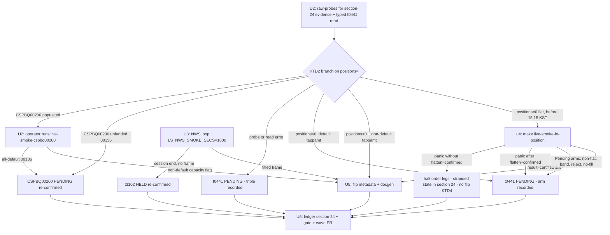

# Domestic Trigger-Run Certify Wave - Plan

## Goal Capsule

- **Objective:** Convert today's open KRX window into 1–2 domestic Implemented flips by executing the ledger §23 reopen triggers that are armed: position manufacture → `t0441`, and the live-NWS listener → `t3102`. Refresh probe evidence for the account-gated PENDINGs either way.
- **Product authority:** This document. `metadata/PROVISIONALITY-LEDGER.md` §22–§23 dispositions are binding, with one named exception: KTD8 supersedes §23's "never flip inline" instruction for the CSPBQ00200 surprise-funded branch.
- **Execution profile:** Mixed. All order-placing and credential-gated live legs are operator-run in an attended PTY (never autonomous); the agent does desk prep, branch interpretation, flips, ledger, and gate.
- **Stop conditions:** Any fail-closed panic that strands a position halts every remaining order-placing leg — record the state in §24, no flip for that TR this wave. No manufacture submit after 15:15 KST.
- **Product Contract preservation:** changed — R3 and AE1 clarified (feasibility gate moved into the harness per KTD1), R10 and AE5 added (pre-positioned read-certify branch), R2 supersession of §23's inline-flip note made explicit (KTD8). Confirmed in the pre-write synthesis.

---

## Product Contract

### Summary

Run the two session-independent account probes first, branch on what they show, then have the operator run the staged position-manufacture smoke to certify and flip `t0441` to Implemented, with the staged NWS listener running throughout for an opportunistic `t3102` flip. Every touched TR ends the wave flipped-with-evidence or PENDING/HELD with a fresh ledger entry.

### Problem Frame

Ledger §22 declared both the raw pool and the offline tracked-flip pool exhausted: 320 Tracked, 282 Implemented, and a 38-TR residue in which every domestic candidate carries a terminal disposition. §23 re-confirmed the 16-TR domestic slice with 0 flips and closed with an instruction — the next domestic window should be spent on a reopen trigger, not another re-probe. Today a window is open with an operator present. Of the §23 reopen triggers, exactly two are armed without out-of-band action: the fully staged `t0441` position-manufacture harness, and the staged `t3102` NWS feeder that only ever flips if a live news frame arrives. The account state that produced the current PENDINGs has not been verified since §23, so the wave must open by probing it rather than assuming it.

### Key Decisions

- **Pure trigger-run, no widening.** No design-scoped levers (`t1852`/`t1856`/`t1860`/`t1964`) and no Recommended re-certifications this wave. The window buys certain, staged yield; build work with uncertain yield competes for the same finite session time.
- **Probe-first branching.** Account state is treated as unknown. The §23 U1 raw-probes for `t0441` and `CSPBQ00200` run before any window-consuming step, and the wave branches on their results instead of assuming the prior PENDING reasons still hold.
- **CSPBQ00200 is probe-only.** No LS-portal paper deposit happens this wave, so its expected terminal state is a re-confirmed PENDING with fresh evidence. Only if the probe unexpectedly shows a funded state does its smoke run and a flip become possible.
- **t1109 excluded.** The session will not extend into the 15:30–17:50 KST after-hours window it requires.
- **Max flips, not exhaustive disposition.** §23 already gave every domestic candidate a terminal state; this wave has no obligation to touch the full residue, only to execute the armed triggers cleanly.

### Actors

- A1. **Operator** — runs every credential-gated live leg: the order-placing smokes (position manufacture is never autonomous), the raw-probes, the typed `t0441` and `CSPBQ00200` read smokes, and the NWS listener loop; certifies outcomes in-window.
- A2. **Agent** — stages and sequences the wave, interprets probe and smoke outputs, performs the metadata + docgen flips, writes the ledger entry, and keeps the gate green.

### Requirements

**Probes (run first)**

- R1. The §23 U1 session-independent raw-probes for `t0441` and `CSPBQ00200` (commands recorded in `metadata/PROVISIONALITY-LEDGER.md` §23) run before any order-placing step, and the wave branches on their results per the KTD2 interpretation table.
- R2. The `CSPBQ00200` probe outcome is recorded as evidence. If it shows the account still unfunded, `CSPBQ00200` stays PENDING with the refreshed reason; if it shows a funded state, `make live-smoke-cspbq00200` runs and a certified non-default capacity witness flips it (superseding §23's inline-flip prohibition — KTD8).
- R10. If the typed read-only `make live-smoke-t0441` run shows the account already holding a position (`positions>0` with a non-default `tappamt`), that run is itself the certifying witness and manufacture is skipped entirely — a genuine position witness needs no new orders.

**t0441 certify-and-flip (core)**

- R3. If the `t0441` probe shows the account flat and the read reachable, the operator runs `make live-smoke-fo-position` (domestic_option lane) in the open F/O window; the harness's own preflight flat-gate and fail-closed flatten machinery are the flatten-feasibility gate (KTD1).
- R4. A clean certified run — non-default `jqty` witness on the `t0441` read plus a confirmed-flat teardown — flips `t0441` to `implemented: true`. The flip is metadata + docgen only: the `reference.len()` literal and `banner_trs` in `crates/ls-docgen/src/lib.rs` (parametric counts per KTD6).
- R5. Any ambiguous fill or teardown outcome halts the wave's order-placing legs fail-closed; `t0441` stays PENDING with the observed outcome recorded. No retries beyond the harness's bounded attempts.

**t3102 opportunistic**

- R6. The staged NWS listener (`make live-smoke-nws-t3102`) runs during the session as a looped long timebox (KTD5). A non-empty `t3102OutBlock2` title witness flips `t3102`; no frame leaves it HELD with a one-line re-confirmation.

**Close-out**

- R7. Every TR the wave touches ends in exactly one state: Implemented with certified live evidence, or PENDING/HELD with a fresh dated ledger entry (§24) recording the probe or smoke outcome.
- R8. Terminal pools stay untouched: the 7 intraday paper-empty feeds, `t1631`, the 4 design-scoped TRs, the 13 `paper_incompatible`, and the 45 raw-only codes with recorded drop reasons.
- R9. The full gate is green before merge: `make docs`, `cargo test`, `cargo test -p ls-core`, `make docs-check`, `make lane-check`.

### Key Flows

- F1. Core certify-and-flip
  - **Trigger:** Operator available in an open KRX F/O window.
  - **Steps:** Run the U2 probes and the typed `t0441` read → branch per KTD2 → flat: operator runs the manufacture smoke; positioned: the typed read is already the certifying witness → on a certified witness line, agent flips metadata + docgen, writes ledger §24, runs the gate.
  - **Outcome:** `t0441` Implemented, or PENDING with fresh probe/smoke evidence.
  - **Covers R1, R3, R4, R5, R10, R7, R9.**
- F2. Opportunistic NWS flip
  - **Trigger:** Session open; listener loop started alongside F1.
  - **Steps:** Looped listener waits for a live NWS frame → on a titled frame, certify and flip `t3102`; on session end without a frame, re-confirm HELD.
  - **Outcome:** `t3102` Implemented or HELD unchanged.
  - **Covers R6, R7.**

### Acceptance Examples

- AE1. **Covers R1, R3, R5, R7.** Given the probe or the harness's own preflight/fail-closed arms refuse manufacture (non-flat book, degenerate band, rejected buy, no-fill clean-cancel), when the wave branches, then no flip occurs, `t0441` stays PENDING with the observed arm recorded in §24, and the wave's committed yield is the NWS listener only — an honest 0-flip close is acceptable.
- AE2. **Covers R3, R4, R9.** Given a clean manufacture run with a non-default `jqty` witness and confirmed-flat teardown, when the agent flips `t0441`, then only metadata and the two docgen sites change, and the full gate passes.
- AE3. **Covers R2.** Given the `CSPBQ00200` probe returns the same zero-deposit state, when the wave closes, then no `CSPBQ00200` smoke ran and its ledger entry records a re-confirmed funding-gated PENDING.
- AE4. **Covers R6.** Given no NWS frame arrives before session end, when the wave closes, then `t3102` remains HELD and no metadata changes for it.
- AE5. **Covers R10.** Given the typed `make live-smoke-t0441` read shows a pre-existing position on the domestic_option account (`positions>0`), when the wave branches, then manufacture is skipped and that run's `positions>0` + `tappamt_nondefault=true` record certifies the flip.

### Success Criteria

- 1–2 flips is the realistic target; a 0-flip close is acceptable only when backed by fresh probe/smoke evidence written to the ledger.
- No flip lands without certified live evidence — the offline gate alone never certifies (§20 precedent).
- The wave adds no new PENDING without a concrete reopen trigger attached.

### Scope Boundaries

- No new Tracked TRs: all 45 raw-only codes carry recorded terminal drop reasons (`docs/plans/notes/all-lane-flip-classification.md`); the raw pool stays closed.
- No overseas work: the staged CIDBT overseas-F/O order chain and the overseas residue wait for an open overseas window.
- No Recommended re-certifications (the count stays 0 this wave).
- No LS-portal deposit, no after-hours extension, no design-scoped build work.
- No harness code changes: the smokes' Rust is untouched; the only source edits outside the flips are Makefile fixes (the stale gating comment plus the three module-prefixed `run_smoke` filter corrections in U1) and, on a t3102 flip, its stale docgen comment.

### Dependencies / Assumptions

- The KRX F/O session is open during the wave with the operator present in an attended PTY shell (the autonomy guard refuses non-TTY invocations by design).
- `.env.domestic_option` (account `…51`) and `.env.domestic` (account `…3701`) lane files are present and valid; the staged harnesses from the §22 work are unchanged on `main`.
- The `CSPBQ00200` probe body mirrors the certified SDK struct (`crates/ls-sdk/src/account/capacity.rs`), not the under-reporting normalized baseline; `RecCnt`/`OrdPrc` serialize as JSON numbers.

### Sources

- `metadata/PROVISIONALITY-LEDGER.md` §21–§23 — residue partition, reopen triggers, exact U1 probe commands (lines ~1328–1341), flip mechanics, §24 structural conventions.
- `crates/ls-sdk/tests/order/fo.rs` (`fo_position_manufacture_smoke`, ~862; `fo_flatten_fail_closed`, ~717) — guard order, terminal arms, witness and `result=certified` line.
- `crates/ls-sdk/tests/live/market_session_charts.rs` (`live_smoke_nws_t3102`, ~486) and `crates/ls-sdk/tests/live/account.rs` (`live_smoke_cspbq00200`, ~238; `live_smoke_t0441`, ~369).
- `Makefile` — `live-smoke-fo-position` (~205, lane `domestic_option`), `live-smoke-nws-t3102` (~495, default `domestic` lane), `live-smoke-cspbq00200` (~248), `live-smoke-t0441` (~263), `raw-probe` lane note (~39).
- `crates/ls-docgen/src/lib.rs` — `banner_trs` (~1301), `reference.len()` literal (~1602–1606), stale t3102 comment (~1454).
- `docs/solutions/conventions/` — `kill-switch-ordering-in-order-placing-teardown.md`, `autonomous-order-smoke-fail-closed-contract.md` (architecture-patterns), `authoring-fo-order-tr-chain.md`, `implement-tr-registration-sites.md`, `normalized-baseline-can-underreport-request-block.md`, `tr-pool-exhaustion-and-closure-viability.md`.

---

## Planning Contract

### Key Technical Decisions

- KTD1. **The harness is the flatten-feasibility gate.** The §23 raw-probe is a read-only balance check — it proves reachability and flatness, never flatten-in-session. The separate hand-run feasibility spike from plan 2026-07-01-003 U1 is superseded: `fo_position_manufacture_smoke`'s preflight flat-gate, 1-lot marketable buy, bounded flatten (≤2 attempts), and kill-switch-after-teardown machinery are strictly safer than an unguarded spike. Amend the stale gating comment at `Makefile:198-200` accordingly.
- KTD2. **The typed read decides the branch; raw-probes are §24 evidence.** The §23 raw-probes run verbatim for evidence parity (each `RAW-PROBE http/rsp_cd/body_len` triple recorded; the `t0441` probe must pass `LS_SMOKE_LANE=domestic_option` on the command line — `raw-probe` has no lane mapping and silently authenticates as the domestic cash account without it). The t0441 flat/positioned decision does not ride the probe's `body_len` heuristic: the operator runs the read-only `make live-smoke-t0441` and the typed `positions=` count decides — `positions=0` → flat, proceed to manufacture; `positions>0` with `tappamt_nondefault=true` → that run is itself the R10 certifying witness, manufacture skipped. The typed count supersedes any probe inference in both directions: a read recording `positions=0` before the 15:15 KST cutoff re-enters the manufacture branch. Error arms: IGW/HTTP error on probe or read → classify environmental vs shape, no manufacture, PENDING with the triple recorded; `IGW00201` rate-limit → wait and re-probe once. `CSPBQ00200`: `00136` + all-default → funding-gated PENDING re-confirmed; unexpectedly populated → operator runs `live-smoke-cspbq00200` (in U2), certify only per KTD3.
- KTD3. **Flip authorization is a witness line, never an exit status.** Many harness arms record Pending and still exit "1 passed". `t0441` flips only on the `ORDER-MANUFACTURE-FO result=certified` stdout line (or, on the R10 path, the read smoke's positions>0 + non-default `tappamt` record); `t3102` only on the `LIVE-SMOKE` record with non-empty `title_len`; `CSPBQ00200` only on a non-default capacity flag (`dps_nd`/`prsmptdps_nd`/`se_nd`) in its recorded line — its test passes even on all-default output.
- KTD4. **Hygiene-first on failed teardown.** The harness records the Certified `t0441` witness before flattening, so a stranded-position panic leaves genuine witness evidence — it still does not flip this wave. §24 records the stranded state (it blocks every future F/O preflight flat-gate) and manual flatten is the out-of-band remedy; a later wave may then certify via the read smoke. Not every panic strands: the buy-not-clean, buy-ambiguous, and fill-poll-read-failed arms flatten first and print `flatten=confirmed` before panicking — those are flattened-but-uncertified terminals (book clean, arm recorded, no manual flatten). Only a panic without that line, or carrying the `MANUAL flatten required` payload, is the stranded arm.
- KTD5. **Session-timing guardrails.** No manufacture submit after 15:15 KST — the 15:35–15:45 closing auction can strand the close leg into the kill-switch terminal. The NWS listen runs as a looped long timebox (`LS_NWS_SMOKE_SECS=1800`, re-invoked until a titled frame or session end); a red exit is the expected HELD terminal only when the specific `SMOKE-FAIL … no NWS news frame` line is present — any other failure (including a `did not run (0 tests)` filter miss) halts the loop for diagnosis. The target is side-effect-free and re-runnable.
- KTD6. **Parametric count math.** `reference.len()` moves 283 → 283+N and `banner_trs` gains one entry per flipped TR (N = flips this wave, 0–3). Nothing else moves on a tracked→implemented flip: `maintained_tr_count` (320), the four `cli.rs` literals, `TRACKED_TRS`, and api_drift counts are all untouched. The trackers freshness gate is Recommended-only (count 0) and does not fire.
- KTD7. **Concurrency is safe; pre-build to keep it so.** The NWS loop (`.env.domestic`, account `…3701`) and the manufacture smoke (`.env.domestic_option`, `…51`) use different appkeys → different OAuth tokens → separate gateway rate identities, in separate processes with per-process rate limiters and kill switch. The only interaction is cargo's target-dir build lock — pre-build test binaries before the window (U1) so concurrent invocations don't serialize.
- KTD8. **R2 supersedes §23's inline-flip prohibition.** §23's "never flip inline (AE3)" bound that wave's 0-flip scope; this wave's Product Contract explicitly authorizes the certify-and-flip on the surprise-funded branch. Without this named supersession an executor honoring "§22–§23 are binding" literally would refuse R2.
- KTD9. **Operator invocation contract.** Attended PTY (`script -q /dev/null …` if needed); fresh `LS_ORDER_SMOKE_NONCE=$(date +%s)` minted immediately before the manufacture run (TTL 600s), exported in the shell and never written into a lane env file (the recipe sources the lane file after, clobbering a fresh nonce with a stale one). Re-derive `--exact` test filters from `cargo test -p ls-sdk --test order_smoke -- --list` — post-decomposition names carry `fo::` prefixes and a bare name silently matches 0 tests while the "1 passed" grep reads success.

### High-Level Technical Design

---

## Implementation Units

### U1. Desk prep and gating-comment amendment

- **Goal:** Everything verifiable before the window is verified, so window time is spent only on live legs.
- **Requirements:** R9 (gate readiness), KTD1, KTD7, KTD9.
- **Dependencies:** none.
- **Files:** `Makefile` — amend the stale `live-smoke-fo-position` gating comment at ~198–200 per KTD1, and fix the three wave-critical `run_smoke` call sites to the module-prefixed names the decomposed test binary actually exposes: `account::live_smoke_t0441` (~264), `account::live_smoke_cspbq00200` (~249), `market_session_charts::live_smoke_nws_t3102` (~495). The bare names match 0 tests under `--exact` and exit FAIL before running anything.
- **Approach:** Confirm `.env.domestic_option` and `.env.domestic` exist (fail-fast lane guard covers absence). Re-derive the exact test-filter names via `cargo test -p ls-sdk --test order_smoke -- --list` and `--test live_smoke -- --list` (KTD9 prefix gotcha) and update the three Makefile call sites to match — the order-smoke targets were already prefix-fixed; these live_smoke ones were not. Pre-build with `cargo test -p ls-sdk --no-run` (KTD7). Grep `crates/ls-trackers` and `crates/ls-docgen` for `t0441`/`t3102` exemplar references (expected: none — the tracked-only exemplar is `t1964`).
- **Test scenarios:** Test expectation: none — prep and a comment edit with no behavioral change.
- **Verification:** The three `run_smoke` call sites match `--list` output exactly; binaries built; exemplar grep clean; amended comment reads as KTD1.

### U2. Session-independent probes and branch decision

- **Goal:** Fresh account-state evidence for both PENDINGs and a recorded go/no-go branch for every downstream leg.
- **Requirements:** R1, R2, R10.
- **Dependencies:** U1.
- **Files:** none (live probes; outcomes recorded for U6).
- **Approach:** Operator runs the two §23 U1 commands verbatim (ledger ~1328–1341) — the `t0441` probe **with** `LS_SMOKE_LANE=domestic_option`, the `CSPBQ00200` probe with the five-field certified-struct body (`RecCnt`/`OrdPrc` as JSON numbers) — plus the typed `make live-smoke-t0441` read that decides the branch (KTD2). Agent records each `RAW-PROBE` triple and the read's `positions=`/`tappamt_nondefault=` line. On the funded CSPBQ00200 branch, the operator runs `make live-smoke-cspbq00200` here in U2 and the agent parses the capacity-flag witness per KTD3. Branch outputs: manufacture go/no-go, read-certify witness (already captured if positioned), CSPBQ00200 certified-or-PENDING.
- **Test scenarios:** Test expectation: none — live probes and reads; the branch rules (KTD2) are the oracle. Covers AE3 (unfunded triple → PENDING re-confirm) and the AE5 trigger condition.
- **Verification:** Both triples and the typed read line recorded; one KTD2 branch selected per TR and written down before any order-placing step; on the funded branch, the CSPBQ00200 smoke outcome recorded.

### U3. NWS listener loop

- **Goal:** Maximize the odds a live NWS frame certifies `t3102` during the session, at zero interaction cost to the order legs.
- **Requirements:** R6.
- **Dependencies:** U1 (pre-build); runs concurrently with U2/U4.
- **Files:** none.
- **Approach:** Operator runs the loop: `LS_NWS_SMOKE_SECS=1800 make live-smoke-nws-t3102` on the default domestic lane until a titled frame lands or the session ends (KTD5). Re-invoke only when the specific `SMOKE-FAIL … no NWS news frame` line is present (the expected HELD terminal); any other red exit — including a `did not run (0 tests)` filter miss — halts the loop for diagnosis. A frame whose `t3102` body has an empty title also re-invokes (side-effect-free target).
- **Test scenarios:** Test expectation: none — the staged smoke is the test; its witness rules are KTD3's. Covers AE4 (session ends frameless → HELD).
- **Verification:** Either a `LIVE-SMOKE` record with non-empty `title_len` (certified — feeds U5), or a recorded note that the loop ran to session end without a frame (feeds U6 as HELD re-confirmation).

### U4. Manufacture run and outcome interpretation

- **Goal:** A terminal, correctly classified `t0441` outcome: certified, PENDING with a named arm, or halted-with-stranded-state.
- **Requirements:** R3, R5, R10.
- **Dependencies:** U2 (branch decision); KTD5 cutoff — no submit after 15:15 KST.
- **Files:** none.
- **Approach:** Flat branch: operator mints a fresh nonce and runs `make live-smoke-fo-position` in the attended PTY (KTD9). Agent parses stdout for the terminal arm: `result=certified` (→ U5); a Pending arm — non-flat preflight, degenerate band, rejected buy (01491/paper-incompatible/ApiError), no-fill + clean cancel, partial-fill anomaly — (→ PENDING, arm named in §24); a panic — split per KTD4: preceded by `flatten=confirmed` → flattened-but-uncertified terminal (book clean, arm recorded); without it, or with `MANUAL flatten required` → stranded arm (halt all order legs, record stranded state, manual flatten out-of-band). Positioned branch (R10): already certified by U2's typed read (`positions>0` + `tappamt_nondefault=true`) — no further run needed; if any later `t0441` read records `positions=0` before the 15:15 KST cutoff, re-enter the flat branch and manufacture (KTD2 fallback).
- **Execution note:** Certification is read off the witness line, never the make exit status (KTD3). The operator never signals or kills an order-placing run — the harness's bounded arms (finite fill-poll + ≤2 close attempts) always reach a self-classified terminal within minutes; the 15:30 KST rule governs only the §24 classification (record the panic/stranded arm if confirmed-flat has not printed by then), decided after the process reaches its own terminal.
- **Test scenarios:** Test expectation: none — the staged harness carries its own assertions; this unit's deliverable is the classified outcome. Covers AE1 (refusal arms → honest PENDING), AE2 (certified → flip input), AE5 (positioned → certified from U2's typed read).
- **Verification:** Exactly one terminal arm recorded for `t0441`, with the verbatim witness/arm line captured (credential-free) for §24.

### U5. Flips for certified TRs

- **Goal:** Each certified TR (0–3 of `t0441`, `t3102`, `CSPBQ00200`) flipped to Implemented with all count sites consistent.
- **Requirements:** R2, R4, R6.
- **Dependencies:** U2/U3/U4 (certified witnesses only).
- **Files:** `metadata/trs/t0441.yaml`, `metadata/trs/t3102.yaml`, `metadata/trs/CSPBQ00200.yaml` (whichever certified: `implemented: false` → `true`, a `support:` comment block citing the certifying smoke + rsp_cd + date per the CFOAT00100 precedent, bump `maintenance.last_reviewed`); `crates/ls-docgen/src/lib.rs` (`banner_trs` +1 entry per flip with a wave comment; `reference.len()` literal 283 → 283+N with a ledger comment line; on a t3102 flip also fix the stale "ships HELD" comment at ~1454); regenerated `docs/reference/` + `docs/tr-dependencies/` via `make docs`.
- **Approach:** Order per registration-sites convention: yaml flip → `make docs` → hand-edit the two docgen literals → full gate. `recommended: false` stays. Nothing else moves (KTD6). Smoke-map rows for all three TRs already exist — update flip-row prose only if stale.
- **Test scenarios:**
  - Covers AE2. After a t0441-only flip: `cargo test -p ls-docgen` passes with the literal at 284 and `banner_trs` containing `t0441`; `make docs-check` clean.
  - N-flip variant: literal equals 283+N exactly; a deliberate off-by-one is caught by the docgen unit test (`reference_covers_implemented_with_banner_and_omits_unimplemented`), not by `make docs`.
  - Negative: `maintained_tr_count`, `cli.rs` literals, `TRACKED_TRS` byte-identical (`git diff` scoped check).
- **Verification:** Full gate green; `git diff` touches only the flipped yamls, the two docgen sites (+ stale comment), and regenerated docs.

### U6. Ledger §24, gate, and wave PR

- **Goal:** The wave's terminal record: §24 written to convention, gate green, one squash PR.
- **Requirements:** R7, R8, R9.
- **Dependencies:** U2–U5 (all outcomes terminal).
- **Files:** `metadata/PROVISIONALITY-LEDGER.md` (append §24).
- **Approach:** Mirror §22/§23 structure: heading with date; plan path + goal + bold outcome/flip-count line; honesty note; probe/evidence block quoting the exact commands and the http/rsp_cd/body_len-only rule; partition arithmetic reconciling to §23's 16-TR slice; supersession paragraph (this section becomes the current disposition record; note the KTD8 supersession of §23's inline-flip line if the branch fired); lettered reopen triggers for whatever remains PENDING; closing count tally naming every count family with exact before/after. A 0-flip outcome still writes §24 recording the trigger attempts. Branch `feat/domestic-trigger-run-certify-wave`, one squash PR (`feat(…)` with flips, `chore(ledger)` at 0 flips), body carrying the count-delta paragraph, gate-green line, and plan path.
- **Test scenarios:** Test expectation: none — prose ledger entry and release mechanics; the gate is the executable check.
- **Verification:** All five gate commands green; §24 partition arithmetic sums; every touched TR appears in exactly one terminal state; PR opened with the conventional body; no credential material anywhere in §24 or the PR.

---

## Verification Contract

| Check | Command | Proves |
|---|---|---|
| Docs regeneration | `make docs` | Reference/dependency docs match flipped metadata |
| Workspace tests | `cargo test` | Docgen count literals + `banner_trs` consistent (test-only sites), harnesses compile, offline suites green |
| Metadata/policy gate | `cargo test -p ls-core` | Metadata validation + policy index cross-check |
| Docs drift | `make docs-check` | Committed docs match regenerated |
| Lane guard | `make lane-check` | Fail-fast lane sourcing intact (offline) |

Live certification is outside the gate by design: each flip must cite its witness line per KTD3 (`result=certified` / non-empty `title_len` / non-default capacity flag), captured credential-free in §24. The gate being green never substitutes for a witness (§20 precedent).

---

## Definition of Done

- Every TR the wave touched (`t0441`, `t3102`, `CSPBQ00200`) is in exactly one terminal state — Implemented with a cited same-day witness line, or PENDING/HELD with a fresh §24 reason and reopen trigger.
- Flipped TRs: metadata + the two docgen sites changed, counts parametric-correct (KTD6), nothing else moved.
- §24 appended to convention with reconciling partition arithmetic and an exact count tally; terminal pools (R8) untouched.
- Full gate green (all five Verification Contract commands).
- One squash wave-PR opened on `feat/domestic-trigger-run-certify-wave` with the conventional body; no stranded position left unrecorded; no experimental or dead-end edits in the diff.
