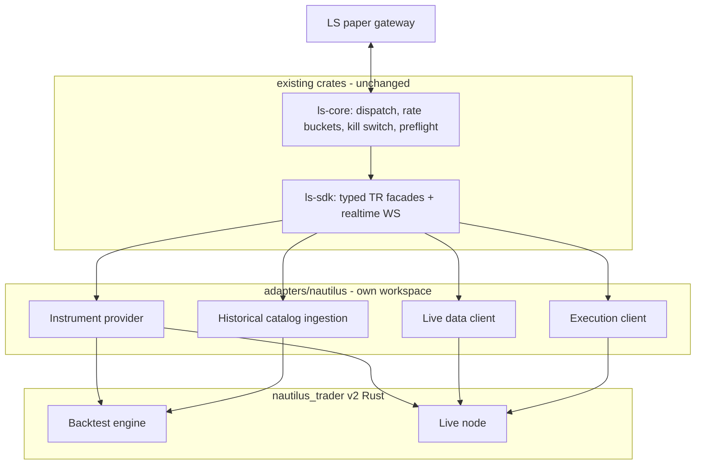
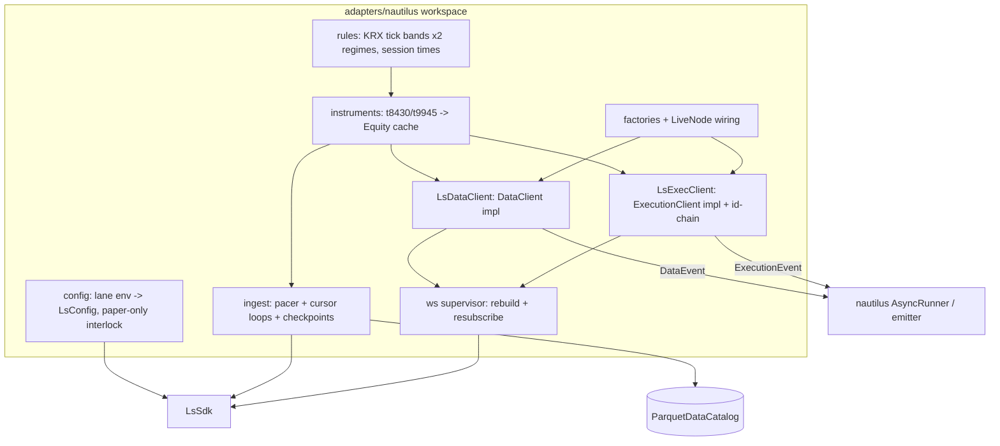
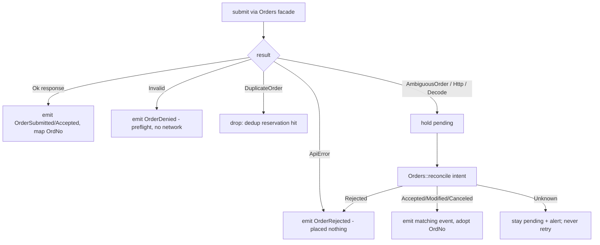
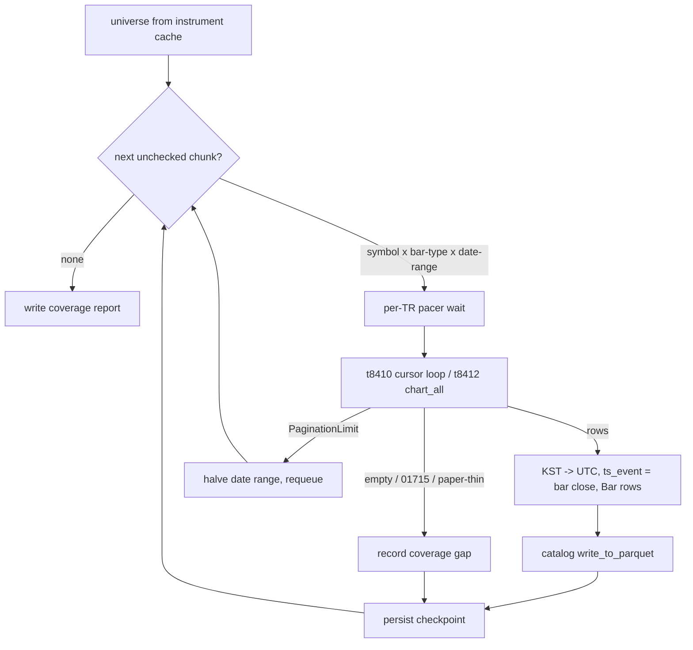

# Nautilus Trader Adapter for LS (Domestic) - Plan

## Goal Capsule

- **Objective:** Deliver the full nautilus_trader v2 (Rust) adapter surface for domestic KRX equities as a standalone Cargo workspace at `adapters/nautilus/`, built as a translation layer over `LsSdk` — instrument provider, historical catalog ingestion, live market data, and execution — ordered backtest-path first.
- **Product authority:** This document (owner-confirmed scope 2026-07-02; plan-time amendments confirmed same day). Strategy work is a later plan.
- **Execution profile:** Offline-first. Everything is verifiable with the mock gateway (`ls-sdk-test-support`); the live tester binaries are staged for the operator, never run autonomously. Zero changes to the six SDK crates or root `Cargo.toml`.
- **Stop conditions:** Surface instead of guessing when (a) nautilus 0.60.0 trait/message shapes diverge materially from the researched contract (see Planning Contract assumptions), (b) any step would require editing the six SDK crates or root workspace files, or (c) any step would place a live order.

---

## Product Contract

### Summary

Add a new adapter workspace that lets nautilus_trader v2 (Rust) backtest and paper-trade domestic KRX equities through the LS SDK. The adapter translates between Nautilus's instrument/data/execution model and `LsSdk`'s typed TR surface; it owns no transport, credentials, or rate limiting of its own. No strategy code ships in this deliverable.

### Problem Frame

The SDK now covers 282 Implemented TRs with certified order chains, but it has no strategy runtime: no backtester, no portfolio/risk engine, no event loop a trading strategy can live in. nautilus_trader provides exactly that, and its v2 release-candidate line supports trading systems written entirely in Rust — but it has no LS (or Korea) integration.

The owner's next planned work is strategy research (first candidate: a stocks-in-play opening-range-breakout scan, kept as a TODO for the next plan). That research is blocked until adapters exist, and it shapes what "complete" means for them: cross-sectional universe scans need whole-universe instrument definitions and bulk historical bars, not just per-symbol quotes.

### Key Decisions

- **Pure Rust on the Nautilus v2 line; no Python/PyO3 layer.** Matches the workspace's single toolchain and Nautilus's Rust-first direction. Accepts riding a release-candidate API that may churn.
- **Translation layer over `LsSdk`, against upstream's embed-your-own-transport convention.** Nautilus adapters conventionally own their HTTP/WS clients; here that layer already exists in ls-core with safety machinery (rate buckets, kill switch, order dedup, preflight, ambiguous-order fail-closed) that must not be duplicated or bypassed. This makes later upstream contribution more work and that is accepted.
- **Standalone workspace inside this repo.** The adapter lives at `adapters/nautilus/` with its own `[workspace]` table, lockfile, and toolchain. This is forced, not just preferred: nautilus crates require Rust 1.96 / edition 2024 while the SDK workspace pins 1.75, and a nested `[workspace]` table achieves the isolation with zero edits to the six crates or root `Cargo.toml`.
- **Full adapter surface in one deliverable, ordered backtest-path first.** Instruments → historical catalog ingestion → backtest proof → live data → execution, so the follow-on strategy plan never circles back for adapter pieces, and backtest research unblocks earliest.
- **Domestic equities implemented; every other domain mapped-for, not built.** The instrument-mapping model must accommodate domestic F/O, overseas stock, and overseas F/O identifiers and conventions from day one, but only domestic equities ship certified in v1.
- **The adapter is an internal consumer of Implemented-tier TRs.** With 0 TRs currently Recommended, the adapter builds on Implemented (this answers the open interim-consumer question in docs/plans/2026-06-21-003-feat-consumer-bound-implemented-expansion-plan.md for this deliverable).

### Requirements

**Instrument provider**

- R1. The adapter loads instrument definitions for the whole domestic KRX equity universe from LS master TRs (name, symbol, ISIN, lot size, daily price limits, market segment) and completes them with adapter-owned versioned KRX rule data for tick-size bands and trading-session times, which no LS TR carries.
- R2. The mapping model represents instrument domain explicitly so domestic F/O and overseas instruments can be added without redesign; requesting an unmapped domain fails with an explicit unsupported error, never a silent wrong mapping.

**Historical data ingestion (backtest path)**

- R3. The adapter ingests LS historical bars — daily and intraday minute bars — for domestic equities into Nautilus's data catalog for backtesting.
- R4. Ingestion scales to full-universe pulls — multi-year daily history for every eligible KRX symbol, plus bounded-lookback intraday history that grows through a scheduled accumulate-forward mode — while pacing to the stricter of the per-TR gateway cap and the SDK's market-data bucket.
- R5. Bulk ingestion jobs are resumable and incremental at sub-symbol granularity: an interrupted or repeated run continues from persisted per-(instrument, bar type, date range) checkpoints rather than restarting.
- R6. Ingested bars carry the fields strategy scans need: OHLC and volume sufficient to compute averages such as 14-day volume, ATR, and opening ranges downstream.

**Live market data**

- R7. Live trades and top-of-book quotes for subscribed domestic equities flow from the SDK's realtime WebSocket lanes into Nautilus market-data events, and the adapter keeps streams alive across gateway disconnects beyond the SDK's bounded reconnect budget.
- R8. Nautilus subscribe/unsubscribe lifecycle maps onto the SDK's subscription handles so that unsubscribing (or dropping a client) cleanly releases the underlying WS subscription.

**Execution**

- R9. The execution client covers the domestic cash-equity order lifecycle — submit, modify, cancel, and the order-event stream — surfacing Nautilus order events for accepted, rejected, partially filled, filled, and canceled states, with order identity tracked across KRX modify's new-order-number chaining.
- R10. Ambiguous order outcomes fail closed: an ambiguous submit (gateway or transport) surfaces as an explicit ambiguous state driving reconciliation, never as inferred success or silent loss.
- R11. The adapter honors the SDK's environment model: paper is the default and only supported environment in v1, and the SDK's real-money interlock and order kill switch remain in effect through the adapter.
- R14. The live execution client starts flat-only in v1: at connect it verifies the account has no open orders and no holdings, and refuses to start otherwise rather than reconciling pre-existing state into Nautilus.

**Packaging**

- R12. The adapter ships as a standalone workspace under `adapters/nautilus/` with zero dependency or code changes to the six existing crates and root workspace files.
- R13. The adapter has an offline test story consistent with the repo's gate ethos: its behavior is verifiable without gateway credentials, with live paper certification as a separate, operator-gated step.
- R15. Bulk ingestion and live sessions are mutually exclusive in v1: rate buckets are per-process, so the deliverable documents and guards against running both concurrently against the gateway.

### Key Flows

- F1. Backtest research loop
  - **Trigger:** Owner wants to evaluate a strategy idea on KRX history.
  - **Steps:** Run ingestion for the target universe and date range → catalog fills incrementally under rate limits → a Nautilus backtest loads instruments and bars from the catalog → strategy code (out of scope here) runs against it.
  - **Outcome:** Backtest completes using only LS-sourced instruments and data. **Covers R1, R3-R6.**
- F2. Live paper session
  - **Trigger:** A Nautilus live node starts with the LS adapter configured for paper.
  - **Steps:** Instrument provider loads definitions → execution client verifies the account is flat → data client subscribes to the strategy's symbols → execution client submits/modifies/cancels orders and streams order events → session ends, subscriptions release.
  - **Outcome:** Order lifecycle round-trips on the paper gateway with correct Nautilus events. **Covers R1, R7-R11, R14.**

### Acceptance Examples

- AE1. **Covers R10.** Given a submitted order whose response is lost to a transport error, when the adapter cannot prove placement or rejection, then the order enters an explicit ambiguous state and reconciliation runs; it is never reported filled, canceled, or forgotten.
- AE2. **Covers R4, R5.** Given a full-universe daily-bar backfill interrupted at symbol N, when the job is re-run, then it resumes after the already-ingested data and total request rate stays within the per-TR cap.
- AE3. **Covers R2.** Given a request to load an overseas or F/O instrument in v1, when the provider resolves the domain, then it returns an explicit unsupported-domain error rather than mapping it as an equity.
- AE4. **Covers R7.** Given the SDK's WS reconnect budget exhausts and it delivers a terminal error purging all subscriptions, when the adapter's supervisor observes it, then it rebuilds the realtime session, resubscribes every active subscription, and reports the connection-state transitions — the live node does not end.
- AE5. **Covers R14.** Given an account with an open unfilled order (or nonzero holdings), when the execution client connects, then it refuses to start and reports why, and no Nautilus order state is fabricated.
- AE6. **Covers R9, R10.** Given a dropped frame on the order-event WS lane, when the adapter detects the drop count advanced, then it treats fill accounting as suspect and drives order-inquiry reconciliation rather than trusting the stream silently.

### Success Criteria

- A Nautilus backtest of a scan-shaped placeholder strategy (opening-range breakout over ranked symbols) runs end-to-end on LS-ingested KRX data via the offline mock gateway; strategy quality is irrelevant, the data path is what is proven.
- A live paper session round-trips submit → event → cancel for a domestic equity with correct Nautilus order events (operator-run tester binaries; staged by this plan).
- The existing SDK gate (`make docs`, `cargo test`, `make docs-check`, `make lane-check`) stays green with no changes attributable to the adapter.

### Scope Boundaries

**Deferred for later**

- Strategy implementation, including the stocks-in-play strategy — the next plan (TODO); this deliverable only carries its data requirements forward.
- Domestic F/O mapping and execution — the cheapest fast-follow (the SDK's domestic F/O order chain is already certified); v1 must not block it (R2).
- Overseas stock and overseas F/O domains.
- Full 10-level order-book depth (`OrderBookDeltas`/`Depth10`) — v1 ships trades + top-of-book quotes; the driving strategy needs bars only. The adapter-owned WS row structs already decode the full ladder, so depth is additive later.
- Startup reconciliation of pre-existing orders/positions into Nautilus (v1 is flat-start-only, R14).
- Real-money trading.
- Python/PyO3 layer, upstream contribution to nautechsystems/nautilus_trader (including a `KRX` `TieredTickScheme` upstream PR — cheap and worth doing later; `TOPIX100` is precedent), and crates.io publication.

**Outside this deliverable's identity**

- Adapter-owned transport, auth, or rate limiting — rejected even though it is upstream Nautilus convention; ls-core remains the single transport and safety authority. (The per-TR pacer in ingestion is pacing above the SDK, not a replacement for its limiter.)

### Dependencies / Assumptions

- **Dependency (verified 2026-07-02):** nautilus Rust crates are published on crates.io at 0.60.0 (LGPL-3.0-or-later, Rust 1.96 / edition 2024): `nautilus-model`, `nautilus-common`, `nautilus-live`, `nautilus-persistence`, `nautilus-backtest` et al. Adapter contract = `DataClient` + `ExecutionClient` traits (`nautilus-common`) + factory traits + `ExecutionEventEmitter`; pure-Rust `LiveNode` and Rust-readable/writable `ParquetDataCatalog` exist. OKX (`crates/adapters/okx`) is the reference layout.
- **Verified against published 0.60.0 (docs.rs):** `DataClient`/`ExecutionClient` live at flat `nautilus_common::clients` (8 required methods each; subscribe/request and order-command families are provided methods to override); `DataClientFactory`/`ExecutionClientFactory`/`ClientConfig` in `nautilus_common::factories`; `LiveNode`/`LiveNodeBuilder` + `ExecutionEventEmitter` in `nautilus-live`; `get_data_event_sender()` at `nautilus_common::live::runner` (panics if the runner is uninitialized — tests and tester binaries must initialize or inject the sender); `ParquetDataCatalog` write/read methods; `Equity::new_checked` with `tick_scheme: Option<Ustr>`; `TieredTickScheme`; `nautilus-backtest` `BacktestEngine`/`BacktestNode`. Note: `ExecutionClient` has no per-transition `generate_order_*` methods — order events flow through the emitter, the trait carries `generate_account_state` plus the async report generators. Remaining U1 verification is narrow: the parameter/command-struct types on the subscribe/order methods.
- **Assumption / risk:** paper-gateway historical depth at universe scale is unproven — ingestion must tolerate short or empty history per symbol and record coverage rather than fail the run. Server-side minute-bar lookback may also be capped outright (common for broker chart TRs): the staged live steps include an early operator probe — one maximum-lookback t8412 pull on a liquid symbol — and accumulate-forward is the standing contingency if deep backfill is unobtainable.
- **Recorded limitation:** the catalog universe is point-in-time — t8430/t9945 return only currently listed symbols, so multi-year cross-sectional backtests carry survivorship bias, unfixable post-hoc (LS exposes no historical-listing TR). Periodic accumulate-forward re-ingest snapshots the universe as it evolves, bounding the bias from adoption day forward; the follow-on strategy plan must price this in.
- **Dependency:** the SDK's realtime WS surface (`subscribe_typed`, RAII handles, MarketData/OrderEvent lanes) and order path (`post_order`, `Orders::reconcile`) as they exist today; both verified present. Order-event WS lanes are not observable on bare paper (no counterparty fills) — live certification of the execution stream is connection-reachability plus t0425 polling, mirroring the repo's existing KTD6 stance.
- **License note:** the adapter links LGPL-3.0 crates; distributing it as source keeps MIT licensing unproblematic, while distributing linked binaries later carries LGPL relink/source obligations.

### Sources / Research

- Repo grounding: `crates/ls-sdk/src/lib.rs` (facade + `realtime()` accessor), `crates/ls-sdk/src/realtime/mod.rs` (`subscribe_typed`, RAII unsubscribe, `replay_subscriptions`), `crates/ls-sdk/src/realtime/connection.rs` (`RECONNECT_MAX_ATTEMPTS = 4`, terminal error + purge), `crates/ls-sdk/src/realtime/dispatch.rs` (overflow drop counting), `crates/ls-sdk/src/orders/mod.rs` + `crates/ls-sdk/src/orders/reconcile.rs` (order path, six-state `reconcile`, `OrderIntent`), `crates/ls-core/src/rate_limiter.rs` (category buckets), `crates/ls-core/src/order_dedup.rs`, `crates/ls-core/src/config.rs` (`from_env`, paper/real interlock, `ws_channel_capacity`/`ws_overflow_policy`, `base_url`/`ws_base_url` test seams), `crates/ls-core/src/pagination.rs` + `crates/ls-core/src/client.rs` (`collect_all`, `PaginationLimit` discards pages).
- TR surfaces: `crates/ls-sdk/src/market_session/masters.rs` (t8430/t8436/t9945), `crates/ls-sdk/src/paginated/chart.rs` (t8410/t8412/t1305), `crates/ls-sdk/src/realtime/frame/ws_trades.rs` (S3_/K3_/H1_/HA_ rows), `crates/ls-sdk/src/realtime/frame/ws_events.rs` (SC0-SC4), normalized baselines under `crates/ls-trackers/baselines/api-drift/normalized/trs/` (full WS field ladders; t8430 field set).
- Institutional learnings applied: `docs/solutions/integration-issues/ls-gateway-t0425-rate-limit-and-pagination-flat-scan.md` (per-TR caps unenforced by client; IGW00201), `docs/solutions/architecture-patterns/order-double-execution-guards-dedup-reservation-and-complete-query-reconciliation.md`, `docs/solutions/conventions/order-error-classifier-placed-nothing-vs-may-rest.md` (variant-keyed mapping), `docs/solutions/architecture-patterns/connection-reachable-only-websocket-flips.md` (no subscribe ACK), `docs/solutions/architecture-patterns/ls-sdk-pagination-modeling.md` (t8412 sole multi-page TR), `docs/solutions/conventions/ls-account-token-bound-credential-lanes.md`, `docs/solutions/conventions/kill-switch-ordering-in-order-placing-teardown.md`.
- External (verified 2026-07-02): https://nautilustrader.io/docs/latest/concepts/rust/ (v2 pure-Rust path, crate list), https://nautilustrader.io/docs/latest/developer_guide/adapters/ (adapter structure), nautechsystems/nautilus_trader `develop` sources — `crates/common/src/clients/{data,execution}.rs` (adapter traits), `crates/live/src/execution/emitter.rs`, `crates/live/src/node/builder.rs`, `crates/model/src/instruments/tick_scheme.rs` (`TieredTickScheme`, no custom-name registry), `crates/persistence/src/backend/catalog.rs` (`write_to_parquet`, layout `data/{data_type}/{instrument_id}/`), `crates/adapters/okx/` (reference), RELEASES.md (v2 RC status, per-release Rust breaking changes).
- Strategy look-ahead driver: stocks-in-play ORB strategy (https://www.quantifiedstrategies.com/stocks-in-play-trading-strategy-day-trading/) — sets the universe-scale data requirements (R4, R6).

---

## Planning Contract

**Product Contract preservation:** changed R1 — tick-size bands and trading-session times are adapter-owned rule data, not LS TR fields (verified absent from the t8430 baseline); R7 gained the reconnect-survival clause; R9 gained modify-chain tracking; added R14 (flat-start-only) and R15 (ingestion/live exclusivity); the workspace Key Decision moved from "crates in this workspace" to "standalone workspace" (forced by the nautilus 1.96 MSRV vs the SDK's 1.75 pin); the three deferred Outstanding Questions are resolved into KTD2 (version pinning/gating), the depth deferral in Scope Boundaries, and KTD5/KTD7 (TR set, catalog layout). All confirmed with the owner 2026-07-02.

### Key Technical Decisions

- KTD1. **Standalone workspace via a nested `[workspace]` table.** `adapters/nautilus/Cargo.toml` carries its own `[workspace]` table (opting out of the root workspace with zero root edits), its own `Cargo.lock`, and a `rust-toolchain.toml` pinning ≥1.96. SDK crates are consumed by path (`ls-sdk`, `ls-core` for `EndpointPolicy` metadata, dev-only `ls-sdk-test-support`). The root gate ignores non-member crates (verified: `cargo test` is members-only; docs-check/lane-check are metadata/Makefile-scoped).
- KTD2. **Pin all nautilus crates at `=0.60.0`, lockstep.** The v2 RC line breaks Rust APIs roughly monthly; mixed versions produce type mismatches. Upgrades are deliberate whole-set bumps reading RELEASES.md. If 0.60.0 has a blocking defect, the first move is a `[patch.crates-io]` git-rev override of the affected crate(s) at the nearest compatible commit; a whole-set bump is the last resort and re-runs the trait-shape verification. The adapter defines its own gate (see Verification Contract) instead of joining the SDK gate.
- KTD3. **One adapter crate (`nautilus-ls`) mirroring the OKX adapter layout,** with modules `rules` / `instruments` / `ingest` / `data` / `execution` / `factories` / `config` and three binaries: `ls-ingest`, `node_data_tester`, `node_exec_tester` (the upstream convention for live smokes, directly analogous to Paper Live Smoke).
- KTD4. **Adapter-side per-TR pacer above the SDK's category bucket.** The SDK enforces only category buckets; `EndpointPolicy.rate_limit_per_sec` (e.g. t8410/t8412 = 1/s) is metadata the client does not enforce, and violating it yields IGW00201. The pacer keys on the policy const's value and paces to the stricter of per-TR and category.
- KTD5. **Bar sources: t8410 (daily) via a manual `cts_date` cursor loop; t8412 (minute) via `chart_all` chunked by date range.** `T8410Response` has no `HasPagination`, so the adapter threads the body cursor itself — which is exactly the checkpointing seam R5 needs. `chart_all` errors with `PaginationLimit` at `max_pages` and discards all fetched pages, so minute chunks are sized conservatively and narrowed on that error. Daily bars keep the default adjusted prices (`sujung="Y"`), recorded in catalog metadata. `sdate`/`edate` must be trading days (weekend → gateway `01715`).
- KTD6. **Order-event mapping is keyed on the `LsError` variant, never rsp_cd alone.** `ApiError` (clean 2xx business rejection, placed nothing) → OrderRejected; `Invalid` (client-side preflight) → OrderDenied; `DuplicateOrder` → drop as dedup hit; `AmbiguousOrder` / `Http` / `Decode` (may rest) → pending state + `Orders::reconcile`, mapping its six-state outcome and honoring `safe_to_retry` (Unknown never authorizes retry; rejected-cancel never emits OrderCanceled). This is the documented fail-open trap two reviewers caught in the F/O chain — inherit the fix, don't rediscover it. Remaining variants: `Auth`/`RateLimited`/`Config` are pre-network failures (placed nothing) → OrderDenied; `Parse`/`PaginationLimit`/`WebSocket` should not occur on the submit path and — together with any future variant — fall to a fail-closed default arm (pending + reconcile), never a rejection event.
- KTD7. **Instrument identity: `InstrumentId` = `{shcode}.XKRX`; ISIN (`expcode`) carried on the `Equity`.** shcode is required anyway as the WS `tr_key`; the catalog layout keys on instrument id. `price_precision = 0` (KRW integer ticks), `price_increment` = the current band step from adapter rule data, lot from `memedan`. Daily price limits (`uplmtprice`/`dnlmtprice`) are session-scoped facts, not instrument constants: backtest instruments omit `max_price`/`min_price` (multi-year history contradicts any frozen band) and order-price stepping routes through the rules band lookup rather than the instrument's static increment. `tick_scheme: None` in v1 — nautilus's `TieredTickScheme` fits KRX exactly but has no custom-name registration; the band table lives in the adapter's `rules` module (both pre- and post-2023 regimes, since daily history spans them).
- KTD8. **WS bridging: adapter-owned row structs + supervisor.** `subscribe_typed<Res>` is generic, so the adapter defines its own frame structs (full field sets from the normalized baselines, including SC2/SC3/SC4 bodies the SDK models as empty) with `#[serde(default)]` + tolerant string parsing. Registration-ACK frames (all-default rows) are filtered from emission but consumed as delivery signals: the adapter records first-ACK/first-frame per subscription and exposes a never-delivered diagnostic (age since subscribe with zero frames), since the gateway sends no subscribe ACK and a dead subscription is otherwise indistinguishable from a quiet market. The nautilus client traits' subscribe/unsubscribe methods are synchronous and `?Send`: they enqueue commands over a channel to the supervisor task, which owns the `WsManager` and performs the async calls — only `Send` state (streams, handles) crosses into spawned tasks. The supervisor catches the SDK's terminal reconnect-budget error (4 attempts, then purge) and rebuilds the realtime session, resubscribing the active set with unbounded backoff; any session rebuild or observed reconnect forces the same order-inquiry reconcile pass as a drop-count advance, and a periodic reconcile backstops reconnect-gap event loss while any order is open (the SDK's in-budget reconnects are invisible to the adapter and deliver no missed frames). Overflow policy and capacity are per-WsManager config, not per-subscription, so v1 runs one `LsSdk`/`WsManager` with both lanes on `DropNewest` and a raised `ws_channel_capacity`; quote staleness is watched via `dropped_count` polling, and any drop-counter advance forces reconciliation (AE6). Per-lane `LatestOnly` quotes are deferred until the SDK grows a per-subscribe policy seam.
- KTD9. **Timestamps and catalog conventions.** LS returns KST wall-clock strings; the adapter converts to UTC `UnixNanos` with `ts_event` = bar close (Nautilus convention). Checkpoints persist per (instrument id, bar type, date range) in a state file beside the catalog; `write_instruments` + `write_to_parquet::<Bar>` produce the standard `data/{data_type}/{instrument_id}/` layout the backtest engine reads.

### High-Level Technical Design

Adapter internals and event flow (component shape):

Order submit outcome classification (decision shape — directional, the prose in KTD6 is authoritative):

Ingestion loop (data-flow shape):

---

## Implementation Units

### U1. Adapter workspace scaffold

- **Goal:** A standalone `adapters/nautilus/` workspace that compiles against nautilus `=0.60.0` and path-dep `ls-sdk`, with the trait shapes verified.
- **Requirements:** R12, R13.
- **Dependencies:** none.
- **Files:** `adapters/nautilus/Cargo.toml` (own `[workspace]` table), `adapters/nautilus/rust-toolchain.toml`, `adapters/nautilus/src/lib.rs`, `adapters/nautilus/src/config.rs`, `adapters/nautilus/README.md`, `adapters/nautilus/.gitignore`.
- **Approach:** Package `nautilus-ls`. Deps: `ls-sdk`/`ls-core` by path, `nautilus-{model,common,core,live,persistence,backtest}` pinned `=0.60.0` lockstep; dev-dep `ls-sdk-test-support` by path. `config.rs` maps adapter config → `LsConfig` (explicit lane env-file path or `from_env`), refusing `Environment::production` (R11). The adapter config type never stores raw appkey/secret/account — it carries the lane env-file path (or an already-redacted `LsConfig` behind a non-Debug wrapper) — and any `Debug`/`Serialize` impl the nautilus trait bounds require is hand-written to redact, mirroring `LsConfig`'s manual Debug in `crates/ls-core/src/config.rs` (nautilus node internals may log or serialize client configs; this repo does not control those surfaces). The trait/factory/catalog surfaces are already verified against published 0.60.0 (see Dependencies); the remaining U1 verification is the parameter and command-struct types on the subscribe/order methods.
- **Execution note:** This unit is packaging/scaffolding; the proof is a clean `cargo build` + the trait-shape verification note in the README or module docs.
- **Test scenarios:** config parse happy path; production-environment refusal (error names the paper-only constraint); `Debug`/`Serialize` output of the adapter config contains no credential material; `Test expectation:` otherwise none — scaffolding.
- **Verification:** `cargo build --workspace` green inside `adapters/nautilus/`; root repo `git status` clean of any change outside `adapters/nautilus/`; root gate still green.

### U2. KRX rule data and instrument provider

- **Goal:** Whole-universe domestic equity `Equity` instruments built from t8430/t9945 plus adapter rule data, cached and emittable.
- **Requirements:** R1, R2. **Covers AE3.**
- **Dependencies:** U1.
- **Files:** `adapters/nautilus/src/rules.rs`, `adapters/nautilus/src/instruments.rs`, `adapters/nautilus/tests/instruments.rs`.
- **Approach:** `rules.rs` holds the KRX/KOSDAQ tick-band tables for both regimes (pre/post the 2023 change) with an effective-date switch, band-step lookup by price, and session times (KST) as versioned constants. `instruments.rs` pulls `MarketSession::stock_issues` (t8430, all markets) and per-market t9945 for ISIN/NXT flags, maps rows to `Equity::new_checked` per KTD7, caches by `InstrumentId`, and exposes a domain enum whose non-equity arms return the unsupported-domain error. Numeric parsing owns the stringly-typed rows (`sign`/`change` pairs).
- **Patterns to follow:** OKX adapter's fetch-cache-emit-in-connect instrument pattern; wire field names from `crates/ls-trackers/baselines/api-drift/normalized/trs/t8430.json`.
- **Test scenarios:** fixture t8430 rows map to correct `Equity` (lot from `memedan`, limits, ISIN, precision 0); band-step boundaries at band edges in both regimes and at the regime switch date; Covers AE3 — F/O and overseas domain requests return the explicit unsupported error; ETF rows still map as equities with the ETF flag in `info`; malformed numeric fields fail with a named field error, not a panic.
- **Verification:** offline tests green with wiremock-served fixture bodies; no live calls.

### U3. Historical bar ingestion into the catalog

- **Goal:** A resumable, rate-correct backfill from t8410/t8412 into `ParquetDataCatalog`.
- **Requirements:** R3-R6, R15. **Covers AE2.**
- **Dependencies:** U2.
- **Files:** `adapters/nautilus/src/ingest/mod.rs`, `adapters/nautilus/src/ingest/pacer.rs`, `adapters/nautilus/src/ingest/checkpoint.rs`, `adapters/nautilus/src/bin/ls-ingest.rs`, `adapters/nautilus/tests/ingest.rs`.
- **Approach:** Per KTD4/KTD5/KTD9. The pacer reads `rate_limit_per_sec` off the t8410/t8412 policy consts and meters each TR independently. Daily: thread `outblock.cts_date` → next `inblock.cts_date` until exhausted. Minute: `chart_all` per conservative date chunk; on `PaginationLimit` halve the chunk and requeue (fetched pages are discarded by the SDK — chunk sizing is the cost control). Checkpoints (JSON state beside the catalog) record completed (instrument, bar type, date range) plus coverage gaps (empty history, `01715`, paper-thin feeds) so re-runs skip and report rather than refetch. Request-budget math is part of the unit: at the 1 req/s per-TR cap a full-universe daily pass is ~2,700 requests (~45 minutes), while a multi-year full-universe minute-bar backfill is on the order of 10^6 requests (12+ days) — so v1 intraday ingestion is bounded (filtered universe and/or bounded lookback) and `ls-ingest` ships an accumulate-forward mode (scheduled incremental pulls that extend intraday depth from adoption day); record the budget table (symbols × bars × page size × req/s) in the unit's output. `ls-ingest` is the only ingestion entry point; it holds an advisory lockfile beside the catalog while running and refuses to start if the live-session lock is held (R15).
- **Execution note:** Build the checkpoint/pacer core test-first — the failure modes (page-discarding cap, cursor non-termination, rate bursts) are all cheaply provable offline and expensive to discover live.
- **Test scenarios:** Covers AE2 — interrupt after N symbols, re-run resumes without refetching (assert request count); `cts_date` loop terminates on cursor exhaustion and on repeated-cursor (defensive stop); `PaginationLimit` narrows the chunk and eventually ingests all fixture rows; pacer holds t8412 to 1 req/s under a burst of queued chunks; KST→UTC conversion incl. date rollover at midnight KST; empty-history symbol is recorded as a coverage gap and does not fail the run; adjusted-price flag lands in catalog metadata; written bars round-trip through a catalog read with `ts_event` ordered; `ls-ingest` refuses to start while the live-session lock is held (and releases its own lock on exit).
- **Verification:** offline ingest against wiremock fixtures produces a catalog a `ParquetDataCatalog` query can read back; checkpoint file matches coverage.

### U4. Backtest end-to-end proof

- **Goal:** Prove the backtest path: mock gateway → ingest → catalog → Nautilus backtest run.
- **Requirements:** Success criterion 1; R6.
- **Dependencies:** U2, U3.
- **Files:** `adapters/nautilus/tests/backtest_e2e.rs`.
- **Approach:** One offline test: wiremock serves fixture masters + a few symbols' daily/minute bars → `ls-ingest` core ingests to a temp catalog → a minimal placeholder strategy (opening-range-breakout shape over the fixture symbols, via the v2 actor/strategy macros) runs in the backtest engine loading instruments and bars from that catalog → assert orders were simulated and bar counts/ordering match the fixtures. The strategy is throwaway test scaffolding, not a deliverable (scope boundary).
- **Test scenarios:** the E2E itself (data path integrity: instrument count, bar count, `ts_event` monotonic per instrument, at least one simulated order); re-running the backtest on the same catalog is deterministic; a backtest order priced outside today's daily band and across a tick-band boundary is accepted and steps per the rules lookup (limits are not baked into the instrument, per KTD7).
- **Verification:** test green offline; this is the plan's first Success Criterion made executable.

### U5. Live data client

- **Goal:** `DataClient` impl streaming trades and top-of-book quotes with supervised reconnect.
- **Requirements:** R7, R8. **Covers AE4.**
- **Dependencies:** U2.
- **Files:** `adapters/nautilus/src/data.rs`, `adapters/nautilus/src/ws/mod.rs`, `adapters/nautilus/src/ws/rows.rs`, `adapters/nautilus/src/ws/supervisor.rs`, `adapters/nautilus/tests/data_client.rs`.
- **Approach:** Per KTD8. `rows.rs` defines adapter-owned S3_/K3_ trade and H1_/HA_ book structs (full ladders from baselines; v1 consumes top-of-book). `data.rs` implements the trait: subscribe-trades routes by market segment to S3_/K3_, subscribe-quotes to H1_/HA_; rows parse → `TradeTick`/`QuoteTick` → `DataEvent::Data` via the data event sender (`get_data_event_sender()` panics outside an initialized runner — offline tests inject the sender or initialize the runner context); ACK/all-default frames filtered before emission. Trait subscribe/unsubscribe methods are synchronous: they enqueue commands to the supervisor task, which owns the `WsManager` and the active-subscription set, performs the async `subscribe_typed` calls, rebuilds `realtime()` on a terminal WS error (resubscribing with unbounded backoff), and drives `is_connected`. First-frame tracking per subscription feeds the never-delivered diagnostic (KTD8). Both lanes run `DropNewest` on the single manager with raised capacity from adapter config (KTD8).
- **Test scenarios:** `MockWsServer::push_s3` yields a `TradeTick` with correct price/size/ts; ACK frame (all-default row) emits nothing; Covers AE4 — `kill_connections` repeatedly until the SDK budget exhausts, supervisor resubscribes (assert via `count_subscribe_frames`) and `is_connected` transitions false→true; unsubscribe drops the RAII handle (mock sees the unsubscribe frame); KOSDAQ symbol routes to K3_/HA_; quote stream carries top-of-book from an H1_ fixture; a subscribed key that never delivers frames surfaces the never-delivered diagnostic rather than staying silently healthy.
- **Verification:** offline tests green against `MockWsServer`; no SDK edits.

### U6. Execution client

- **Goal:** `ExecutionClient` impl with variant-keyed event mapping, order-ID chaining, flat-start gate, and reconciliation.
- **Requirements:** R9-R11, R14. **Covers AE1, AE5, AE6.**
- **Dependencies:** U2, U5 (shares the supervisor and WS row layer).
- **Files:** `adapters/nautilus/src/execution.rs`, `adapters/nautilus/src/orders/map.rs`, `adapters/nautilus/src/orders/chain.rs`, `adapters/nautilus/tests/execution_client.rs`.
- **Approach:** Commands run the `Orders` facade on a spawned task; outcomes emit through `ExecutionEventEmitter` per KTD6's mapping. `chain.rs` owns `ClientOrderId` ↔ {OrdNo₀, OrdNo₁…} (modify responses append the new `OrdNo`, parent from `PrntOrdNo`), so SC events keyed on any chained OrdNo resolve to the right order, including fills racing a modify ack. SC0/SC1 (and adapter-decoded SC2/SC3/SC4 bodies) arrive on the `OrderEvent` lane; SC1 `execqty`/`execprc` drive fill events. Any order-lane drop-count advance forces a reconcile pass (AE6), as does any supervisor session rebuild or observed reconnect — and while any order is open, periodic reconciliation backstops fills lost in reconnect gaps (KTD8). Ambiguous submits hold a pending state and run `Orders::reconcile` (AE1); Unknown stays pending with an alert. Flat-start gate at connect: t0425 unfilled inquiry (single-page, fail-closed on truncation) plus a holdings read must both be empty or the client refuses to start (AE5). `generate_order_status_report` maps t0425 rows; kill switch (`set_orders_enabled(false)`) is exposed as the adapter's halt hook and engages only after any closing action, never before.
- **Execution note:** Build the mapping table and chain state test-first from the documented traps (5xx→`AmbiguousOrder{code:""}` fail-closed; rejected-cancel ≠ canceled) before wiring the trait.
- **Test scenarios:** per-variant mapping — wiremock 2xx business rejection → OrderRejected; wiremock 5xx → pending + reconcile, never OrderRejected (Covers AE1); preflight `Invalid` → OrderDenied with no HTTP request recorded; duplicate reservation → dropped; modify → fill event on the new OrdNo resolves to the original `ClientOrderId`; rejected cancel emits cancel-rejected while the order stays open; Covers AE5 — fixture open order at connect → refusal with reason; Covers AE6 — forced drop-count advance triggers a reconcile inquiry; WS killed mid-order with the fill delivered only after resubscribe → reconciliation recovers the fill and the order reaches Filled; reconcile Unknown → order still pending and no retry issued.
- **Verification:** offline tests green (wiremock + `MockWsServer`); mapping table asserted exhaustively over `LsError` variants.

### U7. Factories, node wiring, and live tester binaries

- **Goal:** The adapter is mountable in a pure-Rust `LiveNode`, with operator-runnable live smokes staged.
- **Requirements:** R11, R13, R15; F2.
- **Dependencies:** U5, U6.
- **Files:** `adapters/nautilus/src/factories.rs`, `adapters/nautilus/src/scrub.rs`, `adapters/nautilus/src/bin/node_data_tester.rs`, `adapters/nautilus/src/bin/node_exec_tester.rs`, `adapters/nautilus/README.md`.
- **Approach:** `LsDataClientFactory`/`LsExecutionClientFactory` implementing the factory traits with `ClientConfig` downcast; `LiveNodeBuilder` wiring per the upstream pattern. Tester binaries mirror upstream `node_*_tester` convention: paper-only, session-windowed, read the domestic lane env file, and are the operator's live certification path (data tester: subscribe a liquid symbol, print ticks; exec tester: guarded submit→event→cancel round-trip honoring the repo's order-safety conventions). `ls-sdk-test-support` is dev-only and unavailable to bin targets, so `scrub.rs` is a small adapter-owned module mirroring the repo's `scrub_secrets` convention; all three binaries (`ls-ingest`, `node_data_tester`, `node_exec_tester`) install it plus dispatch-log suppression at startup, before any output. The live-node config path takes the same advisory lockfile as `ls-ingest`: node startup refuses while the ingest lock is held, and vice versa (R15). README documents lane setup, the R15 mutual-exclusivity rule and lockfile, the LGPL note, and the operator run-book (including cleaning smoke-test residue off the shared paper account before the R14 flat-start gate).
- **Test scenarios:** factory `create` succeeds with a valid config and fails with a named error on a wrong config type; node builds with both clients registered (offline construction test); tester binaries compile and refuse to run without `LS_TRADING_ENV=paper` credentials present; the scrub module masks appkey/secret/account patterns in error text; node startup refuses while the ingest lockfile is held; `Test expectation:` live tester behavior itself is operator-gated — staged, not run.
- **Verification:** `cargo build --bins` green; an offline construction test proves the node wiring; live runs remain operator-owned.

---

## Verification Contract

| Check | Command (from `adapters/nautilus/`) | Applies to | Done signal |
|---|---|---|---|
| Adapter tests (offline) | `cargo test --workspace` | U1-U7 | Green with no credentials and no network |
| Adapter binaries | `cargo build --bins` | U3, U7 | `ls-ingest`, `node_data_tester`, `node_exec_tester` build |
| Backtest proof | `cargo test --test backtest_e2e` | U4 | E2E green offline |
| Root repo untouched | `git status` + root gate: `make docs && cargo test && cargo test -p ls-core && make docs-check && make lane-check` | all | No diff outside `adapters/nautilus/`; gate green |
| Live certification (operator-gated, not in DoD) | `node_data_tester` / `node_exec_tester` / `ls-ingest` against the paper gateway, KRX session window, `.env.domestic` lane | U3, U5-U7 | Staged with a documented run-book; running them is the operator's call |

---

## Definition of Done

- U1-U7 complete; adapter workspace `cargo test --workspace` and `cargo build --bins` green offline.
- Backtest E2E (U4) proves the instruments → ingest → catalog → backtest path against the mock gateway.
- Zero changes outside `adapters/nautilus/`; root gate green.
- Live tester binaries and `ls-ingest` staged with an operator run-book in the README (paper-only, session-windowed, lane-file documented); no live order placed by this plan.
- Every `LsError` variant is covered by the U6 mapping tests; AE1-AE6 each traced to a passing offline test (all six are provable offline: AE1/AE5/AE6 in U6, AE2 in U3, AE3 in U2, AE4 in U5).
- Abandoned experiments and dead-end code removed; README reflects the shipped shape.
