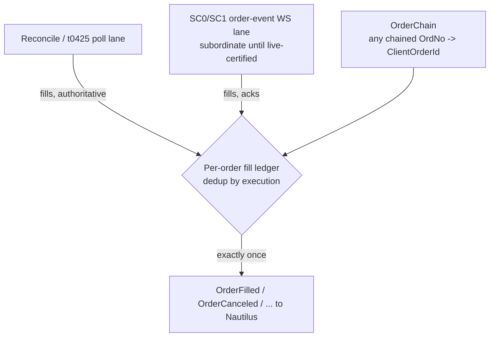
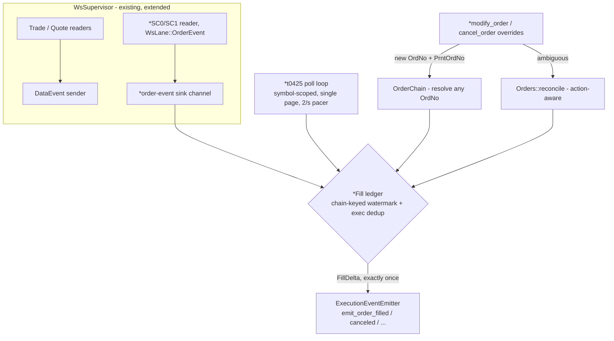
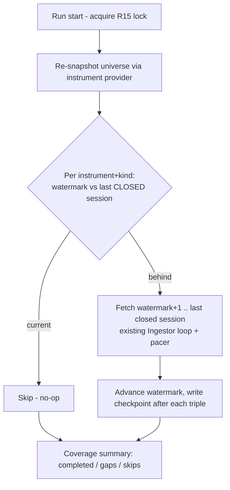

# Nautilus Adapter Execution Lane + Accumulate-Forward Ingestion - Plan

## Goal Capsule

- **Objective:** Make `adapters/nautilus/` a sufficient dependency for the separate follow-on strategy module (stocks-in-play ORB) on both of its paths: a real execution lane (live fill/modify/cancel emission) and operationalized whole-universe ingestion (accumulate-forward minute history + universe re-snapshot).
- **Product authority:** This document; owner dialogue of 2026-07-02. v1 constraints from docs/plans/2026-07-02-003-feat-nautilus-adapter-domestic-plan.md carry forward unrelitigated.
- **Open blockers:** None for planning. Two operator-gated empiricals gate certification legs only, not design: whether SC order-event frames arrive on the paper gateway, and the server-side t8412 minute-bar lookback cap.

---

## Product Contract

### Summary

One increment with two tracks. Track A closes the execution gap: the adapter emits `OrderFilled` (v1 emits no fill events at all), exposes modify/cancel through the Nautilus ExecutionClient surface, and wires the staged SC0/SC1 order-event lane — with polling-derived fills authoritative until a staged live probe proves SC frames on paper. Track B operationalizes ingestion: an idempotent accumulate-forward mode that grows whole-universe minute coverage and re-snapshots the universe from adoption day forward. Depth, the strategy module, and all other domains stay deferred.

### Problem Frame

The next planned work is a cross-sectional opening-range-breakout strategy living in its own module that consumes this adapter. That module needs two things the adapter cannot deliver today.

On the execution side, v1's gap is deeper than "staged but unwired": `ReconcileEvent` has no `Filled` variant and `emit_order_filled` exists only in a doc comment (adapters/nautilus/src/ws/rows.rs:201) — a strategy running against paper would never learn its orders filled. The SC0/SC1 decode structs and `OrderChain` exist and are unit-tested, but nothing sources fills, and modify/cancel are not exposed through the Nautilus trait surface.

On the data side, the ORB backtest wants whole-universe minute bars, and that is unobtainable as a backfill: at the 1 req/s per-TR cap a multi-year full-universe t8412 pull is ~10^6 requests (12+ days), and server-side minute lookback is likely capped outright (docs/plans/2026-07-02-003-feat-nautilus-adapter-domestic-plan.md:275). `LS_INGEST_KIND` today knows only `daily`/`minute:<n>` one-shot backfills. The v1 plan already names the answer — accumulate-forward — but no such mode exists. The same mechanism is also the only available bound on the point-in-time survivorship bias (t8430/t9945 return only currently-listed symbols; LS exposes no historical-listing TR).

### Key Decisions

- **Both tracks in one increment; depth deferred again.** The strategy module hits the backtest path (Track B) and the paper-live path (Track A) — a bar-driven scan needs no order-book depth. The deferral corrects the v1 plan's record: depth is *not* purely additive — shipped `BookRow` decodes only levels 1–2 + totals (adapters/nautilus/src/ws/rows.rs:99-124), not the full ladder the plan claimed.
- **Accumulate-forward from day one, not deep backfill.** Whole-universe minute depth accrues from adoption day via scheduled incremental pulls; the initial backfill is bounded by whatever the server lookback cap allows. Early backtests lean on deep full-universe daily bars plus shallow minute history that deepens over time. The follow-on strategy plan must price this in.
- **Polling-authoritative fills, SC lane subordinate behind one dedup seam.** Paper fills marketable orders in-window (proven by the PR #74 order wave), so poll-derived fill detection is certifiable today; whether paper delivers SC push frames is unknown. Both sources feed a single per-order fill ledger that emits each execution exactly once; flipping SC to primary after live certification is a configuration change, not rework.
- **Done-bar: offline-certified + staged live probe.** Done means the full execution lane is proven against mock SC frame sequences and poll-derived fills offline, with an operator-gated in-window probe staged (marketable order, observe SC lane). The probe's outcome decides SC primacy later; this increment does not block on an operator window.
- **Scheduling stays outside the adapter.** Accumulate-forward is an idempotent CLI mode safe to invoke any time; the scheduling story is a documented cron/launchd recipe, not a daemon. Defaulted decision, not owner-confirmed — cheap to flip at planning if wrong.
- **No ranking surface in the adapter.** The strategy ranks stocks-in-play from catalog bars, or calls the SDK's 14 Implemented rank-family TRs (t1452 et al.) directly; the adapter stays a Nautilus translation layer.

### Requirements

**Track A — execution lane**

- R1. The adapter emits fill events (full and partial) to Nautilus for orders it placed, on the bare paper gateway — fill emission must not be conditional on SC frames arriving.
- R2. Fill detection has two sources feeding one dedup seam: poll/reconcile-derived fills (authoritative this increment) and the wired SC0/SC1 lane (subordinate until live-certified). A fill observed by both sources emits exactly once.
- R3. Modify and cancel are exposed through the Nautilus ExecutionClient trait surface, with KRX order-chaining resolved: an event keyed on any chained OrdNo (modify/cancel issue new ones) resolves to the originating ClientOrderId, including a fill racing a modify ack.
- R4. Order-state handling stays fail-closed (v1 KTD6 stance carried forward): unknown or unresolvable events trigger reconcile, never a guessed emission; a rejected cancel emits cancel-rejected, not canceled.
- R5. The SC lane reuses the v1 WS supervisor behaviors (reconnect, drop-count-driven reconcile) rather than growing its own lifecycle.

**Track B — ingestion operationalization**

- R6. `ls-ingest` gains an accumulate-forward mode: an idempotent, checkpoint-driven incremental pull extending whole-universe minute and daily coverage from the last completed point to the present; invoking it when coverage is current is a cheap no-op.
- R7. Accumulate-forward runs re-snapshot the instrument universe, so newly listed symbols enter coverage — bounding the survivorship bias from adoption day forward.
- R8. The initial backfill is bounded and unattended-safe: whole-universe minute bars to the server's actual lookback cap plus full-universe daily bars, resumable and paced within per-TR limits without operator babysitting.
- R9. Accumulate-forward is safe to invoke at any time: it respects the v1 R15 live-session mutual-exclusion lock, and scheduling is a documented cron/launchd recipe rather than adapter code.
- R10. Full-universe runs report progress and finish with a summary (completed / gaps / skips) adequate for an unattended multi-hour run.

**Certification**

- R11. Everything above is offline-certified against the mock gateway: mock SC sequences (accept, partial fill, full fill, modify ack, cancel ack, duplicate and out-of-order frames), chain resolution, dedup, and accumulate-forward idempotency.
- R12. A live execution probe is staged and operator-gated: in a KRX window, a marketable order is placed and the SC lane observed; the recorded outcome decides whether SC becomes the primary fill source.

**Hygiene (v1 review residuals)**

- R13. The four duplicated tolerant-i64 parsers consolidate into one adapter-owned parsing seam, making the silent-zero vs named-error behaviors explicit choices.
- R14. `node_exec_tester` validates the operator-supplied resting price against the current market and daily band before submitting, refusing marketable or out-of-band prices instead of trusting the operator's pick.

### Acceptance Examples

- AE1. **Covers R2.** Given a fill already observed via the poll lane, when the same execution arrives as an SC1 frame, then exactly one OrderFilled is emitted.
- AE2. **Covers R3.** Given a modify in flight (new OrdNo issued), when a fill keyed on the original OrdNo arrives, then it resolves to the originating ClientOrderId and emits correctly.
- AE3. **Covers R1, R2.** Given the SC subscription is absent or failing (paper today), when an order fills, then the poll lane still emits the fill — no degradation.
- AE4. **Covers R6.** Given coverage current through the last session, when accumulate-forward runs twice in a row, then the second run completes as a no-op without refetching.
- AE5. **Covers R7.** Given a symbol newly listed since the last run, when the next accumulate-forward run executes, then the symbol appears in the universe and its coverage begins.
- AE6. **Covers R14.** Given a resting price at or above the best ask (or outside the daily band), when the exec tester is invoked, then it refuses before placing any order.

### Success Criteria

- The offline gate is green with the new surface exercised (mock-SC execution tests, accumulate-forward idempotency tests); zero diffs outside `adapters/nautilus/`; zero edits to the six SDK crates or root `Cargo.toml`.
- A scan-shaped strategy consumer can, offline: run a backtest over catalog bars produced by backfill + accumulate-forward, and receive submit/accept/fill/cancel events from the mock-gateway execution lane.
- The staged live probe and the two empirical unknowns (SC-on-paper, minute-lookback cap) are documented with exact operator invocations.
- The v1 depth claim ("row structs already decode the full ladder") is corrected wherever it appears in adapter docs.

### Scope Boundaries

Deferred for later:

- The strategy module itself (separate crate/module consuming this adapter; next plan).
- Full 10-level order-book depth (`OrderBookDeltas`/`Depth10`) — and note it is not additive as previously recorded: full-ladder decode is new work.
- Per-lane LatestOnly quote policy (still pending an SDK per-subscribe seam).
- Domestic F/O mapping and execution; overseas domains; real-money trading; startup reconciliation of pre-existing orders (flat-start-only stands); PyO3/upstream/crates.io.
- Any adapter-owned transport, auth, or rate limiting (permanently rejected; ls-core remains the single transport and safety authority).
- A scheduler daemon (idempotent CLI + cron recipe only, per Key Decisions).

### Dependencies / Assumptions

- Paper fills marketable orders during the KRX open window — proven by the PR #74 order wave; poll-derived fill certification depends on this only for the operator-gated leg, not the offline gate.
- Whether paper delivers SC0/SC1 push frames is unknown; the design must remain correct in both worlds (hence R1/R2), and the staged probe (R12) settles it.
- The server-side minute lookback cap is unknown; the initial backfill bound (R8) is sized after the staged max-lookback probe from the v1 plan runs.
- The strategy module is a separate consumer; nothing in this increment embeds strategy logic or ranking.
- All v1 hard constraints carry forward: translation layer over `LsSdk`, paper-only, offline-first with operator-gated live legs, standalone nested workspace pinned to nautilus =0.60.0 / Rust 1.96.

### Outstanding Questions

Deferred to planning:

- Scheduler stance: the idempotent-CLI + cron-recipe default stands unless the owner overrides it before design settles around it.
- Dedup-key semantics for the fill ledger (execution number vs order-number + quantity accounting) and how partial-fill accumulation interacts with reconcile-derived totals.
- Checkpoint schema extension for accumulate-forward (per-universe-snapshot coverage vs per-symbol ranges) and whether daily and minute share one cadence.
- Exact staged-probe procedure and where its record lands (smoke registry vs adapter README).
- Poll cadence and its rate-budget interaction with a live data session (v1 R15 buckets are per-process).

### Sources / Research

- v1 plan: docs/plans/2026-07-02-003-feat-nautilus-adapter-domestic-plan.md — deferrals (:129-137), accumulate-forward contingency (:147, :275), survivorship limitation (:148), strategy driver (:34, :158).
- Execution gap evidence: adapters/nautilus/src/orders/map.rs:61-74 (`ReconcileEvent`, no Filled variant); adapters/nautilus/src/execution.rs:248-297 (emitters: denied/submitted/accepted/rejected only); adapters/nautilus/src/ws/rows.rs:177-218 (staged Sc0/Sc1); adapters/nautilus/src/orders/chain.rs:1-11 (staged chain ops).
- Depth-claim discrepancy: adapters/nautilus/src/ws/rows.rs:99-124 (levels 1–2 only) vs the v1 plan's "already decode the full ladder" (:134).
- Ingestion surface: adapters/nautilus/src/bin/ls-ingest.rs:1-16 (`LS_INGEST_KIND` daily|minute only); adapters/nautilus/src/ingest/checkpoint.rs:1-25 (resume + `GapReason`); adapters/nautilus/src/ingest/pacer.rs:1-18.
- Parser duplication: adapters/nautilus/src/ws/rows.rs:19-30, adapters/nautilus/src/instruments.rs:82-97, adapters/nautilus/src/ingest/mod.rs:140-174.
- Exec tester: adapters/nautilus/src/bin/node_exec_tester.rs:1-11, :42-53.
- Rank-family TRs (strategy's alternative ranking source): metadata/trs/t1452.yaml and 13 siblings, all `implemented: true`.

---

## Planning Contract

**Product Contract preservation:** unchanged — planning added no product-scope edits; all R-IDs and Key Decisions stand as written.

### Planning-discovered facts

These verified findings shape the technical design below:

- The SDK already carries the order-event lane: `WsLane::OrderEvent` exists in `crates/ls-sdk/src/realtime/frame.rs` (register `"1"` / deregister `"2"`), with SC0 subscribed account-wide (`tr_key = ""`). SC0–SC4 all have metadata; SC1 is `implemented: true`. The adapter's `WsSupervisor` (adapters/nautilus/src/ws/supervisor.rs) hardcodes `WsLane::MarketData` and two `RowKind`s — the SC lane is an extension of the existing supervisor, not new transport.
- The nautilus 0.60 `ExecutionClient` trait ships default-impl `modify_order(ModifyOrder)` and `cancel_order(CancelOrder)` methods to override; the adapter currently overrides `submit_order` only. The trait also exposes `generate_fill_reports`/`generate_order_status_reports` (Nautilus startup reconciliation — out of scope, flat-start-only stands).
- The SDK's `ReconcileOutcome` carries state only, no fill quantities. Poll-derived fills must be computed adapter-side from t0425 rows (`cheqty` cumulative filled, `ordrem` remaining) under the gateway's 2/s per-TR cap (docs/solutions/integration-issues/ls-gateway-t0425-rate-limit-and-pagination-flat-scan.md).
- The SDK orders facade already has `modify(&CSPAT00701Request)` and `cancel(&CSPAT00801Request)`; both responses carry `order_no()` + `parent_order_no()` — exactly what `OrderChain::append_child` (staged, tested) needs.
- Test harness: wiremock via `ls-sdk-test-support` (`mock_config`, `mount_token`; t0425/t0424 mount helpers already exist in adapters/nautilus/tests/execution_client.rs) and `MockWsServer` for WS frame injection (used by adapters/nautilus/tests/data_client.rs) — mock SC frames need no new harness.
- t8450 (통합 주식현재가호가조회2, Implemented) returns `price`, `offerho1` (best ask), `uplmtprice`, `dnlmtprice` in one OutBlock — a complete band-guard data source. t1102 is *not* usable here: it has no best-ask field (its `offerno*`/`bidno*` fields are broker names, not quote prices).

### Key Technical Decisions

- KTD1. **The fill ledger is the single emission seam.** A new `orders/ledger.rs` owns per-order fill accounting keyed by the OrdNo chain: sources submit `FillObservation`s (poll row or SC1 frame), the ledger returns the `FillDelta`s to emit. **Accounting is per-OrdNo, not per-chain:** t0425 `cheqty` is cumulative *per order-number row* and restarts on a modify's new OrdNo, so each chained OrdNo carries its own cumulative watermark and the chain total is the sum — a per-chain watermark would under-emit fills that land on a post-modify OrdNo. **Cross-source merge rule:** SC observations dedup on execution number first, then every observation (either source) emits `max(0, source-cumulative − already-accounted)` against its OrdNo's watermark, so poll-then-SC1 of the same execution emits exactly once (AE1). **The ledger entry retains the order's emission context** — the `OrderAny` rebuilt from `OrderInitialized` at submit, updated as events apply — because every nautilus-live emit method takes `&OrderAny` and nothing else in the adapter holds one after the submit task ends; U2/U3/U4 convert `FillDelta`s to emissions through this registry. No lane emits `OrderFilled` directly — dual-source exactly-once (R2, AE1) lives in one tested component.
- KTD2. **Both sources always feed the ledger; "poll-authoritative" means the poll loop always runs.** SC being live-uncertified never gates correctness — fills emit at poll cadence when SC is silent (AE3). The post-certification "primacy flip" is a config relaxation of poll cadence, not a code path change.
- KTD3. **The SC lane rides the existing `WsSupervisor` *component* — on the exec client's own instance.** A new subscription kind subscribes SC0/SC1 via `WsLane::OrderEvent` with an order-event sink (a channel into the execution side, distinct from the `DataEvent` sender), inheriting rebuild, terminal-coalescing, and never-delivered diagnostics. **Instance ownership decided:** the exec client spawns its own supervisor over its own `WsManager` (each `sdk.realtime()` call is a fresh connection) rather than sharing the data client's instance — failure domains stay isolated (a market-data terminal storm cannot tear down the SC lane) and the data client is untouched; the cost is a second concurrent WS session per token, a posture the gateway has not been exercised on, so the U8 probe records whether the gateway tolerates it. A WS drop-count advance keeps driving reconcile via the existing `on_drop_count` seam (R5).
- KTD4. **SC0/SC1 only; SC2/SC3/SC4 deferred.** Modify/cancel acks arrive synchronously in the REST responses (new OrdNo + `PrntOrdNo`), and ambiguity routes through action-aware reconcile — the extra event codes add latency benefit only, and stay unwired this increment.
- KTD5. **Fill polling is symbol-scoped, single-page, paced to 2/s.** Reuse the adapter's per-TR pacer (`ingest/pacer.rs` pattern) at the t0425 gateway cap (tighter than the SDK's market-data bucket); never `collect_all` (page-cap trap). A truncated read never concludes "no fills" — fail toward reconcile (R4).
- KTD6. **Variant-keyed error mapping extends to modify/cancel unchanged** (carried from v1): `classify_submit_error` applies to all three actions; a rejected cancel emits cancel-rejected and the order stays open; ambiguous modify/cancel goes pending + action-aware reconcile with the original OrdNo; `Unknown` never authorizes retry.
- KTD7. **Accumulate-forward derives a per-(instrument, bar-kind) coverage watermark from the checkpoint** (new serde-defaulted field so existing checkpoint files load) **and never marks an in-session day complete.** "Last closed session" includes **today once now-KST is past the regular close plus a safety buffer** (e.g. 16:30 KST), else yesterday-or-earlier — a post-close cron must deliver the just-closed session, not lag it by a day. Each run: re-snapshot the universe (instrument provider → `write_instruments`), compute incremental ranges from watermark to the last closed session, run the `Ingestor` loop (extended for per-triple ranges, U5). In accumulate mode the **watermark map is the sole skip authority**, and each run's final save prunes completed-range keys and gap rows that fall entirely below an instrument's watermark (the run's own gaps report from memory) — otherwise daily whole-universe runs grow the per-triple-rewritten checkpoint without bound. Re-invocation when current is a no-op for bar fetches (R6); the intended cadence is a post-close cron (R9).
- KTD8. **The band guard sources t8450 and fails closed:** refuse when the operator price is ≥ best ask (`offerho1`), outside `[dnlmtprice, uplmtprice]`, or any of those fields is unparseable (hygiene R14).
- KTD9. **Parser consolidation keeps two explicit APIs:** a lossy empty-or-garbage→0 parser for the WS hot path and a strict named-error (`AdapterError::FieldParse`) parser for instruments/ingest — the consolidation makes the silent-zero choice visible at each call site, it does not unify behaviors (R13).

### High-Level Technical Design

Track A component wiring (new components marked `*`):

Accumulate-forward run logic:

### Assumptions

- `ExecutionEventEmitter` (nautilus_live 0.60) exposes the fill/cancel/modify-family emit methods the v1 doc comments reference (`emit_order_filled` et al.) — verify exact names at implementation; the seam design does not depend on them.
- Orders known only by a `RECON-` synthetic venue id (ambiguous-submit path) — and orders whose modify ack was ambiguous, leaving a new OrdNo unlearned — cannot be matched by SC frames, and a bare unknown-OrdNo drop would orphan their fills on the poll lane too. The poll loop therefore carries a **chain-adoption step** (U3): an unknown t0425 row is first adopted via its `orgordno` (chain repair after modify), else intent-corroborated (symbol + side + qty + price, mirroring the SDK's reconcile matching) against open `RECON-` entries; a unique match registers the real OrdNo into the chain before the observation applies, an ambiguous match keeps the reconcile-needed signal. This is why KTD2 keeps the poll loop unconditional.
- SC frame wire shapes come from the adapter-owned `Sc0Row`/`Sc1Row` structs (already decode-tested against the normalized baselines); no SDK edits.

---

## Implementation Units

### U1. Fill ledger — the dual-source emission seam

- **Goal:** One tested component that turns fill observations from any source into exactly-once fill deltas.
- **Requirements:** R1, R2, R11. Covers AE1.
- **Dependencies:** none (first — every other Track A unit plugs into it).
- **Files:** `adapters/nautilus/src/orders/ledger.rs` (new), `adapters/nautilus/src/orders/mod.rs` (export).
- **Approach:** Chain-keyed entries (integrates `OrderChain::resolve` so an observation on any chained OrdNo lands on the right order). Each entry: **per-OrdNo cumulative watermarks** (chain total = their sum — `cheqty` restarts on a modify's new OrdNo, KTD1), seen-execution-number set, open/terminal state, and the retained `OrderAny` emission context registered at submit (KTD1 — the emit methods take `&OrderAny`; the ledger is the only component alive to hold it). `apply(FillObservation) -> Vec<FillDelta>`: SC observations dedup by execno first; every observation then emits `max(0, source-cumulative − already-accounted)` against its OrdNo watermark. Terminal transitions (fully filled, canceled) drive `OrderChain::forget`.
- **Test scenarios:** Covers AE1 — poll observes a fill, then the same execution arrives as SC1: exactly one delta. SC1 partial fills accumulate (2 fills of 30 + 70 on qty 100 → two deltas, then terminal). Same SC execno replayed → no delta. **Post-modify accounting: a 30-fill on OrdNo₀, modify chains OrdNo₁, then a poll row for OrdNo₁ with `cheqty=40` → emits 40** (per-OrdNo watermarks; a naive per-chain watermark would emit 10). Poll cumulative regression (cheqty lower than that OrdNo's watermark) → no delta, flagged for reconcile. Observation on a chained (modified) OrdNo resolves to the original order. Unknown OrdNo → no emission, reconcile-needed signal (adoption is the poll loop's job, U3).
- **Verification:** unit tests green; ledger is the only public path that can produce a fill delta.

### U2. Order-event WS lane (SC0/SC1) through the supervisor

- **Goal:** SC frames flow from the gateway into the ledger, with the supervisor's existing resilience.
- **Requirements:** R2, R5, R11.
- **Dependencies:** U1; U7 (new numeric conversions call the `parse.rs` APIs — no fresh ad hoc parser).
- **Files:** `adapters/nautilus/src/ws/supervisor.rs`, `adapters/nautilus/src/ws/rows.rs` (SC ack-filter + sink conversion), `adapters/nautilus/src/parse.rs` (consume), `adapters/nautilus/src/execution.rs` (subscribe on connect, consume sink), `adapters/nautilus/tests/order_events.rs` (new, `MockWsServer`).
- **Approach:** New subscription kind carrying an order-event sender; SC0/SC1 subscribed with `tr_key = ""` on `WsLane::OrderEvent` — **through the exec client's own supervisor instance over its own `WsManager` (KTD3)** — at exec-client connect (after the flat gate). Reader converts `Sc1Row` → `FillObservation` (execno, exec qty/price via `parse.rs`, OrdNo) and `Sc0Row` → accept signal for chain registration cross-check; ack/null frames filtered exactly like market-data rows. Rebuild resubscribes the SC set; drop-count advances keep flowing to `on_drop_count`.
- **Execution note:** test-first against `MockWsServer` frame scripts — the mock frames ARE the offline certification of R11.
- **Test scenarios:** SC1 frame sequence (accept, partial, full fill) emits the right deltas via the ledger. Registration-ACK frame emits nothing. Terminal reconnect-budget error → rebuild resubscribes SC0/SC1 and frames flow again. SC frame for an unknown OrdNo → no emission + reconcile signal. Covers AE3's inverse: SC-only fills emit without the poll lane running.
- **Verification:** `tests/order_events.rs` green offline; no change to market-data lane behavior (existing `data_client.rs` tests untouched and green).

### U3. Poll-derived fill detection loop

- **Goal:** Fills emit on the bare paper gateway with no SC frames at all — the authoritative lane.
- **Requirements:** R1, R2, R4. Covers AE3.
- **Dependencies:** U1; U7 (new numeric conversions call the `parse.rs` APIs — no fresh ad hoc parser).
- **Files:** `adapters/nautilus/src/orders/poll.rs` (new), `adapters/nautilus/src/parse.rs` (consume), `adapters/nautilus/src/execution.rs` (spawn/stop), `adapters/nautilus/tests/execution_client.rs` (extend).
- **Approach:** A spawned loop that runs while the ledger has open orders: per open symbol, a single-page `T0425Request::for_symbol` read through a per-TR pacer at ≤2/s (KTD5), rows mapped to cumulative `FillObservation`s; numeric fields parse via the U7 `parse.rs` strict APIs. **Chain adoption before apply:** a row whose ordno is unknown to the chain is adopted via its `orgordno`, else intent-corroborated against open `RECON-` entries (unique match → register real OrdNo; ambiguous → reconcile-needed signal) — without this, ambiguous-path orders' fills are unemittable on both lanes. **Fill price basis (KTD5):** poll-derived fills emit at the order's limit price — the SDK's `T0425OutBlock1` models `price` (order price) only; the wire's `cheprice` is not modeled and SDK edits are out of scope (named v-next SDK follow-up: add `cheprice` to `T0425OutBlock1`). The SC lane supplies the true `execprc` once certified. Poll-derived fills carry a deterministic synthetic `TradeId` (derived from OrdNo + cumulative-filled watermark; scheme specified in-unit so it cannot collide with real SC execnos). Truncated page (`cts_ordno` non-empty) → do not conclude anything from the partial page; trigger reconcile (fail-closed, mirrors the flat gate). Loop idles when flat; configurable cadence (the post-certification primacy flip of KTD2).
- **Test scenarios:** Covers AE3 — order accepted, t0425 later shows `cheqty > 0`: OrderFilled emits with poll-derived qty at the order's limit price (documented basis, KTD5) and a deterministic synthetic TradeId. Partial then full fill across two polls → two deltas. **A RECON--accepted order fills: the unknown-ordno row intent-corroborates against the open RECON- entry, the real OrdNo registers into the chain, and the fill emits.** **Chain repair via `orgordno`: a row whose ordno is unknown but whose `orgordno` resolves adopts into that chain.** Ambiguous corroboration (two open RECON- entries match) → no adoption, reconcile-needed. Truncated t0425 → no fill conclusion, reconcile path taken. Pacing: two symbols poll without exceeding 2/s (test the pacer wiring, not wall-clock). Flat ledger → loop idles (no t0425 calls).
- **Verification:** extended `execution_client.rs` tests green against wiremock; fill emission provably independent of the SC lane.

### U4. modify_order / cancel_order trait overrides

- **Goal:** The Nautilus modify/cancel commands reach the venue with chain-correct identity and fail-closed classification.
- **Requirements:** R3, R4. Covers AE2.
- **Dependencies:** U1 (terminal handling), existing `OrderChain`.
- **Files:** `adapters/nautilus/src/execution.rs`, `adapters/nautilus/src/orders/map.rs` (action-aware event mapping), `adapters/nautilus/tests/execution_client.rs` (extend).
- **Approach:** Override the trait's `modify_order`/`cancel_order` (spawned workers mirroring `run_submit`). Target OrdNo = latest in the order's chain. On ack: `append_child(parent, new_ord_no)` + emit updated/pending-cancel per Nautilus lifecycle. Classification reuses `classify_submit_error`; a rejected cancel emits **cancel-rejected** (order stays open, KTD6); ambiguous outcomes build the modify/cancel `reconcile_intent` (action-aware — references the original order number) and route through `classify_reconcile`. `append_child` returning false (unknown parent) → reconcile, never guess.
- **Test scenarios:** Covers AE2 — modify acks new OrdNo 1002; an SC1 fill keyed on 1001 still resolves and emits on the original ClientOrderId. Cancel ack → OrderCanceled + chain forget. Cancel business-rejected → cancel-rejected event, order remains open in the ledger. Ambiguous (5xx) cancel → pending + reconcile; reconciled `Canceled` → canceled; reconciled `Unknown` → stays pending, never retried. Modify of an unknown/never-accepted order → denied.
- **Verification:** the full modify/cancel matrix green offline; no `SubmitAction` arm can silently drop a possibly-resting order.

### U5. Accumulate-forward ingestion mode

- **Goal:** Whole-universe minute/daily coverage grows idempotently from adoption day, universe re-snapshot included.
- **Requirements:** R6, R7, R8, R9, R10. Covers AE4, AE5.
- **Dependencies:** none (parallel track).
- **Files:** `adapters/nautilus/src/ingest/mod.rs`, `adapters/nautilus/src/ingest/checkpoint.rs`, `adapters/nautilus/src/bin/ls-ingest.rs`, `adapters/nautilus/tests/ingest.rs` (extend), `adapters/nautilus/README.md` (cron recipe).
- **Approach:** Checkpoint gains a serde-defaulted per-(instrument, bar-kind) watermark map (existing checkpoint files load unchanged); in accumulate mode the watermark map is the sole skip authority, and the final save prunes completed-range keys and gap rows entirely below an instrument's watermark, reporting the run's own gaps from memory (KTD7 — the checkpoint is fully rewritten per triple, so unpruned daily runs grow it without bound). New mode (env-selected in `ls-ingest`, e.g. `LS_INGEST_MODE=accumulate`) per KTD7: acquire the R15 advisory lock, re-snapshot the universe (`write_instruments`), compute per-instrument ranges watermark→last **closed** session (session-clock rule: include today once now-KST is past the close + buffer, e.g. 16:30 KST; else yesterday-or-earlier), run the fetch/write loop + pacer, advance watermarks per completed triple, finish with the coverage summary (R10). **Seam extension required first:** the shipped loop is range-global — `DailyFetcher::fetch_daily_page` takes no dates and `SdkFetcher` bakes one sdate/edate at construction — so extend `DailyFetcher`/`SdkFetcher` to take sdate/edate per call (matching `MinuteFetcher`'s shape) and the `Ingestor` per-triple loop to accept a per-triple range; this ripples into the existing `ingest.rs` fetcher fakes. The cron recipe pins the lock dir to the catalog directory and requires the same of any live-node/tester process (the R15 lock is directory-scoped; different lock dirs bypass it). Initial bounded backfill is the same mode with an empty watermark and a configured lookback floor.
- **Execution note:** mostly plumbing over the proven `Ingestor`; prefer fetcher-trait fakes (existing `DailyFetcher`/`MinuteFetcher` seams) over wiremock for the loop tests.
- **Test scenarios:** Covers AE4 — run twice with coverage current: second run makes zero **bar** fetches (the universe re-snapshot still runs, per R7). Covers AE5 — universe re-snapshot surfaces a new instrument; its coverage begins at the configured lookback floor. Session-clock rule: an 18:00-KST-clock run ingests the same-day session; a 10:00-KST-clock run does not (watermark never advances into an in-session day). Interrupted run resumes without refetching completed triples (existing checkpoint semantics hold). Legacy checkpoint file (no watermark field) loads and derives watermarks without error. Gap-reason triples (empty history) advance the watermark and are reported, not retried forever. Checkpoint pruning: after a run, completed keys and gap rows below the watermark are gone; the run summary still reports that run's gaps.
- **Verification:** extended `ingest.rs` green; a documented cron one-liner in the README; `ls-ingest` refuses to run without the lock.

### U6. Marketability/daily-band guard on node_exec_tester

- **Goal:** The exec tester refuses an operator price that could fill or be rejected out-of-band.
- **Requirements:** R14. Covers AE6.
- **Dependencies:** none.
- **Files:** `adapters/nautilus/src/bin/node_exec_tester.rs`, guard logic + tests in `adapters/nautilus/src/rules.rs` (or a small new module — implementer's call).
- **Approach:** Before submitting, fetch t8450 for the symbol; refuse (KTD8) when `LS_NODE_PRICE` ≥ best ask (`offerho1`), outside `[dnlmtprice, uplmtprice]`, or any field unparseable/zero. Pure guard function unit-tested offline; the bin remains operator-gated.
- **Test scenarios:** Covers AE6 — price at/above best ask → refuse before any order call. Price below `dnlmtprice` → refuse. Price valid-resting → proceed. Unparseable band fields → refuse (fail-closed). Zero/absent `offerho1` (no ask side) → refuse.
- **Verification:** guard unit tests green; the tester's happy path unchanged for a valid resting price.

### U7. Tolerant-parser consolidation

- **Goal:** One parsing module; the silent-zero vs named-error choice explicit at every call site.
- **Requirements:** R13.
- **Dependencies:** none (land first or anytime; pure refactor).
- **Files:** `adapters/nautilus/src/parse.rs` (new), call-site migrations in `adapters/nautilus/src/ws/rows.rs`, `adapters/nautilus/src/instruments.rs`, `adapters/nautilus/src/ingest/mod.rs`.
- **Approach:** Two APIs per KTD9 (`lossy_i64` — WS hot path, empty/garbage→0; `strict_i64(field)` → `AdapterError::FieldParse` — instruments/ingest). Pure relocation of behavior: no call site changes semantics in this unit.
- **Test scenarios:** Test expectation: behavior-preserving — port the four sites' existing edge-case tests (empty string, garbage, f64-truncate, negative) to the new module and keep the call-site tests green unchanged.
- **Verification:** all pre-existing tests green with zero assertion edits; exactly one lossy parser remains in the crate.

### U8. Staged SC live probe + record corrections

- **Goal:** The R12 operator probe is runnable in one command, and the v1 depth-claim error is corrected.
- **Requirements:** R12; success criterion "depth claim corrected".
- **Dependencies:** U2, U6.
- **Files:** `adapters/nautilus/src/bin/node_exec_tester.rs` (SC observation mode), `adapters/nautilus/README.md`, `adapters/nautilus/Makefile` or run docs (whichever v1 established for the tester).
- **Approach:** An env-gated probe mode with two legs. Leg 1 (default): during the tester's existing guarded resting-order chain (submit → modify → cancel at a safe price, band-guarded by U6), concurrently subscribe SC0/SC1 and record whether accept frames arrive — this leg can certify SC0 only, since a deliberately non-marketable order never fills. Leg 2 (separately env-gated, required for the SC1 verdict): a small marketable buy mirroring the PR #74 marketable-fill pattern (SC observation window, then sign-aware close-out), bypassing the U6 resting-price guard only under this probe flag — the only way an SC1 fill frame is observable. The verdict line distinguishes SC0-seen / SC1-seen / silent per leg (a bare "silent" is uninterpretable on the resting leg), and also records whether the gateway tolerated the exec client's second WS session (KTD3). Probe docs pin the tester's lock dir (`LS_NODE_LOCK_DIR`) to the catalog directory so the R15 exclusion actually contends with cron ingest runs. Document the invocation + where the verdict lands. Correct the "row structs already decode the full ladder" claim in the adapter README (and note it in the v1 plan's errata if the repo convention allows).
- **Test scenarios:** Test expectation: none beyond compile + a unit test on the verdict formatting — the mode is operator-gated live behavior; its logic reuses U2's tested lane.
- **Verification:** probe documented and invocable; not run by the offline gate; README no longer claims full-ladder decode.

---

## Verification Contract

| Gate | Command / check | Applies to |
|---|---|---|
| Adapter tests | `cargo test` in `adapters/nautilus/` — all offline, no gateway | U1–U8 |
| Adapter lints | `cargo clippy` clean in `adapters/nautilus/` (v1 shipped 0 warnings) | U1–U8 |
| Root gate untouched | `cargo test` + `make docs-check` at repo root unaffected (no SDK/metadata edits) | all |
| Diff confinement | source diffs confined to `adapters/nautilus/` (docs/plans and memory excepted) | all |
| Live legs | none run by the gate; U8's probe is operator-gated (`#[ignore]`-equivalent posture) | U8 |

---

## Definition of Done

- U1–U8 complete and their test scenarios green under the adapter's offline `cargo test`; root gate unaffected; zero edits to the six SDK crates or root `Cargo.toml`.
- Offline certification (R11) demonstrable: mock SC sequences, dual-source dedup, modify/cancel matrix, accumulate-forward idempotency all exercised by named tests.
- The scan-shaped consumer check (Product Contract success criteria) passes: an offline backtest over catalog bars plus a mock-gateway submit→fill→cancel round-trip through the execution client.
- The SC live probe (R12) and the minute-lookback probe are documented with exact operator invocations — staged, not run; 0 metadata flips in this increment.
- Adapter README corrected (depth claim) and extended (accumulate-forward cron recipe).

---

## Deferred / Open Questions

### From 2026-07-02 review

- **Accumulate-forward assumes bar history is append-only; adjusted daily prices are not** — R6 / KTD7 / U5 (P2, adversarial, confidence 75)

  The v1 catalog ingests daily bars on an adjusted-price basis (checkpoint records `adjusted_prices`), and adjusted series are rewritten server-side by every split/dividend — so bars accumulated before a corporate action sit on a different price basis than bars appended after it. The spliced series shows exactly the kind of overnight discontinuity a stocks-in-play/gap scanner treats as signal, silently corrupting the primary consumer's backtest. The plan discusses the survivorship (listing) bias in depth but never the adjustment-basis bias, and the watermark design has no re-basing or invalidation mechanism. Candidate stances: unadjusted accumulation with adjustment applied at read time, or a per-symbol re-pull trigger on detected basis shifts — decide at U5 kickoff and add to the follow-on strategy plan's priced-in list.
