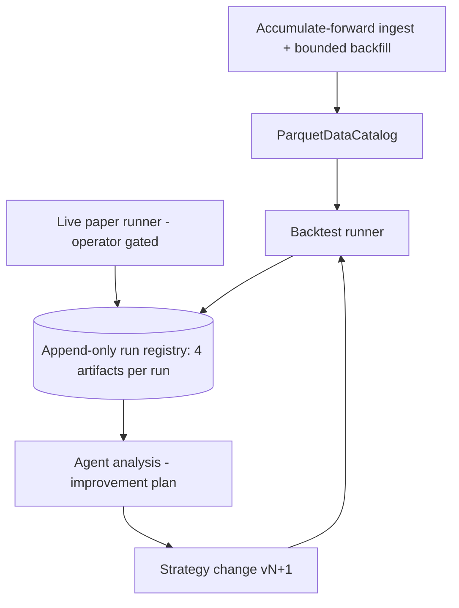
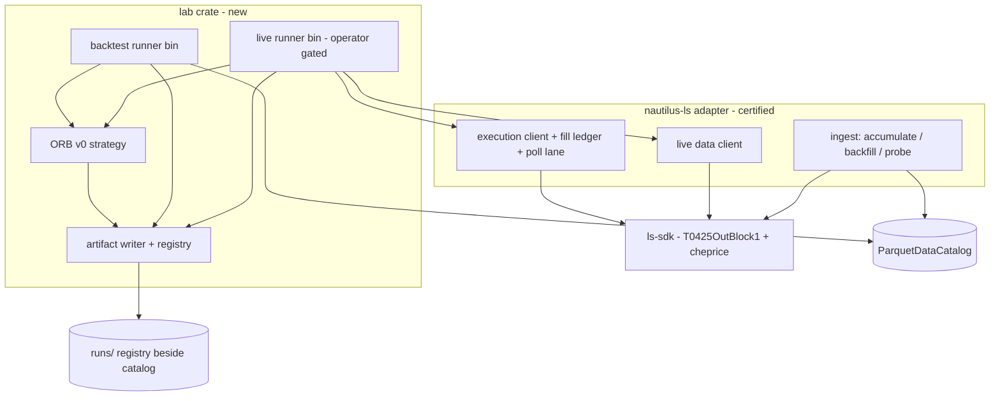

# Nautilus Strategy-Improvement Loop - Plan

## Goal Capsule

- **Objective:** Stand up the adapter's strategy-improvement loop — a strategy-lab crate carrying a starter ORB strategy, backtest and live-paper runners that emit one shared run-artifact set into an append-only run registry, data readiness via the max-lookback probe plus a bounded minute backfill, and true live fill prices via the SDK `cheprice` addition — proven by one full loop iteration.
- **Product authority:** The Product Contract below (confirmed 2026-07-03), then the Planning Contract's KTDs, then per-unit approach notes. Product Contract preservation: unchanged from the brainstorm except the Outstanding Questions section, whose five deferred-to-planning items are resolved in KTD-2, KTD-3, KTD-6, KTD-7, and KTD-10 (no scope change).
- **Execution profile:** Offline-first. All units build and prove offline; the live runner, the lookback probe, and the backfill are staged operator recipes, never run by the gate or by an autonomous executor.
- **Stop conditions:** Stop and surface rather than guess if the SDK `cheprice` change trips any gate cross-check (unexpected — see KTD-5), if nautilus 0.60 turns out not to expose an offline-usable analyzer path (KTD-3 fallback is lab-computed stats, but confirm before diverging), or if any change would touch metadata support flags (this increment flips nothing).
- **Open blockers:** None for implementation. Live legs are operator-gated on credentials and a KRX window and sit outside the Definition of Done.

---

## Product Contract

### Summary

Build the loop that improves trading strategies, not a finished strategy: a separate strategy-lab crate runs a starter opening-range-breakout strategy through backtests and live paper sessions, every run emits the same four artifacts (performance report, per-decision signal log, data-quality report, run manifest) into an append-only run registry, and an agent analyzes those artifacts to propose the next strategy change. The SDK gains `cheprice` so live fills report true execution prices.

### Problem Frame

PRs #88 and #89 finished the adapter's rails: instruments, catalog ingestion with accumulate-forward, a live data client, and an execution lane with exactly-once fill emission. But nothing runs on those rails. The only strategy in the repo is a placeholder inside `adapters/nautilus/tests/backtest_e2e.rs`, no run produces a record an agent could analyze, and minute-bar history is days deep because accumulation only just started.

The owner's stated development model is a loop: collect proper data, backtest, have an agent analyze the results and plan improvements, change the strategy, backtest again. That loop cannot turn today — there is no strategy module to change, no artifact for the agent to read, and no way to tell whether two runs are comparable. Strategy quality is explicitly not the problem to solve now; the loop's existence is.

### Key Decisions

- **The lab is a separate crate; the adapter stays strategy-free.** Strategy code, runners, and the artifact writer live in a new crate beside `nautilus-ls` in the nested workspace (its `[workspace] members` currently holds only the adapter). The loop exists to generate strategy churn, and churn must not destabilize the certified adapter, whose contract is translation only.
- **ORB v0 is a starter, not a deliverable.** The strategy ships with plan-defined default parameters and no tuning. Its quality is irrelevant to this increment's success; it exists so the loop has something real to improve.
- **One artifact schema, two sources.** Backtest runs and live paper runs emit the identical artifact set into the same registry, with the source recorded. Live sessions become just another run the agent can analyze.
- **True fill prices come from the SDK, not SC certification.** The `cheprice` execution-price field is added to the SDK's `T0425OutBlock1` (this repo owns the SDK), so the authoritative poll lane reports real prices deterministically. The staged SC live probe remains staged and optional — it is not a dependency of this increment.
- **Data fidelity is flagged, not fixed.** Adjustment-basis splices (a documented limitation) and live-run accounting caveats from standing exec-lane deferrals (reconcile-advised conditions, cancel-sends-current-qty) are surfaced in the data-quality report so the agent can discount affected runs. Re-basing and exec-lane hardening stay deferred.
- **Probe before backfill.** The staged max-lookback probe runs first and its recorded result sizes the bounded whole-universe minute backfill; if the server allows only shallow history, the loop proceeds on thin data and depth grows via daily accumulation.
- **Done means the loop turned once.** Backtest ORB v0, agent produces an improvement analysis from the artifacts, a change lands, the re-backtest compares against the first run via manifests. The live paper session is staged and operator-gated, outside the definition of done.



### Actors

- A1. Operator — runs the probe, the backfill, and any live paper session; gates everything that touches the gateway.
- A2. Analysis agent — reads a run's artifacts from the registry, produces an improvement analysis, and proposes the next strategy change.

### Requirements

**Strategy lab**

- R1. A strategy-lab crate, separate from the adapter crate, houses all strategy code, the runners, and the artifact writer; the adapter gains no strategy logic.
- R2. A starter stocks-in-play opening-range-breakout strategy ships as the lab's first payload, runnable unchanged in both backtest and live paper.
- R3. ORB v0's parameters (universe filter, opening-range window, entry/exit, sizing) are plan-defined defaults recorded in the run manifest, not tuned values.

**Run artifacts and registry**

- R4. Every run — backtest or live paper — emits the same four artifacts: performance report, per-decision signal log, data-quality report, and run manifest.
- R5. The performance report carries the trade/fill ledger, per-trade P&L, an equity curve, and summary statistics.
- R6. The signal log records every candidate the strategy evaluated with the decision taken and the reason — which filter rejected a skipped candidate, and the signal values at decision time.
- R7. The data-quality report records coverage gaps, shallow-history symbols, adjustment-basis splice flags, the universe snapshot used, and — for live runs — any reconcile-advised conditions observed during the session.
- R8. The run manifest pins the strategy version, the full parameter set, the data range, and the catalog state, so any two runs are comparable and any run is reproducible.
- R9. Artifacts land in an append-only run registry with the run's source (backtest or live) recorded; runs are never overwritten, and artifact formats are agent-readable files.

**Data readiness**

- R10. The staged max-lookback probe runs before the backfill and its result is durably recorded; the recorded cap sizes the initial minute backfill.
- R11. A bounded whole-universe minute backfill fills the catalog to the probed cap, after which the existing accumulate-forward recipe carries coverage growth.

**Live paper leg**

- R12. A live paper runner runs the same strategy against the paper gateway in-window, operator-gated, and emits the same artifact set into the same registry.
- R13. The SDK models `cheprice` in `T0425OutBlock1`, and the adapter's poll lane emits live fills at the reported execution price instead of the order's limit price.
- R14. Live-run artifacts carry the accounting-fidelity caveats of the standing exec-lane deferrals, so the agent can distinguish a strategy problem from an accounting artifact.

**Agent loop**

- R15. Each loop turn's improvement analysis is stored alongside the runs it analyzed, so later turns build on prior analyses rather than restarting.

### Key Flows

- F1. Loop iteration (backtest)
  - **Trigger:** A1 or A2 invokes the backtest runner on the current catalog with strategy vN.
  - **Steps:** Runner loads instruments and bars from the catalog; the strategy runs in a BacktestEngine; the four artifacts land in the registry; A2 reads them and writes an improvement analysis; a strategy change lands as vN+1; the re-run's manifest is compared against vN's.
  - **Outcome:** Two manifest-comparable runs and a stored analysis linking them. **Covers R2, R4-R9, R15.**
- F2. Live paper session
  - **Trigger:** A1 starts the live runner in a KRX window (holding the live advisory lock, so ingest cannot run concurrently).
  - **Steps:** The strategy trades on the paper gateway; the poll lane emits fills at `cheprice`; session events including any reconcile-advised conditions are captured; artifacts land in the registry marked as a live run.
  - **Outcome:** A live run the agent can analyze beside backtests, with fidelity caveats visible. **Covers R12-R14, R4-R9.**

### Acceptance Examples

- AE1. **Covers R8.** Given two runs whose manifests differ only in strategy version, when the agent compares them, the manifests alone identify the parameter and data deltas — no re-run or source diff needed.
- AE2. **Covers R6.** Given a backtest in which a candidate symbol was evaluated and skipped, the signal log names the rejecting filter and the signal values at that moment.
- AE3. **Covers R7, R14.** Given a live session during which the poll loop hit an inconclusive pass (truncation or unresolved row), the run's data-quality report flags a reconcile-advised condition and the agent treats that run's accounting as suspect.
- AE4. **Covers R10, R11.** Given the max-lookback probe reveals the server serves only a shallow minute history, the backfill bounds to that depth, the loop proceeds anyway, and each run's data-quality report records the shallow coverage.
- AE5. **Covers R13.** Given a live fill whose execution price differs from the order's limit price, the performance report shows the execution price.

### Success Criteria

- One full loop iteration completed offline: backtest ORB v0 → agent-produced improvement analysis → a landed change → re-backtest, with the two runs comparable via their manifests.
- The offline gate stays green (workspace tests, docs-check, lane-check), including the SDK `cheprice` change passing the root gate.
- The live paper leg and the probe/backfill are fully staged with documented operator recipes, run at the operator's discretion.

### Scope Boundaries

**Deferred for later**

- Strategy tuning and optimization — that is what subsequent loop iterations are for.
- Adjusted-price re-basing (flag-only this increment), 10-level depth, tick-data ingestion, SC-lane certification and primacy flip, exec-lane hardening (reconcile-driving, remaining-qty cancel, cancel-ack late-fill window), startup reconciliation.
- Domestic F/O, overseas domains, real-money trading, PyO3/upstream/crates.io, any scheduler daemon (the cron recipe stands).
- Analysis tooling — the agent reads artifact files directly; no comparison CLI or dashboard ships.

### Dependencies and Assumptions

- The paper gateway fills marketable orders in-window (proven in PR #74); live-leg value depends on it.
- The probe, backfill, and live session are operator actions gated on lane credentials and KRX windows.
- The ingest ↔ live advisory locks mean the backfill and a live session cannot run concurrently — a scheduling constraint on loop days, not a defect.
- The `cheprice` addition is an SDK-crate change and carries the SDK's own gate obligations (baseline, docs projection); the adapter consumes it from the path dependency.

### Sources

- `adapters/nautilus/README.md` — backfill budget and accumulate-forward recipe, the unknown minute-lookback cap, the adjustment-basis limitation, the dual-source fill design and limit-price caveat, the staged SC probe.
- `adapters/nautilus/src/orders/poll.rs` and `src/execution.rs` — poll-lane fill emission at limit price, reconcile-advised conditions being warn-log-only, the cancel path sending current order quantity.
- `adapters/nautilus/tests/backtest_e2e.rs` — the placeholder ORB proving catalog → BacktestEngine works end-to-end.
- `docs/plans/2026-07-02-003-feat-nautilus-adapter-domestic-plan.md` and `docs/plans/2026-07-02-004-feat-nautilus-adapter-exec-ingest-increment-plan.md` — deferred-item ledgers this increment draws from (strategy module, staged max-lookback probe, `cheprice` follow-up).

---

## Planning Contract

### Key Technical Decisions

- KTD-1. **Lab crate `adapters/nautilus/lab`, second member of the nested workspace.** `adapters/nautilus/Cargo.toml` gains `members = [".", "lab"]`; the lab pins the same `=0.60.0` nautilus lockstep (0.60.0 is the latest published as of 2026-07-03; nautilus types cross the lab↔adapter boundary, so versions must match) and depends on `nautilus-ls` by path. `nautilus-trading` (strategy macros) becomes a real dependency of the lab while staying dev-only in `nautilus-ls`, preserving the adapter's ships-no-strategy contract.
- KTD-2. **Registry layout, artifact formats, and artifact hygiene.** Runs live beside the catalog under one data home: `<data>/catalog/`, `<data>/runs/<run_id>/`, `<data>/probes/`, with `run_id = <UTC start stamp>-<source>-<strategy_id>-v<strategy_version>`. Keeping `runs/` outside the catalog tree protects the loop's run history from the deferred adjusted-price re-base, which may rewrite the catalog wholesale — a future re-base must not touch `runs/`. Files: `manifest.json`, `performance.json`, `signals.jsonl`, `data_quality.json`, and (agent-written later) `analysis.md`. A run writes into `<data>/runs/.tmp-<run_id>/` and finalizes by atomic rename, mirroring the ingest checkpoint's atomic-save pattern; a leftover `.tmp-` directory marks an aborted run and is reported, never silently reused. Artifacts are credential-free by construction, mirroring the Focused Evidence convention: no account numbers, tokens, or raw broker/SDK error strings — observations are typed enums plus counts, and any free-text field passes the adapter's scrub before write (write-time, so aborted `.tmp-` directories are clean too). The advisory locks cover only ingest↔live, so the backtest runner adds its own guard (U5). This resolves the artifact-format and analysis-location open questions.
- KTD-3. **Performance stats reuse `nautilus-analysis`'s PortfolioAnalyzer.** The pinned 0.60.0 Rust crates ship a full statistics suite (Sharpe, Sortino, max drawdown, win rate, profit factor, expectancy, returns volatility — `nautilus-analysis-0.60.0/src/statistics/`). The lab assembles the per-trade ledger and equity curve from engine/ledger fill events and feeds the analyzer for summary stats rather than reimplementing them. Resolves the built-ins-vs-lab-computed open question in favor of reuse.
- KTD-4. **Live fill price = the t0425 row's `cheprice`, with a flagged fallback.** `FillDelta` carries an execution price sourced from the row's `cheprice` when it parses to a positive value, else falls back to the ledger's limit price and sets a `price_approximated` flag that lands in the data-quality report. A row carries one `cheprice` per order, so an order filled at multiple prices emits deltas at the row's current value — better than limit price, still approximate; exact per-fill prices arrive only when the SC lane is certified. Because multi-price fills are approximate by construction, every delta emitted against an OrdNo whose fill watermark was already positive (any beyond-first partial fill) also sets `price_approximated`, and the data-quality report counts both flag sources — the agent never reads approximated prices as exact (R14). The operator recipe notes that `cheprice`'s last-vs-average semantics stay uncharacterized until a live multi-fill observation. The existing `poll_emits_fill_at_limit_price` behavior becomes the fallback path.
- KTD-5. **The SDK change is struct-and-tests only.** The normalized baseline already models `cheprice` (`crates/ls-trackers/baselines/api-drift/normalized/trs/t0425.json:330`, Number, 체결가격, response `t0425OutBlock1`), and `metadata/trs/t0425.yaml` does not enumerate response fields — so no metadata edit, no baseline edit, no docgen churn. The field deserializes with `ls_core::string_or_number` under `#[serde(default)]` like its siblings, tolerating servers that omit it.
- KTD-6. **ORB v0 defaults (all manifest-recorded parameters).** Universe: stocks-in-play scan over prior-session daily bars — gap ≥ 3% versus prior close, ranked by prior-session turnover, top 20. Opening range: 09:00–09:15 KST from the adapter's `rules.rs` session times. Entry: breakout above range high, marketable limit. Stop: range low. Exit: time-flat by 15:00 KST. Sizing: fixed notional per position, max 5 concurrent positions. Values are starter defaults the loop exists to revise; none are tuned claims.
- KTD-7. **Live runner safety is fail-closed and reuses adapter guards.** The live runner takes the live advisory lock, honors the paper-only interlock, and runs a session teardown at exit or market close: stop the strategy's order emission first, cancel all resting orders, run a quantity-keyed t0425 flatness check per the repo's account-flat-assertion conventions (positive confirmation only; a truncated read is not flat), and engage the exec client's kill switch only after the closing cancels complete — halting before an order-placing teardown defeats it (the documented kill-switch-ordering trap; `node_exec_tester` is the pattern). Artifacts finalize on teardown; a crash leaves the `.tmp-` run directory as the aborted-run marker. Poll cadence stays inside the t0425 2/s pacer; per-process rate buckets plus the locks answer the live-plus-ingest rate-budget question — they cannot run concurrently.
- KTD-8. **Manifest comparability = pinned range + range-scoped catalog fingerprint.** The manifest records strategy id/version, the full parameter set, the explicit bar data range (start/end dates), a fingerprint hashing the catalog parquet objects (path + content) that intersect the pinned range, and the universe snapshot hash; the ingest checkpoint's content hash rides along as a secondary informational field. Because accumulate-forward grows the catalog daily, a comparison re-run pins the same explicit end date — identical pinned-range data then yields an identical fingerprint across accumulate days (a whole-checkpoint hash would differ on every cron run and teach the agent to ignore it), and a changed fingerprint means real in-range drift.
- KTD-9. **Signal log is per-decision, not per-bar.** Entries are decision events: one per universe candidate at selection time (accept/reject + rejecting filter + signal values), one per state transition on selected symbols (breakout crossed, order placed or rejected by sizing, stop hit, time exit), plus one end-of-session summary event per selected symbol carrying the extreme signal values observed. Volume is O(universe × transitions per day) — never universe × bars, which per-bar entry/exit evaluation logging would produce. JSONL, one event per line.
- KTD-10. **Probe result is a durable file the backfill reads.** The max-lookback probe (staged since the v1 plan) becomes an ingest mode that locates the earliest served minute date for a liquid pilot symbol by searching over multi-day windows — each step queries a span of at least 7 calendar days so every step contains trading days, and only an all-empty window reads as beyond-lookback (a single-date probe would converge wrongly on KRX weekends/holidays). It writes `<data>/probes/minute-lookback.json` recording the earliest served date, the derived depth in calendar days, and the probe timestamp; the backfill derives `LS_INGEST_LOOKBACK` from both forms (the depth form keeps a rolling-window lookback honest when probe and backfill are days apart) bounded by an explicit operator budget floor. Both are operator-gated; offline tests cover the windowed search and the file round-trip against wiremock.

### High-Level Technical Design

Component topology — what is new (lab), what is touched (SDK field, poll lane), and what is reused unchanged:



Fill-price data flow (directional guidance): t0425 row → `parse` cheprice → positive? emit `FillDelta{price: cheprice}` : emit `FillDelta{price: limit, approximated}` → OrderFilled event → lab fill listener → per-trade ledger → PortfolioAnalyzer → `performance.json`; the `approximated` flag also feeds `data_quality.json`.

### Output Structure

New lab crate and registry shape (scope declaration; per-unit Files lists are authoritative):

```text
adapters/nautilus/lab/
  Cargo.toml
  src/
    lib.rs
    params.rs            # ORB parameter set, serde round-trip into the manifest
    strategy/orb.rs      # ORB v0 (universe seam, range, entry/exit, sizing)
    signals.rs           # per-decision event types + JSONL sink
    artifacts/
      mod.rs             # RunWriter: tmp-dir lifecycle, atomic finalize
      manifest.rs
      performance.rs     # ledger assembly + nautilus-analysis integration
      data_quality.rs
    runner/
      backtest.rs
      live.rs
  src/bin/
    lab-backtest.rs
    lab-live.rs          # operator-gated
  tests/
    strategy.rs
    artifacts.rs
    backtest_run.rs
    live_wiring.rs

<data>/catalog/             # ParquetDataCatalog
<data>/runs/<run_id>/{manifest.json, performance.json, signals.jsonl, data_quality.json, analysis.md}
<data>/probes/minute-lookback.json
```

---

## Implementation Units

### U1. SDK: model `cheprice` in `T0425OutBlock1`

- **Goal:** The SDK exposes the execution price the wire already carries.
- **Requirements:** R13.
- **Dependencies:** None.
- **Files:** `crates/ls-sdk/src/orders/mod.rs` (struct field); the existing t0425 deserialization fixture test (locate via `rg -l 'T0425OutBlock1' crates/ls-sdk/tests/`) or a sibling test beside it.
- **Approach:** Add `cheprice` with `#[serde(rename = "cheprice", deserialize_with = "ls_core::string_or_number")]`, doc comment `체결가격 / execution price`, matching sibling fields exactly (KTD-5). No metadata, baseline, or docgen edits.
- **Patterns to follow:** The adjacent `cheqty`/`ordrem` field declarations in the same struct.
- **Test scenarios:**
  - Happy path: a fixture row with numeric `cheprice` deserializes to the string value.
  - Edge: a fixture row omitting `cheprice` deserializes to the default empty string (server-omission tolerance).
  - Edge: `cheprice` served as a JSON string still parses (string_or_number tolerance).
- **Verification:** Root workspace gate green (`cargo test`, `make docs-check` unaffected); zero diffs outside `crates/ls-sdk/`.

### U2. Adapter: poll-lane fills emit at `cheprice`

- **Goal:** Live fills carry real execution prices, with a flagged limit-price fallback.
- **Requirements:** R13, R14 (the `price_approximated` signal). Covers AE5.
- **Dependencies:** U1.
- **Files:** `adapters/nautilus/src/orders/poll.rs`, `adapters/nautilus/src/orders/ledger.rs` (FillDelta price + approximated flag), `adapters/nautilus/src/execution.rs` (emission), `adapters/nautilus/tests/execution_client.rs`.
- **Approach:** Per KTD-4: parse row `cheprice` via the adapter's tolerant seam (`src/parse.rs`); positive → delta price; else limit-price fallback + `price_approximated`. Surface the flag on the delta so the lab's data-quality collector can count approximated fills.
- **Patterns to follow:** Existing FillDelta construction in `poll.rs` and the `poll_emits_fill_at_limit_price` test (which becomes the fallback-path test, renamed accordingly).
- **Test scenarios:**
  - Happy path: a first fill's row with `cheprice` differing from order limit emits the fill at `cheprice`, unflagged.
  - Multi-fill: a second delta against the same OrdNo (watermark already positive) emits flagged `price_approximated` and counts toward the data-quality total.
  - Fallback: row with empty/zero/garbage `cheprice` emits at limit price with `price_approximated` set.
  - Edge: a modify-chained order's new OrdNo row emits at the new row's `cheprice` (per-OrdNo watermark unchanged).
  - Integration: end-to-end through `poll_once` → ledger → OrderFilled event carries the exec price.
- **Verification:** `cd adapters/nautilus && cargo test` green; clippy clean; no behavior change on the SC lane.

### U3. Lab crate scaffold + ORB v0 strategy

- **Goal:** The lab crate exists as a workspace member and carries a runnable ORB v0.
- **Requirements:** R1, R2, R3.
- **Dependencies:** None (parallel with U1/U2).
- **Files:** `adapters/nautilus/Cargo.toml` (members), `adapters/nautilus/lab/Cargo.toml`, `adapters/nautilus/lab/src/{lib.rs,params.rs,strategy/orb.rs,signals.rs}`, `adapters/nautilus/lab/tests/strategy.rs`.
- **Approach:** KTD-1 wiring (same `=0.60.0` pins, `nautilus-trading` as a real dep, `nautilus-ls` by path). ORB v0 per KTD-6 behind a params struct (serde) so every value lands in the manifest; universe selection is a seam fed prior-session daily bars (backtest: from catalog; live: from a t8407/daily read via the adapter) emitting signal events per KTD-9; the seam emits a data-quality gap event when a candidate's prior-session daily bar is absent rather than skipping silently. Strategy handlers follow the `nautilus_strategy!`/StrategyCore shape proven in `tests/backtest_e2e.rs`.
- **Execution note:** Implement the range/entry/exit state machine test-first — it is the unit most likely to hide off-by-one session-time bugs.
- **Patterns to follow:** `adapters/nautilus/tests/backtest_e2e.rs` (strategy macro + engine mounting), `adapters/nautilus/src/rules.rs` (session times — do not re-declare KRX hours).
- **Test scenarios:**
  - Happy path: synthetic bars with a clean range breakout → one entry at range-high break, stop and time-exit honored.
  - Covers AE2: a candidate failing the gap filter produces a rejection signal event naming the filter and values.
  - Edge: no breakout all session → zero entries, time-flat no-op.
  - Edge: breakout bar also breaches the stop (whipsaw) → enters then stops out same bar sequence, ledgered correctly.
  - Edge: universe cap (top 20) and max-concurrent (5) enforced when more candidates qualify.
- **Verification:** `cargo test` in the nested workspace builds both members; strategy tests green with zero network.

### U4. Artifact writer + run registry

- **Goal:** One RunWriter emits the four artifacts atomically into the append-only registry.
- **Requirements:** R4-R9, R15 (analysis co-location convention). Covers AE5 (report half).
- **Dependencies:** U3.
- **Files:** `adapters/nautilus/lab/src/artifacts/{mod.rs,manifest.rs,performance.rs,data_quality.rs}`, `adapters/nautilus/lab/src/signals.rs` (JSONL sink), `adapters/nautilus/lab/tests/artifacts.rs`.
- **Approach:** KTD-2 lifecycle (`.tmp-<run_id>` → atomic rename; leftover tmp = aborted run, reported on next writer construction). Manifest per KTD-8 (params, range, checkpoint hash, universe hash). Performance per KTD-3: assemble per-trade ledger + equity curve from fill events, feed PortfolioAnalyzer for summary stats. Data-quality collects coverage gaps (from catalog read results), basis-splice flags (from the ingest checkpoint's `adjusted_prices` record), `price_approximated` counts, reconcile-advised events (live), and the resolved universe symbol list itself — the manifest carries only its hash (KTD-8), but the agent needs the composition to compare runs (R7). All artifact maps serialize through sorted-key structures (BTreeMap at the serde boundary) so output is deterministic, and every writer honors KTD-2's credential-free rule: typed fields, free text scrubbed at write time.
- **Patterns to follow:** `adapters/nautilus/src/ingest/checkpoint.rs` (atomic save), `~/.cargo` `nautilus-analysis-0.60.0` statistics API as verified in planning.
- **Test scenarios:**
  - Happy path: a scripted run produces all four files with parseable content; registry gains exactly one immutable run dir.
  - Covers AE1: two manifests differing only in one param → a field-level diff identifies it.
  - Error path: writer dropped mid-run → no finalized dir; next writer reports the aborted tmp dir and does not reuse it.
  - Edge: appending a second run never touches the first (append-only assertion).
  - Integration: performance.json stats match hand-computed values for a 3-trade fixture (guards analyzer wiring).
  - Covers AE5 (report half): a fill whose exec price differs from the order limit lands in performance.json at the exec price.
  - Edge: the universe snapshot list round-trips through data_quality.json.
  - Security: a fixture run seeded with an account-number-bearing error string yields artifacts containing no account-like token (reuses the adapter's scrub predicate).
- **Verification:** artifacts tests green; a fixture run's four files validate against their serde types round-trip.

### U5. Backtest runner

- **Goal:** One command runs ORB vN from the catalog and lands a registry run.
- **Requirements:** R2, R4-R9. Covers F1 (runner half).
- **Dependencies:** U3, U4.
- **Files:** `adapters/nautilus/lab/src/runner/backtest.rs`, `adapters/nautilus/lab/src/bin/lab-backtest.rs`, `adapters/nautilus/lab/tests/backtest_run.rs`.
- **Approach:** Load instruments + bars for the manifest's pinned range from the ParquetDataCatalog, mount ORB in a BacktestEngine, wire fill events into the RunWriter. Respect the catalog `spawn_blocking` + pre-existing-dir gotchas (docs/solutions integration doc). Params come from a params file or env, defaulting to KTD-6. The runner refuses to start while the ingest advisory lock is held (the existing locks cover only ingest↔live) and re-reads the range-scoped catalog fingerprint (KTD-8) at finalize, failing the run with no registry residue if it changed since start.
- **Patterns to follow:** `adapters/nautilus/tests/backtest_e2e.rs` end-to-end shape (wiremock-ingested temp catalog feeding an engine).
- **Test scenarios:**
  - Happy path (integration): fixture catalog → full run → finalized registry run with non-empty signals and a performance report; deterministic across two invocations given the same pinned range.
  - Covers AE4: a fixture catalog with a coverage gap runs to completion and the data-quality report records the gap.
  - Error path: missing catalog / empty range exits with a clear error and no registry residue.
  - Error path: the catalog fingerprint changes between start and finalize (simulated mid-run ingest) → the run fails and leaves no registry residue.
  - Error path: startup refused while the ingest advisory lock is held.
- **Verification:** `backtest_run.rs` green offline; artifact contents equal as parsed values across repeat runs (run_id/start-timestamp fields excluded — byte identity is impossible with timestamped ids and is not the claim).

### U6. Live paper runner

- **Goal:** The same ORB runs against the paper gateway and emits the same artifacts, fail-closed.
- **Requirements:** R12, R14. Covers F2, AE3.
- **Dependencies:** U2, U3, U4.
- **Files:** `adapters/nautilus/lab/src/runner/live.rs`, `adapters/nautilus/lab/src/bin/lab-live.rs`, `adapters/nautilus/lab/tests/live_wiring.rs`; small adapter seam if needed to expose reconcile-advised observations (the R7-enumerated set only, as typed condition enums) to a listener (`adapters/nautilus/src/execution.rs`).
- **Approach:** KTD-7: live advisory lock, paper interlock, LiveNode mounting per `src/factories.rs`/`tests/node_wiring.rs`, session teardown (cancel-all → quantity-keyed flatness check, fail-closed), artifact finalize on teardown, scrubbed terminal output via the adapter's `scrub`. Reconcile-advised warnings surface to the data-quality collector rather than log-only for the lab's purposes (the adapter's own log-only behavior is unchanged).
- **Execution note:** This bin is operator-gated and never runs in the gate; prove it with offline wiring tests plus a documented operator recipe, mirroring `node_exec_tester`.
- **Patterns to follow:** `adapters/nautilus/src/bin/node_exec_tester.rs` (locks, guards, scrub, operator gating), `docs/solutions/architecture-patterns/autonomous-order-smoke-fail-closed-contract.md`.
- **Test scenarios:**
  - Happy path (offline), split per the repo's proven patterns: a node-wiring test mounts the strategy in a built LiveNode (`add_strategy` succeeds; no `node.run` — the repo has never driven a full LiveNode offline), plus a direct-drive test feeding a scripted fill through the exec-client/strategy seams into the RunWriter (mirroring `tests/execution_client.rs`). A full `node.run` session is exercised only by the operator-gated bin.
  - Error path: a strategy signal arriving mid-teardown places no order (emission stopped before cancel-all, kill switch engaged after).
  - Covers AE3: a scripted inconclusive poll pass lands a reconcile-advised flag in data_quality.json.
  - Error path: teardown with a still-resting order retries cancel then hard-fails (never concludes flat on ambiguity).
  - Error path: startup refused while the ingest lock is held.
- **Verification:** wiring tests green offline; `make`-style recipe documented; no gate dependency on credentials.

### U7. Max-lookback probe + bounded backfill recipes

- **Goal:** The probe result exists as a file and the backfill is a sized, resumable operator recipe.
- **Requirements:** R10, R11. Covers AE4 (probe half).
- **Dependencies:** None (parallel; feeds real data for U5's first real run).
- **Files:** `adapters/nautilus/src/ingest/mod.rs` (probe mode), `adapters/nautilus/src/bin/ls-ingest.rs` (mode wiring), `adapters/nautilus/tests/ingest.rs` (probe tests), `adapters/nautilus/README.md` (recipes).
- **Approach:** KTD-10: `LS_INGEST_MODE=probe-lookback` searches multi-day windows (≥7 calendar days per step; all-empty = beyond-lookback) for the earliest served minute date on a pilot symbol via the existing paced fetcher, and writes `<data>/probes/minute-lookback.json` (earliest date + depth-in-days + probe timestamp). The documented backfill recipe derives `LS_INGEST_LOOKBACK` from the recorded date and depth (rolling-window safe) bounded by an explicit operator budget floor; documents the request-count math beside it (README budget note: full-universe daily ≈ 2,700 requests at the 1/s cap, deep whole-universe minute ≈ 10⁶ — chunk deep history across sessions on the existing checkpoint); sets the daily-bar floor at least 5 sessions earlier than the minute floor so the universe scan's prior-session reads exist from the first backfilled day; and notes a probe older than a few sessions should be re-run. Backfill resumability rides the existing checkpoint (no new mechanism).
- **Patterns to follow:** existing `LS_INGEST_MODE=accumulate` mode wiring and its wiremock tests.
- **Test scenarios:**
  - Happy path: wiremock serving data back to a known date → probe converges on that date and writes the file.
  - Edge: weekend/holiday-shaped empty dates inside the served range do not derail convergence (windowed predicate).
  - Edge: server serves nothing for the pilot symbol → probe reports failure, writes nothing.
  - Edge: probe file round-trips (write → read → same cap) and the recipe's derivation matches.
- **Verification:** ingest tests green offline; README documents probe → backfill → accumulate ordering.

### U8. Loop-iteration proof + loop documentation

- **Goal:** The loop demonstrably turns once, and the conventions an agent needs are written down.
- **Requirements:** R15, Success Criteria 1. Covers F1 (analysis half), AE1.
- **Dependencies:** U4, U5.
- **Files:** `adapters/nautilus/lab/tests/backtest_run.rs` (comparability assertion), `adapters/nautilus/lab/tests/fixtures/analysis.md` (the committed loop-turn analysis), `adapters/nautilus/lab/README.md` (loop recipe: run → read artifacts → write `analysis.md` into the run dir → change params/strategy → re-run → compare manifests), registry `analysis.md` convention documented there.
- **Approach:** Execute the loop once on fixture data during implementation: baseline run, an `analysis.md` written from its artifacts, a parameter change, a second run, and a manifest comparison — the comparability assertion (two runs, param-only delta identified) becomes a permanent test, and the analysis lands as the committed fixture `lab/tests/fixtures/analysis.md`, which the co-location test copies into a finalized fixture run dir. The committed evidence is the tests, the fixture analysis, and the documented recipe; live-data loop turns are post-merge usage.
- **Test scenarios:**
  - Covers AE1: manifest comparison of the two fixture runs isolates the changed parameter.
  - Edge: a third fixture run after a simulated out-of-range ingest keeps the range-scoped fingerprint unchanged (KTD-8 drift test).
  - Happy path: `analysis.md` placed in a finalized run dir is reported by the registry listing (co-location convention holds).
- **Verification:** the loop-turn test is green and the lab README walks an agent through a full turn without reading source.

---

## Verification Contract

| Command | Applies to | Done signal |
|---|---|---|
| `cargo test` (repo root, SDK workspace) | U1 | Green; t0425 fixture tests cover `cheprice` |
| `make docs && make docs-check` | U1 | No drift (expected no-op — KTD-5) |
| `make lane-check` | U1, U6 | Green |
| `cd adapters/nautilus && cargo test --workspace` | U2-U8 | Green, both members, offline (no credentials, no network beyond wiremock/mock WS) |
| `cd adapters/nautilus && cargo clippy --workspace --all-targets -- -D warnings` | U2-U8 | Clean |
| Diff audit | all | Zero diffs outside `crates/ls-sdk/`, `adapters/nautilus/`; zero metadata support-flag changes |

Live legs (probe, backfill, `lab-live` session) are operator recipes verified by documentation review only in this increment — they are never part of the gate.

---

## Definition of Done

- All Verification Contract rows green; the tree ships with zero metadata flips and zero diffs outside the two named areas.
- The loop turned once offline (U8): two finalized fixture runs whose manifests isolate a single parameter delta, plus the committed fixture analysis (`adapters/nautilus/lab/tests/fixtures/analysis.md`) demonstrating the co-location convention, plus the permanent comparability test.
- `cheprice` flows end-to-end offline: SDK fixture → poll-lane delta → performance report, with the fallback path flagged (U1, U2, U4 tests).
- The live runner, probe, and backfill are fully staged: bins/modes exist, offline tests cover them, and `adapters/nautilus/README.md` + `adapters/nautilus/lab/README.md` document the operator recipes and the probe → backfill → accumulate ordering.
- No abandoned experimental code remains in the diff; the placeholder ORB in `tests/backtest_e2e.rs` stays as the adapter's own e2e fixture (it is the adapter's test, not the lab's strategy) unless U5's test supersedes it — if superseded, it is removed, not left dead.
