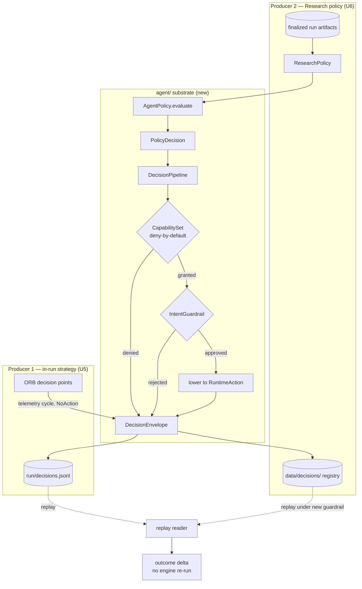

# Nautilus Lab Agent-Decision Layer - Plan

## Goal Capsule

- **Objective:** Give the `nautilus-ls-lab` strategy loop a native agent-decision layer — modeled on `nautechsystems/nautilus_agents` — so decisions are recorded as envelopes carrying a scrubbed context snapshot, and a recorded decision stream can be re-evaluated under a changed **guardrail** without re-running the backtest engine. Policy-level re-evaluation is deferred; the captured context unlocks it. This increment proves the mechanism on the intent-bearing Research stream; the engine-avoidance economics mature when the deferred Risk-Management monitor routes ORB/live decisions through the pipeline as intents — that follow-up is the value-completion step.
- **Product authority:** Repo owner (operator of the lab loop).
- **Execution profile:** Offline, autonomous-friendly. All work lands in `adapters/nautilus/lab/`, except at most one artifact-list line in the adapter `README.md` (U8); the certified `nautilus-ls` adapter crate is otherwise untouched. No credentials, no network, no live paper session.
- **Stop conditions:** Stop and surface if implementation forces a change to the `nautilus-ls` adapter crate, requires the live paper path, or cannot exercise the capability/guardrail/replay pipeline offline. These contradict the plan's scope.
- **Tail ownership:** Follow the lab's offline gate and repo landing conventions (see Verification Contract). This plan covers Track A (R1–R9); the data-quality track (R10–R11) is a separate follow-up plan.
- **Open blockers:** None. The two remaining forks are non-blocking and Deferred to Planning (see Open Questions).

---

## Product Contract

### Summary

Build a native, offline-testable agent-decision substrate inside the `nautilus-ls-lab` crate — `AgentIntent` → capability check → guardrail → lowering → `DecisionEnvelope`, plus a `replay` reader — sitting *above* the ORB strategy to govern the backtest loop. The first policy is a Research-tier demonstrator that governs parameter iteration. The `DecisionEnvelope` subsumes the current `signals.jsonl` decision log. A separate fast-follow track (no agent-protocol dependency) fixes the data-quality gaps — adjustment-basis splicing and single-session evaluation — that determine whether loop conclusions can be trusted.

### Problem Frame

The lab loop today is `backtest → an agent reads four artifacts → change a param → re-backtest → compare`. Two frictions cap its value.

First, decisions are logged, not replayable. `signals.jsonl` is a flat telemetry log; there is no way to ask "what would a different policy or guardrail have decided on these exact recorded cycles?" without re-running the engine. Every governance change costs a full re-backtest.

Second, the conclusions the loop produces sit on untrustworthy data. Daily bars accumulate on an adjusted-price basis, so a corporate action rewrites history server-side and a spliced series shows a discontinuity that ORB's gap scanner reads as signal — poisoning the exact input the strategy keys on. And a backtest run trades a single session (the last trading day in the pinned range), so any strategy claim rests on a one-day sample.

`nautilus_agents` is an upstream Rust protocol that solves the first friction directly: a policy emits an `AgentIntent`, a `DecisionPipeline` runs capability and guardrail checks then lowers intent to action, and every cycle is recorded as one `DecisionEnvelope` that a `replay` reader can re-evaluate. It pins `nautilus-* = 0.55.0` / Rust 1.94 and reuses NautilusTrader model types directly, so it cannot be a dependency against the adapter's `=0.60.0` / Rust 1.96 pin — but the protocol is small (~14 files) and worth reproducing natively.

### Key Decisions

- **Borrow the shape natively, do not depend.** Reimplement the protocol subset against the lab's own 0.60 model types and existing artifacts. This avoids the 0.55/0.60 model-type collision, the LGPL-3.0 linking obligation, and coupling to an early-alpha crate (last upstream push 2026-04-17, APIs declared unstable). Keep the on-disk JSON wire-compatible with the upstream envelope shape so tracking or later adopting upstream stays cheap.
- **The agent layer sits above ORB, not inside it.** Upstream intentionally defers execution-tier intents; its `AgentIntent` vocabulary is management- and research-tiered (reduce/close position, cancel orders, pause/resume, adjust risk, escalate, research). ORB keeps its own entry/exit state machine. The agent layer governs the strategy (research iteration and risk guardrails); it does not express the strategy's trades.
- **First demonstrator policy is Research tier.** It governs the parameter iteration the lab exists to turn. The shipped policy is a deterministic heuristic so it is offline-testable; the `AgentPolicy` trait is the seam an LLM-backed policy later implements. Risk-Management tier is deferred because its real payoff is the live paper path, which is out of scope this round.
- **The `DecisionEnvelope` subsumes `signals.jsonl`.** One record per decision cycle, a superset of today's per-decision log — not a second parallel file. Existing `signals.jsonl` consumers read the envelope's decision content instead.
- **Substrate ships before the data-quality track.** The replay substrate is the enabling keystone and the explicit "apply nautilus_agents" ask; the data-quality fixes are a separable fast-follow. Order flips only if the numbers are distrusted more than loop velocity.

### Requirements

**Decision substrate**

- R1. The lab crate defines a native `AgentIntent` type covering the management/research-tier actions (reduce/close position, cancel order(s), pause/resume strategy, adjust risk limits, escalate, research), typed on the adapter's 0.60 model types.
- R2. A `DecisionPipeline` evaluates a policy decision through ordered stages — capability check, guardrail evaluation, intent lowering to a runtime action — and records the outcome of every stage.
- R3. A deny-by-default `CapabilitySet` gates each intent by action capability and instrument scope; an intent whose capability is not granted is rejected, and the rejection is recorded in the envelope rather than silently dropped.
- R4. At least one concrete `IntentGuardrail` is implemented and wired into the pipeline; a rejected intent records the guardrail's reason.
- R5. Each decision cycle produces exactly one schema-versioned `DecisionEnvelope` capturing the trigger, a scrubbed context snapshot (the full run-state form on intent-bearing cycles; a minimal telemetry form — params, strategy id, counts — on in-run cycles), the policy decision, the capability result, the guardrail result, the lowering outcome, the resulting action, and (for in-run telemetry cycles) the strategy decision detail — with no gaps across a run.

**Recording, replay, and the loop**

- R6. The `DecisionEnvelope` subsumes the content currently written to `signals.jsonl`; the loop emits envelopes as its per-cycle decision record and does not also maintain the old parallel log.
- R7. A `replay` reader loads a recorded envelope stream and re-evaluates it through the pipeline under a caller-supplied **guardrail**, producing an outcome delta against the original **without re-running the backtest engine**. The envelope's context snapshot makes context-dependent guardrails replay-safe; policy-level replay is deferred (the captured context unlocks it). Schema-version mismatch is a typed, per-line error.
- R8. The first shipped `AgentPolicy` is a Research-tier demonstrator that reads a finalized run's artifacts and emits a parameter-change proposal intent through the pipeline; its decision logic is deterministic and offline-testable.
- R9. Envelopes are credential-free by construction (typed enums plus counts; any free-text field scrubbed at write time), matching the existing artifact discipline.

**Data-quality fast-follow (separate increment — deferred, see Scope Boundaries)**

- R10. Daily-bar accumulation stops silently mixing adjustment bases: either accumulate unadjusted with read-time adjustment, or re-pull a symbol on a detected basis shift. The chosen approach and the residual basis risk are recorded in `data_quality.json`.
- R11. A backtest can evaluate a strategy across more than one session over a pinned range, so a strategy claim no longer rests on a single trading day.

### Key Flows

- F1. Governed decision cycle (backtest)
  - **Trigger:** The loop reaches a decision point during a run.
  - **Steps:** Policy evaluates the run/context and returns a decision → pipeline checks the `CapabilitySet` → pipeline evaluates each `IntentGuardrail` → an approved intent is lowered to a runtime action → one `DecisionEnvelope` is recorded.
  - **Outcome:** A replayable record exists for the cycle; a denied or guardrail-rejected intent is recorded with its reason and produces no action.
  - **Covered by:** R1, R2, R3, R4, R5, R9

- F2. Re-evaluate without re-backtest
  - **Trigger:** Operator wants to test a changed guardrail against a prior run (policy-swap is deferred, see Scope Boundaries).
  - **Steps:** `replay` reads the recorded envelopes → re-runs each through the pipeline under the new guardrail → emits the outcome delta.
  - **Outcome:** The governance change's effect is visible without touching the engine or the catalog — read as a per-envelope audit, trustworthy up to the first divergence on causally-chained streams.
  - **Covered by:** R7

### Acceptance Examples

- AE1. Capability denial is recorded, not silent.
  - **Covers R3.**
  - **Given** a `CapabilitySet` that does not grant the action an intent requires,
  - **When** the intent flows through the pipeline,
  - **Then** the intent is rejected and the `DecisionEnvelope` records the capability denial with the required capability named.

- AE2. Guardrail change is observable via replay alone.
  - **Covers R4, R7.**
  - **Given** a recorded decision stream whose envelopes include approved intents,
  - **When** the stream is replayed under a stricter guardrail that rejects some of them,
  - **Then** replay reports the outcome delta without re-running the backtest engine.

- AE3. One envelope per cycle, no gaps.
  - **Covers R5, R6.**
  - **Given** a completed backtest run,
  - **When** its recorded envelopes are counted against its decision cycles,
  - **Then** there is exactly one envelope per cycle and no separate `signals.jsonl` is written.

### Scope Boundaries

**Deferred for later**

- Wiring the live paper `LiveNode` session in `lab-live` (lock → mount → `node.run` → teardown → finalize) and certifying the staged SC live probe.
- The Risk-Management-tier agent policy — a live risk-monitor that reshapes ORB's order emission into guarded intents and consolidates the live band/max-concurrent/notional guards into recorded guardrails. It rides the same substrate; deferred until the live path is in scope.
- An LLM-backed `AgentPolicy` implementing the trait seam; the first shipped policy is deterministic.
- Policy-level replay (re-evaluating a recorded stream under a changed *policy*, not just a guardrail). The envelope captures the context that unlocks it, but the shipped `replay` does guardrail-swap only.

**Deferred to Follow-Up Work (separate plan/PR)**

- R10 (adjustment-basis fix) and R11 (multi-session backtest) — the data-quality track. The brainstorm scoped these as a separate increment; the substrate (R1–R9) does not depend on them, so they get their own plan. Strategy conclusions drawn from the loop do depend on them.

**Outside this increment's identity**

- 10-level order-book depth decode (`OrderBookDeltas`/`Depth10`) — ORB is bar-driven and needs no depth.
- Overseas and domestic F/O instrument domains — the lab is domestic KRX cash equities.
- Any change to the certified `nautilus-ls` adapter crate; all work lands in the `nautilus-ls-lab` crate and the adapter contract stays translation-only.
- A hard dependency on the `nautilus-agents` crate.

### Dependencies / Assumptions

- The adapter's `=0.60.0` nautilus pin and Rust 1.96 toolchain are fixed; the native substrate types are built on the 0.60 model types.
- The upstream envelope shape (schema-versioned, line-delimited) is the shared-field mirroring target for R5/R6 so future upstream tracking stays cheap; the lab's envelope is a superset (adds `context` + `decision_detail`) and is not cross-validated against upstream 0.55. Wire-compat is convenience optionality, relaxable if upstream churns or stays dormant.

### Sources / Research

- `nautechsystems/nautilus_agents` (branch `master`, Rust, LGPL-3.0, `nautilus-* = 0.55.0`, Rust 1.94.1): `src/{context,policy,intent,capability,guardrail,guardrails/*,lowering,action,pipeline,envelope,recording,replay}.rs`; capability tiers Research / Risk-Management / Execution(deferred); deny-by-default `CapabilitySet`; dual guardrails; one `DecisionEnvelope` per cycle; deterministic replay.
- `adapters/nautilus/lab/README.md` — the current loop, the four run artifacts, `signals.jsonl` schema, and the single-session backtest constraint.
- `adapters/nautilus/README.md` — the adjustment-basis-bias known limitation and the deferred 10-level depth decode.
- `docs/plans/2026-07-03-001-feat-nautilus-strategy-loop-plan.md` — the strategy loop the substrate governs.

---

## Planning Contract

**Product Contract preservation:** changed — R5 (the envelope now captures a scrubbed context snapshot + in-run decision detail) and R7 (replay ships guardrail-swap; policy-level replay deferred), resolving the review's P1 replay-context gap. R10–R11 remain in the contract but are routed to Deferred to Follow-Up Work per the brainstorm's separate-increment framing.

### Key Technical Decisions

- KTD1. **All substrate lands in a new `agent/` module in the lab crate.** `adapters/nautilus/lab/src/agent/` holds the submodules (`envelope`, `intent`, `action`, `capability`, `guardrail`, `guardrails/`, `context`, `policy`, `policies/`, `pipeline`, `recording`, `replay`), mirroring upstream's file split. The `nautilus-ls` adapter crate and the root SDK workspace are untouched — this preserves the lab's strategy-churn-isolation rule (strategy and governance code churns in the lab, never destabilizing the certified adapter).

- KTD2. **Native types mirror the upstream envelope shape as a superset.** Mirror upstream field names and serde shape — `schema_version: u32`, `#[serde(tag = "type"/"result")]` on the trigger/result enums, line-delimited JSON — and add the lab-specific fields upstream lacks (the scrubbed `context` snapshot and the in-run `decision_detail`). The result is a *superset* of the upstream envelope, not byte-for-byte drop-in: the shared fields mirror upstream so tracking it stays cheap, but the format is **not cross-validated against upstream 0.55** (no golden fixture is obtainable offline), so the plan claims **shape-mirroring, un-cross-validated**, not drop-in interchange. Wire-compat here is convenience optionality, not a durable invariant to chase — if upstream churns or stays dormant, the shared-field mirror can be relaxed to the lab's own needs. Build the types on `nautilus_model` 0.60 (`InstrumentId`, `Price`, `Quantity`, `Money`). A serde round-trip + tag test pins the lab's own wire shape; it does not prove upstream interchange.

- KTD3. **The first guardrail is research/management-domain; ORB order emission is not reshaped this increment (confirmed fork).** The pipeline is exercised end-to-end by the Research-tier policy. Ship one concrete `IntentGuardrail` that gates the research param-change intent (a proposal-bounds guardrail: reject a proposed parameter outside sane bounds). ORB's entry/exit decisions are recorded as envelopes (KTD4) but are NOT routed through capability/guardrail as intents — that is the deferred live risk-monitor. This keeps the "above ORB" line crisp while still proving capability → guardrail → lowering → replay offline.

- KTD4. **The envelope subsumes `signals.jsonl` as `decisions.jsonl`.** The in-run decision points that emit `SignalEvent` (universe accept/reject in `strategy/orb.rs` + `runner/backtest.rs`; breakout / order-placed / order-rejected-sizing / stop / time-exit / session-summary transitions in `strategy/orb.rs`) instead emit a `DecisionEnvelope`. `RunWriter` writes `decisions.jsonl`; `write_signals` / `SIGNALS_FILE` / the `signals.rs` module are removed. `SignalEvent`'s decision payload (kind / decision / filter / values) becomes the envelope's decision content; these telemetry cycles carry `NoAction` governance stages — the envelope is a structural superset, not a behavior change to ORB.

- KTD5. **Two envelope destinations (confirmed fork).** In-run strategy decisions land in the run dir as `decisions.jsonl`, immutable once the run finalizes; these are telemetry cycles (`NoAction` governance stages), so they are recorded and auditable but carry no intent for a guardrail to reject. The Research-tier policy governs *across* runs — it reads a finalized run and proposes the next — so its **intent-bearing** decision envelopes append to a separate registry (`<data>/decisions/`), never into a finalized run dir. The `replay` reader is generic over any envelope JSONL stream: AE2 exercises guardrail re-evaluation on the intent-bearing Research stream, while the in-run `decisions.jsonl` round-trips through the same reader (U5's loader scenario). AE3 is a separate per-cycle count test (R5/R6), not a replay exercise.

### High-Level Technical Design

The substrate is a single generic pipeline with two producers and one replay reader. The pipeline lowers a policy decision through deny-by-default capability and guardrail stages into one recorded envelope per cycle.

### Sequencing

U1 (data model) → U2 + U3 (capability, guardrail, parallel) → U4 (pipeline) → U6 + U7 (research policy, replay — parallel, on U4) → U5 (subsume — on U4, and needs U7's `read_envelopes` for its round-trip test) → U8 (docs). U5 is the largest (touches the runner and strategy); U6 is independent of U5 and U7.

---

## Implementation Units

### U1. Envelope, intent, and action data model

- **Goal:** The native, wire-compatible core types the whole substrate is built on.
- **Requirements:** R1, R5, R9 (partial)
- **Dependencies:** none
- **Files:** `adapters/nautilus/lab/src/agent/mod.rs` (new), `adapters/nautilus/lab/src/agent/envelope.rs` (new), `adapters/nautilus/lab/src/agent/intent.rs` (new), `adapters/nautilus/lab/src/agent/action.rs` (new), `adapters/nautilus/lab/src/agent/context.rs` (new — the `AgentContext` type lives here so U1's envelope `context` field and U3's trait signature compile before U4 exists; U4 builds instances), `adapters/nautilus/lab/src/lib.rs` (add `pub mod agent`)
- **Approach:** Define `ENVELOPE_SCHEMA_VERSION: u32`, `DecisionTrigger` / `GuardrailResult` / `LoweringOutcome` / `PlannedIntentOutcome` enums with upstream serde tags, and `DecisionEnvelope` carrying trigger + a scrubbed `context` snapshot + policy decision + capability result + guardrail result + lowering outcome + resulting action + an optional `decision_detail` for in-run strategy telemetry (`{ kind, decision, filter, values }`, the payload subsumed from `SignalEvent`). The `context` and `decision_detail` fields are the lab-specific superset over upstream (KTD2). In-run telemetry envelopes are built by a direct constructor (`DecisionEnvelope::telemetry(trigger, detail, context)`) whose governance stage fields carry an explicit not-evaluated representation — they never fake an `Approved`. Define `AgentIntent` (management/research variants: reduce/close position, cancel order(s), pause/resume strategy, adjust risk limits, escalate, research/propose-parameter-change) on 0.60 `nautilus_model` types, and `RuntimeAction` as the lowered form. Only the research/propose-parameter-change variant has a producing policy this increment; the management-tier variants and `instrument_scope` (U2) are deliberate wire-compat placeholders, exercised by unit tests only until the deferred risk-monitor consumes them — not live governance this round.
- **Patterns to follow:** upstream `src/envelope.rs` / `src/intent.rs` / `src/action.rs` for shape; existing lab serde style in `adapters/nautilus/lab/src/signals.rs`.
- **Test scenarios:**
  - `DecisionEnvelope` serde round-trip preserves every stage field (compact JSON, one line).
  - `ENVELOPE_SCHEMA_VERSION` is asserted against a committed constant, and the serialized envelope carries the version.
  - Enum tag shape (`"type"` / `"result"`) matches the upstream wire format for `DecisionTrigger` and the result enums (pins KTD2 wire-compat).
  - `AgentIntent` covering each variant round-trips.
- **Verification:** types compile in the lab workspace; serde tests green.

### U2. Deny-by-default capability model

- **Goal:** `CapabilitySet` that gates intents by action capability and instrument scope, denying anything not explicitly granted.
- **Requirements:** R3
- **Dependencies:** U1
- **Files:** `adapters/nautilus/lab/src/agent/capability.rs` (new), `adapters/nautilus/lab/src/agent/mod.rs`
- **Approach:** `ObservationCapability` / `ActionCapability` enums, `CapabilitySet { observations, actions, instrument_scope }` over `BTreeSet`, `check_intent` mapping each `AgentIntent` to its required `ActionCapability` (+ instrument where applicable), and `CapabilityError { ActionDenied, InstrumentDenied }`. Deny-by-default: absence of a grant is a denial.
- **Patterns to follow:** upstream `src/capability.rs`.
- **Test scenarios:**
  - Covers AE1. An intent whose `ActionCapability` is not in the set returns `ActionDenied` naming the required capability.
  - An intent on an instrument outside `instrument_scope` returns `InstrumentDenied`.
  - A fully-granted intent passes `check_intent`.
  - Empty `CapabilitySet` denies every intent (deny-by-default).
- **Verification:** capability tests green.

### U3. Guardrail trait and first concrete guardrail

- **Goal:** The `IntentGuardrail` seam plus one concrete guardrail that can reject an intent with a recorded reason.
- **Requirements:** R4
- **Dependencies:** U1
- **Files:** `adapters/nautilus/lab/src/agent/guardrail.rs` (new), `adapters/nautilus/lab/src/agent/guardrails/mod.rs` (new), `adapters/nautilus/lab/src/agent/guardrails/proposal_bounds.rs` (new)
- **Approach:** `IntentGuardrail` trait with `evaluate(&self, intent, context) -> GuardrailResult`. Implementations must be pure per-cycle functions of (intent, context) — stateful guardrails (cumulative drawdown, rate limits) are out of contract until replay is redesigned for cross-cycle state. Ship a `ProposalBoundsGuardrail` that approves non-research intents and rejects a research param-change proposal whose magnitude falls outside configured bounds, with a `Rejected { reason }` naming the violated bound (KTD3). Model the trait so additional guardrails (the deferred risk-tier ones) slot in unchanged.
- **Patterns to follow:** upstream `src/guardrail.rs` + `src/guardrails/max_drawdown.rs` (approve-non-matching-intents shape, formatted reject reason).
- **Test scenarios:**
  - A proposal within bounds → `Approved`.
  - A proposal outside bounds → `Rejected` with a reason string naming the bound and the offending value.
  - A non-research intent → `Approved` (the guardrail only gates its domain).
- **Verification:** guardrail tests green.

### U4. Decision pipeline and policy seam

- **Goal:** The `DecisionPipeline` that runs a policy decision through capability → guardrail → lowering and emits exactly one `DecisionEnvelope` per cycle, plus the `AgentPolicy` trait (the `AgentContext` type itself ships in U1).
- **Requirements:** R2, R5
- **Dependencies:** U1, U2, U3
- **Files:** `adapters/nautilus/lab/src/agent/pipeline.rs` (new), `adapters/nautilus/lab/src/agent/policy.rs` (new)
- **Approach:** `AgentPolicy` trait (`evaluate(&self, &AgentContext) -> PolicyDecision`); `PolicyDecision` = Execute(PlannedIntent) / NoAction / Failed. `AgentContext` (type in U1) has two forms: the **full run-state snapshot** — balance, a purpose-built position summary (symbol/side/qty, never serialized nautilus `Position` objects, which embed `account_id`), params, run summary — built only for intent-bearing cycles like the Research policy's, and a **minimal telemetry form** (params, strategy id, counts) for in-run cycles where no account/positions plumbing exists. The captured (scrubbed) form in each envelope is what makes replay under a context-dependent guardrail engine-free (R5, R7, R9). `DecisionPipeline::run` takes a decision + capability set + guardrails, short-circuits on capability denial (records it), evaluates guardrails (records the first rejection), lowers an approved intent to a `RuntimeAction`, and returns one populated `DecisionEnvelope`.
- **Patterns to follow:** upstream `src/pipeline.rs` / `src/policy.rs` / `src/context.rs`.
- **Test scenarios:**
  - A granted, in-bounds Execute decision produces an envelope with capability `Approved`, guardrail `Approved`, lowering `Success`, and a resulting action.
  - Covers AE1. A decision whose capability is denied produces exactly one envelope recording the capability denial and no action; guardrail/lowering stages reflect the short-circuit.
  - A guardrail rejection produces one envelope recording the reason and no action.
  - A `NoAction` decision produces one envelope with no intent and no action.
  - Every path yields exactly one envelope per call (no-gaps invariant).
  - A serialized envelope carrying the full context form contains no account-like token (R9 — the position summary, not `Position`, is what serializes).
- **Verification:** pipeline tests green; envelope from each path validates against U1's schema.

### U5. Subsume signals.jsonl into the in-run envelope stream

- **Goal:** In-run strategy decisions emit `DecisionEnvelope`s written as `decisions.jsonl`; `signals.jsonl` is removed.
- **Requirements:** R6, R5, R9 (partial)
- **Dependencies:** U4, and U7's `read_envelopes` loader for the decisions-log round-trip test scenario
- **Files:** `adapters/nautilus/lab/src/strategy/orb.rs`, `adapters/nautilus/lab/src/runner/backtest.rs`, `adapters/nautilus/lab/src/runner/live.rs`, `adapters/nautilus/lab/src/artifacts/mod.rs`, `adapters/nautilus/lab/src/signals.rs` (remove), `adapters/nautilus/lab/src/lib.rs`, `adapters/nautilus/lab/tests/strategy.rs`, `adapters/nautilus/lab/tests/backtest_run.rs`, `adapters/nautilus/lab/tests/artifacts.rs`, `adapters/nautilus/lab/tests/live_wiring.rs`, `adapters/nautilus/lab/tests/fixtures/analysis.md` (the tests + fixture reference the removed `SignalSink`/`signals.jsonl` and are updated in this swap)
- **Approach:** Replace `SignalSink`/`SignalEvent` with a decision sink of `DecisionEnvelope`s (a `DecisionTrigger::MarketData`/`StateChange` cycle per current emission site). Carry the existing decision payload (kind / accept-reject / filter / values) into the envelope's decision content so the log stays as informative; governance stages are `NoAction` (KTD4). `RunWriter` gains `write_decisions` → `decisions.jsonl` and drops `write_signals` / `SIGNALS_FILE`. Update the six emission sites in `strategy/orb.rs` and the universe-scan sites in `runner/backtest.rs`. Keep the atomic-finalize + scrub-at-write discipline. `runner/live.rs` is touched only to swap the removed `SignalSink` type so `lab-live` keeps building — no live-session behavior is added, staying inside the deferred-live boundary. In-run emission sites populate the **minimal telemetry context** (params + strategy id + counts) — constructible both at the universe scan (which runs before the engine exists) and inside the engine's blocking thread, where no account/positions plumbing exists (R5's telemetry form).
- **Execution note:** Start from the artifact-writer and sink swap, then repoint each emission site; the `--list` test-name set and existing artifact tests are the signal that no emission site was missed.
- **Patterns to follow:** existing `SignalSink` threading through `run_engine` in `runner/backtest.rs`; `RunWriter::write_signals` / atomic finalize in `artifacts/mod.rs`.
- **Test scenarios:**
  - Covers AE3. A completed backtest run writes `decisions.jsonl` with exactly one envelope per decision cycle and writes no `signals.jsonl`.
  - Each former `SignalKind` (universe accept, universe reject with filter, breakout, order-placed, order-rejected-sizing, stop, time-exit, session-summary) maps to an envelope preserving its decision payload.
  - The decisions log round-trips through the replay reader's loader (forward reference to U7 format).
  - No source or test references `signals.jsonl` / `SIGNALS_FILE` after the change.
- **Verification:** lab offline test suite green; grep confirms `signals` module and file removed.

### U6. Research-tier demonstrator policy

- **Goal:** A deterministic Research-tier `AgentPolicy` that reads a finalized run and emits a parameter-change proposal through the pipeline, recorded to the cross-run decisions registry.
- **Requirements:** R8, R9 (partial)
- **Dependencies:** U4
- **Files:** `adapters/nautilus/lab/src/agent/policies/mod.rs` (new), `adapters/nautilus/lab/src/agent/policies/research.rs` (new), `adapters/nautilus/lab/src/agent/recording.rs` (new)
- **Approach:** `ResearchPolicy` builds an `AgentContext` from a finalized run's `performance.json` + `manifest.json` and returns a deterministic `Execute(ProposeParameterChange)` (a fixed heuristic over a summary stat, e.g. widen the gap filter when trade count is below a floor — the exact heuristic is defer-to-implementation but must be deterministic). The proposal flows through the pipeline (capability `Research`, `ProposalBoundsGuardrail`), and `recording.rs` appends the resulting envelope to `<data>/decisions/` as append-only JSONL. Recording is credential-free; free text is scrubbed (R9).
- **Patterns to follow:** `artifacts::RunWriter` append-only + scrub pattern; upstream `src/recording.rs`.
- **Test scenarios:**
  - The policy returns a deterministic proposal from a committed fixture run (same input → same intent).
  - The proposal, run through the pipeline with a `Research`-granted capability set, yields an envelope with capability `Approved` and a recorded action.
  - The same proposal under a capability set lacking `Research` yields a capability-denied envelope.
  - The recorded decisions file is append-only JSONL and contains no credential-like tokens.
  - The deterministic policy's decision is reconstructible from a recorded envelope's captured context alone and equals the recorded policy decision — proving the context is policy-sufficient for the shipped policy class (validates the policy-replay deferral premise).
- **Verification:** research-policy tests green; recorded envelope validates against U1 schema.

### U7. Replay reader

- **Goal:** Re-evaluate a recorded envelope stream under a caller-supplied **guardrail** and report the outcome delta, without touching the engine or catalog. Policy-level replay is deferred (the captured context unlocks it).
- **Requirements:** R7
- **Dependencies:** U4
- **Files:** `adapters/nautilus/lab/src/agent/replay.rs` (new)
- **Approach:** `read_envelopes(path) -> Result<Vec<DecisionEnvelope>, ReplayError>` with a per-line typed error (`MalformedLine`, `UnsupportedSchema { version, expected }`). `replay(envelopes, guardrail) -> ReplayResult` re-runs each original decision through the pipeline under the new guardrail — reading each envelope's captured `context` so context-dependent guardrails work — and returns the original-vs-replayed pair plus the delta. Replay reuses each envelope's **recorded capability outcome** verbatim (capability re-evaluation is out of scope for guardrail-swap replay); only the guardrail stage re-evaluates, and the delta is defined as the guardrail-stage delta. `ReplayResult` carries a first-divergence index: on causally-chained streams (each approved proposal shaped the next run), the per-envelope delta is an audit trustworthy up to the first divergence — later envelopes were produced in a world the stricter guardrail would have changed. Policy-level replay (swapping the deciding policy) is deferred; the captured context is what unlocks it later. No `ParquetDataCatalog`, `BacktestEngine`, or bar access anywhere in this module (the whole point — proven by the module having no such imports).
- **Patterns to follow:** upstream `src/replay.rs` (line-indexed schema check, `ReplayConfig`, `ReplayResult`).
- **Test scenarios:**
  - Covers AE2. A recorded stream with approved intents, replayed under a stricter guardrail that rejects some, reports a non-empty outcome delta — and the test asserts no engine/catalog is constructed.
  - A schema-version mismatch on line N returns `UnsupportedSchema` naming the line and versions.
  - A malformed JSON line returns `MalformedLine` naming the line.
  - Replaying under an identical guardrail yields a zero delta (stability).
  - A guardrail that reads a captured context field (not just the intent) evaluates correctly on replay — exercising the context-capture payoff at least once.
  - A capability-denied cycle replays with its recorded capability outcome reproduced verbatim: the guardrail never runs on it and it contributes no delta.
  - A stream where the stricter guardrail rejects envelope k reports first-divergence index k in `ReplayResult`.
- **Verification:** replay tests green; module has no engine/catalog imports.

### U8. Documentation and artifact-key registry

- **Goal:** The lab README and artifact references describe the envelope/replay/research-policy recipe and the new artifact layout.
- **Requirements:** R6 (doc surface), R7 (doc surface)
- **Dependencies:** U5, U6, U7
- **Files:** `adapters/nautilus/lab/README.md`, `adapters/nautilus/README.md` (artifact-list mention if present)
- **Approach:** Replace the `signals.jsonl` row in the four-artifacts list with `decisions.jsonl`, document its envelope schema key reference, add the cross-run `<data>/decisions/` registry, and add a recipe for the Research policy + replay. Add the upstream wire-compat note (KTD2) and a one-line pointer to `nautechsystems/nautilus_agents` as the borrowed shape.
- **Test expectation:** none — documentation only. If any test asserts artifact filenames (e.g. an artifact-key doc test), update it in the unit that changes the filename (U5), not here.
- **Verification:** README renders; artifact list matches what U5 writes.

---

## Verification Contract

The lab is a nested Cargo workspace under `adapters/nautilus/`. All gates are offline (no credentials, no network).

| Gate | Command | Proves |
|---|---|---|
| Lab test suite | `cd adapters/nautilus && cargo test --workspace` | All unit/integration tests incl. AE1–AE3 scenarios |
| Lint | `cd adapters/nautilus && cargo clippy --workspace --all-targets -- -D warnings` | Zero warnings (prior-wave discipline) |
| Bins build | `cd adapters/nautilus && cargo build --bins` | `lab-backtest` / `lab-live` still build after the sink/artifact swap |
| Isolation | `git diff --stat` scoped check | Zero diff outside `adapters/nautilus/lab/` except the adapter README artifact-list line |
| Root gate unaffected | root `cargo test` | The SDK workspace is untouched |

Shared-field shape-mirroring (KTD2) is exercised by the U1 serde/tag tests — these pin the lab's own wire shape; they do not prove upstream interchange (no offline 0.55 fixture). `signals.jsonl` removal (U5) is proven by a grep for `signals`/`SIGNALS_FILE` returning nothing in lab source and tests.

---

## Definition of Done

**Global**

- R1–R9 satisfied; R10–R11 explicitly deferred to the follow-up plan (Scope Boundaries), not silently dropped.
- The lab offline test suite, clippy (`-D warnings`), and `cargo build --bins` are green.
- `signals.jsonl` / `SIGNALS_FILE` / the `signals` module are fully removed; nothing references them.
- The `nautilus-ls` adapter crate and the root SDK workspace are unchanged (diff confined to `adapters/nautilus/lab/`, plus at most one artifact-list line in the adapter README).
- The envelope mirrors the upstream shape on shared fields (U1 tag tests pass) as a superset (adds `context` + `decision_detail`); the plan claims shape-mirroring, not drop-in interchange (no upstream 0.55 golden fixture offline).
- Abandoned/experimental code from approaches that did not pan out is removed from the diff.

**Per unit**

- Each unit's test scenarios pass, and its `**Files:**` include the test file(s) exercising them.
- U5: exactly one envelope per decision cycle in a real backtest run; no `signals.jsonl`.
- U7: replay constructs no engine/catalog and reports a real delta under a changed guardrail.

---

## Open Questions

**Deferred to Planning / Implementation**

- The exact deterministic heuristic inside the Research-tier demonstrator policy (U6) — any deterministic function of a run summary stat satisfies R8; pick the simplest that produces a visible proposal on the committed fixture run.
- The concrete bound(s) the `ProposalBoundsGuardrail` enforces (U3) — a single magnitude bound is enough to exercise approve/reject; widen only if a scenario needs it.

Neither blocks implementation; both are settled by the implementer against the fixtures.
