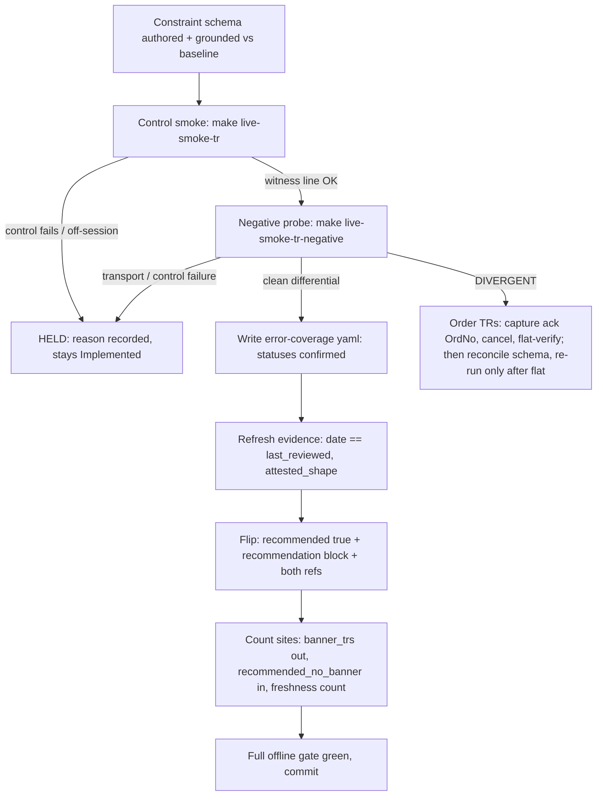

# Recommended Re-Certification Wave - Plan

## Goal Capsule

- **Objective:** Re-certify the 10 TRs demoted by the error-resilience gate (PR #83) and restore the Recommended tier from its current count of 0.
- **Authority:** this plan; then `docs/plans/2026-07-01-004-feat-recommended-error-resilience-gate-plan.md` (R12, U8) for the gate contract; then `.agents/skills/promote-tr/SKILL.md` for the per-TR recipe steps.
- **Execution profile:** offline units (U1, U2) are autonomous; live legs (U3–U5, U7) run in-session with the operator's credentials and flip only on witness-line evidence. The offline gate never certifies a live property.
- **Stop conditions:** a DIVERGENT negative probe blocks that TR until its constraint schema is reconciled; an ambiguous order-submit outcome halts the order leg fail-closed; never engage the order kill switch before an order-placing teardown completes.
- **Open blockers:** none. The 4 order TRs are window-gated (KRX 09:00–15:30 KST), which schedules them, not blocks them.

---

## Product Contract

### Summary

Run the 10 demoted TRs (`token`, `t1101`, `t1102`, `t8412`, `S3_`, `CSPAQ12200`, `CSPAT00601`, `CSPAT00701`, `CSPAT00801`, `t0425`) through the error-resilience gate — constraint schema, live negative probe, error-coverage evidence — and re-promote each passing TR to Recommended via the gate-extended promote-tr recipe.

### Problem Frame

PR #83 shipped the error-resilience gate and deliberately demoted all 10 Recommended TRs to Implemented until each passes the new gate. Its U8 re-certification leg was staged but never ran. The SDK has advertised zero Recommended TRs since 2026-07-01 — a shipped regression of its headline support tier, and the only pending domestic item that closes a regression rather than adding scope. All other domestic movement is terminally dispositioned (ledger §23/§24) or externally gated.

### Key Decisions

- **Whole-wave over per-TR trickle.** The batch machinery already exists (promote-tr recipe, `tr-promoter` orchestration pattern); re-certifying one TR at a time re-pays session setup per TR for no added safety.
- **Live-window work takes priority over offline candidates.** The competing next items (Nautilus R10/R11 data-quality, DTO codegen) are fully offline and keep indefinitely; this wave is the best in-scope use of an open KRX window.
- **Semi-autonomous in-session execution.** Read-TR legs run in-session like the PR #74 promotion wave; order-TR legs follow the established order-safety machinery. Confirmed as the intended mode.
- **Partial completion is success.** Each TR re-promotes independently; a HELD or window-missed TR defers, it does not fail the wave.

### Requirements

**Re-certification**

- R1. Each TR re-promotes to Recommended only after passing the full error-resilience gate: authored `metadata/constraints/<tr>.yaml`, a live differential negative probe with a valid control seed (or, for realtime TRs per KTD2, an error-coverage file recording per-class `n_a`/`held` statuses with the recipe's realtime excludes, in lieu of a probe), captured credential-free error-coverage evidence, and the gate-extended promote-tr recipe.
- R2. A TR whose valid control fails, or whose session prerequisite is unavailable, is recorded HELD with a reason and stays Implemented.
- R3. The 4 order TRs (`CSPAT00601`, `CSPAT00701`, `CSPAT00801`, `t0425`) run only in an open KRX window with the order-capable account, behind the same `LS_ORDER_SMOKE=1` opt-in and CI/no-TTY + per-wave `LS_ORDER_SMOKE_NONCE` autonomy gate `order_smoke.rs` requires before any order call. The probe leg fires from a raw-HTTP path outside the SDK, so it implements the fail-closed classifier semantics itself (KTD3) rather than inheriting `order_smoke.rs` machinery; it still honors the same flat-assert, teardown-ordering, and scrubbed-log discipline.

**Bookkeeping per flip**

- R4. Every re-promotion updates the docgen Recommended list, `banner_trs`, and the evidence-freshness count, and lands with the full offline gate green (`cargo test`, `make docs-check`, `make lane-check`).
- R5. Each re-promoted TR's Reference page shows the recommendation and its "Errors & validation" section.

**Opportunistic bundle**

- R6. If the session extends past the KRX close into the after-hours window, run the pending `t1109` after-hours smoke and flip it on a non-empty witness; skip without penalty otherwise.

### Acceptance Examples

- AE1. **Covers R1, R5.** **Given** `t8412` passes its negative probe and control smoke, **when** the promote-tr recipe completes, **then** `metadata/trs/t8412.yaml` has `recommended: true` and its Reference page renders the recommendation plus "Errors & validation".
- AE2. **Covers R2.** **Given** `t0425`'s window closes before its probe runs, **when** the wave closes out, **then** `t0425` stays Implemented with a HELD record and the wave still counts as complete.

### Scope Boundaries

- The armed reopen triggers stay untouched except the R6 `t1109` bundle: `t0441` is futures (out of scope by request), `CSPBQ00200` needs an out-of-band deposit, `t3102` needs a live NWS event.
- Nautilus lab follow-ups (R10/R11 data-quality, live wiring, Risk-Management policy) and the DTO codegen track stay queued as separate plans.
- No new TR tracking or flips beyond the 10 plus the conditional `t1109` — this wave restores a tier, it does not grow the surface.

### Deferred to Follow-Up Work

- Genericizing the negative-probe harness into a schema-parameterized runner (KTD1 keeps the per-TR pattern for this wave).
- WebSocket-native negative-probe plumbing for realtime TRs beyond the `S3_` coverage shape chosen in KTD2.

### Dependencies / Assumptions

- The U8 mechanism (constraint schema shape, negative-probe target, gate-extended promote-tr recipe) is on `main` via PR #83 and is assumed working; this wave authors per-TR artifacts, it does not build mechanism.
- Per-lane credentials (`.env.domestic`, order-capable account) are available in-session; PR #74 proved the domestic account order-capable, and a fresh `01491` during U5 means wrong lane/creds before it means gateway PENDING.
- PR #91 (nautilus lab) is independent — merge order does not matter; this wave touches no `adapters/nautilus/` files.
- All 10 TRs already have `metadata/evidence/<tr>.yaml` files with `attested_shape` machinery and normalized baselines to ground constraints against (verified, including `token` and `S3_`).

### Sources

- `docs/plans/2026-07-01-004-feat-recommended-error-resilience-gate-plan.md` — R12 (the 10 demoted TRs), U8 (the re-certification contract this wave executes), KTD6 (count-tax discipline).
- `metadata/PROVISIONALITY-LEDGER.md` §23–§24 — domestic residue disposition, the armed reopen triggers (including the `t1109` command), and the witness-line flip rule.
- `.agents/skills/promote-tr/SKILL.md` and `.agents/skills/promote-tr/references/smoke-map.md` — the promotion recipe (step 4b is the PR #83 gate extension) and the smoke registry rows for all 10 TRs.
- Exemplar artifacts: `metadata/constraints/t8412.yaml`, `metadata/error-coverage/t8412.yaml`, `crates/ls-sdk/tests/negative_probe.rs`, Makefile target `live-smoke-t8412-negative`.
- Prior promotion-wave precedent: PR #74, with its gotchas recorded in `docs/solutions/integration-issues/ls-gateway-t0425-rate-limit-and-pagination-flat-scan.md` and `docs/solutions/conventions/implement-tr-registration-sites.md`.

---

## Planning Contract

Product Contract preservation: unchanged from the brainstorm, except the two Outstanding Questions are resolved into KTD2 and KTD4 below.

### Key Technical Decisions

- KTD1. **Replicate the per-TR probe pattern; do not genericize the harness.** Each new negative-probe leg follows `live_smoke_t8412_negative`'s hardcoded shape (own seed, endpoint path, `{TR}InBlock` wrapper, `tr_cd` header) in `crates/ls-sdk/tests/negative_probe.rs`. A schema-parameterized runner is cleaner but refactors the certification machinery immediately before live runs; deferred to follow-up. **Order-TR legs do not replicate the raw shape verbatim** — the t8412 leg is a raw `reqwest` client that models transport failure as `None` and prints `Held` while continuing the loop, which has no carrier for KTD3's fail-closed halt. Order legs map every raw outcome through the placed-nothing/may-rest classifier semantics in code (KTD3).
- KTD2. **`token` and `S3_` get honest-but-bounded error coverage; no validator exemption exists and none is added.** The validator requires `error_coverage_ref` on every recommended TR regardless of `owner_class` (`crates/ls-metadata/src/validator.rs:449`). `token` (OAuth form, no InBlock) gets a small bespoke probe leg at `/oauth2/token` that mutates **only non-credential form fields** (grant_type value/absence, content-type shape, missing non-credential field); credential fields (`appkey`, `appsecretkey`) are never sent with mutated values — their required-class check uses field removal only, recorded `held` if untestable. The token leg runs **last** among the wave's live legs so a gateway throttle or appkey lockout cannot strand the remaining re-certs. `S3_` (WS subscribe frame, no REST error differential) gets no live probe leg: its error-coverage file records per-class `n_a`/`held` statuses with the recipe's realtime excludes ("trade-data correctness, in-session delivery, reconnection"), which the validator accepts (it checks parse + presence, not `confirmed`).
- KTD3. **Order-TR negative probes are placed-nothing by construction, with a defined recovery if that fails.** Fire only type- and required-class variants (wire-shape breaks the gateway rejects before placement); record range, enum, and format variants as `held`, not fired — `generate_invalid_variants` emits all five classes, and an enum/format-invalid value is a behavioral rejection, not a wire-shape break. Seeds are non-marketable band-safe resting shapes, so any variant the gateway tolerantly coerces (a JSON number where it wanted a string — the undocumented tolerant direction of the `IGW40011` asymmetry) rests rather than fills. Any transport failure, timeout, or 5xx on an order endpoint is may-rest: stop the variant loop immediately, reconcile via a symbol-scoped `t0425` read, and cancel by the ack `OrdNo`. The valid control is itself a real order — capture its ack `OrdNo`, cancel it, and flat-verify inside the leg before any variant fires. If a variant returns a confirmed placement-success `rsp_cd` rather than a rejection, run the order-chain cancel/flatten teardown, record the wave blocked pending investigation, and do not classify it as a probe result (`docs/solutions/conventions/order-error-classifier-placed-nothing-vs-may-rest.md`).
- KTD4. **Offline-first staging, then three live groups by session requirement.** All constraint schemas, probe legs, and count-site prep land gate-green before any live leg. Live order: closure-viable three (`t8412` control on a historical date, `CSPAQ12200` account read, `S3_` lifecycle reachability) → open-session group (`token` + `t1102` share one `live-smoke` control run, `t1101` via `live-smoke-book`, and the `t8412` negative probe whose smoke-map gate is "open session + valid seed") → attended order quartet. The smoke-map gates `token`'s control on an open session because that single run also issues the `t1102` quote, so `token` re-certifies with `t1102`, not under closure.
- KTD5. **First-flip one-time re-wirings land with whichever TR flips first, not as a separate pass.** `recommended_no_banner` in `crates/ls-docgen/src/lib.rs:1413` is typed `[&str; 0]` and must be re-typed to a populated array (a bare `[]` won't type-infer); `freshness_check_over_empty_recommended_set_exits_zero` (`crates/ls-trackers/src/cli.rs:2373`) asserts recommended count 0 over real metadata and breaks on the first promotion — repoint it, don't weaken it. Because any group's first promotion is the trigger and a group can produce zero flips, each of U3/U4/U5 checks whether these re-wirings are already applied before its first flip and applies them as part of that promotion if not.
- KTD6. **Flip only on the witness line, never the make exit status.** Every empty or odd `rsp_cd` routes through the terminal table (`00707` off-window = retry in session; `00707` in-window = unprovisioned; `00136` = success-with-defaults ≠ data; `01900` = service rejection; `01491`/`IGW40013` = wrong lane/account) before being recorded as a failed re-cert.

### High-Level Technical Design

Per-TR re-certification pipeline (each TR advances independently; exits are per-TR, not per-wave):

Session grouping (KTD4): U3 runs under any session, U4 needs an open KRX session, U5 needs an open window plus the attended order account. U1/U2 precede all of them offline.

### Deferred to implementation

- Exact OAuth error codes the gateway returns for `token` form-field variants — captured live during U3, then recorded in `metadata/error-catalog.yaml` if new.
- Whether the offline twin test needs one fn per new schema or parameterizes over embedded schemas — decided when extending `negative_probe.rs`.
- Per-TR valid control seeds for the order TRs (symbol, band-safe price) — chosen in-window from live quotes per the PR #74 pattern.

---

## Implementation Units

### U1. Constraint schemas for the 9 missing TRs

- **Goal:** Every wave TR has a grounded `metadata/constraints/<tr>.yaml` so `schema_for("<tr>")` works and probes can generate variants.
- **Requirements:** R1.
- **Dependencies:** none.
- **Files:** `metadata/constraints/{token,t1101,t1102,S3_,CSPAQ12200,CSPAT00601,CSPAT00701,CSPAT00801,t0425}.yaml`.
- **Approach:** Mirror `metadata/constraints/t8412.yaml`: per field, `type` + `required` + all three class markers (`enum`/`range`/`format`) each explicitly `applicable: true|false` — a missing class is a serde error. Unprobed bounds carry `confirmed: false`. Field names/types come from `crates/ls-trackers/baselines/api-drift/normalized/trs/<tr>.json`; where a live-certified SDK request struct disagrees, the struct wins. Files auto-embed via `crates/ls-core/build.rs`.
- **Patterns to follow:** `metadata/constraints/t8412.yaml`; the grounding gate `crates/ls-core/tests/constraint_grounding.rs`.
- **Test scenarios:** grounding test passes for all 9 new files (types + required match baselines); `schema_for` resolves each new TR (offline); a deliberately mistyped field fails grounding (spot-check one, then revert); the existing order-smoke wiremock/offline tests still pass with the 4 order-TR schemas present — a `required`/`type` declaration that disagrees with a live-certified request struct would false-reject certified order flows at the `dispatch_once` preflight seam, so the struct wins on disagreement.
- **Verification:** `cargo test -p ls-core` green with the 9 files present.

### U2. Negative-probe legs, Makefile targets, and smoke-map rows

- **Goal:** A runnable `make live-smoke-<tr>-negative` per probe-bearing TR, offline-green and staged for the live groups.
- **Requirements:** R1, R3 (probe shape), R2 (HELD semantics).
- **Dependencies:** U1.
- **Files:** `crates/ls-sdk/tests/negative_probe.rs`; `Makefile` (targets + `.PHONY`); `.agents/skills/promote-tr/references/smoke-map.md`.
- **Approach:** Add `live_smoke_<tr>_negative` fns for the 8 new probe-bearing TRs (all except `S3_` per KTD2, and t8412, whose leg already exists) following the t8412 leg: valid control + `generate_invalid_variants` in one session, credential-free `NEG-PROBE` lines, transport ⇒ Held, control failure ⇒ HELD banner. `token`'s leg is bespoke form-shaped (no InBlock) and mutates only non-credential fields (KTD2). Order-TR legs restrict variants per KTD3, gate on the `LS_ORDER_SMOKE=1` opt-in + CI/no-TTY + `LS_ORDER_SMOKE_NONCE` autonomy chain from `crates/ls-sdk/tests/order_smoke.rs`, and implement the may-rest classifier + control-cancel lifecycle in code (the raw path has no `LsError` carrier). Makefile targets lane-guard on `.env.domestic` with no `.env` fallback and assert on the witness line.
- **Execution note:** verify every new test path with `cargo test --list` and use full `module::` paths in targets — bare names match zero tests and the `1 passed` grep reads that as failure.
- **Patterns to follow:** `live_smoke_t8412_negative` (`crates/ls-sdk/tests/negative_probe.rs`); the order-autonomy guard chain in `crates/ls-sdk/tests/order_smoke.rs`; Makefile target `live-smoke-t8412-negative`.
- **Test scenarios:** offline twin covers variant-generation determinism for each new schema; `--list` shows each new fn at its expected `module::` path; each Makefile target fails fast with a missing-lane message when `.env.domestic` is absent; an order-TR negative target refuses to run without `LS_ORDER_SMOKE=1` and a valid nonce; order-TR variant sets contain only type/required-class variants (no range/enum/format).
- **Verification:** `cargo test -p ls-sdk --test negative_probe` (offline legs) green; `make lane-check` green; live legs remain `#[ignore]`.

### U3. Closure-viable re-certs: t8412, CSPAQ12200, S3_

- **Goal:** The three session-independent TRs re-promoted (or HELD with reason); the first flip here or in any later group carries the one-time re-wirings.
- **Requirements:** R1, R2, R4, R5. **Covers AE1.**
- **Dependencies:** U1, U2.
- **Files:** `metadata/trs/{t8412,CSPAQ12200,S3_}.yaml`; `metadata/error-coverage/{CSPAQ12200,S3_}.yaml` (t8412's exists — update statuses); `metadata/evidence/` refreshes; `crates/ls-docgen/src/lib.rs` (banner_trs, `recommended_no_banner`, t8412 dependency-page assertion `- Recommended: no` → `yes`); `crates/ls-trackers/src/cli.rs` (count-0 test repoint); `metadata/EVIDENCE-FRESHNESS.md`; regenerated `docs/reference/`.
- **Approach:** Per TR, promote-tr steps 1–9: control smoke (`live-smoke-chart` with `LS_LIVE_SMOKE_T8412_DATE` on a historical date, `live-smoke-account`, `live-smoke-ws` lifecycle for S3_), negative probe (skip for S3_ per KTD2; note t8412's own negative probe is gated "open session + valid seed" by the smoke-map, so its probe leg runs in U4's open session even though its control is closure-safe), error-coverage write, evidence refresh with `date == maintenance.last_reviewed` + `attested_shape`, recommendation block + `constraints_ref` + `error_coverage_ref`, count sites. Whichever TR flips first in the wave also lands the KTD5 one-times.
- **Execution note:** operator/in-session; witness-line discipline per KTD6; each TR is its own commit `feat(metadata): promote <tr> to recommended with paper evidence`.
- **Test scenarios:** per flip, validator accepts the recommendation block (evidence date match, attested_shape, error_coverage_ref present); docgen banner test passes with the TR moved between lists; `Covers AE1.` t8412 flip renders recommendation + "Errors & validation" on its Reference page; a control failure produces a HELD record and no metadata flip.
- **Verification:** full offline gate green after each flip; `docs/reference/<tr>.md` shows the contract section; HELD TRs unchanged in metadata with the reason recorded.

### U4. Open-session group: token, t1101, t1102

- **Goal:** The three session-gated TRs re-promoted in an open KRX session; also runs the t8412 negative probe (open-session-gated).
- **Requirements:** R1, R2, R4, R5.
- **Dependencies:** U1, U2; the KTD5 re-wirings land here if U3 produced no flip.
- **Files:** `metadata/trs/{token,t1101,t1102}.yaml`; `metadata/error-coverage/{token,t1101,t1102}.yaml`; evidence refreshes; per-flip count sites as in U3.
- **Approach:** Same per-TR recipe. One `live-smoke` run issues the shared control for both `token` and `t1102` (the smoke-map couples them); `live-smoke-book` is t1101's control. `token`'s bespoke negative leg (non-credential fields only) runs **last** among live legs per KTD2. Run inside the KRX session — a closed-session attempt risks a control-fail HELD, so schedule rather than burn the attempt.
- **Execution note:** operator/in-session during KRX hours.
- **Test scenarios:** same per-flip validator/docgen/gate scenarios as U3; an off-session run records HELD (retry-in-session), not failure; the token leg's variant set touches no credential field with a mutated value.
- **Verification:** full offline gate green after each flip.

### U5. Attended order quartet: CSPAT00601, CSPAT00701, CSPAT00801, t0425

- **Goal:** The four order TRs re-promoted from a clean attended in-window order chain.
- **Requirements:** R1, R2, R3, R4, R5. **Covers AE2.**
- **Dependencies:** U1, U2; the KTD5 re-wirings land here if U3 and U4 produced no flip.
- **Files:** `metadata/trs/{CSPAT00601,CSPAT00701,CSPAT00801,t0425}.yaml`; `metadata/error-coverage/` ×4; evidence refreshes; per-flip count sites as in U3.
- **Approach:** One attended in-window block: fresh `LS_ORDER_SMOKE_NONCE`, flat preflight, then `live-smoke-order-chain` (00701/00801 evidence) and `live-smoke-order` matrix (00601, t0425) — source order evidence from the chain, since the matrix marketable scenario fills on an open market. t0425 keeps the certified discipline: symbol-scoped, `chegb="2"`, single `inquiry()` page, 1500ms pre-pace. Negative probes per KTD3 (type/required variants only, non-marketable seeds, in-leg control cancel, may-rest halt on any order-endpoint transport failure). Halt orders only after teardown completes.
- **Execution note:** operator-attended PTY, order-capable account, open KRX window. Any ambiguous submit outcome stops the leg fail-closed.
- **Test scenarios:** per-flip validator/docgen/gate scenarios as in U3; flat assertion is positive-confirmation-only before and after the chain; `Covers AE2.` a window miss leaves the TR Implemented with a HELD record and the wave still closes; each order-TR negative leg refuses without `LS_ORDER_SMOKE=1` + nonce; the valid control's ack `OrdNo` is captured and canceled and the account flat-verified before any variant fires; a variant returning a placement-success `rsp_cd` triggers cancel/flatten teardown and records the wave blocked (not a probe result), confirmed by the post-probe flat scan.
- **Verification:** full offline gate green after each flip; account flat at block end; scrubbed logs only.

### U6. Wave close-out record

- **Goal:** The wave's outcome is durably recorded whatever the flip count.
- **Requirements:** R2, R4.
- **Dependencies:** U3, U4, U5 (whichever ran).
- **Files:** `metadata/EVIDENCE-FRESHNESS.md` (rewrite the demotion paragraph into the "With N Recommended TRs" form); `metadata/PROVISIONALITY-LEDGER.md` (new section: outcomes, HELD reasons, re-run triggers).
- **Approach:** Follow the ledger honesty convention — a 0-flip or partial wave still writes its section. List each of the 10 with its terminal state (Recommended / HELD + reason) and the trigger that reopens each HELD TR.
- **Test scenarios:** `Test expectation: none — documentation-only unit; the freshness count itself is asserted by the ls-trackers tests updated per-flip.`
- **Verification:** `make docs-check` green; freshness count matches the true recommended count.

### U7. Conditional t1109 after-hours bundle

- **Goal:** Flip `t1109` on a non-empty after-hours witness if the session reaches that window; skip cleanly otherwise.
- **Requirements:** R6.
- **Dependencies:** U3 (session already open); only fires past KRX close in the after-hours window.
- **Files:** `metadata/trs/t1109.yaml`; its smoke/carrier per the ledger §23 command; docgen count sites (`reference.len()` 283→284, `banner_trs`) — an Implemented flip, not a promotion.
- **Approach:** Run the ledger-recorded t1109 command in the after-hours window; flip to Implemented only on a non-empty typed witness; empty result re-records the PENDING with the fresh timestamp.
- **Execution note:** opportunistic; skipping this unit does not affect the Definition of Done.
- **Test scenarios:** non-empty witness → flip with count sites consistent; empty witness → no metadata change, ledger note refreshed.
- **Verification:** full offline gate green if flipped; no-op otherwise.

---

## Verification Contract

| Gate | Command | Applies to | Done signal |
|---|---|---|---|
| Workspace tests | `cargo test` | all units | green |
| Metadata validator + grounding + crosscheck | `cargo test -p ls-core` | U1, U3–U5, U7 | green |
| Offline probe twins | `cargo test -p ls-sdk --test negative_probe` | U2 | green (live legs stay `#[ignore]`) |
| Docs regenerate + match | `make docs && make docs-check` | U3–U7 | no drift |
| Lane guard | `make lane-check` | U2 | green |
| Control smoke (operator) | `make live-smoke-<tr>` per smoke-map | U3–U5, U7 | verbatim witness line, terminal-table interpreted |
| Negative probe (operator) | `make live-smoke-<tr>-negative` | U3–U5 | credential-free `NEG-PROBE` differential; HELD on control failure |

Do not `cargo fmt` the `ls-trackers` crate. The offline gate never certifies a live property — every flip requires its operator witness line (KTD6).

---

## Definition of Done

- U1 and U2 fully landed and gate-green regardless of live outcomes: 9 grounded constraint schemas, 8 probe legs with Makefile targets and smoke-map rows.
- Each of the 10 TRs is in exactly one terminal state: Recommended (full recipe, witness lines, all refs) or HELD with a recorded reason and reopen trigger.
- All count/banner/freshness sites are consistent with the true recommended count; the KTD5 one-time re-wirings landed with the first flip.
- `metadata/EVIDENCE-FRESHNESS.md` and the ledger close-out section reflect the wave outcome; U7 either flipped on a witness or left an explicit skip note.
- Full offline gate green (`cargo test`, `cargo test -p ls-core`, `make docs`, `make docs-check`, `make lane-check`); no experimental or abandoned probe code left in the diff; all logs credential-free.
