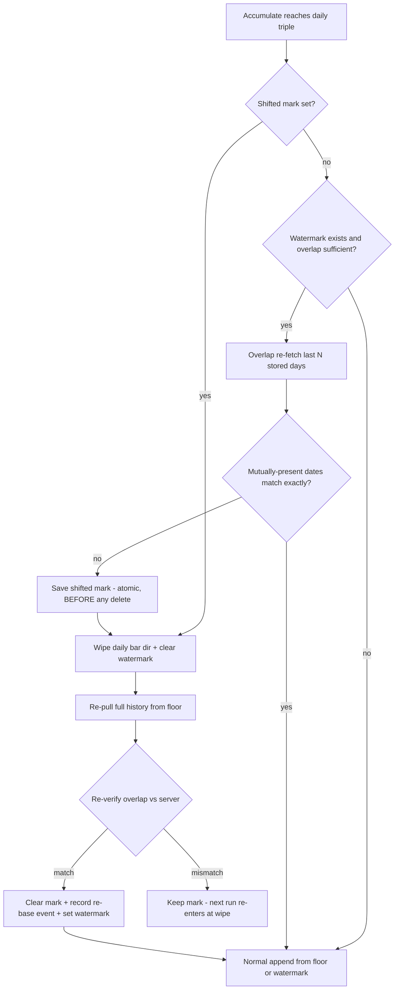
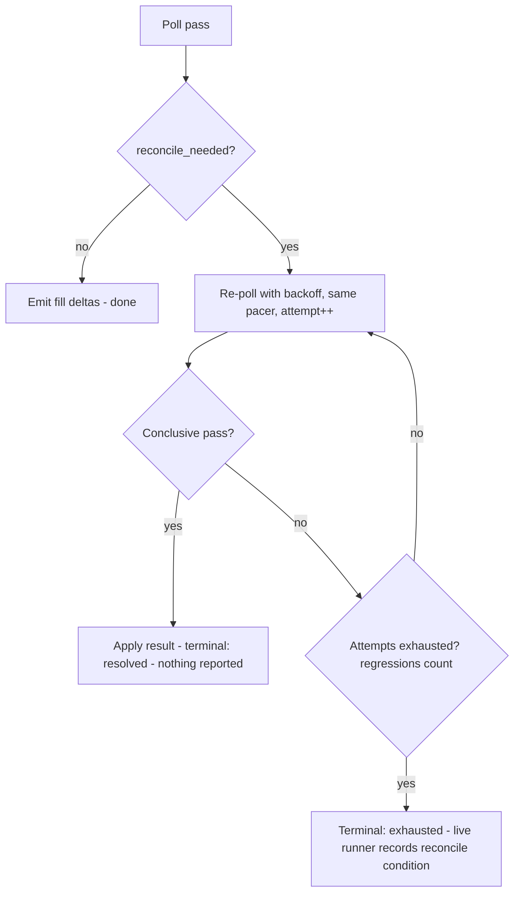

# Nautilus Lab Data-Fidelity Hardening - Plan

## Goal Capsule

- **Objective:** Move the strategy loop's flagged data-quality issues to fixed: make the daily-bar catalog self-heal adjustment-basis shifts, and harden the two fixable exec-lane accounting caveats — so runs stop being blanket-discounted.
- **Product authority:** The Product Contract below (confirmed 2026-07-03), then the Planning Contract's KTDs, then per-unit approach notes. Product Contract preservation: unchanged from the brainstorm except the Outstanding Questions section, whose six deferred-to-planning items are resolved in KTD-1 through KTD-9, and the Dependencies/Assumptions section, updated in place with research-verified facts (no scope change).
- **Execution profile:** Entirely offline-certifiable — every unit's tests run against wiremock/fixtures with no credentials. No live smoke is in the merge gate; the operator-attended exec re-validation and the production epoch re-base run are staged post-merge operator actions.
- **Open blockers:** None.
- **Stop conditions:** Surface rather than guess if the upstream `delete_data_range` primitive cannot actually remove one bar-type directory (KTD-2 depends on it), or if the constraint-schema preflight rejects a remaining-qty CSPAT00801 body the certified struct would not have sent. At runtime, a heal refuses the wipe and surfaces when the run's backfill floor is later than the symbol's earliest stored bar (KTD-2's wipe precondition) — truncating stored history is never an acceptable heal outcome.

---

## Product Contract

### Summary

Adopt the detect-and-re-pull stance for the adjustment-basis splice: daily accumulation stays on the adjusted basis, accumulate-forward detects a per-symbol basis shift by re-fetching an overlap window, and a detected shift triggers a bounded wholesale re-pull of that symbol's daily history. The same wave upgrades the splice flag from a whole-catalog bool to a detected per-symbol condition, and hardens two exec-lane caveats: cancel sends remaining quantity, and reconcile-advised conditions drive a bounded reconcile instead of only warning.

### Problem Frame

The strategy-improvement loop is the product, and its evidentiary value depends on the runs it registers being trustworthy. Today every backtest report carries `adjustment_basis_splice: true` because the flag is merely the ingest checkpoint's `adjusted_prices` bool — nothing is detected, so the analysis agent must discount all runs uniformly, which is the same as discounting none. Meanwhile the corruption is real and signal-shaped: adjusted daily series are rewritten server-side by every split/dividend, so an accumulated catalog splices two price bases at each corporate action, producing exactly the overnight discontinuity a stocks-in-play/gap scanner treats as signal. On the live side, three accounting caveats (advisory-only reconcile, cancel-sends-original-qty, approximated fill prices) make live-run accounting suspect. Two of the three are fixable without SC-lane certification.

### Key Decisions

- **Detect-and-re-pull (stance b), not unadjusted accumulation (stance a).** LS exposes no corporate-action or adjustment-ratio TR anywhere in the tracked universe, so stance (a)'s read-time adjustment has no factor source short of dual adjusted+unadjusted pulls — and it would still need basis-shift detection to know when to refresh factors. Stance (b) is strictly less machinery: the catalog keeps the adjusted basis the loop already consumes, KTD-2 of the strategy-loop plan already budgets for wholesale catalog rewrite, and the certified SDK stays untouched (`sujung` remains "Y" — the daily TR's adjusted-price request flag, which the baseline confirms exists, is simply never flipped). This resolves the P2 deferral recorded in docs/plans/2026-07-02-004-feat-nautilus-adapter-exec-ingest-increment-plan.md.
- **Both axes in one plan, with the exec lane bounded to two fixes.** Catalog re-base and exec-lane hardening share one motivation (trustworthy runs) and one verification surface (the data-quality report). The exec lane fixes only remaining-qty cancel and reconcile-driving; everything requiring SC-lane work stays deferred.
- **One-time epoch re-base at rollout.** Forward-only detection cannot see splices already baked into the accumulated catalog, so rollout includes a single bounded whole-catalog re-pull. After it, the catalog sits on one uniform basis and detection maintains that invariant.
- **The splice flag changes meaning — per-symbol, detected, healable.** `adjustment_basis_splice` stops being a catalog-wide constant and becomes a report of symbols with an unhealed in-range shift. This is a data-quality report schema change; the analysis agent's discounting guidance changes with it.

### Requirements

**Catalog basis integrity**

- R1. Before appending new daily bars for a symbol, accumulate-forward detects whether the server's adjusted series has shifted basis relative to that symbol's stored bars, by re-fetching a bounded overlap window and comparing against stored values.
- R2. A detected shift triggers a wholesale re-pull of that symbol's daily history from the bounded backfill floor, replacing the stored series and updating the checkpoint; the operation is idempotent and resumable, so an interrupted re-pull is retried on the next accumulate run rather than leaving a silently mixed series.
- R3. A re-base never touches `runs/` (strategy-loop KTD-2), and a backtest running concurrently is protected by the existing in-range catalog-fingerprint abort.
- R4. Daily accumulation stays on the adjusted basis; the certified SDK request struct is not modified.
- R5. Each re-base is durably recorded (symbol, detection date, heal completion) in a credential-free form, so an operator can audit how often the gateway rewrites series.
- R6. Rollout performs a one-time epoch re-base of the whole catalog, bounded by the existing backfill arithmetic, so detection starts from a single-basis catalog.

**Data-quality report semantics**

- R7. `adjustment_basis_splice` reports detected, per-symbol conditions: a backtest's report names symbols whose in-range history contains an unhealed shift, and a clean catalog reports none. Downstream analysis guidance is updated so the agent discounts only affected runs.

**Exec-lane accounting**

- R8. A cancel sends the order's remaining (unfilled) quantity, derived from the fill ledger's state, not the original order quantity.
- R9. When a poll pass sets `reconcile_needed`, the execution client drives a bounded reconcile (re-poll with backoff) itself; a reconcile-advised condition reaches the data-quality report only if the drive is still inconclusive.
- R10. Fill-price approximation stays flagged, not fixed: `price_approximated` semantics are unchanged, and exact per-fill prices remain deferred to the SC lane.

**Certification**

- R11. Every behavior in this wave is offline-certified against the mock gateway first: a served basis-shift fixture proves detect/re-pull/report, a request-body assertion proves remaining-qty cancel, and a truncated-poll fixture proves the reconcile drive.
- R12. Live exec-lane re-validation is operator-attended (the order autonomy chain refuses unattended runs) and is this wave's operator boundary; catalog-side live validation is read-only and carries no such gate.

### Key Flows

- F1. Basis-shift heal
  - **Trigger:** An accumulate run's overlap re-fetch for a symbol disagrees with stored bars.
  - **Steps:** Mark the symbol shifted; wipe its daily series and reset its watermark; re-backfill from the bounded floor; record the re-base event; clear the shifted mark on completion.
  - **Outcome:** The symbol's full daily history sits on the current adjusted basis; subsequent backtests over the symbol report no splice. **Covers R1, R2, R5.**
- F2. Reconcile drive
  - **Trigger:** A t0425 poll pass returns truncated, failed, or with an unresolved row.
  - **Steps:** The execution client re-polls with bounded backoff; on a conclusive pass it applies the result; on exhaustion it surfaces reconcile-advised.
  - **Outcome:** Transient poll flakiness self-heals; only persistent inconclusiveness discounts a run. **Covers R9.**

### Acceptance Examples

- AE1. **Covers R1, R2, R5, R7, R11.** Given a mock gateway serving symbol S's daily series, an accumulate run, then the mock rewriting S's history (post-split basis) for both the overlap and new dates — when the next accumulate runs, it detects the shift, re-pulls S wholesale, and records the re-base; a subsequent backtest over S reports no splice.
- AE2. **Covers R2.** Given a detected shift whose re-pull is interrupted mid-way — when the next accumulate runs, the symbol is still marked shifted and the re-pull resumes; no backtest between the runs consumes S as clean.
- AE3. **Covers R8, R11.** Given an order of quantity 10 with 4 filled per the ledger — when the strategy cancels, the mock gateway receives a cancel request carrying quantity 6.
- AE4. **Covers R9, R11.** Given a poll pass that returns truncated once then completes on retry — the run's data-quality report carries no reconcile-advised condition; given truncation that persists through the bounded drive — the condition is reported.

### Scope Boundaries

Deferred for later:

- SC-lane certification, SC primacy flip, and exact per-fill prices — the only path to fixing multi-price-fill approximation, explicitly out of this wave.
- Startup reconciliation and the cancel-ack late-fill window (standing exec-lane deferrals not named into this wave). The new cancel path must not change `close()` semantics, so the late-fill deferral is neither fixed nor worsened.
- Minute-bar basis: t8412 exposes no adjusted-price request flag, so minute bars keep whatever basis the server serves; a daily re-base does not touch minute bars (KTD-8), and minute-basis fidelity stays a documented residual.
- Tick-data ingestion and 10-level depth.
- Any corporate-action data source — none exists in the LS TR universe to build on.
- Re-basing or rewriting anything under `runs/` — permanently out, by strategy-loop KTD-2.

### Dependencies / Assumptions

- Daily closes are integer KRW on the wire (the ingest path parses them via `strict_i64`), so overlap comparison is exact-match, not tolerance-based. A sporadic single-bar server correction that is not a basis rewrite still trips detection — the resulting bounded re-pull converges the stored series to the server's, which is the correct outcome either way.
- The fill ledger tracks per-order cumulative filled quantity (per-OrdNo watermarks summed as chain total), but only privately — a public remaining-quantity accessor is added by this plan (U6), reading the ledger's maintained fields, never the retained order object.
- The gateway may rewrite a series again while a heal is in flight; the heal therefore ends with a re-verify, and a failed re-verify leaves the symbol marked for the next run.

---

## Planning Contract

### Key Technical Decisions

- KTD-1. **Detection and heal live in `run_accumulate`; heal state lives in the ingest checkpoint.** The accumulate loop already iterates per `(instrument, bar kind)` triple with the watermark read immediately before the range fetch — the overlap re-fetch slots between them, using the existing `DailyFetcher` trait seam so it is unit-testable with fakes. Heal marks and re-base events are new `#[serde(default)]` checkpoint fields beside `watermarks` (the `legacy_checkpoint_without_watermarks_loads` test is the additive-schema precedent), because the checkpoint is what the lab's backtest runner already loads — shifted symbols reach run reports with no new plumbing. A lab-side pre-run audit was rejected: it would duplicate fetch/pace machinery and could not make the heal part of the same idempotent accumulate transaction.
- KTD-2. **The heal is one idempotent re-entrant sequence, and re-entry always restarts at the wipe.** Order: durably save the shifted mark (atomic checkpoint save) → true-delete the symbol's daily bar directory → clear the watermark → let the existing accumulate arithmetic re-pull from the floor → re-verify with one more overlap fetch → clear the mark, record the re-base event, and set the watermark in one save. The mark outranks the watermark as authority: a marked symbol heals regardless of watermark state, so a crash at any point (marked-not-wiped, wiped-not-pulled, pulled-not-cleared) converges to the same path next run. Mark-before-wipe is load-bearing — the reverse order plus a crash would leave a high watermark over an empty store and silently truncate history forever. **Wipe precondition:** the re-pull floor is `LS_INGEST_LOOKBACK`, an operator-supplied per-run value, so before wiping, compare the run's floor against the symbol's earliest stored bar date — if the floor is later, refuse the wipe and surface it (a heal must never silently shrink stored history; the symbol stays marked until a run with an adequate floor heals it). True-delete (not overwrite-and-tolerate) is required because `write_to_parquet` with the disjoint check skipped leaves stale old-basis files readable wherever date ranges don't exactly coincide.
- KTD-3. **Detection compares only mutually-present dates, exact-match on OHLC, with a minimum-overlap guard.** The overlap window is the last N stored trading days ending at the watermark (default N=5, an ingest-config knob). Dates present on only one side are excluded — this inherently covers gap and holiday days, which have no stored bar (the checkpoint holds no per-date gap record to consult, and accumulate mode never persists gap rows anyway); a gap-fill or a dropped bar is not a basis shift, and including one-sided dates would re-detect forever. Fewer than a minimum of mutually-present dates (including the no-watermark first-ever accumulate) skips detection entirely rather than marking. Heal completion keys on the fetch cursor completing, never on reaching floor-depth bar count, so a shallow-history symbol (listed after the floor) clears its mark.
- KTD-4. **The epoch re-base is a new mode of the existing ingest binary: mark every daily triple, then run the same heal path.** A fourth `LS_INGEST_MODE` value follows the `probe-lookback` mode precedent. Marking all symbols in one atomic checkpoint save makes the epoch crash-resumable by construction — the per-symbol marks are the completion state, and a resumed run heals only what remains. It goes through the checkpoint-owning `Ingestor`, never raw `write_bars` (which advances no watermark and records no coverage). Budget: the README's ~2,700-request ≈ 45-minute full-universe figure is a one-page, one-fetch-per-triple lower bound — the heal costs at least two fetches per symbol (re-pull + re-verify) and a full-depth re-pull is multi-page per symbol, so a realistic epoch is ≥ 5,400 requests ≈ 90 minutes and scales with floor depth; steady-state accumulate runs also gain one overlap request per daily triple. Runbook (U4): run inside a no-live window sized from the original range-mode backfill's observed wall time (not the lower-bound figure), with `LS_INGEST_LOOKBACK` pinned at or before the original backfill start — the ingest↔live advisory lock is held for the duration, and a crash leaves a stale lock whose manual clear + resume is documented.
- KTD-5. **The report field is replaced, not overloaded: `adjustment_basis_splice: bool` → `adjustment_basis_shift_symbols: Vec<String>`.** The backtest runner populates it from checkpoint heal marks intersected with the run's selected symbols. A renamed field is a clean break — the only code that re-parses old `data_quality.json` files is the lab's own tests; historical run directories are read by the analysis agent as text and are not migrated or annotated (KTD-9). The constructor's second positional argument is the blast radius; all its callers and the inverted `backtest_run` assertion (clean catalog now asserts *empty*) change together, and the committed exemplar `analysis.md` fixture is rewritten to the per-symbol discounting guidance (R7's "analysis guidance" artifact).
- KTD-6. **Remaining quantity comes from ledger-maintained fields only: `order_qty` minus the per-OrdNo fill watermark sum, clamped at zero.** A new public ledger accessor exposes it (the sum exists privately as the terminal-detection chain total). Never read quantities off the retained order object — it is frozen emission identity (see the stale-retained-OrderAny learning). Remaining 0 (fully filled just before cancel) skips the send entirely and emits nothing synthetic — the in-flight fill terminates the order through existing terminal detection. An order with no ledger fill info falls back to current behavior (full quantity), because refusing to cancel is the one unacceptable failure mode; a gateway objection routes through the existing ambiguous-action reconcile path. Cancel outcome classification is untouched: Canceled only on explicit proof, per the inverted-cancel-risk convention.
- KTD-7. **The reconcile drive lives in the shared poll-pass primitive, shares the single pacer, and reports only on exhaustion.** Placing it in the primitive means both the cadence loop and the synchronous `poll_once` test seam get it. It must not construct a second pacer — two independent pacers can jointly exceed t0425's 2/s gateway cap (IGW00201). The drive is small (2-3 attempts with backoff — the cadence loop re-fires anyway); a `CumulativeRegression` row during a re-poll counts toward exhaustion rather than restarting the budget. The pass outcome gains an explicit terminal state (resolved vs exhausted) so the live runner records a reconcile condition only on exhausted — without it, implementers would resolve the healed-vs-exhausted distinction inconsistently. SC-lane unknown-fill triggers arm the drive on the next pass through the same flag. Double-emission during a re-poll is already impossible by construction (per-OrdNo watermark deltas behind execno dedup); U7's tests make that coverage explicit across a whole drive.
- KTD-8. **A daily re-base never touches minute bars.** Daily and minute series live in separate per-bar-type parquet directories, so the wipe is naturally scoped; wiping minute bars would permanently lose history beyond the probed minute lookback, which is unrecoverable, while minute-basis fidelity is already a documented residual (no `sujung` flag exists on the minute TR).
- KTD-9. **No annotation backfill of historical runs.** The checkpoint's re-base event record is the audit trail; runs whose catalog fingerprints predate an epoch re-base reference a superseded catalog by design (the range-scoped-comparability convention: a re-base intentionally moves the fingerprint and breaks cross-run comparability — the analysis guidance says so instead of pretending otherwise).

### High-Level Technical Design

The heal lifecycle — every crash point converges back into the same path because the mark, not the watermark, is the authority:

The reconcile drive — one pacer, bounded attempts, terminal state decides what the report sees:

### Sequencing

Two independent lanes. Catalog lane: U1 and U2 (independent of each other) → U3 → U4, with U5 after U1/U3. Exec lane: U6 and U7 are independent of the catalog lane and of each other. Any commit order that respects those arrows works.

---

## Implementation Units

### U1. Checkpoint heal state and re-base events

- **Goal:** The ingest checkpoint carries per-symbol shifted marks, a re-base event log, and a watermark-clear operation.
- **Requirements:** R2, R5; enables R1, R7.
- **Dependencies:** None.
- **Files:** `adapters/nautilus/src/ingest/checkpoint.rs` (unit tests in-file, per existing pattern).
- **Approach:** Two additive `#[serde(default)]` fields beside `watermarks`: a shifted map keyed like watermarks (`{instrument}|{bar_type}` → detection date) and a re-base event list (instrument, detected date, healed date). Public accessors to mark/clear/query shifted state and append events; a watermark-clear API (only `set_watermark` exists today). `prune_below_watermarks` needs no change — it compares against the current watermark, so a cleared watermark simply stops pruning until re-covered.
- **Patterns to follow:** The `watermarks` field's additive-schema precedent and its `legacy_checkpoint_without_watermarks_loads` test; the existing tmp-file + rename atomic save.
- **Test scenarios:** A legacy checkpoint JSON without the new fields loads with empty defaults. Mark → save → load round-trips. Clearing a watermark then pruning keeps not-yet-re-covered completed/gap rows. Event append preserves order and serializes deterministically.
- **Verification:** `cargo test` in `adapters/nautilus` — checkpoint unit tests green; legacy-load test proves old data files keep loading.

### U2. Per-symbol catalog delete and scoped-read primitives

- **Goal:** The adapter can true-delete one symbol's daily bar series and read one symbol's bars over a bounded window, without loading the whole catalog.
- **Requirements:** R1, R2.
- **Dependencies:** None.
- **Files:** `adapters/nautilus/src/ingest/mod.rs`, `adapters/nautilus/tests/ingest.rs`.
- **Approach:** Two helpers mirroring `write_bars`, each constructing the `ParquetDataCatalog` inside a `spawn_blocking` closure (it is `&mut` and must never be held across `.await` — the block-on-from-async learning). The delete helper calls the upstream `delete_data_range` for the `"bars"` type with the full bar-type directory identifier. The scoped read helper passes the bar-type identifier plus a date window to the upstream `bars(instrument_ids, start, end)` query — the existing `read_all_bars` loads the entire catalog and must not be used per-triple (an accumulate run would re-read the full multi-year catalog once per symbol, a cost small offline fixtures never expose). The watermark key label and the parquet directory name differ; map between them with the existing `BarKind::bar_type(instrument_id)` helper.
- **Test scenarios:** Write → delete → read-all returns empty for that symbol's daily bars. Deleting a symbol's daily series leaves its minute bars and other symbols' bars intact. Deleting a symbol with no stored bars is a no-op `Ok`. A scoped read returns only that symbol's daily bars within the requested window.
- **Verification:** Round-trip test proves files are actually gone (a wipe that misses files would let the heal certify a mixed series as clean) and the scoped read is the only read primitive U3 consumes.

### U3. Basis-shift detection and heal in accumulate

- **Goal:** Accumulate-forward detects a per-symbol basis shift and heals it through the idempotent mark → wipe → re-pull → re-verify → clear sequence.
- **Requirements:** R1, R2, R3, R4, R5; F1; AE1, AE2.
- **Dependencies:** U1, U2.
- **Files:** `adapters/nautilus/src/ingest/mod.rs`, `adapters/nautilus/tests/ingest.rs`.
- **Approach:** In `run_accumulate`'s daily-triple path, between the watermark read and the range fetch: if marked shifted → heal (starting with a re-wipe, gated by KTD-2's wipe precondition — refuse and stay marked if the run's floor is later than the symbol's earliest stored bar); else run detection per KTD-3 (overlap fetch via the `DailyFetcher` trait, stored side read through U2's scoped read helper — never `read_all_bars` — exact OHLC compare on mutually-present dates, minimum-overlap guard) and on mismatch enter the heal per KTD-2's ordering. `sujung` stays "Y" — no SDK change (R4). Bars written ascending by `ts_init` as the write path already requires. The concurrent-backtest guard is the existing in-range fingerprint abort (R3) plus the shifted mark being visible to the runner (U5) — no new locking.
- **Execution note:** Build detection against a fake `DailyFetcher` first (unit-level compare semantics), then the wiremock end-to-end with a dynamic responder.
- **Patterns to follow:** The `sdk_with_probe` dynamic-responder closure in `tests/ingest.rs` (compute the response from the request body / a call counter — this is how one server serves pre-shift then post-shift series without re-mounting); `accumulate_second_run_is_a_noop` for the multi-run shape.
- **Test scenarios:** Covers AE1: serve series v1, accumulate, flip the responder to a rewritten basis for overlap and new dates, accumulate again — shift detected, symbol re-pulled wholesale, re-base event recorded, final catalog matches v2 everywhere. Covers AE2: with the mark saved but the re-pull not run (simulated interruption), the next accumulate re-wipes and heals; the mark stays set throughout. Edge: an overlap window spanning a date with no stored bar (gap/holiday day) does not detect a shift. Edge: a symbol with no watermark or short overlap skips detection and never marks. Edge: a marked symbol whose run floor is later than its earliest stored bar refuses the wipe, stays marked, and surfaces the refusal (no bars deleted). Edge: a shallow-history shifted symbol clears its mark when the fetch cursor completes despite fewer-than-floor bars. Edge: a failed re-verify keeps the mark and the next run heals again. A post-heal accumulate run detects nothing and is a no-op.
- **Verification:** All ingest e2e tests green offline; the AE1 fixture's final read-back asserts every stored bar equals the v2 series (single basis, not merely appended).

### U4. Epoch re-base mode and operator runbook

- **Goal:** A one-time whole-catalog re-base runs as an ingest-binary mode and is documented as an operator recipe.
- **Requirements:** R6, R12 (catalog side).
- **Dependencies:** U3.
- **Files:** `adapters/nautilus/src/bin/ls-ingest.rs`, `adapters/nautilus/src/ingest/mod.rs`, `adapters/nautilus/README.md`.
- **Approach:** A new `LS_INGEST_MODE=rebase` (following the `probe-lookback` mode precedent): mark every daily triple shifted in one atomic checkpoint save, then run the accumulate/heal path (KTD-4). Resumable by the marks themselves. README gains the runbook: run in a no-live window sized from the original backfill's observed wall time (the ~45-minute figure is a one-page lower bound; the heal is ≥2 fetches per symbol and ≥90 minutes realistic), pin `LS_INGEST_LOOKBACK` at or before the original backfill start (the wipe precondition refuses a shallower floor), stale-advisory-lock clear + resume steps; the known-limitation section is rewritten from "deferred" to "self-healing, minute-basis residual documented".
- **Test scenarios:** Rebase mode over a small fixture universe re-pulls every symbol and ends with zero marks and one event per symbol. An interrupted epoch (marks persist for un-healed symbols) resumes on the next run and heals only the remainder. A post-epoch accumulate detects nothing.
- **Verification:** Offline fixture-universe rebase test green; README runbook present and consistent with the mode's actual env contract.

### U5. Per-symbol shift reporting and analysis guidance

- **Goal:** The data-quality report names symbols with an unhealed in-range shift; a clean catalog reports none; the analysis exemplar teaches per-symbol discounting.
- **Requirements:** R7; report half of AE1.
- **Dependencies:** U1, U3.
- **Files:** `adapters/nautilus/lab/src/artifacts/data_quality.rs`, `adapters/nautilus/lab/src/runner/backtest.rs`, `adapters/nautilus/lab/src/runner/live.rs`, `adapters/nautilus/lab/tests/artifacts.rs`, `adapters/nautilus/lab/tests/backtest_run.rs`, `adapters/nautilus/lab/tests/live_wiring.rs`, `adapters/nautilus/lab/tests/fixtures/analysis.md`.
- **Approach:** Replace the bool with `adjustment_basis_shift_symbols: Vec<String>` per KTD-5. The backtest runner populates it from checkpoint shifted marks intersected with the run's selected symbols; the constructor signature change propagates to every caller (the runners and lab tests). The `backtest_run` assertion inverts: a clean catalog asserts the list is empty. Rewrite the exemplar `analysis.md` fixture from "documented limitation to discount" to per-symbol guidance (discount runs whose universe intersects the listed symbols; runs predating a re-base event reference a superseded catalog — KTD-9).
- **Test scenarios:** Clean catalog → empty list. A marked symbol inside the selected universe → listed. A marked symbol outside the selected universe → not listed. Serde round-trip of the new field. The exemplar-analysis co-location test still passes with the rewritten fixture.
- **Verification:** `cargo test` in `adapters/nautilus` (lab package included) green; the inverted assertion proves the blanket-flag era is over.

### U6. Remaining-quantity cancel

- **Goal:** Cancel sends the unfilled remainder from ledger-maintained state, with fail-closed edges for fully-filled and unknown orders.
- **Requirements:** R8; AE3.
- **Dependencies:** None (exec lane).
- **Files:** `adapters/nautilus/src/orders/ledger.rs`, `adapters/nautilus/src/execution.rs`, `adapters/nautilus/tests/execution_client.rs`.
- **Approach:** New public ledger accessor: remaining = maintained `order_qty` − per-OrdNo watermark sum, clamped at zero (a modify can reduce quantity below filled). Thread it through the order snapshot into the cancel request per KTD-6: remaining 0 → skip the send, emit nothing synthetic; no ledger entry → full-quantity fallback. The ambiguous-cancel reconcile intent carries the same remaining quantity. Error classification stays on the `LsError` variant per the placed-nothing-vs-may-rest convention.
- **Test scenarios:** Covers AE3: submit 10, poll-fill 4, cancel — the mock's captured cancel body carries quantity 6 (the existing newest-request-by-tr_cd body-assertion helper). Second-mutation coverage: modify quantity down, then partial fill, then cancel — remaining reads the maintained field, not the retained order (this ordering is what exposes a stale-read regression). Remaining 0: no cancel request reaches the mock and no cancel event is emitted. Unknown order: cancel still sends, at full quantity. A 5xx on the cancel routes to the reconcile intent, not a success.
- **Verification:** Exec-client tests green offline; the request-body assertion is the AE3 witness.

### U7. Bounded reconcile drive

- **Goal:** Transient poll inconclusiveness self-heals inside the poll pass; only exhaustion reaches the data-quality report.
- **Requirements:** R9, R10 (unchanged `price_approximated` semantics verified in passing); F2; AE4.
- **Dependencies:** None (exec lane).
- **Files:** `adapters/nautilus/src/orders/poll.rs`, `adapters/nautilus/src/execution.rs`, `adapters/nautilus/lab/src/runner/live.rs`, `adapters/nautilus/tests/execution_client.rs`, `adapters/nautilus/lab/tests/live_wiring.rs`.
- **Approach:** Per KTD-7: the drive wraps the poll pass in the shared primitive (both the cadence loop and the `poll_once` test seam go through it), re-polling 2-3 times with backoff on `reconcile_needed`, sharing the one pacer instance, counting regression rows toward exhaustion. The outcome gains a terminal state (resolved / exhausted); the live runner records a reconcile condition only on exhausted. SC-triggered `reconcile_needed` arms the drive on the next pass.
- **Execution note:** Keep the drive's total wall time small relative to the 2-second cadence so other symbols' fills are not starved — the loop is sequential.
- **Test scenarios:** Covers AE4 both arms: a responder that truncates once then serves a complete page → drive resolves, no condition recorded; a responder that truncates every attempt → exhausted, condition recorded. Exactly-once: fills observed during a drive containing a re-poll of the same cumulative emit once (the watermark + execno dedup covering the new path explicitly). A regression row during the drive counts toward exhaustion rather than resetting attempts. The `poll_once` seam exercises the drive synchronously.
- **Verification:** Exec-client and live-wiring tests green offline; no second pacer construction on the drive path (review point — two pacers can jointly breach the t0425 2/s cap).

---

## Verification Contract

| Gate | Command | Proves |
|---|---|---|
| Adapter offline suite | `cargo test` (run in `adapters/nautilus/`) | All units U1-U7: AE1-AE4 fixtures, heal edge cases, cancel body assertion, drive exhaustion — no credentials, wiremock only |
| Repo commit gate | `make docs && cargo test && cargo test -p ls-core && make docs-check && make lane-check` (repo root) | Tree stays green; this wave touches no TR metadata, so docs regeneration must be a no-op |

No live smoke is in the merge gate (R11/R12). Staged post-merge operator actions, outside this plan's Definition of Done: the attended exec-lane live re-validation (order autonomy refuses unattended), and the production epoch re-base run per the U4 runbook.

---

## Definition of Done

- All four Acceptance Examples are encoded as passing offline tests, plus the flow-analysis edge cases named in U3/U6/U7 (heal re-entry, gap-day overlap, short-history skip, remaining-zero cancel, regression-counts-toward-exhaustion).
- A clean-catalog backtest reports an empty shift-symbol list — the inverted `backtest_run` assertion is the witness that blanket discounting is gone.
- The README known-limitation section describes the self-healing design and the minute-basis residual, and carries the epoch re-base runbook.
- Both Verification Contract gates green; no dead code from abandoned approaches remains in the diff.
- Nothing under `runs/` is read or written by any new code path, and the certified SDK request structs are unmodified.
