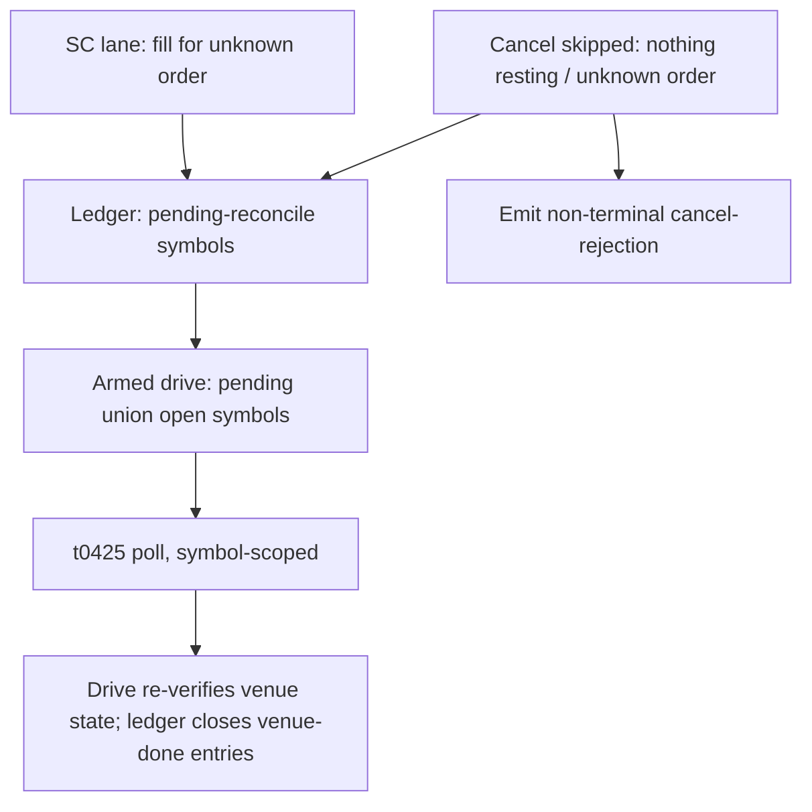
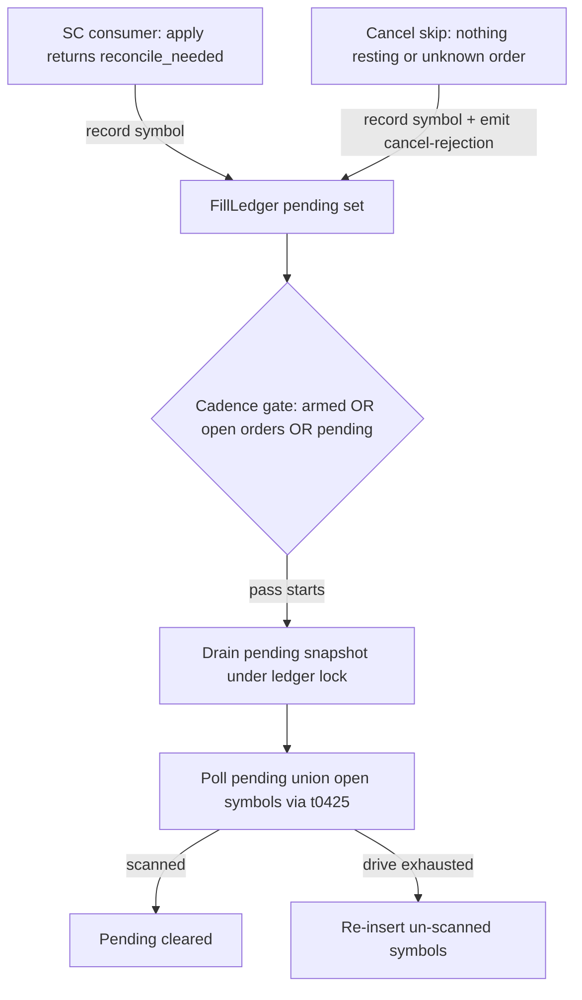
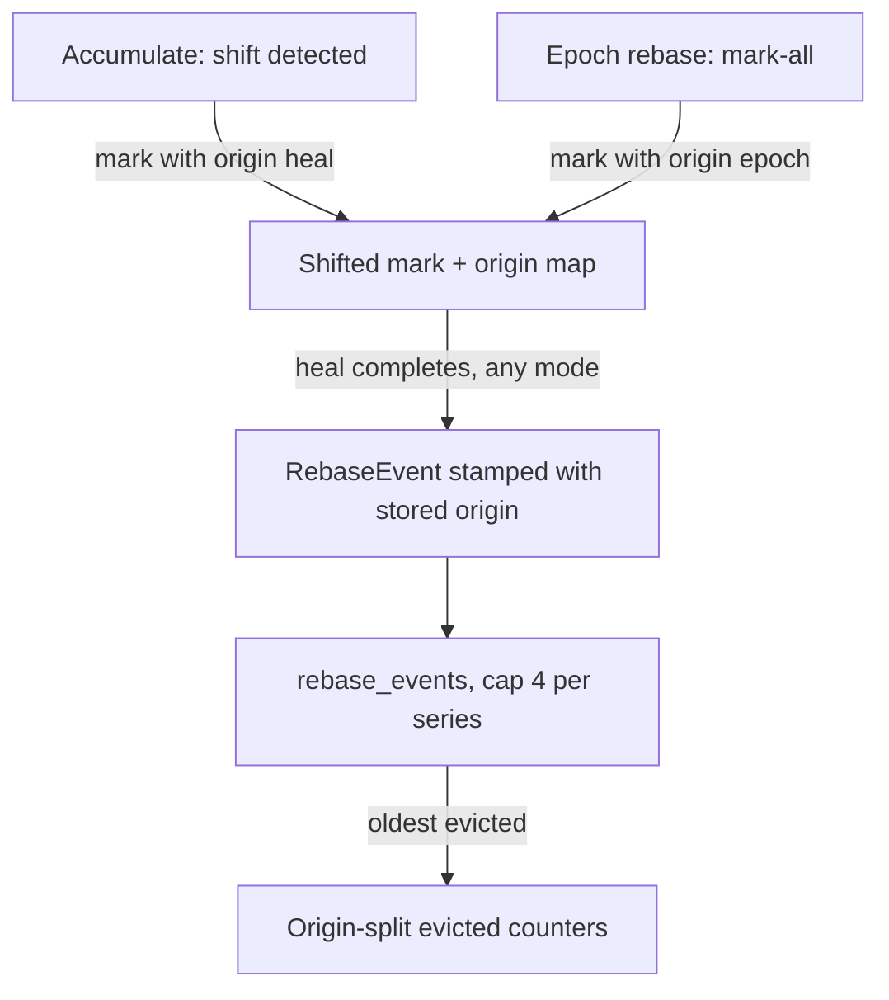

# Nautilus Hardening Pass 2 - Plan

## Goal Capsule

- **Objective:** Fix the four verified findings deferred from PR #93's code review in `adapters/nautilus/` as one offline wave: ledger-owned reconcile arming, cancel-path strand resolution, range-mode shifted-mark refusal, and `rebase_events` origin + bounding.
- **Product authority:** The Product Contract below (confirmed 2026-07-03), amended during planning with user confirmation — see the preservation note in the Planning Contract.
- **Execution profile:** Offline only — wiremock/fake-fetcher tests, no gateway calls, no live smokes, no TR metadata or ledger edits.
- **Stop conditions:** Surface (don't guess) if the SC1 normalized baseline lacks a usable symbol field (blocks U1), or if nautilus-core's FSM rejects the cancel-rejection event as an exit from PENDING_CANCEL (blocks U3's design).
- **Open blockers:** None. Sequencing preference: land before the operator runs the staged production epoch re-base (see Dependencies).

---

## Product Contract

### Summary

One bounded hardening PR in `adapters/nautilus/` closing all four deferred PR #93 review findings, gated offline: each finding gets a test reproducing its failure scenario, then `cargo test --workspace` plus the repo gate. Exec-lane fixes land as a ledger-owned pending-reconcile symbol set consumed by the existing drive; ingest fixes extend the existing refusal-surfacing and checkpoint-evolution patterns.

### Problem Frame

PR #93 (squash `33a5c89`) shipped self-healing basis shifts and exec-lane accounting fixes; its code review verified ten findings and fixed six. The four deferred ones are latent correctness holes, not style debt:

1. The SC-lane unknown-fill trigger arms a bare flag, but the armed drive polls only symbols the ledger already knows — an unknown order's symbol is by definition absent, so the drive that exists to find that order can scan nothing and clear the arm.
2. Range mode is the default ingest mode, and its run path consults only completion state — a daily series carrying an unhealed shifted mark can be skipped as done and served on a stale adjustment basis, the exact corruption the heal machinery was built to prevent.
3. `rebase_events` is append-only with no origin: a production epoch re-base writes one event per daily series through the same log, permanently inflating the operator's "how often does the gateway rewrite series" audit signal, and nothing ever prunes the vector.
4. A cancel arriving when the ledger shows nothing resting (remaining quantity 0 after the modify-below-filled race, or an order the ledger never tracked) is skipped silently; nautilus-core's order FSM sits in PENDING_CANCEL indefinitely with no local recovery path. Planning research proved re-polling alone cannot recover it: the fills are already accounted, so the ledger emits no delta on a re-scan.

Findings 1 and 4 touch live execution accounting; 2 and 3 touch data fidelity and the operator audit trail.

### Key Decisions

- **Resolve the cancel-skip strand with a non-terminal cancel-rejection plus reconciliation — never a synthetic terminal event.** Emitting a synthetic `OrderCanceled` could mask a still-resting order (inverted-cancel risk). Instead the skip emits a cancel-rejection ("nothing resting" / "unknown order") — truthful, since the adapter sent no cancel — which returns the FSM from PENDING_CANCEL, and arms the reconcile drive so venue truth is re-verified.
- **The reconcile drive stays symbol-scoped.** The arm carries the affected symbol; the drive unions it with the ledger's open symbols. No flat or unscoped t0425 scan is introduced — the flat scan is what caused the June IGW00201 rate-limit incident.
- **Range mode refuses per series; it does not heal.** Heal semantics are watermark-anchored and live in accumulate/rebase mode. Duplicating them in range mode risks a second copy of the empty-re-pull data-loss class fixed in PR #93. Marked series are refused and surfaced; unmarked series in the same run are unaffected.
- **Re-base origin is stamped at mark time, not heal time.** A crashed epoch re-base is resumed under accumulate mode, so the running mode at heal time cannot tell why the mark exists. Origin recorded when the series is marked survives the crash-resume path. The audit metric counts only organic heals; legacy rows read as unknown origin and are treated as organic (valid only under the sequencing dependency below).
- **Bounded audit log over verbatim history.** `rebase_events` gets a per-series cap with oldest-dropped eviction and origin-split evicted counters that preserve the true per-origin totals.
- **Offline-green definition of done.** The already-staged attended exec-lane live re-validation remains a separate operator action; once this lands it covers these changes too.

### Requirements

**Exec lane — reconcile arming and cancel resolution**

- R1. When an execution event references an order the fill ledger does not know, the ledger records that order's symbol as pending reconciliation, and the next armed drive polls that symbol in addition to the ledger's open symbols.
- R2. An armed drive that runs must actually scan the pending symbols; a pending symbol is cleared only by a completed (non-error) fetch, and an errored or un-scanned symbol is re-recorded when the drive exhausts.
- R3. The reconcile drive remains symbol-scoped in all paths; no unscoped t0425 scan is introduced.
- R4. When a cancel cannot be sent — remaining quantity is 0, or the order is unknown to the ledger — the adapter emits a non-terminal cancel-rejection stating the reason and arms reconciliation for the order's symbol; the remaining-0 skip also closes the ledger entry (its venue-done state follows from the acked modify plus observed fills), and no synthetic terminal event is emitted.

**Ingest — range-mode shifted marks**

- R5. Range-mode ingest must not treat a daily series carrying an unhealed shifted mark as done: the shifted check outranks the completion check, the series is not pulled and not counted as completed, and it is surfaced in the coverage report as refused pending heal, directing the operator to accumulate or rebase mode.
- R6. Unmarked series in the same range-mode run proceed unaffected, and a run containing refusals still exits successfully with the refusals as a distinct counted line in the operator summary.

**Checkpoint — re-base audit log**

- R7. Every shifted mark records its origin (organic heal detection vs epoch re-base) at mark time, and the completed `RebaseEvent` carries that origin; marks and events written before this change read as unknown origin.
- R8. The operator audit surface reports re-base totals per origin bucket (heal / epoch / unknown, with unknown presumed organic under the sequencing dependency); the organic metric excludes epoch-origin events, and per-bucket totals survive eviction.
- R9. `rebase_events` growth is bounded per series with oldest-dropped eviction, and origin-split evicted counters preserve the true per-origin totals across evictions; checkpoint serialization stays backward compatible, deterministic, and additive (serde defaults).

**Verification**

- R10. Each of the four findings lands with a test that reproduces its failure scenario against the pre-fix behavior (red-then-green), in the adapter's offline test suites.

### Acceptance Examples

- AE1. **Covers R1, R2, R3.** Given the fill ledger holds no entry for order X on symbol S, and S is not among the ledger's open symbols (ledger otherwise flat), when an SC-lane fill for X arrives, then the next drive pass polls S; if the drive exhausts before scanning S, S is pending again for the following pass.
- AE2. **Covers R4.** Given an order's quantity was modified below its filled total, when a cancel arrives and the send is skipped at remaining 0, then a non-terminal cancel-rejection is emitted (the FSM exits PENDING_CANCEL), the ledger entry closes so the poll loop can idle, reconciliation is armed for that symbol, and no synthetic terminal event is emitted. The same holds for a cancel naming an order the ledger never tracked, using the symbol from the cancel command.
- AE3. **Covers R5, R6.** Given a range-mode universe where one daily series carries an unhealed shifted mark — including the case where that series is already recorded as completed for the requested range — when the run executes, then that series is reported refused pending heal and not treated as done, while every unmarked series is pulled normally and the run exits successfully.
- AE4. **Covers R7, R8.** Given an epoch re-base over N previously-unmarked daily series, when it completes — even if it crashes midway and is resumed under accumulate mode — then all N events carry epoch origin and the organic audit bucket is unchanged; a series already organically marked at epoch time keeps its heal origin (keep-original-on-re-mark) and still counts organic, and a subsequent organic heal increments the organic bucket by one.
- AE5. **Covers R7, R9.** Given a checkpoint file written before this change, when it loads, then existing re-base rows and marks read as unknown origin and counts are preserved. Given a series exceeding the per-series cap, when a new event is recorded, then the oldest is evicted and the origin-split evicted counters keep the per-origin totals recoverable.

### Scope Boundaries

- No opportunistic sweep of `adapters/nautilus/` for adjacent issues of the same class (unbounded logs, silent skips, mode-specific guards) — this wave is exactly the four findings.
- No heal capability in range mode — refusal and redirection only.
- No synthetic terminal order events anywhere in the cancel path; the non-terminal cancel-rejection in R4 is the only event the skip paths may emit.
- The attended exec-lane live re-validation and the production epoch re-base stay operator actions outside this wave's DoD.

### Dependencies / Assumptions

- **Sequencing:** land this pass before the operator runs the staged production epoch re-base. R8's treatment of unknown-origin rows as organic assumes all pre-pass rows are heals; an epoch run before landing would permanently mix unlabeled epoch rows into the audit metric.
- PENDING_CANCEL is nautilus-core's order FSM state, not a local enum; a cancel-rejection event returns the order to its prior state (the pattern `handle_action_error` already uses for business rejections). After the rejection, a venue-done order rests at that restored status indefinitely — the accepted phantom-open residual, attended at the next exec-lane re-validation.
- An old adapter binary that loads and re-saves a new checkpoint silently drops the origin and eviction-counter fields (serde ignores unknown fields). Accepted risk: single operator, single checkpoint.
- Adapter tests run with `cargo test --workspace` from `adapters/nautilus/` (plain `cargo test` misses the lab crate).

### Sources

- Deferred findings originate from PR #93's code review (squash `33a5c89`); heal machinery and the empty-re-pull data-loss class: `docs/solutions/logic-errors/empty-repull-completing-destructive-heal-destroys-history.md`.
- Cancel/modify staleness: `docs/solutions/logic-errors/modify-reads-stale-retained-orderany-not-maintained-fields.md` (read remaining qty from the ledger's maintained fields, never the frozen `OrderAny`; test the second mutation).
- Reconciliation completeness and cancel classification: `docs/solutions/architecture-patterns/order-double-execution-guards-dedup-reservation-and-complete-query-reconciliation.md`.
- t0425 pacing constraint behind R3: `docs/solutions/integration-issues/ls-gateway-t0425-rate-limit-and-pagination-flat-scan.md`.
- Catalog I/O in tests must use `spawn_blocking`: `docs/solutions/integration-issues/nautilus-parquet-catalog-block-on-from-async.md`.

---

## Planning Contract

**Product Contract preservation** — changed during planning, confirmed with the user 2026-07-03: R4 broadened to cover the unknown-order cancel branch and to emit a non-terminal cancel-rejection (research proved arming alone cannot exit PENDING_CANCEL); the Scope Boundaries "no synthetic order events" line narrowed to "no synthetic *terminal* events"; R5/R6 pin the shifted-outranks-done ordering and the success exit; R7 moved origin recording to mark time; AE2/AE3/AE4/AE5 amended to force those behaviors in tests. R1-R3, R10, and all other sections unchanged.

### Key Technical Decisions

- **KTD1 — Pending-reconcile set lives inside `FillLedger`.** The drive's only symbol source is `open_symbols()` (`src/orders/poll.rs:86`); the pending set is consulted there as a union. This keeps `drive_poll_pass` and `DrivenOutcome` signatures unchanged — `DrivenOutcome` is literally constructed in `lab/tests/live_wiring.rs`, and the fetcher/pacer callers assert exact call budgets — and reuses the existing ledger mutex, adding no lock-ordering surface. Insertion is restricted to SC-sourced unknown-order observations and the two cancel-skip branches; poll-sourced unknown rows keep today's `reconcile_needed` semantics without inserting — the poll scanning a symbol is itself the reconcile, and re-inserting from within the scan would make the set self-sustaining under a foreign resting order (an operator's manual HTS order on the same account).
- **KTD2 — Cadence gate includes pending state.** The poll loop gates on `armed || has_open_orders()` (`src/execution.rs:355-356`); with a flat ledger and a consumed arm, pending symbols would otherwise sleep forever. The gate becomes armed-or-open-or-pending. Drain semantics: snapshot (take) the pending set under the ledger lock at pass start; a symbol counts as scanned only on a completed (non-error) fetch, and errored or un-scanned symbols re-insert when the drive exhausts (R2). Set semantics dedup repeated unknown fills for the same symbol; churn from an unadoptable external order is bounded by the pacer and accepted.
- **KTD3 — Symbol plumbing prerequisite.** `Sc1Row` deserializes no symbol field and `FillObservation` carries none, so the unknown-order arm has no symbol to record today. Widen `Sc1Row` with the symbol field named by the SC1 normalized baseline (`shtnIsuno`/`Isuno` family — implementer confirms the exact key from `crates/ls-trackers/baselines/api-drift/normalized/trs/SC1.json`) and carry it on `FillObservation`; normalize the `A`-prefixed issue-code form the same way the cancel path builds it. The poll path already has the symbol in scope at `apply_row`. A blank or whitespace symbol at the `ToEvent` seam is treated as absent: the observation carries no symbol, the unknown-order arm degrades to today's bare armed wakeup, and the pending set never admits an empty string — so no empty-expcode t0425 call (the flat-scan/IGW00201 class R3 bans) can occur.
- **KTD4 — Cancel-skip resolution event.** Both skip branches (remaining-0 with a snapshot; no snapshot at all) emit a non-terminal cancel-rejection with a reason naming the branch, then record the symbol pending — from the snapshot in the first branch, from the cancel command's instrument in the second. The remaining-0 branch emits via the `handle_action_error` pattern (`emit_order_cancel_rejected` on the retained `OrderAny`); the no-snapshot branch has no `OrderAny` by definition and uses the emitter's ids-based `emit_order_cancel_rejected_event` built from the `CancelOrder` command's strategy/instrument/client-order ids — never a fabricated `OrderAny`. Remaining quantity is read from the ledger's maintained fields, never the retained `OrderAny`. The remaining-0 skip also marks the ledger entry terminal — its venue-done state follows from the acked modify plus observed fills, reusing the ledger's existing terminal condition, not a synthetic event — so the open set clears and the poll loop can idle. The nautilus-side order rests at its restored status (nautilus-core 0.60 has no non-synthetic event that closes a quantity-modified-below-filled order); this phantom-open condition is an accepted residual covered by the attended exec-lane re-validation, and repeated cancels re-emit the rejection.
- **KTD5 — Origin persisted beside the mark.** Keep the `shifted` map's bare detection-date value untouched (its serde shape is load-bearing for legacy files); add a parallel origin map keyed identically, maintained inside `mark_shifted` itself via a new origin parameter (detection call site passes heal; epoch loop passes epoch), so keep-original-on-re-mark applies to both maps in one function and divergence is impossible by construction; `clear_shifted` clears both. Absent key → unknown. Heal completion reads the origin beside the detection date and stamps it on the `RebaseEvent`.
- **KTD6 — `RebaseEvent.origin` enum.** `heal | epoch | unknown`, snake_case serde, `#[serde(default)]` = unknown on the field so legacy rows load (mirrors the `GapReason` enum precedent). The audit accessor reports three per-origin totals (rows plus evicted counters per bucket) rather than folding unknown into organic; the README states unknown is presumed organic under the sequencing assumption, so the operator can re-judge unknown rows if that assumption breaks.
- **KTD7 — Cap and eviction counters.** Per-series (instrument + bar type) cap of 4 events, oldest-dropped. Evicted totals kept as a checkpoint-level map from origin to count (`#[serde(default)]`, BTreeMap for deterministic serialization — the round-trip test asserts byte-identical double-save). Cap value 4 is a judgment call bounded by the checkpoint-rewrite cost over a ~2,600-symbol universe post-epoch; implementer may adjust with a comment, not a config knob.
- **KTD8 — Range-mode refusal surface.** In range `run()`, the shifted check precedes and outranks `is_done` (mirroring "the mark outranks the watermark" in accumulate). Refused triples are skipped without `mark_done` and pushed to a new dedicated `CoverageReport` vector (instrument, bar type, detection date) — not reusing `HealRefusal`, whose floor/earliest fields and printer wording don't fit. `ls-ingest` prints one line per refusal plus a count in the summary line; exit stays 0.

### High-Level Technical Design

Pending-set lifecycle (findings 1 + 4 share one seam):

Origin lifecycle (finding 3):

Diagrams are directional; prose and per-unit fields are authoritative.

---

## Implementation Units

### U1. SC-frame symbol plumbing

- **Goal:** `FillObservation` carries the traded symbol so the ledger can record it for orders it does not know.
- **Requirements:** prerequisite for R1 (AE1).
- **Dependencies:** none.
- **Files:** `adapters/nautilus/src/ws/rows.rs`, `adapters/nautilus/src/orders/ledger.rs` (observation struct), `adapters/nautilus/tests/order_events.rs`.
- **Approach:** Add the symbol field to `Sc1Row` using the key from the SC1 normalized baseline; carry it through the `ToEvent` seam into `FillObservation` (KTD3). Poll-path observations populate it from the symbol already in scope at `apply_row`. Normalize the `A`-prefix form once at the seam.
- **Patterns to follow:** existing `Sc1Row` serde field style in `src/ws/rows.rs`; requirement-tag doc comments.
- **Test scenarios:** SC1 fill frame with the baseline's symbol key deserializes and the observation exposes the bare symbol; an `A`-prefixed code normalizes; a frame with a blank/whitespace symbol yields an observation carrying no symbol (KTD3 guard); extend `sc1_unknown_ordno_no_delta_flags_reconcile` (`tests/order_events.rs`) to assert the observation's symbol survives to the reconcile outcome.
- **Verification:** `cargo test --workspace` green; the extended order-events test fails on pre-change code (missing symbol).

### U2. Ledger-owned pending-reconcile set and drive union

- **Goal:** An unknown-order event guarantees the next drive scans that order's symbol.
- **Requirements:** R1, R2, R3 (AE1).
- **Dependencies:** U1.
- **Files:** `adapters/nautilus/src/orders/ledger.rs`, `adapters/nautilus/src/orders/poll.rs`, `adapters/nautilus/src/execution.rs`, unit tests in those files.
- **Approach:** Pending set (sorted, deduped) inside `FillLedger`, recorded only from SC-sourced unknown-order observations and the cancel-skip branches — poll-sourced unknown rows and the poll-regression arm keep today's `reconcile_needed` semantics without inserting (KTD1). `poll_open_orders` polls the drained pending snapshot unioned with `open_symbols()`; a symbol clears only on a completed fetch, and errored or un-scanned symbols re-insert on an exhausted drive (KTD2). Cadence gate gains the pending condition; the `Arc<AtomicBool>` arm stays as the SC-lane wakeup signal.
- **Execution note:** Start with a failing test reproducing the vacuous drive: unknown fill on a flat ledger → pre-change drive polls nothing.
- **Patterns to follow:** `ledger_with()`/`OrderTestBuilder` fixtures (`src/orders/ledger.rs` tests); `ScriptedFetcher` call-budget assertions (`src/orders/poll.rs` tests); `lock()` poisoned-mutex helpers.
- **Test scenarios:** unknown fill, flat ledger → next pass polls that symbol (red-then-green, AE1); exhausted drive re-inserts un-scanned pending; a pending symbol whose fetch errors through exhaustion is pending again next pass; a symbol cleared by a completed fetch is not re-polled next pass; duplicate unknown fills for one symbol dedup; an unknown fill with a blank symbol records nothing pending and the drive makes no empty-expcode call (KTD3 guard); a pending symbol whose poll response contains only a foreign order clears and the loop idles next pass (no self-sustaining re-insert); cadence gate fires on pending-only state (no arm, no open orders); `DrivenOutcome` shape and existing call-budget tests unchanged.
- **Verification:** all existing poll/ledger/execution tests pass unmodified except where behavior intentionally changed; `lab/tests/live_wiring.rs` compiles untouched.

### U3. Cancel-path strand resolution

- **Goal:** Neither cancel-skip branch can strand nautilus-core in PENDING_CANCEL.
- **Requirements:** R4 (AE2).
- **Dependencies:** U2.
- **Files:** `adapters/nautilus/src/execution.rs`, `adapters/nautilus/tests/execution_client.rs`.
- **Approach:** In `run_cancel`: the remaining-0 branch and the no-snapshot branch each emit the non-terminal cancel-rejection with a branch-specific reason and record the symbol pending; the remaining-0 branch also marks the ledger entry terminal so the open set clears (KTD4). Remaining quantity keeps coming from the ledger's maintained fields.
- **Execution note:** Test the second mutation — a modify-below-filled after an earlier modify — per the stale-`OrderAny` learning.
- **Patterns to follow:** `handle_action_error`'s rejection emission; `capture_exec_events()`/`next_order_event()` and `count_requests` assertions in `tests/execution_client.rs`.
- **Test scenarios:** Covers AE2. Extend `cancel_with_zero_remaining_sends_nothing`: still no CSPAT00801 request, now asserts a cancel-rejection event, the symbol pending, and the ledger going flat after the skip (open set clears, loop can idle); modify-down-then-fill-then-cancel (second-mutation shape) reads ledger qty; unknown-order cancel emits the ids-based rejection with the command's symbol pending; a normal cancel with remainder still sends and emits nothing new.
- **Verification:** pre-change code fails the new assertions (no event, no pending); full exec-lane suite green.

### U4. Range-mode per-series refusal

- **Goal:** Default-mode ingest can no longer serve or complete a series on a stale adjustment basis.
- **Requirements:** R5, R6 (AE3).
- **Dependencies:** none (parallel to U1-U3).
- **Files:** `adapters/nautilus/src/ingest/mod.rs`, `adapters/nautilus/src/bin/ls-ingest.rs`, `adapters/nautilus/tests/ingest.rs`.
- **Approach:** In range `run()`'s triple loop, check the shifted mark before `is_done`; refused triples skip pull and `mark_done`, and are pushed to the new report vector (KTD8). Printer adds a per-refusal line ("run accumulate/rebase to heal") and a summary count; exit unchanged.
- **Patterns to follow:** `HealRefusal` push/print pattern (`src/ingest/mod.rs`, `src/bin/ls-ingest.rs`); `SharedSeries`/`checkpoint_at` fixtures in `tests/ingest.rs`; `spawn_blocking` for any catalog access in tests.
- **Test scenarios:** Covers AE3. Marked series refused: no fetch (t8410 count 0 for it), not marked done, report row carries instrument/bar type/detection date; marked AND already-done-for-range series still refused (ordering red-then-green — naive `is_done`-first passes wrongly); unmarked sibling in same universe pulls normally; run result Ok with refusals present; accumulate-mode behavior unchanged.
- **Verification:** new ingest tests green; existing range/accumulate ingest tests unchanged.

### U5. Mark-time origin and `RebaseEvent.origin`

- **Goal:** Every re-base event is attributable to organic detection or epoch re-base, surviving crash-resume.
- **Requirements:** R7, R8 (AE4, AE5 origin half).
- **Dependencies:** none (parallel); before U6.
- **Files:** `adapters/nautilus/src/ingest/checkpoint.rs`, `adapters/nautilus/src/ingest/mod.rs`, `adapters/nautilus/tests/ingest.rs`.
- **Approach:** Parallel origin map beside `shifted`, owned by `mark_shifted` via an origin parameter with keep-original-on-re-mark (KTD5); call sites pass heal/epoch; `heal_daily` reads it and stamps the event; `clear_shifted` clears both entries. `RebaseEvent.origin` enum per KTD6. Add the per-origin audit accessor (rows plus evicted counters per bucket, unknown presumed organic) so the README's audit-trail sentence points at one function.
- **Patterns to follow:** `#[serde(default)]` evolution + raw-JSON legacy-load tests (`checkpoint.rs`); `GapReason` enum serde; atomic tmp+rename save.
- **Test scenarios:** Covers AE4. Epoch run → all events origin epoch, organic metric 0; epoch crash-resume (mark under rebase, heal under accumulate) → still epoch (red-then-green against mode-derived origin); organic detection → heal, metric 1; re-mark keeps original origin; legacy checkpoint (raw JSON without origin fields) loads with unknown, counted as organic (AE5 origin half); double-save byte-determinism holds.
- **Verification:** existing rebase/heal count assertions in `tests/ingest.rs` pass unmodified; new legacy-load test green.

### U6. Cap, eviction counters, and operator docs

- **Goal:** `rebase_events` is bounded without losing the audit totals.
- **Requirements:** R9 (AE5 cap half).
- **Dependencies:** U5.
- **Files:** `adapters/nautilus/src/ingest/checkpoint.rs`, `adapters/nautilus/README.md`, `adapters/nautilus/tests/ingest.rs`.
- **Approach:** `record_rebase_event` enforces the per-series cap of 4 with oldest-dropped eviction and increments the origin-split evicted counters (KTD7). Update the README audit-trail sentence and the epoch runbook to name origin, cap, and the metric accessor.
- **Patterns to follow:** `rebase_events_append_in_order_and_round_trip` determinism test shape.
- **Test scenarios:** Covers AE5. Fifth event on one series evicts the oldest and increments that origin's counter; metric derivation unchanged by eviction (organic total stable as organic rows evict); mixed-origin series evicts strictly oldest regardless of origin; counters and cap fields default-zero on legacy load; determinism test extended over the new fields.
- **Verification:** existing exact-count assertions (`len()==1`/`==2`) unaffected (counts below cap); README changes render in `cargo doc`-free plain reading — no doc pipeline involved.

### U7. Gate and evidence pass

- **Goal:** The wave lands green with the repo gate and a clean tree.
- **Requirements:** R10 closure.
- **Dependencies:** U1-U6.
- **Files:** none new (verification-only unit).
- **Approach:** Full `cargo test --workspace` in `adapters/nautilus/`; repo-root gate (`cargo test`, `make docs-check`, `make lane-check`) to prove nothing outside the adapter drifted; remove any dead experimental code from abandoned approaches.
- **Test scenarios:** Test expectation: none — verification-only unit.
- **Verification:** all gates green; diff confined to `adapters/nautilus/` and this plan document.

---

## Verification Contract

| Gate | Command (from) | Proves |
|---|---|---|
| Adapter suite | `cargo test --workspace` (in `adapters/nautilus/`) | All new red-then-green tests plus 215 existing tests; the lab crate compiles against unchanged drive signatures |
| Repo tests | `cargo test` (repo root) | No drift outside the adapter |
| Docs gate | `make docs && make docs-check` (repo root) | Generated docs unaffected (adapter-only change) |
| Lane guard | `make lane-check` (repo root) | Smoke-harness lane guard unaffected |

No live smokes: this wave certifies nothing against the gateway. Per-finding red-then-green is the R10 gate — each of U2, U3, U4, U5 names the failing-first test in its scenarios.

---

## Definition of Done

- All four findings fixed and covered by tests that fail on pre-change code (R10): vacuous drive (U2), stranded cancel branches (U3), stale range serve including the done-and-shifted case (U4), origin misattribution including crash-resume (U5), unbounded log (U6).
- Every acceptance example (AE1-AE5) enforced by at least one named test scenario.
- All Verification Contract gates green; no `#[ignore]` escapes on new tests.
- Diff confined to `adapters/nautilus/` plus this plan; no TR metadata, ledger, or docgen changes; abandoned experimental code removed.
- README audit-trail and epoch-runbook wording matches the shipped origin/cap behavior (U6).
- Product Contract preservation note retained in this document.
