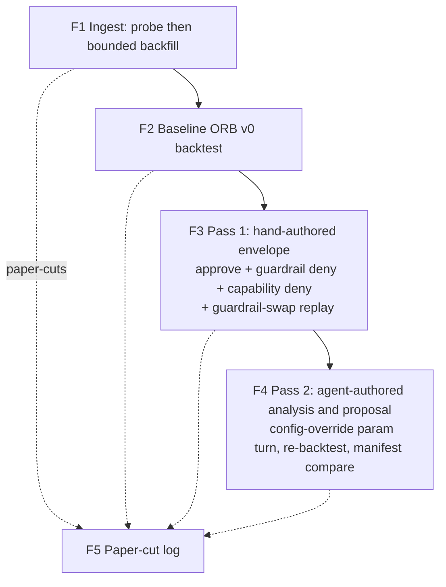
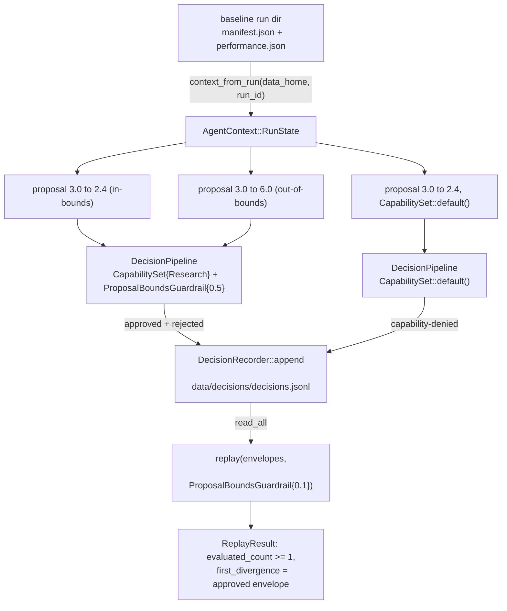

# Strategy Loop First Real Cycle - Plan

## Goal Capsule

- **Objective:** Turn the strategy-improvement loop once on real recorded KRX data — ingest a minimal slice, backtest ORB v0, drive the agent-decision layer through approved, guardrail-rejected, and capability-denied paths plus a guardrail-swap replay, land a parameter turn as a config override, and re-backtest — proving the machinery end-to-end and committing a paper-cut log as the requirements seed for a future `lab-research` CLI.
- **Product authority:** This document's Product Contract, plus `adapters/nautilus/lab/README.md` (the loop recipe) and `adapters/nautilus/README.md` (the ingest recipe) as the mechanism contracts. The committed proof test `loop_turn_manifest_comparison_isolates_param_delta` in `adapters/nautilus/lab/tests/backtest_run.rs` is the model for the turn.
- **Execution profile:** Mixed operator/code cycle. U2 hits the real paper gateway (credentials, unattended-safe read-only calls under closure); U4/U5 run local scratch glue; only U1 and U6 produce committed diffs.
- **Stop conditions:** Stop and surface if the ingest leg cannot produce non-empty minute+daily bars for at least one symbol after retries (closure-empty is retry-not-done, but persistent emptiness across sessions is a blocker); if the adapter gate (`cargo test --workspace` in `adapters/nautilus/`) goes red for any reason other than the in-progress scratch example; or if any step requires editing `lab/src/params.rs` defaults or shipping a new binary — both are out of contract.
- **Open blockers:** None.

---

## Product Contract

### Summary

Run the first real end-to-end turn of the nautilus strategy-improvement loop: a fresh minimal catalog from live-gateway historical backfill, a baseline ORB v0 backtest, a staged pair of decision-layer passes (hand-authored envelope first, agent-authored second), and a manifest-compared re-backtest. The deliverable is proven machinery plus a paper-cut log — not a good trading decision.

### Problem Frame

PRs #88–#94 built the entire loop substrate: the adapter, ingestion lane, lab crate with run registry, ORB v0, and the agent-decision layer with deny-by-default governance and guardrail-swap replay. But the loop has only ever turned inside the offline gate on a synthetic single-symbol fixture catalog. No real catalog exists on any machine (`LS_DATA_HOME` is configured nowhere), and no binary invokes `ResearchPolicy`, `DecisionPipeline`, or `agent::replay` — committed tests are their only callers. Until the loop turns once on real data with a real agent in the analysis seat, the infrastructure's fitness is a claim, not an observation — and the deferred `lab-research` CLI would be designed from guesses instead of observed friction.

### Key Decisions

- **Machinery proof over decision quality.** Done means every loop step executed at least once on real data with its artifacts inspectable; whether the parameter turn improves ORB is not the bar.
- **Staged authorship.** Pass 1 pushes a hand-authored envelope through governance and replay to shake out the mechanics; pass 2 has an agent author the analysis and proposal, so the cycle ends having exercised the layer's intended use.
- **Minimal real slice.** 1–3 liquid KRX symbols over roughly two weeks of minute + daily bars — the cheapest capture that lets a real backtest session run with lookback context. Broaden only after the loop is proven.
- **Scratch glue, not the `lab-research` CLI.** The cycle is driven by the existing binaries plus a throwaway example over the `agent::` API. Observed paper-cuts become the CLI's requirements list; no new product surface ships in this cycle.
- **The deny path is part of "proven".** Governance is deny-by-default, so the proof includes both a guardrail rejection (out-of-bounds proposal) and a capability denial (same proposal without the Research grant), not just approved envelopes.
- **A zero-trade baseline is canonical, not a failure.** 1–3 megacaps rarely gap +3% on an arbitrary session; the run finalizes with `num_trades: 0` and `ResearchPolicy` fires on `0 < 5`. No gap-day hunting.

### Actors

- A1. **Operator** — runs the credentialed ingest leg and the backtest/glue commands; owns credentials and pacing.
- A2. **Analysis agent** — a Claude session following the loop recipe in `adapters/nautilus/lab/README.md`: reads a finalized run's artifacts, writes `analysis.md` into the run directory, and drives the policy-backed proposal in pass 2. No new LLM plumbing is built.

### Key Flows

- F1. **Ingest the slice.**
  - **Trigger:** Cycle start; KRX may be closed.
  - **Actors:** A1
  - **Steps:** Max-lookback probe for the chosen symbols, then one bounded daily+minute backfill over a historical range containing at least two trading days, into a fresh catalog.
  - **Outcome:** A real catalog exists locally; the probe artifact and checkpoint record its shape.
- F2. **Baseline backtest.**
  - **Trigger:** Catalog present with non-empty daily and minute bars.
  - **Actors:** A1
  - **Steps:** Run `lab-backtest` over the pinned range; the run finalizes with its four artifacts in the run registry. Zero trades is the expected outcome.
  - **Outcome:** A baseline run directory on real data, comparable by manifest.
- F3. **Pass 1 — hand-authored envelope through governance and replay.**
  - **Trigger:** Baseline run finalized.
  - **Actors:** A1
  - **Steps:** Via scratch glue over the `agent::` API: build context from the baseline run, submit one in-bounds proposal (approved, recorded in the cross-run registry), one deliberately out-of-bounds proposal (guardrail-rejected with the violated bound named), and the same proposal without the Research capability (capability-denied), then replay the recorded registry stream under a swapped tighter guardrail and inspect the divergence marker.
  - **Outcome:** Approve, both deny modes, and replay mechanics all observed on real artifacts.
- F4. **Pass 2 — agent-authored turn.**
  - **Trigger:** Pass 1 clean.
  - **Actors:** A2 (analysis, proposal), A1 (runs commands)
  - **Steps:** The agent reads the baseline artifacts, writes `analysis.md` into the baseline run dir, drives the research policy to produce an intent-bearing proposal through the pipeline, the parameter change lands as a config-level override with a `strategy_version` bump, and a re-backtest runs over the same pinned range. Comparison notes append to the same `analysis.md`.
  - **Outcome:** Two runs whose manifests isolate the parameter delta — the loop has turned once for real.
- F5. **Paper-cut capture.** Throughout F1–F4, every friction point (missing flag, awkward invocation, artifact gap, doc mismatch) is logged with enough context to become a `lab-research` CLI requirement.

### Requirements

**Ingest leg**

- R1. A fresh catalog is created from a real max-lookback probe plus one bounded daily+minute backfill covering 1–3 liquid KRX symbols over roughly two weeks of historical trading days.
- R2. The ingest leg runs under market closure; the backfill range contains at least two trading days.
- R3. The cycle uses the fresh catalog as-is — no epoch re-base is run, since a fresh pull sits on a single price basis from its first write.

**Loop machinery**

- R4. A baseline ORB v0 backtest over the real catalog finalizes a run directory with all four run artifacts in the registry.
- R5. Pass 1 records at least one approved intent-bearing envelope in the cross-run decision registry via a hand-authored proposal built from the baseline run's context.
- R6. Pass 1 records one guardrail-rejected envelope from a deliberately out-of-bounds proposal (rejection naming the violated bound) and one capability-denied envelope from the same proposal submitted without the Research grant.
- R7. Pass 1 replays the recorded registry stream under a swapped guardrail and surfaces the first-divergence audit boundary with a non-zero evaluated count.
- R8. Pass 2 produces an agent-authored `analysis.md` in the baseline run directory and a policy-driven proposal that flows through the pipeline into the registry.
- R9. The proposed parameter change lands as a config-level override (new `gap_min_pct` plus a `strategy_version` bump in the glue's backtest config — source defaults untouched), and a re-backtest over the same pinned range yields a manifest pair that isolates the parameter delta.

**Evidence and capture**

- R10. A paper-cut log exists at cycle end: each observed friction, one line to one paragraph, framed as a candidate requirement for the deferred `lab-research` CLI.
- R11. The scratch glue stays disposable: no new binaries or public API surface ship, the glue is deleted at close-out, and the adapter gate stays green throughout.

### Acceptance Examples

- AE1. **Covers R6.** Given the ORB `gap_min_pct` of 3.0 and a bounds guardrail capping relative change at ±50%, when a proposal of 3.0 → 6.0 is submitted, then the envelope records a guardrail rejection naming the bounds guardrail, the parameter, and the exceeded bound; and when the in-bounds proposal is submitted without the Research capability, the envelope records a capability denial with guardrail and lowering stages not evaluated.
- AE2. **Covers R2.** Given KRX is closed, when the backfill requests a historical range, then bars are served for its trading days (closure-viable t8410/t8412 reads); non-trading days are simply absent from the served bars — no manual holiday exclusion is needed. For liquid symbols the expected gap list is empty; any per-triple gap entry spans the whole requested range and is a signal to investigate, not holiday noise.
- AE3. **Covers R7.** Given the pass-1 registry stream containing an approved in-bounds proposal, when it is replayed under a strictly tighter guardrail, then the replay result reports an evaluated count of at least one and marks that envelope as the first divergence.
- AE4. **Covers R9.** Given the baseline and re-backtest manifests, when compared, then they differ in exactly `strategy_version` and `gap_min_pct` while `strategy_code_hash`, `data_range`, and `catalog_fingerprint` are identical (a param-only turn does not change the strategy source); `universe_hash` is also identical unless a symbol crossed the widened gap floor, in which case the difference is attributable to the parameter and stated in the analysis.

### Success Criteria

- Every step of the loop recipe in `adapters/nautilus/lab/README.md` has executed at least once against real data — the "recipe an agent follows" has actually been followed by one.
- The paper-cut log is concrete enough to seed the `lab-research` CLI brainstorm without re-running the cycle.

### Scope Boundaries

- `lab-research` CLI — the natural next item, designed from this cycle's paper-cut log.
- Live session wiring (`lab-live` / LiveNode) — deferred; needs an open KRX window and is a separate staged item.
- LLM-backed `AgentPolicy` implementation — the trait seam stays deterministic; pass 2's agent operates through the recipe, not a new policy.
- Policy-level replay and multi-session backtests — deferred per the lab plans; the cycle accepts single-session runs.
- Analysis tooling (comparison CLI, dashboards) — the agent reads artifact files directly.
- Strategy tuning as a goal — ORB v0 remains a starter; the turn's trading merit is out of scope.
- Epoch re-base of any pre-existing catalog — inapplicable; no prior catalog exists locally.
- Forcing a traded (non-zero) run — out of scope; zero trades completes every flow including the policy trigger.

### Dependencies / Assumptions

- Paper-lane credentials in `.env.domestic` with `LS_TRADING_ENV=paper`; the ingest leg is a live-gateway operator action even under closure. Read-only paper calls need no attended gate (order smokes do; reads don't).
- Closure-viability is verified in-repo: t8410's smoke is attested non-empty off-session (`.agents/skills/promote-tr/references/smoke-map.md`), t8412's historical control is recorded closure-safe (`metadata/PROVISIONALITY-LEDGER.md`), and accumulate mode is designed as a post-close cron.
- The paper gateway serves transiently empty pages off-hours (`docs/solutions/logic-errors/empty-repull-completing-destructive-heal-destroys-history.md`): treat an empty backfill result as retry-not-done. In range mode the empty triple is recorded as a done coverage gap, so the retry is a full catalog wipe plus re-run — not a repeat of the same command; the watermark-unadvanced retry semantics apply to accumulate/rebase mode only.
- The bounded backfill self-paces: `adapters/nautilus/src/ingest/pacer.rs` derives per-TR pace from `EndpointPolicy.rate_limit_per_sec` (t8412 held to 1/s); the bin prints the pacing budget. No manual sleeps needed.
- The committed exemplar analysis (`adapters/nautilus/lab/tests/fixtures/analysis.md`) sketches the expected turn shape — a `gap_min_pct` widening when trade count is low — so pass 2 has a known-plausible template.
- `data_quality.json` will list ~2,700 `MissingPriorDaily` gaps: ingest writes the whole instrument universe while only 1–3 symbols get bars. Expected noise, not a data problem; the analysis narrates it rather than fixing it.

---

## Planning Contract

**Product Contract preservation:** changed AE2, AE4, R6/AE1, R9, F3/F4 — flow analysis against source proved the originals wrong or under-specified: a param-only turn keeps `strategy_code_hash` equal (`lab/tests/backtest_run.rs` asserts it), the ingestor already skips non-trading sub-ranges, the deny proof gains the capability-denial leg, and "lands" is pinned to a config override because `lab-backtest` has no param env and source defaults are pinned by gate tests. Scope is unchanged; user confirmed the corrections.

### Key Technical Decisions

- **KTD1 — The param turn lands via `runner::backtest::run(cfg)` with an overridden config, not an edit to `lab/src/params.rs` defaults.** The `lab-backtest` bin hardcodes `OrbParams::default()`, and the defaults are pinned by `defaults_match_ktd6` and `telemetry_context_carries_numeric_params_only`. The scratch glue sets `cfg.params.strategy_version = 1; cfg.params.gap_min_pct = <proposed>` exactly as `loop_turn_manifest_comparison_isolates_param_delta` does. The absent `LS_BT_*` param-override env is the flagship paper-cut entry.
- **KTD2 — Scratch glue lives at `adapters/nautilus/lab/examples/first_cycle.rs`, uncommitted, deleted at close-out.** No `examples/` convention exists and `autoexamples` is on, so the file compiles inside `cargo test --workspace` while present — it must compile clean the whole cycle, and deletion at U6 satisfies R11. Run with `cargo run --example first_cycle` from `adapters/nautilus/lab/`. Test-adjacent `#[ignore]` glue was rejected: the adapter workspace has no `#[ignore]` convention (live code is runtime-env-gated), and a test would be a committed surface.
- **KTD3 — Replay targets the cross-run registry stream the glue itself records.** The run-dir `decisions.jsonl` is telemetry with `NotEvaluated` governance stages — replaying it yields `evaluated_count == 0`, which proves nothing. The glue appends its pipeline-produced envelopes via `DecisionRecorder` and replays `recorder.read_all()`. Swap direction: tighter (`max_relative_change` 0.5 → 0.1) so `first_divergence` lands on the approved envelope. `delta_count` is meaningful only with `evaluated_count > 0` — assert both. The capability-denied envelope is appended after the replay-target pair; `replay_one` skips non-`Execute + Granted` cycles, so ordering only affects which index diverges.
- **KTD4 — Data home is `adapters/nautilus/data/` with a `/data` line added to `adapters/nautilus/.gitignore` first.** The current gitignore covers only `/catalog`; the READMEs' own recipes write `runs/`, `decisions/`, and `probes/` to unignored paths (and the two READMEs disagree: `./catalog` vs `./data/catalog`). This cycle standardizes on `LS_INGEST_CATALOG=./data/catalog` + `LS_DATA_HOME=./data` so one gitignore line covers everything. The gitignore line and the paper-cut log are the cycle's only committed diffs.
- **KTD5 — One combined backfill: `LS_INGEST_MODE=range`, `LS_INGEST_KIND=daily,minute:1`, `LS_INGEST_SYMBOLS=<1–3 shcodes>`, `LS_INGEST_SDATE/EDATE` spanning ≥2 trading weeks.** The README example's `LS_INGEST_KIND=daily` alone yields a silent zero-bar backtest (engine needs minute bars); minute-only yields an empty universe (candidate scan needs ≥2 in-range daily bars). Default symbols: `005930` plus one or two liquid peers, adjusted by the probe result.
- **KTD6 — Envelope free-text hygiene.** The recorder scrubs 6+-digit and 20+-alnum runs in reason/rationale/description fields at write time. Glue and agent rationales format floats `{:.4}` and never embed shcodes in free text, or the recorded line gets masked.
- **KTD7 — Paper-cut log is committed markdown at `adapters/nautilus/lab/PAPER-CUTS.md`.** Seeded with the four already-predicted entries (missing `LS_BT_*` param overrides; no catalog-inspection tool; unbounded instrument writes polluting `data_quality.json`; `./catalog` vs `./data/catalog` README inconsistency) plus everything observed live. Each entry framed as a candidate `lab-research` CLI requirement.

### High-Level Technical Design

Pass-1 glue data flow (U4) — the sequence the scratch example drives; directional guidance, the `#[cfg(test)]` mods in `pipeline.rs`, `replay.rs`, and `recording.rs` are the authoritative construction reference:

### Sequencing

U1 → U2 → U3 → U4 → U5 → U6, strictly ordered: the gitignore line must precede the first `ls-ingest` write (the probe writes to `<data>/probes/` immediately); the glue needs a finalized baseline run; pass 2 needs pass 1's clean mechanics; close-out needs everything observed. U2 is the only unit that can stall (gateway); everything after it is offline and can resume any time.

---

## Implementation Units

### U1. Data-home hygiene and preflight

- **Goal:** Make the cycle's on-disk footprint invisible to git and confirm the adapter gate baseline is green before anything touches it.
- **Requirements:** R11 (gate green throughout); enables KTD4.
- **Dependencies:** None.
- **Files:** `adapters/nautilus/.gitignore` (add `/data` line).
- **Approach:** One-line gitignore addition. Then run the adapter gate once to record the green baseline: `cargo test --workspace` from `adapters/nautilus/` (root gate is untouched by this cycle — no SDK crates change).
- **Test scenarios:** Test expectation: none — config-only change.
- **Verification:** `git check-ignore adapters/nautilus/data/probes` (via a path under `data/`) reports ignored; adapter `cargo test --workspace` green; `git status` shows only the gitignore diff.

### U2. Ingest the real slice (operator, live gateway)

- **Goal:** A fresh real catalog with daily + 1-minute bars for 1–3 symbols over ≥2 trading weeks, created under closure.
- **Requirements:** R1, R2, R3. **Covers AE2.**
- **Dependencies:** U1.
- **Files:** None committed — writes `adapters/nautilus/data/` (catalog, `probes/minute-lookback.json`, `catalog/ingest-checkpoint.json`), all ignored.
- **Approach:** From `adapters/nautilus/`: (1) probe — `LS_TRADING_ENV=paper LS_INGEST_LANE_FILE=../../.env.domestic LS_INGEST_MODE=probe-lookback LS_INGEST_CATALOG=./data/catalog cargo run --bin ls-ingest` (default probe symbol 005930); (2) one range backfill per KTD5 with SDATE/EDATE inside the probed lookback. `adjusted_prices: true` is hard-coded — the fresh catalog starts on the adjusted basis, which is why no re-base applies (R3). If the advisory lock blocks after a crash, remove the stale `.ls-ingest.lock` beside the catalog manually.
- **Execution note:** In range mode an empty result is recorded as a coverage gap and the triple is marked done — an identical re-run skips it rather than retrying. The retry path for this fresh catalog is to delete `adapters/nautilus/data/catalog/` entirely (checkpoint included; deleting only the checkpoint would re-append duplicate bars for triples that succeeded) and re-run the backfill. Watch the printed pacing budget line; the pacer owns rate limits. Never enable a tracing subscriber (e.g. `RUST_LOG=...`) while diagnosing a stall or empty result — `scrub::install()`'s credential safety assumes no subscriber is installed, and enabling one would print the live bearer token; rely on the already-scrubbed error text `ls-ingest` prints.
- **Test scenarios:** Test expectation: none — operator action against the live gateway; evidence is the ingest report.
- **Verification:** Ingest report shows `bars_written > 0` for both daily and minute kinds for every chosen symbol, and the gap list is empty (any per-triple gap entry is a red flag to investigate, not expected holiday noise); `data/probes/minute-lookback.json` exists; checkpoint records `adjusted_prices: true`.

### U3. Baseline backtest and catalog go/no-go

- **Goal:** A finalized baseline run directory on real data, plus positive confirmation the catalog is usable.
- **Requirements:** R4.
- **Dependencies:** U2.
- **Files:** None committed — writes `adapters/nautilus/data/runs/<run_id>/`.
- **Approach:** From `adapters/nautilus/lab/`: `LS_DATA_HOME=../data LS_BT_SDATE=<sdate> LS_BT_EDATE=<edate> cargo run --bin lab-backtest` with the same pinned range as the backfill. Expect a zero-trade run (Key Decisions); the run finalizes normally with `num_trades: 0`. Expect ~2,700 spurious `MissingPriorDaily` entries in `data_quality.json` (Dependencies/Assumptions) — note it as the paper-cut it is.
- **Test scenarios:** Test expectation: none — operator invocation of an existing tested binary; evidence is the run artifacts.
- **Verification:** `data/runs/<run_id>/` exists (no leftover `.tmp-` sibling) with all four artifacts; `manifest.json` pins `data_range`, `catalog_fingerprint`, `universe_hash`, `strategy_version: 0`, `gap_min_pct: 3.0`; record the `run_id` for U4/U5.

### U4. Pass 1 — scratch glue: governance three ways plus replay

- **Goal:** Approve, guardrail-deny, capability-deny, and guardrail-swap replay all observed on envelopes built from the real baseline run.
- **Requirements:** R5, R6, R7. **Covers AE1, AE3.**
- **Dependencies:** U3.
- **Files:** `adapters/nautilus/lab/examples/first_cycle.rs` (uncommitted; deleted in U6).
- **Approach:** Follow the HTD flow. Open with a catalog go/no-go: read bar counts through the existing async wrappers (never `ParquetDataCatalog` inline from async — `docs/solutions/integration-issues/nautilus-parquet-catalog-block-on-from-async.md`) and print them. Then `ResearchPolicy::context_from_run(data_home, run_id)`; build the three proposals per KTD3's ordering (approved and guardrail-rejected first, capability-denied last); append each envelope via `DecisionRecorder`; `read_all()` and `replay` under `ProposalBoundsGuardrail { max_relative_change: 0.1 }`. Mirror the construction sequence from the `#[cfg(test)]` mods in `lab/src/agent/pipeline.rs` and `lab/src/agent/replay.rs`. Rationale strings per KTD6.
- **Execution note:** The example compiles inside the adapter gate while it exists — keep it building; a broken scratch file reddens `cargo test --workspace` even untracked.
- **Test scenarios:** The glue asserts (and prints) rather than unit-tests:
  - Covers AE1. In-bounds proposal → envelope with `Granted` / `Approved` / lowering success / `RuntimeAction::ResearchCommand` action.
  - Covers AE1. 3.0→6.0 proposal → `GuardrailResult::Rejected` naming `proposal_bounds`, the parameter, and the ±50% bound.
  - Covers AE1. In-bounds proposal under `CapabilitySet::default()` → capability `Denied`, guardrail and lowering `NotEvaluated`.
  - Covers AE3. `replay` over `read_all()` under the 0.1 guardrail → `evaluated_count >= 1` and `first_divergence` at the approved envelope's index.
  - Round-trip: `read_all()` parses every appended line (no scrub-mangled envelopes).
- **Verification:** `cargo run --example first_cycle` (from `adapters/nautilus/lab/`, `LS_DATA_HOME` set) exits success with all assertions passing; `data/decisions/decisions.jsonl` holds the three envelopes; adapter gate still green with the example present.

### U5. Pass 2 — agent-authored analysis, proposal, and the config-override turn

- **Goal:** The loop's intended use: an agent reads real artifacts, proposes through the policy, the param change lands as a config override, and the re-backtest's manifest isolates the delta.
- **Requirements:** R8, R9. **Covers F4, AE4.**
- **Dependencies:** U4.
- **Files:** `adapters/nautilus/lab/examples/first_cycle.rs` (extended with a pass-2 entry point); agent writes `data/runs/<baseline_run_id>/analysis.md` (uncommitted).
- **Approach:** The analysis agent (A2 — a Claude session, no new plumbing) reads the four baseline artifacts and writes `analysis.md` into the baseline run dir following the committed exemplar `lab/tests/fixtures/analysis.md`, narrating the zero-trade outcome and the spurious gap noise rather than "fixing" them. Then the glue drives `ResearchPolicy::default().evaluate(context)` — fires because `0 < 5`, proposing `gap_min_pct * 0.8 = 2.4` — through the pipeline into the registry. The turn lands per KTD1: `cfg.params.strategy_version = 1; cfg.params.gap_min_pct = 2.4;` and `runner::backtest::run(cfg)` over the same pinned range. Compare the two manifests per the corrected AE4; append comparison notes to the same `analysis.md`.
- **Test scenarios:** Glue assertions, mirroring `loop_turn_manifest_comparison_isolates_param_delta`:
  - `ResearchPolicy` returns `ProposeParameterChange` (not `NoAction`) for the zero-trade baseline context.
  - The policy-driven envelope lands approved in the registry.
  - Covers AE4. Manifest pair differs in exactly `{strategy_version, gap_min_pct}`; `strategy_code_hash`, `data_range`, `catalog_fingerprint` equal; `universe_hash` equal-or-explained per AE4's conditional clause.
  - `run_has_analysis(data_home, baseline_run_id)` is true before the re-backtest.
- **Verification:** Second finalized run dir exists; the manifest comparison output matches AE4; `analysis.md` contains both the baseline analysis and the comparison notes.

### U6. Paper-cut log and close-out

- **Goal:** The cycle's durable outputs committed, its disposable footprint removed, both gates green.
- **Requirements:** R10, R11.
- **Dependencies:** U5.
- **Files:** `adapters/nautilus/lab/PAPER-CUTS.md` (new, committed); delete `adapters/nautilus/lab/examples/first_cycle.rs`.
- **Approach:** Write `PAPER-CUTS.md`: the four seeded entries from KTD7 plus everything observed in U2–U5, each framed as a candidate `lab-research` CLI requirement with enough context to act on without re-running the cycle. Delete the example. Final gates. Consider a `ce-compound` doc afterward for the guardrail-swap replay surface — no `docs/solutions/` entry covers it yet.
- **Test scenarios:** Test expectation: none — documentation and cleanup.
- **Verification:** Adapter `cargo test --workspace` green with the example gone; before staging, scan `PAPER-CUTS.md` for credential-adjacent content — `grep -nE '[0-9]{6,}|[A-Za-z0-9]{20,}'` must return no hits (mirrors the `adapters/nautilus/src/scrub.rs` heuristic and the promote-tr STOP-on-account-text convention); root gate untouched (`git status` shows exactly two tracked changes: the U1 gitignore line and `PAPER-CUTS.md`); `data/` fully ignored.

---

## Verification Contract

| Check | Command (from) | Applies to | Done signal |
|---|---|---|---|
| Adapter gate | `cargo test --workspace` (`adapters/nautilus/`) | U1, U4, U6 | Green at baseline, with the example present, and after its deletion |
| Gitignore coverage | `git check-ignore` on a path under `adapters/nautilus/data/` | U1 | Reports ignored |
| Ingest evidence | `ls-ingest` report + `data/probes/minute-lookback.json` | U2 | `bars_written > 0` both kinds, all symbols; gap list empty (any entry = investigate) |
| Run registry | run dir contents | U3, U5 | Two finalized run dirs, four artifacts each, no `.tmp-` residue |
| Glue assertions | `cargo run --example first_cycle` (`adapters/nautilus/lab/`) | U4, U5 | Exits success; registry holds the expected envelopes |
| Repo cleanliness | `git status` | U6 | Exactly two tracked changes: gitignore line, `PAPER-CUTS.md` |

The root SDK gate (`make docs`, `cargo test`, `make docs-check`, `make lane-check`) is out of scope — no SDK crate, metadata, or docs change in this cycle.

## Definition of Done

- A real catalog exists at `adapters/nautilus/data/catalog` with daily and 1-minute bars for the chosen symbols over the pinned range (R1–R3).
- Baseline and re-backtest run directories are finalized with four artifacts each; their manifests satisfy the corrected AE4 (R4, R9).
- The cross-run registry holds at least four envelopes: pass-1 approved, guardrail-rejected, capability-denied, and the pass-2 policy-driven proposal (R5, R6, R8).
- A replay result with `evaluated_count >= 1` and the expected `first_divergence` was produced and recorded in the analysis or paper-cut log (R7).
- `analysis.md` sits in the baseline run dir with both the baseline analysis and the comparison notes (R8).
- `adapters/nautilus/lab/PAPER-CUTS.md` is committed with the four seeded entries plus observed frictions (R10).
- The scratch example is deleted, the adapter gate is green, and the only tracked diffs are the gitignore line and the paper-cut log (R11) — no dead-end or experimental code remains anywhere.
