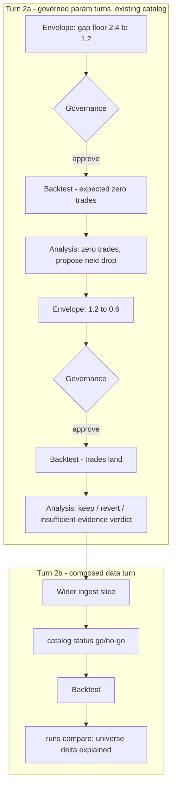
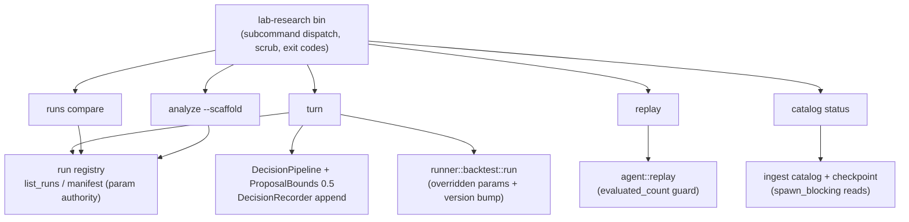

# Lab-Research CLI + Merit-Bearing Turn 2 - Plan

## Goal Capsule

- **Objective:** Build the deferred `lab-research` CLI v1 from the accumulated paper-cut requirements, and certify it by running the strategy loop's turn 2 entirely through it — ending in real trades and a defensible verdict.
- **Product authority:** `adapters/nautilus/lab/PAPER-CUTS.md` (seed requirements), this Product Contract (scope decisions), `docs/plans/2026-07-04-001-feat-strategy-loop-first-real-cycle-plan.md` (predecessor cycle).
- **Execution profile:** Offline units first (U1–U8, all gate-green without credentials); the certifying turns (U9–U10) are live operator steps — ingest works under KRX closure, backtests are offline, so no market window is required.
- **Stop conditions:** Any step of the certifying turns that would need scratch code stops the turn — log the gap as a paper-cut, fix the CLI, re-run. A substantive Product Contract change (new R-ID or changed behavior) returns to the user before implementation continues.
- **Open blockers:** None.

---

## Product Contract

### Summary

Ship `lab-research` CLI v1 covering all nine open PAPER-CUTS items — envelope-bound turn command, catalog inspector, manifest comparison, replay guard, analysis scaffold, gap-noise fix, and three operability minors — then certify it by running turn 2 scratch-free through it. Turn 2 is two parts: 2a chains two governed param turns (gap floor 2.4 → 1.2 → 0.6) on the existing catalog until real trades land; 2b widens the ingested slice as a composed data turn.

### Problem Frame

The loop's first real cycle proved the machinery on live data but every operator step between ingest and verdict needed scratch code: param overrides went through a glue config edit, catalog contents and manifest diffs were hand-inspected, and a zero-evaluated replay read as a false "no divergence". Meanwhile the cycle itself was merit-free: at gap floors 3.0 and 2.4, the observed megacap gaps (+0.46% / +0.87%) never cleared the threshold, so the loop has only ever evaluated zero-trade baselines. The tooling gap and the merit gap block the same thing — a loop turn whose analysis has actual fills to reason about.

### Key Decisions

- **Certify the CLI by using it.** Turn 2 is the CLI's live acceptance test, mirroring how TRs are certified by smokes. No scratch code is tolerated anywhere in the certifying turns.
- **Chain two governed turns rather than loosen the guardrail.** The proposal-bounds cap (0.5 relative change) denies a one-turn drop from 2.4 to 0.6. The first real use of governance must not be weakening it to get an answer through; the intermediate zero-trade turn at 1.2 is itself loop evidence.
- **CLI v1 is the first production wiring of governance.** No bin invokes the decision pipeline today; 0.5 is the cap value every committed instantiation uses but it is not a compiled default. Pinning it at 0.5 in the CLI's wiring is an explicit decision, not inheritance.
- **Merit means a defensible verdict, not positive P&L.** Twelve days by two symbols cannot support a profitability claim; requiring one would set the loop up to overfit its first real sample. The loop's product is decisions.
- **The turn command is param-only in v1.** Turn 2b composes existing pieces (ingest bin, catalog inspection, backtest, manifest compare) instead of growing data-turn envelope machinery for a shape exercised once so far.
- **Operator-local registry state is authoritative for "current params".** The prior turn's 2.4 lives only in the gitignored data home; the committed default remains 3.0. The turn command reads its starting point from the local run registry (see KTD1 for the exact authority).

### Requirements

**Turn command and governance**

- R1. The CLI provides a turn command that executes a parameter-change turn end-to-end from a proposal envelope: apply the override set, bump the strategy version, run the backtest, write the run manifest. It refuses to run when the requested override set differs from the envelope it executes.
- R2. The turn command reads current parameters from the local envelope/run registry, falling back to committed defaults on a fresh data home.
- R3. The CLI wires the decision pipeline with the proposal-bounds cap pinned at 0.5 relative change; a turn whose proposal is denied by any guardrail runs no backtest.
- R4. A `runs compare` command implements the corrected AE4 verdict over two run manifests: exactly-two-key param diff (strategy version plus the changed param), code hash / data fingerprint / range equality, and a universe-hash equal-or-explained clause.
- R5. The replay command refuses a telemetry stream whose evaluated count is zero instead of reporting "no divergence".

**Inspection and analysis**

- R6. A `catalog status` command prints per-(instrument, bar-kind) counts and spans, and flags any span that undershoots the checkpoint's completed range.
- R7. An `analyze --scaffold` command pre-fills an analysis file with run facts (params, trade count, gap-noise summary), credential-free and matching the committed exemplar's shape.

**Ingest fidelity**

- R8. Gap reporting is bounded to the ingested universe: never-ingested instruments produce no spurious missing-prior-daily entries (bound the instrument writes or filter the gap report).
- R9. Ingest gateway errors carry the TR code, page index, and pacer state.

**Operability minors**

- R10. `lab-backtest` surfaces its result line: engine logs quieted by default or a trailing summary block.
- R11. README catalog-path examples standardize on `<data home>/catalog` across the adapter and lab READMEs.

**Certifying turns**

- R12. Turn 2a runs two chained governed param turns on the existing catalog: gap floor 2.4 → 1.2 (expected zero trades; the analysis records this and proposes the next drop), then 1.2 → 0.6 (trades expected — the larger observed gap, +0.87%, clears the floor; +0.46% does not). Each turn produces its envelope, run, manifest, and analysis via the CLI.
- R13. Turn 2b runs as a composed data turn: wider ingested slice via the existing ingest bin, `catalog status` as the go/no-go, backtest, and `runs compare` explaining the universe/range delta under the equal-or-explained clause.
- R14. No scratch code: every step of turns 2a and 2b runs through committed CLI commands or existing bins.
- R15. Merit criterion: the cycle ends with trades > 0 at the final floor of the executed chain (0.6 on the primary path; 0.75 on the registry-lost fallback) and an analysis reaching an explicit keep / revert / insufficient-evidence verdict grounded in run facts. Positive P&L is not required.

### Key Flows

- F1. Governed param turn (turn 2a, twice)
  - **Trigger:** Operator invokes the turn command with a proposal envelope.
  - **Steps:** Envelope validated against the requested overrides; governance evaluates the proposal (bounds, deny-by-default); on approval the backtest runs with the applied params and bumped strategy version; manifest and analysis scaffold are produced; `runs compare` against the prior run asserts param-only isolation.
  - **Outcome:** A manifest pair isolating exactly the strategy version and the changed param, plus an analysis.
  - **Covers:** R1, R2, R3, R4, R7, R12.
- F2. Composed data turn (turn 2b)
  - **Trigger:** Turn 2a's closing analysis hands off to a wider slice.
  - **Steps:** Existing ingest bin pulls the wider slice; `catalog status` confirms counts and spans against the checkpoint; backtest runs at the current floor; `runs compare` reports the universe/range delta as explained.
  - **Outcome:** A data-turn run whose manifest delta is explained rather than param-isolated.
  - **Covers:** R6, R8, R9, R13.

### Acceptance Examples

- AE1. **Covers R3.** Given current floor 2.4, when a turn proposes 0.6 (relative change 0.75), then governance denies it and no backtest runs.
- AE2. **Covers R3, R12.** Given current floor 2.4, when a turn proposes 1.2 (relative change exactly 0.50, bound inclusive), then governance approves and the turn executes.
- AE3. **Covers R4.** Given the turn 2a manifest pair, when `runs compare` runs, then the verdict passes: param diff is exactly the strategy version plus the gap floor, and code hash / fingerprint / range are equal.
- AE4. **Covers R5.** Given a run dir whose stream is telemetry-only (zero evaluated cycles), when replay is invoked against it, then the command refuses rather than reporting no divergence.
- AE5. **Covers R6.** Given a catalog whose bar span undershoots the checkpoint's completed range for a triple, when `catalog status` runs, then the triple is flagged.
- AE6. **Covers R8.** Given an ingest bounded to two symbols from a larger instrument universe, when the data-quality report is written, then never-ingested symbols contribute no gap entries.
- AE7. **Covers R2.** Given a fresh data home with no registry, when the turn command resolves current params, then it starts from the committed defaults.

### Scope Boundaries

**Deferred for later**

- First-class data-turn envelope machinery (ingest spec inside the envelope, declared range/universe deltas) — turn 2b composes existing pieces instead.
- The SDK `chart_all` body-cursor port (residual owner: the SDK) and adding the adapter workspace to the root CI gate (residual owner: repo process) — PAPER-CUTS items 7–8, tracked in the PR #95 residuals.
- The live risk-monitor, deferred alongside the CLI in the lab README.

**Outside this wave's identity**

- Loosening governance bounds to reach merit faster — the chained-turn path exists precisely to avoid this.
- Any profitability or expectancy claim from the 12-day sample; the verdict vocabulary is keep / revert / insufficient-evidence.

### Dependencies / Assumptions

- Turn 1's local state (catalog, run pair, envelope registry with floor 2.4) exists in the gitignored data home. If lost, turn 2a re-derives from the committed 3.0 default — still two governed turns (3.0 → 1.5 → 0.75), with only the larger observed gap clearing the final floor.
- The observed gap scale (+0.46% / +0.87%) comes from turn 1's run artifacts, not committed code — unverifiable in-repo, carried as an assumption.
- Live ingest works under KRX closure (demonstrated in turn 1 after the pagination fix), so turn 2b is not window-blocked.
- The 0.5 guardrail cap is the committed convention value across tests and fixtures, not a compiled default (verified).

### Sources / Research

- `adapters/nautilus/lab/PAPER-CUTS.md` — the nine seed requirements plus two fixed-for-the-record items.
- `adapters/nautilus/lab/README.md` (deferral note ~line 154) — no bin invokes the decision pipeline; the CLI is explicitly deferred.
- Verified anchors: `adapters/nautilus/lab/src/params.rs` (gap floor default 3.0), `adapters/nautilus/lab/src/agent/guardrails/proposal_bounds.rs` (inclusive 0.5 cap arithmetic), `adapters/nautilus/lab/src/agent/replay.rs` (no zero-evaluated guard; `evaluated_count` field exists), `adapters/nautilus/src/bin/ls-ingest.rs` (whole-universe instrument writes), `adapters/nautilus/src/ingest/checkpoint.rs` (completed-range keys; completed set is private; watermarks carry no floor).
- Seed implementations to mirror: `adapters/nautilus/lab/tests/backtest_run.rs` (`loop_turn_manifest_comparison_isolates_param_delta` — the `runs compare` verdict logic; `build_fixture` — the offline catalog fixture), `adapters/nautilus/lab/src/artifacts/mod.rs` (`list_runs`, `run_has_analysis`, run-id format, atomic finalize), `adapters/nautilus/lab/src/agent/recording.rs` (`DecisionRecorder`), `adapters/nautilus/lab/src/agent/policies/research.rs` (`context_from_run`, `numeric_summary` param sourcing).
- Institutional learnings that shaped this plan: `docs/solutions/workflow-issues/cross-workspace-gate-blind-spot-sdk-preflight-changes-redden-adapter.md` (adapter gate must be `--workspace`), `docs/solutions/conventions/range-scoped-comparability-scope-every-derived-input.md` (compare must diff `universe_hash` + pinned `data_range` explicitly), `docs/solutions/integration-issues/nautilus-parquet-catalog-block-on-from-async.md` (catalog I/O in `spawn_blocking`; missing dir must not panic), `docs/solutions/architecture-patterns/gate-over-diff-inherits-diff-scope-blind-spot.md` (refuse on evaluated-count, not findings-only), `docs/solutions/integration-issues/ls-gateway-t8412-chart-all-pagination-burst-and-silent-truncation.md` (ingest fail-closed arms must survive the gap-noise fix; 9,168 bars / 0 gaps is the turn-2 re-ingest oracle).
- `docs/plans/2026-07-04-001-feat-strategy-loop-first-real-cycle-plan.md` — the predecessor cycle whose frictions seeded PAPER-CUTS.

---

## Planning Contract

Product Contract preservation: requirements, flows, and acceptance examples unchanged; the brainstorm's "Outstanding Questions — Deferred to Planning" section is resolved in place by KTD2 (CLI packaging), KTD3 (proposed-value source), KTD7 (replay refuse-only), and U10 (turn 2b slice bounds).

### Key Technical Decisions

- KTD1. **Current-params authority is the latest finalized run manifest; envelopes are audit, never state.** The turn command resolves current params, strategy version (prior + 1), and the pinned `data_range` from the newest finalized run in the registry — range inheritance keeps the param-verdict's range/fingerprint equality true by construction (an env override stays possible; a fresh data home requires an explicit range and falls back to `OrbParams::default()` for params, satisfying the fresh-home acceptance case). Envelopes append on every decision — approvals, denials, failures — as audit records only. Consequence: a backtest that fails after approval self-heals (the next turn still reads the last finalized manifest), and a denied turn consumes no strategy version.
- KTD2. **One `lab-research` bin in the lab crate; env-driven subcommand dispatch; no argument-parsing dependency.** A 3-line `src/bin/lab-research.rs` shell over a library module, mirroring every existing bin. Subcommand from `std::env::args().nth(1)` matched with an enumerating error (the `ls-ingest` mode-match precedent); per-command config from env vars; `scrub::install()` first line; terminal errors printed through `scrub_secrets` with a failure exit code. clap/argh stay out — nothing in the workspace uses them.
- KTD3. **The operator's requested override is lowered into a manual-trigger envelope through the pinned pipeline; the shipped research policy is advisory.** `ResearchPolicy` proposes `current × 0.8` and cannot produce the 1.2 → 0.6 chain. The turn command builds the `ProposeParameterChange` intent from the operator's requested param + target value, runs it through `DecisionPipeline` (CapabilitySet limited to Research; `ProposalBoundsGuardrail { max_relative_change: 0.5 }`), and appends the envelope via `DecisionRecorder`. The refuse-on-mismatch check compares the executed override key set against the recorded envelope's parameter (plus the implicit strategy-version bump) — the same exactly-two-key discipline as the compare verdict. Invoked with **no override**, the turn command runs a rerun instead: current params and version from the latest finalized manifest, no governance cycle, no version bump — the committed way to produce a data-turn backtest (zero-key param diff) without scratch code.
- KTD4. **`runs compare` has two verdicts.** Param-turn verdict (the corrected AE4): exactly-two-key param diff, code hash / range-scoped catalog fingerprint / data range equality, universe-hash equal-or-explained. Data-turn verdict: zero-key param diff and code-hash equality required; fingerprint / range / universe deltas are expected, reported, and require an operator-supplied explanation that the command records (the equal-or-explained clause made machine-checkable). Both verdicts print PASS/FAIL and exit non-zero on FAIL. Rationale: the wider-slice turn writes new in-range daily bars, so the range-scoped fingerprint legitimately changes — without a data-turn mode the certifying compare is a guaranteed FAIL or a hand-waved judgment (the range-scoped-comparability learning).
- KTD5. **The gap-noise fix is a report-side filter in the lab runner, not an ingest-write bound.** Turn 2a runs on the existing catalog, which already holds the ~2.6k-instrument universe from turn 1's ingest — bounding future `write_instruments` calls would not certify it. The runner's candidate scan skips instruments with no daily bars anywhere in the catalog (never-ingested) before they reach the missing-prior-daily gap path; instruments that have bars but lack the prior session's daily bar still report. Ingest instrument writes stay unchanged, preserving the accumulate-forward universe-snapshot semantics and leaving the fail-closed pagination arms untouched.
- KTD6. **`catalog status` reports facts always, and full undershoot only against an operator-supplied expected range.** Per-triple counts and min/max spans grouped from catalog bars; tail check against the checkpoint watermark always. Front-truncation (the motivating defect) is undetectable from the checkpoint alone — completed triples are pruned and watermarks carry no floor — so an optional expected-range input turns on both-direction span checks. Missing catalog dir, missing checkpoint, or zero triples is an explicit no-go (non-zero exit), never a silent pass. All catalog I/O stays inside `spawn_blocking` and a missing directory is handled before catalog construction (the ParquetDataCatalog canonicalize trap).
- KTD7. **The replay command refuses `evaluated_count == 0` with no override flag in v1.** A thin wrapper over the existing `replay()` — the guard is an explicit evaluated-count check, not a findings-only inspection (the gate-over-diff blind-spot pattern). Diagnosing a telemetry-only stream is what `catalog status`-style fact output is for; an override flag can be added if a real need appears.
- KTD8. **CLI output follows the established scrub discipline.** Stdout prints typed values and paths; any free text routes through the crate's scrub seam; floats in free text format as `{:.4}` so the scrubber doesn't mask them as account-like tokens; `scrub::install()` runs before anything else in every entry point. Six-digit KRX symbol codes collide with the scrubber's account-number heuristic (any 6+-digit run masks), so identifiers never travel the free-text route — they render as typed/structured fields, the same precedent the envelope schema uses.

### High-Level Technical Design

Every subcommand composes existing seams — the CLI adds orchestration and verdicts, not new machinery:

Sequencing: the offline units land in dependency order (scaffold first, then commands, then the runner/ingest fixes), the two live certifying turns run only after everything is offline-green, param turns before the data turn — the data turn changes the catalog and would retroactively complicate param-turn comparability if run first.

---

## Implementation Units

| U-ID | Title | Key files | Depends on |
|---|---|---|---|
| U1 | Bin scaffold + dispatch | `lab/Cargo.toml`, `lab/src/bin/lab-research.rs`, `lab/src/runner/research.rs` | — |
| U2 | Turn command | `lab/src/runner/research.rs`, `lab/tests/research_cli.rs` | U1 |
| U3 | `runs compare` | `lab/src/runner/research.rs`, `lab/tests/research_cli.rs` | U1 |
| U4 | Replay guard command | `lab/src/runner/research.rs` | U1 |
| U5 | `catalog status` | `lab/src/runner/research.rs` | U1 |
| U6 | `analyze --scaffold` | `lab/src/runner/research.rs` | U1 |
| U7 | Gap-report noise filter | `lab/src/runner/backtest.rs` | — |
| U8 | Operability minors | `src/ingest/`, `lab/src/runner/backtest.rs`, READMEs | — |
| U9 | Certifying turn 2a (live) | operator step | U2, U3, U4, U6, U7 |
| U10 | Certifying turn 2b (live) | operator step | U5, U8, U9 |
| U11 | Docs close-out | `lab/PAPER-CUTS.md`, `lab/README.md` | U9, U10 |

All paths below are relative to `adapters/nautilus/` unless prefixed otherwise.

### U1. `lab-research` bin scaffold and subcommand dispatch

- **Goal:** A committed `lab-research` bin with subcommand dispatch, scrub install, and the exit-code/error conventions, so every later command has a home.
- **Requirements:** Foundation for R1–R7.
- **Files:** `lab/Cargo.toml` (`[[bin]]` entry), `lab/src/bin/lab-research.rs` (3-line shell), `lab/src/runner/research.rs` (new module: dispatch + shared helpers), `lab/tests/research_cli.rs` (new).
- **Approach:** Mirror `runner::backtest::main_cli` — `scrub::install()` first, subcommand from `std::env::args().nth(1)` matched with an error enumerating valid subcommands (`turn | runs | replay | catalog | analyze`), per-command env config, tokio runtime + `block_on`, terminal errors through `scrub_secrets`, `ExitCode::FAILURE` on error. Shared helpers: resolve data home, resolve latest finalized run.
- **Patterns to follow:** `src/bin/ls-ingest.rs` (mode match + enumerating error + scrubbed terminal error), `lab/src/bin/lab-backtest.rs` (thin shell).
- **Test scenarios:** Unknown subcommand errors and the message enumerates valid ones; missing required env var errors naming the variable; an error containing a 6+-digit token is scrubbed in output.
- **Verification:** `cargo test --workspace` green in the adapter workspace; `lab-research` with no args prints usage and exits non-zero.

### U2. Turn command — governed param turn end-to-end

- **Goal:** One command executes a parameter turn: resolve current params, govern the proposal, append the envelope, run the backtest with the override and bumped version.
- **Requirements:** R1, R2, R3; AE1, AE2, AE7.
- **Dependencies:** U1.
- **Files:** `lab/src/runner/research.rs`, `lab/tests/research_cli.rs`.
- **Approach:** Per KTD1/KTD3. Resolve current params + version from the latest finalized manifest via `list_runs` (fresh home → `OrbParams::default()`); build the `ProposeParameterChange` intent from the operator's requested param name + target value (env-configured); run `DecisionPipeline` with `CapabilitySet { Research }` + `ProposalBoundsGuardrail { max_relative_change: 0.5 }`; append the envelope via `DecisionRecorder` regardless of outcome; on denial exit non-zero with the guardrail reason and run nothing; on approval verify the executed override set matches the recorded envelope (param + implicit version bump — refuse on any mismatch), then invoke `runner::backtest::run` with the overridden params and version = prior + 1. Print run id and a trailing result line.
- **Execution note:** Build against the existing offline catalog fixture from the start — every scenario below runs without credentials.
- **Test scenarios:**
  - Covers AE2. Current 2.4 (fixture manifest), propose 1.2 → approved (bound inclusive), backtest runs, new manifest has version prior+1 and gap floor 1.2.
  - Covers AE1. Current 2.4, propose 0.6 → denied; envelope appended with the denial; no run dir created; non-zero exit.
  - Covers AE7. Fresh data home → current resolves to 3.0 default; a propose-1.5 turn is approved (exactly 0.5).
  - Mismatch: requested override set differs from the envelope's parameter → refused before backtest.
  - Self-heal: a turn whose backtest fails after approval leaves no finalized run; the next turn still resolves current params from the prior finalized manifest.
  - Denied turn consumes no version: after a denial, the next approved turn's version is still prior + 1.
  - Range inheritance: the new manifest's data range equals the prior run's without an env-supplied range.
  - Rerun mode: invoked with no override, the command runs the resolved current params with no governance cycle and no version bump; the produced manifest pair passes the data-turn verdict (zero-key param diff, equal code hash).
- **Verification:** All scenarios green offline; a manual fixture-home run of `turn` prints the run id and result line last.

### U3. `runs compare` — param-turn and data-turn verdicts

- **Goal:** A machine verdict over two manifests implementing both compare modes of KTD4.
- **Requirements:** R4; AE3; realizes R13's equal-or-explained clause.
- **Dependencies:** U1.
- **Files:** `lab/src/runner/research.rs`, `lab/tests/research_cli.rs`.
- **Approach:** Lift the diff logic from `loop_turn_manifest_comparison_isolates_param_delta` (`lab/tests/backtest_run.rs`): serialize both manifests' params to JSON objects, key-wise diff. Param-turn verdict: diff exactly {strategy version, one param}; code hash, catalog fingerprint, data range equal; universe hash equal, or unequal with a supplied explanation. Data-turn verdict: zero-key param diff, code hash equal; fingerprint/range/universe deltas reported and a required explanation recorded into the comparison output. Run selection by two explicit run ids (env), defaulting to the two newest finalized runs. PASS/FAIL line + non-zero exit on FAIL.
- **Test scenarios:**
  - Covers AE3. Fixture pair differing in exactly {version, gap floor} with equal hashes → param verdict PASS.
  - Three-key diff (an extra param changed) → param verdict FAIL naming the extra key.
  - Unequal universe hash without explanation → FAIL; with explanation → PASS and the explanation appears in output.
  - Data-turn mode: pair with equal params/code hash, different fingerprint + range, explanation supplied → PASS; same pair with a nonzero param diff → FAIL.
- **Verification:** Scenarios green; the existing `loop_turn_manifest_comparison_isolates_param_delta` test still passes unchanged.

### U4. Replay guard command

- **Goal:** Expose guardrail-swap replay with the zero-evaluated refusal.
- **Requirements:** R5; AE4.
- **Dependencies:** U1.
- **Files:** `lab/src/runner/research.rs`, `lab/tests/research_cli.rs`.
- **Approach:** Per KTD7 — `read_envelopes` + `replay()` with a swapped guardrail (env-configured cap), then refuse (non-zero exit, explicit "zero cycles evaluated — telemetry-only stream" message) when `evaluated_count == 0`; otherwise print evaluated count, delta count, and first divergence.
- **Test scenarios:**
  - Covers AE4. Telemetry-only stream (NotEvaluated stages) → refused with the explicit message.
  - Evaluated stream with a tighter swapped cap → reports first divergence and passes.
- **Verification:** Scenarios green offline.

### U5. `catalog status`

- **Goal:** The ingest-to-backtest go/no-go: per-triple facts plus undershoot flags per KTD6.
- **Requirements:** R6; AE5.
- **Dependencies:** U1.
- **Files:** `lab/src/runner/research.rs`, `lab/tests/research_cli.rs`.
- **Approach:** Group bars by (instrument, bar spec) via the catalog read primitives inside `spawn_blocking`; print count + min/max span per triple. Tail check against `Checkpoint::watermark` per (instrument, bar-kind) always; optional expected-range env turns on both-direction span checks (front truncation included). Missing catalog dir (checked before catalog construction), missing checkpoint, or zero triples → explicit no-go, non-zero exit.
- **Test scenarios:**
  - Covers AE5. Fixture catalog whose bars end before the checkpoint watermark → triple flagged, non-zero exit.
  - Front truncation: bars start after the expected range's start → flagged only when the expected range is supplied.
  - Missing catalog dir → clean no-go error, no panic.
  - Healthy fixture → per-triple counts/spans printed, zero exit.
- **Verification:** Scenarios green; a run against the fixture home prints one line per triple.

### U6. `analyze --scaffold`

- **Goal:** Pre-fill a run's analysis file with run facts so analyses stay uniform and scrub-safe.
- **Requirements:** R7.
- **Dependencies:** U1.
- **Files:** `lab/src/runner/research.rs`, `lab/tests/research_cli.rs`.
- **Approach:** Read the run's manifest, performance, and data-quality artifacts; write `analysis.md` in the run dir pre-filled with the exemplar's run-facts header (source, strategy id/version, params, data range), trade count, a gap-noise summary (post-U7 counts), and an empty verdict skeleton naming the three verdict words. Refuse if `analysis.md` already exists. Floats format `{:.4}`.
- **Patterns to follow:** `lab/tests/fixtures/analysis.md` (exemplar shape), `run_has_analysis` helper.
- **Test scenarios:** Scaffold contains params, trade count, gap summary, and the verdict skeleton; second invocation refuses with a clear message. Scrub discipline follows the envelope precedent: symbols and identifiers render as typed values and are asserted unmasked, while an account-like token in the scaffold's free-text sections IS asserted masked to `***`.
- **Verification:** Scenarios green; scaffolded file diffs cleanly against the exemplar's section structure.

### U7. Gap-report noise filter

- **Goal:** Never-ingested instruments stop flooding the data-quality report, on the existing catalog.
- **Requirements:** R8; AE6.
- **Files:** `lab/src/runner/backtest.rs`, `lab/tests/backtest_run.rs`.
- **Approach:** Per KTD5 — in the candidate scan, skip instruments with no daily bars anywhere in the catalog before they reach the missing-prior-daily path; keep the report's universe snapshot documenting the full instrument count so the filter is visible, not silent.
- **Test scenarios:**
  - Covers AE6. Fixture with whole-universe instruments but bars for two symbols → gap report contains no entries for never-ingested symbols.
  - Regression: a symbol that has bars but lacks the prior session's daily bar still produces its gap entry.
- **Verification:** Both scenarios green; existing backtest tests unchanged.

### U8. Operability minors

- **Goal:** Ingest errors carry context, `lab-backtest` surfaces its result, README paths agree.
- **Requirements:** R9, R10, R11.
- **Files:** `src/ingest/mod.rs` (error wrapping), `lab/src/runner/backtest.rs` (result surfacing), `README.md` + `lab/README.md` (paths).
- **Approach:** R9 — wrap gateway errors at the fetch seam with TR code, page index, and pacer state (scrubbed; no raw request bodies). R10 — the engine already sets `bypass_logging`, so locate the actual noise source first; the deterministic fix is a trailing summary block (run id, trade count, result line) printed after all logs regardless. R11 — standardize the adapter README's examples on `./data/catalog` to match the lab README's data-home layout.
- **Test scenarios:** Error-wrap unit test asserts TR code + page index present and output scrubbed. Trailing summary asserted in an existing runner test if cheap. Test expectation for R11: none — docs-only.
- **Verification:** Adapter workspace green; a fixture backtest run's last stdout block is the summary.

### U9. Certifying turn 2a — two chained governed param turns (live operator step)

- **Goal:** The CLI's acceptance test: gap floor 2.4 → 1.2 → 0.6 entirely through committed commands, ending in trades and a verdict.
- **Requirements:** R5, R12, R14, R15.
- **Dependencies:** U2, U3, U4, U6, U7.
- **Approach:** On the existing local catalog: `turn` to 1.2 → `analyze --scaffold` → analysis records zero trades and proposes the next drop → `runs compare` PASS (param verdict) → `turn` to 0.6 → scaffold → analysis reaches the explicit keep / revert / insufficient-evidence verdict on real fills → compare PASS. Then run the replay command against the accumulated decision stream with a swapped cap — a required certification step, not optional: it is the only live exercise of the replay guard, and the stream exists by this point anyway. Record credential-free evidence (verdict lines, param diffs, trade counts, replay evaluated/divergence output) for the PR body.
- **Execution note:** Stop on any scratch-code need — that is a new paper-cut entry and a CLI fix, not a workaround. If the local registry is missing, start from 3.0 per the dependency note (3.0 → 1.5 → 0.75).
- **Test scenarios:** none — live operator step; the offline scenarios live in U2/U3/U6.
- **Verification:** Two manifest pairs whose compare verdicts PASS isolating exactly {strategy version, gap floor}; trades > 0 at the final-floor run; the final analysis states its verdict explicitly; the replay command ran against the accumulated stream with a nonzero evaluated count and its output is in the recorded evidence.

### U10. Certifying turn 2b — composed data turn (live operator step)

- **Goal:** The wider slice as a data turn, certifying `catalog status` and the data-turn compare verdict.
- **Requirements:** R13, R14.
- **Dependencies:** U5, U8, U9.
- **Approach:** Widen the slice with the existing ingest bin — bounds: keep daily + minute kinds, extend the range and/or add symbols via the symbol-bound env; exact slice is the operator's call at execution (deferred implementation note, not a plan gap). `catalog status` with the expected range as go/no-go; backtest at the current final floor via the turn command's no-override rerun mode (KTD3 — same params, no version bump, so the data-turn verdict's zero-key diff holds); `runs compare` in data-turn mode with the recorded explanation. Confirm the data-quality report is free of never-ingested noise post-U7.
- **Execution note:** Ingest under KRX closure is fine; watch for the per-TR 1/s pacing on minute charts (the safe adapter primitive already paces).
- **Test scenarios:** none — live operator step.
- **Verification:** `catalog status` go; data-turn compare PASS with the explanation recorded; gap report clean.

### U11. Docs close-out and paper-cut retirement

- **Goal:** The paper-cut log reflects what shipped; the lab README documents the CLI.
- **Requirements:** Closes the wave.
- **Dependencies:** U9, U10.
- **Files:** `lab/PAPER-CUTS.md`, `lab/README.md`.
- **Approach:** Retire items 1–6 and 9–11 with one-line pointers to the shipped commands; restate items 7–8's residual owners (SDK `chart_all` port; adapter gate in root CI). Replace the README's "no bin invokes the pipeline / CLI deferred" paragraph with a command reference for the five subcommands and the turn workflow.
- **Test scenarios:** none — docs-only.
- **Verification:** `lab/README.md` invocation-status paragraph no longer claims the pipeline has no production caller.

---

## Verification Contract

| Gate | Command | Applies to | Done signal |
|---|---|---|---|
| Adapter workspace tests | `cd adapters/nautilus && cargo test --workspace` | U1–U8 (every code unit) | Green — mandatory `--workspace`; the root gate cannot see this code |
| Root gate | `make docs && cargo test && cargo test -p ls-core && make docs-check && make lane-check` | The wave (no SDK/metadata changes expected) | Green, tree stays green |
| Offline CLI scenarios | the `lab/tests/research_cli.rs` suite | U1–U6 | Every enumerated test scenario passes without credentials |
| Live certification | turns 2a and 2b via committed commands only | U9, U10 | The per-unit verification lines in U9/U10 |

The live turns are never part of the committed gate (repo convention: live smokes stay out of CI); their evidence is recorded credential-free in the PR body.

---

## Definition of Done

- All five subcommands plus the runner/ingest fixes are offline-green with their enumerated scenarios; both gates in the Verification Contract pass.
- Turn 2a produced two envelope-governed runs through the CLI with param-verdict compare PASSes isolating exactly the strategy version and gap floor; the final-floor run (0.6 primary / 0.75 fallback) has trades > 0; its analysis states an explicit keep / revert / insufficient-evidence verdict; the replay command ran against the accumulated decision stream with a nonzero evaluated count.
- Turn 2b produced a data-turn run with a `catalog status` go, a data-turn compare PASS, a recorded delta explanation, and a noise-free gap report.
- No scratch code was used in either turn; any gap encountered became a paper-cut entry and a CLI fix.
- `lab/PAPER-CUTS.md` retires items 1–6 and 9–11 and restates 7–8's residual owners; the lab README documents the CLI.
- No dead-end or experimental code remains in the diff; run artifacts stay in the gitignored data home.
