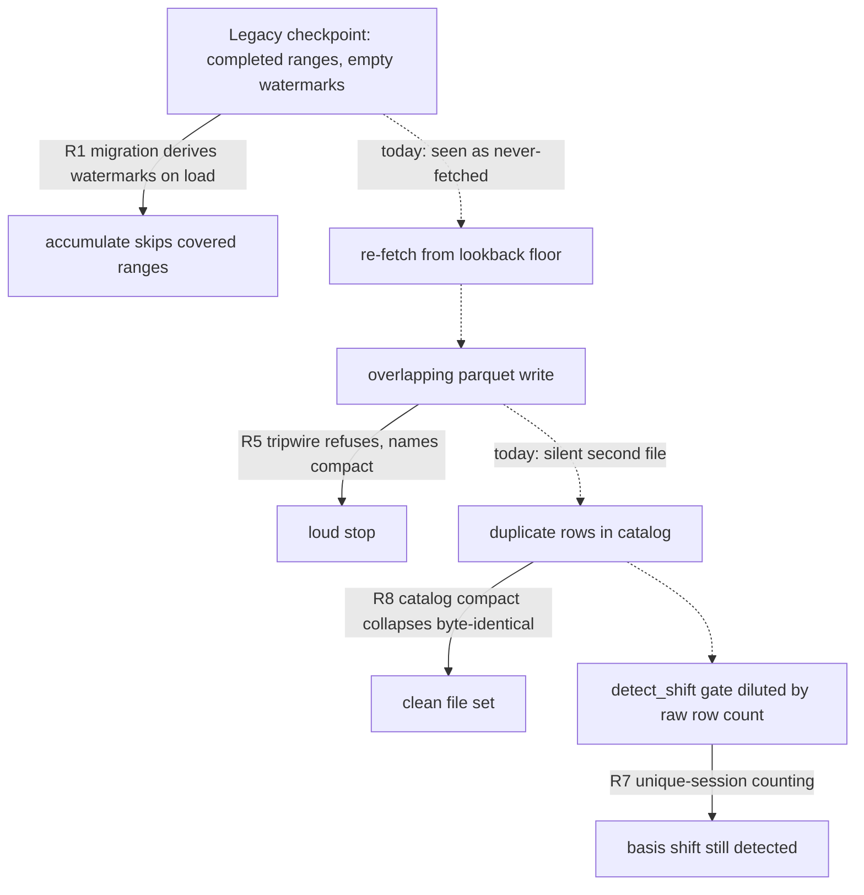
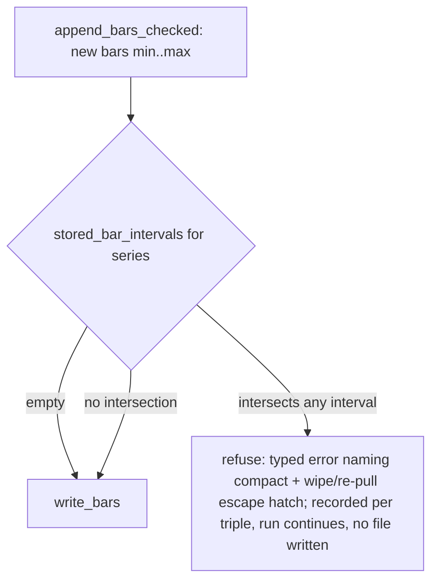
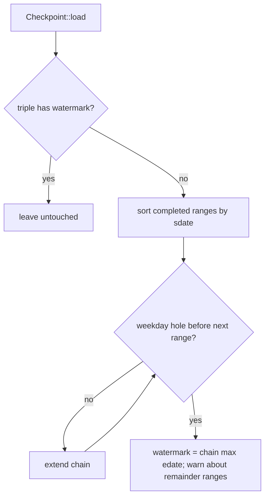

# Nautilus Re-ingest Overlap Write-Side Hardening - Plan

## Goal Capsule

- **Objective:** Remove the write-side cause of duplicate parquet accumulation in the nautilus adapter's re-ingest, harden the one detector still blind to duplicates, and remediate the already-polluted catalog — without adding any mutation path inside the accumulate/heal state machine.
- **Product authority:** The Product Contract below, grounded in the root-cause record `docs/solutions/logic-errors/re-ingesting-an-overlapping-range-duplicates-catalog-bars.md` (PR #97 fixed the read side; this work closes the residuals it documents).
- **Authority hierarchy:** Product Contract for WHAT; Planning Contract and Implementation Units for HOW; repo conventions (`AGENTS.md`, `docs/solutions/`) override implementation details on conflict.
- **Stop conditions:** Any change that would touch the heal state machine's arms (mark-before-wipe, `Refused`/`Incomplete`/`Healed`) or `rebase_events` handling is out of bounds — surface instead of proceeding. The attended remediation run against the real catalog is operator-gated; do not run it unattended.
- **Open blockers:** None. All work including the real-catalog remediation run is offline (byte-identical dedup needs no gateway), so KRX closure does not gate anything.

---

## Product Contract

### Summary

Migrate legacy `completed`-range checkpoints to `watermarks` on load so accumulate stops re-fetching covered ranges, make the basis-shift detector count unique sessions instead of raw rows, refuse overlapping parquet writes fail-closed at the append path, and ship an operator-run catalog compaction command — then run it once against the real turn-2b catalog with before/after evidence.

### Problem Frame

PR #97 (squash `9161b06`) fixed duplicate-bar **corruption at read time**: `read_all_bars` now drops byte-identical duplicates and the universe scan selects distinct sessions. But the write side is untouched. Every re-widen of a legacy-checkpoint catalog re-fetches from the lookback floor and writes a second parquet file overlapping the first, because `Checkpoint::load` performs no `completed`→`watermarks` migration and the watermark map is accumulate's sole skip authority. Disk and read latency grow with each re-widen.

Worse, the read-side mask has a blind spot: the heal path's `detect_shift` reads its overlap tail through the non-deduped `read_bars_scoped` and gates on raw row count against `MIN_OVERLAP_DATES`. Accumulated duplicate rows fill that gate with redundant copies, so a genuine adjustment-basis shift can be diluted below the threshold and silently suppressed — the exact signal the heal machinery exists to catch.

The turn-2b catalog carries this pollution today (an `0601..0703` file beside `0618..0703`), currently masked at read time only.

### Key Decisions

- **Kill the trigger with checkpoint migration, not overlap-safe writes.** Merge-on-append would make any writer overlap-safe forever, but `delete_bar_series` is whole-series, so merging means read-union-rewrite inside the accumulate hot path — a new mutation seam in the load-bearing machinery. Migration is a pure load-time transform with zero contact with the fail-closed heal arms.
- **Unknown future triggers stop loudly instead of self-healing.** A fail-closed disjointness guard at the append write converts any unforeseen overlap source from silent corruption into a refused write that names the remediation. Operator intervention is accepted over an unattended mutation path.
- **Remediation is an operator command, not automatic.** A compaction command run once per polluted catalog keeps zero new arms in the state machine and gives an auditable before/after. Consequence: a catalog the operator has not compacted stays polluted, which is why the detector fix below is mandatory, not optional.
- **Compaction collapses byte-identical duplicates only.** Value-divergent same-timestamp bars are an adjustment-shift or mutation signal owned by the heal path; compaction refuses and reports rather than picking a side.
- **Backward widening is deferred; the migration makes it a loud no-op.** Pre-migration, an earlier lookback "worked" only via the re-fetch-from-floor bug. The watermark model cannot represent a coverage start without new checkpoint state, so this package warns and names the escape hatch (fresh catalog at the wider lookback, or wipe + full re-pull) instead of shipping backfill.
- **The read-side defenses from PR #97 stay.** `dedup_bars` and distinct-session selection remain unchanged as defense-in-depth beneath the write-side fixes.

Where each fix intercepts the corruption path:

### Requirements

**Checkpoint migration**

- R1. On checkpoint load, legacy `completed` ranges are migrated to `watermarks` so accumulate treats already-covered ranges as covered instead of re-fetching from the lookback floor.
- R2. Migration derives a watermark only from coverage the `completed` ranges actually attest; ranges with recorded `gaps` must not advance the watermark past unfetched data.
- R3. Migration is idempotent — loading an already-migrated checkpoint derives nothing new and changes no behavior.
- R4. When the configured lookback floor precedes existing coverage, accumulate emits a warning that the pre-coverage region will not be fetched and names the escape hatch (fresh catalog at the wider lookback, or wipe + full re-pull); it must not silently no-op.

**Write-path tripwire**

- R5. The accumulate append path refuses a bar write whose date range overlaps bars already stored for the same (instrument, bar-kind) series, failing closed with an error that names the compaction command.
- R6. The tripwire must not obstruct the heal path — heal's wipe-then-re-pull writes remain overlap-free by construction and must continue to succeed.

**Basis-shift detection**

- R7. `detect_shift`'s overlap gate counts distinct sessions (unique bar timestamps) rather than raw rows, so duplicate rows can neither dilute the count below `MIN_OVERLAP_DATES` nor suppress a genuine adjustment-basis shift.

**Catalog compaction**

- R8. A `lab-research` catalog compaction command collapses byte-identical duplicate bars per series into a clean file set and reports before/after file and bar counts per series.
- R9. Compaction refuses a series containing value-divergent same-timestamp bars, reporting the divergence and leaving the series untouched.
- R10. Compaction mutates only parquet files — it never touches the checkpoint or any heal/accumulate state.

**Defense-in-depth retention**

- R11. `dedup_bars` in `read_all_bars` and distinct-session selection in `build_candidates` remain in place unchanged.

### Key Flows

- F1. Legacy catalog widened after the fix
  - **Trigger:** Operator runs accumulate on a catalog whose checkpoint predates the watermark format, with an unchanged or earlier lookback.
  - **Steps:** Load migrates `completed`→`watermarks`; accumulate computes fetch start from the derived watermark; covered ranges are skipped; if the floor precedes coverage, the R4 warning fires; only genuinely new forward sessions are fetched and written disjointly.
  - **Outcome:** No overlapping file is written; the tripwire stays silent.
  - **Covers:** R1, R2, R3, R4.
- F2. One-time remediation of a polluted catalog
  - **Trigger:** Operator runs the compaction command against a catalog with known duplicate accumulation.
  - **Steps:** Command scans each series for duplicate rows; byte-identical duplicates collapse into a rewritten clean file set; any value-divergent series is refused and reported; before/after file and bar counts print per series.
  - **Outcome:** Catalog bar counts return to span-consistency; `detect_shift` reads clean rows thereafter.
  - **Covers:** R8, R9, R10.

### Acceptance Examples

- AE1. **Covers R1, R2.** Given a checkpoint with populated `completed` ranges and empty `watermarks`, when it is loaded, then a watermark reflecting the attested coverage exists for each triple and a subsequent accumulate does not re-fetch the covered range. (The existing test asserting "no watermark derived yet" flips its expectation — a deliberate anchor for the behavior change.)
- AE2. **Covers R4.** Given a migrated catalog covering `0618..0703`, when accumulate runs with a lookback floor of `0601`, then no fetch of `0601..0617` occurs and a warning names the unreachable region and the escape hatch.
- AE3. **Covers R5.** Given a catalog storing `0618..0703` for a series, when any code path attempts to write bars spanning `0601..0703` for that series, then the write is refused with an error naming the compaction command and no file is created.
- AE4. **Covers R6.** Given a series marked for heal, when the heal path wipes it and re-pulls the full range, then the re-pull write succeeds without tripping the guard.
- AE5. **Covers R7.** Given an overlap tail holding two byte-identical copies of two sessions (four rows, two distinct timestamps) with `MIN_OVERLAP_DATES` of three, when `detect_shift` gates, then the gate evaluates two distinct sessions — duplicates do not fake sufficiency, and conversely five copies of one shifted session do not mask a shift comparison.
- AE6. **Covers R8, R9.** Given a series with byte-identical duplicate rows and a second series with value-divergent same-timestamp rows, when compaction runs, then the first series is rewritten clean with counts reported and the second is refused with the divergence reported and its files untouched.

### Success Criteria

- Offline gate green: `cd adapters/nautilus && cargo test --workspace` — no test depends on a live catalog or the gateway.
- One attended compaction run against the real turn-2b catalog, with before/after evidence recorded in the PR body: file counts, bar counts returning from ~double to span-consistent with trading days, and `lab-research catalog status` reporting GO.
- A repeat of the turn-2b widen scenario (legacy checkpoint, earlier lookback) on the remediated catalog writes no new overlapping file and fires the R4 warning.
- Migration coverage tests exercise the failure inversion explicitly: a migration bug must surface as a failing under-fetch test, not as silent gaps.

### Scope Boundaries

- Merge-on-append (overlap-safe writes) — rejected as a mutation seam inside the load-bearing accumulate machinery.
- Automatic remediation on catalog open or during ingest — remediation stays operator-invoked.
- Backward-widen backfill and any coverage-start tracking in the checkpoint — deferred; this package ships the loud no-op and escape hatch only.
- Range-scoped or epoch-scoped `delete_bar_series` — not needed by the chosen package.
- Any change to the heal state machine's arms (mark-before-wipe, Refused/Incomplete/Healed) or to `rebase_events` handling.

### Dependencies / Assumptions

- Bars are built with deterministic timestamps (`ts_event == ts_init`, from the candle's own KST date/time), so redundant overlap re-pulls are byte-identical — the premise that makes byte-identical-only compaction complete for the known pollution. Verified at `adapters/nautilus/src/ingest/mod.rs:210-227`.
- The polluted turn-2b catalog is available locally for the attended remediation run; the run needs no gateway.
- The heal path's fail-closed arms live entirely inside `heal_daily` / `run_accumulate`'s heal branch, so the tripwire, migration, and compaction — all outside that path — cannot touch them. Verified against `adapters/nautilus/src/ingest/mod.rs:983-1040, 1198-1317`.

### Sources / Research

- `docs/solutions/logic-errors/re-ingesting-an-overlapping-range-duplicates-catalog-bars.md` — root cause, read-side fix, and the residuals this package closes.
- `adapters/nautilus/src/ingest/checkpoint.rs:356-366` — `Checkpoint::load` is a pure serde parse; `checkpoint.rs:451-464` — the legacy-load test whose expectation AE1 flips; `checkpoint.rs:321-348` — `prune_below_watermarks`, the only existing `completed`/`watermarks` bridge (deletion-only).
- `adapters/nautilus/src/ingest/mod.rs:988-997` — watermark map as accumulate's sole skip authority; `mod.rs:1059-1063, 1352-1374` — the append write path with the disjoint check skipped; `mod.rs:1446-1467` — whole-series `delete_bar_series`, heal-only caller at `mod.rs:1233`.
- `adapters/nautilus/src/ingest/mod.rs:1168-1190` — `detect_shift` gating on raw `stored.len()` vs `MIN_OVERLAP_DATES` (= 3, `mod.rs:604`); downstream `compare_overlap` (`mod.rs:648-668`) is already timestamp-keyed, so R7 is a one-gate change.
- `adapters/nautilus/src/ingest/mod.rs:1434-1437, 1401-1413` — `dedup_bars` (whole-`Bar` `HashSet`) applied in `read_all_bars` only.
- PR #97 (squash `9161b06`) — read-side fixes this package retains; PR #93/#94 — the heal machinery whose arms are out of bounds.

---

## Planning Contract

**Product Contract preservation:** unchanged, except the four Deferred-to-Planning questions are resolved into KTD-1 through KTD-5 below and their section removed.

### Key Technical Decisions

- KTD-1. **The guard is interval-overlap refusal in a new checked-append wrapper, not a change to `write_bars`.** Add `stored_bar_intervals(catalog_path, bar_type)` — a `spawn_blocking` wrapper over the catalog's `get_intervals("bars", identifier)`, which reads coverage from parquet filenames without loading rows — and `append_bars_checked`, which refuses when the new bars' `[min_ts, max_ts]` intersects any stored interval, returning a typed error that names both remediations — `lab-research catalog compact` for duplicate pollution, and wipe + full re-pull (or a fresh catalog) when stored coverage is genuinely disjoint from the attempted write. In `run` and `run_accumulate` a refusal is per-triple, not run-fatal: it lands in a new `CoverageReport` refusal vec (mirroring `heal_refusals`, printed by `ls-ingest`), the triple's watermark does not advance, and the run continues; `append_bars_checked` still returns the typed refusal for direct callers. Switch the three production writers (`run` range append, `run_accumulate` append, `heal_daily` re-pull) to the checked wrapper. Disjoint writes on either side of existing coverage stay legal — a disjoint-prefix range-mode run remains a valid backward-widen escape hatch. The predicate is the write's success condition ("disjoint from existing coverage"), not the transport's, per `docs/solutions/logic-errors/fail-closed-reconcile-set-drops-symbol-on-truncated-page.md`.
- KTD-2. **Raw `write_bars` stays a fixture-only primitive.** Its docstring already reserves it for test fixtures and one-off staging; tests (including the compact fixtures) need it to fabricate overlaps deliberately. No production caller may use it directly after U1.
- KTD-3. **Migration derives watermarks on load, into absent keys only, using a contiguous-prefix rule.** For each `(instrument, bar_type)` with no existing watermark, parse its `completed` range keys (`{instrument}|{bar_type}|{sdate}..{edate}`), sort by `sdate`, and chain ranges while no weekday lies strictly between the chain's running max `edate` and the next range's `sdate` — the running-maximum comparison, not adjacent sorted pairs, so a contained range chains trivially; the derived watermark is the chain's max `edate`. Ranges beyond a hole stay in `completed` untouched and surface as an R4-style report entry naming the escape hatch (wipe + full re-pull, or fresh catalog) alongside a `tracing::warn`. Gap reasons discriminate coverage: `EmptyHistory` and `NonTradingDay` gaps attest coverage ("requested, nothing there" — `record_gap` also calls `mark_done`) and never block derivation, but a `PaperThin` gap records a truncated fetch, so its range terminates the chain before it (kept in `completed`, warned) — deriving past it would skip un-fetched history forever, the exact silent gap R2 forbids. The derived `edate` is trusted as attested — the same trust `prune_below_watermarks` already applies; a legacy run made with a future `EDATE` would over-claim, an accepted and documented limitation. Existing watermarks are never overridden, which makes double-load a no-op (R3). Persistence rides the existing save path; the next accumulate's `prune_below_watermarks` then cleans migrated ranges naturally.
- KTD-4. **`detect_shift` counts distinct sessions by fixing `overlap_tail`, not `compare_overlap`.** `overlap_tail` currently drains to the last N rows by `Vec` length, so duplicates crowd distinct earlier sessions out of the window and `compare_overlap`'s date-unique `mutual` falls below `MIN_OVERLAP_DATES` (Insufficient → shift suppressed). Change `overlap_tail` to keep the rows belonging to the last N distinct `ts_event` values, and the length gate to count distinct `ts_event`. When the kept tail contains value-divergent same-timestamp rows (two rows sharing a `ts_event` after byte-identical dedup), `detect_shift` short-circuits to a shift verdict directly — `compare_overlap`'s per-timestamp map keeps only the last-inserted copy, so relying on it to surface the divergence would be read-order-dependent. `compare_overlap` itself stays unchanged.
- KTD-5. **Compact is read → dedup → divergence-check → backup sidecar → delete → rewrite, per series.** Core logic lives in `src/ingest/mod.rs` (beside its building blocks `read_bars_scoped`, `dedup_bars`, `delete_bar_series`, `write_bars`); the CLI arm wraps it. Per series: read all rows, collapse byte-identical duplicates via `dedup_bars`, then group by `ts_event` — any timestamp with more than one surviving row is value-divergent → refuse the series, report, touch nothing. For a clean series with duplicates removed: serialize the deduped bars to a sidecar file next to the catalog, `delete_bar_series`, rewrite through `append_bars_checked` (trivially disjoint after the delete, keeping the DoD raw-`write_bars` invariant literal), delete the sidecar. Recovery is state-independent: a re-run that finds a leftover sidecar unions current series rows with the sidecar rows, dedups byte-identical copies, re-runs the divergence check, then deletes and rewrites — idempotent across every crash point, and bars appended after a crash are never lost. The whole run holds the ingest advisory lock (`AdvisoryLock::acquire(catalog_path, LockKind::Ingest)`, the same lock both ingest entry points take at `mod.rs:816, 939`), refusing loudly if held, so a concurrent accumulate cannot write into the delete-rewrite window. The checkpoint is never read or written (R10). All catalog calls keep the `spawn_blocking` + `create_dir_all` envelope per `docs/solutions/integration-issues/nautilus-parquet-catalog-block-on-from-async.md`.
- KTD-6. **The R4 warning compares the run's lookback floor against the earliest stored interval start.** The watermark carries no coverage start, so the check uses `stored_bar_intervals` (KTD-1): when a watermark exists and the floor date precedes the earliest stored interval, emit `tracing::warn!` naming the unreachable region and the escape hatch, and surface it in `CoverageReport` so the `ls-ingest` bin prints it like `heal_refusals`.

### High-Level Technical Design

The checked-append gate (KTD-1) and the migration derivation (KTD-3):

### Assumptions

- The real turn-2b catalog's duplicates are byte-identical (deterministic timestamps), so compact fully cleans it; if a series there turns out value-divergent, compact refuses it and the heal path owns it — that outcome is still a valid remediation-run result, recorded as such in the PR evidence.
- Weekday-hole contiguity (KTD-3) treats a KRX holiday cluster between two ranges as a hole — a false hole under-claims, which is loud (re-fetch → per-triple tripwire refusal), never silent; the refusal error and the migration's remainder report entry both name the exit (wipe + full re-pull, or fresh catalog), so the operator is never wedged on compact, which finds no duplicates in this state.

### Sequencing

- U1 first — U3 and U5 depend on `stored_bar_intervals`. U2 and U4 are independent. Land everything in one PR: the guard without the migration would refuse every legacy widen immediately, and the migration without the guard leaves unknown triggers silent.

### Sources / Research (planning)

- `adapters/nautilus/src/ingest/checkpoint.rs:37-47, 25-34, 402-412` — `CoverageGap`/`GapReason`; `record_gap` marks done, so gaps attest coverage.
- `adapters/nautilus/src/ingest/mod.rs:831, 889` — range mode writes one `{sdate}..{edate}` key per run per triple; `LS_INGEST_MODE=range` is still the default (`adapters/nautilus/src/bin/ls-ingest.rs:57`).
- nautilus-persistence `get_intervals` / `parse_filename_timestamps` — coverage from filenames (`{start_iso}_{end_iso}.parquet` under `data/bars/{bar_type}/`), no row reads; unwrapped by the adapter today.
- `adapters/nautilus/lab/src/runner/research.rs:1034-1042, 946, 690-697, 729-812` — `catalog` subcommand dispatch, `USAGE`, `StatusConfig` pattern, `catalog_status` (counts via `read_all_bars`, GO/NO-GO via `ok_fail`).
- `adapters/nautilus/src/ingest/mod.rs:1110-1116, 753-770` — `tracing` + `CoverageReport` reporting conventions; `adapters/nautilus/src/bin/ls-ingest.rs:152-167` prints refusal vecs.
- `adapters/nautilus/tests/ingest.rs:291-318, 358-394` — `daily_bar`/`minute_bar` fixtures and the two-`write_bars` overlap-staging pattern.
- `docs/solutions/workflow-issues/cross-workspace-gate-blind-spot-sdk-preflight-changes-redden-adapter.md` — `--workspace` is mandatory or the `lab` crate is skipped.
- `docs/solutions/integration-issues/ls-gateway-t8412-chart-all-pagination-burst-and-silent-truncation.md` — assert bar content, not counts, in dedup/guard tests.
- `docs/solutions/conventions/range-scoped-comparability-scope-every-derived-input.md` — compact must not perturb in-range bytes; test derived-value stability across a compact.

---

## Implementation Units

### U1. Interval metadata wrapper and checked append guard

- **Goal:** Production writes refuse interval overlap fail-closed; coverage bounds become cheaply readable.
- **Requirements:** R5, R6.
- **Dependencies:** none.
- **Files:** `adapters/nautilus/src/ingest/mod.rs`, `adapters/nautilus/tests/ingest.rs`.
- **Approach:** Add `stored_bar_intervals` (`spawn_blocking` over `get_intervals("bars", bar_type.to_string())`, with the `create_dir_all`-before-construction envelope so a never-written catalog path returns empty instead of erroring) and `append_bars_checked` (KTD-1). Refusal is a typed `AdapterError::Ingest` message naming the offending series + ranges and both remediations. In `run` and `run_accumulate`, route the refusal into the new `CoverageReport` vec (watermark unchanged, run continues); print it in `ls-ingest` beside the other refusal vecs. Convert the three production `write_bars` callers; leave `write_bars` itself untouched (KTD-2).
- **Test scenarios:**
  - Covers AE3. Stage `0618..0703` via `write_bars`, then `append_bars_checked` with bars spanning `0601..0703` → error names both remediations; `stored_bar_intervals` and bar content unchanged (assert content, not counts).
  - A refused triple does not abort the run: in an accumulate fixture with one overlapping and one clean triple, the clean triple ingests, the refusal lands in the report vec, and the refused triple's watermark is unchanged.
  - Overlap at a single shared boundary timestamp is refused (inclusive-bounds edge).
  - Disjoint prefix (`0601..0617` against stored `0618..0703`) succeeds; disjoint forward append succeeds; empty series succeeds.
  - Covers AE4. Existing heal tests (`ae1_shift_detected_healed_recorded`, `ae2_interrupted_heal_resumes_at_wipe`) stay green with `heal_daily` on the checked wrapper — wipe-then-write passes the guard.
  - `stored_bar_intervals` on a missing/empty series returns empty without error.
- **Verification:** Unit and integration tests above pass; no production caller of raw `write_bars` remains outside fixtures.

### U2. Checkpoint completed-to-watermarks migration on load

- **Goal:** A legacy `completed`-range checkpoint loads with derived watermarks, so accumulate skips covered ranges.
- **Requirements:** R1, R2, R3.
- **Dependencies:** none.
- **Files:** `adapters/nautilus/src/ingest/checkpoint.rs`, `adapters/nautilus/tests/ingest.rs`.
- **Approach:** After deserialize in `Checkpoint::load`, run the KTD-3 derivation. Keep it a pure in-memory transform; persistence happens on the caller's next `save`. Warn (`tracing::warn!`) per triple left with non-contiguous remainder ranges.
- **Execution note:** Flip `legacy_checkpoint_without_watermarks_loads` first — its current "no watermark derived yet" assertion is the anchor that proves the behavior change.
- **Test scenarios:**
  - Covers AE1. Legacy fixture (`completed` populated, `watermarks` empty) loads with the derived watermark; a subsequent `run_accumulate` skips the covered range (extend the wiremock-free accumulate fixtures — no fetch attempted below the watermark).
  - `EmptyHistory`/`NonTradingDay` gap-attested ranges derive the same watermark as a bars-attested range; a `PaperThin`-gapped range terminates the chain — asserted directly that no watermark derives at or past it.
  - Two ranges separated only by a weekend chain into one watermark; two ranges separated by an intervening weekday (holiday-straddling fixture) derive the prefix watermark only, keep the remainder key in `completed`, and emit a report entry whose text names the escape hatch.
  - A contained range (`0618..0703` inside `0601..0703`) chains — the hole test compares against the running chain maximum, not adjacent sorted pairs.
  - Existing watermark for a triple is never overridden by `completed` ranges (later or earlier).
  - Double-load idempotency: load → save → load yields identical checkpoint state.
  - After a post-migration accumulate save, `prune_below_watermarks` has removed the migrated `completed`/`gaps` keys at or below the watermark.
  - Failure-inversion coverage (Success Criteria): a non-contiguous fixture must NOT derive past the hole — asserted directly, so an over-derivation bug fails a test rather than silently gapping.
- **Verification:** All checkpoint unit tests pass including the flipped legacy test; accumulate integration fixtures show no re-fetch of covered ranges.

### U3. Backward-widen loud no-op warning

- **Goal:** An earlier lookback floor than existing coverage warns and names the escape hatch instead of silently not fetching.
- **Requirements:** R4.
- **Dependencies:** U1 (`stored_bar_intervals`).
- **Files:** `adapters/nautilus/src/ingest/mod.rs`, `adapters/nautilus/src/bin/ls-ingest.rs`, `adapters/nautilus/tests/ingest.rs`.
- **Approach:** In `run_accumulate`, when a triple has a watermark and the configured floor date precedes the earliest stored interval start (KTD-6), `tracing::warn!` naming the unreachable region and both escape hatches, and push an entry onto a new `CoverageReport` vec (mirror `heal_refusals`); print it in the `ls-ingest` bin alongside the other refusal vecs.
- **Test scenarios:**
  - Covers AE2. Migrated catalog covering `0618..0703`, accumulate with floor `0601`: no fetch below the watermark occurs, the report vec carries the triple with the unreachable region, and the entry names the escape hatch.
  - Floor within existing coverage: vec empty, no warning.
  - Triple with no watermark (fresh instrument): no warning — the floor fetch is the normal path.
- **Verification:** Report field appears in `CoverageReport` with tests asserting entry content, not just count.

### U4. Distinct-session overlap tail in detect_shift

- **Goal:** Duplicate rows can neither suppress nor fake basis-shift detection sufficiency.
- **Requirements:** R7, R11.
- **Dependencies:** none.
- **Files:** `adapters/nautilus/src/ingest/mod.rs`.
- **Approach:** KTD-4 — `overlap_tail` keeps rows of the last N distinct `ts_event` values; the `detect_shift` gate counts distinct `ts_event` and short-circuits to a shift verdict on intra-tail same-`ts_event` value divergence. `compare_overlap`, `dedup_bars`, and `read_bars_scoped` unchanged.
- **Test scenarios:**
  - Covers AE5. Four rows over two distinct sessions gate as two (< `MIN_OVERLAP_DATES` → no detection), matching the existing `short_overlap_skips_detection_and_never_marks` semantics.
  - Suppression regression: a shifted overlap whose stored side carries byte-identical duplicates crowding the raw tail still selects enough distinct sessions to return `Shifted` (this is the dilution defect — the test fails on current code).
  - Value-divergent same-timestamp rows within a kept session trigger the short-circuit shift verdict deterministically, regardless of catalog read order.
  - Clean catalog: existing detect/heal integration tests unchanged.
- **Verification:** New unit tests beside `overlap_shifts_on_any_mutual_date_mismatch`; full heal suite green.

### U5. lab-research catalog compact

- **Goal:** Operators can collapse byte-identical duplicate bars per series with an auditable before/after report.
- **Requirements:** R8, R9, R10.
- **Dependencies:** U1 (`stored_bar_intervals` for file counts).
- **Files:** `adapters/nautilus/src/ingest/mod.rs` (compact core), `adapters/nautilus/lab/src/runner/research.rs` (CLI arm, `USAGE`), `adapters/nautilus/lab/tests/research_cli.rs`, `adapters/nautilus/tests/ingest.rs`.
- **Approach:** KTD-5 core in `src/ingest/mod.rs` — holds the ingest advisory lock for the run and rewrites via `append_bars_checked`; CLI adds a `Some("compact")` arm beside `catalog status` with a `CompactConfig` mirroring `StatusConfig`, `rt.block_on`, `print_lines`, `ok_fail` (exit nonzero when any series was refused). Report lines per series: files before/after, bars before/after, outcome (compacted / clean / refused-divergent).
- **Test scenarios:**
  - Covers AE6. Fixture with one byte-identical-duplicated series and one value-divergent series: first rewritten to one file with deduped content (assert bar content equality against the expected set), second refused with files and bytes untouched.
  - Idempotency: second compact run reports clean, changes nothing.
  - Crash recovery, all three windows: leftover sidecar with no series files; sidecar beside an intact series; sidecar plus bars appended after the crash — each re-run unions, dedups, re-checks divergence, and rewrites with no bar from either source lost; sidecar removed on success.
  - Lock refusal: compact against a catalog whose ingest advisory lock is held refuses loudly without touching files.
  - Checkpoint file bytes are identical before and after compact (R10).
  - Derived-value stability: `catalog status` over a compacted fixture reports GO with span-consistent counts; a backtest-level read (`read_all_bars`) returns the same bar set before (deduped view) and after compact.
  - CLI: unknown `catalog` subcommand error still lists `compact` in `USAGE`; exit code 0 on clean, nonzero on refusal.
- **Verification:** `lab` crate tests pass under `cargo test --workspace`; command output lines match the report contract above.

---

## Verification Contract

| Check | Command | Proves |
|---|---|---|
| Full offline gate | `cd adapters/nautilus && cargo test --workspace` | All units; `--workspace` is mandatory — a bare `cargo test` skips the `lab` crate carrying U5 |
| Guard + migration integration | accumulate fixtures in `adapters/nautilus/tests/ingest.rs` | AE1-AE4 end-to-end without a gateway |
| Compact CLI | `lab` tests in `adapters/nautilus/lab/tests/research_cli.rs` | AE6, exit codes, report lines |
| Attended remediation (operator, offline) | `lab-research catalog compact`, `lab-research catalog status`, then a repeat-widen accumulate run (earlier floor) against the real turn-2b catalog | Success Criteria evidence: before/after file and bar counts, status GO, R4 warning fired with no new overlapping file (under closure the fetch skips, so the run stays offline) |

No test may hit the LS gateway or depend on the real catalog; the attended remediation run is operator-executed evidence, not part of the gate.

---

## Definition of Done

- R1-R11 each traced to a green test or (R10) an asserted invariant; AE1-AE6 each covered by a named scenario above.
- The flipped legacy-checkpoint test documents the migration as a deliberate behavior change.
- No production caller of raw `write_bars` remains; the three writers go through `append_bars_checked`.
- Offline gate green: `cd adapters/nautilus && cargo test --workspace`.
- Attended remediation run on the real turn-2b catalog recorded in the PR body: before/after file counts, bar counts span-consistent with trading days, `catalog status` GO — or, if a series proves value-divergent, the refusal recorded and routed to the heal path. The same evidence includes a repeat-widen accumulate run (earlier lookback floor) showing the R4 warning and no new overlapping file.
- Abandoned-attempt code removed; no dead experimental paths in the diff.
