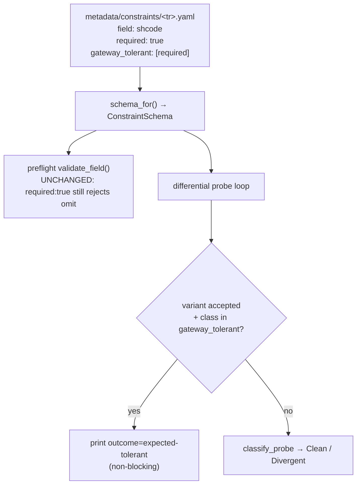
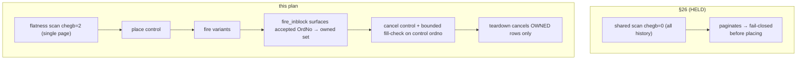

# Re-cert Wave 2 — Reopen 7 HELD TRs - Plan

## Goal Capsule

- **Objective:** Restore the Recommended promotions left HELD by ledger §26. Land one green offline PR (Workstreams A + B + C + supporting docs), then promote whatever certifies in one attended open-KRX session (§27).
- **Authority hierarchy:** the Product Contract below is the source of truth for WHAT. This plan owns HOW. On conflict, repo conventions (`AGENTS.md`, the `promote-tr` recipe) and operator judgment during the live session override the plan's sequencing.
- **Execution profile:** offline units are agent-executable and gate-green. The live promotion legs are **operator-run in an attended TTY** — the order-quartet autonomy chain refuses a non-TTY sandbox by construction, and all promotions require a real open-KRX window.
- **Stop conditions:** fail-closed. A TR that does not certify cleanly live stays HELD (Implemented) with a recorded §27 arm — a valid, expected outcome. Never promote on throttle-only, ambiguous, or paginated-scan evidence.
- **Tail ownership:** the offline PR ships first; the live session and its `promote-tr`-driven count-site bumps + §27 ledger entry are a separate, operator-gated tail.

**Product Contract preservation:** changed — R4 (teardown gains an explicit stranded-order fallback + §26 disambiguation) and AE3 (fill-detection claim corrected from "confirms unfilled" to "confirms not-resting"). Both are doc-review correctness fixes, not scope changes. The three `Deferred to Planning` questions (Q1–Q3) are resolved in Planning Contract (KTD1–KTD3); their prose moved out of Outstanding Questions rather than being stratified.

---

## Product Contract

### Summary

Land one green offline PR that (A) decouples order-probe fill-detection from the single-page flatness scan and adds owned-teardown, (B) reconciles three divergent constraint schemas via a new per-class `gateway_tolerant` facet that preserves the preflight caller-contract guardrail, and (C) paces the CSPAQ12200 probe off the Account throttle. Then, in one attended open-KRX session, re-run the probes and promote whatever certifies (ledger §27). Fail-closed throughout — a TR staying HELD is a valid, documented outcome.

### Problem Frame

§26 restored the Recommended tier from 0 to 3 but left seven TRs HELD for three distinct reasons, each a real defect surfaced live rather than a session artifact:

- **Order quartet** — the §26 gap-(b) fix widened the shared working-orders flat scan from `chegb="2"` (unfilled-only) to `chegb="0"` (fill-inclusive) so a filled row would surface. On a heavily-traded paper account, `chegb="0"` returns 005930's entire accumulated order history, paginates (`tr_cont` set), and the single-page guard fail-closes at pre-assert-flat — before any control is placed. The happy-path chain still certifies; only the required differential probe blocks. Confirmed by a `make raw-probe` A/B: `chegb="2"` body_len 63 (flat) vs `chegb="0"` body_len 1186 (~19×, paginates). See `docs/solutions/logic-errors/order-probe-fill-inclusive-scan-paginates-false-held.md`.
- **Divergent schemas** — the live differential probe found the gateway returns `rsp_cd=00000` when a schema-`required` field is removed (t1102 `shcode`+`exchgubun`, t8412 `shcode`) or when a date is malformed (t8412 `sdate`/`edate` format), or when `chegb` is removed (t0425). The constraint schema over-claims `required`/format relative to gateway reality, so the differential contract reads it as a divergence and the recipe blocks promotion.
- **CSPAQ12200** — its sole variant `BalCreTp/required` only ever returned `IGW00201` (a self-inflicted Account 1/s-bucket throttle), never a crisp merits-rejection, so the differential contract was never actually exercised.

### Requirements

**Workstream A — order-probe decouple (unblocks CSPAT00601/00701/00801)**

- R1. The pre-assert-flat and post-cancel flat-verify scans use single-page `chegb="2"` (unfilled-only) and never paginate on a traded-history symbol.
- R2. Control fill-detection is bounded and ordno-targeted (scoped to the control's OrgOrdNo), independent of the flatness scan, and does not walk account history.
- R3. `fire_inblock` surfaces the accepted variant's OrdNo from the response body; the probe maintains an owned-order set.
- R4. Teardown never leaves a resting order. When every accepted WAVE-BLOCKED OrdNo was surfaced, it cancels only owned rows (not foreign rows — closing the §26 order-probe foreign-cancel residual). When the owned set could not be fully constructed — an accepted variant whose response body yielded no parseable OrdNo — it falls back to the unconditional cancel-every-resting-row path with a loud alarm. Owned-only is an optimization that narrows the set only when every accepted OrdNo was surfaced; it never weakens the current stranded-order guarantee.
- R5. The offline twin `working_orders_scan_request_is_fill_inclusive` is updated to match the reverted scan semantics — it must no longer assert `chegb="0"` on the flatness path.
- R6. The order-chain happy-path control (submit `00040` / modify `00462` / cancel `00463`) remains certified and unchanged.

**Workstream B — split-facet schema reconcile (unblocks t1102, t8412, t0425)**

- R7. A new per-field `gateway_tolerant` facet exists in the constraint schema, is validated by the metadata layer, and is distinct from `required`.
- R8. Preflight (`dispatch_once` / `validate_request`) behavior is unchanged: a `required:true` field still fails preflight when omitted, regardless of `gateway_tolerant`.
- R9. The differential probe treats a `gateway_tolerant` field's accepted violation for a marked class (required-removal or format-malformation) as an expected outcome, not a divergence.
- R10. The facet is applied to the live-observed tolerant `(field, class)` pairs: t1102 `shcode`/required + `exchgubun`/required, t8412 `shcode`/required + `sdate`/format + `edate`/format, t0425 `chegb`/required.
- R11. The `gateway_tolerant` mechanism spans both the required-removal and the format-malformation cases.

**Workstream C — CSPAQ12200 pacing (unblocks CSPAQ12200)**

- R12. The CSPAQ12200 negative probe paces its dispatches so the Account 1/s bucket is cool when the `BalCreTp/required` variant fires, so the variant is genuinely evaluated rather than throttled (`IGW00201`).

**Cross-cutting — KTD6 count-site discipline**

- R13. On each actual promotion, the five count sites are updated to match the real outcome, not a pre-committed target: the `slice_metadata` tripwire (currently asserts exactly `{S3_,t1101,token}`), `recommended_no_banner`, the freshness-count assertion, `EVIDENCE-FRESHNESS.md`, and the docgen banner. A HELD survivor leaves its count site untouched.

### Acceptance Examples

- AE1. **Covers R7, R8, R9.** Given t1102 `shcode` marked `required: true, gateway_tolerant: [required]`. When a caller omits `shcode`, preflight rejects before dispatch. When the differential probe removes `shcode` and the gateway returns `00000`, the probe records the field expected-tolerant, not a divergence.
- AE2. **Covers R9, R11.** Given t8412 `shcode` marked `gateway_tolerant: [required]` (not `[format]`). When the probe fires the `shcode`/format variant and the gateway accepts it, the probe still records a divergence — only the marked class is downgraded.
- AE3. **Covers R1, R2.** Given 005930 has a large accumulated order history. When the order probe runs pre-assert-flat, the `chegb="2"` scan returns a single non-paginated page and the probe proceeds to place the control; after cancel, the control's OrgOrdNo is confirmed **absent from the `chegb="2"` resting set** (not-resting). The scan proves the book flat, not that the control never filled — the non-marketable band-floor price plus the WAVE-BLOCKED tripwire are the fill-safety, and an undetected partial fill during the cancel race is an accepted, documented residual.
- AE4. **Covers R3, R4.** Given a WAVE-BLOCKED variant is accepted mid-probe. When teardown runs, it cancels exactly that accepted OrdNo (now in the owned set); a foreign 005930 row that appeared mid-probe is left untouched.
- AE5. **Covers R12.** Given the Account bucket was hit by a prior dispatch. When the CSPAQ12200 probe fires the `BalCreTp/required` variant after pacing, the gateway returns a merits-response (not `IGW00201`), and the differential contract is exercised.

### Success Criteria

- The offline PR gate is fully green (see Verification Contract), including the new `gateway_tolerant` facet validation and the updated probe/twin tests.
- The attended live re-probe yields CLEAN (or expected-tolerant) differential chains for whatever certifies; promoted TRs flip to `recommended: true` with all five count sites consistent.
- HELD survivors are recorded in ledger §27 with their reopen arm, fail-closed.
- **Certification-claim scope (split-facet TRs).** The Recommended claim for t1102/t8412/t0425 rests on preflight-enforced caller contract (offline-tested) plus crisp differential certification of the other fields/classes. It does **not** claim gateway-side enforcement of the tolerant `(field, class)` pairs — the gateway does not enforce them, and the recommendation text must not imply it does.

### Scope Boundaries

- Blanket `required:false` reconciliation — rejected; it weakens preflight.
- Any pagination of the flatness scan (`collect_all` on `chegb="0"`) — rejected; the non-terminating-cursor trap the sibling solution doc warns against.
- Realtime (S3_ / WS) re-certification — out of scope; realtime is NOT-OBSERVABLE (KTD2), dispositioned in §26.
- The order-chain happy path — already certified in §26; not re-litigated.

#### Deferred to Follow-Up Work

- Live-only order-probe gaps beyond the pagination fix (canceled-control modify/cancel, collateral-cancel) if surfaced during the live session but not on the certification path — record as new §27 arms, not this PR.

### Outstanding Questions

None blocking. Q1–Q3 (fill-detection mechanism, facet granularity, contract-vs-laxity per field) are resolved in KTD1–KTD3. Remaining unknowns are execution-time and listed per unit.

### Sources / Research

- `docs/solutions/logic-errors/order-probe-fill-inclusive-scan-paginates-false-held.md` — the order-probe pagination write-up + fix path.
- `docs/solutions/integration-issues/ls-gateway-t0425-rate-limit-and-pagination-flat-scan.md` — why `chegb="2"` keeps the working set single-page; the `chegb="0"` history-walk trap.
- `metadata/PROVISIONALITY-LEDGER.md` §26 — the current disposition record; this plan supersedes its reopen arms for the seven HELD TRs.

---

## Planning Contract

### Key Technical Decisions

- KTD1. **Fill-detection is a bounded ordno-targeted post-filter, not a widened scan (resolves Q1).** `t0425` has no ordno request field (its InBlock is `expcode`/`chegb`/`medosu`/`sortgb`/`cts_ordno`), so "ordno-targeted" means: scan single-page `chegb="2"` (unfilled), and detect a control fill by observing that the control's OrgOrdNo is *absent from the resting set after cancel* rather than by an all-states history walk. The band-floor control cannot marketably fill, so fill-detection is defense-in-depth, not the primary order-safety. This keeps every scan single-page (R1, R2) and abandons the `chegb="0"` widening that caused the §26 pagination HELD. Because `chegb="2"` excludes filled rows by construction, the scan positively confirms only *not-resting*, not *no-fill*: the pre-assert-flat and teardown `Fill` branch (the §26 `chegb="0"` fill visibility) goes dead. That defense-in-depth reduction is accepted — the band-floor control cannot marketably fill, so the non-marketable price plus the WAVE-BLOCKED tripwire carry fill-safety, and an undetected partial fill during the cancel race is a recorded residual, not a promotion blocker. The bounded OrgOrdNo fill-check runs only post-cancel, where a control ordno exists; it disambiguates a filled control from a cleanly-canceled one using the cancel response (a cannot-cancel-because-filled signal), not mere absence from the resting set.

- KTD2. **`gateway_tolerant` is a per-class tolerant set, not a field-level bool (resolves Q2).** Divergence is reported per `(field, class)` pair (`generate_invalid_variants` emits one variant per class; `classify_probe` verdicts each). t8412 `shcode` is tolerant on the `required` class but was *not* observed tolerant on its `format` class. A field-level bool would suppress divergence detection for every class on the field. The facet is therefore `gateway_tolerant: Vec<String>` — the class names (`"required"`, `"format"`, …) whose accepted violation is expected. Absent/empty = none (backward-compatible default). See `crates/ls-core/src/preflight.rs`.

- KTD3. **Preflight stays authoritative on `required`; `gateway_tolerant` only relaxes the probe (resolves Q3).** `validate_field` is unchanged — a `required:true` field still fails preflight when omitted, for all five fields, regardless of the facet. The "genuine caller contract vs gateway laxity" judgment for `exchgubun`/`chegb` therefore does not change the schema; it only informs the recommendation-scope note (Success Criteria). This is the guardrail the brainstorm's split-facet decision exists to preserve (R8).

- KTD4. **The probe downgrades `Divergent` → expected-tolerant; it does not touch `classify_probe`.** `classify_probe(control_ok, variant_rejected)` stays a pure 3-way verdict. A thin tolerance layer in the probe loop maps `(field, class)` against the field's `gateway_tolerant` set and, when a `Divergent` result lands on a marked class, prints an `expected-tolerant` outcome line instead. Keeps the core classifier unit-testable and the tolerance logic offline-twinnable (R9, AE1, AE2).

- KTD5. **The facet threads through both `FieldConstraint` copies.** ls-core (`crates/ls-core/src/preflight.rs`) and ls-metadata (`crates/ls-metadata/src/schema.rs`) each hold a parallel `FieldConstraint`; the shared YAML is their contract. Add `gateway_tolerant` to both with `#[serde(default, skip_serializing_if = "Vec::is_empty")]` so existing schemas round-trip unchanged. Grounding (`ls-metadata/src/constraints.rs`) checks only type/required and needs no change; the facet is not baseline-grounded (the gateway's tolerance is not in the wire baseline). Alternative considered — a probe-local `(tr, field, class)` tolerance allowlist inside `negative_probe.rs`, which would avoid threading the consumer-shipped `ls-core` type — rejected: it loses single-source grounding and the docgen "Errors & validation" surface that makes each tolerance auditable in the generated reference docs.

- KTD6. **Count sites move at promotion, not in the offline PR.** The five count sites track the *current* Recommended set; they change only when a TR actually promotes live, which the `promote-tr` recipe owns per TR. The offline PR leaves `{S3_,t1101,token}` untouched. The offline PR *does* update the `promote-tr` recipe / smoke-map so the recipe treats an `expected-tolerant` probe line as non-blocking (KTD4).

### High-Level Technical Design

**Workstream B — one YAML facet, two consumers, asymmetric effect.** The facet feeds the same schema both consumers read, but only the probe changes behavior:

**Workstream A — decouple the two questions the §26 scan conflated.** "Is the book flat?" (single-page `chegb="2"`) is separated from "did the control fill?" (bounded, ordno-scoped), and teardown gains an owned set sourced from the surfaced WAVE-BLOCKED OrdNo:

### Assumptions

- The live differential evidence in §26 is accurate: the marked `(field, class)` pairs are the complete tolerant set. If the live re-probe surfaces a *new* tolerant pair (e.g., t8412 `shcode`/format), it is a new finding — handle it then, do not pre-mark speculatively.
- `serde` on both `FieldConstraint` copies does not use `deny_unknown_fields` (confirmed: neither derive sets it), so the additive facet is safe even before both structs carry it.

---

## Implementation Units

### U1. Add the `gateway_tolerant` per-class facet to the constraint model

- **Goal:** thread a `gateway_tolerant: Vec<String>` field through both `FieldConstraint` copies, defaulting empty, with preflight behavior unchanged. (R7, R8, KTD2, KTD3, KTD5)
- **Dependencies:** none.
- **Files:** `crates/ls-core/src/preflight.rs`, `crates/ls-metadata/src/schema.rs`, `crates/ls-metadata/src/constraints.rs` (test constructors only if the shared `FieldConstraint` literal needs the new field).
- **Approach:** add the field to both structs with `#[serde(default, skip_serializing_if = "Vec::is_empty")]`. Do **not** touch `validate_field` — required-ness enforcement stays as-is. Update the two in-module `field(...)` / `f(...)` test helpers to populate the new field with `vec![]`.
- **Test scenarios:**
  - A YAML schema with `gateway_tolerant: [required]` on a field round-trips through `serde_yaml` into `ConstraintSchema` with the class present.
  - A schema with no `gateway_tolerant` key parses with an empty vec (backward-compat).
  - `Covers R8, AE1.` `validate_request` still rejects an omitted `required: true` field that also carries `gateway_tolerant: [required]` — the facet does not weaken preflight.
  - The embedded-schema registry (`registry()` / `embedded_constraint_schemas_all_parse`) still loads after the four YAMLs gain the facet.
- **Verification:** `cargo test -p ls-core` and `cargo test -p ls-metadata` green; the facet is readable via `schema_for(tr).fields[i].gateway_tolerant`.

### U2. Wire the read differential probe to honor `gateway_tolerant`

- **Goal:** in the read probe loop, downgrade a `Divergent` result to an `expected-tolerant` outcome line when the variant's `(field, class)` is marked tolerant. (R9, R11, KTD4)
- **Dependencies:** U1.
- **Files:** `crates/ls-sdk/tests/negative_probe.rs`.
- **Approach:** after computing `outcome = classify_probe(...)`, look up the variant's field in `schema.fields` and, when `outcome == Divergent` and `variant.class` is in that field's `gateway_tolerant`, print `outcome=expected-tolerant` (with the observed `http`/`rsp_cd`) instead. Factor the tolerance test into a small pure helper `is_gateway_tolerant(schema, field, class) -> bool` so it is offline-twinnable without a live call. Apply the downgrade at **both** classification sites: the shared `run_inblock_negative_probe` loop (t1101/t1102/t0425/CSPAQ12200) **and** the standalone `live_smoke_t8412_negative` loop. t8412 does not route through the shared helper (it has its own inline `fire` + variant loop) and it carries the most tolerant pairs (`shcode`/required + `sdate`/`edate`/format), so a fix touching only the shared helper leaves t8412 HELD. Leave `classify_probe` untouched.
- **Execution note:** add the offline twin first (helper + a table asserting the downgrade fires only on the marked class), then wire the live loop.
- **Test scenarios:**
  - `Covers R9, AE1.` `is_gateway_tolerant` returns true for `(shcode, required)` when the field marks `[required]`, false for `(shcode, format)`.
  - `Covers AE2.` A field marked `[required]` does not downgrade a `format`-class divergence.
  - A field with empty `gateway_tolerant` never downgrades (unchanged behavior for every other TR).
  - `Covers R10, R11.` The downgrade fires in the t8412 path (standalone loop), not only the shared helper — the twin exercises `shcode`/required and `sdate`/`edate`/format tolerant pairs against the t8412 classification site.
- **Verification:** `cargo test -p ls-sdk` green; the offline twin proves the per-class downgrade fires on both the shared and the t8412 probe paths.

### U3. Reconcile the three divergent constraint YAMLs

- **Goal:** mark the live-observed tolerant `(field, class)` pairs on t1102, t8412, t0425. (R10, R11)
- **Dependencies:** U1.
- **Files:** `metadata/constraints/t1102.yaml`, `metadata/constraints/t8412.yaml`, `metadata/constraints/t0425.yaml`.
- **Approach:** add `gateway_tolerant: [required]` to t1102 `shcode` and `exchgubun`; t8412 `shcode` (`[required]`) and `sdate`/`edate` (`[format]`); t0425 `chegb` (`[required]`). Update each file's header comment to record that these fields' listed classes are gateway-tolerant (preflight still enforces `required`) and why (the §26 differential evidence). Do not change any `required` flag.
- **Test scenarios:**
  - `Test expectation: none — data change.` Coverage is exercised by U1's registry-parse test and U2's probe twin; grounding (`ls-metadata`) is unaffected (type/required unchanged).
- **Verification:** `cargo test -p ls-core` (registry parse) and `make docs-check` green after regen (U7).

### U4. Decouple the order-probe flatness scan from fill-detection

- **Goal:** revert the flatness scan to single-page `chegb="2"`; detect a control fill by a bounded ordno-scoped check, not an all-states history walk. (R1, R2, R5, R6, KTD1)
- **Dependencies:** none (independent of B).
- **Files:** `crates/ls-sdk/tests/negative_probe.rs`.
- **Approach:** change `working_orders_request` back to `chegb="2"`. Keep the single-page `tr_cont` guard in `scan_symbol_working_orders`. Replace the fill-inclusive `require_flat_and_fill_free` reliance on `chegb="0"` with: flatness from the `chegb="2"` resting set, and a bounded control-fill check keyed on the placed control's OrgOrdNo (a filled control is one whose ordno is neither resting after cancel nor cleanly canceled). Update the doc comments on `working_orders_request` / `scan_symbol_working_orders` to state the reverted semantics and why (`docs/solutions/...paginates-false-held.md`).
- **Execution note:** update the offline twin `working_orders_scan_request_is_fill_inclusive` in the same change — rename/re-assert it so it verifies the scan is `chegb="2"` and that fill-detection is a separate bounded path (R5). Do not leave a twin asserting `chegb="0"`.
- **Test scenarios:**
  - `Covers R1.` The flatness request builder emits `chegb="2"`.
  - `Covers R5.` The renamed twin asserts the flatness scan is unfilled-only and single-page.
  - `Covers R2.` Fill-detection is keyed on the control ordno and does not issue an all-states scan (assert on the request builder / helper shape).
  - `flat_verdict` unit tests (quantity-keyed, fill-outranks-resting) remain green — the verdict function is unchanged. Under `chegb="2"` the scan's `Fill` branch is unreachable at pre-assert-flat and teardown (both become flatness-only, per KTD1); the bounded OrgOrdNo fill-check runs only post-cancel where a control ordno exists and reads the cancel response to disambiguate filled from cleanly-canceled.
- **Verification:** `cargo test -p ls-sdk` green; no offline twin references `chegb="0"` on the flatness path.

### U5. Surface the WAVE-BLOCKED OrdNo and make teardown owned-only

- **Goal:** `fire_inblock` returns the accepted variant's OrdNo; the probe builds an owned set; teardown cancels only owned rows. (R3, R4, AE4)
- **Dependencies:** U4.
- **Files:** `crates/ls-sdk/tests/negative_probe.rs`.
- **Approach:** extend `fire_inblock` to parse the order number out of the response body and return it alongside `(http, rsp_cd)`. The OrdNo lives under a per-TR OutBlock key (e.g. `CSPAT00601OutBlock2`), not top-level like `rsp_cd`, so the extraction is a keyed/recursive lookup, not the same top-level read. On a WAVE-BLOCKED acceptance, add that OrdNo to an owned set. Change `order_reconcile_teardown` to cancel owned rows (still surfacing a scan failure loudly, still alarming on an uncancelable fill) **when the owned set was fully constructed**. When an accepted variant yields no parseable OrdNo, the owned set is incomplete — teardown must then fall back to the unconditional cancel-every-resting-row path with a loud alarm (R4), never an owned-only pass that would strand a live order. This closes the un-surfaced-blocked-order gap and the foreign-cancel residual (the §26 order-probe KTD3) without weakening the current stranded-order guarantee.
- **Test scenarios:**
  - `Covers R3.` A parser twin: given an order response body carrying an OrdNo, `fire_inblock`'s extraction returns it; given a body with none, it returns empty.
  - `Covers R4, AE4.` Teardown twin: given an owned set and a scanned resting set containing one owned and one foreign ordno, only the owned ordno is selected for cancel.
  - The existing `is_order_placement_success` ack-set sync test remains green.
- **Verification:** `cargo test -p ls-sdk` green; teardown-selection twin proves foreign rows are excluded.

### U6. Pace the CSPAQ12200 negative probe off the Account bucket

- **Goal:** ensure the `BalCreTp/required` variant is evaluated on merits, not throttled. (R12, AE5)
- **Dependencies:** none.
- **Files:** `crates/ls-sdk/tests/negative_probe.rs` (and `.agents/skills/promote-tr/references/smoke-map.md` for any run-note).
- **Approach:** add an inter-dispatch pace to the CSPAQ12200 path (Account bucket is 1/s) so the control and the single variant do not collide in the bucket — mirror the existing 1500ms pre-pace pattern used in `scan_symbol_working_orders`. Prefer a probe-level pace that applies to the account-lane read rather than a global sleep.
- **Test scenarios:**
  - `Test expectation: none — timing/live-path change.` The merits-evaluation outcome is only observable live (AE5); assert offline only that the control seed and path are unchanged.
- **Verification:** offline gate green; the live re-probe (Verification Contract) returns a non-`IGW00201` merits response.

### U7. Documentation, recipe interpretation, and docs regen

- **Goal:** record the fix, teach the `promote-tr` recipe/smoke-map to treat `expected-tolerant` as non-blocking, and keep generated docs consistent. (KTD4, KTD6, R13 discipline)
- **Dependencies:** U1–U6.
- **Files:** `docs/solutions/logic-errors/order-probe-fill-inclusive-scan-paginates-false-held.md` (update disposition to "fixed, see plan 2026-07-06-002"), a new `docs/solutions/` entry for the `gateway_tolerant` facet (what it means, that it does not weaken preflight, the recommendation-scope exclusion, and the decision criterion — mark `gateway_tolerant` only when the SDK deliberately keeps a field stricter than the gateway as a genuine caller contract; when the field is not a real caller contract, correct the schema to `required:false` instead, so the facet does not become a default escape hatch that erodes the differential probe's drift-detection value), `.agents/skills/promote-tr/SKILL.md` and `.agents/skills/promote-tr/references/smoke-map.md` (expected-tolerant is a non-blocking probe verdict; the recommendation-scope note template), plus `make docs` regen output under `docs/reference/` if the constraint reconcile changes any generated "Errors & validation" section.
- **Test scenarios:**
  - `Test expectation: none — docs.` Enforced by `make docs-check` (generated docs match committed).
- **Verification:** `make docs` then `make docs-check` green.

---

## Verification Contract

**Offline gate (must be green before the PR ships):**

| Command | Proves |
|---|---|
| `make docs` then `make docs-check` | generated docs match committed after the constraint reconcile (U3, U7) |
| `cargo test` | full workspace, incl. the probe twins (U2, U4, U5) |
| `cargo test -p ls-core` | preflight unchanged + facet round-trips + registry parse (U1, U3) |
| `cargo test -p ls-metadata` | metadata `FieldConstraint` round-trip + grounding unaffected (U1) |
| `make lane-check` | smoke-harness fail-fast lane guard (offline) |

Do **not** `cargo fmt` the whole `ls-trackers` crate (`main` is intentionally unformatted there).

**Live gate (attended open-KRX TTY, operator-run, per `promote-tr` recipe):**

- `make live-smoke-t1102-negative`, `-t8412-negative`, `-t0425-negative` → expect CLEAN or expected-tolerant on the reconciled fields.
- `make live-smoke-cspaq12200-negative` → expect a non-`IGW00201` merits response, then CLEAN.
- `make live-smoke-order-chain` (control) + the CSPAT00601/00701/00801 negative probes → expect the `chegb="2"` flat scan to pass pre-assert-flat and the quartet to certify.
- Each promotion runs through the `promote-tr` recipe, which owns the five count-site bumps.

## Definition of Done

- All offline-gate commands above are green; no offline twin references `chegb="0"` on the flatness path; preflight-required behavior is provably unchanged.
- The offline PR is opened and merged with count sites left at `{S3_,t1101,token}` (KTD6).
- In the attended live session: each TR that returns a clean/expected-tolerant differential chain is promoted via `promote-tr` (count sites, banner, freshness, `EVIDENCE-FRESHNESS.md` updated per actual outcome); HELD survivors are left Implemented.
- Ledger §27 records the disposition of all seven reopened TRs, fail-closed, superseding §26's reopen arms.
- The `gateway_tolerant` recommendation-scope exclusion is stated on every split-facet TR promoted; no promotion claims gateway-side enforcement of a tolerant `(field, class)` pair.
- Abandoned-attempt code (if any) is removed from the diff.
