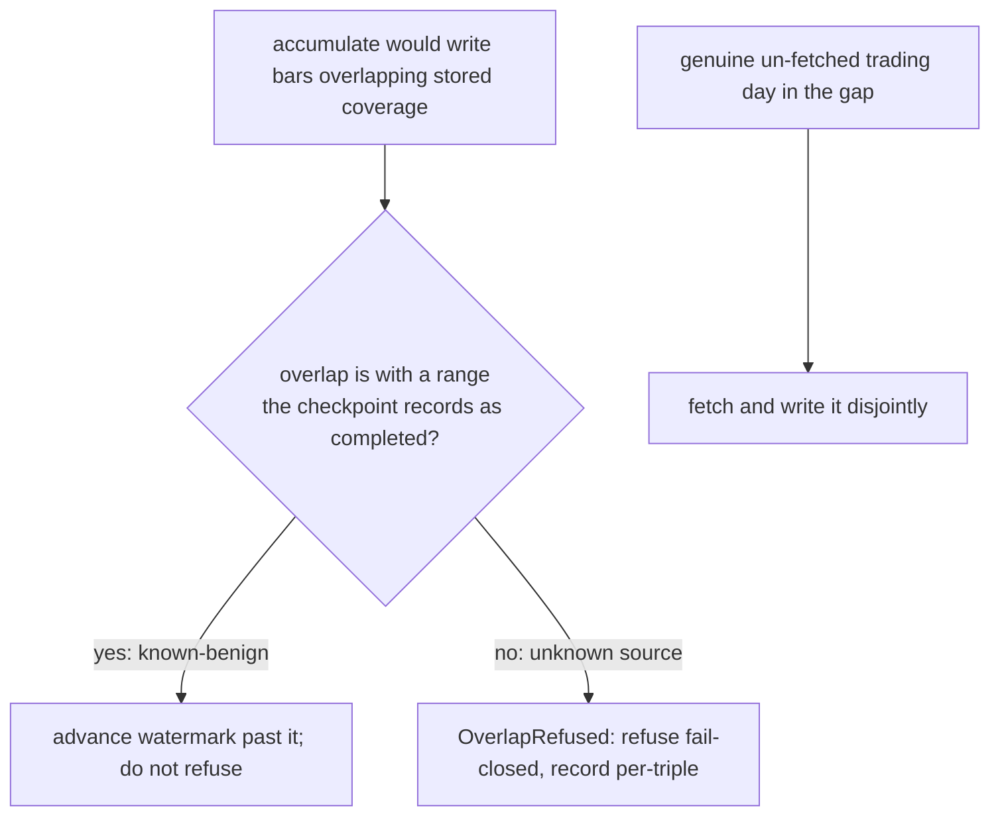

# Nautilus Re-ingest Follow-ups Hardening (#102/#103/#104) - Plan

## Goal Capsule

- **Objective:** Close the three operator-facing residuals PR #101 (squash `8150a2a`) left open in the nautilus re-ingest write-side — the holiday-cluster stall (#102), the every-run backward-widen warning noise and its per-triple cost (#103), and the silent-success on refusal (#104) — without introducing a trading-day calendar and without touching the heal state machine.
- **Product authority:** The Product Contract below. It builds on `docs/plans/2026-07-05-001-feat-nautilus-reingest-overlap-write-hardening-plan.md` (the work that created these follow-ups) and stays inside its Scope Boundaries.
- **Authority hierarchy:** Product Contract for WHAT; planning (added later, in place) for HOW; repo conventions (`AGENTS.md`, `docs/solutions/`) override implementation details on conflict.
- **Open blockers:** None. All three fixes are offline — no gateway, no KRX-open dependency.
- **Product Contract preservation:** unchanged. The two former Deferred-to-Planning questions are resolved into KTD-1 (the #102 seam) and KTD-2 (the #103 marker shape); the Outstanding Questions section is removed.

---

## Product Contract

### Summary

Make a legacy multi-range checkpoint separated only by non-trading gaps migrate and accumulate to a stable state by trusting its own recorded `completed` coverage instead of re-fetching a range it already holds — no calendar. Quiet the backward-widen warning to once-per-triple-per-floor with a persisted history-floor marker that also removes the per-triple interval read in steady state. Make refusals visible: `heal_daily` catches an overlap refusal per-triple instead of aborting the run, and `ls-ingest` exits nonzero when any genuine refusal vec is non-empty while backward-widen warnings stay informational.

### Problem Frame

The three items share one surface — the operator's experience of a re-ingest run — from three angles.

**#102 (stall).** The `completed`→`watermarks` migration chains ranges only while `weekday_strictly_between` finds no Mon–Fri in the gap (`checkpoint.rs:65-83`). There is no holiday calendar, so a KRX holiday cluster (Seollal/Chuseok) straddled by two range-mode runs reads as a real coverage hole: the chain breaks, the watermark derives only up to the first range, and the ranges beyond stay as remainder. The next accumulate fetches forward from that low watermark, re-fetches dates the second range already stores, and `append_bars_checked` refuses the overlapping write (`mod.rs:1582-1609`). The triple's watermark never advances, so every subsequent run repeats the refusal — a permanent stall the operator can only clear by wiping and re-pulling. This is the residual most likely to bite next, because migration is prefix-only by design.

**#103 (noise + cost).** The backward-widen no-op warning fires whenever the configured floor precedes the earliest stored coverage and a watermark exists (`mod.rs:1093-1124`). For a late-listed symbol the floor *always* precedes its listing date, so the warning fires every single run forever — correct the first time, pure noise thereafter. No floor history is persisted (`checkpoint.rs:815-828`), and the check pays a per-triple `stored_bar_intervals` parquet-filename read (`mod.rs:1550-1571`) on every run.

**#104 (invisible refusal).** `heal_daily`'s re-pull append uses a bare `?` (`mod.rs:1443-1449`), so an `OverlapRefused` there propagates as a fatal error that aborts the whole accumulate run — unlike the accumulate append path, which already catches it per-triple (`mod.rs:1208-1216`). And `ls-ingest` keys its exit code solely on `run()`'s `Result` (`ls-ingest.rs:39-50`): the four refusal/warning vecs are printed but never change the exit status, so a run that stalled N triples still exits `SUCCESS` and CI never notices.

### Key Decisions

- **Trust recorded coverage, not a calendar.** #102 is fixed by recognizing that an accumulate write overlapping a range the checkpoint already records as `completed` is known-benign — advance the watermark past it rather than refuse — so the stall never forms. The checkpoint already knows the far range exists; no external or data-derived holiday oracle is needed. This is strictly narrower than classifying the gap and cannot rot the way a static calendar would.
- **Never skip a genuine hole to fix the stall.** The current conservatism exists because advancing past un-fetched trading data is the silent gap R2 of the prior plan forbids. The fix preserves that: trading days genuinely un-fetched in the gap are still fetched and written; only overlap with recorded `completed` coverage is treated as benign.
- **Refusal and warning are separate axes.** A refusal means a triple stalled and an operator must act; a backward-widen warning means everything worked and there is simply no earlier history to reach. The exit code tracks refusals only, so late-listed symbols never redden CI and "did the run succeed?" does not depend on #103.
- **#102 removes benign refusals; #104 makes the rest loud.** Once known-completed-range overlaps become advance-not-refuse, the `OverlapRefused` cases that survive to trip the exit code are genuinely unknown overlaps — real corruption signal, correctly loud.
- **The calendar is deferred, not rejected forever.** A KRX trading-day calendar (static or cross-symbol data-derived) remains a possible future primitive; nothing here forecloses it. It is simply not needed to close these three items.

Where the #102 fix intercepts the stall:



### Requirements

**Coverage-trust stall fix (#102)**

- R1. A legacy checkpoint whose `completed` ranges are separated only by un-attested non-trading gaps migrates and accumulates to a stable state — no per-triple `OverlapRefused` stall and no operator wipe — by trusting the checkpoint's recorded `completed` coverage instead of re-fetching and rewriting a range it already records.
- R2. A genuinely un-fetched trading day inside an inter-range gap is still fetched and written; only overlap with a range the checkpoint already records as `completed` is treated as benign and skipped.
- R3. No external or static holiday/trading-day calendar is introduced; the fix relies only on state the checkpoint already holds.

**Backward-widen noise and cost (#103)**

- R4. The backward-widen no-op warning fires at most once per triple per configured floor: the first run whose floor drops below established coverage warns, and subsequent runs at that-or-higher floor stay silent.
- R5. A configured floor deeper than the previously recorded one re-warns — genuinely new information is never suppressed.
- R6. Once a triple's history floor is established, the per-triple `stored_bar_intervals` read performed solely for the backward-widen check is skipped on subsequent runs.

**Refusal visibility (#104)**

- R7. `heal_daily` catches an `OverlapRefused` from its re-pull append per-triple, routes it to a refusal vec, and lets the run continue; it no longer propagates as a fatal error that aborts the accumulate run.
- R8. `ls-ingest` exits nonzero when any genuine refusal vec (range, heal, or append overlap refusals) is non-empty.
- R9. Backward-widen warnings never affect the exit code — they stay informational regardless of count.

### Acceptance Examples

- AE1. **Covers R1, R2, R3.** Given a legacy checkpoint with two `completed` ranges separated only by a holiday cluster (no weekday attested between them), when it is migrated and accumulate runs, then no `OverlapRefused` fires, the watermark advances past the far range, and no calendar is consulted. Given the same shape but with one genuine trading day in the gap, when accumulate runs, then that day is fetched and written and only the recorded-`completed` overlap is skipped.
- AE2. **Covers R4, R5, R6.** Given a late-listed symbol whose configured floor precedes its earliest stored coverage, when accumulate runs, then run 1 warns once; run 2 at the same-or-higher floor is silent and performs no `stored_bar_intervals` read for the backward-widen check; run 3 at a deeper floor warns again.
- AE3. **Covers R7, R8, R9.** Given a heal re-pull that hits `OverlapRefused`, when `heal_daily` runs, then the refusal is recorded, the run continues, and `ls-ingest` exits nonzero. Given a run with backward-widen warnings and no refusals, when it completes, then `ls-ingest` exits zero.

### Scope Boundaries

- KRX trading-day / holiday calendar (static file or cross-symbol data-derived) and any preemptive holiday classification — deferred; #102 is solved without it.
- The U1 overlap tripwire's fail-closed default for genuinely-unknown overlaps — unchanged; only overlap with a recorded `completed` range becomes benign.
- The heal state-machine arms (mark-before-wipe, `Refused`/`Incomplete`/`Healed`) and `rebase_events` handling — untouched.
- Range mode as the default ingest mode — not revisited here.

### Dependencies / Assumptions

- The checkpoint's `completed` set faithfully records stored parquet coverage — the premise that makes "trust recorded coverage" safe. This is the same trust `prune_below_watermarks` and the prior migration already rely on.
- The floor-history marker (#103) is new persisted checkpoint state; it rides the existing save path and must be idempotent across reloads.
- All three fixes are exercisable offline with wiremock-free accumulate/heal fixtures; no test hits the LS gateway or depends on the real catalog.

### Sources / Research

- `docs/plans/2026-07-05-001-feat-nautilus-reingest-overlap-write-hardening-plan.md` — the package that created these follow-ups; its KTD-1/KTD-3/KTD-6 and Scope Boundaries define what stays untouched.
- `adapters/nautilus/src/ingest/checkpoint.rs:65-83` — `weekday_strictly_between`, the calendar-blind hole test; `checkpoint.rs:388-465` — prefix-only migration chain and the break that leaves remainder ranges; `checkpoint.rs:815-828` — `BackwardWidenWarning` (no floor history persisted).
- `adapters/nautilus/src/ingest/mod.rs:1582-1609` — `append_bars_checked` inclusive-bounds overlap refusal; `mod.rs:1093-1124` — backward-widen warning emit; `mod.rs:1550-1571` — per-triple `stored_bar_intervals` cost; `mod.rs:1208-1216` — accumulate append path already catching `OverlapRefused` (the model heal should mirror); `mod.rs:1443-1449` — heal re-pull bare `?`.
- `adapters/nautilus/src/bin/ls-ingest.rs:39-50` — exit code keyed only on `run()`'s `Result`; `ls-ingest.rs:144-183` — the four refusal/warning vecs printed but never affecting exit status.
- `adapters/nautilus/src/error.rs:85-106` — the `OverlapRefused` error variant.

---

## Planning Contract

### Key Technical Decisions

- KTD-1. **#102: trim the accumulate fetch against recorded `completed` coverage above the watermark, using the checkpoint (in-memory), not parquet.** The migration keeps the far ranges in `completed` (`checkpoint.rs:447,470`) and `prune_below_watermarks` removes only ranges with `edate <= watermark` (`checkpoint.rs:359-386`), so a range above the prefix watermark survives and the checkpoint is a faithful in-memory record of covered coverage above the watermark. Add a `Checkpoint` accessor that returns the `completed` intervals for a triple whose `edate` exceeds a given watermark (parsed, sorted, merged). In `run_accumulate`'s append branch, subtract those covered spans from the fetch window `[watermark+1, last_closed]` and fetch/append only the un-covered sub-ranges — each disjoint from stored coverage, so `append_bars_checked` passes without refusing. When nothing sits above the watermark (steady state) the subtraction yields the single segment `[watermark+1, last_closed]`, identical to today. Process sub-ranges in date order, and the first `PaperThin` (page-cap truncated) sub-range **halts the loop**: no higher-dated sub-range is fetched or written, and no covered far span above the `PaperThin` sub-range is skipped-over, so the watermark pins before it. This halt is load-bearing — writing a higher disjoint sub-range above a low-pinned watermark would orphan those bars (parquet-present but never recorded in `completed`, since accumulate only calls `set_watermark`), and the next run would re-derive that range from the un-advanced watermark and hit `OverlapRefused`, re-creating the stall this fix removes. When no sub-range is `PaperThin`, advance the watermark to `max(last_closed, highest covered edate)` so the now-contiguous coverage is fully attested and the next run does not re-overlap a far range. The gap's genuine trading days fall in an un-covered sub-range and are fetched and written (R2); the far range is never re-fetched, so no adjustment-shift masking arises (R3, no calendar). The existing `OverlapRefused` arm at `mod.rs:1208-1216` stays as a fail-closed net for any overlap the trim did not anticipate. *Rejected alternative:* fetch the whole window and drop bars falling inside covered spans — a smaller diff, but it re-fetches the far range and would silently drop a re-fetched bar that diverged from stored (a shift in a watermark-disconnected far range), so it trades a correctness edge for a smaller change; trim avoids both.
- KTD-2. **#103: persist a per-triple `history_floors` marker on `Checkpoint` and gate both the warning and the interval read on it.** Add `history_floors: BTreeMap<String, String>` (keyed by `watermark_key`, `#[serde(default)]` for legacy loads) plus `history_floor`/`set_history_floor` accessors. In the `run_accumulate` backward-widen block (`mod.rs:1093-1124`), compute `needs_check = wm.is_some() && (history_floor is None || lookback_floor < recorded_floor)`. Only when `needs_check` is the `stored_bar_intervals` read performed; if the floor then precedes `earliest_stored`, warn, push the `BackwardWidenWarning`, and record `history_floor = lookback_floor`. A subsequent run at the same-or-higher floor has `needs_check == false` → no read, no warning (R4, R6). A deeper floor makes `lookback_floor < recorded_floor` → read + warn again, marker updated (R5). #102's trim reads the checkpoint, not `stored_bar_intervals`, so the two never contend for that read.
- KTD-3. **#104: catch the heal overlap per-triple and derive the exit code from the genuine refusal vecs.** Add `HealOutcome::AppendRefused(AppendRefusal)`; in `heal_daily` change the re-pull append (`mod.rs:1448`) from a bare `?` to match `Err(AdapterError::OverlapRefused { attempted, stored, .. })` and return the new variant, letting every other error still propagate via `?`. At the heal call site (`mod.rs:1158-1174`) add an arm routing `AppendRefused(r)` into `append_refusals` so the run continues. For the exit code, extract a pure `exit_code_for(&CoverageReport) -> u8` helper (0 when all of `range_refusals`/`heal_refusals`/`append_refusals` are empty; a distinct nonzero — `2`, to stay separate from the hard-error `1` that `run()`'s `Err` path already returns — when any is non-empty), have `run()` return the `CoverageReport`, and map it in `main`. `backward_widen_warnings` is never consulted (R9). Probe mode returns exit `0`.

### High-Level Technical Design

The #102 fetch trim (KTD-1), replacing the single-window fetch in `run_accumulate`'s append branch:

```mermaid
flowchart TB
  S[append branch: start = watermark+1] --> C{checkpoint completed ranges<br/>with edate > watermark?}
  C -->|none — steady state| ONE["fetch [start, last_closed] (unchanged)"]
  C -->|one or more covered spans| SUB[subtract covered spans from<br/>[start, last_closed] → un-covered sub-ranges]
  SUB --> EACH[fetch + append_bars_checked each sub-range<br/>each disjoint → passes]
  ONE --> ADV
  EACH --> ADV["advance watermark to max(last_closed, highest covered edate)<br/>unless a sub-range was PaperThin"]
```

### Assumptions

- The checkpoint's `completed` set faithfully mirrors stored parquet coverage — the premise KTD-1's in-memory trim relies on. `append_bars_checked` remains the fail-closed backstop if the two ever disagree, so a stale `completed` entry degrades to a loud refusal, never a silent overwrite.
- A late-listed symbol's `earliest_stored` is stable across runs (accumulate never fetches below the watermark, and #102's trim fills only gaps *between* existing coverage, never below the earliest), so keying the #103 marker on the warned floor is sound.
- The stall this closes is a one-time event per legacy multi-range checkpoint: after the first post-fix accumulate the watermark reaches `max(last_closed, highest covered edate)` and `prune_below_watermarks` clears the now-below remainder ranges, so subsequent runs are steady-state single-segment fetches.

### Sequencing

U1, U2, and U3 are small and mutually independent. U4 (the #102 trim) is the core change and is independent of the other three. Land all four in one PR — they close a single follow-up set and share the offline test fixtures. No dependency ordering is forced; U4 carries the most risk to the proven accumulate loop and should be built test-first.

---

## Implementation Units

### U1. Heal catches OverlapRefused per-triple

- **Goal:** A `heal_daily` re-pull that hits an interval-overlap refusal is recorded per-triple and the run continues, instead of aborting via a propagated fatal error.
- **Requirements:** R7.
- **Dependencies:** none.
- **Files:** `adapters/nautilus/src/ingest/mod.rs`, `adapters/nautilus/tests/ingest.rs`.
- **Approach:** Add `HealOutcome::AppendRefused(AppendRefusal)`. In `heal_daily` (`mod.rs:1448`) match `Err(AdapterError::OverlapRefused { attempted, stored, .. })` from the re-pull append and return the new variant with the instrument/bar_type/attempted/stored filled; all other errors keep propagating via `?`. At the heal call site (`mod.rs:1158-1174`) add `HealOutcome::AppendRefused(r) => append_refusals.push(r)` so the run continues.
- **Execution note:** Start from a failing test that forces an overlap on the heal re-pull (stage disjoint stored coverage that the wipe does not clear in the fixture) and asserts the run continues.
- **Test scenarios:**
  - Happy path: an existing heal test (`ae1_shift_detected_healed_recorded`) stays green — a normal wipe-then-re-pull still returns `Healed` and does not hit the new arm.
  - Covers AE3 (heal half). Error path: a heal whose re-pull append overlaps stored coverage returns `AppendRefused`, the refusal lands in `append_refusals`, the run completes over the remaining triples, and the symbol's watermark is unchanged.
  - A non-overlap error from the re-pull append still propagates as a run-fatal `Err` (the new arm is scoped to `OverlapRefused` only).
- **Verification:** The overlap-in-heal scenario records a refusal and the run finishes; no heal path returns a bare propagated `OverlapRefused`.

### U2. ls-ingest exit code reflects genuine refusals

- **Goal:** `ls-ingest` exits nonzero when any triple was refused, and stays zero when only backward-widen warnings are present.
- **Requirements:** R8, R9.
- **Dependencies:** none.
- **Files:** `adapters/nautilus/src/bin/ls-ingest.rs`.
- **Approach:** Extract a pure `exit_code_for(report: &CoverageReport) -> u8` (returns `0` when `range_refusals`, `heal_refusals`, and `append_refusals` are all empty; `2` when any is non-empty — distinct from the `1` the `Err` path already returns; never reads `backward_widen_warnings`). Have `run()` return the `CoverageReport` (probe mode returns a zero-refusal disposition) and map it in `main` to `ExitCode::from(code)`, keeping the existing `Err(e) => FAILURE` arm.
- **Test scenarios:**
  - `exit_code_for` returns `0` for an empty report and for a report carrying only `backward_widen_warnings` (R9).
  - Covers AE3 (exit half). Returns nonzero for a report with a non-empty `append_refusals`, `heal_refusals`, or `range_refusals` (each independently).
- **Verification:** Unit tests on `exit_code_for` cover the warning-only-zero and each-refusal-nonzero cases; the printed refusal lines are unchanged.

### U3. Backward-widen history-floor marker

- **Goal:** The backward-widen warning fires at most once per triple per floor, and the per-triple interval read for that check is skipped once established.
- **Requirements:** R4, R5, R6.
- **Dependencies:** none.
- **Files:** `adapters/nautilus/src/ingest/checkpoint.rs`, `adapters/nautilus/src/ingest/mod.rs`, `adapters/nautilus/tests/ingest.rs`.
- **Approach:** Add `history_floors: BTreeMap<String, String>` to `Checkpoint` (`#[serde(default)]`) with `history_floor`/`set_history_floor` accessors keyed by `watermark_key`. In the `run_accumulate` backward-widen block (`mod.rs:1093-1124`), gate the `stored_bar_intervals` read and warning on `needs_check = wm.is_some() && (history_floor is None || lookback_floor < recorded_floor)`; on a fired warning, record `set_history_floor(lookback_floor)`. Persistence rides the existing per-triple `save`.
- **Test scenarios:**
  - Covers AE2. Late-listed fixture (floor precedes earliest coverage): run 1 warns once and records the marker; run 2 at the same floor produces no warning and performs no `stored_bar_intervals` read for the check (assert both — e.g., via a fixture that would error if the parquet-interval read ran).
  - A deeper floor on a later run re-warns and updates the marker (R5).
  - Floor within existing coverage: no warning, no marker recorded.
  - Legacy checkpoint with no `history_floors` field loads with an empty map and behaves as first-seen.
  - Marker round-trips through save/load (byte-identical double-save preserved).
- **Verification:** Warning fires once per floor; the interval read is provably skipped on the established repeat run; determinism tests stay green.

### U4. Accumulate fetch trim against recorded coverage

- **Goal:** A legacy multi-range checkpoint separated only by non-trading gaps accumulates to a stable state with no per-triple overlap stall, without a calendar and without skipping a genuine trading-day hole.
- **Requirements:** R1, R2, R3.
- **Dependencies:** none.
- **Files:** `adapters/nautilus/src/ingest/checkpoint.rs`, `adapters/nautilus/src/ingest/mod.rs`, `adapters/nautilus/tests/ingest.rs`.
- **Approach:** KTD-1. Add a `Checkpoint` accessor returning the `completed` intervals for a triple whose `edate` exceeds a passed watermark (parsed to date pairs, sorted, adjacent/overlapping merged). In `run_accumulate`'s append branch (`mod.rs:1177-1242`), when that accessor returns covered spans, subtract them from `[start, last_closed]` and run the existing fetch → `TripleOutcome` → `append_bars_checked` logic per resulting un-covered sub-range; when it returns nothing, run the single-segment path unchanged. Process sub-ranges in date order; the first `PaperThin` sub-range halts the loop (no higher-dated sub-range fetched or written, no covered far span above it skipped-over) and pins the watermark before it, so no disjoint coverage is written above a pinned watermark. When no sub-range is `PaperThin`, advance the watermark to `max(last_closed, highest covered edate)`. Leave `detect_shift`, the heal-vs-append decision, and the `OverlapRefused` net arm unchanged.
- **Execution note:** Build test-first — add a legacy-multi-range accumulate fixture that reproduces the stall on current code (overlap refusal, watermark stuck) before changing the loop; the new behavior flips it green.
- **Test scenarios:**
  - Covers AE1 (holiday half). Legacy checkpoint with a prefix watermark and one `completed` far range separated by a non-trading gap: accumulate writes no overlapping file, records no `append_refusal`, and advances the watermark to `max(last_closed, far edate)` — the prior code's stall fixture now passes.
  - Covers AE1 (real-hole half). Same shape but with a genuine trading day in the gap: that day is fetched and written (the un-covered sub-range), the far range is not re-fetched, and coverage becomes contiguous.
  - Steady state: a single contiguous coverage block ending at the watermark yields exactly one fetch of `[watermark+1, last_closed]` — behavior identical to pre-change (assert one fetch / unchanged bar content).
  - Multiple covered spans above the watermark subtract to multiple un-covered sub-ranges, each fetched and appended disjointly.
  - A `PaperThin` outcome in a sub-range pins the watermark before that sub-range (no advance past un-fetched history).
  - `PaperThin` in an *earlier* sub-range halts the loop: a later disjoint sub-range and the covered far span above it are left un-fetched and un-written, and a subsequent run does not `OverlapRefuse` (no orphaned bars above the pinned watermark).
  - `last_closed` at or below the far range's `edate`: the watermark still advances to the far `edate`, so the next run does not re-overlap the far range.
  - The trim consults only the checkpoint — no `stored_bar_intervals` (parquet) read is issued for the trim itself.
- **Verification:** The legacy-multi-range stall fixture flips from overlap-refused-and-stuck to stable-and-advanced; steady-state fetch count and bar content are unchanged; failure inversion — a bug that skips the gap fetch surfaces as a missing-bar assertion, not a silent gap.

---

## Verification Contract

| Check | Command | Proves |
|---|---|---|
| Full offline gate | `cd adapters/nautilus && cargo test --workspace` | All units; `--workspace` is mandatory or the `lab` crate is skipped (cross-workspace gate blind spot) |
| Checkpoint units | `cargo test -p nautilus-ls ingest::checkpoint` | U3 marker accessors + round-trip, U4 covered-intervals accessor |
| Accumulate / heal integration | accumulate + heal fixtures in `adapters/nautilus/tests/ingest.rs` | AE1 (both halves), U1 heal-refusal-continues, U3 warn-once, U4 stall-flip and steady-state parity |

No test hits the LS gateway or depends on the real catalog; every fixture is wiremock-free.

---

## Definition of Done

- R1–R9 each traced to a green test above; AE1, AE2, and AE3 each covered by a named scenario.
- The legacy-multi-range accumulate stall fixture flips from overlap-refused-and-stuck to stable-and-advanced (U4), and steady-state fetch behavior is provably unchanged.
- A heal re-pull overlap is recorded and non-fatal; the run continues (U1).
- `exit_code_for` returns nonzero on any genuine refusal and zero on warning-only reports (U2, R8/R9).
- The backward-widen warning fires once per triple per floor and skips the interval read once established (U3); a deeper floor re-warns.
- Offline gate green: `cd adapters/nautilus && cargo test --workspace`.
- No production caller of raw `write_bars`; the three writers remain on the checked wrapper. No dead experimental paths in the diff.
