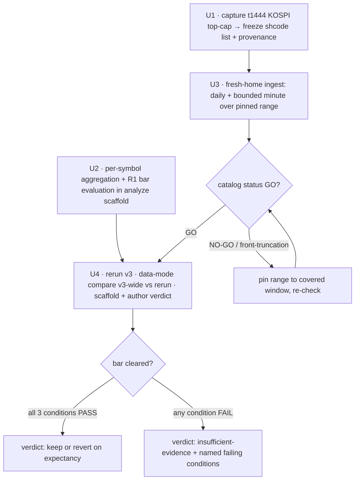

# Strategy Loop Turn 3 — Broaden Sample Data Turn - Plan

## Goal Capsule

- **Objective:** Move v3's verdict off "insufficient-evidence" by broadening the backtest sample under a decisiveness bar pre-registered *before* the run — producing a defensible keep / revert / insufficient-evidence decision on v3.
- **Product authority:** Operator (brainstorm decisions confirmed 2026-07-07).
- **Execution profile:** Attended live-gateway turn. Code units (U1 capture, U2 bar evaluation) land and are tested offline; operational units (U3 ingest, U4 rerun/verdict) run attended against the LS paper gateway with `.env.domestic` and `LS_TRADING_ENV=paper`.
- **Stop conditions:** Halt and surface if the frozen universe yields fewer than ~20 valid shcodes (U1), if `catalog status` is NO-GO after ingest (U3), or if the data-mode `runs compare` FAILs — non-reproducible output must be investigated before any verdict is authored (U4).
- **Tail ownership:** Operator runs the live legs and authors the verdict word against the computed bar; the bar is never adjusted to the result (R3).
- **Open blockers:** none. One item resolves at execution time — the exact date range, pinned once `catalog status` reports minute-bar availability (OQ1).
- **Product Contract preservation:** R1(c) and R2 clarified to match resolved mechanisms — R2 names the market-cap rule (KTD-1), and R1(c) defines dominance as an absolute-P&L-magnitude share so the guard is well-defined under mixed signs. Both are pre-run definitional tightenings, not post-hoc bar changes (R3 holds). OQ1 (symbol-selection source) resolved in KTD-1; OQ3 (command wiring) resolved across Implementation Units.

---

## Product Contract

### Summary

Run turn 3 as a **pure data turn**: hold all v3 params (the gap filter stays at `gap_min_pct = 0.6`), broaden the ingest to a rule-pinned cross-section of ~20–30 liquid symbols over ~25–30 sessions into a fresh data home, rerun, and render a verdict on v3 against a bar frozen before the run. The param turn below 0.6 is a separate later turn.

### Problem Frame

v3 (`gap_min_pct = 0.6`) is the first floor that admits a fill: one symbol (`005930.XKRX`) on a +0.87% session gap, over a 12-session pinned range, `num_trades = 1`, +379,500 KRW. One realized trade is not an expectancy — win-rate, drawdown, and Sharpe are undefined at n=1, so the turn-2 verdict was "insufficient-evidence." The binding constraint is evidence, not the param value: tuning any param against a 1-trade sample fits noise and cannot change the verdict *class*. Broadening the sample is the only move that structurally changes the evidence. And because `runs compare` is only a structural PASS/FAIL with no coded sample-size threshold, "insufficient-evidence" is a human analyst call — so the verdict is defensible only if the decisiveness bar is pre-registered before the results are seen.

### Key Decisions

- **Turn 3 is a pure data turn (all v3 params held).** Lowering `gap_min_pct` below 0.6 would loosen the filter and admit more symbols — which both changes strategy behavior *and* bumps trade count, confounding "does v3 have edge?" with "does loosening the filter help?" Holding params isolates the edge question. The param turn is deferred (see Scope Boundaries).
- **Breadth+activity bar over a raw trade count or an effect-size test.** The live failure mode is one hot symbol carrying the verdict, so the bar demands spread, not just volume. An effect-size / CI-excludes-zero bar would almost never clear at the ~30–50 trades a bounded paper loop can produce for a daily-gap strategy — it would hard-wire "insufficient-evidence" and defeat the loop's purpose of producing a decision. Expectancy and Sharpe stay reported context, not the gate.
- **Both wider and deeper in one turn.** Front-loads the bounded minute ingest for a robust one-shot baseline rather than a wide-only turn that risks under-producing trades.
- **Fresh data home.** Gives a clean fingerprint / `universe_hash` baseline and side-steps the open write-side overlap residual (the write path still accumulates overlapping parquet files on each re-widen; read-side dedup only masks it for reads). Costs a full re-pull.
- **Verdict rests on analysis-vs-bar; `runs compare` is a within-home reproducibility check.** `runs compare` works over a single data home, so it runs inside the fresh home (v3-wide vs a v3-wide rerun) to confirm the run is genuinely v3, reproducible, and unchanged — not a narrow-vs-wide P&L A/B, which is meaningless against a 1-trade baseline. The decisive keep/revert/insufficient-evidence call comes from the analysis measured against R1.

### Requirements

**Pre-registration (defensibility)**

- R1. The decisiveness bar is fixed in this plan before the run. A keep or revert verdict on v3 requires **all three** to hold: (a) ≥30 total realized trades; (b) ≥6 distinct symbols, each with ≥2 trades; (c) no single symbol accounts for more than 40% of aggregate P&L magnitude, computed as `max(|per-symbol realized P&L|) / sum(|per-symbol realized P&L|)` so the dominance guard is well-defined under mixed-sign P&L. If any condition fails, the verdict is insufficient-evidence and the analysis names the failing condition(s).
- R2. The symbol universe is ~20–30 liquid names selected by a market-cap ranking rule (KOSPI top-N by market cap; turnover rejected in KTD-1 because `t1463` is not date-parameterized) as of a pre-registered as-of date, with the resolved list frozen in this plan before the run.
- R3. The bar (R1), symbol list (R2), as-of date, and date range are all fixed before running and are not adjusted after results are seen.

**Sample broadening**

- R4. History depth is ~25–30 trading sessions, bounded by minute-bar availability on LS paper; front-truncation is surfaced by `catalog status` and caps the achievable depth.
- R5. Ingest into a fresh data home, not the turn-2b catalog.

**Turn execution and verdict**

- R6. Hold all v3 params unchanged (`gap_min_pct` 0.6, `universe_top_n` 20, and the rest) — zero param diff, no strategy-behavior change this turn.
- R7. Rerun the backtest over the widened sample and render keep / revert / insufficient-evidence in the analysis, evaluated against R1.
- R8. Run `runs compare` in data-mode within the fresh data home (v3-wide vs a v3-wide rerun) to confirm zero param diff, code equality, and reproducibility. The decisive verdict rests on R7, not on this compare.

### Acceptance Examples

**Covers R1, R7.**

- AE1. **Bar cleared.** Given the wide run yields 42 trades across 9 symbols (each ≥2) with a max single-symbol P&L share of 31% → all three conditions hold → verdict is eligible to be keep or revert on expectancy.
- AE2. **Trade floor missed.** Given 24 total trades → verdict is insufficient-evidence; analysis reports "trade-count floor not met (24 < 30)."
- AE3. **Breadth floor missed.** Given 33 trades but only 5 symbols with ≥2 trades → insufficient-evidence; analysis reports "symbol-breadth floor not met (5 < 6)."
- AE4. **Dominance guard tripped.** Given 35 trades across 7 symbols but `005930` alone accounts for 58% of aggregate P&L magnitude (`|its realized P&L|` ÷ `Σ|per-symbol realized P&L|`) → insufficient-evidence; analysis reports "single-symbol dominance (58% > 40%)."

### Success Criteria

- The turn produces a keep / revert / insufficient-evidence verdict traceable to the pre-registered bar (R1), not to post-hoc reasoning.
- The data-mode `runs compare` passes structurally with the universe-delta explanation recorded.
- Positive P&L is explicitly **not** a success criterion — the product is a defensible decision.

### Scope Boundaries

**Deferred for later**

- The param turn below 0.6 — lowering `gap_min_pct` from 0.6 toward ~0.3, a governed relative-change step within the pinned `PROPOSAL_BOUNDS_CAP = 0.5` — runs only after v3 has a decisive baseline.
- History beyond ~30 sessions and larger symbol universes.

**Outside this turn's identity**

- Any strategy-param change this turn (turn 3 holds v3 exactly).
- Fixing the write-side overlap residual — the fresh data home avoids it; it does not fix it.
- Chasing positive P&L.

### Dependencies / Assumptions

- Live LS paper credentials at `.env.domestic` (repo root); `LS_TRADING_ENV=paper`.
- Ingest breadth is driven by `LS_INGEST_SYMBOLS` / `LS_INGEST_SDATE` / `LS_INGEST_EDATE` / `LS_INGEST_LOOKBACK`; minute ingestion must stay bounded (symbol set and/or range).
- **Assumption:** LS paper serves minute bars back ~25–30 sessions. If it truncates earlier, depth is capped at what `catalog status` reports, and the ≥30-trade floor leans on the symbol axis (more names) rather than more history.
- Re-ingest is dedup-safe on reads (turn-2b fix); the fresh data home avoids the write-side overlap residual entirely.

### Outstanding Questions

**Resolve at execution time**

- OQ1. **Exact date range.** Pin the ~25–30 sessions once `catalog status` reports minute-bar availability with no front-truncation (R4, U3).

Resolved during planning: symbol-selection mechanism → KTD-1; ingest/run/verdict command wiring → Implementation Units U1–U4.

### Sources / Research

- `adapters/nautilus/lab/src/runner/research.rs` — `compare()` modes (param vs data), `PROPOSAL_BOUNDS_CAP = 0.5`, `VERDICT_WORDS`, single-`LS_DATA_HOME` resolution.
- `adapters/nautilus/lab/src/params.rs` — `gap_min_pct` (the floor filter), `universe_top_n` default 20.
- `adapters/nautilus/lab/src/runner/backtest.rs` — `build_candidates` / turnover-ranked scanned universe.
- `adapters/nautilus/src/bin/ls-ingest.rs` — ingest env vars.
- `docs/solutions/logic-errors/re-ingesting-an-overlapping-range-duplicates-catalog-bars.md` — the open write-side overlap residual.
- `adapters/nautilus/data/runs/20260704T120158Z-backtest-orb-v3/analysis.md` — v3 n=1 sample (local run output).
- Prior plans: `docs/plans/2026-07-04-002-feat-lab-research-cli-turn-2-plan.md`, `docs/plans/2026-07-05-001-feat-nautilus-reingest-overlap-write-hardening-plan.md`.

---

## Planning Contract

### Key Technical Decisions

- KTD-1. **Pin the liquid universe from a frozen `t1444` (KOSPI top-market-cap) capture.** No repo mechanism selects a liquid subset today: the adapter ingests the whole domestic-equity master (t8430/t9945, `adapters/nautilus/src/instruments.rs`), and `universe_top_n` only re-ranks bars already ingested (`adapters/nautilus/lab/src/strategy/orb.rs` `select_universe`) — so it cannot *discover* a liquid set, only trim one. Capture the KOSPI top-~30 by market cap once via the SDK's typed `T1444Request` (`crates/ls-sdk/src/paginated/breadth_board.rs`), freeze the shcodes into a committed file with provenance, and feed them to ingest via `LS_INGEST_SYMBOLS`. **Market cap over turnover (`t1463`):** market-cap ranking is stable across the backtest window (lower look-ahead) and `t1463` is not date-parameterized. **In-platform capture over a hand-frozen external list:** it stays reproducible in our own tooling. Accepted caveats: `t1444` is `recommended:false` (a one-time capture, not a promotion), and selecting by *current* market cap for a *past* window is a mild look-ahead — disclosed in the frozen file's provenance and acceptable for a first decisive read.
- KTD-2. **Make the decisiveness bar machine-checkable by folding the per-trade ledger by symbol.** Today only `num_trades`/`pnl_total` are emitted in `performance.summary`; the R1 breadth and dominance clauses need per-symbol trade counts and per-symbol P&L share. Those are derivable from `performance.json` `trades[]` (each `TradeRecord` carries `symbol` and `realized_pnl`, `adapters/nautilus/lab/src/artifacts/performance.rs`) but are never aggregated. Add a pure aggregation that groups trades by symbol, evaluates R1's three conditions, and emits the per-symbol breakdown + per-condition PASS/FAIL into the `analyze --scaffold` output so the verdict is authored against a computed bar rather than eyeballed. The verdict word stays hand-authored (no coded verdict — consistent with the loop's design).
- KTD-3. **The reproducibility compare proves determinism; a separate assertion proves v3-identity.** `runs compare` resolves both runs from a single `LS_DATA_HOME`, so the fresh-home run cannot compare against the turn-2b v3-narrow baseline. Run data-mode `runs compare` within the fresh home (v3-wide vs an identical v3-wide rerun): identical inputs yield equal `catalog_fingerprint`/`data_range`/`universe_hash`, so data-mode passes with "no data deltas" — proving determinism (run A ≡ run B) and code-hash equality. It does **not** prove the params equal v3 — the compare only checks A and B agree with each other. v3-identity is a separate gate: assert the run manifest carries `gap_min_pct = 0.6` and `strategy_version = 3` (see KTD-5). The decisive verdict rests on the bar (KTD-2), not this compare.
- KTD-4. **Fresh data home, bounded minute ingest.** Ingest the frozen universe into a new `LS_DATA_HOME` — daily over the whole range (cheap), minute bounded to the frozen symbol set over the range. `catalog status` is the go/no-go and pins the achievable range (front-truncation caps depth). The fresh home sidesteps the open write-side overlap residual entirely.
- KTD-5. **Seed v3 params into the fresh home before the rerun.** `turn()` with no override resolves params from the latest finalized run *in the same data home*; a fresh home has none, so it falls back to `OrbParams::default()` (`gap_min_pct = 3.0`, `strategy_version = 0`) — not v3. The only in-tool way to reach 0.6 in an empty home is a governed param turn that bumps the version, which R6 forbids. So before the rerun, seed v3 params into the fresh home: copy the turn-2b v3 run's `manifest.json` into the fresh home's `runs/` so `latest_finalized_run()` resolves `gap_min_pct = 0.6` / `strategy_version = 3`. Assert the resolved params before backtesting — a rerun that resolves default params is a stop condition, not a silent v0 run.

### High-Level Technical Design

The turn is a linear pipeline; the two code units (U1, U2) gate the two operational units (U3, U4).

### Sequencing

U1 and U2 are independent and can land in either order (U2 is pure and test-first). U3 depends on U1's frozen list. U4 depends on U2's bar code and U3's ingested data. Only U3 and U4 touch the live gateway.

---

## Implementation Units

### U1. Materialize and freeze the liquid symbol universe

- **Goal:** Produce a committed, provenance-stamped list of ~30 KOSPI shcodes ranked by market cap — the pinned universe.
- **Requirements:** R2, R3.
- **Dependencies:** none.
- **Files:**
  - `adapters/nautilus/src/bin/` — a small capture path (e.g. `capture-universe.rs`) calling the typed `T1444Request`, or a thin reuse of the existing credentialed smoke harness.
  - `adapters/nautilus/lab/config/turn3-universe.json` (new) — frozen shcodes + provenance (source TR `t1444`, the concrete KOSPI `upcode` value used, capture timestamp, N, and the current-market-cap look-ahead caveat).
  - test alongside the capture path.
- **Approach:** Call `T1444Request` scoped to KOSPI — resolve and pin the concrete KOSPI `upcode` value (verify it against the returned `hname`s so a wrong market isn't silently captured) — take the top-N (~30) shcodes by returned order (server-sorted by market cap), and write the frozen file. The one-time live call materializes the list; the committed file is the reproducible artifact that ingest consumes. Do not promote `t1444`.
- **Patterns to follow:** `crates/ls-sdk/src/paginated/breadth_board.rs` (T1444 request/response), the adapter's existing master-load credentialed call path (`adapters/nautilus/src/instruments.rs`), and the env-reading shape in `adapters/nautilus/src/bin/ls-ingest.rs`.
- **Execution note:** Live-gateway capture — run attended with `.env.domestic`. Prefer a runtime/smoke check that the frozen file holds ~30 valid shcodes over unit-testing the network call.
- **Test scenarios:**
  - Frozen-file validation: ≥20 shcodes, all 6-digit, de-duplicated; provenance fields (TR, upcode, timestamp, N) present. `Covers R2, R3.`
  - `Test expectation:` the live capture is smoke-verified (frozen file materializes with ~30 rows), not unit-tested.
- **Verification:** `adapters/nautilus/lab/config/turn3-universe.json` committed with ~30 shcodes + provenance; ingest driven from it is deterministic.

### U2. Per-symbol aggregation and decisiveness-bar evaluation

- **Goal:** Make R1 machine-checkable — fold `performance.trades[]` by symbol, evaluate the three conditions, and emit the breakdown + per-condition verdict into the analyze scaffold.
- **Requirements:** R1, R7.
- **Dependencies:** none (independent of U1/U3; land first).
- **Files:**
  - `adapters/nautilus/lab/src/artifacts/performance.rs` — an aggregate-by-symbol helper (count + summed `realized_pnl` per symbol, share of `pnl_total`).
  - `adapters/nautilus/lab/src/runner/research.rs` — `analyze_scaffold`: render the per-symbol table + per-condition PASS/FAIL and named failing conditions.
  - tests in the same crate.
- **Approach:** Add a pure `bar_evaluation` over a `PerformanceReport` that computes: (a) total realized trades ≥30; (b) count of symbols with ≥2 trades ≥6; (c) dominance = `max(|per-symbol realized P&L|) / sum(|per-symbol realized P&L|)` ≤40% — absolute-magnitude shares, well-defined under mixed signs (avoids the >100%/negative-share artifact a signed share-of-net would produce). Boundaries are inclusive on the pass side (exactly 30 trades passes; exactly 40.0% passes, >40% fails). Guard the degenerate all-zero-P&L case (denominator 0) by failing closed to insufficient-evidence with a note. The verdict word stays hand-authored in U4, reading this computed result.
- **Patterns to follow:** the existing `analyze_scaffold` skeleton write (`research.rs`, the `num_trades`/`pnl_total` surfacing) and `PortfolioAnalyzer` summary insertion in `performance.rs`.
- **Execution note:** Implement test-first — the logic is pure and AE1–AE4 are ready-made vectors.
- **Test scenarios:**
  - `Covers AE1.` 42 trades / 9 symbols each ≥2 / max share 31% → all three PASS.
  - `Covers AE2.` 24 trades → (a) FAIL, message "trade-count floor not met (24 < 30)".
  - `Covers AE3.` 33 trades / only 5 symbols with ≥2 trades → (b) FAIL, "symbol-breadth floor not met (5 < 6)".
  - `Covers AE4.` 35 trades / 7 symbols / one symbol 58% of aggregate P&L magnitude → (c) FAIL, "single-symbol dominance (58% > 40%)".
  - Mixed-sign: a +200k winner against −100k of losers (net +100k) → winner abs-share `200k / 300k = 67%` → (c) FAIL — confirms the metric never yields a >100% or negative share.
  - Boundary: exactly 30 trades / exactly 6 symbols with ≥2 / exactly 40.0% abs-share → all PASS.
  - Degenerate: all per-symbol realized P&L zero → denominator 0 → fail-closed insufficient-evidence with a note.
  - Empty ledger: 0 trades → all conditions FAIL.
- **Verification:** lab-crate `cargo test` green; the scaffold run against the existing v3 n=1 run reports condition (a) failing at 1 < 30.

### U3. Fresh-home ingest of the widened sample and catalog-status gate

- **Goal:** Ingest the frozen universe (daily + bounded minute) over the ~25–30 session range into a fresh `LS_DATA_HOME`, and confirm GO via `catalog status`, pinning the achievable range.
- **Requirements:** R4, R5.
- **Dependencies:** U1.
- **Files:**
  - command wiring only — optionally a make target or small script under `adapters/nautilus/` that expands `turn3-universe.json` into `LS_INGEST_SYMBOLS` and drives daily then bounded-minute ingest into a fresh home.
  - a runbook note in `adapters/nautilus/README.md` (or the lab README) capturing the fresh-home ingest recipe.
- **Approach:** Point `LS_DATA_HOME` at a new directory. Ingest daily across the whole target range first, then bounded minute for the frozen shcodes over the range. Run `lab-research catalog status` — on front-truncation, pin the range to the covered window (OQ1/R4) and re-check. Keep minute ingest bounded to the frozen symbol set.
- **Patterns to follow:** `adapters/nautilus/src/bin/ls-ingest.rs` (env vars, `LS_INGEST_SYMBOLS`, accumulate mode), the turn-2b data-turn ingest recipe (`docs/plans/2026-07-04-002-feat-lab-research-cli-turn-2-plan.md`).
- **Execution note:** Live-gateway, attended, `.env.domestic`, `LS_TRADING_ENV=paper`. Operational — verified by `catalog status`, not unit tests.
- **Test scenarios:** `Test expectation: none — operational ingest; verified by `catalog status` GO with per-(instrument, bar-kind) counts and spans covering the pinned range for the frozen universe.`
- **Verification:** `catalog status` returns GO; daily + minute present for the frozen symbols over the pinned range; no front-truncation inside the pinned range.

### U4. Rerun v3, reproducibility compare, and author the verdict

- **Goal:** Run the backtest holding v3 params in the fresh home, prove reproducibility via data-mode `runs compare`, scaffold the analysis with the U2 bar evaluation, and author the keep / revert / insufficient-evidence verdict.
- **Requirements:** R6, R7, R8.
- **Dependencies:** U2, U3.
- **Files:**
  - the turn-2b v3 run's `manifest.json` copied into the fresh home's `runs/` (param seed, KTD-5).
  - CLI invocation; the authored `analysis.md` lands in the run directory (local, gitignored data home).
  - record the turn outcome (verdict + which bar conditions held) in a committed ledger/note.
- **Approach:** First seed v3 params into the fresh home (KTD-5): copy the turn-2b v3 run's `manifest.json` into the fresh home's `runs/`, and assert `latest_finalized_run()` resolves `gap_min_pct = 0.6` / `strategy_version = 3` before running — a default-param resolution halts (stop condition). Then run `lab-research` as a rerun (no override → resolves the seeded v3 params, no version bump) over the pinned range; run a second identical rerun; `runs compare` with `LS_COMPARE_MODE=data` over the two → expect PASS "no data deltas" (determinism). Confirm the run manifest carries `gap_min_pct = 0.6` / `strategy_version = 3` (v3-identity, KTD-3). Run `analyze --scaffold`; the scaffold now prints the U2 bar evaluation. Author the verdict per R1: keep or revert only if all three conditions PASS, else insufficient-evidence naming the failing condition(s). Do not adjust the bar to the result (R3).
- **Patterns to follow:** `runs compare` data-mode env wiring (`LS_COMPARE_MODE`/`LS_COMPARE_A`/`LS_COMPARE_B`/`LS_COMPARE_EXPLANATION`, `adapters/nautilus/lab/src/runner/research.rs`), the turn-2b data-turn compare flow.
- **Execution note:** Attended live run; verdict hand-authored against the computed bar.
- **Test scenarios:** `Test expectation: none — operational; verified by data-mode compare PASS and a scaffold whose bar evaluation matches the authored verdict. The bar logic itself is unit-tested in U2.`
- **Verification:** the rerun resolves `gap_min_pct = 0.6` / `strategy_version = 3` (not defaults); data-mode `runs compare` PASS; the run manifest confirms v3 params; `analysis.md` verdict consistent with the computed bar; when the bar is not cleared, the verdict is insufficient-evidence with the failing condition(s) named.

---

## Verification Contract

| Gate | Applies to | Done signal |
|---|---|---|
| `cargo test` from `adapters/nautilus` (use `--workspace` to include the lab crate) | U1, U2 | Bar-evaluation unit tests (AE1–AE4 + boundary/degenerate/empty) green; capture-file validation green. Adapter is a standalone workspace pinned by CWD. |
| Live capture smoke (attended, `.env.domestic`, `LS_TRADING_ENV=paper`) | U1 | `turn3-universe.json` materializes with ~30 valid shcodes + provenance. |
| `lab-research catalog status` (fresh `LS_DATA_HOME`) | U3 | GO; counts/spans cover the pinned range for the frozen universe; no front-truncation inside it. |
| v3-param resolution assertion (fresh home) | U4 | Rerun resolves `gap_min_pct = 0.6` / `strategy_version = 3` from the seeded manifest — not `OrbParams::default()` (`gap_min_pct = 3.0`). |
| `lab-research runs compare` `LS_COMPARE_MODE=data` | U4 | PASS ("no data deltas") on v3-wide vs identical rerun (determinism); run manifest confirms v3 params (v3-identity). |
| `analyze --scaffold` + authored verdict | U4 | Verdict word matches the computed bar; failing conditions named when the bar is not cleared. |

---

## Definition of Done

- Frozen universe committed with provenance (U1); bar-evaluation code + tests green (U2); fresh-home ingest GO (U3); v3-wide rerun + data-mode compare PASS + authored `analysis.md` verdict (U4).
- The fresh-home rerun ran on seeded v3 params (`gap_min_pct = 0.6` / `strategy_version = 3`), asserted before backtesting — not `OrbParams::default()`.
- The verdict is traceable to the computed R1 bar and was authored without adjusting the bar to the result (R3).
- The turn outcome (verdict + which bar conditions held) is recorded.
- No param change landed; the write-side overlap residual was not touched; `t1444`/`t1463` were not promoted.
- Abandoned-attempt code (e.g. a throwaway capture path superseded by the final one) is removed from the diff.
