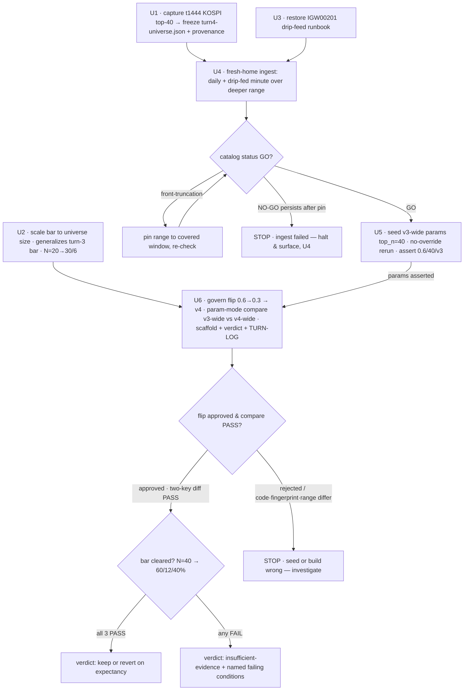

# Strategy Loop Turn 4 — Widen + Governed gap_min_pct Flip (0.6 → 0.3) - Plan

## Goal Capsule

- **Objective:** Render a decisive keep / revert / insufficient-evidence verdict on the governed `gap_min_pct 0.6 → 0.3` step (v3 → v4), measured against a decisiveness bar that is **re-registered and fixed before the run** and evaluated over a **widened** (top-40 × deeper) evidentiary sample — with the param effect isolated by a v3-wide-vs-v4-wide payoff A/B over that same sample.
- **Product authority:** Operator (two scope decisions confirmed 2026-07-07: re-register the bar by scaling to the wider sample; widen both wider and deeper).
- **Execution profile:** **Attended live turn.** U2 (scaled bar) lands and is tested offline. U1 (universe capture) and U4 (fresh-home widened ingest) hit the LS paper gateway with `.env.domestic` + `LS_TRADING_ENV=paper`; the minute ingest is drip-fed to avoid IGW00201. U5 (seed + v3-wide baseline) and U6 (governed flip + compare + verdict) run offline against the freshly-ingested home.
- **Stop conditions:** Halt and surface if the frozen universe yields fewer than ~35 valid shcodes (U1); if `catalog status` is NO-GO after ingest and range-pinning does not recover it (U4); if the seeded v3-wide rerun resolves `OrbParams::default()` instead of `gap_min_pct = 0.6` / `universe_top_n = 40` / `strategy_version = 3` (U5); if the governed flip is **rejected** rather than approved (U6 — 0.6→0.3 is on-bound and must approve; a rejection means the resolved current value is not 0.6 and the seed is wrong); or if the **param-mode** `runs compare` FAILs on `strategy_code_hash` / `catalog_fingerprint` / `data_range` inequality or a param diff beyond `{gap_min_pct, strategy_version}` (U6). **Note:** `universe_hash` is *expected* to differ — it is `gap_min_pct`'s sole causal channel (KTD-3) — and is covered by a pre-registered `LS_COMPARE_EXPLANATION`, so a universe delta is a PASS via the equal-or-explained clause, not a stop.
- **Tail ownership:** Operator runs the live legs and authors the verdict word against the computed, pre-registered bar; the bar is never adjusted to the result (R3).
- **Open blockers:** none. One item resolves at execution time — the exact deeper date range, pinned once `catalog status` reports minute-bar availability with no front-truncation (OQ1).
- **Product Contract preservation:** solo (bootstrap) plan — no upstream brainstorm to preserve. Scope was set by two operator decisions confirmed before planning: (1) re-register the bar by **scaling floors to the wider sample** rather than holding the turn-3 bar; (2) widen **both wider and deeper** rather than reusing the 28-session `data/turn3` window. Both diverge from the source prompt's minimal "same-window param turn" framing; the divergences are recorded in Scope Boundaries and Alternatives.

---

## Product Contract

### Summary

Run turn 4 as a **widened governed param turn**: capture and freeze a broader liquid universe (KOSPI top-40 by market cap), ingest it deeper (max available minute sessions) into a fresh data home, establish a **v3-wide baseline** (v3's `gap_min_pct = 0.6` over the top-40 universe), then take the governed relative-change step `gap_min_pct 0.6 → 0.3` (−50%, on the pinned `PROPOSAL_BOUNDS_CAP = 0.5` bound → approved, v3 → v4). Prove the v3-wide-vs-v4-wide payoff A/B with **param-mode** `runs compare`, and render keep / revert / insufficient-evidence against a decisiveness bar that is **re-registered before the run** by scaling the turn-3 floors to the widened universe. Record the outcome in `adapters/nautilus/lab/TURN-LOG.md`.

### Problem Frame

Turn 3 (merged) rendered v3 **insufficient-evidence at n=6**: over 20 KOSPI top-cap names × 28 sessions, the pre-registered R1 bar missed (a) trade-count (6 < 30) and (b) breadth (0 symbols with ≥2 trades < 6); (c) dominance passed (33.7%). The binding constraint is **trade volume**, and turn 3 explicitly deferred the fix: lower `gap_min_pct` from 0.6 toward ~0.3 to admit more sessions. Two operator decisions expand that deferred move:

1. **Re-register the bar (not hold it).** A wider sample produces more opportunity, so a fixed-count floor calibrated for 20 symbols is no longer the right decisiveness test. The bar is re-registered to **scale with the frozen universe size**, generalizing the turn-3 floors so they remain a proportionate spread-and-activity test. This is a pre-run definitional change (R3-clean, see KTD-2), not a post-hoc tuning.
2. **Widen both wider and deeper (not same-window).** Rather than isolate the param over the existing 28-session window, broaden the evidentiary base first — top-40 × maximum available minute sessions — so the flip is judged on a richer sample in one turn.

The confound turn 3 guarded against — mixing "does the strategy have edge?" with "does loosening the filter help?" — is avoided by construction: the widening defines the **sample for both arms**, and the decisive A/B (v3-wide vs v4-wide) holds the data constant, isolating `gap_min_pct` alone (KTD-3).

### Key Decisions

- **Widening is the sample, not a confound.** The wider+deeper ingest establishes the evidentiary base. The param A/B runs v3-wide vs v4-wide **over that same base** — identical ingested data (fingerprint), range, build (code hash), and pinned `universe_top_n` — so the only param that moves is `gap_min_pct`. Its effect is *mediated entirely through universe membership* (lowering the gap filter admits more symbols/sessions via `select_universe`), so `universe_hash` legitimately differs between the arms; that delta **is** the isolated param effect, not a confound. A v4-wide-vs-turn-3-v3-narrow comparison would confound data and param and is explicitly not the move.
- **The re-registered bar is a chosen generalization of the turn-3 bar, fixed before the run.** At the turn-3 universe size (N = 20) it reproduces (30 trades, 6 breadth-symbols, 40% dominance) exactly; it scales the two count floors linearly to the frozen `universe_top_n`. **Backward-compat at N = 20 does not by itself single out linear scaling** — a constant or sub-linear function also passes that one anchor. Linear per-symbol scaling (1.5 trades/symbol, holding turn-3's per-symbol density constant) is a *deliberately conservative* choice: it is the hardest-direction generalization (the floor grows with the sample), so it cannot be accused of being tuned to clear. Its R3 defensibility rests on **timing** (the formula and constants are fixed before any turn-4 result) plus this stated conservative rationale — not on being the unique generalization.
- **`universe_top_n` is seeded, not governed.** Trading the top-40 universe requires `universe_top_n = 40`, but 20 → 40 is a +100% relative change that **exceeds** the `PROPOSAL_BOUNDS_CAP = 0.5` bound and would be rejected by governance. So the wide universe is part of the **seeded baseline** (KTD-4), and the single governed step this turn is `gap_min_pct 0.6 → 0.3` (−50%, on-bound).
- **Fresh data home.** A clean fingerprint / `universe_hash` baseline that side-steps the open write-side overlap residual (the residual is not touched — the fresh home avoids it, per Scope Boundaries). Costs a full drip-fed re-pull.
- **Verdict rests on analysis-vs-bar; the param compare proves the A/B is clean.** `runs compare` in **param mode** asserts the exactly-two-key `{gap_min_pct, strategy_version}` diff with `strategy_code_hash` / `catalog_fingerprint` / `data_range` equal and `universe_hash` **differing-with-explanation** (the universe delta is gap_min_pct's causal channel — see KTD-3) — proving the v3-wide-vs-v4-wide payoff comparison isolates the single param. The decisive keep / revert / insufficient-evidence call comes from the analysis measured against the re-registered bar, not from the compare.
- **Restore the missing drip-feed runbook.** The `docs/solutions/…/ls-gateway-igw00201-bulk-minute-ingest-drip-feed.md` reference is dangling — the doc does not exist. Because turn 4 re-invokes the drip-feed, the recipe is restored as durable knowledge (U3).

### Requirements

**Pre-registration (defensibility)**

- R1. The decisiveness bar is **re-registered and fixed in this plan before the run**, as a function of the frozen universe size `N = universe_top_n`. A keep or revert verdict on v4 requires **all three** to hold: (a) total realized trades ≥ `round(1.5·N)`; (b) ≥ `round(0.30·N)` distinct symbols, each with ≥ 2 trades; (c) no single symbol accounts for more than 40% of aggregate P&L magnitude (`max(|per-symbol realized P&L|) / Σ|per-symbol realized P&L|`). If any condition fails, the verdict is insufficient-evidence and the analysis names the failing condition(s). At the pinned `N = 40` the concrete bar is **≥ 60 trades / ≥ 12 breadth-symbols / ≤ 40% dominance**.
- R1b. The re-registered bar reduces to the turn-3 bar at `N = 20` (→ 30 / 6 / 40%). This backward-compatibility property is asserted in code, establishing the re-registration as a generalization rather than a different bar.
- R2. The symbol universe is ~40 liquid names selected by KOSPI top-market-cap ranking (via `t1444`, mirroring turn-3 KTD-1) as of a pre-registered as-of date, with the resolved list frozen in this plan before the run.
- R3. The bar (R1), scaling constants, symbol list (R2), as-of date, `universe_top_n`, and date range are all fixed before running and are **not** adjusted after results are seen. The bar scales off the **pinned** `universe_top_n`, never the realized universe snapshot, so a run output cannot move the bar.

**Sample broadening**

- R4. Widen **both wider and deeper**: ~40 symbols and the maximum minute-bar depth LS paper serves (front-truncation, surfaced by `catalog status`, caps achievable depth — turn-3 established this at ~25–30 sessions).
- R5. Ingest into a **fresh** data home (e.g. `data/turn4`), not `data/turn3`.
- R6. The minute ingest is drip-fed (one symbol at a time with backoff) to avoid the IGW00201 rolling call-count cap; the recipe is documented (U3).

**Turn execution and verdict**

- R7. Establish a **v3-wide baseline** by seeding v3's params with `universe_top_n = 40` (`gap_min_pct = 0.6`, `strategy_version = 3`) into the fresh home and running a no-override rerun over the widened window; assert the resolved params before backtesting.
- R8. Take the governed step `gap_min_pct 0.6 → 0.3` via `lab-research turn` (`LS_TURN_PARAM=gap_min_pct LS_TURN_VALUE=0.3`); the proposal must be **approved** (on-bound) and bump v3 → v4, changing exactly `gap_min_pct` + `strategy_version`.
- R9. Run **param-mode** `runs compare` (`LS_COMPARE_MODE=param`) on v3-wide vs v4-wide with a pre-registered `LS_COMPARE_EXPLANATION` for the universe delta; expect PASS with the exactly-two-key `{gap_min_pct, strategy_version}` diff, `strategy_code_hash` / `catalog_fingerprint` / `data_range` equal, and `universe_hash` differing-with-explanation (equal-or-explained clause).
- R10. Scaffold the v4 analysis and author keep / revert / insufficient-evidence against the computed re-registered bar (R1); record the outcome in `TURN-LOG.md`.

### Acceptance Examples

**Covers R1, R1b, R8, R9.**

- AE1. **Bar cleared (N = 40).** v4-wide yields 72 trades across 16 symbols (each ≥ 2) with a max single-symbol P&L share of 28% → all three conditions hold → verdict eligible to be keep or revert on expectancy.
- AE2. **Trade floor missed (N = 40).** 51 total trades → insufficient-evidence; analysis reports "trade-count floor not met (51 < 60)."
- AE3. **Breadth floor missed (N = 40).** 63 trades but only 10 symbols with ≥ 2 trades → insufficient-evidence; "symbol-breadth floor not met (10 < 12)."
- AE4. **Dominance guard tripped.** 65 trades across 13 symbols but one symbol is 47% of aggregate P&L magnitude → insufficient-evidence; "single-symbol dominance (47% > 40%)."
- AE5. **Backward-compat.** At `N = 20` the derived floors are exactly (30, 6) — the turn-3 bar — proving the generalization.
- AE6. **Governed flip approved.** Resolved current `gap_min_pct = 0.6`, proposed 0.3 → relative change 0.5, within the 0.5 bound (+`BOUND_EPSILON`) → approved, `strategy_version 3 → 4`, param diff exactly `{gap_min_pct, strategy_version}`.
- AE7. **Param compare clean.** v3-wide vs v4-wide → param mode PASS: two-key `{gap_min_pct, strategy_version}` diff, `strategy_code_hash` / `catalog_fingerprint` / `data_range` equal, `universe_hash` differs and is explained by the pre-registered `LS_COMPARE_EXPLANATION` (the gap-filter admitted more symbols) → equal-or-explained PASS.
- AE8. **Universe delta is the effect, not a defect.** If the flip's lowered gap admits ≥1 new symbol, `universe_hash` differs — expected. If it admits none, `universe_hash` is equal but the payoff A/B shows zero difference (the flip changed nothing), which is itself the signal that 0.3 is not yet loose enough.

### Success Criteria

- The turn produces a keep / revert / insufficient-evidence verdict traceable to the re-registered, pre-run bar (R1), not to post-hoc reasoning.
- The param-mode `runs compare` passes with the two-key diff, confirming the A/B isolates `gap_min_pct`.
- Positive P&L is explicitly **not** a success criterion — the product is a defensible decision. A scaled-up bar that yields insufficient-evidence again is a legitimate, honest outcome.

### Scope Boundaries

**Deferred for later**

- Any second param step (further lowering `gap_min_pct`, or turning another param) — runs only after v4 has a decisive baseline.
- Universes beyond ~40 names and depth beyond LS paper's minute-bar truncation.

**Outside this turn's identity**

- Fixing the write-side overlap residual — the fresh data home avoids it; it does not fix it.
- Promoting `t1444` / `t1463` — `t1444` is used for a one-time capture only (mirrors turn-3 KTD-1).
- Chasing positive P&L.
- **Any bar change made after seeing results** — the re-registration is fixed before the run (R3); no post-result adjustment.

**Divergences from the source prompt (recorded)**

- The source prompt framed turn 4 as a same-window, no-re-ingest, offline/attended-light param turn. Operator decisions widened it to an attended live widen-and-flip turn with a re-registered scaled bar. The minimal same-window path is preserved as Alternative A.

### Dependencies / Assumptions

- Live LS paper credentials at `.env.domestic` (repo root); `LS_TRADING_ENV = paper`.
- **Branch off `main`.** Turn-3's `bar_evaluation` + scaffold rendering + param-turn/param-compare machinery live on `main` and are **absent** from the current `fix/igw40011-…` branch. Turn 4 must branch from `main`.
- Ingest breadth/depth via `LS_INGEST_SYMBOLS` / `LS_INGEST_SDATE` / `LS_INGEST_EDATE` / `LS_INGEST_LOOKBACK`; minute ingestion stays bounded and drip-fed.
- **Assumption:** LS paper serves minute bars ~25–30 sessions back (turn-3 finding). "Deeper" is capped at what `catalog status` reports; the trade floor scales off the frozen universe size (fixed pre-run), so a session shortfall does not move the bar.
- Re-ingest is dedup-safe on reads; the fresh data home avoids the write-side overlap residual entirely.

### Outstanding Questions

**Resolve at execution time**

- OQ1. **Exact deeper date range.** Pin the widened session window once `catalog status` reports minute-bar availability with no front-truncation (R4, U4).

**Resolve before running (surfaced in review — methodology decisions the operator should settle)**

- OQ2. **Does widening still earn its cost, given the bar scales with N?** Because the trade/breadth floors scale 1:1 with `universe_top_n` (30/6 at N=20 → 60/12 at N=40), the expensive top-40 drip-fed ingest does **not** make a decisive read more attainable — only the depth increase and the `gap_min_pct` flip raise per-symbol trade density, which the plan itself names the binding constraint. The two operator decisions (widen because the base is thin; scale the bar with N) partially cancel. **Option:** hold the universe at top-20 and spend the live budget on depth only (Alternative A + deeper), testing the same flip against an equal-or-easier bar at a fraction of the attended cost. Decide before the (irreversible, heavy) ingest.
- OQ3. **Loop-advancement gate — does a recurring insufficient-evidence stall the loop?** Difficulty is governed by per-symbol trade density (a strategy property), not by N, so a wider sample never eases the absolute bar. If density stays below the 1.5-trades/symbol floor across param settings, the turn keeps rendering insufficient-evidence, and the deferred second param step is gated on "v4 has a decisive baseline" — a treadmill. **Option:** let a *measured single-param effect* from the clean v3-wide-vs-v4-wide A/B (e.g. an observed trade-density multiplier) advance the loop even when the absolute N-scaled bar is not cleared. This is a loop-methodology decision beyond turn 4's mechanics; flagged here so it is settled deliberately, not by default.

Resolved during planning: universe-selection mechanism → KTD-1; bar-scaling formula → KTD-2 (concrete at N = 40); seed-vs-govern for `universe_top_n` → KTD-4; compare mode → param (KTD-3, R9).

### Sources / Research

- `adapters/nautilus/lab/src/runner/research.rs` (main) — `turn()` (governed vs no-override rerun, range inheritance, refuse-on-mismatch), `compare()` param/data modes, `PROPOSAL_BOUNDS_CAP = 0.5`, `analyze_scaffold` (renders the computed bar), env wiring (`LS_TURN_PARAM`/`LS_TURN_VALUE`/`LS_TURN_SDATE`/`LS_TURN_EDATE`, `LS_COMPARE_MODE`).
- `adapters/nautilus/lab/src/artifacts/performance.rs` (main) — `BarEvaluation`, `bar::{TRADE_FLOOR, BREADTH_SYMBOL_FLOOR, SYMBOL_TRADE_FLOOR, DOMINANCE_CAP}`, `bar_evaluation()`.
- `adapters/nautilus/lab/src/agent/guardrails/proposal_bounds.rs` — the ±relative-change bound with `BOUND_EPSILON = 1e-9`; `0.6 → 0.3` = 0.5 exactly → approved (verified).
- `adapters/nautilus/lab/src/strategy/orb.rs` — `select_universe` caps at `universe_top_n` (line 113); trading 40 symbols requires `universe_top_n = 40`.
- `adapters/nautilus/lab/config/turn3-universe.json` + `adapters/nautilus/src/bin/` capture path — the turn-3 t1444 top-cap capture to mirror at top-40.
- `adapters/nautilus/src/bin/ls-ingest.rs` — ingest env vars, accumulate mode.
- `adapters/nautilus/lab/TURN-LOG.md` (main) — the durable outcome trail; turn-4 appends here (its turn-3 entry already names this deferred flip).
- `docs/plans/2026-07-07-003-feat-strategy-loop-turn-3-broaden-sample-plan.md` — the direct template (KTD-1 capture, KTD-2 bar, KTD-5 seed).
- **Missing:** `docs/solutions/integration-issues/ls-gateway-igw00201-bulk-minute-ingest-drip-feed.md` (referenced but absent) — restored in U3.

---

## Planning Contract

### Key Technical Decisions

- KTD-1. **Freeze the widened universe from a `t1444` KOSPI top-40 capture.** Mirror turn-3 KTD-1 exactly, at N ≈ 40: call the SDK's typed `T1444Request` scoped to KOSPI (pin and verify the concrete `upcode` — turn-3 used `001` — against returned `hname`s), take the top-40 shcodes by server-sorted market-cap order, and write a committed `turn4-universe.json` with provenance (TR, upcode, capture timestamp, N, and the current-market-cap look-ahead caveat). One-time capture; do **not** promote `t1444`.
- KTD-2. **Re-register the decisiveness bar as a function of universe size, generalizing the turn-3 constants.** Replace the fixed `TRADE_FLOOR = 30` / `BREADTH_SYMBOL_FLOOR = 6` with scaling constants anchored on the turn-3 bar: `TRADE_FLOOR_PER_SYMBOL = 1.5` (→ `trade_floor(N) = round(1.5·N)`) and `BREADTH_FRACTION = 0.30` (→ `breadth_floor(N) = round(0.30·N)`); `SYMBOL_TRADE_FLOOR = 2` and `DOMINANCE_CAP = 0.40` are unchanged (dominance is a scale-invariant ratio). `bar_evaluation` takes the pinned universe size as input. **Rounding is round-half-up, deterministic;** at the pinned N = 40 the floors are integers (60, 12) so rounding is moot in practice, but the rule is fixed for any N. The property `bar_evaluation(N=20)` → (30, 6) is asserted (R1b, AE5), proving the generalization. The verdict word stays hand-authored (no coded verdict) — consistent with the loop's design.
- KTD-3. **Param-mode compare isolates the flip; the universe delta is the param's causal channel, not an error.** `gap_min_pct`'s *only* effect in the strategy is the universe gap-filter: `select_universe` rejects a candidate when its session gap `< gap_min_pct` (`orb.rs:85`), and `universe_hash` is computed from the resulting `selected_symbols` (`manifest.rs`). With the frozen top-40 universe and `universe_top_n = 40` the top-N cap never binds, so lowering the gap 0.6 → 0.3 admits more symbols and **changes `universe_hash`**. This means the naive "universe equal by construction" expectation is wrong — and would be self-defeating if it held: an equal universe would mean the flip changed nothing (turn-3's zero-diff). So the param-mode compare is run with a **pre-registered `LS_COMPARE_EXPLANATION`** naming the gap-filter selection effect; `compare()`'s param-mode **equal-or-explained** clause (`research.rs` ~549) then PASSes on `{gap_min_pct, strategy_version}` diff + `strategy_code_hash`/`catalog_fingerprint`/`data_range` equal + `universe_hash` explained. `strategy_code_hash` equality is genuinely by-construction (it hashes the embedded `ORB_SOURCE` constant, independent of build identity); `catalog_fingerprint` and `data_range` are equal because both arms read the same fresh home over the same pinned window. Param mode is the correct mode (turn-3 used data mode for its zero-param determinism check; that is not the move here).
- KTD-4. **Seed the wide baseline; govern only the flip.** `universe_top_n` 20 → 40 is a +100% relative change over the 0.5 bounds cap → governance would reject it. So the wide baseline is **seeded**, not governed (mirrors turn-3 KTD-5): write a seed manifest into the fresh home's `runs/` carrying `gap_min_pct = 0.6`, `universe_top_n = 40`, `strategy_version = 3`, so `latest_finalized_run()` resolves those params; run a no-override rerun over the widened window to produce the real v3-wide run; **assert** the resolved params (`gap_min_pct = 0.6` / `universe_top_n = 40` / `strategy_version = 3`) before backtesting — a `OrbParams::default()` resolution (`gap_min_pct = 3.0`, `strategy_version = 0`) is a stop condition, not a silent v0 run. **The seed manifest must be a complete, parseable `Manifest`** (`read_manifest` deserializes the full struct via serde — every field present) and carry the **correctly pinned `data_range`** for the U4 window, since the no-override rerun inherits its range from the seed. Its `catalog_fingerprint`/`universe_hash`/run-id values are recomputed by the rerun (not read by the compare) but must still deserialize; the seed's run id must sort *before* the real v3-wide rerun under `ordered_runs`, so `latest_finalized_run` resolves the rerun — not the seed — for the U6 flip.
- KTD-5. **Fresh-home, drip-fed, deeper minute ingest.** Ingest the frozen top-40 into a new `LS_DATA_HOME` — daily across the whole target range (cheap), minute **drip-fed one symbol at a time with backoff** (R6, U3) over the maximum servable depth. `catalog status` is the go/no-go and pins the achievable range (front-truncation caps depth, OQ1). The fresh home sidesteps the write-side overlap residual entirely.
- KTD-6. **The governed flip inherits the widened range.** `turn` with `LS_TURN_PARAM=gap_min_pct LS_TURN_VALUE=0.3` and no `LS_TURN_SDATE/EDATE` inherits the range from the latest finalized run (the seeded v3-wide baseline), guaranteeing the v3-wide and v4-wide arms share `data_range` — a precondition of the param-mode PASS (KTD-3). The seeded baseline's range is pinned explicitly to the U4 window; the flip inherits it.

### High-Level Technical Design

Turn 4 is a linear pipeline; the two offline units (U1 capture, U2 scaled bar) gate the live/operational units (U4–U6). U3 restores durable ingest knowledge.



### Sequencing

U1, U2, U3 are independent. U2 is pure and test-first (land first). U4 depends on U1's frozen list and U3's runbook. U5 depends on U4's ingested data. U6 depends on U2's bar code and U5's baseline. Only U1 and U4 touch the live gateway.

---

## Output Structure

```
adapters/nautilus/
  lab/
    config/turn4-universe.json        (new — frozen top-40 shcodes + provenance)
    src/artifacts/performance.rs      (edit — scaled BarEvaluation)
    src/runner/research.rs            (edit — scaffold passes universe size to bar)
    TURN-LOG.md                       (edit — append Turn 4 entry)
  src/bin/…                           (reuse turn-3 capture path at N=40; no new bin if reusable)
docs/solutions/integration-issues/
  ls-gateway-igw00201-bulk-minute-ingest-drip-feed.md   (new — restored runbook)
```

---

## Implementation Units

### U1. Capture and freeze the widened top-40 universe

- **Goal:** A committed, provenance-stamped list of ~40 KOSPI shcodes ranked by market cap — the pinned wide universe.
- **Requirements:** R2, R3.
- **Dependencies:** none.
- **Files:**
  - `adapters/nautilus/src/bin/` — reuse the turn-3 `t1444` capture path (parameterize N to 40); add a new bin only if the turn-3 path is not reusable.
  - `adapters/nautilus/lab/config/turn4-universe.json` (new) — frozen shcodes + provenance (source TR `t1444`, KOSPI `upcode`, capture timestamp, N = 40, current-market-cap look-ahead caveat).
- **Approach:** Call `T1444Request` scoped to KOSPI (resolve + verify the `upcode` against returned `hname`s), take the top-40 by server-sorted market-cap order, write the frozen file. Mirror turn-3 KTD-1; the committed file is the reproducible artifact ingest consumes. Do not promote `t1444`.
- **Patterns to follow:** the turn-3 capture path and `turn3-universe.json`; `crates/ls-sdk/src/paginated/breadth_board.rs` (T1444 request/response); `adapters/nautilus/src/bin/ls-ingest.rs` (env-reading shape).
- **Execution note:** Live-gateway capture — attended, `.env.domestic`. Prefer a runtime/smoke check that the frozen file holds ~40 valid shcodes over unit-testing the network call.
- **Test scenarios:**
  - Frozen-file validation: ≥ 35 shcodes, all 6-digit, de-duplicated; provenance fields (TR, upcode, timestamp, N) present. `Covers R2, R3.`
  - `Test expectation:` the live capture is smoke-verified (file materializes with ~40 rows), not unit-tested.
- **Verification:** `turn4-universe.json` committed with ~40 shcodes + provenance; ingest driven from it is deterministic.

### U2. Scale the decisiveness bar to universe size (re-registration)

- **Goal:** Generalize `BarEvaluation` so the trade-count and breadth floors scale with the pinned universe size, reproducing the turn-3 bar at N = 20 and yielding (60, 12) at N = 40.
- **Requirements:** R1, R1b, R3.
- **Dependencies:** none (pure; land first, test-first).
- **Files:**
  - `adapters/nautilus/lab/src/artifacts/performance.rs` — replace `TRADE_FLOOR` / `BREADTH_SYMBOL_FLOOR` constants with `TRADE_FLOOR_PER_SYMBOL = 1.5` and `BREADTH_FRACTION = 0.30`; add `trade_floor(n)` / `breadth_floor(n)` helpers (round-half-up); change `bar_evaluation` to take `universe_size: usize`; surface the derived floors on `BarEvaluation` (e.g. `trade_floor`, `breadth_floor` fields) so the scaffold can render them.
  - `adapters/nautilus/lab/src/runner/research.rs` — `analyze_scaffold`: pass the pinned universe size (`manifest.params.universe_top_n`, **not** the realized snapshot, R3) to `bar_evaluation`; render the derived floors and per-condition PASS/FAIL.
  - tests in the same crate (update all existing turn-3 bar tests to the new signature).
- **Approach:** `trade_floor(n) = round_half_up(1.5·n)`, `breadth_floor(n) = round_half_up(0.30·n)`; `SYMBOL_TRADE_FLOOR = 2` and `DOMINANCE_CAP = 0.40` unchanged. Boundaries inclusive on the pass side (exactly the floor passes; exactly 40.0% passes, > 40% fails). Preserve the degenerate all-zero-P&L fail-closed guard and the mixed-sign absolute-magnitude dominance metric. The verdict word stays hand-authored in U6.
- **Patterns to follow:** the existing `bar_evaluation` structure and `bar::*` constants on `main`; the existing `analyze_scaffold` "Decisiveness bar (R1)" render block.
- **Execution note:** Implement test-first — the logic is pure and AE1–AE5 are ready-made vectors. Update the turn-3 tests to the scaled signature rather than deleting them.
- **Test scenarios:**
  - `Covers AE5, R1b.` `bar_evaluation` at N = 20 derives floors (30, 6) — exactly the turn-3 bar (regression-locks the generalization).
  - `Covers AE1.` N = 40: 72 trades / 16 symbols each ≥ 2 / max share 28% → all three PASS (floors 60/12).
  - `Covers AE2.` N = 40: 51 trades → (a) FAIL, "trade-count floor not met (51 < 60)".
  - `Covers AE3.` N = 40: 63 trades / 10 symbols with ≥ 2 → (b) FAIL, "symbol-breadth floor not met (10 < 12)".
  - `Covers AE4.` N = 40: 65 trades / 13 symbols / one symbol 47% aggregate magnitude → (c) FAIL, "single-symbol dominance (47% > 40%)".
  - Boundary: N = 40, exactly 60 trades / exactly 12 breadth-symbols / exactly 40.0% → all PASS.
  - Rounding: an odd N (e.g. 37 → round(55.5) and round(11.1)) resolves deterministically under round-half-up.
  - Degenerate: all per-symbol P&L zero → dominance fail-closed to insufficient-evidence with a note.
  - Empty ledger: 0 trades → all FAIL.
- **Verification:** lab-crate `cargo test` green; scaffold run against a top-40 v3-wide run reports the (60, 12, 40%) floors and per-condition PASS/FAIL.

### U3. Restore the IGW00201 drip-feed ingest runbook

- **Goal:** Author the missing durable solution doc capturing the drip-fed minute-ingest recipe that avoids the IGW00201 rolling call-count cap.
- **Requirements:** R6.
- **Dependencies:** none.
- **Files:**
  - `docs/solutions/integration-issues/ls-gateway-igw00201-bulk-minute-ingest-drip-feed.md` (new) — with the standard YAML frontmatter (module, tags, problem_type).
- **Approach:** Document the failure mode and the recipe: IGW00201 is a **rolling call-count cap** (not per-second); the SDK does not retry and **aborts** on it; the mitigation is a drip-feed — minute ingest **one symbol at a time with ~120s backoff** — and `catalog status` reports GO even at partial minute coverage because reads dedup (verify by counting `1-MINUTE:` lines per symbol, not the aggregate GO). Ground it in the turn-3 ingest experience.
- **Patterns to follow:** existing `docs/solutions/integration-issues/*.md` (frontmatter + problem/solution shape), e.g. the IGW40011 numeric-request-fields doc.
- **Execution note:** Documentation unit — no runtime surface.
- **Test scenarios:** `Test expectation: none — documentation; verified by `make docs-check` / gate staying green and the dangling reference now resolving.`
- **Verification:** the doc exists with valid frontmatter; the turn-3 plan / this plan's reference resolves.

### U4. Fresh-home widened ingest (daily + drip-fed minute) and catalog-status gate

- **Goal:** Ingest the frozen top-40 universe (daily + drip-fed minute) over the deepest servable range into a fresh `LS_DATA_HOME`, and confirm GO via `catalog status`, pinning the achievable range.
- **Requirements:** R4, R5, R6.
- **Dependencies:** U1, U3.
- **Files:**
  - command wiring only — optionally a make target / small script under `adapters/nautilus/` that expands `turn4-universe.json` into `LS_INGEST_SYMBOLS` and drives daily then drip-fed minute ingest into a fresh home.
  - the fresh-home widened-ingest recipe is captured in U3's drip-feed doc (not a separate README note) to avoid a second overlapping doc surface.
- **Approach:** Point `LS_DATA_HOME` at a new directory (e.g. `data/turn4`). Ingest daily across the whole target range first, then minute **one symbol at a time with backoff** (U3 recipe) for the frozen shcodes over the deepest range. Run `catalog status` — on front-truncation, pin the range to the covered window (OQ1/R4) and re-check. Count `1-MINUTE:` lines per symbol to confirm full coverage (GO can mask partial coverage — U3).
- **Patterns to follow:** `adapters/nautilus/src/bin/ls-ingest.rs` (`LS_INGEST_SYMBOLS`, accumulate mode); the turn-3 fresh-home ingest recipe (`docs/plans/2026-07-07-003-…-plan.md`); the U3 drip-feed doc.
- **Execution note:** Live-gateway, attended, `.env.domestic`, `LS_TRADING_ENV = paper`. Operational — verified by `catalog status`, not unit tests. Longest attended leg (top-40 drip-feed).
- **Test scenarios:** `Test expectation: none — operational ingest; verified by `catalog status` GO with per-(instrument, bar-kind) counts and spans covering the pinned range for all ~40 frozen symbols (count `1-MINUTE:` lines).`
- **Verification:** `catalog status` GO; daily + minute present for the frozen top-40 over the pinned range; no front-truncation inside the pinned range; per-symbol minute coverage confirmed.

### U5. Seed the v3-wide baseline and assert resolved params

- **Goal:** Establish a v3-wide baseline (v3's `gap_min_pct = 0.6` with `universe_top_n = 40`) in the fresh home and prove the rerun resolves the seeded params, not defaults.
- **Requirements:** R7.
- **Dependencies:** U4.
- **Files:**
  - a seed `manifest.json` written into the fresh home's `runs/` carrying `gap_min_pct = 0.6`, `universe_top_n = 40`, `strategy_version = 3`, and the pinned widened `data_range` (KTD-4).
  - CLI invocation (`lab-research turn`, no override) producing the v3-wide run; local `analysis`/artifacts land in the gitignored data home.
- **Approach:** Seed the params (KTD-4), then run a no-override `turn` (rerun) with the widened range pinned (`LS_TURN_SDATE`/`LS_TURN_EDATE` for the U4 window). **Assert** `latest_finalized_run()` / the produced manifest resolves `gap_min_pct = 0.6` / `universe_top_n = 40` / `strategy_version = 3` before accepting the run — a `OrbParams::default()` resolution halts (stop condition). Confirm the strategy selects all ~40 symbols (`select_universe` caps at `universe_top_n = 40`).
- **Patterns to follow:** turn-3 KTD-5 seed-into-fresh-home; `turn()` no-override rerun path (`research.rs`); `select_universe` (`orb.rs`).
- **Execution note:** Offline against the freshly-ingested home. Verified by the param-resolution assertion.
- **Test scenarios:** `Test expectation: none — operational; verified by the produced v3-wide manifest carrying `gap_min_pct = 0.6` / `universe_top_n = 40` / `strategy_version = 3` and a ~40-symbol selected universe. The turn/rerun resolution logic is already unit-tested in the lab crate.`
- **Verification:** the v3-wide run's manifest resolves the seeded params (not defaults); ~40 symbols selected; range equals the U4-pinned window.

### U6. Govern the flip, param-compare, scaffold, and author the verdict

- **Goal:** Take the governed `gap_min_pct 0.6 → 0.3` step to v4-wide, prove the clean single-param A/B via param-mode `runs compare`, scaffold the analysis with the scaled bar, author the verdict, and record it in `TURN-LOG.md`.
- **Requirements:** R8, R9, R10.
- **Dependencies:** U2, U5.
- **Files:**
  - CLI invocations (`lab-research turn` with `LS_TURN_PARAM`/`LS_TURN_VALUE`; `runs compare` with `LS_COMPARE_MODE=param`; `analyze --scaffold`); the authored `analysis.md` lands in the gitignored run dir.
  - `adapters/nautilus/lab/TURN-LOG.md` — append the Turn 4 entry (verdict + which bar conditions held + provenance) and update the "Next (deferred)" pointer.
- **Approach:** Run `turn` with `LS_TURN_PARAM=gap_min_pct LS_TURN_VALUE=0.3` (no range override → inherits the v3-wide window, KTD-6). Expect **approved** (0.6 → 0.3 is on-bound, AE6) with `strategy_version 3 → 4` and a `{gap_min_pct, strategy_version}` diff; a **rejection** is a stop condition (means the resolved current value is not 0.6 — seed wrong). Then `runs compare` in **param mode** on v3-wide vs v4-wide (pin `LS_COMPARE_A`/`LS_COMPARE_B` explicitly to the two runs, and set a pre-registered `LS_COMPARE_EXPLANATION` for the universe delta) → expect PASS with the two-key diff, `strategy_code_hash`/`catalog_fingerprint`/`data_range` equal, and `universe_hash` differing-with-explanation (AE7, KTD-3); a FAIL on code/fingerprint/range equality or a param diff beyond the two keys halts before a verdict. Run `analyze --scaffold` on the v4-wide run; the scaffold prints the scaled bar (floors 60/12 at N = 40). Author keep / revert / insufficient-evidence per R1 — all three conditions PASS → keep or revert on expectancy, else insufficient-evidence naming the failing condition(s). Do not adjust the bar to the result (R3). Record in `TURN-LOG.md`.
- **Patterns to follow:** `turn()` governed path + `compare()` param mode (`research.rs`); the turn-3 `TURN-LOG.md` entry shape; `analyze_scaffold` render.
- **Execution note:** Offline against the freshly-ingested home; verdict hand-authored against the computed bar.
- **Test scenarios:** `Test expectation: none — operational; verified by an approved flip (v3 → v4, two-key diff), a param-mode compare PASS, and a scaffold whose scaled bar evaluation matches the authored verdict. The governance boundary (AE6), the two-key discipline, and the scaled bar (AE1–AE5) are unit-tested in the guardrail crate and U2.`
- **Verification:** the flip is approved with a `{gap_min_pct, strategy_version}` diff; param-mode `runs compare` PASS; the v4-wide manifest carries `gap_min_pct = 0.3` / `universe_top_n = 40` / `strategy_version = 4`; `analysis.md` verdict consistent with the computed scaled bar; `TURN-LOG.md` records the verdict + held conditions.

---

## Verification Contract

| Gate | Applies to | Done signal |
|---|---|---|
| `cargo test` from `adapters/nautilus` (`--workspace` to include the lab crate) | U2 | Scaled-bar tests green: N = 20 → (30, 6) backward-compat (AE5), N = 40 AE1–AE4, boundary, rounding, degenerate, empty. Existing turn-3 bar tests migrated to the scaled signature. |
| Live capture smoke (attended, `.env.domestic`, `LS_TRADING_ENV = paper`) | U1 | `turn4-universe.json` materializes with ~40 valid shcodes + provenance. |
| `make docs-check` / gate | U3 | Drip-feed doc exists with valid frontmatter; the dangling reference resolves; tree green. |
| `lab-research catalog status` (fresh `LS_DATA_HOME`) | U4 | GO; counts/spans cover the pinned range for all ~40 frozen symbols; no front-truncation inside it; per-symbol minute coverage confirmed. |
| v3-wide param-resolution assertion (fresh home) | U5 | The v3-wide rerun resolves `gap_min_pct = 0.6` / `universe_top_n = 40` / `strategy_version = 3` — not `OrbParams::default()`; ~40 symbols selected. |
| Governed flip approval | U6 | `turn` **approves** `gap_min_pct 0.6 → 0.3` (on-bound), bumps `strategy_version 3 → 4`, diff exactly `{gap_min_pct, strategy_version}`. A rejection halts. |
| `lab-research runs compare` `LS_COMPARE_MODE=param` (+ pre-registered `LS_COMPARE_EXPLANATION`) | U6 | PASS: two-key `{gap_min_pct, strategy_version}` diff; `strategy_code_hash` / `catalog_fingerprint` / `data_range` equal; `universe_hash` differs-with-explanation (equal-or-explained). |
| `analyze --scaffold` + authored verdict | U6 | Scaffold renders the scaled bar (60/12/40% at N = 40); verdict word matches the computed bar; failing conditions named when not cleared; `TURN-LOG.md` updated. |

---

## Alternative Approaches Considered

- **Alternative A — the minimal same-window param turn (the source prompt's framing).** Rerun the flip over the existing `data/turn3` 28-session window with no re-ingest and hold the turn-3 bar. Cheapest and cleanest single-param isolation, but the operator judged the ~20-symbol / ~6-trade base too thin to yield a decisive read even after the flip, and chose to broaden the evidentiary base first. Preserved here as the fallback if the widened ingest proves infeasible.
- **Alternative B — separate the widen and the flip into two turns** (a turn-3-style wide data turn, then a same-wide-home flip turn). Maximally clean per turn-3's data-vs-param separation, but doubles the attended live legs. Rejected because the param A/B (v3-wide vs v4-wide) already isolates the flip over the same widened data (KTD-3) — the confound turn 3 guarded against does not arise, so one combined turn is sufficient.
- **Alternative C — hold the turn-3 bar unchanged over the wider sample.** Simplest (zero bar code), but a fixed 30-trade / 6-symbol floor is no longer a proportionate decisiveness test over a 40-symbol universe. The operator chose to scale the bar; the generalization (KTD-2) keeps it R3-defensible by reducing to the turn-3 bar at N = 20.

---

## Risk Analysis & Mitigation

- **The scaled trade floor (60 at N = 40) may not clear → insufficient-evidence again.** This is an honest, defensible outcome, not a failure (positive result is not a success criterion). Mitigation: the verdict names the failing condition and the loop advances with a measured result; do not tune the bar to clear (R3).
- **IGW00201 during the top-40 drip-feed.** The largest ingest load of any turn so far. Mitigation: the U3 recipe (one symbol at a time, ~120s backoff); `catalog status` per-symbol `1-MINUTE:` line count to catch partial coverage that the aggregate GO masks.
- **`strategy_code_hash` inequality in the param compare.** Would FAIL the A/B. This is a **verified non-issue**: `strategy_code_hash` hashes the embedded `ORB_SOURCE` constant (independent of build identity), and both arms run the same unchanged strategy source, so it is equal by construction. A difference would only arise if the strategy source itself were edited mid-turn — a genuine signal to investigate, not to override.
- **`universe_hash` inequality misread as a stop.** The single most likely execution-time trap (surfaced in review): `gap_min_pct`'s sole effect is universe membership, so `universe_hash` differs between v3-wide and v4-wide by design (KTD-3). Mitigation: the pre-registered `LS_COMPARE_EXPLANATION` routes it through the param-mode equal-or-explained clause to PASS; the stop condition keys on code/fingerprint/range, not universe.
- **Seed resolves defaults instead of v3-wide.** A malformed seed manifest → `OrbParams::default()` (`gap_min_pct = 3.0`, v0). Mitigation: the U5 pre-backtest param assertion halts on any non-`{0.6, 40, v3}` resolution.
- **Deeper range front-truncates below useful depth.** Mitigation: OQ1 pins the range to the covered window at `catalog status`; the bar scales off the frozen universe size (not sessions), so a depth shortfall does not move the bar — it only reduces trade opportunity, surfaced honestly in the verdict.

---

## Definition of Done

- Frozen top-40 universe committed with provenance (U1); scaled `BarEvaluation` + migrated/new tests green, N = 20 backward-compat asserted (U2); drip-feed runbook restored (U3); fresh-home widened ingest GO with per-symbol minute coverage (U4); v3-wide baseline seeded and param-asserted (U5); governed flip approved to v4-wide, param-mode compare PASS, authored `analysis.md` verdict, `TURN-LOG.md` Turn 4 entry (U6).
- The re-registered bar was fixed in this plan **before** the run, scales off the **pinned** `universe_top_n`, and reduces to the turn-3 bar at N = 20 (R1, R1b, R3) — no post-result adjustment.
- The v4-wide run carries `gap_min_pct = 0.3` / `universe_top_n = 40` / `strategy_version = 4`; the v3-wide baseline carries `0.6` / `40` / `v3`; the param compare confirms the two-key diff.
- The verdict is traceable to the computed scaled bar and authored without tuning the bar to the result.
- No second param step landed; the write-side overlap residual was not touched; `t1444` / `t1463` were not promoted.
- Abandoned-attempt code (e.g. a throwaway capture path) is removed from the diff.
```
