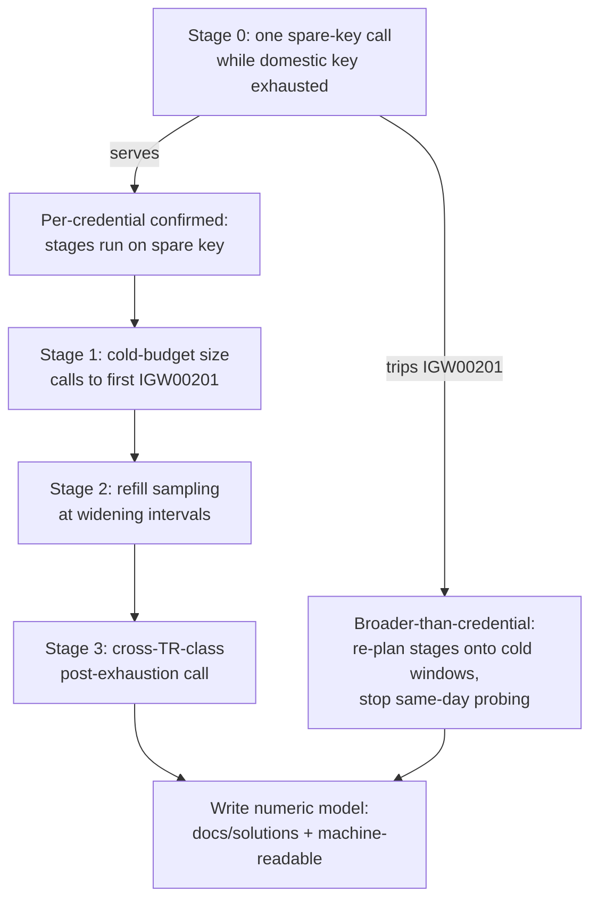
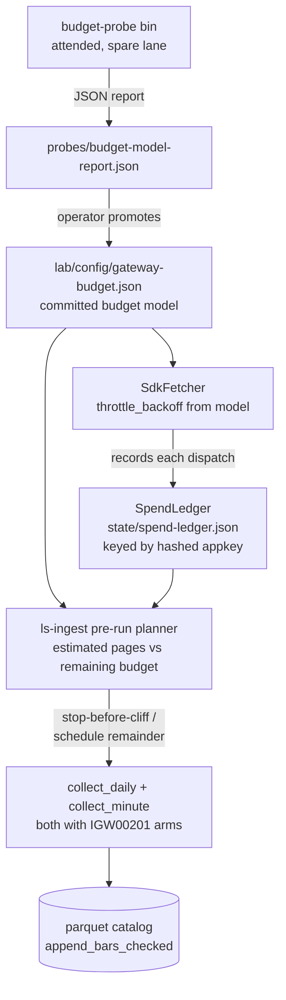

# IGW00201 Budget Characterization and Budget-Aware Ingest - Plan

## Goal Capsule

- **Objective:** Replace the guessed IGW00201 budget model (day-ish window, 120s refill) with a measured one, encode it into a budget-aware ingest layer, and prove it by completing the turn-4 top-40 ingest without manual babysitting.
- **Authority:** This plan for characterization and ingest reliability; `docs/plans/2026-07-07-004-feat-strategy-loop-turn-4-widen-param-flip-plan.md` for what turn 4 must deliver (its R2: top-40 universe). On disagreement about turn-4 scope, that plan wins.
- **Execution profile:** U1–U5 are offline code units gated by the standard offline gates. U6–U7 are attended, paper-only operator sessions — an executor must stop at those boundaries and hand off rather than dispatch live gateway calls unattended.
- **Stop conditions:** Stop and surface if probe stage 0 shows the budget is broader than per-credential (re-plan probing onto cold windows per AE2 before continuing); if the quota cross-check surfaces pin mismatches beyond simple reconciliation (a wrong *category*, not a wrong number); or if `capture-universe` cannot reach 40 symbols after the t1444 header fix (the fix's live leg failed — back to SDK debugging, not more ingest attempts).
- **Tail ownership:** Turn-4's verdict pipeline (backtest, bar evaluation, param flip) stays with the turn-4 plan; this plan ends at a GO catalog with 40/40 minute coverage.

---

## Product Contract

### Summary

Run a staged, gently-paced empirical probe on a spare paper credential to pin the IGW00201 budget model (bucket scope, cold-budget size, refill window), persist the officially published per-TR quota values into the tracker baseline so limit changes surface as drift, and give the ingest a per-credential spend ledger that plans runs against the measured numbers instead of retrying blind. The turn-4 top-40 ingest is the acceptance run.

### Problem Frame

Turn-4's data pull is dead in the water: IGW00201 now fires on the first call of a fresh run, 4×120s backoffs failed to recover one symbol, and repeated same-day retries have burned the domestic lane's budget on a universe that is itself wrong (20 symbols frozen by the unfixed t1444 pagination bug, against a plan that requires 40). The 2026-07-08 fixes (t1444 header pagination, `collect_minute` IGW00201 recovery, universe-load skip) removed avoidable waste but the underlying budget is still a guess. The official LS documentation publishes only per-second caps — the rolling call-count budget behind IGW00201 appears nowhere in official metadata, and no client-side code tracks cumulative spend. Every future strategy-loop turn needs a multi-day-capable bulk ingest, so this collision recurs at growing scale (turn 4 is ~2× turn 3's volume).

### Key Decisions

- **Measure-then-encode over self-calibrating.** A dedicated probe pins the budget model in one attended session; the ingest then plans deterministically. A learn-in-production ledger converges too slowly and cannot cleanly distinguish bucket scope. The rot risk (LS changed per-second limits ~3× in Dec 2025) is covered by drift-tracking the official quota metadata, not by giving up on a static model.
- **Probe on the spare paper credential.** The domestic lane's budget is turn-4's fuel. Today's exhausted state makes stage 0 nearly free: one spare-key call while the domestic key is tripping answers whether the bucket is per-credential.
- **Gentle probing with a hard call ceiling.** LS warns that excessive load can get a client arbitrarily blocked. A coarser budget model is accepted in exchange for staying far from that line; the probe never exceeds published per-second caps.
- **Persist, don't build, the official quota layer.** The tracker's fetch path already parses `ThroughputQuotaRule` → `requestLimit` per TR (`crates/ls-trackers/src/fetch.rs:664`) and projects it into the normalized baselines (`crates/ls-trackers/src/api_drift.rs:164`); the values already sit on disk per TR. The remaining work is the cross-check against the hand-authored `rate_limit_per_sec` pins, not parsing or persistence.
- **Multi-credential sharding is probe-gated, not committed.** If the budget proves per-credential, sharding the universe across keys multiplies throughput — but it is the exact load profile LS's blocking warning describes. Recorded as a future option only.

### Requirements

**Characterization probe**

- R1. A staged, attended, paper-only probe measures the IGW00201 budget on the spare paper credential, with every call counted and logged and pacing never exceeding the published per-second caps.
- R2. Stage 0 establishes bucket scope: one spare-key call while the domestic key is budget-exhausted. Serve means per-credential; trip means broader than credential, and all later stages re-plan onto cold-window scheduling of the shared budget.
- R3. Later stages measure, in order: cold-budget size (calls to first IGW00201 on a MarketData-class TR), refill behavior (time until a single call succeeds again, sampled at widening intervals), and whether exhaustion spans TR classes (a post-exhaustion call on a different-class TR).
- R4. Results supersede the guessed model in `docs/solutions/integration-issues/ls-gateway-igw00201-bulk-minute-ingest-drip-feed.md` and are also captured as machine-readable numbers the ingest layer consumes.
- R5. The probe enforces a hard per-session call ceiling as blocking-risk protection, even if that leaves an axis unmeasured that session.

**Official quota metadata tracking**

- R6. The officially published per-TR quota values (`requestLimit`, already parsed by the tracker's live fetch) persist into the tracked baseline so a change in LS's published limits surfaces as drift.
- R7. Persisted official values are cross-checked against the hand-authored per-TR `rate_limit_per_sec` policy pins, and any disagreement is surfaced.

**Budget-aware ingest**

- R8. Ingest maintains a persistent per-credential spend ledger and plans each run's call budget upfront against the measured model: it stops before the cliff, persists progress, and schedules the remainder instead of burning blind backoff retries.
- R9. The daily pass gains the same in-process IGW00201 recovery the minute pass has; today `collect_daily` aborts on it and the drip script's output-grep retry is the only recovery.
- R10. Backoff timing derives from the measured refill window, replacing the pinned 120s guess.
- R11. A run interrupted by budget exhaustion resumes cleanly across sessions and days, preserving the existing per-symbol idempotent semantics.

**Turn-4 universe and acceptance**

- R12. t1444 header pagination is live-verified with a single attended call that reaches past page 1, then `capture-universe` re-freezes the top-40 universe; the current 20-symbol freeze is stale and must not feed the acceptance run.
- R13. Acceptance: the full turn-4 ingest (top-40, daily plus minute over the plan's window) completes on the budget-aware layer without manual re-runs, ending in a GO catalog status with per-symbol minute coverage equal to 40.

### Key Flows

- F1. Staged budget probe
  - **Trigger:** Attended session with the domestic key budget-exhausted and the spare key untouched.
  - **Steps:** Stage 0 scope check → branch per R2 → cold-budget count → refill sampling → cross-TR-class check → write numeric model (docs/solutions + machine-readable numbers).
  - **Outcome:** Budget model with stated confidence per axis; ingest layer unblocked to encode it.

### Acceptance Examples

- AE1. **Covers R2.** Given the domestic key trips IGW00201 on call 1, when stage 0 issues one call on the spare key and it serves, then the bucket is recorded per-credential and stages 1–3 proceed on the spare key the same session.
- AE2. **Covers R2, R5.** Given the stage-0 spare-key call also trips, then the probe records broader-than-credential scope, stops same-day probing, and re-plans remaining stages onto cold windows — it does not continue burning the shared budget.
- AE3. **Covers R8, R11.** Given the ledger shows fewer remaining calls than a symbol's estimated page count, when the ingest reaches that symbol, then it stops before dispatching, persists progress, and reports the scheduled remainder — no IGW00201 is provoked.

### Success Criteria

- The docs/solutions budget model states a measured bucket scope, and states cold-budget size and refill window either as measured numbers (AE1 branch) or as explicitly deferred to a scheduled cold-window session (AE2 branch) — no axis is silently absent.
- A future turn's bulk ingest completes with zero manual re-run babysitting, even when it legitimately spans multiple days.
- A change in LS's published per-TR limits is caught by the tracker gate offline, without a live incident.

### Scope Boundaries

- Multi-credential ingest sharding: deferred, unlocked only by a per-credential probe result, and adopted only with explicit acceptance of the blocking risk.
- Asking LS support for the budget policy: dropped by choice.
- Redesigning ls-core's per-second category limiter: out of scope beyond re-syncing pinned values if drift is found.
- The turn-4 verdict itself (backtest, bar evaluation, param flip) stays governed by the turn-4 plan; this doc owns only data-pull reliability.
- Porting the t1444-style body+header pagination drive into `chart_all` (the t8412 doc's open SDK follow-up): deferred to follow-up work — the ingest path already drives pages manually.

### Dependencies / Assumptions

- A spare paper credential separate from the domestic lane's key is available (user-confirmed), provisioned as its own lane env file.
- Probing and ingest remain attended and paper-only.
- The unofficial "5,000 calls/day" figure is an unverified hint, not an input; only measured numbers feed the model.
- Verified against the codebase: no client-side cumulative-spend accounting exists anywhere; `collect_daily` has no IGW00201 arm; t1444 is called only from `capture-universe` and is page-bounded; the tracker parses and persists official quota values but nothing cross-checks them against the policy pins.

### Sources / Research

- Official LS quota metadata: per-TR guide pages carry `transactionPerSec`; the portal catalog's `ThroughputQuotaRule` is `{tr_cd, requestLimit}` only — t8412=1, t8410=1, t1444=2, t8430=2, t9945=2, t1101=10; no window or daily cap is published. LS raised per-second limits ~3× in Dec 2025 (fnnews.com/news/202512090952383283).
- Repo ground truth: `crates/ls-core/src/rate_limiter.rs` (per-category per-second only), `adapters/nautilus/src/ingest/pacer.rs` (per-TR per-second, t8410/t8412 only), `adapters/nautilus/src/ingest/mod.rs` (`collect_minute` IGW00201 arm at :571, `collect_daily` none), `crates/ls-trackers/src/fetch.rs:664` (`parse_rate_limits`) and `crates/ls-trackers/src/api_drift.rs:164` (projection into baselines), `adapters/nautilus/lab/config/turn4-universe.json` (20 shcodes, captured 2026-07-07 pre-fix), `adapters/nautilus/scripts/turn4-ingest.sh` (script-level grep-retry).
- The numeric cross-check is a named unimplemented prevention idea: `docs/solutions/conventions/endpoint-policy-rate-limits-from-own-baseline.md`. The t8430 corp mismatch it recorded (pin 3 vs baseline 5) was since reconciled — pin and baseline both read 5 today, so the doc's example is historical, not a live defect.
- Current budget beliefs and their limits: `docs/solutions/integration-issues/ls-gateway-igw00201-bulk-minute-ingest-drip-feed.md` (window "day-ish", credential-shared, ~13 t8412 pages/symbol/28 sessions, irreducible bar-fetch cost; 2026-07-08 update documents the drip runbook).
- t1444 pagination contract and its unverified live leg: `docs/solutions/integration-issues/ls-gateway-t1444-header-pagination-not-body-idx.md`.
- State-persistence pattern to mirror: `adapters/nautilus/src/ingest/checkpoint.rs` (`Checkpoint::load`/`save`, atomic temp+rename, `#[serde(default)]` legacy-load convention, `RebaseEvent` row shape with cap+eviction).
- Offline throttle-test seam: fake `MinuteFetcher`/`DailyFetcher` structs in `adapters/nautilus/src/ingest/mod.rs` tests (`ThrottledMinute` :2650, `AlwaysThrottleMinute` :2702) — `throttle_backoff()` defaults to zero in fakes.

---

## Planning Contract

**Product Contract preservation:** unchanged, with two clarifications and no scope change — R6 was found already satisfied by existing persistence (Key Decisions and Dependencies updated to say so; the remaining work is R7's cross-check), and the brainstorm's four "Deferred to planning" Outstanding Questions are resolved into KTD-1…KTD-4 below, so the section is removed rather than left stale.

### Key Technical Decisions

- KTD-1. **Quota cross-check reads the normalized baselines directly, asserts exact equality, and reconciles existing pin drift in the same unit.** A sibling test beside `slice_policies_mirror_metadata_index` in `crates/ls-core/tests/policy_index_crosscheck.rs` iterates the existing policy array and compares `rate_limit_per_sec`/`corp_rate_limit_per_sec` against `crates/ls-trackers/baselines/api-drift/normalized/trs/<tr_code>.json`, loaded by path (no ls-core→ls-trackers crate dependency; mirror the `metadata_root()` walk-up). Exact equality because the pins document themselves as mirrors of the LS spec. Any mismatches the test surfaces are fixed in the policy consts, not exempted — possibly none: the t8430 corp mismatch the docs/solutions entry records was already reconciled (pin and baseline both 5 today). Disagreement surfaces as a `cargo test -p ls-core` failure — the same gate that owns the existing crosscheck.
- KTD-2. **The probe is a new attended binary; measured numbers are hand-promoted into a committed config the ingest reads, failing open when absent.** `budget-probe` mirrors `capture-universe`'s env-driven shape and writes a JSON report into the existing `probes/` sidecar dir (precedent: `minute-lookback.json`). The operator promotes numbers into `adapters/nautilus/lab/config/gateway-budget.json` (committed, reviewed). Ingest loads it via a default path with env override; when absent it warns and keeps today's behavior (120s backoff, no plan-ahead), so nothing regresses before U6 fills the numbers.
- KTD-3. **The spend ledger is advisory, keyed by hashed appkey, and lives in a data-home `state/` dir with an env override.** `SpendLedger` mirrors `Checkpoint` (serde, every field `#[serde(default)]`, atomic temp+rename save). Key = SHA-256 of the resolved appkey — never the raw key, never the lane filename (unstable), never `account_no` (shared on paper). The lab crate's `manifest::hash_bytes` is the shape to mirror but is not importable from the adapter (the lab crate depends on the adapter — circular); `budget.rs` implements the hash locally with a new `sha2` dependency in the adapter's `Cargo.toml`. Default path derives from `catalog.parent()/state/spend-ledger.json` exactly as `probes_dir_for` does; `LS_SPEND_LEDGER_FILE` overrides. Because turn scripts create fresh data homes, the turn-4 script pins the override to `adapters/nautilus/state/spend-ledger.json` so the ledger survives across homes, and U3 adds a `/state` entry to `adapters/nautilus/.gitignore` so the credential-derived file is never tracked. The gateway stays ground truth: an IGW00201 the ledger did not predict (external spend, wrong model) routes through the existing recovery arms and is recorded as a model-miss in the ledger, never trusted over the gateway.
- KTD-4. **`collect_daily`'s recovery arm is backoff-and-retry-same-page, mirroring `collect_minute`'s consecutive-throttle discipline without the narrowing.** Daily is ~1 page per symbol, so narrow-and-requeue adds nothing; the arm backs off (`throttle_backoff()`), counts consecutive throttles against the existing `MAX_THROTTLE_RETRIES` shape, and on exhaustion degrades that symbol to a gap with the watermark withheld — never aborting the multi-symbol run. All fail-closed invariants survive: only an exhausted body cursor completes a walk; zero rows for a previously non-empty series never advances a watermark; writes go through `append_bars_checked`.
- KTD-5. **`capture-universe` refuses a short freeze.** Capturing fewer symbols than requested exits non-zero and writes nothing, unless an explicit override env is set (for boards that legitimately end early); provenance records the requested N. This turns the silent 20-of-40 freeze that started this incident into a loud failure.
- KTD-6. **Measured backoff is injected through the existing `throttle_backoff()` seam.** `SdkFetcher` reads the refill number from the budget model config at construction; the trait default (zero, for test fakes) and the fake-fetcher test seam are untouched.

### High-Level Technical Design

### Assumptions and Constraints

- Any ls-core/ls-sdk change requires an explicit `cargo test --workspace` inside `adapters/nautilus` — the root gate never builds the adapter workspace (two prior silent breakages).
- No baseline regeneration and no count-family edits: U1 adds a test, not a baseline field; `maintained_tr_count`, the four `cli.rs` count sites, and `TRACKED_TRS` must not move.
- Never `cargo fmt` the ls-trackers crate wholesale.
- Probe pacing stays at or under published per-second caps; the ceiling is enforced in code, not operator discipline (R5).
- The stale `data/turn4` home (20-symbol ingest) is parked, not reused; the acceptance run starts from a fresh home after the re-freeze.
- ls-ingest builds are debug (`./target/debug/ls-ingest`); release builds have repeatedly died mid-compile in this sandbox.

### Sequencing

U1 (independent) ∥ U2 → U3; U4 needs U2; U5 independent. U6 needs U2 + U4. U7 needs U3 + U5 + U6.

---

## Implementation Units

### U1. Official-quota cross-check test and pin reconciliation

- **Goal:** A `cargo test -p ls-core` failure whenever a hand-authored rate pin disagrees with the officially-derived baseline number, with any surfaced disagreements reconciled.
- **Requirements:** R6 (verify existing persistence covers it), R7.
- **Dependencies:** none.
- **Files:** `crates/ls-core/tests/policy_index_crosscheck.rs` (new sibling test fn); `crates/ls-core/src/endpoint_policy/*.rs` (pin fixes the test surfaces, if any); `docs/solutions/conventions/endpoint-policy-rate-limits-from-own-baseline.md` (mark the prevention idea implemented).
- **Approach:** Per KTD-1 — iterate the existing `policies` array, load each REST policy's baseline JSON by `tr_code`-keyed path, deserialize only the two rate fields, assert equality both ways (policy `Some` vs baseline null is also a mismatch). Skip WebSocket policies (no gateway REST rate contract). A missing baseline file for a REST policy is a loud failure, not a skip.
- **Patterns to follow:** `slice_policies_mirror_metadata_index` in the same file (path walk-up via `CARGO_MANIFEST_DIR`, iterate-consts shape); baseline field names as in `crates/ls-trackers/baselines/api-drift/normalized/trs/t1102.json`.
- **Test scenarios:** the test is the deliverable — (1) full suite passes after reconciliation; (2) a deliberately perturbed pin fails with a message naming the TR and both values (verify transiently during development); (3) a REST policy whose baseline file is absent fails loudly; (4) WS policies are skipped without weakening the REST assertion count (assert a minimum number of compared policies).
- **Verification:** `cargo test -p ls-core` green; the reconciled pin diff touches only `rate_limit_per_sec`/`corp_rate_limit_per_sec` literals; no baseline file or count-family change in the diff.

### U2. Budget model config and spend ledger

- **Goal:** A committed, machine-readable budget model the adapter loads, and a persistent per-credential spend ledger recording every gateway dispatch.
- **Requirements:** R8 (ledger substrate), R10 (model substrate).
- **Dependencies:** none.
- **Files:** `adapters/nautilus/src/ingest/budget.rs` (new: `BudgetModel`, `SpendLedger`, path helpers, local SHA-256 helper); `adapters/nautilus/Cargo.toml` (add `sha2`); `adapters/nautilus/lab/config/gateway-budget.json` (committed, initial values marked provisional — current 120s/day-ish beliefs — until U6 promotes measured numbers); `adapters/nautilus/src/ingest/mod.rs` (record spend at the pacer-acquire dispatch seam); tests inline in `budget.rs`/`mod.rs`.
- **Approach:** Per KTD-3. `BudgetModel` carries refill seconds, window seconds, budget-size calls, bucket scope, and a provenance field (probe date / provisional). `SpendLedger` holds per-credential-hash rows of timestamp-bucketed call counts, pruned beyond the model window, plus a model-miss counter for unpredicted IGW00201s. Loading tolerates absent/corrupt files by warning and starting fresh (advisory data, never blocks ingest).
- **Patterns to follow:** `Checkpoint` in `adapters/nautilus/src/ingest/checkpoint.rs` (atomic temp+rename save, `#[serde(default)]`, load-time migration hook); `RebaseEvent`'s capped-Vec-plus-rollup shape for ledger rows; `manifest::hash_bytes` in the lab crate as the hex-SHA-256 shape to mirror locally (not importable — see KTD-3).
- **Test scenarios:** (1) load/save round-trip preserves rows; (2) absent file → default ledger, no error; (3) corrupt file → warn + fresh ledger; (4) rows older than the window are pruned on load; (5) spend recorded per dispatch increments the current bucket for the right credential hash and never another's; (6) budget config absent → `BudgetModel` default that reproduces today's constants (120s backoff, no plan-ahead limit).
- **Verification:** `cargo test --workspace` inside `adapters/nautilus` green; ledger file appears under the state dir after a mocked ingest run and survives reload.

### U3. Budget-aware ingest behavior

- **Goal:** Ingest plans spend upfront, stops before the cliff, recovers the daily pass in-process, and takes its backoff from the model.
- **Requirements:** R8, R9, R10, R11. AE3.
- **Dependencies:** U2.
- **Files:** `adapters/nautilus/src/ingest/mod.rs` (`collect_daily` IGW00201 arm; `SdkFetcher::throttle_backoff` from model; per-symbol pre-dispatch budget check); `adapters/nautilus/src/bin/ls-ingest.rs` (pre-run plan: estimated pages vs ledger remainder, stop-and-report path); `adapters/nautilus/scripts/turn4-ingest.sh` (pin `LS_SPEND_LEDGER_FILE` to `adapters/nautilus/state/spend-ledger.json`; drop redundant retry tiers the in-process arms now own); `adapters/nautilus/.gitignore` (add `/state`); tests inline plus `adapters/nautilus/tests/ingest.rs` additions.
- **Approach:** Per KTD-4 and KTD-6. Page estimation reuses the known anchor (~1 t8412 page per 2 sessions per symbol at qrycnt 900); the planner compares estimate against `model.budget − ledger.spent(window)` and skips-with-report rather than dispatching into a predicted trip. A model-miss IGW00201 (ledger said budget remained) still routes through the recovery arms and increments the ledger's miss counter.
- **Execution note:** Extend the existing fake-fetcher tests first — the throttle behavior is the risk, and the offline seam already exists.
- **Test scenarios:** (1) `ThrottledDaily` fake: daily pass backs off, retries same page, completes — run no longer aborts (contrast: today's behavior); (2) `AlwaysThrottleDaily`: symbol degrades to gap, watermark withheld, other symbols complete; (3) Covers AE3: ledger short of a symbol's estimate → symbol skipped pre-dispatch with a scheduled-remainder report, zero fetch calls for it; (4) resume: re-invocation after a stop ingests only the remainder (append-refuse respected, no duplicate bars — overlapping-but-not-identical range test shape); (5) `throttle_backoff` reflects the config value; absent config → 120s legacy constant; (6) zero rows on a re-pull of a previously non-empty series does not advance the watermark.
- **Verification:** adapter workspace tests green; a dry scripted run against wiremock (existing `tests/ingest.rs` harness) shows the stop-before-cliff report; `bash -n adapters/nautilus/scripts/turn4-ingest.sh` clean.

### U4. budget-probe binary

- **Goal:** An attended binary that runs probe stages 0–3 with counted calls, a hard ceiling, and a JSON report.
- **Requirements:** R1, R2, R3, R5.
- **Dependencies:** U2 (report/model types).
- **Files:** `adapters/nautilus/src/bin/budget-probe.rs` (new); shared types in `adapters/nautilus/src/ingest/budget.rs`; offline tests inline plus a wiremock-driven stage test.
- **Approach:** Env-driven like `capture-universe`: lane file (`LS_PROBE_LANE_FILE`), stage selection, hard ceiling (default conservative), output path (default the `probes/` sidecar dir). Stage 0: one call, classify serve/IGW00201/other. Stage 1: loop a cheap Recommended MarketData read at or under its published cap until IGW00201, recording count and wall clock. Stage 2: single call at widening intervals until serve, recording the first-success gap. Stage 3: one different-bucket read post-exhaustion. Every stage refuses to start beyond the ceiling; every call increments the shared `SpendLedger` for the probe credential. `LS_TRADING_ENV=paper` is mandatory. `scrub::install()` is the first action in `main`, and every printed line (stage verdicts, error text, report-write failures) routes through `scrub::scrub_secrets()` — the repo's mandatory pattern for credential-touching binaries. TR choices are implementation details; prefer Recommended reads.
- **Patterns to follow:** `adapters/nautilus/src/bin/capture-universe.rs` (env shape, lane loading, provenance-stamped JSON output, and its `scrub::install()` + `scrub::scrub_secrets()`-wrapped error printing); `probes_dir_for` in `ingest/mod.rs` for the output dir; classification matches on `LsError::ApiError { code: "IGW00201" }` exactly as `collect_minute`'s arm does.
- **Test scenarios:** (1) classification pure tests: serve / IGW00201 / other-error / transport-error each map to the right stage verdict; (2) ceiling: a stage stopped mid-loop reports partial data and refuses further calls; (3) wiremock stage-1: mock serves N successes then IGW00201 → report says cold budget N+? with the exact count; (4) report round-trips through serde and carries per-stage call counts and timestamps; (5) refusal when `LS_TRADING_ENV` ≠ paper.
- **Verification:** adapter workspace tests green; `LS_TRADING_ENV=paper ./target/debug/budget-probe` with a wiremock-pointed config produces a well-formed report offline.

### U5. capture-universe short-freeze guard

- **Goal:** A short capture fails loudly instead of freezing a silently-truncated universe.
- **Requirements:** R12 (guard half).
- **Dependencies:** none.
- **Files:** `adapters/nautilus/src/bin/capture-universe.rs`; test coverage where the guard logic is factorable (pure check on captured-vs-requested).
- **Approach:** Per KTD-5: after the t1444 walk, `captured < requested` exits non-zero and writes no file, naming both numbers; an explicit override env permits a short freeze for legitimately-short boards, and provenance then records `requested_n` alongside `count`.
- **Test scenarios:** (1) captured == requested → freeze written; (2) captured < requested, no override → non-zero exit, no file, message names 20/40-style shortfall; (3) override set → file written with `requested_n` in provenance.
- **Verification:** adapter workspace tests green; running against the stale gateway behavior (page-1 re-serve) would now exit non-zero — asserted via the wiremock pagination harness.

### U6. Attended probe session and model promotion

- **Goal:** The measured budget model: probe run on the spare lane, numbers promoted, docs superseded.
- **Requirements:** R1–R5, R4. AE1/AE2 decide the branch.
- **Dependencies:** U2, U4.
- **Files:** `adapters/nautilus/lab/config/gateway-budget.json` (measured values replace provisional); `docs/solutions/integration-issues/ls-gateway-igw00201-bulk-minute-ingest-drip-feed.md` (guessed model superseded in place with measured numbers and probe date).
- **Approach:** Operator session, paper-only, spare lane env file. Run stage 0 while the domestic key is verifiably exhausted (that contrast is the scope evidence); follow the AE1/AE2 branch. Promote numbers with per-axis confidence into the config's provenance field.
- **Execution note:** Attended only. If the spare key was used recently, stage 1's "cold" number is suspect — record warmth uncertainty in the report rather than re-burning to redo it.
- **Test expectation:** none — operational; evidence is the committed report, config diff, and doc update.
- **Verification:** config carries measured values + probe provenance; the docs/solutions entry no longer states the day-ish/120s guesses as the model.

### U7. t1444 live verify, top-40 re-freeze, acceptance ingest

- **Goal:** A GO turn-4 catalog at 40/40 minute coverage produced hands-off on the budget-aware layer.
- **Requirements:** R12, R13.
- **Dependencies:** U3, U5, U6.
- **Files:** `adapters/nautilus/lab/config/turn4-universe.json` (re-frozen at 40); a fresh data home; `adapters/nautilus/scripts/turn4-ingest.sh` (already pinned to the shared ledger in U3).
- **Approach:** Operator session. Running `capture-universe` for top-40 *is* the t1444 live verify — reaching 40 requires page 2+, which only the header fix makes possible; U5's guard converts a regression into a loud stop. Then a fresh data home, the drip script with the shared ledger, and the two acceptance reads: `catalog status` GO and `grep -c '1-MINUTE:'` equal to 40. The stale `data/turn4` is parked.
- **Execution note:** Attended. If IGW00201 fires where the ledger predicted headroom, stop and record the model-miss — that is data for the model, not a retry loop.
- **Test expectation:** none — operational; R13 is the acceptance criterion.
- **Verification:** GO status output and the 40-line minute-coverage count, captured alongside the run log.

---

## Verification Contract

| Gate | Command | Applies to | Done signal |
|---|---|---|---|
| Root workspace | `cargo test` | U1 | Green, including the new crosscheck |
| ls-core focused | `cargo test -p ls-core` | U1 | New rate-pin test green after reconciliation |
| Adapter workspace | `cargo test --workspace` (in `adapters/nautilus/`) | U2–U5, and mandatory after any ls-core/ls-sdk change | Green — the root gate never builds this workspace |
| Docs projection | `make docs && make docs-check` | Only if metadata/docs change (none expected) | Byte-identical committed docs |
| Script sanity | `bash -n adapters/nautilus/scripts/turn4-ingest.sh` | U3 | Clean parse |
| Attended evidence | probe report JSON, `catalog status` output, minute-coverage count | U6, U7 | Report + GO + 40/40 recorded |

No clippy gate (not part of the root gate in this repo). No baseline regeneration is expected in any unit; a diff touching `crates/ls-trackers/baselines/` means U1 went off-plan.

---

## Definition of Done

- U1–U5 landed with their unit verifications green, including the adapter-workspace run after every SDK-visible change.
- The quota cross-check fails on a perturbed pin and passes on the reconciled tree; any mismatches the test surfaces are fixed in policy consts, none exempted (possibly none).
- `gateway-budget.json` holds measured values with probe provenance (U6), and the IGW00201 docs/solutions entry states the measured model in place of the guesses.
- The acceptance run (U7) recorded: GO catalog status, minute coverage 40/40, zero manual re-runs after start.
- The stale 20-symbol `data/turn4` home is not referenced by any config or script.
- No dead experimental code from abandoned approaches remains in the diff; the tree is gate-green at every commit.
