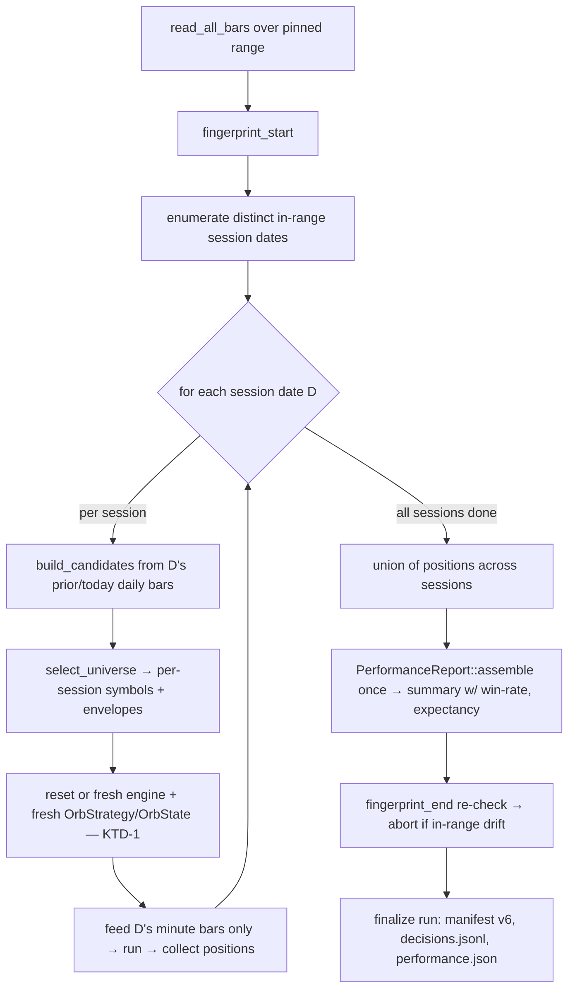

# Strategy loop turn 5 — multi-session strategy fix (per-day reset + daily reselection), edge-quality verdict - Plan

## Goal Capsule

- **Objective:** Fix the strategy/runner so the backtest trades **every** in-range
  session — with per-session universe reselection and per-day state reset — and judge
  the result on an **edge-quality** verdict, not the old frequency bar.
- **Product authority:** operator-run strategy loop; offline, attended.
- **Open blockers:** none. Two execution-time open questions (re-baseline comparability
  semantics; whether to revisit `max_concurrent` in a *later* turn).

**Product Contract preservation:** Product Contract unchanged (R1–R7 preserved). One
implementation note: **R3 (per-day `OrbState` reset) is satisfied structurally** — the
runner constructs a fresh `OrbStrategy` (hence fresh `OrbState`) per session (KTD-1/KTD-2),
so no code changes `orb.rs`. This is a HOW choice, not a scope change.

This plan **supersedes** `2026-07-09-002` (the diagnose-then-param-flip framing), whose
diagnosis is complete and self-falsifying. See Problem Frame.

---

## Problem Frame

Turn 4 found trades flat at exactly **6** across universe widths N=20/30/40. The `-002`
plan proposed diagnosing three hypotheses then flipping one param. The diagnosis is now
complete from the v5 artifacts + code, and it **invalidates the param-turn frame**:

- **Root cause is structural, not a mistuned knob.** The runner trades a single session
  **by design**: `adapters/nautilus/lab/src/runner/backtest.rs` computes
  `session_date = max(daily dates in range)` and feeds **only that last session's minute
  bars** to the engine (the runner's existing single-session reproducibility pin — its own
  code comment labels this "KTD8", unrelated to this plan's KTDs). `OrbState` is date-blind
  (`kst_time_from_nanos` drops the date; `on_bar` takes `NaiveTime`) with a terminal
  `Phase::Done` and **no per-day reset** — one trade per symbol, lifetime. Universe is
  selected **once** at start.
- **The flat-6 decomposes exactly.** On the one traded session (2026-07-03 in v5): 12
  breakout signals → `max_concurrent=5` rejected **6** (`order_rejected_sizing/
  max_concurrent` × 6 in `decisions.jsonl`) → 6 placed → **6 trades.**
- **Every param lever is falsified.** Gap already passes 20/40 candidates (not the
  bottleneck). `range_minutes` changes the opening-range window, not the session count.
  Raising `max_concurrent` tops out at ~12 on one collapsed session. **No single param
  reaches the 60/12 bar.**

The fix is the item `-002` explicitly deferred as "a harness change, a separate feature,
not a param turn" — now promoted to be turn 5.

---

## Requirements

- **R1 — Multi-session runner.** The backtest drives **every** in-range trading session,
  not only the last. Each session feeds its own day's minute bars to the strategy.
- **R2 — Per-session universe reselection.** The stocks-in-play scan runs **per session**
  from that session's prior/today daily bars — not a single start-of-window selection.
- **R3 — Per-day state reset.** Each symbol's range/entry/exit machine starts fresh at the
  session boundary so it can trade once **per day**, rather than being terminally `Done`
  after its first-ever trade. *(Satisfied structurally — see KTD-2.)*
- **R4 — Edge-quality verdict (success criterion).** Turn 5 is judged on whether the
  multi-session strategy shows a **real, evaluable edge** — positive expectancy / win-rate
  — with single-symbol **dominance still capped**. These are the **reset-invariant per-trade
  stats** only; the verdict does **not** read the union `max_drawdown` / `equity_curve`
  (KTD-7). The old 60/12 frequency/breadth bar is retired: per-day trading clears it by
  construction. A measurable edge implicitly proves the reset fires; **no separate frequency
  floor gate.**
- **R5 — Honest-verdict definition of done.** Turn 5 succeeds by producing an honest edge
  verdict on a correctly-firing multi-session run. **Positive edge → strategy advances.
  Flat/negative edge → recorded as the finding with the next lever named** — a valid
  outcome, not a turn failure.
- **R6 — Offline, no re-ingest.** Reads the local `data/turn4-fresh` catalog (1-DAY +
  1-MINUTE spanning ~27 sessions). No gateway, no `LS_TRADING_ENV`, no re-ingest.
- **R7 — Single-variable change.** Change the **architecture**, not the knobs: hold
  `max_concurrent=5`, `gap_min_pct=0.6`, `range_minutes=15`, `universe_top_n=40` at v5
  values. Bumps `strategy_version` 5→6.

---

## Key Technical Decisions

- **KTD-1 — Design B: the runner loops per session.** Replace the single
  `session_date = max(...)` + single engine run with a loop over each distinct in-range
  session date. Per session: reselect the universe from that day's daily bars (KTD-3), drive
  that session's minute bars through the engine, collect positions. Accumulate positions
  across all sessions into one ledger, then `PerformanceReport::assemble` **once** over the
  union (KTD-4). **Engine-reuse mechanism — resolve at implementation, gated on a test.**
  nautilus's documented rerun path is `BacktestEngine::reset()` (data/instruments persist;
  a fresh `add_strategy` re-subscribes in `on_start`), *not* constructing N fresh engines —
  and the message bus lives in a `thread_local!` overwritten per construction, so N
  sequential fresh engines on reused blocking-pool threads share/re-populate thread-locals
  (stale handlers inert only via nautilus's weak-upgrade guard — unvalidated here). Pick the
  mechanism (fresh engine + explicit `dispose()` per session, **or** one engine + `reset()`
  + fresh `add_strategy` per session) against nautilus 0.60's validated rerun path, gated by
  a mandatory **2-session same-thread independence test** (U1). *Corrected — Design A is not
  actually blocked by "subscriptions fixed at `on_start`":* a `reset()` + fresh
  `add_strategy` re-subscribes that day's universe, so a reset-based single-engine loop
  cleanly reselects per day. The remaining reason to prefer the per-session loop shape is
  clarity of the per-session ledger boundary, not an inability of the alternative.
- **KTD-2 — Per-day reset is structural, so `orb.rs` is untouched.** Whichever mechanism
  KTD-1 lands, each session gets a fresh `OrbStrategy` (fresh `OrbState`s), so the existing
  time-of-day `OrbState` machine — already correct *within* one session — resets for free
  each day. R3 needs no code in `orb.rs`.
- **KTD-3 — Parameterize universe selection by session date.** `build_candidates` /
  `select_prior_today` (`backtest.rs`) currently draw the whole-range last-two daily bars;
  parameterize them by a target session date so day D selects from D's daily ("today") and
  its prior daily ("prior_close"). Daily bars for all sessions are confirmed present. The
  existing missing-prior-daily noise filter applies **per session**. **First-session
  boundary:** `select_prior_today` needs two distinct dailies, so the *earliest* in-range
  session has no in-range prior daily → empty universe → a no-trade day (tradeable sessions
  would be N−1). Fix by **widening the daily-bar lookback one session before the pinned
  range** so the first in-range session gets its prior daily, while keeping the minute-bar
  and `catalog_fingerprint` window pinned to the range. If the lookback widening is
  deferred, state the first session as a known no-trade day.
- **KTD-4 — Edge metrics already exist; the verdict just reads them.**
  `PerformanceReport::assemble` (`adapters/nautilus/lab/src/artifacts/performance.rs`)
  already feeds realized P&Ls through nautilus `PortfolioAnalyzer` → **win rate,
  expectancy, winners/losers** land in `performance.json` `summary`. The verdict reads
  those, **keeps dominance condition (c)**, and **retires conditions (a) trade-floor and
  (b) breadth**. No new analyzer.
- **KTD-5 — Re-baseline, not keep/revert.** A code change bumps `strategy_code_hash`, so
  the turn does **not** run through the param-turn machinery (`lab-research turn`,
  proposal-bounds, seed-assertion, `EXPECT_` guards — all void). Redefine `universe_hash`
  over the **per-session selection sequence**: hash the chronologically-ordered list of
  `(session_date, symbols-in-rank-order)` tuples (e.g. via `hash_lines`) — **intentionally
  NOT sorted**, so it stays sequence-sensitive (the current `universe_hash(&[String])` sorts
  and destroys order). The range-scoped `catalog_fingerprint` is unchanged (full range).
  `runs compare` across a code-hash delta is a re-baseline, not an apples-to-apples verdict.
- **KTD-6 — One ledger, one decisions stream.** A single `DecisionSink` accumulates every
  session's envelopes → one `decisions.jsonl` (universe envelopes now carry per-session
  dates). Positions from all sessions fold into one `PerformanceReport`.
- **KTD-7 — Sizing is balance-independent; verdict reads reset-invariant stats only.**
  `notional_per_position` is fixed, the sizing gate is a pure count (`open_positions <
  max_concurrent`, never reads balance), and ORB flattens by 15:00 (no overnight carry) — so
  per-session engines starting fresh at the full `starting_balance` are sound for the
  **per-trade** stats the verdict uses (expectancy, win-rate, dominance — all reset-invariant).
  **Caveat (do not present as a risk metric):** because each session resets balance,
  cumulative loss never constrains later-session sizing, so the union `max_drawdown` /
  `equity_curve` is an *arithmetic overlay*, not a simulated-executable capital path — faithful
  only while cumulative realized loss never drives free capital below the margin for
  `max_concurrent` positions. The R4/R5 verdict therefore **must not read union drawdown /
  equity_curve**; if a trustworthy drawdown ever becomes a verdict input, carry balance
  forward across sessions (the reset-based single-engine variant in KTD-1). *If sizing is ever
  changed to a balance-fraction basis, per-session resets diverge from continuous equity and
  this decision must be revisited.*

---

## High-Level Technical Design

The runner changes from *"select once, trade the last session"* to *"for each session:
reselect, reset, trade; then assemble one ledger."*

*Directional guidance for reviewers — not implementation specification.*

---

## Implementation Units

### U1. Session-loop the backtest runner

- **Goal:** Drive every in-range session and accumulate one coherent ledger, replacing the
  single-session pin.
- **Requirements:** R1, R3 (structural via KTD-2), R6, R7.
- **Dependencies:** none (U2 supplies per-session universe; land U1's loop skeleton with a
  whole-range universe first, then wire U2 in — or land U1+U2 together).
- **Files:** `adapters/nautilus/lab/src/runner/backtest.rs`;
  `adapters/nautilus/lab/tests/backtest_run.rs`.
- **Approach:** Enumerate the distinct KST session dates among in-range daily bars (replaces
  the `session_date = max(...)` block). For each date: resolve that session's minute bars
  (filter `is_minute` + `in_range` + `kst_date_of == D`), construct a fresh engine +
  strategy for the session's selected symbols (KTD-1/KTD-2), run, collect positions. Fold
  all sessions' positions into one `Vec<Position>` and `PerformanceReport::assemble` once
  (KTD-4/KTD-7). Preserve the `fingerprint_start` / `fingerprint_end` guard around the whole
  loop and the "no registry residue on mid-run mutation" behavior.
- **Execution note:** Add a failing multi-session integration test first (trades land on
  more than one date), then make the loop satisfy it.
- **Patterns to follow:** the existing `run` structure and `run_engine` helper in
  `backtest.rs`; the `spawn_blocking` engine-drive gotcha stays per session.
- **Test scenarios:**
  - Multi-session drive: a backtest over a multi-day range produces closed trades on **>1
    distinct session date**. Covers R1.
  - Per-session isolation: a symbol that reached `Done` on day D trades **again** on a later
    day (fresh state). Covers R3.
  - **Same-thread engine independence (gates KTD-1):** two sessions driven sequentially on
    the same `spawn_blocking` thread produce a session-2 ledger provably independent of
    session 1 (no thread-local msgbus/handler leakage). This test decides fresh-engine-with-
    `dispose()` vs `reset()`-based reuse.
  - Ledger accumulation: total closed trades = sum across sessions; a single
    `PerformanceReport` with an equity curve spanning the window.
  - Fingerprint guard preserved: a mid-run in-range catalog mutation still aborts with no
    registry residue (existing behavior retained across the loop).
  - Degenerate range: a range containing exactly one session still runs (loop of 1) and
    matches prior single-session output for that day.
- **Verification:** a v6 run trades across many distinct sessions; one coherent ledger +
  equity curve; fingerprint guard intact; exit 0. Beyond the 2-session unit test, run a
  **full-window (~27-session) backtest** and confirm trades are distributed across most
  sessions (not a thin handful) — the `>1 date` unit assertion alone would pass a
  near-single-session regression.

### U2. Per-session universe reselection

- **Goal:** Select each session's universe from that day's prior/today daily bars.
- **Requirements:** R2.
- **Dependencies:** U1.
- **Files:** `adapters/nautilus/lab/src/runner/backtest.rs`;
  `adapters/nautilus/lab/tests/backtest_run.rs`.
- **Approach:** Parameterize `build_candidates` and `select_prior_today` by a target session
  date so "today" is D's daily bar and "prior_close" is the prior in-range daily (KTD-3).
  Call `select_universe` per session inside the U1 loop, emitting universe decision
  envelopes with that session's `ts_event`/date into the shared sink (KTD-6). Apply the
  existing missing-prior-daily noise filter per session.
- **Test scenarios:**
  - Per-session selection: two sessions with different daily gaps select **different symbol
    sets**. Covers R2.
  - Per-session envelopes: universe reject/accept envelopes carry the correct per-session
    date (distinct universe-scan dates in `decisions.jsonl`, one per session).
  - Missing prior daily on day D: a symbol lacking D's prior-session daily is excluded for D
    but may be selected on another day; no spurious global gap.
  - First-session boundary (KTD-3): with the widened daily lookback, the earliest in-range
    session selects a non-empty universe and trades (rather than silently being a no-trade
    day); assert the first session is tradeable.
- **Verification:** `decisions.jsonl` shows one universe scan per session with day-specific
  selections; universes differ across days when gaps differ; the first in-range session is
  not silently empty.

### U3. Edge-quality verdict (retire the frequency/breadth bar)

- **Goal:** Judge the run on edge quality + dominance, not frequency/breadth.
- **Requirements:** R4, R5.
- **Dependencies:** U1 (needs a multi-session run to evaluate).
- **Files:** `adapters/nautilus/lab/src/runner/research.rs` (analyze scaffold);
  `adapters/nautilus/lab/src/artifacts/performance.rs` (evaluation shape);
  `adapters/nautilus/lab/tests/research_cli.rs`, `adapters/nautilus/lab/tests/artifacts.rs`.
- **Approach:** In the analyze scaffold, read the already-computed edge stats (win rate,
  expectancy, `pnl_total`) from `performance.json` `summary` (KTD-4) and render them. Add an
  edge evaluation that **keeps dominance (c)** (reuse the existing `max_abs_pnl_share` ≤
  `DOMINANCE_CAP` + degenerate-zero fail-closed) and **drops (a) trade-floor + (b) breadth**.
  Author the verdict: positive expectancy + dominance-pass → edge (strategy advances);
  flat/negative → insufficient/no-edge + named next lever (R5).
- **Execution note:** Keep `BarEvaluation` available for historical/param turns if other
  callers depend on it; the edge path is the turn-5 verdict, not a wholesale deletion — check
  callers before removing (a)/(b). Retiring (a)/(b) also means rewriting the hard-coded
  verdict-gating **prose in the `analysis.md` scaffold template** ("keep or revert only if the
  bar is cleared") and updating the corresponding `research_cli.rs` assertions (e.g.
  "trade-count floor not met", "Decisiveness bar (R1)") — easy to miss since they live outside
  the `bar_evaluation` function.
- **Test scenarios:**
  - Edge stats surfaced: the scaffold renders win-rate / expectancy / `pnl_total` from
    summary. Covers R4.
  - Dominance retained: condition (c) still evaluated; degenerate all-zero-P&L fails closed.
  - Frequency/breadth retired: a run with **>60 trades but negative expectancy** yields a
    **no-edge** verdict (not an auto-pass). Covers R4/R5.
  - Verdict branches: positive-expectancy + dominance-pass → edge/keep; flat → insufficient +
    next lever.
- **Verification:** the verdict reads edge stats, keeps dominance, no longer gates on (a)/(b);
  an authored keep-or-next-lever verdict grounded in the computed stats.

### U4. Version bump + manifest / comparability

- **Goal:** Stamp v6 and make the re-baseline comparability coherent.
- **Requirements:** R7; KTD-5.
- **Dependencies:** U1, U2.
- **Files:** `adapters/nautilus/lab/src/runner/backtest.rs` (manifest / `universe_hash`);
  strategy params source for `strategy_version`;
  `adapters/nautilus/lab/tests/backtest_run.rs`.
- **Approach:** Bump `strategy_version` 5→6 with all non-architectural params held at v5
  values (R7). Redefine `universe_hash` per the concrete sequence-sensitive encoding in KTD-5
  (chronological `(session_date, symbols-in-rank-order)` tuples, unsorted) so it is
  deterministic across identical multi-session runs and differs when the selection sequence
  differs. Leave `catalog_fingerprint` (full-range) unchanged. Note in the run/verdict that
  `runs compare` across the code-hash delta is a re-baseline.
- **Test scenarios:**
  - Manifest: `strategy_version:6`; `max_concurrent=5`, `gap_min_pct=0.6`, `range_minutes=15`,
    `universe_top_n=40` unchanged. Covers R7.
  - `universe_hash` deterministic across two identical multi-session runs; differs when the
    per-session selection sequence differs.
- **Verification:** manifest shows v6 with held params; `universe_hash` stable and
  sequence-sensitive.

---

## Scope Boundaries

**In scope:** multi-session runner drive (R1); per-session universe reselection (R2);
per-day state reset via per-session construction (R3); edge-quality verdict + retirement of
the frequency bar (R4/R5); version bump + comparability (R7); all offline on the existing
catalog (R6).

**Deferred to Follow-Up Work:**
- Revisiting `max_concurrent` after the reset proves out — a later param turn.
- Combining architecture change with a param retune — kept separate to isolate the signal.

**Out of scope:** param retuning this turn; param-turn governance machinery (`lab-research
turn`, proposal-bounds, seed-assertion); live / gateway / order execution / re-ingest / new
TRs.

---

## Verification Contract / Definition of Done

- **U1:** v6 run trades across many distinct sessions; one coherent ledger + equity curve;
  fingerprint start/finalize guard intact; exit 0.
- **U2:** one universe scan per session in `decisions.jsonl`; per-session universes differ by
  day when gaps differ.
- **U3:** verdict reads edge stats, keeps dominance (c), retires (a)/(b); a >60-trade
  negative-expectancy run is judged no-edge, not auto-pass; verdict authored.
- **U4:** manifest `strategy_version:6` with non-architectural params held; `universe_hash`
  deterministic + sequence-sensitive.
- **Gate:** `cargo test` green for the lab crate (`--workspace` where the adapter gate
  requires it); offline throughout.

**Done =** a multi-session v6 run over `data/turn4-fresh` + an edge-quality verdict authored
(keep | insufficient + next lever) + comparability handled as a re-baseline.

---

## Assumptions

- **Re-baseline, not keep/revert.** The v5→v6 comparison is single-session-vs-full-window;
  `runs compare` keep/revert semantics do not apply apples-to-apples. *(Confirm the compare
  tooling's exact behavior on a code-hash delta at implementation — see Open Questions.)*
- **Minute data spans the window.** Catalog scan confirms 1-DAY + 1-MINUTE series present
  (~27 sessions of minute bars per symbol per turn-4 ingest); assumed gap-free enough for a
  full multi-session run.
- **`PortfolioAnalyzer` edge stats are sufficient.** Win-rate/expectancy from the existing
  analyzer are assumed adequate for the edge verdict; no bespoke edge metric this turn.

---

## Open Questions (execution/planning-time)

- **nautilus 0.60 rerun mechanism (gates KTD-1)** — does 0.60 support constructing multiple
  `BacktestEngine` instances per process cleanly (with `dispose()`), or is `reset()` on one
  engine the only validated rerun path? Resolved at implementation via the U1 same-thread
  independence test.
- **Edge verdict on a zero-trade run** — how the verdict behaves when a multi-session run
  still produces zero closed trades (the `PortfolioAnalyzer` summary then lacks the
  win-rate/expectancy keys). Define the fail-closed/insufficient branch.
- **Run-comparability semantics for a re-baseline** — what, if anything, `runs compare`
  should assert across a code-hash change, and whether the v5 single-session run stays a
  meaningful reference.
- **`max_concurrent` after the reset** — whether a per-session cap of 5 is right once
  multi-session trading is real; a candidate for a subsequent param turn, not this one.

---

## Sources & Research

- Diagnosis (2026-07-09): `data/turn4-fresh/runs/20260709T065112Z-backtest-orb-v5/
  decisions.jsonl` (one traded date; 12 breakouts / 6 placed / 6 `max_concurrent` rejects;
  universe scan once); `adapters/nautilus/lab/src/strategy/orb.rs` (date-blind `OrbState`,
  terminal `Done`, `OrbState` struct + `Default` reset seam); `adapters/nautilus/lab/src/
  runner/backtest.rs` (single-session-by-design runner; `run_engine`; `build_candidates` /
  `select_prior_today`); `adapters/nautilus/lab/src/artifacts/performance.rs`
  (`PerformanceReport::assemble` feeds `PortfolioAnalyzer` → win-rate/expectancy;
  `BarEvaluation`).
- Turn-4 flat-6 finding + ingest coverage: memory
  `strategy-loop-turn-4-widen-universe-2026-07-09`.
- Param-turn governance (contrast — this turn is *outside* it):
  `docs/solutions/conventions/strategy-loop-param-turn-governance-and-fresh-home-seeding.md`.
- Superseded frame:
  `docs/plans/2026-07-09-002-feat-strategy-loop-turn-5-diagnose-then-flip-plan.md`.
