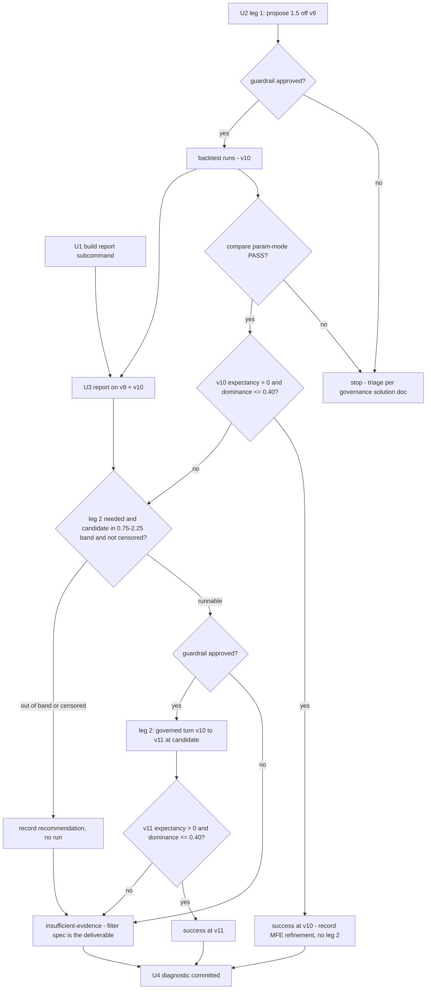

# Turn 9 Profit-Target Sweep + MFE Telemetry Report - Plan

## Goal Capsule

- **Objective:** Flip ORB expectancy positive with a governed `profit_target_r` sweep off v9 (max two legs), while adding a durable MFE-distribution report to the lab and delivering the breakout-strength filter's empirical spec for a future code turn.
- **Product authority:** the Product Contract below; turn-8 context in `docs/plans/2026-07-09-004-feat-orb-exit-geometry-diagnostic-gated-plan.md` and `docs/plans/2026-07-09-004-turn8-execution-status.md`.
- **Execution profile:** fully offline — no live gateway, no credentials. Backtests use the release binary against the operator data home at repo-root `data/turn4-fresh` (gitignored). U1 is the only code unit; U2–U4 are run-execution and documentation units.
- **Stop conditions:** stop at the first leg whose edge verdict passes (expectancy > 0); stop after two legs regardless; stop leg 2 without running it if the empirical target candidate falls outside the governance band (AE3), is declared right-censored with no operator override (KTD6), or the guardrail refuses the proposal.
- **Open blockers:** none.

---

## Product Contract

### Summary

Turn 9 launches two things in parallel: the governed `profit_target_r` 1.0 → 1.5 param leg (v9 → v10) and a durable `lab-research` MFE-distribution report over `decisions.jsonl`. The report interprets the leg-1 result, picks the leg-2 target if 1.5 stays negative, and produces the breakout-strength filter's empirical spec regardless of outcome. Success is expectancy > 0 on any leg; stop at first success; at most two legs.

### Problem Frame

Turn 8's code turn added a fixed 1.0R profit target: expectancy improved 81% (−16,589 → −3,157 KRW/trade) and win rate rose to 46.9%, but the edge verdict stayed NON-PASS and the average winner *fell* (267k → 256k) — the 1.0R cap clips runners. The Step-0 what-if simulated +0.060R at a 1.5R target versus +0.027R at 1.0R, and turn 8's own telemetry work (per-trade `mfe_r` on every exit envelope) was built so the next exit-tuning turn reads give-back from data instead of reconstructing it. The sim's 1.5 and the empirical distribution have not yet been reconciled; trusting either alone risks burning a governed leg on the wrong value.

### Key Decisions

- **Parallel, not sequential.** The 1.5 leg fires immediately (it is cheap, offline, and governance-approved) while the MFE mining runs alongside; the distribution is used to interpret v10 and to choose leg 2 if needed, rather than gating leg 1 on the analysis.
- **Durable report subcommand over a throwaway script.** The MFE mining lands as a `lab-research` report command so every future exit-tuning turn reuses it. It reads `decisions.jsonl` only and never touches `orb.rs`, so the strategy code hash — which hashes only `orb.rs` — is unchanged and no re-baseline occurs.
- **Success bar is the code's `is_edge`.** Expectancy > 0 with at least one trade and dominance ≤ 0.40 (`performance.rs` has no profit-factor threshold); win rate and PF are reported but not gating.
- **Stop at first success, max two legs.** If leg 1 flips expectancy positive, the MFE-suggested refinement is recorded for a future turn but not executed. Leg 2 exists only as the rescue path.
- **Breakout-strength filter is analysis-only this turn.** The mining deliverable includes the filter's empirical spec (the MFE-by-breakout-strength cut); implementing the filter is a separate future code turn.

### Requirements

**Sweep legs**

- R1. Leg 1 is a governed param turn: `profit_target_r` 1.0 → 1.5 off the latest finalized v9, producing v10, with the seed assertion pinned to the expected base version.
- R2. Each leg's `runs compare` param-mode verdict must PASS: the manifest diff is exactly `{strategy_version, profit_target_r}` with equal code hash, catalog fingerprint, and data range, and universe equal-or-explained.
- R3. Leg 2 runs only if leg 1's expectancy stays ≤ 0, at a target value chosen from the empirical MFE distribution; the value must fall within the governance band relative to 1.5 (0.75–2.25). If the empirical optimum lies outside that band, the turn ends with the recommendation recorded and no leg-2 run.
- R4. Each leg is judged by the edge verdict (trades > 0, expectancy > 0, dominance ≤ 0.40), with win rate and profit factor reported alongside.

**MFE report**

- R5. A durable `lab-research` report subcommand summarizes a run's `decisions.jsonl`: per-trade MFE percentiles, MFE by exit reason, and MFE by breakout strength — joining each trade's exit envelope to its breakout envelope on symbol + session date (safe: one trade per symbol per session), with strength derived from the recorded breakout price relative to the opening range.
- R6. The report touches no strategy code: the strategy code hash is unchanged and no re-baseline is triggered.
- R7. The report's output is the decision input for leg-2 target selection and the source of the filter spec (R8).

**Deliverables**

- R8. A committed `docs/solutions/` diagnostic (turn 6–7 outcome-doc pattern) captures the MFE distribution, both legs' outcomes, and the breakout-strength filter's empirical spec — the entry criterion for the future entry-side code turn.
- R9. The turn ends in exactly one of two states: first-edge success (the passing version is the new baseline) or insufficient-evidence with the entry filter recorded as the named next lever.

### Acceptance Examples

- AE1. **Covers R3, R9.** Given leg 1 (v10 at 1.5) reports expectancy > 0 and dominance ≤ 0.40, when the verdict is read, then the turn succeeds at v10, leg 2 does not run, and any MFE-suggested refinement is recorded for a future turn.
- AE2. **Covers R3, R7.** Given leg 1 expectancy ≤ 0 and the MFE distribution points at 1.25, when leg 2 fires, then it is a governed turn v10 → v11 at 1.25 and its param-mode compare must PASS.
- AE3. **Covers R3.** Given leg 1 expectancy ≤ 0 and the empirical optimum is 2.5 (outside 0.75–2.25 from 1.5), when leg-2 selection runs, then no leg-2 backtest fires and the out-of-band recommendation is recorded in the diagnostic.
- AE4. **Covers R8, R9.** Given both legs stay negative, when the turn closes, then the verdict is insufficient-evidence, the report and diagnostic (including the filter spec) are still delivered, and the entry-side breakout-strength filter is the named next lever.

### Success Criteria

- Expectancy > 0 on any leg is the turn's success milestone — the loop's first real edge.
- Even on a negative sweep, the turn is not wasted: the merged MFE report subcommand and the committed diagnostic with the filter spec are the guaranteed deliverables.

### Scope Boundaries

- No breakout-strength filter implementation — spec only; the filter is its own future code turn.
- No `orb.rs` changes of any kind; this turn must not move the strategy code hash.
- No further target optimization after the first passing leg.
- Fully offline turn: no live gateway work, no credentials.
- Richer strength definitions (breakout-bar volume, day gap %) are deferred — those inputs are not in `decisions.jsonl` and would need a catalog/universe join.

### Dependencies / Assumptions

- The v9 baseline run exists at `data/turn4-fresh/runs/20260710T013757Z-backtest-orb-v9/` (gitignored data home; verified on disk — note the `011055Z` id circulating in earlier notes is stale) with 172 `mfe_r`-bearing decision records.
- The proposal-bounds guardrail admits on-bound steps (`<= cap + 1e-9`), so 1.0 → 1.5 needs one leg, not two.
- Exit-to-breakout joining is unambiguous because the ORB state machine allows one trade per symbol per session.
- Backtests run the release binary; the operator data home is at repo root `data/turn4-fresh`.

### Sources / Research

- Bounds-cap enforcement: `adapters/nautilus/lab/src/agent/guardrails/proposal_bounds.rs` (on-bound step admitted); cap constant in `adapters/nautilus/lab/src/runner/research.rs`.
- Param resolution and turn flow (env wiring, seed assertion, version bump, exactly-two-key defence): `adapters/nautilus/lab/src/runner/research.rs`.
- `profit_target_r` definition and serde default: `adapters/nautilus/lab/src/params.rs`.
- Edge verdict (`is_edge`, dominance cap): `adapters/nautilus/lab/src/artifacts/performance.rs`.
- `mfe_r` computation and exit-envelope emission; breakout envelope fields for the strength join: `adapters/nautilus/lab/src/strategy/orb.rs`, `adapters/nautilus/lab/src/agent/envelope.rs`.
- Prior art: `docs/plans/2026-07-09-004-turn8-step0-diagnostic-finding.md` (source of the 1.5 sim optimum); `docs/solutions/conventions/strategy-loop-param-turn-governance-and-fresh-home-seeding.md` (how to run a governed param turn); `docs/solutions/conventions/strategy-loop-reading-param-turn-outcomes-win-rate-vs-expectancy.md` (why exits were the diagnosed lever).

---

## Planning Contract

**Product Contract preservation:** unchanged.

### Key Technical Decisions

- KTD1. **The report is a new `report mfe` arm in the existing hand-rolled CLI dispatch.** `lab-research` has no clap; subcommands are a `std::env::args()` match in `runner/research.rs` (`main_cli`), each arm building a `*Config` from env vars and printing an outcome struct's `lines` via `print_lines`. The report follows that shape exactly: a `ReportConfig` from env (`LS_REPORT_RUN` selects a run id; absent means latest finalized via the already-`pub` `latest_finalized_run`), plain-text lines out, `ok_fail`-style exit. Update the `USAGE` const. Report logic lives in a new `runner/report.rs` module to keep `research.rs` from growing further.
- KTD2. **Reuse the existing envelope readers; never parse JSONL by hand.** `agent/replay.rs` exposes `read_envelopes(path) -> Vec<DecisionEnvelope>` (the `replay` subcommand's reader) and `envelope.rs` has `from_jsonl`. The report reads the run's `decisions.jsonl` with these, then filters `DecisionDetail` records: exit kinds (`stop_hit`, `time_exit`, `target`) carry `mfe_r` in `values`; breakout records carry `range_high`, `range_low`, `breakout_price`.
- KTD3. **Join key is (symbol, KST session date).** Envelope `ts_event` is UTC unix ns; derive the session date with `nautilus_ls::ingest::kst_date_of` (the same helper `runner/backtest.rs` already delegates to for session bucketing). One trade per symbol per session makes the join unambiguous. Orphan breakouts (exit envelope skipped on `qty <= 0` or emission teardown) are tolerated and counted, never a panic.
- KTD4. **Breakout strength metric:** `(breakout_price − range_high) / R` with `R = range_high − range_low`. The report buckets trades by strength quartile and prints per-bucket count, win share, and median/mean MFE — that table *is* the filter spec input for R8. Degenerate ranges (`R <= 0`) are excluded from strength buckets and reported as a count.
- KTD5. **Percentiles are a local sort-based nearest-rank helper taking an arbitrary rank.** No stats crate exists in the lab and none is added; a small generic helper in `report.rs` (tested at odd/even counts), with p25/p50/p70/p75/p90 as its call sites.
- KTD6. **Leg-2 target selection default rule (directional, printed by the report).** The candidate comes from the **v10 run's report**, not v9: v9 executed *with* the 1.0R target active (49 target-kind exits in its decisions), so no pre-target MFE data exists anywhere — every `mfe_r`-bearing run is right-censored at its own `profit_target_r`. Candidate = nearest-rank 70th percentile of `mfe_r` over trades with `mfe_r > 0`, rounded to the nearest 0.05. **Censoring branch:** a candidate at or within one 0.05 rounding step of the source run's own `profit_target_r` is declared right-censored — the distribution is truncated at the current target and yields no informative point candidate; leg 2 then proceeds only via operator override, and the censoring evidence (target-exit share, p70/p90 pinned at the target) is recorded in the R8 diagnostic. If the candidate lies outside the 0.75–2.25 governance band relative to 1.5, no leg 2 runs (AE3). Any operator override carries its justification in the R8 diagnostic; the rule exists so "read the distribution" has a concrete default at execution time.
- KTD7. **The sweep legs use the existing turn machinery unmodified.** Leg 1 is driven entirely by env vars (`LS_DATA_HOME`, `LS_TURN_PARAM=profit_target_r`, `LS_TURN_VALUE=1.5`, `LS_TURN_EXPECT_VERSION=9` seed assertion); the governance envelope, version bump to v10, and exactly-two-key defence all already exist. No lab code changes are needed for the legs themselves.

### Assumptions

- The Product Contract's Dependencies / Assumptions hold (v9 run on disk, on-bound step admitted, join safety, release binary).
- Engine noise during backtests goes to stdout (~8,900 lines/session, unsuppressable) — redirect to a log file as in turns 5–8.
- A stale ingest lock may remain after killed runs; clear it before re-running (turn-5 convention).

### High-Level Technical Design

Turn decision flow — the gates an executor walks:

Report data flow: `decisions.jsonl` → `read_envelopes` → split records into exit set (`mfe_r`-bearing) and breakout set (`range_high`/`range_low`/`breakout_price`) → join on (symbol, `kst_date_of(ts_event)`) → per-trade rows {exit kind, mfe_r, strength} → aggregate (percentiles, by-exit-reason, by-strength-quartile, leg-2 candidate with censoring flag, plus the source run's `profit_target_r` and target-exit share printed alongside) → printed lines.

---

## Implementation Units

### U1. MFE distribution report subcommand

- **Goal:** `lab-research report mfe` prints a run's MFE percentiles, MFE by exit reason, MFE by strength quartile, orphan/degenerate counts, and the leg-2 target candidate with its censoring flag — alongside the source run's `profit_target_r` and target-exit share so the truncation is visible in every future use.
- **Requirements:** R5, R6, R7.
- **Dependencies:** none.
- **Files:** `adapters/nautilus/lab/src/runner/report.rs` (new; logic + inline tests), `adapters/nautilus/lab/src/runner/mod.rs` (register module), `adapters/nautilus/lab/src/runner/research.rs` (dispatch arm, `ReportConfig` env wiring, `USAGE`), `adapters/nautilus/lab/tests/research_cli.rs` (dispatch/usage coverage).
- **Approach:** per KTD1–KTD6. Run resolution mirrors `analyze --scaffold` (`LS_ANALYZE_RUN` precedent): `LS_REPORT_RUN` names a run id under `<data_home>/runs/`, absent defaults to `latest_finalized_run`. Output is an outcome struct with `lines: Vec<String>` printed via `print_lines`; exit code reflects only I/O success, not the distribution's content.
- **Patterns to follow:** `replay` subcommand's use of `read_envelopes` (`agent/replay.rs`); compare's line-building style (`research.rs`); tempdir + synthetic-jsonl fixtures as in `agent/replay.rs` tests.
- **Test scenarios:**
  - Happy path: two symbols across two sessions with known `mfe_r` values → correct join, percentiles, and by-exit-reason medians.
  - Covers AE2/AE3 logic: candidate rule — distribution whose p70 rounds in-band (prints runnable candidate), out-of-band (prints no-run recommendation), and pinned at the source run's own `profit_target_r` (prints right-censored: no informative candidate).
  - Edge: orphan breakout with no exit envelope → excluded from stats, counted in the orphan line.
  - Edge: degenerate range (`range_high == range_low`) → excluded from strength buckets, counted.
  - Edge: nearest-rank percentile at odd and even sample counts; single-trade run.
  - Error path: run with no `decisions.jsonl` or empty file → clean failure line, non-zero exit; unknown `LS_REPORT_RUN` id → clean failure.
  - Integration: dispatch arm reachable and `USAGE` updated (extend `lab/tests/research_cli.rs`).
- **Verification:** `cargo test -p nautilus-ls-lab` green from `adapters/nautilus/`; running the subcommand against the real v9 run prints 172-record-derived stats without error.

### U2. Leg 1 — governed turn v9 → v10 at 1.5

- **Goal:** Execute the governed `profit_target_r` 1.0 → 1.5 param turn and record its compare + edge verdicts.
- **Requirements:** R1, R2, R4.
- **Dependencies:** none (runs in parallel with U1).
- **Files:** none (run execution; artifacts land in the gitignored data home).
- **Approach:** per KTD7 — release build, turn driven by env (`LS_TURN_PARAM=profit_target_r`, `LS_TURN_VALUE=1.5`, seed assertion `LS_TURN_EXPECT_VERSION=9`), stdout redirected to a log. Then `runs compare` in param mode (v9 vs v10) and the edge verdict from the run's evaluation.
- **Execution note:** verify the guardrail *approved* the proposal (envelope appended with approval, backtest ran) — a refusal means no run and is a stop condition, not a retry.
- **Test scenarios:** Test expectation: none — run execution against existing, tested machinery.
- **Verification:** v10 manifest exists with `strategy_version: 10` and unchanged code hash; compare param-mode prints PASS; edge verdict (expectancy, WR, PF, dominance) captured for the diagnostic.

### U3. Report-driven analysis and conditional leg 2

- **Goal:** Run the U1 report on v9 and v10, decide leg 2 per KTD6, and execute it if warranted (v10 → v11).
- **Requirements:** R3, R4, R7.
- **Dependencies:** U1, U2.
- **Files:** none (run execution).
- **Approach:** report on the v9 run gives the 1.0R-censored distribution (context + the strength-spec inputs); report on v10 supplies the leg-2 candidate per KTD6 and shows how the 1.5 cap reshaped realized MFE (target-exit share, clipped-winner evidence). If v10 fails the edge verdict and the candidate is in-band and not right-censored, run leg 2 exactly as U2 with `LS_TURN_VALUE=<candidate>` and `LS_TURN_EXPECT_VERSION=10` — verifying the guardrail approved the leg-2 proposal (same check as U2: envelope appended with approval, backtest ran; on refusal, record it in the diagnostic and stop without running) — then compare v10 vs v11 (param mode) and read its verdict. Stop at first success (AE1) — if v10 passed, this unit only records the candidate.
- **Test scenarios:** Test expectation: none — run execution and analysis using U1's tested subcommand.
- **Verification:** exactly one of AE1/AE2/AE3 paths observed and evidenced (report output + compare verdict + edge verdict per leg).

### U4. Turn diagnostic and closure

- **Goal:** Commit the turn's outcome doc: distribution findings, leg outcomes, the leg-2 decision, and the breakout-strength filter spec.
- **Requirements:** R8, R9.
- **Dependencies:** U2, U3.
- **Files:** `docs/solutions/conventions/strategy-loop-turn-9-profit-target-sweep-and-mfe-distribution.md` (new; name directional — follow the turn 6–7 outcome-doc convention and docs/solutions frontmatter: module, tags, problem_type).
- **Approach:** capture the MFE percentile table, by-exit-reason and by-strength tables (the filter spec cut with its threshold recommendation), each leg's compare + edge verdicts, the final turn state per R9, and — if AE3 fired — the out-of-band recommendation. Include any operator override of the KTD6 candidate with its justification.
- **Test scenarios:** Test expectation: none — documentation unit.
- **Verification:** doc committed; states exactly one R9 outcome; a future entry-filter turn could take its acceptance criterion from the filter-spec section without re-deriving it.

---

## Verification Contract

| Gate | Command (from `adapters/nautilus/`) | Applies to | Done signal |
|---|---|---|---|
| Lab tests | `cargo test -p nautilus-ls-lab` | U1 | Green (~190 + new report tests) |
| Adapter workspace | `cargo test --workspace` | U1 | Green (~490) |
| Release build | `cargo build --release` | U2, U3 | Builds; turns run on release binary |
| Param-mode compare | `lab-research runs compare` (param mode, per leg) | U2, U3 | `verdict: PASS` for each executed leg |
| Real-data smoke | `report mfe` against the v9 run | U1, U3 | Stats printed from 172 records, no error |

The root SDK gate (`make docs` / `make docs-check` / `make lane-check`) is untouched — this turn changes nothing under `crates/` or `metadata/`. Do not run `cargo fmt` across `ls-trackers` (standing repo rule).

---

## Definition of Done

- U1 merged-ready: report subcommand + tests green through the Verification Contract, `strategy_code_hash` byte-identical to v9's (no re-baseline).
- Legs executed per the decision flow: leg 1 always; leg 2 only on the AE2 path; every executed leg has a PASS param-mode compare and a recorded edge verdict.
- Exactly one R9 terminal state declared and evidenced: first-edge success at v10 or v11, or insufficient-evidence with the entry-side breakout-strength filter named as the next lever.
- The R8 diagnostic is committed and self-contained (a future turn can consume the filter spec without re-running the analysis).
- No abandoned or experimental code in the diff; the data home's runs registry is left consistent (no stale locks, no half-finalized runs).
