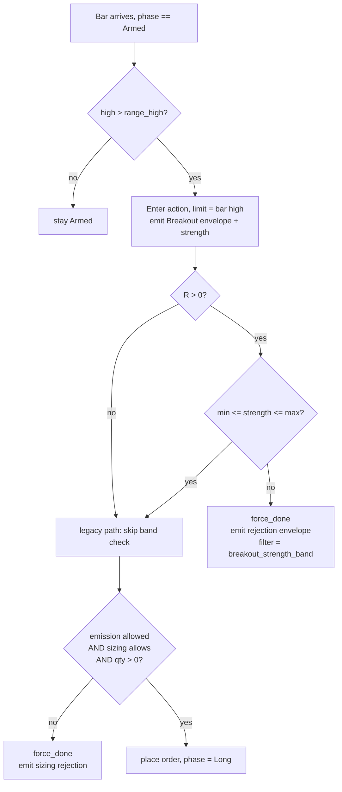

# ORB Breakout-Strength Band-Pass Filter (Strategy Loop Turn 10) - Plan

## Goal Capsule

- **Objective:** Land strategy-loop turn 10 — an entry-side breakout-strength band-pass filter on the ORB strategy plus the bundled MFE-semantics fix, executed as a seed-and-rerun code turn producing a governed v12 run on `data/turn4-fresh`, with an authored edge verdict.
- **Product authority:** The Product Contract below; the turn-9 diagnostic (`docs/solutions/conventions/strategy-loop-turn-9-profit-target-sweep-and-mfe-distribution.md`) for the empirical spec and acceptance bar.
- **Execution profile:** Fully offline — no gateway, no `LS_TRADING_ENV`, release binary. Operator data home is repo-root `data/turn4-fresh` (gitignored), not under `adapters/nautilus/`.
- **Stop conditions:** Any red gate; the seed assertion bailing (wrong resolved base); a v12 manifest whose `strategy_code_hash` equals v9's `d54955a8…` (stale binary — rebuild, do not proceed); `runs compare` failing for any reason other than the expected code-hash + band-fields diff.
- **Tail ownership:** The verdict lands in the v12 run's `analysis.md` (U5). Post-turn memory/docs capture is outside this plan.

---

## Product Contract

### Summary

Add a `breakout_strength_min`/`breakout_strength_max` band-pass pair to `OrbParams`, applied at the Armed→entry transition, and run the filter at band [0.06, 0.13] on the existing 24-session × 40-symbol sample. The turn re-seeds the data home off the v9 manifest (shedding v11's known-bad 1.05 profit target, documented as a reversion) and bundles the MFE-semantics fix, since the code hash moves and re-baselines anyway.

### Problem Frame

Turn 9 swept `profit_target_r` in both directions off v9 and both legs made expectancy worse (v10 @1.50: −4,406; v11 @1.05: −35,969 vs v9's −3,157), falsifying exit geometry as the expectancy lever. The same turn's MFE-distribution report exposed where the losses actually live: breakout strength, defined as `(breakout_price − range_high) / R`, cuts the entry population non-monotonically. The q3 band was the only bucket positive under two of three exit geometries and best under all three, while q2 and q4 carried nearly all losses:

| Strength quartile | v9 win / exp | v10 win / exp | v11 win / exp |
|---|---|---|---|
| q1 [0.002, 0.038) | 48.8% / −1,000 | 38.5% / −16,866 | 47.6% / +3,695 |
| q2 [0.038, 0.067) | 34.9% / −80,627 | 37.5% / −52,832 | 35.7% / −79,202 |
| q3 [0.067, 0.125) | 53.5% / +9,711 | 47.5% / −2,653 | 54.8% / +27,032 |
| q4 [0.125, 0.471] | 39.5% / −67,909 | 40.0% / −42,224 | 37.2% / −70,229 |

Entries were identical across all three runs, so this is three independent exit-geometry views of one entry population — unusually strong evidence for an entry-side cut. Two traps sit in the way of testing it. First, the latest finalized run is v11, so the next governed turn silently inherits `profit_target_r = 1.05`, the worst variant of that knob. Second, the band keeps only ~1/4 of entries (~43 trades over 24 sessions), and both sample-widening mitigations (universe past 40, longer date range) require attended live ingest.

### Key Decisions

- **Band-pass at the Armed→entry transition, band [0.06, 0.13].** The q3 evidence is a band, not a threshold — the strongest breakouts (q4) lose alongside the marginal ones (q2). The band edges start at the diagnostic's recommended widening of q3's [0.067, 0.125).
- **Offline-first; sample expansion is a pre-committed follow-up, not part of this turn.** The filtered run uses `data/turn4-fresh` as-is, keeping the turn unattended and the filter effect isolated against v9's sample. If the verdict is positive-but-thin or unreadable, the next turn is a live data-expansion turn (universe past 40 and/or extended range) — decided now so it cannot become a mid-turn scope change.
- **Re-seed off the v9 manifest rather than pinning to v11.** Testing the filter on top of the known-bad 1.05 target would muddy its verdict. The turn seeds from v9 (`profit_target_r = 1.0`, the local optimum of that knob) and documents the reversion in the run's analysis.
- **Bundle the MFE-semantics fix into this turn.** The exit-bar high-water fold inflates `mfe_r` for Stop/Target exits, and TimeFlat folds the exit bar deliberately to match them — so this is a semantics decision applied consistently across all three exit reasons, not a one-line bug fix. Bundling it here costs one re-baseline instead of two, and it touches reporting fidelity only, so expectancy attribution for the filter stays clean.
- **Filtered breakouts stay visible in the decision stream.** The strategy already emits the `Breakout` envelope unconditionally before the sizing gate and a distinct rejection signal on sizing refusal; the strength filter mirrors that pattern so strength-quartile reports keep seeing the whole entry population.
- **Pass-through defaults for the new params.** Legacy manifests and runs deserialize with filtering disabled and unchanged entry behavior, matching the back-compat convention `profit_target_r` established in turn 8.

### Requirements

**Strategy filter**

- R1. `OrbParams` gains `breakout_strength_min` and `breakout_strength_max`, with pass-through defaults that leave entry behavior unchanged when the fields are absent from a manifest.
- R2. At the Armed→entry transition, the strategy computes strength as `(breakout_price − range_high) / R` (with `R = range_high − range_low`) and enters only when strength lies within the configured band; the turn's run configures [0.06, 0.13].
- R3. A breakout rejected by the band still emits its `Breakout` envelope and a distinct filtered-rejection signal, mirroring the existing sizing-gate rejection pattern.

**Governance and data home**

- R4. The turn seeds off the v9 manifest so the filtered run resolves `profit_target_r = 1.0`, and its analysis documents the reversion from v11's 1.05.
- R5. The turn re-baselines as a strategy-logic change (like turn 8): the code hash moves, and governed compare treats the filtered run as a new baseline rather than a param variant.

**MFE fidelity**

- R6. The turn decides the intended `mfe_r` semantics with respect to the exit-bar high-water fold and applies it consistently to Stop, Target, and TimeFlat exits; the change affects reported `mfe_r` only — entry/exit decisions and trade P&L are unchanged by it.

**Verdict**

- R7. The filtered run is judged on the turn-9 acceptance criterion: expectancy > 0 and dominance ≤ 0.40, read against the sample-size cost (~43 expected trades over 24 sessions).
- R8. If the verdict is positive-but-thin or unreadable at that sample size — including a dominance miss plausibly attributable to low trade count — the turn records insufficient-evidence naming the pre-committed data-expansion follow-up, rather than declaring the filter falsified or expanding scope mid-turn.

### Key Flows

- F1. The turn, end to end
  - **Trigger:** Turn 10 starts with v11 as the latest finalized run.
  - **Steps:** Implement the filter and the MFE-semantics decision in the strategy → hand-seed a v12 manifest off the v9 manifest (band values set, profit target reverted to 1.0) so it becomes the latest finalized run, and pin the seed assertion to it → run the governed rerun (release binary, 24 sessions), producing the real v12 run under the new code hash → capture the re-baseline compare evidence → produce the MFE/strength report on the filtered run → author the edge verdict per R7/R8.
  - **Outcome:** Either a positive edge verdict for the band, or an insufficient-evidence verdict that names the data-expansion follow-up.
  - **Covers R1–R8.**

### Acceptance Examples

- AE1. **Covers R2.** Given the strategy is Armed and a breakout occurs at strength 0.09, when the band is [0.06, 0.13], then the entry proceeds exactly as it would without the filter.
- AE2. **Covers R2, R3.** Given a breakout at strength 0.03 (or 0.20), when the band is [0.06, 0.13], then no entry is placed and the decision stream carries both the `Breakout` envelope and a filtered-rejection signal for it.
- AE3. **Covers R1, R6.** Given a legacy manifest without the new fields, when the new binary runs it, then the entry/exit trade sequence is unchanged from the pre-filter binary; reported `mfe_r` values may differ only per the R6 semantics decision.
- AE4. **Covers R7, R8.** Given the filtered run shows expectancy > 0 but dominance 0.45 on ~40 trades, then the verdict is insufficient-evidence citing thin sample and naming the data-expansion follow-up — not a filter falsification and not a mid-turn universe widening.

### Scope Boundaries

- **Band-edge tuning is deferred.** Once the fields exist, edge tweaks become ordinary governed param turns; this turn tests the diagnostic's band as spec'd. (Governed tuning works from the v12 manifest onward; a 0.13→0.06 style change exceeds the 50% proposal-bounds cap and would take two legged turns.)
- **Live data expansion (universe past 40, extended date range) is deferred** to the pre-committed follow-up turn, and only fires if R8 triggers.
- **The turn-9 opportunistic items stay separate:** the cross-link refresh of the turn-9 diagnostic against the anchor-divergence convention doc, and the exit-geometry design considerations (censoring tolerance in the leg-2 candidate rule; `report mfe` calling the bounds guardrail instead of re-deriving the band formula) — the latter only matter if a future sweep revisits exit geometry.

### Dependencies / Assumptions

- `data/turn4-fresh` is intact at repo root with the v9 run (`20260710T013757Z-backtest-orb-v9`, `profit_target_r = 1.0`) available to seed from and v11 as the current latest finalized run (verified on disk).
- The strategy code hash covers `orb.rs` only; the filter logic lands there, so the hash moves even though the params live in `params.rs` (verified).
- The q3 evidence base is the turn-9 diagnostic's per-bucket approximate expectancy (entry/exit limit prices × qty) — directional bucket ranking, not reconciled engine P&L; the filtered run supplies the reconciled read.
- The turn runs entirely offline on the release binary (~90 s per 24-session leg).

---

## Planning Contract

**Product Contract preservation:** changed — F1's steps now name the seed shape (hand-seeded v12 manifest carrying the band values) because a verbatim v9 re-seed under R1's pass-through defaults would run the filter disabled; Scope Boundaries gained the proposal-bounds note on future band tuning. The brainstorm's Outstanding Questions (defaults representation, R6 semantics, rejection-signal shape) are resolved below as KTD2, KTD5, and KTD4. R/AE IDs and all other contract text unchanged.

### Key Technical Decisions

- KTD1. **Seed-and-rerun re-baseline via a hand-seeded v12 manifest.** Copy v9's manifest, set `strategy_version: 12`, `breakout_strength_min: 0.06`, `breakout_strength_max: 0.13`, keep `profit_target_r: 1.0` and all other v9 params, and place it as a manifest-only run dir in `data/turn4-fresh/runs/` with a timestamp head sorting after v11. Run `lab-research turn` in rerun mode (no `LS_TURN_PARAM`) with `LS_TURN_EXPECT_VERSION=12` and `LS_TURN_EXPECT_GAP=0.6`; delete the seed dir after the real v12 run lands. Rationale: this is the only path that gets the band values into the run — pass-through defaults can't carry them, and the governed turn path moves exactly one param per turn and rejects changes from a zero current value (`PROPOSAL_BOUNDS_CAP` zero-current rule). It is also the documented code-turn recipe (`docs/solutions/workflow-issues/code-turn-rebaseline-run-via-manifest-seed-and-rerun.md`); numbering the seed v12 (not a duplicate v9) keeps the registry monotone and the seed assertion unambiguous. The expected `runs compare` v9→v12 param-mode result is FAIL — `strategy_code_hash differs` plus the 3-key diff `{breakout_strength_min, breakout_strength_max, strategy_version}` — and that FAIL is the re-baseline evidence, not a stop condition.
- KTD2. **Concrete `f64` fields with filter-off serde defaults, not `Option`.** Defaults: `breakout_strength_min = 0.0`, `breakout_strength_max = f64::MAX`, via `#[serde(default = "...")]` free fns mirroring `default_profit_target_r` (`adapters/nautilus/lab/src/params.rs:47-56`). Rationale: `numeric_summary` drops non-numeric values, so `Option = None` fields would vanish from manifest summaries and make `apply_overrides` bail — the fields would never be sweepable by a governed turn; concrete defaults also keep manifests honest (the v9→v12 diff shows the band fields because the run values differ from the defaults).
- KTD3. **Filter placement: strategy layer, after the `Breakout` emission, before the sizing composite; rejection is done-for-day.** The check lands in `handle_actions` (`adapters/nautilus/lab/src/strategy/orb.rs:539-570`) as a separate branch immediately after the unconditional `Breakout` envelope, ahead of the existing `emission/sizing/qty` composite, so the rejection label stays truthful. Out-of-band → `force_done()` + rejection envelope, exactly the sizing-rejection shape. Rationale: R3 requires the `Breakout` envelope, which only exists at this layer (a state-machine veto would swallow it); one-shot-per-session preserves evidence fidelity — the q3 quartiles were computed on first-breakout strength, so re-arming for a later re-break would admit entries no evidence bucket measured (and with strength defined off the running bar high, a re-break's strength only grows past the max anyway).
- KTD4. **Rejection reuses `SignalKind::OrderRejectedSizing` with a new filter string, not a new enum variant.** The rejection envelope carries `filter: "breakout_strength_band"` and puts `strength`, `breakout_strength_min`, `breakout_strength_max` in `values`; the `Breakout` envelope also gains `strength` in `values`. Rationale: `read_envelopes` (`adapters/nautilus/lab/src/agent/replay.rs:61-83`) aborts the whole read on the first unknown enum tag, so a new `SignalKind` variant would make every decisions.jsonl containing it — including the shared cross-run registry — unreadable by any older binary; the kind is already a catch-all pre-placement rejection (its existing `emission_stopped` filter string isn't a sizing cause either), and `values` entries are schema-invisible. Recording strength on both envelopes lets future reports split strength rejections from sizing rejections and read strength without recomputing it.
- KTD5. **MFE folds exactly the excursion provably observed while the position was open.** Per exit reason:

  | Bar | Fold into `high_water` |
  |---|---|
  | Non-exit Long bar | full bar high (unchanged) |
  | Stop-exit bar | none — under stop-first pessimism the bar's high is not provably pre-stop |
  | Target-exit bar | capped at the target price — price provably reached target; the above-target wick is not provably pre-exit |
  | TimeFlat bar | full bar high (unchanged) — the position is open through the close |

  Rationale: consistent with turn 8's stop-outranks-target pessimism, and it makes the report's "right-censored at `profit_target_r`R" claim exact. Reporting-only: target/stop detection reads the bar `high`/`low` directly, never `high_water`, so entry/exit decisions and P&L are untouched (R6). The `saw_range`-before-sentinels guard in `mfe_r()` (`orb.rs:283-292`) must survive the restructure.
- KTD6. **Inclusive band; degenerate range bypasses the filter.** In-band means `min ≤ strength ≤ max`. When `R ≤ 0` the strength division never runs and the breakout passes the filter (legacy entry preserved). Rationale: guarding before the division removes the `x/0 → inf` path (which would otherwise make even the filter-off defaults reject degenerate breakouts, breaking AE3); the q3 evidence explicitly carved degenerate ranges out (`report mfe` counts them separately; v9 had zero), so the filter has no evidence basis to reject them.

### High-Level Technical Design

Per-bar entry decision with the filter in place (the only branching change; exits are untouched except the fold rules in KTD5):

Sequencing: U1 → U2 → U3 are one PR-able code change (U3 after U2 only because both edit `orb.rs`); U4 and U5 are the operator run and verdict, executable immediately after the code lands and gates pass.

---

## Implementation Units

### U1. Band params on `OrbParams`

- **Goal:** The two filter fields exist with filter-off defaults and full back-compat.
- **Requirements:** R1.
- **Dependencies:** none.
- **Files:** `adapters/nautilus/lab/src/params.rs` (fields, default fns, `impl Default`, in-file tests).
- **Approach:** Mirror the `profit_target_r` pattern exactly (KTD2): two `pub f64` fields with `#[serde(default = "...")]` free fns returning `0.0` and `f64::MAX`, doc comments stating the back-compat rationale, and both fields added to `impl Default`.
- **Patterns to follow:** `profit_target_r` declaration and its tests at `adapters/nautilus/lab/src/params.rs:42-56, 145-246`.
- **Test scenarios:**
  - Covers AE3 (partially). A manifest JSON predating the fields deserializes with `0.0`/`f64::MAX` (clone the `profit_target_r_deserializes_from_pre_field_manifest` shape).
  - `numeric_summary` includes both fields (governed-sweep visibility).
  - Round-trip: explicit values 0.06/0.13 serialize and deserialize unchanged.
- **Verification:** `cargo test -p nautilus-ls-lab` (from `adapters/nautilus/`) green; params tests extended, none removed.

### U2. Strength gate in the strategy

- **Goal:** Out-of-band breakouts are rejected, recorded, and done-for-day; in-band and filter-off behavior is behaviorally identical to today (same decisions and order flow, two permitted additive deltas — see the AE3 scenario).
- **Requirements:** R2, R3; AE1, AE2, AE3.
- **Dependencies:** U1.
- **Files:** `adapters/nautilus/lab/src/strategy/orb.rs`; tests in `adapters/nautilus/lab/tests/strategy.rs` and `adapters/nautilus/lab/tests/backtest_run.rs`.
- **Approach:** Per KTD3/KTD4/KTD6: in `handle_actions`, after the unconditional `Breakout` envelope (add `strength` to its `values`), compute strength from the action's breakout price and the state's range; if `R > 0` and strength is outside `[min, max]`, `force_done()`, emit the rejection envelope (`filter: "breakout_strength_band"`, values carrying strength and both edges), and `continue` — before the existing emission/sizing/qty composite, which stays untouched.
- **Test scenarios:**
  - Covers AE1. Strength 0.09 in band [0.06, 0.13] → order placed, envelopes identical to unfiltered run.
  - Covers AE2. Strength 0.03 → no order; `Breakout` + rejection envelope with the strength filter string; same for 0.20.
  - Boundary: strength exactly 0.06 and exactly 0.13 → entry proceeds (inclusive band).
  - Degenerate range (`range_high == range_low`) with the band configured → legacy entry, no division, no rejection.
  - Covers AE3. Default params → the envelope stream carries the same kinds, sequence, symbols, decisions, filters, prices, and quantities as the pre-filter binary on the same bar sequence (whipsaw, stop, target, timeflat cases), with exactly two permitted additive deltas: every envelope's params summary gains `breakout_strength_min`/`breakout_strength_max`, and each `Breakout` envelope's `values` gains `strength`. The test compares after projecting out those two deltas, or asserts the trade/order sequence directly.
  - Whipsaw bar whose entry is strength-rejected → no exit envelope is emitted for it.
  - A strength-rejected symbol stays Done for the rest of the session (no later re-entry on a stronger re-break).
  - Slot accounting: a strength-rejected symbol does not consume a `max_concurrent` slot (another in-band symbol can still enter).
- **Verification:** lab + workspace tests green; the AE3 behavioral-identity scenario passes with defaults.

### U3. MFE fold semantics

- **Goal:** `mfe_r` reflects only provably-observed favorable excursion, per the KTD5 table.
- **Requirements:** R6; AE3.
- **Dependencies:** U2 (same file; land after the gate to keep the diff reviewable).
- **Files:** `adapters/nautilus/lab/src/strategy/orb.rs`; tests in `adapters/nautilus/lab/tests/strategy.rs`.
- **Approach:** Restructure the Long-bar handling so exit determination precedes the fold: Stop exit → no fold of that bar; Target exit → fold `min(bar high, target price)`; no exit → full fold; TimeFlat fold unchanged. Preserve the `saw_range` guard ordering in `mfe_r()` and the stop-outranks-target resolution.
- **Execution note:** Write the Stop-bar and Target-cap tests first — they pin the semantics the restructure must produce, and the existing turn-8 MFE tests define what must not change.
- **Test scenarios:**
  - Stop exit on a bar whose high exceeds all prior highs → that high is excluded from `mfe_r`.
  - Target exit on a bar with an above-target wick → `mfe_r` caps at exactly `profit_target_r` (the report's censoring claim becomes exact).
  - TimeFlat behavior unchanged: `timeflat_mfe_includes_the_flat_bar_high` stays green as-is.
  - Existing turn-8 suite (`same_bar_target_and_stop_resolves_to_stop`, `non_positive_profit_target_r_never_fires`, `mfe_r_reports_post_entry_excursion` — updated only if it asserted the inflated semantics) stays green.
  - Degenerate-range trade still reports `mfe_r = 0` (sentinel guard intact).
- **Verification:** lab + workspace tests green; no change to any entry/exit decision or P&L figure in the backtest e2e tests.

### U4. Seed the v12 manifest and execute the governed run

- **Goal:** A finalized v12 run exists under the new code hash with the band active and v9's other params, with the re-baseline evidence captured.
- **Requirements:** R4, R5.
- **Dependencies:** U1, U2, U3.
- **Files:** `data/turn4-fresh/runs/` (operator data home, gitignored — seed manifest in, real run out).
- **Approach:** Per KTD1: rebuild the release binary from `adapters/nautilus/lab` (`cargo build --release -p nautilus-ls-lab --bin lab-research` — a repo-root build fails on package id, and a stale binary silently produces the old hash); hand-seed the v12 manifest (v9 params + band + version 12, timestamp after v11); run `lab-research turn` in rerun mode with `LS_TURN_EXPECT_VERSION=12`, `LS_TURN_EXPECT_GAP=0.6`; delete the seed dir; run `runs compare` v9→v12 in param mode and capture its expected FAIL (code hash + 3-key diff) as the re-baseline record.
- **Test expectation:** none — operational unit; correctness is proven by U1–U3's suites and the checks below.
- **Verification:** v12 manifest carries `strategy_code_hash ≠ d54955a8…`, `profit_target_r = 1.0`, band [0.06, 0.13]; the compare FAIL text matches the expected shape; the seed dir is gone; run has ~24 sessions of decisions.

### U5. Report and verdict

- **Goal:** The turn terminates in an authored, evidence-grounded verdict per R7/R8.
- **Requirements:** R7, R8; AE4.
- **Dependencies:** U4.
- **Files:** v12 run's `analysis.md` in `data/turn4-fresh/runs/` (scaffold then fill).
- **Approach:** Run `report mfe` with `LS_REPORT_RUN` pinned to the v12 run (never defaulted); evaluate edge (expectancy, dominance) from the run's performance artifacts; author the verdict. The analysis must carry: the documented `profit_target_r` 1.05→1.0 reversion (R4); a note that trade count above ~43 is expected (strength-rejected symbols free `max_concurrent` slots, admitting in-band breakouts v9's sizing gate refused); a note that v12's MFE statistics are not comparable to the turn-9 tables (new R6 semantics); the one-shot-per-session filter semantics; and — on any non-pass — the named next lever per R8 (thin → the pre-committed data-expansion follow-up; WR up but expectancy still pinned negative → a different strategy-logic lever, not band re-tuning).
- **Test expectation:** none — analysis artifact; its required content is enumerated above.
- **Verification:** `analysis.md` exists on the finalized v12 run with an explicit verdict line and all five required notes.

---

## Verification Contract

Run from `adapters/nautilus/` unless noted.

| Check | Command | Applies to | Done signal |
|---|---|---|---|
| Lab suite | `cargo test -p nautilus-ls-lab` | U1–U3 | Green; suite grows (currently ~215), none removed |
| Adapter workspace | `cargo test --workspace` | U1–U3 | Green (~490+) |
| Release build | `cargo build --release -p nautilus-ls-lab --bin lab-research` from `adapters/nautilus/lab` | U4 | Fresh binary; new code hash in the v12 manifest |
| Re-baseline evidence | `runs compare` v9→v12, param mode | U4 | Expected FAIL: `strategy_code_hash differs` + diff `{breakout_strength_min, breakout_strength_max, strategy_version}` |
| Behavior invariance | AE3 behavioral-identity test (U2, two permitted additive deltas) + e2e decision assertions in `lab/tests/backtest_run.rs` | U2, U3 | Default-params decisions and order flow unchanged; P&L figures unchanged by U3 |

Root-workspace gates (`make docs`, `make docs-check`, `make lane-check`) do not apply — no root-crate, metadata, or docs-generating files change.

---

## Definition of Done

- U1–U3 landed with their test scenarios passing; lab and workspace suites green.
- v12 run finalized in `data/turn4-fresh` under the new code hash with `profit_target_r = 1.0` and the band active; seed manifest deleted; compare FAIL captured.
- `analysis.md` authored on the v12 run with an explicit R7/R8 verdict and the five required notes (U5).
- No abandoned experimental code in the diff; `orb.rs` changes limited to the gate and the fold semantics.
- Any insufficient-evidence outcome names the pre-committed follow-up rather than proposing new in-turn work.

---

## Sources / Research

- `docs/solutions/conventions/strategy-loop-turn-9-profit-target-sweep-and-mfe-distribution.md` — the empirical spec, quartile evidence, right-censoring caveat, and acceptance criterion this plan inherits.
- `docs/solutions/workflow-issues/code-turn-rebaseline-run-via-manifest-seed-and-rerun.md` — the seed-and-rerun code-turn recipe KTD1 follows, including the stale-binary and repo-root-build gotchas.
- `docs/solutions/conventions/strategy-loop-param-turn-governance-and-fresh-home-seeding.md` — proposal-bounds cap (committed, not overridable), seed assertion, offline-turn conventions.
- `docs/solutions/conventions/strategy-loop-reading-param-turn-outcomes-win-rate-vs-expectancy.md` — the outcome-classification lens U5's verdict applies.
- `docs/solutions/conventions/report-preview-governance-band-must-anchor-on-deciders-run.md` — why U5 pins `LS_REPORT_RUN` instead of defaulting.
- Verified code anchors: Armed→entry and `handle_actions` rejection shape (`adapters/nautilus/lab/src/strategy/orb.rs:356, 539-570`); high-water folds and `mfe_r` guard (`orb.rs:283-292, 340-345, 363-384`); `profit_target_r` precedent (`adapters/nautilus/lab/src/params.rs:42-56`); param diff through serde-defaulted deserialization (`adapters/nautilus/lab/src/runner/research.rs:505-517`); code hash over `orb.rs` only (`adapters/nautilus/lab/src/artifacts/manifest.rs:97-99`, `lab/src/strategy/mod.rs:10`); envelope reader aborts on unknown tags (`adapters/nautilus/lab/src/agent/replay.rs:61-83`); run ordering and seed assertion (`research.rs:85-107, 235-254, 1254-1261`); turn-8 test shapes (`adapters/nautilus/lab/tests/strategy.rs:126-232`).
- Prior-turn context: turn-8 re-baseline precedent and `profit_target_r` back-compat convention (`docs/plans/2026-07-09-004-feat-orb-exit-geometry-diagnostic-gated-plan.md`); turn-9 plan (`docs/plans/2026-07-10-001-feat-turn9-profit-target-sweep-mfe-report-plan.md`).
