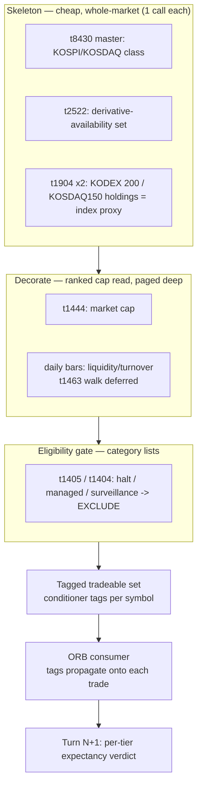
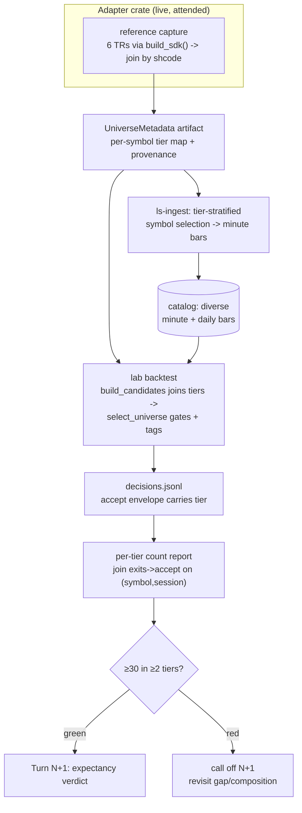

# Reference-Data Universe Engine - Plan

## Goal Capsule

- **Objective:** Build a reusable KRX reference-data universe engine that tags each symbol with cap, liquidity, market class, index membership, derivative availability, and tradability — then run an attended tier-stratified ingest to test whether ORB's absent edge is a universe-*composition* artifact rather than an absent signal. Turn N (this plan) lands the engine + ingest + a per-tier trade-count power pre-check; the ORB conditional-edge verdict is Turn N+1.
- **Product authority:** strategy-loop owner (user).
- **Execution profile:** mostly offline (engine logic, selection, report — proven by the existing wiremock gate); one **attended** live segment for the first exercise of the six captured reference TRs during an open KRX window (`t1463` is deferred out of Turn N — see R2), preceded by a closed-window pre-flight of the five closure-certifiable TRs (see Verification Contract).
- **Pre-registered gates:** power pre-check floor is ≥30 trades in ≥2 tiers (directional); ingest is a tier-stratified sample across cap × market-class strata; cap-tier boundaries and the four-cell partition are pre-registered before ingest (see Key Decisions / U1). Before the attended window is committed, the floor's reachability must be stated and judged plausible (see Dependencies — Attended ingest).
- **Stop conditions:** Turn N completes at the per-tier trade-count verdict. A **red** pre-check (fewer than 2 tiers clear 30 trades) is a valid completion, not a failure — it calls off Turn N+1. Turn N reports **no** expectancy — the run's standard `performance.json` artifact continues to be written unchanged, but it is never read or surfaced for Turn N's summary or verdict; that is the staging guard.
- **Tail ownership:** user reviews the pre-check verdict and decides whether Turn N+1 runs.

---

## Product Contract

**Product Contract preservation:** changed R2 (cap-source reach — `t1444` has no price/volume filter, so the small-cap tail is taken by exclusion) and R6 (strata defined by clean market-class + cap axes; index membership is a conditioner tag, not a stratum boundary). Both are HOW clarifications that keep the WHAT intact; all other Product Contract text is unchanged. A review pass further amended R2 (whole-market `t1463` turnover walk deferred out of Turn N — the SDK helper does not exist and Turn N never reads the attribute; equities-only `etfgubun` filter on the skeleton) and R5 (the floor gates only on resolved turnover) — HOW clarifications on the same basis.

### Summary

Build a reference-data universe engine that decorates every KRX symbol with instrument metadata and lets per-session filters + ranking define the tradeable set, with ORB as its first consumer. This turn builds the engine, runs an attended ingest of a metadata-diverse universe, and validates the join and per-tier trade counts. It produces no strategy verdict — that is the next turn.

### Problem Frame

ORB has been falsified four times and its expectancy has never crossed zero (least-negative v9 −3,157, v12 −20,735). Every entry-side and target-side lever tried — universe width, concurrency, range, entry-strength band, fixed profit target — failed to move it.

The offline dataset those falsifications ran on is the confound. `data/turn4-fresh` holds only mega-cap KOSPI-200 blue chips (Samsung Electronics, SK Hynix, Hyundai Motor, POSCO, Kia…). On every attribute that could define a universe they are uniform: max liquidity, all index members, all large-cap, all with derivatives. That is the tier where opening-range breakout continuation is theorized to be *weakest* — the most efficient, most arbitraged, most mean-reverting names — and blue chips rarely gap, which is why turn 4 saw trades stay flat at 6 across universe widths 20/30/40. The gap filter starves because the universe is the wrong *kind* of symbol, not the wrong count.

So "ORB has no edge" has not actually been tested. What has been tested is "ORB has no edge *on mega-cap KOSPI-200 names*," which is the tier where breakout continuation is theoretically weakest. Separating those requires a universe with cross-sectional variance in the attributes that plausibly condition the edge — which the current data does not have and cannot be made to have by widening a blue-chip list.

### Key Decisions

- **Universe composition is the lever, not exits.** The binding constraint across every prior turn was the monolithic universe. Exit-side levers (breakeven / trailing / scale-out) remain plausible but are parked until ORB has been tested on a universe where a breakout edge could exist.
- **Build a reusable universe engine, not an ORB tweak.** The metadata layer is infrastructure the autonomous system needs regardless of ORB's fate; ORB is its first consumer and proof, not the point.
- **Stage the work.** Turn N (this plan) delivers the engine + ingest + join/count validation. Turn N+1 runs the ORB re-run + per-tier expectancy report — the falsifiable conditional-edge verdict. A universe engine is infrastructure and cannot pass or fail the loop's falsification test on its own; splitting keeps each turn's claim clean.
- **Turn N is the power pre-check for N+1.** If the diverse ingest still fails to generate trades per tier, that negative result is Turn N's finding and N+1 is called off before it runs — cheaper than discovering thin buckets mid-verdict.
- **v1 attribute set is the cheap+clean cut.** Include the attributes with direct sources reachable via whole-market / category / per-ETF calls; defer the expensive per-symbol attribute (corporate actions) and the one the API does not expose (short-sale eligibility).
- **Pre-register the pre-check gate before ingest.** The floor (≥30 trades in ≥2 tiers) and the tier-stratified composition are fixed now, not tuned after seeing trade density — setting them post-hoc would p-hack the loop's falsification discipline. Pre-registration covers the tier definition itself, not just the floor: the cap-tier boundary rule (fixed cap-rank quantiles computed once over the capture artifact) and the exact four-cell partition (see U1) are recorded in provenance before the ingest runs — boundaries set after seeing trade density could move trades between tiers and flip the verdict.

### Requirements

**The metadata join (the engine)**

- R1. The engine assembles a whole-market symbol skeleton from cheap one-call reads: market class KOSPI/KOSDAQ (`t8430` master `gubun`), a derivative-availability flag (`t2522` single-stock-futures underlying set, `bsc_asts_is_cd`), and an index-membership proxy (`t1904` ETF holdings for KODEX 200 `069500` and KODEX KOSDAQ150 `229200`).
- R2. The engine decorates each symbol with market cap (`t1444` `total`) and liquidity/turnover from catalog daily bars (close×volume — already the backtest's `prior_turnover`). The whole-market `t1463` turnover walk is **deferred out of Turn N**: the SDK's `top_value` is a single-page read (no all-pages walk helper exists today), Turn N's strata are market-class + cap only, and the liquidity floor is consumed at the backtest join where daily bars exist for every ingested symbol — so the walk would spend shared attended-window budget on an attribute Turn N never reads. Symbols outside the ingested set carry `turnover` as `Unavailable` (R4). `t1444` is a bounded ranked board with only an `idx` cursor and no price/volume filter, so it cannot reach the small-cap tail: symbols below the cap board take a small-cap tier by **exclusion** from the whole master (`t8430`) and carry `market_cap` as `Unavailable`/`Proxy` (R4). The skeleton is equities-only: rows with a non-empty `etfgubun` flag ("1" ETF / "2" ETN) in the `t8430` master are dropped before tiering and stratification — otherwise the exclusion stratum fills with index-tracking funds and the power pre-check measures ETF bars, not gappy small-cap equities. The applied instrument-type filter is recorded in artifact provenance; `t8430` exposes no flag for preferred shares/SPACs/REITs, so residual non-common-stock pollution in the exclusion stratum is an accepted, documented limitation.
- R3. The engine applies a tradability/surveillance eligibility gate as a hard filter (not a conditioner tag): any symbol currently carrying a `t1405` designation (halt, caution, warning, risk, overheated) or a `t1404` managed/caution status on the session is excluded from the tradeable set.
- R4. Every attribute resolves to one of `{value, proxy-value, unavailable}` and the resolution is recorded per symbol — a proxy or missing value is never silently defaulted to a confident boolean.
- R5. The liquidity floor is a parameter, not a hardcoded blue-chip cut: the engine can reach into gappier mid/small-cap tiers while still expressing a tradability-safety floor, so the same layer serves the ORB test and the autonomous system's safety needs. The floor gates only on **resolved** (`Value`/`Proxy`) turnover: a symbol whose turnover is `Unavailable` at capture time is admitted to stratified ingest selection with its resolution recorded, and the backtest-side floor gates on daily-bar-derived `prior_turnover` once bars exist for it — fail-closed on `Unavailable` would gut exactly the small-cap stratum the test targets, while silent fail-open would defeat the floor's safety intent.

**Diverse ingest and Turn-N validation**

- R6. An attended ingest widens the minute-bar universe via a tier-stratified sample — roughly equal symbols across four strata defined by clean axes (market class `t8430` + cap tier): blue-chip KOSPI, mid-cap KOSPI, KOSDAQ mid/small, and small-cap — over the current ~24–28 session span, bounded by the IGW00201 minute-bar budget. Index membership rides as a conditioner tag (R9), **not** a stratum boundary: it is only an ETF proxy and the market-class fallback cannot reconstruct KOSDAQ 150, so stratifying on it would inherit proxy error. Stratifying rather than screening for gap-prone names keeps tier attribution clean: an edge difference can be assigned to tier rather than to a gappiness pre-selection.
- R7. Turn N validates the join: every ingested symbol carries all v1 attributes resolved-or-flagged, and the surveillance gate provably excludes designated names from the tradeable set.
- R8. Turn N computes and reports per-tier trade counts as the power pre-check against the pre-registered floor: ≥30 trades in each of ≥2 tiers green-lights the N+1 verdict turn; short of that, N+1 is called off. Turn N produces no strategy expectancy verdict.

**Consumer / segmentation contract**

- R9. Conditioner tags (cap tier, liquidity tier, market class, index membership, derivative flag) attach to each selected candidate and propagate onto every resulting trade, so Turn N+1 can segment expectancy by tier without re-deriving or re-fetching metadata.
- R10. The engine is a reusable layer with ORB as first consumer: ORB's universe selection draws from the engine instead of its current daily-bar-only gap+turnover scan, and the selection remains runnable unchanged in both the backtest engine and a live node.

### Universe engine data flow

### Acceptance Examples

- AE1. **Covers R8 — power pre-check green.** The stratified ingest yields ≥30 trades in each of at least two tiers → Turn N green-lights the Turn N+1 verdict turn.
- AE2. **Covers R8 — power pre-check red.** Fewer than two tiers clear 30 trades (the gap filter starves in most strata as it did on blue chips) → Turn N's result is a documented negative finding; N+1 is called off. The red verdict cannot by itself separate a genuinely thin tier from a global `gap_min_pct` calibrated on blue chips being wrong for another tier, so the next decision is gap-threshold recalibration or composition — not a verdict run. The U6 report's per-tier gap-% distribution is the data for that decision: it separates a tier with no qualifying gaps (genuinely thin) from a tier whose gap sizes cluster just below the blue-chip-calibrated threshold (miscalibration), so a red verdict is immediately actionable without another analysis pass over an already-spent budget.
- AE3. **Covers R3 — surveillance gate.** A symbol under a `t1405` trading halt on the session is excluded from the tradeable set even when it passes the cap, liquidity, and gap filters.
- AE4. **Covers R4 — proxy transparency.** A symbol absent from both KODEX ETF holdings is tagged `index-membership = none (proxy)`, not silently `KOSPI200 = false` with unearned confidence.

### Success Criteria

- Turn N+1 can segment expectancy directly from the ingested catalog with no further reference-data calls (tags are already on the trades).
- Each uncertified reference TR either returns usable paper data or is documented as paper-incompatible with its failure code — the join has no silent holes.
- The per-tier trade-count report states, per tier, count vs floor and the resulting green/red pre-check decision.

### Scope Boundaries

**Deferred for later**

- Exit-side levers — breakeven, trailing, and scale-out stops (the give-back / loss-tail frontier). Still plausible; revisited only after ORB is tested on a fair universe.
- The whole-market `t1463` turnover walk — requires authoring a `top_value_all` pagination helper in the SDK mirroring `market_cap_top_all` (body `idx` cursor + `tr_cont:Y` threading, shcode dedup); Turn N derives liquidity from daily-bar turnover instead (R2/R5), so the walk lands with a later engine turn.
- The ORB re-run and per-tier expectancy verdict — explicitly Turn N+1.
- Corporate-action enrichment (`t3202`) and short-sale activity (`t1927`) — per-symbol, expensive, low edge-value for v1.
- `OrbParams` min ≤ max band validation (an inverted band silently trades zero) — an unrelated residual; fold into a code turn, not this ingest.

**Outside the v1 identity**

- Short-sale eligibility as a conditioner — the API exposes no per-symbol eligibility flag (only `t1927` activity), so it is not a v1 axis.
- Corporate-action price-adjustment ratios and delisting schedules — data GAPs; the engine can flag that an event exists but cannot compute adjustment magnitudes.

### Dependencies / Assumptions

- **Reference TR support status:** every captured source TR (`t8430`, `t2522`, `t1904`, `t1444`, `t1405`, `t1404`; `t1463` deferred per R2) is `implemented` but not `recommended` — Turn N is their first live paper exercise. No IGW40011 numeric-field risk remains (research confirmed all seven request structs are correctly modeled; `t1444`/`t1463` already carry `string_as_number`).
- **Index membership is a proxy.** `t1904` returns ETF PDF holdings, which track but are not identical to official KOSPI200/KOSDAQ150 constituency. Market class (KOSPI/KOSDAQ, `t8430` `gubun`) is the clean fallback if the proxy proves too noisy.
- **Surveillance enum needs a live probe.** The `t1405` `gubun`/`jongchk` designation-category codes are not captured in the normalized baseline; confirm the domain live (via `make raw-probe`) before the gate relies on specific categories.
- **Session dependency.** `t1904` needs an open KRX window (empty/PENDING under closure; the deferred `t1463` shares this constraint when it lands); the other five certify under closure and are pre-flighted under closure before the attended segment (see Verification Contract), so the attended open window carries only the `t1904` first-exercise risk plus the paced ingest. The first live exercise must be attended during market hours.
- **Attended ingest.** Minute-bar breadth is bounded by the shared MarketData IGW00201 cumulative budget. The whole-market/category/per-ETF skeleton is cheap (~15 calls), but the `t1444` ranked board is paged and adds calls to the same cumulative budget — the metadata capture must be paced and sequenced so it does not starve the minute-bar ingest in the shared attended window. **Floor reachability pre-check (before the window is committed):** state the budget-derived per-stratum symbol count and the implied per-symbol-session trade rate required to clear 30 trades over the ~24–28 session span, and confirm that rate is plausible — prior evidence is ~6 trades over ~24 sessions on 20–40 blue chips, so the floor implies a large rate jump the gappier tiers must supply. If the implied rate is implausible at the affordable sample size, adjust the floor or the span *before* ingest, not after — otherwise a red verdict cannot be distinguished from "sample too small".
- **Tags are point-in-time (as-of the capture session).** v1 captures metadata on one attended session and applies it across the whole ~24–28 session backtest window; the surveillance gate and near-boundary tiers are not re-evaluated per historical session. This is an accepted, documented bias for the count pre-check and a known confound Turn N+1 must weigh before reading per-tier expectancy. Restricting the backtest span to sessions at/after capture is the mitigation if the bias proves material.
- **A single global `gap_min_pct` is held fixed across all strata,** so per-tier trade counts are threshold-conditioned. Gap-size distributions differ by tier, so a threshold calibrated on blue chips is not directly comparable across strata; per-tier or percentile-based gap calibration is a deferred Turn N+1 refinement.

### Sources / Research

- `adapters/nautilus/lab/src/strategy/orb.rs:75` — `select_universe`; `:49` `UniverseCandidate` (4 fields, no metadata); stop hard-wired to `range_low` (full −1R); time-flat exit at the flat bar's low.
- `adapters/nautilus/lab/src/runner/backtest.rs:385` — `build_candidates` derives every candidate from catalog daily bars (`prior_turnover` = close×volume proxy); single call site `:285`. The metadata engine plugs in here.
- `adapters/nautilus/src/bin/capture-universe.rs` — existing one-time `t1444` capture → `lab/config/turn3-universe.json` (`UniverseFile { provenance, shcodes }`), consumed by ingest via `LS_INGEST_SYMBOLS`. The metadata artifact is its superset.
- `adapters/nautilus/src/config.rs:171` `build_sdk()` (paper interlock `:154`); `adapters/nautilus/src/bin/ls-ingest.rs:111` — client construction pattern. Lab `runner/live.rs` is a hard-bail stub and cannot reach the gateway.
- SDK read facades: `market_session().stock_issues()` (t8430), `market_session().etf_constituents()` (t1904), t2522 via `T2522_POLICY`; `paginated().market_cap_top_all(upcode, max_rows)` (t1444 — needs body `idx` + `tr_cont:Y`, not `collect_all`), `top_value` (t1463), `trade_suspension` (t1405), `designation_board` (t1404).
- `adapters/nautilus/lab/src/runner/report.rs:216-286` — `report mfe` joins exit envelopes to breakout envelopes on `(symbol, session-date)` and buckets by quartile; the per-tier cut extends this exact join.
- `adapters/nautilus/lab/src/agent/envelope.rs:165` `DecisionDetail` (values numeric-only, no tag field); `src/artifacts/data_quality.rs:86` `universe_snapshot: Vec<String>` (no tier field today).
- `adapters/nautilus/src/ingest/budget.rs` — `BudgetModel`/`SpendLedger` MarketData pacing (currently inert `budget_calls: None` → 120s blind backoff). `docs/solutions/integration-issues/ls-gateway-igw40011-numeric-request-fields.md`.
- Prior loop context: turn 4 found trades flat at 6 across universe widths 20/30/40 — corroborates the gap filter starving on blue chips.

---

## Planning Contract

### Key Technical Decisions

- KTD1. **Engine lives in the adapter crate as a live reference-data capture, extending `capture-universe`.** The authenticated SDK client is built in `adapters/nautilus/src/config.rs` (`build_sdk()`); lab `runner/live.rs` is a hard-bail stub. `capture-universe.rs` already writes a universe artifact consumed by ingest — the metadata engine is its superset, not a new lab-side layer.
- KTD2. **One `UniverseMetadata` artifact, two consumers.** A single JSON (superset of `UniverseFile`) is the source of truth for the per-symbol metadata. Ingest reads it for **reproducible stratified symbol selection** (R6); the backtest joins it into `UniverseCandidate` and owns the tier used for the counted segmentation (R10). One artifact avoids re-deriving metadata in two places; the backtest join, not the ingest read, establishes the counted tier. The artifact's content hash is stamped into both the ingest provenance and the backtest run manifest, and the U6 report fails when the two hashes differ — the capture is session-dependent (designations, cap ranks, ETF holdings shift per session), so a re-capture between ingest and backtest would silently re-tier symbols and corrupt the per-tier counts (same class of pin as `strategy_code_hash` and the turn EXPECT_VERSION seed-assertion). If wiring artifact-reading into `ls-ingest` proves disproportionate, U3 can fall back to a precomputed `LS_INGEST_SYMBOLS` list.
- KTD3. **Tradability is a hard filter; the tier attributes are conditioner tags.** The surveillance gate (`t1405` designation categories + `t1404`, exact codes confirmed live per Assumptions) excludes; cap / liquidity / market-class / index / derivative tags attach and propagate. The liquidity floor is a parameter (R5). This keeps tier attribution clean and the tradeable set safe.
- KTD4. **The full conditioner-tag set rides the universe-accept envelope; segmentation reuses the existing `(symbol, session-date)` join.** `DecisionDetail` has no categorical tag today (`values` is numeric-only). Add an optional conditioner-tag set — cap tier, liquidity tier, market class, index membership, derivative flag (the R9 tags, kept off the numeric `values` map) — to the universe-accept envelope emitted at selection. The per-tier report joins exit envelopes to that accept envelope on symbol+session — the same join `report mfe` already runs for breakout buckets — and buckets on the stratification axis while the other tags ride the trade for Turn N+1. Carrying **all five** tags (not just one `tier`) is what lets N+1 segment by any axis "with no further reference-data calls" (R9); recording them in the run's own telemetry keeps each run self-contained.
- KTD5. **Turn N runs the ORB backtest for counts only.** The backtest must run to produce trades to count per tier (R8), but expectancy is withheld from the Turn-N summary and per-tier report — no per-tier P&L, no edge call. The runner's standard `performance.json` artifact (which unconditionally carries expectancy and is read back by existing machinery, `backtest.rs:159`/`:195`/`:539`) continues to be written unchanged; the guard is that Turn N's summary, report, and verdict never read or surface it. This is the staging guard that keeps the falsifiable claim for Turn N+1.
- KTD6. **Live capture is attended and outside the offline gate; offline tests use wiremock.** The six captured TRs are `implemented`-not-`recommended`; `t1904` needs an open window; the MarketData IGW00201 budget is cumulative and shared with the minute ingest. The five closure-certifiable TRs are pre-flighted under closure before the attended segment (see Verification Contract). First live exercise is attended during market hours, paced via `ingest/budget.rs`, using `market_cap_top_all` for `t1444` (pagination trap). `make raw-probe` A/B's any TR that fails before typed calls are authored.

### High-Level Technical Design

Two-consumer architecture — one live capture writes the artifact; ingest and the offline backtest both read it; the backtest's tagged trades feed the per-tier count report.

### Sequencing

U1 (schema + pure logic) is the root. U2 (live capture) and U3 (stratified ingest) both consume U1's schema. U4 (candidate join + gate) consumes U1; U5 (tag propagation) consumes U4; U6 (report + verdict) consumes U5. The offline-testable code (U1, U3, U4, U5, U6) can land and gate on its unit tests before the attended live segment — U2's capture and the U3-driven ingest run — executes.

---

## Implementation Units

### U1. Metadata schema, tiering, and artifact format

- **Goal:** define the `UniverseMetadata` record and artifact (superset of `UniverseFile`) plus the pure tier-assignment, tradability-gate, and stratified-sample logic.
- **Requirements:** R1, R3 (gate logic), R4, R5.
- **Dependencies:** none.
- **Files:** `adapters/nautilus/src/reference/mod.rs` (new), `adapters/nautilus/src/reference/universe_metadata.rs` (new), unit tests inline (`#[cfg(test)] mod tests`).
- **Approach:** `InstrumentMetadata { shcode, market_class, market_cap: Resolved<f64>, cap_tier, turnover: Resolved<f64>, liquidity_tier, index_membership: Resolved<Option<Index>>, has_derivative: Resolved<bool>, designation: Option<Designation>, tradable: bool }` where `Resolved<T> = Value(T) | Proxy(T) | Unavailable`. Pure fns: `assign_cap_tier` / `assign_liquidity_tier` (parameterized boundaries + floor), `is_tradable` (gate on designation), `stratify(records, strata, per_stratum)`. Strata are defined by market class + cap tier over the equities-only skeleton (non-empty `etfgubun` rows dropped, R2). The four-cell partition is **pre-registered and deterministic**: (1) blue-chip = KOSPI × top cap tier, (2) mid-cap KOSPI = KOSPI × mid cap tier, (3) KOSDAQ mid/small = KOSDAQ × on-board cap tiers, (4) small-cap-by-exclusion = any market class × `Unavailable` cap (below the `t1444` board) — a below-board KOSDAQ symbol lands in cell 4, not cell 3, so no symbol is claimable by two cells. Cap-tier boundaries are fixed cap-rank quantiles computed once over the capture artifact and recorded in provenance before ingest (Key Decisions). Artifact carries `provenance` (capture date, session, TR set, instrument-type filter, tier-boundary rule) + the records.
- **Test scenarios:** cap/liquidity tier assignment at boundary values; `is_tradable` false for each designation category and true for a clean symbol (Covers AE3); a symbol missing from one source resolves that attribute to `Unavailable`/`Proxy`, never a defaulted value (Covers AE4); a symbol with `Unavailable` cap lands in the small-cap stratum by exclusion (not dropped); a below-board KOSDAQ symbol lands in the small-cap (exclusion) stratum, not KOSDAQ mid/small; a non-empty-`etfgubun` row is dropped from the skeleton before tiering; `stratify` returns ~equal counts per stratum and degrades gracefully when a stratum is thin; artifact serde round-trips.
- **Verification:** reference-module unit tests pass; artifact round-trips byte-stable.

### U2. Reference-data live capture

- **Goal:** fetch the six captured TRs via SDK facades, join by `shcode` into U1 records, and write the metadata artifact.
- **Requirements:** R1, R2, R3, R4.
- **Dependencies:** U1.
- **Files:** `adapters/nautilus/src/reference/capture.rs` (new), `adapters/nautilus/src/bin/capture-universe-metadata.rs` (new bin, mirroring `capture-universe.rs`).
- **Approach:** build the client via `LsAdapterConfig::build_sdk()` (paper interlock). Skeleton: `t8430` `stock_issues` (class; drop non-empty-`etfgubun` rows and record the filter in provenance, R2), `t2522` (derivative set), `t1904` `etf_constituents` for `069500` + `229200` (index proxy). Decorate: `t1444` `market_cap_top_all` (cap — body `idx` + `tr_cont:Y`, bounded ranked board). Turnover is **not** captured this turn (`t1463` walk deferred, R2): the capture writes `turnover = Unavailable` and the backtest join derives liquidity from daily bars (U4). Symbols in the `t8430` master but below the `t1444` board get `market_cap = Unavailable` and fall into the small-cap stratum by exclusion (U1). Gate: `t1405` `trade_suspension` + `t1404` `designation_board` across the designation categories. Join all by `shcode` into U1 records; pace via the MarketData budget model so the paged cap/turnover reads do not starve the minute-bar ingest in the shared window. Enforce `LS_TRADING_ENV=paper`.
- **Execution note:** attended, during an open KRX window (`t1904` needs it); the five closure-certifiable TRs are pre-flighted under closure beforehand (Verification Contract). Uncertified on paper — `make raw-probe` any TR that fails before authoring typed calls; record any paper-incompatible TR with its failure code rather than silently dropping the attribute.
- **Patterns to follow:** `adapters/nautilus/src/bin/ls-ingest.rs:111` (build_sdk); `adapters/nautilus/src/ingest/budget.rs` (pacing); `market_cap_top_all` pagination.
- **Test scenarios:** offline wiremock serving each TR → join produces the expected records; a symbol present in the cap read but absent from `t2522` resolves `has_derivative = Value(false)` while a symbol absent from both ETFs resolves `index_membership = Proxy(None)` (Covers AE4); a non-empty-`etfgubun` master row is excluded from the joined records; the `t1444` multi-page walk dedups on `shcode`; a budget `Defer` decision is honored. Live: attended smoke writes a populated artifact (out of the offline gate).
- **Verification:** offline wiremock join test passes; attended live run writes an artifact with every attribute `Value`/`Proxy`/`Unavailable`-resolved.

### U3. Tier-stratified ingest selection

- **Goal:** let `ls-ingest` draw a tier-stratified symbol set from the metadata artifact.
- **Requirements:** R6.
- **Dependencies:** U1.
- **Files:** `adapters/nautilus/src/bin/ls-ingest.rs` (symbol resolution), `adapters/nautilus/src/ingest/mod.rs`.
- **Approach:** when a metadata-artifact path is supplied, resolve the ingest symbol set from `stratify` (U1) across blue-chip KOSPI / mid-KOSPI / KOSDAQ mid-small / small-cap strata, ~equal per stratum, bounded by the budget/symbol cap. Falls back to the existing `LS_INGEST_SYMBOLS` behavior when no artifact is given.
- **Test scenarios:** given a metadata artifact, selection returns ~equal symbols per stratum; a thin stratum contributes all it has without erroring; the total respects the symbol-count bound; absent artifact preserves existing behavior.
- **Verification:** selection unit test passes; a dry-run lists the stratified symbol set with per-stratum counts (the input the floor-reachability pre-check in Dependencies needs).

### U4. Candidate enrichment + gated selection

- **Goal:** widen `UniverseCandidate` with tier metadata, join the artifact in `build_candidates`, and gate `select_universe` on tradability + the liquidity floor while carrying conditioner tags forward.
- **Requirements:** R3, R5, R9, R10.
- **Dependencies:** U1.
- **Files:** `adapters/nautilus/lab/src/strategy/orb.rs` (`UniverseCandidate`, `select_universe`), `adapters/nautilus/lab/src/runner/backtest.rs` (`build_candidates`), `adapters/nautilus/lab/tests/strategy.rs`.
- **Approach:** add `cap_tier`, `liquidity_tier`, `market_class`, `index_membership`, `has_derivative`, `tradable` to `UniverseCandidate`. `build_candidates` loads the metadata artifact and joins by symbol. `select_universe` excludes non-tradable and below-floor symbols before the existing gap + turnover rank, and attaches the resolved tier to the accept path (feeds U5). The liquidity floor evaluates daily-bar `prior_turnover` (present for every ingested candidate), not the capture-time turnover attribute — so `Unavailable` capture turnover never silently passes or fails the floor (R5). A symbol with no metadata is treated as non-selectable and recorded, not silently defaulted.
- **Execution note:** implement the gate/floor test-first in `tests/strategy.rs` — the selection core is the unit most likely to hide off-by-one / gate bugs.
- **Test scenarios:** a non-tradable symbol is excluded even when its gap and turnover qualify (Covers AE3); a below-floor symbol is excluded; a candidate with `Unavailable` capture turnover is floor-gated on its daily-bar `prior_turnover`, not dropped; the gap+turnover ranking is preserved within the filtered set; a candidate with missing metadata is dropped and recorded; the accept path carries the correct tier.
- **Verification:** `tests/strategy.rs` passes; a backtest run over a metadata fixture shows gated, tagged selection.

### U5. Conditioner-tag propagation onto trades

- **Goal:** flow the resolved conditioner tags from selection onto each trade so exits are attributable to any tier axis (R9).
- **Requirements:** R9.
- **Dependencies:** U4.
- **Files:** `adapters/nautilus/lab/src/agent/envelope.rs` (optional conditioner-tag set on the universe-accept `DecisionDetail`), `adapters/nautilus/lab/src/strategy/orb.rs` (emit tags on the accept envelope), `adapters/nautilus/lab/tests/backtest_run.rs`.
- **Approach:** add an optional conditioner-tag set — cap tier, liquidity tier, market class, index membership, derivative flag (the R9 tags) — to the universe-accept envelope, kept off the numeric `values` map. Exits already carry symbol + session; the per-tier report (U6) joins exits to the accept envelope on `(symbol, session-date)` to attribute each trade — U6 buckets on the stratification axis, the other tags ride for Turn N+1 — with no change to exit envelopes and no artifact re-read at report time. Carrying all five tags (not one `tier`) is what lets N+1 segment by any axis without re-reading the artifact.
- **Test scenarios:** the accept envelope for a selected symbol carries all five conditioner tags; an exit attributes to the correct tier via the join; a rejected symbol (no accept envelope) contributes no trade to any tier; existing envelope round-trip/scrub tests still pass with the added field.
- **Verification:** decisions round-trip with the tier field; join attributes a known trade to its tier.

### U6. Per-tier trade-count report + power pre-check

- **Goal:** bucket trades by tier, report per-tier counts against the ≥30-in-≥2 floor, emit the green/red verdict, and record tier composition + per-tier gap-% distributions in the run artifacts.
- **Requirements:** R7, R8.
- **Dependencies:** U5.
- **Files:** `adapters/nautilus/lab/src/runner/report.rs` (new per-tier cut), `adapters/nautilus/lab/src/artifacts/data_quality.rs` (typed tier composition + per-tier counts), `adapters/nautilus/lab/src/runner/backtest.rs` (Turn-N validation summary), `adapters/nautilus/lab/tests/research_cli.rs`.
- **Approach:** extend the `report mfe` join (`report.rs:216-286`) to bucket the joined trades by tier and count them; apply the pre-registered floor → green (≥30 in ≥2 tiers) or red. Also emit a per-tier opening-gap-% distribution computed from catalog daily bars (percentiles plus the share of symbol-sessions clearing `gap_min_pct`, per tier) — descriptive counts only, no P&L, so the staging guard is untouched; this is what makes a red verdict diagnosable (AE2). The report asserts the ingest-provenance and run-manifest artifact hashes match (KTD2) and fails on mismatch. Add a typed tier-composition field (per-tier symbol + trade counts) to `DataQualityReport` alongside the flat `universe_snapshot`. The Turn-N summary reports counts + the verdict and asserts no expectancy is reported (the standard `performance.json` artifact is still written; it is never read for the Turn-N summary or verdict, KTD5).
- **Test scenarios:** ≥30 trades in ≥2 tiers → green verdict (Covers AE1); fewer than 2 tiers clearing 30 → red verdict (Covers AE2); the report emits a per-tier gap-% distribution alongside counts (Covers AE2's diagnosability); mismatched ingest/backtest artifact hashes → report fails (KTD2); tier composition and per-tier counts are recorded in the data-quality report; reported counts match the joined trade set; the summary carries no expectancy figure.
- **Verification:** the report command emits per-tier counts + the green/red verdict; artifacts carry the tier composition; `tests/research_cli.rs` covers both verdict branches.

---

## Verification Contract

- **Offline gate (must be green before the attended segment):**
  - `cargo test -p nautilus-ls-lab` — strategy (U4/U5 selection + tagging), `backtest_run`, `research_cli` (U6 verdict branches), artifacts.
  - `cargo test -p nautilus-ls --workspace` — adapter reference module + capture join (U1/U2 offline wiremock) + U3 stratified-selection unit test. Adapter tests require `--workspace`.
  - `cargo test` — full workspace; `cargo test -p ls-core` — metadata/policy cross-check (unchanged, but must stay green).
- **Closed-window pre-flight (any evening before the attended segment):**
  - First-exercise the five closure-certifiable TRs (`t8430`, `t2522`, `t1444`, `t1405`, `t1404`) via the SDK / `make raw-probe` under closure, and confirm the `t1405` designation-category enum — so first-exercise failures (request-shape faults, pagination traps) are debugged outside the scarce open window, which then carries only the `t1904` first-exercise risk plus the paced ingest.
- **Attended live segment (open KRX window):**
  - `make raw-probe LS_PROBE_TR_CD=.. LS_PROBE_PATH=.. LS_PROBE_BODY=..` — A/B any of the six TRs that fail.
  - Confirm the floor-reachability pre-check (Dependencies — Attended ingest) is stated before committing the window.
  - Run `capture-universe-metadata` to write a populated artifact (every attribute resolved-or-flagged).
  - Run the tier-stratified ingest, then the backtest, then the per-tier count report — confirm it emits the ≥30-in-≥2 verdict and that the ingest/backtest artifact hashes match.
- **Turn-N exit signal:** the per-tier trade-count verdict (green or red). No expectancy is reported — the standard `performance.json` artifact is written unchanged but never read for the verdict; a Turn-N summary or per-tier report carrying a per-tier P&L or edge figure is a staging-guard violation.
- **Do not** `cargo fmt` the whole `ls-trackers` crate (main is intentionally unformatted; CI does not enforce it).

---

## Definition of Done

**Global**

- The reference module + capture bin produce a `UniverseMetadata` artifact where every v1 attribute is `Value`/`Proxy`/`Unavailable`-resolved, and any paper-incompatible TR is recorded with its failure code.
- The tier-stratified ingest selects across the four strata; the backtest's gated selection excludes non-tradable and below-floor symbols and tags each trade with its tier.
- The per-tier count report emits the ≥30-in-≥2 green/red verdict plus the per-tier gap-% distribution, and the tier composition + per-tier counts are recorded in the run's data-quality artifact.
- The offline gate is green. Turn N emits **no** expectancy verdict (the standard `performance.json` artifact is written but never read or surfaced for the verdict).
- Abandoned/experimental code from approaches that did not pan out is removed from the diff.

**Per-unit**

- Each unit is done when its Verification bullet holds and its test scenarios pass.
- The attended live capture has run during an open window; its provenance is recorded — including the artifact content hash stamped into both the ingest provenance and the backtest run manifest (KTD2) — so Turn N+1 can consume it and U6 can assert both consumers read the same artifact.
