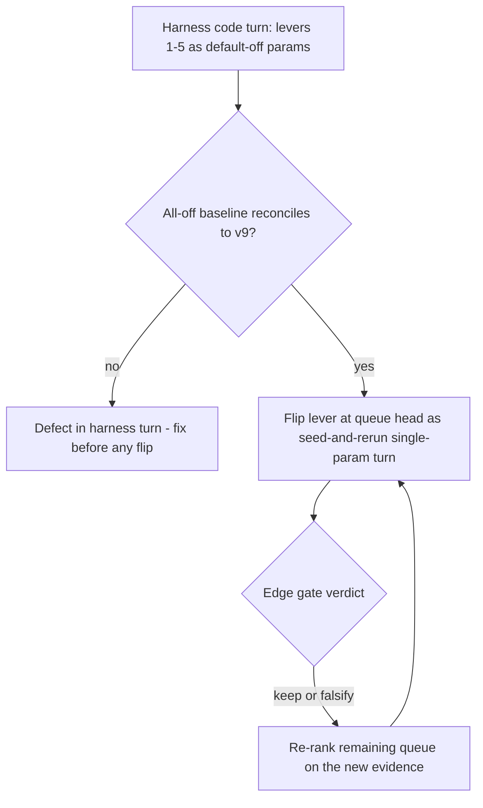
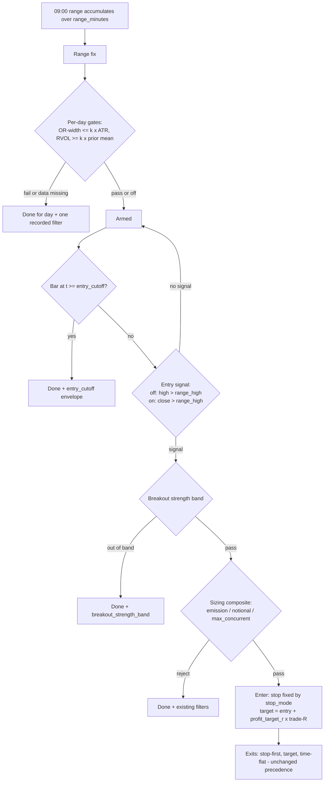

# ORB External-Consensus Lever Queue - Plan

## Goal Capsule

- **Objective:** Lift the Korean-stock ORB strategy's expectancy above zero by testing an evidence-ranked queue of strategy-edge mechanisms mined from ten open-source ORB/breakout projects. This plan implements the mechanism-harness turn (five default-off gates), executes the all-off reconcile baseline, and runs the first flip (midpoint stop).
- **Product authority:** This document. Turn-level verdicts remain governed by the existing edge gate (`EdgeEvaluation`: positive expectancy, dominance ≤ 40%) — this work does not change the gate.
- **Execution profile:** Offline only — backtests over the repo-root `data/turn4-fresh` home; no gateway calls, no ingest. Work happens in the standalone `adapters/nautilus` workspace; the root SDK gate is untouched.
- **Stop conditions:** All-off baseline diverging from v9's ledger is a harness defect — stop and fix before any flip. Zero `orb.rs` edits of any kind after the baseline run (code-hash desync). A flip verdict (keep/revert) is recorded before the next flip starts.
- **Open blockers:** None. Product Contract preservation: changed R1 (harness ships levers 1–5; provenance gate deferred — its external semantics don't map to our intraday-built range), R5 (flip mechanics pinned to seed-and-rerun), AE1 (reconcile procedure specced — no `runs compare` mode passes a code turn by design). Rationale under Key Technical Decisions.

---

## Product Contract

### Summary

One harness code turn adds the top-ranked field-consensus mechanisms to `orb.rs` as parameterized, default-off gates, with an all-off baseline that must reconcile to v9 behavior. Each mechanism then tests as a cheap single-param flip turn, in queue order, with the queue re-ranked after every verdict. The plan extends the runner's candidate seam for prior-daily ATR and opening-window volume, pins the gate pipeline and rejection taxonomy, and carries the first flip — stop re-scaling to the OR midpoint — through to a governed verdict.

### Problem Frame

After ten strategy-loop turns, expectancy is still negative (v9: −3,157 KRW/trade, WR 46.9%, PF 0.97 over 162 trades / 24 sessions). Six levers are falsified: universe width, `max_concurrent`, `range_minutes`, two profit-target values, and the breakout-strength band. No parameter of the current shape has lifted expectancy above zero.

A survey of ten open-source ORB/breakout projects shows the field consensus disagrees with several ORB v0 core choices. Six of ten use close-confirmed breakout entries and explicitly flag wick-touch entries (our current entry) as a defect; ATR-scaled stops, OR-width sanity gates, opening-window relative volume, and mid-session entry cutoffs each appear in three or more projects. v0 has none of these. The evidence suggests the remaining edge levers are mechanisms v0 lacks, not values of knobs it already has.

Testing these naively is expensive: each mechanism is new `orb.rs` logic, every `orb.rs` change re-baselines `strategy_code_hash`, and param-mode compares fail across a code-hash change. Five mechanisms tested as five separate code turns means five re-baselines on a 24-session sample.

### Requirements

**Harness turn**

- R1. A single `orb.rs` code turn adds the mechanisms for queue levers 1–5 as parameterized gates, every one default-off, following the existing default-off precedent (`breakout_strength_min`/`max`, `turnover_floor_krw`). Lever 6 (breakout provenance) is deferred: its external "gap through the range at open" semantics cannot occur against a range built intraday after the 09:00 auction, so it needs re-derivation as its own later code turn.
- R2. New params are `f64` fields with `serde(default)` filter-off defaults so pre-field manifests deserialize to identical params and produce no `param_diff` key; the existing pre-field-manifest deserialization test pattern extends to each new field, and every field appears in `numeric_summary`.
- R3. The harness turn's all-off baseline run over the same data range must reconcile to v9's ledger (same trades, same exits, same expectancy); any divergence is a defect in the harness turn, not a finding.
- R4. Gates needing prior-daily or prior-minute history (ATR-scaled stop, OR-width/ATR gate, RVOL) extend the loader/candidate seam as part of the harness turn; the seam extension must not alter universe selection for existing runs (the R3 reconcile proves this).

**Lever queue**

- R5. Each mechanism activates as exactly one single-param flip turn, in queue order, judged by the unchanged edge gate. Flips execute as seed-and-rerun turns — the new value rides the seed manifest (turn-10 precedent) because the `turn()` numeric proposal path cannot move a param off a filter-off sentinel; attribution evidence is a param-mode `runs compare` PASS with diff exactly {`strategy_version`, that param}.
- R6. After each verdict the queue is re-ranked before the next turn — a falsification is evidence about siblings (e.g., a falsified close-confirm entry demotes other entry-quality gates), not just a pop of the head.
- R7. Levers requiring data the lab does not hold — index-regime gate (no index-series ingest exists) and disclosure-calendar blackout (no such dataset exists) — stay out of the harness turn and are queued as blocked-on-data with their data prerequisite named.

**Attribution and reporting**

- R8. Every run's reports and analysis records state the run's stop mode; R-denominated metrics (MFE, target distance) are compared across runs only within the same stop mode.
- R9. Any harness param never flipped by the time the queue is exhausted is removed (wire-or-delete) — dead config was a recurring defect in 4/10 surveyed projects. Deletions ride the next harness code turn, never a standalone edit (a deletion is itself a re-baseline).

### The Lever Queue

Ranked at brainstorm time; re-ranked after each verdict per R6.

| # | Lever | Mechanism | External evidence | Diagnostic fit |
|---|---|---|---|---|
| 1 | Stop re-scaling | Stop at OR-midpoint or ATR-scaled distance instead of range low | Both ORB forks (midpoint), Trading v27 (two-tier + ATR buffer), geektrade (ATR) | Loss side of payoff geometry is the only untested side; v0's full-range stop is the widest in the surveyed field |
| 2 | Close-confirmed entry | Enter on bar close beyond range high (prior close inside), not wick touch | 6/10 projects; wick-touch flagged as defect twice | Thin MFE is consistent with buying noise spikes at their top tick; also removes the entry-at-high fill-optimism |
| 3 | OR-width sanity gate | Reject session when OR width > k × ATR | Both ORB forks, Trading (candle cap), geektrade (squeeze analog) | Wide ranges make 1R huge and unreachable before flat time |
| 4 | Entry cutoff time | No new entries after a cutoff (v0 allows entry 09:20–15:00) | Both ORB forks (12:00 default), mt4-ea-obr, london | Late entries have little runway to 1R before the 15:00 time-flat |
| 5 | Opening-window RVOL | Opening-window volume ≥ k × same window's mean over prior sessions | Both ORB forks, geektrade | Participation filter; distinct from falsified price-extension band (see Key Decisions) |
| 6 | Breakout provenance gate | Accept a break only if the signal bar overlaps the range or jumped it from an in-range prior close | Trading v27 (unique) | Deferred from harness turn 1: needs re-derivation for our intraday-built range (the open-gap case is structurally unreachable); later code turn |
| 7 | Risk-% sizing | Size from equity risk % / stop distance instead of fixed 10M KRW notional | 5/10 projects | Demoted: re-weights KRW P&L, doesn't change per-trade R edge; revisit once expectancy > 0 |
| 8 | Failed-break reversal | Trade the failure of a confirmed break back into the range (long side only) | Both ORB forks (M9) | Inversion candidate if entry-quality levers falsify; a full new state machine, so a later code turn |
| — | Index-regime gate | KOSPI/KOSDAQ series as trend/regime filter | ORB forks, Trading, turtle-bot (as DXY/EMA/ADX analogs) | Blocked-on-data: no index-series ingest exists |
| — | Disclosure blackout | Suppress entries around per-stock disclosure/earnings events | london (calendar), ORB forks (ATR-spike variant) | Blocked-on-data: no such dataset exists; the ATR-spike variant needs no data and may join a later harness turn |

### Key Decisions

- **Stage via one harness turn, then param flips.** A single code turn adds all queue mechanisms as default-off params; the code hash re-baselines exactly once (`strategy_code_hash` hashes only `orb.rs` — `params.rs` and runner edits do not move it). Chosen over sequential code turns (five re-baselines) and over a bundled v1 redesign (no per-mechanism attribution).
- **Rank by diagnostic fit first, field popularity second, cost third.** Risk-%-of-equity sizing is the clearest demotion this rule produces: 5/10 projects use it, but it re-weights KRW P&L without changing per-trade edge in R terms, so it waits until an edge exists to size.
- **A stop-mode flip re-defines R.** R is the entry-to-stop distance, so changing the stop re-denominates the target distance and MFE in the same turn. Cross-run comparisons of R-denominated metrics are valid only within one stop mode, and reports must carry the run's stop mode.
- **Trailing/break-even/partial-TP mechanisms are deliberately deprioritized.** Exit geometry has been falsified twice (turns 8–9), and the MFE distribution is thin — break-even ratchets would convert small winners into scratches. This family stays off the queue until an entry- or stop-side lever produces a positive-expectancy signal to protect.
- **RVOL is queued despite the band falsification.** Turn 10 falsified breakout-strength band-pass filtering — a price-extension quality measure. Opening-window RVOL is a participation measure with independent field support (3 projects); adjacency is noted, but it is not treated as pre-falsified.

### Acceptance Examples

- AE1. **Covers R3.** Given the harness turn is merged and all new params are at defaults, when the backtest runs over `data/turn4-fresh` with v9's params, then the trade ledger is identical to v9's run (entries, exits, reasons, per-trade P&L). The check is a ledger-level diff (see Verification Contract) — no `runs compare` mode can pass across a code-hash change; the expected param-mode FAIL naming `strategy_code_hash differs` is captured as the re-baseline evidence.
- AE2. **Covers R5.** Given the all-off baseline is finalized, when `stop_mode` flips to or-midpoint as a seed-and-rerun turn, then `runs compare` param mode passes with diff exactly {`strategy_version`, `stop_mode`}.
- AE3. **Covers R8.** Given a v9-era run and a midpoint-stop run, when their MFE reports are read side by side, then each report states its stop mode, and no analysis record ranks their R-denominated percentiles against each other.
- AE4. **Covers lever 2's mechanism.** Given close-confirmation is on and a bar's high exceeds range high but its close is at or inside it, when the bar closes, then no entry occurs and the symbol stays Armed; if a later bar closes strictly above range high, entry occurs at that bar's close, not the wick high.
- AE5. **Covers KTD5's fail-closed rule (supporting R4/R8).** Given stop mode is ATR and a symbol has fewer than the required prior daily sessions, when its range fixes, then the symbol goes done-for-day with one recorded `atr_unavailable` rejection — it never silently falls back to the range-low stop.

### Success Criteria

- Each flipped lever produces a clean governed verdict (keep or falsify) attributable to that lever alone — no ambiguous multi-cause runs.
- The queue answers the standing question within its run: either some mechanism lifts expectancy above zero on the 24-session sample, or the surveyed field's table-stakes mechanisms are exhausted and the finding escalates beyond the v0 breakout premise (e.g., to lever 8's inversion or a data-scale change).
- No silent scope creep into the edge gate: `EdgeEvaluation` semantics are byte-identical before and after.

### Scope Boundaries

- **Strategy edge only.** Harness/app improvements (reporting tooling beyond the stop-mode label, ingest ergonomics) and live-ops machinery from the survey (shadow portfolio, emergency-stop latch, order-reconciliation patterns) are out; they may seed a separate brainstorm.
- **No short-side mechanisms.** The strategy stays long-only.
- **No governance changes.** One lever per turn, the edge gate, `turn()` proposal machinery, and compare semantics stay as they are — the numeric-encoding and seed-and-rerun decisions exist precisely to avoid touching them.
- **No new data ingestion in this wave.** Index-series and disclosure-calendar ingest are named prerequisites of blocked-on-data levers. A pre-range daily backfill (to widen ATR coverage) is a candidate follow-up data turn, not part of this plan.

#### Deferred to Follow-Up Work

- Lever 6 (breakout provenance) re-derivation for the intraday-range architecture; joins a later harness turn.
- Pre-range daily backfill to extend ATR(14) coverage across the whole 24-session range (fingerprint-safe by construction; verify `universe_hash` stability).
- Executing queue flips beyond the first (levers 2–5 and the ATR stop mode) — future turns consuming this plan's specs.
- Wire-or-delete removal of never-flipped params at queue exhaustion (rides the next harness code turn per R9).

### Dependencies / Assumptions

- `data/turn4-fresh` (24 sessions 20260526–20260703, 40-symbol universe) remains the evaluation sample; daily bars on disk span 20260518–20260710 (~38 sessions), so only ~6 daily sessions precede the range start — ATR(14) coverage is partial until a backfill lands.
- The run-registry head (latest finalized) in `data/turn4-fresh/runs` is the turn-10 band run (v12), whose manifest carries the falsified band values (`breakout_strength_min` 0.06 / `breakout_strength_max` 0.13); the v9 run is also present and is the reconcile reference. Old manifests deserialize with the new param fields at defaults.
- ATR-mode flips are only comparable across runs whose catalog daily history is unchanged; the ingest checkpoint's `history_floors` equality is the operator check (see KTD5).

---

## Planning Contract

### Key Technical Decisions

- KTD1. **All gate params are `f64`.** `turn()` proposes only numeric fields, `numeric_summary` carries only `f64`, and `param_diff` diffs deserialized `OrbParams` — an enum or bool field would be invisible to all three. Encodings: `stop_mode` 0.0 = range-low (default) / 1.0 = or-midpoint / 2.0 = ATR; `entry_confirm` 0.0 = wick-touch (default) / 1.0 = close-confirmed; sentinel 0.0 = off for `or_width_max_atr`, `entry_cutoff_min`, `rvol_min`. Companion params inert at defaults: `stop_atr_mult` 2.0, `atr_window` 14.0, `rvol_window_sessions` 14.0, `rvol_min_history` 5.0.
- KTD2. **Flips run as seed-and-rerun turns** (`docs/solutions/workflow-issues/code-turn-rebaseline-run-via-manifest-seed-and-rerun.md`): copy the latest finalized manifest into a later-timestamped manifest-only run dir, bump `strategy_version`, set the one new param value, run `lab-research turn` in rerun mode, delete the seed. The `ProposalBoundsGuardrail` fail-closes any change away from an exactly-zero value and caps moves at 0.5 relative, so sentinel-off defaults are unreachable via `LS_TURN_PARAM` — seed-and-rerun is the sanctioned path (turn-10 precedent), and param-mode compare PASS supplies the attribution. The registry head at plan time is v12 (the reverted turn-10 band run) whose manifest carries non-default band values — the U6 baseline seed must reset `breakout_strength_min`/`breakout_strength_max` to their filter-off defaults alongside the new fields' defaults; a head manifest copied verbatim would run with the band ON.
- KTD3. **The all-off reconcile is a ledger diff, not a compare mode.** Both compare modes require equal `strategy_code_hash` and fail across the harness turn by design. Reconcile = per-trade equality against the v9 run (symbol, session date, entry price, exit reason, exit price, P&L) read from both runs' artifacts, plus equal summary expectancy/trade count. The expected param-mode FAIL (`strategy_code_hash differs`, param diff = {`strategy_version`} only) is captured verbatim as the re-baseline evidence.
- KTD4. **Trade-R vs range-R split.** In the non-default stop modes (or-midpoint, ATR), trade-R = entry − stop drives the target price and the MFE denominator. Mode 0 (range-low) preserves v9's computations verbatim — target = entry + round(`profit_target_r` × range-R) and `mfe_r` denominated by range-R — because entry fills above range high, trade-R at mode 0 is strictly wider than range-R, and re-basing the default mode on trade-R would move every v9 target and fail the R3 reconcile. Range-R = range_high − range_low stays the denominator for breakout strength and the band's degenerate-range bypass in every mode — strength is a signal descriptor and must not become self-referential when the stop moves. `report mfe` prints the run's stop mode and the mode's MFE denominator (range-R for mode 0, trade-R otherwise).
- KTD5. **ATR fail-closed and clamped.** ATR(`atr_window`) is computed from the deduped daily slice strictly before the session date; a symbol-session with fewer than `atr_window`+1 prior dailies fails closed with a recorded `atr_unavailable` rejection (never a silent range-low fallback — that would mix stop modes in one run and break R8). ATR-mode stop = max(entry − round(`stop_atr_mult` × ATR), range_low): ATR only ever narrows the stop versus v0, keeping the lever's hypothesis one-sided. ATR inputs reach before the pinned range, outside `catalog_fingerprint` scope — cross-run ATR comparability additionally requires unchanged checkpoint `history_floors`, recorded in the flip's analysis.
- KTD6. **Close-confirm canonical entry price = the confirm bar's close.** It is the entry price, the marketable-limit price, the high-water seed, and the breakout-strength numerator input. The confirm bar's above-close wick is not folded into high water (not provably post-fill — same pessimism as stop-first). Non-confirming bars leave the symbol Armed. Same-bar stop-first still wins when a confirm bar also breaches the stop. When `entry_confirm` is 0.0 the wick-touch path must be byte-identical to v9 — no float-op reordering in the refactored entry block (the R3 reconcile is the proof).
- KTD7. **Gate pipeline and rejection taxonomy pinned.** Per-day gates (OR-width, RVOL) evaluate once at range fix and reject done-for-day; cutoff transitions Armed→Done at the first bar with t ≥ cutoff (one envelope, no per-bar spam); the strength band and sizing composite keep their existing order after the breakout signal. First failing gate emits the single canonical filter: `or_width_atr`, `rvol_min`, `rvol_insufficient_history`, `atr_unavailable`, `entry_cutoff`. Per-day rejections occur before any breakout exists, so they need a new strategy action variant — every rejection is recorded, never silent (a top-two failure mode in the surveyed projects). Degenerate guards fail closed with the same recorded filters: zero prior-window volume mean, missing volume, short history.
- KTD8. **Sequencing: all `orb.rs` edits land before the baseline run; zero edits after.** `strategy_code_hash` = sha256 of `orb.rs` alone; even a cosmetic post-run edit desyncs shipped source from the verdict-bearing run (turn-10 review reverted exactly such an edit). Order: code + tests green → seed → baseline → reconcile → verdict → PR.
- KTD9. **RVOL history is a runner-side precompute.** Per-session engines only see that session's minute bars; prior opening-window volumes come from the runner's existing per-date minute index and ride the candidate seam like `prior_turnover`. The index is range-filtered, so the first `rvol_min_history` sessions of the range fail closed with `rvol_insufficient_history` — an accepted, recorded trade-count asymmetry.
- KTD10. **Entry cutoff is minutes after range open, independent of `flat_time`.** Off = 0.0. A configured cutoff must satisfy range_end < cutoff ≤ flat_time; out-of-range values are rejected at backtest start (a config error, not a silent inert gate). Open positions are untouched by cutoff — exits run to flat_time as today.

### High-Level Technical Design

Per-symbol session flow with all gates (default-off gates shown at their pipeline positions; prose above is authoritative):

Data seam: the runner computes per-symbol ATR (from the pre-sorted daily slice, strictly before the session date) and prior opening-window volume stats (from the per-date minute index) alongside the existing prior/today selection, attaches them to the universe candidate, and threads the selected symbols' values to the strategy the same way instrument IDs flow today.

### Deferred to Implementation

- Exact rounding of ATR × multiplier to i64 KRW (match the existing target `.round()` convention; KRX tick bands remain unmodeled — consistency over realism).
- Where the cutoff config validation lives (params consumption vs backtest start) — first place that sees both params and the session clock wins.
- Whether per-day gate values (ATR, RVOL ratio) also ride the breakout envelope's `values` map for passing symbols (nice for audit; zero-cost if the map is already emitted).

---

## Implementation Units

### U1. Gate params in `OrbParams`

- **Goal:** All nine gate params exist, default-off, manifest-compatible, sweepable.
- **Requirements:** R1, R2; KTD1.
- **Dependencies:** none.
- **Files:** `adapters/nautilus/lab/src/params.rs`.
- **Approach:** Nine `f64` fields with `#[serde(default = ...)]` per KTD1, added to `numeric_summary`, plus `strength_in_band`-style helpers where a predicate reads better than inline comparisons (`stop price for mode`, `cutoff active`). Follow the band-field precedent exactly.
- **Patterns to follow:** `breakout_strength_min`/`max` field trio (`params.rs:56-95`): serde default fns, `defaults_match_ktd6`, `band_params_deserialize_from_pre_field_manifest`, `numeric_summary_includes_band_fields`.
- **Test scenarios:**
  - Defaults assert: every new field's default equals its KTD1 filter-off value (extend `defaults_match_ktd6`).
  - Pre-field manifest: a v9-era manifest JSON without any new key deserializes to exact defaults and produces an empty `param_diff` against a freshly-defaulted `OrbParams` (extend the pre-field-manifest test per field).
  - `numeric_summary` contains all nine keys.
  - Round-trip: serialize-then-deserialize with non-default values preserves each field (guards the serde default fns from shadowing real values).
- **Verification:** `cargo test -p` the lab package's params tests green; no other unit consumes the fields yet.

### U2. Candidate seam: ATR and opening-window volume

- **Goal:** Per-symbol prior-daily ATR and prior opening-window volume stats reach the strategy, without changing universe selection.
- **Requirements:** R4; KTD5, KTD9.
- **Dependencies:** U1.
- **Files:** `adapters/nautilus/lab/src/runner/backtest.rs`, `adapters/nautilus/lab/src/strategy/orb.rs` (struct fields only), `adapters/nautilus/lab/tests/backtest_run.rs`.
- **Approach:** In the candidate builder, compute ATR(`atr_window`) over the pre-sorted deduped daily slice strictly before the session date (`None` when fewer than `atr_window`+1 priors) and the mean opening-window volume over up to `rvol_window_sessions` prior in-range sessions from the per-date minute index (`None` below `rvol_min_history`). Attach both as `Option` fields on `UniverseCandidate`; thread the selected symbols' values to `OrbStrategy` via the selected-symbol seam. Universe selection logic reads neither value.
- **Execution note:** The R3 reconcile is the proof this seam is selection-neutral — build it read-only from the existing indexes; no re-scanning inside the per-session loop (fresh-engine-per-session convention).
- **Patterns to follow:** `prior_turnover` derivation in `build_candidates` (`backtest.rs:493-520`); `CandidateMeta::Missing` for absent-data handling; dedup discipline from `read_all_bars` (duplicated dailies poison ATR — `docs/solutions/logic-errors/re-ingesting-an-overlapping-range-duplicates-catalog-bars.md`).
- **Test scenarios:**
  - ATR over a hand-built daily fixture matches a hand-computed value; excludes the session's own bar.
  - Fewer than `atr_window`+1 priors → `None` (boundary: exactly window+1 → `Some`).
  - Opening-window volume mean over synthetic minute bars for 2 prior sessions with `rvol_min_history` 2 → `Some`; with 3 → `None`.
  - First range session (no prior in-range minute data) → `None`.
  - Selection regression: candidates with and without the new fields produce the identical selected-universe sequence on the existing fixture.
- **Verification:** Fixture backtest produces an unchanged `universe_hash` versus a pre-change run of the same fixture.

### U3. `OrbState` core: bar signature, stop modes, close-confirm

- **Goal:** The state machine supports stop re-scaling and close-confirmed entry with v9-identical behavior at defaults.
- **Requirements:** R1, R3, R8; AE4; KTD4, KTD5, KTD6.
- **Dependencies:** U1, U2 (ATR value available to the state).
- **Files:** `adapters/nautilus/lab/src/strategy/orb.rs`, `adapters/nautilus/lab/tests/strategy.rs`.
- **Approach:** `on_bar` gains close and volume; the sentinel-guard-first rule (`saw_range` before touching range sentinels) extends to any new range/ATR reads. Stop price is fixed at entry per `stop_mode` (range low / rounded midpoint / ATR-clamped per KTD5); in the non-default modes `trade_r = entry_price − stop_price` drives target and `mfe_r`, while mode 0 keeps v9's range-R target and MFE computations verbatim (KTD4); breakout strength keeps range-R in every mode. Close-confirm branch per KTD6; the `entry_confirm = 0` path preserves the existing `high > range_high` block untouched.
- **Execution note:** Write the default-path characterization tests first — port a handful of existing v9 state-machine scenarios and assert identical outcomes with the new signature before adding any mode logic.
- **Patterns to follow:** Existing `on_bar` phase machine and stop-first precedence (`orb.rs:441-482`); MFE censoring rules (Stop excludes own bar's high; Target caps at target; TimeFlat folds exit bar) — these fold rules are geometry-independent and must survive verbatim.
- **Test scenarios:**
  - Characterization: default params reproduce existing test outcomes bar-for-bar (entry at wick high, stop at range low, target at entry + 1.0 × range-R).
  - Midpoint mode: stop = rounded midpoint; a post-entry pullback into the lower half stops out (intended failed-break semantics); target = entry + `profit_target_r` × (entry − midpoint).
  - ATR mode: stop = entry − round(2.0 × ATR) when that is above range low; clamped to range low when wider; `atr_unavailable` fail-closed when ATR is `None` (covers AE5).
  - Close-confirm: wick above range high with close inside → still Armed (AE4); later close above → entry at that close; confirm bar breaching stop and target same bar → Stop wins; high-water seeded at close, wick not folded.
  - MFE: `mfe_r` denominates by trade-R in each non-default mode and stays range-R in mode 0 (v9-identical); strength-band bypass still keys on degenerate range-R even when trade-R is well-defined.
- **Verification:** All state-machine tests green; the wick-touch default path diff against the old file shows no logic edits inside the default branch.

### U4. Entry-quality gates and rejection recording

- **Goal:** OR-width, RVOL, and cutoff gates enforce with one canonical recorded rejection each; per-day rejects are never silent.
- **Requirements:** R1; KTD7, KTD10.
- **Dependencies:** U2, U3.
- **Files:** `adapters/nautilus/lab/src/strategy/orb.rs`, `adapters/nautilus/lab/src/agent/envelope.rs` (only if a new `SignalKind` is needed), `adapters/nautilus/lab/tests/strategy.rs`, `adapters/nautilus/lab/tests/backtest_run.rs`.
- **Approach:** At range fix, evaluate OR-width (range-R ≤ `or_width_max_atr` × ATR) then RVOL (today's opening-window volume ≥ `rvol_min` × prior mean); failures set done-for-day and surface through a new session-reject action carrying the filter name, emitted by `handle_actions` as the standard rejection envelope. Cutoff: Armed→Done at first bar t ≥ cutoff, one `entry_cutoff` envelope. Cutoff config validated at backtest start per KTD10. Fail-closed filters per KTD7 (`atr_unavailable`, `rvol_insufficient_history`, zero-mean guard).
- **Patterns to follow:** Band-pass gate shape — `force_done()` + one `OrderRejectedSizing` envelope with named filter and operative `values` (`orb.rs:653-676`); integration assertion style `d.filter.as_deref() == Some("...")` (`backtest_run.rs:958-1086`).
- **Test scenarios:**
  - Each gate off (default) → zero envelopes with its filter name on the band fixture (all-off no-op proof).
  - Each gate on with a triggering fixture → exactly one envelope with its canonical filter and the operative values; symbol takes no trade that day.
  - OR-width on but ATR `None` → `atr_unavailable`, not a pass (missing data never passes a gate).
  - RVOL on, prior mean zero → fail-closed with the insufficient-history filter.
  - Cutoff on: bar exactly at cutoff rejects (≥ boundary); Armed symbol emits one envelope, not one per bar; an open long entered before cutoff still exits at stop/target/flat as before.
  - Cutoff misconfigured (≤ range end or > flat_time) → backtest refuses to start with a config error.
  - Gate order: a session failing both OR-width and RVOL records only `or_width_atr`.
- **Verification:** Integration on/off pair per gate green in `backtest_run.rs`; decisions.jsonl from the fixture run contains no unexplained rejection kinds.

### U5. Report and manifest labeling

- **Goal:** Reports carry the stop mode so cross-mode R-metrics cannot be compared unlabeled.
- **Requirements:** R8; AE3; KTD4.
- **Dependencies:** U1.
- **Files:** `adapters/nautilus/lab/src/runner/report.rs`, report tests in the same file.
- **Approach:** `report mfe` reads `manifest.params.stop_mode` (already deserializable via U1 serde defaults for old manifests) and prints the mode label plus the mode's MFE denominator (range-R for mode 0, v9-compatible; trade-R otherwise) alongside the existing `profit_target_r` line; `report tiers` unchanged.
- **Patterns to follow:** Existing manifest-param reads in `report mfe` (`report.rs:485-495, 599, 610`); synthetic manifest+decisions run fixtures (`report.rs:776-806`).
- **Test scenarios:**
  - v9-era manifest (no `stop_mode` key) → report prints the range-low default label.
  - Manifest with `stop_mode` 1.0 → midpoint label printed.
- **Verification:** Report tests green; running `report mfe` against an existing v9 run dir prints the default label without error.

### U6. All-off baseline: reconcile and re-baseline evidence

- **Goal:** v-next (all defaults) is the loop's new finalized baseline with recorded proof it equals v9.
- **Requirements:** R3; AE1; KTD3, KTD8.
- **Dependencies:** U1–U5 complete, workspace tests green, release build done.
- **Files:** run artifacts under `data/turn4-fresh/runs/` (not committed); analysis record and `adapters/nautilus/lab/TURN-LOG.md` per repo convention.
- **Approach:** Seed-and-rerun per KTD2 — copy the v12 head manifest, set every gate param including the pre-existing band pair to its filter-off default, bump the version; then the KTD3 ledger diff against the v9 run, pinned by run id (per-trade equality + summary equality); then `runs compare` with the pair pinned explicitly to (v9 run, new baseline), captured with its expected param-mode FAIL naming `strategy_code_hash differs` and a param diff of {`strategy_version`} only — the default two-newest pair would compare against v12 and show band-value diffs. Verdict recorded on the run's analysis file. Zero `orb.rs` edits after this run.
- **Execution note:** Offline only; engine noise lands on stdout — redirect and read the trailing summary block. Pre-register the reconcile check (exact equality expected) before running.
- **Test scenarios:** Test expectation: none — execution unit; the proof is the reconcile itself (AE1).
- **Verification:** Ledger diff empty; compare FAIL text captured in the analysis record; `latest finalized` resolves to the new version.

### U7. First flip: stop re-scaling to OR midpoint

- **Goal:** Lever 1's first leg gets a clean governed verdict.
- **Requirements:** R5, R6, R8; AE2, AE3.
- **Dependencies:** U6.
- **Files:** run artifacts and analysis record as U6.
- **Approach:** Seed-and-rerun with `stop_mode` 1.0 and version bumped; `runs compare` param mode must PASS with diff exactly {`strategy_version`, `stop_mode`} (AE2). Judge by the unchanged edge gate; read `report mfe` with the trade-R label; record keep/revert and the queue re-rank rationale (R6) in the analysis. Verdict frame from the brainstorm: halving stop distance favors us if breakouts carry direction, doubles stop-outs if they are noise — either outcome is informative.
- **Execution note:** Expect the trade count to shift from freed `max_concurrent` slots when stops fire earlier — read counts with the rejected-entries-free-slots caveat from turn 10.
- **Test scenarios:** Test expectation: none — execution unit; AE2's compare PASS is the machine check.
- **Verification:** Compare PASS captured; edge-gate verdict + re-ranked queue recorded in the analysis; no code edits occurred since U6.

---

## Verification Contract

| Gate | Command / procedure | Applies to |
|---|---|---|
| Workspace tests | `cargo test --workspace` in `adapters/nautilus/` | U1–U5, before U6 |
| Release build | `cargo build --release` in `adapters/nautilus/` | before U6 |
| All-off reconcile | Ledger diff per KTD3: per-trade fields (symbol, session date, entry price, exit reason, exit price, P&L) and summary (trade count, expectancy) equal between the v9 run and the all-off baseline, read from both runs' artifacts | U6 / AE1 |
| Re-baseline evidence | `lab-research runs compare` (param mode) with the pair pinned to the v9 run and the new baseline, output captured showing FAIL with `strategy_code_hash differs` and param diff {`strategy_version`} only (the default two-newest pair would include v10–v12) | U6 |
| Flip attribution | `runs compare` param mode PASS, diff exactly {`strategy_version`, `stop_mode`} | U7 / AE2 |
| Edge verdict | `EdgeEvaluation` (unchanged): positive expectancy, dominance ≤ 40%, ≥ 1 trade | U7 |
| Root gate | Untouched — no SDK/metadata/docs changes; `make docs-check` etc. not triggered by this work | all |

Offline env for runs: `LS_DATA_HOME=<repo-root>/data/turn4-fresh`, `LS_BT_SDATE=20260526`, `LS_BT_EDATE=20260703`; seed-and-rerun turns set `LS_TURN_EXPECT_VERSION` to the seeded version. No gateway, no ingest, no `.env.*` needed.

---

## Definition of Done

- All nine gate params exist default-off with the four U1 test classes green; every gate has its on/off integration pair (U4) and state-machine coverage (U3).
- The all-off baseline reconciles to v9 exactly (AE1), the re-baseline evidence is captured, and the baseline is the loop's latest finalized run.
- The first flip (midpoint stop) has a compare PASS (AE2), an edge-gate verdict, a stop-mode-labeled MFE read (AE3), and a recorded queue re-rank (R6).
- Reports print the stop mode for both old and new manifests (U5).
- No `orb.rs` edit exists after the U6 baseline commit point; the shipped source hash matches the verdict-bearing runs.
- No dead or experimental code from abandoned approaches remains in the diff; never-flipped params are tracked for R9's wire-or-delete at queue exhaustion, not deleted now.
- Analysis records and TURN-LOG entries exist for the baseline and the flip.

---

## Sources / Research

- External survey: ten project analyses under `/Users/mini/Documents/Obsidian/Codex Trading Research/Trading Strategy Analyses/` (per-project `07 - Reusable Ideas` and `09 - Findings and Weaknesses` are the dense files). Condensed cross-project dossier (session scratch, regenerate if gone): `/tmp/compound-engineering/ce-brainstorm/orb-ideas-kr/external-orb-dossier.md`.
- Repo grounding with `file:line` pointers (session scratch): `/tmp/compound-engineering/ce-brainstorm/orb-ideas-kr/repo-orb-dossier.md`. Key verified anchors: wick-touch entry and stop-first exits (`adapters/nautilus/lab/src/strategy/orb.rs:441-482`), gate/composite ordering (`orb.rs:626-735`), default-off param precedent and pre-field manifest test (`adapters/nautilus/lab/src/params.rs:56-95, 249-271`), param-compare rules and numeric-only proposals (`adapters/nautilus/lab/src/runner/research.rs:290-293, 563-614`), candidate seam (`adapters/nautilus/lab/src/runner/backtest.rs:477-520`), per-date minute index (`backtest.rs:344-355`), manifest-param reads in reports (`adapters/nautilus/lab/src/runner/report.rs:485-495`).
- Flip/re-baseline recipes: `docs/solutions/workflow-issues/code-turn-rebaseline-run-via-manifest-seed-and-rerun.md`, `docs/solutions/conventions/reconciled-run-can-falsify-an-approximate-per-bucket-ranking.md` (seed carries non-default values; compare FAIL is the evidence; rejected entries free concurrency slots), `adapters/nautilus/lab/PAPER-CUTS.md` item 12 (zero-value guardrail fail-close).
- Comparability and data hygiene: `docs/solutions/conventions/range-scoped-comparability-scope-every-derived-input.md` (derived inputs must be range-scoped; ATR lookback rides outside the fingerprint — hence KTD5's `history_floors` check), `docs/solutions/logic-errors/re-ingesting-an-overlapping-range-duplicates-catalog-bars.md` (dedup before aggregating dailies).
- Falsification history: `docs/solutions/conventions/strategy-loop-reading-param-turn-outcomes-win-rate-vs-expectancy.md`, `docs/solutions/conventions/strategy-loop-turn-9-profit-target-sweep-and-mfe-distribution.md`, and turn plans under `docs/plans/2026-07-09-*` / `2026-07-10-*`.
- Daily/minute coverage facts: catalog file spans and `ingest-checkpoint.json` under `data/turn4-fresh/` (dailies 20260518–20260710; minutes from 20260526; `history_floors` = 20260518).
