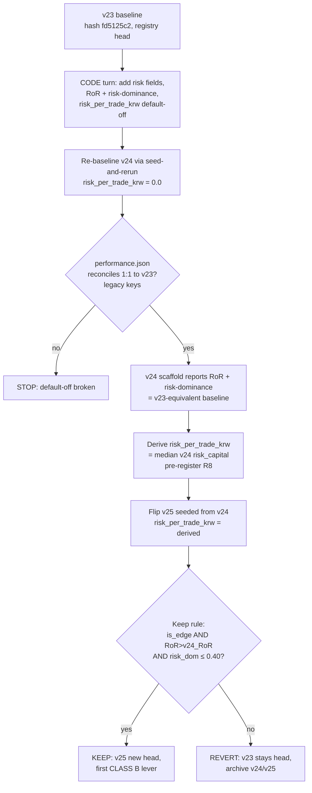

# feat: ORB CLASS B — normalized edge metric + first risk-based sizing lever

**Target:** `adapters/nautilus/lab` (the offline strategy-loop lab). Offline, no gateway.

**One-line:** Re-ground the loop's edge gate on a **size-invariant** metric
(return-on-risk) so a position-sizing lever can be honestly judged, then queue the
first sizing lever (`risk_per_trade_krw`, default-off) — delivered as **one code turn +
one pre-registered flip**, reconciling 1:1 to v23 when the lever is off, exactly like
every prior lever.

---

## Summary

Every ORB lever so far (entry-quality ×2, exit-timing ×1) was judged on raw
**KRW/trade expectancy** against a **fixed 10,000,000 KRW notional per position**. That
is only apples-to-apples while position size is held constant. CLASS B introduces
**position sizing**, which changes per-trade notional/qty — so KRW/trade expectancy
stops being a size-invariant edge measure: a run that merely sizes up posts higher
KRW/trade without any better risk-adjusted edge.

This plan does the metric redesign **first** (the crux), then queues the first sizing
lever downstream:

1. **Normalized edge metric = return-on-risk (RoR)** = `Σ realized_pnl / Σ
   risk_capital_at_stake`, a risk-weighted mean R-multiple. It is invariant to uniform
   scaling (sizing up posts the *same* RoR — no free edge) but **responds to risk
   reallocation** (betting more where the per-unit-risk edge is higher raises RoR).
   Critically, this is the *only* candidate a pure sizing lever can move: per-trade
   `realized_r` is already size-invariant by construction (`(exit−entry)/r_denom`), so
   an equal-weight mean-R would be **inert** to a qty-only change. RoR becomes the KEEP
   crux; equal-weight mean-R rides along as a diagnostic invariant.
2. **Dominance re-grounded to risk-capital share** (decisional), with the legacy
   |P&L|-share retained as a reported diagnostic. Risk-share (`max per-symbol Σrisk_capital
   / Σ all risk_capital`) can't be gamed by sizing one symbol huge.
3. **First sizing lever = `risk_per_trade_krw`** (default `0.0` = off → the exact fixed
   10M-notional v23 behavior). When positive: `qty = floor(risk_per_trade_krw /
   risk_per_share)`, capped at the baseline notional. Self-contained in `OrbParams`,
   surfaced in `numeric_summary`, no account-equity threading — it sidesteps the
   backtest equity seam entirely.

The turn structure mirrors the breakeven-trail turn exactly (PR #129): a CODE turn
(add default-off machinery on top of the kept levers) whose re-baseline `v24`
(`risk_per_trade_krw = 0.0`) reconciles `performance.json` **1:1** to v23, followed by
one pre-registered seed-and-rerun flip `v25` at the derived risk budget. The v24
re-baseline does double duty: it proves the lever is default-off **and** restates v23's
baseline in the new R-metrics (RoR, risk-dominance), which v23's stored artifacts alone
cannot express (they carry no per-trade risk_capital).

---

## Problem Frame

**Why now.** The exit block is closed (breakeven trigger sweep-confirmed near-optimal at
0.41, flat-breakeven move KEPT, trail FALSIFIED). Three kept levers across two classes.
The next motivated dimension is **CLASS B risk/position-sizing** (TURN-LOG R6). It
cannot be a direct code turn because it breaks the comparability the loop has relied on:
the keep rule `expectancy > +44,046.41 KRW/trade` is meaningless once notional varies.

**The comparability break, precisely.** With fixed notional, `expectancy` (KRW/trade)
and any risk-adjusted edge move together. Introduce sizing and they decouple:
- Uniformly doubling every position doubles KRW/trade expectancy and doubles Σpnl —
  **zero** improvement in edge per unit risk. The current gate would score this a win.
- Reallocating risk (same total risk, more on some setups than others) can raise or
  lower true edge with *no necessary change* in average KRW/trade.

The gate must therefore be re-grounded on a metric that is flat under (1) and sensitive
under (2). Return-on-risk is exactly that metric.

**What must not change.** The kept levers (`breakeven_trigger_r=0.41`,
`or_width_max_atr=0.666`, `entry_confirm=1.0`) and the exit block are out of scope — do
not re-touch them. The default-off discipline must hold: with the sizing lever off, the
run is outcome-identical to v23 and `performance.json` reconciles 1:1 (the only telemetry
delta is additive risk fields, which no legacy verdict metric reads — same shape as the
trail turn's always-on `realized_r`).

---

## Requirements

- **R1 — Return-on-risk is the size-invariant edge metric.** Compute `RoR = Σ
  realized_pnl / Σ risk_capital` over closed trades, where `risk_capital_i = qty_i ×
  risk_per_share_i` and `risk_per_share_i = entry_price_i − stop_price_i` (= the
  entry-fixed `r_denom`). Surface it on `EdgeEvaluation` and in the `analyze --scaffold`
  report. Invariance property (asserted in tests): scaling every trade's qty by a
  constant `k` leaves RoR unchanged.
- **R2 — Equal-weight mean-R diagnostic.** Also compute `mean_realized_r` (equal-weight
  mean of per-trade `realized_r`). It is invariant to a *pure* qty change; report it as a
  sanity invariant, not a verdict input.
- **R3 — Dominance re-grounded to risk-capital share (decisional), P&L-share retained
  (diagnostic).** Add `max_risk_capital_share = max_symbol(Σ risk_capital) / Σ(all
  risk_capital)` and gate the verdict on it (`≤ DOMINANCE_CAP = 0.40`, inclusive,
  fail-closed on zero-risk degenerate). Keep the existing `max_abs_pnl_share` computed
  and reported as a diagnostic.
- **R4 — Per-trade risk carried into the trade ledger.** Each closed `TradeRecord` gains
  `risk_capital: Option<f64>` and `realized_r: Option<f64>`, populated by joining the
  strategy's per-position entry risk (entry, stop, r_denom, qty) into the ledger at
  assembly. `None` for a run with no risk info → `EdgeEvaluation` falls back to the
  legacy P&L path (legacy runs still evaluate). Additive only: existing
  `performance.json` keys are byte-unchanged.
- **R5 — First sizing lever `risk_per_trade_krw` (default-off, self-contained).**
  `f64`-typed `OrbParam`, sentinel `0.0` = off (fixed 10M notional, byte/outcome-identical
  to v23). When `> 0`: `qty = min( floor(risk_per_trade_krw / risk_per_share),
  floor(notional_per_position / entry_price) )` — the second term is a notional ceiling
  that bounds capital on tiny-stop setups. Surfaced in `numeric_summary` so a governed
  turn can later sweep it. `validate()` rejects a negative value.
- **R6 — Keep rule re-grounded on RoR.** KEEP iff `is_edge` AND `RoR(flip) > RoR(v24
  baseline)` AND `risk_dominance ≤ 0.40`. The `> +44,046.41 KRW/trade` clause is retired.
  Baseline RoR/risk-dominance come from the v24 re-baseline (v23-equivalent), not v23's
  stored artifacts.
- **R7 — 1:1 re-baseline holds when the lever is off.** Seed-and-rerun `v24`
  (`risk_per_trade_krw = 0.0`) reconciles `performance.json` (trades + equity_curve +
  legacy summary) 1:1 to v23; `runs compare` param mode `v23 → v24` FAILs on
  `strategy_code_hash differs` (that FAIL is the re-baseline evidence, KTD3).
- **R8 — Pre-registered flip (R3 discipline).** The risk budget value, keep rule, and
  bind signature are pre-registered in `data/turn4-fresh/PRE-REGISTER-vNEXT-sizing.md`
  **before** the flip run, with the value derived by percentile/central-tendency (not a
  P&L fit), mirroring the 0.41 / 0.25 precedent.
- **R9 — Archive non-kept runs.** v24 and v25 archived under
  `data/turn4-fresh/sizing-archive/` so v23 stays registry head unless v25 KEEPs.

---

## Key Technical Decisions

### KTD-A — Return-on-risk over equal-weight mean-R (the crux, R1/R2)

`realized_r = (exit_price − entry_price) / r_denom` is **already size-invariant**: it is a
ratio of prices normalized by the entry-fixed risk unit, with no qty term. A sizing lever
that changes only `qty` (not entry/exit/stop decisions) therefore leaves every trade's
`realized_r` **identical**, so equal-weight `mean_realized_r` is **inert** to a pure
sizing change and cannot judge it. Return-on-risk `Σpnl / Σrisk_capital` is a *risk-weighted*
mean R:
- `realized_pnl_i = qty_i · (exit_i − entry_i)`, `risk_capital_i = qty_i · r_denom_i`, so
  `realized_pnl_i / risk_capital_i = realized_r_i` (exact up to fill rounding).
- Uniformly scaling all `qty_i` by `k` scales numerator and denominator equally → RoR
  unchanged (no free edge from leverage).
- Reallocating risk toward higher-`realized_r` setups raises RoR (the real lever
  mechanism). This is precisely the property the sizing turn needs.

**Chosen:** RoR is the KEEP crux; `mean_realized_r` is a reported invariant (a
reallocation-only turn should barely move it — a useful "off = reconcile"-style check).
KRW/trade `expectancy` stays reported but **non-decisional** (size-contaminated).

### KTD-B — Dominance: risk-share decisional, P&L-share diagnostic (R3)

Under variable sizing, `|per-symbol pnl|` share can be dominated by one *oversized*
position rather than genuine edge concentration. Risk-capital share (`max_symbol Σrisk_capital
/ Σrisk_capital`) measures concentration of **deployed risk** and cannot be gamed by
sizing one symbol huge. It gates the verdict. The legacy `max_abs_pnl_share` is retained
(computed + reported) so the historical guard stays visible and legacy runs without
risk_capital still have a dominance number. Both reuse the existing `DominanceFold`
pattern; add a parallel `RiskDominanceFold` (or extend the fold) so the two shares can
never silently drift. Degenerate zero-risk denominator fails closed exactly like the
zero-P&L case.

### KTD-C — `risk_per_trade_krw` as a self-contained param, NOT fractional-of-equity (R5)

A fixed **KRW risk budget per trade** needs no account/reference equity threaded into the
strategy's Enter decision — it is a direct param, consistent with "fixed 10M notional is a
param." This sidesteps the backtest equity seam (the strategy deliberately carries no
account/position state, R9 telemetry). It is the fixed-fractional-risk idea against an
implicit constant reference; mark-to-market/compounding equity (which *would* need the
account seam and introduces path-dependence) is deferred as a future CLASS B lever.

**Notional ceiling.** Risk sizing on a tiny stop yields an enormous qty. Cap it at the
baseline fixed-notional qty (`floor(notional_per_position / entry_price)`), so
`risk_per_trade_krw` can only *shift* size across setups within the existing capital
envelope, never blow it up. This keeps the first lever a clean **reallocation** test.

### KTD-D — Additive ledger fields preserve the 1:1 reconcile (R4/R7)

`risk_capital` / `realized_r` on `TradeRecord` are additive `Option<f64>` fields;
`PerformanceReport::assemble` does not feed them into the existing summary/analyzer keys.
So `performance.json`'s pre-existing content is byte-unchanged when the lever is off —
the v24 reconcile is 1:1 on every legacy metric, identical to how the trail turn's
always-on `realized_r` left performance.json 1:1. The new RoR/risk-dominance are *new*
keys computed at analyze time from the additive fields; v23 lacks them, which is exactly
why the v24 re-baseline (new code, lever off) is what establishes the baseline's RoR.

### KTD-E — Turn shape: CODE turn + seed-and-rerun flip (R7/R8)

The `0.0 → value` flip is an infinite relative change; `PROPOSAL_BOUNDS_CAP = 0.5`
fail-closes a governed step off the sentinel. So the flip is a **seed-and-rerun**
(per `docs/solutions/workflow-issues/code-turn-rebaseline-run-via-manifest-seed-and-rerun.md`),
not `LS_TURN_PARAM`. v24 = re-baseline (lever off, `strategy_version=24`), v25 = flip
(`risk_per_trade_krw = derived`, seeded from v24, sharing v24's new code hash). `runs
compare` param mode `v24 → v25` PASSes with diff exactly `{risk_per_trade_krw,
strategy_version}`.

---

## High-Level Technical Design

### Turn flow (mirrors the trail turn)



### Metric relationships (why RoR is the honest crux)

| Metric | Formula | Invariant to uniform size-up? | Responds to reallocation? | Role |
|---|---|---|---|---|
| KRW/trade expectancy | mean(realized_pnl) | **No** (doubles) | Yes | Diagnostic only (retired from keep rule) |
| Equal-weight mean-R | mean(realized_r) | Yes | **No** (inert) | Diagnostic invariant |
| **Return-on-risk** | Σpnl / Σrisk_capital | **Yes** | **Yes** | **KEEP crux (R6)** |
| Dominance (P&L share) | max|Σsym pnl| / Σ|pnl| | No (size can concentrate) | — | Diagnostic |
| **Dominance (risk share)** | max Σsym risk_cap / Σrisk_cap | **Yes** | — | **Verdict gate (R3)** |

### Sizing decision (per Enter, R5)

```
risk_per_share = entry_price − stop_price          # = r_denom, entry-fixed
if risk_per_trade_krw == 0.0:                        # OFF sentinel → v23 exactly
    qty = floor(notional_per_position / entry_price)
else:
    risked   = floor(risk_per_trade_krw / risk_per_share)   # risk-budget qty
    notional_cap = floor(notional_per_position / entry_price)  # capital ceiling
    qty = min(risked, notional_cap)
# qty ≤ 0  → OrderRejectedSizing (existing 'notional_too_small' path)
# risk_per_share ≤ 0 (degenerate) → fall back to notional sizing (never divide-by-≤0)
```

*Directional guidance, not final code — the exact rounding/guard order is settled at
implementation against the existing `position_qty` behavior.*

---

## Implementation Units

### U1. Carry per-trade risk into the trade ledger

**Goal:** Every closed `TradeRecord` can express `risk_capital` and `realized_r`, joined
from the strategy's entry-time risk, without disturbing existing `performance.json`
content.

**Requirements:** R4.

**Dependencies:** none.

**Files:**
- `adapters/nautilus/lab/src/artifacts/performance.rs` — add `risk_capital:
  Option<f64>` and `realized_r: Option<f64>` to `TradeRecord`; thread an optional
  per-position risk map through `from_positions` / `assemble` (join by symbol/instrument
  + open time). Additive; existing summary keys untouched.
- `adapters/nautilus/lab/src/strategy/orb.rs` — expose the entry risk the strategy already
  holds: add a `risk_per_share()` (and/or `stop_price()`, `r_denom()`) accessor on
  `PositionState`; maintain a per-`InstrumentId` entry-risk record (entry_price,
  stop_price, r_denom, qty) captured at order placement, alongside the existing
  `entered_qty` map.
- `adapters/nautilus/lab/src/runner/backtest.rs` — pass the strategy's per-position risk
  map into `PerformanceReport::from_positions` at assembly (the join seam).

**Approach:** The stop/`r_denom` live in the strategy's `PositionState`, not the nautilus
`Position`, so the trade ledger cannot derive `risk_capital` on its own — it must be
joined from a strategy-maintained map. Capture `(entry_price, stop_price, r_denom, qty)`
at the `OrderPlaced` point (orb.rs ~1002, next to `self.entered_qty.insert`). Surface that
map from the loop output so `backtest.rs` can attach `risk_capital = qty · r_denom` and
`realized_r` to each `TradeRecord`. Keep the fields `Option` so a run without the map (or a
legacy artifact) deserializes and evaluates via the P&L fallback.

**Execution note:** Add characterization coverage first — a fixture proving a `TradeRecord`
with `risk_capital = None` round-trips and that `assemble` output for the legacy path is
byte-identical to today (the additive fields must not perturb existing summary keys).

**Patterns to follow:** the additive-`serde(default)` field discipline in `params.rs`
(`profit_target_r`, `trail_frac_r`); the `entered_qty` side-map in `orb.rs`.

**Test scenarios:**
- Happy path: a closed trade with qty=100, entry=60000, stop=57000 → `r_denom=3000`,
  `risk_capital=300000`, `realized_r=(exit−60000)/3000`.
- `risk_capital = None` (no map / legacy) → `TradeRecord` serde round-trips; `assemble`
  summary keys byte-identical to a run without the fields.
- Additive-only: assemble a ledger with and without risk fields set; assert every
  pre-existing summary key (`Expectancy`, `Win Rate`, `pnl_total`, `num_trades`,
  `max_drawdown`) is identical.
- Degenerate `r_denom ≤ 0` → `risk_capital`/`realized_r` recorded as `None` (or 0-guarded),
  never NaN/Inf.
- Open leg (`ts_closed=None`) contributes no risk_capital to any aggregate.

### U2. Return-on-risk + equal-weight mean-R + risk-dominance on `EdgeEvaluation`

**Goal:** `EdgeEvaluation` computes the size-invariant metrics and gates dominance on
risk-share, with P&L-share and mean-R as diagnostics, falling back cleanly when risk info
is absent.

**Requirements:** R1, R2, R3, R6.

**Dependencies:** U1.

**Files:**
- `adapters/nautilus/lab/src/artifacts/performance.rs` — add `return_on_risk:
  Option<f64>`, `risk_capital_total: Option<f64>`, `mean_realized_r: Option<f64>`,
  `max_risk_capital_share: Option<f64>`, `risk_dominance_pass: Option<bool>`,
  `degenerate_zero_risk: bool` to `EdgeEvaluation`; add a `RiskDominanceFold` (or extend
  `DominanceFold`) that folds per-symbol `Σrisk_capital`. Re-ground `is_edge` to use
  risk-dominance when available, P&L-dominance when not. Keep `max_abs_pnl_share` /
  `dominance_pass` computed as diagnostics.

**Approach:** Reuse the closed-trade fold. Compute `RoR = Σrealized_pnl / Σrisk_capital`
(the risk-weighted mean R) and `mean_realized_r` (equal-weight) only when all closed
trades carry `risk_capital`; otherwise leave the R-metrics `None` and evaluate via the
legacy expectancy path (so old runs and the pre-risk-field re-baseline still evaluate).
Risk-dominance mirrors the P&L-dominance math with `risk_capital` as the magnitude; the
`≤ 0.40` inclusive cap and fail-closed degenerate (zero total risk) are identical in shape
to the existing guard. The `is_edge` positivity clause stays on sign-of-Σpnl (RoR and
expectancy share sign); dominance clause switches to risk-share when present.

**Patterns to follow:** the shared `DominanceFold` (so the two dominance shares can't
drift); the `Option` summary-fallback pattern in the existing `edge_evaluation`.

**Test scenarios:**
- **RoR invariance (the load-bearing test):** two ledgers identical except every qty ×k →
  identical `return_on_risk`; `pnl_total` and `expectancy` scale by k (proving RoR
  neutralizes uniform size-up).
- **Reallocation sensitivity:** shift risk_capital from a low-`realized_r` symbol to a
  high-`realized_r` one at constant Σrisk_capital → `return_on_risk` rises while
  `mean_realized_r` is ~unchanged.
- Risk-dominance trips at >40% risk-share even when P&L-share is under 40% (one symbol
  carries the deployed risk).
- P&L-dominance and risk-dominance both reported; verdict gated on risk-share.
- Fallback: all trades `risk_capital = None` → R-metrics `None`, `is_edge` uses legacy
  P&L-dominance, behavior identical to today.
- Degenerate: Σrisk_capital = 0 → `degenerate_zero_risk`, `risk_dominance_pass = false`
  (fail-closed), named condition.
- Zero closed trades → all R-metrics `None`, not an edge.

### U3. `risk_per_trade_krw` sizing param (default-off, validated, sweepable)

**Goal:** Add the first sizing lever as a default-off `f64` gate that reproduces v23
exactly when off and is surfaced for a future governed sweep.

**Requirements:** R5.

**Dependencies:** none (independent of U1/U2; sequenced before U4).

**Files:**
- `adapters/nautilus/lab/src/params.rs` — add `risk_per_trade_krw: f64`
  (`#[serde(default)]`, default `0.0`); a `position_qty_risked(entry, risk_per_share)` (or
  extend `position_qty` to take the stop) implementing the R5 formula with the notional
  ceiling; `risk_sizing_active()` helper; `validate()` rejects a negative value; include
  the field in the `Default`, `numeric_summary`, and round-trip/`pre-field manifest` tests.

**Approach:** Follow the exact shape of `breakeven_trigger_r` / `trail_frac_r`: `f64`
sentinel `0.0` = off, `#[serde(default)]` so legacy `data/turn4-fresh` manifests
deserialize with the lever off, negative rejected in `validate()` with a message that
names the off sentinel. `position_qty_risked` returns the notional-capped risk-budget qty;
`risk_per_share ≤ 0` falls back to notional sizing (never divides by ≤0).

**Patterns to follow:** `breakeven_trigger_r` field + `validate()` branch + the
`numeric_summary_includes_gate_fields` / `gate_params_deserialize_from_pre_field_manifest`
tests in `params.rs`.

**Test scenarios:**
- Off (`0.0`): `position_qty_risked` == `position_qty` for a range of prices/stops
  (byte-identical sizing → v23).
- On: budget 300000, risk_per_share 3000 → 100 shares; same budget, risk_per_share 1500 →
  200 shares (tighter stop → larger qty), but capped at `floor(notional/entry)`.
- Notional cap binds: tiny stop → risk-budget qty huge → clamped to notional qty.
- `risk_per_share ≤ 0` → falls back to notional sizing, no divide-by-zero.
- `validate()`: negative `risk_per_trade_krw` rejected; `0.0` and positive accepted.
- `numeric_summary` includes `risk_per_trade_krw`; default set round-trips; pre-field
  manifest deserializes to `0.0`.

### U4. Wire risk sizing into the Enter handler

**Goal:** The Enter handler sizes via `risk_per_trade_krw` when active, using the
entry-fixed stop, preserving all existing rejection/telemetry paths.

**Requirements:** R5, R7.

**Dependencies:** U3 (param + helper), U1 (entry-risk capture co-located here).

**Files:**
- `adapters/nautilus/lab/src/strategy/orb.rs` — in `handle_actions` `OrbAction::Enter`
  (~936), compute `qty` via the risk path when `risk_sizing_active()`, reading the stop /
  `risk_per_share` from the transitioned `PositionState`; keep the existing
  `OrderRejectedSizing` filters (`notional_too_small`, `max_concurrent`,
  `emission_stopped`) and the breakout-strength band ahead of sizing; emit the sizing basis
  (e.g. `risk_per_trade_krw`, `risk_per_share`, `qty`) in the `OrderPlaced` values for
  post-run bind analysis.

**Approach:** `OrbAction::Enter` carries only `limit_price`; the stop/`r_denom` are set on
the `PositionState` at the Long transition. **Implementation-Time Unknown (verify first):**
confirm `stop_price`/`r_denom` are populated in `self.states[id]` at the moment `Enter` is
handled (they are read later by `mfe_r`, so they exist post-entry — confirm they are set
*before* the Enter action is processed on the same bar; if not, compute `risk_per_share`
from the same stop-mode logic the transition uses). Sizing must not change the concurrency
count semantics (`sizing_allows` still counts positions, not capital). `max_concurrent`
interplay: a risk-shrunk position still occupies one slot; a risk-grown one still occupies
one — so the concurrency binding is unchanged by this lever (documented, and the bind
check watches whether the *trade set* shifts only via the notional cap / qty=0 rejections).

**Execution note:** Start with a failing test asserting off-sentinel sizing is
byte-identical to the current handler, then add the risk path.

**Test scenarios:**
- Off: Enter handler places the same qty as today for representative bars (harness-level).
- On: a tight-stop entry places a larger qty than notional sizing (capped), a wide-stop
  entry a smaller qty; `OrderPlaced` telemetry carries the sizing basis.
- `qty ≤ 0` after risk sizing → existing `notional_too_small` rejection path fires,
  state → Done, no order.
- `max_concurrent` still binds on position count regardless of per-position size.
- Integration: a full session run with the lever off produces the identical order/exit
  sequence as v23 (feeds the U5 1:1 reconcile).

### U5. Re-baseline v24 (1:1) + pre-register + flip v25, verdict

**Goal:** Execute the turn end-to-end: prove default-off reconciles 1:1, restate the v23
baseline in RoR/risk-dominance, pre-register and run the flip, author the verdict, archive.

**Requirements:** R6, R7, R8, R9.

**Dependencies:** U1–U4, plus a green gate (all lab tests + workspace).

**Files:**
- `data/turn4-fresh/PRE-REGISTER-vNEXT-sizing.md` (new) — the R3 pre-register: derived
  `risk_per_trade_krw` value + derivation, keep rule (RoR-based), bind signature.
- `data/turn4-fresh/sizing-archive/` (new) — archived v24 + v25 runs.
- `adapters/nautilus/lab/TURN-LOG.md` — the committed turn verdict (new top entry).
- (gitignored data home) v24 re-baseline run + v25 flip run.

**Approach:** Follow
`docs/solutions/workflow-issues/code-turn-rebaseline-run-via-manifest-seed-and-rerun.md`
exactly. Rebuild the release binary from `adapters/nautilus/lab`
(`cargo build --release -p nautilus-ls-lab --bin lab-research`) — a stale binary silently
carries the old hash. Seed a v24 params-authority manifest from v23 (adding
`risk_per_trade_krw: 0.0`), rerun (no `LS_TURN_PARAM`), remove the seed. Reconcile v24
`performance.json` (trades + equity_curve + legacy summary) 1:1 to v23; capture the
`runs compare` param-mode `v23 → v24` FAIL on `strategy_code_hash differs` as the
re-baseline evidence. Read v24's scaffold RoR + risk-dominance as the baseline reference.

**Pre-registered value derivation (percentile / central tendency, NOT a P&L fit,
mirroring 0.41 / 0.25):** set `risk_per_trade_krw = median over v24 closed trades of
risk_capital_i` (`= qty_i · r_denom_i`). This holds the *median* trade's deployed risk
unchanged, so the flip is a clean **reallocation** (risk shifts from wide-stop to
tight-stop setups) with no net leverage change — isolating "does equalizing KRW-risk across
setups raise return-on-risk?" from a gross size change. Extract the risk_capital
distribution from v24's ledger; pre-register the median before the flip.

**Bind signature (post-run, must validate):** the per-trade qty/risk_capital distribution
shifts as designed — tight-`r_denom` trades get larger qty, wide-`r_denom` smaller — while
**median risk_capital ≈ unchanged**; the trade set may shift slightly only via the
notional cap / qty=0 rejections. If the qty distribution is unchanged, the lever is INERT →
flag, do not record an edge verdict.

**Keep rule (R6):** KEEP iff `is_edge` AND `RoR(v25) > RoR(v24)` AND `risk_dominance(v25)
≤ 0.40`. The pessimistic bar-low fill makes any positive RoR a lower bound. On KEEP, v25
is the new head (first CLASS B lever). On REVERT/INERT, v23 stays head; archive v24/v25.

**Execution note:** Smoke/runtime turn — the "tests" are the harness reconcile + `runs
compare` verdicts, not unit tests. Do not author the verdict word before the runs exist
(R5 pre-register discipline).

**Test scenarios / verification:**
- v24 `performance.json` reconciles 1:1 to v23 on trades, equity_curve, and every legacy
  summary key (the additive risk fields are the only delta).
- `runs compare` param mode `v23 → v24` → FAIL `strategy_code_hash differs`, param diff
  `["strategy_version"]`.
- `runs compare` param mode `v24 → v25` → PASS, diff exactly `{risk_per_trade_krw,
  strategy_version}`.
- Bind signature validated (qty distribution shifted, median risk_capital ~constant) before
  any verdict.
- Verdict authored against RoR + risk-dominance; TURN-LOG entry records baseline v24 RoR,
  flip v25 RoR, and the KEEP/REVERT with the bind evidence.

---

## Scope Boundaries

**In scope:** the normalized edge metric (RoR + risk-dominance + mean-R diagnostic), the
additive per-trade risk ledger fields, the first sizing lever (`risk_per_trade_krw`,
default-off), and one pre-registered flip. One code turn + one flip.

### Deferred to Follow-Up Work
- **Governed sweep of `risk_per_trade_krw`** to percentile neighbors of the derived value
  (a later PARAM turn, once the flip establishes the lever binds — mirrors the breakeven
  trigger sweep).
- **Mark-to-market / compounding equity sizing** (fractional-of-equity that reads running
  account equity) — needs the account/equity seam threaded into the strategy's Enter
  decision and introduces path-dependence; explicitly out of this turn (KTD-C).
- **ATR/volatility-scaled notional** — a distinct sizing lever coupling size to volatility
  rather than the strategy's own stop; queue separately.
- **Kelly-fraction sizing** — needs a win-rate/payoff estimate; a later CLASS B lever.

### Out of scope (do not touch)
- The kept levers (`breakeven_trigger_r=0.41`, `or_width_max_atr=0.666`,
  `entry_confirm=1.0`) and the entire exit block — closed and well-characterized.
- Any gateway/live path — offline only.

---

## Risks & Dependencies

- **Stop availability at Enter time (Implementation-Time Unknown, U4).** Risk sizing needs
  `risk_per_share = entry − stop` at qty computation. The stop lives on `PositionState`,
  set at the Long transition. Verify it is populated before the `Enter` action is handled
  on the same bar; if not, compute `risk_per_share` from the stop-mode logic directly.
  Low risk (the value exists post-entry for `mfe_r`), but confirm the *ordering*.
- **Ledger join correctness (U1).** Joining strategy risk into `TradeRecord` by
  symbol/open-time must be unambiguous (one open position per symbol at a time in ORB —
  concurrent same-symbol re-entry would break a naive join). Confirm ORB never holds two
  open legs on one symbol; if it can, key the join on a per-position id.
- **1:1 reconcile is the gate (R7).** If v24 does not reconcile to v23 on legacy keys, the
  additive fields perturbed something — STOP and fix before the flip (do not proceed on a
  broken default-off, per the trail turn's discipline).
- **Notional cap must bind (R5).** Without the ceiling, a tiny stop produces an
  unrealistic position; verify the cap engages in the flip run's bind check.
- **Stale binary trap.** Rebuild the release binary from `adapters/nautilus/lab`; a repo-root
  build fails the package spec and a stale binary silently emits the old hash.

---

## Definition of Done

- U1–U4 landed; `cargo test -p nautilus-ls-lab` green (existing + new risk/metric/sizing
  tests), workspace gate green.
- RoR invariance test and reallocation-sensitivity test pass (the load-bearing metric
  proofs).
- v24 re-baseline reconciles `performance.json` 1:1 to v23; `runs compare` `v23 → v24`
  FAILs on code hash (re-baseline evidence captured).
- `data/turn4-fresh/PRE-REGISTER-vNEXT-sizing.md` written **before** the flip, with the
  median-risk_capital-derived value, RoR keep rule, and bind signature.
- v25 flip run executed; `runs compare` `v24 → v25` PASSes with diff `{risk_per_trade_krw,
  strategy_version}`; bind signature validated.
- Verdict (KEEP/REVERT/INERT) authored against RoR + risk-dominance and recorded in
  `TURN-LOG.md`; v24/v25 archived under `data/turn4-fresh/sizing-archive/` so v23 stays
  head unless v25 KEEPs.
- Offline throughout; no gateway.

---

## KTDs carried from the loop discipline

- **Default-off sentinel discipline** — `risk_per_trade_krw = 0.0` reproduces v23
  outcome-for-outcome; additive ledger fields never perturb legacy summary keys.
- **Seed-and-rerun re-baseline (KTD2/KTD3)** — the `runs compare` code-hash FAIL on
  `v23 → v24` *is* the re-baseline evidence; the flip is seed-and-rerun off the `0.0`
  sentinel (bounds cap fail-closes a governed step).
- **Pre-register R3** — value (percentile/central-tendency, not P&L fit) + keep rule +
  bind signature authored before the flip run.
- **Pessimistic bar-low fill = lower bound** — any positive RoR on the flip is a lower
  bound on the lever's true edge.
- **Archive non-kept runs** — v23 stays registry head unless the flip KEEPs.

---

## Sources

- `adapters/nautilus/lab/TURN-LOG.md` (trail REVERT; CLASS B named as next).
- `adapters/nautilus/lab/src/params.rs` (`OrbParams`, `position_qty`, `sizing_allows`,
  `numeric_summary`, sentinel-gate discipline).
- `adapters/nautilus/lab/src/strategy/orb.rs` (Enter handler ~936, `realized_exit_r` ~439,
  `PositionState` risk fields).
- `adapters/nautilus/lab/src/artifacts/performance.rs` (`EdgeEvaluation`, `DominanceFold`,
  `assemble`).
- `adapters/nautilus/lab/src/runner/research.rs` (`analyze --scaffold`, `param_diff`, runs
  compare).
- `data/turn4-fresh/PRE-REGISTER-vNEXT-breakeven-trail.md` (the R3 pre-register format).
- `docs/solutions/workflow-issues/code-turn-rebaseline-run-via-manifest-seed-and-rerun.md`
  (the seed-and-rerun re-baseline).
