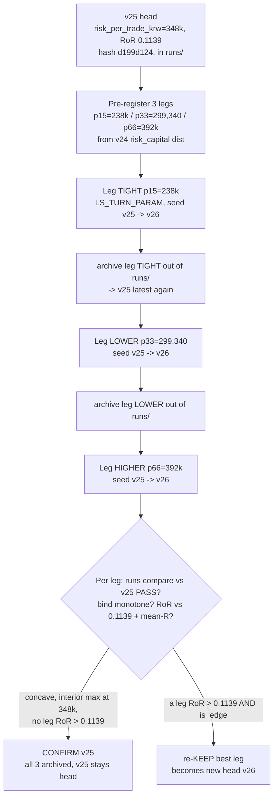

# feat: ORB `risk_per_trade_krw` governed sweep — confirm-or-deny 348k near-optimal

**Target:** `adapters/nautilus/lab` (the offline strategy-loop lab). Offline, no gateway.

**One-line:** A **governed PARAM turn** (not a code turn) that sweeps the kept sizing
budget `risk_per_trade_krw = 348,000` (v25 head) to three pre-registered percentile
points of the v24 `risk_capital` distribution — a **three-leg fan-out off v25** — to
decide whether the risk-adjusted edge (**return-on-risk**) is concave with its interior
maximum at 348k (**CONFIRM v25**) or keeps climbing as the cap tightens toward full
equalization (**re-KEEP a tighter leg**).

---

## Summary

The CLASS B turn (plan 2026-07-12-001) KEPT `risk_per_trade_krw = 348,000` KRW (the
median of v24's closed-trade `risk_capital`) as v25, the current registry head — the
first risk/position-sizing lever, judged on the re-grounded size-invariant metric
**return-on-risk** `RoR = Σrealized_pnl / Σrisk_capital`. v25 posts **RoR 0.1139**
(v24 lever-off baseline: 0.1081), with equal-weight **mean-R 0.1129** and risk-capital
dominance 5.3%.

That KEEP left one question open, exactly as the breakeven-move KEEP left the trigger
sweep: **is 348k near-optimal, or does RoR keep rising as the cap tightens?** This turn
answers it with **percentile neighbours** of the same v24 `risk_capital` distribution
that produced the median 348k — never a fit to v25's P&L — mirroring the
breakeven-trigger sweep that CONFIRMED `0.41` (both p33/p66 neighbours cleared `is_edge`
but neither beat the kept value; expectancy was concave with an interior max at the kept
p50).

**Three legs, all seeded from v25, each one version bump (nominally v26,
distinguished by run_id + budget value):**

| Leg | `risk_per_trade_krw` | percentile of v24 risk_capital | rel. change off 348k | role |
|---|---|---|---|---|
| **TIGHT** (equalization probe) | `238,000` | p15 | −31.6% | drive most orders risk-budget-bound → test RoR → mean-R |
| **LOWER** (tight neighbour) | `299,340` | p33 | −14.0% | governed neighbour below the kept median |
| _(v25 head)_ | _348,000_ | _p50_ | _0.0_ | _the kept value, the bar to beat (RoR 0.1139)_ |
| **HIGHER** (loose neighbour) | `392,000` | p66 | +12.6% | governed neighbour above the kept median |

All three are inside `PROPOSAL_BOUNDS_CAP = 0.5` measured off the immediate base (v25 =
348k), so each runs as an admissible governed `LS_TURN_PARAM` turn off the non-zero kept
value — **no seed-and-rerun, no code review, no re-baseline** (unlike the initial flip off
the `0.0` sentinel). No `orb.rs` edit → `strategy_code_hash d199d124…` stays fixed for
every leg (the param-sweep invariant).

**Why three, not two (the mechanism-driven decision).** The breakeven sweep used exactly
two neighbours (p33/p66). This sweep adds a third, deliberately **tight** equalization
probe (p15) because v25's own numbers make the "climbs as it tightens" hypothesis
_weaker_, not stronger: v25 RoR (0.1139) already sits **above** the full-equalization
mean-R (0.1129). Full equalization (every trade capped at the budget) drives RoR → mean-R
= 0.1129, which is **below** v25's 0.1139 — so a tighter cap likely makes RoR **overshoot
then decline**, not climb. p15 is the only leg that tests that directly; without it the
sweep cannot distinguish "interior max at 348k" from "still climbing tighter." (User
decision, this planning turn.)

---

## Problem Frame

**Why now.** v25 KEPT the first CLASS B lever, and its R6 re-rank named the governed
sweep of `risk_per_trade_krw` as the next motivated turn (memory
`orb-class-b-sizing-KEEP-first-risk-lever`). The exit block is already sweep-confirmed;
this closes the same loop for the first sizing lever before the next new mechanism.

**What the sweep must resolve.** The KEEP turn's honest bind deviation is the crux the
sweep interrogates. The notional ceiling makes `risk_per_trade_krw` a **one-sided
de-risking** of the wide-`risk_per_share` cohort — it can only *cut* wide-stop size, never
grow tight-stop past the 10M notional. At 348k, 98/184 orders were risk-budget-bound
(wide-stop, capped down) and 86 were notional-cap-bound (identical to v24). RoR rose to
0.1139 because the de-weighted wide-stop cohort has below-mean return-per-unit-risk (v24's
fixed-notional RoR 0.1081 sits below equal-weight mean-R 0.1129). The open question: as
the budget tightens, does down-weighting the wide-stop cohort **further** keep lifting RoR
(re-KEEP a tighter leg), or has 348k already reached/overshot the interior maximum
(CONFIRM v25)?

**What must not change.** The kept levers (`breakeven_trigger_r = 0.41`, `or_width_max_atr
= 0.666`, `entry_confirm = 1.0`), the entire exit block, and all sizing/metric code are
out of scope — no `orb.rs` / `params.rs` / `performance.rs` edit. A governed param turn
moves **only** `risk_per_trade_krw` (+ the implicit `strategy_version` bump); the
`strategy_code_hash` must stay `d199d124…` on every leg, and each leg-vs-v25 `runs compare`
must PASS with diff exactly `{risk_per_trade_krw, strategy_version}`.

---

## Requirements

- **R1 — Pre-register three legs before any run (R8/R3 discipline).** Write
  `data/turn4-fresh/PRE-REGISTER-vNEXT-sizing-sweep.md` with the three
  `risk_per_trade_krw` values, their derivation (percentiles of v24 `risk_capital`, NOT a
  P&L fit), the keep/confirm rule, and the per-leg bind signature — **before** the first
  sweep run.
- **R2 — Percentile/central-tendency values from the v24 ledger.** The three budgets are
  the **p15 (238,000), p33 (299,340), p66 (392,000)** percentiles of v24's closed-trade
  `risk_capital` distribution (n=167, the same distribution whose p50 = 348,000 seeded
  v25). Extracted deterministically from the archived v24 `performance.json`; not tuned to
  any leg's P&L.
- **R3 — Governed fan-out off v25 (each leg one version bump).** Each leg is a governed
  `LS_TURN_PARAM=risk_per_trade_krw` turn seeded from **v25** (`LS_TURN_EXPECT_VERSION=25`),
  bumping to a nominal **v26**. All three legs share the v25 code hash and are
  distinguished by run_id + budget value (the two-sided-sweep-is-a-fan-out rule). Between
  legs, the prior leg's run is archived **out of `runs/`** so v25 stays `latest_finalized`
  for the next seed.
- **R4 — Attribution per leg.** Each leg vs v25 → `runs compare` **param mode** PASSes with
  param diff exactly `{risk_per_trade_krw, strategy_version}` and `strategy_code_hash`
  equal (`d199d124…`) — confirming a param turn, not a code turn.
- **R5 — Bind check per leg (before any verdict word).** For each leg, classify orders as
  **risk-budget-bound** vs **notional-cap-bound** from the `OrderPlaced` sizing telemetry,
  confirm the shift is monotone in the budget (tighter → more risk-budget-bound), and read
  RoR against mean-R (0.1129). A leg whose qty distribution does not shift as modeled is
  **INERT** → flag it, record no edge verdict for it.
- **R6 — Keep/confirm rule on RoR + risk-dominance (expectancy diagnostic).** The backtest
  is **deterministic** (reruns are byte-identical), so each leg's RoR is an exact value —
  the decisional test is a plain strict-inequality comparison, not a significance test.
  **CONFIRM v25** (baseline stays v25) iff **no leg's RoR strictly beats v25's 0.1139**
  (each leg evaluated with `is_edge` and risk-dominance ≤ 40%) — i.e. 348k is the argmax RoR
  over the four sampled points, with a single-peaked (concave) RoR-vs-budget shape as the
  corroborating bind evidence, not a separate gate. **re-KEEP** a leg iff its RoR
  **strictly** beats 0.1139 **and** `is_edge` holds (positive expectancy, risk-dominance ≤
  40%); take the best such leg. Judge on RoR + risk-dominance only; KRW/trade expectancy
  stays diagnostic.
- **R7 — Archive; v25 stays head unless a leg re-KEEPs.** All three legs archived under
  `data/turn4-fresh/sizing-archive/` (descriptive `LABEL-<value>-<ts>-orb-v26/` names,
  mirroring the breakeven `sweep-archive/` convention). On CONFIRM, all three stay archived
  and v25 (`20260712T065730Z-backtest-orb-v25`) remains the registry head. The verdict is
  authored in `TURN-LOG.md` only after all three runs exist. Offline throughout; workspace
  gate (`cargo test -p nautilus-ls-lab`) green (a no-code regression guard).

---

## Key Technical Decisions

### KTD-A — Governed `LS_TURN_PARAM` off the kept value, NOT seed-and-rerun (R3)

The initial flip was a seed-and-rerun because `0.0 → value` is an infinite relative change
that `PROPOSAL_BOUNDS_CAP = 0.5` fail-closes. Here every leg moves from the **non-zero**
kept 348k, and all three relative changes (−31.6% / −14.0% / +12.6%) are inside the cap —
so each is an admissible governed `LS_TURN_PARAM=risk_per_trade_krw` +
`LS_TURN_VALUE=<budget>` turn with `LS_TURN_EXPECT_VERSION=25`. No re-baseline, no code
review, no manifest seeding. This mirrors the breakeven-trigger sweep exactly (governed off
`0.41`, not the sentinel).

### KTD-B — Two-sided (three-point) sweep is a FAN-OUT; the bounds cap is measured off the immediate base (R3)

Each leg must seed from the anchor **v25**, so all three are nominally **v26** — a fan-out,
not a linear chain. The bounds cap is measured against the **immediate base** the `turn`
command resolves as `latest_finalized`, which must be v25 for every leg. Therefore, after
each leg runs, **move its run out of `runs/`** (into `sizing-archive/`) before the next
leg, or the next leg seeds from the just-finalized v26 (wrong base, and a chained relative
change that can trip the cap). A no-`LS_TURN_PARAM` `turn` is a **RERUN** (it runs a
backtest and finalizes a run with no version bump) — never use it as a head-check probe.

### KTD-C — Values are percentiles of the v24 ledger, fixed before runs (R1/R2)

The three budgets are read once from the archived v24 `performance.json` closed-trade
`risk_capital` array (n=167) — the same array whose median (348,000) seeded v25 — and
pre-registered before any leg runs. p15/p33/p66 are central-tendency selections of the
untreated deployed-risk population, not fits to any leg's realized P&L. Rounding follows
348,000's 1,000-KRW granularity where interpolation is non-integral (p33 299,340 → carried
verbatim; p15 238,000 and p66 392,000 are already round). Guardrail: exactly these three
governed values — do not widen into a finer grid or re-pick a value to beat v25 (that would
be a fit).

### KTD-D — Keep/confirm on RoR (crux) + risk-dominance (gate); expectancy is diagnostic (R6)

The keep crux is size-invariant **return-on-risk**; the dominance gate is **risk-capital
share** (≤ 40%). KRW/trade expectancy is size-contaminated once the sizing lever is on and
stays reported but non-decisional. The bar to beat is v25's RoR **0.1139**. Because the backtest
is deterministic, a CONFIRM is the exact statement "no leg's RoR strictly exceeds 0.1139"
(a single-peaked RoR-vs-budget shape corroborates but does not gate) — the expected and
valuable outcome (mirrors the breakeven-trigger CONFIRM), which de-risks the first sizing
lever before the next new mechanism.

### KTD-E — No code change → `strategy_code_hash` is the sweep invariant (R4)

This turn touches no Rust. `strategy_code_hash d199d124…` (shared by v24 and v25) stays
fixed for all three legs, so each leg-vs-v25 `runs compare` is a clean two-key
`{risk_per_trade_krw, strategy_version}` param-mode PASS. Rebuild the release binary from
`adapters/nautilus/lab` before running anyway (a stale binary is the classic silent
old-hash trap); since no source changed, the rebuild is a no-op that confirms the hash.

---

## High-Level Technical Design

### Turn flow (three-leg fan-out off v25)

### RoR-vs-budget hypothesis (the concavity the sweep tests)

| Point | budget | orders risk-budget-bound | predicted RoR direction | interpretation |
|---|---|---|---|---|
| v24 (lever off) | ∞ (fixed notional) | 0 | 0.1081 | wide-stop over-weighted → RoR below mean-R |
| **HIGHER** | 392,000 | fewer than v25 | between v24 and v25 (toward 0.108) | less de-risking of wide-stop cohort |
| **v25 (head)** | 348,000 | 98/184 | **0.1139** (the bar) | RoR already **above** mean-R |
| **LOWER** | 299,340 | more than v25 | at/near/below 0.1139 | tests "still climbing tighter" |
| **TIGHT** | 238,000 | most orders bound | → mean-R 0.1129 (below v25) | near full equalization; RoR overshoot-then-decline test |
| full equalization | → 0⁺ | all | = mean-R 0.1129 | RoR ceiling is the equal-weight mean |

Concavity hypothesis: interior maximum at or just tightward of 348k, with TIGHT (p15)
pulling RoR back toward mean-R (0.1129 < 0.1139). If instead LOWER or TIGHT **strictly
beats** 0.1139 with `is_edge`, RoR is still climbing → re-KEEP. _Directional guidance
stated before the runs — the runs decide._

---

## Implementation Units

> This is a **param-sweep run turn**, not a code turn: no Rust source changes, so no new
> unit tests. Each unit's proof is the harness reconcile / `runs compare` / bind verdict,
> exactly like the breakeven-trigger sweep and the CLASS B U5. `Test expectation: none` on
> the run units reflects that, with the harness verdicts enumerated under **Verification**.

### U1. Pre-register the three-leg sweep

**Goal:** Fix the three budget values, the keep/confirm rule, and the per-leg bind
signature in a written pre-registration before any leg runs (R8/R3).

**Requirements:** R1, R2, R6.

**Dependencies:** none.

**Files:**
- `data/turn4-fresh/PRE-REGISTER-vNEXT-sizing-sweep.md` (new).

**Approach:** Mirror `data/turn4-fresh/PRE-REGISTER-vNEXT-breakeven-sweep.md` (the direct
precedent) and `PRE-REGISTER-vNEXT-sizing.md` (the RoR/bind vocabulary). Re-extract the
v24 closed-trade `risk_capital` percentiles from
`data/turn4-fresh/sizing-archive/20260712T065529Z-backtest-orb-v24/performance.json`
(n=167) to confirm p15 = 238,000, p33 = 299,340, p66 = 392,000 and their admissibility
(each |Δ| < 0.5 off 348k). Record: the anchor (v25, RoR 0.1139, mean-R 0.1129,
risk-dominance 5.3%, hash `d199d124…`); the three values + derivation (central tendency,
not a fit); the keep/confirm rule (R6, bar = 0.1139); and the per-leg bind hypothesis
(monotone risk-budget-bound count, RoR vs mean-R). State the guardrail: exactly these three
governed values, no finer grid.

**Test expectation:** none — a pre-registration document.

**Verification:** The file exists and names all three values, the keep/confirm rule, and
the bind signature **before** the first `turn` run (git-timestamp / commit order proves
pre-registration, per the R8 discipline).

### U2. Execute the three governed legs (fan-out off v25)

**Goal:** Run each leg as an admissible governed `LS_TURN_PARAM` turn seeded from v25,
archiving each out of `runs/` before the next so v25 stays `latest_finalized`.

**Requirements:** R3, R4, R7.

**Dependencies:** U1.

**Files:**
- (gitignored data home `data/turn4-fresh/`) three new v26 runs, then relocated to
  `data/turn4-fresh/sizing-archive/`.

**Approach (the harness seam — directional, not a shell recipe):** Rebuild the release
binary from `adapters/nautilus/lab` (`cargo build --release -p nautilus-ls-lab --bin
lab-research`) first — a no-op that guards the stale-binary/old-hash trap. Then, per leg:
run `lab-research turn` with `LS_DATA_HOME=data/turn4-fresh`,
`LS_TURN_PARAM=risk_per_trade_krw`, `LS_TURN_VALUE=<238000 | 299340 | 392000>`,
`LS_TURN_EXPECT_VERSION=25`. Confirm the emitted approval line reads `risk_per_trade_krw
348000.0000 -> <value>, strategy v25 -> v26`. **After each leg finalizes, move its run
directory out of `runs/` into `sizing-archive/`** with a descriptive name
(`TIGHT-238000-<ts>-orb-v26/`, `LOWER-299340-<ts>-orb-v26/`, `HIGHER-392000-<ts>-orb-v26/`)
**before starting the next leg**, so `latest_finalized_run` resolves to v25 again (KTD-B).
Do not issue a bare no-param `turn` between legs (that is a RERUN that finalizes a
duplicate).

**Execution note:** Smoke/runtime turn — the "tests" are the harness `turn` +
`runs compare` verdicts. Do not author the sweep verdict before all three runs exist
(R1/R8 pre-register discipline).

**Test expectation:** none — governed harness runs.

**Verification (per leg):**
- The `turn` approval line shows `strategy v25 -> v26` and the correct target budget.
- `runs compare` **param mode**, leg vs v25 (`LS_COMPARE_A=<v25 id> LS_COMPARE_B=<leg id>
  LS_COMPARE_MODE=param`) → **PASS**, param diff exactly `{risk_per_trade_krw,
  strategy_version}`, `strategy_code_hash` equal (`d199d124…`), fingerprint/range/universe
  equal.
- Before starting leg N+1, `runs/` contains no v26 run (leg N archived) so v25 is
  `latest_finalized` (a bare rerun would prove this, but per KTD-B do **not** run one —
  verify by directory listing instead).

### U3. Per-leg edge + bind analysis

**Goal:** For each leg, compute the size-invariant edge (RoR, mean-R, risk-dominance) and
classify the qty bind, validating the monotone shift before any verdict.

**Requirements:** R5, R6.

**Dependencies:** U2.

**Files:**
- (gitignored) each archived leg's `analysis.md` (scaffolded).

**Approach:** For each leg run, `lab-research analyze --scaffold`
(`LS_ANALYZE_RUN=<leg id>`) renders the size-invariant edge block (return-on-risk, mean-R,
total deployed risk_capital, risk-capital dominance). Read each leg's **RoR** against the
v25 bar (0.1139) and against mean-R (0.1129). Classify each leg's orders as
**risk-budget-bound** (`qty == floor(budget / risk_per_share) < floor(notional / entry)`)
vs **notional-cap-bound** (`qty == floor(notional / entry)`) from the `OrderPlaced` sizing
telemetry the v25 code emits (the same basis the KEEP turn used to read 98/184
risk-budget-bound at 348k). **Implementation-Time Unknown (verify first):** confirm the
`OrderPlaced` values in the leg's `decisions.jsonl` carry `risk_per_trade_krw` /
`risk_per_share` / `qty` (they did for v25 — low risk); if a field is absent, reconstruct
the bind from `risk_capital` vs `entry`/`stop` in `performance.json`. Confirm the
risk-budget-bound count is **monotone** in the budget (TIGHT 238k > LOWER 299,340 > v25
348k > HIGHER 392k). A leg whose qty distribution does not shift as modeled is **INERT** →
flag it, no edge verdict for that leg.

**Test expectation:** none — analysis of harness output.

**Verification:**
- Each leg's `analysis.md` renders RoR, mean-R, and risk-capital dominance (not `n/a` —
  every closed trade carries `risk_capital`, as in v25).
- Risk-budget-bound order count is monotone across the four points (three legs + v25).
- Each leg's RoR is recorded against 0.1139 with `is_edge` and risk-dominance ≤ 40%
  evaluated.
- Any INERT leg is flagged with no edge verdict.

### U4. Verdict, TURN-LOG, final registry state

**Goal:** Reach and record the CONFIRM-or-re-KEEP verdict on RoR + risk-dominance, and
leave v25 as head (or the best leg as new head on re-KEEP).

**Requirements:** R6, R7.

**Dependencies:** U3, plus a green workspace gate.

**Files:**
- `adapters/nautilus/lab/TURN-LOG.md` — new top entry (the durable verdict).
- `data/turn4-fresh/sizing-archive/` — final resting place of the non-kept legs.

**Approach:** Apply R6 against the three legs' RoR (bar 0.1139) with risk-dominance ≤ 40%
and `is_edge`. The backtest is deterministic, so compare exact RoR values (no significance
test). **CONFIRM v25** if no leg's RoR strictly beats 0.1139 (348k is the argmax over the
four sampled points, single-peaked RoR-vs-budget shape corroborating) — baseline stays v25,
all three legs stay archived (a valid recorded outcome, not a failure; mirrors the
breakeven-trigger CONFIRM). **re-KEEP** the
best leg only if its RoR strictly beats 0.1139 with `is_edge`; that leg (nominally v26)
becomes the new head and the others stay archived. Author the TURN-LOG entry — baseline v25
RoR 0.1139, each leg's RoR + bind signature (risk-budget-bound counts, RoR vs mean-R), and
the CONFIRM/re-KEEP with its evidence — only after all three runs exist. Confirm
`cargo test -p nautilus-ls-lab` is green (a no-code regression guard).

**Execution note:** The pessimistic bar-low fill makes any positive RoR a lower bound; note
it in the verdict as the loop does.

**Test expectation:** none — recorded verdict over existing runs.

**Verification:**
- `cargo test -p nautilus-ls-lab` green; `strategy_code_hash` unchanged (`d199d124…`).
- TURN-LOG entry records the baseline v25 RoR, all three legs' RoR + bind evidence, and the
  CONFIRM/re-KEEP verdict on RoR + risk-dominance (expectancy diagnostic only).
- On CONFIRM: `runs/` head is still `20260712T065730Z-backtest-orb-v25`; all three legs
  under `sizing-archive/`. On re-KEEP: the winning leg is the head; others archived.

---

## Scope Boundaries

**In scope:** one pre-registration, three governed `risk_per_trade_krw` legs (fan-out off
v25), per-leg edge + bind analysis, and one CONFIRM-or-re-KEEP verdict. No Rust code.

### Deferred to Follow-Up Work
- **Finer or wider grid** on `risk_per_trade_krw` — out of scope by KTD-C (a finer grid is
  a fit). If this sweep shows RoR still climbing at TIGHT (p15), a *separate* pre-registered
  turn toward deeper equalization (p10 / p5) is the follow-up, not an extension here.
- **Mark-to-market / compounding equity sizing, ATR/volatility-scaled notional,
  Kelly-fraction sizing** — later CLASS B levers, each its own turn (carried from the CLASS
  B plan's deferred list).

### Out of scope (do not touch)
- The kept levers (`breakeven_trigger_r = 0.41`, `or_width_max_atr = 0.666`,
  `entry_confirm = 1.0`), the exit block, and all sizing/metric **code**
  (`params.rs`, `orb.rs`, `performance.rs`) — this is a param turn, `strategy_code_hash`
  must not move.
- Any gateway/live path — offline only.

---

## Risks & Dependencies

- **Fan-out base drift (KTD-B, highest-leverage discipline).** If a leg's run is left in
  `runs/`, the next leg seeds from it (wrong base) and its relative change may trip
  `PROPOSAL_BOUNDS_CAP` or produce a chained diff. Mitigation: archive each leg out of
  `runs/` before the next; verify by directory listing (not by a bare rerun, which
  finalizes a duplicate).
- **Bind telemetry availability (Implementation-Time Unknown, U3).** The bind check needs
  the `OrderPlaced` sizing basis (`risk_per_trade_krw` / `risk_per_share` / `qty`). v25
  emits it (the KEEP turn read 98/184 from it) — low risk — but confirm the fields are
  present in each leg's `decisions.jsonl`; else reconstruct from `risk_capital` vs
  `entry`/`stop`.
- **INERT leg (R5).** If the notional cap already binds so widely that a tighter budget
  barely shifts the qty distribution, that leg is a no-op — flag it, record no edge verdict,
  do not read its RoR as a decision.
- **Stale-binary / old-hash trap.** Rebuild the release binary from
  `adapters/nautilus/lab` before the first leg; a repo-root build fails the package spec and
  a stale binary silently emits the old hash.
- **CONFIRM is a success outcome.** Neither neighbour beating 0.1139 is the expected,
  valuable result (per the breakeven-trigger precedent) — record it as CONFIRM, not as a
  turn failure.

---

## Definition of Done

- `data/turn4-fresh/PRE-REGISTER-vNEXT-sizing-sweep.md` written **before** the first leg,
  with the three values (p15 238,000 / p33 299,340 / p66 392,000), derivation, keep/confirm
  rule (bar 0.1139), and per-leg bind signature.
- Three governed legs executed off v25; each leg-vs-v25 `runs compare` param mode PASSes
  with diff exactly `{risk_per_trade_krw, strategy_version}` and `strategy_code_hash` equal
  (`d199d124…`); each leg archived out of `runs/` before the next.
- Per-leg `analysis.md` scaffolded; RoR, mean-R, risk-dominance read; risk-budget-bound vs
  notional-cap-bound classified and confirmed monotone in the budget; any INERT leg flagged.
- Verdict (CONFIRM v25 / re-KEEP best leg) authored on RoR + risk-dominance (expectancy
  diagnostic) and recorded in `TURN-LOG.md`, only after all three runs exist.
- On CONFIRM, v25 (`20260712T065730Z-backtest-orb-v25`) remains the registry head with all
  three legs under `sizing-archive/`; on re-KEEP, the winning leg is the head, others
  archived.
- `cargo test -p nautilus-ls-lab` green; no Rust source changed. Offline throughout.

---

## KTDs carried from the loop discipline

- **Governed sweep off the kept value** — admissible `LS_TURN_PARAM` turns (all inside the
  0.5 bounds cap off 348k), not seed-and-rerun; no code review, no re-baseline.
- **Two-sided (three-point) sweep is a fan-out** — each leg seeds from v25 (nominally v26,
  distinguished by run_id + value); archive each leg out of `runs/` before the next so v25
  stays `latest_finalized`; a no-param `turn` is a RERUN, not a head-check.
- **Pre-register R3/R8** — values (percentile/central-tendency of the v24 ledger, not a P&L
  fit) + keep rule + bind signature authored before the runs.
- **RoR is the crux, risk-dominance the gate** — expectancy is size-contaminated and stays
  diagnostic; the bar to beat is v25's RoR 0.1139.
- **Pessimistic bar-low fill = lower bound** — any positive RoR is a lower bound on the
  lever's true edge.
- **CONFIRM keeps v25 head** — the sweep confirms 348k near-optimal unless a leg strictly
  re-KEEPs; a param sweep leaves `strategy_code_hash` fixed.

---

## Sources

- `data/turn4-fresh/PRE-REGISTER-vNEXT-breakeven-sweep.md` (the direct two-sided-sweep
  precedent: percentile neighbours, fan-out, keep/confirm rule).
- `data/turn4-fresh/PRE-REGISTER-vNEXT-sizing.md` (RoR / risk-dominance / bind-signature
  vocabulary; the v24 `risk_capital` distribution).
- `docs/plans/2026-07-12-001-feat-orb-class-b-sizing-normalized-edge-plan.md` (the KEEP
  turn: metric redesign, the lever, the mechanism nuance).
- `adapters/nautilus/lab/src/runner/research.rs` (`turn`, `runs compare` param mode,
  `param_diff`, `analyze --scaffold`, `PROPOSAL_BOUNDS_CAP`, `latest_finalized_run`).
- `adapters/nautilus/lab/TURN-LOG.md` (the CLASS B KEEP entry; the R6 re-rank naming this
  sweep).
- Memories: `orb-class-b-sizing-KEEP-first-risk-lever-2026-07-12`,
  `orb-breakeven-trigger-sweep-CONFIRM-v23-near-optimal-2026-07-12`.
- Archived v24 run: `data/turn4-fresh/sizing-archive/20260712T065529Z-backtest-orb-v24/`
  (the `risk_capital` distribution source, n=167).
