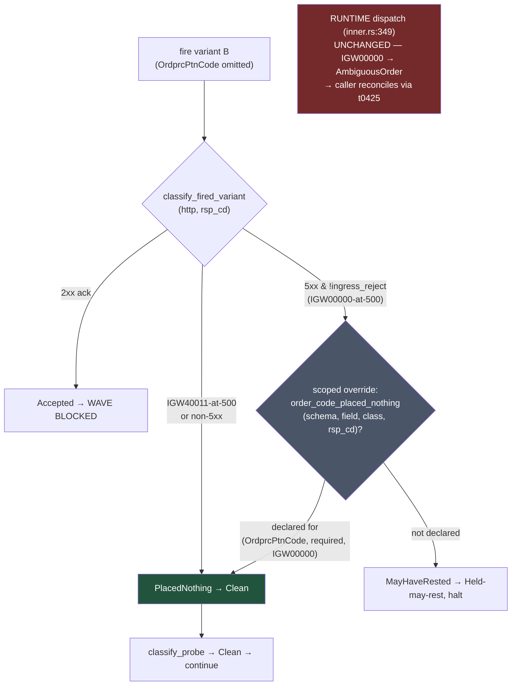

# IGW00000 on CSPAT00701 — Classify & Unblock Promotion - Plan

> **Product Contract preservation:** Product Contract unchanged. The brainstorm's
> WHAT/route decisions (Route B, runtime untouched, attended A/B, both verdict arms)
> are carried forward verbatim; this enrichment adds only the HOW.

## Goal Capsule

- **Objective.** Classify the undocumented gateway code `IGW00000` — seen live on
  CSPAT00701's `OrdprcPtnCode`-omitted variant during re-cert wave 3 (2026-07-13) — as
  **placed-nothing** or **may-rest** via a credential-safe A/B that leaves no resting
  order. On placed-nothing, unblock CSPAT00701 promotion via **Route B**; on may-rest,
  keep it permanently HELD with documented flip-evidence.
- **Product authority.** Operator (owns the attended, KRX-open, order-placing legs).
- **Open blockers.** Requires an attended KRX-open window — the order legs are
  TTY-gated, not agent-runnable. All offline work (U1–U4) lands and gates green first.

---

## Product Contract

### Problem & context

CSPAT00701 (**현물정정주문** — cash-equity order *modify*, keyed by `OrgOrdNo`) is HELD.
Its negative differential probe fired the `OrdprcPtnCode`/required variant and hit
`http=500 rsp_cd=IGW00000 → Held-may-rest halt=true`. `IGW00000` is **undocumented** —
absent from `metadata/error-catalog.yaml` and the rest of the codebase.

Two facts make naive classification unsafe:

1. **`IGW00000` is a success-*shaped* code** (`00000`/`00136` are the gateway's success
   families). A reject that reads like `0000` may instead mean *accepted* — so the code
   cannot be the classifier; only a post-order read can be.
2. **CSPAT00701 is a *modify*, not a submit.** The violation variant mutates an
   *existing resting order we control*. A modify's may-rest signature is **mutation of
   the target order** — which the §30 fallback sweep (`ordno=18372`, "no stranded
   order") never checked; it only looked for a *new stranded* order.

**Mechanism finding (resolved 2026-07-14):** there is **no metadata-only path**.
`classify_fired_variant` (`crates/ls-sdk/tests/negative_probe.rs:1210`) reaches
placed-nothing only through `is_ingress_validation_reject`; the
`gateway_tolerant`/`expected-tolerant` mechanism lives on the read-path
`ProbeOutcome::Divergent` seam the order path never reaches (it halts at
`MayHaveRested` first). Every placed-nothing route is a **code turn**. Chosen route:
**B — order-path-only scoped tolerance**, which keeps the runtime may-rest default.

### Desired outcome

A conclusive placed-nothing / may-rest verdict backed by a **trustworthy
(non-throttled)** post-fire read, and the corresponding disposition applied:
CSPAT00701 `recommended` (placed-nothing) or documented permanent-HELD (may-rest).

### Route B — order-path-only scoped tolerance

A scoped `(TR, field, code)` allowlist admits `IGW00000`-at-500 as placed-nothing **for
CSPAT00701's `OrdprcPtnCode` required-variant only** — no other TR/field/code is
affected, and the **runtime seam (`is_ingress_validation_reject` / `inner.rs:349`)
stays untouched**, so a real caller still gets `AmbiguousOrder → reconcile via t0425`.
If the placed-nothing verdict is ever wrong, the blast radius is a wrongly-promoted TR,
never a silently-swallowed resting order in production. Route B **deliberately breaks**
the `negative_probe.rs:1206` "probe and live path can never disagree" invariant — in
the *safe* direction (probe lenient after a controlled teardown; runtime strict) — and
that break must be stated explicitly in code + coverage note, not left implicit.

**Sensor-blinding cost (accepted, bounded).** The break is not merely "lenient probe /
strict runtime" — the negative probe is also a live regression sensor, and annotating
`(CSPAT00701, OrdprcPtnCode, IGW00000)` as placed-nothing makes the probe return CLEAN
for that variant *forever*. If the gateway's behavior for this undocumented,
success-shaped code later changes to actually **rest** an order, the probe can no longer
detect it (the runtime, unchanged, still handles it safely as may-rest). This cost is
accepted but must be bounded: the coverage note records that the annotation suppresses
future regression detection on this variant, and any recurrence of IGW00000 **anywhere
else** triggers a re-probe of CSPAT00701 (not only the Route-A migration).

**Staged path to Route A:** if `IGW00000` later recurs as a confirmed placed-nothing
reject on a *second, independent* order TR, migrate the scoped allowlist into
`is_ingress_validation_reject` and restore the 1206 invariant.

### The A/B probe (attended; operator-run order legs)

A **seed → snapshot → fire → re-snapshot → teardown** cycle on an order we control and
will cancel:

1. **Seed** (order leg): submit one **non-fillable far-off limit order**. ⚠️
   Price-distance alone is **not** a sufficient non-fillability guarantee: the fired
   variant omits `OrdprcPtnCode`, the very field that governs limit-vs-marketable. If
   IGW00000 is may-rest *and* the gateway defaults the omitted pattern to a marketable
   form, the far-off seed becomes fillable **from within the modify**, independent of
   market drift. Choose a seed where a marketable default still cannot fill (e.g. a
   price-limit-locked symbol) if one exists; otherwise treat a same-tick fill as
   possible and rely on the fill-inclusive `S_post` read to catch it. Capture `OrgOrdNo`.
2. **Snapshot `S_pre`** (read leg — agent-runnable): **fill-inclusive** `t0425` read for
   the seed `OrgOrdNo`; record its price/qty/type/pattern.
3. **Control leg** (order leg, recommended): a *valid* modify (`OrdprcPtnCode` present)
   → clean ack (`00462`), proving the harness before the violation fire. Re-snapshot so
   `S_pre` reflects the pre-violation state.
4. **Fire variant B** (order leg): the same modify with `OrdprcPtnCode` **omitted** →
   the IGW00000 surface, via `make raw-probe` (prints only `http`/`rsp_cd`/`body_len`).
5. **Snapshot `S_post`** (read leg — agent-runnable): re-read **fill-inclusive**
   `t0425` for the seed `OrgOrdNo`, **paced** to avoid IGW00201; positively re-verify
   the seed's `OrdprcPtnCode`/price survived the fire (not just presence in the
   working-orders set).
6. **Teardown** (order leg): cancel the seed `OrgOrdNo`; assert the symbol is FLAT
   (chain.rs reconcile pattern).

### Bind signature (the classification rule)

The snapshot reads **must be fill-inclusive.** The working-orders read (`t0425` with
`chegb="2"`, `negative_probe.rs:1086`) excludes a fully-filled (`ordrem==0`) row **by
construction** — so a seed that IGW00000 mutated to a marketable state and *filled*
between snapshots would simply **vanish** from a `chegb="2"`-only `S_post`, which is
exactly the may-rest hazard the probe exists to catch. `S_pre`/`S_post` must therefore
use a fill-inclusive query for the seed `OrgOrdNo` (the `classify_control_disposition`
fill-check analogue), not a working-orders-only comparison.

- **placed-nothing (conclusive):** B → `http=500 rsp_cd=IGW00000` **AND** the seed
  `OrgOrdNo` is **present and byte-identical** in `S_post` vs `S_pre` (fill-inclusive
  read) **AND** no new resting order.
- **may-rest (conclusive):** seed order **mutated** (price/type/qty) **OR** the seed
  `OrgOrdNo` **vanished / filled** (absent from a fill-inclusive `S_post`) **OR** a new
  order rested. A vanished seed is may-rest, **never** inconclusive.
- **inconclusive → stays HELD:** `S_post` is throttled/non-clean (IGW00201). Per #137 an
  untrusted read is Held, **never** placed-nothing. "No observed change" is only
  evidence when the read is trustworthy. Re-pace and retry, or defer.

### Probe policy (resolves pending.13 #5)

Live `required`-variant probes are **permitted for modify legs** (seed + teardown make
them reversible and observable via `t0425`) but **excluded for submit legs with
booking-determining fields** (the BnsTpCode class), where omission creates an
*uncontrolled* resting order with no seed to snapshot against. This split is what
separates CSPAT00701 (probeable) from CSPAT00601 (permanently HELD, not probeable).

### Scope boundaries

**In scope:** the dormant Route B mechanism + tests; the `error-catalog.yaml` IGW00000
entry; the A/B runbook + bind signature; the modify-vs-submit policy; the attended
session; and both verdict arms (placed-nothing promotion / may-rest permanent-HELD).

**Out of scope:** any change to `is_ingress_validation_reject` or `inner.rs` runtime
dispatch (Route A is deferred to the staged path); CSPAT00601/BnsTpCode beyond the
policy statement; any submit-leg negative probe for booking-determining fields.

### Success criteria

- A conclusive verdict with a trustworthy (non-throttled) post-fire read.
- On placed-nothing: CSPAT00701 `recommended`, full gate green, **zero runtime-seam
  change**; docgen banner + freshness count updated.
- On may-rest: CSPAT00701 documented permanent-HELD with explicit flip-evidence.

---

## Planning Contract

### Key technical decisions

- **KTD1 — Keep `classify_fired_variant` pure; add the override at the call site.** The
  pure `(http, rsp_cd)` classifier and its offline-twin test
  (`classify_fired_variant_exempts_igw40011_at_500_but_holds_other_5xx`,
  `negative_probe.rs:1919`) stay intact. The scoped placed-nothing override is a
  separate, independently-tested predicate. It is composed with the pure classifier in a
  pure `resolve_fired_outcome` (U1) that the async fire loop
  (`run_order_negative_probe`, `negative_probe.rs:1564`) calls — `schema`, `v.field`,
  and `v.class` are already in scope there (no signature plumbing), and the pure resolver
  makes the routing offline-twinnable. Rationale: minimizes blast radius on a
  safety-critical classifier and keeps the twin-test contract stable.
- **KTD2 — The scoped annotation is an analogue of `gateway_tolerant`.**
  `FieldConstraint` (`crates/ls-core/src/preflight.rs:106`) already carries
  `gateway_tolerant: Vec<String>` (per-class, `#[serde(default, skip_serializing_if)]`,
  backward-compatible). Add a sibling per-class → gateway-code allowlist (default
  empty) so a field can declare "class X's `IGW00000` placed nothing." Directional
  shape — implementer finalizes the exact serde layout; it must be omit-by-default so
  every existing constraint file deserializes unchanged.
- **KTD3 — Mechanism lands dormant, before the attended session.** U1 ships fully gated
  with a synthetic-fixture test (mirroring `t8412_schema()`), no live consumer. The
  CSPAT00701 annotation (U6) is applied only *after* the placed-nothing verdict. This
  de-risks the attended window to one metadata line + re-probe + promote.
- **KTD4 — Runtime seam untouched.** `is_ingress_validation_reject` still admits only
  `IGW40011`; its exclusion test (`negative_probe.rs`/`error_catalog.rs` asserting
  `"IGW00000"`/`"00000"` are *not* ingress rejects) stays green. The probe-vs-runtime
  divergence is intentional and documented (KTD1 comment + coverage note).

### Assumptions

- The seed far-off limit will not fill during the probe window — but non-fillability
  must survive the **omitted-pattern fire**, not just market distance (an omitted
  `OrdprcPtnCode` may default to a marketable form in the may-rest branch). Mitigation:
  fill-inclusive `S_post` + positive pattern/price re-verification; a vanished seed is
  read as may-rest. If the market moves into the seed, the comparison is void — re-seed
  further out.
- Paper state for the 07-13 event is gone (`make paper-reset` ran), so a fresh
  controlled A/B is required; no read-only post-hoc reclassification is available.
- `error-catalog.yaml` `kind` for IGW00000: reuse `gateway_error` with a scoped
  explanation unless the implementer finds a cleaner fit; a new `kind` is optional, not
  required (Open Question OQ1).

### Open questions (deferred to implementation)

- **OQ1 — `error-catalog.yaml` `kind` value.** Existing kinds: `success`,
  `paper_incompatible`, `account_not_order_capable`, `session_closed`, `request_shape`,
  `gateway_error`. A scoped placed-nothing reject fits none cleanly; default to
  `gateway_error` + explanatory note, decide at authoring time.
- **OQ2 — error-coverage `status` value for the tolerated variant.** The
  `input_classes` legend has `confirmed`/`tolerant`/`held`/`divergent`/`n_a`. A
  scoped-placed-nothing outcome is closest to `tolerant` (accepted-violation analogue)
  but semantically distinct (rejected-but-safe). Reuse `tolerant` with a code
  annotation, or add a `placed_nothing` status — settle when authoring
  `error-coverage/CSPAT00701.yaml` (U6).

---

## High-Level Technical Design

Route B decision flow at the order-probe fire site (`run_order_negative_probe`), showing
where the scoped override intercepts the may-rest halt without touching runtime:

The dark node `M` is the only new decision. The runtime box `R` is drawn detached to
show it is deliberately outside this change — the intentional, documented divergence.

---

## Implementation Units

### U1. Scoped order-path placed-nothing tolerance mechanism (dormant)

- **Goal.** Land the Route B mechanism — a scoped `(field, class, code)` placed-nothing
  allowlist consulted at the order-probe fire site — fully tested and gate-green, with
  no live consumer yet.
- **Requirements.** Advances Route B; enables U6. Realizes KTD1, KTD2, KTD3, KTD4.
- **Dependencies.** None.
- **Files.**
  - `crates/ls-core/src/preflight.rs` — extend `FieldConstraint` with the per-class →
    gateway-code allowlist (default empty, serde-omit-by-default); unit tests in the
    same file's `mod tests`.
  - `crates/ls-sdk/tests/negative_probe.rs` — new predicate
    `order_code_placed_nothing(schema, field, class, rsp_cd)` (mirror `is_gateway_tolerant`,
    line 158); consult it in the `MayHaveRested` arm (line 1564) before halting;
    document the intentional line-1206 divergence in the arm's comment.
- **Approach.** Keep `classify_fired_variant` pure and untouched (KTD1). Compose it with
  the scoped override in a small **pure resolver**
  `resolve_fired_outcome(schema, field, class, http, rsp_cd) -> FiredVariantOutcome`
  that returns `PlacedNothing` when `classify_fired_variant` yields `MayHaveRested` *and*
  `order_code_placed_nothing(schema, field, class, rsp_cd)` is true, and otherwise defers
  to `classify_fired_variant`. The async fire loop calls the resolver instead of
  `classify_fired_variant` directly — so the routing is offline-twinnable without an
  async gateway (resolves the fire-site-integration test gap). The struct field parses
  from `metadata/constraints/<tr>.yaml` via the existing `schema_for` path.
- **Technical design (directional).** Serde shape, e.g. on `FieldConstraint`:
  `placed_nothing_codes: BTreeMap<String, Vec<String>>` (class → codes),
  `#[serde(default, skip_serializing_if = "BTreeMap::is_empty")]`. Predicate:
  look up the field, then `codes.get(class).map_or(false, |cs| cs.iter().any(|c| c == rsp_cd))`.
  Final layout is the implementer's call.
- **Patterns to follow.** `FieldConstraint::gateway_tolerant` + `is_gateway_tolerant`
  (the read-path twin); `t8412_schema()` fixture (line 55) for synthetic test schemas.
- **Execution note.** Implement the mechanism test-first against a synthetic fixture
  schema — no live gateway, no CSPAT00701 annotation yet.
- **Test scenarios.**
  - A fixture field declaring `{required: [IGW00000]}` → `order_code_placed_nothing`
    returns true for `(field, "required", "IGW00000")`.
  - Same field, `"required"`, a *different* code (`IGW50008`) → false (scoped to the
    declared code).
  - Same field, a *different* class (`"type"`), `IGW00000` → false (scoped to the
    declared class).
  - A *different* field with no declaration → false (scoped to the declared field).
  - Empty/absent `placed_nothing_codes` (every existing constraint file) → false; all
    existing constraint YAMLs still deserialize unchanged (round-trip a sample).
  - **Resolver twin** (`resolve_fired_outcome`): `(500, IGW00000)` on a declared
    `(field, class)` → `PlacedNothing`; on an *undeclared* one → `MayHaveRested`; a 2xx
    ack → `Accepted` unchanged; `(500, IGW40011)` → `PlacedNothing` unchanged.
  - **Real-binding round-trip (de-risks the attended window):** parse the *actual*
    intended CSPAT00701 annotation shape (`field: OrdprcPtnCode`, `class: required`,
    `code: IGW00000`) through `schema_for`/deserialize and assert
    `order_code_placed_nothing` returns true — proving the live `InvalidVariant.field` /
    `v.class` string binding matches the annotation key *offline*, before U5. This is a
    fixture/round-trip test, not a live call; it must not require the U6 metadata edit
    to land (use an inline or `tests/`-local YAML fixture).
  - KTD4 guard: `is_ingress_validation_reject("IGW00000")` and `("00000")` still return
    false (runtime seam untouched).
- **Verification.** `cargo test -p ls-core --lib preflight` and
  `cargo test -p ls-sdk --test negative_probe` green; full gate green; no diff to
  `is_ingress_validation_reject` or `inner.rs`.

### U2. error-catalog.yaml IGW00000 entry

- **Goal.** Document `IGW00000` in the shared error catalog as a scoped placed-nothing
  reject, so promotion's error-coverage can reference it.
- **Requirements.** Advances Route B; required by promote-tr's error-coverage gate.
- **Dependencies.** None (safe to author anytime; independent of the verdict).
- **Files.** `metadata/error-catalog.yaml` — add the `IGW00000` code entry.
- **Approach.** Add an entry keyed `IGW00000` with `kind` (OQ1 — default
  `gateway_error`) and an `explanation` stating it is an undocumented, success-shaped
  gateway code observed as a placed-nothing ingress reject on CSPAT00701's
  `OrdprcPtnCode` modify variant; **not** globally admitted to
  `is_ingress_validation_reject` (runtime treats it as may-rest / reconcile).
- **Patterns to follow.** Existing `IGW40011`/`IGW40013`/`IGW50008` entries
  (`error-catalog.yaml:54-79`).
- **Test scenarios.** `Covers` the ls-core catalog validation: `cargo test -p ls-core`
  parses the catalog and cross-checks; the new entry must satisfy the
  `version`/`codes`/`kind`/`explanation` schema. No new behavioral test.
- **Verification.** `cargo test -p ls-core` green (catalog parse + cross-check).

### U3. Attended A/B probe procedure runbook + bind signature

- **Goal.** A step-by-step operator runbook for the attended session, with the exact
  bind signature so the verdict is unambiguous.
- **Requirements.** Enables U5; encodes the Product Contract's A/B + bind signature.
- **Dependencies.** None (offline authoring).
- **Files.** `docs/solutions/integration-issues/igw00000-cspat00701-placed-nothing-ab-probe.md`
  (new) — following the repo's solutions frontmatter convention (module, tags,
  problem_type).
- **Approach.** Document: the non-fillable seed choice; the `t0425` snapshot read (agent
  can run these); the `make raw-probe` violation body (OrdprcPtnCode omitted, keyed by a
  live `OrgOrdNo`); the paced fill-inclusive `S_post` read; the teardown cancel; and the
  bind-signature table (placed-nothing / may-rest / vanished-seed→may-rest /
  inconclusive→HELD). Mark each leg TTY-gated vs agent-runnable. The cycle is
  **per-field** — it applies to each required-omit variant that can surface IGW00000
  (`OrdprcPtnCode` first, then `OrdCndiTpCode`/`OrdPrc` if the re-probe reaches them; see
  U6 downstream-variant caveat).
- **Patterns to follow.**
  `docs/solutions/integration-issues/ls-gateway-igw40011-numeric-request-fields.md`
  (raw-probe A/B format); `docs/solutions/conventions/order-error-classifier-placed-nothing-vs-may-rest.md`.
- **Test expectation: none** — documentation unit.
- **Verification.** Runbook reviewed; the raw-probe body shape matches CSPAT00701's
  modify request block (`OrgOrdNo`-keyed) from `metadata/constraints/CSPAT00701.yaml`.

### U4. Modify-vs-submit probe policy statement (resolves #5)

- **Goal.** Codify the policy that live `required`-variant probes are permitted for
  modify legs but excluded for submit legs with booking-determining fields.
- **Requirements.** Resolves pending.13 #5; prevents a future BnsTpCode-class unsafe
  probe.
- **Dependencies.** None (offline authoring).
- **Files.**
  - `docs/solutions/conventions/order-negative-probe-modify-vs-submit-policy.md` (new).
  - `crates/ls-sdk/tests/negative_probe.rs` — a short comment at `order_probe_classes`
    (line 1242) or the fire loop pointing to the policy doc.
- **Approach.** State the reversibility argument (seed+teardown for modify vs
  uncontrolled resting order for submit); name CSPAT00701 (probeable) and CSPAT00601
  (permanent-HELD, not probeable) as the two poles; reference the BnsTpCode ledger
  precedent.
- **Patterns to follow.** `docs/solutions/conventions/` existing entries; the
  `PROVISIONALITY-LEDGER.md` BnsTpCode posture (lines 1977-1989).
- **Test expectation: none** — convention/documentation unit.
- **Verification.** Policy doc reviewed; the code comment resolves to the doc path.

### U5. Execute the attended A/B session → verdict  ⚠️ ATTENDED / operator-run

- **Goal.** Run the U3 runbook in an attended KRX-open window and record the conclusive
  verdict (placed-nothing / may-rest / inconclusive→retry).
- **Requirements.** Produces the evidence that selects U6 vs U7.
- **Dependencies.** U1, U2, U3, U4 (all offline work landed + gate-green first).
- **Files.** None committed here beyond the captured evidence line, which feeds U6/U7.
- **Approach.** Operator drives the seed / control / violation / cancel order legs
  (TTY-gated); the agent may run the `t0425` snapshot read legs and compute the
  bind-signature comparison. Enforce pacing on `S_post` (IGW00201 → inconclusive→HELD,
  retry).
- **Execution note.** Order legs are TTY-gated and operator-run — do NOT attempt to
  place, modify, or cancel orders autonomously. Capture credential-free evidence only
  (http / rsp_cd / body_len; t0425 flat verdict), never `rsp_msg`.
- **Test expectation: none** — live execution step; its output is the verdict.
- **Verification.** A recorded verdict meeting one conclusive arm of the bind signature,
  with a trustworthy (non-throttled) `S_post`.

### U6. [placed-nothing arm] Annotate, cover, re-probe, promote

- **Goal.** On a placed-nothing verdict, activate the scoped tolerance for CSPAT00701,
  prove a CLEAN re-probe, and promote to `recommended`.
- **Requirements.** Realizes the placed-nothing success criterion.
- **Dependencies.** U5 (placed-nothing verdict).
- **Files.**
  - `metadata/constraints/CSPAT00701.yaml` — add the `placed_nothing_codes` annotation
    on `OrdprcPtnCode` (`{required: [IGW00000]}`).
  - `metadata/error-coverage/CSPAT00701.yaml` (new) — the coverage artifact.
  - `metadata/trs/CSPAT00701.yaml` — `support.recommended: true`, `last_reviewed:`
    today (= evidence date), `recommendation:` block, `constraints_ref` +
    `error_coverage_ref`.
  - `crates/ls-docgen/src/lib.rs` — remove CSPAT00701 from `banner_trs`, add to the
    recommended-no-banner list, update the count
    (`reference_covers_implemented_with_banner_and_omits_unimplemented`).
  - `metadata/EVIDENCE-FRESHNESS.md` — bump the "With N Recommended TRs" count (8→9).
  - `metadata/PROVISIONALITY-LEDGER.md` — record the IGW00000 characterization + closure.
- **Approach.** Follow `.agents/skills/promote-tr/SKILL.md`: constraint schema (already
  present + new annotation), differential probe CLEAN
  (`make live-smoke-cspat00701-negative` in-window — now Clean past OrdprcPtnCode via the
  scoped tolerance), error-coverage evidence, recommendation flip, docgen banner move +
  freshness-count bump, gate. **No policy cross-check list changes** — registering a
  `{TR}_POLICY` in the two cross-check lists is a track/implement-tr action;
  CSPAT00701 is already Implemented so its policy is already registered, and promotion
  adds none.
- **⚠️ Downstream-variant caveat (promotion-blocker).** The full
  `make live-smoke-cspat00701-negative` fire loop halts on the **first** `MayHaveRested`
  variant. In wave 3 it halted at `OrdprcPtnCode`, so the required-omit variants that
  follow it in the schema (**`OrdCndiTpCode`, `OrdPrc`**) were **never observed live**.
  Once `OrdprcPtnCode` routes past its halt, the probe reaches those for the first time —
  and if any also surfaces `IGW00000`/5xx, the re-probe cannot reach CLEAN and promotion
  is blocked despite a valid `OrdprcPtnCode` verdict. Treat a downstream halt as
  **inconclusive**, not failure: A/B-characterize that field (U3/U5 method) and, if
  placed-nothing, annotate it too before re-probing. Budget the attended window for this.
- **Patterns to follow.** `metadata/error-coverage/CSPAT00801.yaml` (sibling order-TR
  coverage template, including the PROBED provenance block and `status` legend); the
  promote-tr recipe.
- **Execution note.** OQ2: settle the coverage `status` value for the tolerated variant
  when authoring the artifact.
- **Test scenarios.**
  - `cargo test -p ls-core` — validator accepts the recommended CSPAT00701 (requires
    `error_coverage_ref` + `constraints_ref` + recommendation block).
  - Docgen banner cross-check test green with CSPAT00701 moved off the banner list and
    the count updated.
  - `make docs-check` — generated Reference for CSPAT00701 shows the recommendation
    contract, no not-recommended banner.
  - Re-probe prints `NEG-PROBE … outcome=CLEAN` (or `expected-tolerant`) for
    `OrdprcPtnCode/required`.
- **Verification.** Full gate green (`make docs`, `cargo test`, `cargo test -p ls-core`,
  `make docs-check`, `make lane-check`); CSPAT00701 `recommended`; no diff to
  `is_ingress_validation_reject` / `inner.rs`.

### U7. [may-rest arm] Document permanent-HELD

- **Goal.** On a may-rest verdict, record CSPAT00701 as permanent-HELD with explicit
  flip-evidence, mirroring CSPAT00601.
- **Requirements.** Realizes the may-rest success criterion.
- **Dependencies.** U5 (may-rest verdict). Mutually exclusive with U6.
- **Files.**
  - `metadata/PROVISIONALITY-LEDGER.md` — record the may-rest verdict, why CSPAT00701
    stays HELD, and what evidence would flip it.
  - `metadata/EVIDENCE-FRESHNESS.md` — note the sustained HELD (no count bump).
  - `metadata/trs/CSPAT00701.yaml` — leave `recommended: false`; add a note if the
    schema supports one.
- **Approach.** Mirror the CSPAT00601 BnsTpCode posture (ledger lines 1977-1989): the
  modify routed despite IGW00000; the scoped tolerance is **not** applied (no annotation
  in `constraints/CSPAT00701.yaml`); flip-evidence = a future gateway reclassification
  or a redesigned probe that provably cannot route.
- **Test expectation: none** — documentation unit (no metadata state change beyond
  ledger/freshness prose).
- **Verification.** `cargo test -p ls-core` green (no recommendation contract asserted);
  ledger entry review; the dormant U1 mechanism remains unconsumed (acceptable).

---

## Verification Contract

- **Repo gate (before committing any TR/SDK/metadata change):** `make docs`,
  `cargo test`, `cargo test -p ls-core`, `make docs-check`, `make lane-check` — all
  green.
- **Targeted iteration** (full `cargo test` is ~30+ min; never run two concurrently):
  `cargo test -p ls-core --lib preflight` and `cargo test -p ls-sdk --test negative_probe`
  for U1; `cargo test -p ls-core` for U2/U6/U7 metadata validation.
- **Runtime-seam invariant (all arms):** zero diff to
  `crates/ls-core/src/error_catalog.rs::is_ingress_validation_reject` and
  `crates/ls-core/src/inner.rs`; the `"IGW00000"`/`"00000"` exclusion assertions stay
  green.
- **Live re-probe (U6 only, in-window):** `make live-smoke-cspat00701-negative` →
  `outcome=CLEAN` (or `expected-tolerant`), credential-free evidence only.

## Definition of Done

- U1–U4 landed and gate-green **before** the attended session (dormant mechanism,
  catalog entry, runbook, policy).
- U5 produced a conclusive verdict with a trustworthy (non-throttled) `S_post`.
- Exactly one of U6 (placed-nothing → CSPAT00701 `recommended`, gate green) or U7
  (may-rest → documented permanent-HELD) applied.
- `is_ingress_validation_reject` / `inner.rs` unchanged in every arm.
- pending.13 #5 resolved via the U4 modify-vs-submit policy.

---

## Sources & Research

- Brainstorm origin: this file's requirements-only revision (2026-07-14), enriched in
  place.
- Grounding: `crates/ls-sdk/tests/negative_probe.rs` (`classify_fired_variant:1210`,
  fire loop `1546-1608`, `is_gateway_tolerant:158`, `t8412_schema:55`,
  `live_smoke_cspat00701_negative:1691`); `crates/ls-core/src/preflight.rs`
  (`FieldConstraint:106`, `ConstraintSchema:162`);
  `crates/ls-core/src/error_catalog.rs` (`is_ingress_validation_reject:82`);
  `crates/ls-core/src/inner.rs:337-368`; `metadata/error-catalog.yaml:54-79`;
  `metadata/error-coverage/CSPAT00801.yaml`; `metadata/constraints/CSPAT00701.yaml`;
  `metadata/PROVISIONALITY-LEDGER.md:1970-2009` (IGW00000 origin, BnsTpCode posture);
  `.agents/skills/promote-tr/SKILL.md`.
- Related: `docs/solutions/conventions/order-error-classifier-placed-nothing-vs-may-rest.md`;
  `docs/solutions/logic-errors/igw40011-ingress-reject-is-placed-nothing-not-may-rest.md`;
  memory `recert-wave3-attended-live-4-promotions-2026-07-13`; #137 (throttle→Held).
