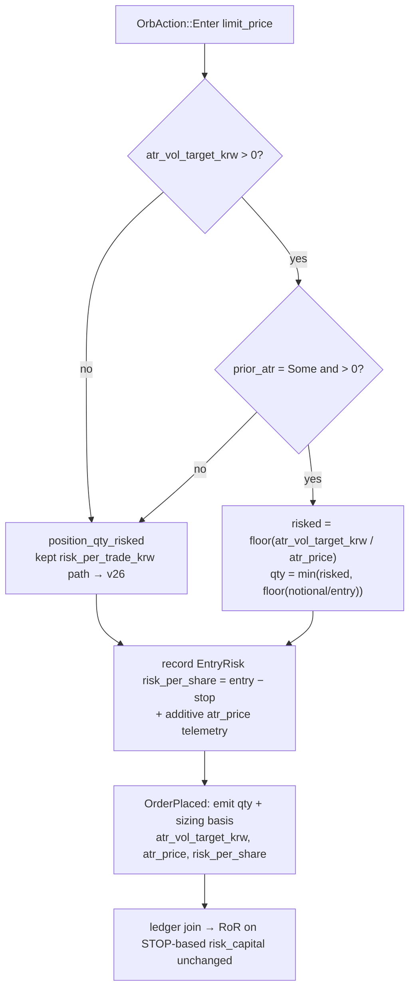
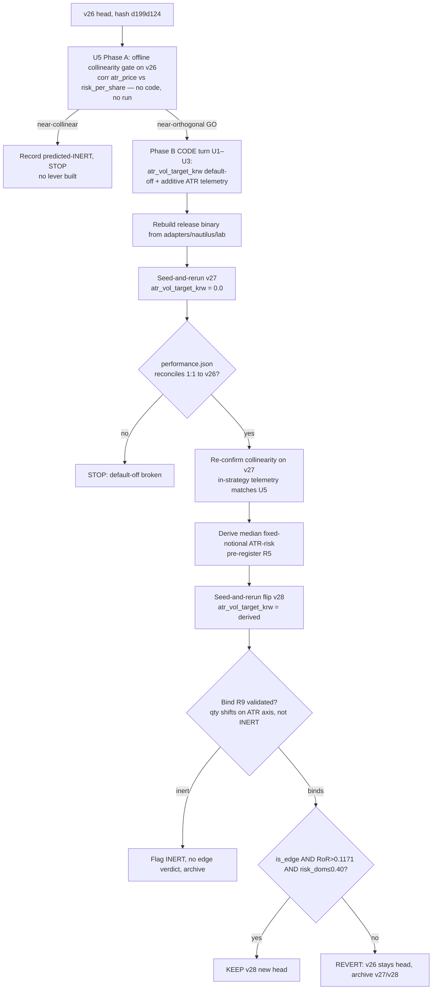

# feat: ORB CLASS B lever 2 — ATR volatility-target sizing (minimal-DOF) - Plan

**Target:** `adapters/nautilus/lab` (the offline deterministic strategy-loop lab, standalone
`adapters/nautilus/` workspace — root `cargo test` does not reach it; gate with
`cd adapters/nautilus && cargo test -p nautilus-ls-lab`). Data home REPO-ROOT
`data/turn4-fresh`, registry head **v26** (`risk_per_trade_krw = 299,340`, RoR **0.1171**,
`strategy_code_hash d199d124…`). Offline, no gateway.

**One-line:** Add the **second CLASS B (risk/position-sizing) lever** — professional
**volatility targeting**: size each trade inversely to its **prior-daily ATR** instead of
its stop distance — as one default-off code turn + one pre-registered flip, judged on the
existing size-invariant RoR crux, with the ATR estimator **frozen** so the lever adds
**zero new tunable parameters** (the anti-overfit spine).

**Product Contract preservation:** Product Contract unchanged (R1–R10 carried verbatim from
the requirements-only brainstorm). Planning added the Planning Contract, Implementation
Units, Verification Contract, and Definition of Done below.

---

## Goal Capsule

- **Objective.** Test whether normalizing per-trade risk by an **external volatility
  estimate** (prior-daily ATR) reallocates risk better than the kept lever's normalization
  by the strategy's own **stop distance** (`risk_per_share = entry − stop`, = OR-width under
  the range-low head) — i.e., does volatility targeting strictly raise RoR above v26's
  0.1171?
- **Why this lever (the R6 re-rank).** Chosen over the other deferred CLASS B candidates
  because it builds on the shipped risk-sizing foundation with **no new account seam** and a
  percentile-derived (not P&L-fit) parameter:
  - **Kelly-fraction — disqualified.** A *global* Kelly fraction is a uniform scalar on
    size → **structurally INERT** on RoR (invariant to uniform size-up — KTD-A of the CLASS
    B plan `2026-07-12-001`). A
    *conditional* Kelly needs a win-rate/payoff edge estimate, which is inherently
    **P&L-derived** → violates the "value from an untreated population, NOT a P&L fit"
    pre-registration rule.
  - **Mark-to-market / compounding equity — deferred.** Needs the account/equity seam the
    CLASS B plan deliberately deferred (KTD-C of plan `2026-07-12-001`); the strategy carries
    no account state by design. Pure compounding is near-uniform scaling → RoR barely responds.
  - **ATR / volatility-scaled sizing — selected.** The canonical institutional form
    (volatility targeting / inverse-vol), reuses the `position_qty_risked` machinery and the
    RoR metric verbatim, and reallocates on a **different axis** (external prior-daily vol)
    than the kept lever (internal OR/stop width) — so RoR can move.
- **Product authority.** The strategy-loop discipline in `adapters/nautilus/lab/TURN-LOG.md`
  + `data/turn4-fresh/PRE-REGISTER-*.md` (pre-register value + keep rule + bind signature
  before any run; deterministic strict-inequality keep rule; fan-out/archive discipline).
  This plan applies that discipline; it does not revise it.
- **Open blockers — resolved at planning.**
  1. **ATR availability at Enter time** — *resolved:* `prior_atr: Option<f64>` is already
     threaded onto `OrbState` (`orb.rs:352`, via `with_priors` at `orb.rs:906`), in **price
     (KRW) units** (it is compared against `range_r` in the OR-width gate, `orb.rs:708-710`),
     and is available **regardless of `stop_mode`**. No new plumbing to reach ATR at the qty
     decision.
  2. **Collinearity of ATR with the kept stop-distance risk** — measured by the **U5 Phase-A
     gate** on v26 *before any lever code is written*; the turn's primary INERT predictor.

---

## Product Contract

### Problem frame

The kept lever `risk_per_trade_krw = 299,340` sizes each trade to a fixed **KRW risk
budget** against `risk_per_share = entry − stop`. Its proven mechanism was a **one-sided
de-risking of the wide-`risk_per_share` cohort** (below-mean return-per-unit-risk), bounded
by the notional cap. That normalizer is the strategy's *own* intraday OR width. Professional
volatility targeting instead normalizes by an **ex-ante, external** volatility estimate
(realized vol / EWMA / ATR over a prior window), sizing inversely so each position
contributes roughly constant risk. This lever tests that substitution on **this** dataset —
a genuinely different reallocation, not a re-expression of the kept one, *provided* ATR is
not near-collinear with the OR-width stop distance (R7).

### The mechanism (Option 1, minimal degrees of freedom)

Add a second sizing lever that **replaces the risk denominator** with prior-daily ATR, in
the exact shape of the kept lever so the OFF state reconciles 1:1 to v26:

```
atr_price = prior-daily ATR in KRW price units, frozen 14-session window   # ex-ante, no lookahead, k = 1
if atr_vol_target_krw == 0.0:          # OFF sentinel → v26 exactly (kept risk_per_trade_krw path)
    qty = <kept risk_per_trade_krw sizing>
elif atr_price <= 0 or ATR unavailable (< window+1 priors):
    qty = <kept risk_per_trade_krw sizing>        # fail-safe fallback, never a novel rejection
else:
    risked        = floor(atr_vol_target_krw / atr_price)   # vol-target qty (one budget knob)
    notional_cap  = floor(notional_per_position / entry)    # existing capital ceiling
    qty           = min(risked, notional_cap)
```

When active, ATR sizing **overrides** `risk_per_trade_krw` (both params round-trip so the
flip is a clean single-param diff). This is a **CODE turn** (new sizing mode + additive ATR
telemetry), re-baselined to **v27** (lever off = v26 exactly), followed by one seed-and-rerun
flip **v28** at the pre-registered budget.

### Requirements

- **R1 — New default-off lever `atr_vol_target_krw`.** `f64`, `#[serde(default)]`, sentinel
  `0.0` = off (byte/outcome-identical to v26); legacy manifests deserialize with it off.
  Surfaced in `numeric_summary` (sweepable later). `validate()` rejects a negative value.
- **R2 — Frozen ex-ante ATR estimator (the anti-overfit line).** ATR is the existing
  prior-daily ATR at the **default 14-session window**, computed **strictly before** the
  session (causal, no lookahead), used raw (**no multiplier `k`**, k = 1) in KRW price units.
  The turn adds **exactly one** tunable knob (the budget). Sweeping `atr_window` or
  introducing a multiplier is **out of scope** — that is the curve-fitting the professional
  literature warns against, forbidden here.
- **R3 — Override precedence + fail-safe fallback.** Active ATR sizing overrides
  `risk_per_trade_krw`. When ATR is unavailable (fewer than window+1 priors) or non-positive,
  sizing **falls back to the kept `risk_per_trade_krw` path** — never a different rejection
  than baseline, so ATR-poor sessions do not silently drop trades.
- **R4 — Additive ATR-risk telemetry, 1:1 reconcile preserved.** Per-trade `atr_price` (and
  the derived `atr_risk_capital = qty · atr_price`) join into the trade ledger as additive
  `Option<f64>` fields; existing `performance.json` summary keys stay byte-unchanged. The
  **RoR crux is unchanged** — it stays `Σrealized_pnl / Σrisk_capital` on the **stop-based**
  `risk_capital` (`qty · (entry − stop)`), so v26 and the flip are compared on the *same*
  metric. `atr_risk_capital` is telemetry for the **R9 bind check only**. The R5
  pre-registration budget is derived from an **independently recomputed**
  `qty_notional · atr_price` (fixed-notional population) at analysis time — **not** from the
  recorded `atr_risk_capital` field, which in v27 carries the *risk-sized* qty (the kept
  `risk_per_trade_krw = 299,340` is active), a different quantity whose median would yield a
  different, wrong budget. Neither field is a keep metric.
- **R5 — Pre-registered budget from an untreated ATR-risk population (R8 discipline).** Set
  `atr_vol_target_krw` = a **percentile/central-tendency** (default the **median**, mirroring
  the kept lever's p50 precedent) of the **fixed-notional** ATR-risk distribution
  (`qty_notional · atr_price` over v27 closed trades) — the untreated deployed-vol-risk
  population, **never** a fit to any run's P&L. Extract from v27's ledger; pre-register in
  `data/turn4-fresh/PRE-REGISTER-vNEXT-atr-vol-target.md` **before** the flip.
- **R6 — Keep rule (unchanged crux).** KEEP the flip as the new head **iff** it `is_edge`
  (positive expectancy, **risk-capital** dominance ≤ 0.40) AND `RoR(flip) > RoR(v26) =
  0.1171` (deterministic strict inequality, not a significance test). Baseline is the **v27**
  re-baseline. KRW/trade expectancy stays diagnostic. Pessimistic bar-low fill → any positive
  RoR gain is a lower bound.
- **R7 — Collinearity diagnostic as the INERT predictor (pre-code gate, U5).** *Before any
  lever code is written*, measure `corr(atr_price_i, risk_per_share_i)` and the
  qty-reallocation overlap against the kept lever on **v26's** closed trades (ATR recomputed
  offline from the daily catalog). If ATR is near-collinear with the OR-width stop distance,
  the lever merely re-expresses v26's de-risking → **predict INERT**, record it, and stop
  (do not tune to escape it). If near-orthogonal, GO to Phase B; the reading is re-confirmed
  on v27's in-strategy telemetry (U4).
- **R8 — Code-turn re-baseline (1:1) evidence.** Seed-and-rerun **v27** (`atr_vol_target_krw
  = 0.0`, `risk_per_trade_krw = 299,340`, `strategy_version = 27`) reconciles
  `performance.json` (trades + equity_curve + legacy summary) **1:1 to v26**; the only delta
  is additive ATR telemetry. `runs compare` param mode `v26 → v27` **FAILs** on
  `strategy_code_hash differs` (the expected code-turn re-baseline signal); `v27 → v28`
  **PASSes** with diff exactly `{atr_vol_target_krw, strategy_version}`.
- **R9 — Bind signature (post-run, validate before any verdict).** The per-trade qty/risk
  distribution shifts on the **ATR axis** — high-`atr_price` trades get smaller qty,
  low-`atr_price` larger — while the notional cap still binds the tight cohort. Report whether
  the shrunk cohort overlaps the kept lever's wide-stop cohort (collinear) or is distinct
  (orthogonal). If the qty distribution is essentially unchanged vs v26, the lever is
  **INERT** → flag, record no edge verdict.
- **R10 — Archive non-kept runs.** v27 and v28 archived under
  `data/turn4-fresh/sizing-archive/` so **v26 stays registry head** unless v28 KEEPs.

### Honest hypotheses to carry (stated before the run)

- **Vol-targeting reliably stabilizes risk but does not reliably raise risk-adjusted return**
  (the literature: vol-of-vol and tail control improve consistently; Sharpe lift is not
  universal). If the flip only smooths the equity curve without a strict RoR gain, the keep
  rule correctly REVERTs/flags it — the turn is informative either way.
- **ORB is a breakout strategy; breakouts cluster on high-vol days**, which vol-targeting
  shrinks. R9 must report whether the de-weighted high-ATR cohort is the winner cohort
  (trend-following lore) or the loser cohort (the kept lever already found the wide-stop
  cohort was below-mean return-per-risk). Resolving that tension on this dataset is the
  turn's real value.

### Scope boundaries

**In scope:** a Phase-A offline collinearity gate on v26 (the INERT predictor, no code), then
— only on a GO — one default-off ATR volatility-target sizing lever (frozen 14-session
estimator, single budget knob), additive ATR-risk telemetry, one code-turn re-baseline + one
pre-registered flip, judged on the existing RoR crux.

**Deferred to Follow-Up Work:**
- A governed **sweep** of `atr_vol_target_krw` to percentile neighbours of the derived value
  (a later param turn, only if the flip binds — mirrors the `risk_per_trade_krw` sweep).
- Alternative volatility estimators (EWMA / realized-vol) or a portfolio-level vol target.
- Mark-to-market / compounding equity sizing (needs the deferred account seam) and
  Kelly-fraction sizing (INERT-global / P&L-fit-conditional) — remain deferred CLASS B items.

**Out of scope (do not touch):** the kept levers (`entry_confirm = 1.0`,
`or_width_max_atr = 0.666`, `breakeven_trigger_r = 0.41`, `risk_per_trade_krw = 299,340`) and
the exit block; the ATR estimator internals (`atr_window`, any multiplier); any gateway/live
path (offline only).

---

## Planning Contract

### Key Technical Decisions

#### KTD-1 — ATR is already threaded; reuse it, add no new plumbing
`prior_atr: Option<f64>` lives on `OrbState` (`orb.rs:352`), is threaded from the candidate
seam via `OrbState::with_priors` (`orb.rs:906`) — sourced from `backtest.rs::prior_atr`
(`backtest.rs:596`, the frozen 14-session prior-daily ATR) — and is read by the OR-width gate
independent of `stop_mode` (`orb.rs:708`). It is in **price (KRW) units**. The Enter sizing
site (`orb.rs:993-996`) already reads per-instrument state; it can read `prior_atr` from the
same `self.states.get(&id)` with no new seam. This collapses the requirements-doc blocker 1.

#### KTD-2 — New param mirrors `risk_per_trade_krw` exactly (minimal DOF)
`atr_vol_target_krw` is a `#[serde(default)]` `f64` sentinel-`0.0` field with a
`position_qty_atr_vol_target(entry, atr_price)` helper shaped like `position_qty_risked`
(`params.rs:428`): notional-capped, degenerate-ATR fallback to notional, negative rejected in
`validate()`. **No** ATR lookback or multiplier param is added — the estimator rides the
existing frozen `atr_window` default and raw ATR (k=1). Exactly one new sweepable knob.

#### KTD-3 — Override precedence at the sizing site, not two competing formulas
The two sizing levers are mutually exclusive. Precedence is resolved in the Enter handler
(`orb.rs:993-996`): when `atr_vol_target_krw > 0` **and** `prior_atr` is `Some(>0)`, size via
the ATR helper; otherwise the existing `position_qty_risked` path (which itself honours
`risk_per_trade_krw` or falls to notional). The captured `EntryRisk.risk_per_share` recorded
into the ledger stays the **stop-based** `entry − stop` regardless of which lever set qty —
so the RoR crux denominator is unchanged (KTD-4).

#### KTD-4 — RoR crux stays stop-based; ATR risk is telemetry only
`risk_capital = qty · risk_per_share` with `risk_per_share = entry − stop` (unchanged;
`performance.rs:93`). The new `atr_price` / `atr_risk_capital` are **additive** ledger fields
consumed only by the bind check (R9) and the pre-registration derivation (R5). Existing
`EdgeEvaluation` / summary keys are untouched → the v27 re-baseline reconciles 1:1 (R8),
exactly as the CLASS B additive risk fields did against v23.

#### KTD-5 — Seed-and-rerun, not a governed step off the sentinel
`0.0 → derived` is an infinite relative change; `PROPOSAL_BOUNDS_CAP = 0.5` fail-closes a
governed `LS_TURN_PARAM` step off the sentinel. So v27 = seed-and-rerun re-baseline
(`atr_vol_target_krw = 0.0`, `strategy_version = 27`), v28 = seed-and-rerun flip
(`atr_vol_target_krw = derived`, seeded from v27, sharing v27's new code hash). Follows
`docs/solutions/workflow-issues/code-turn-rebaseline-run-via-manifest-seed-and-rerun.md`.

### Patterns to follow

- `params.rs` — `risk_per_trade_krw` field + `position_qty_risked` + `risk_sizing_active` +
  the `validate()` negative-reject branch + the `numeric_summary_includes_gate_fields` /
  `risk_per_trade_krw_deserializes_from_pre_field_manifest` / `position_qty_risked_*` tests.
  The new param/helper/tests mirror these one-for-one.
- `orb.rs` — the Enter sizing block (`:993-996`), the `entry_risk.record(EntryRisk{…})`
  capture (`:1064`), and the `OrderPlaced` telemetry `values` (block ~`:1069-1078`, `:1073`).
- `performance.rs` — the additive `Option<f64>` `TradeRecord` fields (`risk_capital`,
  `realized_r`, `:62/:69`), the `EntryRisk` join struct (`:78`) + `joined_risk` (`:90`).
- `backtest.rs` — `strategy.entry_risk_ledger()` join into the ledger (`:717`).
- The CLASS B turn's execution recipe (plan `2026-07-12-001`, unit U5) for the re-baseline /
  pre-register / flip / bind / archive sequence.

---

## High-Level Technical Design

Sizing-decision flow at the Enter handler (the only behavioral change; everything downstream
is additive telemetry):



Turn execution (mirrors the CLASS B code turn):



---

## Implementation Units

**Turn structure — gated (two phases).** Because the plan predicts INERT-via-collinearity as
the *likely* outcome, the lever code is gated on a cheap pre-code diagnostic. **Phase A (U5)
always runs** and needs no strategy edit or re-baseline — it reads v26's existing ledger + the
daily catalog. **Phase B (U1–U4) runs only on a near-orthogonal GO** from U5; on a
near-collinear reading the turn records predicted-INERT and stops without building the lever.
U-IDs are stable identifiers, not execution order — U5 executes first.

### Phase A — INERT gate (always runs; no strategy code, no re-baseline)

### U5. Offline collinearity diagnostic on v26 — the GO/NO-GO gate

**Goal:** Predict whether ATR sizing can move RoR *before* any lever code is written, by
measuring how orthogonal prior-daily ATR is to the stop-based risk the kept lever already
sizes on — on v26's own trades.

**Requirements:** R7 (moved earlier — this is now the primary INERT predictor).

**Dependencies:** none (reads the v26 run ledger + the daily catalog).

**Files:**
- (analysis only — no strategy edit) a scripted/notebook step over the v26 run's
  `performance.json` closed trades and the daily catalog. For each closed trade, compute the
  symbol-session `prior_atr` by **reusing `adapters/nautilus/lab/src/runner/backtest.rs`'s
  `prior_atr(daily_sorted, session_date, atr_window)`** (`:596`, frozen 14-session window),
  and pair it with the trade's stop-based `risk_per_share` (derivable from v26's
  `risk_capital / qty`).
- `data/turn4-fresh/PRE-REGISTER-vNEXT-atr-vol-target.md` (new, Phase-A section) — record the
  measured `corr(atr_price, risk_per_share)`, the qty-reallocation overlap estimate, and the
  pre-registered decision rule **before** interpreting: near-orthogonal → GO to Phase B;
  near-collinear → predicted-INERT, stop (or proceed only on an explicit operator override,
  recorded).

**Approach:** This is the repo's diagnostic-first-probe convention applied to the redundancy
risk unique to a *second* sizing lever. It spends zero strategy code and no run: if ATR
merely re-expresses the OR-width stop distance on this dataset, the whole Phase B build is
avoided. Pre-register the orthogonality threshold and the GO/NO-GO rule before reading the
correlation (do not pick a threshold that lets the turn proceed after seeing the number).

**Execution note:** Analysis/runtime step — the "verification" is the recorded correlation +
the pre-registered GO/NO-GO decision, not a unit test. Do not soften the threshold after
seeing the value.

**Verification:** `corr` and overlap computed over all v26 closed trades; the GO/NO-GO rule
and its threshold pre-registered before interpretation; the decision (GO / predicted-INERT
stop / recorded override) written into `PRE-REGISTER-vNEXT-atr-vol-target.md`.

### Phase B — lever build + flip (only on a near-orthogonal GO from U5)

### U1. `atr_vol_target_krw` param + `position_qty_atr_vol_target` helper

**Goal:** Add the second sizing lever as a default-off `f64` gate that is byte-identical to
v26 when off, notional-capped, ATR-degenerate-safe, validated, and sweepable — with **zero**
new estimator knobs.

**Requirements:** R1, R2 (single-knob), R3 (helper-level fallback).

**Dependencies:** U5 GO (Phase B gate); otherwise none.

**Files:**
- `adapters/nautilus/lab/src/params.rs` — add `atr_vol_target_krw: f64` (`#[serde(default)]`,
  default `0.0`) to `OrbParams` + `Default`; add `atr_vol_sizing_active()` (`> 0.0`) and
  `position_qty_atr_vol_target(price, atr_price)` (returns `position_qty(price)` when inactive
  or `atr_price ≤ 0`; else `min(floor(atr_vol_target_krw / atr_price), position_qty(price))`);
  extend `validate()` to reject a negative value with an off-sentinel message. (Tests live in
  the same file's `#[cfg(test)] mod tests`.)

**Approach:** Copy the `risk_per_trade_krw` shape (`params.rs:157-169`, `:414-434`,
`:362-368`) verbatim, swapping the risk denominator argument from `risk_per_share` to
`atr_price`. Do not add a lookback or multiplier field (R2). Include the field in
`numeric_summary` automatically (it is `f64`, surfaced by the serde value-walk) — assert it.

**Patterns to follow:** `risk_per_trade_krw` field/helper/validate + the `params.rs` test
cluster (`position_qty_risked_*`, `validate_risk_per_trade_krw_*`,
`risk_per_trade_krw_deserializes_from_pre_field_manifest`, `numeric_summary_includes_gate_fields`,
`gate_params_round_trip_explicit_values`).

**Test scenarios:**
- Off (`0.0`): `position_qty_atr_vol_target(price, atr)` == `position_qty(price)` across a
  range of prices/ATRs (→ v26 byte-identical sizing).
- On: budget 300,000 / atr_price 3,000 → 100 shares; same budget / atr_price 1,500 → 200
  shares (lower vol → larger qty), capped at `floor(notional/entry)`.
- Notional cap binds: tiny `atr_price` → risk qty huge → clamped to notional qty.
- Degenerate: `atr_price ≤ 0` → falls back to notional sizing, no divide-by-zero.
- `validate()`: negative rejected; `0.0` and positive accepted; `atr_vol_sizing_active()`
  true only when `> 0`.
- Default set round-trips through JSON; a pre-field (v26-era) manifest deserializes
  `atr_vol_target_krw` to `0.0`; `numeric_summary` contains the key.
- `gate_params_round_trip_explicit_values` extended with a non-zero `atr_vol_target_krw`.

**Verification:** `cargo test -p nautilus-ls-lab params` green; off-sentinel helper equals
`position_qty` for all sampled inputs.

### U2. Additive per-trade `atr_price` telemetry in the trade ledger

**Goal:** Add the additive `atr_price` / `atr_risk_capital` `Option<f64>` fields and their
join plumbing to `TradeRecord`, without perturbing any existing `performance.json` key or the
RoR crux. (The strategy-side *capture* of `atr_price` at entry is owned by U3, at the same
`orb.rs:1064` site as the existing `risk_per_share` capture; until U3 lands, `atr_price`
threads through as `None`.)

**Requirements:** R4, and the data source for R5/R7/R9.

**Dependencies:** U5 GO (Phase B gate); independent of U1; the strategy capture that populates
the field is U3, which depends on this unit.

**Files:**
- `adapters/nautilus/lab/src/artifacts/performance.rs` — add `atr_price: Option<f64>` and
  `atr_risk_capital: Option<f64>` to `TradeRecord` (additive, `#[serde(default)]`); add
  `atr_price: Option<f64>` to the `EntryRisk` join struct (`:78`); compute `atr_risk_capital
  = qty · atr_price` when `atr_price` is `Some(>0)` and `qty > 0`, else `None`. **Pin the
  signature:** `joined_risk` (`:90`) currently returns `(Option<f64>, Option<f64>)`; either
  widen it to carry `atr_risk_capital` or compute the field in the `TradeRecord` assembly
  caller — decide at U2, do not leave it implicit. Do **not** feed either field into
  `EdgeEvaluation`, the summary, or `return_on_risk` (crux stays stop-based, KTD-4).
- `adapters/nautilus/lab/src/runner/backtest.rs` — the existing `entry_risk_ledger()` join
  (`:717`) carries the extended `EntryRisk` through unchanged.

**Approach:** Mirror the `risk_capital` additive-field discipline exactly. Keep both fields
`Option` so a run without ATR (or a legacy artifact) round-trips and the legacy P&L / RoR
paths are untouched. The RoR numerator/denominator do not read these fields.

**Execution note:** Add a characterization test first proving `assemble` output for the
existing summary keys is **byte-identical** with the new fields present-but-`None` and
present-with-values — the additive fields must not perturb `Expectancy`, `Win Rate`,
`pnl_total`, `num_trades`, `max_drawdown`, `return_on_risk`, or `max_risk_capital_share`.

**Patterns to follow:** `TradeRecord.risk_capital`/`realized_r` additive fields (`:62/:69`);
`EntryRisk` + `joined_risk` (`:78/:90`).

**Test scenarios:**
- Happy path: qty 100, atr_price 2,500 → `atr_price = 2500`, `atr_risk_capital = 250000`;
  the trade's `risk_capital` (stop-based) is unchanged from today.
- `atr_price = None` (lever off / legacy) → both new fields serde round-trip as `None`;
  `assemble` summary + `return_on_risk` byte-identical to a run without the fields.
- Additive-only: assemble a ledger with and without ATR fields set → every pre-existing
  summary key **and** `return_on_risk` identical.
- Degenerate `atr_price ≤ 0` or `qty ≤ 0` → `atr_risk_capital = None`, never NaN/Inf.
- Open leg (`ts_closed = None`) contributes no `atr_risk_capital` to any aggregate.

**Verification:** `cargo test -p nautilus-ls-lab performance` green; the byte-identical
characterization test passes; `return_on_risk` provably unaffected by the ATR fields.

### U3. Wire ATR vol-target sizing into the Enter handler (override precedence + fallback)

**Goal:** The Enter handler sizes via `atr_vol_target_krw` when active and ATR is available,
overriding `risk_per_trade_krw`; otherwise it takes the exact kept path. Captures `atr_price`
into the entry-risk ledger and emits the sizing basis in `OrderPlaced`.

**Requirements:** R3, R4 (capture), R8 (off-path 1:1).

**Dependencies:** U5 GO (Phase B gate), U1 (param + helper), U2 (ledger field).

**Files:**
- `adapters/nautilus/lab/src/strategy/orb.rs` — at the Enter sizing block (`:993-996`), read
  `prior_atr` from `self.states.get(&id)` alongside `risk_per_share`; when
  `params.atr_vol_sizing_active()` **and** `prior_atr` is `Some(>0)`, compute `qty` via
  `params.position_qty_atr_vol_target(limit_price, atr_price)`; else keep the existing
  `position_qty_risked` call. **U3 owns the strategy-side capture:** record `atr_price` into
  the `EntryRisk` at `:1064` (next to the existing `risk_per_share` capture). Add
  `atr_vol_target_krw`, `atr_price`, and the chosen `risk_per_share` to the `OrderPlaced`
  `values` (the `OrderPlaced` block ~`:1069-1078`, alongside the `:1073` qty value — note
  `:1055` is the `OrderRejectedSizing` envelope, not `OrderPlaced`) so the bind check can
  attribute qty to the ATR axis. Leave the
  `sizing_allows` concurrency count and all rejection filters (`notional_too_small`,
  `max_concurrent`, breakout-strength band) untouched.

**Approach:** `prior_atr` is on `OrbState` and set at `with_priors` before any bar is
processed (KTD-1), so it is populated at the Enter decision. The recorded `EntryRisk.risk_per_share`
stays the stop-based `entry − stop` regardless of which lever set qty (KTD-3/KTD-4). Precedence
is a single `if active && atr>0 { atr path } else { existing path }` — no change to the
degenerate/`risk_per_share ≤ 0` handling already inside `position_qty_risked`.

**Execution note:** Start with a harness/unit test asserting off-sentinel
(`atr_vol_target_krw = 0.0`) Enter sizing is **byte-identical** to the current handler for
representative bars (feeds the U4 1:1 reconcile), then add the ATR path.

**Patterns to follow:** the existing Enter sizing + `entry_risk.record` + `OrderPlaced`
telemetry block; the `position_qty_risked` fallback contract.

**Test scenarios:**
- Off: Enter places the same qty as today for representative bars; `EntryRisk.risk_per_share`
  unchanged; `atr_price` still captured as telemetry.
- On, ATR available: a low-`atr_price` (calm) entry places a larger qty than notional sizing
  (capped); a high-`atr_price` (turbulent) entry a smaller qty; `OrderPlaced` carries
  `atr_vol_target_krw` + `atr_price` + `risk_per_share`.
- On, ATR unavailable (`prior_atr = None`): sizing falls back to the `risk_per_trade_krw`
  path — same qty as v26 for that entry, **not** a rejection.
- Override: with both `risk_per_trade_krw = 299,340` and `atr_vol_target_krw > 0` set and ATR
  available, qty comes from the ATR helper (not the stop-based budget).
- `qty ≤ 0` after ATR sizing → existing `notional_too_small` rejection path fires, state →
  Done, no order.
- `max_concurrent` still binds on position count regardless of per-position size.
- Integration: a full session run with the lever off produces the identical order/exit
  sequence as v26.

**Verification:** `cargo test -p nautilus-ls-lab` green (strategy + integration); off-path
run byte-identical to v26 order/exit sequence; `OrderPlaced` telemetry carries the ATR basis
when active.

### U4. Turn execution — re-baseline v27, re-confirm collinearity, pre-register, flip v28, verdict

**Goal:** Run the Phase-B turn end-to-end: prove default-off reconciles 1:1 to v26, re-confirm
U5's collinearity reading on v27's in-strategy telemetry, pre-register the median ATR-risk
budget, run the flip, validate the bind signature, author the verdict, archive.

**Requirements:** R5, R6, R8, R9, R10 (R7 is satisfied by the U5 gate; re-confirmed here on
in-strategy telemetry).

**Dependencies:** U5 GO, U1–U3, plus a green gate (`cd adapters/nautilus && cargo test -p
nautilus-ls-lab` + the standalone workspace `cargo test --workspace`).

**Files:**
- `data/turn4-fresh/PRE-REGISTER-vNEXT-atr-vol-target.md` (new) — the R5 pre-register: derived
  `atr_vol_target_krw` value + derivation (median fixed-notional ATR-risk), the RoR keep rule
  (> 0.1171), the R9 bind signature, and the R7 collinearity prediction.
- `data/turn4-fresh/sizing-archive/` — archived v27 + v28 (and the collinearity diagnostic
  notes) so v26 stays head unless v28 KEEPs.
- `adapters/nautilus/lab/TURN-LOG.md` — the committed turn verdict (new top entry).
- (gitignored data home) v27 re-baseline run + v28 flip run.

**Approach:** Follow the CLASS B turn recipe (plan `2026-07-12-001` U5) and
`docs/solutions/workflow-issues/code-turn-rebaseline-run-via-manifest-seed-and-rerun.md`.
Rebuild the release binary from `adapters/nautilus/lab` (a stale binary silently carries the
old hash). Seed a v27 params-authority manifest from v26 (`atr_vol_target_krw: 0.0`,
`strategy_version: 27`), rerun (no `LS_TURN_PARAM`), remove the seed. Reconcile v27
`performance.json` 1:1 to v26; capture the `runs compare` param-mode `v26 → v27` FAIL on
`strategy_code_hash differs` as the re-baseline evidence.

**Collinearity re-confirm (R7, already gated in U5):** the primary INERT gate ran in U5 on
v26 before any code. Here, re-confirm it on v27's **in-strategy** `atr_price` telemetry —
`corr(atr_price_i, risk_per_share_i)` over v27 closed trades should match U5's offline v26
reading (a mismatch means the in-strategy capture disagrees with the offline `prior_atr`
computation → investigate before proceeding). Do not re-decide GO/NO-GO here or adjust the
estimator to escape a collinear reading (that would be the forbidden overfit).

**Pre-registered value (R5, median / not a P&L fit):** `atr_vol_target_krw = median over v27
closed trades of (qty_notional · atr_price)` — the fixed-notional deployed-vol-risk of the
median trade, mirroring the kept lever's p50-of-`risk_capital` derivation. `qty_notional =
floor(notional / entry)` (the untreated population). Pre-register before the flip.

**Bind signature (R9, post-run):** qty shifts on the ATR axis — high-`atr_price` trades
shrink, low-`atr_price` grow — median ATR-risk ≈ unchanged; report cohort overlap with the
kept lever's wide-stop cohort. If the qty distribution is essentially v26, flag **INERT**, no
edge verdict.

**Keep rule (R6):** KEEP iff `is_edge(v28)` AND `RoR(v28) > 0.1171` AND `risk_dominance(v28) ≤
0.40`. On KEEP, v28 is the new head; on REVERT/INERT, v26 stays head; archive v27/v28.

**Execution note:** Smoke/runtime turn — the "tests" are the harness reconcile + `runs
compare` verdicts + the bind/collinearity diagnostics, not unit tests. Do not author the
verdict word before the runs exist (R5 pre-register discipline).

**Test scenarios / verification:**
- v27 `performance.json` reconciles 1:1 to v26 on trades, equity_curve, and every legacy
  summary key + `return_on_risk` (additive ATR telemetry the only delta).
- `runs compare` param mode `v26 → v27` → FAIL `strategy_code_hash differs`, param diff
  `["strategy_version"]`.
- Collinearity diagnostic computed and its INERT/live prediction recorded **before** the
  pre-register value is derived.
- `PRE-REGISTER-vNEXT-atr-vol-target.md` written **before** the flip with the
  median-ATR-risk value, RoR keep rule, bind signature, collinearity prediction.
- `runs compare` param mode `v27 → v28` → PASS, diff exactly `{atr_vol_target_krw,
  strategy_version}`, `strategy_code_hash` equal across v27/v28.
- Bind signature (R9) validated before any verdict; INERT flagged if the qty distribution is
  unchanged.
- Verdict (KEEP / REVERT / INERT) authored against RoR + risk-capital dominance and recorded
  in `TURN-LOG.md`; v27/v28 archived; v26 stays head unless v28 KEEPs.

---

## Verification Contract

Gate (offline; run from the standalone nautilus workspace):

- `cd adapters/nautilus && cargo test -p nautilus-ls-lab` — all lab tests (existing + new
  U1/U2/U3 param, telemetry, wiring, and byte-identical characterization tests) green.
- `cd adapters/nautilus && cargo test --workspace` — the standalone adapter workspace
  (`make adapter-check`) green.
- **U1/U2/U3 (code):** unit + harness tests as enumerated; the two byte-identical proofs
  (off-sentinel sizing == v26; additive ATR fields leave summary + `return_on_risk`
  unchanged) are load-bearing.
- **U5 (Phase-A gate, always):** `corr(atr_price, risk_per_share)` + qty-overlap computed over
  v26 closed trades; the GO/NO-GO threshold pre-registered before interpretation; the decision
  (GO / predicted-INERT stop / recorded override) written. Phase B runs only on GO.
- **U4 (runtime, Phase B):** v27 reconciles 1:1 to v26; `runs compare` `v26 → v27` FAILs on
  code hash; U5's reading re-confirmed on v27 telemetry; pre-register written before the flip;
  `v27 → v28` PASSes with the single-param diff; bind signature validated; verdict recorded;
  runs archived.

## Definition of Done

- **On a GO:** U1–U3 (Phase B) landed; `cargo test -p nautilus-ls-lab` green; standalone
  workspace green. (On a predicted-INERT NO-GO, the turn stops at U5 with the reading recorded
  and no lever code — also a complete, valid outcome.)
- Off-sentinel sizing byte-identical to v26; additive ATR telemetry leaves every legacy
  `performance.json` key **and** `return_on_risk` byte-unchanged (the two characterization
  proofs pass).
- Exactly one new tunable knob added (`atr_vol_target_krw`); no ATR lookback/multiplier param
  introduced (R2 upheld).
- v27 re-baseline reconciles `performance.json` 1:1 to v26; `runs compare` `v26 → v27` FAILs
  on code hash (re-baseline evidence captured).
- **U5 Phase-A gate ran first:** `corr(atr_price, risk_per_share)` computed on v26, the
  GO/NO-GO threshold pre-registered before interpretation, and the decision recorded — Phase B
  proceeded only on a near-orthogonal GO (or an explicitly recorded operator override).
- `data/turn4-fresh/PRE-REGISTER-vNEXT-atr-vol-target.md` written before the flip with the
  median-ATR-risk-derived value, RoR keep rule, and bind signature; U5's reading re-confirmed
  on v27's in-strategy telemetry.
- v28 flip executed; `runs compare` `v27 → v28` PASSes with diff `{atr_vol_target_krw,
  strategy_version}`; bind signature validated before the verdict.
- Verdict (KEEP / REVERT / INERT) authored against **RoR + risk-capital dominance** and
  recorded in `TURN-LOG.md`; v27/v28 archived under `sizing-archive/` so v26 stays head unless
  v28 KEEPs. Offline throughout; no gateway.

---

## Risks & Dependencies

- **Likely INERT via collinearity (the headline risk).** Under the range-low head,
  `risk_per_share` = OR width, which correlates with prior-daily ATR. If they are near-collinear
  the lever re-expresses v26's de-risking and the flip is a foregone INERT. **Mitigation:** the
  **U5 Phase-A gate** predicts this on v26 *before any lever code is written* (not just before
  the flip) — a near-collinear reading records predicted-INERT and stops the turn, a valid
  recorded outcome (mirrors the breakeven-trigger CONFIRM), not a turn to tune around.
- **1:1 reconcile is the gate (R8).** If v27 does not reconcile to v26 on legacy keys, the
  additive ATR fields perturbed something — STOP and fix before the flip.
- **Stale binary trap.** Rebuild the release binary from `adapters/nautilus/lab`; a repo-root
  build fails the package spec and a stale binary silently emits the old hash.
- **ATR-unavailable sessions must not change the trade set.** The fallback (R3) sizes those
  entries exactly as v26; verify no session silently drops or adds a trade vs v26 in the
  off-path and the ATR-available bind check.
- **Adapter reach.** Any `params.rs` change touches a struct the standalone nautilus adapter
  builds on — `make adapter-check` must stay green (AGENTS.md).

---

## Sources & Research

- `docs/plans/2026-07-12-001-feat-orb-class-b-sizing-normalized-edge-plan.md` — the CLASS B
  metric + sizing machinery + deferred-lever list this re-rank draws from; its U5 is the
  execution recipe U4 mirrors.
- `adapters/nautilus/lab/TURN-LOG.md` (top two entries) — v26 re-KEEP (299,340, RoR 0.1171,
  single-peaked interior max) + the CLASS B KEEP metric redesign.
- `data/turn4-fresh/PRE-REGISTER-vNEXT-sizing.md`, `…-sizing-sweep.md` — RoR/bind vocabulary,
  percentile-not-fit derivation, fan-out/archive discipline.
- Code seams (verified this planning pass): `adapters/nautilus/lab/src/params.rs`
  (`risk_per_trade_krw` :157/:414-434, `validate` :362, `position_qty` :407);
  `adapters/nautilus/lab/src/strategy/orb.rs` (`prior_atr` on OrbState :352/:906, Enter sizing
  :993-996, `entry_risk.record` :1064, OrderPlaced block ~:1069-1078, ATR price-unit use :708);
  `adapters/nautilus/lab/src/artifacts/performance.rs` (`TradeRecord` risk fields :62/:69,
  `EntryRisk`/`joined_risk` :78/:90); `adapters/nautilus/lab/src/runner/backtest.rs`
  (`prior_atr` :596, entry-risk join :717).
- `docs/solutions/workflow-issues/code-turn-rebaseline-run-via-manifest-seed-and-rerun.md` —
  the seed-and-rerun re-baseline.
- Professional volatility-targeting practice (external, load-bearing on KTD-2 / the R2
  anti-overfit line): [QuantPedia — Intro to Volatility
  Targeting](https://quantpedia.com/an-introduction-to-volatility-targeting/); [Concretum —
  Position Sizing in Trend-Following](https://concretumgroup.com/position-sizing-in-trend-following-comparing-volatility-targeting-volatility-parity-and-pyramiding/);
  [CFA Institute — Impact of Volatility Targeting](https://rpc.cfainstitute.org/research/cfa-digest/2019/07/dig-v49-7-2);
  [ChartingPark — Position Sizing with ATR](https://chartingpark.com/articles/volatility-based-position-sizing-atr/)
  (don't curve-fit the ATR multiplier/lookback; separate sizing from signal).
</content>
