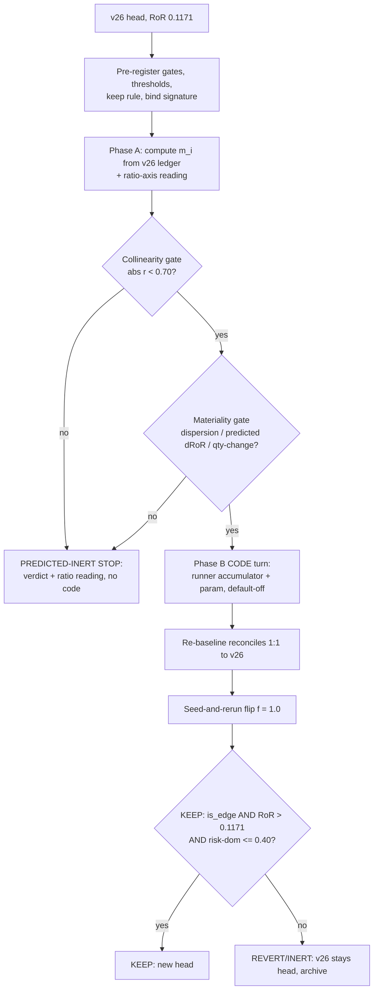
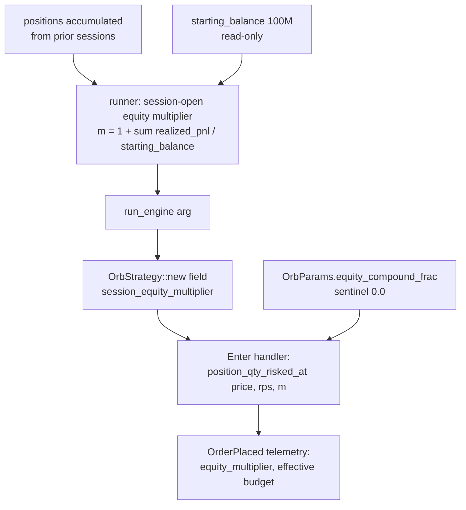

# ORB CLASS B Lever 2 — Session-Granular Realized-Equity Compounding Sizing - Plan

## Goal Capsule

- **Objective:** Execute CLASS B lever 2 — session-granular realized-equity compounding sizing (candidate (c)) — as a phased turn: a pre-registered dual Phase-A stop (collinearity + materiality) computed offline from v26's existing artifact, then the lever CODE turn only on a dual GO. Kelly-fraction sizing (candidate (b)) is retired with a recorded four-class examination.
- **Authority:** this document's Product Contract, under the standing loop governance (size-invariant RoR keep crux, pre-register-before-read, `PROPOSAL_BOUNDS_CAP = 0.5`, FAN-OUT archival rules). On conflict, the pre-register frozen in U1 governs the gate; this plan governs everything else.
- **Stop conditions:** a Phase-A STOP (either gate) ends the turn with a PREDICTED-INERT verdict — record it and build nothing (a valid deliverable, not a failure). A failed 1:1 re-baseline reconcile in U5 stops the flip until fixed.
- **Execution profile:** offline and deterministic throughout — no gateway, no open-market window. U1 and U5 are runtime/evidence units (script readings, harness reconciles); U2–U4 are test-gated code units.
- **Open blockers:** none.
- **Product Contract preservation:** unchanged except Outstanding Questions — all five deferred-to-planning items are resolved into Planning Contract KTD-1..KTD-4 and the section is removed. No R-ID changes.

---

## Product Contract

### Summary

Add a default-off equity-compounding sizing lever: the per-trade risk budget becomes `risk_per_trade_krw × max(0, 1 + f · (m − 1))`, where `m` is the session-open realized-equity multiplier against the run's `starting_balance` and `f` is a new `0.0`-sentinel param flipped to `1.0` (the fixed-fractional identity). The lever is built only if a pre-registered dual Phase-A gate — collinearity against `risk_per_share` plus a new materiality gate on the multiplier's dispersion — reads GO on v26's untreated ledger. The same Phase-A step also records the ATR/price ratio-axis collinearity reading as evidence for the next re-rank, with no ratio lever code in this turn.

### Problem Frame

The CLASS B queue after the kept sizing lever (`risk_per_trade_krw = 299,340`, v26 head, RoR 0.1171) held three deferred candidates. Candidate (a), ATR/vol-scaled notional, died at the pre-code collinearity gate: an absolute-KRW ATR is r = 0.9593 collinear with the stop-based `risk_per_share`, so the axis cannot reallocate risk and RoR cannot move (TURN-LOG, plan 2026-07-14-002). The sizing-budget axis itself is sweep-settled; finer grid points would be a fit.

That leaves a re-rank between (b) Kelly-fraction sizing and (c) mark-to-market / compounding-equity sizing. (b) fails on examination — every route to a per-setup edge estimate is either a P&L fit or provably inert (see KD1). (c) survives as the last deferred candidate, but the repo already predicts weak response: "pure compounding is near-uniform scaling → RoR barely responds" (plan 2026-07-14-002). A back-of-envelope check agrees — v26's cumulative realized P&L is roughly +5M KRW against the 100M starting balance, so the equity multiplier spans only about 1.00–1.05 across the sample. The lever therefore carries a high prior of being immaterial, and a plain collinearity gate cannot catch that failure mode: a near-constant axis passes `|r| < 0.70` trivially while still being unable to reallocate anything. The turn needs a second, dispersion-based stop.

The ATR turn also established that a gate-only turn is a legitimate outcome: a cheap pre-code diagnostic that kills an inert lever, with no code written, is a successful use of the turn.

### Key Decisions

- **KD1 — Kelly-fraction sizing (candidate (b)) is retired.** Four external-edge-source classes were examined and all fail. (1) Feature→edge priors (breakout strength, RVOL, OR width): this loop empirically falsified breakout-strength sizing (turn 10) and found RVOL's sign inverted (lever 5), so a priori signs are unknowable here without outcomes. (2) Literature constants: not a percentile or central tendency of the untreated population, so they fail the derivation rule. (3) Walk-forward / holdout estimation: still fits outcomes, only out-of-fold; the "NOT a P&L fit" rule is unconditional. (4) Any uniform Kelly fraction: a uniform scalar on size, structurally inert on RoR by the R1 invariance property. This confirms the ruling already recorded in plan 2026-07-14-002 ("INERT-global / P&L-fit-conditional") and closes candidate (b).
- **KD2 — Lever shape: session-granular realized-equity compounding, not full mark-to-market.** The equity path is `starting_balance` plus close-time-ordered realized P&L of prior sessions; the multiplier is frozen at session open. No unrealized marks, no intra-session updates. The runner recreates the strategy fresh each session, so the accumulator lives in the runner and the strategy stays account-state-free. The lever is fully deterministic and offline — what it introduces is cross-session path dependence (an early session's outcome propagates to later sessions' sizes), which the loop's chronological session processing already accommodates.
- **KD3 — Dual Phase-A gate: materiality joins collinearity.** The ATR lesson generalizes: a second sizing axis is inert when it is collinear with the existing axis **or** when it is near-constant. The collinearity gate keeps its `|r| < 0.70` GO rule. The new materiality gate stops on a near-constant multiplier: pre-registered thresholds on the multiplier's dispersion, on the first-order predicted RoR shift from reweighting v26's trades by the multiplier, and on the fraction of trades whose integer qty would change. Both gates and all thresholds are frozen in the pre-register before any reading.
- **KD4 — Flip value `f = 1.0`, the fixed-fractional identity, against the existing `starting_balance`.** `f = 1.0` makes the risked fraction of equity constant (`299,340 / 100M ≈ 0.30%` per trade) — the canonical definition of fixed-fractional sizing, a structural value rather than a fit. The equity base is the existing 100M `starting_balance`, read-only: it also seeds each session's simulated-venue margin account, and shrinking it to force a wider multiplier spread would be a fit-adjacent knob. This choice raises the odds of an honest PREDICTED-INERT stop, and that is accepted.
- **KD5 — The ATR/price ratio-axis reading is piggybacked as evidence only.** Phase A additionally computes `corr(prior_atr / price, risk_per_share)` from the same ledger and daily catalog. The reading is recorded for the next re-rank (TURN-LOG names the cross-sectionally-normalized ATR as a live direction) but cannot alter this turn's GO/STOP, and no ratio lever code is in scope.
- **KD6 — CODE turn, phased like the ATR turn.** Phase A always runs and needs no strategy edit or re-baseline. Phase B (the lever machinery: runner accumulator, per-session threading, the param) is built only on a dual GO. On STOP, the deliverable is the PREDICTED-INERT verdict plus the ratio-axis reading. The first flip off the `0.0` sentinel is a seed-and-rerun, since the bounds cap fail-closes an infinite relative change.

### Requirements

**Phase A — pre-code gates (always run)**

- R1. Phase A reads only v26's existing run artifact and the daily parquet catalog — no strategy edit, no re-baseline, no new lab code. The archived `u5_collinearity.py` gate script is the porting precedent.
- R2. The candidate axis is the per-trade session-open equity multiplier `m_i = equity_at_session_open(i) / starting_balance`, where the equity path accumulates close-time-ordered realized P&L of trades closed in prior sessions.
- R3. Collinearity gate: GO only if `|Pearson r(m_i, risk_per_share_i)| < 0.70` over v26's closed trades, with Spearman as the secondary reading. At or above 0.70, record PREDICTED-INERT and STOP.
- R4. Materiality gate: GO only if the multiplier clears pre-registered thresholds on (a) its dispersion, (b) the first-order predicted RoR shift from reweighting v26's trades by `m_i`, and (c) the fraction of trades whose integer qty changes under the flipped budget. Below any threshold, record PREDICTED-INERT and STOP.
- R5. All gate rules, thresholds, the keep rule, and the bind signature are frozen in `data/turn4-fresh/PRE-REGISTER-vNEXT-equity-compounding.md` before computing any reading. A NO-GO may be overridden only with an explicitly recorded rationale.
- R6. The same Phase-A step computes and records the ATR/price ratio-axis collinearity reading (`corr(prior_atr / price, risk_per_share)`). Its value cannot change this turn's GO/STOP.

**Lever mechanics (Phase B, only on dual GO)**

- R7. New default-off `OrbParams` field (f64, `#[serde(default)]`, sentinel `0.0` = off) so legacy manifests deserialize with the lever off; `validate()` rejects a negative value.
- R8. When on, the per-trade risk budget becomes `risk_per_trade_krw × max(0, 1 + f · (m − 1))` with `m` from R2; the budget flows through the existing `position_qty_risked` path, so the notional ceiling and every existing sizing guard and rejection path are unchanged.
- R9. The equity accumulator lives in the runner and is threaded into each session at session open. The strategy carries no account state.
- R10. `starting_balance` is read-only for this lever: it is the compounding denominator and must not be altered, because it also seeds each session's simulated-venue margin account.
- R11. Off-sentinel behavior is outcome-identical to v26: the re-baseline run reconciles `performance.json` 1:1 on every legacy key before the flip proceeds.
- R12. The flip is a seed-and-rerun off the `0.0` sentinel to the pre-registered `f = 1.0`, following the standing seed-and-rerun re-baseline recipe.

**Metric, keep rule, and bind (unchanged loop governance)**

- R13. KEEP only if `is_edge` AND `RoR(flip) > RoR(re-baseline)` (v26-equivalent, 0.1171) AND risk-capital dominance ≤ 0.40. The comparison is an exact strict inequality. Equal-weight mean-R (0.1129) rides as the size-invariant diagnostic invariant; KRW/trade expectancy stays non-decisional.
- R14. Bind signature: per-session risk budgets vary with the equity path, and the qty of risk-budget-bound trades shifts across sessions, read from the run's sizing telemetry as in the v25/v26 turns. If observed integer qtys are materially unchanged, record INERT and author no edge verdict.
- R15. Non-kept runs are archived out of `runs/` per the FAN-OUT rules; analyze/compare read `runs/` only before archiving; v26 stays registry head unless the flip KEEPs.

**Deliverable on STOP**

- R16. On a Phase-A STOP, record the PREDICTED-INERT verdict and gate readings in `TURN-LOG.md`, archive the diagnostic under `data/turn4-fresh/sizing-archive/`, and carry the R6 ratio-axis reading as the input to the next CLASS B re-rank. No lever code is written.

### Turn flow



### Acceptance Examples

- AE1. **Covers R3, R4, R16.** Given the pre-register is frozen, when Phase A reads a multiplier spread of ~1.00–1.05 and the first-order predicted RoR shift falls below the materiality threshold, then the turn records PREDICTED-INERT with both gate readings plus the ratio-axis reading, and no lever code is written.
- AE2. **Covers R3, R4.** Given both gates read GO, when Phase B proceeds, then the lever is built exactly as scoped in R7–R12 with no re-derivation of thresholds or flip value.
- AE3. **Covers R8, R11.** Given the sentinel `f = 0.0`, when the re-baseline runs, then every order, exit, and legacy `performance.json` key is identical to v26.
- AE4. **Covers R8, R9, R14.** Given `f = 1.0` and profitable early sessions, when a later session opens with realized equity above `starting_balance`, then that session's risk budgets scale up proportionally and the sizing telemetry shows risk-budget-bound qtys shifting across sessions.
- AE5. **Covers R6.** Given the ratio-axis reading comes back near-orthogonal while the materiality gate STOPs candidate (c), when the turn closes, then the STOP verdict stands and the ratio reading is recorded as re-rank evidence only.

### Scope Boundaries

- No ratio-ATR lever code — Phase A records its gate reading only; a revival is a separate future turn conditional on that reading.
- No full mark-to-market equity (unrealized marks at entry) and no trade-granular intra-session compounding — deferred; session-granular realized equity is the scoped shape.
- Kelly-fraction sizing is closed, not deferred (KD1).
- No further `risk_per_trade_krw` grid points — the budget axis is sweep-settled; a finer grid is a fit.
- The kept levers (`entry_confirm = 1.0`, `or_width_max_atr = 0.666`, `breakeven_trigger_r = 0.41`, `risk_per_trade_krw = 299,340`) and the exit block are untouched.
- Offline only — no gateway, no open-market window, no live path.
- No new lab CLI subcommand for the gate — the diagnostic is a one-off archived script, per the u5 precedent.

### Dependencies / Assumptions

- v26 (`data/turn4-fresh/runs/20260712T080054Z-backtest-orb-v26/`, hash `d199d124…`) remains registry head; its `performance.json` carries per-trade `risk_capital`, `realized_r`, `realized_pnl`, `ts_opened`/`ts_closed`, `quantity` — sufficient for every Phase-A computation with no code changes.
- `return_on_risk` is not serialized in `performance.json`; the Phase-A script recomputes it from the per-trade records, as the u5 precedent does.
- The runner already holds cross-session accumulators and builds one all-sessions `PerformanceReport`, so the equity-path computation has an existing structural home.
- The ~+5M KRW cumulative-P&L estimate behind the inert prior is an estimate; Phase A computes the true figure.

### Sources

- `adapters/nautilus/lab/TURN-LOG.md` — ATR PREDICTED-INERT entry (gate design, readings, live directions), v25/v26 sizing entries (bind telemetry, sentinel seed-and-rerun rule).
- `docs/plans/2026-07-12-001-feat-orb-class-b-sizing-normalized-edge-plan.md` — KTD-C (the deferred equity seam), the RoR invariance theorem, deferred-candidates list.
- `docs/plans/2026-07-14-002-feat-orb-class-b-atr-vol-target-sizing-plan.md` — the phased gate-first turn shape, the Kelly and compounding pre-judgments.
- `data/turn4-fresh/sizing-archive/u5-collinearity-diagnostic/u5_collinearity.py` — the portable pre-code gate script precedent (ledger + parquet catalog + hand-rolled correlations), with `u5_verify.py` as the independent-recompute twin.
- `data/turn4-fresh/PRE-REGISTER-vNEXT-atr-vol-target.md` — the freeze-before-read pre-register format and NO-GO override rule.
- `docs/solutions/workflow-issues/code-turn-rebaseline-run-via-manifest-seed-and-rerun.md` — the seed-and-rerun recipe (seed manifest, order-last, rerun, remove seed, capture the compare FAIL as evidence; rebuild the release binary from `adapters/nautilus/lab`, never repo root).
- `docs/solutions/conventions/pre-code-collinearity-gate-before-a-second-normalizer-lever.md` — the gate convention, including adversarial re-verification of a load-bearing reading.
- `adapters/nautilus/lab/src/params.rs` (`risk_per_trade_krw` sentinel + `position_qty_risked`), `adapters/nautilus/lab/src/strategy/orb.rs` (Enter handler qty call site, `OrbStrategy::new`, no account state), `adapters/nautilus/lab/src/artifacts/performance.rs` (`TradeRecord` risk fields, `equity_curve`), `adapters/nautilus/lab/src/runner/backtest.rs` (per-session fresh strategy, cross-session `positions` accumulator, `SelectedSymbol` threading seam, venue `starting_balances`), `adapters/nautilus/lab/src/runner/research.rs` (`starting_balance`, `PROPOSAL_BOUNDS_CAP`, `LS_TURN_PARAM`).

---

## Planning Contract

### Key Technical Decisions

- **KTD-1 — Thread the multiplier as a construction-time strategy input, accepting the code-hash move.** The runner computes the session-open equity multiplier from its accumulated `positions` (extended after each session, so at loop-top it holds exactly the prior sessions' positions) and passes it through `run_engine` into `OrbStrategy::new` — the same seam that already threads per-session `prior_atr`/`prior_open_vol_mean` via `SelectedSymbol`. The multiplier is session-global, so it rides as a scalar constructor argument, not a per-symbol field. Rejected alternative: mutating `OrbParams` per session keeps `orb.rs` untouched but breaks the manifest's params authority — the manifest would no longer state the effective params, corrupting reproducibility and `runs compare`. Consequence: `orb.rs` changes, `strategy_code_hash` moves, and the turn pays one re-baseline (v27) whose `runs compare` v26→v27 FAIL on `strategy_code_hash` is the re-baseline evidence, exactly per the seed-and-rerun recipe.
- **KTD-2 — Param `equity_compound_frac`, interpolated formula, fail-fast validation.** Field: `equity_compound_frac: f64`, `#[serde(default)]`, default `0.0` = off. Effective budget: `risk_per_trade_krw × max(0.0, 1.0 + equity_compound_frac × (m − 1.0))` — the `max(0.0, …)` clamp guarantees a non-negative budget on a deep-drawdown path (a zero budget flows into the existing qty-0 rejection, never a negative qty or divide artifact). `validate()` rejects: negative values ("use 0.0 to disable equity compounding"), values above `1.0` (super-proportional compounding is out of scope), and `equity_compound_frac > 0` while `risk_per_trade_krw == 0` (compounding scales the risk budget; with no budget the param would silently do nothing — fail fast instead). At `m = 1.0` or `f = 0.0` the formula is exactly the v26 budget, which is what makes the off-sentinel and the no-prior-P&L first session byte-identical.
- **KTD-3 — Materiality thresholds derived from prior-turn artifacts, frozen before reading.** The two gating thresholds anchor to evidence that exists before this lever's readings: (a) **predicted-RoR-shift floor** = 10% of the v26 sweep's observed leg-to-leg RoR spread (legs 0.1106/0.1139/0.1171/0.1168 → spread 0.0065 → floor 0.00065) — a first-order predicted shift an order of magnitude below the loop's demonstrated inter-leg resolution cannot be read as a real reallocation; (b) **qty-change floor** = 5% of closed trades change integer qty at `f = 1.0` — an order of magnitude below the kept lever's 53% budget-bound rate (98/184, v25 bind); below it the reweighting is sub-quantization noise. The multiplier's dispersion (max |m − 1|, std) is reported as a diagnostic, not a third gate — the two conditions above subsume it. The pre-register freezes the exact constants and the GO rule (both conditions must pass) before the script runs; softening after seeing a value is the forbidden overfit.
- **KTD-4 — Gate script shape and secondary statistics.** One Python script under `data/turn4-fresh/sizing-archive/equity-compounding-diagnostic/`, ported from `u5_collinearity.py`, with an independent-recompute verify twin (the `u5_verify.py` precedent — the convention requires adversarially re-verifying a load-bearing reading). Session assignment: KST date of `ts_opened`; equity path: cumulative `realized_pnl` of trades closed in strictly earlier sessions, `starting_balance` = 100M (v26's TurnConfig value). First-order predicted RoR shift: `RoR' = Σ(m_i · rc_i · r_i) / Σ(m_i · rc_i)` vs `RoR = Σ(rc_i · r_i) / Σ(rc_i)` over v26's closed trades. Qty recompute per trade: `min(floor(299,340 · m_i / rps_i), floor(10M / avg_px_open_i))` vs the same with `m_i = 1`. Secondary correlation variants: Spearman and an outlier-trimmed Pearson — **log-log is dropped as degenerate** for a near-unity axis (`log m ≈ m − 1`, so it re-reads the same correlation and adds no structural check). The piggybacked ratio-axis reading reuses the u5 `prior_atr` port over the parquet daily catalog, paired as `prior_atr / avg_px_open` vs `risk_per_share`.
- **KTD-5 — Telemetry and the bind reading.** The `OrderPlaced` decision envelope gains two values alongside the existing sizing basis: the session `equity_multiplier` and the effective risk budget. The R14 bind check then reads directly from `decisions.jsonl` exactly as the v25/v26 turns did: per-session budgets must vary with the equity path, and the risk-budget-bound qty distribution must shift by at least the pre-registered materiality. `numeric_summary` includes `equity_compound_frac` so a later governed sweep can move it.
- **KTD-6 — Turn mechanics: one re-baseline, one seed-and-rerun flip.** v27 = re-baseline (`equity_compound_frac: 0.0` seeded onto v26's manifest, rerun, seed removed): `performance.json` reconciles 1:1 to v26; `runs compare` v26→v27 FAILs on `strategy_code_hash` with param diff `["strategy_version"]` — captured as evidence. v28 = flip (`equity_compound_frac: 1.0` seeded from v27): `runs compare` v27→v28 PASSes with diff exactly `{equity_compound_frac, strategy_version}`. The flip is seed-and-rerun because `0.0 → 1.0` is an infinite relative change the 0.5 bounds cap fail-closes. Rebuild the release binary from `adapters/nautilus/lab` before every run — a stale binary silently carries the old hash.

### High-Level Technical Design

Multiplier data flow (the seam KTD-1 adds):



Sizing decision with the lever on (directional guidance, not implementation specification):

```
m       = 1 + (Σ realized_pnl of prior sessions) / starting_balance   # runner, session open
budget  = risk_per_trade_krw × max(0, 1 + f·(m − 1))                  # f = equity_compound_frac
qty     = min( floor(budget / risk_per_share), floor(notional_per_position / entry_price) )
# f == 0.0 or m == 1.0  → budget == risk_per_trade_krw  → v26-identical
# budget == 0 (deep drawdown clamp) → qty 0 → existing rejection path
```

---

## Implementation Units

### U1. Phase A — pre-register and dual-gate diagnostic

**Goal:** Freeze the pre-register, compute both gate readings plus the piggybacked ratio-axis reading from v26's artifact, and decide GO/STOP.

**Requirements:** R1–R6, R16; KD3, KD5; KTD-3, KTD-4.

**Dependencies:** none.

**Files:**
- `data/turn4-fresh/PRE-REGISTER-vNEXT-equity-compounding.md` (new) — frozen gates, thresholds, flip value, keep rule, bind signature.
- `data/turn4-fresh/sizing-archive/equity-compounding-diagnostic/` (new) — gate script, verify twin, readings output.
- `adapters/nautilus/lab/TURN-LOG.md` — on STOP, the PREDICTED-INERT verdict entry (on GO, the entry is written by U5).

**Approach:** Port `u5_collinearity.py` per KTD-4: session-open multiplier axis from v26's closed trades, Pearson (primary) + Spearman + trimmed Pearson vs `risk_per_share = risk_capital / quantity`; first-order predicted RoR shift; integer-qty-change fraction; multiplier dispersion as diagnostic; ratio-axis reading (`prior_atr / avg_px_open` vs `risk_per_share`) from the same run plus the parquet daily catalog. Decision line printed against the pre-registered rules.

**Execution note:** Author and freeze the pre-register (thresholds, GO rule, flip value 1.0, keep rule, bind signature) before running the script — freeze-before-read is the discipline the gate exists to enforce. Then adversarially re-verify the load-bearing readings with the independent verify twin before recording the verdict.

**Test scenarios:** Test expectation: none — one-off offline diagnostic, verified by the independent-recompute twin (both scripts must agree on every reading before the verdict is recorded).

**Verification:** Readings and the GO/STOP verdict recorded per the pre-registered rules; on STOP, TURN-LOG entry + archive complete the turn (U2–U5 do not run); on GO, U2 proceeds.

### U2. `equity_compound_frac` param and compounded budget helper

**Goal:** Add the default-off compounding param and the effective-budget formula, validated and sweepable, with off-sentinel byte-identity.

**Requirements:** R7, R8; KTD-2.

**Dependencies:** U1 (dual GO).

**Files:**
- `adapters/nautilus/lab/src/params.rs` — field, `equity_compounding_active()`, sizing helper taking the multiplier (e.g. extend `position_qty_risked` with a multiplier argument or add a `position_qty_risked_at`), `validate()` branches, `numeric_summary`, and the param test module.

**Approach:** Follow the exact shape of `risk_per_trade_krw` (sentinel, `#[serde(default)]`, validate message naming the off sentinel, `numeric_summary` inclusion, pre-field-manifest deserialize test). Formula and clamp per KTD-2. The existing no-multiplier call path must remain byte-identical (multiplier `1.0` ≡ today's `position_qty_risked`).

**Patterns to follow:** the `risk_per_trade_krw` field + `validate()` + `numeric_summary_includes_gate_fields` / `gate_params_deserialize_from_pre_field_manifest` tests in `params.rs`.

**Test scenarios:**
- Covers AE3 (param layer). Off (`f = 0.0`): qty identical to `position_qty_risked` across a grid of prices/stops/multipliers.
- Multiplier `1.0` with any `f`: qty identical to today (first session, no prior P&L).
- On (`f = 1.0`, `m = 1.05`): budget scales +5%; `m = 0.95` scales −5%; tighter budget → smaller qty, still capped by the notional ceiling.
- Clamp: `m` low enough that `1 + f·(m−1) ≤ 0` → budget 0 → qty 0 (never negative, no divide artifact).
- Fractional `f = 0.5`, `m = 1.04` → budget scales +2% (interpolation correct).
- `validate()`: negative rejected; `> 1.0` rejected; `f > 0` with `risk_per_trade_krw == 0` rejected; `0.0` and `1.0` with a positive budget accepted.
- `numeric_summary` includes `equity_compound_frac`; default set round-trips; pre-field manifest deserializes to `0.0`.

**Verification:** `cargo test -p nautilus-ls-lab` green (run from `adapters/nautilus/`); new tests cover every scenario above.

### U3. Runner session-open equity accumulator and threading

**Goal:** Compute the session-open equity multiplier in the runner from prior sessions' realized P&L and thread it to the strategy, leaving `starting_balance` untouched.

**Requirements:** R2 (production mirror), R9, R10; KTD-1.

**Dependencies:** U2.

**Files:**
- `adapters/nautilus/lab/src/runner/backtest.rs` — session loop (multiplier computation before `run_engine`), `run_engine` signature, accumulator helper + unit tests.

**Approach:** At loop-top for each session: when `params.equity_compounding_active()`, `m = 1.0 + (Σ realized_pnl of accumulated positions with a close timestamp) / starting_balance`; otherwise `m = 1.0`. The `positions` vector is extended only after each session's `run_engine`, so at loop-top it holds exactly the prior sessions' positions — the session-open semantics fall out of the existing structure. Sum only closed positions, mirroring `build_equity_curve`'s closed-trade semantics. `starting_balance` continues to flow to the venue account unchanged (R10).

**Patterns to follow:** the `SelectedSymbol` per-session derived-value threading seam; `build_equity_curve` in `artifacts/performance.rs` for closed-trade equity semantics.

**Test scenarios:**
- Accumulator arithmetic: synthetic positions across three sessions → per-session multipliers match hand-computed values (profit path > 1, loss path < 1).
- Lever off: multiplier is exactly `1.0` for every session regardless of P&L.
- First session: no prior positions → multiplier exactly `1.0`.
- Determinism: same inputs → identical multiplier sequence.

**Verification:** `cargo test -p nautilus-ls-lab` green; the multiplier is a pure function of prior-session positions + `starting_balance`.

### U4. Strategy wiring: constructor input, sizing call, telemetry

**Goal:** The Enter handler sizes with the compounded budget when the lever is on, emits the sizing basis, and is byte-identical to v26 when off.

**Requirements:** R8, R11 (off-identity at the handler), R14 (telemetry); KTD-1, KTD-5.

**Dependencies:** U2, U3.

**Files:**
- `adapters/nautilus/lab/src/strategy/orb.rs` — `OrbStrategy::new` gains the session multiplier input; Enter handler calls the multiplier-aware sizing helper; `OrderPlaced` values add `equity_multiplier` and the effective budget. This edit moves `strategy_code_hash` (expected; KTD-6 pays the re-baseline).
- `adapters/nautilus/lab/tests/live_wiring.rs` — the second `OrbStrategy::new` call site; update its constructor call to pass the off-identity multiplier `1.0`.

**Approach:** Keep every existing rejection/telemetry path in place (`breakout_strength_band`, `notional_too_small`, `max_concurrent`, emission guards); only the qty computation and the placed-order values change. Zero-budget clamp lands in the existing qty-≤-0 rejection path.

**Execution note:** Start with a failing harness test asserting off-sentinel sizing (and the full order sequence) is byte-identical to the current handler, then add the multiplier path.

**Test scenarios:**
- Covers AE3 (handler layer). Off: representative session run places the identical order/exit sequence as current code (feeds the U5 reconcile).
- Covers AE4 (handler layer). On, `m > 1`: a budget-bound entry places a larger qty than at `m = 1`, still capped by the notional ceiling; `m < 1` places smaller.
- `OrderPlaced` telemetry carries `equity_multiplier` and the effective budget on every placement.
- Zero-budget clamp → `notional_too_small`-path rejection, state → Done, no order.
- `max_concurrent` still binds on position count regardless of per-position size.

**Verification:** `cargo test -p nautilus-ls-lab` green; `make adapter-check` green (the standalone workspace gate).

### U5. Re-baseline v27, flip v28, verdict

**Goal:** Prove default-off reconciles 1:1, execute the pre-registered flip, validate the bind, author the verdict, archive.

**Requirements:** R11–R16; KTD-6.

**Dependencies:** U1–U4, green gate.

**Files:**
- `adapters/nautilus/lab/TURN-LOG.md` — the committed turn verdict (new top entry).
- `data/turn4-fresh/sizing-archive/` — archived v27 + v28 runs on non-KEEP.
- (gitignored data home) v27 re-baseline run + v28 flip run.

**Approach:** Follow `docs/solutions/workflow-issues/code-turn-rebaseline-run-via-manifest-seed-and-rerun.md` exactly, per KTD-6: rebuild the release binary from `adapters/nautilus/lab`; seed v27 (`equity_compound_frac: 0.0`) from v26, rerun, remove seed, reconcile 1:1, capture the v26→v27 compare FAIL; seed v28 (`equity_compound_frac: 1.0`) from v27, rerun, remove seed, capture the v27→v28 compare PASS with diff `{equity_compound_frac, strategy_version}`. Read the bind from `decisions.jsonl` (per-session `equity_multiplier` and budget-bound qty shifts) and validate it against the pre-registered materiality before authoring any verdict. Keep rule per R13 against v27's scaffold RoR.

**Execution note:** Runtime/evidence unit — the "tests" are the reconcile, the two compare verdicts, and the bind reading. Do not author the verdict word before the runs exist.

**Test scenarios:** Test expectation: none — harness-evidence unit; the verification items below are the coverage.

**Verification:**
- v27 `performance.json` reconciles 1:1 to v26 on trades, equity_curve, and every legacy summary key.
- `runs compare` v26→v27 → FAIL `strategy_code_hash differs`, param diff `["strategy_version"]` (captured).
- `runs compare` v27→v28 → PASS, diff exactly `{equity_compound_frac, strategy_version}`.
- Covers AE4. Bind validated: per-session budgets track the equity path; qty shift meets the pre-registered materiality, else INERT is recorded with no edge verdict.
- Verdict (KEEP/REVERT/INERT) authored against RoR + risk-dominance and recorded in TURN-LOG with both gate readings and the ratio-axis reading; v27/v28 archived unless KEEP.

---

## Verification Contract

| Gate | Command / evidence | Applies to |
|---|---|---|
| Lab tests | `cargo test -p nautilus-ls-lab` (from `adapters/nautilus/`) | U2, U3, U4 |
| Adapter workspace gate | `make adapter-check` (repo root; runs the standalone `adapters/nautilus` workspace) | U2–U4, before any commit |
| Gate readings | diagnostic script + independent verify twin agree on every reading; verdict matches the frozen pre-register | U1 |
| Re-baseline | v27 `performance.json` 1:1 reconcile to v26; `runs compare` v26→v27 FAIL on code hash (captured) | U5 |
| Flip attribution | `runs compare` v27→v28 PASS, diff `{equity_compound_frac, strategy_version}` | U5 |
| Bind | `decisions.jsonl` per-session budgets vary; qty-shift ≥ pre-registered materiality | U5 |

The root `cargo test` / `make docs` gates are untouched — no `ls-sdk`/`ls-core`/metadata files change in this plan. The Phase-A script needs `python3` with `pyarrow` (the u5 precedent's environment).

---

## Definition of Done

- Phase-A verdict recorded either way: GO (both gates pass, readings archived) or PREDICTED-INERT STOP (verdict + readings + ratio-axis reading in TURN-LOG, diagnostic archived, no lever code — the turn is complete at U1).
- On GO: U2–U4 landed with all listed test scenarios passing; `make adapter-check` green; no dead or experimental code left in the diff.
- Pre-register written and frozen before any reading (U1) and before the flip run (U5).
- v27 reconciles 1:1; both compare verdicts captured; bind validated before the verdict.
- Verdict recorded in TURN-LOG; v27/v28 archived under `data/turn4-fresh/sizing-archive/` unless the flip KEEPs; v26 stays head otherwise.
- Offline throughout; no gateway.
