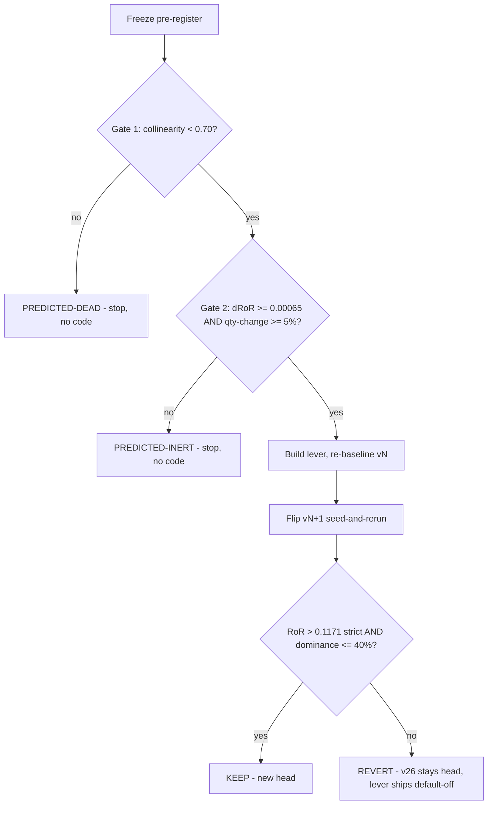

# ORB CLASS B Ratio-ATR Budget Tilt - Plan

## Goal Capsule

- **Objective:** Execute the next CLASS B (risk/position-sizing) lever — a cross-sectionally-normalized ATR (ATR/price) budget tilt — as a gate-first turn: frozen pre-registration, dual Phase-A stop, and only on DUAL GO a default-off code lever with a re-baseline + seed-and-rerun flip judged by the standing KEEP rule.
- **Product authority:** The strategy-loop conventions in `adapters/nautilus/lab/TURN-LOG.md` and `docs/solutions/conventions/pre-code-collinearity-gate-before-a-second-normalizer-lever.md`; head is v26 (hash `d199d124`, RoR 0.1171, `risk_per_trade_krw=299,340`).
- **Stop conditions:** Either Phase-A gate STOP ends the turn as PREDICTED-DEAD/INERT with no lever code (U1 only — a complete, valid outcome). A re-baseline that fails to reproduce v26 exactly halts the turn as a harness defect.
- **Execution profile:** Offline throughout — backtest lab only, no gateway, no live/runtime trading surface.
- **Open blockers:** None.
- **Product Contract preservation:** Unchanged, except the three Outstanding Questions (deferred-to-planning forks) are resolved into KTD-1, KTD-2, and KTD-3 and the section is removed.

---

## Product Contract

### Summary

Add an inverse-ratio budget tilt to ORB sizing: a dimensionless weight `w = clamp((v_ref / v)^alpha)`, where `v = prior_atr / entry_price`, multiplies the per-trade risk budget while the stop-based denominator `risk_per_share` stays untouched. The lever is default-off behind a 0.0-sentinel strength parameter and is built only if a pre-registered dual Phase-A gate (collinearity + materiality) reads DUAL GO; either gate STOP ends the turn as PREDICTED-INERT/DEAD with no code, a valid outcome.

### Problem Frame

The budget axis is sweep-SETTLED and the rest of the CLASS B sizing family is closed: absolute ATR vol-targeting died at the collinearity gate (`r(atr, risk_per_share) = 0.9593` — both absolute-KRW, price-scale-dominated), Kelly-fraction was retired as fit-or-inert, and session-granular equity compounding passed its dual gate but flipped RoR-negative (0.1171 → 0.1163) and was reverted. The one direction those post-mortems left live is the dimensionless ratio axis: `r(prior_atr / avg_px_open, risk_per_share) = 0.2949` (Spearman 0.4579, n = 103 of 167 closed trades), far more orthogonal than absolute ATR. The open danger is the collapse trap: a KRW-denominated sizing formula that multiplies the ratio back by price — `budget / (k · (ATR/price) · price)` — cancels price and reproduces the dead absolute-ATR lever. This turn exists to enter sizing through the ratio axis without collapsing, and to prove materiality before any code is written.

### Key Decisions

- **Anti-collapse rule: the ratio enters the numerator only, as a dimensionless budget multiplier.** Sizing stays `qty = floor(budget · w / risk_per_share)` with the stop-based denominator untouched; `w` is a function of the dimensionless `v = prior_atr / price` alone, so price cannot re-enter and the formula cannot reduce to absolute ATR. Any formulation that touches the denominator is rejected by construction.
- **Formulation: continuous inverse-ratio tilt (chosen over rank-map and threshold-haircut).** `w = clamp((v_ref / v)^alpha, w_lo, w_hi)`. It mirrors the proven `equity_compound_frac` seam (one dimensionless multiplier on the budget, scalar frozen constants), needs no frozen distribution table, and its anti-collapse property is auditable in one line. The rank/percentile map was rejected for shipping a frozen breakpoints table into the code path; the threshold haircut for binding on only ~26 of 167 trades, its cliff, and its entry-filter adjacency (a SPENT class). Every monotone transform of `v` shares the same Spearman bound vs `risk_per_share` (0.4579), so the formulation choice does not move the rank-correlation leg of the gate.
- **Tilt direction frozen a-priori: downweight high relative-vol.** Rationale is vol-parity/tail-risk: stop-based sizing equalizes loss-at-stop, but gap-through-stop risk beyond the stop scales with `v`. Direction is never chosen from a P&L reading; the materiality gate reads |predicted ΔRoR| magnitude only. The inverted tilt (upweight high-v) has no a-priori rationale and is out of scope.
- **Pre-registered values are derivation rules over the untreated population, never fits.** `alpha = 1.0` (the canonical vol-parity exponent), `v_ref` = median of `v` over v26's 103 ATR-available closed trades, clamps from pre-declared percentiles of the same untreated distribution — all frozen in the pre-register doc before any gate reading.
- **Two axis definitions, both frozen: offline gate vs production.** The offline Phase-A gate recomputes `v` as `prior_atr / avg_px_open` (the only entry price available in `performance.json` closed trades — the same definition behind the 0.2949 reading). Production sizing uses `prior_atr / limit_price` at the Enter handler, where no fill price exists yet. The pre-register records both and treats `avg_px_open` as the offline proxy for the entry price; the gate is judged on the exact offline axis `w(v)`.
- **This is a CODE turn.** `w` is new machinery in the sizing path, so `strategy_code_hash` moves: re-baseline vN with the sentinel off (must reproduce v26's RoR 0.1171 exactly), then flip vN+1 as a seed-and-rerun off the 0.0 sentinel (the governed-cap fail-close on infinite relative change is expected and correct for sentinel flips).

### Requirements

**Lever mechanics**

- R1. Sizing computes `qty = floor(risk_per_trade_krw · w / risk_per_share)`, capped by the existing notional ceiling, with `w = clamp((v_ref / v)^alpha, w_lo, w_hi)` and `v = prior_atr / entry_price` at the Enter handler.
- R2. The lever strength `alpha` is a default-off parameter with a 0.0 sentinel meaning `w ≡ 1` (bit-identical sizing to head), mirroring `risk_per_trade_krw` / `equity_compound_frac`; `validate()` bounds it and requires `risk_per_trade_krw > 0` when the lever is on.
- R3. `v_ref`, `w_lo`, `w_hi` are frozen pre-registered constants, not swept values; only `alpha` is the turn's flip parameter.
- R4. Trades with no available `prior_atr` size at `w = 1` (neutral, skip-not-reject) — at v26's cohort that is 64 of 167 closed trades.
- R5. With the sentinel off, the re-baseline run vN reproduces v26's results exactly (RoR 0.1171, hash-stable trades); any deviation halts the turn.

**Phase-A dual pre-gate (stop before code)**

- R6. A pre-register document freezes, before any reading: the exact offline axis definition, `alpha`, `v_ref`, clamp percentiles, tilt direction, both gate thresholds, the bind signature, and the KEEP rule.
- R7. Gate 1 (collinearity): GO iff `|Pearson r(w(v), risk_per_share)| < 0.70` on v26's ATR-available closed trades, with Spearman and trimmed-Pearson secondaries (log-log dropped as degenerate); the 0.2949 raw-ratio reading is evidence, not a substitute — the gate re-measures this lever's exact axis.
- R8. Gate 2 (materiality): GO iff both (a) first-order predicted `|ΔRoR| ≥ 0.00065` (10% of the v26 sweep leg-to-leg spread) and (b) ≥ 5% of all 167 closed trades change integer qty under the frozen flip values.
- R9. Both gate readings are adversarially re-verified by an independent-recompute twin (the `equity_compounding.py` / `equity_verify.py` precedent, ported to this axis) before the verdict is recorded.
- R10. Either gate STOP ⇒ record PREDICTED-INERT (materiality) or PREDICTED-DEAD (collinearity) in the pre-register doc and TURN-LOG and end the turn with no lever code — a failed gate does not authorize an in-turn pivot to another formulation.

**Flip, verdict, and discipline**

- R11. Bind signature (frozen in the pre-register): the flip run reallocates qty across the `v_ref` boundary — high-`v` trades downsized, low-`v` upsized — with ≥ 5% of closed trades changing integer qty; INERT signature: clamps or the integer floor absorb the tilt below that fraction.
- R11a. Qty→0 and cohort-drift treatment (frozen alongside R11): a trade whose tilted qty floors to 0 counts as a qty change; the bind check matches trades on (symbol, session), reads a disappeared trade as a downsize, and excludes newly-appearing trades from the delta count. The flip cohort may drift from 167 — a qty-0 entry is rejected done-for-day and frees a `max_concurrent` slot — and R12 is judged on the flip run's own aggregate RoR regardless.
- R12. KEEP iff flip RoR (= Σrealized_pnl / Σrisk_capital) > 0.1171 strictly and risk-cap dominance ≤ 40%; otherwise REVERT and v26 stays head. mean-R (0.1129) rides as the size-invariant diagnostic; KRW/trade expectancy is diagnostic only.
- R13. Turn governance carries forward unchanged: two-sided sweeps are FAN-OUTs with each leg archived out of `runs/` before the next; analyze/compare read `runs/` only; the lever ships default-off regardless of verdict.

### Key Flows

- F1. Turn lifecycle
  - **Trigger:** Execute turn opens with v26 as head.
  - **Steps:** Freeze the pre-register (R6) → port the diagnostic + verify twin and take both gate readings (R7-R9) → on any STOP, record the verdict and end (R10) → on DUAL GO, build the lever, re-baseline vN, verify sentinel-off equivalence (R5), flip vN+1 seed-and-rerun → judge KEEP/REVERT (R12) → log the verdict in TURN-LOG.
  - **Covers:** R5-R12.



### Acceptance Examples

- AE1. **Covers R2, R5.** Given `alpha = 0.0`, when the re-baseline vN runs, then every trade's qty equals v26's and RoR reads exactly 0.1171.
- AE2. **Covers R4.** Given a selected symbol with fewer than window+1 daily priors (no `prior_atr`), when its entry sizes, then `w = 1` and qty matches the untilted formula.
- AE3. **Covers R8, R10.** Given the frozen flip values predict `|ΔRoR| = 0.0004` (< 0.00065), when Phase A concludes, then the verdict is PREDICTED-INERT and no lever code is written, even if the collinearity leg read GO.
- AE4. **Covers R1, R11.** Given two flip trades with equal `risk_per_share` but `v` at the untreated 90th vs 10th percentile, when both size, then the high-`v` trade's qty is strictly lower than the low-`v` trade's (clamps permitting).

### Scope Boundaries

- The closed CLASS B candidates stay closed: absolute ATR vol-target (PREDICTED-INERT), Kelly-fraction (retired), equity compounding (built, reverted, default-off). No revival, no re-litigation.
- No `risk_per_trade_krw` re-sweep — the budget axis is sweep-SETTLED.
- The rank/percentile-map and threshold-haircut formulations are rejected for this turn; if this lever's gate STOPs, either would be a fresh pre-registered candidate for a later turn, not an in-turn fallback.
- No upweight-high-vol direction, no live/runtime trading changes (lab backtest only), no fitted parameter values anywhere in the pre-register.
- No fix to the pre-existing ATR-stop `Some(0.0)` gate behavior beyond the new weight path's own fail-closed filter (`docs/solutions/logic-errors/orb-atr-and-close-confirm-flip-preconditions.md`); if any of it is still unlanded, it rides this code turn only where it touches the new weight path.

### Dependencies / Assumptions

- v26 head artifacts: `data/turn4-fresh/runs/20260712T080054Z-backtest-orb-v26/performance.json` (167 closed trades) and the daily parquet catalog under `data/turn4-fresh/catalog/data/bars/` feed the offline gate.
- `prior_atr` is already computed and threaded per-symbol to the strategy (`SelectedSymbol.prior_atr` → `OrbState.prior_atr`), and `limit_price` is in scope at the sizing call — the production lever needs no new data plumbing.
- Porting precedent: `data/turn4-fresh/sizing-archive/equity-compounding-diagnostic/equity_compounding.py` and its `equity_verify.py` twin already contain the `prior_atr` port, the notional-ceiling-faithful `qty()` helper, and the ratio-axis computation; requires `pyarrow`.
- Assumption: `avg_px_open` is an acceptable offline proxy for the entry-time `limit_price` in the gate cohort; the pre-register states this explicitly (limit-vs-fill slippage is small relative to the axis spread).

### Sources

- `adapters/nautilus/lab/TURN-LOG.md` — equity-compounding REVERT entry (carries the 0.2949 ratio reading as the live direction) and the ATR PREDICTED-INERT entry; entry-format template for U4's verdict log.
- `data/turn4-fresh/PRE-REGISTER-vNEXT-equity-compounding.md` — the R6 ratio-axis reading and the frozen dual-gate format this lever inherits.
- `data/turn4-fresh/PRE-REGISTER-vNEXT-atr-vol-target.md` — the dead-at-0.9593 collinearity gate this lever must not re-create.
- `docs/solutions/conventions/pre-code-collinearity-gate-before-a-second-normalizer-lever.md` — the standing gate convention.
- `docs/solutions/workflow-issues/code-turn-rebaseline-run-via-manifest-seed-and-rerun.md` — the seed-manifest re-baseline mechanics U4 follows, including the expected `runs compare` FAIL-on-hash evidence and the stale-binary build gotcha.
- `docs/solutions/conventions/strategy-loop-param-turn-governance-and-fresh-home-seeding.md` — why the 0.5 proposal cap cannot move a 0.0 sentinel and the flip must ride the seed manifest.
- `docs/solutions/logic-errors/orb-atr-and-close-confirm-flip-preconditions.md` — the `prior_atr == Some(0.0)` flat-dailies trap the weight path must fail closed against.
- `docs/solutions/logic-errors/bound-comparison-at-full-float-precision-denies-on-bound-values.md` — clamp-boundary tests must use system-produced values, not hand literals.
- `docs/plans/2026-07-14-002-feat-orb-class-b-atr-vol-target-sizing-plan.md`, `docs/plans/2026-07-15-001-feat-orb-class-b-equity-compounding-sizing-plan.md` — the two prior CLASS B turn plans (STOP-shaped and GO-shaped structural templates).
- `adapters/nautilus/lab/src/params.rs` (`equity_compound_frac` field/validate/factor pattern at 170-185, 393-415, 482-484; `position_qty_risked_at` at 513-520; `position_qty` at 454-459; test suite at 586+), `adapters/nautilus/lab/src/strategy/orb.rs` (Enter-handler sizing at 1002-1019; `OrbState.prior_atr` at 352/386; `SelectedSymbol.prior_atr` at 866-873), `adapters/nautilus/lab/src/artifacts/manifest.rs` (`strategy_code_hash` hashes only `orb.rs`, 105-107).

---

## Planning Contract

### Key Technical Decisions

- KTD-1. **Frozen values ship as manifest params, not compiled constants.** `ratio_atr_alpha` (0.0 sentinel), `ratio_atr_ref`, `ratio_atr_w_lo`, `ratio_atr_w_hi` are all `#[serde(default)]` fields on `OrbParams`, seeded with the pre-registered values in the vN re-baseline manifest. Rationale: values stay visible in every run manifest (audit trail back to the pre-register), the gate→flip path needs no recompile, and the flip stays a one-param diff on `ratio_atr_alpha` (compare PASS diff exactly `{ratio_atr_alpha, strategy_version}`). `validate()`: `ratio_atr_alpha ≥ 0.0`; when `ratio_atr_alpha > 0.0`, require `risk_per_trade_krw > 0.0`, `ratio_atr_ref > 0.0`, and `0 < ratio_atr_w_lo ≤ 1.0 ≤ ratio_atr_w_hi` (fail fast on inert-by-misconfiguration, mirroring the `equity_compound_frac` cross-guard).
- KTD-2. **Clamp rule: untreated p10/p90 tilt values.** `w_lo = v_ref / p90(v)`, `w_hi = v_ref / p10(v)`, evaluated at the pre-registered `alpha = 1.0` over v26's 103 ATR-available trades. p10/p90 over p5/p95 because n = 103 puts ~5 observations in each 5% tail — pure noise. The rule (not the numbers) is frozen in the pre-register before any reading; the numbers are whatever the untreated distribution yields.
- KTD-3. **Ceiling-caused qty changes count toward the materiality fraction.** The Phase-A script recomputes qty with the full production formula including the notional ceiling — extending the existing `qty()` helper (`equity_compounding.py:146-147`, already a faithful `min(floor(budget/rps), floor(notional/px))` mirror) by multiplying `w` into the budget. Any integer qty change counts regardless of cause — including a recomputed qty that floors to 0 (at head, the max-`risk_per_share` trade sizes to qty 1, so any `w` below ~0.87 eliminates it; the positive Spearman means high-rps trades are exactly the ones tilted toward `w_lo`); that is the flip the backtest will actually run.
- KTD-4. **Wiring is inline at the Enter handler — no runner threading.** Unlike `session_equity_multiplier` (a strategy-global scalar threaded through the constructor and runner), `v` is per-symbol and both inputs are already in scope at the sizing call (`OrbState.prior_atr` and `limit_price`, `orb.rs:1002-1019`). The weight computes inline and enters the budget as a third multiplicand next to `equity_compound_factor(m)` inside `position_qty_risked_at` (or a thin tilted wrapper — implementer's call), leaving the `min(position_qty(price))` ceiling and the `risk_per_share` denominator untouched. One fewer unit than the equity-compounding plan.
- KTD-5. **The weight path fails closed on non-positive ATR.** `prior_atr` can be `Some(0.0)` for flat deduped dailies (the documented latent trap); the weight treats `None` and `≤ 0.0` identically as unavailable → `w = 1`, and guards `limit_price > 0` the same way. A zero ATR must never produce `v = 0` → unclamped `w = ∞`.
- KTD-6. **Re-baseline and flip ride the seed-manifest mechanism.** Copy the head manifest into a later-timestamped run dir, bump `strategy_version`, add the four new fields (alpha at 0.0), plain rerun (no `LS_TURN_PARAM`), delete the seed dir; the param-mode `runs compare` FAIL on `strategy_code_hash` is the re-baseline evidence, not a stop signal. The flip repeats with `ratio_atr_alpha` at its pre-registered value and must compare PASS with diff exactly `{ratio_atr_alpha, strategy_version}`. Build the binary via `cd adapters/nautilus && cargo build --release -p nautilus-ls-lab --bin lab-research` (repo-root or backgrounded builds silently leave a stale binary); verify freshness via `strings target/release/lab-research | grep -c ratio_atr_alpha` before any run.

### High-Level Technical Design

Directional sketch of the sizing extension (guidance, not implementation specification):

```text
weight(prior_atr, limit_price, params):
    if alpha == 0.0                 -> 1.0            # sentinel: lever off, bit-identical sizing
    if prior_atr is None or <= 0.0  -> 1.0            # fail-closed neutral (Some(0.0) trap)
    if limit_price <= 0.0           -> 1.0
    v = prior_atr / limit_price                        # dimensionless
    clamp((ratio_atr_ref / v) ^ alpha, w_lo, w_hi)

qty = min( floor( risk_per_trade_krw * equity_compound_factor(m) * weight / risk_per_share ),
           floor( notional_per_position / price ) )    # denominator and ceiling untouched
```

Phase-A data flow: `performance.json` (v26 trades: `risk_capital`, `quantity`, `realized_pnl`, `avg_px_open`, `symbol`, timestamps) + daily parquet bars → ported `prior_atr` (window 14, KST-session dedup) → per-trade `v = prior_atr / avg_px_open` → `w(v)` under the frozen values → Gate 1 correlations of `w(v)` vs `risk_per_share`, Gate 2 recomputed qty/RoR deltas → twin re-derives every gating number through independently coded paths.

---

## Implementation Units

**Turn structure — gated (two phases).** Phase A always runs and writes no strategy code. Phase B (U2-U4) executes only on a DUAL GO from U1. U-IDs are stable identifiers, not execution order.

### Phase A — dual pre-gate (always runs; no strategy code, no re-baseline)

### U1. Pre-register and dual-gate diagnostic with verify twin

- **Goal:** Freeze the pre-register, take both gate readings on the exact `w(v)` axis, adversarially re-verify, and record the GO/STOP verdict.
- **Requirements:** R6, R7, R8, R9, R10 (and the R11 bind signature is frozen here).
- **Dependencies:** None.
- **Files:** `data/turn4-fresh/PRE-REGISTER-vNEXT-ratio-atr-budget-tilt.md` (new); `data/turn4-fresh/sizing-archive/ratio-atr-tilt-diagnostic/ratio_atr_tilt.py`, `ratio_verify.py`, `output.txt`, `verify-output.txt` (new; gitignored data home).
- **Approach:** Write the pre-register first — axis definitions (offline `prior_atr/avg_px_open`, production `prior_atr/limit_price`), `alpha = 1.0`, the KTD-2 clamp rule, tilt direction, both thresholds (|r| < 0.70; |ΔRoR| ≥ 0.00065 AND qty-change ≥ 0.05 over all 167 trades), bind signature with the R11a qty→0 / cohort-drift treatment, KEEP rule — before running anything. Then port from `equity_compounding.py`: reuse its `prior_atr` port and ceiling-faithful `qty()` verbatim, derive `v_ref`/clamps from the untreated distribution, compute `w(v)` per trade, read Gate 1 (Pearson on `w(v)` vs `risk_per_share`, Spearman + trimmed secondaries) and Gate 2 (first-order ΔRoR magnitude; integer qty-change fraction per KTD-3). The twin re-derives `v_ref`, the percentiles, one hand-computed `prior_atr`, and both gate numbers through independently coded paths — no shared functions.
- **Execution note:** The verdict is written into the pre-register and TURN-LOG either way; on any STOP, U2-U4 do not execute and the turn is complete.
- **Test scenarios:** Test expectation: none — offline diagnostic; correctness is proven by twin agreement (all gating numbers within 1e-9 or explicitly reconciled). Covers AE3 (a sub-floor ΔRoR reading records PREDICTED-INERT and stops).
- **Verification:** Pre-register committed with values frozen before any reading appears in it; `output.txt` / `verify-output.txt` agree on every gating number; verdict line present in both the pre-register and TURN-LOG.

### Phase B — lever build + flip (only on DUAL GO from U1)

### U2. Params: tilt fields, validation, and weight helper

- **Goal:** Add the four `OrbParams` fields and a pure weight helper so sizing can consume the tilt, with the sentinel preserving bit-identical behavior.
- **Requirements:** R1, R2, R3, R4.
- **Dependencies:** U1 (DUAL GO).
- **Files:** `adapters/nautilus/lab/src/params.rs` (fields, `validate()`, helper, tests in the same file's `mod tests`).
- **Approach:** Mirror the `equity_compound_frac` pattern exactly: `#[serde(default)]` fields (`ratio_atr_alpha`, `ratio_atr_ref`, `ratio_atr_w_lo`, `ratio_atr_w_hi`), `Default` zeros, KTD-1 `validate()` clauses, a `ratio_atr_active()` predicate, and a weight function per the HTD sketch (KTD-5 fail-closed guards inside it). Extend `position_qty_risked_at`'s budget with the weight as a third multiplicand (KTD-4) — existing callers keep untilted behavior through the sentinel or a neutral-weight wrapper, mirroring `position_qty_risked`.
- **Patterns to follow:** `params.rs:170-185` (field + doc comment), `393-415` (validate clauses incl. cross-field guard), `482-484` (`equity_compound_factor`), `513-520` (`position_qty_risked_at`), and the lever-2 test suite names at `params.rs:1008-1168`.
- **Test scenarios:**
  - Covers AE1. `alpha = 0.0` → weight is exactly 1.0 and `position_qty_risked_at` output matches current behavior for a spread of price/rps inputs.
  - Covers AE2. `prior_atr` absent → weight 1.0, qty matches untilted formula.
  - `prior_atr = Some(0.0)` and negative → weight 1.0 (fail-closed, KTD-5); `limit_price ≤ 0` → weight 1.0.
  - `v == v_ref` → weight exactly 1.0 at any `alpha`.
  - Weight is monotone non-increasing in `v` and price-scale invariant: doubling both `prior_atr` and price leaves `w` unchanged (the anti-collapse regression test).
  - Clamps bind: `v` far below/above `v_ref` yields exactly `w_hi`/`w_lo`; boundary cases use system-produced values (loop-derived, not hand literals) per the `BOUND_EPSILON` float-dust learning.
  - Covers AE4 at helper level: equal `risk_per_share`, `v` at p90 vs p10 → strictly lower qty for high `v` (clamps permitting).
  - Upweighted trade still capped by the notional ceiling (`min(position_qty(price))` unchanged).
  - `validate()` rejects: negative `alpha`; `alpha > 0` with `risk_per_trade_krw == 0`, with `ratio_atr_ref ≤ 0`, with `w_lo ≤ 0`, with `w_lo > 1`, with `w_hi < 1`.
  - Pre-field manifest (no ratio fields) deserializes with all four at 0.0 and the lever off; `numeric_summary` includes the new fields.
- **Verification:** `cargo test -p nautilus-ls-lab` green from `adapters/nautilus/`; no behavior change reachable while `ratio_atr_alpha == 0.0`.

### U3. Strategy: inline weight at the Enter-handler sizing call

- **Goal:** Compute `v` inline at the sizing site and pass it into the tilted sizing path, with zero new plumbing.
- **Requirements:** R1, R4, R5.
- **Dependencies:** U2.
- **Files:** `adapters/nautilus/lab/src/strategy/orb.rs` (Enter handler ~1002-1019; strategy-level tests in the same module).
- **Approach:** At the `OrbAction::Enter` arm, read `self.states.get(&id)`'s `prior_atr` (same-module access, same idiom as the existing `risk_per_share()` read) and the in-scope `limit_price`; hand both to the U2 sizing path (KTD-4). No constructor, runner, or `SelectedSymbol` changes. This edit moves `strategy_code_hash` — expected; U4 owns the re-baseline.
- **Execution note:** Keep the diff confined to the Enter-handler sizing call; any temptation to touch the ATR-stop gate or other `prior_atr` consumers is out of scope (Scope Boundaries).
- **Test scenarios:**
  - Covers AE1. Full-strategy decision-stream test: with `alpha = 0.0` a canned multi-entry session produces byte-identical qty decisions to the pre-change code.
  - Covers AE2. Entry on a symbol whose `prior_atr` is `None` sizes untilted with the lever on.
  - Entry with `prior_atr = Some(0.0)` sizes untilted (fail-closed at the strategy level, not just the helper).
  - Covers AE4 / F1. Two entries with equal stop distance, high-`v` vs low-`v` symbols → high-`v` qty strictly lower with the lever on.
  - Tilted entry that would exceed the notional ceiling is capped exactly as before.
- **Verification:** `cargo test -p nautilus-ls-lab` green; `make adapter-check` green from repo root.

### U4. Re-baseline vN, flip vN+1, verdict

- **Goal:** Re-baseline the code change at the sentinel, flip `ratio_atr_alpha` to its pre-registered value, judge KEEP/REVERT, and record the verdict.
- **Requirements:** R5, R11, R11a, R12, R13.
- **Dependencies:** U1, U2, U3; green gate.
- **Files:** `adapters/nautilus/lab/TURN-LOG.md` (verdict entry, existing heading format); run artifacts under `data/turn4-fresh/runs/` (gitignored).
- **Approach:** KTD-6 mechanics, one re-baseline + one flip: seed manifest off v26 with the four fields (alpha 0.0) and a bumped `strategy_version`, plain rerun → vN; verify AE1 equivalence (RoR exactly 0.1171, trades reconcile 1:1) and capture the expected compare FAIL-on-hash as evidence. Then seed vN+1 with `ratio_atr_alpha` at the pre-registered value, rerun, capture compare PASS with diff exactly `{ratio_atr_alpha, strategy_version}`. Judge R12 (strict RoR > 0.1171 AND dominance ≤ 40%; mean-R diagnostic) and validate the R11 bind signature from the flip's trade-level qty deltas. REVERT keeps v26 head with the lever default-off; either verdict is logged in TURN-LOG and non-KEEP runs are archived out of `runs/`.
- **Execution note:** Build the release binary per KTD-6 and verify it is not stale (`strings … | grep -c ratio_atr_alpha`) before every run; a stale binary silently reproduces the old hash.
- **Test scenarios:** Test expectation: none — run orchestration; the proof obligations are the evidence artifacts in Verification.
- **Verification:** vN reconciles 1:1 with v26 (AE1); compare FAIL(vN-1→vN, hash) and PASS(vN→vN+1, one-param diff) both captured; bind signature checked against R11; TURN-LOG entry written; `runs/` left containing only the head lineage.

---

## Verification Contract

| Gate | Command / evidence | Applies to |
|---|---|---|
| Lab unit + strategy tests | `cargo test -p nautilus-ls-lab` (from `adapters/nautilus/`) | U2, U3 |
| Standalone adapter workspace | `make adapter-check` (repo root) | U2, U3 |
| Gate-reading integrity | `output.txt` vs `verify-output.txt` agreement on every gating number; pre-register frozen before readings | U1 |
| Sentinel equivalence | vN reproduces v26 exactly: RoR 0.1171, 167 trades reconcile 1:1 | U4 (AE1) |
| Re-baseline evidence | param-mode `runs compare` FAIL on `strategy_code_hash` (vN-1→vN); PASS with diff `{ratio_atr_alpha, strategy_version}` (vN→vN+1) | U4 |
| Binary freshness | `strings adapters/nautilus/target/release/lab-research \| grep -c ratio_atr_alpha` ≥ 1 before each run | U4 |
| Bind telemetry | flip trade-level qty deltas match the R11 signature (or INERT recorded) | U4 |

Root `cargo test` is not required unless a touched file reaches the root workspace (this plan's files do not).

---

## Definition of Done

- Phase-A verdict recorded either way: DUAL GO with both readings and twin agreement, or PREDICTED-DEAD/INERT STOP with no lever code written — logged in the pre-register and TURN-LOG.
- Pre-register frozen (values, rules, thresholds, bind signature, KEEP rule) demonstrably before any gate reading and before the flip run.
- On GO: U2-U4 landed; `cargo test -p nautilus-ls-lab` and `make adapter-check` green; no dead code — the lever is wired, default-off, and exercised by tests.
- vN reconciles 1:1 with v26; both compare verdicts captured; bind signature validated against R11.
- KEEP/REVERT judged on the R12 crux exactly; verdict in TURN-LOG; non-KEEP runs archived out of `runs/`.
- Offline throughout — no gateway traffic, no live-surface changes.
- No abandoned-attempt or experimental code left in the diff.
