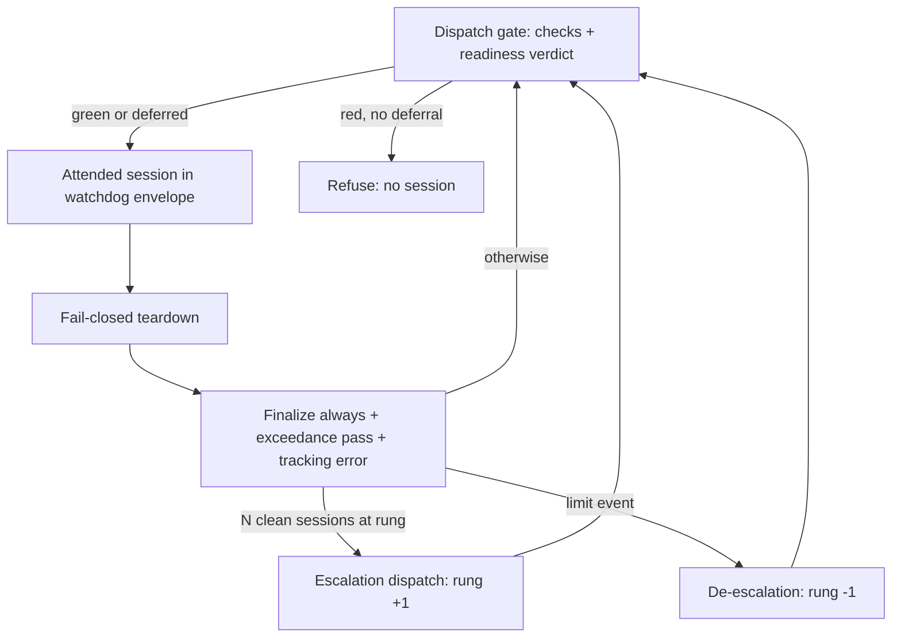
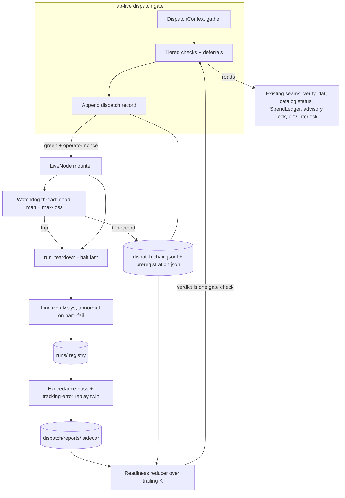
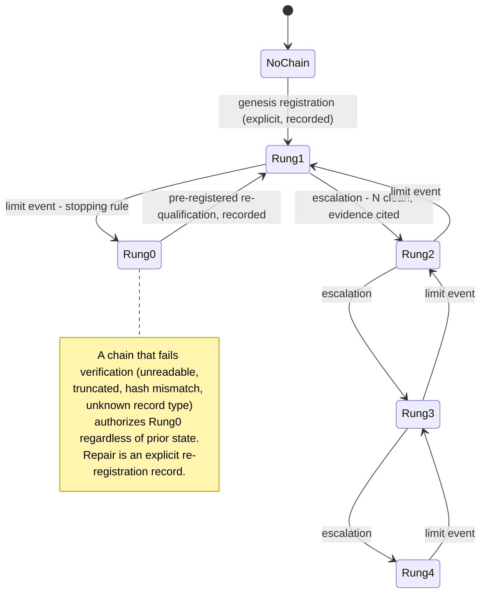

# Production Ladder - Plan

## Goal Capsule

- **Objective:** Take the ORB strategy from certified paper trading to full-size live trading through machine-governed steps: an executable dispatch gate, a wired live session inside a watchdog envelope, and a dose-escalation capital ladder whose rung state lives in the hash-chained dispatch chain.
- **Product authority:** This document. Rung values, escalation counts, and tracking-error bands are NOT set here — they freeze in a separate pre-registration document (mirrored by a machine-readable values file, KTD9) before rung 1 (see KD3).
- **Execution home:** Nearly all work lands in the lab crate of the standalone `adapters/nautilus/` workspace, reusing certified seams (teardown, flat-start check, registry walkers, spend ledger). Everything the plan proves is provable offline; live behavior stays operator-run and never enters the commit gate.
- **Stop conditions:** Surface instead of guessing when a change would alter order-dispatch runtime semantics beyond the seams named in the units (kill-switch ordering, dedup, reconciliation), or when a unit's verification would require a live call.
- **Open blockers:** The KRX holiday calendar fix lives in a separate plan; until it lands, the gate's session-window check inherits today's weekday-only logic (see Dependencies). SC-primary fill-lane certification and the stranded-position clear are rung prerequisites, not blockers to building the gate.

---

## Product Contract

### Summary

A phased program that makes "production ready" a queryable rung number. Phase 1 ships `lab-live --dispatch`, a pre-flight that machine-checks every session precondition and refuses to proceed on red — useful immediately, even against today's manual recipe. Later phases wire the LiveNode session inside a watchdog envelope, add per-session tracking-error and exceedance reporting, and govern capital escalation through a pre-registered rung ladder recorded in the dispatch chain itself.

### Problem Frame

The strategy's machinery is paper-certified and its safety primitives (kill switch, dedup, fail-closed teardown, dual-source fill ledger) are built and unit-tested, but `lab-live` is still an interlock stub that exits with a pointer to a manual operator recipe (`adapters/nautilus/lab/src/runner/live.rs:131-148`). A recurring class of documented operational misses — the stranded 3-share paper position that blocked order probes, the weekend false NO-GO, the macOS env-var trap — were session-precondition failures a machine check would have caught before the session, not during it. (Not every miss is precondition-shaped: IGW00201 budget trips fire mid-run, and the t0424 same-day false-not-flat was a defect inside a precondition check — the gate reduces, not eliminates, the operational risk surface.)

Separately, the run registry is append-only but write-only across runs: no reducer reads trailing sessions to answer "is this system behaving well enough to size up?", and the decision of how much real money touches v30 has no governance at all — the one decision the repo's pre-register-before-read muscle has never covered.

### Key Decisions

- **KD1 — The LiveNode mounter is inside this plan.** The dispatch gate is built as the frame the mounter wires into, so the ladder ships as one coherent program rather than assuming a mountable session as an external dependency.
- **KD2 — Rung state lives in the dispatch chain.** The current rung is what the last valid dispatch record says; an escalation is a dispatch that cites rung-completion evidence. No separate ladder ledger, no derived-only state: one artifact family carries pre-flight, authorization, and ladder state, each rung change leaving a hash-chained, evidence-citing record. Chain failure is fail-closed: an unreadable, truncated, or tamper-check-failing chain authorizes rung 0 — no live session — until repaired by an explicit, recorded re-registration dispatch. Chain genesis is an explicit rung-1 registration record, never an implicit default. (A corruption floor of rung 1 would let a deleted chain file escape the rung-0 suspended state; the floor is therefore rung 0.)
- **KD3 — Structure now, values later.** This plan commits the rung structure: four live rungs plus a rung-0 suspended state, the gate types that govern movement (hard limit events, the tracking-error band, the economic expectation band, the readiness verdict), and the escalation and de-escalation rules. The numbers — rung fractions, N clean sessions per rung, band definitions — freeze in a pre-registration document before rung 1's first session, amendable only by explicit re-registration. Bands are scheduled per rung: each rung's band freezes from the preceding rung's data before the first session at the new rung (rung-2 band from rung-1 data, rung-3 from rung-2, and so on), stated in size-normalized units so size-driven divergence is expected rather than read as a limit event.
- **KD4 — Attended with watchdog from day 1.** Every rung runs with an operator present AND a software envelope: a dead-man timer that invokes the existing tested teardown on heartbeat miss, and a session max-loss breaker that flattens first and engages the kill switch after the close (per the documented kill-switch ordering rule). Unattended operation is out of scope.
- **KD5 — All safety-mechanism firings are limit events.** Conservative v1: a dead-man trip from a benign cause (network blip, operator stepped away) still counts and de-escalates. Carve-outs, if any, come by re-registration once real firing data exists.
- **KD6 — Rung 1 runs without a tracking-error band.** Rung 1 (minimum size) is gated by the hard limit events only; its sessions exist to calibrate the band that freezes before rung 2. Tracking error is computed and reported from session 1, but it is not load-bearing until rung 2.

### Actors

- A1. **Operator** — the single human who runs sessions, authorizes dispatches, and owns deferrals. All order-capable actions stay behind the existing nonce/TTY gating conventions.
- A2. **Dispatch gate** — the `lab-live --dispatch` pre-flight: checks preconditions, appends the dispatch record, enforces rung state.
- A3. **Watchdog envelope** — in-process supervisor around the live session: a heartbeat dead-man timer on an independent thread (covering runtime/task stalls and operator absence — not whole-process death, see R6) and a max-loss breaker, both routing into the existing teardown sequence.
- A4. **Run registry** — the existing append-only artifact store (manifest, performance, decisions.jsonl, data_quality) that supplies all readiness and exceedance evidence.

### Requirements

**Phase 1 — Dispatch gate (standalone value)**

- R1. `lab-live --dispatch` machine-checks every session precondition and refuses to proceed on red unless the check is deferrable and an explicit operator deferral is recorded. V1 checks: advisory lock free, lane env file present, trading-env interlock, session window open, catalog watermark fresh, account flat-start, kill-switch state, no stranded resting orders, gateway budget headroom. Check implementations must incorporate their domains' documented false-reading modes (the t0424 same-day-round-trip flat-start trap; warm IGW00201 budget semantics) so the gate does not inherit known failure modes.
- R2. Each dispatch attempt appends a dispatch record to the dispatch chain — an append-only store beside the run registry within the same data home (a refused dispatch produces no run directory, so records cannot live inside per-run artifacts). The record captures: per-check outcomes, any deferrals with operator attribution, the rung being authorized, and the evidence cited for that rung. The chain is tamper-evident and append-only.
- R3. Checks split into two tiers. Non-deferrable — the trading-env interlock, kill-switch state, account flat-start, and rung authorization (R15): red aborts the session, no override. Deferrable — the rest: red can be overridden only by an explicit, named, per-item deferral recorded in the dispatch record, never silently. Deferrals are per-session, not sticky, and per-check deferral counts are exceedance-catalog entries (R10) so habitual deferral trends toward a red readiness verdict.
- R4. The gate is runnable standalone before the mounter exists, as a pre-check ahead of the manual operator recipe.

**Phase 2 — LiveNode mounter + watchdog envelope**

- R5. `lab-live` wires the full session end-to-end behind a green dispatch: lock acquisition, LiveNode mount, run, fail-closed teardown, artifact finalize — replacing the manual recipe with one operator-confirmed command. Finalize persists the teardown retry count and the dedup-hit count into the run artifacts (prerequisite for R10 and R14(d)), and finalize runs even when teardown hard-fails, marking the run abnormal — a session that carries limit events must still leave scannable artifacts. Until phase 4 lands, the gate authorizes only rung-1 minimum size — the R15 enforcement ships as a phase-2 stub with rung 1 hardcoded, so no interim session runs ungoverned at full budget.
- R6. A dead-man heartbeat supervises the session; a missed heartbeat invokes the existing teardown sequence (stop emission, cancel, flatness check, kill switch after cancels). The dead-man covers runtime/task stalls and operator absence; whole-process death (crash, hard hang) is covered by the attended operator (KD4) plus the next dispatch's stranded-order and flat-start checks, with the `.tmp-` run directory marking the aborted session — which is itself a limit event (R14(f)).
- R7. A session max-loss breaker halts trading when the pre-registered loss threshold is hit: flatten and cancel first, engage the kill switch after the close attempts.
- R8. Session launch remains operator-attended and gated by the repo's existing order-capable conventions (paper interlock semantics replaced by lane-appropriate live interlocks; nonce/TTY gating preserved).

**Phase 3 — Tracking error + exceedance mining**

- R9. Every live session produces a tracking-error report comparing live fills against a paper twin of the same session (fill price deltas, slippage, approximated-fill fraction). Reported from rung 1; load-bearing from rung 2 (KD6).
- R10. An exceedance pass runs over the registry after each session and trends a pre-registered exceedance catalog across trailing sessions. V1 catalog: reconcile-advised conditions, coverage gaps, aborted `.tmp-` runs (also a limit event, R14(f)), and approximated-fill counts (fields the artifacts already emit), plus teardown retry count and dedup-hit count (new fields R5's finalize persists — without them R14(d) can never fire via F3's artifact scan), plus per-check deferral counts (R3).
- R11. A readiness reducer computes a green/red verdict over the trailing K live-lane sessions (teardown outcomes, exceedance trends, data-quality conditions); a run qualifies for the window only by carrying the live dispatch/lane provenance fields (KTD3) — backtest and research runs are excluded, not tolerated as absent. The dispatch gate consumes this verdict as one of its checks; K and thresholds are pre-registered values. A red verdict does not deadlock the ladder: it forces the session to minimum size (rung-1 probation) rather than refusing dispatch — probation sessions still run attended and feed the trailing window; outright refusal stays reserved for the non-deferrable R1 checks. A probation dispatch record carries both the chain-authorized rung and the effective rung (1), so capital history stays reconstructable from the chain alone; probation sessions count toward neither the chain rung's N nor rung-1 escalation evidence.

**Phase 4 — Capital ladder**

- R12. Four live rungs scale the strategy's risk budget from minimum size to the full pre-registered budget, with a rung-0 suspended state (paper-only, no live sessions) below rung 1. The rung fraction scales the session risk budget (see KTD6 for where it applies); rung values freeze via pre-registration before rung 1 (KD3).
- R13. Escalation to the next rung requires N clean sessions at the current rung (N pre-registered) and is executed as a dispatch record citing the qualifying sessions as evidence (KD2). A session is *clean* iff its run finalized, it carries zero R14 limit events, its required reports are present (the tracking-error report, at rung 2+), and it was not a probation session; deferrals do not disqualify — they act through the readiness verdict. Qualifying sessions must share the strategy code hash and governed-params hash with the dispatch that cites them, and must be live-lane sessions; ladder behavior on a head change is pre-registered — a params-only change re-runs the current rung's N, a strategy-code-hash change returns the ladder to rung 1.
- R14. A limit event at any rung auto-de-escalates one rung, recorded in the next dispatch. A limit event at rung 1 de-escalates to rung 0: live trading suspends and re-qualification requirements for re-entering rung 1 are pre-registered alongside the other rung values — this is the program's stopping rule. V1 limit events: (a) non-flat or unproven close, (b) any reconcile-Unknown order outcome, (c) tracking-error band breach (rung 2+), (d) any safety-mechanism firing — kill-switch engagement, dedup hit on a real emission, teardown needing more than one retry, watchdog firing (KD5), (e) cumulative P&L at the current rung falling outside its pre-registered expectation band derived from the backtest distribution — operational cleanliness alone never authorizes escalation against a bleeding edge, (f) a live session that never finalizes — a crash or abort leaving `.tmp-` staging residue and no finalized run. Multiple limit events in one session de-escalate one rung total, with every event listed in the record.
- R15. A session may run only at the rung the dispatch chain currently authorizes. The gate enforces this defensively: if any input specifies a rung above what the chain supports, dispatch is refused — rung selection is a guard rail, not an operator-facing feature.

### Key Flows

- F1. **Gated session (steady state)**
  - **Trigger:** Operator starts `lab-live --dispatch` before a session.
  - **Steps:** Gate runs all checks including the readiness verdict → all green (or red items explicitly deferred) → dispatch record appended naming the authorized rung → operator confirms launch → mounter runs the session inside the watchdog → teardown → artifacts finalize → post-session catalog ingest covering the session's KST trading date (the Live lock is released first; the Ingest lock is then acquirable) → exceedance pass and tracking-error report land in the report sidecar.
  - **Outcome:** One more clean (or limit-marked) session at the current rung, fully recorded.
  - **Covers:** R1, R2, R5, R6, R9, R10, R15.
- F2. **Escalation**
  - **Trigger:** N clean sessions accumulated at the current rung.
  - **Steps:** Operator requests escalation → gate verifies the N qualifying sessions against the registry and the pre-registered thresholds → new dispatch record cites them and authorizes the next rung.
  - **Outcome:** Rung advances with a hash-chained, evidence-citing record.
  - **Covers:** R12, R13.
- F3. **Limit event and de-escalation**
  - **Trigger:** Any R14 limit event during or at the close of a session.
  - **Steps:** Event lands in the session's artifacts, in a durable safety-trip record written at trip time, or as `.tmp-` residue → next `--dispatch` scans all three sources → authorized rung drops one level in the new dispatch record, which marks the events consumed → sessions continue at the lower rung until re-qualification.
  - **Outcome:** Automatic, recorded step down; no operator judgment required to trigger it; no event double-fires.
  - **Covers:** R14, R15.



### Acceptance Examples

- AE1. **Covers R1, R3.** Given a stranded resting order on the paper account, when the operator runs `lab-live --dispatch`, then the gate reports the stranded-order check red and exits without a session; the session can proceed only after the operator records an explicit deferral for that item or clears the position.
- AE2. **Covers R6.** Given a live session whose strategy or runtime stalls, or whose operator stops feeding the heartbeat, when the dead-man interval elapses, then the watchdog invokes the teardown sequence and the session ends flat or hard-fails loudly — it never continues unsupervised. Given whole-process death instead, the attended operator intervenes, and the next dispatch's stranded-order and flat-start checks catch any residue; the `.tmp-` run directory marks the aborted session as a limit event (R14(f)).
- AE3. **Covers R14, KD5.** Given a watchdog firing caused by a network blip with no market loss, when the next dispatch runs, then the authorized rung is one lower than before — benign-cause firings still count in v1.
- AE4. **Covers KD6, R9.** Given rung-1 sessions with tracking error computed, when tracking error exceeds any provisional figure, then no de-escalation fires from that signal at rung 1; the band becomes load-bearing only after it freezes for rung 2.
- AE5. **Covers R13, R15.** Given N-1 clean sessions at rung 2, when the operator requests escalation to rung 3, then the gate refuses and names the missing qualifying evidence.

### Success Criteria

- Every live session in the registry is preceded by a green (or explicitly deferred) dispatch record — zero ungated sessions from phase 2 onward.
- The full-budget rung is reachable purely by accumulating recorded evidence; no step of the capital decision rests on undocumented operator judgment.
- A reviewer can reconstruct the entire capital history — every escalation and de-escalation with its evidence, including probation sessions' effective size — from the dispatch chain alone.

### Scope Boundaries

- **Deferred for later:** Unattended operation (scheduling, remote alerting, auto-restart, remote kill); a metrics/dashboard stack beyond the readiness reducer and exceedance reports; multi-strategy ladder support; carve-outs to KD5's all-firings rule; key-based signing of dispatch records (the hash chain meets the single-operator threat model — revisit only if a second operator or remote writer ever exists).
- **Handled by other plans:** the KRX holiday/session-truth calendar; SC-primary fill-lane certification (a rung prerequisite tracked in its own right); durable order idempotency (recommended before rung 2, see Dependencies).

### Dependencies / Assumptions

- **KRX calendar:** the gate's session-window check inherits today's weekday-only logic until the separate session-truth plan lands; a KRX holiday can pass the window check until then. The check's contract accepts a calendar upgrade without redesign (a trait-shaped "is this a trading session" seam).
- **Trading-date convention:** a KRX session (09:00–15:30 KST) spans UTC midnight, and run ids are UTC-stamped. All ladder semantics — N-counting, dispatch freshness and expiry, band attribution — key on the KST trading date, recorded once per chain record.
- **SC-primary certification:** rung prerequisites will name it before universe or size scaling makes the 2s-per-symbol t0425 poll compete with session order flow for the shared IGW00201 budget.
- **Order idempotency:** the in-memory-only order dedup (`crates/ls-core/src/order_dedup.rs`) loses its window on crash-restart; the watchdog design makes restart a normal path, so durable reservations are assumed to land before rung 2 (separate work).
- **Paper-twin data:** the twin replays against catalog bars, which only ingest writes — a post-session catalog ingest of the session's KST trading date is a prerequisite of the tracking pass, and a rung-2+ session's clean status is computable only after that ingest completes. The tracking pass is idempotent and re-runnable per run id, so the twin can be produced later when same-day bars are not yet servable at the close.
- **Pre-registration doc:** rung fractions, N values, per-rung band definitions, per-rung economic expectation bands, exceedance thresholds, K, the watchdog heartbeat interval and session max-loss threshold, rung-0 re-qualification requirements, and the head-change rules (R13) freeze in a pre-registration document before rung 1 — same convention as the strategy loop's PRE-REGISTER docs — mirrored in the machine-readable values file the gate loads (KTD9).
- **Live credentials/lane:** phases 2+ require a live-capable lane and KRX windows; the dispatch gate itself (phase 1) is buildable and testable offline. Today `RunSource::Live` means paper-live and the runtime is paper-anchored (`LS_TRADING_ENV=paper` interlock, paper-scoped scrubbing) — the live-lane flip is confined to interlock and lane resolution, with manifest lane/env fields (KTD3) keeping evidence provenance unambiguous either way.

### Outstanding Questions

All questions the requirements stage deferred to planning are resolved in the Planning Contract: dispatch record format and tamper evidence (KTD1), paper twin production (KTD7), where the rung fraction applies (KTD6), heartbeat transport (KTD10), and how the readiness reducer walks the registry (KTD8). Remaining items are deferred to implementation and non-blocking:

- **Deferred to implementation:** whether the dedup-hit count accumulates adapter-side or needs a minimal ls-core surface (U5 decides at the seam); the exact marking price for open positions with approximated fills in the max-loss basis (conservative direction fixed, source picked in U7); per-check refusal message wording.

### Sources / Research

Code anchors (repo-relative; line numbers as of this writing):

- `adapters/nautilus/lab/src/runner/live.rs` — `LiveSession` trait (41-54), `run_teardown` (60-96: stop → cancel retried → quantity-keyed flat check → halt always → hard-fail), `live_guard` advisory lock (101-106), interlock stub `main_cli` (136-148).
- `adapters/nautilus/lab/src/artifacts/mod.rs` — `RunWriter` `.tmp-` staging + refusal of reuse (90-116), atomic-rename `finalize` (162-169), `aborted_runs()` (192-206), `list_runs` (210-227); artifact consts (56-62).
- `adapters/nautilus/lab/src/artifacts/manifest.rs` — `Manifest` fields (25-71), `strategy_code_hash` = SHA-256 of embedded orb.rs only (105-107), content hashing helpers (136-158), `#[serde(default, skip_serializing_if)]` back-compat precedent (67-68).
- `adapters/nautilus/lab/src/runner/research.rs` — `run_order_key`/`ordered_runs`/`latest_finalized_run` (85-107), argv dispatch + `LS_*` env config convention (1228-1396), `ok_fail` ExitCode mapping (1208-1214), scrub discipline (1216-1226), `PROPOSAL_BOUNDS_CAP` (line 54), `catalog_status` (780-863, weekend-safe watermark compare).
- `adapters/nautilus/lab/src/params.rs` — sizing levers (157-216), `position_qty_risked_tilted` budget-numerator composition (667-680), sentinel + `validate()` cross-guard pattern (416-452).
- `adapters/nautilus/lab/tests/live_wiring.rs` — offline LiveNode build precedent (64-86); `node.run` is never driven offline (stated invariant).
- `adapters/nautilus/src/execution.rs` — `verify_flat` (183-241: t0424 `janqty` fail-closed parse + open-orders leg), `halt`/`orders_enabled` (276-283).
- `crates/ls-core/src/inner.rs` — kill switch is a per-process in-memory `AtomicBool` (172-206); nothing persists it.
- `adapters/nautilus/src/lock.rs` — `AdvisoryLock` O_CREAT|O_EXCL semantics; stale lock deliberately blocks until manually cleared.
- `adapters/nautilus/src/ingest/budget.rs` — `SpendLedger` per-credential-hash buckets + `spent_within` (188-242), ledger path resolution (318-329), `BudgetModel` fail-open `budget_calls: None` (331-340).
- `crates/ls-sdk/tests/order_smoke.rs` — `check_autonomy`/`AutonomyContext` nonce + TTY gating pattern (~100-180).
- `adapters/nautilus/src/rules.rs` — KRX window constants (28-40); no trading calendar exists.

Institutional learnings that shaped decisions (docs/solutions/):

- `conventions/kill-switch-ordering-in-order-placing-teardown.md` — halt last; the breaker and watchdog must reuse `run_teardown`, never re-order it.
- `architecture-patterns/autonomous-order-smoke-fail-closed-contract.md` — nonce/TTY gating, positive-confirmation flatness, scrub-everywhere; agent Bash tools have no TTY.
- `logic-errors/t0424-zero-balance-row-reads-as-open-holding.md`, `integration-issues/ls-gateway-t0425-rate-limit-and-pagination-flat-scan.md` — the flat-start and stranded-order check patterns and their traps.
- `architecture-patterns/order-double-execution-guards-dedup-reservation-and-complete-query-reconciliation.md` — every "safe" verdict fails toward not-safe; restart is a double-fill surface.
- `integration-issues/ls-gateway-igw00201-continuation-page-bursts-vs-paced-single-reads.md` — headroom is shape-sensitive; a throttle during a check is never terminal.
- `workflow-issues/code-turn-rebaseline-run-via-manifest-seed-and-rerun.md` — registry walk mechanics; `strategy_code_hash` covers orb.rs only, so chain tamper evidence needs its own hashing.
- `conventions/strategy-loop-param-turn-governance-and-fresh-home-seeding.md` — refuse-and-run-nothing guard shape; the 0.5 cap is turn-scoped, so the ladder needs its own authority.
- `integration-issues/makefile-include-env-quotes-gateway-403.md`, `conventions/ls-account-token-bound-credential-lanes.md` — lane env pair semantics; token-bound accounts make wrong-lane reads silently wrong.
- `logic-errors/empty-repull-completing-destructive-heal-destroys-history.md` — watermark currency does not imply data presence; pair freshness with a bar-presence sample.
- `workflow-issues/cross-workspace-gate-blind-spot-sdk-preflight-changes-redden-adapter.md`, `conventions/testing-an-unreachable-fail-closed-branch-and-coverage-trim-invariants.md`, `workflow-issues/shell-script-live-path-needs-stubbed-binary-tests.md` — verification implications carried into the Verification Contract and test scenarios.

External prior art: FAA dispatch release + Minimum Equipment List (14 CFR 121.628); FAA/ICAO FOQA exceedance mining; FDA Phase-I dose-escalation designs; practitioner validation ladder backtest → paper → small-live → full size.

Ideation source: docs/ideation/2026-07-15-orb-sdk-production-readiness-ideation.html (idea 1, "The Production Ladder"; verifier-confirmed bases).

---

## Planning Contract

Product Contract preservation: changed — KD2 (corruption floor lowered from rung 1 to rung 0), R14 (added limit event (f): a live session that never finalizes; added the one-rung-per-session rule), R2 (dispatch records live in the dispatch chain store beside the run registry, not inside per-run artifacts), R11 + R13 (probation dual-rung representation; readiness window scoped to trailing live-lane sessions; machine predicate for a clean session), R5 (finalize-always on teardown hard-fail), F1 (post-session catalog ingest step before the tracking pass). KD2 and R14(f) were confirmed at the scoping checkpoint; the rest make stated intent executable. All other Product Contract text is preserved.

### Key Technical Decisions

- **KTD1 — Dispatch chain is an append-only hash-chained JSONL store.** Home: `<data_home>/dispatch/chain.jsonl` (precedent: the cross-run `decisions/decisions.jsonl` ledger; a refused dispatch produces no run dir, so per-run artifacts cannot carry it). Record types: genesis, session-dispatch (green or refused, with deferrals), escalation, de-escalation, re-registration, safety-trip (KTD4), plus a consumed/expiry marker on session dispatches. Each record carries a record id, the KST trading date, chain rung and effective rung, per-check outcomes, evidence citations (run ids, pre-registration file hash), `prev_hash` (SHA-256 of the previous record's canonical bytes) and its own `record_hash`. Load verifies the full chain; any failure — unreadable, truncated, unknown record type, hash mismatch — authorizes rung 0. Repair is a chain-epoch rollover: the defective file is archived in place (content-hashed, never deleted or rewritten) and a new chain file opens with a re-registration record whose `prev_hash` is the SHA-256 of the archived file's full bytes — verification validates the current epoch and keeps the archived-epoch citation. Tamper evidence is the hash chain, not key-based signing: the single-operator threat model is accidental mutation, and the repo's conventions (content SHA-256, append-only, atomic rename) already fit this shape; signing would drag in key management with no story here.
- **KTD2 — Chain appends are lock-serialized; a green dispatch is single-use.** All chain appends serialize under a new `LockKind::Dispatch` advisory lock — and only under it. The Live-lock refusal applies to new `--dispatch` gate attempts from a separate process (no forked heads from concurrent dispatches), never to the append API: safety-trip and consumption appends from the lock-holding session process are explicitly permitted — KTD4 depends on trip-time appends mid-session. `LockKind::counterpart()` is a binary Ingest↔Live pairing, so `Dispatch` takes no counterpart and the gate probes the Live lock file explicitly. In the phase-2 combined path, one `lab-live` invocation runs gate → operator confirm → mount while holding the Live lock throughout, closing the check-then-mount TOCTOU gap. A green dispatch is consumed by exactly one session and expires at the end of its KST trading day or when a newer record supersedes it — no stale-authorization replay.
- **KTD3 — Dispatch↔run linkage lives in the manifest.** The manifest gains optional `dispatch_id`, `rung`, `rung_fraction`, `lane` (credential hash, as in the spend ledger) and `trading_env` fields using the existing `#[serde(default, skip_serializing_if)]` back-compat pattern. Reducers bind every session to its authorization via `dispatch_id`; rung evidence checks require live-lane provenance plus matching strategy-code and governed-params hashes — closing the gap where `RunSource::Live` means paper-live today and N paper sessions could otherwise satisfy a rung.
- **KTD4 — Safety state is persisted at trip time; finalize always runs.** Kill-switch engagement, watchdog trips, and breaker trips append a durable safety-trip record to the chain at trip time, before any error path can bail — the runtime kill switch is a per-process in-memory `AtomicBool`, so a fresh dispatch process would otherwise always observe it disengaged and the R1 kill-switch check would be a tautology. The gate's kill-switch check reads the persisted record; clearing it is an explicit operator action recorded in the chain, behind the same fresh-nonce + no-TTY loud-refusal gate as deferrals, escalations, and re-registrations — re-enabling live dispatch after a safety trip is at least as consequential as any of those. Artifact finalize runs even when teardown hard-fails (finalize-with-abnormal-status before bail), so the sessions that carry limit events are exactly the ones that still leave scannable artifacts.
- **KTD5 — Checks are pure functions over a gathered context; refusal is precise; throttles are never terminal.** A `DispatchContext` is gathered once, then each check is a pure, offline-testable function returning a tiered outcome (the `check_autonomy`/`AutonomyContext` shape; the house refuse-and-run-nothing guard pattern). An IGW00201 throttle during any live-touching check fails the gate closed for a re-run and is never written as a terminal outcome (documented false-terminal trap). Deferral surface: an `LS_DISPATCH_DEFER` named-item list plus a fresh unix-seconds nonce (600s TTL — the order-smoke convention; agent shells have no TTY, so refusals must be loud, distinct exit codes, never look-like-ran). The flat-start read doubles as the paced single-read gateway canary; the explicit headroom check queries `SpendLedger::spent_within` on the resolved lane's credential hash plus the `BudgetModel` plan-ahead, and an unmeasured budget (`budget_calls: None`) is a deferrable red with a named "unmeasured" reason — never a silent green. The ledger is a lower bound on true spend — today only the ingest pacer and universe-capture write it — so the live session's exec path records its own gateway dispatches (order calls, t0425 polls) into the same per-credential bucket (U6), and the headroom verdict stays advisory-deferrable.
- **KTD6 — The rung fraction is runner-threaded and numerator-only, never a strategy param.** Session budget composes as `risk_per_trade_krw × rung_fraction × equity factor × tilt weight` — the rung fraction enters as one more dimensionless multiplier on the budget numerator (the equity-multiplier ctor precedent in the runner; the ratio-axis anti-collapse rule). It is never an `OrbParams`/manifest param: a manifest param diff would change head identity on every rung move and break the exactly-one-param compare discipline, and the 0.5 proposal-bounds cap governs turns, not rungs. The fraction is recorded in the dispatch record and the manifest metadata fields (KTD3), which is also what lets tracking-error bands stay size-normalized.
- **KTD7 — The paper twin is a decision replay, not a parallel session.** The twin replays the live session's `decisions.jsonl` entries against the session's catalog bars to produce counterfactual paper fills; tracking error compares live fills against replayed fills (price deltas, slippage, approximated-fill fraction). This measures execution divergence with decisions held fixed — the quantity the band governs — and costs zero extra gateway budget during a real-money session; a parallel paper session would double IGW00201 spend and need a second credential lane. Signal-level divergence (data differences) stays visible separately through data-quality coverage fields. The twin runs after F1's post-session catalog ingest of the session's trading date; the pass is idempotent per run id and re-runnable later if same-day bars lag.
- **KTD8 — Reports live in an append-only sidecar; reducers reuse the existing walkers.** Tracking-error reports and exceedance passes are keyed by run id under `<data_home>/dispatch/reports/` — never written into finalized run dirs, which are immutable by the atomic-rename contract. The readiness reducer walks trailing runs via `ordered_runs`/`read_manifest`, plus the chain, plus the report sidecar as an explicit fourth read source — twin-failed statuses live only in the sidecar. The limit-event scan covers three sources: finalized runs' artifacts, safety-trip records, and `.tmp-` residue (R14(f)); each de-escalation records a consumed-through watermark so no event double-fires.
- **KTD9 — Pre-registered values get a machine-readable mirror.** The human pre-registration document freezes the numbers; a versioned, content-hashed `preregistration.json` mirrors them for the gate, watchdog, and reducer, and every dispatch record cites the file hash it ran under. Loading fails closed exactly when a value is load-bearing for the active phase and rung (a missing heartbeat interval blocks mounting; a missing rung-2 band blocks a rung-2 dispatch but not a rung-1 one, per KD6).
- **KTD10 — The watchdog is an independent thread over two heartbeat feeders.** Feeder (a): a shared atomic timestamp the session loop touches on every processed event or timer tick (covers runtime/task stalls). Feeder (b): an operator keepalive file whose mtime the attended operator refreshes (covers operator absence without inventing TTY plumbing). Either going stale beyond the pre-registered interval invokes `run_teardown` through the `LiveSession` trait — the single tested seam that owns the stop → cancel → flat-check → halt-last ordering — and appends a safety-trip record. The watchdog thread owns a dedicated current-thread tokio runtime and a Send + Sync session/exec-client handle independent of the session runtime — teardown futures are driven exclusively on the watchdog's runtime, so a stalled session runtime cannot stall its own remediation. Supervision is mutual: the session loop independently checks a supervisor-touched timestamp, and supervisor silence beyond the interval is itself a trip condition — a dead watchdog thread never silently degrades the envelope to attended-operator-only. The max-loss breaker lives in the same supervisor; its P&L basis is realized P&L plus open positions marked conservatively (approximated-price fills marked at the adverse edge of the approximation).

### High-Level Technical Design

Component topology — what phase 1 builds (gate + chain), what phases 2–4 wire around it:



The dispatch chain as a rung state machine (directional; the chain records are the authority, this is their reachable-state shape):



### Implementation Constraints

- All lab work lives in the standalone `adapters/nautilus/` workspace (own Cargo.toml, Rust 1.96); the root gate structurally cannot see it — `make adapter-check` is the primary gate. Any touch to `crates/ls-core` (possible in U5) additionally requires the full root gate, and two full root `cargo test` runs must never run concurrently.
- CLI convention: no argument-parsing crate — argv string dispatch plus `LS_*` env config, library functions over explicit config structs returning an outcome with verdict lines, bin maps verdict to `ExitCode` (`research.rs` shape). `lab-live` migrates from `anyhow::Result<()>` to this shape.
- Scrub discipline: `scrub::install()` is the first statement of every entry point; structured fact lines print verbatim, free text passes through the scrubber; chain records identify credentials by hash only (spend-ledger precedent) and never contain secrets.
- New manifest and data-quality fields use `#[serde(default, skip_serializing_if = "Option::is_none")]` so pre-existing runs keep deserializing.
- macOS's case-insensitive filesystem has repeatedly caused silent mis-lookups: env-var and path comparisons in the gate are case-exact.
- Offline-first: every check, chain operation, reducer, and report is pure or fixture-driven and tested offline. `node.run` is never driven offline (documented invariant) — the mounter's end-to-end path is proven by an operator-attended paper session, outside the commit gate.

### Sequencing

Phase 1 (U1 → U2 → U3) is independently shippable and useful against today's manual recipe (R4). Phase 2 (U4, U5 → U6 → U7) delivers the wired session at hardcoded rung 1. Phase 3 (U8, U9) consumes the fields U5 persists. Phase 4 (U10) replaces the rung stub and completes the ladder. Each phase is a natural PR boundary; units within a phase land in dependency order.

---

## Implementation Units

| U-ID | Title | Key files | Depends on |
|---|---|---|---|
| U1 | Dispatch chain store | `lab/src/dispatch/chain.rs` | — |
| U2 | Precondition checks + deferral surface | `lab/src/dispatch/checks.rs`, `src/execution.rs` | U1 |
| U3 | `lab-live --dispatch` CLI wiring | `lab/src/runner/live.rs` | U1, U2 |
| U4 | Pre-registration values store | `lab/src/dispatch/prereg.rs` | U1 |
| U5 | Safety-state persistence + finalize hardening | `lab/src/runner/live.rs`, `lab/src/artifacts/` | U1 |
| U6 | LiveNode mounter behind green dispatch | `lab/src/runner/live.rs` | U3, U4, U5 |
| U7 | Watchdog envelope | `lab/src/runner/watchdog.rs` | U4, U5, U6 |
| U8 | Tracking-error report via replay twin | `lab/src/dispatch/tracking.rs` | U5 |
| U9 | Exceedance pass + readiness reducer | `lab/src/dispatch/readiness.rs`, `checks.rs` | U5, U8 |
| U10 | Capital ladder enforcement | `lab/src/dispatch/ladder.rs` | U1–U9 |

All paths below are relative to `adapters/nautilus/` unless they start with `crates/`.

### Output Structure

New module tree (scope declaration, adjustable during implementation):

```
adapters/nautilus/lab/src/dispatch/
  mod.rs          # module wiring + shared types (record, tiers, outcomes)
  chain.rs        # U1: hash-chained store, record types, verification
  checks.rs       # U2: DispatchContext + tiered check functions
  prereg.rs       # U4: pre-registered values loader
  tracking.rs     # U8: decision-replay twin + tracking-error report
  readiness.rs    # U9: exceedance catalog + trailing-K reducer
  ladder.rs       # U10: escalation/de-escalation/clean-session logic
adapters/nautilus/lab/src/runner/watchdog.rs   # U7
adapters/nautilus/lab/config/preregistration.example.json  # U4
```

### U1. Dispatch chain store

- **Goal:** The append-only, hash-chained record store that carries pre-flight outcomes, authorization, and ladder state — with fail-closed verification.
- **Requirements:** R2, R15, KD2; KTD1, KTD2.
- **Dependencies:** none.
- **Files:** `lab/src/dispatch/mod.rs`, `lab/src/dispatch/chain.rs`, `src/lock.rs` (new `LockKind::Dispatch`), tests `lab/tests/dispatch_chain.rs`.
- **Approach:** Typed record enum (genesis, session-dispatch, escalation, de-escalation, re-registration, safety-trip); canonical byte serialization for hashing; `prev_hash`/`record_hash` per KTD1; a `load()` that verifies the whole chain and returns either the authorized state or `Rung0` on any defect; appends serialized under `LockKind::Dispatch`; single-use consumption and KST-trading-day expiry markers on session dispatches. KST trading date computed once at append (a session spans UTC midnight — never derive the date from a UTC run stamp).
- **Patterns to follow:** `decisions.jsonl` append-only ledger; content-hash helpers in `artifacts/manifest.rs`; advisory-lock semantics in `src/lock.rs`.
- **Test scenarios:**
  - Empty dispatch dir → authorizes rung 0; genesis record → rung 1; a valid genesis-escalation sequence → the expected rung.
  - Truncated final record, a flipped byte in an old record, a broken `prev_hash` link, an unknown record type → each verifies as defective → rung 0 (force-execute every fail-closed arm).
  - Re-registration after a defect → epoch rollover: the defective file is archived content-hashed, the new epoch opens with a re-registration record citing the archive hash, and the chain authorizes again; the archived epoch is never deleted or rewritten.
  - Second concurrent append attempt refused while `LockKind::Dispatch` is held; a new `--dispatch` gate attempt refuses while the Live lock is held, while a safety-trip append from the lock-holding session process succeeds.
  - Consumption: a session dispatch marked consumed cannot authorize a second session; an unconsumed green dispatch from a previous KST trading day is expired.
  - A record appended at 23:59 UTC and one at 00:01 UTC during the same KRX session carry the same KST trading date.
  - A planted secret in env/config never appears in any chain record byte (scrub test).
- **Verification:** unit + integration tests green under `cargo test -p nautilus-ls-lab`.

### U2. Precondition checks + deferral surface

- **Goal:** Every R1 check as a pure, tiered, offline-testable function, plus the explicit deferral mechanism.
- **Requirements:** R1, R3; KTD5; AE1.
- **Dependencies:** U1 (records cite check outcomes; rung authorization reads the chain).
- **Files:** `lab/src/dispatch/checks.rs`, `src/execution.rs` (verify_flat leg split), tests `lab/tests/dispatch_checks.rs` (wiremock fixtures via the existing adapter test helpers).
- **Approach:** Gather a `DispatchContext` once (env, chain state, lock probe, ledger, catalog checkpoint, gateway reads), then evaluate pure checks: advisory-lock free; lane env pair (file present + resolved credentials + `Environment::is_paper()`/lane-appropriate env, both the shell and resolved layers); session window (weekday + KRX KST constants behind a calendar-upgradable seam); catalog watermark (reuse the `catalog_status` core — weekend-safe compare — paired with a bar-presence sample so a current watermark over an empty store still reds); flat-start and stranded orders as two independently callable legs split out of `LsExecClient::verify_flat` — a t0424 holdings/flat-start leg (non-deferrable) and a single-page open-orders/stranded leg (deferrable), each keeping its fail-closed parse semantics, with `verify_flat` retained as the composition for existing callers; the split exists because the composed function short-circuits on the open-orders leg, so one call cannot yield the two differently-tiered outcomes R3 and AE1 require; kill-switch persisted state (reads KTD4's records; an absent store with no live-session history is green-with-note); budget headroom (spend ledger + budget model per KTD5); rung authorization (non-deferrable for live-lane dispatch; informational for paper-lane pre-checks — paper sessions do not consume rungs). Deferrals: `LS_DISPATCH_DEFER` named-item list + fresh nonce; non-deferrable items ignore deferral; per-item deferrals and counts land in the record.
- **Execution note:** Implement each check test-first from its documented failure mode — the traps in docs/solutions are the spec.
- **Test scenarios:**
  - Covers AE1. Stranded resting order fixture → stranded-order check red, gate refuses; explicit deferral for that named item → proceeds with the deferral recorded.
  - Flat-start: `janqty > 0` → red; same-day round-trip `janqty = 0` row → green; unparseable `janqty` → red (fail-closed).
  - Open-orders leg: a non-empty `cts_ordno` continuation cursor → red, never a partial-page green (the body cursor, not the `tr_cont` header, is verify_flat's truncation signal).
  - A planted persisted kill-switch trip record → dispatch refused, non-deferrable, even with `LS_DISPATCH_DEFER` naming every other item.
  - Wiremock IGW00201 on the flat-start read → outcome is "throttled, re-run", not a terminal red, and is never recorded as terminal.
  - Advisory lock held / free → red / green; missing lane env file → red with no fallback lane; `LS_TRADING_ENV` unset or resolved-env mismatch → non-deferrable red.
  - Weekend → session-window red; stale watermark → red; current watermark with zero bars in the presence sample → red.
  - Budget: measured headroom below plan → red (deferrable); `budget_calls: None` → deferrable red named "unmeasured", never green.
  - Deferral of a non-deferrable item refused; deferral without a nonce, or with a stale (> 600s) nonce, refused.
- **Verification:** all check functions covered in both directions plus their fail-closed arms; no live calls in tests.

### U3. `lab-live --dispatch` CLI wiring

- **Goal:** The phase-1 shippable gate: one command that runs the checks, appends the record, and reports — standalone, ahead of the manual recipe.
- **Requirements:** R1–R4.
- **Dependencies:** U1, U2.
- **Files:** `lab/src/runner/live.rs`, `lab/src/bin/lab-live.rs`, tests `lab/tests/dispatch_cli.rs`, `lab/README.md` (dispatch runbook section).
- **Approach:** argv subcommand dispatch mirroring `research.rs`; migrate `main_cli` to the `ExitCode` + outcome-lines shape; `scrub::install()` first; every attempt — green or refused — appends a record (a refusal is chain history, not a silent exit); standalone mode reports and records without mounting anything.
- **Patterns to follow:** `research.rs` argv dispatch, env-config helpers, `ok_fail` mapping, verdict-line printing.
- **Test scenarios:**
  - Green path against a tempdir data home with fixture chain → exit 0, record appended with per-check outcomes.
  - Non-deferrable red → nonzero exit, refusal record appended naming the red checks.
  - Deferral env set → deferrals visible in both output lines and the record.
  - Output scrubbing: a planted secret in env never appears in any output line or record byte.
  - Bin-level dispatch exercised via `CARGO_BIN_EXE_lab-live`; verdicts via the library function (research_cli.rs precedent).
- **Verification:** phase-1 gate demonstrably runnable with no mounter present; README runbook section documents the standalone flow.

### U4. Pre-registration values store

- **Goal:** The machine-readable mirror of the pre-registration document, loaded fail-closed exactly where values are load-bearing.
- **Requirements:** KD3, R11–R14 (values plumbing); KTD9.
- **Dependencies:** U1 (records cite the file hash).
- **Files:** `lab/src/dispatch/prereg.rs`, `lab/config/preregistration.example.json`, tests inline + `lab/tests/dispatch_checks.rs` extensions.
- **Approach:** Versioned, content-hashed JSON carrying rung fractions, N per rung, K, exceedance thresholds, band definitions per rung, heartbeat interval, max-loss threshold, rung-0 re-qualification terms, head-change rules. Loader returns typed values with per-phase/per-rung load-bearing enforcement; dispatch records cite the hash they ran under. The example file ships with placeholders; the real file lands with the pre-registration document before rung 1.
- **Test scenarios:**
  - Phase-1 dispatch with no values file → proceeds (nothing load-bearing yet).
  - Mount attempt with heartbeat interval missing → refuses to arm (U7 consumes this).
  - Covers AE4 (structure side). Rung-1 dispatch with no band defined → proceeds; rung-2 dispatch with no rung-2 band → refuses.
  - Record cites the exact content hash of the file used; editing the file changes the citation.
- **Verification:** loader unit tests cover present/missing/malformed per load-bearing tier.

### U5. Safety-state persistence + finalize hardening

- **Goal:** Durable trip records written at trip time; finalize that always runs; the two new artifact fields (teardown retries, dedup hits) that R10/R14(d) depend on.
- **Requirements:** R5, R14(d)/(f) detectability; KTD3, KTD4.
- **Dependencies:** U1 (safety-trip records append to the chain).
- **Files:** `lab/src/runner/live.rs` (`run_teardown` return + finalize path), `lab/src/artifacts/manifest.rs` + data-quality module (new optional fields: `dispatch_id`, `rung`, `rung_fraction`, `lane`, `trading_env`; `teardown_retries`, `dedup_hits`), `src/execution.rs` (dedup-hit accumulation), possibly `crates/ls-core/src/order_dedup.rs` (only if the hit signal doesn't already reach the adapter), tests `lab/tests/artifacts.rs` extensions.
- **Approach:** Safety-trip record appended before any bail; `run_teardown` returns its retry count; finalize-with-abnormal-status runs even on teardown hard-fail; dedup hits counted adapter-side if the existing per-result boolean reaches `LsExecClient`, else a minimal counter surface in ls-core (decide at the seam; prefer the adapter-side count).
- **Test scenarios:**
  - FakeSession teardown hard-fail (cancel refuses / not flat) → finalize still ran, run marked abnormal, safety-trip record present, and the call-order log shows the trip record written before the bail.
  - Retry count from a teardown that needed two cancel attempts persists into the artifacts.
  - A mocked duplicate submission → `dedup_hits = 1` lands in the finalized artifacts.
  - Manifests and data-quality files written before these fields existed still deserialize (back-compat), and absent fields read as absent, not zero.
  - Kill-switch clear without a fresh nonce, or in a no-TTY environment → loud refusal with a distinct exit code; nothing appended to the chain.
- **Execution note:** if `crates/ls-core` is touched, the full root gate (`cargo test`, `cargo test -p ls-core`) runs in addition to `make adapter-check` — the cross-workspace blind spot is documented.
- **Verification:** adapter-check green; root gate green when ls-core is touched.

### U6. LiveNode mounter behind green dispatch

- **Goal:** One operator-confirmed command that takes a green dispatch through lock, mount, run, teardown, and finalize — replacing the manual recipe.
- **Requirements:** R5, R8; KTD2, KTD3; AE2 (process-death half).
- **Dependencies:** U3, U4, U5.
- **Files:** `lab/src/runner/live.rs`, tests `lab/tests/live_wiring.rs` extensions, `lab/README.md` (retire the manual-recipe staging note).
- **Approach:** Single process: gate → operator confirm (fresh nonce; loud, distinct-exit-code refusal without one — no-TTY environments must never look like they ran) → acquire the Live advisory lock and hold through the session → LiveNode build via the factories (live_wiring precedent) → run → `run_teardown` → finalize with `dispatch_id`/`rung`/`lane`/`trading_env` threaded into the manifest → mark the dispatch consumed. The consumption marker records the mounted run id at mount time, so R14(f) residue classification is chain-driven; the session's exec path records its gateway dispatches (order calls, t0425 polls) into the per-credential spend-ledger bucket so headroom checks read more than ingest spend. Rung authorization ships as the hardcoded rung-1 stub (R5). `node.run` stays live-only; offline tests stop at node construction and drive the teardown/finalize seams directly.
- **Test scenarios:**
  - Offline node build from a green-dispatch fixture succeeds with the session config threaded through.
  - No nonce / stale nonce / no-TTY marker → refusal with its own exit code and a refusal record — distinguishable from both success and error.
  - A dispatch already marked consumed → refuses to mount.
  - Live lock held by another process between gate and mount → refuses (TOCTOU arm).
  - Finalized fixture run carries `dispatch_id`, `rung=1`, lane hash, and trading env.
  - The consumed marker carries the mounted run id; session gateway dispatches land in the lane credential's spend-ledger bucket (fake exec fixture).
- **Verification:** offline wiring tests green; the first end-to-end proof is an operator-attended paper session via the new path (outside the commit gate, before any live lane exists).

### U7. Watchdog envelope

- **Goal:** The dead-man timer and max-loss breaker that make "attended" a software property, both routing into the one tested teardown seam.
- **Requirements:** R6, R7, KD4, KD5; KTD10; AE2, AE3 (record side).
- **Dependencies:** U4 (interval, threshold), U5 (trip records), U6 (session to supervise).
- **Files:** `lab/src/runner/watchdog.rs`, `lab/src/runner/live.rs` integration, tests co-located + `lab/tests/watchdog.rs`.
- **Approach:** Independent watchdog thread checking two feeders — the runtime atomic timestamp (touched per processed event/tick) and the operator keepalive file mtime — against the pre-registered interval; either stale → `run_teardown` via the `LiveSession` trait + safety-trip record. Max-loss breaker in the same supervisor: realized P&L plus conservatively-marked open positions against the pre-registered threshold; breach → the same teardown (flatten/cancel first; halt last is inside `run_teardown` — reuse, never re-order). The watchdog owns a dedicated current-thread tokio runtime and a Send + Sync session handle; teardown futures run only on the watchdog's runtime, never the supervised session's (the FakeSession must be Sync-capable to test this shape). Mutual liveness: the session loop checks a supervisor-touched timestamp and treats supervisor silence as a trip condition.
- **Test scenarios:**
  - Covers AE2 (in-process half). Stale runtime heartbeat with a fresh operator file → teardown invoked with the recorded call order (stop, cancel, flat-check, halt) and a safety-trip record naming the dead-man cause.
  - Stale operator file with a live runtime heartbeat → same outcome, cause named operator-keepalive.
  - Both feeders fresh → no trip through many intervals.
  - Max-loss crossing (including via a conservatively-marked open position) → teardown + trip record naming the breaker.
  - Both trip conditions racing → teardown runs exactly once (idempotent trip latch).
  - Missing heartbeat interval in pre-registration → the envelope refuses to arm and the mount refuses (U4 contract).
  - Session runtime blocked/stalled → the watchdog still completes teardown on its own dedicated runtime.
  - Watchdog thread killed → the session side detects supervisor silence and trips teardown — the session never continues unsupervised.
- **Verification:** FakeSession-driven tests green; no timing flakiness (drive the clock, don't sleep).

### U8. Tracking-error report via replay twin

- **Goal:** The per-session paper-vs-live divergence report, produced by decision replay, written to the report sidecar.
- **Requirements:** R9, KD6; KTD7, KTD8; AE4.
- **Dependencies:** U5 (artifact fields, finalized fixture shape).
- **Files:** `lab/src/dispatch/tracking.rs`, tests `lab/tests/tracking_error.rs` (fixture run dirs + fixture catalog).
- **Approach:** Replay the session's `decisions.jsonl` entries/exits against the session's catalog bars to produce counterfactual fills; compare against live fills for price deltas, slippage distribution, and approximated-fill fraction; express in size-normalized units (per-share / per-unit-risk) so rung changes never read as divergence; write keyed by run id into `<data_home>/dispatch/reports/`. A twin failure (missing catalog range, unreadable decisions) produces a twin-failed status — the session is not clean (R13) and the failure is an exceedance entry, but it is not a limit event and never crashes the pass. The pass runs after the post-session catalog ingest (F1) and is idempotent per run id — re-running overwrites the same keyed report, so a twin can be produced later when same-day bars lag.
- **Test scenarios:**
  - Fixture live run + catalog → deterministic report; a run whose live fills exactly match replay → zero deltas.
  - Approximated fills counted into the approximated-fill fraction.
  - Missing catalog range → twin-failed status, no panic, nothing written inside the run dir.
  - Covers AE4. A rung-1 report exceeding any provisional figure carries reported-not-load-bearing status; no de-escalation input is produced at rung 1.
  - Report lands in the sidecar; finalized run dirs remain byte-identical after the pass.
  - Re-running the pass for the same run id is idempotent — same keyed sidecar report, no duplicates.
  - A planted secret never appears in any report byte (scrub test).
- **Verification:** deterministic offline tests over fixtures; sidecar-only writes asserted.

### U9. Exceedance pass + readiness reducer

- **Goal:** The trailing-sessions evidence loop: the exceedance catalog, the green/red readiness verdict, and probation semantics.
- **Requirements:** R10, R11; KTD8.
- **Dependencies:** U5 (new fields), U8 (twin-failed entries).
- **Files:** `lab/src/dispatch/readiness.rs` (exceedance catalog + reducer), `lab/src/dispatch/checks.rs` (wiring the verdict in as a gate check), tests `lab/tests/readiness.rs`.
- **Approach:** Catalog entries from existing artifact fields (reconcile-advised, coverage gaps, approximated fills), `aborted_runs()` for `.tmp-` residue, the new teardown-retry and dedup-hit fields, twin-failed statuses, and per-check deferral counts from the chain. Reducer computes green/red over the trailing K live-lane sessions (K + thresholds from pre-registration) — the window admits only runs carrying `dispatch_id` + live `trading_env`/lane fields, excluding backtest/research runs — walking `ordered_runs`/`read_manifest`, the chain, and the report sidecar; U9 owns wiring the verdict into `checks.rs` as a gate check. Red → probation: dispatch proceeds with `effective_rung = 1` while the record carries both rungs; probation sessions are excluded from every N count and feed only the trailing window.
- **Test scenarios:**
  - Verdict flips red exactly at a pre-registered threshold over a K-window fixture; below threshold stays green.
  - Aborted `.tmp-` runs and rising deferral counts each push the trend toward red.
  - Old runs lacking the new fields are tolerated as absent (never counted as zero-is-good or crash).
  - Red verdict → gate outcome is probation (dispatch proceeds at effective rung 1), not refusal; the record carries `chain_rung` and `effective_rung` — exercised through the gate's actual check list in `checks.rs`, not only the reducer's unit tests.
  - Backtest runs interleaved between live sessions never enter the K window.
  - A planted twin-failed sidecar report surfaces in the exceedance catalog.
  - A planted secret never appears in exceedance/readiness output bytes (scrub test).
  - A probation session followed by a green verdict → next session back at the chain rung; the probation session appears in no N count.
  - The reducer never writes into the registry or the chain — read-only over both.
- **Verification:** fixture-registry tests green; reducer output stable across re-runs (pure function of inputs).

### U10. Capital ladder enforcement

- **Goal:** The real rung machinery: authorization replacing the stub, evidence-verified escalation, automatic de-escalation, rung-0 suspension and re-registration, and the rung fraction reaching sizing.
- **Requirements:** R12–R15, KD2, KD3; KTD1, KTD3, KTD6; AE3, AE5.
- **Dependencies:** U1–U9.
- **Files:** `lab/src/dispatch/ladder.rs`, `lab/src/runner/live.rs` (rung fraction threading, stub replacement), tests `lab/tests/ladder.rs`.
- **Approach:** Rung authorization from the verified chain replaces the rung-1 stub; escalation is an explicit operator-nonce'd subcommand that verifies N clean sessions (R13 predicate: finalized, zero limit events, required reports present, non-probation, live-lane, matching strategy-code + governed-params hashes) and appends an escalation record citing them; the de-escalation scan reads finalized artifacts, safety-trip records, and `.tmp-` residue — residue classification is chain-driven: residue (or a missing finalized run) matching a consumed live dispatch's recorded run id is a limit event, residue matching no consumed dispatch is not — steps down one rung per session-with-events (all events listed), and stamps a consumed-through watermark; rung 0 refuses live dispatch and re-entry/chain-repair go through re-registration records (nonce + recorded free-text reason); head-change rules applied from pre-registration (params-only → re-run N; code-hash change → rung 1). The rung fraction threads into the session as a runner-supplied budget multiplier composed with the equity factor and tilt weight (KTD6) — never a params/manifest field.
- **Test scenarios:**
  - Covers AE5. N−1 clean sessions at rung 2 + escalation request to rung 3 → refused, output names the missing qualifying evidence.
  - Covers AE3. A safety-trip record from a benign watchdog firing → next dispatch authorizes one rung lower.
  - An unfinalized live `.tmp-` run → de-escalation fires (R14(f)); a backtest `.tmp-` leftover does not — classification driven by the consumed dispatch's recorded run id, not directory-name heuristics.
  - A planted secret in the re-registration free-text reason is scrubbed before the record lands (scrub test).
  - Two limit events in one session → one rung step, both events listed; the following dispatch (watermark consumed) does not step down again.
  - Strategy-code-hash change since the qualifying sessions → ladder returns to rung 1; params-only change → N resets at the current rung.
  - Probation sessions present in the window are never counted as qualifying evidence.
  - Chain corrupted mid-ladder → rung 0; re-registration record restores authorization; escalation input above the chain's supported rung → refused (R15).
  - Rung fraction reaches sizing: the strategy receives the composed budget multiplier for the authorized rung, and a rung change produces zero manifest param diff (head identity stable).
- **Verification:** full-ladder fixture walk (genesis → rung 4 → de-escalations → rung 0 → re-qualification) green offline; `make adapter-check` green.

---

## Verification Contract

| Gate | Command | Applies to |
|---|---|---|
| Adapter workspace (primary) | `make adapter-check` (= `cd adapters/nautilus && cargo test --workspace`) | every unit |
| Targeted iteration | `cd adapters/nautilus && cargo test -p nautilus-ls-lab` | every unit during development |
| Root workspace gate | `cargo test` and `cargo test -p ls-core` | only when U5 touches `crates/ls-core` |
| Generated docs | `make docs` + `make docs-check` | not expected (no TR metadata changes); run if any generated doc is touched |
| Lane guard | `make lane-check` | cheap sanity; unaffected by this plan |

Rules carried from repo conventions: the full root `cargo test` runs ~30+ minutes and two must never run concurrently; the commit gate never runs live smokes — phase 2+ live behavior is proven by an operator-attended paper session through the new dispatch path (`LS_TRADING_ENV=paper`) before any live lane exists, and that session is an operational act outside this plan's done criteria. Fail-closed arms that are "unreachable" in happy-path fixtures are force-executed per the documented convention.

---

## Definition of Done

- All ten units landed with their test scenarios implemented; `make adapter-check` green; root gate green for any ls-core-touching change; tree never committed red.
- The phase-1 gate is runnable standalone (R4): demonstrated by the CLI tests and a README runbook section, with every dispatch attempt leaving a chain record.
- Every acceptance example has a passing offline analog: AE1 (U2/U3), AE2's in-process half (U7) and process-death half (U2 stranded/flat checks + U10 R14(f) scan), AE3 (U10), AE4 (U4/U8), AE5 (U10).
- Chain verification fail-closed arms (truncation, tamper, unknown type, fork refusal) are all force-executed by tests — none exist only on paper.
- No secrets appear in any chain record, report, or output line (scrub tests with planted secrets pass).
- CONCEPTS.md's Production ladder, Dispatch release, and Limit event entries are updated to match the amended contract (rung-0 corruption floor; limit event (f); probation dual-rung representation).
- Dead-end and experimental code from abandoned approaches is removed — the final diff contains only the shipped design.
- Not in scope for done: running the first rung-1 live session, freezing pre-registration values, or the live-lane credential setup — those are operational acts this plan enables.
