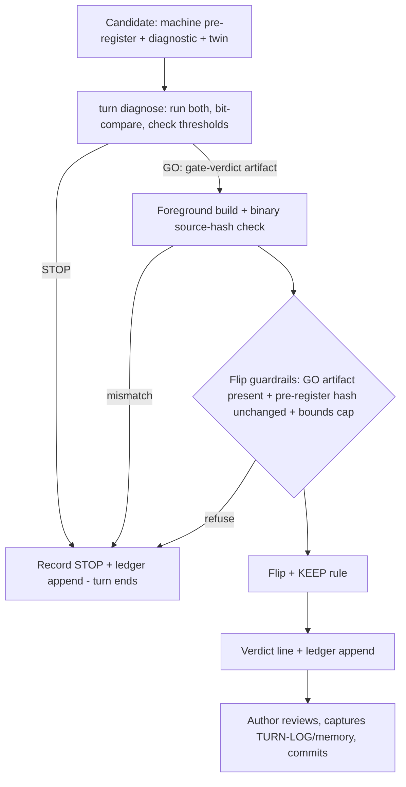
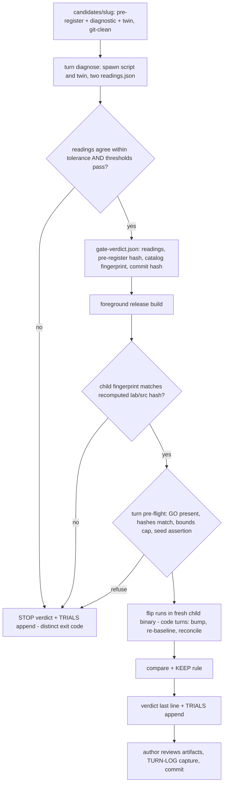

# Governed Strategy Turn Command - Plan

## Goal Capsule

- **Objective:** One invocation runs a pre-authored ORB lever candidate through the whole merit-bearing turn — Phase-A diagnose, build, freshness checks, flip, verdict — halting loudly at any red gate, with every gate reading appended to a new cumulative TRIALS ledger. A frozen `run-strategy-turn` skill choreographs the judgment steps around the command.
- **Product authority:** This document. Gate thresholds and KEEP-rule values are not set here — they stay frozen per candidate in its pre-register, exactly as today.
- **Execution home:** All code lands in the lab crate of the standalone `adapters/nautilus/` workspace (Rust 1.96); `make adapter-check` is the commit gate. No `crates/` touch is planned — if one becomes necessary, the full root gate applies and two root `cargo test` runs never run concurrently.
- **Stop conditions:** Surface instead of guessing when a change would weaken an existing governance guard (0.5 proposal-bounds cap, seed assertion, scrub discipline), when a unit's verification would require a live gateway call, or when backfill fidelity from archived artifacts is ambiguous.
- **Open blockers:** None. All work is offline and deterministic; no gateway, credentials, or market windows involved.

---

## Product Contract

### Summary

Mechanize the ORB strategy loop's merit-bearing turn into a single governed command plus a frozen agent skill. The command makes the loop's gates structurally enforceable — a flip without a recorded Phase-A GO becomes impossible, not just forbidden — and starts the trial accounting that any future throughput increase depends on.

### Problem Frame

The strategy loop has run 13+ turns (v3 → v30) with a well-proven decision discipline, but the discipline is executed by hand each time. Phase-A diagnostics are bespoke python scripts run twice (script + independent twin) and eyeball-compared against thresholds hand-copied between the script and the PRE-REGISTER prose; the GO/STOP decision then travels to Phase-B as operator memory, with nothing preventing a flip that never had a GO — or a threshold quietly softened after the reading, the loop's one explicitly named forbidden move, currently enforced only by convention and `git diff`.

Two runner seams have documented scar tissue: a background build from the repo root leaves a stale binary that silently backtests the old strategy (bit twice, 2026-07-12 and 2026-07-15), and code turns have no version-only-bump path, forcing a manual seed-manifest-and-rerun workaround with its own discovered gotcha (companion-field seeding). Meanwhile ~15–20 levers have been tried against one overlapping, evolving backtest sample (167 closed trades in the current era) with no cumulative trial count that is queryable or enforced at decision time — the datum the backtest-overfitting literature says an iterated loop must keep first-class. The count is recoverable from the prose record, but nothing consults it when a KEEP is judged.

### Key Decisions

- **KD1 — Wrapper, not a stats port.** Phase-A diagnostics stay bespoke per lever, authored before the turn. The command mechanizes running them (script + twin), bit-comparing outputs, evaluating readings against the machine-readable pre-register, and recording the verdict. Standardizing the statistics into a generic tool is explicitly deferred — the wrapper closes the forbidden-overfit seam at a fraction of the cost.
- **KD2 — TRIALS ledger is record-only.** The ledger accumulates trial records (including backfill) but the KEEP bar stays exactly as-is. Any trial-count-adjusted (deflated) KEEP margin is a separate future decision that must itself be pre-registered before it takes effect; batch/unattended operation is blocked until that decision exists.
- **KD3 — One shot, halt-on-red.** The command runs diagnose → build → freshness → flip → verdict in one invocation with no mid-run confirmation. Human judgment sits before the command (authoring the candidate, pre-register, and diagnostics) and after it (reviewing artifacts, committing). Any red gate halts with a distinct non-zero exit naming the gate.
- **KD4 — The command builds; it does not merely detect staleness.** The command runs the release build itself, foreground, from the correct workspace, and verifies the built binary's embedded build fingerprint before any run — deleting the stale-binary gotcha rather than reporting it. Because the strategy is compiled into the binary, the command re-executes the freshly built binary for the flip stage, and the fingerprint check interrogates the built binary directly rather than the process that ran the build.
- **KD5 — CLI owns machine stages; the skill owns choreography.** Every machine-checkable step lives in the Rust command. The frozen `.agents/skills/run-strategy-turn` recipe choreographs the judgment steps around it — candidate readiness checks, invoking the command, interpreting the verdict, TURN-LOG/memory capture, gate and commit — on the same contract as the ten TR-lifecycle skills (non-interactive, machine-readable last line).
- **KD6 — Existing governance guards are composed with, never bypassed.** The proposal-bounds cap and the fresh-home seed assertion keep their refuse-and-run-nothing behavior unchanged; the new gates add to them.

### Actors

- A1. **Author** — the human or agent who queues a candidate: writes its pre-register, authors its diagnostic script and twin, and reviews/commits the turn's artifacts afterward.
- A2. **Governed turn command** — the `lab-research` machinery that executes the machine-checkable pipeline and emits the verdict.
- A3. **`run-strategy-turn` skill** — the frozen recipe an agent follows to take one candidate through a full turn, wrapping A2.

### Requirements

Delivery order: R7, R8, and R10 land first — they retire the two realized gotchas and start trial accounting; the pre-register, diagnose, and guard machinery (R1–R6, R9) lands second; backfill and the frozen skill (R11–R14) third. Partial delivery still pays at each tier boundary.

**Pre-registration and Phase-A diagnose**

- R1. Each candidate carries a machine-readable pre-register: frozen gate thresholds, the identities (paths + content hashes) of its diagnostic script and independent twin, the flip parameter and value (or, for a sweep candidate, the enumerated leg set), and the KEEP-rule anchor. Thresholds live in exactly one machine-readable place; accompanying prose never carries a second copy for tools to read. A candidate's frozen inputs — pre-register, diagnostic, twin — live in a git-tracked home, departing from the gitignored `data/turn4-fresh/` convention, so commit history can serve as freeze evidence; run artifacts stay in the data home.
- R2. `turn diagnose` runs the candidate's diagnostic and its twin; both emit a canonical machine-readable readings artifact (values rounded to the precision the pre-register freezes), and diagnose compares the two artifacts reading-by-reading within the per-reading tolerance frozen in the pre-register — raw-stdout byte comparison is explicitly not the gate, since independently-authored twins never produce byte-identical output. It then evaluates the agreed readings against the pre-register thresholds and writes a gate-verdict artifact recording GO/STOP, the readings, and the pre-register content hash it evaluated against, with git evidence that the pre-register freeze predates the reading.
- R3. A STOP verdict ends the turn there: the outcome is recorded (with the reading that failed), no build or flip occurs, and the trial still lands in the TRIALS ledger.

**Flip guardrail**

- R4. The Phase-B flip refuses to run without a matching GO verdict for the exact candidate being flipped. The refusal is structural (a guard in the runner, alongside the existing proposal-bounds guard), not a convention. The guard binds every runner flip, and candidate classes keep that workable: an independent-signal lever's pre-register may declare a minimal Phase-A (freshness/reconcile-only) in place of a bespoke diagnostic, and a sweep pre-register enumerates its legs so each leg's flip matches the same GO.
- R5. A pre-register whose content changed after its gate verdict was written no longer matches; the flip refuses. Editing a frozen pre-register after its reading is thereby structurally impossible. Re-registering a softened clone remains possible, so the gate-verdict artifact embeds the ledger's prior trials for the same lever family and sample — a post-STOP re-registration is a disclosed, reviewable event, never an invisible one.

**One-shot command and seam hardening**

- R6. One invocation runs diagnose → build → binary-freshness verification → flip → verdict. Every red gate halts with a distinct non-zero exit code naming the gate; no failure mode looks like success.
- R7. The command performs the release build itself (foreground, correct workspace) and verifies the built binary embeds a build fingerprint covering the full lab source tree (e.g. git tree hash plus a dirty-state flag) before running; a mismatch halts. The strategy-source hash alone is insufficient — past staleness surfaced through params code, not the strategy file — and remains a secondary manifest field.
- R8. Code turns get a native version-bump path that replaces the manual seed-manifest-and-rerun workaround, including correct seeding of newer default-valued params the prior head predates. For code turns the pipeline inserts a sentinel re-baseline run, a 1:1 reconcile gate against the prior head, and the exactly-one-param compare before the flip; the KEEP rule is evaluated against the re-baseline run, matching how every historical code turn was judged.
- R9. The command's last output line is a machine-readable verdict: `KEEP v<N> <hash>` / `REVERT <cause-code>` / `STOP <gate>` / `HELD <reason>`. The command never commits to git; it produces artifacts and a verdict, and review/commit stay with A1.

**TRIALS ledger**

- R10. Every gate reading and flip the command executes appends one record to an append-only TRIALS ledger: candidate, lever family, sample lineage (fingerprint plus a declared equivalence/parent link across catalog evolutions), readings, verdict. A record-only append path exists for trials run outside the command (hand-run probes, exploratory gate readings), and — mirroring R14's standing rule — a hand-run gate reading lands its ledger record in the same commit as its artifacts.
- R11. Historical trials are backfilled from the existing record (TURN-LOG, pre-registers, archives) — counting every gate reading and sweep leg including Phase-A STOPs (roughly 19+), not just the 13 headline turns.
- R12. The ledger answers "how many trials have run against this sample, total and per family" as a direct query, answerable both per-fingerprint and per-lineage. It drives no decision in this plan (KD2).

**Frozen skill**

- R13. `.agents/skills/run-strategy-turn/SKILL.md` is authored on the TR-lifecycle recipe contract: input is one candidate, non-interactive, state-driven, and its last line echoes the command's machine-readable verdict.
- R14. The skill's preflight is an incident-traceable checklist — each line cites the documented gotcha or solution doc that created it — and a standing rule requires any new strategy-loop workflow-issue solution doc to land its checklist line in the same PR.

### Key Flows

- F1. **Governed turn, GO path**
  - **Trigger:** A1 has committed a candidate (pre-register + diagnostic + twin) and invokes A3, which runs A2.
  - **Steps:** diagnose runs script + twin → canonical readings agree within tolerance, thresholds pass → gate verdict GO recorded → build + fingerprint verification (for code turns: native version bump, sentinel re-baseline, 1:1 reconcile against the prior head) → flip runs under the guardrails in the freshly built binary → KEEP rule evaluated → verdict line emitted → ledger appended → A1 reviews artifacts, writes TURN-LOG/memory capture per the skill, runs the gate, commits.
  - **Outcome:** A complete merit-bearing turn with zero hand-run diagnostic, comparison, or freshness steps.
  - **Covers:** R1, R2, R4, R6, R7, R8, R9, R10, R13.
- F2. **Red gate, halt path**
  - **Trigger:** Any gate reads red — twin mismatch, threshold fail, pre-register hash mismatch, binary-hash mismatch.
  - **Steps:** command halts at the failing stage with a distinct exit code naming the gate → STOP/HELD verdict recorded → trial appended to the ledger (for gate readings) → nothing downstream of the failing stage runs.
  - **Outcome:** A refused turn is a recorded, queryable event — never a partial run or a silent fallback.
  - **Covers:** R3, R5, R6, R10.

### Acceptance Examples

- AE1. **Covers R4, R5, R6.** Given a candidate with a GO verdict, when its pre-register is edited afterward (any content change), then the flip refuses with a hash-mismatch gate named in the exit — the turn cannot proceed on the softened freeze.
- AE2. **Covers R7.** Given stale build artifacts from an earlier lever, when the command runs, then it rebuilds foreground and verifies the binary's embedded source hash; if the hash still mismatches, it halts before any backtest executes.
- AE3. **Covers R1, R2, R3, R10.** Given a twin whose canonical readings disagree with the diagnostic's beyond the pre-registered per-reading tolerance, then diagnose records STOP with the discrepancy, no build occurs, and the trial appears in the ledger.
- AE4. **Covers R10, R11, R12.** Given the backfilled ledger, when queried for the candidate's lever family, then the count includes historical Phase-A STOPs and sweep legs — a stopped candidate that built nothing still counts as a trial.
- AE5. **Covers R9, R13.** Given a completed turn via the skill, then the transcript's final line parses as one of the four verdict shapes, and no git commit was made by the command or the skill without A1's review step.
- AE6. **Covers R8.** Given a code turn (strategy source changed, no swept param), when the command runs, then the version bump happens natively — the prior head's manifest seeded with any newer default-valued params — the sentinel re-baseline reconciles 1:1 against the prior head before the flip, and no manual seed-and-rerun step occurs.

### Success Criteria

- A merit-bearing turn runs end-to-end with zero hand-run diagnostic, hand-compared output, or hand-verified binary steps.
- No flip can occur without recorded GO evidence — verified structurally (the guard refuses), not by reviewing discipline.
- The two documented seam gotchas (stale binary, manual seed-and-rerun) cannot recur through the governed path.
- "How many trials against this sample, per family?" is a one-query answer with backfill complete.

### Scope Boundaries

- **Deferred for later:** overnight batch / cron orchestration of multiple turns — explicitly blocked until a deflated KEEP-margin policy is pre-registered (KD2); the deflating KEEP bar itself; automated candidate generation (the Teacher direction); standardizing Phase-A statistics into a generic tool; the structured turn-record substrate (`turns.jsonl` / head-state file) from the same ideation set — a separate direction this plan neither builds nor blocks.
- **Handled by other plans:** live-session governance (dispatch gate, watchdog, capital ladder) — `docs/plans/2026-07-16-001-feat-production-ladder-plan.md`.

### Dependencies / Assumptions

- Diagnostics remain python and keep running via `uv run --with pyarrow` (pyarrow is absent from local pythons); the command shells out rather than porting the stats.
- The machine-readable pre-register mirrors the existing PRE-REGISTER convention and follows the content-hashed machine-mirror pattern the production-ladder plan established for its pre-registered values. Unlike today's convention, candidate frozen inputs are git-tracked (R1) — git history is the freeze evidence R2 relies on, which gitignored `data/` files cannot provide.
- The TRIALS ledger schema is scoped as a subset/seed of the eventual structured turn-record substrate (`turns.jsonl`) named in the source ideation, so a later adoption of that substrate absorbs the ledger as a superset-merge, not a migration.
- The proposal-bounds cap and seed assertion remain authoritative and unchanged; the ablation/knockout question (flips the cap would refuse) is out of scope here.
- All verification is offline (`make adapter-check`); nothing in this plan touches the gateway or credentials.

### Outstanding Questions

- **Resolved in the Planning Contract:** artifact homes and formats (KTD2, KTD4); pre-register script declarations (KTD3); code-turn version-bump semantics (KTD7); flip-guard placement (KTD1); the initial REVERT cause-code set (KTD9).
- **Deferred to the user (from 2026-07-16 review):** whether the batch block should be structural — a per-invocation attestation at the flip seam — rather than prose-only; the order-leg TTY precedent conflicts with agent-run turns, so a mechanism would need to distinguish deliberate serial batches from a single governed turn.
- **Deferred to the user (from 2026-07-16 review):** which candidates run through the command next — the CLASS B family just closed and candidate generation is deferred, so the near-term queue (e.g. remaining mechanism classes, a resurrection sweep) should be named to anchor the investment case.

### Sources / Research

Code anchors (repo-relative):

- `adapters/nautilus/lab/src/runner/research.rs` — proposal-bounds guardrail wiring and cap; exactly-one-param compare gate; expect-version seed assertion.
- `adapters/nautilus/lab/src/artifacts/manifest.rs` — `strategy_code_hash` computed from the embedded strategy source (105-107).
- `adapters/nautilus/lab/TURN-LOG.md` — the 8-part per-turn template repeated across 13+ turns; v30 gate readings and bind-prediction match.
- `data/turn4-fresh/` — PRE-REGISTER convention and bespoke diagnostic scripts (e.g. the ratio-ATR pair) with frozen threshold constants.
- `.agents/skills/` — the ten TR-lifecycle recipes; contract shape for verdict lines and orchestrator/worker dispatch.

Institutional learnings (docs/solutions/):

- `conventions/pre-code-collinearity-gate-before-a-second-normalizer-lever.md` — the Phase-A gate and the forbidden-overfit rule this plan makes structural.
- `workflow-issues/code-turn-rebaseline-run-via-manifest-seed-and-rerun.md` — the version-bump gap and workaround R8 retires.
- `conventions/strategy-loop-param-turn-governance-and-fresh-home-seeding.md` — the refuse-and-run-nothing guards KD6 preserves.
- `conventions/report-preview-governance-band-must-anchor-on-deciders-run.md` — any layer previewing a gate must call the decider's own logic, not re-derive it.

External: Bailey & López de Prado, Deflated Sharpe Ratio / CSCV-PBO — trial count is the datum iterated backtests must record (motivates R10-R12); karpathy/autoresearch — the one-command governed-experiment loop shape, minus its naive keep rule, which is unsafe on a fixed sample.

Ideation source: docs/ideation/2026-07-16-strategy-finder-self-improving-ideation.html (ideas 3, 4, 6; TRIALS ledger from idea 2; bases fresh-verified in that run).

---

## Planning Contract

Product Contract preservation: unchanged, except Outstanding Questions' planning-deferred items now resolve into KTD1/KTD2/KTD3/KTD4/KTD7/KTD9, and R4's parenthetical ("alongside the existing proposal-bounds guard") is clarified by KTD1 — the guard is a turn-pipeline pre-flight refusal, not a member of the replayable guardrail chain. All R/AE IDs and product scope are preserved.

### Key Technical Decisions

- **KTD1 — The flip guard is a `turn()` pre-flight bail, not an `IntentGuardrail`.** The guardrail trait carries a documented purity contract (`adapters/nautilus/lab/src/agent/guardrail.rs:11-16`): implementations must be pure functions of `(intent, context)` with no environment reads, because replay re-evaluates recorded envelopes engine-free. A guard that reads a gate-verdict file breaks that contract. The established seam for refuse-before-backtest-on-external-evidence is the KTD-5 `expect_version` bail inside `turn()` (`adapters/nautilus/lab/src/runner/research.rs:235-254`); the flip guard lands beside it.
- **KTD2 — Governance artifacts live in git-tracked lab homes.** Candidates in `adapters/nautilus/lab/candidates/<slug>/` (pre-register + diagnostic + twin + gate-verdict), following the tracked `adapters/nautilus/lab/config/` precedent; the TRIALS ledger at `adapters/nautilus/lab/ledger/trials.jsonl`. Freeze evidence is scoped to the candidate's declared frozen inputs — `candidate.json` plus the declared script and twin files — never to command-written outputs: `gate-verdict.json` is explicitly excluded from both the dirty check and the freeze-commit lookup. `turn diagnose` refuses when any frozen input is git-dirty and records `git log -1 -- <frozen inputs>` as the freeze commit; every git spawn pins `-C <repo-root>` derived from the candidate path (shell-out to the `git` binary — a new but dev-tooling-scoped precedent; no `git2`/`gix` dependency enters the pinned workspace). A GO written earlier in the same invocation chain is reusable uncommitted — the freeze discipline governs inputs, not tool outputs. Committing the ledger with each turn makes append-only tamper-evident through history.
- **KTD3 — Canonical readings artifact.** The candidate pre-register declares each script as a command argv plus content hash (interpreter-agnostic: `uv run --with pyarrow python3 …` in practice, stub commands in tests). The wrapper passes each script an output path; each writes a `readings.json` (declared keys, values at the pre-registered precision). The twin gate compares the two artifacts reading-by-reading within per-reading tolerances frozen in the pre-register. Existing archived scripts (stdout-only, hardcoded paths) are not retrofitted; the contract applies to candidates authored from now on.
- **KTD4 — TRIALS ledger mirrors the decisions-ledger mechanics.** Copy `adapters/nautilus/lab/src/agent/recording.rs`: `schema_version` per record, `OpenOptions::append(true).create(true)`, one `write_all` for record+newline (torn-line safety), typed per-line read errors, scrubbed serialization. Trial unit: one record per statistical look — each Phase-A gate reading, each flip evaluation, each sweep leg; re-baseline reconciles are identity checks, not looks, and are excluded. Records carry candidate, family, sample lineage (fingerprint + parent link), readings, verdict.
- **KTD5 — Build fingerprint via `build.rs`, no git dependency.** A build script hashes the sorted contents of `adapters/nautilus/lab/src/**` (plus `Cargo.toml`) into an embedded env constant; a `fingerprint` subcommand prints it. The orchestrator recomputes the tree hash at run time and requires the spawned binary to report the matching embedded value; the build script and the runtime recompute compile literally the same walk-and-hash source (shared via `include!`), so the two implementations cannot drift. This covers the full lab source, closing the `strategy_code_hash`-only gap (that hash covers `orb.rs` alone — `adapters/nautilus/lab/src/artifacts/manifest.rs:129-131`); the manifest gains an optional fingerprint field using the existing `#[serde(default, skip_serializing_if)]` back-compat pattern.
- **KTD6 — One-shot means the parent drives, the fresh child decides.** `turn governed` orchestrates: parent self-check (the parent compares its own embedded fingerprint against the recomputed tree hash and halts as stale — gate verdicts are never written by the code class R7 distrusts), diagnose (or reuse a GO from this invocation chain or a committed one), foreground `cargo build --release -p nautilus-ls-lab --bin lab-research` from `adapters/nautilus/`, fingerprint check on the built binary, then spawn the fresh binary as a child process for the flip stage. The child runs the flip, compare, and KEEP evaluation itself — it is the decider — and emits the verdict as its last structured line; the parent is transport only, parsing that line plus the exit code and echoing the governed verdict, never recomputing KEEP (the anchor-on-decider convention). Each failing gate exits with its own distinct code from the typed gate-exit registry (a U5 deliverable); the last output line is the machine verdict (`KEEP v<N> <hash>` / `REVERT <cause>` / `STOP <gate>` / `HELD <reason>`).
- **KTD7 — Code turns get `CompareMode::Code`.** The existing compare demands exactly `{strategy_version, one param}` with equal code hashes (`research.rs:563-614`), which structurally blocks code turns. A third mode accepts a version-only diff with an explained code-hash delta. `LS_TURN_CODE_BUMP=1` triggers the native bump (version+1, zero param diff, companion-field seeding via the existing `apply_overrides` JSON round-trip); the pipeline then runs sentinel re-baseline → 1:1 reconcile → compare, and the KEEP rule evaluates against the re-baseline (the v27/v29 precedent).
- **KTD8 — Existing governance composes, never bypassed.** `ProposalBoundsGuardrail` (cap 0.5, `research.rs:54`), the seed assertion, and scrub discipline (`scrub::install()` first statement; structured lines printed verbatim per the print-lines convention) keep their semantics; every new check runs before the pipeline, adding refusals only.
- **KTD9 — REVERT cause-code seed set:** `inverted-signal`, `collinear`, `coverage-cull`, `winner-cutting`, `ror-negative`. Extension is append-only; the skill and the command share the one grammar.

### High-Level Technical Design

### Implementation Constraints

- Standalone workspace only: build and test from `adapters/nautilus/` (Rust 1.96); the root workspace never sees this code.
- CLI convention: argv string dispatch + `LS_*` env config (`research.rs:1228-1296`), library functions over config structs returning outcome structs with verdict `lines`, bins map to `ExitCode` via `ok_fail`; new subcommands register in the `dispatch()` match and the `USAGE` const (`research.rs:1165`), and the `unknown_subcommand_enumerates_valid_ones` test extends accordingly.
- `scrub::install()` stays the first statement of every entry point; ledger and verdict records identify nothing secret (offline artifacts, but the discipline is uniform).
- New manifest fields use `#[serde(default, skip_serializing_if = "Option::is_none")]` so all existing run manifests keep parsing.
- Process spawning (`std::process::Command` for scripts, cargo, git, and the fresh child binary) is a new production precedent in this crate — wrap every spawn with anyhow context naming the command, and treat non-zero child exits as typed gate failures, never panics.

### Sequencing

Tier 1 (U1-U3) retires the realized gotchas and starts trial accounting — independently shippable. Tier 2 (U4-U7) lands the candidate/diagnose/guard machinery and the orchestrator. Tier 3 (U8-U9) backfills history and freezes the skill. Each tier is a natural PR boundary.

---

## Implementation Units

| U-ID | Title | Key files | Depends on |
|---|---|---|---|
| U1 | Build fingerprint + stale-binary refusal | `adapters/nautilus/lab/build.rs`, `runner/research.rs` | — |
| U2 | Code-turn native path (`CompareMode::Code` + bump) | `runner/research.rs` | — |
| U3 | TRIALS ledger module + subcommands | `adapters/nautilus/lab/src/trials.rs` | — |
| U4 | Candidate module + tracked home | `adapters/nautilus/lab/src/candidates.rs` | — |
| U5 | `turn diagnose` wrapper + gate-verdict | `adapters/nautilus/lab/src/runner/diagnose.rs` | U3, U4 |
| U6 | Flip guard in `turn()` | `runner/research.rs` | U3, U4, U5 |
| U7 | `turn governed` one-shot orchestrator | `adapters/nautilus/lab/src/runner/governed.rs` | U1, U2, U5, U6 |
| U8 | TRIALS backfill | `adapters/nautilus/lab/ledger/trials.jsonl` | U3 |
| U9 | `run-strategy-turn` frozen skill | `.agents/skills/run-strategy-turn/` | U7 |

### U1. Build fingerprint + stale-binary refusal

- **Goal:** A build-time fingerprint over the full lab source tree, a `fingerprint` subcommand that prints it, and refusal wiring so a stale binary can never silently backtest old code (R7, AE2).
- **Requirements:** R7; KTD5, KTD8.
- **Dependencies:** none.
- **Files:** `adapters/nautilus/lab/build.rs` (new), `adapters/nautilus/lab/src/runner/research.rs` (subcommand + USAGE), `adapters/nautilus/lab/src/artifacts/manifest.rs` (optional fingerprint field), `adapters/nautilus/lab/tests/research_cli.rs`.
- **Approach:** `build.rs` walks `lab/src/**` in sorted order, SHA-256s file bytes, emits `cargo:rustc-env=LAB_SRC_FINGERPRINT=<hex>` (+ `cargo:rerun-if-changed=src` and `cargo:rerun-if-changed=Cargo.toml`, so the watch set covers every hash input). A `fingerprint` subcommand prints `fingerprint: <hex>` verbatim (structured line, not scrubbed free text). A library function recomputes the tree hash from a source dir at run time for the orchestrator's comparison (U7). Manifest gains optional `lab_src_fingerprint`.
- **Test scenarios:**
  - `fingerprint` prints a 64-hex line and exits 0 (bin-level via `CARGO_BIN_EXE_lab-research`).
  - Recompute-from-dir equals the embedded value for the current tree (library call).
  - Recompute over a tempdir copy with one byte changed in any `src/` file differs.
  - Pre-existing manifest JSON without the new field still deserializes; a manifest with it round-trips.
- **Verification:** `cargo test -p nautilus-ls-lab` green from `adapters/nautilus/`.

### U2. Code-turn native path

- **Goal:** `LS_TURN_CODE_BUMP=1` produces a version-only bump with companion-field seeding, and `runs compare` gains `CompareMode::Code`, retiring the seed-manifest-and-rerun workaround (R8, AE6).
- **Requirements:** R8; KTD7, KTD8.
- **Dependencies:** none.
- **Files:** `adapters/nautilus/lab/src/runner/research.rs`, `adapters/nautilus/lab/tests/research_cli.rs`.
- **Approach:** A third turn mode beside rerun/governed-param: bump `strategy_version` with zero param overrides (reusing `apply_overrides`' JSON round-trip so newer `#[serde(default)]` params seed correctly). `CompareMode::Code`: params diff exactly `{strategy_version}`, `strategy_code_hash` delta expected and reported, all other identity fields (catalog fingerprint, data range, universe hashes) still hard-checked. The expect-version guard applies unchanged.
- **Execution note:** Implement test-first from the documented workaround (`docs/solutions/workflow-issues/code-turn-rebaseline-run-via-manifest-seed-and-rerun.md`) — its manual steps are the spec for what the native path must subsume.
- **Test scenarios:**
  - Covers AE6. Code-bump turn on a fixture registry: new manifest has version+1, params byte-equal to prior head's (modulo seeded defaults), no seed directory involved.
  - Prior head predating a newer defaulted param: bumped manifest carries the default (companion-field regression).
  - `CompareMode::Code` passes on version-only diff with code-hash delta; fails when a param also changed; fails when catalog fingerprint differs.
  - Param mode behavior unchanged (existing tests stay green).
- **Verification:** targeted tests green; a rehearsal code-bump on a fixture reproduces the v29-style re-baseline shape.

### U3. TRIALS ledger module + subcommands

- **Goal:** The append-only trial ledger with query and record-only append paths (R10, R12, AE4).
- **Requirements:** R10, R12; KTD4.
- **Dependencies:** none.
- **Files:** `adapters/nautilus/lab/src/trials.rs` (new), `adapters/nautilus/lab/src/lib.rs` (module wiring), `adapters/nautilus/lab/src/runner/research.rs` (`trials record` / `trials count` arms), `adapters/nautilus/lab/tests/trials.rs` (new).
- **Approach:** Record struct: `schema_version`, timestamp, candidate slug, lever family, look kind (gate-reading / flip / sweep-leg), sample lineage (`catalog_fingerprint` + optional `parent_fingerprint`), readings map, verdict. Append mirrors `recording.rs` (create+append, single `write_all`). The trials library takes the ledger path as a parameter (library-functions-over-config-structs convention); the CLI arm resolves the fixed tracked path `adapters/nautilus/lab/ledger/trials.jsonl`, and `LS_TRIALS_LEDGER` overrides it so bin-level tests point at a tempdir. `trials count` prints totals overall / per family / per lineage as structured lines; `trials record` appends from `LS_TRIAL_*` env for hand-run looks.
- **Test scenarios:**
  - Covers AE4 (mechanics). Append two records, read back in order; absent file reads empty.
  - Torn final line yields a typed per-line error naming the line number; unknown `schema_version` refuses.
  - `trials count` groups correctly by family and by lineage (parent link merges two fingerprints into one lineage count).
  - `trials record` with missing required env → loud refusal, distinct exit code, nothing appended.
- **Verification:** targeted tests green.

### U4. Candidate module + tracked home

- **Goal:** The machine-readable pre-register: schema, loader, content hash, and the git-clean freeze check (R1).
- **Requirements:** R1; KTD2, KTD3.
- **Dependencies:** none.
- **Files:** `adapters/nautilus/lab/src/candidates.rs` (new), `adapters/nautilus/lab/candidates/README.md` + `candidates/example/candidate.json` (new, tracked), `adapters/nautilus/lab/tests/candidates.rs` (new).
- **Approach:** `candidate.json` schema: `schema_version`, slug, lever family, flip param+value (or enumerated leg set), Phase-A class (`bespoke` | `minimal`), script + twin declarations (argv array + content hash + declared reading keys with per-reading tolerance and precision), thresholds, KEEP anchor. Loader verifies script content hashes against files in the candidate dir and computes the pre-register content hash (`hash_bytes` from `manifest.rs`). Freeze check shells `git -C <repo-root> status --porcelain -- <frozen inputs>` (dirty → refuse) and `git -C <repo-root> log -1 --format=%H -- <frozen inputs>` (recorded in verdicts); the frozen-input set is `candidate.json` + declared script + twin, and command-written outputs like `gate-verdict.json` are excluded (KTD2).
- **Test scenarios:**
  - Load a valid fixture candidate; content hash is stable across a reserialize.
  - Script file edited after declaration → hash mismatch refusal naming the file.
  - Missing tolerance for a declared reading key → load error (schema completeness).
  - Git-dirty candidate dir → refusal with distinct message (test via a tempdir git repo fixture).
  - Sweep candidate with a leg set loads; single-flip candidate with both param and leg set → load error.
- **Verification:** targeted tests green; the example candidate in `lab/candidates/example/` loads in a doc-tested round trip.

### U5. `turn diagnose` wrapper + gate-verdict

- **Goal:** One command runs diagnostic + twin, compares canonical readings, evaluates thresholds, writes the gate-verdict, and appends the trial (R2, R3, AE3).
- **Requirements:** R2, R3; KTD2, KTD3; AE3.
- **Dependencies:** U3, U4.
- **Files:** `adapters/nautilus/lab/src/runner/diagnose.rs` (new), `adapters/nautilus/lab/src/runner/research.rs` (dispatch arm), `adapters/nautilus/lab/tests/diagnose.rs` (new).
- **Approach:** Spawn each declared argv with an appended output path (tempdir `readings.json`); parse both; compare reading-by-reading within the candidate's tolerances; evaluate thresholds; append the gate-reading trial record first, then write `gate-verdict.json` into the candidate dir recording GO/STOP, both readings sets, pre-register content hash, catalog fingerprint of the anchor run, and the freeze commit hash — ledger-first, so a crash between the two leaves an orphan trial record (the overcount-safe direction), never an uncounted GO. Print structured lines ending in the verdict. U5 also delivers the shared typed gate-exit registry: a stable exit-code enum documented beside the verdict grammar; STOP and every refusal class exit through it (bare anyhow bails map to the generic failure code only for genuinely untyped errors), and U6/U7 route their refusals through the same registry.
- **Test scenarios:**
  - Covers AE3. Stub twin emitting a reading beyond tolerance → STOP verdict recorded with the discrepancy named, no gate-verdict GO written, trial appended.
  - Stub pair agreeing within tolerance but failing a threshold → STOP with the failing threshold named; agreeing and passing → GO artifact with all recorded hashes present.
  - Script exits non-zero → typed failure naming the command, no verdict written.
  - Script writes malformed JSON or omits a declared key → typed failure.
  - Re-running diagnose after editing the pre-register → verdict records the new hash (old GO no longer matches — U6 asserts the refusal side).
  - A planted secret in env never appears in verdict or ledger bytes (scrub test, mirroring `recording.rs`).
- **Verification:** targeted tests green using stub scripts only — no `uv`/network in tests.

### U6. Flip guard in `turn()`

- **Goal:** A governed flip is structurally impossible without a matching committed GO (R4, R5, AE1).
- **Requirements:** R4, R5; KTD1, KTD8; AE1.
- **Dependencies:** U3, U4 (calls the candidate loader/hasher directly), U5.
- **Files:** `adapters/nautilus/lab/src/runner/research.rs`, `adapters/nautilus/lab/tests/research_cli.rs`.
- **Approach:** The guard is default-on, not env-opt-in: any `turn()` invocation carrying an override param without `LS_TURN_CANDIDATE=<slug>` refuses outright (rerun mode, which flips nothing, stays exempt). With a candidate named, the pre-flight (beside the expect-version bail, before the pipeline) loads the candidate + gate-verdict and refuses when: verdict absent or STOP; no matching gate-reading ledger record exists for the GO; recorded pre-register hash ≠ current content hash; flip param/value ≠ candidate declaration (or leg not in the declared set); verdict's catalog fingerprint ≠ the anchor run's. Minimal-class candidates satisfy R4 with a freshness/reconcile-only verdict. The flip evaluation appends its own trial record — the child is the single writer for the flip look. Bounds cap and seed assertion run unchanged after the new checks; refusals exit through the U5 gate-exit registry.
- **Test scenarios:**
  - Covers AE1. GO written, then pre-register edited → flip refuses with hash-mismatch exit code.
  - Override param with no `LS_TURN_CANDIDATE` set → refuses outright (rerun mode still proceeds) — the guard is not opt-in.
  - No verdict / STOP verdict / GO without its matching ledger record / wrong param / undeclared sweep leg → each refusal distinct and recorded.
  - Catalog fingerprint drift between verdict and anchor run → refusal naming the drift.
  - Happy path: GO + clean hashes → flip proceeds, trial record appended, existing guardrail behavior intact (bounds-cap refusal still fires on an out-of-bounds proposal).
- **Verification:** targeted tests green; refusals assert on exit codes, not message text.

### U7. `turn governed` one-shot orchestrator

- **Goal:** One invocation: diagnose → build → fingerprint check → flip in the fresh child → verdict line (R6, R9; AE5 command side).
- **Requirements:** R6, R9; KTD5, KTD6, KTD7.
- **Dependencies:** U1, U2, U5, U6.
- **Files:** `adapters/nautilus/lab/src/runner/governed.rs` (new), `adapters/nautilus/lab/src/runner/research.rs` (dispatch arm), `adapters/nautilus/lab/tests/governed_cli.rs` (new).
- **Approach:** Thin driver: self-check own embedded fingerprint against the recomputed tree hash (halt as stale before any gate verdict is produced); reuse a GO from this invocation chain or a committed one, else run diagnose; foreground `cargo build --release -p nautilus-ls-lab --bin lab-research` from the workspace root; require the built binary's `fingerprint` output to equal the recomputed tree hash; spawn the built binary as a child running the flip stage (`turn` with the governed env, plus code-turn branch per KTD7: bump → re-baseline → reconcile → compare). The child evaluates compare + KEEP and appends the flip trial record; the parent adopts the child's verdict — parsing its last structured line and exit code, appending nothing for the flip stage — and emits it as the governed run's last line. Never touches git commit/push. Stage overrides for tests: `LS_GOVERNED_BUILD_CMD` / `LS_GOVERNED_CHILD_BIN` env seams so tests substitute stub commands.
- **Execution note:** Prove the stage machine with stubbed build/child seams first; the real cargo-build path is exercised once manually (attended) and by the skill's checklist, not by CI.
- **Test scenarios:**
  - Covers AE5 (command side). Full stubbed pipeline → last line parses as one of the four verdict shapes; exit 0 only on KEEP/REVERT (completed evaluation), distinct non-zero for each halted gate.
  - Stub build producing a binary whose `fingerprint` mismatches → halt before any flip; nothing appended for the flip stage.
  - Diagnose STOP short-circuits: no build attempted.
  - Child flip refusal (U6 exit code) surfaces as the governed verdict `HELD <reason>` with the child's code preserved in output.
  - Code-turn branch orders stages: bump → re-baseline → reconcile-pass → compare (order asserted via stub call log).
  - Exactly one flip trial record lands per governed run (stub ledger asserted — the child writes it, the parent does not).
  - Parent whose own fingerprint mismatches the tree → halts before diagnose; no gate verdict written.
- **Verification:** targeted tests green; one attended end-to-end rehearsal on a fixture candidate documented in the PR description (outside the commit gate).

### U8. TRIALS backfill

- **Goal:** The historical record becomes queryable: every statistical look from v3→v30 lands in the ledger (R11, AE4).
- **Requirements:** R11; KTD4.
- **Dependencies:** U3.
- **Files:** `adapters/nautilus/lab/ledger/trials.jsonl` (authored records), `adapters/nautilus/lab/tests/trials.rs` (committed-ledger validation test).
- **Approach:** Author backfill records from `adapters/nautilus/lab/TURN-LOG.md`, archived PRE-REGISTER docs, and archive dirs — one record per look (gate readings incl. Phase-A STOPs like ATR-vol-target, flip evaluations, each sweep leg), with sample lineage links across the 166/157/167 catalog eras and a `backfill: true` marker replacing unknown readings with the recorded verdict only. Fidelity note per record where archived stdout was the only source.
- **Execution note:** Data authoring, not code. Cross-check the final count against a hand tally from TURN-LOG (~19+ looks expected); disagreement is a stop condition, not a rounding call.
- **Test scenarios:**
  - Covers AE4. The committed ledger parses fully (no typed line errors); `trials count` for the CLASS B family includes the ATR-vol-target STOP; per-lineage counts split across the declared era links.
  - Every backfill record carries `backfill: true` and a source pointer (TURN-LOG anchor or archive path).
- **Verification:** committed-ledger test green; count cross-check recorded in the unit's commit message.

### U9. `run-strategy-turn` frozen skill

- **Goal:** The eleventh recipe: choreography for one governed turn with an incident-cited preflight checklist and the machine-verdict contract (R13, R14; AE5 skill side).
- **Requirements:** R13, R14; KTD9.
- **Dependencies:** U7.
- **Files:** `.agents/skills/run-strategy-turn/SKILL.md` (new), `.agents/skills/run-strategy-turn/references/preflight-checklist.md` (new).
- **Approach:** Mirror the TR-lifecycle contract (input via `$ARGUMENTS` = candidate slug; non-interactive; state-driven; last line echoes the command's verdict grammar). Body: author/verify candidate → invoke `turn governed` → interpret verdict → TURN-LOG + memory capture template → gate → commit. Checklist lines each cite their source incident (stale binary ×2, seed-and-rerun, companion-field, archive-before-analyze, pyarrow-via-uv); the standing rule (new strategy-loop workflow-issue doc ⇒ checklist line in the same PR) is stated in the skill.
- **Test scenarios:** Test expectation: none — documentation artifact; its contract is enforced by U7's verdict-grammar tests and by the checklist's citation links resolving to existing docs (link check in review).
- **Verification:** a dry read-through executes against the example candidate without improvisation; verdict grammar in the skill matches U7's output byte-for-byte.

---

## Verification Contract

| Gate | Command | Applies to | Done signal |
|---|---|---|---|
| Adapter workspace gate | `make adapter-check` (= `cd adapters/nautilus && cargo test --workspace`) | every unit | green, no skipped failures |
| Targeted iteration | `cargo test -p nautilus-ls-lab` from `adapters/nautilus/` | U1-U8 | unit's scenarios all present and green |
| Ledger integrity | `lab-research trials count` on the committed ledger | U3, U8 | parses clean; counts match the TURN-LOG hand tally |
| Verdict grammar | bin-level tests via `CARGO_BIN_EXE_lab-research` | U5-U7 | last line parses as the four-shape grammar; distinct exit codes asserted |
| Root gate | full root `cargo test` | only if any `crates/` file is touched (none planned) | green; never two root runs concurrently |

All gates are offline; no live smoke is part of this plan. The one attended rehearsal (U7) is documentation, not a commit gate.

## Definition of Done

- All nine units landed in tier order (U1-U3, then U4-U7, then U8-U9), each with its test scenarios implemented and green under `make adapter-check`.
- Acceptance examples AE1-AE6 each traced to at least one green test (AE5's skill side by U9's read-through).
- A flip without a committed GO is refused by test-proven exit-code behavior, not convention.
- `trials count` answers the per-family and per-lineage questions on the backfilled ledger, and the backfill tally cross-check is recorded.
- The skill file exists, its checklist lines cite real incident docs, and its verdict grammar matches the command's output.
- No dead experimental code from abandoned approaches remains in the diff; `docs/solutions/workflow-issues/code-turn-rebaseline-run-via-manifest-seed-and-rerun.md` gains a superseded-by note pointing at the native path.
