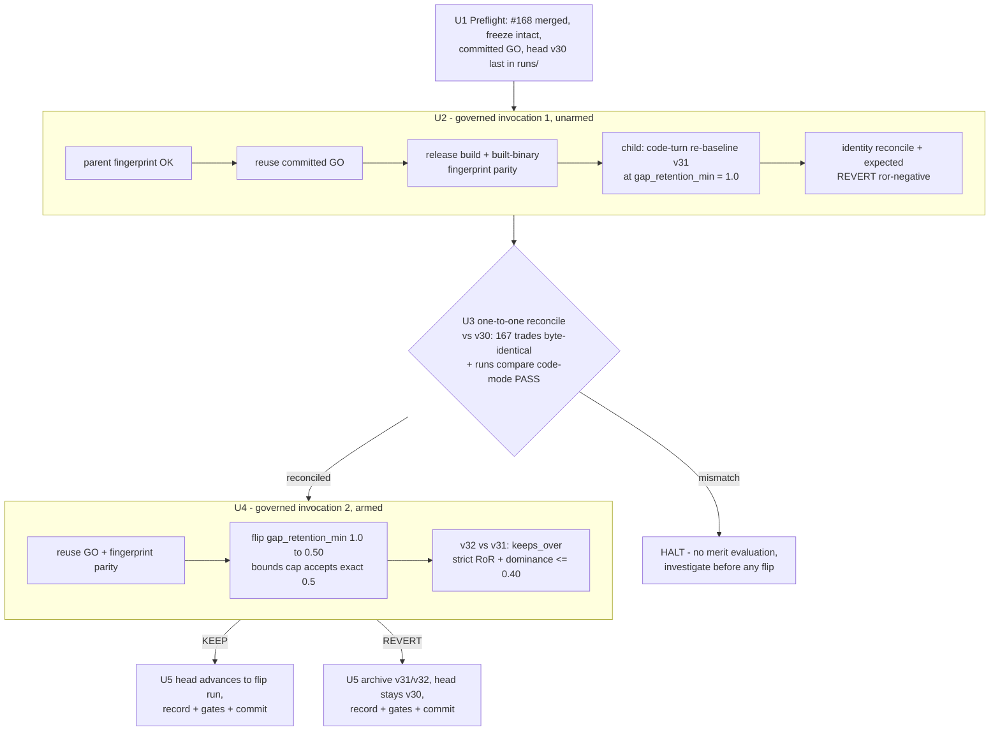

# Gap-Retention Governed Strategy-Loop Turn - Plan

## Goal Capsule

- **Objective:** Execute issue #169 — the one permitted merit-bearing strategy-loop turn for the frozen `opening-range-gap-retention` candidate: a sentinel re-baseline at `gap_retention_min = 1.0` reconciled one-to-one with pinned head v30, then exactly one governed `1.0 → 0.50` flip, ending in an unchanged KEEP or REVERT verdict recorded through the existing artifacts and ledgers.
- **Authority hierarchy:** Frozen thresholds, identities, and the KEEP rule come from `adapters/nautilus/lab/candidates/opening-range-gap-retention/candidate.json` and the issue #165 spec — this plan never restates or overrides them. This plan owns sequencing, evidence obligations, and stop conditions.
- **Execution profile:** Offline and deterministic — no gateway, credentials, or market window. Agent-runnable end-to-end; both governed invocations run attended in one sitting so the tree state never straddles a half-finished turn.
- **Stop conditions:** Issue #168 not merged; `freeze_check` refusal (dirty tree or frozen-input drift); any `HELD`/`STOP` governed verdict; one-to-one reconciliation mismatch (halt before the armed flip — never proceed to merit on a broken re-baseline); a malformed `trials.jsonl` line; the proposal-bounds guardrail denying the flip (halt and investigate — never widen the cap).
- **Tail ownership:** Commit on a feature branch and open a PR per repo convention; the turn is complete at either verdict — KEEP and REVERT are equally valid completions.

---

## Product Contract

### Summary

Run the governed gap-retention turn as two `turn governed` invocations over the existing machinery: an unarmed code-turn re-baseline (version-only bump at the OFF sentinel) proven behaviorally identical to head v30, then the single armed flip to 0.50 decided by the unchanged strict-RoR + dominance KEEP rule. No new lever code is written in this turn; the tracked diff is evidence (TURN-LOG entry, trials-ledger lines).

### Problem Frame

The gap-retention lever chain (#159–#168) has frozen the observable, cutoff, cohort, and Phase-A gate, and the Phase-A diagnostic + twin recorded a committed GO (`predicted_ror_shift 0.10496` vs the `0.00065` floor; `retained_max_risk_capital_share 0.0974` vs the `0.40` cap). GO authorizes implementation only — economic merit is still undecided. Since head v30 was pinned, `orb.rs`/`params.rs` have changed (the #167 OFF seam, and #168's armed gate when it lands), so the code's behavior at the OFF sentinel must be re-proven identical to v30 before any merit comparison is meaningful. Issue #169 is that final, non-iterative evaluation.

### Requirements

**Governance and identity**

- R1. The release build and embedded binary fingerprint checks pass before any backtest or flip.
- R2. The governed command reuses the frozen GO identity and rejects any candidate, source, or flip-input drift.

**Re-baseline**

- R3. A code re-baseline at the `1.0` OFF sentinel is produced and behaviorally reconciled one-to-one with pinned head v30 (run `20260715T092847Z-backtest-orb-v30`) before merit is evaluated.

**Flip and verdict**

- R4. Exactly one armed backtest changes only `gap_retention_min` from `1.0` to `0.50`; the unchanged 50% proposal cap remains in force.
- R5. KEEP requires return-on-risk strictly above the sentinel re-baseline and maximum per-symbol retained risk-capital share at most `0.40`; every other result is REVERT.

**Evidence and state**

- R6. Candidate freeze, Phase-A verdict, re-baseline reconciliation, flip trial, readings, and final verdict are recorded through the existing candidate package, `ledger/trials.jsonl`, and `TURN-LOG.md`.
- R7. The resulting tree and recorded strategy state agree with the KEEP or REVERT verdict.
- R8. Standalone lab tests and the repository adapter check are green; root workspace tests run only if root-workspace code is reached.

### Scope Boundaries

- **Not here:** implementing the armed session gate (issue #168 — a blocking prerequisite, planned and landed separately); retuning `0.50`, sweeps, or companion parameters; any change or reinterpretation of the KEEP/REVERT rule; replacement-entry or freed-capacity simulation; Production Ladder or live/paper execution surfaces.
- **Deferred to follow-up work:** structural attestation of the recorded GO (the known deferred question from the governed-command plan — `gate-verdict.json` and trials lines remain disclosure-backed, not forge-proof); folding the one-to-one behavioral reconciliation into the governed command as a structural check (this turn records it as evidence per precedent).

### Dependencies

- **Issue #168 merged** — today `OrbParams::validate` (`adapters/nautilus/lab/src/params.rs`) hard-rejects any `gap_retention_min != 1.0`, so the armed flip cannot run until the gate exists. Hard blocker; U1 verifies it.
- **Head v30 present and last** in the operator data home `data/turn4-fresh/runs/` (repo root, gitignored) — verified true at planning time; `latest_finalized_run` anchors on it.
- **Committed GO** in the candidate package — present (`gate-verdict.json`, decision GO, freeze commit `403b6c9`), with two matching `gate-reading` GO lines in the trials ledger.

---

## Planning Contract

### Key Technical Decisions

- **KTD1 — Two governed invocations, both reusing the committed GO.** Invocation 1: `turn governed` with `LS_TURN_CODE_BUMP=1` produces the unarmed sentinel re-baseline (version-only bump, zero param diff — the native code-turn path). Invocation 2: `turn governed` with the single-param flip produces the armed run. Gap-retention is the first candidate whose arming flip can traverse the governed param path natively: `1.0 → 0.50` is a finite 50% relative change, exactly on the `PROPOSAL_BOUNDS_CAP = 0.5` inclusive bound (the on-bound epsilon fix in `proposal_bounds.rs` admits it, and the current value `1.0` is a dust-free serde default). Amihud's `0 → X` infinite-change flip needed seed-and-rerun; this one does not.
- **KTD2 — One-to-one reconciliation is operator-recorded evidence between the two invocations, not new command code.** The governed child's built-in `reconcile` stage checks sample identity only (data range, catalog fingerprint, universe hash). The acceptance criterion's "behaviorally reconciled one-to-one" is satisfied the way the amihud and mechanism-harness turns did it: a per-trade comparison of the re-baseline's `performance.json` against v30 (167 trades; symbol, qty, pnl, risk_capital byte-identical; summary equal on every field) plus `runs compare` in code mode (PASS on a version-only diff with the expected `strategy_code_hash` delta). Any mismatch halts the turn before the armed flip.
- **KTD3 — The re-baseline invocation's `REVERT ror-negative` is the expected identity outcome, not the turn verdict.** A perfect re-baseline has RoR equal to v30, which fails the strictly-greater KEEP rule by construction (amihud precedent, recorded as such in TURN-LOG). The merit verdict is invocation 2's output only.
- **KTD4 — Verdict-agnostic completion with amihud-precedent tree settlement.** On KEEP the flip run becomes head and both new runs stay in `runs/`; on REVERT both are archived to a per-family archive dir beside `runs/` so `latest_finalized_run` re-anchors on v30. Either way the TURN-LOG entry, trials lines, and tree state must tell the same story (R7).

### Assumptions

- The flip-input drift guard (frozen `flip_param`/`flip_value` from `candidate.json` enforced against the requested turn param) holds as covered by the existing candidate-loader and governed-CLI test suites; U1 spot-verifies the frozen identity rather than re-proving the guard.

### High-Level Technical Design

Any `HELD`/`STOP` line from either invocation is a halt, not a branch to work around.

---

## Implementation Units

### U1. Turn preflight — prerequisites and frozen identity

- **Goal:** Establish that every precondition of the turn holds before any build or backtest.
- **Requirements:** R2 (identity side), Dependencies.
- **Dependencies:** none (first unit).
- **Files:** read-only — `adapters/nautilus/lab/candidates/opening-range-gap-retention/` (candidate.json, gate-verdict.json), `adapters/nautilus/lab/ledger/trials.jsonl`, `adapters/nautilus/lab/src/params.rs`, the data home `data/turn4-fresh/runs/` (gitignored).
- **Approach:** Verify: issue #168 is merged and `OrbParams::validate` no longer hard-rejects `0.50`; the working tree is clean at a commit containing the frozen candidate (freeze commit `403b6c9` reachable, frozen inputs unmodified); `gate-verdict.json` records decision GO with `flip_param gap_retention_min` / `flip_value 0.5` and catalog fingerprint `3b6be31b…`; the trials ledger parses cleanly end-to-end (strict reader — one bad line halts governance) and its two duplicate gate-reading GO lines are noted as benign append-only history; `runs/` ends at `20260715T092847Z-backtest-orb-v30` and the turn environment points at the repo-root data home (a stray `v900` run exists in the lab-local data dir — the wrong home).
- **Test scenarios:** Test expectation: none — verification-only unit; no code changes. Evidence is the preflight checklist recorded for the TURN-LOG entry.
- **Verification:** Every check above passes; any failure stops the turn before U2.

### U2. Sentinel re-baseline via the governed code turn

- **Goal:** Produce the version-labeled re-baseline run at the OFF sentinel through the governed command's native code-turn path.
- **Requirements:** R1, R3 (production half).
- **Dependencies:** U1.
- **Files:** writes a gitignored run dir under `data/turn4-fresh/runs/` only — the code-turn path appends no trials line (re-baseline reconciles are identity checks, never recorded in the ledger).
- **Approach:** From a clean committed tree, run `turn governed` for the candidate with the code-bump seam set (`LS_TURN_CANDIDATE`, `LS_TURN_CODE_BUMP=1`) against the repo-root data home. The parent must report: parent fingerprint OK → reusing GO → build OK → built-binary fingerprint OK; the child then runs the version-only bump (expected v31; the label collides with the archived amihud v31 only by number — run ids disambiguate) with `gap_retention_min` seeded at its serde default `1.0` and zero param diff. Expected governed verdict: `REVERT ror-negative` — the identity outcome per KTD3, captured for the TURN-LOG entry, not the turn verdict.
- **Execution note:** Capture the full stage-line output verbatim; each expected line missing is a halt, and a `HELD StaleBinary`/`BuildFailure` is resolved by rebuild-and-rerun, never by bypassing the parent.
- **Test scenarios:** Test expectation: none — this unit runs existing, already-tested machinery (`adapters/nautilus/lab/tests/governed_cli.rs` covers stage ordering and single-trial-per-run); no code changes.
- **Verification:** A finalized re-baseline run exists in `runs/` with the new `strategy_code_hash`, `strategy_version` = prior + 1, and params otherwise identical to v30; zero new trials lines were appended (identity checks land no ledger record).

### U3. One-to-one behavioral reconciliation against head v30

- **Goal:** Prove the re-baseline is behaviorally identical to pinned head v30 before any merit evaluation.
- **Requirements:** R3 (reconciliation half), R6 (reconciliation evidence).
- **Dependencies:** U2.
- **Files:** evidence only (feeds the U5 TURN-LOG entry); reads the v30 and re-baseline run artifacts in the data home.
- **Approach:** Two independent checks, both required: (a) per-trade comparison of `performance.json` between v30 and the re-baseline — all 167 trades byte-identical on symbol, qty, pnl, and risk_capital, and the summary equal on every field (the mechanism-harness "166/166" precedent, now 167); (b) `runs compare` in code mode (v30 → re-baseline) — PASS with param diff exactly `["strategy_version"]` and the expected `strategy_code_hash` delta. The comparison script/one-liner is ad hoc and disposable; the recorded numbers are the durable artifact.
- **Execution note:** This is the fail-closed gate of the whole turn: on any mismatch, stop — do not run U4, do not archive anything yet, and surface the discrepancy (it means the OFF seam or the #168 gate is not behavior-preserving, which reopens #167/#168, not this turn).
- **Test scenarios:** Test expectation: none — evidence unit over existing artifacts; the OFF-seam behavior itself is covered by the #167/#168 decision-stream suites.
- **Verification:** Both checks pass and their outputs are captured verbatim for the TURN-LOG entry.

### U4. The armed governed flip and merit verdict

- **Goal:** Run exactly one armed backtest — `gap_retention_min 1.0 → 0.50` — through the governed command and obtain the KEEP or REVERT verdict.
- **Requirements:** R1, R2, R4, R5.
- **Dependencies:** U3.
- **Files:** appends `adapters/nautilus/lab/ledger/trials.jsonl` (via the command); writes a gitignored run dir.
- **Approach:** Run `turn governed` for the candidate with the single-param flip requested (the governed param path, not seed-and-rerun — KTD1). The parent repeats fingerprint/GO/build gates; the child applies the flip, the proposal-bounds guardrail evaluates the exact-on-cap 0.5 relative change (must approve per the epsilon fix; a denial is a halt to investigate, never a cap change), the manifest diff must be exactly `{gap_retention_min, strategy_version}`, and `decide_keep_or_revert` compares the flip run against the re-baseline via `EdgeEvaluation::keeps_over` — KEEP only on strictly greater RoR with risk-cap dominance holding at most `0.40`; anything else is `REVERT ror-negative`.
- **Test scenarios:** Test expectation: none — existing governed CLI, guardrail (on-bound regression), and keeps_over suites cover the machinery; no code changes.
- **Verification:** Exactly one armed run was produced; `runs compare` param mode (re-baseline → flip) PASSes with diff exactly `["gap_retention_min", "strategy_version"]`; the governed verdict line (`KEEP v<N> <hash>` or `REVERT ror-negative`) is captured verbatim; exactly one flip trials line was appended — it carries `flip approved v<N>` by construction (written when the backtest finalizes, before the verdict is decided), so the KEEP/REVERT verdict is not expected in the ledger.

### U5. Record the turn, settle the tree, run the gates

- **Goal:** Make the tree, ledgers, and TURN-LOG agree with the verdict, and land the turn green.
- **Requirements:** R6, R7, R8.
- **Dependencies:** U4.
- **Files:** `adapters/nautilus/lab/TURN-LOG.md` (new entry); `adapters/nautilus/lab/ledger/trials.jsonl` (appended by U4 only — committed here); archive moves inside the gitignored data home on REVERT.
- **Approach:** Write the TURN-LOG entry following the amihud entry's shape: freeze identity (slug, freeze commit, catalog fingerprint), Phase-A verdict echoed (never re-derived), the U3 reconciliation evidence, the flip readings table (RoR re-baseline vs flip, dominance, trade counts, rejected-session count), and the verbatim verdict. TURN-LOG is the sole recording surface for the final KEEP/REVERT — the U4 ledger line carries `flip approved v<N>` only, and no hand `trials record` line is added this turn — so R6 is satisfied collectively across the candidate package, the ledger, and TURN-LOG. Settle the tree per KTD4: on KEEP the flip run stays as head; on REVERT move both new runs to a per-family archive dir beside `runs/` (matching `sizing-archive`/`sweep-archive` convention) so v30 re-anchors. Then run the gates and commit on a feature branch.
- **Test scenarios:** Test expectation: none — documentation and state settlement; the gates below are the proof.
- **Verification:** `cargo test --workspace` from `adapters/nautilus/` is green (never from repo root — the root workspace does not cover the lab crate); `make adapter-check` from repo root is green; root `cargo test` is skipped (no root-workspace code touched — record that in the PR); `latest_finalized_run` agrees with the verdict; the committed diff contains only evidence files (TURN-LOG, trials lines) — no source changes.

---

## Verification Contract

| Gate | Command | When |
|---|---|---|
| Standalone lab workspace tests | `cargo test --workspace` run from `adapters/nautilus/` | U5, before commit (CWD matters — repo-root `cargo test` silently skips the lab crate) |
| Adapter check | `make adapter-check` from repo root | U5, before commit |
| Root workspace tests | root `cargo test` | only if root-workspace code is reached (not expected this turn) |
| Governed stage evidence | verbatim parent/child stage lines from both invocations | U2, U4 |
| Re-baseline reconciliation | 167/167 per-trade identity + `runs compare` code-mode PASS | U3, before U4 may run |
| Flip attribution | `runs compare` param-mode diff exactly `["gap_retention_min", "strategy_version"]` | U4 |

---

## Risks

- **Merit risk (expected, not a defect):** Phase-A's `+0.10496` predicted RoR shift is a static retained-cohort projection with replacement entries explicitly not simulated; the armed run frees `max_concurrent` slots on rejected sessions, so the realized cohort can differ (the turn-10 caveat). GO does not imply KEEP; a REVERT is a complete, correct outcome.
- **Misreading the identity REVERT:** the U2 invocation prints a `REVERT ror-negative` verdict line for the re-baseline (captured for TURN-LOG) but records no trials line. TURN-LOG must label the printed line the identity outcome (KTD3) so future readers don't count the turn as decided twice.
- **On-bound flip denial:** if the guardrail denies the exact-0.5 change despite the epsilon fix, halt — the fix's regression covers loop-produced dust, but the stop condition stands: investigate precision, never widen the cap.
- **Wrong data home:** the lab-local data dir contains a stray `v900` run; pointing the turn there would anchor the wrong head. U1 pins the repo-root home before anything runs.

---

## Definition of Done

- All eight requirements hold, each traceable to captured evidence (issue #169's acceptance criteria, one-to-one).
- The turn ended in exactly one recorded KEEP or REVERT verdict; tree, ledger, TURN-LOG, and data-home head agree with it.
- Gates green per the Verification Contract; the branch is committed and a PR is open referencing #169 (and closing it).
- No abandoned scratch artifacts: ad hoc reconciliation scripts and any seed/temp dirs are removed; the diff is evidence-only.

---

## Sources & Research

- Issues: #169 (this turn), #168 (blocking prerequisite), #165 (frozen spec), #166/#167 (done: freeze + Phase-A GO, OFF seam).
- Governed machinery: `adapters/nautilus/lab/src/runner/governed.rs` (parent/child stages, `decide_keep_or_revert`), `adapters/nautilus/lab/src/candidates.rs` (freeze_check, flip identity), `adapters/nautilus/lab/tests/governed_cli.rs` (stage ordering, one-trial-per-run).
- Precedent: `adapters/nautilus/lab/TURN-LOG.md` amihud entry (2026-07-16) — first governed turn, identity-REVERT re-baseline, 1:1 reconciliation evidence shape; plan `docs/plans/2026-07-16-002-feat-governed-strategy-turn-command-plan.md`.
- Learnings: `docs/solutions/workflow-issues/code-turn-rebaseline-run-via-manifest-seed-and-rerun.md` (native code-turn path supersedes seed-and-rerun for re-baselines; arming-flip caveat — inapplicable here because the flip is finite); `docs/solutions/logic-errors/bound-comparison-at-full-float-precision-denies-on-bound-values.md` (the on-bound epsilon fix U4 relies on).
- Candidate package: `adapters/nautilus/lab/candidates/opening-range-gap-retention/` (candidate.json, gate-verdict.json, diagnostic.py, twin.py).
