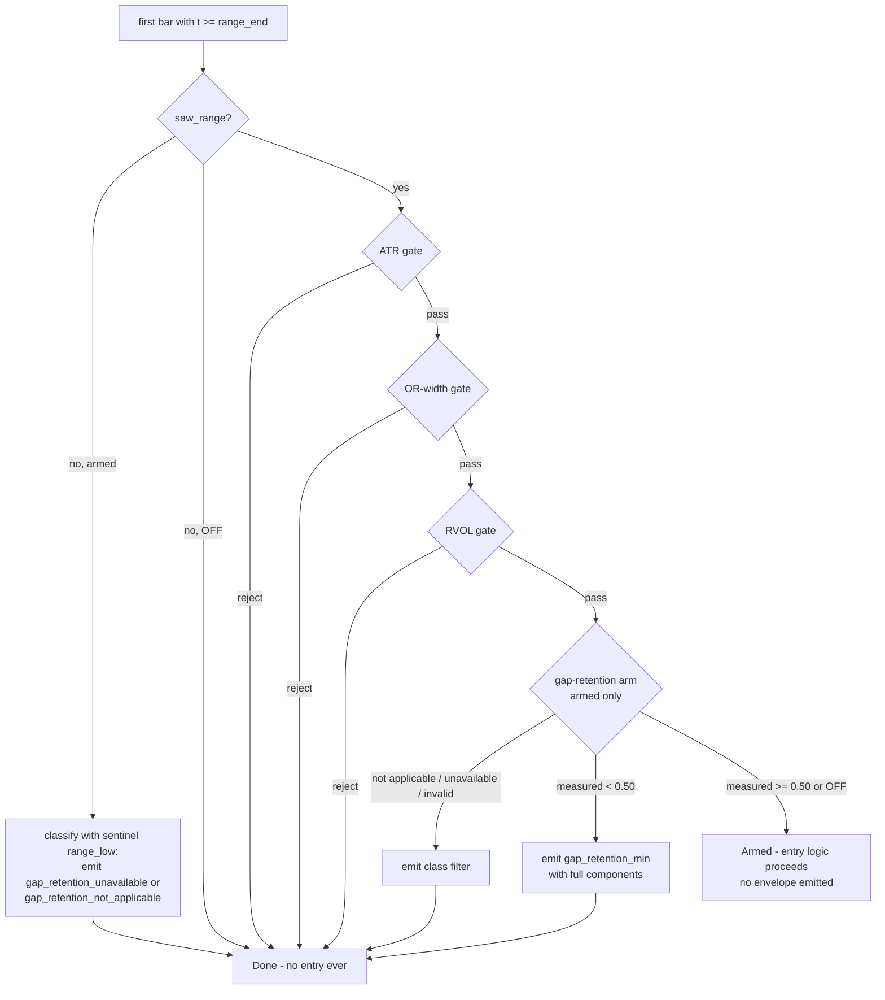

# Arm the Gap-Retention Session Gate - Plan

## Goal Capsule

- **Objective:** Implement issue #168 — make `0.50` the sole armed gap-retention cutoff and evaluate it exactly once as the final ORB session gate in the standalone Nautilus lab, with fail-closed classification, auditable rejection telemetry, quiet passes, and complete-session decision-stream tests.
- **Authority hierarchy:** The observable definition, cutoff, value semantics, and the four rejection filter names are frozen by the issue #165 spec and the committed candidate package (`adapters/nautilus/lab/candidates/opening-range-gap-retention/`) — this plan never restates or reopens them. This plan owns code placement, classification ordering, telemetry shape within the existing envelope convention, and test scope.
- **Execution profile:** Offline and deterministic — no gateway, credentials, or market window. All work is inside the standalone `adapters/nautilus/` workspace.
- **Stop conditions:** Any change to the OFF-path decision stream or trade behavior (the #167 byte-stability assertions must stay green untouched in meaning); any need to alter the frozen cutoff, filter names, or KEEP rule (reopen #165, don't improvise); any edit reaching a root-workspace crate (out of scope — stop and reassess).
- **Tail ownership:** Commit on a feature branch, open a PR closing #168. The follow-on governed turn (sentinel re-baseline + the one `1.0 → 0.50` flip) is issue #169's plan, not this one.

---

## Product Contract

### Summary

Arm the gap-retention entry filter that #167 seamed: compute the retention fraction from the canonical integer prices already threaded into ORB session state, evaluate it once as a new final arm of the existing session-gate function when `gap_retention_min = 0.50`, reject to Done through the existing `SessionReject` path with per-class telemetry, and leave passing sessions and the OFF path stream-identical to today.

### Problem Frame

Head v30 admits breakout entries after a positive overnight gap has substantially failed during the completed opening range. The lever chain froze the observable and cutoff (#165), recorded a Phase-A GO (#166), and landed the OFF seam (#167): `gap_retention_min` exists (serde default `1.0`, legacy-safe) but `OrbParams::validate` hard-rejects every other value, and the canonical `SessionGapPrices` inputs are carried but never read. #168 is the arming step — the last code change before #169's governed merit turn, which cannot run until `0.50` validates and the gate exists.

### Requirements

**Observable**

- R1. Retention is computed from canonical integer KRW/tick `opening_range_low`, `prior_close`, and `today_open`; only the final ratio is `f64`.
- R2. `opening_range_low` is the minimum valid low over the half-open window `[range_open, range_end)` and is frozen before the first post-range bar is evaluated — a post-range low can never alter the observation.
- R3. Negative retention stays signed, a prior-close touch is exactly `0.0`, full retention is exactly `1.0`, and an observed zero-width range remains a valid observation.

**Arming and validation**

- R4. Only `0.50` is armed and equality passes; `1.0` remains OFF and bypasses every retention read; no sweep, retune, companion parameter, or governance exception is introduced.

**Gate composition**

- R5. The armed filter evaluates exactly once, as the final session gate after the ATR, opening-range-width, and RVOL gates; rejection transitions the session directly to Done and prevents every later breakout or order.
- R6. Unavailable ranges, non-positive prior close, non-positive gaps, non-finite results, and values above one fail closed under the exact #165 filters: `gap_retention_min`, `gap_retention_unavailable`, `gap_retention_not_applicable`, `gap_retention_invalid`.

**Telemetry**

- R7. Measured and failure-class decisions record the cutoff and every available canonical component, with missingness expressed structurally (omitted keys), never as a numeric sentinel; passing sessions emit no new decision envelope.

**Tests and gates**

- R8. Complete-session decision-stream tests cover leakage, boundaries, all failure classes, gate ordering, single rejection, and OFF compatibility.
- R9. The standalone lab workspace tests and `make adapter-check` stay green.

### Scope Boundaries

- **Not here:** the governed sentinel re-baseline and `1.0 → 0.50` flip (issue #169, planned in `docs/plans/2026-07-17-001-feat-gap-retention-governed-turn-plan.md`); any cutoff retune, sweep, or companion parameter; changes to the candidate package, trials ledger, or TURN-LOG; the Production Ladder or any live/paper surface; root-workspace crates.
- **Unchanged existing behavior:** the first-post-range-bar-at-or-after-`flat_time` bypass skips all session gates today and continues to skip this one — instrumenting it is not part of #168's contract; OFF-path head-v30 run-level equivalence is proven by #169's one-to-one reconciliation, not here (here it is proven at decision-stream test level).

### Dependencies

- #167 merged (commit `4da3b41`) — the param, `SessionGapPrices`, and the constructor seam exist. Verified at planning time.
- #166's committed GO is untouched by this work; the candidate package tests (`adapters/nautilus/lab/tests/candidates.rs`, `tests/diagnose.rs`) must remain green without edits.

---

## Planning Contract

### Key Technical Decisions

- **KTD1 — `validate()` accepts exactly `{1.0, 0.50}`.** "No sweep" is enforced structurally, extending #167's exact-`1.0` comparison style. Both members are dyadic floats arriving via serde parse, so exact-set equality is safe here (the on-bound float-dust learning applies to loop-produced arithmetic, not to these literals); `NaN` and every other value keep failing validation. The check runs where it runs today — first in `validate()`, enforced at backtest start.
- **KTD2 — The observation reuses the already-frozen `range_low`.** `OrbState.range_low` is only ever written in the `t < range_end` branch of `on_bar`, so the freeze-before-first-post-range-bar requirement is structural, not new code. The gate reads `range_low` (never `session_low`, which keeps updating) and treats a sentinel or non-positive value as unavailable at read time — that is what "minimum **valid** low" costs under the existing accumulation, without a second tracker.
- **KTD3 — Classification is a pure, ordered function evaluated before any division:** not-applicable (`prior_close <= 0` or `today_open <= prior_close`, the #165 applicability precondition — this also covers the `SessionGapPrices::new(0, 0)` default) → unavailable (`range_low` at sentinel or non-positive) → compute the ratio on `i64` operands cast to `f64` → invalid (non-finite or above `1.0`) → measured (signed, compared `>= 0.50` with `partial_cmp`, `None` fail-closed). Ordering not-applicable first keeps a zero gap out of the divide, so it can never masquerade as invalid; canonical KRW/tick magnitudes are exact in `f64`, so a numerator exactly half the denominator yields exactly `0.5` and equality passes.
- **KTD4 — When armed, a session that never saw a range bar emits a gap-retention failure envelope before Done.** Today the `!saw_range` path rolls to Done silently, before `session_gate_reject` runs, and no gate instruments it. Leaving that as-is would make the unavailable class unreachable in any complete-session test, contradicting R8's "all failure classes" and #165's "missingness cannot silently pass". The hook routes through the KTD3 classifier with the sentinel `range_low`, so KTD3's ordering stays uniform everywhere: a positive-gap no-range session emits `gap_retention_unavailable`, while a no-range session that also fails the applicability precondition (e.g. a non-positive gap) emits `gap_retention_not_applicable`. The hook is gated on armed (`gap_retention_min != 1.0`), so the OFF stream is untouched and no other gate's behavior changes; the terminal outcome (Done, no trade) is identical either way — only telemetry is added.
- **KTD5 — Telemetry rides the existing `SessionReject { filter, values }` path** (landing as the `order_rejected_sizing` decision kind with `filter` set, like every session-gate rejection). A measured rejection records `retention`, `gap_retention_min`, `prior_close`, `today_open`, `range_low`; failure classes record the cutoff plus every component that exists, omitting the rest — the `values` map's omitted-keys convention is the repo's "no numeric missing sentinels" mechanism (the RVOL and universe `missing_metadata` precedents). Canonical integers are recorded as `f64` map values, exact at KRW/tick magnitudes. A non-finite retention is never inserted as a value.
- **KTD6 — The gate is arm 4 of `session_gate_reject`, guarded by the OFF bypass first.** When `gap_retention_min == 1.0` the arm does not read `gap_prices` or `range_low` at all (the sentinel-bypass convention of the other levers). First-failing-gate-records-only semantics are preserved: a session failing RVOL and retention records only the RVOL filter.

### High-Level Technical Design

Armed-session decision flow on the first post-range bar (OFF skips the shaded arm entirely; the no-range hook is KTD4):

### Sources & Research

- Gate machinery and precedents: `adapters/nautilus/lab/src/strategy/orb.rs` — phase machine and `range_low` accumulation (`on_bar`, the `t < range_end` branch), `session_gate_reject` (ATR → OR-width → RVOL arms; RVOL is the fail-closed precedent with a distinct missing-input filter), `SessionReject` construction and `handle_actions` emission, the `!saw_range` early-out, and the `#[expect(dead_code)]` on `gap_prices` that #168 removes.
- The #167 seam: `adapters/nautilus/lab/src/params.rs` (`gap_retention_min` default/validate/`numeric_summary`), `adapters/nautilus/lab/src/runner/backtest.rs` (`canonical_krw_ticks` sourcing — integers never pass through `f64`), `OrbState::with_session_inputs`.
- Envelope contract: `adapters/nautilus/lab/src/agent/envelope.rs` (`DecisionDetail.values: BTreeMap<String, f64>`, omitted-keys missingness); decisions stream to `decisions.jsonl` per run.
- Learnings: `docs/solutions/logic-errors/orb-atr-and-close-confirm-flip-preconditions.md` (non-positive inputs are first-class fail-closed classes; the suite stays green when a degenerate class is missing from the spec — enumerate the taxonomy before coding); `docs/solutions/logic-errors/bound-comparison-at-full-float-precision-denies-on-bound-values.md` (test boundaries with system-produced arithmetic, not literals); `docs/solutions/design-patterns/build-runtime-hash-parity-via-shared-include.md` and `docs/solutions/workflow-issues/cross-workspace-gate-blind-spot-sdk-preflight-changes-redden-adapter.md` (stale-binary and CWD traps).

---

## Implementation Units

### U1. Validation — admit the armed value

- **Goal:** `OrbParams::validate` accepts exactly `{1.0, 0.50}` for `gap_retention_min` and rejects everything else.
- **Requirements:** R4.
- **Dependencies:** none.
- **Files:** `adapters/nautilus/lab/src/params.rs` (validate arm and its in-file tests).
- **Approach:** Replace the #167 "not available yet" hard-reject with the exact-set check per KTD1; keep it the first check in `validate()`; update the error message to name the allowed set and the no-sweep rationale. `numeric_summary`, the default fn, and legacy-manifest defaulting are untouched.
- **Patterns to follow:** the existing `!= default_gap_retention_min()` comparison style and validate error wording in `params.rs`.
- **Test scenarios:** update `gap_retention_off_seam_is_manifest_recorded_and_legacy_safe` — `0.50` now validates; legacy manifest still resolves to `1.0`; `0.49`, `0.51`, `0.75`, `0.0`, negative, and `NaN` all still reject; `1.0` still validates.
- **Verification:** `cargo test -p nautilus-ls-lab params` green from `adapters/nautilus/`.

### U2. The retention observable — pure classification function

- **Goal:** A pure function in the strategy module that classifies a session's retention from `SessionGapPrices` and the frozen `range_low` into measured / not-applicable / unavailable / invalid per KTD3.
- **Requirements:** R1, R2 (read side), R3.
- **Dependencies:** none (parallel with U1).
- **Files:** `adapters/nautilus/lab/src/strategy/orb.rs` (function + in-file unit tests).
- **Approach:** Integer inputs throughout; the subtraction happens on `i64`, the cast to `f64` happens on the two difference operands, and only the quotient is the `f64` result. The classification enum is internal to the strategy module — no new public surface. Remove the `#[expect(dead_code)]` on `gap_prices` here or in U3, whichever touches it first.
- **Patterns to follow:** the small pure helpers already in `orb.rs` (e.g. `mfe_r`-style functions with dense in-file unit tests).
- **Test scenarios:**
  - Exact boundary passes, system-produced: prices where `(range_low - prior_close) * 2 == (today_open - prior_close)` classify measured `0.5`; one tick lower classifies measured below the cutoff.
  - Full retention: `range_low == today_open` gives exactly `1.0`; prior-close touch gives exactly `0.0`; `range_low < prior_close` gives a signed negative.
  - Zero-width range (range high equals low) still classifies measured — validity is not redefined.
  - Not-applicable: `prior_close <= 0` (including the `(0, 0)` default), `today_open == prior_close`, `today_open < prior_close` — each classified before any division.
  - Unavailable: `range_low` at the `i64::MAX` sentinel; `range_low <= 0`.
  - Invalid: `range_low > today_open` (retention above one). Non-finite is defensively classified invalid, with a test only if constructible from valid `i64` inputs — otherwise assert the not-applicable ordering makes it unreachable.
- **Verification:** unit tests green; the function is total (every `i64` input pair reaches exactly one class).

### U3. The armed gate arm, the no-range hook, and telemetry

- **Goal:** Evaluate the observable exactly once as the final session gate; reject to Done with per-class envelopes; keep OFF and passing paths quiet.
- **Requirements:** R2 (leakage), R5, R6, R7, R8.
- **Dependencies:** U1, U2.
- **Files:** `adapters/nautilus/lab/src/strategy/orb.rs`; `adapters/nautilus/lab/tests/strategy.rs`.
- **Approach:** Append arm 4 to `session_gate_reject` per KTD6 (OFF bypass checked before any read); map each class to its #165 filter with KTD5's values; add the armed-only `gap_retention_unavailable` emission on the `!saw_range` early-out per KTD4. Rejection reuses the existing `SessionReject` → Done transition — no new action variant, state, or phase.
- **Execution note:** extend the #167 complete-session template in `tests/strategy.rs` (drive full bar sequences through `with_session_inputs` and assert the exact action vector) — these are behavior-seam tests, not internals; the OFF-identity test from #167 must stay green unmodified.
- **Test scenarios (complete-session decision stream):**
  - Leakage: a post-range bar with a lower low than the range window — recorded `range_low` and the pass/reject outcome use the frozen value; the post-range low changes nothing.
  - Boundary pass: retention exactly `0.5` (system-produced prices) → no envelope, entry logic proceeds on that same bar's trigger rules.
  - Measured reject: retention one tick below → single `SessionReject { filter: "gap_retention_min" }` with all five values; phase Done; every later bar returns no actions; no order or breakout ever fires.
  - Each failure class end-to-end: non-positive gap session → `gap_retention_not_applicable`; no-range-bars session with a positive gap (armed) → `gap_retention_unavailable`; a no-range-bars session with a non-positive gap → `gap_retention_not_applicable` (the KTD4 hook routes through the classifier, so applicability wins); `range_low > today_open` session → `gap_retention_invalid` — each with the cutoff plus available components only, no absent key.
  - Gate ordering: a session failing both RVOL and retention records only the RVOL filter (first-failing-gate-records-only, mirroring the existing order test).
  - Single rejection: the retention rejection fires exactly once, never per-bar (the `entry_cutoff` precedent test shape).
  - OFF compatibility: armed-path tests aside, the #167 OFF complete-session identity test and the no-range OFF path (silent Done, no envelope) stay exactly as they are.
- **Verification:** `cargo test -p nautilus-ls-lab --test strategy` green from `adapters/nautilus/`; no existing assertion weakened.

### U4. Engine-seam coverage and the workspace gates

- **Goal:** Prove the gate through the full backtest seam and land the change green.
- **Requirements:** R8 (engine level), R9.
- **Dependencies:** U3.
- **Files:** `adapters/nautilus/lab/tests/backtest_run.rs`.
- **Approach:** Add an armed-config backtest over a reject-shaped variant of the parquet fixture asserting a `gap_retention_*` filter appears in `decisions.jsonl` and the run still finalizes; assert `params_hash_or_summary` carries `gap_retention_min = 0.5` on armed envelopes. The existing fixture's prices (prior close 60,000 → open 63,000, range low 62,500) yield retention ≈ 0.833, which passes the armed gate — so parameterize `build_fixture`'s opening-range minute lows (e.g. a 61,000 range low gives retention ≈ 0.333) such that measured retention fails while the gap still clears universe selection; the shared OFF fixture stays untouched. The existing OFF assertions (exactly five decision kinds, no `gap_retention` filter, summary carries `1.0`) stay untouched. `tests/live_wiring.rs`, `tests/candidates.rs`, `tests/diagnose.rs`, and everything under `src/dispatch/` need no edits — their staying green is part of the verification.
- **Test scenarios:** armed full backtest emits at least one gap-retention decision for a fixture shaped to reject (pick fixture prices so retention fails measured); OFF full backtest stream is unchanged from today; armed run finalizes and registers normally.
- **Verification:** the full Verification Contract below; the diff contains no file outside `adapters/nautilus/lab/`.

---

## Verification Contract

| Gate | Command | When |
|---|---|---|
| Lab-targeted iteration | `cargo test -p nautilus-ls-lab` (add `--test strategy` / `--test backtest_run` while iterating) | U1–U4, run from `adapters/nautilus/` — repo-root invocations hit the wrong workspace |
| Standalone workspace | `cargo test --workspace` from `adapters/nautilus/` | before commit |
| Adapter gate | `make adapter-check` from repo root | before commit (same suite CI runs) |
| Root gate | not required — no root-workspace file is touched; if any is, stop per the Goal Capsule | — |

---

## Risks

- **`strategy_code_hash` moves — expected, not a defect.** The hash covers exactly `orb.rs`, so this change re-keys it; `runs compare` FAILs across the hash and ladder readiness disqualifies prior sessions by design. #169's sentinel re-baseline exists precisely to absorb this. Do not refactor `orb.rs` beyond the gate — every extra token of diff is re-baseline surface.
- **OFF-stream regressions are the failure mode to fear.** The #167 byte-stability assertions (five decision kinds, no `gap_retention` filter at OFF) are the tripwire; if any OFF test needs editing to pass, the seam is broken — stop, don't adjust the test.
- **Stale-binary trap for any manual run:** build with `cargo build --release -p nautilus-ls-lab` from `adapters/nautilus/` and verify the new symbol (`strings <bin> | grep -c gap_retention`) before trusting output — background builds from repo root fail silently and leave old code running.

---

## Definition of Done

- All nine requirements hold, one-to-one with issue #168's acceptance criteria, each backed by a named test or gate run.
- The four #165 filter strings appear verbatim in code and tests; no fifth filter, parameter, or config knob was introduced.
- `0.50` validates, `1.0` stays OFF, everything else rejects; the OFF decision stream is unchanged.
- Verification Contract green; the branch is committed with an evidence-clean diff (no scratch files, no unrelated `orb.rs` movement) and a PR is open closing #168.
