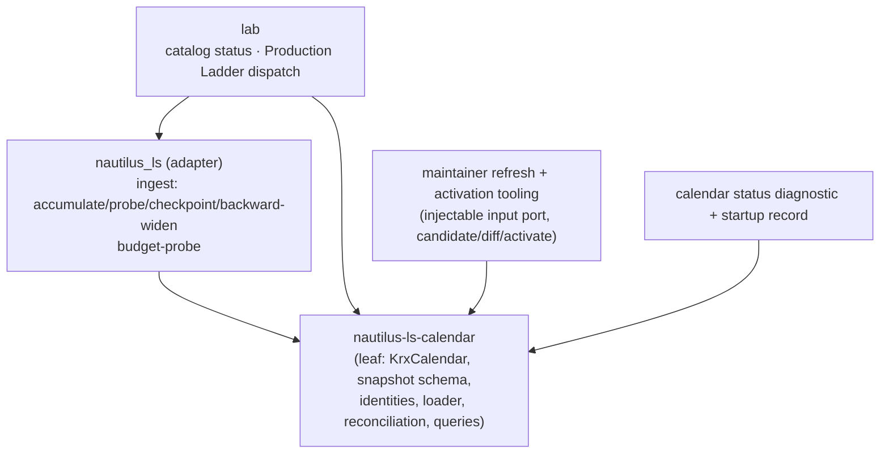
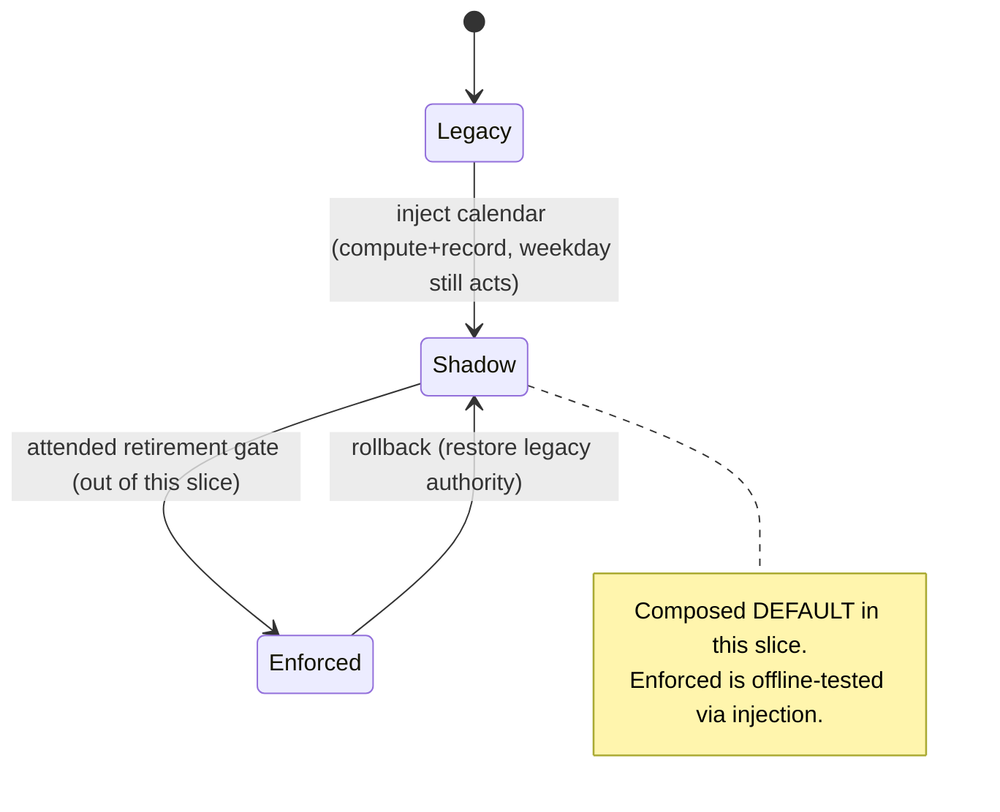
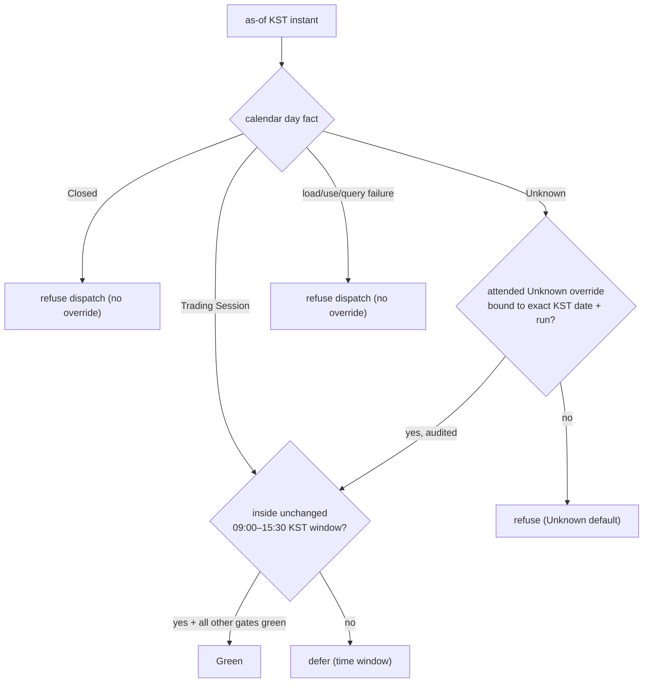

# feat: Build and operate the shared offline KRX calendar

## Summary

Deliver issue #185 as one operable, offline vertical slice: a shared **credential-free runtime calendar** for the standalone Nautilus workspace, plus separate **maintainer refresh + activation tooling**. Adapter and lab consumers read one immutable, explicitly-configured JSON snapshot, get proof-preserving **Trading Session / Closed / Unknown** day and range facts, and never fall back to weekday arithmetic in enforced paths. Maintainers refresh official evidence into reviewed, atomically-activated snapshots without publishing any KRX-derived rows.

The work adds a new **leaf crate `nautilus-ls-calendar`** (depended on by both `nautilus_ls` and `lab`), migrates the six calendar-dependent consumer boundaries behind a per-consumer **Legacy / Shadow / Enforced** adoption seam, and ships a `calendar status` diagnostic. Everything passes `make adapter-check` offline with fixed clocks, no production snapshot, no credentials, no network, and no real KRX-derived rows.

**Confirmed scope decision (2026-07-19):** all three adoption states are implemented and offline-tested per consumer, but the **live default is Shadow** — calendar decisions are computed and recorded while the existing weekday path stays authoritative. Live cutover to Enforced and removal of the weekday primitives is deferred to the operator-attended Calendar Foundation Gate + Consumer Retirement Gate + owner canary (out of this offline slice, per #184).

**Product Contract preservation:** origin is GitHub issues #184/#185, not a `ce-brainstorm` doc; this plan treats them as the authoritative requirements and does not alter their product scope.

---

## Problem Frame

The standalone adapter and lab decide "is there a KRX domestic-equity regular session on this civil date?" with Monday–Friday arithmetic or raw civil-date comparisons scattered across five distinct weekday primitives, migrated across six consumer boundaries (the ingest accumulate and probe boundaries share the `last_closed_session` primitive — see Research below for the full mapping). That approximation can create **unsafe state**: an unproven empty ingest date marked covered, a weekday closure making catalog readiness report wrong, a holiday wasting a gateway-budget probe, and a weekday-only Production Ladder gate authorizing dispatch on a closed or evidentially unknown date. Operators compensate with manual holiday confirmation and date overrides that provide no shared fact source, no provenance, and cannot distinguish a proven closure from missing evidence.

The source landscape makes this more than a holiday table: KRX's daily-market API can positively witness elapsed Trading Sessions from 2010 onward, but an empty response cannot prove Closed; KASI holiday facts plus published KRX rules establish scheduled closures; exceptional closures require cited first-party notices; and current KRX terms do not authorize publishing a normalized snapshot derived from KRX data. The calendar must therefore preserve **Trading Session, Closed, and Unknown as distinct outcomes**, remain runtime-offline, and keep the production artifact approved-user-local.

**Trading Session status** is already the canonical domain term (CONCEPTS.md): Trading Session / Closed / Unknown, where Unknown is a successful factual result never collapsed into Closed, and each consumer applies its own safety posture.

---

## Scope Boundaries

### In scope
- The `nautilus-ls-calendar` leaf crate: snapshot schema + normalized types, canonicalization, deterministic identity hashing, parsing, validation with typed failures, evidence reconciliation, and immutable factual day/range/coverage/freshness/evidence/alert queries.
- The KRX daily-market positive-witness rule and the settled fact-specific authority matrix.
- Synthetic, counterfactual public fixtures + core contract tests + boundary-time tests.
- Migration of all six consumer boundaries behind a per-consumer Legacy/Shadow/Enforced adoption seam, with Enforced offline-tested (no weekday fallback) and Shadow as the composed default.
- Maintainer refresh tooling with an **injectable input port** (KRX positive evidence, KASI inputs, deterministic rules, citation-only notices; incremental + full-history modes; source-failure retention), producing a candidate + deterministic categorized diff, never overwriting the active snapshot.
- Activation tooling: revalidate candidate + predecessor, record approval, atomic install; refuse stale-base / invalid / unreviewed / absence-driven destructive candidates.
- The `calendar status --as-of` diagnostic (stable human + JSON, credential/authorization redaction) and a concise mandatory startup calendar record per affected process.

### Out of scope (non-goals)
- Live network access to KRX/KASI at runtime **or** in the offline gate; live snapshot fetching. The refresh tool's transport is an injectable port; the gate exercises it with synthetic inputs only.
- Session opening/closing hours, auction phases, after-hours, intraday halts, derivatives, bonds, overseas venues.
- Publishing, packaging, or sharing any KRX-derived calendar rows.
- Automatic discovery of first-party exceptional-closure notices (they enter via the reviewed citation-only workflow).
- Hot reload, global mutable calendar state, or automatic candidate activation.

### Deferred to Follow-Up Work (planned, separate from this slice)
- The **live** Calendar Foundation Gate execution, per-consumer Consumer Retirement Gate, owner-local canary, restart-after-activation, and rehearsed rollback — all operator-attended and live.
- Flipping any consumer's composed default from Shadow to Enforced and removing the weekday primitives / manual holiday checkboxes.
- Producing the real approved-user-local production snapshot (a maintainer-run operation using the U14/U15 tooling with live credentials).
- Retiring the catalog "undetectable holidays" paper-cut record after its gate passes.

---

## Key Technical Decisions

**KTD1 — `nautilus-ls-calendar` is a leaf crate.** `lab` already depends on `nautilus_ls` (documented cycle constraint in the adapter `Cargo.toml`). The calendar crate must be depended on by **both**, so it depends on neither — it is a pure domain leaf (`serde`, `serde_json`, `chrono`, `chrono-tz`, `sha2`, `thiserror` only). Added to `adapters/nautilus/Cargo.toml` `[workspace] members`. No root-workspace edit (the adapter is already standalone).

**KTD2 — One concrete immutable `KrxCalendar`, no public trait.** Production and tests vary validated *input data*, not calendar behavior. Tests load the same concrete type via fixtures. The adapter's existing internal `TradingCalendar` seam (`dispatch/checks.rs:41-44`) is a *consumer-side* adapter onto `KrxCalendar`, not the calendar's public API — this satisfies "no public fake-calendar trait."

**KTD3 — Load/use/query failures are typed error classes, never Unknown.** Missing, unreadable, corrupt, schema-incompatible, hash-mismatched, unauthorized, expired, and out-of-range conditions return distinct typed errors. Unknown is reserved exclusively for a successful factual result where maintained evidence does not cover the date.

**KTD4 — Two deterministic identities.** `artifact_id` = hash of canonical snapshot content **excluding its own identity field** (any content change moves it). `calendar_id` = hash of **effective statuses + decisive claim identities**, excluding retrieval mechanics (only effective calendar/proof changes move it). SemVer for schema compatibility. Reuse the SHA-256 shape already used by `lab` manifest hashing / the dispatch chain, implemented locally in the crate.

**KTD5 — Explicit as-of view.** Authorization and freshness are evaluated at a **caller-supplied UTC instant**, never a hidden clock. Long-lived processes create a new view without reloading the artifact. This is the fixed-clock injection seam the offline gate depends on.

**KTD6 — Fact-specific authority matrix (settled).** A KRX positive witness overrides an inferred closure **with an alert**; a positive witness vs. a direct first-party KRX closure notice produces **Unknown + alert**; a later empty/malformed response **never** retracts accepted positive evidence; conflicting first-party evidence produces Unknown + alert; explicit corrections supersede only *identified* evidence (no generic newest-wins); human adjudication changes only evidence validity/supersession (never writes a status directly). See the decision matrix in HTD.

**KTD7 — KRX `stk_bydd_trd` positive-witness only, from 2010-01-04.** Accept only a successful, structurally valid response whose dates match the request and contain a qualifying KOSPI row. Empty, malformed, failed, mismatched, or error-envelope responses are non-evidence — they never prove Closed and never retract a prior positive witness by absence.

**KTD8 — Per-consumer adoption seam, composed default = Shadow.** A `CalendarAdoption { Legacy, Shadow, Enforced }` value per consumer. Legacy = weekday path unchanged; Shadow = compute + record the calendar decision but leave the legacy action authoritative; Enforced = calendar decides with **no weekday fallback**. Composition roots inject Shadow by default in this slice; tests inject Enforced to prove enforced behavior and failure-inversion.

**Shadow degradation contract (non-fatal, must-specify):** because the real production snapshot is deferred to a maintainer U14/U15 run, at slice-deploy time the configured snapshot path is normally **absent**. In Shadow, an absent path or **any** typed `CalendarLoadError` is non-fatal: the process records "calendar unavailable" in its startup record, yields authority to the weekday path, and starts cleanly. A load failure never blocks startup in Shadow (only Enforced fails closed). Every Shadow calendar recording is emitted **only to a non-persisted diagnostic channel** — never to a tracked or persisted artifact a Legacy reader consumes — so "byte-identical to Legacy" holds even when the calendar decision disagrees with, or is unavailable to, the weekday path.

**KTD9 — Refresh transport is an injectable input port.** The calendar core never depends on transport/refresh. Refresh depends on the core and takes normalized evidence through a port that the offline suite feeds with synthetic inputs. Credentials enter only via a named gitignored maintainer env file / process env; raw KRX responses are never persisted. Production snapshot path lives under the already-gitignored `/data` (or `/state`) tree.

**KTD10 — Fixed-clock, param-injected tests.** Follow the established convention: dates are explicit function parameters and the as-of instant is injected (no `tokio::time` for calendar logic). Fixtures are inline builders + a checked-in canonical base snapshot, all explicitly synthetic/counterfactual.

---

## High-Level Technical Design

### Crate & consumer dependency graph



The calendar crate is the base; `lab → nautilus_ls → nautilus-ls-calendar` and `lab → nautilus-ls-calendar` are both acyclic because the calendar depends on nothing in the workspace.

### Evidence reconciliation authority matrix (KTD6)

| Situation | Inputs | Reconciled outcome |
|-----------|--------|--------------------|
| KRX positive witness on an otherwise-inferred closure | KRX `stk_bydd_trd` valid + inferred-closed rule | **Trading Session** + alert (observed operation wins, disagreement retained) |
| KRX positive witness vs. direct first-party KRX closure notice | valid witness + cited closure notice | **Unknown** + alert (unresolved first-party conflict) |
| Later empty/malformed KRX response after an accepted positive witness | prior valid witness + new empty | **Trading Session preserved** + alert (absence never retracts) |
| KASI public holiday + applicable published KRX rule | KASI fact + KRX rule | **Closed** (rule connects the holiday to the scoped session) |
| Weekend / Labor Day / year-end per published KRX rule | deterministic rule | **Closed** (scheduled closure, rule authority) |
| Exceptional closure | cited first-party notice only | **Closed** (no bare status override; citation required) |
| Conflicting first-party evidence | two first-party claims disagree | **Unknown** + alert |
| Explicit correction | correction targeting identified evidence | supersede only the identified claim (never generic newest-wins) |
| Human adjudication | rationale + citation + maintainer identity | change validity/supersession only; cannot write a status |
| No covering evidence | — | **Unknown** (successful factual result) |

### Per-consumer adoption state machine (KTD8)



### Production Ladder date-gate flow (U12) — split the fused `window_open`



Today `window_open: bool` (`checks.rs:127`, set at `runner/live.rs:451`) fuses the weekend date test and the time-of-day window (`checks.rs:55-61`). U12 splits these: the calendar owns the **date fact**; the existing 09:00–15:30 KST minute window is preserved unchanged.

---

## Output Structure

New crate (exact module split may adjust during implementation; per-unit `Files:` are authoritative):

```
adapters/nautilus/nautilus-ls-calendar/
  Cargo.toml
  src/
    lib.rs                # public surface: KrxCalendar, AsOfView, errors, query results
    schema.rs             # serde snapshot types + tri-state DayStatus + coverage/freshness/auth
    canonical.rs          # canonicalization + artifact_id / calendar_id hashing (KTD4)
    load.rs               # parse + validate, typed CalendarLoadError (KTD3)
    query.rs              # as-of view, day/range constructors, proof-preserving aggregates
    reconcile.rs          # evidence authority matrix (KTD6)
    witness.rs            # KRX stk_bydd_trd positive-witness rule (KTD7)
    diagnostics.rs        # normalized diagnostic records + redaction
  fixtures/
    base_2010_2012.json   # checked-in synthetic base snapshot (all named scenarios)
  tests/
    contract.rs           # core contract + reconciliation + query + identity tests
    errors.rs             # typed-failure tests (none become Unknown)
    boundary_time.rs      # 14/120/45-day, two-missed, auth-expiry both-sides tests
    refresh_activation.rs # candidate/diff/high-risk/predecessor/atomic/retention tests
```

Consumer migrations and the diagnostic/refresh tooling modify existing files under `adapters/nautilus/src/`, `adapters/nautilus/lab/src/`, and add a small composition/CLI surface (per-unit `Files:` below).

---

## Implementation Units

Grouped into four phases. Phase A (U1–U7) is the calendar core and must land first; Phase B (U8) adds diagnostics/composition; Phase C (U9–U13) migrates consumers (each depends only on Phase A/B, so C units are mutually independent and parallelizable); Phase D (U14–U15) adds maintainer tooling.

### U1. Calendar crate skeleton + snapshot schema types

**Goal:** Create the leaf crate and the self-contained snapshot schema types with the tri-state day status. No behavior yet beyond serde round-trip.

**Requirements:** #185 AC1, AC2, AC8 (coverage-claim distinctness); #184 US18, US20; KTD1, KTD2.

**Dependencies:** none.

**Files:**
- Create `adapters/nautilus/nautilus-ls-calendar/Cargo.toml`
- Create `adapters/nautilus/nautilus-ls-calendar/src/lib.rs`
- Create `adapters/nautilus/nautilus-ls-calendar/src/schema.rs`
- Modify `adapters/nautilus/Cargo.toml` (add crate to `[workspace] members`)
- Test: `adapters/nautilus/nautilus-ls-calendar/tests/contract.rs` (schema round-trip only in this unit)

**Approach:** Define serde structs for schema identity + `artifact_id` + `calendar_id`, calendar scope, authorization (with recorded expiry/termination), coverage claims (materialized-through, retrospectively-checked-through, scheduled-closure-evaluated-through, source-specific availability bounds — kept distinct), freshness dimensions, normalized sources, evidence records, alerts, one tri-state row per civil date, and a predecessor `artifact_id`. Tri-state `DayStatus { TradingSession, Closed, Unknown }`. Rows carry only date, status, decisive evidence refs, conflicting evidence refs, alert refs. Keep the crate dependency set minimal (KTD1). Verify it compiles as a workspace member without breaking `make adapter-check`.

**Patterns to follow:** the adapter's `serde`/`serde_json` struct conventions; `lab/src/artifacts/manifest.rs` (`hash_bytes`, imported as `crate::artifacts::manifest::hash_bytes`) for hash-shaped struct organization.

**Execution note:** Start from a failing serde round-trip test for the schema, then add fields until it passes — this pins the JSON shape before later units depend on it.

**Test scenarios:**
- Happy: a hand-built minimal snapshot serializes and deserializes byte-preserving for the fields that matter.
- Edge: an Unknown-status row and a row with empty evidence refs round-trip distinctly from an absent row.
- Error: a snapshot JSON missing a required top-level section fails to deserialize (serde error, not a panic).

**Verification:** `cargo test -p nautilus-ls-calendar` passes the round-trip; `make adapter-check` still green.

### U2. Canonicalization + deterministic identities

**Goal:** Compute `artifact_id` and `calendar_id` deterministically with SemVer schema compatibility.

**Requirements:** #185 AC2; #184 US20; KTD4.

**Dependencies:** U1.

**Files:**
- Create `adapters/nautilus/nautilus-ls-calendar/src/canonical.rs`
- Modify `adapters/nautilus/nautilus-ls-calendar/src/lib.rs`
- Test: `adapters/nautilus/nautilus-ls-calendar/tests/contract.rs`

**Approach:** Canonicalize the snapshot (stable field ordering, normalized number/string forms) excluding the identity field, hash with SHA-256 → `artifact_id`. Separately project effective statuses + decisive claim identities (excluding retrieval mechanics like fetch timestamps and source-availability bounds) → `calendar_id`. Encode a SemVer schema version and a compatibility predicate. Implement hashing locally in-crate (KTD4).

**Patterns to follow:** SHA-256 chain hashing in `lab/src/dispatch/chain.rs` (`record_hash`) and `lab` manifest `hash_bytes` shape.

**Execution note:** Prove determinism first — same content two ways must hash identically; a provenance-only change must move `artifact_id` but not `calendar_id`.

**Test scenarios:**
- Happy: identical content computes identical `artifact_id` and `calendar_id`.
- Edge: changing only a retrieval timestamp / source-availability bound moves `artifact_id` but **not** `calendar_id`.
- Edge: changing a single effective day status moves both identities.
- Error: an unsupported SemVer major version fails the compatibility predicate.

**Verification:** identity determinism and the provenance-vs-effective split are asserted in `contract.rs`.

### U3. Loader + validation with typed failures

**Goal:** Load a snapshot from an explicit path, validate every invariant, and return typed errors that never masquerade as Unknown.

**Requirements:** #185 AC3; #184 US6, US7; KTD3, KTD5.

**Dependencies:** U1, U2.

**Files:**
- Create `adapters/nautilus/nautilus-ls-calendar/src/load.rs`
- Modify `adapters/nautilus/nautilus-ls-calendar/src/lib.rs`
- Test: `adapters/nautilus/nautilus-ls-calendar/tests/errors.rs`

**Approach:** Validate schema compatibility, deterministic identity recomputation (declared vs computed), canonical ordering, unique contiguous dates (no gaps/dupes across the materialized window), evidence reference integrity (no dangling refs), coverage invariants (impossible-coverage rejected), and current authorization at a supplied as-of instant. Define a `CalendarLoadError` enum with distinct variants: missing, unreadable, corrupt, unsupported-schema, hash-mismatch, unauthorized, expired, out-of-range, gapped, duplicated, dangling-reference, impossible-coverage. Loading takes an explicit path (no default path, no env read, no singleton, no file watch, no hot reload).

**Patterns to follow:** `thiserror`-based error enums already used across the adapter; typed `LsError::Invalid` philosophy in CONCEPTS.md (fail before proceeding, never silently degrade).

**Execution note:** Characterization-style — write one failing test per error variant first; each must resolve to its typed variant and **never** to an Unknown day fact.

**Test scenarios:**
- Happy: a valid canonical snapshot loads and exposes the declared identities and coverage.
- Error (one each, all typed, none Unknown): missing file, unreadable, corrupt JSON, unsupported schema major, recomputed-hash mismatch, unauthorized, expired authorization, gapped dates, duplicated date, dangling evidence ref, impossible coverage (retrospectively-checked-through beyond materialized-through), out-of-range query target after load.
- Edge: authorization exactly at the recorded expiry instant (boundary) — both sides tested.

**Verification:** `errors.rs` proves each failure is its own typed variant; a grep-style assertion confirms no error path yields `DayStatus::Unknown`.

### U4. As-of view + proof-preserving day/range queries

**Goal:** Expose the immutable factual query surface: day facts and range results at an explicit as-of instant, with proof preserved.

**Requirements:** #185 AC4, AC7; #184 US1–US3, US26, US27; KTD5.

**Dependencies:** U1, U3.

**Files:**
- Create `adapters/nautilus/nautilus-ls-calendar/src/query.rs`
- Modify `adapters/nautilus/nautilus-ls-calendar/src/lib.rs`
- Test: `adapters/nautilus/nautilus-ls-calendar/tests/contract.rs`

**Approach:** `AsOfView` created from a loaded `KrxCalendar` + a caller-supplied UTC instant (evaluates authorization + freshness, no reload). Day query returns Trading Session / Closed / Unknown plus typed evidence + alert references. Range constructors: checked **inclusive**, **half-open**, and **strictly-between**, all normalized to one canonical inclusive span internally, with endpoint-conversion and date-overflow handled by checked constructors. Range queries require **every** civil date in the span to be materialized (no truncation, gap-fill, weekday synthesis, or silent repair). Aggregates preserve proof: presence is `Present | Absent(proven) | Indeterminate`; first/last-session search is `Found | None(proven) | Indeterminate`. Callers obtain normalized diagnostic records via typed lookups, never by parsing JSON. No network, no secret loading.

**Patterns to follow:** `chrono::NaiveDate` civil-date usage already pervasive in `src/ingest/`; typed-result enums as in the dispatch `GateResult`.

**Execution note:** Implement the tri-state aggregates test-first — an Unknown inside a range must not collapse a presence or first/last-session answer.

**Test scenarios:**
- Happy: Trading Session, Closed, and Unknown day facts each return with their evidence/alert refs.
- Range presence: a span with a Trading Session → Present; an all-Closed span → Absent(proven); a span containing an Unknown → Indeterminate (never Absent).
- First/last-session: Found on a real session; proven None on an all-Closed span; Indeterminate when an Unknown sits at the boundary.
- Edge: inclusive vs half-open vs strictly-between over the same endpoints yield the correct canonical spans; single-day and empty half-open spans; overflow at the materialization boundary.
- Error: a range extending past the materialized window returns a typed out-of-range error, not a truncated result or Unknown.
- Covers AE (US27): Unknown dates cannot be collapsed by aggregation.

**Verification:** `contract.rs` covers all three range forms and the proof-preserving aggregates; no synthesis/repair path exists.

### U5. Evidence reconciliation authority matrix

**Goal:** Reconcile normalized evidence into tri-state statuses per the settled fact-specific authority matrix, emitting alerts.

**Requirements:** #185 AC5; #184 US10–US17; KTD6.

**Dependencies:** U1 (schema — `DayStatus`, alert + evidence-ref types are authored here, not in U4).

**Files:**
- Create `adapters/nautilus/nautilus-ls-calendar/src/reconcile.rs`
- Modify `adapters/nautilus/nautilus-ls-calendar/src/lib.rs`
- Test: `adapters/nautilus/nautilus-ls-calendar/tests/contract.rs`

**Approach:** Given a date's evidence set (KRX positive witnesses, KASI facts, deterministic KRX rules, cited first-party notices, corrections, human adjudications), compute the decisive status + decisive/conflicting refs + alerts per the HTD matrix. KRX positive witness overrides inferred closure (+alert); witness vs. direct closure notice → Unknown (+alert); corrections supersede only identified evidence; human adjudication changes validity/supersession only. This is the pure reconciliation function the refresh tooling (U14) will call; it does not do transport or I/O.

**Patterns to follow:** pure decision functions like `dispatch/checks.rs::decide`; keep it side-effect-free and unit-testable.

**Execution note:** Implement each matrix row test-first; this is the correctness heart of the slice.

**Test scenarios (one per matrix row + alerts):**
- Positive witness over inferred closure → Trading Session + alert.
- Positive witness vs. first-party closure notice → Unknown + alert.
- Later empty response after accepted witness → Trading Session preserved + alert.
- KASI holiday + applicable KRX rule → Closed; KASI holiday with no connecting rule → not Closed.
- Weekend / Labor Day / year-end rule → Closed with rule authority.
- Exceptional closure with cited notice → Closed; bare status attempt with no citation → rejected.
- Two conflicting first-party claims → Unknown + alert.
- Correction supersedes only the identified evidence (a sibling claim is untouched).
- Human adjudication invalidates evidence but cannot set a status directly.
- No covering evidence → Unknown.

**Verification:** every authority-matrix row and its alert are asserted in `contract.rs`.

### U6. KRX daily-market positive-witness rule

**Goal:** Turn a KRX `stk_bydd_trd` response into a positive Trading Session witness only when it qualifies; otherwise non-evidence.

**Requirements:** #185 AC6; #184 US8, US9; KTD7.

**Dependencies:** U1, U5.

**Files:**
- Create `adapters/nautilus/nautilus-ls-calendar/src/witness.rs`
- Modify `adapters/nautilus/nautilus-ls-calendar/src/lib.rs`
- Test: `adapters/nautilus/nautilus-ls-calendar/tests/contract.rs`

**Approach:** Accept only a successful, structurally valid response whose returned dates match the requested date and that contains a qualifying KOSPI row, valid from 2010-01-04 onward. Empty, malformed, failed, mismatched, or error-envelope responses produce **no** evidence — they never prove Closed and never retract a prior positive witness by absence. The rule consumes an already-parsed response shape (synthetic in tests), not a live call.

**Patterns to follow:** the tolerant response parsing in `ls-sdk` market-session structs; date-matching discipline.

**Execution note:** Test the non-evidence cases first — the safety property is that absence and malformation never manufacture a Closed or a retraction.

**Test scenarios:**
- Happy: a valid non-empty response with a qualifying KOSPI row on the requested date → positive Trading Session witness.
- Non-evidence (each yields no witness, no Closed, no retraction): empty response, malformed body, failed/error-envelope response, date-mismatched response, pre-2010 date.
- Integration with U5: a later empty response does not retract an earlier accepted witness.

**Verification:** `contract.rs` proves qualifying → witness and every degenerate response → non-evidence.

### U7. Synthetic fixture corpus + core boundary-time tests

**Goal:** Ship the explicitly-synthetic, counterfactual public fixture corpus and the boundary-time tests, exercising every named scenario through the production parser/validator/reconciler.

**Requirements:** #185 AC8 (freshness never rewrites status), AC9, AC11, AC16; #184 US25, US53, US54, US55; testing decisions (base fixture, named scenarios, boundary times).

**Dependencies:** U3, U4, U5, U6.

**Files:**
- Create `adapters/nautilus/nautilus-ls-calendar/fixtures/base_2010_2012.json`
- Create `adapters/nautilus/nautilus-ls-calendar/tests/boundary_time.rs`
- Modify `adapters/nautilus/nautilus-ls-calendar/tests/contract.rs`

**Approach:** A base snapshot materializing every date 2010-01-01…2012-12-31, most weekdays Unknown, with only named scenario evidence added — deliberately unusable as a production calendar and clearly labeled synthetic/counterfactual (fixtures, citations, sources, evidence all marked). Cover: ordinary sessions, weekends, a weekday election closure, Labor Day, a multi-day holiday cluster, an exceptional closure, an isolated Unknown, year-end closure, both materialization boundaries, inferred-source disagreement, first-party disagreement, and a retrospective correction pair. Boundary-time tests use a fixed as-of instant and prove **both sides** of the 14-day (KASI), 120-day (full-history), 45-day (forward-readiness), two-missed-opportunity (incremental), and authorization-expiry thresholds — staleness must not rewrite status.

**Patterns to follow:** inline `serde_json::json!` fixture bodies + fixed-`NaiveDate`/fixed-instant injection already used in `tests/ingest.rs` and `lab/tests/`.

**Execution note:** Load fixtures through the **real** `KrxCalendar` loader — no fake calendar, no unchecked bypass.

**Test scenarios:**
- Every named scenario above loads through the production parser and produces its expected tri-state status + alerts.
- Each freshness threshold: as-of one tick before → not stale; one tick after → stale, **status unchanged**.
- Authorization expiry: valid one tick before, `Expired` typed error one tick after.
- The base fixture cannot be mistaken for a real KRX calendar (assertion on the synthetic marker + pervasive Unknown weekdays).

**Verification:** `boundary_time.rs` asserts both sides of all five thresholds; the fixture corpus drives the named-scenario contract tests.

### U8. `calendar status` diagnostic + composition-root injection + startup record

**Goal:** A stable human + JSON preflight and a mandatory concise startup calendar record, wired through a composition root that resolves an explicit path and injects one calendar.

**Requirements:** #185 AC10; #184 US46, US47, US48; KTD5, KTD9.

**Dependencies:** U3, U4.

**Files:**
- Create `adapters/nautilus/nautilus-ls-calendar/src/diagnostics.rs`
- Create a small CLI/composition surface, e.g. `adapters/nautilus/src/bin/calendar-status.rs` (or a subcommand on an existing binary — implementer's call)
- Modify affected process entrypoints to emit the startup record (e.g. `adapters/nautilus/src/bin/ls-ingest.rs`, `adapters/nautilus/src/bin/budget-probe.rs`, `adapters/nautilus/lab/src/runner/live.rs`, `adapters/nautilus/lab/src/runner/research.rs`) — startup record only in this unit; the decision migrations are U9–U13
- Test: `adapters/nautilus/nautilus-ls-calendar/tests/contract.rs` (diagnostic contract), `adapters/nautilus/tests/` composition-root smoke

**Approach:** `calendar status --as-of <instant>` produces stable human-readable and JSON output covering healthy, stale, Unknown, conflict, coverage, load, use, and query outcomes, **redacting** credentials and authorization identities. Redact authorization/maintainer identities by **explicit field-level omission/masking in `diagnostics.rs`** (drop or hash the identity fields when rendering) — do **not** rely on passing rendered text through the `src/scrub.rs` token heuristic, which only catches account-number (6+ digit) and long-token (20+ alphanumeric) shapes and would let a maintainer name or agreement identity through. Each affected process emits a concise startup record naming its consumer, Calendar Adoption State, snapshot identities, authorization state, coverage, relevant freshness, query result, alerts, and resulting action — also redacted. Composition roots resolve an explicit snapshot path, load once, and inject the calendar (no default path, no env-driven path selection inside the core). Per the KTD8 Shadow degradation contract, a missing/failed snapshot in Shadow is a recorded "calendar unavailable" startup record that leaves the weekday path authoritative and does **not** block startup.

**Patterns to follow:** the report-line printing in `runner/live.rs::dispatch_main`; the credential scrubber at `src/scrub.rs` (note: its `install()` wraps only the panic hook and its heuristic does not catch identity strings — see field-level omission above); env-driven config resolution in `src/config.rs` (path resolved at the composition root, not in the core).

**Execution note:** Assert redaction explicitly — a diagnostic that leaks a credential or agreement identity is a security failure.

**Test scenarios:**
- Stable human + JSON output for each case: healthy, stale, Unknown, conflict, out-of-range, missing, corrupt, incompatible, unauthorized, expired.
- Redaction: no credential or authorization identity appears in either output form; specifically, a maintainer/agreement identity that would defeat the `scrub.rs` heuristic is dropped/masked at the field level.
- Composition-root smoke (one per affected binary is unnecessary — a single representative smoke): explicit path resolution → load → injection → startup diagnostic → adoption-state reporting.
- Shadow missing-snapshot smoke: with no snapshot at the configured path, the process starts cleanly in Shadow, emits a "calendar unavailable" startup record, and behaves byte-identically to Legacy (per KTD8).

**Verification:** diagnostic contract tests pass for all listed cases including redaction; the composition-root smoke proves load + inject + startup record.

### U9. Ingest accumulate + max-lookback probe anchor migration

**Goal:** Migrate the accumulate next-date and the lookback probe anchor behind the adoption seam so proven sessions fetch only after the close buffer, proven Closed skips the gateway and may advance coverage, and Unknown/unavailable stops before dispatch preserving state.

**Requirements:** #184 US28, US29, US30 (ingest accumulate/probe); #185 AC16 (consumer passes the offline gate); KTD8.

**Dependencies:** U4, U8.

**Files:**
- Modify `adapters/nautilus/src/ingest/mod.rs` (`last_closed_session` callers, `run_accumulate` per-triple next-fetch at ~1446-1457, `probe_minute_lookback` ~2514-2556, `estimate_pages` ~520-530 as applicable)
- Modify `adapters/nautilus/src/bin/ls-ingest.rs` (range resolution ~224-231, probe anchor ~337-358; inject adoption state + calendar)
- Test: `adapters/nautilus/tests/ingest.rs`

**Approach:** Introduce a `CalendarAdoption` value threaded into the ingest entrypoints (composed default Shadow). In Enforced, the next-fetch target and probe anchor are chosen from calendar facts: a proven Trading Session fetches only after the existing `ACCUMULATE_CLOSE_BUFFER`; a proven Closed date skips the gateway call and may advance the watermark/coverage from closure evidence; Unknown / unavailable stops before dispatch and preserves checkpoint + watermark byte-for-byte. In Shadow, compute and record the calendar decision but keep the existing weekday/`last_closed_session` behavior authoritative. Legacy leaves the weekday primitives untouched.

**Closed-skip provenance guard:** a Closed date advancing coverage without a gateway call is safe **only** because the advance is attributed to explicit closure evidence, not to an empty fetch. A snapshot that mislabels a real KOSPI session as Closed would silently mark it covered-with-no-data. That hazard is contained upstream — U14 flags closure changes and historical-status changes as high-risk in the reviewed diff, and the U7 fixture corpus exercises inferred-vs-positive disagreement — so no covered date is ever attributed to absence. Do not let Enforced advance coverage on Unknown.

**Patterns to follow:** the fixed-`NaiveDate` param injection in `tests/ingest.rs` (`run_accumulate(&universe, last_closed, floor)`); watermark accessors in `src/ingest/checkpoint.rs`.

**Execution note:** Assert **actual gateway-request counts** and byte-for-byte checkpoint/watermark state — this is the accepted observable seam.

**Test scenarios:**
- Enforced, Unknown target: zero gateway requests for that date, no state advance.
- Enforced, changing only the row to Trading Session: the request becomes observable.
- Enforced, changing only the row to Closed: advancement from closure evidence with **no** request.
- Enforced, unavailable calendar: stop before dispatch, checkpoint + watermark preserved byte-for-byte.
- Probe anchor: Enforced selects the most recent proven session; Unknown/unavailable stops as specified.
- Shadow: request counts and state are byte-identical to Legacy while the calendar decision is recorded — asserted for the case where the calendar decision **disagrees** with the weekday result and the case where the calendar is **unavailable/erroring** (the recording goes only to the non-persisted diagnostic channel, per KTD8). This Shadow-equivalence scenario shape applies to every consumer unit (U9–U13).

**Verification:** `tests/ingest.rs` asserts request counts, selected dates, and checkpoint/watermark bytes for all cases; Shadow proven byte-identical to Legacy including on calendar-disagreement and calendar-unavailable inputs.

### U10. Ingest checkpoint continuity + backward-widen migration

**Goal:** Migrate checkpoint merge continuity and the backward-widen warning to calendar facts.

**Requirements:** #184 US31, US32, US33, US34 (checkpoint continuity + backward-widen); #185 AC16; KTD8.

**Dependencies:** U4, U8.

**Files:**
- Modify `adapters/nautilus/src/ingest/checkpoint.rs` (`weekday_strictly_between` ~65-85, `migrate_completed_watermarks` ~480, merge logic ~270-308)
- Modify `adapters/nautilus/src/ingest/mod.rs` (backward-widen emit ~1398-1445)
- Test: `adapters/nautilus/tests/ingest.rs`

**Approach:** In Enforced, replace `weekday_strictly_between` with a calendar-fact continuity check: legacy checkpoint ranges merge only when **every** intervening date is positively Closed; a proven Trading Session in the gap prevents merging; Unknown/unavailable evidence keeps ranges separate with a conservative over-fetch diagnostic. Backward-widen emits and persists the normal warning only when the historical interval contains a proven Trading Session; an all-Closed span emits nothing; Unknown/unavailable emits a **distinct non-persisted** uncertainty warning (so newly-resolved evidence is reevaluated later). Shadow records the calendar continuity/widen decision but leaves the weekday result authoritative.

**Patterns to follow:** the existing `GapReason` / `MigrationRemainder` structs and the merge tests (`migration_chains_across_a_weekend_but_breaks_on_a_weekday_hole`).

**Execution note:** Characterize the current weekday merge/widen behavior before swapping, so Shadow can be proven equivalent.

**Test scenarios:**
- Merge: intervening proven Trading Session prevents merge; all-Closed intervening span merges; Unknown/unavailable keeps separate + conservative diagnostic; holiday-cluster span behaves as all-Closed.
- Backward-widen: Trading-present interval emits + persists the warning; all-Closed emits nothing; Unknown/unavailable emits the distinct non-persisted warning; a later-resolved date re-evaluates.
- Shadow: merged/separate ranges and warning state byte-identical to Legacy while calendar decision recorded.

**Verification:** `tests/ingest.rs` asserts resulting merged/separate ranges, diagnostics, warning class, and persisted marker state for each span type.

### U11. Catalog watermark + expected-range migration

**Goal:** Migrate catalog readiness (GO/NO-GO) to proven first/last Trading Sessions with the specified Unknown/unavailable/stale messaging.

**Requirements:** #184 US35, US36, US37, US38 (catalog watermark + expected-range); #185 AC16; KTD8.

**Dependencies:** U4, U8.

**Files:**
- Modify `adapters/nautilus/lab/src/runner/research.rs` (`last_weekday_on_or_before` ~123-137, `catalog_status` ~1050-1135, `StatusConfig`/`TripleStatus`/`StatusOutcome`)
- Test: `adapters/nautilus/lab/tests/research_cli.rs`

**Approach:** In Enforced, base watermark and expected-range boundary checks on proven first and last Trading Sessions (not `last_weekday_on_or_before`). Boundary-relevant Unknown → `NO-GO — calendar indeterminate`; unavailable calendar data → `NO-GO — calendar unavailable`; stale-but-established evidence → GO **only** with a prominent warning. Shadow records the calendar verdict while the weekday verdict stays authoritative.

**Patterns to follow:** the existing `catalog_status` GO/NO-GO structure and its tests (`ae5_tail_undershoot_vs_the_watermark_is_flagged`, `genuine_undershoot_across_a_weekend_still_flags`, `missing_catalog_dir_is_a_clean_no_go_not_a_panic`).

**Execution note:** Assert observable GO/NO-GO outcomes, boundary dates, and operator messages — not the private helper.

**Test scenarios:**
- Closed boundary: no false undershoot (weekday closure that today flags does not flag under the calendar).
- Boundary-relevant Unknown → `NO-GO — calendar indeterminate`.
- Unavailable coverage → `NO-GO — calendar unavailable`.
- Stale-but-established evidence → GO + prominent warning.
- Shadow: GO/NO-GO byte-identical to Legacy while the calendar verdict is recorded.

**Verification:** `research_cli.rs` asserts GO/NO-GO, boundary dates, and messages for each case.

### U12. Production Ladder date gate + attended Unknown override

**Goal:** Replace the fused weekday `window_open` date decision with a calendar fact combined with the unchanged KST time window, and add a narrowly-audited attended Unknown override.

**Requirements:** #184 US39, US40, US41, US42 (ladder date gate + attended override + audit); #185 AC16; KTD8.

**Dependencies:** U4, U8.

**Files:**
- Modify `adapters/nautilus/lab/src/dispatch/checks.rs` (`TradingCalendar`/`WeekdayKrxCalendar` ~41-63, `check_session_window` ~228-239, split date-fact from time window)
- Modify `adapters/nautilus/lab/src/runner/live.rs` (`window_open` population ~451; inject calendar + adoption state; override plumbing ~308-314/564-568)
- Modify `adapters/nautilus/lab/src/dispatch/chain.rs` (audit fields for the override record) and/or `dispatch/nonce.rs` (bind override to exact KST date + run)
- Test: `adapters/nautilus/lab/tests/dispatch_checks.rs`, `adapters/nautilus/lab/tests/dispatch_cli.rs`

**Approach:** Adapt `KrxCalendar` into the existing `TradingCalendar` seam so the **date fact** (Trading Session / Closed / Unknown) is distinct from the preserved 09:00–15:30 KST minute window. This forces a shape change: the current single `DispatchContext.window_open: bool` (and the `TradingCalendar::is_trading_session -> bool` return) cannot represent Closed vs. Unknown vs. load-failure as the flowchart requires — replace it with a tri-state date fact **plus** the preserved boolean time-window, so the gate can branch as shown. In Enforced: dispatch Green only for a proven Trading Session inside the time window with all other gates green; Closed and calendar load/use/query failures refuse dispatch **without** override; Unknown refuses by default. A single attended Unknown override, bound to the exact KST date and current run, records operator, run ID, timestamp, snapshot identity, relevant alerts, reason, and first-party basis. The **first-party basis must be a structured, verifiable citation** in the same shape the reconciliation layer accepts for notices (U5) — not free text — so an operator cannot authorize dispatch on a real closure with an unverifiable justification that still passes the audit. The override **cannot** override Closed, authorization, integrity, schema, availability, coverage, or time-window failures, and never changes calendar status. Shadow records the calendar date decision but leaves the weekday `window_open` authoritative.

**Patterns to follow:** `decide`/`GateResult`, `CheckOutcome`/`CheckRecord`, `OperatorGate::authorize` (nonce), `kst_trading_date` (date-only KST helper), fixed-clock `LS_DISPATCH_NOW_UNIX` injection.

**Execution note:** Write paired failure-inversion tests first — Unknown must emit no authorized dispatch; changing only the row to Trading Session must permit Green when the window and all other gates pass.

**Test scenarios:**
- Failure inversion: Unknown row → no authorized dispatch; same context with the row flipped to Trading Session (window open, all gates green) → Green.
- Closed row → refuse, and the override cannot make it Green.
- Calendar load/use/query failure → refuse without override.
- Override binding: applies only to the exact KST date + current run; a different date or run is not covered; required audit fields all recorded.
- Override cannot affect Closed, stale/invalid authorization, corruption, incompatibility, unavailable/out-of-range evidence, insufficient coverage, or time-window failure.
- Time-window preserved: a proven Trading Session outside 09:00–15:30 KST still defers on the window.
- Shadow: dispatch outcome byte-identical to Legacy while the calendar decision is recorded.

**Verification:** `dispatch_checks.rs`/`dispatch_cli.rs` assert the final dispatch authorization outcome (not just a helper), the failure-inversion pair, and override binding + audit fields.

### U13. Budget-probe default date selection migration

**Goal:** Migrate the automatic budget-probe date to the most recent positively-established Trading Session, with safe failure and bypass recording.

**Requirements:** #184 US43, US44, US45 (budget-probe default + safe-failure + bypass record); #185 AC16; KTD8.

**Dependencies:** U4, U8.

**Files:**
- Modify `adapters/nautilus/src/bin/budget-probe.rs` (`recent_trading_day` ~242-253, default selection ~77-79)
- Test: `adapters/nautilus/src/bin/budget-probe.rs` inline tests (`recent_trading_day_is_a_weekday_yyyymmdd`) or a dedicated test module

**Approach:** In Enforced, automatic selection picks the most recent positively-established Trading Session, skipping Closed and Unknown. An unavailable calendar makes **no** live call until an explicit `LS_PROBE_SDATE`/`LS_PROBE_EDATE` range is supplied; an explicit range is recorded as a **bypass** (not a calendar-backed default). Shadow records the calendar default while the weekday default stays authoritative.

**Patterns to follow:** the self-contained `recent_trading_day` weekday walk and its inline test.

**Execution note:** Assert the selected default, warnings, bypass record, and whether a live request is attempted for each case.

**Test scenarios:**
- Enforced Trading: selects the most recent proven session (skips a trailing Closed/Unknown run).
- Enforced Unknown/unavailable: no live call attempted until an explicit range is supplied.
- Explicit range: recorded as a bypass, not a calendar override.
- Stale established evidence: usable with a warning.
- Shadow: default and request behavior byte-identical to Legacy while the calendar default is recorded.

**Verification:** budget-probe tests observe the selected default, warnings, bypass record, and live-request attempts.

### U14. Maintainer refresh tooling + categorized diff

**Goal:** Build refresh tooling (injectable input port) that normalizes evidence, recomputes a candidate snapshot, and produces a deterministic categorized diff against the exact active predecessor — never overwriting the active snapshot.

**Requirements:** #185 AC12, AC13, AC15 (partial: credentials/no-raw-rows); #184 US21, US22, US24; KTD9.

**Dependencies:** U2, U3, U5, U6.

**Files:**
- Create refresh module + CLI, e.g. `adapters/nautilus/src/bin/calendar-refresh.rs` + `adapters/nautilus/src/calendar_refresh/` (transport port, normalization, candidate builder, diff)
- Modify `adapters/nautilus/.gitignore` if the production/candidate snapshot path needs an explicit ignore beyond `/data`,`/state`
- Test: `adapters/nautilus/nautilus-ls-calendar/tests/refresh_activation.rs` (diff determinism + high-risk flags against the core), plus an adapter-level refresh test with synthetic inputs

**Approach:** Refresh takes normalized evidence through an **injectable input port** (KRX positive evidence, KASI inputs, deterministic rules, citation-only exceptional notices), supporting incremental and full-history modes, and **source-failure retention** (a failed source retains accepted evidence + active coverage, ages freshness, records the attempt — it cannot remove evidence, change status, or claim expanded coverage by absence; independent additive evidence may form a partial candidate that still requires review). It writes a **candidate** and a deterministic categorized diff against the exact active predecessor `artifact_id`, highlighting high-risk changes (historical status changes, transitions to Unknown, evidence removal, first-party conflicts, coverage contraction, closure changes inside the operating horizon). It **never** overwrites the active snapshot. Credentials come only from a named gitignored maintainer env file / process env; raw KRX responses are never persisted. The live transport implementation must **strip query-string credentials** (e.g. KASI `serviceKey`, KRX `appkey`) from any URL before it reaches an error message, log line, or diagnostic — `scrub.rs`'s panic-only hook and its token heuristic do **not** cover a URL-encoded query-param key, so this is an explicit transport responsibility with its own test.

**Patterns to follow:** env-driven config resolution in `src/config.rs`; the credential scrubber in `src/scrub.rs`; candidate/atomic-write shapes in `src/ingest/` write hardening.

**Execution note:** Prove the diff is deterministic and categorized first; feed the port synthetic evidence (no network in the gate).

**Test scenarios:**
- Candidate creation from synthetic inputs; active snapshot untouched.
- Deterministic categorized diff: same inputs → identical diff categories.
- High-risk flags fire for each highlighted class (historical change, → Unknown, evidence removal, first-party conflict, coverage contraction, near-term closure change).
- Source-failure retention: a failed source ages freshness, retains evidence/coverage, changes no status, claims no expanded coverage; additive evidence forms a partial candidate requiring review.
- No raw KRX response is persisted anywhere in the candidate/diff.
- Credentials never appear in arguments, logs, diffs, or the snapshot; a simulated transport request error does **not** surface a query-param key (`serviceKey`/`appkey` stripped before the URL reaches any error/log/diagnostic surface).

**Verification:** `refresh_activation.rs` + adapter refresh test assert candidate/diff/high-risk/retention and the credential + no-raw-rows boundary.

### U15. Atomic activation + credential/publication boundary

**Goal:** Explicit activation that revalidates candidate + predecessor, records approval, and atomically installs — refusing destructive or absence-driven candidates — plus the production-snapshot publication boundary.

**Requirements:** #185 AC14, AC15; #184 US23, US5, US51-adjacent; KTD9.

**Dependencies:** U3, U14.

**Files:**
- Create activation surface, e.g. `adapters/nautilus/src/bin/calendar-activate.rs` + `adapters/nautilus/src/calendar_refresh/activate.rs`
- Modify `adapters/nautilus/.gitignore` (ensure the active production snapshot path is gitignored / owner-readable)
- Test: `adapters/nautilus/nautilus-ls-calendar/tests/refresh_activation.rs` + adapter-level activation test

**Approach:** Activation requires explicit maintainer approval, verifies the active predecessor identity (stale-base refused), revalidates the candidate (invalid refused), records approval, and **atomically** installs the candidate (rename, no partial state). Unreviewed candidates and absence-driven destructive/coverage-expanding candidates are refused. The production snapshot is stored only as a gitignored, uncommitted, owner-readable artifact; it is rejected after its recorded authorization expires or terminates. No KRX-derived rows are committed or shared. **Owner-readable must be mechanized:** the atomic install creates the file with `0o600` permissions (e.g. `OpenOptions::mode(0o600)` on the tempfile before rename) so a default umask cannot leave the license-restricted snapshot world-readable on a shared host — gitignore prevents commit but does nothing for on-disk permissions.

**Patterns to follow:** atomic/byte-identical write hardening in `src/ingest/` (overwrite semantics, tempfile+rename); `tempfile` usage in tests.

**Execution note:** Test refusals first — stale-base, invalid, unreviewed, and absence-driven destructive candidates must not activate.

**Test scenarios:**
- Happy: valid reviewed candidate with matching predecessor identity → recorded approval + atomic install; the old active becomes the recorded predecessor.
- Stale-base: predecessor identity mismatch → refused, active unchanged.
- Invalid candidate → refused.
- Unreviewed candidate → refused.
- Absence-driven destructive/coverage-expanding candidate → refused.
- Expired authorization on the active snapshot → rejected on load (ties to U3).
- Publication boundary: the active snapshot path is gitignored; no KRX-derived rows appear in tracked files.
- Permissions: the installed snapshot is owner-readable only (`0o600`), asserted after an atomic install.

**Verification:** `refresh_activation.rs` + adapter activation test assert atomic install, every refusal, and the gitignore/publication boundary.

---

## Verification Contract

Gates (all offline, from `adapters/nautilus/`):
- `cargo test -p nautilus-ls-calendar` — core crate: schema, identities, loader/typed-errors, queries, reconciliation, witness, fixtures, boundary-time, refresh/activation.
- `make adapter-check` (`cd adapters/nautilus && cargo test --workspace`) — the standalone workspace gate covering the calendar crate + adapter + lab, including the five consumer-migration test suites that cover all six migrated boundaries (`tests/ingest.rs` covers both U9 and U10, `lab/tests/research_cli.rs`, `lab/tests/dispatch_checks.rs`, `lab/tests/dispatch_cli.rs`, budget-probe tests) and the composition-root smoke.
- Root `cargo test` and `make docs-check` / `make lane-check` remain green (this slice does not touch the root SDK workspace or metadata; run to confirm no accidental reach).

The full suite must pass with **fixed clocks, no production snapshot, no credentials, no network access, and no real KRX-derived rows** (#185 AC16). Shadow-mode equivalence assertions (byte-identical to Legacy) are part of each consumer suite.

---

## Definition of Done

- The `nautilus-ls-calendar` leaf crate exposes one concrete immutable `KrxCalendar` (no public trait), with no root-workspace dependency (#185 AC1, KTD1/KTD2).
- Snapshot schema, deterministic identities, typed-failure loading, as-of day/range queries, the reconciliation authority matrix, and the KRX positive-witness rule are implemented and contract-tested (#185 AC2–AC7).
- Coverage claims stay distinct; freshness is evaluated at the as-of instant and never rewrites status; all five time boundaries are tested on both sides (#185 AC8, AC9).
- The `calendar status` diagnostic (human + JSON, redacted) and mandatory startup records exist and are contract-tested (#185 AC10).
- Public fixtures are explicitly synthetic/counterfactual, exercise every named scenario through the production parser/validator, and cannot be mistaken for a real KRX calendar (#185 AC11).
- All six consumer boundaries are migrated behind the Legacy/Shadow/Enforced seam; Enforced is offline-tested (no weekday fallback) with the required failure-inversion / request-count / byte-for-byte assertions; the composed default is Shadow and proven byte-identical to Legacy (#185 consumer ACs, confirmed scope decision, KTD8).
- Refresh writes a candidate + deterministic categorized diff with high-risk flags and source-failure retention, never overwriting the active snapshot; activation revalidates + records approval + atomically installs, refusing stale-base/invalid/unreviewed/absence-driven candidates (#185 AC12–AC14).
- The credential/publication boundary holds: credentials only via approved maintainer-local config, never in args/logs/diffs/snapshots/runtime/CI; no raw KRX responses persisted; production KRX-derived rows remain uncommitted and gitignored (#185 AC15).
- The complete suite passes offline via `make adapter-check` with fixed clocks, no snapshot, no credentials, no network, no real KRX-derived rows (#185 AC16).
- Live cutover (Enforced default, weekday-primitive removal, live gates + canary, real production snapshot) is explicitly deferred — recorded in Scope Boundaries, not attempted.

---

## Requirements Trace

| #185 acceptance criterion | Units |
|---------------------------|-------|
| AC1 one concrete immutable `KrxCalendar`, no root dep, no public trait | U1 |
| AC2 canonical self-contained JSON snapshot + identities | U1, U2 |
| AC3 loading validates + typed failures (not Unknown) | U3 |
| AC4 as-of day/range facts, no network/synthesis/repair/hot-reload | U4 |
| AC5 evidence reconciliation authority matrix | U5 |
| AC6 KRX positive-witness rule; degenerate responses never prove Closed/retract | U6 |
| AC7 checked range questions preserve proof states | U4 |
| AC8 distinct coverage; freshness at as-of, never rewrites status | U1, U7 |
| AC9 five time boundaries tested both sides | U7 |
| AC10 `calendar status` preflight, redacted | U8 |
| AC11 synthetic counterfactual fixtures through production parser | U7 |
| AC12 refresh sources + modes + source-failure retention, no raw rows | U14 |
| AC13 candidate + deterministic categorized diff + high-risk, never overwrite active | U14 |
| AC14 explicit activation revalidates + records + atomic; refuses destructive | U15 |
| AC15 credential/publication boundary | U14, U15 |
| AC16 full suite passes offline, fixed clocks, no snapshot/creds/network/rows | all (gated by Verification Contract) |

Consumer migrations map to #184 user stories: ingest US28–US34 (U9, U10), catalog US35–US38 (U11), Production Ladder US39–US42 (U12), budget-probe US43–US45 (U13). Adoption states US49–US52 → KTD8 across U9–U13; live retirement deferred (Scope Boundaries).

---

## Open Questions

- **Authorization-expiry advance-warning horizon (advisory).** The Verification Contract tests both sides of the authorization-expiry threshold (valid-before / expired-after), but there is no proactive pre-expiry warning window analogous to the 45-day forward-readiness horizon. Under live Enforced, all consumers hard-stop simultaneously at the expiry instant with no prior operational signal. Consider (follow-up) whether the freshness/diagnostic layer should surface an approaching-expiry warning; not required for the offline slice, where authorization is injected at a fixed as-of instant.
- **Live composition-root snapshot path (deferred).** The exact filesystem/config path each live composition root resolves for the production snapshot — and the guarantee that it is absent (not a stale committed artifact) at slice-deploy time — is a maintainer/rollout concern resolved when the real snapshot is produced (U14/U15 follow-up). In this slice the path is supplied explicitly to tests and the Shadow degradation contract (KTD8) covers the absent case.

---

## Sources & Research

- **Origin:** issue #185 (16 acceptance criteria), parent #184 (56 user stories, ~50 implementation decisions, testing decisions), decision-record children #174–#183.
- **CONCEPTS.md:** "Trading Session status" (Trading Session / Closed / Unknown; Unknown never treated as Closed) — canonical domain term reused verbatim.
- **Consumer-boundary map (this repo, standalone workspace `adapters/nautilus/`):**
  - Shared clock: `src/ingest/mod.rs:75-98` `last_closed_session` + `ACCUMULATE_CLOSE_BUFFER`.
  - Accumulate next-fetch: `src/ingest/mod.rs:1446-1457`; range resolution `src/bin/ls-ingest.rs:224-231`; probe anchor `:337-358` + `src/ingest/mod.rs:2514-2556`; page approximation `:520-530` (`trading = calendar_days*5/7`).
  - Checkpoint continuity: `src/ingest/checkpoint.rs:65-85` `weekday_strictly_between`, `:270-308` merge, `:480` `migrate_completed_watermarks`, `GapReason`/`MigrationRemainder`.
  - Backward-widen: `src/ingest/mod.rs:1398-1445` emit + `history_floor`.
  - Catalog readiness: `lab/src/runner/research.rs:123-137` `last_weekday_on_or_before`, `:1050-1135` `catalog_status`.
  - Budget-probe default: `src/bin/budget-probe.rs:242-253` `recent_trading_day`.
  - Production Ladder: `lab/src/dispatch/checks.rs:41-63` `TradingCalendar`/`WeekdayKrxCalendar` (pre-built seam), `:228-239` `check_session_window`, fused `window_open` set at `lab/src/runner/live.rs:451`; `:59-61` the 09:00–15:30 KST window to preserve; `chain.rs:55-57` `kst_trading_date`; `nonce.rs` `OperatorGate` for attended gating; verdict types in `dispatch/mod.rs`/`checks.rs`.
- **Workspace facts:** `adapters/nautilus/Cargo.toml` `[workspace] members = [".", "lab"]` (add the new crate here; no root edit); `lab → nautilus_ls` cycle constraint forces the calendar to be a leaf; deps `chrono`/`chrono-tz`/`serde`/`serde_json`/`sha2`/`thiserror` already present; `.gitignore` already excludes `/data`,`/state`,`/catalog`.
- **Test conventions:** wiremock + inline `serde_json::json!` fixtures, fixed-`NaiveDate`/fixed-instant param injection (no `tokio::time` for calendar logic), `make adapter-check` = `cd adapters/nautilus && cargo test --workspace` (root `cargo test` does not reach the standalone workspace).
