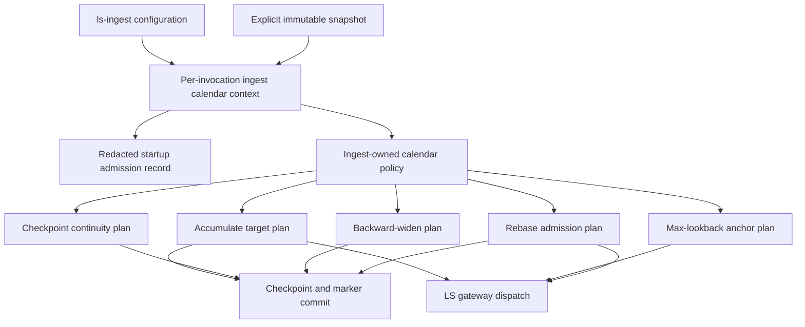
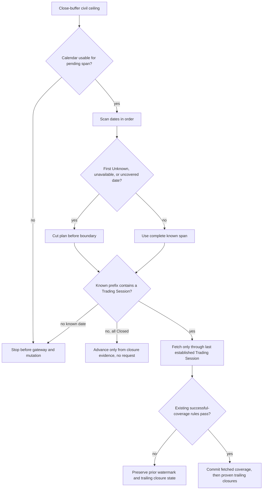

# Close Ingest KRX Calendar Proof Gaps - Plan

## Goal Capsule

- **Objective:** Finish issue #186 by closing the proof and composition gaps left after PR #190's partial ingest migration, without rebuilding the shared KRX calendar foundation.
- **Authority:** Issue #186 acceptance criteria govern ingest behavior; parent issue #184 governs calendar truth and adoption policy; the merged `nautilus-ls-calendar` contracts and existing ingest safety invariants constrain implementation.
- **Execution profile:** Fixed-clock and proof-first, using genuine synthetic counterfactual snapshots and observable gateway/checkpoint effects in the standalone adapter workspace.
- **Stop conditions:** Stop if a proposed change requires live KRX data, a production snapshot, a live gateway call, or moving consumer action policy into the calendar core.
- **Tail ownership:** The implementation owns focused regression coverage, the full offline adapter gate, runbook correction, and issue-closing evidence.

---

## Product Contract

### Summary

Complete the ingest migration that PR #190 started by making one per-invocation calendar resolution authoritative across accumulate, max-lookback probe, checkpoint migration, backward-widen handling, and rebase.
Enforced mode must plan only over a positively established date prefix, stop before Unknown or unavailable evidence, and never let weekday arithmetic or a point check authorize a wider range.
Legacy behavior remains unchanged, while Shadow computes and records the calendar result but preserves the gateway requests and persisted ingest state that Legacy would produce.

### Problem Frame

PR #190 merged the shared calendar and substantial issue #186 behavior, but issue #186 remains open because the merged integration does not yet prove its full acceptance boundary.
`ls-ingest` emits a startup record by loading the snapshot, then loads it again inside accumulate or probe with a different `Utc::now()` value.
Enforced accumulate and probe still begin from `last_closed_session`, so weekday arithmetic silently shapes the candidate before the calendar is consulted.
The current range classifier lets a proven Trading Session outrank an Unknown elsewhere in the same fetch range, which can dispatch through the Unknown date instead of stopping at the preceding established prefix.
Rebase calls the Legacy accumulate entry point after mutating checkpoint state, and checkpoint migration merges all-Closed gaps without checking whether full-history evidence is stale.
The current helper-level composition smoke and pure gate assertions do not collectively prove one load, pre-dispatch refusal, actual selected dates, and byte-for-byte checkpoint and marker preservation.

### Requirements

**Composition and adoption**

- R1. One `ls-ingest` invocation resolves one explicit snapshot path, fixes one as-of instant, loads at most one immutable calendar, and injects that same resolution into every calendar-dependent ingest decision.
- R2. The startup record reports the loaded snapshot identity, coverage, relevant freshness, adoption state, factual query result, and resulting admission action with authorization and credential identities redacted.
- R3. Legacy remains weekday-authoritative, Shadow records calendar-versus-legacy divergence while producing the same gateway requests and persisted bytes as Legacy, and Enforced contains no weekday fallback.
- R4. An unavailable, unauthorized, expired, out-of-coverage, or otherwise unusable calendar in Enforced stops before any LS gateway dispatch and before checkpoint or marker mutation.

**Target and coverage proof**

- R5. The existing close buffer determines only the latest eligible KST civil date; Enforced then derives accumulate and max-lookback targets from established calendar facts rather than weekday arithmetic.
- R6. A gateway request ends on a positively established Trading Session and never includes a Closed, Unknown, or unavailable trailing target date.
- R7. Scanning stops at the first Unknown, unavailable, or insufficient-coverage date; later dates are not used to justify dispatch or coverage. An already-authorized prefix may commit only through its established boundary, while no-admissible-prefix stops preserve the complete prior state.
- R8. An all-Closed pending prefix may advance coverage without a gateway request, but trailing Closed dates advance only from positive closure evidence and only after any preceding fetch has satisfied the existing successful-coverage rules.

**Checkpoint continuity and warnings**

- R9. Legacy checkpoint ranges merge in Enforced only when every intervening date is positively Closed and full-history evidence is fresh; Trading Session, Unknown, unavailable, absent coverage, stale, or unevaluated full-history evidence preserves separate ranges and emits the conservative over-fetch diagnostic without blocking ordinary ingest.
- R10. Unknown or unavailable evidence authorizes no mutation for the affected date or anything beyond it. When it leaves no admissible prefix, the checkpoint file, watermark, history-floor markers, and rebase markers remain byte-for-byte unchanged, including when the input is a legacy checkpoint eligible for migration; when a preceding prefix is authorized, only that prefix may commit.
- R11. A backward-widen interval emits and persists the normal once-per-floor warning only when the whole interval is determinate and contains a Trading Session; an all-Closed interval is silent; any Unknown, unavailable, or insufficient-coverage date yields the distinct non-persisted uncertainty warning and no normal marker.
- R12. Relevant stale evidence is prominent in startup or decision diagnostics but never rewrites a day fact or weakens Unknown and availability handling.

**Verification and operations**

- R13. Acceptance tests load the real counterfactual snapshot type and assert selected dates, full gateway-request ranges and counts, checkpoint ranges, structured warning records, and byte-for-byte watermark and marker state.
- R14. Paired failure-inversion cases change only one target fact from Unknown to Trading Session or Closed and make the corresponding fetch or evidence-backed no-request advancement observable.
- R15. A composition-root smoke proves explicit configuration, single loading, shared injection, adoption reporting, startup diagnostics, and pre-dispatch failure without a production artifact, credentials, network, or wall-clock fixture.
- R16. The adapter runbook documents calendar configuration and each adoption state's ingest behavior, and the full standalone adapter workspace gate passes offline.

### Key Flows

- F1. **Enforced startup admission**
  - **Trigger:** An operator starts `ls-ingest` in Enforced mode.
  - **Steps:** Resolve configuration and a fixed as-of instant, load one snapshot, evaluate the mode's civil-date ceiling, emit one redacted startup record, and refuse before SDK or universe dispatch if the calendar cannot support the run.
  - **Outcome:** Every later ingest decision borrows from the same immutable calendar resolution.
- F2. **Prefix-safe accumulate**
  - **Trigger:** A triple has pending coverage between its watermark or floor and the close-buffer ceiling.
  - **Steps:** Classify dates in order, stop at the first indeterminate boundary, fetch only through the last established Trading Session in the known prefix, then apply evidence-backed closure advancement after successful coverage.
  - **Outcome:** No request or watermark crosses an Unknown boundary, and Closed-only work consumes no gateway budget.
- F3. **Conservative legacy checkpoint migration**
  - **Trigger:** A checkpoint has separate completed ranges and no derived watermark.
  - **Steps:** Evaluate each intervening span with the same calendar view and full-history freshness; merge only a fresh all-Closed span and retain all other spans with a diagnostic.
  - **Outcome:** Ordinary ingest continues without erasing a possible historical session.
- F4. **Backward-widen classification**
  - **Trigger:** A configured floor precedes stored coverage.
  - **Steps:** Inspect the entire pre-coverage interval, preserve uncertainty over any stronger-looking later fact, and choose normal warning, silence, or non-persisted uncertainty.
  - **Outcome:** Only a determinate interval containing a Trading Session receives the once-per-floor marker.
- F5. **Calendar-gated rebase and probe**
  - **Trigger:** An operator selects `rebase` or `probe-lookback`.
  - **Steps:** Reuse the invocation's calendar context; refuse before marking or dispatch on an unusable or indeterminate boundary; otherwise run with the calendar-selected target.
  - **Outcome:** Alternate ingest modes cannot bypass Enforced policy.

### Acceptance Examples

- AE1. **Covers R5-R8.** Given a pending interval `Trading Session → Closed → Unknown → Trading Session`, Enforced fetches only through the first Trading Session, may advance through the following proven Closed date after successful coverage, and does not request or advance across the Unknown date.
- AE2. **Covers R6, R8, R14.** Given a one-date Unknown target, changing only that row to Trading Session makes one fetch observable; changing only that row to Closed makes zero requests and permits only closure-backed advancement.
- AE3. **Covers R4, R10, R15.** Given Enforced with a missing or insufficient snapshot, starting accumulate or rebase produces zero LS requests and leaves the checkpoint bytes unchanged.
- AE4. **Covers R9.** Given two legacy ranges separated only by Closed rows, fresh full-history evidence merges them; the same snapshot facts with full-history freshness changed to stale keep them separate and emit conservative over-fetch.
- AE5. **Covers R11-R12.** Given a backward-widen interval containing both a Trading Session and Unknown, the result is uncertainty, no history-floor marker is written, and a later run reevaluates the interval.
- AE6. **Covers R3, R13.** Given a date where calendar and weekday policy disagree, Shadow emits a structured divergence but matches Legacy request count, selected range, checkpoint bytes, and markers.
- AE7. **Covers R1-R2, R15.** Given a temporary counterfactual snapshot, the composition smoke resolves it once, continues using the loaded immutable calendar after the source file becomes unavailable, and emits the actual adoption, query, freshness, and action fields without leaking identities.
- AE8. **Covers R5, R7, R13.** Given `probe-lookback` after the close buffer with an Unknown boundary above a known Trading Session, Enforced selects only the most recent session reachable without crossing Unknown; before the close buffer, today's row is never eligible.

### Scope Boundaries

**In scope**

- Residual issue #186 integration work in `ls-ingest`, ingest policy, checkpoint migration, diagnostics, rebase, probe, tests, and the adapter runbook.
- Narrow internal restructuring needed to make calendar resolution and state commit ordering testable.
- Regression coverage for behavior already shipped by PR #190 where the current assertions do not prove the issue boundary.

**Out of scope**

- Changes to snapshot schema, evidence reconciliation, refresh, activation, or the `nautilus-ls-calendar` factual truth model.
- Catalog, Production Ladder, budget-probe, or other consumer migrations from parent issue #184.
- Live Calendar Foundation Gate execution, production snapshot creation, owner-local canary, Shadow-to-Enforced default flip, or weekday primitive removal after the Consumer Retirement Gate.
- Calendar-gating explicit operator-supplied historical range mode; issue #186's automatic accumulate, probe, and rebase paths are the target.

**Deferred to Follow-Up Work**

- Hoisting the shared adoption scaffold across consumers and extracting the entire ingest calendar implementation into a separate module, unless a small extraction is required for the issue #186 proof seam.
- Removing the vestigial `resolve_and_load` adoption argument or unrelated `CalendarGate` compatibility shims.

### Dependencies

- PR #190 is merged on `main` and supplies `KrxCalendar`, `AsOfView`, `CalendarAdoption`, diagnostics, the synthetic fixture, and the initial ingest gate.
- The existing close time and close-buffer values remain consumer-owned and unchanged.
- The existing checkpoint crash-safety, overlap refusal, PaperThin handling, heal mark-before-wipe ordering, and successful-coverage rules remain authoritative.

---

## Planning Contract

### Key Technical Decisions

- KTD1. **Resolve a per-invocation ingest calendar context once at the composition root.** Construct it after mode/config validation and acquisition of the existing ingest lock, but before SDK construction or any gateway-capable work, so lock wait time cannot age a precomputed as-of instant and the startup record can describe the actual mode. The context owns the fixed as-of instant, adoption state, loaded result, factual view, and startup diagnostic inputs; accumulate, probe, rebase, checkpoint migration, and backward-widen policy receive derived references rather than rereading environment variables or the snapshot.
- KTD2. **Separate the close-buffer civil ceiling from session selection.** Legacy and Shadow may execute the existing weekday-derived plan, but Enforced starts from today's or the previous civil date based only on the unchanged close buffer and lets calendar evidence select the usable prefix.
- KTD3. **Plan an ordered established prefix instead of collapsing a range into `TradingPresent / AllClosed / Indeterminate`.** For fetch targeting, the first Unknown or unavailable date is a hard boundary even when the same wider range contains a Trading Session; the plan carries the last fetchable session and any evidence-backed trailing closure advancement separately.
- KTD4. **Keep action policy in ingest.** The calendar core continues to return immutable facts, coverage, and freshness; ingest decides pre-dispatch refusal, fetch ranges, checkpoint merge continuity, warning persistence, and adoption behavior.
- KTD5. **Stage state changes after admission and proof.** Enforced failure or an Unknown boundary cannot be followed by the current unconditional checkpoint normalization/save. Treat an authorized prefix as the commit unit: legacy migration, adjusted-price metadata, history-floor markers, and rebase marks are committed only when their owning action is authorized, and a zero-length prefix performs no save at all.
- KTD6. **Freshness is consumer-relevant, not a status rewrite.** Full-history freshness must be `Fresh` to merge legacy ranges; `Stale` or `Unevaluated` preserves separate ranges, while normal day facts remain usable with a prominent stale diagnostic and Unknown still wins its stop/uncertainty rules.
- KTD7. **Shadow diagnostics must be assertable but non-persisted.** Represent the calendar and legacy plans as structured observation data that tests can inspect, while production emission remains on the redacted diagnostic channel and execution uses the Legacy plan.
- KTD8. **Rebase uses the same gate before mark-all.** It must not mutate rebase markers, wipe state, or dispatch through the Legacy wrapper until the shared calendar context has admitted the run.

### High-Level Technical Design

#### Ownership and data flow

The composition root is the only environment and snapshot boundary.
The calendar context supplies facts; the ingest policy derives actions; checkpoint and gateway effects occur only after the action authorizes them.

#### Enforced prefix planning and commit

This ordering prevents a later Trading Session from overriding an earlier Unknown and prevents trailing Closed dates from being sent as request targets.

### Sequencing

1. Establish the single-load context after the existing ingest lock and before SDK construction, and make that pre-dispatch admission boundary explicit before changing date planning.
2. Replace endpoint/range classification with prefix-safe target planning and route accumulate, probe, and rebase through it.
3. Make checkpoint migration and save ordering freshness-aware and byte-preserving.
4. Correct backward-widen precedence and expose structured diagnostics.
5. Close the acceptance matrix at the composition boundary, update the runbook, and run the full standalone gate.

### System-Wide Impact

- **Gateway budget:** Enforced failure moves earlier than SDK and universe dispatch, and Closed/Unknown trailing dates no longer consume calls.
- **Persistent state:** Checkpoint migration, watermarks, history-floor markers, and rebase marks gain stricter commit ordering. The authorized prefix is the only persistence unit; a zero-length prefix performs no normalization or save, while a non-empty prefix may commit only after its existing coverage rules pass. No checkpoint schema or bulk backfill is introduced, and Legacy bytes and crash-safety invariants remain stable.
- **Failure propagation:** Configuration/load/admission failures terminate Enforced before SDK construction or universe discovery. A later Unknown boundary is a planned conservative stop, not permission to discard already-successful prefix work or to serialize unrelated checkpoint normalization.
- **Operations:** Startup and uncertainty diagnostics become tied to the actual invocation plan rather than a representative current date.
- **Compatibility:** Public calendar-core contracts remain unchanged; the affected runtime surface is the standalone adapter's ingest API and binary.

### Risks and Mitigations

- **Range planner regresses existing successful coverage:** Reuse the current fetch, PaperThin, overlap, and checkpoint advancement machinery after deriving a safer upper bound; test fetch failure and partial coverage before permitting trailing closure advancement.
- **Early admission blocks benign Legacy or Shadow runs:** Fail-before-dispatch applies only to Enforced; Legacy and Shadow retain the current non-fatal missing-snapshot behavior.
- **Checkpoint migration becomes accidentally all-or-nothing for ordinary ingest:** Preserve safe prefix derivation and remainder reporting while refusing only the unsafe merge; tests cover continued fetch of retained ranges.
- **Partial-prefix persistence is mistaken for an all-or-nothing Unknown stop:** Test both sides of the boundary: an empty admissible prefix leaves raw bytes unchanged, while a successful established prefix commits only through its proven end and never serializes state for or beyond Unknown.
- **Test fixtures hide mixed-state ordering:** Build counterfactual snapshots that differ by one row and include Trading/Closed/Unknown permutations rather than testing pure classifications only.
- **Diagnostics violate Shadow byte equivalence:** Keep observation off checkpoint and stdout data products, use existing field-level calendar redaction, and compare complete persisted bytes between Legacy and Shadow.

### Alternative Approaches Considered

- **Close #186 as already shipped by PR #190:** Rejected because current `main` still reloads the snapshot, uses weekday-derived Enforced ceilings, bypasses the gate in rebase, dispatches across some mixed Unknown ranges, and ignores stale full-history evidence during migration.
- **Patch only `range_action` precedence:** Rejected because one aggregate verdict cannot express both the safe fetch prefix and evidence-backed trailing closure advancement.
- **Move target and checkpoint policy into `nautilus-ls-calendar`:** Rejected because issue #186 and parent #184 require consumer action policy to remain in ingest.
- **Run the calendar gate after universe loading:** Rejected for Enforced because unavailable or insufficient proof must stop before any gateway dispatch, including universe calls.

---

## Implementation Units

### U1. Single-load ingest calendar context and startup admission

**Goal:** Resolve the calendar once before gateway construction, emit an invocation-relevant startup record, and share the loaded view with every ingest mode.

**Requirements:** R1-R4, R12, R15; F1; AE3, AE7; KTD1, KTD7.

**Dependencies:** none.

**Files:**

- Modify `adapters/nautilus/src/calendar.rs`
- Modify `adapters/nautilus/src/bin/ls-ingest.rs`
- Test `adapters/nautilus/tests/calendar_composition.rs`
- Test `adapters/nautilus/src/bin/ls-ingest.rs`

**Approach:** Introduce one adapter-owned invocation context that freezes `as_of`, adoption, explicit path resolution, and `LoadedCalendar` after the existing ingest lock is acquired and before the SDK or universe is constructed.
Build the startup diagnostic from the actual mode ceiling and admission result, then derive all `CalendarGate` or replacement policy views from the owned context.
Remove the `emit_startup_from_env` plus per-mode reload pattern from `ls-ingest`.
Enforced unusable states return a non-successful ingest outcome before any gateway-capable object acts; Legacy and Shadow continue with weekday authority and a recorded unavailable diagnostic.

**Patterns to follow:** `adapters/nautilus/src/calendar.rs` for field-level redaction and typed `LoadedCalendar`; `adapters/nautilus/tests/calendar_composition.rs` for genuine temporary snapshots; `adapters/nautilus/src/lock.rs` for pre-dispatch composition guards.

**Execution note:** Start with failing composition tests that count observable loads and gateway calls, then move ownership until the same loaded object serves startup and runtime policy.

**Test scenarios:**

1. Configure a valid temporary snapshot, resolve the context, remove the source file, and prove accumulate decisions still use the loaded immutable calendar without a second read.
2. Configure Enforced with no path, a missing file, expired authorization, and a target outside materialized coverage; each emits the typed redacted startup outcome and produces zero mock LS requests.
3. Configure Shadow with the same failures; startup succeeds with the weekday-authoritative action and no persisted calendar diagnostic.
4. Use a stale but factual target; the startup line names stale freshness, the exact day result, adoption, and action without exposing authority or maintainer identities.
5. Enter accumulate, probe, and rebase through the composition seam and assert they receive the same adoption and snapshot identities.

**Verification:** A single composition object owns the only loaded calendar; Enforced admission precedes every gateway path; the startup line reflects the action the invocation will take.

### U2. Prefix-safe accumulate and probe target planning

**Goal:** Replace weekday-shaped Enforced targets and aggregate range verdicts with an ordered proof plan that stops before the first indeterminate date.

**Requirements:** R3-R8, R12-R14; F2, F5; AE1, AE2, AE6, AE8; KTD2-KTD4.

**Dependencies:** U1.

**Files:**

- Modify `adapters/nautilus/src/ingest/mod.rs`
- Modify `adapters/nautilus/src/bin/ls-ingest.rs`
- Test `adapters/nautilus/tests/ingest.rs`

**Approach:** Preserve `last_closed_session` for Legacy and Shadow execution, but give Enforced a raw KST civil ceiling derived only from the existing close buffer.
Classify the pending span in date order and return a consumer-owned plan that separates the request upper bound, closure-only advancement, stop boundary, freshness diagnostics, and Shadow divergence.
An Unknown, query failure, or coverage boundary cuts the plan before that date even if later rows are Trading Sessions.
If the known prefix has Trading Sessions, fetch only through its last established session; apply existing successful-coverage and partial-fetch rules before advancing any proven trailing closures.
Use the same prefix rule for the max-lookback anchor so it cannot jump across Unknown to an older or later session.

**Patterns to follow:** `AsOfView::first_session` and `last_session` proof-preserving ordering in `adapters/nautilus/nautilus-ls-calendar/src/query.rs`; the whole-range guard lesson in `docs/solutions/logic-errors/per-date-gate-on-a-range-op-silently-advances-over-unchecked-dates.md`; existing `collect_daily` and `collect_minute` completion semantics.

**Execution note:** Add the mixed-state failure inversions before changing planner behavior; pure all-Closed and all-Trading tests are insufficient.

**Test scenarios:**

1. After the close buffer, a Trading Session ceiling becomes the request endpoint; before the buffer, today's row is excluded and the preceding established prefix is used.
2. A weekend or holiday ceiling under Enforced is classified from calendar rows, never from weekday subtraction.
3. A span `Trading Session → Closed → Unknown → Trading Session` requests only through the first Trading Session, commits the following Closed date only after fetch success, and stops before Unknown; a rerun begins at that Unknown boundary rather than treating later proof as contiguous.
4. A span `Unknown → Trading Session` produces zero requests and no advancement; later proof cannot leap over Unknown.
5. An all-Closed pending span advances from closure evidence with zero requests.
6. A request whose fetch returns PaperThin, overlap refusal, empty-history uncertainty, or another existing incomplete outcome does not advance through trailing Closed dates beyond the prior successful-coverage boundary.
7. Paired snapshots differing only at one target row produce Unknown stop, Trading fetch, and Closed no-request advancement.
8. Shadow over a calendar/weekday disagreement records both plans but matches Legacy request body dates, counts, and checkpoint bytes.
9. Probe selection uses the most recent reachable established session, stops on a boundary Unknown, and issues zero `t8412` requests when no eligible session exists.

**Verification:** Every Enforced request endpoint is a Trading Session; no request crosses an indeterminate boundary; Legacy and Shadow actions remain compatible.

### U3. Freshness-aware checkpoint migration and byte-preserving stops

**Goal:** Make legacy-range migration depend on fresh positive closure proof and prevent stopped runs from normalizing or saving checkpoint state.

**Requirements:** R4, R9-R10, R12-R13; F3; AE3, AE4; KTD5-KTD6.

**Dependencies:** U1, U2.

**Files:**

- Modify `adapters/nautilus/src/ingest/checkpoint.rs`
- Modify `adapters/nautilus/src/ingest/mod.rs`
- Test `adapters/nautilus/tests/ingest.rs`

**Approach:** Extend the ingest continuity policy to combine per-date facts with `AsOfView::freshness().full_history`.
Only a `Fresh` full-history verdict and all-Closed intervening rows can authorize a merge; `Stale`, `Unevaluated`, Unknown, unavailable, or out-of-range evidence breaks the chain and records why.
Separate checkpoint deserialization and candidate migration from persistence so a stopped invocation cannot write derived watermarks, adjusted-price normalization, pruning, or other incidental serialization changes.
Commit each authorized migration or ordinary ingest change at its existing owning crash-safe save boundary rather than delaying incremental progress into one end-of-run transaction; retained ranges continue through the current conservative over-fetch path.

**Patterns to follow:** `Checkpoint::save` atomic sibling-temp rename; prefix-only migration invariants in `adapters/nautilus/src/ingest/checkpoint.rs`; per-item proof preservation in `docs/solutions/logic-errors/safety-invariant-proven-at-a-leaf-can-be-re-violated-by-a-coarser-grained-caller.md`.

**Execution note:** Characterize current legacy checkpoint bytes first, then prove each stopped path leaves the complete file unchanged rather than comparing only parsed watermarks.

**Test scenarios:**

1. Two ranges separated by fresh all-Closed evidence merge and derive the same safe prefix watermark as today.
2. The same day rows with only full-history freshness changed to Stale remain separate and emit a stale conservative-over-fetch diagnostic.
3. Unevaluated full history, Unknown, unavailable view, and out-of-coverage gaps each remain separate without blocking fetch of the retained ordinary range.
4. A Trading Session in the gap prevents merge regardless of freshness.
5. An Enforced stop with no admissible prefix against a legacy `completed`-only checkpoint leaves the entire file byte-for-byte unchanged, including absent watermarks and markers.
6. A stopped run does not change `adjusted_prices`, prune completed rows, rewrite JSON formatting, or create a checkpoint file when none existed.
7. Shadow migration records its alternate calendar verdict but produces the same serialized checkpoint as Legacy.
8. A mixed span with a successful established prefix followed by Unknown commits only the prefix; the resulting watermark and completed ranges end before Unknown, and no unrelated normalization is serialized.

**Verification:** No merge exceeds fresh positive closure proof; stopped paths perform no checkpoint write; ordinary conservative over-fetch remains available.

### U4. Backward-widen evidence precedence and operator-visible uncertainty

**Goal:** Ensure any indeterminate row prevents the normal marker and make uncertainty visible in the ingest result and CLI output.

**Requirements:** R3, R11-R13; F4; AE5, AE6; KTD4, KTD6-KTD7.

**Dependencies:** U2, U3.

**Files:**

- Modify `adapters/nautilus/src/ingest/mod.rs`
- Modify `adapters/nautilus/src/bin/ls-ingest.rs`
- Test `adapters/nautilus/tests/ingest.rs`
- Test `adapters/nautilus/src/bin/ls-ingest.rs`

**Approach:** Give backward-widen its own complete-span classifier instead of reusing continuity precedence where a Trading Session short-circuits over Unknown.
Track whether the entire interval is determinate and whether it contains a Trading Session.
Only the determinate-plus-Trading result emits and persists the normal warning; determinate all-Closed suppresses; any indeterminate row produces the non-persisted uncertainty even if another row is Trading.
Render `CoverageReport.backward_widen_uncertainties` beside the existing normal warning output, including relevant stale context without persisting it.

**Patterns to follow:** Existing `BackwardWidenWarning` and `BackwardWidenUncertainty` result records; once-per-floor `history_floors`; stderr/stdout redaction conventions in `ls-ingest`.

**Execution note:** Write the mixed Trading-plus-Unknown test first because the current pure-state tests all pass while the precedence is wrong.

**Test scenarios:**

1. A fully known interval containing a Trading Session emits one normal warning, persists its floor, and does not re-warn at the same floor.
2. A fully known all-Closed interval emits neither warning nor marker.
3. A mixed Trading Session plus Unknown interval emits one uncertainty, writes no marker, and reevaluates on the next run.
4. Unavailable and out-of-coverage intervals follow the same uncertainty path and preserve marker bytes.
5. Stale but determinate facts keep their factual classification and add a prominent stale diagnostic; introducing Unknown still changes the result to uncertainty.
6. The `ls-ingest` report output contains a distinct uncertainty record with the affected instrument, bar kind, floor, and stored boundary, while the process exit code remains unchanged.
7. Shadow emits its diagnostic but matches Legacy warning count, marker bytes, and exit behavior.

**Verification:** The normal marker implies a fully determinate interval containing a session; every uncertainty remains non-persisted and operator-visible.

### U5. Calendar-gated rebase, acceptance matrix, and runbook closeout

**Goal:** Remove the remaining mode bypass, prove issue #186 at real consumer boundaries, and document the supported operating posture.

**Requirements:** R1-R4, R10, R13-R16; F1, F5; AE3, AE6-AE8; KTD1, KTD5, KTD8.

**Dependencies:** U1-U4.

**Files:**

- Modify `adapters/nautilus/src/ingest/mod.rs`
- Modify `adapters/nautilus/src/bin/ls-ingest.rs`
- Modify `adapters/nautilus/tests/ingest.rs`
- Modify `adapters/nautilus/tests/calendar_composition.rs`
- Modify `adapters/nautilus/README.md`

**Approach:** Add a calendar-aware rebase entry that admits the target span before mark-all, then carries the same context into the existing reentrant heal/accumulate path.
Keep the Legacy wrapper for current library callers, but ensure the binary's Enforced and Shadow modes use the gated path.
Build a focused acceptance matrix around the actual composition boundary, mock SDK request log, counterfactual snapshot, and real checkpoint files rather than adding more pure helper assertions.
Update the runbook with `LS_CALENDAR_SNAPSHOT`, `LS_CALENDAR_ADOPTION`, close-buffer versus calendar selection, Shadow default behavior, Enforced fail-closed behavior, stale diagnostics, checkpoint continuity, and rebase/probe implications.

**Patterns to follow:** Existing epoch rebase mark-before-wipe and crash-resume tests; mock request inspection in `adapters/nautilus/tests/ingest.rs`; startup redaction checks in `adapters/nautilus/tests/calendar_composition.rs`; runbook's probe → backfill → accumulate ordering.

**Execution note:** Preserve the destructive rebase safety ordering: calendar admission must move before mark-all without moving mark-before-wipe or heal completion semantics.

**Test scenarios:**

1. Enforced rebase with unavailable, Unknown, or insufficient evidence makes zero gateway requests and leaves rebase markers, watermarks, and checkpoint bytes unchanged.
2. Enforced rebase with an established target marks and heals through the gated accumulate path while preserving epoch origin and crash-resume behavior.
3. Shadow rebase over a disagreement records the calendar result but matches Legacy marks, requests, and final checkpoint bytes.
4. The composition smoke configures one genuine temporary snapshot and proves startup record, shared injection, accumulate or probe selection, and request log without a production artifact or credentials.
5. A table-driven acceptance matrix covers each issue #186 branch with request count, request endpoint, watermark, completed ranges, history-floor marker, rebase marker, and diagnostic assertions.
6. Existing ingest regression tests for overlap refusal, PaperThin, empty re-pull, basis-shift heal, budget deferral, and crash-safe checkpoint saves remain green.
7. README examples identify Shadow as the composed default and do not claim the Consumer Retirement Gate or live Enforced cutover is complete.

**Verification:** No automatic ingest mode bypasses the calendar context; the issue acceptance matrix is observable at consumer boundaries; the operator runbook matches shipped behavior.

---

## Verification Contract

| Gate | Applies to | Required outcome |
|---|---|---|
| `cd adapters/nautilus && cargo test -p nautilus-ls --test calendar_composition` | U1, U5 | Single-load composition, redaction, adoption, and pre-dispatch admission scenarios pass offline. |
| `cd adapters/nautilus && cargo test -p nautilus-ls --test ingest calendar_gate_migration` | U2-U5 | Focused calendar target, checkpoint, warning, rebase, Shadow, and failure-inversion scenarios pass. |
| `cd adapters/nautilus && cargo test -p nautilus-ls --bin ls-ingest` | U1, U4, U5 | Binary composition and operator-output tests pass without credentials or network. |
| `make adapter-check` | All units | The standalone Nautilus workspace passes entirely offline, including `lab` and `nautilus-ls-calendar`. |
| `git diff --check` | All units | No whitespace errors or accidental generated/binary artifacts enter the change. |

Verification must inspect mock request bodies and ranges, not only request totals.
Tests must compare raw checkpoint bytes for stop and Shadow-equivalence cases and parsed state for authorized progress cases.
The counterfactual fixture or derived temporary snapshots must remain explicitly synthetic and must not introduce real KRX-derived rows.

---

## Definition of Done

- Every requirement R1-R16 is enforced by at least one implementation unit and an observable test or documented operational check.
- `ls-ingest` resolves no more than one snapshot and one as-of instant per invocation, and all automatic ingest modes share that context.
- Enforced uses no weekday-derived target, performs no gateway dispatch on unusable admission, and never requests or advances across Unknown.
- Closed-only advancement is backed by positive closure evidence and cannot outrun an incomplete or failed fetch.
- Checkpoint migration refuses stale or incomplete closure proof, and stop paths preserve complete checkpoint and marker bytes.
- Backward-widen normal markers require a fully determinate interval containing a Trading Session; uncertainty remains distinct, visible, and non-persisted.
- Rebase cannot mark, wipe, or dispatch before calendar admission and preserves existing crash-resume and epoch-origin guarantees.
- Shadow remains the composed default and is proven behaviorally and byte-for-byte equivalent to Legacy while recording divergence off persisted state.
- `adapters/nautilus/README.md` describes the supported calendar configuration and does not claim live Enforced retirement.
- The focused tests and `make adapter-check` pass offline with no production snapshot, credentials, network, or wall-clock fixture.
- Abandoned planner variants, duplicate loads, obsolete comments, and dead compatibility code introduced during implementation are removed from the final diff.
- The landing change references and closes issue #186 only after the verification contract is green.

---

## Sources and Research

- GitHub issue #186 defines the ingest acceptance boundary and remains open after PR #190.
- GitHub issue #184 establishes consumer-owned policy, tri-state facts, adoption states, and offline proof requirements.
- `docs/plans/2026-07-19-001-feat-shared-offline-krx-calendar-plan.md` and PR #190 define the merged foundation and the initial U9/U10 ingest migration.
- `adapters/nautilus/src/bin/ls-ingest.rs` shows the current startup reload, weekday-derived ceilings, late calendar admission, and rebase bypass.
- `adapters/nautilus/src/ingest/mod.rs` contains `CalendarGate`, `run_accumulate_gated`, backward-widen classification, and the existing successful-coverage machinery.
- `adapters/nautilus/src/ingest/checkpoint.rs` contains legacy range migration, atomic save, and current calendar continuity behavior.
- `adapters/nautilus/tests/ingest.rs` supplies the mock gateway, real counterfactual snapshot loading, and the existing request-count and state assertions to extend.
- `docs/solutions/logic-errors/per-date-gate-on-a-range-op-silently-advances-over-unchecked-dates.md` requires range operations to be authorized at range granularity and warns that a test can encode the bug.
- `docs/solutions/logic-errors/safety-invariant-proven-at-a-leaf-can-be-re-violated-by-a-coarser-grained-caller.md` requires safety properties to be reasserted at the assembly and caller boundary.
- `docs/solutions/logic-errors/empty-repull-completing-destructive-heal-destroys-history.md` constrains rebase changes to preserve retryable destructive-heal states.
- `docs/solutions/workflow-issues/cross-workspace-gate-blind-spot-sdk-preflight-changes-redden-adapter.md` makes `make adapter-check` the required cross-workspace gate.
