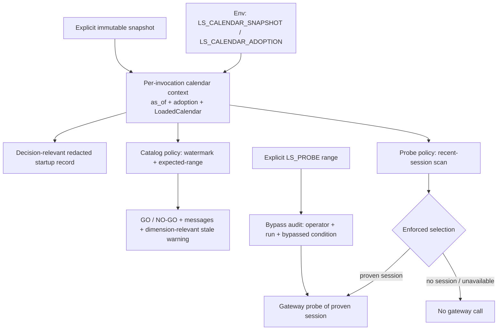
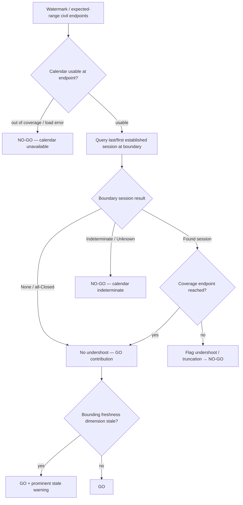

# Close Research & Probe KRX Calendar Proof Gaps - Plan

## Goal Capsule

- **Objective:** Finish issue #187 by closing the proof and composition gaps left after PR #190's partial catalog-readiness and budget-probe migration, without rebuilding the shared KRX calendar foundation or pulling live Enforced cutover forward.
- **Authority:** Issue #187 acceptance criteria govern research/probe behavior; parent issue #184 governs calendar truth, consumer-owned policy, and adoption states; the merged `nautilus-ls-calendar` contracts and the existing catalog/probe behavior constrain implementation.
- **Execution profile:** Fixed-clock and proof-first, using genuine synthetic counterfactual snapshots and observable GO/NO-GO verdicts and gateway-attempt effects in the standalone adapter workspace. No live gateway, no production snapshot, no wall-clock fixture.
- **Stop conditions:** Stop if a proposed change requires live KRX data, a production snapshot, a live gateway call, moving consumer action policy into the calendar core, flipping the composed default off Shadow, or touching the Production Ladder (#188) or ingest (#186).
- **Tail ownership:** The implementation owns focused catalog + probe regression coverage, one composition-root smoke per binary, the full offline adapter gate, paper-cut/runbook correction, and issue-closing evidence.

---

## Product Contract

### Summary

Complete the research/probe migration that PR #190 started so that one per-invocation calendar resolution is authoritative and the startup record describes the decision the invocation actually makes.
The explicit budget-probe range must record a full bypass audit — operator, run context, and the exact calendar condition automatic selection skipped — without changing probe status or authorizing production dispatch.
Catalog freshness warnings must name the freshness dimension that actually bounds the queried dates, and both consumers must be proven at their real decision boundaries across the full acceptance matrix, including a composition-root smoke and an end-to-end zero-gateway-call proof.
Legacy behavior remains unchanged and Shadow stays the composed default, byte-identical to Legacy.

### Problem Frame

PR #190 merged the shared calendar and substantial issue #187 behavior, but issue #187 remains open because the merged integration does not yet prove its full acceptance boundary.
`budget-probe` loads the snapshot once for `emit_startup_from_env("budget-probe")` (`adapters/nautilus/src/bin/budget-probe.rs:72`) and then loads it again inside `resolve_probe_dates` (`:524`) at a second `Utc::now()`, and the startup record targets today's KST civil date rather than the probe's `recent_trading_day` anchor, so the recorded query result and action may not describe the run's actual decision.
The catalog CLI branch reloads the same way — `lab-research` startup plus `adapters/nautilus/lab/src/runner/research.rs:1802` — so a research invocation resolves the calendar twice.
The explicit-range bypass records only `source` and `calendar_default` to stderr (`budget-probe.rs:539-551`); when the calendar is unavailable or proves no session there is no `calendar_default`, so the bypass audit loses the very condition it bypassed and never records operator or run context.
Catalog and probe freshness both read the global `AsOfView::freshness().any_stale()`, which cannot say whether the freshness dimension that bounds the queried dates is the stale one.
The current proof is helper-and-inline only: `budget-probe` has no composition-root smoke and no end-to-end assertion that an Enforced refusal issues zero gateway calls, and the catalog acceptance matrix omits the holiday-cluster and coverage-boundary scenarios issue #187 enumerates.
The `adapters/nautilus/lab/PAPER-CUTS.md` weekend-watermark note and the `research.rs:131` "holidays remain undetectable" comment are now stale, and the runbook does not document calendar configuration for these two consumers.

### Requirements

**Composition and adoption**

- R1. One `budget-probe` invocation and one `lab-research catalog status` invocation each resolve one explicit snapshot path, fix one as-of instant, load at most one immutable calendar, and share that resolution between the startup record and every calendar-dependent decision.
- R2. Each consumer's startup record reports the loaded snapshot identity, coverage, relevant freshness, adoption state, factual query result, and resulting action, with authorization and credential identities redacted, and describes the decision the invocation actually makes (the probe anchor; the catalog watermark/expected-range posture) rather than an unrelated representative date.
- R3. Legacy remains weekday/civil-date authoritative, Shadow records calendar-versus-legacy divergence while producing byte-identical operator output and exit behavior to Legacy, and Enforced contains no weekday or raw-civil-date fallback.
- R4. An unavailable, unauthorized, expired, out-of-coverage, or otherwise unusable calendar in Enforced yields the consumer's fail-safe outcome — `NO-GO — calendar unavailable` for catalog, and no gateway call for probe — before any LS gateway dispatch.

**Catalog readiness proof**

- R5. The catalog watermark check finds the last positively established Trading Session on or before the watermark and skips proven Closed dates; a Closed or holiday-cluster boundary never produces a false tail-undershoot flag.
- R6. The catalog expected-range check uses the first and last positively established Trading Sessions within the requested interval rather than raw civil-date boundaries for its front-truncation and tail-undershoot flags.
- R7. A boundary-relevant Unknown returns `NO-GO — calendar indeterminate`; an unavailable, invalid, expired, or insufficient-coverage artifact returns `NO-GO — calendar unavailable`. Neither collapses into a proven Closed or Trading Session.
- R8. Stale established evidence may contribute to catalog GO only with a prominent freshness warning, and staleness never rewrites a day fact or weakens Unknown/availability handling. The warning names the freshness dimension(s) that actually bound the queried dates (elapsed watermark/expected-range endpoints key on `incremental`/`full_history`/`kasi_holiday_facts` staleness and on whether the date sits within `coverage.retrospectively_checked_through`; a boundary near `materialized_through` keys on `forward_readiness`) rather than asserting a per-date freshness the calendar core does not expose.

**Budget-probe proof**

- R9. Automatic budget-probe selection chooses the most recent positively established Trading Session and never selects a Closed or Unknown date.
- R10. A stale positive probe default remains eligible only with a warning; an unavailable calendar or a lookback with no proven session makes no gateway call until the operator supplies an explicit date range.
- R11. An explicit probe range records the operator, run context, and the exact calendar condition automatic selection bypassed (no proven session, unavailable, or a proven-but-not-selected session), but does not change probe status and does not authorize production dispatch.

**Verification and operations**

- R12. Catalog integration tests assert observable GO and NO-GO outcomes, selected boundaries, and messages for ordinary, weekday-closure, holiday-cluster, boundary-relevant Unknown, stale, unavailable, and coverage-boundary scenarios.
- R13. Budget-probe tests observe the selected default, warnings, the bypass audit record, and whether a gateway request is attempted for Trading, Closed, Unknown, stale, unavailable, and explicit-range cases, including an end-to-end proof that an Enforced refusal issues zero gateway requests.
- R14. One composition-root smoke per affected binary proves explicit path resolution, single loading, injection, startup diagnostics, and adoption-state reporting without a production snapshot, credentials, network, or wall-clock fixture, and proves the loaded calendar remains usable after the source file becomes unavailable.
- R15. The adapter runbook documents calendar configuration and each adoption state's behavior for catalog and probe; the historical weekend-watermark paper-cut is marked retired/shipped with calendar-backed behavior; the stale "holidays remain undetectable" comment is corrected; and the full standalone adapter workspace gate passes offline.

### Key Flows

- F1. **Catalog readiness admission**
  - **Trigger:** An operator runs `lab-research catalog status` under a configured adoption state.
  - **Steps:** Resolve configuration and a fixed as-of instant once, load one snapshot, build the shared gate, emit one redacted startup record describing the catalog posture, then evaluate each triple's watermark and expected-range boundaries against proven sessions.
  - **Outcome:** GO/NO-GO reflects proven Trading-Session boundaries; Unknown and unavailable produce their distinct NO-GO messages; stale-but-established proceeds with a dimension-relevant warning.
- F2. **Prefix-safe watermark and expected-range check**
  - **Trigger:** A triple has a watermark, and optionally an expected range, to validate.
  - **Steps:** Under Enforced, derive the last established session on or before the watermark and the first/last established sessions within the requested interval; a Closed or holiday-cluster boundary is not an undershoot; an Unknown at the boundary is indeterminate; out-of-coverage is unavailable.
  - **Outcome:** No weekday or raw-civil-date arithmetic shapes an Enforced verdict.
- F3. **Calendar-gated automatic probe selection**
  - **Trigger:** An operator runs `budget-probe` with no explicit range.
  - **Steps:** Reuse the invocation's single calendar context, scan back from the anchor for the most recent proven Trading Session skipping Closed and Unknown, and under Enforced either select it (with a stale warning if applicable) or refuse without a gateway call.
  - **Outcome:** The probe measures a proven session or makes no call; it never probes a Closed or Unknown date automatically.
- F4. **Attended explicit-range bypass**
  - **Trigger:** An operator supplies `LS_PROBE_SDATE`/`LS_PROBE_EDATE`.
  - **Steps:** Honor the explicit range under every adoption, and record a bypass audit line naming the operator, run context, and the calendar condition automatic selection skipped.
  - **Outcome:** The manual range runs but is auditable as a bypass; it does not change probe status or authorize production dispatch.

### Acceptance Examples

- AE1. **Covers R1-R2, R14.** Given a temporary counterfactual snapshot, each affected binary's composition smoke resolves it once, keeps using the loaded immutable calendar after the source file is removed, and its startup line names the actual adoption, query, freshness, and action fields without leaking authority or maintainer identities.
- AE2. **Covers R5, R12.** Given a daily catalog whose last bar is a Friday before a Monday public-holiday watermark, Enforced reports GO (the last established session is the Friday) while the same rows with the boundary changed to Unknown report `NO-GO — calendar indeterminate`.
- AE3. **Covers R5, R12.** Given a watermark sitting after a multi-day holiday cluster whose last proven session precedes the cluster, Enforced does not flag a tail undershoot, and changing the pre-cluster boundary date to Trading Session vs Unknown flips only between GO and `NO-GO — calendar indeterminate`.
- AE4. **Covers R6-R7, R12.** Given an expected range whose civil endpoints are weekend/holiday dates, Enforced compares against the interval's first and last proven sessions; an out-of-coverage endpoint yields `NO-GO — calendar unavailable`.
- AE5. **Covers R8, R12.** Given stale-but-established boundary facts, catalog reports GO with a prominent dimension-relevant staleness warning; introducing an Unknown at the boundary changes the result to `NO-GO — calendar indeterminate`.
- AE6. **Covers R3, R12-R13.** Given a date where calendar and weekday/civil-date policy disagree, Shadow emits a structured divergence to the diagnostic channel but matches Legacy's verdict lines, exit code, and (for probe) request count and range.
- AE7. **Covers R9-R10, R13.** Given an anchor whose recent window is `Trading → Closed → Unknown`, Enforced selects the most recent proven session; given a lookback with no proven session or an unavailable calendar, Enforced makes zero gateway calls until an explicit range is supplied.
- AE8. **Covers R11.** Given an explicit `LS_PROBE_SDATE`/`LS_PROBE_EDATE` range under Enforced with an unavailable calendar, the run proceeds and records a bypass audit naming the operator, run context, and that automatic selection was bypassed because the calendar was unavailable — without changing probe status or authorizing production dispatch.

### Scope Boundaries

**In scope**

- Residual issue #187 integration work in `budget-probe`, the lab catalog-status path, their shared composition-root scaffold usage, the probe bypass audit, catalog freshness relevance, tests, the paper-cut record, and the adapter runbook.
- Narrow internal restructuring needed to make single-load resolution and the bypass audit testable at the real consumer boundary.
- Regression and matrix coverage for behavior already shipped by PR #190 where the current assertions do not prove the issue #187 boundary.

**Out of scope**

- Changes to snapshot schema, evidence reconciliation, refresh, activation, or the `nautilus-ls-calendar` factual truth model.
- Ingest (#186), Production Ladder session gate (#188), or any other consumer migration from parent issue #184.
- Live Calendar Foundation Gate execution, production snapshot creation, owner-local canary, Shadow-to-Enforced default flip, and weekday/civil-date primitive removal after the Consumer Retirement Gate (all #189).
- The `dispatch/` readiness verdict path in the lab, which is a separate consumer (#188 territory) from the catalog-status verdict.

**Deferred to Follow-Up Work**

- Hoisting the shared adoption scaffold and a common single-load "invocation calendar context" helper across all consumers, beyond the small extraction needed for the two #187 seams.
- Removing the vestigial `resolve_and_load` adoption argument or unrelated `CalendarGate` compatibility shims.
- Broadening dimension-relevant freshness into a general per-consumer freshness policy beyond what catalog and probe need.

### Dependencies

- PR #190 is merged on `main` and supplies `KrxCalendar`, `AsOfView`, `CalendarAdoption`, the composition-root scaffold in `adapters/nautilus/src/calendar.rs`, `CatalogCalendarGate`, the probe `plan_probe_dates`/`scan_recent_session` seam, diagnostics, and the synthetic fixture.
- The lab crate already depends on `nautilus-ls` by path and on `nautilus-ls-calendar`, so both consumers reuse the same `nautilus_ls::calendar` scaffold; no crate-graph change is required.
- The existing probe stage logic, `CallCeiling`, `SpendLedger`, and the wiremock gateway seam in `adapters/nautilus/src/ingest/budget.rs` remain authoritative and unchanged.

---

## Planning Contract

### Key Technical Decisions

- KTD1. **Resolve one per-invocation calendar context at each composition root.** Build it once (fixed `as_of`, adoption, explicit path resolution, `LoadedCalendar`) before the decision runs, and feed the same loaded object to both the startup record and the decision. `budget-probe` stops loading twice (`main` startup + `resolve_probe_dates`); `lab-research catalog status` stops loading twice (`main_cli` startup + the CLI branch). Reuse `nautilus_ls::calendar` rather than hoisting a new shared helper.
- KTD2. **Make the startup record decision-relevant, with a defined target for the multi-target and no-target cases.** `build_startup_record`/`CalendarDiagnostic::from_view` take one `target: NaiveDate`, so specify the target per consumer: `budget-probe` uses the `recent_trading_day` anchor (and, when Enforced refuses with no proven session, an explicit no-target marker rather than a misleading date). `lab-research catalog status` has no single decision date — the per-triple watermarks are computed inside `catalog_status_gated`, after the startup emit point — so it reports posture plus a defined representative target: the operator-supplied `expected_range` end when present (available from the status config at the composition root), else `coverage.materialized_through`; the record makes clear this is a posture/coverage summary, not a per-triple decision. Every field stays redacted on the non-persisted channel.
- KTD3. **Keep action policy in the consumers.** The calendar core continues to return immutable facts, coverage, and freshness; catalog decides GO/NO-GO and messages, and probe decides selection, refusal, warnings, and the bypass audit. Reuse `AsOfView::first_session`/`last_session`/`day` and `freshness()`; add no policy to the core.
- KTD4. **Bypass is an audit event, not a status change.** The explicit-range path records operator identity (from process/run context, redacted of secrets), a run identifier, and the calendar condition automatic selection bypassed, as a structured non-persisted diagnostic. It never mutates probe status, never sets a production-dispatch authorization, and remains a pure, inspectable value the tests can assert.
- KTD5. **Freshness is consumer-relevant, not a status rewrite.** The calendar core exposes only snapshot-global freshness dimensions (`FreshnessReport`: `kasi_holiday_facts`, `full_history`, `incremental`, `forward_readiness`) reduced by `any_stale()`, plus the coverage claims (`retrospectively_checked_through`, `materialized_through`); there is no per-date freshness query, and KTD3 forbids adding one. Catalog therefore derives its stale warning in the consumer from the dimension(s) and coverage claim that bound the queried boundary dates — an elapsed watermark/expected-range endpoint keys on `incremental`/`full_history`/`kasi_holiday_facts` staleness and on `retrospectively_checked_through`, a boundary near `materialized_through` keys on `forward_readiness` — rather than a blanket `any_stale()`. A stale verdict still yields GO, and Unknown/unavailable still win their stop rules. Where no dimension cleanly bounds a boundary, fall back to `any_stale()`.
- KTD6. **Shadow stays byte-identical to Legacy on operator output.** Divergence recording goes only to the stderr diagnostic channel; the stdout verdict lines, exit code, and (for probe) request count and range must equal Legacy. Tests compare complete operator output between Legacy and Shadow.
- KTD7. **Prove at the real consumer boundary with genuine fixtures.** Add one composition-root smoke per binary and an end-to-end zero-gateway-call proof for probe refusal, using synthetic counterfactual snapshots and the existing mock/observable seams rather than helper-only assertions.

### High-Level Technical Design

#### Shared single-load context and per-consumer policy

The composition root is the only env + snapshot boundary and loads exactly once.
The calendar context supplies facts; each consumer derives its own action; the startup record and the decision read the same loaded object.

#### Catalog Enforced boundary decision

An Unknown at the boundary never collapses to Closed, and a Closed/holiday-cluster boundary never becomes a false undershoot.

### Sequencing

1. Consolidate each consumer onto one per-invocation calendar context and make the startup record decision-relevant (foundational; unblocks the rest).
2. Complete the probe bypass audit (operator, run, bypassed condition) as a pure inspectable value.
3. Make catalog freshness dimension-selective (name the bounding dimension) and add the missing message/scenario coverage.
4. Add the composition-root smokes and the end-to-end zero-gateway-call proof.
5. Retire the paper-cut, correct the stale comment, update the runbook, and run the full offline gate.

### System-Wide Impact

- **Gateway budget:** Unchanged in behavior; the end-to-end proof makes the existing Enforced no-call refusal observable rather than only asserted at the pure layer.
- **Operator output:** Startup lines become decision-relevant. Stdout verdict lines and exit codes are unchanged in Legacy and Shadow; Enforced verdicts already differ by design.
- **Persistent state:** None. Neither consumer writes persisted calendar state; the bypass audit is non-persisted diagnostic output.
- **Compatibility:** Public calendar-core contracts and the crate graph are unchanged; the affected surface is the `budget-probe` binary and the lab `catalog status` path.
- **Documentation:** The weekend-watermark paper-cut moves to retired/shipped, and the runbook gains calendar configuration guidance for two consumers.

### Risks and Mitigations

- **Single-load refactor changes Legacy/Shadow output:** Keep the weekday/civil-date paths intact and only remove the duplicate load; compare complete Legacy-vs-Shadow operator output and exit codes in tests.
- **Decision-relevant startup record leaks identities or over-couples:** Reuse the redacted `CalendarDiagnostic`/`StartupRecord` builders and pass only the decision target; assert redaction in the smoke.
- **Bypass audit is mistaken for a status change or dispatch authorization:** Model it as a pure inspectable record and a stderr line only; test that probe status and any dispatch-authorization signal are unchanged when a bypass fires.
- **Dimension-selection freshness accidentally suppresses a needed warning or rewrites status:** Derive the bounding dimension from the boundary dates and coverage claims, keep Unknown/unavailable stop rules ahead of freshness, and test both a bounding-dimension-stale and an unrelated-dimension-stale-but-bounding-dimension-fresh case; fall back to `any_stale()` where no dimension cleanly bounds a boundary.
- **Matrix additions duplicate existing coverage instead of closing gaps:** Add only holiday-cluster, coverage-boundary, and the end-to-end no-call proof; reuse the existing fixture builders and one-row failure-inversion style.
- **Composition smoke depends on a real snapshot or wall clock:** Use a temporary synthetic snapshot, a fixed as-of instant, and prove usability after deleting the source file.

### Alternative Approaches Considered

- **Close #187 as already shipped by PR #190:** Rejected — `main` still double-loads, emits a non-decision-relevant startup record, records an incomplete bypass audit, uses global freshness, and lacks the composition-root smoke, the holiday-cluster/coverage-boundary catalog scenarios, and the end-to-end zero-gateway-call proof.
- **Hoist a shared invocation-calendar-context crate module now:** Deferred — both consumers reuse `nautilus_ls::calendar` today, and a general hoist across all consumers is follow-up work (also flagged by the ingest sibling plan); this plan does the minimum extraction needed for two seams.
- **Move catalog/probe policy into `nautilus-ls-calendar`:** Rejected — issue #184 requires consumer-owned action policy; the core stays factual.
- **Include the live Enforced cutover and a production snapshot:** Rejected for this plan — the composed default stays Shadow and live certification/retirement is #189 (confirmed with the requester).

---

## Implementation Units

### U1. Single-load per-invocation context and decision-relevant startup records

**Goal:** Resolve the calendar once per invocation for both consumers and emit a startup record that describes the decision the invocation actually makes.

**Requirements:** R1-R4; F1-F2; AE1, AE6; KTD1-KTD3, KTD6.

**Dependencies:** none.

**Files:**

- Modify `adapters/nautilus/src/bin/budget-probe.rs`
- Modify `adapters/nautilus/lab/src/runner/research.rs`
- Modify `adapters/nautilus/src/calendar.rs` (only if a small `build_startup_record`-from-context helper is needed to pass an explicit decision target)
- Test `adapters/nautilus/src/bin/budget-probe.rs` (inline `tests`)
- Test `adapters/nautilus/lab/tests/research_cli.rs`

**Approach:** In `budget-probe`, resolve adoption + path + `as_of` + `LoadedCalendar` once in `run` (or a small context struct), pass the loaded view into both the startup record and `resolve_probe_dates`, and remove the separate `emit_startup_from_env` load so there is one load and one `as_of` per invocation.
Build the startup record from the probe's `recent_trading_day` anchor rather than today's KST date (and from an explicit no-target marker on an Enforced refusal).
In the lab `catalog status` CLI branch, resolve once and share the loaded view between the startup emission and `catalog_status_gated`, removing the duplicate `main_cli` startup load for this subcommand; use the KTD2 catalog target (the `expected_range` end when present, else `coverage.materialized_through`) since per-triple watermarks are not knowable at the startup emit point.
Preserve the mandatory startup record on the non-decision paths: today `emit_startup_from_env` fires unconditionally in `main` before the `paper_ok` gate and the fallible env parses, so the consolidated emission must still fire on a non-paper or parse-error invocation (emit before the paper gate, or assert its presence on those paths) — consolidating the two loads must not regress the always-emit invariant.
Keep Legacy and Shadow operator output and exit codes byte-identical; the change is load consolidation and target selection only.

**Patterns to follow:** `adapters/nautilus/src/calendar.rs` `resolve_and_load`/`build_startup_record`/`emit_startup_record`; the ingest single-load context in `adapters/nautilus/src/bin/ls-ingest.rs:255-264`; `CatalogCalendarGate::new` construction at `research.rs:1802-1817`.

**Execution note:** Start with a failing test that counts observable calendar loads (or asserts the startup record's target equals the probe anchor), then move ownership until one loaded object serves both startup and decision.

**Test scenarios:**

1. A single `budget-probe` invocation loads the snapshot once and both the startup record and the probe decision read the same `as_of` and adoption.
2. The `budget-probe` startup record's day/target reflects the `recent_trading_day` anchor, not today's KST date, and stays redacted (no authority or maintainer identity).
3. A `catalog status` invocation loads the snapshot once; the startup record names the adoption and posture, and the verdict is unchanged from before the consolidation.
4. Legacy and Shadow `budget-probe` and `catalog status` runs produce byte-identical stdout verdict lines and exit codes to the pre-consolidation behavior.
5. Enforced with an unavailable snapshot still reaches the consumer's fail-safe (catalog NO-GO / probe no-call) after a single load.
6. A non-paper or early parse-error `budget-probe` invocation still emits exactly one mandatory startup record — moving the load into `run` does not drop the always-emit invariant.

**Verification:** Each consumer resolves one calendar per invocation; the startup record describes the actual decision; Legacy/Shadow output is unchanged.

### U2. Complete the budget-probe explicit-range bypass audit

**Goal:** Record operator, run context, and the exact bypassed calendar condition on an explicit-range bypass, without changing probe status or authorizing dispatch.

**Requirements:** R11; F4; AE8; KTD3-KTD4, KTD6.

**Dependencies:** U1.

**Files:**

- Modify `adapters/nautilus/src/bin/budget-probe.rs`
- Test `adapters/nautilus/src/bin/budget-probe.rs` (inline `tests`)

**Approach:** Extend `ProbeDatePlan`/`plan_probe_dates` so the bypass path carries a structured audit: the calendar condition automatic selection skipped (proven-session-not-selected, no-proven-session, or unavailable), plus operator and run context resolved at the composition root (`resolve_probe_dates`) and threaded in.
Resolve operator identity from run context (e.g. a `LS_PROBE_OPERATOR`/user env plus a run id), then SANITIZE it before emission — strip or escape control characters and newlines, bound its length, and apply `scrub_secrets` — so an operator-supplied value cannot forge a second diagnostic or startup line on the non-persisted channel; prefer threading the field through the redacted `CalendarDiagnostic`/`StartupRecord` builder rather than a hand-built `eprintln`, matching KTD8's redacted-by-construction guarantee.
Derive the run id so it is injectable/seeded for tests (no `Utc::now()`/random dependency, honoring the no-wall-clock proof ethos of R14) and assert it structurally rather than by value.
Keep the audit value inspectable so tests assert it without a gateway.
Do not change `live_request`, probe status, or any dispatch-authorization signal when a bypass fires; the bypass only records why automatic selection was skipped.

**Patterns to follow:** `ProbeDatePlan`/`DateSource`/`plan_probe_dates` at `budget-probe.rs:353-512`; the existing bypass stderr lines at `budget-probe.rs:546-551`; `scrub::scrub_secrets` usage in `main`/`run`; the run-id/operator conventions in `adapters/nautilus/lab/src/trials.rs` if a shared shape exists.

**Execution note:** Write the unavailable-calendar-plus-explicit-range test first (the case where today's record loses the bypassed condition), since that is the gap.

**Test scenarios:**

1. Explicit range under Enforced with an unavailable calendar records a bypass audit naming operator, run context, and condition `unavailable`, with `live_request` true and probe status unchanged.
2. Explicit range under Enforced with no proven session in the lookback records condition `no-proven-session`.
3. Explicit range under Enforced when a session *was* proven records condition `proven-session-not-selected` and still preserves `calendar_default`.
4. Explicit range under Legacy and Shadow records the bypass audit but keeps stdout and request range/count byte-identical to a non-audited Legacy run.
5. The bypass audit sets no production-dispatch authorization and does not alter the resolved `(sdate, edate)` beyond honoring the explicit range.
6. The audit line is scrubbed of any credential/appkey material.
7. A newline/control-character-laden `LS_PROBE_OPERATOR` cannot inject a second diagnostic or startup line — the operator field is control-char-stripped, length-bounded, and scrubbed before emission.
8. The run id is derived without a wall-clock or random dependency (injectable/seeded) and is asserted structurally.

**Verification:** Every explicit-range bypass is auditable with operator, run, and bypassed condition; none changes probe status or authorizes dispatch.

### U3. Dimension-relevant catalog freshness and message/scenario completeness

**Goal:** Make the catalog stale warning name the freshness dimension that bounds the queried dates and close the message and scenario gaps for the catalog boundary.

**Requirements:** R5-R8, R12; F1-F2; AE2-AE5; KTD3, KTD5-KTD6.

**Dependencies:** U1.

**Files:**

- Modify `adapters/nautilus/lab/src/runner/research.rs`
- Test `adapters/nautilus/lab/tests/research_cli.rs`

**Approach:** Replace the blanket `is_stale()`/`freshness().any_stale()` catalog signal with a warning derived, in the consumer, from the freshness dimension(s) and coverage claim that bound the queried boundary dates — an elapsed watermark/expected-range endpoint keys on `incremental`/`full_history`/`kasi_holiday_facts` staleness and on whether the date sits within `coverage.retrospectively_checked_through`; a boundary near `materialized_through` keys on `forward_readiness` — so a snapshot stale only in an unrelated dimension does not raise a spurious catalog warning while one stale in the bounding dimension does.
The calendar core exposes no per-date freshness query (KTD5), so this dimension-selection mapping lives in the catalog consumer, not the core; fall back to `any_stale()` where no dimension cleanly bounds a boundary.
Keep Unknown and unavailable handling ahead of freshness so staleness never rewrites a stop.
Add the missing observable catalog scenarios — a multi-day holiday cluster and a coverage/materialization boundary — using the existing in-memory `build_calendar`/`build_fixture` helpers and the one-row failure-inversion style.

**Patterns to follow:** `catalog_status_gated` at `research.rs:1173-1386`; `CatalogCalendarGate::is_stale`/`last_session_on_or_before`/`first_session_on_or_after` at `research.rs:164-247`; the existing enforced tests and `build_calendar`/`build_fixture`/`set_daily_watermark` helpers in `research_cli.rs:1426-1667`.

**Execution note:** Add the holiday-cluster and unrelated-dimension-stale cases before changing the freshness signal; the current pure-`any_stale` path passes the existing tests while being dimension-blind.

**Test scenarios:**

1. **Covers AE3.** A watermark after a multi-day holiday cluster whose last proven session precedes the cluster reports GO (no false tail undershoot); flipping the pre-cluster boundary to Unknown yields `NO-GO — calendar indeterminate`.
2. **Covers AE4.** An expected range with weekend/holiday civil endpoints is validated against the interval's first/last proven sessions; an out-of-coverage endpoint yields `NO-GO — calendar unavailable`.
3. A coverage/materialization-boundary watermark (at or just past `materialized_through`) yields `NO-GO — calendar unavailable`, never a silent GO.
4. **Covers AE5.** Boundary facts stale in the dimension that bounds them yield GO with a prominent stale warning that names that dimension.
5. A snapshot stale only in a freshness dimension that does not bound the queried boundary dates yields GO with no stale warning; staleness in the bounding dimension does warn.
   (Construct against the fixture's 2010-2012 elapsed boundaries by varying `incremental`/`full_history` vs `forward_readiness` staleness independently.)
6. **Covers AE2.** Closed/weekday-closure watermark boundaries do not false-flag; boundary Unknown is indeterminate.
7. Shadow catalog output stays byte-identical to Legacy verdict lines while recording the divergent calendar boundary to the diagnostic channel.

**Verification:** Catalog GO/NO-GO reflects proven boundaries; stale warnings name the bounding freshness dimension; the enumerated scenario set is observable.

### U4. Composition-root smokes and end-to-end no-call proof

**Goal:** Prove each binary's composition root and prove that an Enforced probe refusal issues zero gateway requests.

**Requirements:** R9-R10, R13-R14; F1, F3; AE1, AE7; KTD1-KTD2, KTD7.

**Dependencies:** U1-U3 (completion dependency — the smokes and no-call proof only pass once U1-U3 land; per the proof-first profile their observable assertions may be authored first to lock behavior).

**Files:**

- Test `adapters/nautilus/tests/budget_probe_composition.rs` (new)
- Test `adapters/nautilus/lab/tests/research_cli.rs` (add a composition-root smoke)
- Modify `adapters/nautilus/src/bin/budget-probe.rs` and/or `adapters/nautilus/src/ingest/budget.rs` only if a seam is needed to observe zero gateway attempts offline

**Approach:** Add one composition-root smoke per binary that writes a temporary synthetic snapshot, resolves it via the env path, proves a single load and injection, asserts the redacted startup record and adoption-state reporting, and proves the loaded calendar remains usable after the source file is deleted.
For `budget-probe`, add an end-to-end proof that Enforced with no proven session and no explicit range makes zero gateway requests — either by asserting the binary refuses before `build_sdk`/any `ProbeCaller` call, or by driving the decision path against a wiremock/observable caller that records zero requests.
Prefer the existing `SdkProbeCaller`/wiremock seam in `adapters/nautilus/src/ingest/budget.rs` and the fixture-loaded `KrxCalendar` pattern already used in the inline probe tests.

**Patterns to follow:** `adapters/nautilus/tests/calendar_composition.rs` for genuine temporary snapshots and startup-record redaction checks; the wiremock `MockServer` gateway seam and `FakeCaller` in `adapters/nautilus/src/ingest/budget.rs:909-1041`; the `bin()`/`CARGO_BIN_EXE_lab-research` subprocess pattern in `research_cli.rs:270`.

**Execution note:** This is proof-first; the smoke and no-call assertions may be added before any U1-U3 refactor is fully settled to lock the observable behavior.

**Test scenarios:**

1. **Covers AE1.** `budget-probe` composition smoke: a temporary snapshot resolves once via `LS_CALENDAR_SNAPSHOT`, the startup line reports adoption/coverage/freshness/action redacted, and the calendar still resolves the anchor after the source file is removed.
2. **Covers AE1.** Catalog composition smoke: `lab-research catalog status` resolves one temporary snapshot, reports adoption state, and produces its verdict without a production snapshot, credentials, or network.
3. **Covers AE7.** Enforced `budget-probe` with no proven session and no explicit range issues zero gateway requests (observed at the caller/mock seam or by refusing before SDK construction).
4. Enforced `budget-probe` with a proven session issues exactly one selection-driven request range; Legacy/Shadow issue the weekday-anchor range.
5. An explicit-range bypass under Enforced with an unavailable calendar issues the request and emits the U2 bypass audit, proving the no-call refusal is specifically lifted by the explicit range.

**Verification:** Each binary's composition root is proven offline; the Enforced no-call refusal is observable end-to-end.

### U5. Paper-cut retirement, comment/runbook closeout, and offline gate

**Goal:** Retire the stale documentation, document the supported operating posture for both consumers, and prove the full offline gate.

**Requirements:** R15; F1, F3; KTD6.

**Dependencies:** U1-U4.

**Files:**

- Modify `adapters/nautilus/lab/PAPER-CUTS.md`
- Modify `adapters/nautilus/lab/src/runner/research.rs` (correct the `:124-132` "holidays remain undetectable" comment)
- Modify `adapters/nautilus/README.md`

**Approach:** Mark the weekend-watermark paper-cut retired/shipped and replace its "holidays remain undetectable" note with the calendar-backed behavior and a pointer to the adoption states, preserving the historical record per issue #184's catalog closeout decision.
Correct the stale in-code comment so it no longer claims the repo carries no trading calendar.
Update the runbook with `LS_CALENDAR_SNAPSHOT`, `LS_CALENDAR_ADOPTION`, the catalog GO/NO-GO adoption behavior (Legacy weekday/civil-date, Shadow byte-identical recording, Enforced proven-session boundaries with indeterminate/unavailable NO-GO and dimension-relevant stale warning), and the probe adoption behavior (weekday anchor vs proven-session selection, no-call refusal, explicit-range bypass audit).
Run the full standalone adapter workspace gate offline and confirm green.

**Patterns to follow:** the ingest closeout in `adapters/nautilus/README.md`; the retired/shipped convention already used for PAPER-CUTS items 7-8; the Shadow-as-composed-default framing from the ingest plan.

**Execution note:** Documentation must not claim the Consumer Retirement Gate or live Enforced cutover is complete — the composed default stays Shadow.

**Test scenarios:**

1. `PAPER-CUTS.md` marks the weekend-watermark item retired/shipped with calendar-backed behavior and no longer asserts holidays are undetectable.
2. The corrected `research.rs` comment matches shipped behavior.
3. `README.md` documents calendar configuration and each adoption state for catalog and probe and does not claim live Enforced retirement.
4. `make adapter-check` passes entirely offline with no production snapshot, credentials, network, or wall-clock fixture.

**Verification:** Documentation matches shipped behavior; the offline gate is green.

---

## Verification Contract

| Gate | Applies to | Required outcome |
|---|---|---|
| `cd adapters/nautilus && cargo test --bin budget-probe` | U1, U2, U4 | Single-load, decision-relevant startup, bypass-audit, and no-call scenarios pass offline. |
| `cd adapters/nautilus && cargo test --test budget_probe_composition` | U4 | The `budget-probe` composition-root smoke passes without a production snapshot, credentials, or network. |
| `cd adapters/nautilus/lab && cargo test --test research_cli` | U1, U3, U4 | Catalog single-load, dimension-relevant freshness, holiday-cluster, coverage-boundary, Unknown/unavailable, Shadow-equivalence, and composition-smoke scenarios pass. |
| `make adapter-check` | All units | The standalone Nautilus workspace passes entirely offline, including `lab` and `nautilus-ls-calendar`. |
| `git diff --check` | All units | No whitespace errors or accidental generated/binary artifacts enter the change. |

Verification must observe GO/NO-GO verdicts, selected boundaries, operator messages, and gateway-attempt counts at the real consumer boundaries, not only helper return values.
Shadow-equivalence cases must compare complete operator output and exit codes to Legacy.
Fixtures and temporary snapshots must remain explicitly synthetic and must not introduce real KRX-derived rows.

---

## Definition of Done

- Every requirement R1-R15 is enforced by at least one implementation unit and an observable test or documented operational check.
- `budget-probe` and `lab-research catalog status` each resolve no more than one snapshot and one as-of instant per invocation, shared between the startup record and the decision.
- Each consumer's startup record describes the decision the invocation actually makes and stays redacted.
- The catalog watermark and expected-range checks decide on proven first/last Trading Sessions under Enforced; boundary Unknown is `NO-GO — calendar indeterminate`, unavailable/out-of-coverage is `NO-GO — calendar unavailable`, and stale-but-established is GO with a dimension-relevant warning.
- Automatic budget-probe selection picks the most recent proven Trading Session, never Closed or Unknown; an unavailable calendar or no-proven-session lookback makes no gateway call until an explicit range is supplied.
- Every explicit-range bypass records operator, run context, and the bypassed calendar condition, and changes neither probe status nor any production-dispatch authorization.
- Shadow remains the composed default and is proven byte-identical to Legacy on operator output and exit code (and, for probe, request count and range) while recording divergence off persisted state.
- One composition-root smoke per binary and an end-to-end zero-gateway-call proof for Enforced probe refusal pass offline.
- The catalog acceptance matrix covers ordinary, weekday-closure, holiday-cluster, boundary-relevant Unknown, stale, unavailable, and coverage-boundary scenarios; the budget-probe matrix covers Trading, Closed, Unknown, stale, unavailable, and explicit-range cases with request-attempt observation.
- `adapters/nautilus/lab/PAPER-CUTS.md`, the `research.rs` comment, and `adapters/nautilus/README.md` match shipped behavior and do not claim live Enforced retirement.
- Abandoned variants, duplicate loads, obsolete comments, and dead compatibility code introduced during implementation are removed from the final diff.
- `make adapter-check` passes offline with no production snapshot, credentials, network, or wall-clock fixture.
- The landing change references and closes issue #187 only after the verification contract is green.

---

## Sources and Research

- GitHub issue #187 defines the research/probe acceptance boundary and remains open after PR #190.
- GitHub issue #184 establishes consumer-owned policy, tri-state facts, adoption states, catalog and budget-probe migration decisions, and offline proof requirements (user stories 35-38 catalog, 43-45 probe, 47-50 diagnostics/adoption, 53-56 test seams).
- `docs/plans/2026-07-19-001-feat-shared-offline-krx-calendar-plan.md` and PR #190 define the merged foundation and the initial catalog/probe migration.
- `docs/plans/2026-07-19-002-fix-ingest-krx-calendar-proof-plan.md` is the ingest sibling gap-closure plan this plan mirrors in structure.
- `adapters/nautilus/src/bin/budget-probe.rs` shows the double load (`:72` startup, `:524` decision), the `plan_probe_dates`/`scan_recent_session` seam (`:380-512`), and the incomplete bypass stderr lines (`:539-551`).
- `adapters/nautilus/src/calendar.rs` provides the composition-root scaffold (`resolve_and_load`, `build_startup_record`, `emit_startup_record`, env helpers).
- `adapters/nautilus/lab/src/runner/research.rs` contains `catalog_status_gated` (`:1173-1386`), `CatalogCalendarGate` (`:164-247`), the weekday `last_weekday_on_or_before` (`:133-138`), the stale "holidays undetectable" comment (`:124-132`), and the duplicate calendar load in the CLI branch (`:1802-1817`).
- `adapters/nautilus/lab/tests/research_cli.rs` supplies the fixture builders (`build_fixture`, `build_calendar`, `set_daily_watermark`) and the existing enforced/shadow catalog assertions to extend.
- `adapters/nautilus/src/ingest/budget.rs` supplies the `SdkProbeCaller`/wiremock `MockServer` gateway seam and `FakeCaller` for the end-to-end no-call proof.
- `adapters/nautilus/tests/calendar_composition.rs` is the composition-root smoke pattern (temporary synthetic snapshot, redaction, adoption reporting) to mirror per binary.
- `adapters/nautilus/lab/PAPER-CUTS.md` (weekend-watermark item, `:104-109`) is the historical paper-cut to mark retired/shipped.
- `AsOfView::first_session`/`last_session`/`day`/`freshness` in `adapters/nautilus/nautilus-ls-calendar/src/query.rs` are the proof-preserving queries both consumers use; `DiagnosticOutcome::is_usable` in `nautilus-ls-calendar/src/diagnostics.rs` classifies usable-vs-unavailable.
