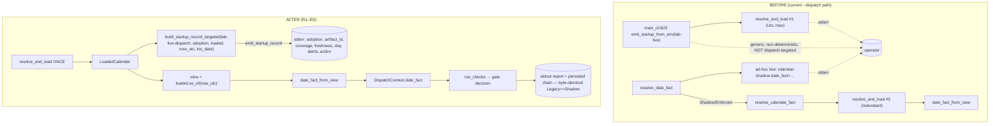

# feat: Migrate the Production Ladder session gate to KRX calendar proof

**Target workspace:** `adapters/nautilus/` (the standalone adapter workspace; run its gate from `adapters/nautilus`, not the repo root).

## Summary

Issue #188 asks to replace the Production Ladder's weekday-only date authorization with a proof-bearing KRX calendar decision. **Most of that migration already shipped** under the #185/#187 "U12" wave (PR #190/#192): the tri-state `CalendarDateFact`, the split `check_calendar_date` / `check_session_window`, the `TradingCalendar` seam (`WeekdayKrxCalendar` for Legacy/Shadow, `KrxCalendar` for Enforced), the `UnknownOverride` with exact date+run binding and structured-citation audit, the per-adoption `resolve_date_fact` resolution, and the check/CLI test suites (failure-inversion, closed-refuses, unavailable-refuses, override binding + audit, **Shadow byte-identical to Legacy**) are all committed and green.

The genuine remaining gap is the **live composition root's mandatory diagnostics** (AC1) and the **dispatch-path composition-root smoke** (AC13/AC14):

1. The `lab-live --dispatch` gate emits only a **generic, non-deterministic** startup record: `main_cli` unconditionally calls `emit_startup_from_env("lab-live")` (`live.rs:822`), which reads `Utc::now()` and is **not** targeted at the dispatch's decision KST date, so the record's date fact need not match the fact the gate decides on. Alongside it, `run_dispatch` emits an ad-hoc `"calendar-shadow date_fact=…"` string, and the calendar is loaded **twice** per `--dispatch` run — once inside `emit_startup_from_env` (822) and again in `resolve_calendar_fact`. `lab-research` already emits a decision-targeted record from a single load; the dispatch path must match it.
2. There is **no dispatch composition-root smoke** proving explicit config → load → injection → startup diagnostic → adoption reporting with **zero production-snapshot dependency in CI**.

This plan closes those two gaps, folds the redundant load into one, and lands an **AC-to-test traceability matrix** confirming the already-shipped acceptance criteria. It deliberately **stays Shadow-default and ships no production snapshot** — the Enforced cutover and the production snapshot remain #189.

---

## Problem Frame

The Production Ladder's live dispatch gate (`lab-live --dispatch`) is the composition root that authorizes a live trading session. Issue #188 requires that root to (a) explicitly load one immutable calendar, (b) inject it into the gate, and (c) emit a redacted startup **and** gate diagnostic naming adoption state, snapshot identity, coverage, forward freshness, date fact, alerts, and resulting action — under all three adoption states (Legacy/Shadow/Enforced), with Shadow unable to mutate dispatch behavior and Enforced carrying no silent weekday fallback.

The decision primitives exist and are tested. What is missing is that the **dispatch root itself** emits only a generic, non-deterministic `consumer=lab-live` record (from `main_cli`'s `emit_startup_from_env`, `live.rs:822`) that is not targeted at the dispatch's decision KST date, rather than the decision-targeted diagnostic `lab-research` emits; and no smoke proves the dispatch root's load/injection/diagnostic path runs offline in CI without a production snapshot. Without these, AC1, AC13, and AC14 cannot be checked off, and the byte-identical-Shadow guarantee is only proven for the persisted chain record, not for the new diagnostic emission path.

---

## Product Contract

**Source:** GitHub issue #188 (fully-specified, `ready-for-agent`). Product Contract unchanged — this plan enriches HOW, not WHAT.

### Requirements (traced to issue acceptance criteria)

- **R1 — Startup diagnostic at the dispatch root (AC1, AC2).** The `lab-live --dispatch` composition root explicitly loads one immutable calendar and emits the mandatory redacted startup diagnostic (adoption state, snapshot `artifact_id`/`calendar_id`, coverage, forward freshness, date fact, alerts, resulting action) under Legacy, Shadow, and Enforced. Shadow records to the non-persisted channel only; Enforced carries no silent weekday fallback.
- **R2 — Gate diagnostic + Shadow non-mutation (AC1, AC2).** The gate surfaces the calendar decision (date fact + resulting action) at decision time; Shadow's persisted chain record and dispatch outcome remain byte-identical to Legacy after the new emission is added.
- **R3 — Single per-invocation load (AC1; #187 lineage).** The dispatch root loads the calendar exactly once per invocation and derives both the startup diagnostic and the authoritative `CalendarDateFact` from that one `LoadedCalendar`.
- **R4 — Dispatch composition-root smoke (AC13).** A smoke proves explicit configuration, loading, injection, startup diagnostics, and adoption reporting for the dispatch path, and proves the absence of any production-snapshot dependency in CI (fixture-only + not-configured cases).
- **R5 — Offline adapter gate (AC14).** The standalone adapter workspace gate (`make adapter-check`) passes entirely offline after the migration.
- **R6 — AC traceability (call-out; AC3–AC12).** Every acceptance criterion maps to a covering test; any criterion proven only at the check level gains a dispatch-level (CLI) assertion so the composition root — not just the pure check — is exercised.

### Preserved boundaries (unchanged behavior)

Every other ladder gate, dispatch-chain rule, kill switch, and watchdog behavior (AC10) stays independently effective. The KST 09:00–15:30 time-of-day window (`check_session_window`) is unchanged. The Unknown override's non-bypass guarantees (AC7–AC8) and Closed/Unavailable non-overrideability (AC4–AC6) are already enforced in `check_calendar_date`; this plan does not touch that logic, only verifies it via R6. AC9's stale-state *surfacing* is the exception: `check_calendar_date`/`date_fact_from_view` drop the freshness dimension, so staleness reaches the operator only through the startup/gate diagnostic (`freshness=stale`) that this plan wires in — U4 adds the dispatch-level assertion.

---

## Scope Boundaries

### In scope
- Emit the mandatory `StartupRecord` from the `lab-live --dispatch` composition root under all adoption states (R1).
- Emit the gate-decision calendar diagnostic and preserve Shadow byte-identity across the new path (R2).
- Collapse the double calendar load into one per-invocation load (R3).
- A dispatch composition-root smoke with no production-snapshot dependency (R4).
- AC-to-test traceability matrix + dispatch-level coverage-gap closure (R6).

### Out of scope / deferred to #189
- Flipping the composed default from Shadow to **Enforced**.
- Authoring or shipping a **production calendar snapshot**.
- Any change that makes a real live session's date authorization depend on the calendar by default.

### Deferred to Follow-Up Work
- None identified. The check/override/failure-inversion logic is already complete; this plan does not refactor it.

### Not changing (true non-goals)
- `check_calendar_date`, `check_session_window`, `UnknownOverride`, `CalendarDateFact`, `date_fact_from_view`, the `TradingCalendar` seam — all shipped and green.
- The `nautilus-ls-calendar` leaf crate and `src/calendar.rs` composition module (reused as-is; no new public API needed — `build_startup_record_targeted` / `resolve_and_load` / `emit_startup_record` already exist).

---

## Key Technical Decisions

- **KTD1 — Mirror the `lab-research` emission pattern, don't invent one.** `runner/research.rs` already does the correct thing: `resolve_and_load` once → compute a decision-relevant target → `build_startup_record_targeted(consumer, adoption, &loaded, as_of, target)` → `emit_startup_record` **before** any fallible parse → derive the decision view from the same `loaded`. The dispatch root adopts the identical shape with `consumer = "lab-live-dispatch"`. Rationale: one proven, redaction-by-construction path; no second diagnostic format to maintain.
- **KTD2 — Load once, derive twice.** The true redundant load is `main_cli`'s `emit_startup_from_env("lab-live")` (`live.rs:822`, which itself calls `resolve_and_load`) **plus** `resolve_calendar_fact`'s independent `resolve_and_load`. Fold both into one: for the `--dispatch` path, remove/scope the `main_cli:822` emit and let `run_dispatch` perform the single load that feeds both the startup record and the `CalendarDateFact`. Rationale: eliminates the redundant filesystem/parse pass and guarantees the diagnostic and the decision cannot disagree (the #187 single-load discipline).
- **KTD3 — Use the injectable `cfg.now_unix`, not `Utc::now()`.** The gate's `now_utc` derives from `cfg.now_unix` (a deterministic test seam). The dispatch root therefore calls `build_startup_record_targeted` directly rather than the `startup_from_env` / `emit_startup_from_env` convenience wrappers (which read `Utc::now()`). The existing `main_cli:822` emit reads `Utc::now()` and so already fires a non-deterministic startup record on every `--dispatch` run — U1 must remove it from the dispatch path, or the smoke is non-reproducible and two records emit at different instants. Rationale: the composition-root smoke must be reproducible in CI, and the dispatch record must be dispatch-date-targeted.
- **KTD4 — Diagnostics on stderr; behavior on stdout + chain.** The startup and gate diagnostics emit to the non-persisted stderr channel, keeping the stdout report and the persisted chain record byte-identical between Legacy and Shadow. Rationale: preserves the existing AC2 guarantee; the byte-identical test (chain bytes) stays valid, and a new assertion covers stdout-report identity across Legacy/Shadow.
- **KTD5 — Startup target is the dispatch's KST civil date.** Unlike `lab-research` (which has no single decision date and reports posture), the dispatch gate resolves exactly one KST date, so the startup record targets it (`day=<date>:<status>`). Rationale: the record's date fact then matches the fact the gate actually decides on.
- **KTD6 — Emit under Legacy too.** All three adoption states load and emit a record (Legacy → `action=weekday-authoritative`), matching `lab-research`. Rationale: uniform composition root; the operator always sees what the calendar would have said, which is the whole point of Shadow observability.

---

## High-Level Technical Design

The dispatch composition root changes from a two-load, ad-hoc-line shape to a single-load, mandatory-record shape. Nothing downstream of `DispatchContext` changes.

Directional only — the prose and per-unit fields are authoritative. `now_utc` is derived from `cfg.now_unix`; `kst_date = (now_utc + 9h).date_naive()`.

---

## Implementation Units

### U1. Single-load calendar composition root + mandatory startup diagnostic

**Goal:** The `lab-live --dispatch` root loads the calendar exactly once and emits the mandated redacted `StartupRecord` under all three adoption states.

**Requirements:** R1, R3 (AC1, AC2).

**Dependencies:** none.

**Files:**
- `adapters/nautilus/lab/src/runner/live.rs` — (a) remove/scope the unconditional `emit_startup_from_env("lab-live")` at `main_cli` (`~line 822`) so it no longer fires on the `--dispatch` path; (b) rework `resolve_date_fact` + `resolve_calendar_fact` into a single-load path; (c) call it from `run_dispatch` (replacing the current lines 655–661 ad-hoc `shadow_line` emission).
- `adapters/nautilus/lab/tests/dispatch_cli.rs` — new library-level tests (test file already exists).

**Approach:**
- **Retire the generic dispatch emit.** `main_cli` currently calls `emit_startup_from_env("lab-live")` unconditionally (`live.rs:822`), which reads `Utc::now()` and loads the calendar once. Scope it so the `--dispatch` branch does not emit it (e.g. move the call into the non-dispatch `--genesis`/bare branches, or gate on the subcommand). The `--dispatch` path's sole startup emit becomes the deterministic, dispatch-targeted record below; non-dispatch subcommands keep the `consumer=lab-live` record.
- Introduce one resolver (e.g. `resolve_calendar_for_dispatch(cfg, now_utc) -> (CalendarDateFact, StartupRecord)`) that: honors the `date_fact_stub` seam first (deterministic Enforced injection); otherwise resolves the path via `snapshot_path_from_env()`, loads once with `resolve_and_load(path, now_utc, cfg.adoption)`, builds the record with `build_startup_record_targeted("lab-live-dispatch", cfg.adoption, &loaded, now_utc, kst_date)` where `kst_date = (now_utc + 9h).date_naive()`, and derives the authoritative `CalendarDateFact`:
  - Legacy → `WeekdayKrxCalendar.date_fact(now_utc)` (calendar loaded + recorded but not authoritative; a load error stays strictly non-fatal and cannot alter the weekday-authoritative outcome).
  - Shadow → weekday fact authoritative; calendar fact recorded in the startup record only.
  - Enforced → `date_fact_from_view(loaded.calendar().and_then(|c| c.as_of(now_utc).ok()).as_ref(), kst_date)` (no weekday fallback; any load/use/query failure → `Unavailable`).
- `run_dispatch` calls `emit_startup_record(&record)` (stderr) before evaluating checks, then feeds `date_fact` into `build_context` exactly as today.
- When `date_fact_stub` is set (offline Enforced seam), still emit a record reflecting the stub/adoption so the smoke path is exercised; a `NotConfigured`/stub case renders `snapshot=not-configured` or the stub-derived action.
- Delete the ad-hoc `"calendar-shadow date_fact=…"` string; the `StartupRecord` line supersedes it.

**Token vocabulary note:** the `ResultingAction` enum variant (`ResultingAction::ShadowRecorded`, `EnforcedActive`, `EnforcedFailClosed`, `WeekdayAuthoritative`) is the struct-level value; the emitted line's `action=` token is the **kebab-case** render (`action=shadow-recorded`, `enforced-active`, `enforced-fail-closed`, `weekday-authoritative`). Struct-level resolver assertions use the variant; any emitted-line/stderr assertion must target the kebab token.

**Patterns to follow:** `runner/research.rs:1895–1918` (resolve-once → build_startup_record_targeted → emit → derive view). `src/calendar.rs` `StartupRecord::render_line` for the emitted field set.

**Test scenarios** (`dispatch_cli.rs`, library-level via `run_dispatch` where the record is inspectable, or assert the resolver return directly):
- Shadow over a written fixture snapshot: resolver returns the weekday `CalendarDateFact` as authoritative AND a `StartupRecord` whose `action == ResultingAction::ShadowRecorded` with populated `artifact_id`/`calendar_id`/`coverage`; the rendered line contains `adoption=shadow action=shadow-recorded`. Covers AC1/AC2.
- Enforced over a fixture proving the target day is a Trading Session: resolver returns `CalendarDateFact::TradingSession` from the calendar (not the weekday path) and `action == ResultingAction::EnforcedActive` (rendered `action=enforced-active`). Covers AC1.
- Enforced with a missing/unreadable snapshot: `CalendarDateFact::Unavailable` and `action == ResultingAction::EnforcedFailClosed` (rendered `action=enforced-fail-closed`) — no weekday fallback. Covers AC2/AC5.
- Legacy: weekday fact authoritative, `action == ResultingAction::WeekdayAuthoritative` (rendered `action=weekday-authoritative`), calendar still loaded/recorded; a Legacy load error is non-fatal and leaves the weekday outcome unchanged.
- Single-load assertion: the resolver invokes `resolve_and_load` once per call (structural — a fixture whose load is counted, or a code-review-enforced single call site; document the chosen mechanism).
- `Test expectation`: the emitted line is redacted — assert it never contains a snapshot's `authority`/operator strings (mirror `calendar_composition.rs` `SECRET_AUTHORITY` guard).

**Execution note:** Start from the `lab-research` call site as the reference; write the Shadow and Enforced resolver tests first to pin the field set before deleting the ad-hoc line.

---

### U2. Gate-decision diagnostic + Shadow non-mutation guard

**Goal:** The gate surfaces the calendar decision at decision time, and Shadow's stdout report + persisted chain stay byte-identical to Legacy after U1's new emission.

**Requirements:** R2 (AC1, AC2).

**Dependencies:** U1.

**Files:**
- `adapters/nautilus/lab/src/runner/live.rs` — ensure the gate report includes a calendar-decision line (adoption, snapshot identity, date fact, resulting action) on the diagnostic channel; confirm no calendar diagnostic leaks into the persisted chain record or the stdout report under Shadow.
- `adapters/nautilus/lab/tests/dispatch_cli.rs` — extend the existing byte-identical test.

**Approach:**
- The startup record (U1) already carries the resulting action and date fact; the "gate diagnostic" requirement is satisfied by emitting the calendar decision alongside the gate verdict on stderr (not stdout), keyed to the same `now_unix`. Keep it a single structured line consistent with `StartupRecord::render_line` tokens.
- Verify the persisted `CheckRecord` for `calendar_date` under Shadow is byte-identical to Legacy (it already is — the fact is the weekday fact under both), and that the stdout gate report lines are identical across Legacy/Shadow (the new diagnostic is stderr-only).

**Patterns to follow:** existing `u12_shadow_dispatch_record_is_byte_identical_to_legacy` (`dispatch_cli.rs:315`) — extend, don't replace.

**Test scenarios:**
- Extend the byte-identical test to also assert the **stdout report lines** (not just chain bytes) are identical between Legacy and Shadow. Covers AC2.
- Assert the calendar-decision diagnostic appears on stderr under Shadow AND Enforced with the correct rendered `action=` token. Covers AC1.
- Enforced Closed date: gate refuses, and the diagnostic shows `day=<date>:Closed` / `action=enforced-active`. Covers AC1/AC4.
- Redaction guard: the gate-decision diagnostic must reuse `StartupRecord::render_line` (redaction-by-construction), not a hand-assembled line that could carry raw snapshot `authority`/operator fields; assert the emitted gate line never contains the fixture's secret authority/operator strings (mirror `calendar_composition.rs` `SECRET_AUTHORITY`).

---

### U3. Dispatch composition-root smoke — no production snapshot in CI

**Goal:** A bin-level smoke proves the dispatch root's explicit-config → load → injection → startup-diagnostic → adoption-reporting path runs offline with no production-snapshot dependency.

**Requirements:** R4, R5 (AC13, AC14).

**Dependencies:** U1, U2.

**Files:**
- `adapters/nautilus/lab/tests/dispatch_cli.rs` — new bin-level smoke(s) using the existing `bin_dispatch` harness (`CARGO_BIN_EXE_lab-live`, captures stdout+stderr).

**Approach:**
- **Pin the clock.** Each smoke case sets `LS_DISPATCH_NOW_UNIX` to a fixed instant whose KST civil date is a KRX weekday — reuse the suite's existing `weekday_ts()` seam (`bin_dispatch` already pins it) so the no-snapshot green case (weekday path) and the fixture cases are deterministic and never flake on weekends.
- **Build a now-relative fixture.** Author a valid snapshot whose coverage and freshness/forward-readiness **bracket** the pinned `LS_DISPATCH_NOW_UNIX` KST date. `write_snapshot` in `calendar_composition.rs` is illustrative *structure* only — its hard-coded 2010/2012 dates load out-of-range/expired at the harness's 2026 `now` and would yield `EnforcedFailClosed`, not `enforced-active`; re-date the fixture to cover the pinned date. Pass its path via `LS_CALENDAR_SNAPSHOT`, with `LS_CALENDAR_ADOPTION` set explicitly.
- Assert the process stderr contains a `calendar-startup … consumer=lab-live-dispatch adoption=… artifact_id=… coverage=… action=…` line, and **exactly one** `calendar-startup` line on the `--dispatch` path (proving the `main_cli:822` emit was retired for dispatch — U1), and that the run exits per the gate outcome.
- Prove no production dependency: the fixture lives only in the `TempDir`; a companion case runs with **no** `LS_CALENDAR_SNAPSHOT` and asserts `snapshot=not-configured`, a non-fatal Shadow start, and a green gate (weekday path). No test reads any checked-in or `state/` production snapshot.
- **Redaction guard on full stderr.** Assert the entire captured process stderr never contains the fixture's snapshot `authority` or operator strings (mirror `calendar_composition.rs` `SECRET_AUTHORITY`) — the bin smoke sees the startup and gate lines end-to-end, so it proves no secret leaks across any emission path.

**Patterns to follow:** `bin_dispatch` (`dispatch_cli.rs`, already pins `LS_DISPATCH_NOW_UNIX = weekday_ts()`), `calendar_composition.rs` `write_snapshot`/`stamp` fixture builders (structure only; re-date to the pinned now).

**Test scenarios:**
- Shadow + now-relative fixture: stderr shows `adoption=shadow action=shadow-recorded artifact_id=…`, exactly one `calendar-startup` line; gate green; chain records. Covers AC13.
- Enforced + fixture proving Trading Session on the pinned KST date: stderr shows `adoption=enforced action=enforced-active`; gate proceeds through the calendar fact. Covers AC1/AC13.
- No snapshot configured: stderr shows `snapshot=not-configured`, gate green (non-fatal), process exits zero. Covers AC13 (no production-snapshot dependency).
- Redaction: captured stderr contains no `SECRET_AUTHORITY`/operator token across the full run. Covers AC1 (redacted diagnostics).
- `Test expectation`: fixture-only — assert the test references no path under `adapters/nautilus/state/` or any committed production snapshot.

**Execution note:** Prefer bin-level (subprocess) so real stderr is captured; the library `run_dispatch` emits via `eprintln!` which is awkward to capture in-process.

---

### U4. AC-to-test traceability + dispatch-level coverage-gap closure

**Goal:** Every acceptance criterion maps to a covering test; any AC proven only at the pure-check level gains a dispatch-level (CLI) assertion, and the matrix is recorded for review.

**Requirements:** R6 (AC3–AC12).

**Dependencies:** U1–U3.

**Files:**
- `adapters/nautilus/lab/tests/dispatch_cli.rs` and/or `adapters/nautilus/lab/tests/dispatch_checks.rs` — add dispatch-level assertions only where a gap is found.
- This plan's **AC Traceability Matrix** (below) — the durable record; refresh it as the authoritative mapping in the PR description.

**Approach:**
- Walk each AC against the matrix below. The check-level suite (`dispatch_checks.rs`) already proves failure-inversion, closed/unavailable refusal, override binding + audit, and time-window preservation; the CLI suite (`dispatch_cli.rs`) already proves enforced-unknown-refuses, override-greens-with-audit, unattended-refused, and Shadow byte-identity.
- The gap to close is that AC11 (paired failure-inversion) and AC12 (override binding/audit/refusal across classes) are proven at the **check** level but the composition root should also exercise them end-to-end. Add CLI-level paired tests: (a) Enforced Unknown → no authorized dispatch; (b) same context with only the calendar row flipped to Trading Session (via the `date_fact_stub` Enforced seam) → gate greens when the window + every other gate pass. This is the failure-inversion pair at the gate boundary.
- **AC9 has no composition-root coverage today.** `date_fact_from_view` maps `DayStatus` → tri-state `CalendarDateFact` and **drops the freshness dimension**, so `check_calendar_date` structurally cannot surface AC9's "stale session warns" — staleness reaches the operator only via the startup/gate diagnostic's `freshness=stale` token (U1/U2). Add a dispatch-level assertion: a stale-but-Trading-Session fixture yields a Green gate **and** a diagnostic carrying `freshness=stale`; a stale **Closed** date still refuses; a stale **Unknown** still requires the exact override. This is the R6 "prove at the gate, not just the check" rule applied to AC9, which was mis-credited to `check_calendar_date` (which cannot observe staleness).
- Do not duplicate coverage that already exists at the CLI level; add only what is missing.

**Patterns to follow:** `u12_failure_inversion_unknown_refuses_but_trading_session_greens` (`dispatch_checks.rs:249`) — lift to the CLI seam using `date_fact_stub`; `freshness`/reconcile suite in `nautilus-ls-calendar` for building a stale fixture.

**Test scenarios:**
- CLI failure-inversion pair: Enforced Unknown context refuses with no appended authorized dispatch; flipping only `date_fact_stub` to `TradingSession` greens the gate when the window + other gates pass. Covers AC11.
- CLI override refusal-across-classes spot check: an `UnknownOverride` cannot green a Closed or Unavailable date at the gate. Covers AC8/AC12 (already at check level; assert at CLI).
- AC9 stale surfacing at the gate: a stale-but-Trading fixture greens the gate while the diagnostic carries `freshness=stale`; a stale Closed refuses; a stale Unknown still requires the exact override. Covers AC9.
- `Test expectation`: matrix rows for AC3–AC8, AC10 that are already covered get no new test — annotate them `covered (existing)` in the matrix rather than adding redundant assertions.

---

## AC Traceability Matrix

Confirms the already-shipped criteria and pins the new work. "Covered (existing)" = shipped under #185/#187; "This plan" = added by U1–U4.

| AC | Requirement | Covering test(s) / work | Status |
|----|-------------|--------------------------|--------|
| AC1 startup + gate diagnostics | R1, R2, R3 | U1, U2; `dispatch_cli.rs` startup-line asserts | This plan |
| AC2 Legacy/Shadow/Enforced; Shadow non-mutating; no silent Enforced fallback | R1, R2 | `u12_shadow_dispatch_record_is_byte_identical_to_legacy` (extended in U2); U1 Enforced-fail-closed test | Covered (existing) + extended |
| AC3 only a positive Trading Session + window greens | R6 | `u12_failure_inversion_…` (`dispatch_checks.rs:249`) | Covered (existing) |
| AC4 Closed refuses, non-overrideable | R6 | `u12_closed_refuses_and_no_override_can_green_it` (`:269`) | Covered (existing) |
| AC5 missing/corrupt/expired/… → refuse, non-overrideable | R6 | `u12_unavailable_refuses_without_override` (`:286`); U1 Enforced-missing test | Covered (existing) + extended |
| AC6 Unknown refuses by default, stays Unknown under override | R6 | `check_calendar_date` GreenWithNote path; `u12_enforced_unknown_override_greens_and_records_full_audit` (`dispatch_cli.rs:245`) | Covered (existing) |
| AC7 override bound to exact date+run, full audit | R6 | `u12_unknown_override_binds_to_exact_date_and_run` (`:301`) | Covered (existing) |
| AC8 override cannot bypass auth/integrity/schema/window/… | R6 | `u12_override_requires_all_audit_fields…` (`:323`); U4 CLI spot check | Covered (existing) + extended |
| AC9 stale surfaced independently (Closed refuses / session warns / Unknown needs override) | R6 | leaf-crate reconcile/freshness suite (staleness computation) + U4 dispatch-level assertion (`freshness=stale` in the diagnostic; `check_calendar_date`/`date_fact_from_view` drop freshness, so the diagnostic is the surfacing mechanism) | Covered (existing) + this plan |
| AC10 every other gate/kill-switch/watchdog stays effective | R6 | full `dispatch_checks.rs` + `live_wiring.rs` suites | Covered (existing) |
| AC11 paired failure-inversion (Unknown vs Trading) | R6 | `u12_failure_inversion_…` (check level) + U4 CLI-level pair | Covered (existing) + this plan |
| AC12 override exact-date/run binding, audit, refusal across classes | R6 | `dispatch_checks.rs` override suite + U4 CLI spot check | Covered (existing) + this plan |
| AC13 composition-root smoke, no production snapshot in CI | R4 | U3 dispatch bin smoke | This plan |
| AC14 adapter workspace gate passes offline | R5 | `make adapter-check` (U3 verification) | This plan |

---

## Verification Contract

Run from `adapters/nautilus/` (the CWD trap: from the repo root, `cargo test` runs the root workspace and never covers the lab crate).

- `cd adapters/nautilus && cargo test --workspace` — the lab crate's `dispatch_cli`, `dispatch_checks`, and the leaf-crate composition smokes are green (all `0 failed`).
- `make adapter-check` (from repo root; runs `cd adapters/nautilus && cargo test --workspace`) — passes entirely offline, no gateway, no production snapshot (AC14/R5).
- The new dispatch smoke (U3) passes with only a `TempDir` fixture and in the no-snapshot case — no path under `adapters/nautilus/state/` or any committed snapshot is read (AC13/R4).
- Shadow run's persisted chain record **and** stdout report are byte-identical to Legacy (U2/AC2).
- `make lane-check` — smoke-harness fail-fast lane guard stays green (offline).

No metadata/docgen changes → `make docs` / `make docs-check` not required (confirm no `metadata/` or docs-projected file was touched).

---

## Definition of Done

- The `lab-live --dispatch` composition root loads the calendar exactly once and emits **exactly one** mandatory redacted, dispatch-date-targeted `StartupRecord` (all mandated fields) under Legacy, Shadow, and Enforced — the generic `main_cli:822` emit no longer fires on the dispatch path (R1, R3).
- The gate surfaces the calendar decision at decision time; Shadow stays byte-identical to Legacy for both the persisted chain and the stdout report (R2).
- A dispatch composition-root smoke proves config → load → injection → startup diagnostic → adoption reporting with zero production-snapshot dependency in CI (R4).
- `make adapter-check` passes offline (R5).
- The AC Traceability Matrix is complete: every AC maps to a covering test; AC11/AC12 have dispatch-level (CLI) assertions (R6).
- Default adoption remains **Shadow**; no production snapshot is shipped; the Enforced cutover stays #189.

---

## Risks & Dependencies

- **R-risk1 — Accidentally mutating Shadow behavior.** Adding the startup/gate emission could leak a calendar token into stdout or the chain, breaking AC2. *Mitigation:* KTD4 keeps all new emission on stderr; U2 extends the byte-identical test to cover stdout report lines, not just chain bytes.
- **R-risk2 — Non-deterministic / duplicate startup record.** The existing `main_cli:822` `emit_startup_from_env("lab-live")` reads `Utc::now()` and fires on every `--dispatch` run; leaving it in place yields a flaky, non-dispatch-targeted record *and* a second `calendar-startup` line alongside the new one. *Mitigation:* U1 retires that emit for the dispatch path; KTD3 — the dispatch record is built via `build_startup_record_targeted` with the gate's `cfg.now_unix`-derived instant, and the smoke pins `LS_DISPATCH_NOW_UNIX` and asserts exactly one `calendar-startup` line.
- **R-risk3 — Scope creep into #189.** Emitting an Enforced-active record can tempt flipping the default. *Mitigation:* Scope Boundaries fix the default at Shadow and forbid shipping a production snapshot; the smoke uses fixtures only.
- **Dependency:** #185 (shared offline KRX calendar) — landed (PR #190). #187 proof-gap closure — landed (PR #192). No open upstream blockers.

---

## Sources & Research

- Issue #188 — acceptance criteria (origin).
- `adapters/nautilus/lab/src/runner/live.rs` — current dispatch composition root: `main_cli` at ~822 (`emit_startup_from_env("lab-live")`, the generic `Utc::now` startup emit + first load), `resolve_date_fact`/`resolve_calendar_fact` (second load), `run_dispatch` (ad-hoc shadow line at 655–661).
- `adapters/nautilus/lab/src/dispatch/checks.rs:116` — `date_fact_from_view` maps `DayStatus` → tri-state and drops freshness (the AC9 surfacing rationale).
- `adapters/nautilus/lab/src/runner/research.rs:1895–1918` — the correct emission pattern to mirror (KTD1).
- `adapters/nautilus/src/calendar.rs` — `StartupRecord`, `ResultingAction`, `build_startup_record_targeted`, `emit_startup_record`, `resolve_and_load`, `snapshot_path_from_env`/`adoption_from_env`, env consts `LS_CALENDAR_SNAPSHOT`/`LS_CALENDAR_ADOPTION`.
- `adapters/nautilus/lab/src/dispatch/checks.rs` + `mod.rs` — shipped check/override primitives (`check_calendar_date`, `CalendarDateFact`, `date_fact_from_view`, `UnknownOverride`).
- `adapters/nautilus/lab/tests/dispatch_checks.rs`, `dispatch_cli.rs` — the U12 check/CLI suites already green.
- `adapters/nautilus/tests/calendar_composition.rs` — calendar-module composition smoke + `write_snapshot`/`stamp` fixture builders to mirror in U3.
