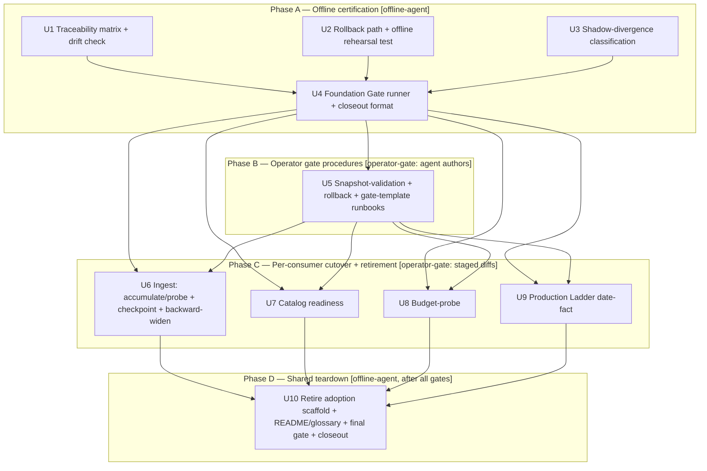
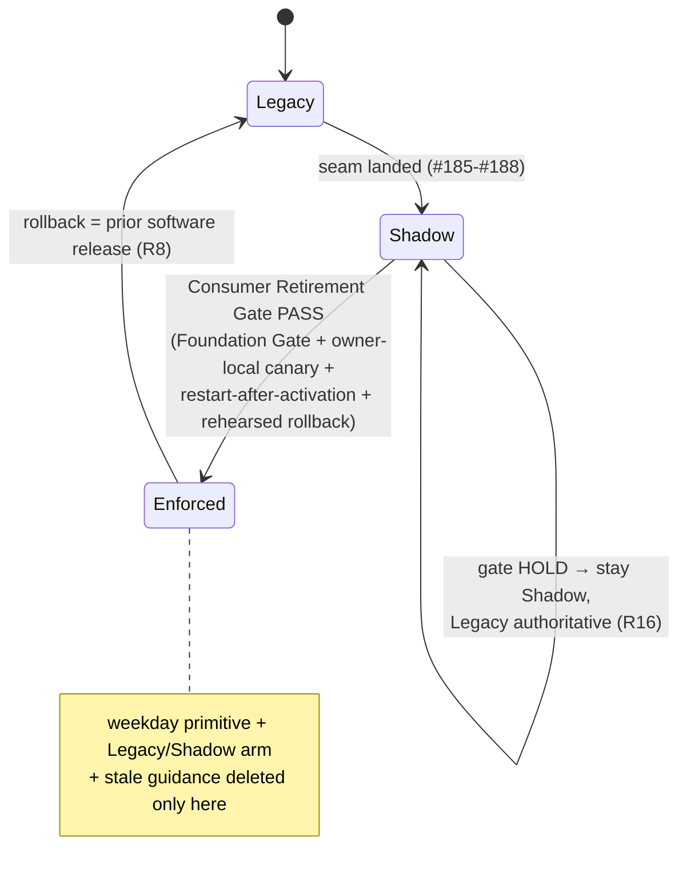
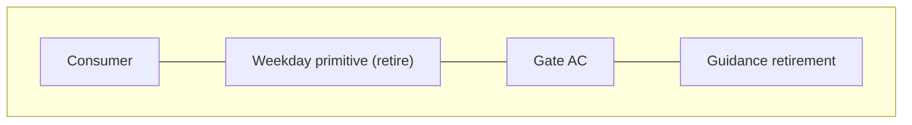

# Certify, Enforce, and Retire KRX Weekday-Era Behavior - Plan

## Goal Capsule

- **Objective:** Make every calendar-dependent consumer classify KRX sessions and holidays correctly — no consumer treats a holiday as a trading day or a weekday closure as an undetectable gap — by closing the shared offline KRX calendar migration (parent #184) as an operationally trustworthy adoption: certify the shared Calendar Foundation Gate offline, advance each of the six consumers independently from Shadow to Enforced behind its own Consumer Retirement Gate, and then remove the corresponding weekday-era behavior and guidance.
- **Authority:** Issue #189 acceptance criteria govern this closeout; parent #184 governs calendar truth, adoption policy, and gate definitions; `CONCEPTS.md` defines Calendar Adoption State / Calendar Foundation Gate / Consumer Retirement Gate; the merged `nautilus-ls-calendar` contracts and existing consumer safety invariants constrain implementation.
- **Execution profile:** Two-lane. The **offline agent lane** certifies, builds missing offline machinery (traceability matrix, rollback tooling + rehearsal test, Shadow-divergence classification), authors the per-consumer Enforced/retirement diffs, and authors turnkey operator runbooks — all fixed-clock, synthetic-fixture, no production snapshot / credentials / network. The **operator-attended live lane** executes each Consumer Retirement Gate (owner-local canary, restart-after-activation, rehearsed rollback, attended Ladder preflight) using those runbooks; that lane is out of agent reach and its passing is the merge trigger for the staged retirement diffs.
- **Stop conditions:** Stop if a change requires live KRX data, a production snapshot, a live gateway call, moving consumer action policy into the calendar core, or would delete a weekday primitive before its Consumer Retirement Gate has been recorded as passed. Stop if the shared adoption enum is cut before all six consumers have retired.
- **Tail ownership:** The implementation owns the offline certification pass, the new offline machinery, the staged retirement diffs, the operator runbooks, focused regression coverage, the full offline `make adapter-check` gate, and the public (non-sensitive) closeout record.

---

## Product Contract

**Product Contract preservation:** No upstream `ce-brainstorm` Product Contract exists; requirements below are derived from issue #189 and parent #184. `product_contract_source: ce-plan-bootstrap`.

### Summary

The shared calendar (#185) shipped with every consumer defaulting to Shadow (byte-identical to Legacy); #186/#187/#188 migrated the consumer seams. This capstone finishes the arc. It proves the calendar machinery is trustworthy entirely offline (Calendar Foundation Gate), fills the three offline gaps that block a defensible cutover (a traceability matrix, a rollback rehearsal, and classification of Shadow divergences), then walks each of the six consumers independently through its Consumer Retirement Gate — an operator-attended live ceremony — after which its weekday primitive and stale guidance are removed. Legacy protection stays authoritative until each consumer's own gate passes; the shared adoption scaffold is removed only after all six have retired.

### Problem Frame

The migration is code-complete at the seam level but not yet an operationally trustworthy adoption. Four things are missing:

1. **No certified offline gate.** The calendar-core, refresh, diagnostic, six-consumer, composition-root, and failure-inversion tests exist but are not assembled into one asserted Calendar Foundation Gate with a maintained traceability record mapping every named fixture scenario and consumer policy branch to an owning assertion (AC1, AC2).
2. **No rollback rehearsal.** `calendar_refresh` has forward `activate` with a stale-base guard and a predecessor-identity chain, but no rollback path and no rehearsal test proving the previous artifact and adoption state are restored (AC6).
3. **Shadow divergence is recorded, not classified.** Each consumer's Shadow arm emits a `tracing` record of the calendar-vs-weekday disagreement, but there is no classification of those divergences to review before enforcing a consumer (AC7).
4. **Weekday-era behavior and guidance are still authoritative.** Six weekday primitives and their operator guidance (README weekday cron, RUNBOOK holiday checkbox, budget-probe holiday-override narrative, catalog "undetectable holidays" warning, PAPER-CUTS #13) remain live because no consumer has passed its retirement gate (AC4, AC8–AC15).

The retirement gates are, by definition, live and operator-attended (`CONCEPTS.md`: "an owner-local canary, a restart after activation, and a rehearsed rollback — all operator-attended and live, so they sit outside the offline slice"). The agent therefore authors the retirement diffs and runbooks but cannot execute the ceremonies; merge of each staged diff waits on its recorded live gate.

### Requirements

**Certification (offline)**

- R1. The complete calendar-core, refresh, diagnostics, counterfactual fixture, six-consumer, composition-root, and failure-inversion surface passes offline with no production snapshot, credentials, network, real KRX-derived rows, or wall-clock-dependent fixtures, assembled as one nameable Calendar Foundation Gate. (AC1)
- R2. A maintained traceability record maps every named calendar fixture scenario and every consumer policy branch to an observable owning assertion, and a check fails when the record drifts from the assertions. (AC2)
- R3. The `calendar status` human and JSON contracts cover healthy, stale, Unknown, conflict, out-of-range, missing, corrupt, incompatible, unauthorized, and expired outcomes with required credential/authority redaction, each traced to an owning assertion. (AC3)
- R4. A rollback path restores a prior active snapshot and its recorded adoption/activation identity; an offline rehearsal test proves the previous artifact identity and adoption state are restored, complementing the restart-after-activation identity proof. (AC6 offline half)
- R5. Shadow divergences (calendar decision vs. weekday decision) are captured as classified, assertable observation data at each consumer boundary, so divergences can be reviewed and signed off before that consumer is enforced. (AC7 classification)

**Enforcement and independence (code, staged behind live gates)**

- R6. Each consumer advances independently through Legacy, Shadow, and Enforced; the Enforced path for a consumer contains no silent weekday arithmetic; and no consumer's retirement is used as evidence for another. Every affected process continues to emit its startup calendar record naming consumer, adoption state, snapshot identity, authorization, coverage, freshness, query result, alerts, and resulting action. (AC4, AC7)
- R7. A weekday primitive, its `Legacy | Shadow` match arm, its un-gated `legacy()` wrapper, and its stale operator guidance are removed only after that consumer's Consumer Retirement Gate is recorded as passed; before removal the change is authored but not merged. (AC15)
- R8. The shared adoption scaffold (`CalendarAdoption::Legacy`/`Shadow`, `ResultingAction::WeekdayAuthoritative`/`ShadowRecorded`/`ShadowUnavailable`) is removed only after all six consumers have retired; after removal, rollback is by prior software release, not a permanent dual implementation. (AC15)

**Per-consumer retirement gates (operator-attended runbooks authored here; live execution outside the agent)**

- R9. The owner-local production snapshot validates for the current KRX agreement and planned operating horizon without copying its dates, rows, statuses, evidence, alerts, or identities into public artifacts; a runbook makes this a repeatable operator check. (AC5)
- R10. A reviewed activation followed by process restart proves the expected new artifact identity is loaded; an explicit rollback rehearsal proves the previous artifact and adoption state are restored. A runbook makes both repeatable. (AC6 live half)
- R11. Accumulate receives a real post-close local canary proving Trading, Closed, Unknown, stale, and unavailable safety invariants before weekday scheduling is replaced with daily KST post-close invocation. (AC8)
- R12. Checkpoint migration and backward-widen warning paths receive their required local canaries before weekday continuity and raw civil-date behavior are removed. (AC9)
- R13. Catalog readiness receives a local status canary before the historical paper-cut is marked retired/shipped and its undetectable-holidays warning is replaced with calendar-backed behavior. (AC10)
- R14. Budget-probe automatic selection receives a local canary before holiday-specific override guidance is retired; explicit `LS_PROBE_SDATE`/`LS_PROBE_EDATE` ranges remain documented for reproducibility and recovery. (AC11)
- R15. Production Ladder receives an attended paper-session preflight showing calendar and manual confirmation agree without override, plus rollback proof, before only the manual holiday checkbox is removed; attended operation, paper-lane, account, catalog, watchdog, and Unknown-override guidance remain intact afterward. (AC12, AC13)
- R16. Any hold or rollback condition from the spec prevents the affected retirement and restores Legacy protection until corrected; each gate runbook encodes the hold conditions and the Legacy-restore fallback. (AC14)

**Closeout**

- R17. Public closeout records only non-sensitive gate verdicts and software/schema versions; owner-local canary facts, snapshot identities, and affected real dates remain local. (AC16)
- R18. The standalone adapter workspace gate (`make adapter-check`) passes offline after all enforced paths and documentation changes are complete. (AC1 final, closing AC)

### Key Flows

- F1. **Certify the Foundation Gate.** Assemble the existing offline suites plus the new traceability, rollback rehearsal, and divergence-classification coverage into one gate invocation; run it fixed-clock with no production snapshot/credentials/network; emit a non-sensitive verdict. (R1–R5)
- F2. **Advance one consumer to Enforced.** Operator validates the production snapshot (F3), runs the consumer's owner-local canary and restart/rollback rehearsal from its runbook, reviews the classified Shadow divergences, records the gate verdict; only then is the authored retirement diff merged, flipping that consumer's default to Enforced and deleting its weekday primitive + stale guidance. (R6, R7, R9–R16)
- F3. **Validate the production snapshot.** Operator confirms the owner-local snapshot is authorized for the current agreement and covers the planned horizon, using the validation runbook, without copying any KRX-derived facts into public artifacts. (R9, R17)
- F4. **Rehearse rollback.** Operator activates a candidate, restarts the process to prove the new artifact identity loads, then rolls back and restarts to prove the prior artifact identity and adoption state are restored. (R4, R10)
- F5. **Retire the shared scaffold.** After all six consumers are Enforced and their gates recorded, remove the shared `Legacy`/`Shadow` enum variants and weekday-authoritative actions, shift README/glossary to the enforced posture, and run the final offline gate. (R8, R17, R18)

### Acceptance Examples

- AE1. **Covers R1, R2.** Running the Foundation Gate offline (fixed clock, no snapshot/credentials/network) passes; deleting or renaming a named fixture scenario or a consumer policy branch without updating the traceability record makes the traceability check fail.
- AE2. **Covers R3.** For each of the ten `calendar status` outcomes, both the human and JSON forms render the expected outcome token and never contain a raw authority/credential string; the traceability record names the owning assertion for each.
- AE3. **Covers R4, R10.** Given an active snapshot A and a reviewed candidate B, activating B then rolling back restores an active snapshot whose `artifact_id` equals A's and whose recorded adoption/activation identity matches A's; the offline rehearsal test asserts this without a production artifact.
- AE4. **Covers R5, R7.** Given a fixture date where the calendar and weekday decisions disagree, a consumer in Shadow produces a classified divergence record (consumer, date, weekday decision, calendar decision, class) that a test can assert; the same consumer's Enforced arm, once its gate is recorded, contains no weekday call.
- AE5. **Covers R6.** Enforcing one consumer (e.g. catalog) leaves the other five on their prior adoption state and does not alter their startup records or behavior; the enforced consumer's startup record shows `adoption=enforced` and the enforced action.
- AE6. **Covers R11, R15.** Before the accumulate weekday cron is replaced with a daily KST post-close recipe, the accumulate runbook's canary section requires observed Trading/Closed/Unknown/stale/unavailable outcomes; before the Ladder holiday checkbox is removed, the Ladder runbook requires an attended paper-session preflight where calendar and manual confirmation agree with no override, plus a rollback proof.
- AE7. **Covers R8, R18.** The shared `CalendarAdoption::Legacy`/`Shadow` variants and `ResultingAction::WeekdayAuthoritative`/`ShadowRecorded`/`ShadowUnavailable` are removed only in the final unit; after removal `make adapter-check` passes offline and no consumer references a weekday primitive.
- AE8. **Covers R17.** The public closeout artifact contains only gate verdicts and software/schema versions — no snapshot identities, no affected real dates, no owner-local canary facts.

### Scope Boundaries

**In scope**

- The offline Calendar Foundation Gate certification: assembling, naming, and traceably mapping the existing + new offline suites (`nautilus-ls-calendar/tests/`, `adapters/nautilus/tests/calendar_*`, and the six consumer test seams).
- New offline machinery: a rollback/re-activate path + rehearsal test in `calendar_refresh`; classification of Shadow divergences at the six consumer boundaries; a traceability record + drift check; a Foundation Gate runner (e.g. a `make` target) and non-sensitive closeout format.
- Authored (staged) per-consumer Enforced-cutover + weekday-retirement diffs for all six consumers, each blocked on its recorded Consumer Retirement Gate.
- Authored turnkey operator runbooks: per-consumer Consumer Retirement Gate checklists, a production-snapshot validation runbook, and a rollback rehearsal runbook/script.
- Retirement of the shared adoption scaffold and shift of README/glossary to the enforced posture, after all four Consumer Retirement Gates (covering the six consumers) are recorded.
- The full offline `make adapter-check` gate and the public closeout record.

**Deferred to Follow-Up Work**

- **Live execution of the Consumer Retirement Gates** (owner-local canaries, restart-after-activation, live rollback rehearsal, attended Ladder paper-session preflight) is operator-attended and out of agent reach. The agent authors the runbooks and the staged diffs; a human runs the ceremonies and merges each staged diff on its recorded pass. Track live execution as attended follow-up per consumer.
- Completion of issue #186's remaining ingest proof/composition gaps (ingest Shadow seams are landed; #186's open items are the proof/composition closeout). The ingest retirement unit (U6) sequences behind #186.

**Outside this product's identity** (from parent #184 "Out of Scope")

- Session hours, auction phases, after-hours, intraday halts, schedule redesign; non-KRX-domestic-equity venues.
- Runtime KRX/KASI/web calls; web scraping; treating an unofficial calendar library as authoritative.
- Publishing or sharing KRX-derived calendar rows under current terms.
- Hot reload, global mutable calendar state, or automatic activation of refreshed candidates.
- A permanent dual implementation after a consumer's retirement gate passes.
- Changing unrelated ingest coverage rules, research methodology, gateway-budget accounting, Production Ladder non-date checks, watchdog behavior, or TR support state.

### Dependencies

- PR #190 (#185) merged: supplies `KrxCalendar`, `AsOfView`, `CalendarAdoption`, diagnostics, refresh/activation, the synthetic fixture, and the six consumer seams (all landed in Shadow).
- Issues #187 and #188 closed (research/probe and Production Ladder gate migrations). Issue #186 (ingest) open — its Shadow seams are landed and wired; its remaining proof/composition work sequences ahead of U6.
- The production snapshot is owner-local and gitignored (`adapters/nautilus/.gitignore`: `/state`, `/calendar-snapshots`, `*.calendar.json*`); the offline lane never depends on it.
- `make adapter-check` (`cd adapters/nautilus && cargo test --workspace`) is the cross-workspace gate; the root `cargo test` never touches the standalone adapter.

---

## Planning Contract

### Key Technical Decisions

- KTD1. **Two lanes, one plan, explicit per-unit tag.** Every implementation unit is tagged **[offline-agent]** (author + test + merge offline) or **[operator-gate]** (agent authors a runbook and/or a staged diff; a human executes the live ceremony and merges the staged diff). The plan is honest that the live cutover is not agent-executed; nothing merges a weekday-primitive deletion until its gate is recorded.
- KTD2. **Certify before touching any consumer.** The Foundation Gate (U1–U4) is a hard prerequisite for every retirement (`CONCEPTS.md`: the Foundation Gate must pass "before *any* weekday-era workaround is retired"). Enforcement units depend on the certification units.
- KTD3. **Adoption is a single global env selector; independence is achieved by per-consumer arm removal, scoped to four process-level gates.** `LS_CALENDAR_ADOPTION` (default Shadow) is process-wide, and it is per-*process*: the six consumer boundaries live in four separate binaries — the three ingest boundaries (accumulate/probe, checkpoint continuity, backward-widen) share the `ls-ingest` process; catalog (`lab-research`), budget-probe, and Ladder (`lab-live`) are their own processes. "Enforce consumer X" = delete X's `Legacy | Shadow` match arm + its weekday primitive + its un-gated `legacy()` wrapper, so X's only remaining path is Enforced regardless of the env value. There are therefore **four Consumer Retirement Gates** covering the six consumer boundaries: the ingest gate retires the three ingest boundaries together (they share a process and a `LS_CALENDAR_ADOPTION` value; U6), and catalog/budget-probe/Ladder each have their own gate. "Advances independently" (R6) and "arms are removed one at a time" apply at this four-gate granularity; the shared enum variants survive until the last gate is recorded (U10). Reconciles with AE5, which treats each of the four processes as one enforcement unit.
- KTD4. **Reuse the existing test seams; do not rewrite them as helper-only tests.** The consumer failure-inversion tests already exist (`tests/ingest.rs`, `lab/tests/research_cli.rs`, `tests/budget_probe_composition.rs`, `lab/tests/dispatch_checks.rs`). Certification maps them into the traceability record and adds the missing rows; retirement units update them to drop the now-deleted Legacy/Shadow assertions rather than replacing the seam.
- KTD5. **Rollback is forward-activate of the prior snapshot with an explicit rollback record, not a new mutable path.** Implement rollback as a first-class operation over the existing atomic activation machinery (reuse `atomic_install_owner_only`, the predecessor-identity chain, `ActivationRecord`), adding a `RollbackRecord` that names the restored `artifact_id` and adoption/activation identity. This keeps the "no hot-reload / no global mutable state" invariant (parent #184) and makes the rehearsal assertable offline.
- KTD6. **Shadow divergence classification is observation data, non-persisted.** Represent each consumer's calendar-vs-weekday disagreement as a structured, testable observation (consumer, date, weekday decision, calendar decision, divergence class) emitted on the existing redacted diagnostic channel — never on persisted state or stdout data products, preserving Shadow byte-equivalence to Legacy.
- KTD7. **Preserve the Production Ladder time-of-day half.** Only `WeekdayKrxCalendar::date_fact` (the Sat/Sun→Closed weekday date decision) retires. `WeekdayKrxCalendar::in_time_window` / `check_session_window` (the 09:00–15:30 KST window) is deliberately preserved (parent #184 U12); do not delete it.
- KTD8. **Guidance retirement keeps the recovery levers.** Retiring holiday-era narrative preserves the mechanisms it described: the budget-probe `LS_PROBE_SDATE`/`LS_PROBE_EDATE` bypass and its audit record stay (only the "holidays need an override" framing goes); the PAPER-CUTS #13 historical defect text stays (only the "deferred #189" hedge is finalized to retired/shipped); the accumulate post-close KST semantics stay (only the `1-5` weekday cron restriction goes).
- KTD9. **Closeout is verdict-only.** The public closeout record (in-repo) carries gate names, pass/hold verdicts, and software/schema versions. Owner-local canary facts, snapshot identities, and affected real dates live only in the operator's local gate log, never in a committed artifact.

### High-Level Technical Design

*Directional guidance for reviewers — prose and the acceptance examples are authoritative where they disagree.*

#### Phase and dependency flow (offline lane → operator lane → teardown)

#### Per-consumer adoption state machine and its authorizing gate

#### Consumer → weekday primitive → gate → retirement target (decision matrix)

| Consumer | Weekday primitive to delete | Keep (do not touch) | Gate AC | Guidance retirement |
|---|---|---|---|---|
| Accumulate / probe | `last_closed_session` weekday anchor; `Legacy\|Shadow` arms in `CalendarGate::action`/`range_action`/`probe_anchor` | close-buffer/KST post-close semantics | AC8 | README cron `0 17 * * 1-5` → daily KST post-close |
| Checkpoint continuity | `weekday_strictly_between` (`checkpoint.rs`) + its arms | atomic save, backward-widen floor persistence | AC9 | — (code comment only) |
| Backward-widen | weekday continuity in `mod.rs:411-439`, `BackwardWidenWarningAction` arms | warning surface, `history_floors` | AC9 | — |
| Catalog readiness | `last_weekday_on_or_before` (`research.rs`) + arms | Enforced boundary logic, stale-GO | AC10 | PAPER-CUTS #13 → retired/shipped; `research.rs` "undetectable" comment; README catalog section |
| Budget-probe | `recent_trading_day` weekday anchor + `Legacy\|Shadow` arm | `LS_PROBE_SDATE/EDATE` bypass + audit | AC11 | budget-probe holiday-override doc; README probe section |
| Production Ladder | `WeekdayKrxCalendar::date_fact` + `Legacy\|Shadow` arm in `live.rs` | `in_time_window`/`check_session_window` (KTD7); all non-date checks | AC12/AC13 | RUNBOOK-rung1 line 13 holiday checkbox ONLY |

### Sequencing

1. **Phase A [offline-agent]:** Build the three missing offline pieces (U1 traceability, U2 rollback rehearsal, U3 divergence classification), then assemble and name the Foundation Gate + closeout format (U4). Merge offline once green.
2. **Phase B [operator-gate authoring]:** Author the production-snapshot validation runbook, the rollback rehearsal runbook, and the generic Consumer Retirement Gate template (U5). Merge the runbooks offline; they are executed live per consumer.
3. **Phase C [operator-gate, staged]:** For each consumer (U6 ingest — after #186; U7 catalog; U8 budget-probe; U9 Ladder), author the Enforced-cutover + weekday-retirement diff and the consumer's gate checklist. Each diff merges only after its live gate is recorded. Consumers are independent; order within Phase C is operator-chosen (recommend catalog/budget-probe first as lowest-risk, Ladder last).
4. **Phase D [offline-agent]:** After all four Consumer Retirement Gates recorded (covering the six consumers), retire the shared adoption scaffold, shift README/glossary to the enforced posture, run the final offline gate, and write the verdict-only closeout (U10).

### System-Wide Impact

- **Operators:** Gain turnkey retirement runbooks and a verdict-only closeout. After each cutover, the corresponding weekday workaround disappears; the daily-KST accumulate recipe replaces the weekday cron.
- **Safety posture:** Until each consumer's gate passes, Legacy stays authoritative (fail-safe). Enforced paths have no weekday fallback; a mislabeled `Closed` (see the per-(source,date) merge learning) becomes a coverage hazard, so the divergence classification (U3) and the failure-inversion suite (U4) are the guardrails.
- **Rollback semantics change at the boundary:** before a consumer's gate, rollback = restore Legacy behavior; after, rollback = deploy the prior software release (R8). The final scaffold removal (U10) is the point where dual-implementation rollback ends.
- **Compatibility:** Public calendar-core contracts are unchanged. The affected surface is the standalone adapter's consumer decisions, binaries, and docs. No snapshot schema change, no bulk backfill.
- **Publication boundary:** unchanged — no KRX-derived rows enter any committed artifact; closeout is verdict-only (KTD9, R17).

### Risks and Mitigations

- **A weekday primitive is deleted before its gate passes.** Mitigation: KTD1/R7 — retirement diffs are authored but staged, and merge is blocked *mechanically*: a CI/`adapter-check` assertion (U5) fails any diff deleting a consumer's weekday primitive unless that consumer's committed gate-verdict record is present and PASS. This is a technical gate, not reviewer discipline — a batch merge or an uninformed approver cannot bypass it. The per-unit tag and the gate template's hold conditions (R16) make the ordering explicit.
- **The migration stalls half-migrated (the opposite failure to premature deletion).** The migration's value lands only when each consumer's live gate is recorded, yet all four live gates (plus #186) are deferred to operator follow-up. If a ceremony stalls, U10 never fires and the shared `Legacy`/`Shadow` scaffold persists indefinitely — the "permanent dual implementation" the plan lists as outside its identity. Mitigation: assign a per-consumer completion owner and a by-when/escalation trigger for the deferred live gates; state the interim policy for a partially-enforced system (how long a consumer may sit in Shadow, and who reviews that the shared scaffold is still carried). This is an operator-ownership decision to settle at hand-off, not an agent task.
- **Enforcing one consumer regresses another (shared enum coupling).** Mitigation: KTD3 — remove arms one at a time; keep the shared enum until U10; AE5 asserts the other five are untouched after one cutover.
- **Rollback rehearsal passes offline but the live restore drifts.** Mitigation: U2 proves artifact-identity + adoption-state restore offline against the real activation machinery; U5's live runbook repeats the same assertions against the production snapshot with restart proof (F4).
- **Divergence "recorded but not classified" — or "classified but not collected" — hides an unsafe disagreement before enforcement.** Mitigation: U3 makes divergences a classified, assertable record, and the operator captures the redacted divergence channel over the Shadow window into an owner-local, gitignored divergence log (U5 step) that each gate reviews (R5, AC4 sign-off). Collecting the corpus prevents a vacuous sign-off against a transient log stream, catching a calendar-vs-weekday split before the weekday fallback is removed.
- **Guidance retirement removes a recovery lever.** Mitigation: KTD8 — keep the budget-probe bypass, PAPER-CUTS history, and accumulate KST semantics; only the holiday-era narrative retires.
- **Cross-workspace gate blind spot.** Mitigation: every unit runs `make adapter-check` (root `cargo test` never covers the adapter — see `docs/solutions/workflow-issues/cross-workspace-gate-blind-spot-...`). Run the workspace gate from `adapters/nautilus` (CWD trap).
- **#186 not yet landed when U6 starts.** Mitigation: U6 depends on #186 proof completion; its Shadow seams are already landed, so U6 is a retirement, not a re-migration, but its failure-inversion assertions assume #186's proof suite exists.

### Alternative Approaches Considered

- **Certification-only plan, defer all enforcement/retirement to a follow-up.** Rejected (user-confirmed full-arc): drops most of #189's "enforce and retire" ACs and leaves the weekday primitives live indefinitely.
- **Execute the retirement as offline-merged units, assuming the live gates run out-of-band.** Rejected: the glossary places the gates "outside the offline slice"; merging a weekday-primitive deletion before its live canary/restart/rollback would violate R7/AC15 and remove Legacy protection prematurely.
- **A per-consumer adoption flag instead of a single global env var.** Rejected: the shipped model is one global `LS_CALENDAR_ADOPTION`; independence is already achievable by per-consumer arm removal (KTD3). Adding per-consumer flags is scope the spec did not ask for and would itself become adoption-switch debt to retire.
- **Implement rollback as a new mutable calendar path.** Rejected: violates the "no hot-reload / no global mutable state" invariant. Rollback as forward-activate of the prior snapshot (KTD5) reuses the audited atomic machinery.

---

## Implementation Units

### U1. Traceability matrix + drift check

**[offline-agent]**

**Goal:** Author a maintained record mapping every named calendar fixture scenario (S1–S12) and every consumer policy branch to an observable owning assertion, plus a check that fails when the record drifts from the assertions.

**Requirements:** R2, R3; F1; AE1, AE2; KTD2, KTD4.

**Dependencies:** none.

**Files:**

- Create `adapters/nautilus/nautilus-ls-calendar/TRACEABILITY.md` (or `docs/` under the adapter) — the fixture-scenario → assertion and policy-branch → assertion matrix.
- Create/modify `adapters/nautilus/nautilus-ls-calendar/tests/traceability.rs` — a test asserting every named scenario/branch listed in the matrix resolves to a real, currently-passing assertion (drift check).
- Reference (read): `nautilus-ls-calendar/tests/{fixtures,contract,errors,boundary_time,diagnostics}.rs`; the six consumer test files.

**Approach:** Enumerate the 12 fixture scenarios (S1–S12, from `build_base_snapshot`) and the consumer policy branches (per the decision matrix: each consumer's Trading/Closed/Unknown/unavailable/stale arm). Author the matrix as a table linking each to its owning test function name. Make the drift check machine-verifiable: the simplest durable form is a test that lists the expected `(scenario|branch → test-fn)` pairs and asserts each named test exists and the fixture still contains each named scenario date; a missing scenario or renamed branch fails the check. Keep the matrix human-readable (it is also the reviewer's map).

**Patterns to follow:** the reproducible-fixture generator convention in `nautilus-ls-calendar/tests/fixtures.rs`; the diagnostics per-outcome tests for the ten `calendar status` outcomes (R3 rows).

**Execution note:** Build the matrix from the assertions that already exist first; only after it is complete flag any scenario/branch with no owning assertion as a gap to fill (a failing row), rather than inventing new coverage speculatively.

**Test scenarios:**

1. The drift check passes against the current tree (every matrix row resolves to an existing test and fixture scenario).
2. Removing or renaming a named fixture scenario (e.g. S11 first-party disagreement) without updating the matrix fails the drift check with a message naming the missing scenario. *(Covers AE1.)*
3. Each of the ten `calendar status` outcomes (healthy, stale, Unknown, conflict, out-of-range, missing, corrupt, incompatible, unauthorized, expired) has a matrix row naming its owning human-form and JSON-form assertion. *(Covers AE2, R3.)*
4. Each consumer policy branch (six consumers × {Trading, Closed, Unknown, unavailable}) has a matrix row; a branch with no owning assertion appears as an explicit gap row, not a silent omission.

**Verification:** The matrix exists, is human-readable, and its drift check is part of the Foundation Gate; every named scenario and policy branch resolves to a real assertion or an explicit tracked gap.

### U2. Rollback path + offline rehearsal test

**[offline-agent]**

**Goal:** Add a first-class rollback operation over the existing atomic activation machinery and an offline rehearsal test proving the previous artifact identity and adoption/activation identity are restored.

**Requirements:** R4; F4; AE3; KTD5.

**Dependencies:** none.

**Files:**

- Modify `adapters/nautilus/src/calendar_refresh/activate.rs` — add a `rollback(active_path, prior_snapshot, approval, as_of)` operation + `RollbackRecord`.
- Modify `adapters/nautilus/src/bin/calendar-activate.rs` (or a sibling `calendar-rollback` subcommand) — expose rollback to the operator.
- Modify `adapters/nautilus/tests/calendar_activate.rs` — the offline rehearsal test.

**Approach:** Implement rollback as forward-activate of a prior snapshot: reuse `atomic_install_owner_only`, the predecessor-identity chain, and `ActivationRecord`, but record a `RollbackRecord` naming the restored `artifact_id`, the superseded `artifact_id`, operator, reason, and `as_of`. Preserve the activation guards (approval non-blank, candidate revalidation through `KrxCalendar::from_snapshot`, owner-only 0o600 install). Rollback does not require the stale-base guard against the just-installed artifact (it is intentionally superseding it) — instead it asserts the prior snapshot is a valid, authorized `KrxCalendar` **and that it covers the `as_of` operating horizon**, then records the supersession. The coverage check matters: `KrxCalendar::from_snapshot` at `as_of` proves load-validity and authorization but not that the snapshot's materialized coverage still includes today — coverage is a per-date query that returns `OutOfRange`, not a load failure. Without it, an emergency rollback could silently install a prior snapshot whose coverage has lapsed, so every Enforced consumer then returns `OutOfRange`/Unknown and refuses — an operational halt the operator misreads as "rollback failed" rather than "prior snapshot no longer covers today." Rollback therefore refuses (or explicitly surfaces) a prior snapshot that is stale or does not cover `as_of`. Keep the "no hot-reload / no global mutable state" invariant: rollback installs a file and requires a process restart to take effect (the restart-identity proof is the operator's, F4).

**Patterns to follow:** `activate()` guard ordering and `ActivationRecord` in `activate.rs`; the offline synthetic-snapshot activation tests (`happy_valid_reviewed_candidate_...`, `installed_snapshot_is_owner_readable_only_0o600`); `atomic_install_owner_only`.

**Execution note:** Start with a failing rehearsal test that activates B over A, then rolls back to A, and asserts the active file's recomputed `artifact_id` equals A's and a `RollbackRecord` names the restore; then implement until green.

**Test scenarios:**

1. Activate candidate B over active A, then rollback to A: the active snapshot's recomputed `artifact_id` equals A's; a `RollbackRecord` names restored=A, superseded=B, operator, reason. *(Covers AE3.)*
2. Rollback preserves owner-only 0o600 permissions on the restored file.
3. Rollback of a corrupt/unauthorized/expired prior snapshot is refused with a typed error and leaves the active file unchanged (fail-closed; never silently Unknown).
3a. Rollback to a prior snapshot whose materialized coverage does not include the `as_of` date (stale/out-of-range for today) is refused or explicitly surfaced — not silently installed — so rollback cannot leave every Enforced consumer refusing on `OutOfRange`.
4. Rollback with blank approval (no operator/reason) is refused.
5. The restored active snapshot loads through the real `KrxCalendar::load_from_path` and its adoption/activation identity chain is intact (predecessor references consistent).

**Verification:** A rollback operation exists, reuses the atomic install path, and the offline rehearsal proves prior artifact + adoption/activation identity restoration without a production snapshot.

### U3. Shadow-divergence classification

**[offline-agent]**

**Goal:** Turn each consumer's recorded calendar-vs-weekday disagreement into a classified, assertable observation that can be reviewed before that consumer is enforced.

**Requirements:** R5, R6; F1; AE4; KTD6.

**Dependencies:** none (touches the six consumer Shadow arms).

**Files:**

- Modify `adapters/nautilus/src/calendar.rs` — a shared `DivergenceClass` + divergence observation type (consumer, date, weekday decision, calendar decision, class), emitted on the redacted diagnostic channel.
- Modify the six Shadow arms: `src/ingest/mod.rs` (`CalendarGate::action`/`range_action`/`probe_anchor`/`continuity_decision`/`widen_action`), `src/ingest/checkpoint.rs` (`migrate_completed_watermarks_gated`), `lab/src/runner/research.rs` (`catalog_status_gated`), `src/bin/budget-probe.rs` (`plan_probe_dates`), `lab/src/runner/live.rs` (`resolve_date_fact_and_record`).
- Modify the corresponding consumer test files to assert the classified divergence records.

**Approach:** Define a small closed set of divergence classes (e.g. `Agree`, `CalendarClosedWeekdayOpen`, `CalendarUnknownWeekdayOpen`, `CalendarOpenWeekdayClosed`, `Unavailable`). Each consumer's existing Shadow record (currently a free-form `tracing::info!`) is upgraded to emit the structured observation with its class. The *runtime* observation stays non-persisted and off stdout data products so Shadow stays byte-identical to Legacy (the existing byte-equivalence tests must still pass — the observation is emitted on the redacted diagnostic/stderr channel, not into checkpoint/watermark state or a stdout data product). **Resolve the "non-persisted vs. reviewable" tension explicitly:** a durable review corpus is required for the gate to sign off (R5), but it must not become runtime state. The operator captures the redacted divergence channel over the Shadow observation window into an owner-local, gitignored divergence log (an operator step in U5's runbook, not runtime persistence) — this is the artifact each Consumer Retirement Gate reviews. That capture is compatible with KTD6 (it is neither persisted runtime state nor a stdout data product) and KTD9 (owner-local, redacted). The classification is not a new decision input — the weekday path stays authoritative in Shadow.

**Patterns to follow:** the redacted diagnostic channel + field-level redaction in `src/calendar.rs`; the existing `shadow_records_the_disagreeing_decision_but_proceeds` / `shadow_is_byte_identical_to_legacy_...` tests (extend, don't replace); KTD7 divergence data conventions in the #186 plan (`Shadow diagnostics must be assertable but non-persisted`).

**Execution note:** Preserve Shadow byte-equivalence — after adding classification, re-run each consumer's Legacy-vs-Shadow byte-identical test; the observation must not leak into persisted state or stdout.

**Test scenarios:**

1. For a fixture date where calendar and weekday disagree, each consumer in Shadow emits one classified divergence observation with the correct class, consumer name, and date. *(Covers AE4.)*
2. For a fixture date where they agree, the class is `Agree` (or no divergence is emitted, per chosen convention) and the record is consistent across consumers.
3. Shadow remains byte-identical to Legacy after classification: the persisted checkpoint/watermark/marker bytes and stdout products are unchanged (existing byte-equivalence tests stay green).
4. The divergence observation is redacted — no authority/credential/maintainer identity appears.
5. An unavailable calendar in Shadow classifies as `Unavailable` and still leaves the weekday path authoritative.

**Verification:** Every consumer emits classified, assertable, redacted divergence observations in Shadow; Shadow stays byte-identical to Legacy; the classification is what each gate reviews.

### U4. Foundation Gate runner + non-sensitive closeout format

**[offline-agent]**

**Goal:** Assemble and name the Calendar Foundation Gate as one offline invocation covering core, refresh, diagnostics, fixtures, six consumers, composition-root, failure-inversion, traceability (U1), rollback rehearsal (U2), and divergence classification (U3); define the verdict-only closeout format.

**Requirements:** R1, R2, R3, R17; F1; AE1, AE2, AE8; KTD2, KTD9.

**Dependencies:** U1, U2, U3.

**Files:**

- Modify the **root** `Makefile` — add a `foundation-gate` target that (like the existing `adapter-check` target) `cd`s into `adapters/nautilus` and runs the assembled offline suite fixed-clock with no snapshot/credentials/network. `adapters/nautilus/` has no Makefile of its own, so the target lives in the root Makefile and is invoked as `make foundation-gate` from the repo root.
- Create `adapters/nautilus/CLOSEOUT.md` (verdict-only closeout template) — gate names, pass/hold verdicts, software/schema versions; no owner-local facts.
- Modify `adapters/nautilus/README.md` — document the Foundation Gate command and what it proves.

**Approach:** The Foundation Gate is a named, reproducible offline invocation (a root-`Makefile` `foundation-gate` target that runs the calendar-core, refresh, activation, diagnostics, fixtures, six-consumer, composition-root, and failure-inversion tests, plus U1's traceability drift check, and the U4 closeout-scan check below). It mirrors `adapter-check`: it `cd`s into `adapters/nautilus` internally and is run as `make foundation-gate` from the repo root. It asserts the offline contract: fixed clock, no `LS_CALENDAR_SNAPSHOT` production artifact, no credentials, no network, no real KRX-derived rows. Add a lightweight **closeout-scan** assertion that fails the gate when `CLOSEOUT.md` matches an `artifact_id`/snapshot-identity hash pattern or an ISO calendar-date pattern, machine-enforcing the verdict-only publication boundary (KTD9, R17) instead of relying on human review alone. This unit does not change consumer behavior; it certifies and packages.

**Patterns to follow:** the existing `adapter-check` target (`cd adapters/nautilus && cargo test --workspace`, defined in the root Makefile); the `CONCEPTS.md` Calendar Foundation Gate definition; the diagnostics ten-outcome tests.

**Execution note:** This is packaging/certification; prefer proving the gate is complete (every offline suite is included and the traceability + closeout-scan checks run) over adding new behavioral coverage. Project memory warns `make` can break in spawned shells — if the target proves flaky under the agent lane, define `foundation-gate` as a documented composite `cargo test` invocation instead. Run `make adapter-check` from `adapters/nautilus` (CWD trap).

**Test scenarios:**

1. `make foundation-gate` passes offline with no production snapshot, credentials, network, or wall-clock-dependent fixture. *(Covers AE1, R1.)*
2. The gate includes the traceability drift check (U1), the rollback rehearsal (U2), and the divergence-classification assertions (U3) — removing any makes the gate incomplete (verified by the traceability matrix listing them).
3. The closeout template, when filled, contains only gate verdicts and software/schema versions; the automated closeout-scan fails the gate if `CLOSEOUT.md` contains an `artifact_id`/snapshot-identity hash or an ISO calendar date, so the publication boundary is machine-enforced, not review-only. *(Covers AE8, R17.)*
4. `Test expectation:` the ten `calendar status` outcomes are each traced and pass in human + JSON form under the gate. *(Covers AE2, R3.)*

**Verification:** One named offline Foundation Gate invocation proves the full matrix offline; the closeout format is verdict-only; the gate is the prerequisite recorded before any consumer retirement.

### U5. Operator gate runbooks — snapshot validation, rollback rehearsal, gate template

**[operator-gate: agent authors, operator executes]**

**Goal:** Author turnkey operator procedures for the live ceremonies: production-snapshot validation, restart-after-activation + rollback rehearsal, and a generic Consumer Retirement Gate template encoding hold conditions and the Legacy-restore fallback.

**Requirements:** R9, R10, R16, R17; F2, F3, F4; AE6; KTD1, KTD8, KTD9.

**Dependencies:** U4.

**Files:**

- Create `adapters/nautilus/RUNBOOK-calendar-snapshot.md` — production-snapshot validation procedure (authorization for current agreement, coverage for planned horizon, publication-boundary discipline).
- Create `adapters/nautilus/RUNBOOK-calendar-rollback.md` — activation → restart-identity proof → rollback → restart-restore proof, using U2's operations.
- Create `adapters/nautilus/RUNBOOK-consumer-retirement-gate.md` — generic per-consumer gate template: Foundation Gate recorded, owner-local canary, restart/rollback rehearsal, classified-divergence review (against the owner-local divergence-log corpus captured per U3), hold conditions, Legacy-restore fallback, and verdict recording split into an owner-local gate log (facts/dates) vs. a committed non-sensitive gate-verdict record (PASS/HOLD only) — see the merge-block below.
- Modify `adapters/nautilus/README.md` — link the runbooks from the adoption-states section; document the `LS_CALENDAR_ADOPTION` global-env footgun (setting it to `enforced` process-wide during a canary flips every not-yet-retired consumer in that process — run canaries with per-consumer scoping, never a global enforced flip).
- Modify the root `Makefile` / `.github/workflows/adapter-check.yml` (or `make adapter-check`) — add the mechanical merge-block assertion (below).

**Approach:** These are operator artifacts plus one mechanical guard. The snapshot-validation runbook makes R9 a repeatable check that never copies KRX-derived facts into public artifacts, and names the record-boolean-not-dates rule (the operator inspects real KRX coverage dates to validate the horizon but records only a PASS/HOLD in the committed verdict record — dates stay in the owner-local log). The rollback runbook operationalizes U2 with restart steps the operator runs on the live process (the restart-identity proof the agent cannot execute) and the coverage-for-`as_of` check from U2. The gate template is the reusable spine each Phase C consumer specializes; it names the hold conditions (any calendar authorization/integrity/coverage failure, an unreviewed divergence, a failed canary) that force HOLD → stay Shadow, Legacy authoritative (R16); the divergence review reads the owner-local corpus from U3, not a transient log stream. **Mechanical merge-block (the plan's central safety guarantee made technical, not review-only):** define a committed, non-sensitive per-consumer gate-verdict record (e.g. `adapters/nautilus/gate-verdicts/<consumer>.json` carrying only PASS/HOLD + software/schema versions, no KRX facts) and a CI/`adapter-check` assertion that fails any diff which deletes a consumer's weekday primitive or `Legacy | Shadow` arm unless that consumer's verdict record is present and PASS. This turns "merge is blocked on the recorded gate" (KTD1/R7) into a technical gate rather than reviewer discipline, so a batch merge or an uninformed approver cannot remove a Legacy fallback before its live canary runs.

**Patterns to follow:** `adapters/nautilus/lab/RUNBOOK-rung1.md` (the attended-operation runbook shape, precondition checklists, hold semantics).

**Execution note:** This is documentation; no unit tests. Verification is a review check that each runbook is executable step-by-step and that the gate template's hold/rollback conditions map 1:1 to R16 and the parent-#184 hold conditions.

**Test scenarios:**

1. `Test expectation: none — operator documentation.` Review verifies: the snapshot-validation runbook checks authorization for the current agreement and coverage for the planned operating horizon, and forbids copying KRX-derived facts into committed artifacts (R9, R17).
2. `Test expectation: none.` Review verifies the rollback runbook includes a restart-after-activation identity proof and a rollback-restore proof referencing U2's `RollbackRecord`. *(Covers AE6 rollback half, R10.)*
3. `Test expectation: none.` Review verifies the gate template enumerates hold conditions and the Legacy-restore fallback, and separates owner-local verdict logging from the public verdict-only closeout (R16, KTD9).
4. The mechanical merge-block has a test: a diff that deletes a consumer's weekday primitive without a present-and-PASS committed gate-verdict record fails `adapter-check`/CI; the same diff with the PASS record passes. *(Covers KTD1, R7.)*
5. `Test expectation: none.` Review verifies the gate template's divergence-review step reads the owner-local divergence-log corpus captured per U3 (not a transient stream), so the sign-off is against a durable artifact.

**Verification:** Three executable operator runbooks exist and are linked from the README; the gate template is the reusable spine for Phase C; hold/rollback conditions are complete; and a mechanical merge-block technically prevents deleting a weekday primitive before its gate-verdict record is PASS.

### U6. Ingest cutover + weekday retirement — accumulate/probe, checkpoint, backward-widen

**[operator-gate: staged diff, blocked on ingest Consumer Retirement Gate + #186]**

**Goal:** Author the staged diff that enforces the three ingest consumers and removes their weekday primitives and stale guidance, plus the ingest gate checklist; merge only after the live ingest canaries (AC8, AC9) are recorded.

**Requirements:** R6, R7, R11, R12, R16; F2; AE4, AE5, AE6; KTD3, KTD4, KTD8.

**Dependencies:** U4, U5; issue #186 proof/composition closeout.

**Files:**

- Modify `adapters/nautilus/src/ingest/mod.rs` — remove `Legacy | Shadow` arms in `CalendarGate::action`/`range_action`/`probe_anchor`/`continuity_decision`/`widen_action`; remove the un-gated `legacy()` wrappers; drop the `last_closed_session` weekday anchor from the Enforced path.
- Modify `adapters/nautilus/src/ingest/checkpoint.rs` — remove `weekday_strictly_between` and the un-gated `migrate_completed_watermarks`/`load`.
- Modify `adapters/nautilus/src/bin/ls-ingest.rs` — Enforced-only composition; keep startup record.
- Modify `adapters/nautilus/README.md` — replace the `0 17 * * 1-5` weekday cron (lines ~185–201) with a daily KST post-close recipe whose calendar policy decides safety; keep the post-close/close-buffer semantics.
- Modify `adapters/nautilus/tests/ingest.rs` — drop the now-dead Legacy/Shadow assertions; keep and extend the Enforced failure-inversion tests.
- Create `adapters/nautilus/RUNBOOK-retire-ingest.md` — ingest Consumer Retirement Gate checklist (specializes U5 template) covering the accumulate post-close canary and the checkpoint + backward-widen canaries.

**Approach:** This is a deletion + de-branching diff, not new behavior — the Enforced logic already exists and is tested. Remove each ingest consumer's weekday primitive, its `Legacy | Shadow` arm, and its `legacy()` wrapper so Enforced is the only path (KTD3). Update tests to drop assertions on the deleted arms while preserving the Enforced/failure-inversion coverage. Rewrite the README accumulate recipe to a daily KST post-close invocation (KTD8 keeps the post-close semantics; only the `1-5` weekday restriction goes). The diff is authored and reviewed but **not merged** until the ingest gate checklist is recorded live (owner-local canary showing Trading/Closed/Unknown/stale/unavailable safety per AC8, plus checkpoint + backward-widen canaries per AC9).

**Patterns to follow:** the landed ingest Shadow/Enforced seams (agent-2 map); the byte-equivalence and failure-inversion tests in `tests/ingest.rs`; the per-(source,date) merge-granularity learning (`docs/solutions/logic-errors/safety-invariant-proven-at-a-leaf-...`) — the Enforced coverage-advance hazard this guards.

**Execution note:** Depends on #186's proof suite existing; do not delete a weekday primitive until the ingest gate is recorded (R7). Run `make adapter-check` from `adapters/nautilus`.

**Test scenarios:**

1. After removing the ingest `Legacy | Shadow` arms, the ingest failure-inversion tests (Unknown → no request/no advance; Trading → one request; Closed → advance without request; unavailable → stop + preserve state) still pass under Enforced-only. *(Covers AE4 Enforced half.)*
2. Enforcing ingest leaves catalog, budget-probe, and Ladder on their prior adoption state and behavior unchanged. *(Covers AE5.)*
3. `weekday_strictly_between`, `last_closed_session` weekday usage, and the `legacy()` wrappers are gone; a grep/compile check confirms no ingest Enforced path references a weekday primitive. *(Covers R6, R7.)*
4. The README accumulate recipe is a daily KST post-close invocation; the post-close/close-buffer semantics are preserved and the `0 17 * * 1-5` restriction is gone. *(Covers R11 guidance half.)*
5. The ingest gate checklist requires the AC8 accumulate canary and AC9 checkpoint/backward-widen canaries before merge. *(Covers R16.)*
6. `Test expectation:` existing overlap-refusal, PaperThin, crash-safe-save, and backward-widen-floor tests remain green.

**Verification:** The ingest Enforced-only diff is authored and green offline; no ingest weekday primitive remains; the accumulate guidance is daily-KST; merge is gated on the recorded ingest canaries.

### U7. Catalog readiness cutover + retirement

**[operator-gate: staged diff, blocked on catalog Consumer Retirement Gate]**

**Goal:** Author the staged diff enforcing catalog readiness, removing its weekday primitive, finalizing the PAPER-CUTS record and the "undetectable holidays" warning, plus the catalog gate checklist; merge after the AC10 canary.

**Requirements:** R6, R7, R13, R16; F2; AE5; KTD3, KTD4, KTD8.

**Dependencies:** U4, U5.

**Files:**

- Modify `adapters/nautilus/lab/src/runner/research.rs` — remove `last_weekday_on_or_before` and the non-Enforced `else` branches in `catalog_status_gated`; remove the `catalog_status` un-gated wrapper; correct the `research.rs:124-137` "undetectable holidays" comment to calendar-backed behavior.
- Modify `adapters/nautilus/lab/PAPER-CUTS.md` — finalize item #13 from "deferred #189" to retired/shipped; keep the historical defect text.
- Modify `adapters/nautilus/README.md` — catalog-status adoption section to the enforced posture.
- Modify `adapters/nautilus/lab/tests/research_cli.rs` — drop dead Legacy/Shadow assertions; keep Enforced boundary/indeterminate/unavailable/stale-GO tests.
- Create `adapters/nautilus/RUNBOOK-retire-catalog.md` — catalog gate checklist (specializes U5) covering the AC10 local status canary.

**Approach:** Delete the weekday walk-back (`last_weekday_on_or_before`) and Legacy/Shadow branches so catalog readiness runs Enforced-only (Unknown → `NO-GO — calendar indeterminate`, unavailable → `NO-GO — calendar unavailable`, stale-but-established → GO with prominent warning). Finalize PAPER-CUTS #13 (KTD8 keeps the historical record; only the "deferred" hedge is resolved). Staged; merge after the AC10 local status canary is recorded.

**Patterns to follow:** the landed `catalog_status_gated` Enforced branch and its `research_cli.rs` Enforced tests; PAPER-CUTS #13's existing "Retired — shipped" block.

**Execution note:** Keep the Enforced boundary/stale-GO logic intact; this is arm removal + doc finalization, not a logic change. Do not merge before the catalog gate is recorded (R7).

**Test scenarios:**

1. Enforced-only catalog readiness: closed watermark boundary does not false-flag; boundary-relevant Unknown is `NO-GO — calendar indeterminate`; out-of-coverage is `NO-GO — calendar unavailable`; stale-but-established is GO with a prominent warning (existing Enforced tests pass without the Legacy/Shadow arms).
2. Enforcing catalog leaves the other five consumers unchanged. *(Covers AE5.)*
3. `last_weekday_on_or_before` is gone; no catalog path references a weekday primitive. *(Covers R6, R7.)*
4. `Test expectation: none — doc.` PAPER-CUTS #13 retains the historical defect text and reads retired/shipped without the "deferred #189" hedge; the `research.rs` comment describes calendar-backed behavior.
5. The catalog gate checklist requires the AC10 local status canary before merge. *(Covers R16.)*

**Verification:** Catalog runs Enforced-only offline; the weekday walk-back is gone; PAPER-CUTS/comment finalized; merge gated on the recorded catalog canary.

### U8. Budget-probe cutover + holiday-guidance retirement

**[operator-gate: staged diff, blocked on budget-probe Consumer Retirement Gate]**

**Goal:** Author the staged diff enforcing budget-probe automatic selection, removing its weekday anchor, and retiring the holiday-override narrative while keeping the explicit-range bypass; plus the gate checklist; merge after the AC11 canary.

**Requirements:** R6, R7, R14, R16; F2; AE5; KTD3, KTD8.

**Dependencies:** U4, U5.

**Files:**

- Modify `adapters/nautilus/src/bin/budget-probe.rs` — remove `recent_trading_day` weekday anchor and the `CalendarAdoption::Legacy | Shadow` arm in `plan_probe_dates`; retire only the "holidays need an override" *framing* in the doc comments (the `(e.g. holiday)` clause near lines ~27–34 and the holiday sentence near lines ~273–276). **Do not delete the whole line range** — lines ~27–34 also document the `LS_PROBE_SDATE`/`LS_PROBE_EDATE` bypass, which KTD8 says to KEEP; edit the holiday narrative out and retain `LS_PROBE_SDATE`/`LS_PROBE_EDATE`, `DateSource::Bypass`, and the bypass audit.
- Modify `adapters/nautilus/README.md` — budget-probe adoption section to the enforced posture; keep the explicit-range recovery path documented.
- Modify `adapters/nautilus/tests/budget_probe_composition.rs` and the in-file `plan_probe_dates` unit tests — drop dead Legacy/Shadow assertions; keep Enforced `CalendarSession`/`NoDefault` and refuse-before-gateway tests.
- Create `adapters/nautilus/RUNBOOK-retire-budget-probe.md` — budget-probe gate checklist (AC11 canary).

**Approach:** Delete the weekday anchor and Legacy/Shadow arm so automatic selection is the most-recent positively-established Trading Session, unavailable → no live call until an explicit range is supplied. Retire only the "holidays need an override" framing (KTD8); the `LS_PROBE_SDATE`/`LS_PROBE_EDATE` bypass and its audit stay for reproducibility and recovery. Staged; merge after the AC11 local canary.

**Patterns to follow:** the landed `plan_probe_dates` Enforced path, `scan_recent_session`, `BypassAudit`; the `budget_probe_composition.rs` Enforced tests.

**Execution note:** Keep the bypass mechanism and its audit record; only the holiday narrative retires. Do not merge before the budget-probe gate is recorded.

**Test scenarios:**

1. Enforced-only: automatic selection picks the most-recent established Trading Session skipping Closed/Unknown; no session → refuse before any gateway call; explicit range → recorded bypass, live call attempted.
2. Enforcing budget-probe leaves the other five consumers unchanged. *(Covers AE5.)*
3. `recent_trading_day` weekday anchor and the Legacy/Shadow arm are gone. *(Covers R6, R7.)*
4. `LS_PROBE_SDATE`/`LS_PROBE_EDATE` bypass + audit remain functional and documented; the holiday-override narrative is gone. *(Covers R14.)*
5. The budget-probe gate checklist requires the AC11 canary before merge.

**Verification:** Budget-probe runs Enforced-only offline; the weekday anchor is gone; the explicit-range bypass survives; merge gated on the recorded canary.

### U9. Production Ladder cutover + holiday-checkbox retirement

**[operator-gate: staged diff, blocked on Ladder Consumer Retirement Gate]**

**Goal:** Author the staged diff enforcing the Ladder date-fact gate, removing `WeekdayKrxCalendar::date_fact` while preserving the time-window half, removing ONLY the RUNBOOK manual holiday checkbox, plus the Ladder gate checklist requiring an attended paper-session preflight and rollback proof; merge after AC12/AC13.

**Requirements:** R6, R7, R15, R16; F2; AE5, AE6; KTD3, KTD7.

**Dependencies:** U4, U5.

**Files:**

- Modify `adapters/nautilus/lab/src/dispatch/checks.rs` — remove `WeekdayKrxCalendar::date_fact` (the Sat/Sun→Closed date decision); **keep** `in_time_window`/`check_session_window` (KTD7).
- Modify `adapters/nautilus/lab/src/runner/live.rs` — remove the `Legacy | Shadow` arm in `resolve_date_fact_and_record`; Enforced date fact only; keep startup record.
- Modify `adapters/nautilus/lab/RUNBOOK-rung1.md` — line 13 is a *compound* checkbox ("KRX regular session open (09:00–15:30 KST) — the window check is weekday-only until the calendar plan lands; **you** confirm it is not a KRX holiday"). Edit it to strike ONLY the trailing holiday-confirmation clause ("the window check is weekday-only… you confirm it is not a KRX holiday"), **retaining** the "KRX regular session open (09:00–15:30 KST)" precondition (KTD7/AC13). Keep attended-only, watchdog, paper-lane, account, catalog, dispatch/Unknown-override.
- Modify `adapters/nautilus/lab/tests/dispatch_checks.rs`, `lab/tests/live_wiring.rs`, `lab/tests/dispatch_cli.rs` — drop dead Legacy/Shadow date-fact assertions; keep the U12 failure-inversion, override-binding, and time-window-preserved tests.
- Create `adapters/nautilus/RUNBOOK-retire-ladder.md` — Ladder gate checklist: attended paper-session preflight (calendar + manual confirmation agree, no override) + rollback proof (AC12), and the AC13 "everything else remains intact" verification.

**Approach:** Delete only the date-fact weekday primitive and its arm; the Enforced date gate (`check_calendar_date`: Trading→Green in window, Closed/Unavailable→non-deferrable Red, Unknown→Red-by-default unless a bound attended override) already exists. Preserve the time-of-day window half (KTD7) and every non-date Ladder check (AC13). In the RUNBOOK, strike only the holiday-confirmation clause of the compound line 13 — keep the session-open precondition. Staged; merge after the attended paper-session preflight and rollback proof are recorded (AC12), and after confirming attended operation/watchdog/paper-lane/account/catalog/Unknown-override remain intact (AC13).

**Patterns to follow:** the landed `check_calendar_date`, `date_fact_from_view`, the U12 failure-inversion + override tests in `dispatch_checks.rs`; `RUNBOOK-rung1.md` precondition shape.

**Execution note:** KTD7 — do NOT delete `in_time_window`/`check_session_window`. In the runbook, edit line 13 to strike only the holiday-confirmation clause; the session-open (09:00–15:30 KST) precondition and every other line stay. Do not merge before the Ladder gate is recorded.

**Test scenarios:**

1. Enforced-only date gate: Unknown refuses (no authorized dispatch); changing only the row to Trading greens when the time window and all other gates pass; Closed/unavailable refuse non-deferrably; the attended Unknown override still binds to exact date + run and requires all audit fields (U12 tests pass without the Legacy/Shadow arm).
2. The time window half (`in_time_window`/`check_session_window`) is intact and still gates 09:00–15:30 KST. *(Covers KTD7.)*
3. Enforcing the Ladder leaves the other five consumers unchanged. *(Covers AE5.)*
4. `WeekdayKrxCalendar::date_fact` and the `Legacy | Shadow` arm are gone; no Ladder date path references a weekday primitive. *(Covers R6, R7.)*
5. `Test expectation: none — doc.` RUNBOOK-rung1 line 13 retains the "KRX regular session open (09:00–15:30 KST)" precondition with only the holiday-confirmation clause struck; attended-only, watchdog, paper-lane, account, catalog, and dispatch/Unknown-override sections are byte-unchanged. *(Covers AC13, R15.)*
6. The Ladder gate checklist requires the attended paper-session preflight (calendar + manual agree, no override) and rollback proof before merge. *(Covers AE6 preflight half, R16.)*

**Verification:** The Ladder runs Enforced-date-only offline with the time window preserved; only the holiday checkbox is removed; all non-date checks remain; merge gated on the recorded attended preflight + rollback proof.

### U10. Retire shared adoption scaffold + README/glossary + final gate + closeout

**[offline-agent, after all four Consumer Retirement Gates recorded — covering the six consumers]**

**Goal:** After all six consumers are Enforced and their gates recorded, remove the shared adoption scaffold, shift README/glossary to the enforced posture, run the final offline gate, and write the verdict-only closeout.

**Requirements:** R8, R17, R18; F5; AE7, AE8; KTD3, KTD9.

**Dependencies:** U6, U7, U8, U9 (all four Consumer Retirement Gates recorded, covering the six consumers — ingest's gate covers accumulate/probe + checkpoint + backward-widen together).

**Files:**

- Modify `adapters/nautilus/src/calendar.rs` — remove `CalendarAdoption::Legacy`/`Shadow` variants and `ResultingAction::WeekdayAuthoritative`/`ShadowRecorded`/`ShadowUnavailable`; simplify `resulting_action`, `adoption_from_env`, and `LoadedCalendar` handling to Enforced-only semantics.
- Modify `adapters/nautilus/nautilus-ls-calendar/src/adoption.rs` — collapse the enum (or retain only `Enforced`) consistent with the composition root; update `parse`/`as_str`/`default`.
- Modify `adapters/nautilus/README.md` — the "adoption states" section to the enforced posture (drop the "deferred #189 / composed default Shadow" framing).
- Modify `CONCEPTS.md` — update the three calendar terms to reflect completed retirement (Adoption State now effectively Enforced across consumers; Consumer Retirement Gate framed as historical/recorded).
- Create/modify `adapters/nautilus/CLOSEOUT.md` — the filled verdict-only closeout (gate names, pass verdicts, software/schema versions).
- Modify affected tests that referenced the removed variants.

**Approach:** This is the final teardown, valid only once all six consumers have retired (KTD3 — the shared variants could not be removed earlier). Collapse the adoption enum and the weekday-authoritative resulting actions; the composition roots become Enforced-only. Shift README and glossary to the enforced posture. Fill the closeout with verdicts and versions only (KTD9, R17). Run the full offline gate (R18).

**Patterns to follow:** the `CalendarAdoption`/`ResultingAction` definitions in `src/calendar.rs` and `adoption.rs`; the `CONCEPTS.md` term entries; the closeout template from U4.

**Execution note:** Guard R8 — do not run this unit until every consumer's gate is recorded; the enum removal breaks any surviving `Legacy | Shadow` arm, which is the intended cross-check that all six have retired. Run `make adapter-check` from `adapters/nautilus`.

**Test scenarios:**

1. `CalendarAdoption::Legacy`/`Shadow` and `ResultingAction::WeekdayAuthoritative`/`ShadowRecorded`/`ShadowUnavailable` are removed; the workspace compiles Enforced-only. *(Covers AE7, R8.)*
2. `make adapter-check` and `make foundation-gate` pass offline after removal and doc changes. *(Covers R18.)*
3. No consumer references a weekday primitive or a removed adoption variant (grep/compile check across the six consumers).
4. `Test expectation: none — doc.` README adoption section and `CONCEPTS.md` terms reflect completed enforcement; no "deferred #189 / composed default Shadow" framing remains.
5. `Test expectation: none — doc.` The filled closeout contains only gate verdicts and software/schema versions — no snapshot identity, affected real date, or owner-local canary fact. *(Covers AE8, R17.)*

**Verification:** The shared scaffold is gone, the workspace is Enforced-only, docs reflect completion, the final offline gate is green, and the closeout is verdict-only — closing #189.

---

## Verification Contract

| Gate | Applies to | Required outcome |
|---|---|---|
| `cd adapters/nautilus && cargo test -p nautilus-ls-calendar` | U1 | Traceability drift check passes offline, fixed-clock, no snapshot/credentials/network. (U2's rollback rehearsal lives in `tests/calendar_activate.rs` under package `nautilus-ls`; U3's divergence classification lives in the consumer seams under `nautilus-ls`/`nautilus-ls-lab` — both run under the `foundation-gate` / `--workspace` rows below, not this package-scoped command.) |
| `make foundation-gate` (new ROOT Makefile target, U4 — run from repo root; mirrors `adapter-check` which `cd`s into `adapters/nautilus`) | U1–U4, U10 | The named Calendar Foundation Gate passes offline: core, refresh, activation, diagnostics (ten outcomes), fixtures, six consumers, composition-root, failure-inversion, traceability, rollback rehearsal, divergence classification. |
| `cd adapters/nautilus && cargo test --workspace` (`make adapter-check`) | all units | The standalone workspace passes entirely offline, including `lab` and `nautilus-ls-calendar`, after each staged diff and after U10. |
| Mechanical merge-block: committed per-consumer gate-verdict record PASS (U5) | U6–U9 (merge gate) | A CI/`adapter-check` assertion fails any diff that deletes a consumer's weekday primitive or `Legacy \| Shadow` arm unless that consumer's non-sensitive gate-verdict record is present and PASS. The record is written only after the live Consumer Retirement Gate (owner-local canary, restart-after-activation, rehearsed rollback; Ladder also attended paper-session preflight); a HOLD keeps the consumer in Shadow with Legacy authoritative. Technical, not reviewer-discipline. |
| Automated closeout-scan (U4) + review check | U4, U10 | The committed closeout/verdict records contain only gate verdicts and software/schema versions; the closeout-scan fails the gate on any `artifact_id`/snapshot-identity hash or ISO calendar date — no snapshot identity, affected real date, or owner-local canary fact. |
| `git diff --check` | all units | No whitespace errors or accidental generated/binary/snapshot artifacts enter the change. |

Verification must inspect the classified divergence records and the rollback `RollbackRecord`, not only pass/fail counts. Retirement diffs must be proven to leave the other consumers byte-unchanged. The offline lane must never require a production snapshot, credentials, network, real KRX-derived rows, or a wall-clock-dependent fixture. Do not `cargo fmt` the whole `ls-trackers` crate (root convention; not reached here, but the same "no blanket format" discipline applies to any incidentally-touched intentionally-unformatted file).

---

## Definition of Done

**Offline lane (agent, mergeable):**

- The Calendar Foundation Gate is a named offline invocation (`make foundation-gate`, a ROOT Makefile target run from the repo root) covering core, refresh, activation, diagnostics (all ten `calendar status` outcomes, redacted), fixtures, six consumers, composition-root, failure-inversion, plus the new traceability, rollback rehearsal, and divergence-classification coverage; it passes fixed-clock with no production snapshot, credentials, network, real KRX-derived rows, or wall-clock dependence (R1–R5, R18).
- A maintained traceability record maps every named fixture scenario and consumer policy branch to an owning assertion, with a drift check in the gate (R2).
- A rollback operation exists over the atomic activation machinery, and an offline rehearsal proves prior artifact + adoption/activation identity restoration (R4).
- Every consumer emits classified, redacted, non-persisted Shadow-divergence observations; Shadow stays byte-identical to Legacy (R5, R6).
- Three operator runbooks (snapshot validation, rollback rehearsal, generic Consumer Retirement Gate template) plus the four per-consumer gate checklists are authored and linked from the README; hold conditions and Legacy-restore fallbacks are complete (R9, R10, R16).

**Operator-gate lane (staged; merge on recorded live gate):**

- Each of the six consumers' Enforced-cutover + weekday-retirement diffs is authored, green offline, and proven to leave the other consumers byte-unchanged; each merges only after its live Consumer Retirement Gate is recorded (R6, R7, R11–R15).
- No merged Enforced path contains silent weekday arithmetic; the Production Ladder time-of-day window and all non-date Ladder checks are preserved (KTD7, R6, R15).
- Guidance retirements keep their recovery levers: daily-KST accumulate recipe (post-close semantics kept), budget-probe explicit-range bypass kept, PAPER-CUTS #13 history kept, Ladder non-date checks kept (KTD8).

**Teardown + closeout (after all four Consumer Retirement Gates, covering the six consumers):**

- The shared `CalendarAdoption::Legacy`/`Shadow` and `ResultingAction::WeekdayAuthoritative`/`ShadowRecorded`/`ShadowUnavailable` are removed; the workspace is Enforced-only; README and `CONCEPTS.md` reflect completed retirement (R8).
- The public closeout records only gate verdicts and software/schema versions; owner-local facts stay local (R17).
- `make adapter-check` passes offline after all enforced paths and documentation changes (R18).
- The landing changes reference and close #189 only after the offline gates are green and all six live Consumer Retirement Gates are recorded.

---

## Sources and Research

- GitHub issue #189 defines the certify/enforce/retire acceptance boundary; parent #184 defines calendar truth, tri-state facts, adoption states, gate definitions, and offline proof requirements.
- `CONCEPTS.md:113-128` — canonical definitions of KRX trading-date status, Calendar Adoption State, Calendar Foundation Gate, Consumer Retirement Gate, Accumulate-forward (the gates are "operator-attended and live, so they sit outside the offline slice").
- `docs/plans/2026-07-19-001-feat-shared-offline-krx-calendar-plan.md` (#185/PR #190) — the merged foundation; explicitly lists #189's removals (weekday primitives, manual holiday checkboxes, catalog paper-cut).
- `docs/plans/2026-07-19-002-fix-ingest-krx-calendar-proof-plan.md` (#186) — ingest Shadow/Enforced seams; its Out-of-scope defers to #189 the "Shadow-to-Enforced default flip, or weekday primitive removal after the Consumer Retirement Gate."
- `docs/plans/2026-07-19-003-fix-research-probe-krx-calendar-proof-plan.md` (#187) and `docs/plans/2026-07-20-001-feat-migrate-production-ladder-session-gate-plan.md` (#188) — catalog/probe and Ladder migrations (closed).
- Calendar crate map: `adapters/nautilus/nautilus-ls-calendar/src/{adoption,diagnostics,load}.rs`, `adapters/nautilus/src/calendar.rs`, `adapters/nautilus/src/calendar_refresh/{mod,diff,activate,candidate}.rs`, bins `calendar-{status,refresh,activate}.rs`; tests `nautilus-ls-calendar/tests/*.rs`, `adapters/nautilus/tests/calendar_{composition,refresh,activate}.rs`; fixture `fixtures/base_2010_2012.json` (12 named scenarios S1–S12); `.gitignore` publication boundary.
- Consumer seams: ingest `src/ingest/{mod,checkpoint}.rs` + `src/bin/ls-ingest.rs`; catalog `lab/src/runner/research.rs`; budget-probe `src/bin/budget-probe.rs`; Ladder `lab/src/dispatch/checks.rs` + `lab/src/runner/live.rs`. Retirement doc targets: `README.md` (cron `1-5`, adoption sections), `lab/RUNBOOK-rung1.md:13`, `lab/PAPER-CUTS.md` #13.
- `docs/solutions/logic-errors/safety-invariant-proven-at-a-leaf-can-be-re-violated-by-a-coarser-grained-caller.md` — Enforced coverage-advance hazard from a mislabeled Closed; reassert safety invariants at the caller altitude (informs U3/U4/U6).
- `docs/solutions/conventions/composition-root-always-emit-before-fallible-parse.md` — the always-emit startup-record invariant; preserve it when de-branching composition roots in U6–U10.
- `docs/solutions/workflow-issues/cross-workspace-gate-blind-spot-sdk-preflight-changes-redden-adapter.md` — `make adapter-check` is the required cross-workspace gate (CWD trap: run from `adapters/nautilus`).
