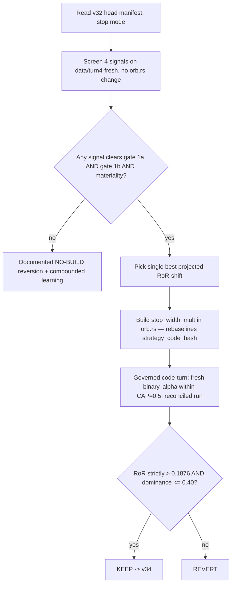

# ORB Stop-Geometry Conditioned Lever (Turn 11) - Plan

## Goal Capsule

- **Objective.** Run strategy-loop turn 11 (issue #119) as a diagnostic-first KEEP/REVERT experiment: screen four conditioning signals for a decorrelated stop-width lever, build only a signal that clears the collinearity + materiality gate, and land a reconciled verdict against v32 head (RoR 0.1876).
- **Product authority.** sunkeunchoi (strategy-loop owner).
- **Open blockers.** None for the diagnostic screen — it runs against the current v32 head with no code change. The build is conditionally gated on a screen winner; a clean documented NO-BUILD is an accepted terminal outcome.

## Product Contract

### Summary

Turn 11 tests whether the initial stop *location* — not stop-as-risk-sizing — carries independent edge in the ORB loop. Because CLASS B sizing (`qty = budget / risk_per_share`) auto-absorbs any stop re-scale on the risk-capital axis, the only surviving effect is stop-out geometry: which fraction of trades resolve as stop / target / timeout. A Python screen tests four conditioning signals for decorrelation from the two KEPT risk levers and for materiality; the single winner (if any) is built as a governed code-turn and reconciled against v32 head. No winner → documented NO-BUILD.

### Problem Frame

Issue #119 was filed 2026-07-10 under the old expectancy methodology and is stale — the loop now decides KEEP on size-invariant RoR. Its naive framing ("re-scale risk/stop") collides with two facts the codebase makes concrete:

- **CLASS B sizing already owns the risk axis.** `risk_per_share = entry − stop` is the sizing denominator (`orb.rs:530`), and `position_qty_risked_tilted` divides a fixed KRW budget by it (`params.rs:857`). Re-scale the stop by any factor and `qty` re-sizes inversely, so `risk_capital = qty · risk_per_share` stays pinned at the budget. A stop re-scale is invisible to the RoR denominator.
- **A constant or volatility-scaled stop re-scale is predicted near-inert.** The barriers move proportionally, per-outcome KRW is scale-invariant, and vol-scaling is exactly the `r≈0.96`-with-ATR collinearity that made the ATR vol-target lever PREDICTED-INERT and unbuilt.

Independent edge can therefore only live in a **conditioning signal decorrelated from ATR / OR-width / `risk_per_share`** that predicts *when* more or less stop room pays. Turn 11 is a stop-out-geometry lever, and the honest first deliverable is the screen that decides whether such a signal exists.

### Key Decisions

- **Turn 11 is a stop-geometry lever, not a risk-sizing lever.** The risk-sizing seat is taken (CLASS B sizing + the ratio-ATR tilt). The lever moves the stop *location*; risk capital per trade is held at budget by CLASS B.
- **Diagnostic-first, screen before build.** The screen is pure Python over per-trade data emitted by v32 head — it touches no Rust and rebaselines no `strategy_code_hash`. Only the winner is built. This mirrors the Amihud-lever precedent (per-candidate `diagnostic.py` + `candidate.json` thresholds).
- **Two-gate collinearity, not one.** Each candidate signal's stop-width weight is gated `|pearson r| < 0.70` against **both** `risk_per_share` (gate 1a) and the KEPT `w_ratio_atr` (gate 1b) — the exact two-gate shape the Amihud lever established (`diagnostic.py:228,237`).
- **Mechanism follows the winner.** If a smooth signal wins, reuse the ratio-ATR tilt form (`clamp((ref/signal)^alpha, lo, hi)`), with `alpha` the single governed param under CAP=0.5. Do not pre-commit a mechanism the screen might not justify.
- **NO-BUILD is a first-class outcome.** Zero winners → documented reversion with the screen readings preserved, not a forced build.

### Requirements

**Diagnostic screen (build / no-build gate)**

- R1. A new candidate directory ships a `diagnostic.py` that runs over v32 head on the `data/turn4-fresh` home dataset, offline against the existing catalog, with no `orb.rs` change and no gateway call.
- R2. The screen evaluates four conditioning signals: OR-width/ATR ratio, entry-timing (minutes since session open), overnight-gap magnitude, and OR-position (entry location within the opening range).
- R3. For each signal, the screen emits absolute collinearity readings — `|pearson r|` of the candidate stop-width weight vs `risk_per_share` (gate 1a) and vs the KEPT `w_ratio_atr` (gate 1b) — each gated `< 0.70` via `candidate.json` thresholds.
- R4. For each signal, the screen emits two materiality readings, each gated at or above its own declared floor: a projected ceiling-aware `ror_shift`, and a `resolution_mix_shift` (how much the re-scaled barriers move the stop / target / timeout resolution mix). Both are hard gates, not reported-only readings.
- R5. The winner is the single signal clearing both collinearity gates and both materiality floors with the largest projected RoR-shift; more than one clearing signal still yields exactly one build (a governed turn moves one param). Zero clearing signals → NO-BUILD.
- R6. The screen first reads the v32 head manifest to determine the active stop mode, because the lever's character depends on it: RangeLow (`r_denom` = OR-width, decoupled from the stop → the weight changes reward:risk) vs Atr/OrMidpoint (`r_denom` = entry−stop, coupled → pure barrier-scaling).

**Build (only if a winner clears)**

- R7. The build adds a `stop_width_mult` mechanism to `orb.rs`, conditioned on the winning signal and applied to the initial stop distance by scaling the output of `stop_for_entry` at the stop-set point (not by editing inside `stop_for_entry`), so `risk_per_share` (and therefore CLASS B `qty`) absorb the change and `risk_capital` stays at budget.
- R8. When the winner is a smooth signal, the mechanism uses `stop_width_mult = clamp((ref/signal)^alpha, lo, hi)` mirroring `ratio_atr_weight`, with `alpha` as the single governed `LS_TURN_PARAM` bounded by CAP=0.5, reusing the `validate()` clamp-band pattern (band straddles 1.0, positive risk budget required).
- R9. The build is run as a governed code-turn: it rebaselines `strategy_code_hash`, so the KEEP/REVERT comparison uses the parent-builds-fresh-binary / child-decides cadence, never param-mode `runs compare` across the v32→v33 boundary.

**Verdict and reconciliation**

- R10. KEEP holds iff the reconciled size-invariant RoR (`Σpnl / Σrisk_capital`) strictly exceeds the v32 head 0.1876 AND risk-capital dominance (`max per-symbol Σrisk_capital / Σrisk_capital`) is ≤ 0.40; otherwise REVERT.
- R11. The verdict comes from a reconciled run only; approximate per-bucket rankings do not decide it.
- R12. Reconciliation checks trade-count drift across the boundary: a wider stop holds a trade open longer, which can indirectly occupy a `max_concurrent` slot and block a later entry. Confirm the sample is stable enough to attribute the RoR delta to geometry rather than slot churn.

**NO-BUILD path**

- R13. If no signal clears both gates and the materiality floor, land a documented NO-BUILD reversion with the same rigor as a build: the screen readings recorded, and the collinearity / CLASS-B-absorption learning compounded in `docs/solutions/` or a memory topic.

**Delivery**

- R14. DONE is a reconciled KEEP or REVERT verdict (RoR delta + dominance check) or a documented NO-BUILD, plus a PR and a compounded learning.

### Decision flow

### Acceptance Examples

- AE1. Single winner.
  - **Covers R5, R7–R10.**
  - **Given** exactly one signal clears gate 1a, gate 1b, and the materiality floor.
  - **When** its `stop_width_mult` is built and run as a governed code-turn.
  - **Then** KEEP iff reconciled RoR > 0.1876 and dominance ≤ 0.40; else REVERT.
- AE2. No winner.
  - **Covers R5, R13.**
  - **Given** zero signals clear both collinearity gates and materiality.
  - **When** the screen completes.
  - **Then** no `orb.rs` change is made and a documented NO-BUILD reversion lands with the readings and learning.
- AE3. Multiple winners.
  - **Covers R5.**
  - **Given** more than one signal clears all gates.
  - **When** the winner is selected.
  - **Then** the single signal with the largest projected RoR-shift is built — one param per governed turn.
- AE4. RangeLow head.
  - **Covers R6.**
  - **Given** v32 head uses the RangeLow stop mode (`r_denom` = OR-width, decoupled from the stop).
  - **When** the candidate weight is applied.
  - **Then** it moves the stop but not `r_denom`/target, so it changes reward:risk — materiality is read on that basis, not on barrier-scaling.

### Success Criteria

- The screen readings are reproducible offline against `data/turn4-fresh` and preserved in the candidate directory regardless of build/no-build.
- A build, if it happens, does not change trade selection — the lever rejects no entries, so trade count stays approximately stable and the RoR delta is attributable to exit geometry.
- The compounded learning states plainly whether a decorrelated stop-geometry signal exists in this dataset, so a future turn does not re-litigate the CLASS-B-absorption / collinearity result.

### Scope Boundaries

- Re-tuning the stop as a risk-sizing lever — CLASS B sizing owns that seat; a stop re-scale is auto-absorbed on `risk_capital`.
- A constant or volatility-scaled stop multiplier — predicted near-inert (the `r≈0.96` trap).
- Asymmetric stop-vs-target re-scaling as a distinct axis (move stop, hold target *by design*) — a separate lever not chosen for turn 11. Where the RangeLow stop mode makes a stop move incidentally change reward:risk (R6/AE4), that is a property to measure, not a mandate to build the asymmetric lever.
- Refactoring `orb.rs` after the run.
- Any gateway or live-smoke call — the whole turn is offline.

### Dependencies / Assumptions

- **Stop-mode read (R6) is a hard prerequisite** — the head's active stop mode (RangeLow vs Atr/OrMidpoint) determines the lever's semantics and must be read from the manifest before interpreting materiality.
- **Field availability.** Overnight-gap magnitude and entry-timing require a gap field and an arm-time timestamp in `OrbState`; verify both are present (or emittable) before screening those two signals. OR-width/ATR ratio and OR-position derive from range/ATR fields already tracked.
- **Head values live in the manifest, not source.** `risk_per_trade_krw = 299,340` and the ratio-ATR clamp bands are seeded into the run manifest at flip time (`params.rs:382`), not source defaults — the screen must read the head manifest for both.
- **Build gotchas (strategy-loop lab).** Build `-p nautilus-ls-lab --bin lab-research` from `adapters/nautilus` (a background build from repo root produces a stale binary — verify with `strings <bin> | grep`). Run the gate from `adapters/nautilus` or the lab crate is silently skipped. `node.run` is never driven offline.

### Outstanding Questions

**Deferred to planning / diagnostic time**

- Exact materiality floor and projected-`ror_shift` floor values for the screen thresholds — set from the Amihud precedent's floors, adjusted to the stop-geometry metric.
- The candidate weight's `ref` / clamp-band seeds for each signal used during the *screen* (before governance) — needed only to compute the collinearity and materiality readings, not the final flip values.
- Whether the entry-timing signal is expressed as raw minutes since open or a session-fraction — pick the form that best decorrelates from `risk_per_share` in gate 1a.

### Sources / Research

Grounding from the current v32 head (verbatim locations):

- Stop location and per-share risk: `adapters/nautilus/lab/src/strategy/orb.rs:912` (`stop_for_entry`, 3 modes), `orb.rs:530` (`risk_per_share`), `orb.rs:690` (stop + `r_denom` fixed at Armed→Long), `orb.rs:928` (`r_denom` mode split).
- Sizing and tilts: `adapters/nautilus/lab/src/params.rs:857` (`position_qty_risked_tilted`), `params.rs:765` (`ratio_atr_weight`), `orb.rs:1220` (three tilts composed into one numerator weight).
- Collinearity precedent: `candidates/amihud-liquidity-tilt/diagnostic.py:228,237` (gate 1a vs `risk_per_share`, gate 1b vs `w_ratio_atr`), `candidates/example/candidate.json` (`collinearity_r` reading + `lt 0.70` threshold).
- Verdict metric: `performance.rs:485` (RoR + dominance fold), `performance.rs:325` (`keeps_over`), `performance.rs:132` (`DOMINANCE_CAP = 0.40`).
- Governance: `research.rs:57` (`PROPOSAL_BOUNDS_CAP = 0.5`), `proposal_bounds.rs:34` (relative-change enforcement), `governed.rs:275` (child KEEP/REVERT via `keeps_over`).

Learnings that shaped this plan:

- `docs/solutions/conventions/pre-code-collinearity-gate-before-a-second-normalizer-lever.md` — the `|Pearson r| < 0.70` pre-code gate precedent; the ATR vol-target lever measured `r = 0.96` vs `risk_per_share` and was recorded PREDICTED-INERT with no code.
- `docs/solutions/conventions/first-order-materiality-prediction-ignores-notional-ceiling.md` — a first-order RoR-shift prediction that ignores the `floor(notional/price)` ceiling over-predicts and can mis-sign (Amihud predicted `+0.0309`, landed `−0.0116`); the screen's materiality must use ceiling-aware per-trade qty.
- `docs/solutions/workflow-issues/code-turn-rebaseline-run-via-manifest-seed-and-rerun.md` — the code-bump re-baseline + seed-and-rerun arming mechanics, and the build gotcha (rebuild from `adapters/nautilus/lab`; a stale binary silently backtests the old hash).
- `docs/solutions/design-patterns/build-runtime-hash-parity-via-shared-include.md` — the stale-binary fingerprint guard and the intended two-build cost per code turn.

---

## Planning Contract

**Product Contract preservation:** Product Contract unchanged — planning added HOW without altering the WHAT (requirements, scope, and success criteria carried verbatim).

### Key Technical Decisions

- KTD1. The stop-width multiplier lives on the **denominator side** — inside `stop_for_entry` / at the stop-set point (`orb.rs:690`), never folded into the numerator `weight`. The three existing tilts (ratio-ATR, liquidity, rung) are dimensionless numerator-only multiplicands by invariant (`orb.rs:1214`); a stop re-scale must move `risk_per_share` so CLASS B sizing absorbs it on the risk axis and only barrier geometry survives.
- KTD2. The screen is **fully offline against v32 head**. It reconstructs the four signals, `risk_per_share` (`= risk_capital / quantity`), and `w_ratio_atr` from the head run's `performance.json` plus catalog daily/minute parquet bars — the exact pattern the amihud and gap-retention diagnostics use. No `orb.rs` change screens; only a winner triggers a build.
- KTD3. **Materiality is ceiling-aware and geometry-shaped.** The RoR-shift prediction uses ceiling-aware per-trade qty (`floor(notional/price)`), per the amihud mis-sign learning, and the materiality signal is the stop/target/timeout **resolution-mix shift** — not `qty_change_frac`, which a geometry lever changes by construction and would false-pass.
- KTD4. **Two-gate collinearity with an independent twin.** Each signal's candidate weight is gated `|Pearson r| < 0.70` against `risk_per_share` (gate 1a) and `w_ratio_atr` (gate 1b); `twin.py` re-implements every reading on an independent code path and must agree with `diagnostic.py` within each reading's `candidate.json` tolerance before the gate verdict stands.
- KTD5. **Arm via code-bump then seed-and-rerun.** A code turn (`LS_TURN_CODE_BUMP=1`) re-baselines v32→v33 with the multiplier disarmed (`stop_width_alpha = 0.0` → weight `1.0` → byte-identical, reconcile PASS). Arming `alpha` from `0.0` is an infinite relative change that the `PROPOSAL_BOUNDS_CAP = 0.5` guard fail-closes, so the flip seeds the manifest companion values and reruns to move `alpha` within CAP → v34.
- KTD6. **Build from `adapters/nautilus/lab`.** `cargo build --release -p nautilus-ls-lab --bin lab-research` from that directory — a root build fails the package-ID match and a stale binary silently backtests the old hash. The parent self-check and built-binary fingerprint guard (`governed.rs`) catch staleness at the cost of two builds per code turn.
- KTD7. **Winner selection lives in `diagnostic.py`; the verdict carries the winner numerically.** The existing candidate gate contract is single-signal — one `readings` block, one `flip_param`, and a `gate-verdict.json` with no winning-signal field (the amihud precedent screens one signal) — and the diagnose stage parses each script's output strictly as a numeric map (`BTreeMap<String, f64>` in `diagnose.rs::run_script`), so no string identity field or NO-BUILD marker may be written into `readings.json`. A four-signal screen therefore does the argmax *inside* `diagnostic.py`: it evaluates all four signals, selects the one that clears both collinearity gates and both materiality floors with the largest projected RoR-shift, and emits (a) that winner's four readings into the canonical `readings` block the gate checks and (b) the winner identity as a fifth declared numeric reading `winning_signal_id` (documented index 1–4, tolerance 0), plus the winner-dependent companion seeds (`stop_width_ref`/`w_lo`/`w_hi`) as additional numeric keys — extra numeric keys are legal and flow into the verdict's `diagnostic_readings` map, which U5/U6 read without re-deriving the screen. None clearing → NO-BUILD, expressed by emitting the best-failing signal's canonical readings so a gated threshold fails and the tool records STOP.

### Sequencing

Screen first (U1–U3), run the gate (U4), then branch: a winner runs the build + arm + reconcile chain (U5–U6); a NO-BUILD skips straight to the learning (U7). U4 is the pivot — U5–U6 are conditional on a clearing signal.

---

## Implementation Units

### U1. Candidate pre-register scaffold

- **Goal.** Create the candidate directory and its machine-readable pre-register so the screen's gate thresholds are frozen before any reading is computed.
- **Requirements.** R1, R3, R4, R5.
- **Dependencies.** None.
- **Files.** `adapters/nautilus/lab/candidates/stop-width-geometry/candidate.json` (create), `adapters/nautilus/lab/candidates/stop-width-geometry/README.md` (create, optional short note).
- **Approach.** Mirror `candidates/amihud-liquidity-tilt/candidate.json`: `schema_version`, `slug: stop-width-geometry`, `family: class-b`, `phase_a: bespoke`, `flip_param: stop_width_alpha`, `flip_value` **pre-registered before the U4 run** (the alpha arming seed within CAP=0.5, winner-independent — the amihud precedent pre-registered its flip value before the screen; `candidate.json` is a frozen input whose content hash the flip verifies, so a post-screen seed would either leave the verdict with `flip_value: None` or invalidate the hash and refuse the U6 arm), `diagnostic`/`twin` argv + `content_hash`, a `readings` block, a `thresholds` block, and a `keep_anchor` string naming the v32 head (RoR 0.1876) + dominance ≤ 0.40. Readings: `collin_abs_rps`, `collin_abs_ratio_atr` (per the winning signal), `ror_shift` (ceiling-aware), `resolution_mix_shift`, and `winning_signal_id` (winner index 1–4, tolerance 0). Thresholds: both `collin_*` `lt 0.70`; `ror_shift` `ge <floor>`; `resolution_mix_shift` `ge <floor>`. The canonical readings are the winner's — one `readings` block the gate checks, per KTD7 — and the winning-signal identity travels as the declared numeric `winning_signal_id` reading into the verdict's `diagnostic_readings` at run time, not as a field in `candidate.json`. Content hashes are filled once `diagnostic.py`/`twin.py` land (U2–U3).
- **Patterns to follow.** `adapters/nautilus/lab/candidates/README.md` (candidate file contract), `candidates/amihud-liquidity-tilt/candidate.json`.
- **Test scenarios.** Covers R5. The candidate loads through the Rust reading-contract path (`candidates.rs`): every declared reading carries a `tolerance` (a reading without one fails to load); every threshold names a declared reading. `Test expectation: assert the candidate parses and its thresholds resolve against the readings — no new behavior beyond the config contract.`
- **Verification.** The candidate is discoverable by `lab-research turn diagnose` for slug `stop-width-geometry` and its schema validates.

### U2. Offline screen — `diagnostic.py`

- **Goal.** Compute, per closed trade of the v32 head run, the four signals, `risk_per_share`, `w_ratio_atr`, the candidate stop-width weight, and emit the gate readings to the canonical `readings.json`.
- **Requirements.** R1, R2, R3, R4, R6.
- **Dependencies.** U1.
- **Files.** `adapters/nautilus/lab/candidates/stop-width-geometry/diagnostic.py` (create).
- **Approach.** Load the head `performance.json` (`perf["trades"]`, closed only); derive `risk_per_share = risk_capital / quantity` and reconstruct `prior_atr` / `w_ratio_atr` from catalog daily bars (amihud pattern) and the opening range / gap from catalog minute + daily bars (gap-retention pattern). Compute the four signal series — OR-width/ATR ratio, minutes-since-open (from `ts_opened`), overnight-gap magnitude, OR-position. For each signal, form the candidate weight `clamp((ref/signal)^alpha, lo, hi)` and emit: `collin_abs_rps = |pearson(weight, risk_per_share)|`, `collin_abs_ratio_atr = |pearson(weight, w_ratio_atr)|`, a **ceiling-aware** `ror_shift` (recompute per-trade qty as `min(floor(budget·weight/rps), floor(notional/price))` so the notional ceiling is honored — KTD3), and `resolution_mix_shift` (the change in the stop/target/timeout resolution fractions the re-scaled barriers induce). First read the head manifest to resolve the active stop mode (R6) and interpret the barrier geometry accordingly. Then argmax-select the winner inside `diagnostic.py` (KTD7): among signals clearing both `collin_*` gates and both materiality floors, take the largest projected RoR-shift; write that winner's four readings to the canonical `readings.json` at `sys.argv[-1]`, plus the numeric `winning_signal_id` reading and the winner-dependent companion seeds (`stop_width_ref`/`w_lo`/`w_hi`) as additional numeric keys. The readings file is parsed as a numeric-only map — no string field or NO-BUILD marker: when no signal clears, emit the best-failing signal's canonical readings so a gated threshold fails and the tool records STOP.
- **Execution note.** The four signals are a screen, not a pre-picked winner — evaluate all four, but the selection happens here, not in U4. Reuse `uv run --with pyarrow python3` argv per the candidate convention.
- **Patterns to follow.** `candidates/amihud-liquidity-tilt/diagnostic.py` (`pearson`, absolute readings, catalog reconstruction, `out_path = sys.argv[-1]`), `candidates/opening-range-gap-retention/diagnostic.py` (opening-range/gap reconstruction from minute+daily bars).
- **Test scenarios.**
  - Covers R3. A signal whose weight is a pure scalar multiple of `risk_per_share` reports `collin_abs_rps ≈ 1.0` (gate 1a rejects) — confirms the gate detects the collinear degenerate case.
  - Covers R3. A signal orthogonal to both axes reports both `collin_abs_*` near 0 (gates pass).
  - Covers R4. `ror_shift` computed with the notional ceiling honored differs from a naive ceiling-free prediction on a trade that is qty-capped at the notional ceiling — proves ceiling-awareness is active (KTD3).
  - Covers R4. `resolution_mix_shift` is zero when the candidate weight is identically `1.0` (barriers unmoved) and non-zero when the weight moves the stop.
  - Covers R6. Under a RangeLow head, moving the stop leaves `r_denom`/target fixed (reward:risk changes); under an Atr/OrMidpoint head, target scales with the stop (barrier-scaling) — the emitted `resolution_mix_shift` reflects the mode the manifest reports.
- **Verification.** Running the declared argv over the v32 head run writes a `readings.json` carrying the winner's four reading keys plus the numeric `winning_signal_id` and companion-seed keys — or, when none clears, the best-failing signal's readings failing a threshold — reproducibly.

### U3. Independent twin — `twin.py`

- **Goal.** Re-implement each reading on an independent code path so the diagnose stage's reading-by-reading agreement check has a genuine second source.
- **Requirements.** R3, R4.
- **Dependencies.** U1, U2.
- **Files.** `adapters/nautilus/lab/candidates/stop-width-geometry/twin.py` (create).
- **Approach.** Compute the same readings by a deliberately different route (e.g. Spearman-rank or a covariance-matrix path for the collinearity readings; an independent bar-join for the signal reconstruction) so a shared bug in `diagnostic.py` does not silently propagate. Emit the same reading keys to `sys.argv[-1]`, including `winning_signal_id` from an independently re-implemented argmax — a winner disagreement between twin and diagnostic then surfaces as a tolerance-0 reading mismatch, not a silent comparison of two different signals' readings. Agreement is enforced by the diagnose stage within each reading's `candidate.json` tolerance (U1).
- **Patterns to follow.** `candidates/amihud-liquidity-tilt/twin.py`.
- **Test scenarios.** Covers R3, R4. On the v32 head run, `twin.py` and `diagnostic.py` agree on every reading within the `candidate.json` tolerance. A seeded divergence (perturb one signal series in a scratch copy) exceeds tolerance and would fail the diagnose comparison — proves the twin is a real cross-check, not a copy.
- **Verification.** `lab-research turn diagnose` for the candidate reports twin/diagnostic agreement within tolerance.

### U4. Run the screen and record the verdict (pivot)

- **Goal.** Execute the gate and produce `gate-verdict.json` — the single winning signal (best projected RoR-shift among those clearing both collinearity gates and the materiality floor) or a NO-BUILD.
- **Requirements.** R5.
- **Dependencies.** U2, U3.
- **Files.** `adapters/nautilus/lab/candidates/stop-width-geometry/gate-verdict.json` (written by the tool, not hand-authored).
- **Approach.** From `adapters/nautilus`, run `LS_DATA_HOME=<data-home> LS_TURN_CANDIDATE=stop-width-geometry cargo run --release -p nautilus-ls-lab --bin lab-research -- turn diagnose`. The argmax already happened inside `diagnostic.py` (KTD7), so read the verdict directly: on GO its `diagnostic_readings` carry `winning_signal_id` and the companion seeds (feeding U5–U6), and `flip_value` is copied from the frozen `candidate.json` pre-register; on STOP (a threshold failed — no signal cleared) it is NO-BUILD and the chain routes to U7.
- **Execution note.** Freeze `candidate.json`, `diagnostic.py`, `twin.py` git-clean before the run — a later edit invalidates the content hash and a flip refuses. This unit produces the build/no-build decision; do not pre-build U5.
- **Test scenarios.** `Test expectation: none — execution/gate step; correctness is covered by U2/U3 readings tests and the tool's own gate logic.`
- **Verification.** `gate-verdict.json` records GO (`winning_signal_id` + companion seeds in `diagnostic_readings`, `flip_value` from the pre-register) or STOP (NO-BUILD) with the per-signal readings preserved.

### U5. Conditional build — `stop_width_mult` mechanism

- **Goal.** On a winner, add the stop-width multiplier conditioned on the winning signal, applied to the initial stop distance so CLASS B absorbs the risk and only geometry moves.
- **Requirements.** R7, R8.
- **Dependencies.** U4 (GO verdict only).
- **Files.** `adapters/nautilus/lab/src/params.rs` (add `stop_width_alpha`, `stop_width_ref`, `stop_width_w_lo`, `stop_width_w_hi` + a `stop_width_mult` method + `validate()` guards), `adapters/nautilus/lab/src/strategy/orb.rs` (apply the multiplier at the stop-set point), plus a Rust unit-test module alongside the strategy tests.
- **Approach.** Read `winning_signal_id` from the U4 verdict's `diagnostic_readings` (KTD7) — the mechanism conditions on the signal it indexes. Add the companion params defaulting to the disarmed identity (`stop_width_alpha = 0.0` → `stop_width_mult` returns `1.0`). Compute `stop_width_mult = clamp((stop_width_ref / signal)^stop_width_alpha, stop_width_w_lo, stop_width_w_hi)` (KTD1, ratio-ATR shape). Apply it to the stop **distance** at `orb.rs:690` (scale `entry − stop_for_entry(...)` before assigning `stop_price`), flooring the scaled distance at 1 tick (mirror `stop_for_entry`'s `.max(1)` guard) so a tightening weight can never round the distance to zero — a zero distance puts the stop on entry, drops that trade's `risk_capital` from the join, and nulls the run-level RoR metric. `risk_per_share` then moves and `position_qty_risked_tilted` re-sizes qty inversely — never fold it into `weight`. Extend `validate()` to require a clamp band straddling `1.0` and a positive risk budget when armed, mirroring the ratio-ATR guards. If the winning signal is minutes-since-open, persist the bar time at the entry transition (the other three signals — OR-width/ATR, gap, OR-position — are already on `OrbState`).
- **Execution note.** Implement off-neutrality first (disarmed `alpha = 0.0` must produce byte-identical behavior to v32), then the armed path — the code-bump re-baseline in U6 depends on exact disarmed equivalence.
- **Patterns to follow.** `params.rs::ratio_atr_weight` (clamp-band weight), `params.rs::validate` (armed-tilt guards), `orb.rs::stop_for_entry` / the stop-set line at `orb.rs:690`.
- **Test scenarios.**
  - Covers R8. Disarmed (`stop_width_alpha = 0.0`): `stop_width_mult` returns exactly `1.0` and `stop_price` / `risk_per_share` are unchanged versus the pre-lever path — byte-identical off-neutrality.
  - Covers R7. Armed with a widening weight: `risk_per_share` increases and computed qty decreases so `qty · risk_per_share` (risk capital) stays at the KRW budget (modulo floor + notional ceiling) — confirms CLASS B absorption.
  - Covers R7. Armed with a tightening weight: the stop moves toward entry and `risk_per_share` decreases; the stop still never crosses entry (guarded).
  - Covers R7. Minimum stop distance with the tightest clamp weight (`w_lo`): the scaled distance floors at 1 tick, `risk_per_share ≥ 1`, and the trade still joins `risk_capital` — confirms the zero-distance guard.
  - Covers R8. `validate()` rejects a clamp band that does not straddle `1.0`, and rejects an armed lever with a non-positive risk budget.
  - Edge: signal ≤ 0 or missing (`prior_atr` None, zero range) falls back to weight `1.0` rather than panicking.
- **Verification.** Unit tests pass; `make adapter-check` stays green; the disarmed build is behaviorally identical to v32.

### U6. Arm, run the governed code-turn, reconcile

- **Goal.** Re-baseline the mechanism disarmed, arm `stop_width_alpha` within CAP, and land a reconciled KEEP/REVERT verdict.
- **Requirements.** R9, R10, R11, R12.
- **Dependencies.** U5.
- **Files.** No source files — run manifests + verdict outputs under `<data-home>/runs/`.
- **Approach.** From `adapters/nautilus`: (1) code-bump re-baseline v32→v33 with `LS_TURN_CANDIDATE=stop-width-geometry LS_TURN_CODE_BUMP=1 ... turn governed` — disarmed, so `performance.json` is byte-identical to v32 and reconcile PASSes (`param_diff == ["strategy_version"]`). (2) Seed the manifest companion values (`stop_width_ref`/`w_lo`/`w_hi`, sourced from the U4 verdict's `diagnostic_readings`) and rerun to flip `stop_width_alpha` to the pre-registered `flip_value` within `PROPOSAL_BOUNDS_CAP = 0.5` → v34 (seed-and-rerun escapes the `0.0` infinite-relative-change fail-close — KTD5). (3) The governed child computes `keeps_over`: KEEP iff reconciled RoR strictly exceeds 0.1876 and dominance ≤ 0.40, else REVERT. Confirm trade-count drift across the boundary is small (R12) — the lever rejects no entries; watch only the second-order slot-occupancy from longer-held wider stops.
- **Execution note.** Two builds per code turn are expected (parent self-check halts a stale binary, then a fresh child build). Verify the built binary's fingerprint matches the tree before trusting the verdict.
- **Test scenarios.** `Test expectation: none — governed run; the KEEP/REVERT logic is exercised by the lab's own `keeps_over` tests, and the reconcile is a sample-identity check.`
- **Verification.** `runs compare` reports the code-turn re-baseline PASS (v32↔v33 byte-identical); the `analyze --scaffold` report prints the size-invariant RoR and dominance for v34; the governed child emits `KEEP v34 <hash>` or `REVERT`.

### U7. Compound the learning

- **Goal.** Record the durable result so a future turn does not re-litigate it.
- **Requirements.** R13, R14.
- **Dependencies.** U6 (KEEP/REVERT) or U4 (NO-BUILD).
- **Files.** `docs/solutions/<category>/<slug>.md` (create) and/or a memory topic file.
- **Approach.** State plainly whether a decorrelated stop-geometry signal exists in `data/turn4-fresh`: on KEEP/REVERT, the winner, its readings, the RoR delta, and the dominance check; on NO-BUILD, the per-signal collinearity/materiality readings and why each failed, framed as the CLASS-B-absorption + collinearity result (the stop re-scale is auto-absorbed on the risk axis; independent edge requires a decorrelated conditioning signal, and none cleared). Link the collinearity-gate and ceiling-aware-materiality precedents.
- **Test scenarios.** `Test expectation: none — documentation.`
- **Verification.** The learning is committed and cross-links the two precedent docs.

---

## Verification Contract

| Gate | Command | Applies to | Done signal |
|---|---|---|---|
| Screen readings | `LS_TURN_CANDIDATE=stop-width-geometry ... lab-research -- turn diagnose` (from `adapters/nautilus`) | U2, U3, U4 | `readings.json` + twin agreement within tolerance; `gate-verdict.json` records GO(winner)/STOP(NO-BUILD) |
| Adapter workspace | `make adapter-check` | U5 | Green (standalone `adapters/nautilus` workspace) |
| Strategy unit tests | `cargo test -p nautilus-ls-lab` (from `adapters/nautilus`) | U5 | `stop_width_mult` off-neutrality + CLASS-B-absorption + validate() tests pass |
| Code-turn re-baseline | `lab-research -- runs compare` (Code mode) | U6 | v32↔v33 byte-identical; `verdict: PASS` |
| Trade-count drift (R12) | Compare v32 vs v34 closed-trade counts from the reconciled-run outputs | U6 | Trade count approximately stable across the boundary — no slot-churn signature; RoR delta attributable to geometry |
| Reconciled verdict | `lab-research -- analyze --scaffold` + `turn governed` child line | U6 | RoR + dominance printed; `KEEP v34 <hash>` or `REVERT` |
| Root gate | `make docs && cargo test && make docs-check && make lane-check` | repo-touching changes | Green (only if a touched file reaches the root workspace) |

## Definition of Done

- The four-signal screen ran offline against v32 head with `diagnostic.py`/`twin.py` in tolerance agreement, and `gate-verdict.json` records either a single winning signal or a NO-BUILD (R5, R13).
- On a winner: `stop_width_mult` is built denominator-side, disarmed off-neutrality is byte-identical to v32, the governed code-turn re-baselines then arms within CAP=0.5, and a reconciled run records KEEP (RoR > 0.1876 and dominance ≤ 0.40) or REVERT (R7–R12).
- On NO-BUILD: no `orb.rs` change landed and the screen readings are preserved (R13).
- A compounded learning is committed in `docs/solutions/` or a memory topic, stating whether a decorrelated stop-geometry signal exists and linking the collinearity-gate and ceiling-aware-materiality precedents (R13, R14).
- A PR is open with the gate green (R14).
