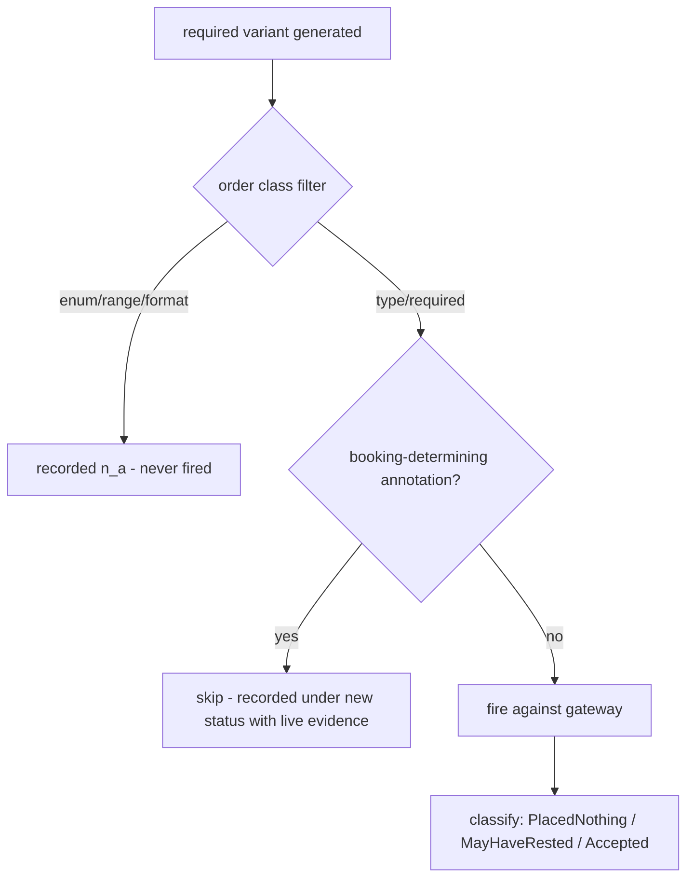
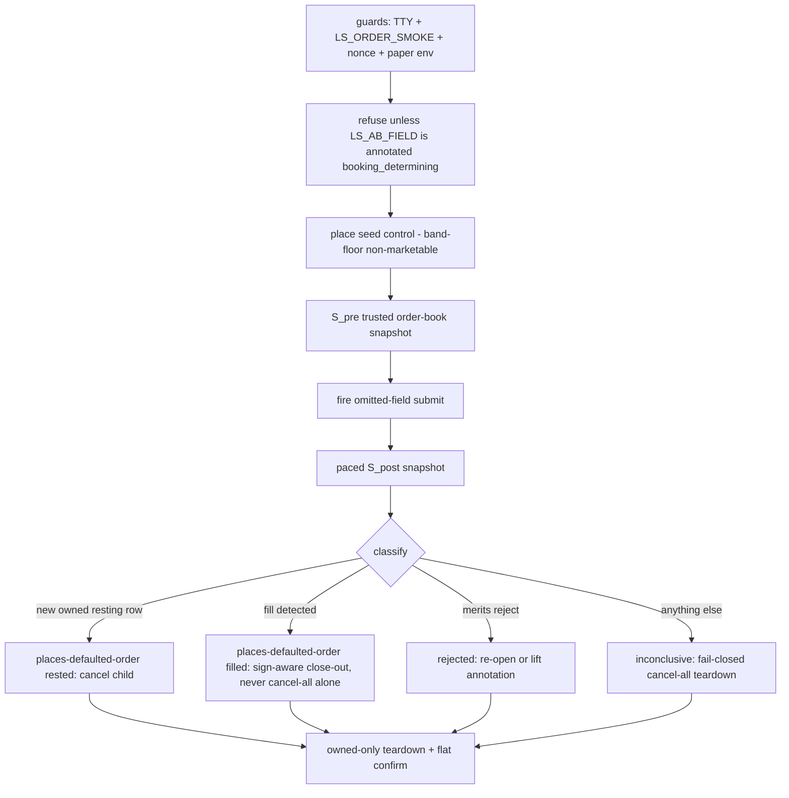

# CSPAT00601 Booking-Determining Probe Skip and Certification Path - Plan

## Goal Capsule

- **Objective:** Make the order negative probe structurally unable to fire live-order-placing `required` variants on booking-determining submit fields, keep that ground truth refreshable through a governed attended harness, and open the certification path that takes CSPAT00601 to `recommended`.
- **Product authority:** Operator dialogue 2026-07-22 (goal: both safety and certification, safety first); `docs/solutions/conventions/order-negative-probe-modify-vs-submit-policy.md` (a booking-determining submit field is characterized only by a probe-design change that provably cannot route); ledger §30 item 4 (`BnsTpCode` stays `required: true` permanently). Product Contract preservation: unchanged, except the three deferred Outstanding Questions are resolved into Planning Contract KTDs.
- **Execution profile:** U1–U3 are offline (agent-executable, gate-verified). U4 is the operator-attended, open-KRX, TTY-gated tail — the agent prepares diffs and read legs; only the operator runs order-placing legs.
- **Stop conditions:** Never run an order smoke unattended (the autonomy guard refuses; do not work around it). Any WAVE BLOCKED, unexpected resting order, or unowned-row alarm during the re-probe → stop, record HELD, do not retry blind. An `IGW00201` throttle → pace per the existing order-probe pacing, never tighten loops.
- **Tail ownership:** Promotion (U4) executes only after U1–U2 are merged and gate-green (R10); if the attended window doesn't happen in this work session, U4 remains an open operator tail tracked by the smoke registry, not a plan gap.

---

## Product Contract

### Summary

Add a code-enforced "booking-determining" never-fire annotation for order-submit `required` variants (a third route beside the existing gateway-tolerant and placed-nothing mechanisms), applied to CSPAT00601 after a one-time audit of all its required fields — plus a governed, attended per-field characterization harness that can re-verify the gateway's defaulting behavior on demand. With the dangerous variants provably unroutable, the differential re-probe and CSPAT00601's promotion to recommended become the attended tail.

### Problem Frame

The §30 re-cert wave (2026-07-13) proved that removing `BnsTpCode` from a CSPAT00601 submit does not fail closed: the gateway defaults the buy/sell direction and places a real resting order (`ordno=17093`). The written policy since then excludes live `required`-variant probes for booking-determining submit fields — but the exclusion is enforced by nothing in code. The probe's only filter is class-level (`order_probe_classes`, `crates/ls-sdk/tests/negative_probe.rs:1432` — type and required both fire), so any future run of `live-smoke-cspat00601-negative` places another ungoverned directional order. Certification makes this worse, not better: a recommended TR enters the recurring re-cert pool, guaranteeing future differential re-runs. And the other submit `required` fields (`OrdprcPtnCode`, `OrdCndiTpCode`, `MgntrnCode`) have never been fired on 00601 — any of them could be gateway-defaulted the same way, and today's machinery only catches that after an order rests. Meanwhile CSPAT00601 is the last order-quartet TR outside `recommended`, held solely because its differential cannot complete safely.

### Key Decisions

- **Never-fire annotation over governed firing or status quo.** The policy doc requires a probe-design change that "provably cannot route"; the only variant that provably cannot route is one never sent. Firing more carefully is ruled out by the written policy; the status quo leaves the danger live on every re-run.
- **Build the governed characterization harness now.** The operator chose sensor refreshability over minimal build: the annotation blinds the differential permanently, and the harness is the bounded way to re-observe the gateway's defaulting behavior if drift is ever suspected. It follows the attended A/B pattern proven by `live-smoke-cspat00701-igw00000-ab`.
- **Audit all CSPAT00601 required fields, not just BnsTpCode.** The policy defines a class — any field whose omission changes *what* gets booked rather than *whether* the request is rejected — and only `BnsTpCode` has observed behavior. A one-time audit marks every booking-determining field before the next fire, and unobserved fields default to annotated: only a harness-confirmed rejection lifts a provisional annotation, never semantic judgment alone.
- **Skip lands before promotion — hard ordering, not preference.** Promotion guarantees future differential re-runs, so the annotation and code-side skip must be merged and gate-green before any promotion step executes.
- **The excluded variant gets its own coverage status.** Existing statuses do not fit: `n_a` means the class does not apply (it does), `held` means inconclusive (the ground truth is live-observed). A new status records "characterized live, never fired by design" with the §30 evidence.
- **No schema relaxation, no runtime change.** `BnsTpCode` stays `required: true`, unmarked, never `gateway_tolerant` — preflight keeps enforcing the caller contract. The runtime dispatch seam (`is_ingress_validation_reject`, order non-2xx classification) is untouched.

### Actors

- A1. **Operator** — runs the attended, TTY-gated legs: the differential re-probe, the characterization harness, and the promotion smokes. Sole authority for anything that places an order.
- A2. **Probe harness / agent** — builds and runs everything offline: annotation, skip, coverage artifact, gate. Never places an order; the autonomy guard already refuses non-TTY order runs.

### Requirements

**Skip mechanism**

- R1. The constraint schema supports a per-field, per-class annotation marking a `required` variant as booking-determining / never-fire, scoped to order TRs.
- R2. The order fire loop excludes annotated variants in code before any request is constructed — no run mode, environment, or wave can cause one to be sent.
- R3. An excluded variant is visibly recorded in the TR's error-coverage artifact under the new status, citing the live ground truth that justifies the annotation (for `BnsTpCode`: the §30 observation that omission places a direction-defaulted real order).
- R4. A differential whose fired variants are all Clean or expected-tolerant completes and is certifiable even when annotated variants were never fired, mirroring the existing precedent of promoted order TRs with `n_a`-recorded unfired classes.

**Field audit**

- R5. A one-time audit of every CSPAT00601 `required` field records a per-field verdict with a one-line rationale; `BnsTpCode` is marked booking-determining from §30 evidence.
- R11. A `required` field whose omission behavior has never been observed live (`OrdprcPtnCode`, `OrdCndiTpCode`, `MgntrnCode`) is provisionally annotated booking-determining; a provisional annotation is lifted only by a harness-confirmed rejection verdict via the R8 path — the differential is never a field's first live fire.

**Governed characterization harness**

- R6. An attended, TTY-gated, one-command harness can deliberately fire the omitted-field submit for any annotated field as a controlled experiment — seed, snapshot, fire, snapshot, owned-only teardown — and returns a verdict distinguishing "defaulting behavior unchanged" from "gateway now rejects (behavior changed)".
- R7. The harness is never invoked by the differential, any wave, or CI; it exists solely for on-demand evidence refresh and for characterizing audit-marked fields that lack live observation.
- R8. A "behavior changed" harness verdict re-opens the annotation decision for that field; the trigger is recorded at the annotation site, mirroring the Route B sensor-blinding bound.

**Certification**

- R9. CSPAT00601 promotes to `recommended` via the `promote-tr` recipe, with the recommendation block carrying a scope exclusion for every never-fired booking-determining variant and the error-coverage artifact written per R3.
- R10. No promotion step executes before the annotation, skip, and coverage artifact are merged and the full gate is green.

### Acceptance Examples

- AE1. **Covers R2, R4.** Given CSPAT00601 is recommended and a future re-cert wave runs its differential, when the fire loop reaches `BnsTpCode/required`, then no request is sent, the coverage record shows the never-fired status, and the differential proceeds to the remaining variants.
- AE2. **Covers R6, R8.** Given the operator runs the harness for `BnsTpCode` and the fire is rejected instead of placing a defaulted order, then the verdict reports behavior changed and the annotation decision for `BnsTpCode` is re-opened rather than silently retained.
- AE3. **Covers R5, R6, R7.** Given the audit marks a field as booking-determining on semantic judgment alone, when the operator later wants live evidence, then the harness characterizes that field under governance and the annotation is retained or lifted on its verdict — the differential never fires it in the interim.

### Scope Boundaries

- No schema relaxation anywhere: `BnsTpCode` stays `required: true`; audit verdicts change annotations, never required-ness.
- The runtime dispatch seam is untouched — this is probe design plus certification only.
- The read-leg comparator, WAVE BLOCKED semantics, and the class-level order filter (enum/range/format never fire) are unchanged.
- The annotation mechanism is generic to order TRs but is applied only to CSPAT00601 in this work; auditing other submit TRs is future work on the same mechanism.

### Dependencies / Assumptions

- Certifiability of a differential with never-fired-but-characterized variants rests on the CSPAT00701 precedent: `metadata/error-coverage/CSPAT00701.yaml` records unfired classes (`n_a`) and a Route B `placed_nothing` variant, and the TR is `recommended: true`.
- The positive Focused Evidence for promotion exists: the order-chain smoke already certifies the CSPAT00601 submit leg (`rsp_cd=00040`) and is operator-attended.
- The harness can reuse the seed/snapshot/fire/teardown machinery of `run_igw00000_ab_probe` (`crates/ls-sdk/tests/negative_probe.rs:1958`) rather than being built from scratch.

### Sources

- `docs/solutions/conventions/order-negative-probe-modify-vs-submit-policy.md` — the governing policy and the "provably cannot route" bar.
- `metadata/PROVISIONALITY-LEDGER.md` §30 item 4 — the live `BnsTpCode` observation (`ordno=17093`) and the permanent `required: true` disposition.
- `crates/ls-sdk/tests/negative_probe.rs:1432` (`order_probe_classes`), `:1748` (fire loop), `:1958` (`run_igw00000_ab_probe`) — verified 2026-07-22: no per-field skip exists today.
- `metadata/constraints/CSPAT00601.yaml` — nine fields; `BnsTpCode` carries neither `gateway_tolerant` nor `placed_nothing_codes`.
- `metadata/error-coverage/CSPAT00701.yaml` — status legend and the Route B recorded-exclusion precedent; no CSPAT00601 coverage file exists yet.
- `.agents/skills/promote-tr/SKILL.md` — promotion gate: coverage artifact required, recommendation block with scope exclusions.
- `docs/solutions/architecture-patterns/runtime-consuming-repo-root-metadata-build-embed-and-dual-registry.md` — the dual `FieldConstraint` registry and the silent unknown-key drop that dictates where the annotation must live.
- `docs/solutions/workflow-issues/cross-workspace-gate-blind-spot-sdk-preflight-changes-redden-adapter.md` — why `make adapter-check` is mandatory for this work.
- `docs/solutions/integration-issues/igw00000-cspat00701-placed-nothing-ab-probe.md` — the attended A/B precedent the harness mirrors.

---

## Planning Contract

### Key Technical Decisions

- KTD1. **Annotation shape: `booking_determining: [<classes>]` on the ls-core `FieldConstraint` only.** A `Vec<String>` of variant classes (initially always `[required]`), `#[serde(default, skip_serializing_if = "Vec::is_empty")]`, added at `crates/ls-core/src/preflight.rs:106` beside `gateway_tolerant` (`:127`) and `placed_nothing_codes` (`:142`). Not mirrored into the ls-metadata copy (`crates/ls-metadata/src/schema.rs:248`) and not rendered by docgen — the exact `placed_nothing_codes` precedent for a probe-only facet. Rationale: serde has no `deny_unknown_fields` here, so the key parses everywhere but is consumed only where modeled (the dual-registry doc's pitfall, used deliberately); the caller-facing reference already says "always send the field", so rendering the never-fire facet would add noise, not contract.
- KTD2. **Skip seam: a pure lookup beside the existing Route A/B lookups, consumed by the fire loop before request construction.** New `is_booking_determining(schema, field, class)` in `negative_probe.rs` (sibling of `is_gateway_tolerant` `:158` and `order_code_placed_nothing` `:1252`); the order fire loop's variant iterator filters annotated variants out and prints a distinct per-variant `outcome=booking-determining-skip` line instead of dispatching. Preflight enforcement is untouched — pinned by a `does_not_weaken_preflight` test mirroring the Route A/B ones.
- KTD3. **Coverage status is a variant-level free string, `booking_determining`; the TR-level `probe_status` enum is untouched.** `ClassCoverage.status` is an unrestricted `String` (`crates/ls-metadata/src/schema.rs:340`) — no validator or enum change needed. `probe_status: clean` remains honest because it describes fired variants; the never-fired variant is visible in the per-variant map with the §30 evidence citation, mirroring how `n_a` classes coexist with `clean` on CSPAT00701.
- KTD4. **Harness: one parameterized attended test, field selected by env var, refusing unannotated fields.** A single `#[ignore]` test `live_smoke_cspat00601_booking_determining_ab` reading `LS_AB_FIELD` (default `BnsTpCode`), behind the existing `autonomy_guard` + `order_smoke_guard` + nonce plumbing (`negative_probe.rs:766-852`), with a Makefile target mirroring `Makefile:1073-1081`. It refuses a field not annotated `booking_determining` — the harness exists to characterize governed exclusions, not to fire arbitrary omissions. Verdict vocabulary: `places-defaulted-order` (rested or filled — behavior confirmed, annotation retained), `rejected` (re-opens or lifts the annotation, R8/R11), `inconclusive` (fail-closed cancel-all teardown, re-run). **The fire can fill, not just rest:** band-floor non-marketability is direction-dependent, and a `BnsTpCode`-omitted fire's direction is gateway-defaulted — a sell-defaulted fire at a below-market limit executes. The harness therefore fires 1 lot, detects a fill as well as a new resting row, and closes a filled child sign-aware (the certified close-only flatten precedent) before verdicting; cancel-all alone is not a sufficient teardown.
- KTD5. **Promotion follows the standard `promote-tr` recipe with one addition: booking-determining excludes.** Banner move in `crates/ls-docgen/src/lib.rs:1312` (`banner_trs` → `recommended_no_banner`); `reference.len()` (`:1650`) unchanged — a promotion does not change Implemented count; `metadata/EVIDENCE-FRESHNESS.md` Recommended count 9 → 10; recommendation `excludes` carries one line per never-fired booking-determining variant.
- KTD6. **The gate for this work includes `make adapter-check`.** Constraint-schema/preflight edits can redden the standalone `adapters/nautilus` workspace invisibly (documented blind spot); the root gate never covers it.

### High-Level Technical Design

The variant-routing decision boundary is diagrammed in the Product Contract (Requirements, skip mechanism). The harness cycle:

---

## Implementation Units

### U1. Booking-determining annotation and code-enforced fire-loop skip

- **Goal:** The constraint schema carries the annotation and the order fire loop can never send an annotated variant.
- **Requirements:** R1, R2, R4 (KTD1, KTD2).
- **Dependencies:** none.
- **Files:** `crates/ls-core/src/preflight.rs` (field on `FieldConstraint`, the `field(...)` test-constructor at `:661`, new pin tests), `crates/ls-sdk/tests/negative_probe.rs` (lookup fn, fire-loop filter + skip outcome line, pin tests).
- **Approach:** Mirror the `placed_nothing_codes` wiring end-to-end. The fire loop's `variants.iter().filter(order_probe_classes)` chain (`:1748`) gains the booking-determining exclusion; each excluded variant prints a distinct credential-free outcome line so an attended run shows the skip explicitly. Extract the exclusion decision as a pure function so it is offline-testable without dispatch.
- **Patterns to follow:** `gateway_tolerant` / `placed_nothing_codes` field definitions and their pin-test suites (`preflight.rs:843-955`); `gateway_tolerant_downgrade_fires_only_on_marked_class` (`negative_probe.rs:2804`) for the marked/unmarked anchor shape.
- **Test scenarios:**
  - `booking_determining` round-trips through YAML; missing key defaults empty (mirrors `:897`/`:920`).
  - Annotation does not weaken preflight: a request omitting an annotated required field still fails preflight (mirrors `:938`).
  - Covers AE1 (offline half). The skip fires only on the exact marked `(field, class)` pair: fixture schema with `BnsTpCode` marked → its `required` variant is excluded; unmarked sibling `IsuNo/required` and `BnsTpCode/type` still fire (negative anchors).
  - `embedded_constraint_schemas_all_parse` stays green after the struct change.
- **Verification:** `cargo test -p ls-core --lib preflight` and `cargo test -p ls-sdk --test negative_probe` green (offline; the differential legs are `#[ignore]`).

### U2. CSPAT00601 field audit, annotation application, and coverage artifact

- **Goal:** Every CSPAT00601 required field has a recorded audit verdict; booking-determining fields are annotated; the TR's first error-coverage artifact exists with the new status.
- **Requirements:** R3, R5, R11 (KTD3); AE3's never-fires-in-the-interim half.
- **Dependencies:** U1.
- **Files:** `metadata/constraints/CSPAT00601.yaml`, `metadata/error-coverage/CSPAT00601.yaml` (new), `metadata/trs/CSPAT00601.yaml` (declare `error_coverage_ref` — valid on a non-recommended TR, so the validator loads the new artifact from this unit on), `docs/solutions/conventions/order-negative-probe-modify-vs-submit-policy.md` (point the policy at the now code-enforced mechanism), `CONCEPTS.md` (update the "Booking-determining field" entry to name the code-enforced annotation and skip alongside the policy doc).
- **Approach:** Audit criterion: does omission change *what* gets booked (direction, price pattern, execution condition, financing) rather than *whether* the request is rejected? Established facts: `BnsTpCode` proven booking-determining (§30, `ordno=17093`); `IsuNo` proven reject-expected (`01407` live); `OrdQty`/`OrdPrc` proven `IGW40011` ingress-reject. The three unobserved fields (`OrdprcPtnCode`/`OrdCndiTpCode`/`MgntrnCode`) are annotated booking-determining provisionally per R11 — the audit records each field's semantic lean, but only a harness-confirmed rejection (U3, R8 path) lifts an annotation. Record each verdict as a one-line comment at the field site; annotate marked fields; write the coverage artifact with the status legend extended by `booking_determining` (citation + sensor-blinding bound comment in Route B style, including the R8 re-open trigger and the provisional marker on the three R11 fields).
- **Test scenarios:**
  - Pin against real metadata: the embedded CSPAT00601 schema reports `BnsTpCode/required` and the three R11 provisional fields as excluded via the U1 pure function.
  - Coverage artifact parses through the ls-metadata loader — now exercised in this unit because `error_coverage_ref` is declared here (validator resolves and parses any declared ref regardless of recommended status).
  - Test expectation beyond those: none — metadata-and-docs unit; behavior is pinned in U1.
- **Verification:** Workspace gate green including `make docs && make docs-check` (annotation is not rendered — generated docs should show no diff) and `make adapter-check` (KTD6).

### U3. Governed characterization harness

- **Goal:** A one-command attended harness re-characterizes any annotated field's omission behavior under governance.
- **Requirements:** R6, R7, R8, R11 (KTD4); AE2, AE3.
- **Dependencies:** U1, U2.
- **Files:** `crates/ls-sdk/tests/negative_probe.rs` (`run_booking_determining_ab_probe` + `#[ignore]` test), `Makefile` (new target `live-smoke-cspat00601-booking-ab`), `.agents/skills/promote-tr/references/smoke-map.md` (new row), `docs/solutions/integration-issues/` (runbook doc for the harness, including the R8 re-open procedure).
- **Approach:** Reuse the `run_igw00000_ab_probe` cycle (`:1958`): seed control at band-floor non-marketable price → trusted S_pre → fire the `LS_AB_FIELD`-omitted submit (1 lot) → paced S_post → verdict per KTD4 → owned-only teardown with flat confirmation, fail-closed cancel-all on inconclusive. The fired order (when placed) is a new order number the harness must claim into the owned set before teardown, and a fill must be detected and closed sign-aware per KTD4 — a defaulted-sell fire at a below-market limit executes rather than rests. A harness `rejected` verdict on an R11-provisional field is the lift path for that annotation. Never wired into the differential, waves, or CI — `#[ignore]` + guards only (R7).
- **Execution note:** Offline-first — land the verdict classifier and guards with unit tests; the live leg stays `#[ignore]` and is operator-run later (landed-but-uncertified until then).
- **Test scenarios:**
  - Covers AE2. Verdict classifier (pure fn): new owned resting row → `places-defaulted-order` (rested); fill detected → `places-defaulted-order` (filled, close-out required); merits reject → `rejected`; throttle/transport/ambiguous → `inconclusive`.
  - Harness refuses when `LS_AB_FIELD` is not annotated `booking_determining` (and refuses an unknown field name).
  - Guard behavior: refuses without TTY/`LS_ORDER_SMOKE`/nonce (mirror existing guard tests).
- **Verification:** Offline suites green; smoke-map row present; runbook documents the verdict vocabulary and the R8 re-open trigger.

### U4. Attended re-probe and promotion to recommended (operator tail)

- **Goal:** The differential completes safely with the skip active, and CSPAT00601 flips to `recommended` via `promote-tr`.
- **Requirements:** R9, R10 (KTD5); AE1 live confirmation.
- **Dependencies:** U1–U3 merged and gate-green — land all offline units before spending the attended window; R10 itself gates promotion only on U1's annotation/skip and U2's coverage artifact.
- **Files:** `metadata/trs/CSPAT00601.yaml` (`recommended: true` + recommendation block with booking-determining excludes + `error_coverage_ref`), `metadata/evidence/CSPAT00601.yaml`, `metadata/error-coverage/CSPAT00601.yaml` (fired results + `probe_status: clean`), `crates/ls-docgen/src/lib.rs` (banner test lists), `metadata/EVIDENCE-FRESHNESS.md`, `metadata/PROVISIONALITY-LEDGER.md` (new section recording the wave), regenerated `docs/`.
- **Approach:** Operator runs `make live-smoke-cspat00601-negative` attended, in-window: expect every fired variant Clean/expected-tolerant, annotated variants printed as skips, control canceled, flat confirmed. Positive Focused Evidence from the attended order-chain/matrix smoke. Then the `promote-tr` recipe: evidence capture (credential-free, Korean `rsp_msg` dropped), recommendation block whose `excludes` carry one line per never-fired booking-determining variant (facet-split style), banner move, freshness count 9 → 10, `reference.len()` untouched, ledger section.
- **Execution note:** Attended, open-KRX, operator at a TTY with a fresh `LS_ORDER_SMOKE_NONCE`. The agent prepares all diffs; the operator runs the order legs. If any leg surfaces a new finding, stop and record HELD rather than improvising a disposition in-window.
- **Test scenarios:**
  - Covers AE1 (live). The attended differential log shows the skip line for each annotated variant and no dispatch for them.
  - `reference_covers_implemented_with_banner_and_omits_unimplemented` green after the banner move.
  - Validator green: recommended TR declares a resolving `error_coverage_ref`.
- **Verification:** Full gate green post-flip; ledger section records outcomes; `recommended` count sites consistent at 10.

---

## Verification Contract

| Check | Command | Applies to |
|---|---|---|
| Constraint-schema pins + metadata validation | `cargo test -p ls-core` | U1, U2 |
| Probe pins (targeted iteration) | `cargo test -p ls-sdk --test negative_probe` | U1, U2, U3 |
| Order-smoke suite unaffected | `cargo test -p ls-sdk --test order_smoke` | U1, U3 |
| Generated docs unchanged/regenerated | `make docs && make docs-check` | U2, U4 |
| Lane guard | `make lane-check` | all |
| Cross-workspace adapter gate (KTD6) | `make adapter-check` | U1, U2 |
| Full workspace gate before commit | `cargo test` | all (≈30+ min; never two concurrently) |
| Attended differential (operator, TTY, in-window) | `make live-smoke-cspat00601-negative` | U4 |
| Attended harness (operator, on demand) | `make live-smoke-cspat00601-booking-ab` | U3 tail |

Iterate with the targeted commands; run the full `cargo test` once before each commit. Live smokes are never part of the offline gate — offline-green with an unrun live leg is landed-but-uncertified, and U4's flip must not merge on that state.

---

## Definition of Done

- U1–U3 merged: annotation modeled and pinned, fire-loop skip enforced with negative anchors, audit verdicts and coverage artifact recorded, harness landed offline with guards and verdict tests.
- The full offline gate is green: `cargo test`, `make docs-check`, `make lane-check`, `make adapter-check`.
- R10 honored: no promotion edit lands before U1–U2 are merged and gate-green.
- U4 executed in an attended window (or explicitly left as the tracked operator tail): differential CLEAN-with-skips, promotion applied via `promote-tr`, ledger section written, count sites consistent.
- The policy doc and CONCEPTS entry point at the code-enforced mechanism, and the harness runbook documents the R8 re-open trigger.
- No dead-end or experimental code from abandoned approaches remains in the diff.
