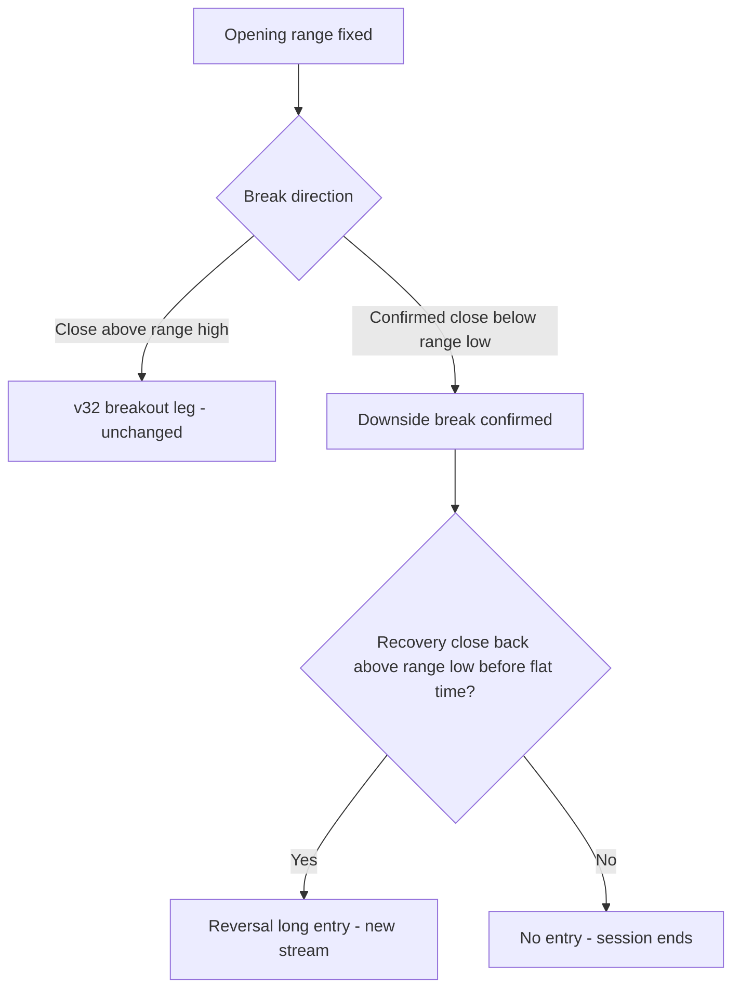
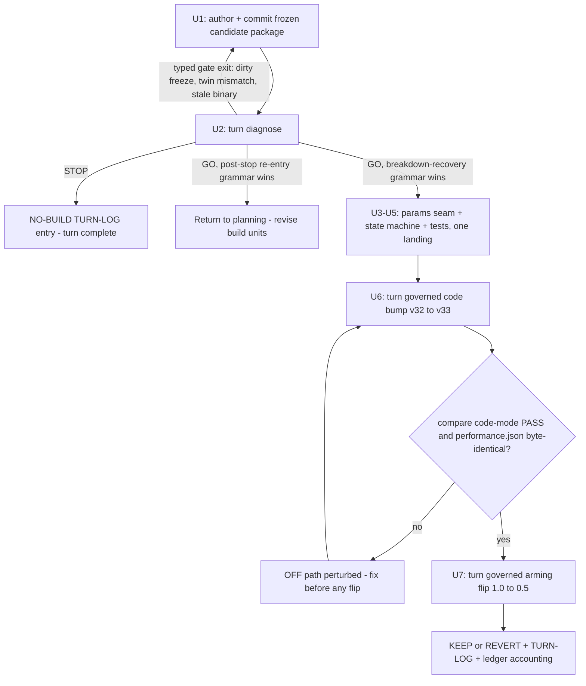
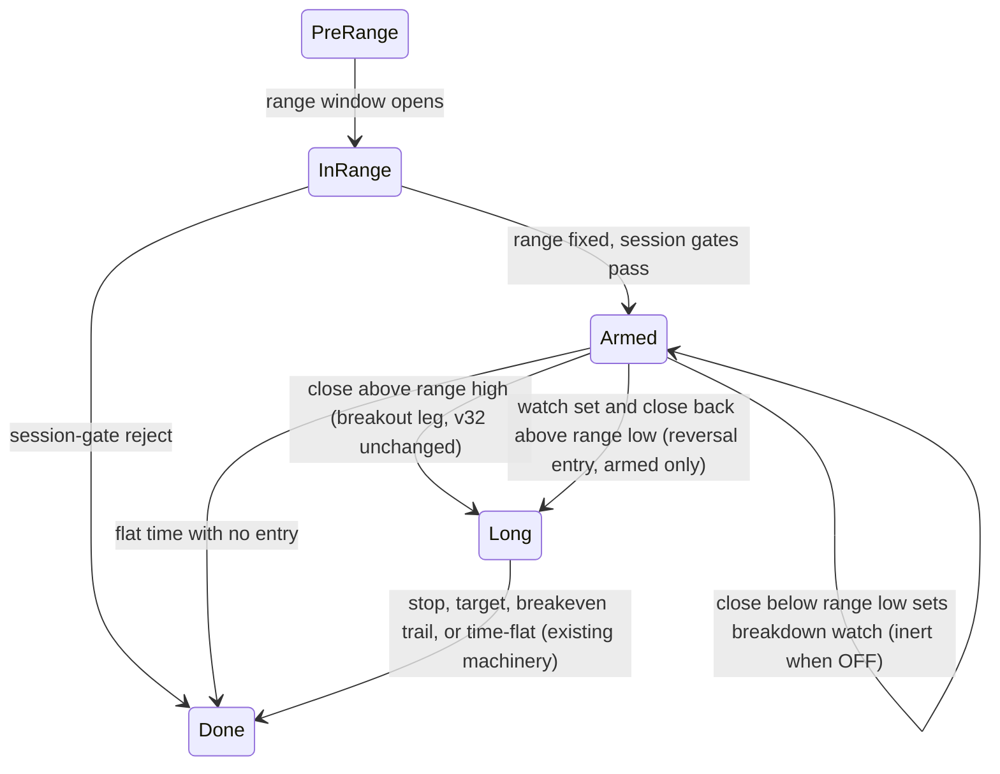

# ORB Failed-Break Reversal Stream - Plan

## Goal Capsule

- **Objective:** Run lever 8 of the ORB lever queue as the next governed turn: screen a long-only failed-break reversal mechanism offline (Phase A diagnostic + twin over the frozen v32 data), and only on a passing gate verdict build it as an additive entry stream flipped against head v32.
- **Product authority:** This document; the lever-queue plan (`docs/plans/2026-07-11-001-feat-orb-external-consensus-lever-queue-plan.md`, lever 8 row and long-only constraint); the candidate-package convention (`adapters/nautilus/lab/candidates/README.md`).
- **Execution profile:** Two phases. Phase A (U1–U2) always executes and ends in a committed gate verdict. Phase B (U3–U7) executes only on a GO verdict; a STOP verdict closes the turn as a documented NO-BUILD, which is a complete outcome, not a failure.
- **Stop conditions:** A STOP gate verdict ends the turn after the TURN-LOG entry (do not build) — the diagnose CLI signals it with typed exit 11 (threshold-fail) alongside the written verdict, which is the NO-BUILD outcome, not a failure. Any other typed gate exit (twin mismatch, script failure, frozen-input dirty, stale binary, pre-register hash mismatch) is surfaced and fixed at its cause — never bypassed, and never resolved by softening a pre-registered threshold. If the gate verdict names the post-stop re-entry grammar as the winner, stop before Phase B and return this plan for revision (the build units below cover the primary grammar only).
- **Open blockers:** None. Phase A runs entirely offline on the existing v32 head run's bars; Phase B runs are offline backtests.

---

## Product Contract

### Summary

Add a second, long-only entry stream to the ORB strategy that trades the failure of a confirmed downside break back into the opening range, leaving the v32 breakout leg untouched. The turn is diagnostic-first: a frozen candidate package measures the failure populations on existing v32 bars and a gate verdict decides build vs NO-BUILD before any strategy code is written.

### Problem Frame

The incremental lever queue has converged. The last five verdicts — ratio-ATR tilt KEEP, equity-compounding REVERT, Amihud liquidity REVERT, gap-retention KEEP (head v32, RoR 0.1876), stop-geometry NO-BUILD — exhausted the stop/loss-geometry and CLASS-B sizing axes, and the entry-filter axis produced only one keeper. Lever 8 is the one genuinely new alpha mechanism remaining, and it is the queue's designated inversion candidate: the entry-quality falsifications that armed it have all landed (late entries are net winners, winners have lower opening RVOL, breakout-strength banding falsified). The strategy currently has no downside-break concept at all — its state machine confirms only upside breaks — so the failure-of-a-break event this lever trades is not yet observable in live strategy state, only derivable from bars.

### Key Decisions

- **Additive second stream, not an inversion twin or a conditional takeover.** The v32 breakout leg keeps its exact behavior; the reversal is an independent entry stream in the same strategy, and the governed flip compares v32 against v32-plus-stream. This keeps the comparison anchored to the standing head rather than forking the strategy.
- **Reversal entries inherit v32's session gates and sizing.** OR-width, gap-retention, governed risk sizing, and the ratio-ATR tilt apply to reversal entries unchanged. Comparability wins over an uncontaminated mechanism read; any gate can be re-litigated later on reversal-specific evidence.
- **Shared capacity, honest A/B.** Reversal entries draw from the same `max_concurrent` slots and risk budget as breakout entries. Displacement of breakout trades is part of the measured effect of turning the stream on; the invariant is that the OFF stream stays byte-identical to v32.
- **Dual-grammar Phase A with failed-breakdown recovery as the primary hypothesis.** The diagnostic measures both candidate grammars from one bar sweep — the failed-breakdown recovery (the true inversion mechanism) and the post-stop re-entry (population capped by v32's own trade count) — and the gate verdict picks the surviving grammar or NO-BUILD.
- **Diagnostic-first under the candidate freeze.** Per the stop-geometry precedent, no state-machine code is written before the gate verdict; a NO-BUILD on sample size or materiality is a legitimate, documented close of the turn.

### Requirements

**Phase A — offline screen**

- R1. The turn begins as a frozen candidate package (`candidate.json` + `diagnostic.py` + independent `twin.py`) under the existing candidates convention, with the gate verdict produced before any strategy code exists.
- R2. The diagnostic computes, from the v32 head run's bars (20260526–20260703, 40-symbol universe), the failed-breakdown recovery population: a confirmed close below the fixed range low followed by a close back above it before session flat time.
- R3. The same sweep computes the secondary post-stop re-entry population: sessions where a v32 Long stops out at the range low and price later closes back above it.
- R4. Each population is scored as hypothetical long trades under the head's sizing rules, producing a projected additive RoR shift against the v32 baseline.
- R5. The gate verdict names exactly one surviving grammar or NO-BUILD.

**Mechanism (build phase, only on a passing verdict)**

- R6. With the stream OFF, strategy output is byte-identical to head v32.
- R7. A reversal entry requires a confirmed downside break of the fixed opening range followed by a confirmed recovery back into the range, and is long-only.
- R8. Reversal entries pass the same session gates as breakout entries and use the same governed risk sizing and ratio-ATR tilt.
- R9. Reversal entries share the breakout leg's concurrency slots and risk budget, with no reserved or separate capacity.
- R10. Reversal positions reuse the existing exit machinery (stop, breakeven trigger, time-flat); this turn adds no new exit class.
- R11. At most one reversal entry fires per symbol per session.

**Governed turn**

- R12. The build lands as a governed code turn (code-bump path, not a param turn) and the ON/OFF flip is measured against head v32 under the standing KEEP crux.

The reversal event grammar alongside the untouched breakout path:

### Acceptance Examples

- AE1. **Covers R7.** Given a confirmed downside break, when no close recovers above the range low before flat time, then no reversal entry occurs.
- AE2. **Covers R2.** Given an intrabar wick below the range low whose bar closes inside the range, then no downside break is confirmed and the session is not in the Phase A population.
- AE3. **Covers R7, R11.** Given a confirmed breakdown and a confirmed recovery, one reversal long fires; a second breakdown-recovery cycle in the same session fires nothing.
- AE4. **Covers R9.** Given all concurrency slots held when a reversal signal confirms, the entry is not taken — displacement and crowding are measured at the flip, not prevented.
- AE5. **Covers R6.** Given the stream OFF, a re-run over the v32 window produces byte-identical results to the v32 head run.

### Success Criteria

- Phase A materiality: a grammar survives only if its projected additive RoR shift clears the standing floor of 0.005 (set below the smallest historically kept lever gain, +0.0091).
- KEEP at the flip: the ON run's size-invariant RoR (Σpnl / Σrisk_capital) exceeds the v32 head's 0.1876 with risk-cap dominance ≤ 0.40.
- NO-BUILD at Phase A and REVERT at the flip are legitimate documented outcomes of the turn, not failures of it.

### Scope Boundaries

- No short-side mechanisms — the standing long-only constraint holds.
- Lever 6 (breakout provenance gate), the index-regime/disclosure-blackout lever class, and the universe-breadth run (#118) stay queued and untouched.
- No new data ingestion; Phase A uses only the existing v32 bars.
- No re-tuning of kept levers or exit geometry inside this turn.
- Build units cover the primary breakdown-recovery grammar only; a gate verdict favoring the post-stop re-entry grammar returns to planning (its build makes the session-terminal state re-entrant — a structurally different change).
- Deferred to follow-up work: extending `report mfe` to bucket reversal-tagged entries separately from breakout entries — this turn only adds the tag that makes that extension possible.

### Dependencies / Assumptions

- The v32 head run's frozen data (zero coverage gaps, 40 symbols) is a sufficient Phase A sample surface; scarcity of confirmed-breakdown-recovery events on large caps is an accepted risk absorbed by the NO-BUILD path.
- Phase A scores an unconstrained hypothetical population; capacity displacement under the shared budget is visible only at the flip. The split is accepted — the diagnostic's projected shift is an upper bound on the additive effect, and the gate verdict records this caveat.
- Under the primary grammar, a symbol-session takes either a breakout entry or a reversal entry, never both — the session-terminal state stays terminal, so the stream's added population is sessions that currently never enter.

### Sources / Research

- `docs/plans/2026-07-11-001-feat-orb-external-consensus-lever-queue-plan.md` — lever 8 definition (line 71), long-only and no-new-ingest constraints (lines 110–112), lever 6 deferral rationale.
- `adapters/nautilus/lab/src/strategy/orb.rs` — current state machine: phases `PreRange/InRange/Armed/Long/Done`, upside-only break confirmation, `Done` terminal; per-symbol state already tracks range bounds, session extremes, and closes needed by the diagnostic.
- `adapters/nautilus/lab/candidates/README.md` — frozen candidate-package contract (git-tracked freeze; flips refuse post-verdict edits).
- `docs/solutions/conventions/stop-geometry-lever-is-class-b-absorbed-and-near-inert.md` — four-gate screen thresholds and the materiality-floor rationale.
- `adapters/nautilus/lab/TURN-LOG.md` and `data/turn4-fresh/runs/20260717T094841Z-backtest-orb-v32/` — head v32 record (RoR 0.1876) and its manifest/data-quality facts.
- `adapters/nautilus/lab/src/runner/research.rs` — governed seam: `LS_TURN_CODE_BUMP` is the code-turn path and cannot combine with `LS_TURN_PARAM`.

---

## Planning Contract

**Product Contract preservation:** unchanged, except the former Outstanding Questions (all "Deferred to Planning") are resolved by KTD2, KTD3, and KTD5 below, and Scope Boundaries / Dependencies gained the grammar-B contingency and mutual-exclusivity consequences confirmed at the scoping synthesis.

### Key Technical Decisions

- **KTD1 — Watch state as inert-off fields on the per-symbol state, not a new phase variant.** The breakdown-watch lives in new `OrbState` fields consulted only when the stream is armed, mirroring the existing inert-accumulator precedent (`open_window_vol` accumulates without behavioral effect). The reconcile gate for the re-baseline is byte-identical `performance.json`, so the OFF path must be provably unreachable-to-behavior — guarding every read behind the OFF sentinel is cheaper to prove than threading a new `Phase` variant through the dispatch. The phase ladder `PreRange/InRange/Armed/Long/Done` is unchanged; the reversal entry transitions `Armed → Long` exactly like the breakout entry.
- **KTD2 — Flip param is a restricted-value gate arming within the governance cap.** New param `reversal_arm` with `#[serde(default = ...)]` OFF sentinel `1.0` and sole armed value `0.5`, validated as restricted values (the `gap_retention_min` pattern, `params.rs:431` region). `1.0 → 0.5` sits exactly on the inclusive `PROPOSAL_BOUNDS_CAP = 0.5`, so the arming flip runs natively through `turn governed` — a `0.0 → X` sentinel would fail-close the guardrail and force a manual seed-and-rerun. The armed value is a pure gate; it carries no mechanism magnitude. Mechanism companions — breakdown-confirmation rule, recovery-confirmation rule, stop anchor — are frozen `#[serde(default = "fn")]` constants set from the Phase A winning variant, never swept at flip time (the frozen-companion seeding rule from the code-turn rebaseline learning).
- **KTD3 — Screen gates adapted for an additive stream.** The stop-geometry screen's collinearity gates are dropped: an additive stream has no incumbent signal to correlate against (its trades do not exist in the head run). The screen keeps: (a) a pre-registered **population-count floor** as its own STOP gate — a thin population is a NO-BUILD regardless of projected shift; (b) the **fill-price-independent primary reading** — the reversal population's resolution mix (share resolving to target vs stop vs time-flat under the head's barrier semantics), because any qty-weighted stat inherits fill bias; (c) `ror_shift ≥ 0.005` computed against the diagnostic's **own re-sim of the v32 baseline** (not the run's 0.1876, so flat-fill bias cancels) with **ceiling-aware qty** (`min(floor(budget·w/rps), floor(notional/price))` — the Amihud mis-prediction was exactly the missing notional clip); (d) the `keep_anchor` records the ON-population caveat — reversal entries contend for `max_concurrent 7` slots, so the flip run's realized population can differ from the diagnostic's (the gap-retention realized-vs-predicted divergence is the on-record precedent). All thresholds are pre-registered in `candidate.json` before any reading is computed and never softened after.
- **KTD4 — Dual-grammar screen with the argmax inside both scripts.** The diagnostic computes readings for both grammars — breakdown-recovery (primary) and post-stop re-entry (secondary) — from one bar sweep, plus a `winning_grammar_id` reading with tolerance 0 so the independently authored twin must agree on the argmax (the stop-geometry `winning_signal_id` convention). Candidate `family` is a new string (`entry-stream`) so R5 prior-trials disclosure starts a fresh family rather than inheriting the entry-filter or class-b trial history.
- **KTD5 — Reversal entry reuses the Long machinery wholesale; only the arming differs.** The recovery entry emits the same `Enter` action after setting `entry_price` (recovery close), `stop_price` (the winning variant's anchor — default candidate: the breakdown's session low), and `r_denom` (the head's decoupled `range_high − range_low` convention, kept for cross-stream comparability of R-units). Sizing then flows through the existing `position_qty_risked_tilted` path unchanged, satisfying the inherit-gates-and-tilt requirement for free. Directional guidance, not specification: Phase A sweeps the stop-anchor variants; the code implements only the winner.
- **KTD6 — Same-bar semantics pre-declared identically in diagnostic, twin, and strategy.** Close-confirm symmetry with the head (`entry_confirm 1.0`): breakdown confirms on a close strictly below the range low; recovery confirms on a later bar's close strictly above it (one bar cannot be both). A bar that closes above the range high directly from breakdown-watch satisfies both triggers; the breakout leg wins (its evaluation is untouched v32 code and runs first). Post-entry bars follow the existing stop-first pessimism; under close-confirm there is no same-bar enter-and-stop. A degenerate reversal entry with zero stop distance (recovery close equal to the stop anchor) is rejected at sizing, never divided through — the ATR-zero lesson class.
- **KTD7 — Reversal records are distinguishable in the decision stream.** New signal/exit tagging (a reversal `SignalKind` or a canonical `values` marker) plus canonical filter strings for reversal rejects, so (a) the OFF-run bind proof is "zero reversal-tagged records in the re-baseline run" (the gap-retention zero-records pattern), and (b) the tag makes stream-separated analysis possible later — the `report mfe` tool itself stays breakout-only this turn (its exit join keys on the breakout signal kind), and the flip's dominance check needs no report change because it runs through the governed edge evaluation, which is stream-agnostic.

### High-Level Technical Design

Turn control flow — the two-phase governed turn with its refusal gates:

Per-symbol session machine with the reversal overlay (directional guidance — the watch is state fields under `Armed`, not a new phase):

### Sequencing

Phase A strictly precedes Phase B, and U3–U5 land together as one code change before U6 — the code-bump turn fingerprints `orb.rs` once, so the params seam, state machine, and tests must all be in the tree for the single re-baseline. U6's byte-identity proof strictly precedes U7's flip.

---

## Implementation Units

### U1. Author the frozen candidate package

- **Goal:** A committed `failed-break-reversal` candidate package whose diagnostic and twin compute both grammar populations and all pre-registered readings from the v32 artifacts.
- **Requirements:** R1, R2, R3, R4; KTD3, KTD4, KTD6.
- **Dependencies:** none.
- **Files:** `adapters/nautilus/lab/candidates/failed-break-reversal/candidate.json`, `.../diagnostic.py`, `.../twin.py`, `.../README.md`.
- **Approach:** Model on `adapters/nautilus/lab/candidates/stop-width-geometry/` (the v32-anchored precedent). Pin identity before any reading: run `20260717T094841Z-backtest-orb-v32`, its strategy-code/catalog/universe hashes, and assert `stop_mode == 0.0`, `entry_confirm == 1.0`, `range_minutes == 20` from the manifest. Read only `manifest.json`, `performance.json`, and the parquet minute/day bars; re-derive and assert the catalog content fingerprint; canonical integer-KRW price handling; KST session windows. Reconstruct per-session range bounds offline (the gap-retention diagnostic's range derivation is the template) and walk post-entry bars with the stop-width `simulate()` barrier semantics (stop-first, breakeven ratchet next-bar, time-flat) for hypothetical reversal trades. Grammar A population from R2's event grammar; grammar B from `performance.json` stop-outs joined to subsequent bars. Never derive `r_denom` from `realized_r` (circularity); recover `risk_per_share = risk_capital / quantity`. `candidate.json`: `family: "entry-stream"`, `phase_a: "bespoke"`, `flip_param`/`flip_value` matching KTD2 (`reversal_arm`, `0.5`), readings including per-grammar population counts, resolution mixes, `ror_shift`s, and `winning_grammar_id` (tolerance 0), thresholds per KTD3, `keep_anchor` stating the KEEP crux plus the ON-population slot-contention caveat. Diagnostic and twin must be structurally independent implementations (entry-local reconstruction vs catalog-wide maps), sharing barrier semantics by design but not code.
- **Test scenarios:** Enforced by the diagnose harness rather than a Rust test file — the twin's independent recompute must agree within pre-registered tolerances on every reading, including the exact-count population readings (tolerance 0) and the argmax. Script-internal assertions: identity pins abort on mismatch; divergent-duplicate bar detection aborts; a session with a wick below the range low but no close below it appears in no population (AE2); a breakdown with no recovery close before flat time scores as no-trade (AE1); ceiling-aware qty caps a hypothetical trade whose notional clip binds.
- **Verification:** Both scripts run via the pinned `uv` argv and write the readings JSON; `candidate.json` content hashes match the scripts; the package is committed (freeze check requires a clean tree over the frozen inputs).

### U2. Run diagnose and record the gate verdict

- **Goal:** A committed `gate-verdict.json` (GO or STOP) with its ledger trial record and a TURN-LOG Phase A entry.
- **Requirements:** R5; Success Criteria (materiality floor, count floor).
- **Dependencies:** U1.
- **Files:** `adapters/nautilus/lab/candidates/failed-break-reversal/gate-verdict.json` (tool-written, committed after), `adapters/nautilus/lab/ledger/trials.jsonl`, `adapters/nautilus/lab/TURN-LOG.md`.
- **Execution note:** Build and run from `adapters/nautilus` (a root build leaves a stale binary that silently runs old code). The trial ledger appends before the verdict is written — an orphan trial after a crash is expected, never an uncounted GO.
- **Approach:** `LS_TURN_CANDIDATE=failed-break-reversal` through the diagnose CLI. On STOP: write the NO-BUILD TURN-LOG entry echoing the frozen readings and freeze commit, and end the turn — the remaining units do not execute. On GO with the secondary grammar winning: stop and return to planning per the Goal Capsule. On GO with the primary grammar: proceed to U3.
- **Test scenarios:** Test expectation: none — this unit is an operational run of an already-tested harness; its outcome is the verdict artifact itself.
- **Verification:** Diagnose exits with the verdict's matching typed code — 0 on GO, typed exit 11 (threshold-fail) on STOP — and the verdict written; readings agree within tolerances; `prior_trials` disclosure lists the (empty) `entry-stream` family history; verdict, ledger line, and TURN-LOG entry are committed together.

### U3. Params seam: flip param and frozen companions

- **Goal:** The `reversal_arm` restricted-value gate and the winning variant's frozen companion constants on the params struct, legacy-manifest safe.
- **Requirements:** R6, R12; KTD2.
- **Dependencies:** U2 (GO, primary grammar).
- **Files:** `adapters/nautilus/lab/src/params.rs` (param declarations, `validate()`, in-file tests).
- **Approach:** `reversal_arm` with `#[serde(default)]` returning `1.0` (OFF) and a `validate()` arm accepting only `{1.0, 0.5}`; an accessor like the existing `gap_retention_active()` seam. Companions (breakdown/recovery confirmation rule identifiers, stop-anchor selection) as frozen serde defaults matching the Phase A winner — consciously choosing the frozen-constant pattern over a swept reference (the params file's own divergence note asks each new lever to pick deliberately).
- **Test scenarios:** A serialized legacy manifest with the new keys removed deserializes to OFF and surfaces in the numeric summary (the `gap_retention_off_seam` test pattern); `validate()` rejects an ungoverned armed value (e.g. `0.7`); OFF sentinel round-trips through manifest serialization unchanged.
- **Verification:** `cargo test -p nautilus-ls-lab` (params in-file tests) green from `adapters/nautilus`.

### U4. State-machine extension in orb.rs

- **Goal:** The breakdown-watch and recovery-entry logic, inert when OFF, entering through the existing Long machinery when armed.
- **Requirements:** R6, R7, R8, R9, R10, R11; KTD1, KTD5, KTD6, KTD7.
- **Dependencies:** U3 (lands in the same tree; sequencing within the landing is free).
- **Files:** `adapters/nautilus/lab/src/strategy/orb.rs`.
- **Approach:** New `OrbState` watch fields written/read only behind the armed check, in the `Armed` block after the untouched breakout evaluation (breakout wins a both-trigger bar per KTD6). On recovery confirmation: set `entry_price`/`stop_price`/`r_denom` per KTD5, emit the reversal-tagged signal envelope, and return the same `Enter` action the breakout path returns — concurrency (`sizing_allows`), sizing, tilt, and all exit machinery then apply unchanged. Reversal rejects emit the existing reject envelope with new canonical filter strings. One reversal entry per symbol-session falls out of the unchanged terminal `Done`.
- **Execution note:** The OFF path must be provably behavior-unreachable, not merely behavior-neutral — U6's reconcile is byte-identical `performance.json`. Guard every new read behind the OFF sentinel; do not restructure existing transitions while in there (`orb.rs` is hash-locked to verdict-bearing runs; unrelated cleanups ride a later code turn).
- **Test scenarios:** OFF: a breakdown-plus-recovery bar sequence produces action-for-action identical output to the pre-change machine. Armed: confirmed close below range low sets the watch and emits no action; wick-below-close-inside does not (AE2); recovery close above range low enters long at that close with the winner's stop anchor and the decoupled `r_denom` (Covers F-none / AE3 first leg); no recovery before flat time → time-flat with no entry (Covers AE1); second breakdown-recovery cycle after the reversal position closes fires nothing (Covers AE3); a bar closing above the range high from breakdown-watch enters via the breakout leg, not the reversal (KTD6); recovery with zero stop distance is rejected at sizing with no panic; slots full at recovery → reject envelope with the canonical filter and the state rolls to Done (Covers AE4); session-gate reject at range fix precludes the watch entirely (R8).
- **Verification:** Targeted `cargo test -p nautilus-ls-lab --test strategy` green from `adapters/nautilus`.

### U5. Offline test coverage for identity and integration

- **Goal:** Transition tests (U4's scenarios) in the strategy suite plus full-engine OFF-identity coverage.
- **Requirements:** R6; AE5.
- **Dependencies:** U3, U4.
- **Files:** `adapters/nautilus/lab/tests/strategy.rs`, `adapters/nautilus/lab/tests/backtest_run.rs`.
- **Approach:** Transition tests use the existing `bar()`/`set_range()` helpers with exact `Vec<OrbAction>` asserts. The OFF-identity claim gets a full-engine test in the byte-identity style the trail lever used (`trail_off_is_flat_breakeven_byte_identical` pattern); an armed-path engine test proves a reversal placement's qty reconciles to the sizing formula (the existing per-placement reconcile pattern).
- **Test scenarios:** The U4 list, rendered as the suite; plus engine-level: OFF run over a fixture session is byte-identical to the pre-change engine output; armed run books a reversal entry whose envelopes carry the reversal tag and whose qty matches `position_qty_risked_tilted`.
- **Verification:** `cargo test --workspace` from `adapters/nautilus` green (equivalent to root `make adapter-check`).

### U6. Code-bump re-baseline to v33

- **Goal:** The governed code turn lands the new machine OFF as head-equivalent v33, with the byte-identity proof.
- **Requirements:** R6, R12; AE5.
- **Dependencies:** U3, U4, U5 (all in the committed tree).
- **Files:** `adapters/nautilus/lab/TURN-LOG.md`, new run directory under `data/turn4-fresh/runs/`.
- **Execution note:** The identity re-baseline is expected to print the `REVERT ror-negative` line — that is the identity outcome, not the turn verdict (the Amihud-precedent reading).
- **Approach:** `turn governed` with `LS_TURN_CODE_BUMP=1 LS_TURN_CANDIDATE=failed-break-reversal` (the governed parent requires the candidate slug unconditionally and reuses the committed GO verdict; never combined with `LS_TURN_PARAM`): version bump with a manifest diff of exactly `strategy_version`, fresh-binary fingerprint checks, 1:1 reconcile. Then `runs compare` in code mode (param diff exactly `strategy_version`, code hash differs, fingerprints equal) and a byte compare of `performance.json` v32 vs v33 (the gap-retention OFF proof), plus the zero-reversal-tagged-records bind check in the v33 decision stream (KTD7).
- **Test scenarios:** Test expectation: none — operational run; the proofs are the compare PASS, the byte-identical performance file, and the zero-tag bind check.
- **Verification:** Compare PASS; `cmp` byte-identical; zero reversal-tagged records; TURN-LOG re-baseline entry with verbatim stage lines.

### U7. Arming flip and verdict

- **Goal:** The governed arming flip `reversal_arm 1.0 → 0.5` against the v33 base, ending in a recorded KEEP or REVERT.
- **Requirements:** R9, R12; Success Criteria.
- **Dependencies:** U6.
- **Files:** `adapters/nautilus/lab/TURN-LOG.md`, `adapters/nautilus/lab/ledger/trials.jsonl`, new run directory under `data/turn4-fresh/runs/`.
- **Approach:** `turn governed` with `LS_TURN_PARAM=reversal_arm LS_TURN_VALUE=0.5 LS_TURN_CANDIDATE=failed-break-reversal` — the flip guard re-hashes `candidate.json` and refuses post-verdict edits; `1.0 → 0.5` sits on the inclusive proposal-bounds cap. Verdict by the standing crux: KEEP only on RoR strictly above the base with dominance ≤ 0.40. Either verdict is recorded: TURN-LOG entry with the flip result, bind evidence from the decision stream (reversal-tagged entries present ON; realized vs diagnostic-predicted population compared explicitly against the slot-contention caveat), and ledger accounting. On KEEP the flip run becomes the new head; on REVERT the head stays v33.
- **Test scenarios:** Test expectation: none — operational run; the verdict artifacts are the outcome.
- **Verification:** Governed verdict line recorded verbatim; TURN-LOG and ledger committed; on KEEP, the run registry's latest finalized run is the flip run.

---

## Verification Contract

| Gate | Command (from) | Applies to | Done signal |
|---|---|---|---|
| Lab strategy suite | `cargo test -p nautilus-ls-lab --test strategy` (`adapters/nautilus`) | U4, U5 | 0 failed |
| Lab engine suite | `cargo test -p nautilus-ls-lab --test backtest_run` (`adapters/nautilus`) | U5 | 0 failed |
| Adapter workspace | `cargo test --workspace` (`adapters/nautilus`) = root `make adapter-check` | U3–U7, any lab edit | 0 failed |
| Root gate | `make docs && cargo test && make docs-check && make lane-check && make adapter-check` (repo root) | before each commit that touches the repo | all green; never two full `cargo test` runs concurrently |
| Diagnose | diagnose CLI exit code | U2 | exit 0 with a GO verdict, OR typed exit 11 with a written STOP verdict (the NO-BUILD outcome, turn-complete); all other typed exits fixed at cause |
| Re-baseline proof | `runs compare` code mode + `cmp` of `performance.json` | U6 | PASS + byte-identical + zero reversal-tagged records |
| Flip verdict | `turn governed` output | U7 | verdict line recorded; KEEP requires RoR > base and dominance ≤ 0.40 |

Build the lab binary only from `adapters/nautilus` (`cargo build --release -p nautilus-ls-lab --bin lab-research`); a stale root-built binary silently backtests old code and the governed parent's fingerprint check exists to catch exactly this.

---

## Definition of Done

The turn is done when exactly one of these terminal states is committed:

- **NO-BUILD:** STOP gate verdict + ledger trial + TURN-LOG Phase A entry committed; no strategy code changed; root gate green.
- **Built and flipped:** GO verdict; U3–U5 landed with the full test suite green; U6 re-baseline with compare PASS, byte-identical performance proof, and zero-tag bind check; U7 flip with a recorded KEEP or REVERT, TURN-LOG entries echoing frozen readings and verbatim verdict lines, and ledger accounting.
- **Returned to planning:** GO verdict naming the post-stop re-entry grammar, recorded in TURN-LOG, with this plan flagged for revision before any build.

In every state: the root gate is green, no experimental or dead-end code remains in the diff, `gate-verdict.json` is committed tool-written output (never hand-edited), and the frozen candidate inputs are untouched since the verdict.
