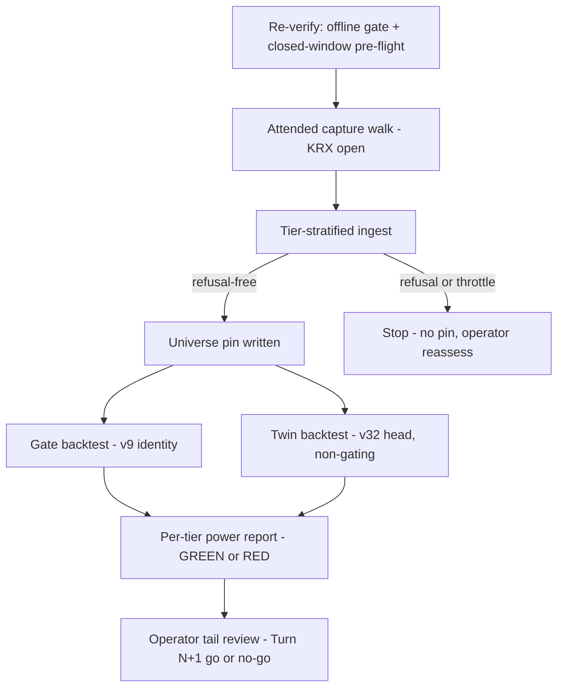
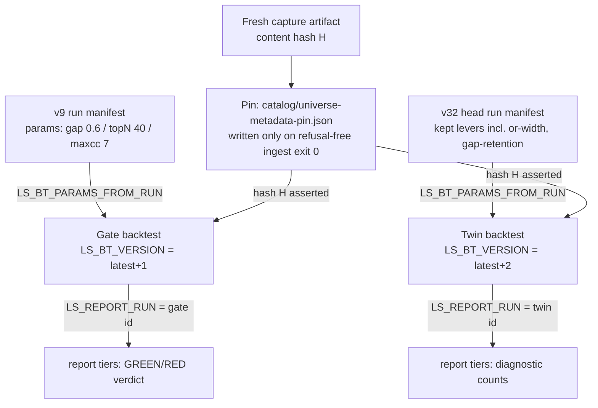

# Universe Engine First Real Tier-Stratified Run - Plan

## Goal Capsule

- **Objective:** Execute the first real end-to-end tier-stratified universe run (issue #118): attended KRX-open capture, tier-stratified ingest with the pin handshake, the pre-registered v9-identity count backtest plus a non-gating v32-head diagnostic twin, ending at the per-tier power verdict.
- **Product authority:** strategy-loop owner (user).
- **Execution profile:** zero code changes — an operational run of frozen #116 machinery. U1–U2 and U5–U7 are agent-runnable offline; U3–U4 are attended operator legs against the live paper gateway during a KRX-open window.
- **Stop conditions:** the run completes at the per-tier trade-count verdict; RED is a valid completion that calls off Turn N+1. Any capture/ingest refusal, throttle abort, or hash-handshake failure stops the run for operator reassessment — never an inline code fix.
- **Tail ownership:** user reviews the gate verdict and the twin counts and decides whether Turn N+1 runs.
- **Open blockers:** an attended KRX-open window must be scheduled; U1–U2 must be green before that window is committed.

---

## Product Contract

**Product Contract preservation:** unchanged — R1–R10, F1, AE1–AE4 carried verbatim. The brainstorm's two deferred Outstanding Questions are resolved into the Planning Contract (KTD1, KTD3); the section is removed rather than left stale.

### Summary

Run the frozen #116 universe machinery for real: capture → ingest → count backtest → per-tier power report. The pre-registered v9 params identity remains the sole GREEN/RED gate; a second, non-gating backtest under current v32 head params runs as a diagnostic twin so the operator can see whether v32's entry gates would starve the tiers before committing Turn N+1.

### Problem Frame

The universe engine, pre-flight, and rehearsal landed offline in PR #116 (2026-07-10), and Turn N+1 (the per-tier expectancy verdict) is gated on this run's power pre-check. Twelve days have passed since the runbook was frozen. In that time the strategy head moved v9 → v32 through several kept entry-gating levers (close-confirm, or-width decouple 0.666, gap-retention 0.5), so the trade population the pre-check counts under v9 identity no longer matches what Turn N+1 would trade. Separately, the KRX calendar Enforced cutover (#189) and the ingest empty-retry bound (#202) changed the capture/ingest path after the rehearsal validated it, and the issue's pinned `LS_BT_VERSION=13` is stale — the runner's version-ack guard would reject it.

### Key Decisions

- **v9 identity stays the gate; v32 runs as a non-gating twin.** The pre-registered gate (v9 identity: gap 0.6 / topN 40 / maxcc 7, run `20260710T013757Z-backtest-orb-v9`) is honored unchanged — no re-registration. The twin (params from run `20260717T094841Z-backtest-orb-v32`) is diagnostic only: its tier counts inform the operator's tail review and never touch the GREEN/RED verdict.
- **Version acks corrected, not re-frozen.** `LS_BT_VERSION` is an explicit ack of the version the run will finalize as (`adapters/nautilus/lab/src/runner/backtest.rs`, params-from-run guard). The runner refuses to adopt params without an ack, but the ack's *value* is unenforced — whatever is supplied becomes the finalized version. With the latest finalized run at v32, the gate run finalizes as v33 and the twin as v34 (as of 2026-07-23); correctness rests on the operator confirming the latest-finalized version against `data/turn4-fresh/runs/` immediately before each run (KTD1).
- **Pre-registered ingest config carries forward unchanged:** `per_stratum=10`, lookback `20260518`, accumulate mode, daily + minute:1. The stated floor (0.091 trades/session-tier ≈ 0.6× the v9 blue-chip baseline) was judged plausible against this config; changing it would silently move the floor.
- **A re-verification pass precedes the attended window.** The rehearsal predates the calendar-Enforced cutover and the ingest empty-retry change, so the offline gate and the closed-window pre-flight are re-run before the attended window is committed. Divergence stops the run and returns to the operator; it is not patched inline.
- **Only a fresh capture is the artifact-of-record.** The rehearsal scratch artifact (hash `710e4e41…`) must never be pinned.

### Requirements

**Pre-attended verification**

- R1. The offline gate and the closed-window pre-flight re-check pass before the attended KRX-open window is committed.
- R2. The capture and ingest paths are confirmed to behave under the post-rehearsal codebase (calendar Enforced, ingest empty-retry); any divergence stops the run for operator reassessment rather than an inline fix.

**Attended capture (KRX-open window)**

- R3. The reference-data capture completes as a self-paced walk (single paced pages, `t8430` last, fatal-on-throttle for gate categories, whole-board requests refused pre-dispatch) and produces a fresh refusal-free artifact-of-record.
- R4. The rehearsal scratch artifact is never pinned; only the fresh capture's content hash enters the pin handshake.

**Tier-stratified ingest**

- R5. Ingest runs tier-stratified with the pre-registered config, and the universe pin is written only after a refusal-free ingest (runner-enforced pin handshake).

**Count backtest and twin**

- R6. The gate backtest adopts params from the v9 run with an explicit version ack whose value is confirmed against the latest finalized run immediately before the run — the runner refuses a missing ack but does not validate its value (KTD1).
- R7. The twin backtest adopts params from the v32 head run against the same pinned metadata artifact, with its own corrected version ack, and is recorded as non-gating.
- R8. The KTD2 hash handshake holds end-to-end: no re-capture between ingest and backtest; `report tiers` fails on any artifact-hash mismatch.

**Verdict and tail**

- R9. The per-tier power verdict (GREEN = ≥30 trades in ≥2 tiers) is computed from the v9 gate run only; RED is a valid completion that calls off Turn N+1. The staging guard is unchanged: `performance.json` is written but never read for the verdict.
- R10. The twin's per-tier counts are surfaced beside the gate verdict for the operator's tail review; the user decides whether Turn N+1 runs.

### Key Flows

- F1. First real run, end to end
  - **Trigger:** operator commits an attended KRX-open window after R1–R2 pass.
  - **Steps:** re-verification (offline gate + closed-window pre-flight) → attended capture walk → tier-stratified ingest → pin handshake → v9 gate backtest → v32 twin backtest → per-tier report → operator tail review.
  - **Outcome:** GREEN or RED verdict from the gate run, twin counts alongside, Turn N+1 go/no-go owned by the user.
  - **Covers:** R1–R10.

### Acceptance Examples

- AE1. **Covers R9, R10.** Given the gate run clears 30 trades in 2+ tiers and the twin does too, when the report renders, then the verdict is GREEN and the operator decides Turn N+1 with both count sets visible.
- AE2. **Covers R7, R9, R10.** Given the gate run is GREEN but the twin clears 30 trades in fewer than 2 tiers, when the report renders, then the verdict is still GREEN and the starved twin is flagged for tail review — the divergence never flips the gate.
- AE3. **Covers R9.** Given the gate run clears 30 trades in fewer than 2 tiers, when the report renders, then the verdict is RED, the run is a valid completion, and Turn N+1 is called off.
- AE4. **Covers R3, R5.** Given a throttle or refusal fires on a gate category mid-capture or mid-ingest, when the runner stops, then no pin is written and the partial artifact is never promoted to artifact-of-record.

### Scope Boundaries

- Turn N+1 (the per-tier expectancy verdict) — this run only decides whether it is powered.
- Floor re-derivation or `per_stratum` widening on a RED verdict — an operator tail decision, not part of this run.
- Engine or strategy code changes — this is an operational run of frozen #116 machinery; a code gap discovered mid-run is a stop-and-reassess, not an inline patch.

### Dependencies / Assumptions

- An attended KRX-open window (`market-hours` label on #118); paper gateway credentials via the domestic lane env file with `LS_TRADING_ENV=paper`.
- The v9 params run and the v32 head run both exist in `data/turn4-fresh/runs/` (verified 2026-07-23), and the `turn4-fresh` catalog remains GO.
- `t1904` served under closure at rehearsal (349 proxy members), so the open window carries no first-exercise risk on it.

### Sources

- Issue #118 — the staged sequence and market-hours constraint.
- `docs/plans/2026-07-10-003-feat-reference-data-universe-engine-plan.md` — pre-registered gates, stop conditions, tail ownership, closed-window pre-flight definition.
- `adapters/nautilus/lab/src/runner/backtest.rs` (`main_cli`, params-from-run guard), `adapters/nautilus/lab/src/runner/report.rs` (`report_tiers`, `power_precheck`), `adapters/nautilus/src/reference/capture.rs`, `adapters/nautilus/src/bin/ls-ingest.rs` — verified mechanics the Planning Contract cites.
- `docs/solutions/integration-issues/ls-gateway-igw00201-continuation-page-bursts-vs-paced-single-reads.md`, `docs/solutions/integration-issues/ls-gateway-igw00201-bulk-minute-ingest-drip-feed.md`, `docs/solutions/conventions/t1404-t1405-designation-category-enum-and-whole-board-trap.md`, `docs/solutions/architecture-patterns/retiring-a-feature-flag-arm-makes-its-behavior-newly-live.md`, `docs/solutions/conventions/range-scoped-comparability-scope-every-derived-input.md`, `docs/solutions/design-patterns/build-runtime-hash-parity-via-shared-include.md` — institutional learnings load-bearing for KTDs below.

---

## Planning Contract

### Key Technical Decisions

- KTD1. **Version acks are operator discipline; pin them at run time.** `LS_BT_VERSION` is required when adopting params but its value is unenforced — the latest+1 convention exists so `LS_TURN_EXPECT_VERSION` and `runs compare` stay coherent. The gate run acks latest+1 and the twin latest+2 (v33/v34 as of 2026-07-23), confirmed against `data/turn4-fresh/runs/` immediately before each run. Run the gate first, then the twin.
- KTD2. **Both count runs and the ingest live in the strategy-loop home (`data/turn4-fresh`).** The ingest deliberately widens the real catalog for future turns. Consequence: the twin becomes latest-finalized by timestamp, so the next governed strategy turn must pin `LS_TURN_EXPECT_VERSION` explicitly, and both `report tiers` invocations key on an explicit `LS_REPORT_RUN` rather than the default-latest.
- KTD3. **Gate and twin differ only in `LS_BT_PARAMS_FROM_RUN` and `LS_BT_VERSION`.** Identical `LS_BT_SDATE`/`LS_BT_EDATE` (lookback floor `20260518` through the latest ingested session), identical `LS_BT_METADATA`, identical catalog state — no re-capture or re-ingest between them (R8). The three-way hash handshake (pin == manifest == artifact) is enforced fatally in both the backtest runner and `report_tiers`; a pin *absent* at backtest time is only a warning there, so the pin-file check in U4 is load-bearing.
- KTD4. **Capture runs under the shared budget gate.** `LS_CAPTURE_CATALOG` points at the catalog so the MarketData budget gate engages and spend is recorded into the shared ledger on success and failure. Defaults otherwise: 2000ms pace, 120s backoff, confirmed 7+4 category set, fetch order t2522 → t1904 → t1444 boards → t1405/t1404 → t8430 last.
- KTD5. **Ingest is drip-fed.** Daily pass batched first (universe loaded once, instruments persisted), then per-symbol minute passes with `LS_INGEST_SKIP_UNIVERSE_LOAD=1` — each un-skipped invocation burns 3 universe-load calls, and warm IGW00201 trips after ~13 unpaced pages. `LS_INGEST_EMPTY_RETRY_MAX` stays at default 3; converged empty-retries re-arm only on target advance.
- KTD6. **The Enforced-only ingest path is treated as newly live.** This run is among the first real exercises of the post-#200 single-`Enforced` calendar path. U2 audits the behaviors the surviving arm gates — startup-record emission before gateway construction, `EnforcedFailClosed` refusal, and the new fail-closed floor admission (`LS_INGEST_LOOKBACK=20260518` must sit inside frozen calendar coverage) — rather than only diffing against the rehearsal.
- KTD7. **Binaries are rebuilt from `adapters/nautilus` before the run.** The standalone workspace plus the build/runtime fingerprint handshake protect against the stale-binary trap (background build from the wrong directory); `-p nautilus-ls-lab` for lab bins, `-p nautilus-ls` for `capture-universe-metadata` and `ls-ingest`.

### High-Level Technical Design

One pinned artifact, two adopted-params runs, reports keyed explicitly:

Prose remains authoritative: the verdict comes from RPT1 only (R9); RPT2 never gates (R7, AE2).

### Assumptions

- The twin needs no code support — `lab-backtest` accepts successive params-from-run invocations and `report tiers` accepts `LS_REPORT_RUN` (verified in `backtest.rs` / `research.rs` / `report.rs`).
- The frozen calendar artifact covers `20260518` onward; U2 proves this via floor admission rather than assuming it.

---

## Implementation Units

### U1. Offline gate and build freshness

- **Goal:** Prove the offline machinery is green and the binaries are current before any live leg.
- **Requirements:** R1.
- **Dependencies:** none.
- **Files:** no edits — runs against `adapters/nautilus/` workspace and `data/turn4-fresh/`.
- **Approach:** From `adapters/nautilus`: build `lab-backtest`/`lab-research` (`-p nautilus-ls-lab`) and `capture-universe-metadata`/`ls-ingest` (`-p nautilus-ls`); run the workspace test suite (`make adapter-check` equivalent); run `lab-research catalog status` for GO; confirm both source run manifests (`20260710T013757Z-backtest-orb-v9`, `20260717T094841Z-backtest-orb-v32`) load and note the current latest-finalized version for KTD1's acks.
- **Test scenarios:** Test expectation: none — no code changes; the workspace suite is the test. Named checks: all workspace tests pass; `catalog status` GO; both manifests readable; fingerprint handshake accepts the fresh binaries.
- **Verification:** all four named checks pass; the latest-finalized version is recorded for U5/U6.

### U2. Closed-window pre-flight re-check (Enforced-era)

- **Goal:** Re-validate the capture/ingest path under the post-rehearsal codebase during any evening closure, so the attended window carries no first-exercise risk (R2, KTD6).
- **Requirements:** R1, R2.
- **Dependencies:** U1.
- **Files:** no edits.
- **Approach:** Re-exercise the five closure-certifiable TRs (`t8430`, `t2522`, `t1444`, `t1405`, `t1404`) via the capture path or `make raw-probe`. Run `ls-ingest` with `LS_INGEST_STRATIFY_DRY_RUN=1` against the rehearsal scratch artifact — the dry-run branch returns before the calendar resolve, so its done signal is *selection rendering only* (no gateway calls, no writes, no pin). Prove the KTD6 behaviors with two separate offline probes: (1) an accumulate-mode `ls-ingest` invocation with a deliberately out-of-coverage `LS_INGEST_LOOKBACK`, asserting the startup record emits and the run refuses fail-closed at floor admission before any gateway construction; (2) the offline calendar-status diagnostic against the frozen snapshot, confirming `20260518` sits inside the materialized coverage bounds.
- **Execution note:** this is the KTD6 "surviving arm is newly live" audit — check the gated behaviors, not just parity with the rehearsal transcript.
- **Test scenarios:** Test expectation: none — operational verification. Named checks: five TRs serve; dry-run renders the expected strata; the out-of-coverage probe refuses fail-closed with the startup record emitted; the calendar diagnostic proves `20260518` inside frozen coverage.
- **Verification:** all named checks pass; any divergence stops the plan per the Goal Capsule stop conditions.

### U3. Attended capture walk (operator, KRX-open)

- **Goal:** Produce the fresh refusal-free artifact-of-record (R3, R4).
- **Requirements:** R3, R4.
- **Dependencies:** U2; a committed KRX-open window.
- **Files:** writes the artifact at the path given by `LS_CAPTURE_OUT`.
- **Approach:** Operator runs `capture-universe-metadata` with `LS_TRADING_ENV=paper`, the domestic lane file, `LS_CAPTURE_CATALOG` set (KTD4), and category/pace defaults. Fatal-on-throttle for boards and gate categories is engine-enforced; a throttle abort means re-run later, never a partial artifact. Record the printed `content hash` and per-stratum preview.
- **Execution note:** attended and TTY-gated — the agent prepares the exact command line; the operator executes.
- **Test scenarios:** Test expectation: none — live leg of tested machinery. Named checks: capture exits clean; `validate()` passed (implied by successful write); content hash recorded and ≠ the rehearsal hash `710e4e41…`.
- **Verification:** fresh artifact on disk with recorded hash; zero `TrFailure` entries for gate categories in provenance.

### U4. Tier-stratified ingest and pin (operator-attended)

- **Goal:** Land daily + minute bars for the stratified sample and write the universe pin only on a refusal-free ingest (R5).
- **Requirements:** R4, R5.
- **Dependencies:** U3.
- **Files:** writes to `data/turn4-fresh/catalog/` and the pin at `data/turn4-fresh/catalog/universe-metadata-pin.json`.
- **Approach:** `ls-ingest` with `LS_INGEST_METADATA=<fresh artifact>`, `LS_INGEST_PER_STRATUM=10`, `LS_INGEST_MODE=accumulate`, `LS_INGEST_LOOKBACK=20260518`, `LS_INGEST_KIND=daily,minute:1` — daily pass batched first, then per-symbol minute passes with `LS_INGEST_SKIP_UNIVERSE_LOAD=1` (KTD5), clearing any stale `.ls-ingest.lock` between iterations. ~30 new symbols ≈ 660 paced pages; deferral-resumable; backward-widen warnings on existing minute series are no-op noise.
- **Execution note:** the pin is withheld automatically on any refusal (exit code 2); do not hand-write or copy a pin under any circumstance.
- **Test scenarios:** Test expectation: none — live leg. Named checks: final exit 0; pin file exists and its `content_hash` equals U3's recorded hash; minute completeness asserted directly (`1-MINUTE:` series count equals the ingested symbol count — `catalog status` GO alone is not completeness).
- **Verification:** pin present with matching hash; minute completeness check passes; spend ledger reflects the session.

### U5. Gate backtest (v9 identity)

- **Goal:** Produce the pre-registered count run the verdict reads (R6).
- **Requirements:** R6, R8.
- **Dependencies:** U4.
- **Files:** writes a new run under `data/turn4-fresh/runs/`.
- **Approach:** `lab-backtest` with `LS_BT_METADATA=<fresh artifact>`, `LS_BT_PARAMS_FROM_RUN=20260710T013757Z-backtest-orb-v9`, `LS_BT_VERSION=<latest+1 from U1>`, window `20260518` → latest ingested session. The runner asserts the pin/manifest/artifact hash itself; record the new run id for U7.
- **Test scenarios:** Test expectation: none — offline run of tested machinery. Named checks: runner completes; manifest carries `universe_metadata_hash` == pin hash; adopted params match the v9 manifest.
- **Verification:** run finalized under the acked version; run id recorded.

### U6. Twin backtest (v32 head, non-gating)

- **Goal:** Produce the diagnostic twin under current head params (R7).
- **Requirements:** R7, R8.
- **Dependencies:** U5 (version ordering per KTD1).
- **Files:** writes a new run under `data/turn4-fresh/runs/`.
- **Approach:** Identical to U5 except `LS_BT_PARAMS_FROM_RUN=20260717T094841Z-backtest-orb-v32` and `LS_BT_VERSION=<latest+2>`. Same window, same metadata, same catalog state — nothing re-captured or re-ingested between U5 and U6 (KTD3).
- **Test scenarios:** Test expectation: none — offline run. Named checks: runner completes; hash assertion passes; adopted params match the v32 manifest.
- **Verification:** twin finalized under its own acked version; run id recorded.

### U7. Per-tier reports, verdict, and tail packaging

- **Goal:** Render the GREEN/RED verdict from the gate run, the twin counts beside it, and the follow-up notes the next turn needs (R9, R10).
- **Requirements:** R9, R10.
- **Dependencies:** U5, U6.
- **Files:** no edits — reads runs, pin, artifact, `decisions.jsonl`, catalog bars.
- **Approach:** `lab-research report tiers` twice with explicit `LS_REPORT_RUN` — first the U5 gate run id (this output is the verdict), then the U6 twin id (diagnostic only). Present both per-tier count sets to the operator per AE1–AE3. Record the KTD2 follow-up: the next governed turn must pin `LS_TURN_EXPECT_VERSION`. Operator posts the outcome to issue #118.
- **Test scenarios:** Test expectation: none — reporting run. Named checks: both reports pass the three-way hash handshake; the verdict line reads from the gate report only; no `performance.json` read (Covers AE1/AE2/AE3 by presenting the corresponding verdict shape).
- **Verification:** both reports rendered; verdict + twin counts + `LS_TURN_EXPECT_VERSION` note delivered to the operator; RED, if it occurs, closes the run as a valid completion.

---

## Verification Contract

| Gate | Command / check | Applies to | Done signal |
|---|---|---|---|
| Adapter workspace | `cd adapters/nautilus && cargo test --workspace` | U1 | all tests pass |
| Catalog go/no-go | `lab-research catalog status` (`LS_DATA_HOME=data/turn4-fresh`) | U1, U4 | GO |
| Stratify dry-run | `ls-ingest` with `LS_INGEST_STRATIFY_DRY_RUN=1` | U2 | selection renders; no writes |
| Floor admission probes | out-of-coverage lookback refusal + offline calendar-status check | U2 | fail-closed refusal with startup record emitted; `20260518` inside frozen coverage |
| Capture integrity | `capture-universe-metadata` exit + printed content hash | U3 | clean exit; hash recorded, ≠ rehearsal hash |
| Pin handshake | pin file exists; `content_hash` == artifact hash | U4, U5, U6 | match (runner + `report tiers` both assert fatally) |
| Minute completeness | `1-MINUTE:` series count == ingested symbol count | U4 | equal (`catalog status` GO is not sufficient) |
| Power verdict | `lab-research report tiers` with explicit `LS_REPORT_RUN` | U7 | verdict line printed from the gate run; twin report separate |

No root-workspace gate (`make docs`, root `cargo test`) is required — the plan changes no repo files.

---

## Definition of Done

- Fresh artifact-of-record captured and pinned only after a refusal-free ingest; the rehearsal artifact was never pinned.
- Gate and twin runs finalized under distinct, correctly-acked versions; both `report tiers` outputs rendered via explicit `LS_REPORT_RUN`.
- The GREEN/RED verdict (gate run only) and the twin's per-tier counts are delivered to the operator, with the `LS_TURN_EXPECT_VERSION` follow-up note for the next governed turn. RED is done, not failure.
- No repo code or generated docs changed; no scratch artifact, stray pin, or partial capture left in `data/turn4-fresh/`; issue #118 updated with the outcome by the operator.
