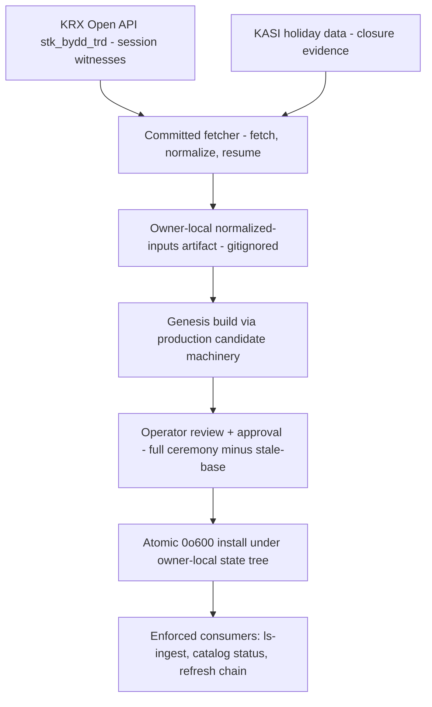
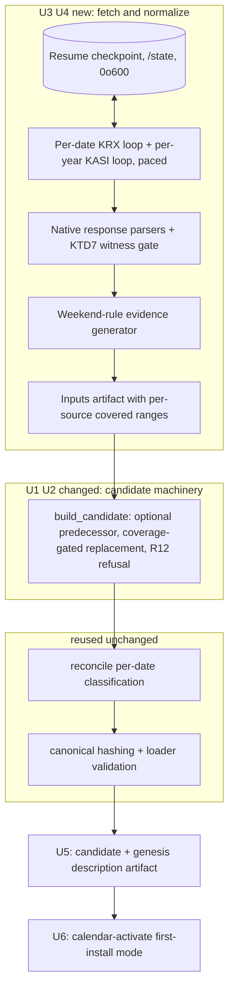
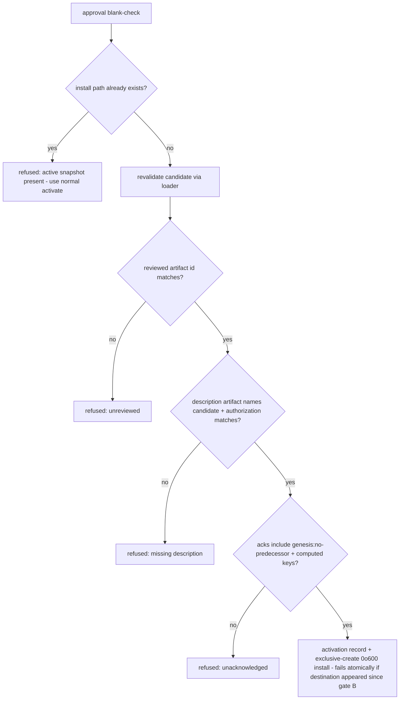

# KRX Calendar Genesis Snapshot Production - Plan

## Goal Capsule

- **Objective:** Produce and activate the first real, owner-local KRX calendar snapshot — the chain root no current tooling can create — and make the evidence path repeatable, so Enforced-only consumers can run and #118 resumes at U4.
- **Product authority:** This plan owns only the snapshot-production capability (genesis + evidence pipeline + first activation). The #118 run itself (U5–U7), forward dispatch-day semantics, and refresh cadence policy are not active scope.
- **Authority hierarchy:** Product Contract requirements > Planning Contract KTDs > per-unit Approach notes. The eight Key Decisions are session-settled; evidence they cannot work is a stop condition, not a license to reinterpret.
- **Execution profile:** U1–U7 are offline, gate-verified code/doc units. U8 is an operator-attended live run (real credentials, real KRX/KASI endpoints) — never executed by an autonomous agent; an executor reaching U8 stops and hands the runbook to the maintainer.
- **Stop conditions:** any settled Key Decision invalidated by implementation evidence; any need to commit fetched data or relax the publication boundary; the KASI-2010 or KRX-floor probes failing (coverage window becomes undeliverable as specified — return to planning).
- **Open blockers:** none for U1–U7. U8 requires `LS_KASI_SERVICE_KEY` provisioning (operator task inside U8).

---

## Product Contract

Product Contract preservation: changed R3, R4, R9, R10, R12 and added AE8/AE9 — structural gaps found by plan-time research (inputs-completeness carrier, first-install guard rails, enforcement locus, archive step), each confirmed in the scoping synthesis. All other text and IDs preserved.

### Summary

Build a two-step genesis pipeline: a committed fetcher pulls KRX session witnesses (2010-01-04 → last closed session) and KASI closure evidence into an owner-local normalized-inputs artifact, a genesis build path runs that artifact through the existing production candidate machinery to produce a predecessor-less real snapshot, and a first-install activation puts it live under the gitignored state tree. The same fetcher serves every future refresh.

### Problem Frame

The #185–#189 arc shipped the shared offline KRX calendar and cut every consumer (ls-ingest, `catalog status`, Production Ladder dispatch gate) over to Enforced-only — no weekday fallback. The production snapshot itself was deferred (U14/U15 in `docs/plans/2026-07-19-001-feat-shared-offline-krx-calendar-plan.md`) and never produced; no snapshot exists anywhere on the machine. Every Enforced consumer therefore fails closed: `catalog status` returns NO-GO ("calendar unavailable"), and #118 — which completed U1–U3 on 2026-07-23 — is hard-stopped at U4.

The tooling cannot self-bootstrap: `calendar-refresh` requires a loadable `--active` predecessor, `build_candidate` always stamps `predecessor_artifact_id` from the prior snapshot, and `calendar-activate` refuses any candidate whose predecessor doesn't match the installed active. The only predecessor-less snapshot constructions in the repo are test helpers and the synthetic 2010–2012 fixture, which is both marked synthetic and out of range at any 2026 as-of. The live evidence transport is deliberately unwired — refresh demands an operator-supplied `--inputs` file.

### Key Decisions

- **Real evidence only — no synthetic or weekday-derived snapshot.** (session-settled: user-directed — chosen over a synthetic unblock: it would fabricate the exact facts the Enforced path exists to prove.)
- **Repeatable capability, not a one-shot artifact.** (session-settled: user-directed — chosen over minimal-unblock: Enforced consumers need a fresh-enough snapshot before every real session, so a one-shot re-blocks within days.) The fetch → normalize → inputs path is built once and reused by every future refresh; #118 U4 is the acceptance demo.
- **Materialize through the operating horizon with honest forward Unknowns.** (session-settled: user-directed — chosen over strict past-only rows and over forward TradingSession classification.) Rows extend from the history floor through the default operating horizon (~today+45d KST): witnessed past dates are TradingSession; KASI-holiday and weekend-rule dates are Closed, past and future; unwitnessed weekdays are Unknown. This keeps per-date queries in range at as-of=today (a snapshot materialized only through the last closed session returns `out_of_range` the moment a consumer queries today, failing preflight even for pure historical ingest) without fabricating a single session.
- **Full history floor: coverage starts 2010-01-04.** (session-settled: user-directed — chosen over a minimal 2026 window: matches the builder's `HISTORY_FLOOR` and KTD7 witness availability; genesis is the one-time bulk fetch, every later refresh stays incremental, and the floor is never revisited.)
- **Rights posture: code in, data out.** (session-settled: user-directed — chosen over everything-owner-local and over pursuing a committed artifact.) Fetcher, genesis tooling, runbook amendments, and tests (hand-crafted synthetic fixtures only) are committed. Every fetched row, inputs artifact, and snapshot stays under the gitignored owner-local tree. Redistribution stays unresolved per `docs/research/krx-calendar-publication-rights.md`; obtaining a written KRX interpretation is out of scope.
- **Two-step pipeline shape: fetcher → inputs artifact → genesis build → first-install activation.** (session-settled: user-directed — chosen over wiring live HTTP into refresh and over a chain-native minimal-root bootstrap.) The inputs artifact is the auditable, replayable intermediate: an interrupted bulk fetch resumes at the fetch step, not inside the build, and the build stays offline-deterministic as the existing design intends.
- **Genesis reuses the production candidate machinery — never a forked builder.** (session-settled: user-approved — the classification, validation, and stamping code that produces the genesis snapshot must be the code already shipped and tested, with predecessor-absence as the only genesis-specific difference. KTD1 records how.)
- **First-install activation keeps the full approval ceremony.** (session-settled: user-approved — chosen over a lighter genesis gate.) Operator identity, reason, review of the exact candidate artifact id, diff/description artifact, risk acknowledgments, and atomic `0o600` install all apply; only the stale-base check — meaningless for a chain root — is waived. KTD5 records the substance-preserving additions.

### Actors

- A1. Maintainer/operator — the approved KRX Open API user; runs the fetch, reviews and approves the candidate, holds the credentials. The only party who ever touches the data.
- A2. Enforced consumers — ls-ingest, `catalog status`, the Production Ladder dispatch gate; consume the installed snapshot read-only via `LS_CALENDAR_SNAPSHOT`.
- A3. External evidence sources — KRX Open API (positive TradingSession witnesses only, per KTD7 of the #185 plan) and KASI holiday data (official closure evidence).

### Requirements

**Evidence acquisition (fetcher)**

- R1. A committed fetch tool acquires KRX `stk_bydd_trd` positive session witnesses for 2010-01-04 → last closed session, applying the KTD7 acceptance rule: only a successful, structurally valid response whose dates match the request counts as evidence; empty, malformed, failed, or mismatched responses are non-evidence and never prove Closed.
- R2. The same tool acquires official KASI closure evidence for the full window, including the forward horizon.
- R3. Fetched evidence is normalized into the existing refresh-inputs shape (sources, evidence records, per-source outcomes) and written as an owner-local inputs artifact under the gitignored state tree. Each source outcome records the date ranges it actually covered, so downstream consumers can distinguish fetched-and-empty from never-fetched.
- R4. The bulk fetch is resumable: an interrupted or quota-bounded run continues from acquired progress instead of restarting, and partial acquisition is never silently presented as complete — the covered-range record is the carrier of that honesty.
- R5. Credentials use the existing maintainer env keys (`LS_KRX_APPKEY`, `LS_KASI_SERVICE_KEY`); provisioning is documented, and no credential or raw fetched row ever reaches logs or the repo.

**Genesis build**

- R6. A genesis path builds a predecessor-less candidate through the production candidate machinery from the inputs artifact, with `synthetic: false`, a real authority label, and authorization validity derived from the actual KRX API agreement terms.
- R7. Per-date classification: a witnessed date is TradingSession; a KASI-holiday, weekend-rule, or KRX fixed exchange-closure rule date (the year-end closing day; Labor Day, May 1, when it falls on a weekday) is Closed; an unwitnessed, non-holiday weekday is Unknown — never collapsed to Closed, past or future.
- R8. Coverage materializes 2010-01-04 through the default operating horizon, with scheduled-closure evaluation recorded through the horizon end.

**Activation and install**

- R9. A first-install activation applies the full approval ceremony (operator, reason, review of the exact candidate artifact id, genesis description artifact, acknowledgments — including a mandatory genesis acknowledgment) with the stale-base and active-load legs replaced by a refusal to proceed when an active snapshot already exists, and installs atomically owner-readable `0o600` under the gitignored state tree at the path consumers resolve via `LS_CALENDAR_SNAPSHOT`.
- R10. Chain continuity: after genesis, an ordinary `calendar-refresh` run accepts the installed snapshot as its `--active` predecessor and an ordinary activation succeeds — proving the repeatable-refresh path end to end. The installed genesis snapshot is archived before that activation — a verified non-destructive copy, with the active file retained at the consumer path until the successor's atomic install completes — so the first rollback target exists.

**Validation and acceptance**

- R11. The installed snapshot passes the runbook checklist: outcome healthy, authorized with matching fingerprint, per-date queries at the consumer horizon endpoints return no `out_of_range`, freshness acceptable.
- R12. The genesis build refuses (in code, not checklist) to emit a candidate with any Unknown weekday inside the consumer window — the span Enforced consumers immediately ingest: from the #118 universe-capture start (2026-05-18) through the last closed session at build as-of. Every weekday there is accounted for by a witness or official closure. A stale inputs artifact fails this naturally and is remedied by a top-up fetch through the resume path.
- R13. With the snapshot installed, `catalog status` returns GO and #118 U4 Enforced ingest proceeds against the captured universe artifact.

**Publication boundary**

- R14. No fetched row, inputs artifact, or snapshot is ever committed; committed tests and fixtures use hand-crafted synthetic data only, consistent with the existing gitignore boundary for the state and calendar-snapshot trees.

### Key Flows

- F1. Genesis end-to-end
  - **Trigger:** Operator has both credentials provisioned and runs the genesis procedure.
  - **Steps:** Fetch KRX witnesses + KASI closures (resumable) → normalized inputs artifact → genesis build produces predecessor-less candidate → operator reviews candidate + genesis description artifact, approves with acknowledgments → atomic first install → runbook validation → `catalog status` GO → #118 U4 runs.
  - **Covers:** R1–R9, R11–R13.
- F2. Subsequent refresh (repeatability proof)
  - **Trigger:** A later session needs fresher coverage.
  - **Steps:** Archive the installed snapshot (verified copy — the active file stays at the consumer path) → re-run fetcher for the incremental window → new inputs artifact → existing `calendar-refresh` against the installed snapshot as predecessor → normal activation (stale-base check active).
  - **Covers:** R10.
- F3. Discrepancy hold
  - **Trigger:** The genesis build finds an unwitnessed, non-holiday weekday inside the consumer window.
  - **Steps:** Build refuses and names the uncovered dates → operator triages using the per-source covered ranges (never-fetched → resume the fetch; fetched-but-empty → investigate as possible genuine closure, adjudicated by recording a FirstPartyNotice or HumanAdjudication evidence record backed by KRX's published closure list) → re-build.
  - **Covers:** R12; the date stays Unknown unless real evidence resolves it.

### Acceptance Examples

- AE1. **Covers R7.** Given a 2026-06 weekday with a valid KRX witness, when the snapshot is queried, then the date is TradingSession with the witness as decisive evidence.
- AE2. **Covers R7.** Given Seollal (a KASI-listed holiday), when queried, then the date is Closed with KASI evidence — even though the KRX API returned an empty (non-evidence) response for it.
- AE3. **Covers R7.** Given any Saturday in the window, when queried, then the date is Closed via the weekend rule's evidence kind.
- AE4. **Covers R12.** Given a weekday in the consumer window with no witness and no KASI holiday, when the genesis build runs, then it refuses with the uncovered date named, and the date remains Unknown until investigated.
- AE5. **Covers R7, and the deferred-dispatch boundary.** Given a non-holiday weekday two weeks in the future, when queried, then the status is Unknown — a dispatch gate consulting it fails closed by design.
- AE6. **Covers R8, R11.** Given as-of = today, when any consumer preflights per-date queries at its horizon endpoints, then no query returns `out_of_range`.
- AE7. **Covers R10.** Given the genesis snapshot is installed, when `calendar-refresh` builds a successor and activation runs, then the stale-base check passes and the successor installs normally.
- AE8. **Covers R9.** Given an active snapshot already exists at the install path, when first-install activation is attempted, then it refuses — superseding a live chain root requires the normal activate path with its stale-base protection.
- AE9. **Covers R3, R4, R12.** Given an inputs artifact whose KRX covered range ends before the genesis-window end (last closed session), when the genesis build runs, then it refuses and names the uncovered range — partial acquisition is never silently built into a snapshot.

### Scope Boundaries

- Forward TradingSession classification (dispatch-day semantics) — deferred to a follow-up unit. Production Ladder live dispatch stays blocked until it exists; only #118 U4–U7 unblocks now.
- #189 weekday-retirement code — closed and correct; not reopened.
- #118 U5–U7 backtest/report logic — ready once the snapshot exists; not part of this plan.
- Synthetic or weekday-derived snapshots — excluded on principle, not just deferred.
- Written KRX interpretation / any committed or shared snapshot artifact — out of scope; posture stays owner-local-only.
- Refresh cadence and staleness policy (when a snapshot is too old to authorize a session) — deferred until a few real runs provide grounding.
- Authorization renewal automation — out of scope; the runbook documents that agreement renewal requires a re-genesis (KTD7).

### Dependencies / Assumptions

- KRX Open API key: approved and active per the maintainer; `LS_KRX_APPKEY` env wiring already defined in `adapters/nautilus/src/calendar_refresh/transport.rs`. Quota: 10,000 calls/day is cited in `docs/research/krx-calendar-publication-rights.md` and corroborated externally — the ~4,100-witness-date bulk fetch fits in one day with margin, but U4's resume design assumes it may not.
- KASI service key: not yet provisioned; provisioning is an in-scope operator task (U8). KASI holiday data is fetched per-year (~17 calls for the whole window) against a 10,000-request dataset quota.
- **Assumption (probe before bulk fetch, U8):** KASI holiday data covers 2010 → the forward horizon. External research found no documented floor; a `solYear=2010` probe settles it. If depth falls short, the pre-KASI span needs an alternative official closure source or stays Unknown outside the consumer window — a stop condition, per the Goal Capsule.
- **Assumption (probe before bulk fetch, U8):** the KRX floor is early-January 2010 ("data from 2010 onward" is the documented wording; the exact 2010-01-04 day is unverified) and the daily quota absorbs the bulk fetch.
- Domain note: Korea's alternate-holiday (대체공휴일) regime took its modern form in 2014; historical KASI entries are finalized actuals, and the witness-primary design makes regime drift benign — KASI only classifies dates no witness covers.
- Snapshot usability is contractually tied to the active KRX API agreement: authorization validity in the snapshot reflects agreement terms, and post-expiry use is prohibited per the rights research.

<!-- ce-section: work-relationships -->
### How This Work Fits Together

This plan owns the snapshot-production capability only. The surrounding breakdown reflects current understanding, not a committed roadmap:

- #118 tier-stratified first real run (`docs/plans/2026-07-23-001-feat-universe-tier-stratified-first-real-run-plan.md`)
  - **Depends on** this plan: U4 Enforced ingest resumes once the snapshot is installed and `catalog status` returns GO.
- Forward dispatch-day semantics (future unit)
  - **Enabled by** this plan's honest-Unknown forward materialization; **still to decide:** how a dispatch gate treats a scheduled-open (non-holiday, unwitnessed) day.
- Refresh cadence / staleness policy (future unit)
  - **Depends on** operational experience from the first real runs; **shares** the fetcher built here.
- Calendar machinery (#185–#189, shipped)
  - This plan **consumes** it unchanged in spirit; the U1/U2 builder changes are additive semantics fixes, and genesis-specific behavior is otherwise new surface (predecessor-less build, first-install activation).

---

## Planning Contract

### Key Technical Decisions

- KTD1. **`build_candidate` accepts an absent predecessor via a typed build-base, not an optional threaded through the core.** The prior is consumed at five distinct sites (evidence retention, sources merge, coverage min/max, freshness aging, scope/authorization/source-availability cloning) — an `Option` checked at each site is the forked builder in disguise. Instead, extract a build-base value with two constructors — from-prior, and genesis (whose seeds are identities for every merge: empty evidence retains nothing, coverage seed = window makes min/max no-ops) — so the core body runs branch-free and byte-identical for the prior case. Genesis parameters explicitly enumerate scope, authorization, window, source-availability, and the freshness seeds. (session-settled: user-approved — chosen over a throwaway seed-prior + clear-and-restamp post-process and over inline `Option` branching; instantiates the "reuse, never fork" Key Decision.) Keep call-site changes additive — `adapters/nautilus/nautilus-ls-calendar/tests/traceability.rs` pins `(file, needle)` anchors, so wrap rather than rename existing functions.
- KTD2. **Per-source covered date-ranges gate evidence replacement.** `SourceOutcome` gains optional covered ranges: absent means legacy scope-wide replacement (today's semantics, preserved for legacy inputs), present-but-empty means fetched-nothing (no replacement), and gating intersects the ranges with the refresh scope. Covered ranges gate replacement on never-fetched dates only: a date whose current response is empty (non-evidence) never retracts a prior positive witness, even inside a covered range — the never-retract-by-absence rule holds at every layer. The genesis path requires ranges present and spanning the full genesis window (KRX: 2010-01-04 → last closed session; KASI and generated rules: through the operating horizon), refusing with the uncovered range named — not just the consumer window, so a mis-windowed fetch cannot build a loader-valid snapshot with an all-Unknown history. (session-settled: user-approved — fixes the latent hazard where a partially-fetched source marked Ok wholesale-drops prior witnesses on uncovered dates in any later refresh, and gives R4/F3 their data carrier.) The absent-vs-empty distinction is load-bearing — a plain serde default (empty vec) would invert legacy semantics into replace-nothing.
- KTD3. **Weekend and fixed exchange closures are generated evidence, not builder logic.** The normalize step emits one `DeterministicRule` evidence record per weekend date (source `krx-rule`, ~1,730 records over the window), matching how `reconcile` already consumes rule evidence; `candidate.rs` learns nothing about weekends. The same generator covers KRX's fixed exchange-only closures — the year-end closing day and Labor Day (May 1) when a weekday — which are neither KASI holidays nor weekends; without them those dates stay Unknown and any window spanning December 31 could never pass the zero-Unknown gate, deadlocking the renewal re-genesis KTD7 mandates (flagged independently by both review models). Any residual exchange-only closure is adjudicated in the discrepancy flow via a FirstPartyNotice/HumanAdjudication record cross-checked against KRX's published closure list. Research confirmed no weekend logic exists anywhere today — without this unit every Saturday since 2010 is Unknown and R12 can never pass.
- KTD4. **Two new maintainer bins plus one new mode.** `calendar-fetch-inputs` (fetch/normalize/resume) and `calendar-genesis` (inputs → candidate + genesis description artifact) are new bins following the existing hand-rolled `Args::parse` + `scrub::install()` + `refused:`/`error:` conventions; first-install lands as a mode on the existing `calendar-activate`. Composition roots follow the emit-before-fallible-parse convention (`docs/solutions/conventions/composition-root-always-emit-before-fallible-parse.md`).
- KTD5. **First-install replaces the active-load leg with a refuse-if-exists guard, adds a mandatory genesis acknowledgment, and commits with an exclusive-create install.** Research showed `activate()` fails on reading the missing active file before ever reaching the stale-base compare, and an all-additive genesis diff yields zero required acknowledgments — so the variant skips the active read, refuses when the install path already exists (AE8), reviews a genesis description artifact (coverage endpoints, per-status/per-source counts, consumer-window Unknown count), and requires a `genesis:no-predecessor` acknowledgment key alongside any computed ones. (session-settled: user-approved.) The install leg is the one leg first-install must NOT share verbatim: the existing installer commits via rename, which silently overwrites — an early exists-check followed by a multi-second ceremony then a rename is a race window in which a concurrent activation's chain root would be destroyed. First-install commits exclusively (0o600 temp then a hard-link-style create that fails atomically if the destination appeared), so emptiness is re-proven at commit time, not just at gate time. Treat the whole branch as newly-live code per `docs/solutions/architecture-patterns/retiring-a-feature-flag-arm-makes-its-behavior-newly-live.md` — exhaustive refusal-matrix tests, not diff-scoped review.
- KTD6. **R12 is code-enforced in the genesis build, window end at build as-of.** (session-settled: user-approved.) The build, not the operator checklist, refuses Unknown weekdays in the consumer window; staleness between fetch and build surfaces as a named refusal remedied by a resume-path top-up.
- KTD7. **Authorization stamps the real agreement term; renewal means re-genesis.** `build_candidate` clones authorization into every successor and the loader rejects an expired snapshot, so the chain has a scheduled end at agreement expiry; the runbook documents the consequence and procedure. (session-settled: user-approved — chosen over an open-ended `expires_at`, which would misstate the contractual position the rights research establishes.)
- KTD8. **Deterministic `recorded_at` for all generated evidence.** Evidence timestamps enter the artifact hash, so the fetcher stamps midnight-UTC-of-the-date (the existing witness-builder precedent), never wall-clock now — otherwise resumed or re-run fetches produce different artifact ids and the repeatability claim breaks.
- KTD9. **Fetch transport: blocking `reqwest` behind the existing injected-closure seam, hardened by construction.** `reqwest 0.13` is already in the adapter lockfile as a transitive dep; the evidence port's `Fn(&str) -> Result<String, String>` contract stays, so every test runs offline through injected closures and `StaticEvidencePort`. Hardening: connect/read/overall timeouts, a fixed response-size ceiling, redirects disabled (both credentials ride as query params and would forward to a redirect target), HTTPS-only against the two known hosts, pagination-progress guards on the KASI loop, and a non-DTD-expanding XML parser. Failure reasons pass through `strip_url_credentials`/credential masking before they are checkpointed or written into a `SourceOutcome` — the no-secret guarantee covers persisted bytes, not just process output. Resume state is a JSON checkpoint under the gitignored state tree (0o600 atomic write), saved after each completed fetch unit, with the liveness invariant from `docs/solutions/logic-errors/budget-planner-defer-larger-than-budget-stalls-forever.md`: no unit is deferred forever.

### High-Level Technical Design

Component/data-flow — what is new, changed, and reused:

First-install gate order (replaces the active-load and stale-base legs; all other legs unchanged):

### Sequencing

U1 → U2 → U5 depend in that order (candidate machinery before the genesis bin). U3 → U4 in that order (parsers before the fetch loop). U6's ceremony legs are independent of U1–U5, but its description-artifact leg consumes the shared description type U5 defines — land that shared item first (it lives in module code, not the bin). U7 needs U4–U6 shapes settled. U8 is last and operator-attended. U1+U3 can start in parallel.

---

## Implementation Units

### U1. Covered-range bookkeeping and replacement gating

- **Goal:** The inputs artifact can say which dates each source actually covered, and the builder stops trusting a bare Ok beyond that coverage.
- **Requirements:** R3, R4; KTD2. Enables AE9.
- **Dependencies:** none.
- **Files:** `adapters/nautilus/src/calendar_refresh/port.rs`, `adapters/nautilus/src/calendar_refresh/candidate.rs`, `adapters/nautilus/tests/calendar_refresh.rs`.
- **Approach:** Add optional covered date-ranges to `SourceOutcome` (KTD2): the field must distinguish absent (legacy → scope-wide replacement, today's semantics) from present-but-empty (fetched nothing → replace nothing) — a plain serde default to an empty vec would invert legacy behavior. Replacement gating intersects covered ranges with the refresh scope. Keep the serde JSON shape additive — the `--inputs` file is deserialized with no extra validation today, and no committed fixtures constrain it.
- **Test scenarios:**
  - Legacy inputs (field absent) round-trip and build exactly as before.
  - Absent-vs-empty disambiguation: field absent → scope-wide replacement; present-but-empty → no prior evidence replaced.
  - A source Ok with ranges covering 2010–2019 does not drop prior witnesses dated 2020+ (the retraction hazard, asserted directly).
  - A prior positive witness inside a covered range survives a current empty (non-evidence) response for that date — absence never retracts, even in-range.
  - Covers AE9 groundwork: covered-range arithmetic (union, containment against a window, intersection with scope) with gap, adjacent, and overlapping ranges.
  - A Failed source with ranges present still takes the no-expansion branch.
- **Verification:** adapter workspace tests green offline; no behavior change for existing refresh tests.

### U2. Genesis support in the candidate machinery

- **Goal:** `build_candidate` can produce a predecessor-less, non-synthetic, loader-valid snapshot, and refuses consumer-window Unknowns.
- **Requirements:** R6, R7, R8, R12; KTD1, KTD6. Covers AE4 at build level.
- **Dependencies:** U1.
- **Files:** `adapters/nautilus/src/calendar_refresh/candidate.rs`, `adapters/nautilus/src/calendar_refresh/mod.rs`, `adapters/nautilus/tests/calendar_refresh.rs`.
- **Approach:** Extract the KTD1 build-base seam: a typed value carrying predecessor id, scope, authorization, coverage seed, freshness seeds, source availability, and prior evidence/sources, with from-prior and genesis constructors whose genesis seeds are identities for every merge — the core body stays branch-free and the prior path byte-identical (the regression guard falls out structurally). Genesis parameters: real scope (`synthetic: false`), real authorization (authority label, granted/expires from operator input), window 2010-01-04 → operating horizon, explicit source-availability and freshness seeds (anchors from build as-of and fetch metadata; `forward_readiness_through` stamped at the horizon end — advancing it on later refreshes is a named deferred-cadence item, and its post-genesis decay to Stale is expected and documented in U7, not a defect: the loader treats stale as usable). R12 refusal enumerates uncovered consumer-window weekdays by date. The loader's full-contiguity rule means every civil date in the window gets a row (~6,050).
- **Test scenarios:**
  - Genesis build from synthetic inputs yields predecessor `None`, `synthetic: false`, and passes `KrxCalendar::from_snapshot` at a 2026 as-of (loader contiguity, hash recompute, authorization current).
  - Covers AE4: unwitnessed non-holiday weekday inside the consumer window → refusal naming the date.
  - Covers AE5: future non-holiday weekday materializes as Unknown row.
  - Covers AE1/AE2/AE3 at reconcile integration level: witness → TradingSession; holiday fact + paired rule → Closed; weekend rule record → Closed.
  - Boundary: window end exactly at last closed session at build as-of; Unknown weekday one day past the consumer window does not refuse.
  - With prior present, behavior is byte-identical to today (regression guard).
- **Verification:** adapter workspace tests green; existing refresh path untouched by diff except the shared core extraction.

### U3. Native-response parsers and evidence normalization

- **Goal:** Real KRX/KASI responses become KTD7-gated witness records, holiday facts with paired rule records, and generated weekend-rule records — all with deterministic timestamps.
- **Requirements:** R1, R2, R7; KTD3, KTD8.
- **Dependencies:** none (parallel with U1).
- **Files:** `adapters/nautilus/src/calendar_refresh/transport.rs` (real KRX endpoint replacing the `data.krx.example` placeholder; native DTOs), possibly a new `adapters/nautilus/src/calendar_refresh/normalize.rs`, `adapters/nautilus/Cargo.toml` (XML-parser dependency — a deliberate choice, not an ad-hoc mid-unit pick), `adapters/nautilus/tests/calendar_refresh.rs` or a new test file.
- **Approach:** Parse KRX's native `stk_bydd_trd` envelope (single `basDd` per call) and KASI's native `getRestDeInfo` XML/JSON (per-year, paginated) into the existing normalized DTO shapes; reuse `witness_from_response` (the KTD7 gate) and the `kasi-{date}`/`rule-{date}` id conventions. KASI XML parsing uses a non-DTD-expanding parser (e.g. `quick-xml` as a new direct dep; the XML path and its edge-case scenarios collapse to JSON equivalents if the U8 probe confirms `_type=json`). Add the rule-evidence generator producing one `DeterministicRule` record per Saturday/Sunday in a window, plus one per KRX fixed exchange closure (year-end closing day; weekday Labor Days) per KTD3. All `recorded_at` values deterministic (midnight-UTC of the evidence date). Exact native envelopes are captured during U8's probes — parsers are written against hand-crafted synthetic fixtures shaped from documentation and reconciled at U8's probe gate (deferred implementation note).
- **Test scenarios:**
  - Valid KRX response with matching date and qualifying row → witness; empty `OutBlock_1`, malformed body, and date-mismatch → non-evidence (KTD7 matrix).
  - KASI year page with multiple holidays and pagination boundary → one fact + one paired rule record per date; XML edge cases (empty year, single item).
  - Weekend generator over a month with a month-boundary weekend → exact date set, deterministic ids and timestamps.
  - Fixed-closure generation: a window containing December 31 and a weekday May 1 yields their rule records; a weekend May 1 yields none beyond the weekend record.
  - Same inputs twice → byte-identical evidence records (KTD8).
- **Test expectation for fixtures:** hand-crafted synthetic only — no captured KRX/KASI rows in the repo (R14).
- **Verification:** adapter workspace tests green offline; grep confirms no real endpoint is hit in tests.

### U4. Fetcher bin with resumable bulk fetch

- **Goal:** `calendar-fetch-inputs` produces the owner-local inputs artifact for an arbitrary window, resumable and quota-honest.
- **Requirements:** R1–R5; KTD4, KTD9. Covers AE9's producer side.
- **Dependencies:** U1, U3.
- **Files:** new `adapters/nautilus/src/bin/calendar-fetch-inputs.rs`, new `adapters/nautilus/src/calendar_refresh/fetch_state.rs`, `adapters/nautilus/Cargo.toml` (`[[bin]]` entry + direct `reqwest 0.13` blocking dep), `adapters/nautilus/.gitignore` (fetch-state/inputs filename patterns if not already covered), new `adapters/nautilus/tests/calendar_fetch.rs`.
- **Approach:** Hand-rolled `Args` (`--window from..through`, `--inputs-out`, `--state`, pacing knob with a safe default), `scrub::install()` first, emit-before-fallible-parse ordering. Per-date KRX loop through last closed session only; per-year KASI loop with pagination. Checkpoint after each completed unit (ingest-checkpoint precedent: sibling-temp + rename, 0o600 via the calendar `atomic_write`), whole-span completeness tracked per source — never endpoint-date proxies (`docs/solutions/logic-errors/per-date-gate-on-a-range-op-silently-advances-over-unchecked-dates.md`). Covered ranges emitted from the checkpoint, not assumed from the request. All artifact paths (`--inputs-out`, `--state`) are canonicalized and validated beneath the owner-local state root, refusing outside paths — the publication boundary is tool-enforced, not discipline-enforced. Failure reasons are credential-stripped before persisting, and the inputs artifact is written via the same 0o600 atomic write as the checkpoint (KTD9). Credentials via `MaintainerCredentials::from_env`; the HTTP closure is injected so the bin is the only place `reqwest` is constructed (timeouts, size ceiling, redirects disabled, HTTPS-only per KTD9). A bounded `--window` run doubles as the live probe (no separate probe tool).
- **Execution note:** the resume/checkpoint logic is the highest-defect-risk surface — build it test-first against injected fetch closures simulating interruption, quota refusal, and partial pages.
- **Test scenarios:**
  - Interrupt after N dates → re-run continues at N+1, artifact identical to an uninterrupted run (KTD8 determinism).
  - Quota-style failure mid-run → checkpoint holds, outcome for that source carries covered ranges ending at the last completed date; artifact honestly partial (AE9 producer side).
  - Liveness: a fetch unit that fails repeatedly surfaces as Failed-with-reason rather than being deferred forever.
  - Args parse matrix (window validation, missing credentials → refusal before any network construction).
  - Path confinement: `--inputs-out`/`--state` outside the state root — including via symlink — refused before any fetch.
  - No secret ever appears in output or persisted bytes: after interruption and quota-failure runs, the checkpoint file and emitted inputs artifact are asserted free of credential material (scrub + redacted Debug + `strip_url_credentials` on persisted reasons).
- **Verification:** adapter workspace tests green offline; manual `--help`-level smoke of the bin compiles and refuses cleanly without credentials.

### U5. Genesis bin

- **Goal:** `calendar-genesis` turns an inputs artifact into a reviewable genesis candidate plus its description artifact.
- **Requirements:** R6, R8, R12; KTD4. Covers AE4/AE9 at the bin level.
- **Dependencies:** U2 (and U1 shapes).
- **Files:** new `adapters/nautilus/src/bin/calendar-genesis.rs`, `adapters/nautilus/src/calendar_refresh/mod.rs` (candidate/description write helpers), `adapters/nautilus/tests/calendar_genesis.rs` (new).
- **Approach:** Args: `--inputs`, `--out` (candidate path), `--as-of`, authority/expiry parameters for the real authorization block. Writes the candidate and the genesis description artifact via the 0o600 atomic write. The description artifact's type and path helper are shared `calendar_refresh` module items defined here (mirroring how the diff artifact's type and `diff_path_for` live in module code) — U6's activation leg consumes the same type, never a re-declared shape. Content: coverage endpoints, per-status and per-source counts, consumer-window Unknown count, the exact candidate artifact id, and the candidate's authorization block (authority label, granted/expires) so the ceremony reviews the stamped agreement terms. `--out` is validated beneath the owner-local state root like U4's paths. Refusals (R12, incomplete coverage) print `refused:` with the offending dates/ranges, matching bin conventions.
- **Test scenarios:**
  - Happy path: synthetic inputs → candidate deserializes, loader-valid, description artifact counts match the candidate's rows.
  - Covers AE4/AE9: refusal paths name dates/ranges and exit non-zero without writing a candidate.
  - Description artifact names the exact candidate artifact id (the reviewed-artifact linkage U6 checks).
- **Verification:** adapter workspace tests green offline.

### U6. First-install activation mode

- **Goal:** `calendar-activate --first-install` installs a chain root with the full ceremony, guarded against overwriting a live chain.
- **Requirements:** R9; KTD5. Covers AE8.
- **Dependencies:** U5's shared description-artifact type (module item) for the description leg; ceremony legs otherwise independent of U1–U5.
- **Files:** `adapters/nautilus/src/calendar_refresh/activate.rs` (first-install entry point; new exclusive-create installer beside `atomic_install_owner_only`), `adapters/nautilus/src/bin/calendar-activate.rs` (mode flag), `adapters/nautilus/tests/calendar_activate.rs`.
- **Approach:** New activation entry point sharing the approval/ack legs: blank-check → refuse if install path exists → loader revalidation → reviewed-artifact-id match → genesis description artifact present, naming the candidate, and whose surfaced authorization (authority/expires) matches the candidate's stamped values — a mismatch refuses, making the ceremony's human check of the agreement terms mechanical (U5's shared type) → acknowledgments must include `genesis:no-predecessor` (new constant beside `PARTIAL_ACK_KEY`) plus computed keys → genesis activation record + **exclusive-create** 0o600 install (KTD5): the commit fails atomically if the destination appeared after the gate check — the rename-based installer clobbers and is not reused here. The record is a genesis-specific type beside `ActivationRecord` (whose required predecessor id a chain root cannot honestly fill; the existing serde shape stays untouched). Also refuse a candidate whose `predecessor_artifact_id` is non-None (that candidate belongs to the normal path).
- **Execution note:** newly-live branch — write the full refusal matrix first (one test per gate in the diagram), then the success path.
- **Test scenarios:**
  - Covers AE8: install path exists at gate time → refused, file untouched.
  - Race guard: destination created between gate check and commit → install fails, existing file byte-identical afterward, no partial/temp residue at the destination.
  - Each ceremony leg refusal: blank operator/reason, wrong reviewed id, missing/mismatched description artifact, authorization mismatch between description artifact and candidate, missing genesis ack, candidate with a predecessor.
  - Success: file created 0o600, content byte-equal to candidate, activation record emitted.
  - Idempotence guard: immediate second run refuses (now the active exists).
- **Verification:** adapter workspace tests green offline; `tests/calendar_activate.rs` refusal matrix complete against the gate diagram.

### U7. Runbook and docs amendment

- **Goal:** The genesis procedure, its back-out story, and the archive discipline are operator-executable from the runbook alone.
- **Requirements:** R5 (provisioning docs), R10 (archive step), R11 (checklist), KTD7 (renewal consequence).
- **Dependencies:** U4, U5, U6 (command shapes settled).
- **Files:** `adapters/nautilus/RUNBOOK-calendar-snapshot.md`, `adapters/nautilus/RUNBOOK-calendar-rollback.md` (archive/back-out cross-reference), `adapters/nautilus/.gitignore` (verify fetch-state/inputs patterns), `AGENTS.md` only if a new gate command is added (none expected).
- **Approach:** Add: credential provisioning (both env keys, where they come from); probe-first sequence (bounded `--window` runs for KASI 2010 and KRX floor); bulk fetch with resume; genesis build + review of the description artifact; first-install; validation checklist additions (R12 is code-enforced — checklist confirms the refusal was not overridden); back-out = delete the active file, consumers return to fail-closed NO-GO by design; mandatory pre-activation archive of the installed snapshot — a verified copy, never a move, with the active file remaining at the consumer path until the successor's atomic install completes (first exercised in the R10 proof); authorization-expiry consequence and the re-genesis renewal procedure; the expected post-genesis decay of the forward-readiness freshness dimension to Stale (usable by design — the loader treats stale as usable; advancing it is the deferred cadence item). Fix the existing drift where the runbook shows `calendar-status` reading `LS_CALENDAR_SNAPSHOT` but the bin requires `--snapshot`. Keep wording verdict-only where `closeout_scan` applies (no snapshot ids or ISO dates in CLOSEOUT-scanned files).
- **Test expectation:** none — documentation; correctness is proven by U8 executing it verbatim.
- **Verification:** `make adapter-check` still green (no code); a dry read-through by the implementer against the U4–U6 CLIs finds no drift.

### U8. Operator live execution and acceptance

- **Goal:** The real snapshot exists, is installed and validated, chain continuity is proven, and #118 U4 is unblocked.
- **Requirements:** R1–R14 end-to-end; covers AE6, AE7, and the live sides of AE1–AE3.
- **Dependencies:** U1–U7. **Operator-attended — an autonomous executor stops before this unit and hands over the runbook.**
- **Files:** none committed beyond `gate-verdicts/` PASS records per the existing runbook convention; all artifacts land under the gitignored state tree.
- **Approach (runbook order):** provision `LS_KASI_SERVICE_KEY`; bounded probes (KASI `solYear=2010`; KRX earliest-January-2010 dates), capturing native envelopes; **probe gate:** reconcile U3's parsers against the captured envelopes — a shape mismatch routes back through U3 and the offline gate before the live run resumes; only then bulk fetch with resume through last closed session; genesis build; operator review + first-install with acknowledgments; runbook validation (R11) — enumerating each Enforced consumer (ls-ingest, `catalog status`) and verifying its maximum query horizon is in-range per consumer, not just the nominal +45d endpoints; archive the installed snapshot (verified copy); R10 continuity proof — incremental fetch, `calendar-refresh`, normal activation; `catalog status` → GO; hand back to #118 U4.
- **Test scenarios:** none automated (live); acceptance is the runbook checklist plus:
  - Covers AE6: `calendar-status` healthy at as-of=today, no `out_of_range` at horizon endpoints.
  - Covers AE7: successor activation passes stale-base against the genesis snapshot.
  - Spot-check known holidays (Seollal, Chuseok) and a known trading day against the installed snapshot.
- **Verification:** runbook PASS verdicts recorded; `git status` shows no fetched data staged anywhere; #118 U4 ingest starts.

---

## Verification Contract

| Gate | Command | Applies to | Done signal |
|---|---|---|---|
| Adapter workspace (offline foundation gate) | `cd adapters/nautilus && cargo test --workspace` (equivalently `make adapter-check` / `make foundation-gate` from repo root) | U1–U6 | all suites green, zero network, fixed clocks |
| Traceability + closeout scans | included in the workspace run (`nautilus-ls-calendar/tests/traceability.rs`, `closeout_scan.rs`) | U1–U7 | no anchor breaks (additive-only file changes), no scanned-file leaks |
| Root workspace | `cargo test` at repo root | only if any root-crate file is touched (none expected) | unchanged |
| Publication boundary | `git status` / review | every unit | no `/state`, `*.calendar.json*`, inputs, or fetch-state files staged; fixtures synthetic |
| Live acceptance | runbook checklist (U8) | U8 | R11 PASS, AE6/AE7 confirmed, `catalog status` GO |

Test-scenario coverage per unit is enumerated in the unit bodies; AE links are marked `Covers AE<N>` where a scenario enforces an acceptance example directly.

## Definition of Done

- U1–U7 landed with their test scenarios implemented; adapter workspace gate green offline; no root-gate impact.
- The refusal matrices for the genesis build (R12, coverage) and first-install (AE8 + ceremony legs) are complete against the gate diagram — not sampled.
- U8 executed by the maintainer from the runbook, with the probe gate passed before the bulk fetch (a parser mismatch routes back through U3 and the offline gate rather than being patched live): snapshot installed 0o600 under the state tree, R11 PASS recorded, R10 continuity proven with the pre-activation archive taken, `catalog status` GO, #118 U4 running.
- No fetched row, inputs artifact, snapshot, or credential committed at any point (R14) — verified on every commit, not once at the end.
- No abandoned experimental code in the diff; superseded approaches removed, not commented out.
- Deferred items remain deferred and documented: forward dispatch-day semantics, cadence policy, authorization-renewal automation.

---

## Open Questions

**Resolve before planning:** none.

**Deferred to implementation**

- Exact native KRX response envelope and KASI JSON availability (`_type=json` vs XML-only) — captured by U8's probes; U3 parsers adjust if fixtures disagree.
- Pacing interval defaults for the bulk fetch — tuned during U8's bounded probes against observed quota behavior.
- Inputs-artifact segmentation — a single JSON file (~7,000 evidence records) is the default; split only if size or review ergonomics demand it during U4.
- Whether `refresh_full_history`'s existing scope defaults serve the genesis window directly or U2's entry point computes its own — settled when the shared-core extraction lands.
- Consumer-window start in code: a named constant in the genesis build vs a `calendar-genesis` CLI parameter — affects whether a renewal re-genesis can move the window without a code change.

---

## Sources / Research

- Verified grounding dossier (brainstorm scout, file:line quotes): `adapters/nautilus/src/bin/calendar-refresh.rs` predecessor requirement and `--inputs` boundary; `activate.rs` ceremony legs and `atomic_install_owner_only`; `schema.rs` tri-state and source kinds; `query.rs` out-of-range rule; RUNBOOK PASS/HOLD; `docs/research/krx-calendar-publication-rights.md` conclusions.
- Plan-time repo research: `candidate.rs` prior-inheritance and per-date `reconcile` classification; no weekend logic anywhere; `transport.rs` KRX placeholder URL and one-date/one-year gather; loader full-contiguity (`load.rs`); `recorded_at` in canonical hashing; hand-rolled bin `Args` conventions; `ingest/checkpoint.rs` resume precedent; `reqwest 0.13` in the adapter lockfile; `reconcile.rs` witness-vs-holiday precedence (witness wins, holiday retained as conflicting).
- Institutional learnings applied: `docs/solutions/logic-errors/per-date-gate-on-a-range-op-silently-advances-over-unchecked-dates.md` (U4), `docs/solutions/conventions/composition-root-always-emit-before-fallible-parse.md` (U4/U5), `docs/solutions/architecture-patterns/retiring-a-feature-flag-arm-makes-its-behavior-newly-live.md` (U6), `docs/solutions/logic-errors/budget-planner-defer-larger-than-budget-stalls-forever.md` (U4), `docs/solutions/architecture-patterns/legacy-shadow-enforced-adoption-gate-playbook.md` (pattern only — the Legacy/Shadow/Enforced enum itself is retired).
- External research (implementation-guidance): KRX Open API `basDd` one-date-per-call, ~10,000/day quota (corroborated; also cited at `docs/research/krx-calendar-publication-rights.md`), documented "data from 2010 onward"; KASI `getRestDeInfo` per-year requests with pagination, dataset traffic 10,000, XML default, historical depth unverified → probes in U8; alternate-holiday regime modern since 2014; prior-art community pattern matches this design (holiday feed + positive-witness cross-check); KRX closure-list Excel exists as a manual third cross-check if discrepancies appear.
- Origin: this artifact's own Product Contract (`product_contract_source: ce-brainstorm`, enriched in place).
