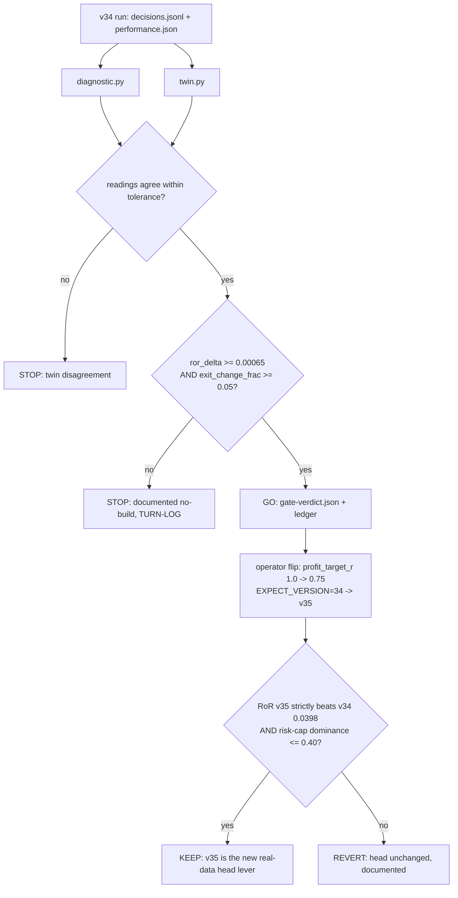

# feat: profit_target_r 1.00 -> 0.75 governed Phase-A candidate (exit-geometry gate)

## Summary

Author a governed Phase-A **candidate** so the ORB exit-geometry param `profit_target_r`
can be flipped `1.00 -> 0.75` through the `turn` command. The command's `flip_guard`
refuses *any* param flip without a frozen candidate carrying a committed **GO** verdict
against the anchor run's catalog fingerprint (research.rs:507, `GateExit::UngovernedFlip`) —
so a plain param turn is structurally impossible. This plan builds the missing candidate
(`candidate.json` + `diagnostic.py` + `twin.py`), runs `turn diagnose` to produce an honest
GO/STOP, and — only on GO — the operator flips to v35 and reads KEEP/REVERT.

The lever is grounded in the real-data diagnosis: `report mfe` on the real-data head run
**v34** (`20260724T014752Z-backtest-orb-v34`, catalog fingerprint `363f199d`, 119 closed
trades) shows the give-back cohort dominates — `stop_hit` 48% of exits peaking a median
0.46R before reversing, target-exits only 23%, and only ~10% of trades ever exceed 1.0R.
The report's own leg-2 candidate reading is `p70(mfe_r>0)=0.7273 -> 0.75`.

The Phase-A gate is **exit-geometry-specific**: the existing sizing dual-gate (collinearity
vs `risk_per_share` + magnitude materiality) does not apply. Instead the gate is a
**direction + materiality** pair on an MFE counterfactual — the honest lever that admits a
STOP, which matters because the turn-9 profit-target sweep was **falsified** on old data.

**Product Contract preservation:** N/A — solo plan, no upstream requirements doc. Frozen
gate thresholds were user-approved before this write (direction + materiality variant).

---

## Problem Frame

- **The flip is blocked without a candidate.** `turn()`'s param path calls `flip_guard`
  first; with no `LS_TURN_CANDIDATE` it returns `UngovernedFlip`. There is also no path to a
  cheap KEEP/REVERT preview — the backtest CLI only adopts a run's *full* param set
  (`LS_BT_PARAMS_FROM_RUN`), never a single-param override. The governed candidate is the
  only route.
- **No exit-geometry Phase-A gate exists.** Every prior candidate
  (`amihud-liquidity-tilt`, `opening-range-gap-retention`, `stop-width-geometry`) gates a
  *sizing* axis on collinearity-vs-`risk_per_share`. `profit_target_r` reallocates *exit
  timing*, not risk budget, so collinearity is meaningless here. The gate must instead read
  whether lowering the target **improves** the size-invariant RoR (direction) by a material
  margin, and whether it changes **enough trades** to matter (materiality).
- **The lever has a real failure precedent.** Turn 9's profit-target sweep was falsified on
  old data. The gate must be able to STOP honestly on the real cohort, not rubber-stamp a
  RUNNABLE band membership.

---

## Requirements

- **R1.** A frozen `candidate.json` at `adapters/nautilus/lab/candidates/profit-target-075/`
  declaring: `flip_param: profit_target_r`, `flip_value: 0.75`; `phase_a: bespoke`; the
  diagnostic + twin argv/file/content-hash; the reading tolerances/precision; and the two
  frozen thresholds (R4).
- **R2.** `diagnostic.py` computes, over the **v34** cohort, the size-invariant RoR at the
  head target (`RoR_base`) and the MFE counterfactual RoR at 0.75 (`RoR_prime`), their signed
  delta, and the exit-change fraction — reading `mfe_r` from `decisions.jsonl` and
  `realized_r`/`risk_capital` from `performance.json`, joined on `(symbol, KST session date)`
  exactly as `report_mfe` joins (report.rs:559).
- **R3.** `twin.py` recomputes every gated reading by an independent code path; diagnose
  STOPs on any disagreement beyond the frozen per-reading tolerance.
- **R4.** The frozen dual gate is **direction + materiality**:
  `ror_delta >= 0.00065` (RoR must improve by at least the materiality floor — the honest STOP
  gate, combining direction and magnitude) **and** `exit_change_frac >= 0.05` (at least 5% of
  trades change outcome). No collinearity gate.
- **R5.** The turn runs through `turn diagnose` (Phase-A) against the v34 anchor (fingerprint
  `363f199d`); the verdict is recorded verbatim to `gate-verdict.json`, the gate reading lands
  in `ledger/trials.jsonl`, and a `TURN-LOG.md` entry captures the outcome. On GO the operator
  flips (`LS_TURN_PARAM=profit_target_r LS_TURN_VALUE=0.75 LS_TURN_EXPECT_VERSION=34
  LS_TURN_CANDIDATE=...`) to v35 and reads KEEP/REVERT; on STOP the turn completes at diagnose
  (the ATR-vol-target / amihud precedent).

### Success Criteria

- `turn diagnose` runs the candidate end-to-end, diagnostic and twin agree bit-for-bit within
  tolerance, and emits a machine GO/STOP that is echoed, never re-derived.
- The two frozen thresholds are twin-verified before the reading; no threshold moves after it.
- The gate reading appends to the TRIALS ledger; a TURN-LOG entry is written; `make
  adapter-check` is green; the candidate is committed **before** the reading (freeze discipline).

---

## Key Technical Decisions

- **KTD1 — Read `mfe_r` from telemetry, never replay bars.** Each run's `decisions.jsonl`
  carries per-exit `mfe_r` (turn-8 telemetry; report.rs:535). The diagnostic joins those exit
  envelopes to `performance.json` trades on `(symbol, KST session date)`. No minute-bar replay,
  so the diagnostic is a plain-JSON Python script (no pyarrow needed, unlike the sizing
  candidates that read catalog OHLCV).
- **KTD2 — MFE counterfactual, conservative by construction.** For each closed trade,
  `r_new = 0.75 if mfe_r >= 0.75 else realized_r`. A trade that reached 0.75R at any point
  (`mfe_r >= 0.75`) would fill the lower target at its first touch — earlier than or at its
  actual exit — booking ~+0.75R; a trade that never reached 0.75R is untouched (breakeven arms
  at 0.41R independent of the target, and the range-low stop is unchanged). The engine's
  marketable-limit fill books **at or above** 0.75R on a gap-through, so the actual flip RoR is
  **>= the counterfactual** — this gate can only under-state the flip's edge, never over-state
  it. (Contrast amihud, whose first-order *over*-predicted because the notional ceiling clipped
  the upside — exit geometry has no such reversing term.)
- **KTD3 — Direction gate replaces collinearity.** `ror_delta >= 0.00065` is the load-bearing
  honest gate: it STOPs unless the counterfactual RoR strictly improves by at least the
  materiality floor. This is the exit-geometry analog of the sizing gate's "genuinely new axis"
  guard — here the axis novelty is a given (exit timing is orthogonal to sizing), so the gate
  instead spends its power on *direction*, which the sizing gate deliberately ignored.
- **KTD4 — R-denominator consistency holds only at the head's stop mode.** `mfe_r` and
  `profit_target_r` are both denominated in `R = range_high - range_low`, and the head runs the
  range-low stop (`stop_mode = 0.0`), so the 0.75R target compares directly to `mfe_r`. A
  future head that changed stop mode would shift the MFE denominator and invalidate this
  candidate's cohort — the candidate is a v34/range-low-era snapshot (staleness contract,
  mirroring amihud's frozen-band note).
- **KTD5 — Anchor and KEEP baseline are the real-data v34, not old-data v32.**
  *(session-settled: user-directed — chosen over re-baselining a clean head first: the flip
  changes only `profit_target_r` vs v34, so the KEEP is a relative comparison and v34's #118
  "RED" power-label is irrelevant to it.)* Diagnose and the flip both anchor on v34 (fingerprint
  `363f199d`) so `flip_guard`'s fingerprint check passes (research.rs:691). KEEP is measured
  against v34's real-data RoR (`0.0398`), **not** the old-data head-identity v32 (`0.1876`).
  `LS_TURN_EXPECT_VERSION=34` (v34 is latest-finalized); the flip produces v35. GO does **not**
  guarantee KEEP — the actual backtest at flip decides.

---

## High-Level Technical Design



The gate reads readings by name generically (`candidates.rs` `Threshold { reading, comparator,
value }`, `Comparator::passes`), so the new reading keys need no Rust change — only the
`candidate.json` declaration.

---

## Output Structure

```
adapters/nautilus/lab/candidates/profit-target-075/
  candidate.json      # frozen: flip binding, readings, thresholds, script hashes
  diagnostic.py       # MFE counterfactual RoR + exit_change_frac over v34
  twin.py             # independent recompute of the same readings
  gate-verdict.json   # WRITTEN BY `turn diagnose` (not authored) — GO/STOP + fingerprint
```

---

## Implementation Units

### U1. Freeze `candidate.json`

- **Goal:** Declare the frozen candidate so `flip_guard` and `turn diagnose` can load it.
- **Requirements:** R1, R4.
- **Dependencies:** none.
- **Files:** `adapters/nautilus/lab/candidates/profit-target-075/candidate.json` (create).
- **Approach:** Mirror `candidates/amihud-liquidity-tilt/candidate.json` shape. Set
  `slug: profit-target-075`, `family: exit-geometry`, `phase_a: bespoke`,
  `flip_param: profit_target_r`, `flip_value: 0.75`. `diagnostic`/`twin` blocks carry
  `argv: ["uv","run","--with","pyarrow","python3","<file>"]` (uv wrapper for parity with the
  other candidates even though pyarrow is unused — keeps the runner argv uniform) and the
  SHA-256 `content_hash` of each script (fill after U2/U3 are final). `readings` declares
  `ror_delta` and `exit_change_frac` (plus `ror_base`, `ror_prime` for transparency) each with
  `tolerance` and `precision`; `ror_delta`/`ror_base`/`ror_prime` at `precision: 6`,
  `exit_change_frac` at `precision: 4`, tolerances matching amihud (`0.0005` for RoR-scale,
  `0.02` for fractions). `thresholds`: `{reading: ror_delta, comparator: ge, value: 0.00065}`
  and `{reading: exit_change_frac, comparator: ge, value: 0.05}`. `keep_anchor`: "size-invariant
  RoR strictly beats real-data v34 (0.0398) with risk-cap dominance <= 0.40".
- **Patterns to follow:** `candidates/amihud-liquidity-tilt/candidate.json`; the `Comparator`
  enum in `lab/src/candidates.rs` for valid comparator strings (`ge`/`le`/`gt`/`lt`).
- **Test scenarios:** `Covers R1.` The candidate loader (`crate::candidates::load`) parses the
  file without error and exposes `flip_matches("profit_target_r", 0.75) == true` — add/extend a
  case in `lab/tests/candidates.rs` asserting parse + flip-match + that both thresholds are
  present with the expected comparators/values.
- **Verification:** `crate::candidates::load` succeeds; the candidates test passes.

### U2. Author `diagnostic.py` (MFE counterfactual)

- **Goal:** Emit the four readings over the v34 cohort to the readings JSON path.
- **Requirements:** R2, R4.
- **Dependencies:** U1 (reading key names must match).
- **Files:** `adapters/nautilus/lab/candidates/profit-target-075/diagnostic.py` (create).
- **Approach:** Port the join discipline from `report_mfe` (report.rs:498-584) and the RoR
  formula from `candidates/amihud-liquidity-tilt/diagnostic.py`. Steps: (1) load
  `performance.json` closed trades -> per-trade `(symbol, kst_date(ts_opened), risk_capital,
  realized_r)` with `risk_capital` present and `quantity > 0`; (2) stream `decisions.jsonl`,
  collecting exit envelopes' `mfe_r` keyed on `(symbol, kst_date(ts_event))`; (3) inner-join on
  the key (drop trades with no `mfe_r` record — count them, w-skip like report_mfe's
  `exits_without_mfe`); (4) `RoR_base = sum(rc*r)/sum(rc)`; (5) `r_new = 0.75 if mfe_r >= 0.75
  else realized_r`, `RoR_prime = sum(rc*r_new)/sum(rc)`; (6) `ror_delta = RoR_prime - RoR_base`;
  (7) `exit_change_frac = count(mfe_r >= 0.75 and abs(r_new - realized_r) > 1e-9) / n`. Anchor
  the run path to `20260724T014752Z-backtest-orb-v34` (module constant, like amihud's `V30`).
  Emit a human-readable stdout report (cohort counts, RoR_base/RoR_prime/delta, exit_change_frac,
  per-threshold PASS/STOP, final DUAL GO/STOP line) and write the canonical rounded readings
  JSON to `sys.argv[-1]`.
- **Execution note:** Verify the join key semantics against `report_mfe` first — one entry per
  `(symbol, KST date)`; if a symbol legitimately has two sessions in-window they are distinct
  dates, so the key stays unique. Fail loud (nonzero exit, clear message) if the join yields
  zero rows rather than emitting a silent zero-RoR reading.
- **Patterns to follow:** `candidates/amihud-liquidity-tilt/diagnostic.py` (KST date helper,
  `percentile`-free RoR fold, readings-artifact write); `report.rs` `kst_date_of` +
  breakout/exit partition for the exact join.
- **Test scenarios:** `Covers R2.` (a) A hand-built 3-trade fixture where one trade has
  `mfe_r=0.9, realized_r=-0.5` (give-back -> booked +0.75, RoR rises), one has `mfe_r=1.2,
  realized_r=1.0` (former target -> booked 0.75, RoR falls), one has `mfe_r=0.3` (untouched):
  assert `RoR_prime`, `ror_delta`, and `exit_change_frac == 2/3` match hand computation. (b)
  Zero-join fixture -> nonzero exit with a clear message. (c) A trade missing `mfe_r` is
  excluded and counted, never read as 0. Place the fixture + a thin Python assertion harness
  under the candidate dir or a `tests/` sibling invoked by U4's diagnose run; if a
  Rust-side test is cheaper, assert the emitted readings JSON for a checked-in mini-run.
- **Verification:** Running the script against v34 writes a readings JSON with all four keys;
  the fixture assertions match hand computation.

### U3. Author `twin.py` (independent recompute)

- **Goal:** Recompute the same four readings by an independent path for the bit-compare gate.
- **Requirements:** R3.
- **Dependencies:** U2 (same readings, different implementation).
- **Files:** `adapters/nautilus/lab/candidates/profit-target-075/twin.py` (create).
- **Approach:** Independent structure from `diagnostic.py` — e.g. accumulate `sum_pnl` and
  `sum_pnl_prime` as `rc*r` products in a single pass with a different join representation
  (dict-of-lists vs the diagnostic's row list), and derive `exit_change_frac` from a separate
  boolean tally. Same anchor run, same frozen 0.75 threshold and reading rounding. The point is
  to catch a coding slip in either script, not to re-derive by copy.
- **Patterns to follow:** `candidates/amihud-liquidity-tilt/twin.py`.
- **Test scenarios:** `Covers R3.` On the U2 fixture, `twin.py` emits readings identical to
  `diagnostic.py` within the declared tolerance; a deliberately perturbed fixture (one trade's
  `mfe_r` nudged across 0.75) moves both scripts identically.
- **Verification:** `diagnostic.py` and `twin.py` readings agree within tolerance on v34.

### U4. Freeze, diagnose, and (on GO) flip

- **Goal:** Commit the frozen candidate, run `turn diagnose` for the machine verdict, and — only
  on GO — flip to v35 and read KEEP/REVERT.
- **Requirements:** R5.
- **Dependencies:** U1, U2, U3.
- **Files:** `adapters/nautilus/lab/candidates/profit-target-075/gate-verdict.json` (written by
  the tool, not hand-authored); `adapters/nautilus/lab/TURN-LOG.md` (append); a `ledger`
  trials append (tool-written).
- **Approach:** (1) Backfill the final `content_hash` values into `candidate.json` and commit
  the candidate **before** any reading (freeze discipline — `gate-verdict.json` records the
  freeze commit predating the reading). (2) Ensure v34 is the diagnose anchor so
  `verdict.catalog_fingerprint == 363f199d`; pin `LS_REPORT_RUN`/parent-fingerprint if the
  latest-finalized run is not v34. (3) Run `turn diagnose` from `adapters/nautilus` with
  `LS_DATA_HOME=<repo-root>/data/turn4-fresh` (absolute),
  `LS_CALENDAR_SNAPSHOT=$PWD/state/krx.calendar.json`, and the candidate pinned — capture the
  GO/STOP verbatim. (4) On **STOP**: write the TURN-LOG no-build entry and complete the turn. (5)
  On **GO**: run the flip with `LS_TURN_PARAM=profit_target_r LS_TURN_VALUE=0.75
  LS_TURN_EXPECT_VERSION=34 LS_TURN_CANDIDATE=<dir>` -> v35; read size-invariant RoR and risk-cap
  dominance; KEEP iff RoR strictly beats v34's 0.0398 and dominance <= 0.40, else REVERT. Record
  the verdict + numbers in TURN-LOG either way.
- **Execution note:** This unit is mostly *execution*, not code. Do not soften either threshold
  after seeing the reading — a post-hoc threshold move is the forbidden overfit. The flip is
  operator-run; `make adapter-check` must be green before commit.
- **Test scenarios:** `Test expectation: none -- execution/verification unit (the diagnose CLI
  and its bit-compare are the test; correctness of the readings is covered by U2/U3).`
- **Verification:** `gate-verdict.json` exists with a GO or STOP and fingerprint `363f199d`;
  the ledger has the gate-reading trial; TURN-LOG captures the outcome; `make adapter-check`
  green.

---

## Scope Boundaries

- **In scope:** the single value `profit_target_r = 0.75` (from the report's `p70=0.73 -> 0.75`
  rounding), its bespoke exit-geometry Phase-A gate, and the governed diagnose+flip.
- **Not here:** a `profit_target_r` exponent/value **sweep** (0.5..1.5 grid) — a sweep is a fit,
  not a governed single-flip; the 0.75 value is derived, not searched.
- **Not here:** generalizing the exit-geometry gate into a reusable Rust reading family — the
  candidate framework is already generic over reading names, so no engine change is warranted for
  one candidate.

### Deferred to Follow-Up Work

- If GO->KEEP lands, a `report mfe` re-read on v35 may surface a *second* leg-2 target (the
  distribution shifts once the target moves) — a future turn, not this one.
- Reconciling the post-#118 version lineage (v33 bare-params count run vs v34 head-params twin)
  into a single documented real-data head — surfaced by this turn, resolved separately.

---

## Open Questions

- **Head-lineage / anchor confirmation — RESOLVED (2026-07-24).** Confirmed: anchor on v34 as-is,
  KEEP against v34's `0.0398`, `LS_TURN_EXPECT_VERSION=34`. The KEEP is a relative comparison
  (v35 differs from v34 by only `profit_target_r`), so v34's #118 "RED" power-label does not
  affect it. No clean-head re-baseline precedes the flip. See KTD5.
- **Diagnose anchor resolution.** Verify `turn diagnose` derives its parent fingerprint from v34
  (`363f199d`) and not some other latest-finalized run; if it resolves elsewhere, pin the parent
  run explicitly so the flip-guard fingerprint check passes.

---

## Risks & Dependencies

- **Counterfactual under-states, so a STOP is trustworthy but a GO is only necessary, not
  sufficient (KTD2).** The gate's own contract already says GO does not guarantee KEEP; the
  actual v35 backtest is the decider. Because the counterfactual under-states the flip RoR, a
  STOP (counterfactual fails to improve) is a strong signal the real flip also fails — cheap and
  honest.
- **Turn-9 falsification precedent.** Profit-target was falsified on old data. The direction gate
  exists precisely to STOP if the real cohort repeats that; do not treat "RUNNABLE" (band
  membership, emitted by `report mfe`) as evidence of improvement — it is not.
- **Staleness (KTD4).** The candidate is a v34/range-low-era snapshot. If the head's stop mode or
  catalog moves before this flips, the cohort and R-denominator must be re-derived; a stale anchor
  will not compile-error.
- **Dependency:** the machine-local calendar snapshot at
  `adapters/nautilus/state/krx.calendar.json` must be present for U4's diagnose/flip (dispatch-
  gated consumers fail closed without it).

---

## Definition of Done

- `candidate.json`, `diagnostic.py`, `twin.py` authored and committed **before** the reading;
  `crate::candidates::load` parses the candidate; the candidates test passes.
- `diagnostic.py` and `twin.py` agree within tolerance on v34; U2/U3 fixture assertions pass.
- `turn diagnose` produces a GO or STOP recorded verbatim in `gate-verdict.json` (fingerprint
  `363f199d`), the gate reading is in `ledger/trials.jsonl`, and a `TURN-LOG.md` entry captures
  the outcome.
- On GO: v35 flip run finalized; KEEP/REVERT read against v34's 0.0398 (dominance <= 0.40) and
  logged. On STOP: no-build documented; head unchanged.
- `make adapter-check` green; no threshold softened after the reading.
