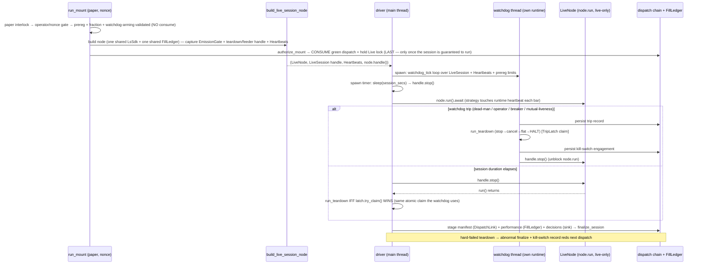

# Live-Session Driver — the attended rung-1 run path — Plan

## Goal Capsule

- **Objective:** Author the first production `LiveSession` adapter (backed by the real exec client + SDK) and flip `lab-live --mount` from its deferred read-only stop to the **live driver path** — `authorize_mount` (consume the green dispatch) → `node.run` → fail-closed `run_teardown` → `finalize_session` — under the full attended watchdog envelope. This is the real unblocker: it is what makes a rung-1 session actually *run* end-to-end, closing the seam the rung-1-readiness PR (#212) deliberately left open.
- **What this fixes (one problem):** `--mount` today resolves every input and **builds** the node at v34 rung size, then bails at exit code `MOUNT_PREPARED_DEFERRED=70` **without consuming** the dispatch (`adapters/nautilus/lab/src/runner/live.rs:1366-1382`), because no concrete `LiveSession` exists — the trait (`live.rs:42`) has only test fakes. So no rung-1 session can be driven. This plan supplies the concrete `Sync` `LiveSession` (real resting-order cancel / t0424+t0425 flatness / kill-switch halt), plumbs one shared `Arc<Inner>` so `halt()` reaches the node's real orders, arms the full watchdog envelope live, and drives the session to a fail-closed finalize.
- **Execution home:** Entirely the standalone `adapters/nautilus/` workspace (own `Cargo.toml`, Rust 1.96) — the lab crate plus a contained `src/execution.rs` + `src/factories.rs` change. Provable offline under `make adapter-check` up to node construction and the teardown/finalize seams; **`node.run` is never driven in the commit gate** — the end-to-end path is proven only by an operator-attended paper session (outside this plan's Definition of Done).
- **Agent vs operator boundary:** An agent builds and lands every unit and proves them offline. The agent **never** drives `--mount` (nonce-gated, attended, refused in a no-TTY shell). The first real session is an operator act, outside DoD.
- **Stop conditions:** Surface instead of guessing if (a) the shared-`Arc<Inner>` plumbing cannot be done without re-ordering the teardown sequence (`stop → cancel → flat → halt`, halt LAST) or changing a check/chain/ladder behavior beyond the named factory seam; (b) `node.run`'s graceful shutdown turns out to make the fail-closed `run_teardown` unreachable or double-teardown; (c) any safety check reads opposite to reality (halt appears engaged but the node's order path still dispatches). Paper only (`LS_TRADING_ENV=paper`); the live-lane flip is a separate later step.

---

## Problem Frame

The rung-1-readiness plan (`docs/plans/2026-07-24-003-feat-production-ladder-rung1-readiness-plan.md`, PR #212) wired `lab-live --mount` to **prove mountability** — it resolves the effective rung, the pre-registered fraction, v34's real governed params, and the universe, and builds the `LiveNode` at v34 size — but it stops at the driver seam. Its own note (`live.rs:1173-1179`): *"the attended live-session DRIVER (node.run → fail-closed teardown → finalize) is DEFERRED: no live `LiveSession` adapter … is shipped, and authoring one is safety-critical runtime logic beyond this plan's wiring scope."* `--mount` therefore returns `MOUNT_PREPARED_DEFERRED` and **does not consume** the green dispatch — deliberately, so it never leaves a consumed-but-unrun dispatch in the chain.

The machinery this driver plugs into already exists and is tested against fakes:

1. **The teardown ordering invariant** — `run_teardown<S: LiveSession>` (`live.rs:90`) enforces `stop_emission → cancel_all_resting (retried) → is_flat (retried, positive-only) → halt (LAST, always)`, returning a `TeardownReport` rather than erroring so a hard-failed teardown still finalizes scannable artifacts. Proven by `FakeSession` (`live.rs:1616`).
2. **The full watchdog envelope** — `watchdog.rs` ships `evaluate_trip`, `TripLatch` (one-shot), `execute_trip` (persist trip record → `run_teardown` → persist kill-switch engagement), `watchdog_tick`, `session_liveness_tick` (mutual liveness), `Heartbeats` (shared `Arc<AtomicI64>` feeders), `WatchdogLimits::from_prereg` (fail-closed arming), all routed through the one tested teardown seam and proven with a **`SyncFakeSession`** — which fixes the binding constraint: the real `LiveSession` handle **must be `Send + Sync`** so the watchdog thread can hold and share it (`watchdog.rs:345`).
3. **Authorization + build** — `authorize_mount` (`live.rs:1018`) consumes the green dispatch, holds the Live advisory lock through the session (TOCTOU close), and appends a consumption marker at mount time. `build_live_session_node` (`live.rs:1114`) builds the `LiveNode` with data+exec clients and the ORB strategy at the rung fraction.

What is **missing** — this plan — is the concrete session and the driver that connects them:

- **No production `LiveSession` impl.** `is_flat`/`cancel_all_resting`/`halt` have only test fakes. The correct bodies are known: `is_flat` = `LsExecClient::verify_flat().await.is_ok()` (`src/execution.rs:192` — already t0424-`janqty` + t0425-`ordrem`, fail-closed, positive-confirmation); `halt` = `sdk.inner().set_orders_enabled(false)` (`src/execution.rs:309`); `stop_emission` = a pre-captured `EmissionGate` clone `.stop()` (`orb.rs:1131`). But **`cancel_all_resting` has no primitive** — there is no cancel-all method anywhere; it must enumerate resting orders via t0425 `inquiry` and cancel each via `CSPAT00801`, fail-closed.
- **The kill-switch-sharing trap.** `halt()` sets `orders_enabled` on the SDK's shared `Arc<Inner>` (`crates/ls-core/src/inner.rs:173`), which reaches every order path *of that SDK*. But `LsExecutionClientFactory::create` builds a **fresh `LsSdk` internally** (`src/factories.rs`), and after `LiveNode::build()` the in-trader exec client is **type-erased in `Vec<LiveExecutionClient>` with no downcast** and the strategy is **moved into the trader** — neither handle is retrievable. So a teardown that builds its own client would `halt()` a *different* `AtomicBool` than the one gating the node's orders — a silent no-op on exactly the orders that matter. The kill switch must share the node's `Arc<Inner>`, which forces a contained change to shipped `factories.rs` (a stateful factory) — a controlled exception to the rung-1 plan's wiring-only discipline (its KTD4).
- **No driver.** Nothing owns the `node.run` lifecycle: `node.run(&mut self)` blocks on the current thread and runs *indefinitely* (no built-in session timer or market-close stop). The caller must grab `node.handle()` **before** `run()`, own a session timer that calls `handle.stop()`, spin the watchdog on its own OS thread, and — on session-end *or* a watchdog trip — run the fail-closed `run_teardown` exactly once and then `finalize_session`.

This plan closes all three: the `Sync` `LiveSession` adapter (U1), the shared-SDK plumbing + pre-build handle capture (U2), the driver loop + strategy heartbeat (U3), the full live watchdog envelope incl. the max-loss breaker feeder (U4), the `--mount` live-path flip (U5), and the runbook/preflight/learning docs (U6).

## Requirements

- **R1 — Production `LiveSession` adapter.** A concrete `Send + Sync` `LiveSession` backed by the shared `LsExecClient` + a captured `EmissionGate`: `stop_emission` closes the gate; `cancel_all_resting` cancels every resting order and returns the count, failing closed on any unconfirmed cancel; `is_flat` positively confirms flat (never concludes flat on ambiguity); `halt` engages the shared kill switch. Ordering is enforced by the existing `run_teardown`; this unit proves the invariant **against the real impl**, not only the fake.
- **R2 — `cancel_all_resting` primitive.** A cancel-every-resting-order primitive on `LsExecClient`: enumerate via single-page t0425 (`ordrem > 0` or unparseable = resting, fail-closed on truncation), cancel each via `CSPAT00801`, retried, **classifying placed-nothing vs may-rest** and returning an error (not-safe) on any un-acked cancel — it **never places a flattening order** (v1 is flat-start-only; a non-flat close is an abnormal finalize + operator reconcile, not an auto-flatten). Paced to respect the t0425 gateway cap.
- **R3 — One shared `Arc<Inner>`.** The teardown session and the node's in-trader exec client share exactly one `LsSdk` (one kill-switch `AtomicBool`), so `halt()` on the retained handle disables the node's order dispatch. Achieved by a stateful `LsExecutionClientFactory` that holds and hands back the pre-built SDK/client, and a `build_live_session_node` that returns the teardown handles alongside the node. Proven by a test that halts via the retained handle and asserts the in-node client's `orders_enabled()` is false.
- **R4 — The live driver.** A driver that: grabs `node.handle()` before `run`; owns a session-duration timer that calls `handle.stop()`; drives `node.run().await`; runs the fail-closed `run_teardown` after `run` returns **or** on a watchdog trip; and stages + `finalize_session`. Exactly one teardown fires (session-end and trip resolve through the one-shot `TripLatch`). `node.run` is an isolated live-only seam; every surrounding orchestration seam is offline-testable without calling it.
- **R5 — Full watchdog envelope, armed live.** Arm the complete envelope from the pre-registration (fail-closed — a missing heartbeat interval or loss threshold refuses the mount): the runtime dead-man (fed by the strategy touching the runtime heartbeat each processed bar), the operator keepalive (file mtime), mutual liveness, **and the max-loss breaker** fed each tick with realized P&L (from the shared `FillLedger`) plus conservatively-marked open positions (adverse-edge, never under-reporting the loss). A trip persists its safety-trip record, tears down halt-last, and persists the kill-switch engagement.
- **R6 — `--mount` drives the live path.** `run_mount` replaces its read-only stop with `authorize_mount` (consume) → `build_live_session_node` (handles) → the driver → finalize, preserving the paper interlock (first), the nonce/no-TTY gate, and the Live lock. It records the session's own gateway spend into the per-credential ledger. The `MOUNT_PREPARED_DEFERRED` bail is gone; the exit-code contract distinguishes clean finalize, refusal, and an abnormal (hard-failed-teardown) finalize.
- **R7 — Docs + learning.** `RUNBOOK-rung1.md` and `RUNG1-PREFLIGHT.md` reflect that `--mount` now *runs* (the teardown sequence, the operator keepalive file, the kill-switch clear after an auto-halt); the "driver deferred" note is retired. A `docs/solutions/` learning captures the shared-SDK kill-switch trap and the handle-capture-before-build constraint. `CONCEPTS.md` gains a term only if one is introduced.

Success criteria: `--mount` drives a rung-1 paper session end-to-end to a fail-closed finalize with the full watchdog armed; `halt()` and the breaker provably share the node's kill-switch `Arc<Inner>` and `FillLedger` (offline proves the shared state; that every runtime order path routes through the checked `post_order` is the operator-attended `node.run` proof, not the offline gate); the fail-closed teardown runs exactly once (session-end or trip) with halt last; a hard-failed teardown finalizes abnormally and persists the kill switch; `make adapter-check` stays green; `node.run` is never driven in the gate.

## Scope Boundaries

- **In scope:** the `Sync` `LiveSession` adapter; the `cancel_all_resting` primitive; the shared-SDK stateful factory + handle handoff; the driver loop (session timer, watchdog thread, teardown-once, finalize); the full live watchdog feeders incl. the max-loss breaker; the `--mount` live-path flip + session spend recording; the runbook/preflight/learning docs.
- **Deferred to Follow-Up Work:** any auto-flatten / order-placing teardown (v1 stays flat-start-only — a non-flat close is operator-reconciled, never auto-closed); a market-close (calendar-driven) session stop beyond the duration timer; an `EXPECT_VERSION`-style structural head pin on the mount path (noted as hardening in the rung-1 plan).
- **Out of scope (operational acts this plan enables, not done criteria):** running the first rung-1 live session; the live-lane credential flip. `node.run` is never driven in the commit gate.
- **Handled elsewhere:** the pre-registration v2 bands + fraction (landed, #212); the head-identity / governed-params resolution (landed, #212 KTD7); the KRX calendar (landed).

---

## Planning Contract

### Key Technical Decisions

- **KTD1 — `is_flat` = `verify_flat().await.is_ok()`, correcting the brief's "t0425".** The brief says "t0425 quantity-keyed flatness," but the authoritative *position* quantity is **t0424 `janqty`** (`crates/ls-sdk/src/account/holdings.rs:504`); t0425 `ordrem` covers *resting orders*. `LsExecClient::verify_flat` (`src/execution.rs:192`) already composes both legs, fail-closed on truncation/garbage (`janqty`/`ordrem` parse `>0` OR unparseable = open), so `verify_flat().await.is_ok()` is exactly the positive-confirmation-only `is_flat` semantics — a truncated/failed/ambiguous read returns `false`, never a false "flat" (the same-day round-trip `janqty=0` lingering row is correctly treated as flat, per `docs/solutions/logic-errors/t0424-zero-balance-row-reads-as-open-holding.md`). Reuse it; do not author a new t0425-only reader.
- **KTD2 — Teardown quiesces in-flight submits, then `cancel_all_resting` enumerate-cancels, fail-closed, never a place.** `stop_emission` alone does **not** make the account cancellable: it closes the strategy's `EmissionGate`, but the exec client's `submit_order` spawns `run_submit` on a **detached** task whose `JoinHandle` is dropped (`src/execution.rs:937`; `self.tasks` holds only the consumer/poll loops). A submission already in flight can reach `sdk.orders().submit()` *after* the t0425 cancel scan and *before* halt — it passes the kill-switch check (checked first in `post_order`, `crates/ls-core/src/inner.rs:587`) and rests an order the scan never saw; if `is_flat` also races ahead of the fill the run finalizes NORMAL — a fail-open, sharpest on the watchdog-trip path (teardown runs before `node.run`'s own drain). **So the teardown drains/aborts the outstanding order-dispatch tasks between `stop_emission` and the cancel scan** — the exec client must retain the `run_submit`/`run_modify`/`run_cancel` `JoinHandle`s (today dropped) so they are awaitable/abortable, so no submission lands at the gateway after the scan. Then `cancel_all_resting` (no primitive exists) enumerates working orders via a single-page t0425 `inquiry(for_symbol(""))` (resting if `ordrem` parses `>0` OR is unparseable; a truncated read — non-empty `cts_ordno` — fails closed) and cancels each via `sdk.orders().cancel(&CSPAT00801Request::new(&ordno, &isuno, "1"))` (the `node_exec_tester.rs:190-213` pattern), retried per order, classifying **placed-nothing vs may-rest** (`docs/solutions/conventions/order-error-classifier-placed-nothing-vs-may-rest.md`): a rejected/un-acked cancel is **not-safe** → returns `Err` so teardown records "not flat." It **never submits a flattening order** — halt-last stays safe precisely because the teardown (after quiesce) is read-or-cancel only (`docs/solutions/conventions/kill-switch-ordering-in-order-placing-teardown.md`). Pace the t0425 read (single-page, no `collect_all`) per `docs/solutions/integration-issues/ls-gateway-t0425-rate-limit-and-pagination-flat-scan.md`.
- **KTD3 — One shared `Arc<Inner>` AND one shared `Arc<Mutex<FillLedger>>` via a stateful factory.** Two facts must be shared with the teardown/feeder handle, and they are **different `Arc`s**: (i) `halt()` mutates `orders_enabled` on the SDK's `Arc<Inner>` (`crates/ls-core/src/inner.rs:173`) — any clone of the same `LsSdk` (`#[derive(Clone)]`) shares that `AtomicBool`; (ii) the breaker's realized P&L reads the `FillLedger`, which is a **separate** `Arc<Mutex<FillLedger>>` created fresh inside `LsExecClient::new` (`src/execution.rs:161`), *not* carried by `sdk.clone()`. Today `LsExecutionClientFactory::create` builds a fresh `LsSdk` **and** a fresh ledger, and the in-trader client is unretrievable after build — so a naively-rebuilt teardown client would halt a different switch *and* read an empty ledger. Resolution (user-directed): build one `LsSdk` and one `Arc<Mutex<FillLedger>>` outside; make `LsExecutionClientFactory` **stateful** (interior mutability — `create(&self, …)` takes `&self`, so a `Mutex<Option<..>>` hands back the pre-built client exactly once), constructing the in-node client from the shared SDK + shared ledger; and retain the shared SDK handle + the shared ledger `Arc` for the teardown/feeder handle (see KTD4 — `LsExecClient` is **not** `Clone`, so this is a purpose-built handle, not a client clone). **Shipped-adapter (`nautilus-ls` crate) changes are two:** the stateful factory in `src/factories.rs` (a behavior change to existing shipped logic — the controlled exception to the rung-1 plan's KTD4 wiring-only discipline) and the new *additive* `LsExecClient::cancel_all_resting` + a ledger-injecting constructor (`new_with_ledger`) in `src/execution.rs`. (`build_live_session_node`'s signature change is a **lab-crate** change, not shipped adapter code.) It is the minimum change that makes `halt()` and the breaker correct. If it cannot be done without re-ordering teardown or changing a check/chain/ladder behavior, stop and surface.
- **KTD4 — Handles are captured before the builder; the build fn returns a purpose-built handle.** After `LiveNode::build()` the exec client is type-erased (no downcast to `LsExecClient`; the `ExecutionClient` trait has neither `halt` nor cancel-all) and `add_strategy` moves the strategy in — both handles are lost. So `build_live_session_node`'s signature changes to capture and return, alongside the `LiveNode`: the `EmissionGate` clone (via `strategy.emission_gate()` **before** `add_strategy`), the shared teardown/feeder handle (from KTD3), and the `Heartbeats` runtime feeder. **`LsExecClient` is not `Clone`** (it holds `tasks: Vec<JoinHandle<()>>`), so the retained handle is a **purpose-built struct carrying the shared `LsSdk` + the shared `Arc<Mutex<FillLedger>>`** (plus the retained submit-task handles for KTD2's quiesce), not a client clone — this also sidesteps the `Send + Sync` risk of a full `LsExecClient` (whose `ExecutionEventEmitter`/`WsSupervisor` bounds are unverified, KTD6). `halt`/`cancel_all_resting`/`is_flat` operate over the shared `sdk` (`sdk.inner()`, `sdk.orders()`, `sdk.account()`); the breaker reads the shared ledger `Arc`.
- **KTD5 — `node.run` is an isolated live-only seam; the orchestration around it is offline-proven.** `node.run(&mut self)` blocks on the current thread and runs indefinitely; the caller owns the stop. The driver grabs `let handle = node.handle();` before `run`, spawns a timer (`sleep(session_secs); handle.stop()`), spins the watchdog on a dedicated OS thread + current-thread runtime, then `node.run().await` (`node.handle() → LiveNodeHandle` is verified to exist — cloneable, `stop()` sets an `Arc<AtomicBool>`, grabbable before `run`). A watchdog trip runs the fail-closed teardown on its own runtime **and** calls `handle.stop()` to unblock `node.run`; on `run` return the driver runs `run_teardown` **only if it wins `latch.try_claim()`** — the *same* atomic `compare_exchange` the watchdog uses (`watchdog.rs:169`), **not** a non-atomic `is_tripped()` read (`watchdog.rs:176`), which would race the watchdog's claim and let both paths tear down. Both paths contend on one atomic → exactly one teardown fires. Structure the driver so `node.run` is the single seam not exercised offline; the timer, the watchdog arming, teardown-once, and finalize are all driven in tests without it (the `watchdog.rs` "thin glue over pure seams" precedent). Serialize `LiveNode::build()` behind a `NODE_BUILD_LOCK` mutex (`docs/solutions/test-failures/nautilus-livenode-tests-race-on-the-global-logger-init.md`).
- **KTD6 — The `LiveSession` impl is `Send + Sync`.** The watchdog holds and shares the session across its remediation thread (`watchdog.rs:345`, KTD10 of the ladder plan). The purpose-built handle (KTD4) satisfies this because its state is all `Arc`-shared (`EmissionGate = Arc<AtomicBool>`, `LsSdk` clone, `Arc<Mutex<FillLedger>>`) — it deliberately does **not** wrap a full `LsExecClient`, whose `Send + Sync` would depend on the unverified `ExecutionEventEmitter`/`WsSupervisor` bounds. Assert `Send + Sync` with a compile-time bound (`assert_send_sync::<LiveTeardownSession>()`) in a test.
- **KTD7 — The fail-closed teardown runs AFTER `node.run`'s own graceful shutdown, by design.** `node.run` gracefully stops the trader (cancels, drains) on stop — but that is not the sticky-kill-switch + positive-t0424/t0425-confirmation the gate requires. The driver still runs `run_teardown` after `run` returns: it re-asserts the safety invariant at the *driver altitude*, not only at the leaf (`docs/solutions/logic-errors/safety-invariant-proven-at-a-leaf-can-be-re-violated-by-a-coarser-grained-caller.md`). A hard-failed teardown → `finalize_session` marks the run abnormal and the persisted kill-switch record reds the next dispatch until a nonce-gated clear.
- **KTD8 — The breaker feeder needs two new seams the plan names explicitly; arming is fail-closed.** Each watchdog tick assembles a `WatchdogObservation` (`realized_pnl_krw` + `open_marked_pnl_krw`, `watchdog.rs:128`) — but neither field is derivable from the sources as first stated, so U4 must build both:
  - **(a) Realized-P&L accounting seam.** `FillLedger` stores per-`OrdNo` fills only — it has **no** realized-P&L or cost-basis accounting (grep: zero `realized`/`pnl`/`basis` in `src/orders/ledger.rs`). So realized session P&L is a **new accounting seam** that matches offsetting fills against cost basis over the shared ledger's records — not a "sum from the FillLedger."
  - **(b) Adverse-edge open-position mark with a stale-data floor.** The mark needs a live per-symbol price each tick, but the watchdog thread owns its own runtime with **no market-data access** today. Name the concrete source (e.g. the last streamed bar close the strategy already holds, or a paced t8450 daily-band bound) **and its IGW00201 pacing budget**, and — critically — a **conservative floor that holds when the feed is stale or absent**: mark against the position's **stop level or a configured worst-case adverse bound, never a last-seen favorable price**. A market-data gap or symbol halt accompanies exactly the fast adverse moves the breaker must catch, so a stale-favorable mark would under-report the loss precisely when it matters.

  `WatchdogLimits::from_prereg` refuses to arm on a missing heartbeat interval or loss threshold, and a session that cannot arm the envelope refuses to mount (KTD9 of the ladder plan). Live realized P&L sits systematically below a zero-slippage backtest band — but the breaker is an absolute-KRW loss guard from the pre-registration, not the escalation band, so this is the intended conservative behavior.

### High-Level Technical Design

The live driver lifecycle — handle capture before build, the isolated `node.run` seam, and the two paths (session-end / watchdog trip) converging on exactly one fail-closed teardown:



**Handle-capture invariant (KTD4):** everything the teardown needs is cloned **before** it enters the builder — post-`build()` the exec client is type-erased and the strategy is moved, so there is no retrieval path.

```
let sdk = LsSdk::new(resolved)?;                      // one SDK → one Arc<Inner> kill switch
let exec = LsExecClient::new(.., sdk.clone(), ..);    // shared with the factory (KTD3)
let gate = strategy.emission_gate();                  // BEFORE node.add_strategy(strategy)
let heartbeats = Heartbeats::new(now);                // strategy touches runtime feeder
let node = build_with_stateful_factory(exec.clone(), strategy_with(gate, heartbeats), ..)?;
// teardown session = LiveTeardownSession { gate, exec }  ── Send + Sync
```

### Implementation Constraints

- All work is in `adapters/nautilus/` (own `Cargo.toml`, Rust 1.96); the root gate cannot see it — `make adapter-check` (= `cd adapters/nautilus && cargo test --workspace`) is the primary gate. `src/execution.rs` + `src/factories.rs` change (adapter crate) alongside the lab crate; no `crates/` change is expected, so the root gate is not expected to run (run it only if a `crates/` file is touched). Never run two adapter `cargo test`/build invocations concurrently (target-lock); a SIGKILL'd cargo → `rm -rf target/debug/incremental`.
- `make` breaks in spawned shells — call cargo directly (`cargo test -p nautilus-ls-lab`, `cargo test -p nautilus-ls` for the adapter crate, `cargo run --release -p nautilus-ls-lab --bin lab-live -- …`). Build the `lab-live` bin from `adapters/nautilus` (CWD trap: from the root the lab crate is skipped).
- **`node.run` is never driven offline** (documented invariant). Offline tests stop at node construction and drive the teardown/finalize/timer/watchdog seams directly against the **real** `LiveSession` impl over a mock gateway (the `tests/execution_client.rs` mock-TR pattern) — never by sleeping.
- Serialize `LiveNode::build()` behind a poison-tolerant `static NODE_BUILD_LOCK: Mutex<()>` held only across the synchronous `.build()` (nautilus's global-logger init is a non-atomic check-then-set).
- Scrub discipline: `scrub::install()` first in every entry point; order numbers route through a structured field, all free text (incl. `LsError` Display, which carries `rsp_msg`) through the scrubber — every `println!`/record path, no exceptions. No secret in any record, report, or output line.
- `LS_DATA_HOME`/`LS_DISPATCH_PREREG` are ABSOLUTE paths; macOS case-insensitive FS → env/path comparisons stay case-exact.

### Sequencing

U1 (the `Sync` `LiveSession` adapter + `cancel_all_resting` primitive) is standalone-testable and lands first. U2 (shared-SDK factory + handle handoff) depends on U1 (needs the impl type to return). U3 (driver loop + strategy runtime heartbeat) depends on U1+U2. U4 (full watchdog arming + breaker feeder) extends U3. U5 (`--mount` live flip + spend) depends on U2/U3/U4. U6 (docs + learning) lands last. Natural PR boundaries: {U1}, {U2, U3}, {U4}, {U5}, {U6} — or fewer if kept tight. Every unit keeps `make adapter-check` green.

---

## Implementation Units

| U-ID | Title | Key files | Depends on |
|---|---|---|---|
| U1 | `cancel_all_resting` primitive + production `Sync` `LiveSession` adapter | `src/execution.rs`, `lab/src/runner/live.rs`, `lab/tests/live_session.rs` | — |
| U2 | Shared-SDK stateful factory + `build_live_session_node` handle handoff | `src/factories.rs`, `lab/src/runner/live.rs`, `lab/tests/live_wiring.rs` | U1 |
| U3 | Live driver loop (node.run seam + timer + teardown-once + finalize) + strategy runtime heartbeat | `lab/src/runner/live.rs`, `lab/src/strategy/orb.rs`, `lab/tests/live_driver.rs` | U1, U2 |
| U4 | Arm the full watchdog envelope live — feeders + max-loss breaker + fail-closed arming | `lab/src/runner/live.rs`, `lab/src/runner/watchdog.rs`, `lab/tests/live_driver.rs` | U3 |
| U5 | Flip `--mount` to the live path (consume → drive → finalize) + session spend | `lab/src/runner/live.rs`, `lab/tests/dispatch_cli.rs` | U2, U3, U4 |
| U6 | Runbook + preflight + `docs/solutions` learning + CONCEPTS | `lab/RUNBOOK-rung1.md`, `lab/RUNG1-PREFLIGHT.md`, `lab/README.md`, `docs/solutions/…`, `CONCEPTS.md` | U1–U5 |

All paths relative to `adapters/nautilus/` unless they start with `crates/` or are repo-root docs (`docs/…`, `CONCEPTS.md`).

**Identifier namespace:** this plan's identifiers are **U1–U6**, **R1–R7**, **KTD1–KTD8**. References to the shipped machinery use *their* identifiers — the ladder plan's `U6`–`U10`, `KD4`, `KTD5`, `KTD9`/`KTD10`, `AE2`/`AE3` (`docs/plans/2026-07-16-001-feat-production-ladder-plan.md`), and the rung-1-readiness plan's `KTD4`/`KTD7` (`docs/plans/2026-07-24-003-feat-production-ladder-rung1-readiness-plan.md`) — always named as such.

### U1. `cancel_all_resting` primitive + production `Sync` `LiveSession` adapter

- **Goal:** The concrete, `Send + Sync` `LiveSession` backed by the real exec client + a captured emission gate, plus the missing cancel-every-resting-order primitive it needs.
- **Requirements:** R1, R2; KTD1, KTD2, KTD6.
- **Dependencies:** none (built and tested against a directly-constructed shared client, the `node_exec_tester.rs` pattern — no `LiveNode` needed).
- **Files:** `src/execution.rs` (new `LsExecClient::cancel_all_resting(&self) -> AdapterResult<usize>`; a ledger-injecting constructor `new_with_ledger(...)` so the ledger `Arc` is shared, KTD3; retain the `run_submit`/`run_modify`/`run_cancel` `JoinHandle`s so they are drainable, KTD2), `lab/src/runner/live.rs` (new purpose-built `LiveTeardownSession` struct + `impl LiveSession`), `lab/tests/live_session.rs` (new).
- **Approach:** `cancel_all_resting` (KTD2): **first quiesce** — await/abort the exec client's outstanding order-dispatch tasks (now retained, not detached) so no submission lands after the scan; then single-page t0425 `inquiry(&T0425Request::for_symbol(""))`, fail closed if `outblock.cts_ordno` is non-empty (truncated); collect rows where `ordrem` parses `>0` OR is unparseable; for each, retry `sdk.orders().cancel(&CSPAT00801Request::new(&ordno, &isuno, "1"))` (issue code from the row's `expcode`) up to a small bound, classifying `Err` via the `LsError` variant first (`ApiError` = placed-nothing, safe to move on; `AmbiguousOrder`/`Http`/`Decode` = may-rest); return `Ok(count)` only if every resting order was confirmed canceled, else `Err` (not-safe). Pace the read per the t0425 learning. Route order numbers through a structured field, all free text through the scrubber. The **purpose-built** `LiveTeardownSession { gate: EmissionGate, sdk: LsSdk, ledger: Arc<Mutex<FillLedger>>, submit_tasks }` (KTD4 — **not** an `LsExecClient`, which is not `Clone`): `stop_emission` → `gate.stop()`; `cancel_all_resting` operates over `sdk` (quiesce + `sdk.orders()`); `is_flat` → the `verify_flat` legs over `sdk.orders()`/`sdk.account()`, `.is_ok()` (KTD1); `halt` → `sdk.inner().set_orders_enabled(false)`. All state is `Arc`-shared → `Send + Sync` (KTD6).
- **Execution note:** Start with a failing test that drives `run_teardown(&real_session, 3, 3)` over a mock gateway and asserts the `stop → cancel → is_flat → halt` order **and** that a not-flat account leaves `flat_confirmed == false` — the invariant must hold for the real impl, not only the fake (`safety-invariant-proven-at-a-leaf…` learning). Then pin the quiesce: an order submitted concurrently with teardown is either canceled or leaves the run abnormal — never silently resting.
- **Patterns to follow:** `node_exec_tester.rs:106-221` (build `sdk` + `client` sharing one `Arc<Inner>`, cancel loop, `verify_flat`, then `halt`); `check_stranded_orders` (`src/execution.rs:206`) for the t0425 enumerate/fail-closed shape; `tests/execution_client.rs` mock-TR harness (`"CSPAT00801" => "00463"`, `orders_enabled()` before/after `halt()`).
- **Test scenarios:**
  - `cancel_all_resting` cancels every resting row and returns the count; a truncated t0425 read (`cts_ordno` non-empty) → `Err` (fail-closed), no partial "flat."
  - A row with unparseable `ordrem` is treated as resting (fail-closed), not skipped as "0 = filled."
  - A cancel that returns a may-rest `LsError` (`AmbiguousOrder`/`Http`) → `Err` (not-safe); a clean `ApiError` "already filled/gone" → counted as not-resting, not an error.
  - **Quiesce (KTD2):** an order-dispatch task in flight when teardown begins is drained/aborted before the cancel scan — a submit racing the teardown is either canceled by the scan or leaves `flat_confirmed == false` (abnormal), never a silently-resting order the scan missed.
  - `run_teardown(&LiveTeardownSession, 3, 3)` over the mock: log is `stop_emission` first, `halt` last; `TeardownReport.canceled`/`flat_confirmed` reflect the mock's state; a not-flat mock → `hard_failed() == true`.
  - `is_flat` returns `false` on a truncated/failed t0424 or t0425 read (positive-confirmation only); `true` only when both legs confirm.
  - `halt` engages the kill switch: `exec.orders_enabled()` is `true` before, `false` after.
  - Compile-time `assert_send_sync::<LiveTeardownSession>()` (KTD6).
  - A planted secret in a broker `rsp_msg` never appears in any output/record byte (scrub).
- **Verification:** `cargo test -p nautilus-ls` (adapter crate, execution.rs) and `cargo test -p nautilus-ls-lab live_session` green.

### U2. Shared-SDK stateful factory + `build_live_session_node` handle handoff

- **Goal:** One `LsSdk` (one kill-switch `Arc<Inner>`) shared between the node's in-trader exec client and the teardown handle, with the build fn returning the teardown handles.
- **Requirements:** R3; KTD3, KTD4.
- **Dependencies:** U1 (returns the `LiveTeardownSession`/its parts).
- **Files:** `src/factories.rs` (make `LsExecutionClientFactory` stateful — interior mutability, `create(&self)` hands back the pre-built client exactly once via `Mutex<Option<..>>`), `lab/src/runner/live.rs` (`build_live_session_node` signature → returns a small `LiveMount { node, session: LiveTeardownSession, heartbeats, handle }`; capture `emission_gate()` before `add_strategy`; hold the `NODE_BUILD_LOCK` across `.build()`), `lab/tests/live_wiring.rs` (extend).
- **Approach:** Build **one `LsSdk` and one `Arc<Mutex<FillLedger>>`** from the lane config outside the builder; construct the in-node `LsExecClient` via `new_with_ledger(sdk.clone(), ledger.clone(), …)` (KTD3 — the node's trader drives the **same** `Arc<Inner>` *and* the **same** ledger); hand it to a stateful `LsExecutionClientFactory { client: Mutex<Option<..>> }` for `add_exec_client`. Build the `LiveTeardownSession` from `sdk.clone()` + `ledger.clone()` + the retained submit-task handles. Capture the `EmissionGate` clone via `strategy.emission_gate()` **before** `node.add_strategy(strategy)` (KTD4). Return the `LiveMount`. Serialize `.build()` behind the module-level `NODE_BUILD_LOCK` mutex. Preserve the zero-head-identity-diff property (rung fraction is numerator-only; a rung change leaves manifest params byte-identical).
- **Execution note:** Prove the shared-kill-switch **and** shared-ledger properties first — both are the whole point of the refactor and the easiest thing to get silently wrong (a fresh `Arc` in either place is a silent no-op).
- **Test scenarios:**
  - Shared kill switch: after `build_live_session_node`, calling `halt()` on the returned teardown session sets the **in-node** client's `orders_enabled()` to `false` (assert via the factory's retained handle / a probe order rejected `orders-disabled`).
  - **Shared ledger (KTD3):** a fill applied to the **in-node** client's `FillLedger` is visible through the teardown/feeder handle's ledger `Arc` (the breaker feeder reads real fills, not an empty ledger) — the ledger analogue of the kill-switch test.
  - The returned `EmissionGate` is the strategy's live gate: `stop_emission()` flips the same `Arc<AtomicBool>` the strategy reads (`allowed()` false after).
  - Node still builds at v34 size with `rung_fraction` threaded; the finalized manifest's governed-params hash at fraction 0.10 equals the 1.0 hash (zero param diff, reuse the existing invariant test).
  - Two back-to-back `build_live_session_node` calls do not race the global logger (the `NODE_BUILD_LOCK` covers `.build()`).
  - `node.run` is not invoked in any offline test (construction-only stop).
- **Verification:** `cargo test -p nautilus-ls-lab live_wiring` green; `cargo test -p nautilus-ls` (factory) green; the shared-kill-switch test is the gating assertion.

### U3. Live driver loop + strategy runtime heartbeat

- **Goal:** The orchestration that owns `node.run`'s lifecycle and converges session-end and watchdog-trip on exactly one fail-closed teardown, then finalizes.
- **Requirements:** R4; KTD5, KTD7.
- **Dependencies:** U1, U2.
- **Files:** `lab/src/runner/live.rs` (new `run_live_session(mount: LiveMount, cfg: LiveConfig, chain, …) -> anyhow::Result<TeardownReport>` — grabs `node.handle()`, spawns the timer + watchdog thread, drives `node.run`, runs teardown-once, stages artifacts + `finalize_session`), `lab/src/strategy/orb.rs` (thread a `Heartbeats` clone into `OrbStrategy`; touch the runtime feeder on each processed bar — a small handle add mirroring `EmissionGate`), `lab/tests/live_driver.rs` (new).
- **Approach:** Structure the driver so `node.run().await` is the single seam not exercised offline (inject it behind a trait/closure `run_node: impl FnOnce() -> Fut` so tests substitute a scripted future that returns after simulated ticks). Before running: `let handle = node.handle();`; spawn the session timer (`sleep(session_secs); handle.stop()`); spawn the watchdog on a dedicated OS thread + current-thread runtime driving `watchdog_tick`/`session_liveness_tick` over the `LiveTeardownSession` + `Heartbeats` + a `TripLatch`; on a claimed trip it runs `run_teardown` (halt-last) on its own runtime **and** calls `handle.stop()`. After `node.run` returns: run `run_teardown` **only if the driver wins `latch.try_claim()`** — the *same* atomic claim the watchdog uses, **not** a non-atomic `is_tripped()` read (which would race a concurrent watchdog claim and let both paths tear down). Whoever wins the one atomic tears down; the loser skips — exactly one teardown. Then stage the run: build the manifest with the `MountAuthorization::dispatch_link()`, the performance from the `FillLedger`, and the decisions from `sink.snapshot()` into the `RunWriter` tmp dir, then `finalize_session(writer, dq, &report, dedup_hits)` (marks abnormal on `report.hard_failed()`). The strategy touches `Heartbeats::touch_runtime` each bar so the runtime dead-man reflects real progress. (Known residual, documented in U6: if `node.run` hangs on `handle.stop()` while the strategy keeps touching the runtime heartbeat, the dead-man will not fire and the driver blocks with no timed backstop — the operator-attended envelope is the catch; a timed hard-stop on `node.run` is a noted follow-up.)
- **Execution note:** Test the convergence property first — session-end teardown and a mid-session trip must each produce exactly one teardown with halt last; the `TripLatch` is the arbiter.
- **Test scenarios:**
  - Session-end path (no trip): the scripted `run_node` returns → `run_teardown` runs once, halt last; `finalize_session` writes a normal run dir with the `DispatchLink`, performance, and drained decisions.
  - Trip-during-run path: the watchdog claims the latch mid-run → teardown runs on the watchdog runtime (halt last), `handle.stop()` is called, and the post-run driver's `try_claim()` **loses** → no second teardown (`cancel` attempted exactly once).
  - Simulated tie: session-end and a concurrent trip both reach the latch → `try_claim` gives exactly one winner, exactly one teardown (the race the non-atomic read would have lost).
  - Hard-failed teardown (mock not-flat / cancel un-acked) → `finalize_session` marks the run abnormal, the kill-switch safety-trip record is persisted, and the driver surfaces the abnormal outcome to the caller.
  - The runtime heartbeat advances while the strategy processes bars; a stalled scripted loop lets the dead-man trip (drive the clock, no sleeping).
  - `node.run` is never called in any offline test (the seam is the scripted substitute).
  - Read-only-until-finalize: no run dir is finalized until after teardown (a crash leaves `.tmp-<run_id>` residue).
- **Verification:** `cargo test -p nautilus-ls-lab live_driver` green; the one-teardown convergence + abnormal-finalize assertions gate the unit.

### U4. Arm the full watchdog envelope live — feeders + max-loss breaker + fail-closed arming

- **Goal:** The complete attended envelope armed from the pre-registration, including the live max-loss breaker (the user-chosen full envelope).
- **Requirements:** R5; KTD8.
- **Dependencies:** U3.
- **Files:** `src/orders/ledger.rs` or a new `lab/src/runner/pnl.rs` (the realized-P&L accounting seam over the shared ledger — `FillLedger` has no P&L today, KTD8(a)), `lab/src/runner/live.rs` (assemble the `WatchdogObservation` each tick; the adverse-edge mark + its stale-data floor; `WatchdogLimits::from_prereg` fail-closed; the operator keepalive file path from env), `lab/src/runner/watchdog.rs` (only if a small observation-assembly helper belongs here; do not re-order the tested seams), `lab/tests/live_driver.rs` (extend).
- **Approach:** At mount, build `WatchdogLimits::from_prereg(prereg)` — a missing heartbeat interval or loss threshold is an error that **refuses the mount** (fail-closed arming, KTD8 / ladder KTD9). Each watchdog tick assembles a `WatchdogObservation`: `now_unix`; `runtime_heartbeat_unix` from `Heartbeats`; `operator_keepalive_unix` from `operator_keepalive_unix(&keepalive_path)` (absent → `0` → stale → trip); `realized_pnl_krw` from the **new realized-P&L accounting seam** (KTD8(a) — match offsetting fills against cost basis over the shared `FillLedger`; it is not a bare sum); `open_marked_pnl_krw` from open positions marked at the **adverse edge** from the named price source (KTD8(b) — the strategy's last streamed bar close or a paced t8450 band bound), **with a stale-data floor**: when the feed is stale/absent, mark against the position's stop level or a configured worst-case adverse bound — never a last-seen favorable price. Feed `evaluate_trip`/`watchdog_tick` (unchanged). The breaker (`realized + open_marked <= -max_loss_krw`) is now live-fed; a trip persists its `Breaker` safety-record (the `MaxLoss` `TripCause` maps to `SafetyTripKind::Breaker`), tears down halt-last, persists the kill switch (all existing).
- **Execution note:** The adverse-edge mark is the one piece that must not under-report — test it against BOTH a known-loss fixture and a **stale/absent-feed** fixture where the floor still trips the breaker.
- **Test scenarios:**
  - Fail-closed arming: a prereg missing `heartbeat_interval_secs` or `session_max_loss_krw` → mount refuses (never arms a half-envelope).
  - Realized-P&L accounting (KTD8(a)): offsetting fills (buy then sell) over the shared ledger produce the correct realized KRW; an open (unmatched) fill contributes zero realized (it is marked, not realized).
  - Breaker trip: realized −200k + adverse-marked open −350k = −550k with a 500k threshold → `MaxLoss` trip → teardown once, halt last, `Breaker` record persisted; realized −200k + open −299k = −499k → healthy (boundary).
  - **Stale-feed floor (KTD8(b)):** an open position whose last-seen price is favorable but whose feed is stale/absent → the mark falls back to the stop-level/worst-case floor and the breaker still trips — the "never under-reports" claim proven exactly where it matters.
  - Operator keepalive absent/stale → `DeadManOperator` trip; a fresh keepalive mtime → no trip.
  - Mutual liveness: a silent supervisor beyond the interval → the session-side `session_liveness_tick` tears down once (shares the `TripLatch` with the watchdog).
- **Verification:** `cargo test -p nautilus-ls-lab live_driver` green; scripted observations (clock-driven, no sleeping); the fail-closed-arming refusal, the realized-P&L accounting, and the stale-feed adverse-mark floor are the gating assertions.

### U5. Flip `--mount` to the live path (consume → drive → finalize) + session spend

- **Goal:** `lab-live --mount` actually launches, runs, and finalizes a rung-1 paper session.
- **Requirements:** R6; KTD3, KTD5, KTD7.
- **Dependencies:** U2, U3, U4.
- **Files:** `lab/src/runner/live.rs` (`run_mount`: replace the read-only mountability stop + `MOUNT_PREPARED_DEFERRED` bail with the live path), `lab/tests/dispatch_cli.rs` (extend, bin-level exit codes).
- **Approach:** Keep the paper interlock **first** and the operator/nonce/no-TTY gate. **Then run every fail-closed precheck BEFORE consuming** (the green dispatch is single-use — a recoverable config error must not burn it): a read-only `mount_authz` peek for a mountable dispatch + the effective rung; prereg load + `rung_fraction(rung)` resolution (fail-closed); `WatchdogLimits::from_prereg` arming validation (KTD8 — an unarmable prereg refuses **here**, before consume); v34 params + universe resolution; and `build_live_session_node(...)` (U2). **Only once the session is guaranteed to run** does `authorize_mount(&chain, &cfg, strategy_id, version)` **consume** the green dispatch and take the held Live lock — the last step before `run_live_session(...)` (U3/U4) drives + stages + `finalize_session`. Record the session's own gateway spend into the per-credential ledger (`record_session_spend`, ladder KTD5). Exit-code contract: preserve `MOUNT_NOT_PAPER=66` and `MOUNT_REFUSED_ATTEND=77`; add a distinct refusal code for a pre-consume precheck failure (prereg/fraction/arming/build) — no consume; a clean finalize → success; a hard-failed-teardown finalize → a distinct **abnormal** exit code (never `0` — the operator must reconcile). Remove `MOUNT_PREPARED_DEFERRED`. `node.run` stays live-only; the bin's true end-to-end proof is an operator-attended paper session (outside the gate).
- **Execution note:** Consumption is now real AND last — a test must prove the dispatch is consumed only on the guaranteed-to-run path, and that every refusal (bad nonce, non-paper, no green dispatch, **unarmable/absent prereg**, build failure) consumes nothing (no consumption marker appended).
- **Test scenarios:**
  - Paper interlock still first: `LS_TRADING_ENV` unset/≠`paper` → `MOUNT_NOT_PAPER`, before any authorization, lock, or consume.
  - Nonce/attendance refusals (no/stale nonce, no-TTY marker) → `MOUNT_REFUSED_ATTEND`, no consume, no lock.
  - `authorize_mount` refusals inherited (consumed / expired / absent green dispatch; requested rung > effective; Live lock held elsewhere) → loud distinct-exit refusal, no mount, no consume.
  - **Pre-consume precheck failure (unarmable/absent prereg, missing fraction, build failure) → distinct refusal, no consumption marker appended** (the green dispatch survives a recoverable error).
  - Driven path (offline, with the scripted `node.run` seam): the dispatch is consumed exactly once, only after prechecks pass; the run finalizes with the `DispatchLink`, and the session spend is recorded.
  - Hard-failed teardown → the abnormal exit code (not `0`); the kill-switch record reds a subsequent `--dispatch`.
  - The `MOUNT_PREPARED_DEFERRED` bail is gone (the "driver deferred" string no longer prints).
- **Verification:** `cargo test -p nautilus-ls-lab` green; bin-level (`CARGO_BIN_EXE_lab-live`) exit-code tests cover paper/refusal/driven/abnormal; `make adapter-check` green.

### U6. Runbook + preflight + `docs/solutions` learning + CONCEPTS

- **Goal:** The operator/agent contract reflects that `--mount` now runs, and the shared-SDK kill-switch trap is captured for the next author.
- **Requirements:** R7.
- **Dependencies:** U1–U5.
- **Files:** `lab/RUNBOOK-rung1.md` (update), `lab/RUNG1-PREFLIGHT.md` (update), `lab/README.md` (retire the "mount lands in U6 / driver deferred" note), `docs/solutions/…` (new learning), `CONCEPTS.md` (only if a new term is introduced).
- **Approach:** Update the runbook/preflight: `--mount` drives the session (the quiesce → `stop → cancel → flat → halt` teardown, the operator **keepalive file** the operator must refresh, the watchdog envelope incl. the max-loss breaker, and `--clear-killswitch` after an auto-halt before the next dispatch). Note the two operator-visible residuals: a market-data lull / node.run drain exceeding the heartbeat interval can trip the dead-man (fails safe — halt + kill-switch — but reds the next dispatch until a nonce-gated clear); and there is no timed backstop if `node.run` hangs on stop (the attended operator is the catch). Retire the deferred-driver note. Add a `docs/solutions/` learning (category `architecture-patterns` or `conventions`) capturing: (1) a teardown's `halt()` must share the node's `Arc<Inner>` **and** the breaker must share the node's `Arc<Mutex<FillLedger>>` — a separately-built client halts a different `AtomicBool` and reads an empty ledger, both silent no-ops; `LsExecClient` is not `Clone`, so the handle is purpose-built over `sdk` + the shared ledger `Arc`; (2) after `LiveNode::build()` the exec client is type-erased and the strategy is moved, so teardown handles must be captured before the builder; (3) `stop_emission` does not drain detached in-flight submits — a teardown must quiesce the retained order-dispatch tasks before the cancel scan, or an order rests un-cancelled with a NORMAL finalize; (4) the session-end vs watchdog-trip arbiter must be the atomic `TripLatch::try_claim`, not a non-atomic `is_tripped()` read, and a trip must also `handle.stop()` to unblock `node.run`. Add a `CONCEPTS.md` term only if one is genuinely introduced (e.g. "live-session driver").
- **Test scenarios:** `Test expectation: none — docs only.` (Correctness is enforced by U1–U5's tests; `make docs-check` does not apply to lab-local runbooks.)
- **Verification:** the runbook commands match the wired behavior; a reviewer can follow preflight → genesis → dispatch → mount(run) → post-session verification without a gap; the learning has valid frontmatter.

---

## Verification Contract

| Gate | Command | Applies to |
|---|---|---|
| Adapter workspace (primary) | `make adapter-check` (= `cd adapters/nautilus && cargo test --workspace`) | every unit |
| Adapter crate (exec/factory) | `cd adapters/nautilus && cargo test -p nautilus-ls` | U1 (cancel-all), U2 (factory) |
| Lab crate iteration | `cd adapters/nautilus && cargo test -p nautilus-ls-lab` | U1–U5 during development |
| Bin-level CLI | `CARGO_BIN_EXE_lab-live` exit-code tests | U5 |
| Root workspace gate | `cargo test` + `cargo test -p ls-core` | not expected — no `crates/` change planned; run only if one is touched |

Rules carried from repo conventions: two adapter `cargo test`/build invocations never overlap (target-lock); a SIGKILL'd cargo → `rm -rf target/debug/incremental`; `make` breaks in spawned shells (call cargo directly); build `lab-live` from `adapters/nautilus` (CWD trap). **The commit gate never drives `node.run`** — the live end-to-end path is proven only by an operator-attended paper session through `--mount` (`LS_TRADING_ENV=paper`), an operational act outside this plan's Definition of Done. Fail-closed arms unreachable in happy-path fixtures are force-executed per convention.

---

## Risks & Mitigations

- **`halt()` is a silent no-op (the kill-switch-sharing trap).** If the teardown client does not share the node's `Arc<Inner>`, `set_orders_enabled(false)` disables a *different* switch and the node keeps placing orders. **Mitigation:** KTD3 shares one `LsSdk`; U2's gating test halts via the retained handle and asserts the *in-node* client's `orders_enabled()` is false (a probe order rejected `orders-disabled`). This is the plan's highest-severity failure mode — the test is mandatory, force-executed.
- **The factory change drifts into logic beyond the named seam.** KTD3 is a controlled exception to the rung-1 plan's wiring-only KTD4. **Mitigation:** the only shipped-code change is making the factory stateful (hold + hand back one SDK) and `build_live_session_node`'s signature; no check/chain/ladder/teardown logic is re-ordered. If the shared handle cannot be threaded without touching teardown ordering or a ladder behavior, stop and surface.
- **Double teardown or unreachable teardown around `node.run`'s own graceful shutdown.** `node.run` cancels/drains on stop; a naive driver could tear down twice (session-end + trip) or skip the fail-closed teardown. A **non-atomic** `is_tripped()` check-then-act would race the watchdog's claim and let both paths tear down. **Mitigation:** KTD5/KTD7 — both paths contend on the atomic `TripLatch::try_claim` (post-run teardown runs only if the driver *wins* the claim, not on an `is_tripped()` read), and `run_teardown` runs *after* `run` returns to re-assert the invariant at the driver altitude; U3 tests both paths and a simulated tie for exactly one halt-last teardown.
- **An in-flight submit rests after the cancel scan (fail-open).** `stop_emission` closes the gate but does not drain detached `run_submit` tasks (`JoinHandle` dropped, `execution.rs:937`); a submit landing between the scan and halt rests un-cancelled with a NORMAL finalize. **Mitigation:** KTD2 — retain and quiesce the order-dispatch tasks before the scan; U1 tests a concurrent submit is canceled or leaves the run abnormal.
- **The green dispatch is consumed on a recoverable refusal.** Consuming before prereg/arming/build validation burns the single-use dispatch on a fixable config error. **Mitigation:** U5 sequences every fail-closed precheck before `authorize_mount` consumes; a U5 test asserts an unarmable prereg refuses with no consumption marker.
- **`cancel_all_resting` non-terminating pagination / IGW00201.** A `collect_all` over a polluted account can walk a non-terminating `cts_ordno`; the t0425 gateway cap (2/s) is tighter than its MarketData bucket. **Mitigation:** single-page `inquiry`, fail-closed on truncation, paced — never `collect_all` (`ls-gateway-t0425-rate-limit-and-pagination-flat-scan.md`).
- **The breaker under-reports open-position loss (incl. a stale feed).** Marking open positions at mid/last would let a losing session stay "healthy"; worse, a market-data gap/halt — which accompanies fast adverse moves — leaves a last-seen mark stale-favorable. And realized P&L is not a bare `FillLedger` sum (the ledger has no P&L). **Mitigation:** KTD8 — a realized-P&L accounting seam over offsetting fills, an adverse-edge mark with a **stale-data floor** (stop level / worst-case bound, never a favorable last price); U4 tests both a known-loss and a stale-feed fixture.
- **`node.run` cannot be offline-tested — a whole path lands unproven.** **Mitigation:** the driver isolates `node.run` behind a substitutable seam; every surrounding seam (timer, watchdog arming, teardown-once, finalize, exit codes) is offline-proven against the *real* `LiveSession` over a mock gateway. The residual — the real `node.run` against the paper gateway — is explicitly an operator-attended proof outside DoD, stated in the runbook.
- **LiveNode global-logger build race.** Concurrent `.build()` races nautilus's non-atomic logger init. **Mitigation:** the `NODE_BUILD_LOCK` mutex across `.build()` (`nautilus-livenode-tests-race-on-the-global-logger-init.md`).

---

## Alternative Approaches Considered

- **Separately-built teardown client (rejected).** A teardown `LsExecClient` built from lane config (like `resolve_real_probes`) would avoid the factory change — but its kill switch is a *different* `Arc<Inner>`, so `halt()` never stops the node's orders. Rejected: it silently defeats the single most important safety act.
- **Retrieve the exec client after `LiveNode::build()` (rejected — infeasible).** The client is type-erased in `Vec<LiveExecutionClient>` with no downcast, and the `ExecutionClient` trait exposes neither `halt` nor cancel-all. There is no accessor. Handles must be captured before the builder (KTD4).
- **Watchdog signals `node.handle().stop()` instead of driving teardown directly (rejected).** The shipped watchdog drives `run_teardown` on its own runtime so a stalled session runtime cannot stall its own remediation (ladder KTD10). The driver *adds* `handle.stop()` on trip to unblock `node.run`, but the teardown stays on the watchdog runtime — not moved onto the (possibly stalled) node loop.

---

## Definition of Done

- All six units landed; `make adapter-check` green; tree never committed red; no `crates/` change (root gate not required).
- A concrete `Send + Sync` purpose-built `LiveSession` (`LiveTeardownSession`, over `sdk` + shared ledger `Arc` — not a `LsExecClient`, which is not `Clone`) exists: `stop_emission` closes the captured `EmissionGate`; `cancel_all_resting` **quiesces the retained in-flight submit tasks**, then enumerates t0425 and cancels each `CSPAT00801`, failing closed on truncation or any un-acked cancel; `is_flat` = the `verify_flat` legs `.is_ok()`; `halt` engages the shared kill switch. `run_teardown` over the **real** impl proves `stop → cancel → flat → halt` (halt last), and a concurrent submit is canceled or leaves the run abnormal.
- One `LsSdk`/`Arc<Inner>` **and** one `Arc<Mutex<FillLedger>>` are shared between the node's in-trader client and the teardown/feeder handle; tests assert `halt()` flips the in-node client's `orders_enabled()` to false **and** a fill on the in-node client is visible through the feeder's ledger `Arc`. `build_live_session_node` returns the `LiveMount` (gate + purpose-built handle + heartbeats); handles are captured before the builder.
- The driver owns `node.run`'s lifecycle: session-timer `handle.stop()`, a watchdog thread on its own runtime, and exactly one fail-closed teardown (session-end or trip, arbitrated by the **atomic** `TripLatch::try_claim`, tie-tested), then stages manifest (`DispatchLink`) + performance + decisions (sink) and `finalize_session`. `node.run` is never driven in the gate.
- The full watchdog envelope arms fail-closed from the pre-registration (missing interval/threshold refuses the mount) and the max-loss breaker is live-fed via the realized-P&L accounting seam + an adverse-marked open P&L with a stale-data floor (proven against a stale-feed fixture).
- `lab-live --mount` drives the live path — paper interlock first, **every fail-closed precheck (prereg/fraction/arming/build) before consume**, then `authorize_mount` **consumes** the green dispatch last, the session runs and finalizes, session spend is recorded; a recoverable refusal leaves the dispatch unconsumed; the `MOUNT_PREPARED_DEFERRED` bail is gone; a hard-failed teardown exits with a distinct abnormal code and persists the kill switch.
- `RUNBOOK-rung1.md` / `RUNG1-PREFLIGHT.md` reflect that `--mount` runs (teardown sequence, operator keepalive, kill-switch clear); a `docs/solutions/` learning captures the shared-SDK trap + the handle-capture constraint; no secret appears in any record/report/output (scrub tests pass).
- **Not in scope for done:** running the first rung-1 live session; the live-lane credential flip; any auto-flatten teardown; a calendar-driven market-close stop — operational acts and follow-ups this plan enables.
