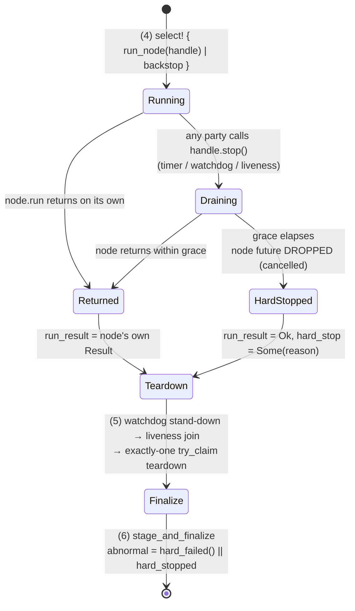

# A timed hard-stop on `node.run` — Plan

## Goal Capsule

- **Objective:** Close the last agent-runnable safety gap in the rung-1 live path. `run_live_session` awaits `node.run` with **no deadline**, so a node that ignores `handle.stop()` blocks the driver indefinitely and the exactly-one teardown (step 5) and `stage_and_finalize` (step 6) are never reached. Add a **stop-relative** hard-stop deadline: once *any* party has requested the stop, the node gets a bounded grace to return; if it does not, the driver abandons the node future and proceeds to the same teardown + finalize path, finalizing **ABNORMAL** (exit `72`).
- **What this fixes (one problem):** today the only catch is an attended operator interrupting the process, which leaves `.tmp-<run_id>` residue and a consumed dispatch with no finalized run. `RUNBOOK-rung1.md:140-144` names this residual explicitly and calls the hard-stop "a noted follow-up".
- **Why the dead-man does not already cover it:** the watchdog's runtime heartbeat is fed from `on_bar` in `orb.rs`. A node hung *on stop* while the strategy still processes bars keeps feeding that heartbeat, so `DeadManRuntime` never fires. The watchdog is not a backstop for this failure.
- **Execution home:** entirely the standalone `adapters/nautilus/` workspace (own `Cargo.toml`, Rust 1.96). One source file (`lab/src/runner/live.rs`), one test file (`lab/tests/live_driver.rs`), one runbook. **No `crates/` change**, so the root `cargo test` gate does not apply.
- **Head identity is untouched.** `orb.rs` is not edited, so the file-scoped `strategy_code_hash` does not move and no ladder re-baseline is required (see `docs/solutions/architecture-patterns/head-identity-hash-is-file-scoped-so-live-only-wiring-forces-a-rebaseline.md`).
- **Agent vs operator boundary:** an agent lands and offline-proves every unit. The agent **never** drives `--mount` (nonce-gated, attended, refuses in a no-TTY shell), and **never** drives a real `node.run` in the gate — the new test scripts a fake never-stopping node.
- **Stop conditions:** surface instead of guessing if (a) the change would require editing `adapters/nautilus/lab/src/strategy/orb.rs`; (b) the hard-stop cannot be proven offline without driving a real `node.run`; (c) closing the deadline requires adding `Send + 'static` bounds to the `run_node` seam that the real call site (`live.rs:2109`) cannot satisfy.

---

## Problem Frame

`run_live_session` (`adapters/nautilus/lab/src/runner/live.rs:1580`) is the six-step driver documented in the module header at `live.rs:1353-1380`. Its stop mechanism is a spawned timer:

```rust
// live.rs:1626-1636
let timer = tokio::spawn(async move {
    tokio::time::sleep(Duration::from_secs(session_secs)).await;
    timer_handle.stop();          // a REQUEST, not a guarantee
});

// (4) The live-only seam.
let run_result = run_node(handle.clone()).await;   // no deadline on this await
timer.abort();
```

`LiveNodeHandle::stop()` sets a bare `AtomicBool` (`nautilus-live-0.60.0/src/node/state.rs:115`) that the node is *expected* to observe. If the node never returns from `run` — a wedged broker socket, a drain that never completes, an upstream bug — the `.await` never completes, and everything downstream is unreachable:

- (5) the exactly-one `TripLatch::try_claim` teardown (`live.rs:1647`),
- (6) `stage_and_finalize` (`live.rs:1687`).

The session then leaves only `.tmp-<run_id>` residue plus the chain's consumption marker — a consumed dispatch with no finalized run.

Three parties can request the stop, and each is a distinct arming moment: the session timer at `session_secs`, the watchdog thread on a trip (`node_handle.stop()`), and the session-side liveness loop on supervisor silence. A deadline expressed as `session_secs + grace` would be wrong for the last two: a watchdog trip 100 s into a 21 600 s session would still leave the driver blocked for ~6 hours. The deadline must be **stop-relative** — it starts counting when the stop is *requested*, whoever requested it.

---

## Requirements

| ID | Requirement |
|----|-------------|
| R1 | Once any party has called `handle.stop()`, the node has a bounded grace to return from `run`. If it does not, the driver stops waiting and proceeds. |
| R2 | The hard-stop path reaches the **same** downstream sequence as a cooperative return: watchdog stand-down → liveness join → exactly-one `try_claim` teardown → `stage_and_finalize`. No bail, no early return. |
| R3 | A hard-stopped session finalizes **ABNORMAL** with a distinct, greppable cause in the data-quality observations, and `--mount` exits `72` (`MOUNT_ABNORMAL`) with an operator message that describes *this* failure, not the flat-confirmation failure. |
| R4 | The grace is **stop-relative**, not session-relative — arming on a watchdog or liveness stop is bounded the same as arming on the session timer. |
| R5 | The backstop cannot be disabled. The env knob tunes the grace; it has no "off". |
| R6 | A cooperative node — one that returns after `stop()` within grace — is never hard-stopped, and its outcome is unchanged from today. |
| R7 | Proven entirely offline. The new test scripts a fake never-stopping node; the gate never drives a real `node.run`. |
| R8 | The runbook residual is closed in the same change (it currently calls this "a noted follow-up"). |

---

## Key Technical Decisions

### KTD1 — Drop the node future via `select!`; do not spawn it

The obvious `tokio::time::timeout(dur, run_node(handle))` and a `select!` against a deadline future are equivalent here, and **both are safe**: `run_node(handle)` returns a future the driver *owns*, so dropping it genuinely cancels it at its last await point.

The detach gotcha from the driver turn (gotcha 2 in `docs/solutions/architecture-patterns/live-session-teardown-must-share-the-nodes-arcs-and-capture-handles-before-build.md`) applies to **`JoinHandle`s** — dropping one detaches the task, which keeps running. Spawning the node future to hold an `abort_handle()` would therefore be the *more* dangerous shape here, and it would force `Fut: Send + 'static` bounds onto the seam:

```rust
// live.rs:1584-1586 — today
F: FnOnce(LiveNodeHandle) -> Fut,
Fut: std::future::Future<Output = anyhow::Result<()>>,
```

The real call site is `move |_handle| async move { node.run().await }` (`live.rs:2109`) where `node` is a `LiveNode` — nautilus's own docs for `LiveNodeHandle` say it exists precisely so the node "does not [need to be] Send + Sync". Adding those bounds risks breaking the one seam that cannot be tested offline. **Decision: `select!` over the owned future, no spawn, seam signature unchanged.**

Consequence to state plainly in the code comment: dropping the node future does **not** stop tasks nautilus spawned internally. That is acceptable and is exactly why the teardown runs afterward — `run_teardown` engages the sticky kill switch, cancels every resting order, and positively confirms flat. The safety invariant is re-asserted at the driver altitude (KTD7 in the module header), which is the whole reason the teardown exists after the node's own shutdown.

### KTD2 — Arm on the `should_stop` flag, poll at `watchdog_tick`

`LiveNodeHandle` exposes no notify/await — `should_stop()` is a poll-only `AtomicBool` load. So the backstop polls it, exactly as the node itself does. Polling the *flag* rather than tracking who called `stop()` is what makes the grace stop-relative for free (R4): the timer, the watchdog thread, and the liveness loop all set the same flag.

Poll cadence reuses `cfg.watchdog_tick` (default 5 s, `10 ms` in tests) rather than adding a knob. Arming latency is therefore ≤ one tick, immaterial against a minute-scale grace.

### KTD3 — Grace default 60 s, under the frozen 90 s heartbeat *(session-settled: user-directed — chosen over 120 s: keeps the two residuals from interacting)*

`preregistration.json` freezes `heartbeat_interval_secs: 90`. A grace **under** that means a node hung on stop is hard-stopped by the driver *before* the dead-man can trip on the stalled drain. The consequence matters: a dead-man trip engages the kill switch **and appends a chain safety-trip record**, which reds the next `--dispatch` until a nonce-gated `--clear-killswitch`. At 60 s the driver's own ABNORMAL finalize wins that race, so an operationally-recoverable stall does not cost an attended clear.

`LS_MOUNT_STOP_GRACE_SECS` tunes it, floored at 1 s (R5) — there is no disable. Note the ordering only holds while the operator leaves the grace under the pre-registered interval; the runbook says so.

### KTD4 — No chain safety-trip record; ABNORMAL finalize is the signal *(session-settled: user-directed — chosen over appending a SafetyTrip: a hard-stop is not a watchdog trip)*

`TripCause` is the **watchdog's** remediation vocabulary: each variant maps to a `SafetyTripKind` and is written to the dispatch chain by `execute_trip`. A hard-stop is not a safety trip — it is the driver refusing to wait, followed by the ordinary driver teardown that already engages the kill switch and confirms flat. So: **no new `TripCause` variant, no new `SafetyTripKind`, no chain append.**

The signal is instead: `outcome.hard_stopped` → `abnormal` → the run's `data_quality` carries a fixed `HARD STOP` observation → `--mount` prints a distinct operator message and exits `72`.

### KTD5 — Reuse exit code `72`; mint nothing

`--mount`'s exit codes are a fixed contract asserted by `tests/dispatch_cli.rs`: `0` clean, `66` not-paper, `71` pre-consume precheck failed (dispatch NOT consumed), `72` ran-but-ABNORMAL, `77` attendance/no-mountable-dispatch (`70` is retired). A hard-stopped session **consumed its dispatch and ran**, so `72` is already correct. `outcome.abnormal` is what drives it at `live.rs:2134`, so this is achieved by widening `abnormal`, not by touching the exit path.

### KTD6 — `abnormal` becomes `hard_failed() || hard_stopped`

Today `LiveSessionOutcome { abnormal: report.hard_failed() }` (`live.rs:1690`). A hard-stopped session whose teardown *succeeded* would otherwise finalize clean and exit `0` — a node that ignored a stop request must never read as a clean session. The two causes stay distinguishable on the outcome (`hard_stopped: bool`) so the operator message can name the right one.

---

## High-Level Technical Design

The driver's step (4) becomes a two-branch race. Everything downstream is identical on both branches — that identity is the requirement (R2).



The backstop itself is two sequential waits — arm on the flag, then grace — which is what makes it stop-relative rather than session-relative:

```
backstop(handle, grace, poll):
    while !handle.should_stop():        # arms on ANY stop requester
        sleep(poll)                     # poll == cfg.watchdog_tick
    sleep(grace)                        # the drain budget starts HERE
    return                              # → select! drops the node future
```

Directional guidance, not implementation specification.

Timeline contrast, for the case the design exists to fix (6 h session, watchdog trips at t=100 s, node hangs on stop):

| Deadline shape | Driver unblocks at | Verdict |
|---|---|---|
| none (today) | never | blocks forever; operator interrupt is the only catch |
| `session_secs + grace` | t ≈ 6 h 1 min | technically bounded, operationally useless |
| **stop-relative grace (this plan)** | **t ≈ 160 s** | teardown + finalize run while the operator is still watching |

---

## Implementation Units

### U1. The adversarial test: a node that ignores `should_stop()`

**Goal:** prove the defect, then prove it closed. Written first — today the new test hangs the driver; after U2 it must reach teardown and finalize.

**Requirements:** R1, R2, R4, R6, R7

**Dependencies:** none

**Files:**
- `adapters/nautilus/lab/tests/live_driver.rs` (modify)

**Approach:** add a scripted node beside the existing `blocks_until_stopped` (`live_driver.rs:208`) — the adversarial twin that loops sleeping and **never** reads `should_stop()`. Extend the shared `driver_cfg` helper (`live_driver.rs:160`) with the new `stop_grace` field set to a small `Duration` (tens of milliseconds), matching how `watchdog_tick: Duration::from_millis(10)` already keeps the suite fast.

**Every** new test that could hang must wrap the `run_live_session` call in `tokio::time::timeout(...)` with a several-second ceiling and expect it — a regression here would otherwise wedge the whole gate rather than fail it. This is the single most important detail in the unit.

**Patterns to follow:** `the_session_timer_stops_a_node_that_would_run_forever` (`live_driver.rs:264`) for the `session_secs = 0` immediate-timer idiom; `a_watchdog_trip_tears_down_once_and_the_driver_loses_the_claim` (`live_driver.rs:~290`) for the stale-heartbeat rig (`rig(&server, base - 10_000)`) that trips the dead-man on the first tick; `the_session_end_path_tears_down_once_and_finalizes_a_normal_run` for the artifact assertions (`aborted_runs(...).is_empty()`, manifest/performance staged).

**Execution note:** write these tests before U2 and watch them hang against the current driver (run the new tests alone, with a `--test-threads` bound and the in-test timeout, so the confirmation is cheap). That hang is the defect; do not skip observing it.

**Test scenarios:**
1. *Hard-stop on session end.* `session_secs = 0` (timer fires immediately) + the never-stopping node + a small `stop_grace`. Asserts: the call returns inside the test timeout at all; `outcome.hard_stopped` is true; `outcome.abnormal` is true; the teardown ran (`!handles.session.orders_enabled()` — halt runs on every path); the run finalized with no `.tmp-` residue; the staged `data_quality` contains the `HARD STOP` literal.
2. *Stop-relative, not session-relative (R4).* `session_secs = 3_600` (the timer never fires) but the rig is built with a far-stale heartbeat so the watchdog trips on its first tick and calls `stop()`. Asserts: the driver still unblocks within the small grace — bounded by the in-test timeout, which is orders of magnitude below 3 600 s; `outcome.hard_stopped` is true; `outcome.trip` is `Some(DeadManRuntime)` (the watchdog won the latch, the driver lost the claim) and the run still finalizes.
3. *No spurious hard-stop on the cooperative path (R6).* `blocks_until_stopped` + `session_secs = 0` + a `stop_grace` long enough (e.g. 5 s) that a wrongly-armed backstop would visibly fire. Asserts: `outcome.hard_stopped` is false; `outcome.abnormal` is false; the existing normal-path assertions still hold.
4. *A node that returns on its own is untouched.* `returns_immediately` (`live_driver.rs:202`) — `hard_stopped` false, and the node's own `Ok(())` is what lands in `run_result`.
5. *The node's own error still surfaces.* A scripted node that returns `Err(...)` after the stop — the error must still reach the data-quality observation (`node.run returned an error: …`) and must not be masked by the hard-stop plumbing.

**Verification:** the new tests fail (hang → timeout) against `main`'s driver and pass after U2, with the rest of `live_driver.rs` unchanged and green.

---

### U2. The stop-relative hard-stop in `run_live_session`

**Goal:** the deadline itself, plus the outcome/finalize plumbing that makes a hard-stopped run read ABNORMAL for the right reason.

**Requirements:** R1, R2, R3, R4, R6, and KTD1–KTD2, KTD4, KTD6

**Dependencies:** U1

**Files:**
- `adapters/nautilus/lab/src/runner/live.rs` (modify)

**Approach:**

- Add `stop_grace: Duration` to `LiveDriverConfig` (`live.rs:1404`), doc-commented as the *stop-relative* drain budget and pointed at KTD3's heartbeat relationship. `watchdog_tick: Duration` is the precedent — a `Duration` field on the config, seconds at the env boundary. Only two literal construction sites exist (`live_driver.rs:161`, `live.rs:2279`).
- Add a private async backstop helper next to the driver: arm by polling `handle.should_stop()` at `cfg.watchdog_tick`, then sleep `cfg.stop_grace`, then return. Keep it a free async fn so its shape is readable and it can carry the "why polling" comment (KTD2).
- Replace the bare await at `live.rs:1635` with a `tokio::select!` over the owned `run_node(handle.clone())` future and the backstop. The hard-stop branch yields `(Ok(()), Some(reason))`; the node branch yields `(node_result, None)`. `timer.abort()` still runs on both. Do **not** early-return, bail, or reorder anything below — R2 is the whole point.
- Add `hard_stopped: bool` to `LiveSessionOutcome` (`live.rs:1457` neighborhood) and set `abnormal: report.hard_failed() || hard_stopped` (KTD6).
- Thread the reason into `stage_and_finalize` (`live.rs:1743`) as a new `Option<String>` parameter beside `supervisor_error`, pushing a **fixed-literal** observation (scrubbed at write time, like its neighbours) that names the grace and states what was abandoned. Lead it with `ABNORMAL: HARD STOP` so it is greppable in a run directory.
- Update the module header's numbered step (4) at `live.rs:1366-1367` so the driver's own contract documents the deadline, and update `run_live_session`'s doc comment — it currently says `run_node` is "the **only** seam not exercised offline … everything around it runs in both", which stays true and now covers the hard-stop.

**Patterns to follow:** the `supervisor_error` thread-through (`live.rs:1687-1801`) is the exact precedent for "a driver-side condition that must never bail, only observe and finalize"; its comment discipline (why we never propagate) is the tone to match.

**Technical design (directional):** the select branches — the hard-stop branch's *only* job is to drop the node future and record why.

```
let (run_result, hard_stop) = select! {
    r = run_node(handle.clone()) => (r, None),
    () = backstop(handle.clone(), cfg.stop_grace, cfg.watchdog_tick)
        => (Ok(()), Some(reason_line)),
};
timer.abort();
// ... unchanged from here down: stand-down, liveness join, try_claim teardown, finalize
```

**Test scenarios:** U1's scenarios are the proof; this unit makes them pass. Add one focused unit test in `live.rs`'s `#[cfg(test)] mod` for the env-seconds → `Duration` conversion helper introduced in U3 if it lands here instead (floor at 1 s, default 60 s).

**Verification:** all of U1 passes; the full `live_driver.rs` suite is green with no changes to the existing 12 tests' expectations beyond the added `stop_grace` field in the shared helper.

---

### U3. The operator surface: `LS_MOUNT_STOP_GRACE_SECS` and a distinct ABNORMAL message

**Goal:** make the grace tunable at the boundary and make the failure legible to the attended operator.

**Requirements:** R3, R5, and KTD3, KTD5

**Dependencies:** U2

**Files:**
- `adapters/nautilus/lab/src/runner/live.rs` (modify)
- `adapters/nautilus/lab/tests/dispatch_cli.rs` (modify — only if an exit-code assertion needs the new env var set; do not add new codes)

**Approach:**

- Add `DEFAULT_STOP_GRACE_SECS: u64 = 60` beside `DEFAULT_WATCHDOG_TICK_SECS` (`live.rs:2298-2306`) with a comment stating the 90 s heartbeat relationship (KTD3).
- Add `stop_grace_secs: u64` to `MountInputs` (`live.rs:2166`) and read `LS_MOUNT_STOP_GRACE_SECS` in `mount_inputs_from_env` (`live.rs:2189`) via the existing `env_u64` helper, **floored at 1** so the backstop can never be disabled (R5) — mirroring the "floored at 1" treatment `watchdog_tick_secs` already documents.
- Map it into `LiveDriverConfig` in `prepare_mount` (`live.rs:2279`).
- Branch the ABNORMAL operator message at `live.rs:2134` on `outcome.hard_stopped`. The existing text — "the teardown could not positively confirm a flat account" — is *wrong* for a hard-stop whose teardown succeeded. The hard-stop message should say the node did not return within the grace after being asked to stop, that the node was abandoned and the driver-side teardown ran without it, and what to check (the run is finalized and scannable; confirm the account against the run's `data_quality`; the kill switch is engaged in-process only, so no `--clear-killswitch` is required unless the watchdog also tripped).

**Test scenarios:**
1. *Env floor.* `LS_MOUNT_STOP_GRACE_SECS=0` resolves to 1 s, not 0 — a zero grace would abandon the node the instant a stop is requested. Test the pure seconds→`Duration` conversion, not the process environment.
2. *Env default.* Unset resolves to 60 s.
3. *Exit code unchanged.* The `--mount` exit contract still reads `0/66/71/72/77` — no new code, and `dispatch_cli.rs`'s existing assertions stay green.

**Verification:** `dispatch_cli.rs` is green unchanged (or with only an added env var, never an added code); the mount path compiles with the new field threaded end to end.

---

### U4. Close the runbook residual

**Goal:** the operator-facing statement of this gap currently says the hard-stop is "a noted follow-up". It is not, after U2.

**Requirements:** R8

**Dependencies:** U2, U3

**Files:**
- `adapters/nautilus/lab/RUNBOOK-rung1.md` (modify)

**Approach:** rewrite the second bullet of § "Two operator-visible residuals" (`RUNBOOK-rung1.md:140-144`). The section becomes one residual plus one documented backstop: state that a node hung on stop is now hard-stopped after `LS_MOUNT_STOP_GRACE_SECS` (default 60 s, floored at 1, cannot be disabled), that the session finalizes ABNORMAL at exit `72` with a `HARD STOP` observation rather than leaving `.tmp-` residue, and that the grace must stay **under** the pre-registered `heartbeat_interval_secs` (90 s) or the dead-man trips first and reds the next `--dispatch`. Add the env var to the export block at `RUNBOOK-rung1.md:83-89` beside `LS_MOUNT_SESSION_SECS`, marked optional.

Keep the *first* residual (a drain or market-data lull exceeding the heartbeat can trip the dead-man) — it is unchanged and still real.

**Test scenarios:** `Test expectation: none — documentation only.` The claims must match the shipped defaults exactly; verify by reading U3's constants rather than by test.

**Verification:** the runbook no longer calls the hard-stop a follow-up, and every number in it matches `live.rs`.

---

## Scope Boundaries

**In scope:** the hard-stop deadline, its config/env surface, the ABNORMAL classification and operator message, the offline tests, the runbook.

**Deferred to Follow-Up Work:**
- A `docs/solutions/` learning capturing "dropping an owned future cancels; dropping a `JoinHandle` detaches" as a *pair* — the driver turn documented the second half; this change is the first. Worth writing after the PR lands, via `ce-compound`.

**Out of scope (explicitly):**
- **Running the first attended rung-1 paper session.** `--genesis` / `--dispatch` / `--mount` / `--escalate` / `--reregister` / `--clear-killswitch` are nonce-gated and attended. An agent never drives them.
- The other deferred follow-ups: a calendar-driven market-close stop, any auto-flatten teardown, the live-lane credential flip.
- **`adapters/nautilus/lab/config/preregistration.json` is byte-for-byte off-limits** — its raw bytes are the SHA-256 citation every dispatch record carries, so editing even its `_note` is an unrecorded re-registration. The 90 s heartbeat is *read*, never changed.
- `adapters/nautilus/lab/src/strategy/orb.rs` — editing it moves the file-scoped head identity and forces a fresh re-baseline.

---

## Risks & Dependencies

| Risk | Mitigation |
|---|---|
| A regression makes the new test hang, wedging the ~30-minute gate instead of failing it. | Every hang-capable test wraps `run_live_session` in `tokio::time::timeout` (U1). Non-negotiable. |
| Dropping the node future leaves nautilus-internal tasks alive on the runtime. | Accepted and documented: the driver-side teardown engages the sticky kill switch, cancels resting orders, and positively confirms flat *after* the drop — the safety invariant is re-asserted at the driver altitude (module-header KTD7). The `--mount` process exits shortly after finalize. |
| An operator sets `LS_MOUNT_STOP_GRACE_SECS` above the 90 s heartbeat and the dead-man wins the race again. | Documented in the runbook (U4) and in the constant's comment (U3). The default is deliberately under. |
| An operator sets a very large `LS_MOUNT_WATCHDOG_TICK_SECS`, adding arming latency to the backstop. | Bounded by one tick; noted in the backstop's comment. The tick is already required to be well under the heartbeat interval for the watchdog's own purpose. |
| Adding a `LiveDriverConfig` field breaks struct-literal construction. | Only two sites (`live_driver.rs:161`, `live.rs:2279`); both are touched by this plan. |

**Machine-local tooling traps (cost 22 minutes last session):** `cargo test` routed through the `rtk` shell-hook proxy hung at 0 % CPU with zero output and then reported a misleading exit 0 with an empty log — call `$HOME/.cargo/bin/cargo` directly. A `nohup`'d cargo was killed at shell teardown, silently truncating the gate at 24 of 62 suites — run long gates through the harness's own background mechanism instead. Never run two adapter `cargo` invocations concurrently (target lock); a SIGKILL'd cargo needs `rm -rf target/debug/incremental`.

---

## Verification Contract

- **Primary gate:** `cd adapters/nautilus && $HOME/.cargo/bin/cargo test --workspace` (the `make adapter-check` equivalent). Known-green on `4a6369b`: **62 suites, 1240 passed, 0 failed**. After this change: same suite count, `1240 + <new tests>` passed, 0 failed.
- **Confirm green by counting `test result` lines** — never by trusting an exit code.
- **No `crates/` change is expected**, so the root `cargo test`, `make docs-check`, and `make lane-check` do not apply. Run the root gate only if a `crates/` file is somehow touched (which would be a stop condition, not a step).
- **Never drive `node.run` in the gate.** The new tests script a fake never-stopping node.
- Iterate with `$HOME/.cargo/bin/cargo test -p nautilus-ls-lab --test live_driver` before spending the full workspace gate.

---

## Definition of Done

1. A node that ignores `should_stop()` no longer blocks `run_live_session`: it is hard-stopped after the stop-relative grace and the driver reaches the exactly-one teardown and `stage_and_finalize` (R1, R2).
2. The grace arms on *any* stop requester — timer, watchdog, or liveness — proven by the stale-heartbeat test with a 3 600 s session (R4).
3. A hard-stopped session finalizes ABNORMAL with a greppable `HARD STOP` observation and exits `72` with a message describing the hard-stop, not the flat-confirmation failure (R3, KTD5).
4. A cooperative node's behavior is byte-for-byte unchanged (R6), and the node's own `Err` still surfaces.
5. `LS_MOUNT_STOP_GRACE_SECS` tunes the grace, defaults to 60 s, floors at 1 s, and cannot disable the backstop (R5).
6. `RUNBOOK-rung1.md` no longer calls the hard-stop a follow-up, and its numbers match the shipped constants (R8).
7. `cd adapters/nautilus && cargo test --workspace` is green — 62 suites, 0 failed, counted from the `test result` lines (R7).
8. `adapters/nautilus/lab/src/strategy/orb.rs` and `adapters/nautilus/lab/config/preregistration.json` are untouched; `git diff --stat` confirms the change is confined to `live.rs`, `live_driver.rs`, `RUNBOOK-rung1.md` (plus `dispatch_cli.rs` only if an env var was required).

---

## Sources & Research

- **Origin handoff (machine-local, not in the repo):** `/tmp/compound-engineering-501/ce-handoff/korea-adapter-sdk-ls-a8adc250/node-run-timed-hard-stop.md` — the defect statement, the design questions, and the stop conditions carried into this plan.
- `adapters/nautilus/lab/src/runner/live.rs:1353-1380` — the driver's six-step design contract, incl. KTD7 (why the teardown runs after the node's own graceful shutdown).
- `adapters/nautilus/lab/RUNBOOK-rung1.md:140-144` — the operator-facing statement of this residual.
- `docs/solutions/architecture-patterns/live-session-teardown-must-share-the-nodes-arcs-and-capture-handles-before-build.md` — gotcha 2 (`JoinHandle` detach) is what KTD1 distinguishes itself from.
- `docs/solutions/architecture-patterns/head-identity-hash-is-file-scoped-so-live-only-wiring-forces-a-rebaseline.md` — why `orb.rs` is a stop condition.
- `docs/plans/2026-07-25-001-feat-live-session-driver-plan.md` — the plan that shipped the driver (PR #213) and named this as a deferred follow-up.
- `~/.cargo/registry/src/index.crates.io-*/nautilus-live-0.60.0/src/node/state.rs:64-119` — `LiveNodeHandle`: a `Clone`able pair of atomics, `stop()`/`should_stop()` with no notify, documented as existing so the node need not be `Send + Sync`. This is the evidence behind KTD1 and KTD2.
- `adapters/nautilus/lab/config/preregistration.json:5` — `heartbeat_interval_secs: 90` (read-only; the frozen number KTD3 sits under).
- `AGENTS.md` — repo conventions and the gate.

**External research:** none run. The decision surface here is entirely local — an owned-future cancellation semantic, one crate's handle API read directly from its vendored source, and a frozen pre-registration constant.
