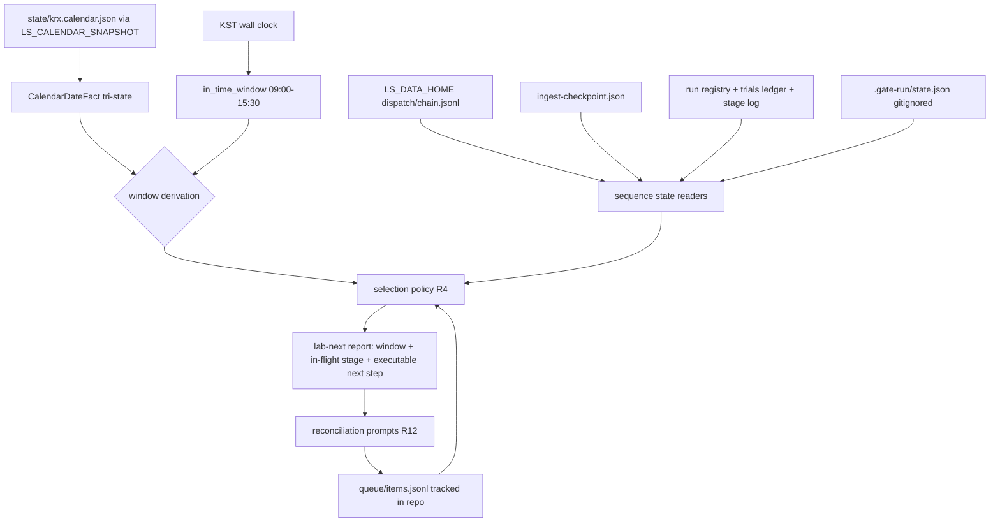
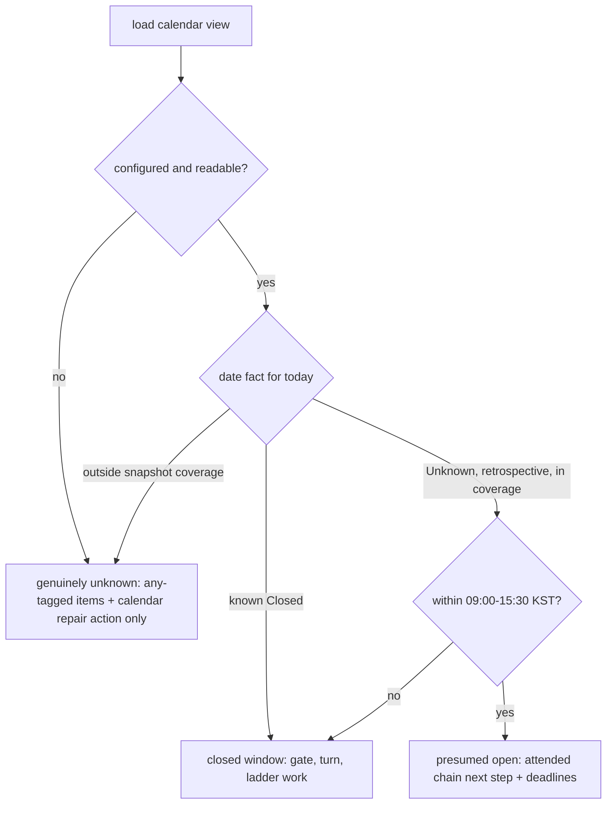

# Window-Aware Work Queue - Plan

## Goal Capsule

- **Objective:** Make switching between KRX-open and KRX-closed work cheap: one window-aware "what now" entry point (`lab-next`) over a single tool-owned work queue, replacing the window-named TODO files, with the long closed-window sequences made self-locating and resumable.
- **Authority:** This plan; repo conventions in `AGENTS.md` and `CONCEPTS.md` override on conflict for gate and safety discipline. The operator adjudicates cutover content decisions (which migrated items to keep) attended.
- **Execution profile:** Fully offline — no gateway calls, no order-path code, no changes to `ls-core`/`ls-sdk`. All new code lands in the standalone `adapters/nautilus` workspace plus root-level scripts/Makefile/guidance edits. Attended input is needed only for the U7 cutover adjudication.
- **Stop conditions:** Stop and surface if implementation finds the calendar seams (`date_fact_from_view`, `in_time_window`) unusable from the lab crate, or evidence that a session-settled decision (see Key Technical Decisions) cannot work.
- **Tail ownership:** The executor owns commits and the AGENTS.md-applicable gate; the U7 cutover lands as its own commit after the resume probes pass.
- **Product Contract preservation:** changed: R3 — fail-closed scope narrowed to genuinely-unknown calendar states, because the calendar's session status is retrospective-only and `Unknown` is the normal state for the live morning (user-approved at plan synthesis). Dependencies updated in place (intraday session hours resolved to an existing in-repo seam). Outstanding Questions resolved into Planning Contract KTDs. All other Product Contract text and IDs unchanged.

---

## Product Contract

### Summary

One entry command answers "what should happen right now": it reads the KRX window state, a single work queue, and the checkpoints of any in-flight sequence, then either resumes that sequence or hands over the next window-appropriate item. The queue replaces `TODO.ATTENDED.md`, `TODO.OFFLINE.md`, and the dated lab TODO files, and the surrounding operational artifacts (runbooks, prompt files, operational logs) consolidate around it.

### Problem Frame

Work on this repo is partitioned by KRX market windows: attended work needs the open window (live sessions, ladder rungs), everything else fits the closed window (code, turns, gate runs). Each window's procedure is long — a 6-step commit gate whose full `cargo test` alone runs ~30 minutes, multi-stage strategy-turn and ladder sequences, a deadline-pinned morning chain — so entering or leaving a window costs real re-orientation: which runbook, which state, what was in flight.

Task state is hand-maintained in window-named files, and that state drifts. The failure mode is proven, not hypothetical: `TODO.ATTENDED.md` records that it was rewritten on 2026-07-27 replacing four earlier TODO files that "had all drifted into describing finished work" — and two days later three new dated `TODO-2026-07-28-*.md` files had already accreted in `adapters/nautilus/lab/`, alongside 9 `RUNBOOK-*.md` files and a session prompt file. The switching cost is a resume cost, and today resuming means re-deriving state from prose.

### Key Decisions

- **Interruptibility over shortening.** (session-settled: user-directed — chosen over gate tiering/speedup: the processes stay long; stopping and resuming becomes cheap instead, and the "never commit with a red gate" discipline stays intact.)
- **Primary scope is the closed-window side.** (session-settled: user-directed — gate runs and strategy-turn/ladder ops chosen over the morning live-session chain as the sequences whose switching cost hurts most; the morning chain is pointed at, never redesigned.)
- **One queue with window-tagged items, not window-named files.** (session-settled: user-approved — the 2026-07-27 two-file consolidation already failed to stop drift; items carry a window requirement instead of living in files named after windows.)
- **Queue state is owned by the tools, not hand-edited prose.** (session-settled: user-approved — the tools that complete work update the queue, so "file describes finished work" becomes structurally impossible rather than a discipline.)
- **Build on existing machinery.** The repo already has `turn governed` orchestration, the `lab-live --mount` session driver, ingest checkpoints, hash-chained dispatch/ladder state, and an offline KRX calendar. The entry point composes these; it does not introduce a new orchestration framework.

### Actors

- A1. Operator — the human who sits down in a window, decides, and runs attended sessions.
- A2. Agent sessions — Claude Code agents running runbooks, turns, and gate work; they consume the same entry point and update the same queue.
- A3. KRX window state — the offline calendar plus the preserved intraday time window that determine which queue items are actionable at any moment.

### Requirements

**Entry point ("what now")**

- R1. A single command reports, for the current moment: the window state (known-closed / presumed-open / genuinely-unknown, and the next boundary), any in-flight resumable sequence with its stage, and the top window-appropriate queue item.
- R2. The command answers in both windows: during KRX-open it surfaces the attended chain's next step and its deadlines, derived from the chain's static step/deadline definition plus the calendar clock — no morning-chain runtime state is required; during closed windows it surfaces gate/turn/ladder work. It never changes what the morning chain does.
- R3. Window state is derived, not read: a known closure is authoritative; a date whose session status is retrospectively `Unknown` but within snapshot coverage and not a known closure counts as presumed-open during the intraday session window. The command fails closed — window-agnostic (`any`) items plus a calendar-refresh/repair action only, never open-attended items — when the calendar is genuinely unknown: unconfigured, unavailable, or the date is outside snapshot coverage.
- R4. Selection is deterministic: a current-window-compatible in-flight sequence outranks new items, and remaining eligible items order by recorded deadline, then queue order. Window-incompatible in-flight sequences stay visible as paused resumable work.
- R5. The output is directly actionable: it names the executable next command or exact next step — a runbook name or path alone is never the handoff.

**Work queue**

- R6. One queue holds all operational tasks; each item carries a window requirement (open-attended / closed / any) as data.
- R7. At cutover the queue replaces `TODO.ATTENDED.md`, `TODO.OFFLINE.md`, and the dated `TODO-*.md` files in `adapters/nautilus/lab/`; those files are retired, and no new dated TODO files are created afterward.
- R8. Queue state changes flow through tools, and every item declares its completion signal at creation: a named tool event, or explicit close-out via the edit command for operator-attended items. Hand-editing prose files is not part of the workflow.
- R9. Completed and stale items leave the actionable view automatically. Stale means past the item's recorded deadline or superseded by a named item; a paused in-flight sequence with a valid checkpoint is never stale.

**Resumability / self-location**

- R10. The long closed-window sequences (strategy turn, ladder session prep, gate run) expose "where am I" state that the entry command can read.
- R11. Stopping at a window boundary mid-sequence is safe and cheap: resuming later starts from the recorded stage, not from re-derivation. Each completed stage records a tree fingerprint (HEAD plus working-tree state), and on resume, gate-run stages recorded under a different fingerprint are invalidated and re-run. A `cargo test` run is the accepted exception — it cannot suspend, so resumability there means knowing the run must restart.
- R12. At each sit-down the entry command reconciles the queue against reality: it verifies completion from checkpoints and artifacts where possible, and asks for a done-or-not confirmation on items without a tool-completion signal, before offering next work — so work completed outside queue-aware tools is closed at the next entry rather than accreting.

**Consolidation and cutover**

- R13. The runbook or prompt content needed at a decision point is reachable from the entry point's output as supplementary reference, so runbooks stop being the navigation system.
- R14. Cutover is an explicit flow (F4): inventory the live content of the TODO files, `TURN-LOG.md`, `PAPER-CUTS.md`, and prompt files; migrate every actionable entry into the queue or mark it explicitly non-actionable; validate; then retire the TODO files. Cutover is gated on a per-sequence probe demonstrating a readable checkpoint, stage, and resume command for each R10 sequence.
- R15. Agent-facing guidance (AGENTS.md, the surviving runbooks, prompt templates) is updated at cutover to name the queue as the sole staging location for new and pre-staged work, and dated TODO files as retired.
- R16. After cutover, an offline check in the commit gate fails when any `TODO-*.md`, `TODO.ATTENDED.md`, or `TODO.OFFLINE.md` exists in the repo, following the enforced-adoption pattern in docs/solutions/architecture-patterns/legacy-shadow-enforced-adoption-gate-playbook.md.

### Key Flows

- F1. Closed-window sit-down
  - **Trigger:** Operator or agent starts a closed-window work block.
  - **Steps:** Run the entry command → it reads window state, queue, and checkpoints → reconciles queue state against checkpoints and artifacts → an in-flight sequence resumes at its stage, or the top eligible item is offered per the selection policy → work proceeds → completion updates the queue.
  - **Covers:** R1, R4, R5, R6, R8, R12.
- F2. Window-boundary stop
  - **Trigger:** A window boundary approaches mid-sequence.
  - **Steps:** Operator stops → the sequence's stage and tree fingerprint are already recorded → next sit-down, the entry command names the sequence, its stage, and the resume step, invalidating any stage whose fingerprint no longer matches the tree.
  - **Covers:** R10, R11.
- F3. Open-window morning
  - **Trigger:** Entry command runs while the derived window is presumed-open (or approaching the open boundary).
  - **Steps:** Calendar facts plus the intraday window identify presumed-open → attended-chain next step and deadlines surface → the morning chain runs exactly as it does today.
  - **Covers:** R2, R13.
- F4. Cutover
  - **Trigger:** The entry point and queue are functional and the per-sequence resume probe (R14) has passed.
  - **Steps:** Inventory the live content of `TODO.ATTENDED.md`, `TODO.OFFLINE.md`, the dated lab TODO files, `TURN-LOG.md`, `PAPER-CUTS.md`, and prompt files → migrate every actionable entry into the queue with a window tag, or mark it explicitly non-actionable → validate that nothing actionable remains outside the queue → retire the TODO files → update the guidance surfaces → enable the gate check.
  - **Covers:** R7, R14, R15, R16.

### Acceptance Examples

- AE1. **Covers R1, R10, R11.** Given a strategy turn stopped mid-way yesterday, when the entry command runs in a closed window, then it names the turn, the stage it stopped at, and the command that resumes it.
- AE2. **Covers R2, R3.** Given 09:05 KST on a weekday within snapshot coverage that is not a known closure, when the entry command runs, then the window derives presumed-open and it surfaces the attended chain's next step — not closed-window code work.
- AE3. **Covers R8, R9.** Given a queue item whose work a tool just completed, when the queue is next viewed, then the item is out of the actionable view with no hand edit having occurred.
- AE4. **Covers R7, R14.** Given the cutover has landed, then `TODO.ATTENDED.md`, `TODO.OFFLINE.md`, and the dated lab `TODO-*.md` files no longer exist, and their live content is in the queue.
- AE5. **Covers R10, R11.** Given a ladder session prep stopped mid-way, when the entry command runs, then it names the prep sequence, its recorded stage, and the resume step.
- AE6. **Covers R10, R11.** Given a gate run stopped after its `cargo test` stage with the tree unchanged, resuming continues at the next gate step; given any tree change since the recorded fingerprint, the invalidated stages — including the `cargo test` — are reported as must-re-run.

### Success Criteria

- Sitting down in any window, one command puts the operator or agent onto the right next action within a couple of minutes.
- No new dated `TODO-*.md` files accrete after cutover.
- The 2026-07-27 failure class — "rewrite the TODO files because they drifted" — does not recur.

### Scope Boundaries

- Gate tiering or speedup — out. The ~30-minute full `cargo test` and the "never commit with a red gate" discipline are unchanged.
- Code-side refactors (metadata codegen, module decomposition, serde consolidation) — out; existing separate plans cover them.
- TR lifecycle recipes (track-tr / implement-tr / promote-tr) — unchanged; no pain reported there.
- Morning-chain step redesign — out; the entry point points at the chain, it does not alter it.
- A general-purpose task manager — out; the queue holds this repo's operational work only.
- The 21 untracked `.agents/skills/` directories — adjudicating keep/remove is seeded as one of the first closed-window queue items, not a requirement or completion condition of this plan.
- Mid-turn checkpointing of `turn governed` — out; governed runs stay one-shot, and turn "resume" means surfacing the recorded next command (see KTD7).

<!-- ce-section: work-relationships -->
### How This Work Fits Together

This plan owns the window-switching/queue surface of a broader "clean and simplify the process" intent. The breakdown below is the current understanding, not a committed roadmap:

- Gate tiering/speedup — can proceed independently of this plan; touches a safety discipline; still to decide whether it is wanted at all.
- Code-side simplification — independent; already covered by docs/plans/2026-06-29-002-refactor-codebase-simplification-split-plan.md, docs/plans/2026-06-29-003-refactor-codebase-simplification-split-plan.md, and the analysis in docs/brainstorms/2026-07-02-refactoring-strategy-and-architecture-analysis.md (codegen named as the real code lever).
- Morning-chain simplification — enabled by this plan (shares the window-state and entry-point machinery); deferred until this plan proves the entry point.
- TR lifecycle recipes — can proceed independently; no work identified.

### Dependencies / Assumptions

- The offline KRX calendar (`adapters/nautilus/nautilus-ls-calendar/`, `adapters/nautilus/state/krx.calendar.json`) is the trading-day source; verified present. It is day-granular, and its session status is retrospective-only — today reads `Unknown` for its entire duration by design (docs/solutions/architecture-patterns/krx-session-status-is-retrospective-only-unknown-is-not-a-defect.md). Intraday hours come from the preserved in-repo seam: `in_time_window` (09:00–15:30 KST) and the `CalendarDateFact` tri-state in `adapters/nautilus/lab/src/dispatch/checks.rs`.
- Existing sequence state is heterogeneous but readable: dispatch/ladder state in the hash-chained `dispatch/chain.jsonl` under `LS_DATA_HOME`, ingest state in `ingest-checkpoint.json`, turn history in the run registry and trials ledger. Only gate-run state is greenfield; the R14 per-sequence probe confirms readability before cutover.
- The success criterion (one command, productive within a couple of minutes) is inferred from the dialogue, not operator-stated; the operator confirmed the inference at synthesis.

### Sources / Research

- Drift evidence: `TODO.ATTENDED.md` (lines 6-8, the 2026-07-27 rewrite note), `adapters/nautilus/lab/TODO-2026-07-28-A-calendar-refresh-activate.md` / `-B-mount-prechecks.md` / `-C-adapter-check.md`.
- Operational surface: 7 `RUNBOOK-*.md` at `adapters/nautilus/` plus `RUNBOOK-rung1.md` and `RUNBOOK-session-morning.md` in `adapters/nautilus/lab/`; `adapters/nautilus/lab/TURN-LOG.md` (1202 lines); `adapters/nautilus/lab/PROMPT-2026-07-30-session-morning.txt`.
- Window seams to compose: `adapters/nautilus/lab/src/dispatch/checks.rs:50-113` (`CalendarDateFact`, `date_fact_from_view`, `in_time_window` 09:00–15:30 KST); `adapters/nautilus/src/calendar.rs:30` (`LS_CALENDAR_SNAPSHOT` resolution, typed `NotConfigured`/`Unavailable`); `adapters/nautilus/nautilus-ls-calendar/src/reconcile.rs:9-37` (retrospective-only authority matrix).
- State-store patterns to mirror: `adapters/nautilus/src/ingest/checkpoint.rs:746-749` (atomic tmp+rename), `adapters/nautilus/lab/src/artifacts/mod.rs:5-102` (run registry `.tmp-` dir + atomic rename), `adapters/nautilus/lab/src/dispatch/chain.rs:1-58` (hash-chained JSONL, fail-closed to rung 0), `adapters/nautilus/lab/src/runner/research.rs:2057-2070` (in-repo tracked ledger precedent).
- Bin/test conventions to mirror: `adapters/nautilus/lab/src/bin/lab-mount-universe.rs` (read-only, no-nonce posture), `adapters/nautilus/lab/src/runner/research.rs:1687-1707` (`main_cli` shape: scrub install, mandatory calendar startup record, scrubbed errors), `adapters/nautilus/lab/tests/governed_cli.rs` (compiled-bin subprocess tests, tempdir `LS_DATA_HOME`, env-injected stubs).
- Guard patterns to copy: `scripts/lane-fail-fast-check.sh` + `Makefile:1111` (offline script check), `adapters/nautilus/nautilus-ls-calendar/tests/merge_block.rs:34-77` + `Makefile:1155` (tree-state coupling test with committed verdict artifact), docs/solutions/architecture-patterns/legacy-shadow-enforced-adoption-gate-playbook.md, docs/solutions/architecture-patterns/offline-makefile-guard-test-via-real-recipe-shim.md.
- Fingerprint precedent: `adapters/nautilus/lab/src/fingerprint.rs` + `fingerprint_core.rs` (`include!`-shared walk-and-hash; false-stale-only failure mode; docs/solutions/design-patterns/build-runtime-hash-parity-via-shared-include.md).
- State-hygiene learnings: docs/solutions/logic-errors/empty-repull-completing-destructive-heal-destroys-history.md (empty result never completes a destructive transition), docs/solutions/logic-errors/per-date-gate-on-a-range-op-silently-advances-over-unchecked-dates.md (gate each step on resume), docs/solutions/test-failures/operator-shell-ls-env-makes-the-adapter-suite-look-red-on-pristine-main.md (never export `LS_*` into the operator shell), docs/solutions/workflow-issues/no-required-ci-checks-real-merge-gate-is-attestation-plus-merge-block.md (the gate check's real home is the AGENTS.md gate list).
- Incidental drift instance found during verification: the `adapters/nautilus/lab/src/bin/lab-live.rs` module doc still describes the pre-#213 state — a candidate first queue item.

---

## Planning Contract

### Key Technical Decisions

- KTD1. **Window state is derived from two existing seams, not read from the calendar alone.** Compose the `CalendarDateFact` tri-state (from the loaded calendar view) with the preserved `in_time_window` 09:00–15:30 KST seam in `adapters/nautilus/lab/src/dispatch/checks.rs`. Known closure → closed; retrospective `Unknown` within snapshot coverage and not a known closure → presumed-open during the intraday window, closed outside it; unconfigured / unavailable / outside coverage → genuinely-unknown, fail closed. (session-settled: user-approved — chosen over the reviewed literal fail-closed-on-`Unknown` rule: session status is retrospective-only, so `Unknown` is the normal state for the live morning and a literal rule would never surface the attended chain.)
- KTD2. **The queue is a git-tracked in-repo JSONL** at `queue/items.jsonl`, written atomically (tmp+rename, mirroring the ingest-checkpoint idiom), with `LS_QUEUE_PATH` as the test-time override. (session-settled: user-approved — chosen over an `LS_DATA_HOME` operator store: the queue replaces repo-visible TODO files and must stay visible across machines and sessions, and the R16 guard couples to tree state, which requires the queue's cutover verdict in the tree.)
- KTD3. **The entry point is one new lab binary, `lab-next`,** a thin shim into `runner::next::main_cli()` following the no-clap args-match convention, with subcommands for the report (default), `add` / `done` / `supersede` (R8's edit surface, matching KTD6's transitions), and `probe` (R14). It mirrors `lab-mount-universe`'s read-only posture — no nonce, no TTY, no chain append; its only writes are queue-file mutations. A root `make next` target is a thin wrapper that passes `LS_CALENDAR_SNAPSHOT` inline to the subprocess and exports nothing into the operator shell. Rationale: hosting in the adapter workspace keeps the calendar and dispatch seams as ordinary crate paths; make stays a wrapper because of the documented make-include and spawned-shell failure modes; exported `LS_*` poisons `cargo test` on pristine main.
- KTD4. **Gate resumability comes from a gate driver, not a recorder:** `scripts/gate-run.sh` runs the AGENTS.md gate steps in order, recording per-step completion and a tree fingerprint to a gitignored state file `.gate-run/state.json` (atomic tmp+rename). The fingerprint is a SHA-256 over `git rev-parse HEAD`, the porcelain status, the staged/unstaged diff digests, and per-file content digests of untracked files (`git ls-files --others --exclude-standard`) — whole-repo coverage that the lab-tree content hash cannot give, including new files that no diff records. On resume the driver re-runs from the first step whose fingerprint mismatches or that never completed; a mismatch can only produce a spurious re-run, never a false green. (session-settled: user-approved — chosen over a record-only tool around hand-run steps: driving is what makes the recorded state trustworthy.)
- KTD5. **Cutover follows the Certify→Enforce→Retire playbook:** a Shadow phase where the queue runs alongside the still-authoritative TODO files, then a recorded verdict artifact `queue/cutover-verdict.json` (committed, `"verdict": "PASS"`) once the R14 probes pass and migration validates, then retirement. The R16 guard has two layers copied from existing patterns: a `lane-check`-style offline script (`scripts/todo-file-check.sh` + `make todo-check`, registered in the AGENTS.md gate list) and a tree-state coupling test in the adapter workspace (merge-block pattern, inverted polarity: verdict PASS ⇒ legacy TODO files must not exist), which `make adapter-check` and the existing adapter CI run. Rationale: this repo has no required CI checks; the documented gate list plus a merge-block-style test is the real enforcement home.
- KTD6. **Queue-item lifecycle hygiene:** every item carries `window` (open-attended / closed / any), a declared completion signal (named tool event, or `explicit` for operator close-out), and optional `deadline` / `superseded_by`. Destructive transitions (done, supersede) never complete from an empty or absent read — a missing artifact leaves the item actionable with a reconcile flag. Resume gates per step, never per range.
- KTD7. **Turns stay one-shot.** `turn governed` is not given mid-run checkpoints; the turn leg of R10 is satisfied by reading the run registry (including `.tmp-` aborted-run residue), the trials ledger, and the optional stage log, and reporting the recorded next command. This keeps "build on existing machinery" intact and avoids touching the governed orchestrator.

### High-Level Technical Design

Component and data flow — everything below the report line is read-only except the queue file and gate state:

Window derivation (KTD1) — the decision boundary the tests pin:

### Sequencing

U1, U2, U3 are independent and can proceed in parallel; U4 is independent (script-side). U5 composes U1–U4. U6 needs U3 and U4. U7 needs U5, U6, and U8 in place. U8 can land inert any time after U1 — before or alongside the U7 cutover commit — and activates only with U7's verdict.

---

## Implementation Units

### U1. Queue store and edit surface

- **Goal:** A tool-owned queue with atomic writes and the item-lifecycle hygiene rules, plus the `lab-next` binary skeleton with `add` / `done` / `supersede` / `list` subcommands.
- **Requirements:** R6, R8, R9. Cites KTD2, KTD3, KTD6.
- **Dependencies:** None.
- **Files:** `adapters/nautilus/lab/src/queue/mod.rs` (new), `adapters/nautilus/lab/src/runner/next.rs` (new, `main_cli` + subcommand dispatch), `adapters/nautilus/lab/src/bin/lab-next.rs` (new thin shim), `adapters/nautilus/lab/src/runner/mod.rs` (register module), `adapters/nautilus/lab/src/lib.rs` (register `pub mod queue;`), `adapters/nautilus/lab/Cargo.toml` (`[[bin]]` entry), `queue/items.jsonl` (new, seeded empty or with the first hygiene items), `adapters/nautilus/lab/tests/next_cli.rs` (new).
- **Approach:** Item schema per KTD6 (id, title, window tag, completion signal, optional deadline / superseded_by / notes / reference paths for R13). Whole-file read, mutate, atomic tmp+rename write mirroring the ingest-checkpoint idiom; `LS_QUEUE_PATH` override for tests; the default `queue/items.jsonl` — like every repo-root artifact the binary touches (probe report, cutover verdict, gate-run state) — resolves from `env!("CARGO_MANIFEST_DIR")` ascending to the repo root, mirroring the trials-ledger idiom at `research.rs:2057-2070`, so the path is stable regardless of invoking CWD. `main_cli` mirrors `research.rs`: scrub install first, mandatory calendar startup record, scrubbed terminal errors.
- **Patterns to follow:** `lab-mount-universe.rs` bin posture; `research.rs:1687-1707` `main_cli` shape; `checkpoint.rs:746-749` atomic save; `trials.jsonl` in-repo ledger precedent.
- **Test scenarios:**
  - Happy path: `add` then `list` shows the item with its window tag; `done <id>` removes it from the actionable view; file write is tmp+rename (no partial file on simulated failure).
  - Covers AE3. A `done` recorded by a tool event leaves the actionable view with no hand edit.
  - Edge: `done` on an item whose declared completion artifact is absent → item stays actionable, flagged for reconcile (empty result never completes a destructive transition).
  - Edge: item past its deadline is stale and leaves the actionable view; an item superseded by a named item likewise; a paused in-flight sequence entry is never stale.
  - Edge: `supersede` sets `superseded_by` on the target; superseding by a not-yet-existing item leaves the target actionable, flagged for reconcile (same hygiene as `done` on a missing artifact).
  - Error: malformed JSONL line → typed error naming the line, no silent skip, queue not rewritten.
- **Verification:** `cargo test -p nautilus-ls-lab --test next_cli` green from `adapters/nautilus`.

### U2. Window derivation

- **Goal:** The KTD1 window function: calendar view + clock in, `KnownClosed` / `PresumedOpen` / `GenuinelyUnknown` + next boundary out.
- **Requirements:** R1, R2, R3. Cites KTD1.
- **Dependencies:** None (uses existing `dispatch/checks.rs` seams).
- **Files:** `adapters/nautilus/lab/src/queue/window.rs` (new), `adapters/nautilus/lab/tests/next_window.rs` (new).
- **Approach:** Pure function over `CalendarDateFact` + a passed clock (no direct `now()` in the core, so tests pin exact instants). Next-boundary reporting: open→close fires after the 15:30 minute ends, close→open at next 09:00 on a non-closed date. The attended-chain pointer during presumed-open is static: the morning-chain step/deadline table (from the session-morning runbook) plus clock; no morning-chain runtime state.
- **Patterns to follow:** `checks.rs:50-113` (`date_fact_from_view`, `in_time_window`, Seoul-timezone minute-window semantics).
- **Test scenarios:**
  - Covers AE2. Weekday in coverage, not a known closure, 09:05 KST → `PresumedOpen`, attended next step surfaced.
  - Known `Closed` date at 10:00 KST → `KnownClosed`.
  - Retrospective `Unknown` at 16:00 KST (after close) → closed window.
  - `NotConfigured` and `Unavailable` snapshot → `GenuinelyUnknown`; only `any`-tagged items plus the repair action are eligible.
  - Date outside snapshot coverage → `GenuinelyUnknown`.
  - Boundary: 08:59 out, 09:00 inclusive open; 15:30 still in-window (the seam's range is `540..=930`, inclusive of the close minute), 15:31 out.
- **Verification:** `cargo test -p nautilus-ls-lab --test next_window` green from `adapters/nautilus`.

### U3. Sequence state readers

- **Goal:** Read-only adapters that turn the heterogeneous existing stores into one "in-flight sequence + stage + resume command" report.
- **Requirements:** R10 (turn, ladder, ingest legs). Cites KTD7.
- **Dependencies:** None.
- **Files:** `adapters/nautilus/lab/src/queue/sequences.rs` (new), `adapters/nautilus/lab/tests/next_sequences.rs` (new).
- **Approach:** Chain/ladder: read `dispatch/chain.jsonl` records and surface the ladder verdict as the chain machinery reports it — a defective chain is surfaced as the fail-closed rung-0 verdict, never re-derived or errored. Ingest: read `ingest-checkpoint.json` and report watermark/refusal state. Turns: run-registry scan — a `.tmp-` run dir is an aborted run to report; trials ledger and optional `LS_GOVERNED_STAGELOG` file give the last recorded stage; the "resume command" for a turn is the recorded next `turn` invocation (one-shot semantics per KTD7).
- **Patterns to follow:** `chain.rs` read path and fail-closed contract; `artifacts/mod.rs:5-102` `.tmp-` residue semantics (report, never delete); `governed.rs:298-307` stage log format.
- **Test scenarios:**
  - Covers AE1. Fixture registry + stage log with a mid-way turn → report names the turn, stage, and resume command.
  - Covers AE5. Fixture chain with a consumed-but-unfinished session prep → report names the prep sequence, stage, and resume step.
  - Fixture chain with a hash defect → report surfaces rung-0 fail-closed verdict, does not error.
  - Missing `LS_DATA_HOME` stores entirely → report says "no in-flight sequences", not an error (entry must work before any sequence ever ran).
  - `.tmp-` aborted run dir present → reported as aborted, dir untouched.
- **Verification:** `cargo test -p nautilus-ls-lab --test next_sequences` green from `adapters/nautilus`.

### U4. Gate driver and gate-run state

- **Goal:** `scripts/gate-run.sh` — runs the AGENTS.md gate steps in order with per-step state and tree fingerprints; resume re-runs from the first incomplete or invalidated step.
- **Requirements:** R10 (gate leg), R11. Cites KTD4.
- **Dependencies:** None.
- **Files:** `scripts/gate-run.sh` (new), `scripts/gate-run-check.sh` (new, offline self-test), `.gitignore` (add `.gate-run/`), `Makefile` (new `gate-run` and `gate-run-check` targets).
- **Approach:** Step list mirrors AGENTS.md exactly (`make docs`, root `cargo test`, `cargo test -p ls-core`, `make docs-check`, `make lane-check`, `make adapter-check`), each step recorded to `.gate-run/state.json` with start/end, exit code, and the tree fingerprint (SHA-256 over HEAD + `git status --porcelain -z` + staged/unstaged diff digests + untracked-file content digests) captured at completion. `gate-run.sh` with no args resumes: recompute fingerprint, invalidate mismatched or incomplete steps, run from the first invalid step. `--status` prints machine-readable state for `lab-next`. Never runs two root `cargo test` concurrently (single state file + advisory lock file guards re-entry). Bash with `set -uo pipefail`, absolute repo-root resolution, per the lane-check script shape.
- **Execution note:** This is an operator-exit-code contract script — test it end-to-end with stubbed binaries (shimmed `make`/`cargo`/`git` on PATH in a mktemp dir), never by re-implementing its logic in the test.
- **Patterns to follow:** `scripts/lane-fail-fast-check.sh` (structure, `ok[X]`/`FAIL[X]` cases, cargo shim); docs/solutions/workflow-issues/shell-script-live-path-needs-stubbed-binary-tests.md; docs/solutions/architecture-patterns/offline-makefile-guard-test-via-real-recipe-shim.md.
- **Test scenarios (in `gate-run-check.sh`, offline, stubbed binaries):**
  - Happy path: all steps stubbed green → state records six completed steps, exit 0.
  - Covers AE6. Stop after step 2, tree unchanged → resume starts at step 3. Stop after step 2, fingerprint changed → steps 1-2 invalidated and re-run.
  - Untracked-file coverage: edit an already-untracked file after step 2 completes → resume invalidates and re-runs the recorded steps.
  - A stubbed step fails → driver stops there, state records the failure, exit non-zero; re-run resumes at the failed step.
  - Concurrent invocation while a run is live → second invocation refuses (lock), exit non-zero.
  - `--status` output parseable and names the next step.
- **Verification:** `make gate-run-check` green; `.gate-run/` never appears in `git status`.

### U5. Entry report, selection, and reconciliation

- **Goal:** The default `lab-next` report: window + in-flight sequences + top item + executable next step, with the R4 selection policy and R12 reconciliation, plus the `make next` wrapper.
- **Requirements:** R1, R2, R4, R5, R12, R13. Cites KTD1, KTD3.
- **Dependencies:** U1, U2, U3, U4.
- **Files:** `adapters/nautilus/lab/src/runner/next.rs` (extend), `adapters/nautilus/lab/tests/next_cli.rs` (extend), `Makefile` (new `next` target).
- **Approach:** Compose window (U2), sequences (U3 + U4 `--status`), and queue (U1). Selection per R4: current-window-compatible in-flight sequence first; then eligible items by deadline, then file order; window-incompatible in-flight sequences listed as paused. Every offered line carries the executable command or exact step (R5) with the item's reference paths as supplementary (R13). Reconciliation (R12) before offering: items whose declared tool-completion artifact now exists are auto-closed with a printed notice; `explicit`-signal items past their expected window prompt a `done? [y/N]` only when a TTY is present — agent sessions get a flagged line instead of a prompt. `make next` passes `LS_CALENDAR_SNAPSHOT=adapters/nautilus/state/krx.calendar.json` inline; nothing exported to the operator shell.
- **Test scenarios:**
  - Deterministic selection: same fixture state twice → identical output; deadline-ordered items; in-flight sequence outranks new items.
  - Paused visibility: open-window fixture with a closed-tagged in-flight turn → turn listed as paused, attended step offered.
  - Genuinely-unknown fixture → only `any` items + repair action (never open-attended items).
  - Reconciliation: item with tool-completion artifact present in fixture → auto-closed with notice; `explicit` item in a non-TTY run → flagged, not prompted, still actionable.
  - R5 contract: every offered line contains a runnable command or exact step string (assert on output shape).
- **Verification:** `cargo test -p nautilus-ls-lab --test next_cli` green from `adapters/nautilus`; `make next` on a fresh clone (no `LS_DATA_HOME`, calendar snapshot absent because gitignored) reports a genuinely-unknown window with the calendar-repair action and the `any`-tagged seed items — fail-closed behaving as designed.

### U6. Resume probe and probe verdicts

- **Goal:** `lab-next probe` — verifies, per R10 sequence, a readable checkpoint, stage, and resume command against live-shaped fixtures, and records the per-sequence result consumed by the cutover verdict.
- **Requirements:** R14 (probe gate). Cites KTD5.
- **Dependencies:** U3, U4.
- **Files:** `adapters/nautilus/lab/src/runner/next.rs` (extend), `adapters/nautilus/lab/tests/next_probe.rs` (new).
- **Approach:** For each sequence (turn, ladder prep, ingest, gate run) the probe checks: state store readable, a stage derivable, and a resume command printable. Output is one `ok[sequence]` / `FAIL[sequence]` line each plus a summary JSON written next to the queue (`queue/probe-report.json`, committed at cutover time as evidence inside the verdict). Probe failure lists what was unreadable — it never mutates any store.
- **Test scenarios:**
  - All-fixtures-good → four `ok` lines, report JSON written atomically.
  - Gate state absent → `FAIL[gate-run]` naming the missing state; others still probe.
  - Defective chain fixture → `ok[ladder]` with the rung-0 fail-closed verdict noted (fail-closed is a readable state, not a probe failure).
- **Verification:** `cargo test -p nautilus-ls-lab --test next_probe` green from `adapters/nautilus`.

### U7. Cutover: migrate, retire, update guidance

- **Goal:** Execute F4: migrate live TODO/log/prompt content into the queue, validate, record the PASS verdict, retire the files, and update guidance surfaces.
- **Requirements:** R7, R13, R14, R15. Cites KTD5.
- **Dependencies:** U5, U6, U8 (the `todo-check` target must exist for this unit's verification; U8's guard is a no-op until the verdict lands).
- **Files:** `queue/items.jsonl` (migrated content), `queue/cutover-verdict.json` (new, committed), `TODO.ATTENDED.md` / `TODO.OFFLINE.md` / `adapters/nautilus/lab/TODO-2026-07-28-*.md` (deleted), `AGENTS.md` (queue as sole staging location + gate-list addition), `adapters/nautilus/lab/RUNBOOK-session-morning.md` and `adapters/nautilus/RUNBOOK-*.md` (pointers to `lab-next` where they currently say "check the TODO"), `adapters/nautilus/lab/PROMPT-2026-07-30-session-morning.txt` (migrated or retired).
- **Approach:** Shadow first: queue seeded and running alongside the TODO files (U1–U6 period is the Shadow phase). Cutover session (operator-attended): inventory every actionable entry in the named artifacts; migrate with window tags, completion signals, and reference paths (rich content like env exports and ordered command steps stays in the item's notes or referenced runbook per R13); mark the remainder explicitly non-actionable in the inventory; run `lab-next probe` — all sequences PASS required; write the verdict with the probe report embedded; delete the TODO files; update AGENTS.md and runbooks. `TURN-LOG.md` and `PAPER-CUTS.md` stay as historical logs — only their actionable entries migrate. Seed the standing items — skills-directory adjudication, the `lab-live.rs` stale module doc fix — tagged `any` so they surface even before a calendar snapshot is configured.
- **Execution note:** Operator-attended for the keep/drop adjudication; the migration itself is mechanical. Land as its own commit so the retirement is one revertible unit.
- **Test scenarios:** Test expectation: none — content migration and file retirement; the guard (U8) and AE4 check the end state mechanically.
- **Verification:** AE4 holds: legacy files gone, live content in queue, `make todo-check` (U8) green with the verdict present, `make next` offers migrated items correctly.

### U8. TODO-file guard

- **Goal:** The R16 enforcement: offline gate check + tree-state coupling test that fail when legacy TODO files exist after cutover.
- **Requirements:** R16. Cites KTD5.
- **Dependencies:** U1 (can land inert); activates with U7's verdict.
- **Files:** `scripts/todo-file-check.sh` (new), `Makefile` (new `todo-check` target), `AGENTS.md` (add `make todo-check` to the gate block), `adapters/nautilus/lab/tests/todo_merge_block.rs` (new, tree-state coupling test).
- **Approach:** Script polarity per KTD5: no `queue/cutover-verdict.json` or verdict not PASS → OK regardless (Shadow phase); verdict PASS → any `TODO.ATTENDED.md`, `TODO.OFFLINE.md`, or `**/TODO-*.md` (excluding `docs/` and `target/`) fails with the offending paths. The coupling test mirrors `merge_block.rs`: paths resolved from the manifest dir, verdict read by string scan, `#[ignore]`-free so `make adapter-check` and existing adapter CI run it (it is cheap and green through Shadow).
- **Patterns to follow:** `scripts/lane-fail-fast-check.sh` shape; `nautilus-ls-calendar/tests/merge_block.rs:34-77` (inverted polarity).
- **Test scenarios:**
  - Shadow: no verdict, TODO files present → OK.
  - Enforced: verdict PASS, no legacy files → OK; verdict PASS, a planted `TODO-2026-01-01-X.md` → FAIL naming the path.
  - Script self-test runs the real script in a mktemp repo fixture (real-recipe-shim pattern), not re-implemented logic.
- **Verification:** `make todo-check` green pre- and post-cutover states as above; `make adapter-check` includes the coupling test.

---

## Verification Contract

| Check | Command | Proves |
|---|---|---|
| Lab unit + CLI tests | `cd adapters/nautilus && cargo test --workspace` (or `make adapter-check`) | U1–U3, U5, U6, U8 coupling test; AE1–AE3, AE5 shapes |
| Gate driver self-test | `make gate-run-check` | U4; AE6 resume/invalidation semantics offline |
| TODO guard self-test | `make todo-check` | U8 polarity in current tree state |
| Lane guard unchanged | `make lane-check` | No regression to the existing fail-fast lane guard |
| Docs unchanged | `make docs && make docs-check` | No metadata surface touched (expected no-op) |
| Root workspace | `cargo test` at root | Unaffected (no root-crate changes); run per AGENTS.md before commit |

Environment discipline for every test run: clear stray `LS_*` exports first (documented failure: `LS_TURN_EXPECT_VERSION` reddens lab tests on pristine main); run adapter commands from `adapters/nautilus` (CWD trap skips the lab crate otherwise); never run two root `cargo test` concurrently (target-lock).

## Definition of Done

- All eight units landed in dependency order (U8 before or alongside U7 — numeric order is not the contract); U7 cutover as its own commit.
- AE1–AE6 each demonstrated by a named offline test (AE4 by the post-cutover tree + `make todo-check`).
- `lab-next probe` reports PASS for turn, ladder, ingest, and gate sequences, and the PASS verdict with embedded probe report is committed.
- Legacy TODO files deleted; AGENTS.md names the queue as the sole staging location and lists `make todo-check` in the gate block; runbooks point at `lab-next`.
- `make next` works on a fresh clone with no `LS_DATA_HOME` and no calendar snapshot: genuinely-unknown window, calendar-repair action, `any`-tagged seed items surfaced.
- No `LS_*` variables exported into the operator shell by any new target or script.
- The applicable AGENTS.md gate is green at each commit; abandoned experimental code from dead-end approaches is removed, not left in the diff.
