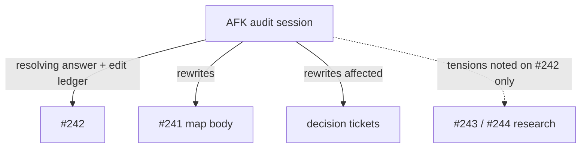
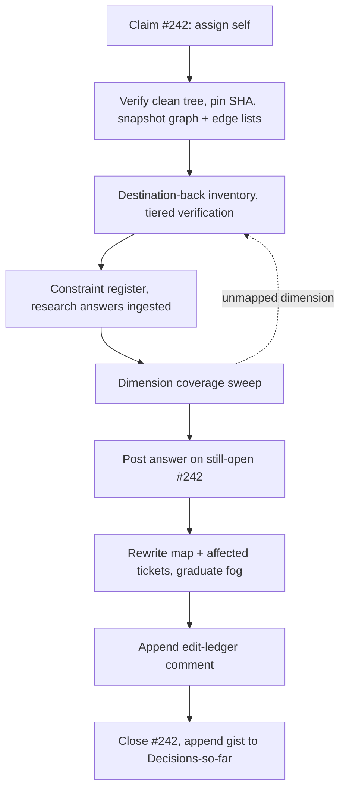

# ORB Portfolio Gap Audit (#242) - Plan

## Goal Capsule

- **Objective:** Resolve wayfinder ticket #242 — the audit of the gap from the v35 stand-down to the destination of epic #241 — as a single AFK session that posts a verified inventory, propagates constraints into the ticket graph, and closes the ticket under a complete edit ledger.
- **Authority hierarchy:** This plan's Product Contract → canonical vocabulary (`CONTEXT.md`, `CONCEPTS.md`) → wayfinder conventions (`.agents/skills/wayfinder/SKILL.md`, `docs/agents/issue-tracker.md`).
- **Execution profile:** Knowledge-work — no code, no branch/test/commit lifecycle. One session, single GitHub writer; read-only subagents may fan out for inventory (KTD4).
- **Stop conditions:** Stop and report on #242 without closing it when: a finding requires repo edits or credentialed access to establish; evidence invalidates #241's destination itself; or #242 is already assigned to someone else at claim time.
- **Tail ownership:** The operator reviews the edit ledger post-hoc (Key Flow F2) and may revert any edit. No PR or CI tail exists.

---

## Product Contract

### Summary

Resolve #242 as a single AFK session that inventories the repo destination-back — one section per #241 destination claim, walked into the repo's verified current state — closes each section with constraints keyed to the tickets that consume them, proves coverage with a sweep of #242's ten named dimensions, posts the whole inventory as #242's resolving answer, and rewrites the #241 map and affected child tickets under a complete edit ledger.

### Problem Frame

ORB head v35 is cost-aware, net-negative, and stood down as of 2026-07-31; nothing is grandfathered into the future portfolio. Epic #241 maps the route to a production-ready attended ORB portfolio through eleven further decision tickets, and each of those decisions needs the same fact base: what the repo already has, what is only prototyped or documented, what failed, and which assumptions are fixed.

Those facts exist but are scattered across governance records written for other consumers — the turn log, runbook banners, the frozen pre-registration, the work queue, ledgers. No single artifact states the repo's position against the destination, and the destination's own key term ("Certified Portfolio Head") has no repo footprint at all. Until an audit consolidates and propagates this, every decision ticket would re-derive the ground truth itself — or worse, proceed on a stale premise.

### Key Decisions

- **The audit's output lives in the tickets, not a repo document.** (session-settled: user-directed — chosen over a `docs/` artifact: the tickets are what downstream sessions read.) Governs R8, R9.
- **Full edit authority over the map and child tickets.** (session-settled: user-directed — chosen over propose-only and split-by-target: one session leaves the ticket graph consistent; the edit ledger substitutes for per-edit review.) Governs R9, R11.
- **Research-ticket bodies are off-limits to edit authority.** (session-settled: user-approved — chosen over editing them like any other ticket: the audit inventories the repo, the research tickets inventory the world, and edits would race the running sessions.) Governs R10.
- **Tiered verification.** (session-settled: user-directed — chosen over records-first and full re-verification: catches record drift where it matters without re-proving what gates already prove.) Governs R3, R4.
- **AFK with edit ledger.** (session-settled: user-directed — chosen over HITL rewrites and fully attended operation: post-hoc review of a complete ledger costs less than live approval.) Governs R11, R12.
- **Destination-back structure carrying a constraint register, closed by a dimension sweep.** (session-settled: user-directed — chosen over a dimension ledger, a pure gap map, and a constraint-register-only shape: gap-shaped output maps onto the tickets that must close each gap, while the sweep keeps completeness checkable.) Governs R1, R5, R6.
- **Read-only on the repo, write-only on GitHub.** (session-settled: user-approved — vocabulary and capability gaps become recorded constraints, not repo edits.) Governs R13, R14.

### Actors

- A1. The AFK audit session — resolves #242, holds edit authority over #241 and its child tickets.
- A2. The operator — dispatches A1, reviews the edit ledger post-hoc, may revert any edit.
- A3. Downstream decision-ticket sessions — consume rewritten ticket bodies and keyed constraints.

### Requirements

**Inventory content**

- R1. The #242 answer is organized destination-back: one section per destination claim of #241 (Certified Portfolio Head composed of independently certified ORB variants; point-in-time KOSPI and KOSDAQ common-stock universe; Two-Tier Portfolio Simulation evidence; Reference Instrument boundary; attended operation under Production Ladder governance), each walked from the claim into the repo's current state.
- R2. Every inventoried item is classified as Implemented, Prototyped-or-documented-only, Failed-or-stood-down, or Absent.
- R3. Verification is tiered: load-bearing claims are re-verified against code, tests, or on-disk artifacts with `file:line` citations; all other claims cite the governance record that carries them (`adapters/nautilus/lab/TURN-LOG.md`, runbook banners, `adapters/nautilus/lab/config/PREREGISTRATION.md`, ledgers, `queue/items.jsonl`).
- R4. The answer pins the audited commit SHA, and every `file:line` citation is valid at that SHA.
- R5. The answer closes with a coverage sweep mapping each of #242's ten named dimensions (strategy and portfolio behavior, point-in-time data, simulation fidelity, transaction costs, tests, adapter/runtime safety, observability, operational runbooks, evidence, Production Ladder governance) to the section(s) covering it; an unmapped dimension is a defect in the audit, not an acceptable omission.

**Constraint register**

- R6. Each destination-back section closes with the constraints it produced — assumptions later decision tickets must treat as fixed — each keyed by issue number to the ticket(s) that consume it.
- R7. Every constraint carries enough cited fact (per R3) that a later session can challenge it without re-auditing the repo.

**Ticket propagation**

- R8. The inventory and constraint register land as the resolving answer on #242, and #242 is the only ticket the session resolves.
- R9. The session directly rewrites the #241 map body (Notes, Not-yet-specified, dependency edges) and any child ticket whose premise an audit finding changes.
- R10. The bodies of research tickets #243 and #244 are never edited. Both are closed with resolution answers posted: the session ingests those answers into its fact base, treats conflicts with them as ordinary findings under R9's authority, and backfills their missing gist lines into #241's Decisions-so-far as part of propagation.
- R11. The #242 answer contains a complete edit ledger — every ticket edited, created, or rewired, what changed, and why — sufficient for A2 to review post-hoc and revert any single edit.

**Execution discipline**

- R12. The session runs AFK end-to-end and never blocks on operator input.
- R13. The session is read-only on the repository and write-only on GitHub tickets: no repo file edits, no queue changes, no fixes.
- R14. Destination vocabulary with no repo footprint (e.g., "Certified Portfolio Head") is recorded as a gap or constraint on #242, not added to `CONTEXT.md`.
- R15. All ticket text uses the canonical vocabulary of `CONTEXT.md` and `CONCEPTS.md`.

### Key Flows

- F1. Audit run
  - **Trigger:** A2 dispatches A1 against #242.
  - **Steps:** Claim #242 by assignment; verify the clean tree, pin the audited commit SHA, and snapshot the ticket graph; build the destination-back inventory with tiered verification, ingesting the #243/#244 resolution answers; extract and key constraints; run the dimension sweep; post the answer on the still-open #242; rewrite the #241 map and affected child tickets and graduate sharpened fog; append the edit ledger to #242; close #242 and append the gist line to the map's Decisions-so-far.
  - **Outcome:** #242 resolved; the ticket graph is internally consistent with the repo's verified state.
  - **Covers:** R1–R15.
- F2. Post-hoc review
  - **Trigger:** A2 reads the #242 answer.
  - **Steps:** Review the edit ledger; revert or adjust any edit; leave recorded tensions for the #243/#244 answers to absorb.
  - **Outcome:** Edits ratified or reverted; nothing else needs re-running.
  - **Covers:** R10, R11.

### Acceptance Examples

- AE1. **Covers R9, R11.** Given an audit finding that a decision ticket's premise is already satisfied in the repo, when the session rewrites that ticket's body, then the edit appears in the #242 ledger with the finding that motivated it, and the ticket remains open (not resolved).
- AE2. **Covers R10.** Given #243's posted resolution answer bears on an audit finding, when composing outputs, then the answer is cited as fact-base input, any conflict with it lands as a finding on #242, and #243's body is untouched.
- AE3. **Covers R6, R14.** Given "Certified Portfolio Head" has no repo definition, when the audit reaches that destination claim, then it records a definitional gap as a constraint keyed to the ticket that must define it, and `CONTEXT.md` is not edited.
- AE4. **Covers R3, R4.** Given the load-bearing claim "head v35 is net-negative under costs," when the audit states it, then the claim is re-verified against the run artifacts and cited `file:line` at the pinned SHA — not merely quoted from a runbook banner.

### Success Criteria

- A downstream decision-ticket session can act from its rewritten body plus keyed constraints without re-auditing the repo.
- A2 can reconstruct and judge every change the session made from the #242 answer alone.

### Scope Boundaries

- Resolving any ticket other than #242 (per R8); rewriting a body is not resolving a ticket.
- Editing #243 or #244 (per R10).
- Repo file changes of any kind (per R13), including vocabulary additions (per R14).
- Making the portfolio design decisions themselves — those belong to the decision tickets the audit feeds.

<!-- ce-section: work-relationships -->
### How This Work Fits Together

This plan owns the contract for #242 only. The breakdown below is the current understanding of the surrounding wayfinder work, not a committed roadmap.

- Epic #241 (the map)
  - **Shares** its destination claims as R1's section structure; **receives** map-body rewrites per R9 and the resolution gist line per KTD1.
- Research tickets #243 (KRX data sources) and #244 (overfitting controls)
  - **Resolved** — both closed with resolution answers posted; their answers are inputs to the audit's fact base, and their bodies stay outside edit authority per R10.
  - **Shares** subject matter the audit's constraints must not silently contradict: data-source feasibility and certification-protocol controls.
- The remaining decision tickets under #241
  - **Depend on** the audit's constraint register and rewritten bodies; each remains a future session's contract.

### Dependencies / Assumptions

- Wayfinder conventions govern the executing session (`.agents/skills/wayfinder/SKILL.md`): one resolved ticket per session; a task ticket's answer records what was done and the facts later tickets depend on.
- The #241 map body follows the Notes / Decisions-so-far / Fog shape (`docs/agents/issue-tracker.md`) and is the accumulation point R9 targets.
- The v35 stand-down record set — TURN-LOG governance entry, RUNBOOK-rung1 banner, PREREGISTRATION § Stand-down, and the PARKED queue item `rung1-ladder-reentry-net-positive-head` — is current as of 2026-08-01 and is the audit's starting fact base.
- Dispatch precondition: the operator commits the `CONTEXT.md` portfolio-vocabulary Language entries (currently uncommitted) before dispatching A1, so the pinned SHA carries the canonical vocabulary and every citation into it resolves per R4.
- `gh` is installed and authenticated with write access to the repo's issues, including the sub-issues and issue-dependencies API endpoints.

### Sources / Research

- `.agents/skills/wayfinder/SKILL.md` — ticket types, HITL/AFK split, one-ticket-per-session rule, resolution and fog-graduation mechanics.
- `docs/agents/issue-tracker.md` — map and child-ticket structure; `gh` commands for claim, comment, close, sub-issues, and dependency edges.
- `adapters/nautilus/lab/TURN-LOG.md`, `adapters/nautilus/lab/RUNBOOK-rung1.md`, `adapters/nautilus/lab/config/PREREGISTRATION.md`, `queue/items.jsonl` — the four-place v35 stand-down record (all four verified present).
- `docs/migration-source/audit/` and `metadata/PROVISIONALITY-LEDGER.md` — the repo's prior inventory-shaped artifacts; nearest structural precedent.
- `CONTEXT.md` (the four portfolio-term Language entries — committed before dispatch per Dependencies / Assumptions) and `CONCEPTS.md` (Production ladder section) — canonical vocabulary. "Certified Portfolio Head" appears nowhere in the repo's markdown (verified against the working tree).
- Wayfinder tickets #243 and #244 — both closed with resolution answers posted (verified live 2026-08-01); their answers are audit fact-base inputs per R10.

---

## Planning Contract

Product Contract preservation: unchanged except — the Outstanding Questions section's three deferred items are resolved as KTD2, KTD3, and KTD4 (section removed); F1 steps re-sequenced to the resolution protocol and R11 extended to cover created/rewired tickets per KTD2 (no scope change); R10, its Key Decision stem, AE2, and the research-ticket relationships updated to the verified closed state of #243/#244 (premise correction — the no-body-edit rule is unchanged).

### Key Technical Decisions

- KTD1. **Execute as a wayfinder work-through resolution.** The session claims #242 by assignment as its first write, resolves with answer comment(s) then close, and appends a one-line gist (ticket name wrapping its link, never a bare number) to #241's Decisions-so-far. Mechanics and exact `gh` commands per `docs/agents/issue-tracker.md` § Wayfinding operations. Covers R8, R12.
- KTD2. **Fog graduation and edge rewiring are in scope of propagation.** (session-settled: user-approved — chosen over restricting edits to existing tickets: the wayfinder resolution convention sanctions create-then-wire at resolution time.) When a finding sharpens a Not-yet-specified patch into a precise question, the session creates the ticket as a map sub-issue, wires its dependency edges, and clears the graduated patch from the fog section. Created and rewired tickets are ledger entries like edits. Cites R9, R11.
- KTD3. **#242's question body stays untouched.** (session-settled: user-approved — chosen over rewriting it to the destination-back structure: the answer carries the structure and the dimension sweep bridges to the ticket's ten dimensions; the question stays the historical contract.) Cites R1, R5.
- KTD4. **Single GitHub writer; read-only fan-out allowed.** (session-settled: user-approved — chosen over multi-writer fan-out: serialized writes keep the ledger complete and race-free.) The session may dispatch read-only subagents per destination claim for inventory legwork; all `gh` writes happen in the orchestrating session. Cites R11, R12, R13.
- KTD5. **The edit ledger is a snapshot diff.** Before any edit, the session snapshots the map body, every child-ticket body, and each child's full blocked-by edge list to scratch (outside the repo) — the tracker's summary field carries only counts, so the edge lists come from the issue-dependencies API. Each ledger entry names the ticket, summarizes the before→after change, and cites the motivating finding by its answer section. Covers R11.
- KTD6. **Answer splits across sequential numbered comments when it exceeds GitHub's comment size limit** (~65k characters); the first comment carries the pinned SHA and a part index. Covers R4, R8.

### High-Level Technical Design

The resolution protocol, end to end:

Inventory (step C) may fan out to read-only subagents per destination claim; every other step is single-writer per KTD4.

---

## Implementation Units

### U1. Claim, pin, and snapshot

- **Goal:** Establish the claim, the audited commit, and the ledger's before-state.
- **Requirements:** R4, R8, R11 (baseline per KTD5).
- **Dependencies:** none.
- **Files:** none written; reads the ticket graph via `gh`.
- **Approach:**
  1. Assign self to #242 as the session's first write; stop if an assignee already exists (Goal Capsule stop condition).
  2. Verify `git status --porcelain` is empty (the vocabulary dispatch precondition held), then record the repo HEAD SHA as the audited commit.
  3. Snapshot #241's body, every child ticket's body, and each child's full blocked-by edge list (issue-dependencies API) to scratch storage outside the repo.
  4. Fetch the #243/#244 resolution answers into the fact base (R10).
- **Test scenarios:** Test expectation: none — process step; verified by the checks below.
- **Verification:** #242 shows the session as assignee; the tree is clean; the snapshot covers every child of #241 including edge lists; the research answers are in the fact base; the SHA matches the working tree the inventory will read.

### U2. Destination-back inventory

- **Goal:** One inventory section per #241 destination claim, classified and verified per the tiered bar.
- **Requirements:** R1, R2, R3, R4.
- **Dependencies:** U1.
- **Files (key inputs):** `adapters/nautilus/lab/` (TURN-LOG.md, RUNBOOK-rung1.md, RUNG1-PREFLIGHT.md, README.md, config/PREREGISTRATION.md, config/transaction-costs.json, src/, tests/), `queue/items.jsonl`, `CONTEXT.md`, `CONCEPTS.md`, `ARCHITECTURE.md`, `docs/adr/`, `metadata/PROVISIONALITY-LEDGER.md`, `metadata/EVIDENCE-FRESHNESS.md`, `docs/solutions/`, `data/turn4-fresh/`, `adapters/nautilus/data/`.
- **Approach:** Five sections per R1's destination claims. Read-only subagents may take one claim each (KTD4). Classify every item per R2's four states. Re-verify load-bearing claims (head sign, cost-model wiring, ladder gates, watermark/catalog state, what tests cover) with `file:line` at the pinned SHA; cite governance records for the rest.
- **Test scenarios:**
  - Covers AE4. The v35 net-negative claim is re-verified against run artifacts, not quoted from a banner.
  - A claim the governance records carry but code contradicts is reported as record drift with both citations.
- **Verification:** Every inventoried item carries a classification; every load-bearing claim carries a `file:line` citation valid at the pinned SHA.

### U3. Constraint register and research tensions

- **Goal:** Constraints keyed to consuming tickets, checked against the posted research answers.
- **Requirements:** R6, R7, R10.
- **Dependencies:** U2.
- **Files:** none written.
- **Approach:** Close each inventory section with its constraints, keyed by consuming issue number but referred to by ticket name. Check each constraint against the #243/#244 resolution answers; a conflict with a posted answer is recorded as a finding in the relevant section, never silently overridden.
- **Test scenarios:**
  - Covers AE2. A constraint touching data-source feasibility cites #243's posted answer; a conflict with it lands as a finding on #242 and #243's body is untouched.
  - Covers AE3. The "Certified Portfolio Head" definitional gap lands as a constraint keyed to the ticket that must define it.
- **Verification:** Every constraint names at least one consuming ticket and cites its supporting fact per R7.

### U4. Dimension coverage sweep

- **Goal:** Prove the ten #242 dimensions are covered.
- **Requirements:** R5.
- **Dependencies:** U2, U3.
- **Files:** none written.
- **Approach:** A table mapping each of the ten dimensions to the answer section(s) covering it. An unmapped dimension sends the session back to U2 — it is a defect, not an omission — and any section added or extended on that return re-runs U3 for its constraints before the sweep is re-attempted.
- **Test scenarios:** Test expectation: none — the sweep is itself the check; verified below.
- **Verification:** All ten dimensions map to at least one section.

### U5. Compose and post the resolution answer

- **Goal:** The full answer posted on the still-open #242: inventory, constraint register, sweep, pinned SHA.
- **Requirements:** R1–R7, R10, R15.
- **Dependencies:** U2, U3, U4.
- **Files:** none written; posted via `gh`.
- **Approach:** Canonical vocabulary throughout (R15); tickets referred to by name; split per KTD6 when over the comment limit. Post before any ticket edit, so a failure mid-propagation leaves a durable on-ticket record of the findings and intended constraints for A2 to recover from.
- **Test scenarios:** Test expectation: none — composition step; content correctness is owned by U2–U4's checks.
- **Verification:** The posted answer contains the pinned SHA, all five destination-back sections, and the sweep table; #242 is still open.

### U6. Ticket propagation

- **Goal:** The map and affected child tickets rewritten; sharpened fog graduated; edges rewired.
- **Requirements:** R9, R10, R14, R15; KTD2.
- **Dependencies:** U5 (edits cite the posted answer's sections as motivation).
- **Files:** none written; all edits via `gh`.
- **Approach:**
  1. Rewrite #241's Notes and Not-yet-specified where findings change them; graduate each sharpened fog patch into a new sub-issue ticket, create-then-wire, and clear it from the fog section; backfill the missing #243/#244 gist lines into Decisions-so-far (R10).
  2. Rewrite any child ticket whose premise a finding changes; rewire dependency edges that findings invalidate.
  3. Never edit #243/#244 bodies (R10). Record every edit, creation, and rewiring for the ledger as it happens.
- **Test scenarios:**
  - Covers AE1. A premise-satisfied decision ticket gets a rewritten body, a ledger entry citing the finding, and stays open.
  - A graduated fog patch exists afterward only as its new ticket — removed from Not-yet-specified.
- **Verification:** Snapshot diff shows changes only on #241 and non-research child tickets; every diff line is accounted for by a pending ledger entry.

### U7. Resolve and close

- **Goal:** #242 resolved per the wayfinder convention with the complete ledger attached.
- **Requirements:** R8, R11; KTD1.
- **Dependencies:** U5, U6.
- **Files:** none written.
- **Approach:** Append the edit-ledger comment reconciling the U1 snapshot against the final ticket state; close #242; append the one-line gist (name-wrapped link) to #241's Decisions-so-far.
- **Test scenarios:** Test expectation: none — terminal process step; verified by the Verification Contract.
- **Verification:** #242 is closed with the answer and ledger present; the ledger's entries reconcile one-to-one with the snapshot diff; #241's Decisions-so-far carries the gist line.

---

## Verification Contract

All gates are checkable from GitHub state and the local tree; there is no test suite for this work.

| Gate | Check | Proves |
|---|---|---|
| Clean tree | `git status --porcelain` is empty at session start (dispatch precondition met) and again at session end | R13 |
| Answer posted | `gh issue view 242 --comments` shows the answer with pinned SHA, five sections, sweep table, and the edit-ledger comment; issue is closed | R1–R8, R11 |
| Research untouched | #243 and #244 bodies byte-identical to the U1 snapshot | R10 |
| Ledger reconciles | Every ticket whose body or edges differ from the U1 snapshot has a ledger entry, and every ledger entry maps to an observed diff | R11 |
| Map updated | #241's Decisions-so-far contains the audit's gist line; graduated fog patches absent from Not-yet-specified | R9, KTD1, KTD2 |
| Single resolution | #242 is the only wayfinder ticket that changed state open→closed this session | R8 |

---

## Definition of Done

- #242 is closed with a resolving answer satisfying R1–R7: five destination-back sections, classified and tier-verified at a pinned SHA, constraints keyed to consuming tickets and checked against the posted research answers, all ten dimensions swept.
- The #241 map and affected child tickets are consistent with the answer; sharpened fog is graduated per KTD2.
- The edit ledger reconciles one-to-one with the snapshot diff; #243/#244 bodies are untouched.
- The repository working tree is untouched; scratch snapshots and drafts live outside the repo and are not left as stray files inside it.
- All Verification Contract gates pass.
