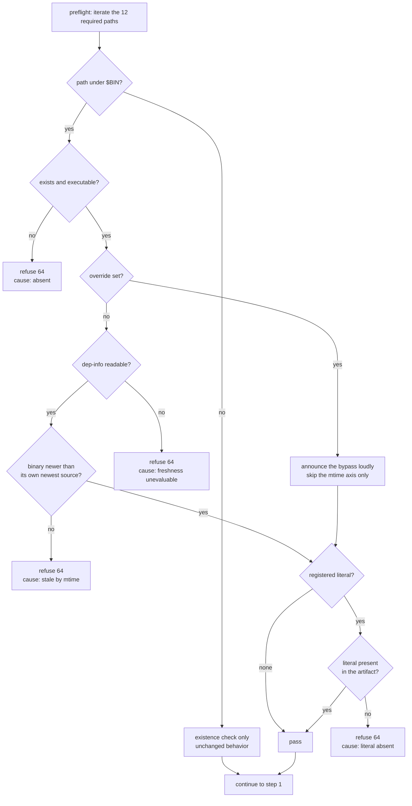

# Session-Morning Stale-Binary Preflight - Plan

## Goal Capsule

**Objective.** Give the morning chain's preflight a freshness axis, so a binary
older than the sources it was built from is refused instead of reported `ok`.

**Authority hierarchy.** The user's direction wins. Then this plan. Then
`AGENTS.md` and the repo's existing conventions. `docs/solutions/` entries are
evidence, not orders — where one conflicts with the present code, the code wins
and the doc gets corrected (U5).

**Stop conditions.** Stop and ask if the work would require a change to
`adapters/nautilus/`'s Rust sources, a new exit code, or a change to any step
after preflight. None of those is in scope, and each signals the approach drifted.

**Execution profile.** Shell and test-harness only — no Rust source changes, so
`make adapter-check` is not reached. Verification still rebuilds the debug binaries
and runs the cargo-backed `docs-check`; budget for that separately from the diff. `make script-check` is the load-bearing gate
and it is fast.

**Tail ownership.** Standard: implement, gate, commit, PR. This is a code-bearing
diff, so it takes the full review path.

---

## Product Contract

### Summary

Add two complementary staleness checks to the preflight in
`adapters/nautilus/scripts/session-morning.sh`: an mtime comparison covering every
required binary, and a sparse per-binary content-literal assertion. A failure
refuses with exit 64 and names the rebuild command. An operator override covers
the deliberately-pinned-binary case.

### Problem Frame

The preflight loop in `adapters/nautilus/scripts/session-morning.sh` validates 12
required paths with an existence test (`[[ -e "$f" ]]`) and prints `ok` for each.
Seven of those paths are compiled debug binaries under `$BIN`
(`adapters/nautilus/target/debug`). Nothing checks their age or their contents.

On 2026-08-04 the gap fired. The tree was clean at `92ba1ed`, but
`target/debug/calendar-refresh` was built at 09:46:18 while
`src/bin/calendar-refresh.rs` and `src/calendar_refresh/candidate.rs` were dated
10:05:07. The preflight reported `ok` for all twelve. Git operations touch sources
after a build, so a clean tree is not evidence that the binaries match it. Had the
run continued unnoticed, the chain would have executed a `calendar-refresh`
predating PR #258's forward-horizon guard — a missing refusal line read as a clean
pass.

`docs/solutions/workflow-issues/first-run-of-a-new-guard-prove-the-binary-then-discharge-its-residual.md`
already named this residual: *"Freshness is a separate property from argv
correctness, and nothing currently checks it."* The guard shipped in PR #235
cannot close it — that guard has no freshness axis, its oracle is a hardcoded
prebuilt path that `make script-check` never builds, and it replays only
`calendar-fetch-inputs` while `calendar-refresh` is stubbed. This is a new axis.

### Requirements

**Freshness gate**

R1. The preflight refuses when a required binary under `$BIN` is older than the
newest source input it was built from, or when its freshness cannot be evaluated
at all. An unevaluable check never falls through to pass.
R2. Each binary's source-input set comes from the dep-info file cargo writes
beside it (`$BIN/<name>.d`), never a hand-maintained directory list. Cargo's set
already spans both workspaces and already includes build-script inputs — notably
the repo-root `metadata/` tree that `crates/ls-core` embeds at compile time and
that no `src/` scan would ever reach.
R3. The mtime axis applies to every `$BIN` entry, derived from the existing
preflight path list rather than a second hand-maintained list. Each binary is
compared against its own sources, never against a timestamp shared across binaries.
R4. The preflight asserts that each binary with a registered probe literal
contains that literal.
R5. The probe-literal registry is sparse. A binary with no registered literal
passes the content axis.

**Refusal behavior**

R6. A freshness refusal exits 64, before any gateway traffic.
R7. The refusal names which of the four causes fired — absent, stale by mtime,
literal absent, or freshness unevaluable — and prints the remedy for that specific
cause. A literal-absent refusal names the registry entry and the `make script-check`
command; the others name the exact rebuild command for the failing binary, run from
the `adapters/nautilus` workspace.
R8. The five non-binary preflight paths keep their present existence check,
unchanged.

**Operator override**

R9. An operator can proceed on deliberately pinned binaries through an environment
variable that is permitted on a real run and announced in the transcript. It
bypasses the mtime axis only. The content axis is never bypassable: a deliberately
pinned binary is still pinned to code that contains its registered guard, so
nothing legitimate needs that escape.

**Drift protection**

R10. `make script-check` fails when a registered probe literal no longer occurs in
the repo's Rust sources.

**Test coverage**

R11. `make script-check` covers four preflight verdicts: fresh passes, stale by
mtime refuses, registered literal absent refuses, override bypasses.
R12. A negative meta-test proves the harness reds when the freshness check is
removed from the script.

### Scope Boundaries

**In scope.** The preflight block and the `LS_SM_*` resolution block of
`adapters/nautilus/scripts/session-morning.sh`, its test coverage in
`adapters/nautilus/scripts/tests/session-morning.test.sh`, the `script-check` doc
comment in `Makefile`, and the two solution docs whose claims this work discharges
or corrects.

**Non-goals.**

- The PR #235 argv-replay guard. It measures a different property and stays as-is.
- Any change to the chain after preflight passes: steps [1] through [11], the pace
  gates, the exit-code contract's existing meanings.
- The `fetch_kasi_year` empty-year defect. Separate, latent, and unreachable while
  KASI publishes through 2028.

#### Deferred to Follow-Up Work

- **Probe literals for the other six binaries.** Only `calendar-refresh` has a
  load-bearing literal today (PR #258's guard). The registry is sparse by design
  (R5) and grows when a guard ships, not on a schedule. Registering an arbitrary
  literal for a binary with no recent load-bearing change asserts nothing.
- **Replaying `calendar-refresh` against its real binary.** The argv-replay guard
  covers only `calendar-fetch-inputs`, leaving the binary that carries the #258
  guard structurally least covered. Real gap, different axis, out of this scope.
- **Extending the `build.rs` source fingerprint to the `nautilus-ls` crate.** See
  KTD3. Would need the root path-dep blind spot closed first, or it ships a false
  green on exactly the cross-workspace axis.
- **Wiring `make script-check` into `make gate-run`.** It is not a `gate-run` step
  today. Adding it requires editing `scripts/gate-run.sh` and
  `scripts/gate-run-check.sh` (which asserts the exact step list) in one commit.

---

## Planning Contract

### Key Technical Decisions

KTD1. **Two complementary axes, not one.** mtime is the general freshness signal;
the content literal proves a specific behavior is present in the artifact, which
mtime cannot. The literal is the deciding axis in exactly one reachable state —
**mtime inversion**, where a binary is newer than every source yet built from older
code. That state is produced by a build racing a `git pull`, a build made in
another worktree or branch, or the cheapest operator response to a false-stale
(`touch target/debug/*`). That last case is why the content axis sits outside the
override's reach (R9). `first-run-of-a-new-guard-...md` prescribes the pairing:
*"mtime alone is weak evidence … while the `strings` assertion says the behavior is
in the binary. Do both."*

KTD2. **Reject delegating freshness to cargo.** Cargo has no check-only mode, so
delegating means auto-remediation rather than refusal — which contradicts R6 and
the `DO NOT REBUILD` precedent recorded in `queue/items.jsonl`
(`session-morning-20260730`, where binaries were pinned at `5f38144` by design).
It is also untestable: the `script-check` fixture is a throwaway `mktemp` tree with
no `Cargo.toml`, so a cargo-invoking preflight would either error there or escape
the fixture. Measured cost confirms the risk is not theoretical: a steady-state
no-op is 0.4s, but the first `--bins` after `cargo test` cost 41s on an otherwise
clean tree, and a root-crate change relinks two ~260 MB binaries — unbounded, inside
a chain with 09:05 / 09:10 / 09:15 deadlines.

KTD3. **All seven binaries get the same shell-only treatment; the lab's embedded
fingerprint stays unused by the preflight.** (session-settled: user-directed —
chosen over an asymmetric design in which `lab-research` and `lab-mount-universe`
self-prove via `LAB_SRC_FINGERPRINT`: that needs a new comparison CLI in the lab
crate, pulls `make adapter-check` into the gate, and leaves two mechanisms to
reason about, while the fingerprint hashes only `lab/src` + `lab/Cargo.toml` and is
blind to the root path-deps that the mtime axis already covers.)

KTD4. **Presence test, not the documented count form.** Use `grep -qa <literal>
<binary>`, not `strings <binary> | grep -c <literal>`. The count form is fragile in
the way the source doc itself warns about — `grep -c forward_horizon` returns 3
only because the compiler did not merge three literals sharing a prefix. Presence
is immune to merge behavior. It is also faster: 0.01s on a hit, 0.18s worst case
for a full scan of the 262 MB `ls-ingest`.

KTD5. **Refuse with a hand-written exit 64.** 64 is already this script's
preflight-refusal code and its header states the rationale for keeping 0 / 40 / 41
distinct. The `die` helper is hardwired to exit 1, so it cannot carry this verdict;
every existing 64 refusal in the script is a hand-written `echo … >&2; exit 64`
pair, and this follows that shape.

KTD6. **Derive the binary set from the existing preflight list.** Iterate the same
12-path loop and apply the freshness axes to entries under `$BIN`. Two
hand-maintained lists would drift: the next binary added would join the existence
loop and silently skip freshness, with no signal.

KTD7. **The override is permitted on a real run and announced.** Model it on
`LS_SM_POLL_SECS` (bounded, allowed live) rather than `LS_SM_NOW` (refused on a
real run). A deliberately pinned binary is a legitimate operator state, so a
test-only seam would leave the operator with no route but to edit the script. It
covers the mtime axis only (R9) — binding both axes to one switch would let the
noisy axis train the operator into disabling the quiet one.

KTD8. **Read cargo's dep-info; don't scan a hand-listed source tree.** Take each
binary's source set from `$BIN/<name>.d`, the dep-info file cargo already writes
beside every artifact. This is not the cargo delegation KTD2 rejects — reading
metadata cargo has already persisted and refusing on it is neither a rebuild nor a
handoff of the verdict. A hand-listed scan was tried in an earlier draft of this
plan and failed three ways at once, each verified in-tree on 2026-08-04:

1. **A shared timestamp cannot be cleared.** Comparing all seven binaries against
   one newest-source value is unrecoverable, because cargo relinks only dirty
   targets. Rebuilding refreshes the touched binary and leaves the rest older than
   the new shared value, with cargo declining to rebuild them. The live tree shows
   the spread this cannot tolerate: the five `nautilus-ls` binaries at 14:25-14:26,
   the two lab binaries at 13:27, all freshly built and correct.
2. **It under-reports.** `crates/ls-core/build.rs` embeds the repo-root `metadata/`
   tree at compile time, so a `metadata/constraints/*.yaml` edit changes every
   binary's behavior while moving no file under any `src/` directory —
   the false-green class this plan exists to close. `calendar-refresh.d` already
   lists those paths 12 times.
3. **It over-reports.** A hand list broad enough to be safe includes
   `adapters/nautilus/lab/src`, which the calendar binaries do not depend on —
   `calendar-refresh.d` references it zero times. Every lab edit would mark the
   calendar binaries stale and force a rebuild inside the 09:05 deadline for a
   dependency that does not exist.

Cargo's dep-info gets all three right for free, and it cannot drift as the
dependency graph changes.

### High-Level Technical Design

The preflight becomes a two-class gate. Data paths keep their existing existence
check; binaries pass through the added axes. Directional, not implementation
specification.



Each of the four refusal arms carries its own remedy. Collapsing them into one
"rebuild and re-run" message repeats the misattribution mistake recorded in
`docs/solutions/workflow-issues/shell-script-live-path-needs-stubbed-binary-tests.md`:
a handler must discriminate among all the ways it can fire, not assert the one
cause its author had in mind. The unevaluable arm matters most, because it is the
one the shell will get wrong by default — `find` over a missing path and an unset
epoch variable both read as "pass", and `session-morning.sh` runs under
`set -uo pipefail` with no `-e`, so a failed scan neither aborts nor refuses. The
script already models the correct shape: `count_advanced` returns `-1` rather than
`0` so a caller can tell "unknown" from "zero".

Each binary is compared against its own dep-info set (KTD8). There is no shared
timestamp, so rebuilding a single stale binary clears that binary's refusal without
disturbing the other six.

### Assumptions

- A false-stale verdict is acceptable and self-healing. A `git checkout` or `pull`
  that touches any source file will trip the mtime axis even when content is
  unchanged; the remedy is one rebuild, after which the binary is newest. This is
  the deliberate direction: a false-reject costs a rebuild, a false-accept is the
  2026-08-04 outcome.
- The five non-binary preflight paths need no freshness axis. They are state and
  config that the chain reads, not artifacts built from source.

### Risks

- **A false-stale on the attended path costs rebuild time inside a deadline.** The
  chain runs at 08:45 against a 09:05 ingest deadline. Any `git` operation that
  touches a source file trips the mtime axis, and the remedy is a rebuild that costs
  7-41s in the common case and minutes when a root crate moved. The override (R9) is
  the operator's escape, which is why it must be permitted on a real run rather than
  test-only. Under `--catch-up` there is no deadline and the risk is nil.
- **This guard passes on arrival.** The 2026-08-04 binaries have since been rebuilt,
  so the defect is latent again. Only mutation (U4) can show the guard would have
  caught it; a green gate cannot.
- **A reworded probe literal turns the guard into a permanent red, and R10 does not
  prevent it.** Nothing runs `make script-check` automatically — it is not a
  `gate-run` step and no CI workflow invokes it — so a reword still reaches the
  08:45 chain as a hard exit 64. R10 makes that failure *diagnosable*, not
  preempted. The containment that actually operates at 08:45 is the refusal message
  itself, which names the registry entry so the operator recognises a reworded
  source in one line (U3). Wiring `script-check` into `gate-run` is the real fix and
  is deferred.

### Sources & Research

- `docs/solutions/workflow-issues/first-run-of-a-new-guard-prove-the-binary-then-discharge-its-residual.md`
  — names the residual this plan discharges, prescribes "do both" (KTD1) and the
  probe-literal uniqueness rule (KTD4). Note its `strings` recipe targets
  `target/release`; the chain runs `target/debug`, so assert against `$BIN`.
- `docs/solutions/workflow-issues/shell-script-live-path-needs-stubbed-binary-tests.md`
  — governs how the new axis is tested: exit codes are a contract the dry-run
  cannot test, and a guard nobody has seen fail is a guard nobody has tested.
- `docs/solutions/workflow-issues/cross-workspace-gate-blind-spot-sdk-preflight-changes-redden-adapter.md`
  — establishes the path-dep reach that R2 encodes.
- `docs/solutions/conventions/coverage-only-change-is-verified-by-mutation-not-by-the-gate.md`
  — this is a regression guard for an already-fixed bug, so it passes on arrival;
  mutation is the only proof it would have caught the original.
- `docs/solutions/design-patterns/build-runtime-hash-parity-via-shared-include.md`
  — the lab's `build.rs` fingerprint mechanism weighed and set aside in KTD3. Its
  headline claim needs correction; see U5.
- Measured in-tree on 2026-08-04: `cargo build --offline --bins` no-op 0.4s; first
  run after `cargo test` 41s; `grep -qa` worst case 0.18s on `ls-ingest` (262 MB).
- **`--dry-run` runs the full preflight.** The `--self-test` block exits before
  preflight is reached, but the `--dry-run` block sits after it. This makes
  `--dry-run` the real-path verification vehicle, and it means every added check
  fires in the harness's existing `--dry-run` invocations.

---

## Implementation Units

### U1. Split the preflight loop into binary and data classes

**Goal.** Restructure the single flat 12-path loop into two classes, changing no
verdict except the binary-class `-e` to `-x` tightening, so the freshness axes have
somewhere to attach.

**Requirements.** R3, R8.

**Dependencies.** None.

**Files.**
- `adapters/nautilus/scripts/session-morning.sh` — the preflight block

**Approach.**
1. Classify each iterated path by whether it sits under `$BIN`, rather than by
   maintaining a separate binary list (KTD6).
2. Keep the `ok` / `MISS` accounting and the `missing` counter's behavior identical
   for both classes in this unit.
3. Strengthen the binary-class existence test from `-e` to `-x`, matching the house
   pattern in `adapters/nautilus/scripts/turn4-ingest.sh`.

**Patterns to follow.** `adapters/nautilus/scripts/turn4-ingest.sh` — refuse and
print the exact build command, using `-x` for binaries.

**Execution note.** This unit is a pure refactor. Prove it by running the existing
`make script-check` unchanged before adding any new verdict — a green run here is
the baseline that later units are measured against.

**Test scenarios.**
- `make script-check` passes with no assertion changes, proving the split is
  behavior-preserving.
- A `--dry-run` against the real tree still reaches step [1] and prints twelve
  preflight lines.
- A binary that exists but is not executable is now reported as missing rather than
  `ok` (the `-e` to `-x` change).

**Verification.** The existing harness is green and the preflight transcript is
unchanged apart from the `-x` case.

---

### U2. Add the mtime freshness axis, discriminated refusal, and the operator override

**Goal.** Refuse with exit 64 when a required binary predates the newest source
input across both workspaces.

**Requirements.** R1, R2, R6, R7 (absent and stale-by-mtime arms), R9.

**Dependencies.** U1.

**Files.**
- `adapters/nautilus/scripts/session-morning.sh` — the preflight block and the
  `LS_SM_*` resolution block

**Approach.**
1. For each `$BIN` entry, read its dep-info file at `$BIN/<name>.d` and take the
   newest mtime among the source paths it lists (KTD8). Paths in a `.d` file are
   absolute, so no repo-root resolution is needed; the script's existing `$R` still
   anchors anything else that needs it.
2. Compare the binary against its own value. Never share one timestamp across
   binaries.
3. Refuse when the dep-info file is missing or yields no usable timestamp. Do not
   let an empty scan result read as fresh — mirror `count_advanced`'s `-1` sentinel
   so "unknown" is never collapsed into "zero".
4. Write the refusal as a hand-written `echo … >&2; exit 64` pair, not `die` (KTD5).
   Give the absent, stale, and unevaluable arms distinct messages, each naming the
   rebuild command for the specific binary and the workspace to run it from — all
   seven build from `adapters/nautilus`, so a bare `cargo build --bin <name>` at the
   repo root resolves against the wrong workspace.
5. Add the override variable to the documented `LS_SM_*` block with the same style
   of justification paragraph the existing knobs carry, stating that it is
   permitted on a real run, that it covers the mtime axis only, and why (KTD7).
   Announce the bypass through `say` so it lands in the transcript.
6. Update the script's two header comment blocks in the same edit: widen the
   exit-64 line in the exit-code contract to cover a stale or unprovable required
   binary, and add the override to the `Env` list alongside `LS_SM_POLL_SECS`. The
   header is where an operator actually reads the contract; leaving it describing a
   narrower 64 than the code enforces is the drift this plan exists to prevent.

**Execution note.** Prove the refusal on the real path before writing the harness
tests: `touch adapters/nautilus/src/bin/calendar-refresh.rs`, then run
`--dry-run` and confirm exit 64. That is the composition-root check — the guard
must fire where production enters, not only where a test enters.

**Technical design.** Directional only: resolving which sources feed which binary
is cargo's job, and the script reads cargo's answer rather than reimplementing or
re-running it. A `.d` file is a make-style rule — target on the left of the colon,
space-separated absolute source paths after it — so parsing is a split, not a
dependency-graph walk. Note the honest limit: a newly added source file is absent
from a stale `.d`, so dep-info is authoritative about what the binary *was* built
from, which is exactly the question being asked.

**Test scenarios.**
- A binary newer than every source in its own dep-info set passes and the chain
  proceeds.
- A binary older than a source under `adapters/nautilus/src` refuses with exit 64.
- A binary older than a source under `crates/ls-core/src` refuses with exit 64 —
  the cross-workspace axis a hand-listed adapter-only scan would miss.
- A binary older than a file under the repo-root `metadata/` tree refuses, proving
  the build-script inputs are covered.
- A lab-only source edit does **not** mark the calendar binaries stale, proving the
  per-binary set does not over-report.
- Rebuilding one stale binary clears that binary's refusal and leaves the other six
  passing — the shared-timestamp regression this design exists to avoid.
- A binary whose dep-info file is missing refuses with exit 64 rather than passing.
- The refusal message names the failing binary, its rebuild command, and the
  `adapters/nautilus` workspace to run it from.
- The absent, stale, and unevaluable arms produce three different messages.
- With the override set, a stale binary passes and the transcript contains the
  bypass announcement.
- The override does not suppress the absent-binary or unevaluable refusals.
- A `--catch-up` run and an attended run behave identically at preflight; the mode
  flags do not reach this block.

**Verification.** Exit 64 on the stale case, exit unchanged on the fresh case, and
the bypass announcement is visible in the transcript rather than silent.

---

### U3. Add the probe-literal registry and the content axis

**Goal.** Assert that a binary with a registered literal actually contains it, so a
binary that is new enough by mtime but missing a known guard is still refused.

**Requirements.** R4, R5, R7 (literal-absent arm).

**Dependencies.** U2.

**Files.**
- `adapters/nautilus/scripts/session-morning.sh` — the registry and the content check

**Approach.**
1. Site the registry adjacent to the preflight block as a readable
   binary-name-to-literal mapping. Record the PR that introduced each literal
   alongside it, so a future reader can tell what the assertion is protecting.
2. Seed it with one entry: `calendar-refresh` maps to `REFUSED (asked for`, from
   PR #258. That literal occurs exactly once in the binary and exists only in
   post-#258 code. Do not use `forward_horizon` — three verdict literals share that
   prefix and the count is a compiler artifact.
3. Test with `grep -qa`, not `strings | grep -c` (KTD4).
4. Leave the registry sparse. A binary with no entry skips this axis (R5).

**Patterns to follow.** The uniqueness rule in
`docs/solutions/workflow-issues/first-run-of-a-new-guard-prove-the-binary-then-discharge-its-residual.md`:
choose the literal for uniqueness, not convenience.

**Test scenarios.**
- The real `target/debug/calendar-refresh` satisfies its registered literal.
- A binary whose registered literal is absent refuses with exit 64 and a message
  distinct from both the absent and stale-by-mtime messages.
- A binary with no registry entry passes the content axis regardless of contents.
- The content axis runs only after the mtime axis passes or is overridden, so a
  stale binary reports staleness rather than a confusing literal failure.
- An overridden run still refuses when a registered literal is absent — the content
  axis is not bypassable (R9).
- The literal-absent refusal names the registry entry and `make script-check`, so an
  operator hitting it at 08:45 can tell a reworded source from a stale binary in one
  line and fix the registry rather than reach for the override.

**Verification.** All three refusal causes are individually reachable and produce
distinguishable output.

---

### U4. Cover the new verdicts in the stubbed-fixture harness

**Goal.** Prove each new verdict fires, prove the registry cannot silently rot, and
prove the harness itself would red if the guard were removed.

**Requirements.** R10, R11, R12.

**Dependencies.** U3.

**Files.**
- `adapters/nautilus/scripts/tests/session-morning.test.sh`
- `Makefile` — the `script-check` doc comment, which enumerates what the harness
  covers and carries its SCOPE LIMIT

**Approach.**
1. Extend `make_fixture` on three axes, not one. The fixture today creates only
   `target/debug`, `state`, `scripts`, `lab/config`, and the data dirs.
   - Create a source tree the freshness axis can see.
   - Write a one-line `.d` file beside each stub binary, pointing at that tree, so
     the dep-info reader has something to read.
   - Emit every **registered probe literal** into the corresponding stub. The
     current `calendar-refresh` stub is a bash heredoc containing no such string, so
     without this the content axis refuses every fixture chain the moment U3 lands
     and roughly thirty existing assertions fail before reaching what they test. A
     comment line inside the heredoc satisfies `grep -qa`. The literal-absent case
     is then produced by a fixture variant that omits it, never by the default stub.
2. Use `touch -t` to manufacture stale artifacts. It is portable across macOS and
   GNU, and the harness already owns stub creation.
3. Add the literal-drift assertion (R10): for each registry entry, grep the repo's
   Rust sources for that literal and fail when it is absent. This keeps a reword
   from converting the guard into a permanent red on the operator's morning.
4. Add negative meta-tests in the harness's established `run_chain_mutated` style:
   strip the freshness check from a mutated copy of the script and assert the
   harness rejects.
5. Update the `script-check` doc comment in the `Makefile` to name the new coverage
   and to state what the freshness axis still does not reach.

**Execution note.** Mutation-first. Per
`docs/solutions/conventions/coverage-only-change-is-verified-by-mutation-not-by-the-gate.md`,
this is a regression guard for an already-fixed bug, so it passes on arrival and a
green gate proves nothing. Plant the mutant, confirm the intended test reds,
confirm nothing else moves, then restore from a kept pre-mutation copy and re-run
on the final bytes. An un-reverted mutant that survives review is a live defect
wearing a green gate.

**Patterns to follow.** The `nobinary` arms of `replay_real_binary` — every one
converts a missing prerequisite into a `no` (FAIL), never a silent pass, and names
the fix command inside the expected-value string.

**Test scenarios.**
- Fresh fixture binaries pass preflight and the chain proceeds as it does today.
- A `touch -t`-aged stub binary refuses with `$CHAIN_RC` equal to 64.
- A stub aged relative to a fixture source under the root-crate path refuses,
  proving the cross-workspace reach.
- A stub whose registered literal is absent refuses with 64.
- The override lets an aged stub through and the bypass announcement appears in
  `$CHAIN_OUT`.
- Every registered literal is found in the repo's Rust sources; a fabricated
  registry entry fails this assertion.
- Negative meta-test: with the freshness check stripped from a mutated script copy,
  the aged-stub case is no longer refused and the harness reports FAIL.
- All `LS_*` variables stay stripped inside new fixture code, matching the harness's
  existing discipline.

**Verification.** `make script-check` is green on the final bytes, and each new
assertion has been individually observed failing under mutation.

---

### U5. Discharge the residual and correct the over-broad fingerprint claim

**Goal.** Close the documented residual this work was written to discharge, and fix
a safety claim that research proved false.

**Requirements.** Traceability for R1 and R4; no new behavior.

**Dependencies.** U4.

**Files.**
- `docs/solutions/workflow-issues/first-run-of-a-new-guard-prove-the-binary-then-discharge-its-residual.md`
- `docs/solutions/design-patterns/build-runtime-hash-parity-via-shared-include.md`

**Approach.**
1. Record in the first doc that the freshness residual is discharged, naming the
   two axes and the exit code. **Add** a `$BIN` (`target/debug`) assertion scoped to
   the session-morning chain alongside the doc's existing `target/release` recipe —
   do not substitute one for the other. Both invocation styles are live:
   `session-morning.sh` pins `target/debug`, while
   `adapters/nautilus/RUNBOOK-calendar-snapshot.md` carries seven
   `cargo run --release` invocations for the same calendar tools, and the artifacts
   that were stale in the original incident were the release ones. The doc's own
   point is that the two styles drift, so it needs both checks.
2. Narrow the second doc's headline claim. It states that a leftover binary *"can
   only cause a spurious halt (false-stale), never a false green."* That holds only
   for the sources the fingerprint hashes. `compute_lab_fingerprint` covers
   `lab/src/**` and `lab/Cargo.toml` only, so a lab binary built before a
   `crates/ls-core` or `crates/ls-sdk` change reports a matching fingerprint while
   running old SDK code — a false green. Scope the claim to the hashed input set.

**Approach constraint.** Both edits are corrections to existing entries. Do not
author a new solution doc for this work in this unit.

**Test scenarios.** `Test expectation: none — documentation-only unit, no
behavioral change.`

**Verification.** `make docs-check` and `make todo-check` stay green; no generated
doc drifts.

---

## Verification Contract

**Gate for this diff.** The changed files are one shell script, one shell test, the
`Makefile` doc comment, and two solution docs. No Rust source is touched, so no
compile reaches the adapter.

```
make script-check    # mandatory — the Makefile itself instructs running it for any
                     # change under adapters/nautilus/scripts/
make todo-check      # cheap, enforced
make docs-check      # regression only — U5 edits hand-authored docs/solutions/,
                     # which docgen does not project, so this can neither red nor
                     # green on those two edits; their correctness is review-verified
```

`make adapter-check` is **not** required for this diff. AGENTS.md scopes it to
changes that can reach the adapter's compile, and a script-and-docs diff cannot. If
the work grows to touch Rust — which is a stop condition, not an expected path —
then it applies: ~45 minutes, always backgrounded, redirected to a file and never
piped to `tail`, since a pipe reports tail's exit code and a red gate reads as
exit 0. A clean run is 70 result lines.

**Real-path proof, beyond the harness.** Run against the actual tree:

1. `--dry-run` on a current tree — preflight passes, chain reaches step [1].
2. `touch adapters/nautilus/src/bin/calendar-refresh.rs`, then `--dry-run` — exit 64,
   naming `calendar-refresh` and its rebuild command. Confirm the other six binaries
   are **not** implicated: only the touched one is stale.
3. Rebuild just that binary, then `--dry-run` — passes again. This is the step the
   shared-timestamp design could not satisfy.
4. `touch crates/ls-core/src/lib.rs`, then `--dry-run` — exit 64, proving the
   cross-workspace axis on the real tree and not only in the fixture.
5. Repeat step 2 with the override set — passes, with the bypass announced.
6. **Rebuild and re-run `--dry-run` to a clean pass.** Do not skip this: steps 2-5
   deliberately dirty the tree, and stopping at step 5 hands the next real morning
   chain a guaranteed exit 64.

Budget for the rebuilds. Step 4 touches a root crate, which relinks two ~260 MB
binaries; step 6 must clear whatever steps 4-5 left dirty. This is verification
cost, not diff cost — the diff itself compiles nothing.

`--dry-run` is the correct vehicle because the `--self-test` block exits before
preflight is reached, while the `--dry-run` block sits after it.

**Environment discipline.** Strip every `LS_*` variable before any cargo
invocation during verification; this shell exports several that can false-red the
adapter suite. Check `env | grep -c '^LS_'` first rather than assuming.

---

## Definition of Done

**Global.**

- A binary older than any source in its own dep-info set is refused with exit 64,
  before any gateway traffic — and rebuilding that one binary clears its refusal
  without implicating the other six.
- The four refusal causes — absent, stale by mtime, registered literal absent,
  freshness unevaluable — produce distinguishable messages, each naming its own
  remedy and the workspace any rebuild runs from.
- The operator override is documented alongside the other `LS_SM_*` knobs and in the
  script's `Env` header, is permitted on a real run, announces itself in the
  transcript, and covers the mtime axis only.
- The exit-code contract block in the script header describes the widened 64.
- No hand-maintained list exists on either axis: the binary set derives from the
  preflight path list, the source set from cargo's dep-info.
- The five non-binary preflight paths behave exactly as they do today.
- `make script-check`, `make todo-check`, and `make docs-check` are green on the
  final bytes.
- Every new assertion has been observed failing under deliberate mutation, and
  every mutant has been reverted from a kept pre-mutation copy.
- All six real-path verification steps have been run and their outcomes recorded in
  the PR body, and step 6 left the tree passing.
- The PR body states explicitly why `make adapter-check` was not run, since
  AGENTS.md's literal wording covers any edit under `adapters/nautilus/`.
- No dead-end or experimental code from abandoned approaches remains in the diff —
  in particular, no partial cargo-delegation scaffolding.

**Per unit.** U1: harness green with no assertion changes. U2: exit 64 on the
adapter-side, root-crate, and `metadata/` staleness cases on the real tree, and a
single-binary rebuild clears its own refusal. U3: all four refusal causes
individually reachable. U4: `make script-check` green with the literal-carrying
fixture, and the negative meta-test reds with the guard stripped. U5: both doc
claims corrected without removing the release-path recipe.
