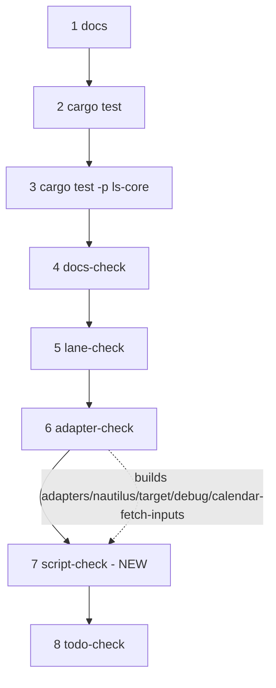

# script-check Flake Fix and gate-run Wiring - Plan

## Goal Capsule

- **Objective:** make `make script-check` believable enough to be a commit-gate step, then make it one — so a reworded probe literal in `BIN_PROBE_LITERALS` is preempted rather than surfacing as a hard exit 64 on the 08:45 chain.
- **Authority:** the Product Contract below wins on what must be true. Key Technical Decisions win on mechanism within those constraints. The operator owns scope changes. Queue items `gate-run-wire-script-check` (this arc) and `script-check-replay-calendar-refresh` (deferred).
- **Execution profile:** two commits — U1+U2 fix the flake, U3+U4 wire the gate. The order is load-bearing: wiring a flaking target into the gate is what the arc exists to avoid.
- **Stop conditions:** stop and report if `make adapter-check` reds for any reason other than this diff, if the 20-run `script-check` soak reproduces the flake after U1, or if the mutation meta-test in U2 reds on an unmutated tree (it must green in the normal suite; the mutation it falsifies with is applied inside the test itself).
- **Tail ownership:** the implementer runs the gate and commits. No push, no PR, unless the operator asks.
- **Open blockers:** none.

---

## Product Contract

### Summary

Delete the racing branch in the `normal mode: the stalled ingest is killed` assertion, add a permanent mutation meta-test that falsifies what remains, then add `make script-check` to `make gate-run` immediately after `make adapter-check`. The driver and its self-test move in one commit.

### Problem Frame

Nothing runs `make script-check` automatically today. PR #260's preflight refuses with exit 64 when a registered guard literal is missing from a required binary, and the registry is a hand-maintained list of literal strings. A reword to any entry therefore lands as a refusal on the 08:45 morning chain — diagnosable at the moment it costs the most clock, and never earlier. Adding the target to the gate is what closes that, and the target's known flake is the only thing standing in the way: wiring a ~1-in-3 red into the commit gate is how a gate stops being believed.

The recorded cause of that flake is wrong. `Makefile:1168-1170` and the queue note both state that "the step [7] poll races the stub's own 10s sleep," which would mean the stub completes before the kill lands. Reproduction on 2026-08-04 — 4 failures across 11 runs, loaded and unloaded alike — shows the opposite branch every time: the stub log carries no `ls-ingest` line at all, while the same runs report `exit 40` and `STAND DOWN — not on pace`.

The ingest was launched and killed. What was lost is the stub's own start marker. The stub's first act is `echo "ls-ingest $*" >>"$STUB_LOG"`, and its `TERM` trap is installed on the next line. With `LS_SM_POLL_SECS=1` the first poll fires roughly one second after launch and, with no observed throughput against an already-elapsed deadline, kills immediately. Bash startup can exceed that second, so SIGTERM arrives before the marker is written and before the trap exists.

```mermaid
sequenceDiagram
    participant S as session-morning.sh
    participant B as ls-ingest stub
    S->>B: launch (background)
    Note over B: bash startup — no marker yet, no TERM trap
    S->>S: sleep LS_SM_POLL_SECS (1s)
    S->>S: pace_verdict -> LATE
    S->>B: SIGTERM
    Note over B: dies before writing "ls-ingest ..."
    S->>S: STAND DOWN, exit 40
    Note over S,B: stub log has no launch record; the assertion reads this as "never started"
```

The branch that reads that empty log as "never started" is redundant. `STAND DOWN — not on pace` is emitted at `adapters/nautilus/scripts/session-morning.sh:1012`, inside the LATE branch and after `kill "$ingest_pid"`, and no other site emits that string. The sibling assertions on exit 40 and on that message already prove the launch and the kill, and both passed on every failing run. Removing the racing branch removes the flake without removing coverage.

### Key Decisions

- KD1. **The assertion rests only on facts that cannot be lost to a process-startup race** (session-settled: user-directed — chosen over a positive `KILLED` marker plus a raised poll interval: a marker written by the stub races exactly as its start marker does, so asserting on it would fail on the same runs that fail today). Governs R1.
- KD2. **A permanent mutation meta-test replaces a one-off mutation check.** The harness already carries the `run_chain_mutated` seam, and a coverage-only diff is verified by mutation rather than by a green gate (`docs/solutions/conventions/coverage-only-change-is-verified-by-mutation-not-by-the-gate.md`). Governs R11.
- KD3. **`script-check` sits after `adapter-check` in the step order.** It replays against `adapters/nautilus/target/debug/calendar-fetch-inputs`, and `make adapter-check` is the step that builds it, so no fail-fast position exists. Governs R5, R6.
- KD4. **AGENTS.md gains the step under `adapter-check`'s conditional framing, not unconditionally.** A solo run costs 54-69s; charging that to every hand gate, including diffs that touch nothing under `adapters/nautilus/scripts/`, buys nothing the automated gate does not already cover. Governs R10.
- KD5. **The corrected mechanism is not preserved in the Makefile** (session-settled: user-approved — chosen over rewriting the block with the real cause: the block describes a condition that will no longer exist, and a corrected version would document a fixed bug at the gate's front door). Governs R9.

### Requirements

**Harness race**

- R1. The `normal mode: the stalled ingest is killed` assertion depends only on facts that survive the stub being signalled before it starts — the absence of a completion record, plus the sibling assertions on the exit code and the stand-down report.
- R11. A negative meta-test proves the surviving assertion reds when the step [7] kill is disarmed, and that the run's exit code and stand-down report are unchanged by that mutation.

**Gate wiring**

- R5. `make script-check` runs as a step of `make gate-run`, positioned after `make adapter-check`.
- R6. `make gate-run` never reaches `script-check` on a tree where `adapters/nautilus/target/debug/` has not been built by an earlier step.
- R7. `scripts/gate-run.sh` and `scripts/gate-run-check.sh` change in one commit, and the driver self-test asserts the new exact step list, order, and count.
- R8. The `gate-run.sh --status` output contract stays per-line and count-agnostic; no consumer learns the step count from a constant this change has to update.

**Record correction**

- R9. The live guidance surfaces this arc owns no longer assert that the flake is the step [7] poll racing the stub's 10-second sleep, nor describe `script-check` as outside `make gate-run`. Those surfaces are the `script-check` and `gate-run` doc blocks in `Makefile`, the AGENTS.md gate block, the header and R7/R10 comments in `adapters/nautilus/scripts/tests/session-morning.test.sh`, and the preflight comment in `adapters/nautilus/scripts/session-morning.sh`.
- R12. The `gate-run-wire-script-check` queue note keeps its falsified cause. A closed queue item is dated provenance retired by `lab-next done`, not live guidance corrected in place, and `queue/items.jsonl` is never hand-edited.
- R10. AGENTS.md's gate list names `make script-check`, scoped the way `make adapter-check` is scoped — run it when a touched file reaches the code it covers.

### Acceptance Examples

- AE1. The surviving assertion greens on a stub killed before it starts
  - **Covers R1.**
  - **Given** a normal-mode step [7] run whose stub is signalled before bash writes its launch record.
  - **Then** the assertion passes, because the run exits 40 and reports `STAND DOWN — not on pace`.
- AE2. The surviving assertion reds when the kill is disarmed
  - **Covers R11.**
  - **Given** the same run against a copy of the script whose step [7] kill is neutered.
  - **Then** the stub reaches its completion record, the run still exits 40, and it still reports the stand-down — so only the assertion under test moves.
- AE3. Build order holds on an unbuilt tree
  - **Covers R5, R6.**
  - **Given** a tree where `adapters/nautilus/target/debug/calendar-fetch-inputs` is absent.
  - **When** `make gate-run` runs from step 1.
  - **Then** `script-check` is reached only after `adapter-check` has built it, and never reports `binary not built`.
- AE4. The driver and its self-test cannot drift apart
  - **Covers R7.**
  - **Given** `scripts/gate-run.sh` gains the step and `scripts/gate-run-check.sh` does not.
  - **Then** `make gate-run-check` fails.

### Success Criteria

- `make script-check` is green across 20 consecutive runs, at least 5 of them concurrent with other work on the same machine. The pre-fix baseline is 4 failures in 11 runs.
- A `make gate-run` from a fresh state reaches and passes the new step.
- `make gate-run-check` is green.

### Scope Boundaries

- The step [7] pace gate itself. An explicit non-goal of the #260 plan and of this one; only the harness's ability to observe the gate changes.
- Any behavioral edit to `adapters/nautilus/scripts/session-morning.sh`. The flake fix is confined to the test harness; the production chain script's logic is untouched. U4 corrects one comment in it under R9, which changes no behavior.

#### Deferred to Follow-Up Work

- Queue item `script-check-replay-calendar-refresh` — a separate commit after this arc. `calendar-refresh` carries #258's guard and is the least-covered binary in the harness, but the replay does not gate the wiring.
- Queue item `preflight-probe-literals-remaining-binaries` — registering literals for the three large binaries puts roughly 12s on the 08:45 path and needs budgeting against the 09:05 ingest deadline first.
- Queue item `build-rs-fingerprint-nautilus-ls` — blocked on closing the root path-dep blind spot.

### Dependencies and Assumptions

- `make script-check` requires `adapters/nautilus/target/debug/calendar-fetch-inputs`; absent, the replay cases fail the run rather than skipping. `make adapter-check` is what builds it.
- A solo `make script-check` run takes 54-69s, measured 2026-08-04 inside a script where `grep` resolves to `/usr/bin/grep`. It remains trivial against `adapter-check`'s ~45 minutes.
- The `lab-next` sequence probe fixtures (`adapters/nautilus/lab/tests/next_probe.rs:112`, `adapters/nautilus/lab/tests/next_cli.rs:598`) are static six-step `--status` captures that derive their counts from the file, so an eighth gate step does not reach them.
- R10 takes the conditional reading of the AGENTS.md addition. An unconditional entry would also satisfy "AGENTS.md names it" but charges the runtime to every hand gate; if the operator wants it unconditional, R10 and KD4 change together.

### Sources and Research

- `adapters/nautilus/scripts/tests/session-morning.test.sh:234-256` — the ingest stub, its start marker, and its `TERM` trap.
- `adapters/nautilus/scripts/tests/session-morning.test.sh:963-989` — `ingest_env` and the normal-mode assertions.
- `adapters/nautilus/scripts/tests/session-morning.test.sh:991-1029`, `:1031-1068` — the catch-up assertions and the two existing negative meta-tests, both left unchanged.
- `adapters/nautilus/scripts/session-morning.sh:980-1026` — the poll loop, the kill, and the stand-down report.
- `adapters/nautilus/scripts/session-morning.sh:189-207` — `pace_verdict`, whose no-throughput branch returns `LATE` on the first poll once the deadline has elapsed.
- `scripts/gate-run.sh:44-49`, `:73-74` — the state-file schema comment and `STEP_NAMES` / `STEP_CMDS`.
- `scripts/gate-run-check.sh:98-119` — Case A's exact-order and done-count assertions.
- `Makefile:1168-1176`, `:1191-1201` — the `script-check` doc block and the `gate-run` doc comment.
- `docs/solutions/conventions/coverage-only-change-is-verified-by-mutation-not-by-the-gate.md` — why this diff's evidence is a mutation, not a passed count.
- `docs/solutions/workflow-issues/shell-script-live-path-needs-stubbed-binary-tests.md` — the source doc for this harness.
- `docs/plans/2026-08-04-001-fix-session-morning-stale-binary-preflight-plan.md` — the #260 plan whose deferred follow-ups this arc draws from.

---

## Planning Contract

### Product Contract preservation

Changed: R2, R3, R4, and KD1/KD2 were rewritten after research contradicted the brainstorm's `:1041` finding. That assertion is wrapped in `if [ "$CHAIN_RC" = "40" ]`, and on that fixture exit 40 is reachable only from the step [7] kill — `session-morning.sh:804` needs a witness probe rc=10 (the stub returns rows), `:1064` needs an elapsed universe deadline (the test pins it to 23:59), and `die` exits 1. The rc guard already proves the kill, so there is no false green and `:1041` needs no change. R2 (a stub-written termination marker), R3 (a startup margin), and R4 (the `:1041` assertion must stop passing on a stub killed before it marked itself) are all removed: the first two were remedies for a race the collapse removes outright, and R4 demanded a change to an assertion that turns out to be sound. R11 replaces them. R5-R8 are unchanged. R9 was narrowed to the live guidance surfaces this arc owns, and R12 was added to record why the closed queue note is left as written.

### Key Technical Decisions

- KTD1. **Collapse the `case` to two arms rather than widening any timing margin.** Instantiates KD1 (governs R1). A completion record present means the kill failed; anything else is a pass, because the launch and the kill are proven by the sibling exit-code and stand-down assertions in the same block.
- KTD2. **The falsifying mutation disarms the kill call alone, not the LATE branch.** Instantiates KD2 (governs R11). Neutering the whole branch would also remove the stand-down report and the exit code, so several assertions would move at once and the mutant would prove little about any one of them. Disarming only the kill leaves `wait` blocking until the stub finishes, so the run still exits 40 and still reports the stand-down.
- KTD3. **`gate-run-check.sh` keeps its hardcoded step list rather than deriving it from `gate-run.sh`.** Deriving the expectation from the script under test would make the self-test unable to see the drift it exists to catch (R7).
- KTD4. **`script-check` is inserted at index 7, before `todo-check`, rather than appended last.** Instantiates KD3 (governs R5). Position does not affect resume cost — the whole-tree fingerprint invalidates every step on any edit — so the ordering is chosen to sit next to the step that builds its input.

### High-Level Technical Design

The gate gains one step whose prerequisite is produced by the step before it. Nothing else in the driver changes.



### Sequencing

U1 and U2 land together as the flake-fix commit. U3 and U4 land together as the wiring commit. The wiring commit must not precede the flake fix — that ordering is the whole point of the arc.

---

## Implementation Units

### U1. Collapse the racing branch in the normal-mode kill assertion

- **Goal:** remove the only branch of the assertion that a process-startup race can flip.
- **Requirements:** R1. Covers AE1.
- **Dependencies:** none.
- **Files:** `adapters/nautilus/scripts/tests/session-morning.test.sh`
- **Approach:**
  1. In the `case "$CHAIN_LOG"` block at `:979-984`, drop the `*"ls-ingest "*)` arm and let the final `*)` arm carry the `ok`. The `*"ls-ingest COMPLETED"*)` arm keeps its `no`.
  2. Rewrite the block comment above it (`:972-976`) to say why the launch is not asserted here: the exit-40 assertion and the stand-down-text assertion in the same block prove it, and neither can race the stub's startup.
  3. Leave `ingest_env`, both catch-up assertions, and both existing negative meta-tests untouched.
- **Patterns to follow:** the two-arm `case` shape already used at `:1041-1046` and `:1063-1067`.
- **Test scenarios:**
  - Covers AE1. A normal-mode run whose stub log has no `ls-ingest` line at all passes the assertion, given exit 40 and the stand-down report.
  - A normal-mode run whose stub log contains `ls-ingest COMPLETED` fails the assertion.
  - The sibling assertions in the same block — exit 40 and `STAND DOWN — not on pace` — still run and still pass.
- **Verification:** `make script-check` reports 85 passed, 0 failed; the file's assertion count is unchanged.

### U2. Add the negative meta-test that falsifies the surviving assertion

- **Goal:** prove the collapsed assertion still observes a pace gate that stops killing.
- **Requirements:** R11. Covers AE2.
- **Dependencies:** U1.
- **Files:** `adapters/nautilus/scripts/tests/session-morning.test.sh`
- **Approach:**
  1. Add the meta-test to the negative-meta-test group that already follows the step [7]-[9] block, beside the two mutants at `:1037` and `:1058`.
  2. Drive it through `run_chain_mutated` with the same `ingest_env` inputs the normal-mode run uses, mutating only the kill call in the step [7] LATE branch so `wait` still runs and the stand-down path is untouched (KTD2).
  3. Assert three things: the stub reached its completion record, the run still exited 40, and the stand-down report is still present. The first is what the collapsed assertion would red on; the last two prove nothing else moved.
- **Execution note:** this is the evidence for the whole flake-fix commit — the diff is coverage-only, so a green run proves nothing on its own. Write this unit before declaring U1 done.
- **Patterns to follow:** the mutant/assert/`drop_fixture` shape at `:1031-1051`; the sed-expression style of the existing `run_chain_mutated` callers.
- **Test scenarios:**
  - Covers AE2. Against the mutated copy, the stub log contains `ls-ingest COMPLETED`.
  - Against the mutated copy, `$CHAIN_RC` is still 40.
  - Against the mutated copy, `$CHAIN_OUT` still contains `STAND DOWN — not on pace`.
  - The mutation targets exactly one line; confirm no other assertion in the file changes verdict under it.
- **Verification:** `make script-check` reports 88 passed, 0 failed. The meta-test's own mutation is the falsifier; do not hand-revert U1's collapse to check it.

### U3. Wire script-check into the gate driver and its self-test

- **Goal:** add `make script-check` as gate step 7 without letting the driver and its self-test drift apart.
- **Requirements:** R5, R6, R7, R8. Covers AE3, AE4.
- **Dependencies:** U1, U2.
- **Files:** `scripts/gate-run.sh`, `scripts/gate-run-check.sh`
- **Approach:**
  1. In `scripts/gate-run.sh`, insert `script-check` into `STEP_NAMES` and `make script-check` into `STEP_CMDS` at index 7, before `todo-check`. `NSTEPS` derives from the array; do not hardcode it.
  2. Update the header comment's numbered step list and the state-file schema comment's `"n":<1..7>` range.
  3. In `scripts/gate-run-check.sh`, update Case A's invocation count, its per-line order assertions, and its done-count; then the counts in Cases B2, C, D1, D2, G1, G3, H, and I.
  4. Update the prose that spells the count out — the Case A comment and its `ok`/`fail` messages, and the G1 and G3 messages, all say "seven".
  5. Leave the `--status` line format untouched — it is the contract `lab-next` parses (R8).
- **Patterns to follow:** the existing `STEP_NAMES` / `STEP_CMDS` pairing and the Case A assertion chain at `gate-run-check.sh:98-119`.
- **Test scenarios:**
  - Covers AE4. Staging only the `gate-run.sh` change makes `make gate-run-check` fail on Case A.
  - Case A sees eight invocations in AGENTS.md order with `make script-check` seventh and `make todo-check` eighth.
  - Case B2's resume after a step-3 failure runs six steps, not five.
  - Case G1 prints eight step lines on a fresh repo; Case G3 shows eight done and `next=none`.
  - Cases C, D1, D2, H, and I each expect an eight-step re-run.
  - Covers R8. `scripts/gate-run.sh --status` output is byte-shaped as before, one line per step plus the `next=` line.
  - Covers AE3. With `adapters/nautilus/target/debug/calendar-fetch-inputs` deleted, `make script-check` reds on its `binary not built` assertions; after `make adapter-check` rebuilds it, `make script-check` greens.
- **Verification:** `make gate-run-check` prints `gate-run-check: all driver cases pass`.

### U4. Update the gate documentation

- **Goal:** make the Makefile and AGENTS.md describe the gate that now exists.
- **Requirements:** R9, R10, R12.
- **Dependencies:** U3.
- **Files:** `Makefile`, `AGENTS.md`, `adapters/nautilus/scripts/tests/session-morning.test.sh`, `adapters/nautilus/scripts/session-morning.sh`
- **Approach:**
  1. In the `script-check` doc block, delete the `KNOWN FLAKE` paragraph and the `Not yet a make gate-run step` line, and state that the target runs as a `make gate-run` step (KD5, R9).
  2. In the same block, rewrite the R10 paragraph at `Makefile:1172-1174` — it says nothing runs the target automatically, which stops being true here and is not one of the two things step 1 deletes.
  3. In the `gate-run` doc comment, change "seven gate steps" to eight and add `script-check` to the parenthesised list in position.
  4. Correct the three harness comments that assert the target is outside the gate: the header at `session-morning.test.sh:60-62`, the R7 containment note at `:825-827`, and the R10 note at `:866-867`.
  5. Correct the parenthetical at `session-morning.sh:387`. Comment only — no behavioral change, per the narrowed scope boundary.
  6. In AGENTS.md's gate block, add a `make script-check` line after `make adapter-check`, scoped the way `adapter-check` is scoped — run it when a touched file reaches the code it covers (R10).
  7. Leave `queue/items.jsonl` alone (R12).
- **Patterns to follow:** the existing `## `-prefixed Makefile doc-comment style; the one-line-per-command shape of the AGENTS.md gate block.
- **Test scenarios:** `Test expectation: none — documentation comments with no automated consumer. Verified by the grep below and by reading against U3's step list.`
- **Verification:** the Makefile's `gate-run` comment lists the same eight steps as `STEP_NAMES`, and `grep -rn "KNOWN FLAKE\|Not yet a .make gate-run. step\|not a .make gate-run. step\|nothing runs .*script-check automatically\|nothing runs this target automatically" Makefile AGENTS.md adapters/nautilus/scripts/` returns nothing.

---

## Verification Contract

| Gate | Applies to | Signal |
|---|---|---|
| `make script-check` | U1, U2 | 88 passed, 0 failed. Then a 20-run soak, at least 5 runs concurrent, all green. Pre-fix baseline: 4 failures in 11 runs. |
| Mutation proof | U1, U2 | U2's meta-test is the permanent falsifier — it reds only under its own mutation. Do not hand-revert U1's collapse to test it: the pre-fix assertion fails 4 runs in 11, so a single run confirms nothing either way. |
| Build-order proof | U3 | Delete `adapters/nautilus/target/debug/calendar-fetch-inputs`, confirm `make script-check` reds on `binary not built`, run `make adapter-check`, confirm `make script-check` greens. Covers AE3 without a full gate-run. |
| `make gate-run-check` | U3 | `gate-run-check: all driver cases pass`. Also stage `gate-run.sh` alone once and confirm Case A reds. |
| `make adapter-check` | all units | Required — the diff reaches `adapters/nautilus/`. Roughly 45 minutes; run it in the background, redirect to a file and echo `$?` rather than piping to `tail`, which masks the exit code. A clean run is 70 result lines with `0 failed`. |
| `make todo-check`, `make docs-check` | all units | Green. Neither is expected to move. |

Strip every `LS_*` variable from the environment before any `cargo` invocation — a stray one reddens lab tests on a pristine tree. Inspect the names rather than counting them; `LS_COLORS` is the shell's own and harmless.

Measure any timing inside a script, not at an interactive prompt: `grep` is aliased to `ugrep` in the operator shell, and a script resolves `/usr/bin/grep`. Print `type grep` beside any number that reaches the repo.

---

## Definition of Done

- R1 and R11 hold: the normal-mode assertion has two arms, and the new meta-test reds under mutation and greens without it.
- R5 through R8 hold: `make gate-run` runs eight steps with `script-check` seventh, and `make gate-run-check` passes.
- R9, R10, and R12 hold: the `KNOWN FLAKE` block is gone, the `gate-run` comment says eight, the harness and preflight comments no longer call `script-check` un-automated, AGENTS.md names `make script-check` with `adapter-check`'s conditional scoping, and `queue/items.jsonl` is untouched.
- The 20-run `script-check` soak is green, with the run count and concurrency recorded in the commit message.
- `make adapter-check` is green at 70 result lines and `0 failed`, verified from a redirected log with its exit code echoed.
- The flake fix and the wiring are two commits, in that order.
- No mutation, scratch script, or experimental edit survives in the diff. `grep -rn MUTANT` over the touched files returns nothing.
- Queue item `gate-run-wire-script-check` is closed with `lab-next done`, never by hand-editing `queue/items.jsonl`.
